# 一貫性モデル — 分散システムにおけるデータの見え方の保証

## 1. はじめに：なぜ一貫性モデルが必要なのか

分散システムにおいて、データを複数のノードに複製（レプリケーション）することは、可用性と耐障害性を高めるための基本的な戦略である。しかし、データが複数の場所に存在する瞬間から、ある根本的な問いが生じる。**あるクライアントが書き込んだ値を、別のクライアント（あるいは同じクライアント）が読み取ったとき、どのような値が返るべきか**。

単一ノードのシステムでは、この問いは自明である。すべての読み書きは同じメモリに対して行われ、書き込みが完了した後の読み取りは必ず最新の値を返す。しかし、分散システムでは、書き込みが一つのノードに到着した後、それがすべてのレプリカに伝播するまでに時間がかかる。ネットワーク遅延、ノード障害、パケットロスなど、伝播を妨げる要因は常に存在する。この伝播遅延の間に読み取りが行われた場合、何が起こるべきだろうか。

**一貫性モデル（Consistency Model）** とは、この問いに対する「契約」である。分散システムが提供するデータの見え方に関する保証を、形式的に定義したものだ。システムの実装者はこの契約を満たすようにシステムを設計し、利用者はこの契約に基づいてアプリケーションを構築する。

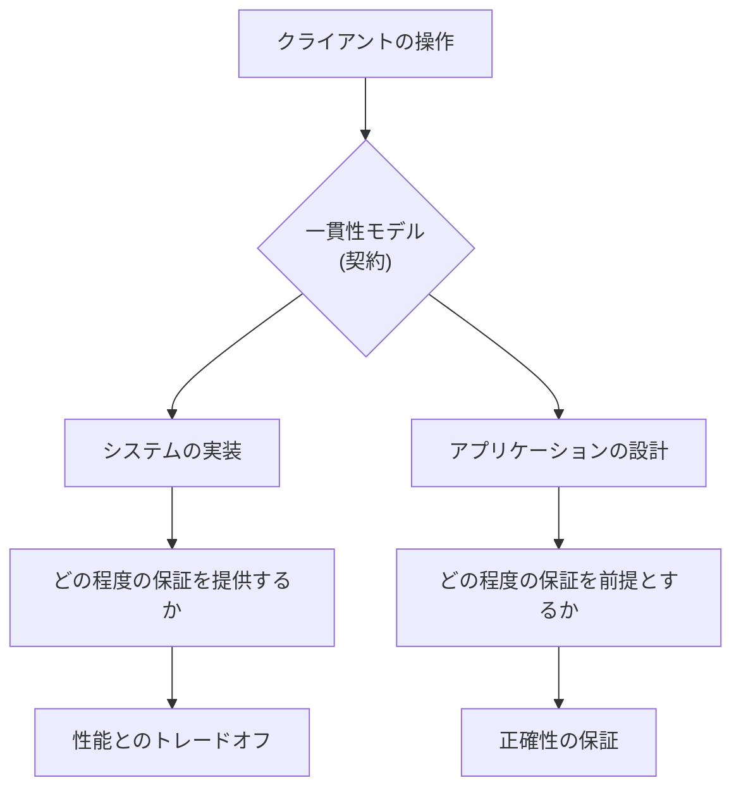

一貫性モデルの選択は、分散システムの設計における最も重要な意思決定のひとつである。強い一貫性を提供すれば、アプリケーション開発は単純になるが、性能とスケーラビリティが犠牲になる。弱い一貫性を許容すれば、高い性能と可用性が得られるが、アプリケーション側で整合性を管理する複雑なロジックが必要になる。

本記事では、分散システムにおける主要な一貫性モデルを、最も強い保証から最も弱い保証まで体系的に解説する。それぞれのモデルが何を保証し、何を保証しないのかを正確に理解することが、適切なシステム設計の第一歩である。

## 2. 一貫性モデルのスペクトル

一貫性モデルは、単一の二択ではなく、強さの異なる多数のモデルからなる**スペクトル**を形成する。以下の図は、主要な一貫性モデルをその強さに基づいて配置したものである。

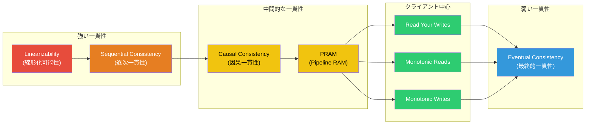

上から下に向かうほど、一貫性の保証は弱くなる。保証が弱くなるほど、実装の自由度が増し、一般に高い性能・可用性・スケーラビリティが実現可能になる。逆に、保証が強くなるほど、プログラマにとっての推論は容易になるが、実装上の制約が厳しくなる。

この階層構造において、上位のモデルは下位のモデルの性質をすべて満たす。例えば、Linearizabilityを満たすシステムは、Sequential ConsistencyもCausal Consistencyも自動的に満たす。

## 3. 線形化可能性（Linearizability）

### 3.1 定義

**Linearizability**（線形化可能性）は、最も強い一貫性モデルのひとつである。1990年にMaurice HerlihyとJeannette Wingが論文「Linearizability: A Correctness Condition for Concurrent Objects」で形式的に定義した。

Linearizabilityの核心は、以下の性質に集約される。

> **定義**（Linearizability）：
> 並行に実行されたすべての操作に対して、それらの操作が**ある全順序**で逐次的に実行されたかのように見え、かつ、各操作の**線形化点（linearization point）** が、その操作の呼び出し時刻と応答時刻の間に存在する。

これを直感的に言い換えると、次のようになる。

1. **原子性**：各操作は、ある瞬間に一瞬で実行されたかのように振る舞う
2. **リアルタイム順序の保存**：操作Aの応答が操作Bの呼び出しよりも前に返された場合、全順序においてAはBの前に配置される
3. **最新値の保証**：読み取りは常に、最後に完了した書き込みの結果を返す

### 3.2 線形化点の概念

線形化点とは、操作が「実効的に発生した」と見なされる時点である。各操作は、呼び出し（invocation）から応答（response）までの時間区間を持つが、線形化点はその区間内のある一点に存在しなければならない。

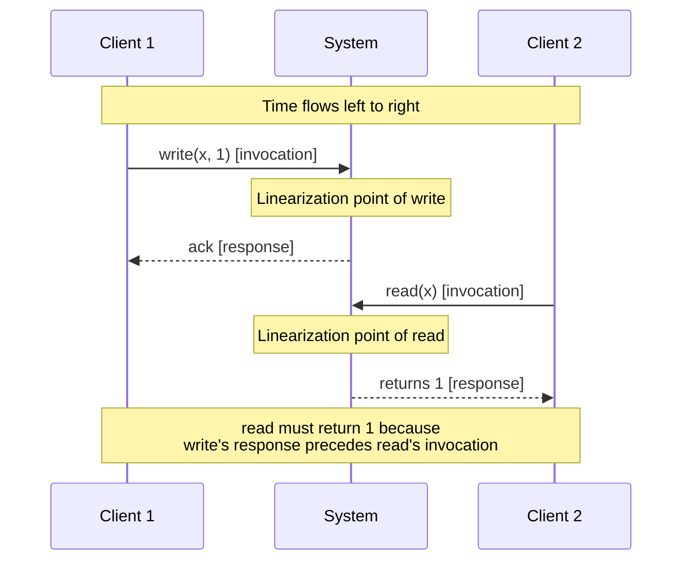

この図において、Client 1のwrite操作の応答がClient 2のread操作の呼び出しよりも前に返されている。Linearizabilityの下では、readはwriteの結果を反映した値（すなわち1）を返さなければならない。

### 3.3 並行操作の扱い

操作が時間的に重なる場合（一方の操作の区間内に他方の操作の区間が一部でも重なる場合）、それらは「並行」である。並行な操作については、どちらの線形化点が先であっても構わない。

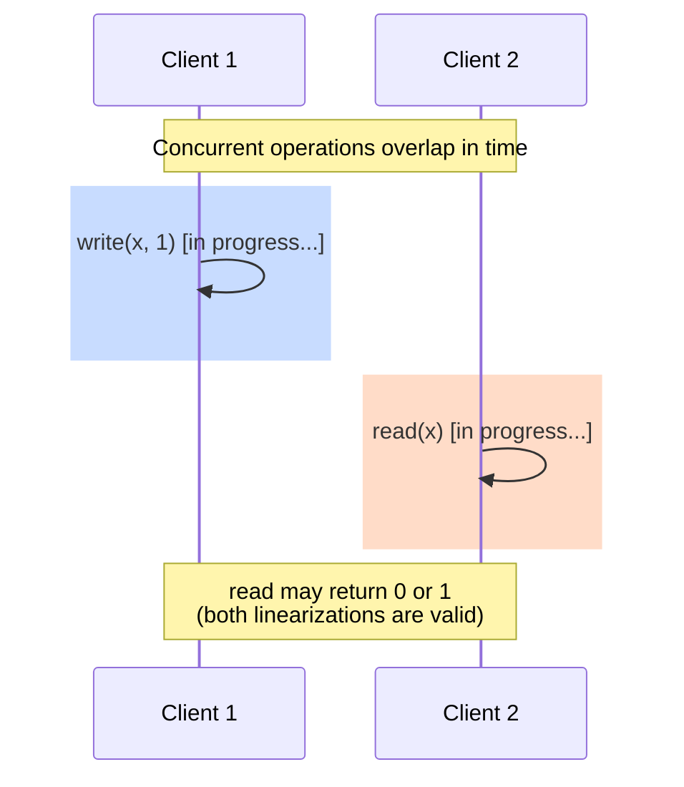

しかし、一度ある操作が完了した後に開始される操作については、厳密な順序が要求される。これがLinearizabilityの「リアルタイム」制約であり、Sequential Consistencyとの決定的な違いである。

### 3.4 Linearizabilityの実装

Linearizabilityを実現するための代表的な手法には、以下がある。

**コンセンサスプロトコルの利用**：Raft、Paxosなどのコンセンサスプロトコルを用いて、すべての操作をリーダーノード経由で順序付ける。リーダーが操作を受け付け、過半数のノードから確認を得た時点で操作を確定する。Google Spannerの厳密なSerializabilityはこのアプローチに基づいている。

**単一コーディネータ**：すべての読み書きを単一のノードに集約する。最も単純だが、そのノードが単一障害点（SPOF）となり、スケーラビリティも制限される。

**リース（Lease）ベースの手法**：リーダーに有限期間のリース（権限委譲）を付与し、リース期間中はリーダーのみが操作を処理する。リースが失効すると新しいリーダーが選出される。

### 3.5 Linearizabilityのコスト

Linearizabilityには高いコストが伴う。その根本的な理由は、CAP定理に関連している。

- **レイテンシ**：書き込みのたびに複数のノードに確認を取る必要があり、ネットワークラウンドトリップが発生する。地理的に分散したシステムでは、大陸間の通信遅延がそのままレイテンシに加算される
- **可用性**：ネットワーク分断時に、分断の片側はLinearizableな操作を処理できなくなる。CAP定理により、Partition Tolerance下でLinearizability（Consistency）とAvailabilityを同時に満たすことは不可能であるためだ
- **スループット**：すべての操作がリーダーを経由する必要がある場合、リーダーがボトルネックになる

### 3.6 Linearizabilityが重要なユースケース

上記のコストにもかかわらず、Linearizabilityが不可欠な場面がある。

- **リーダー選出**：複数のノードが同時にリーダーになることを防ぐためには、リーダーシップの取得がLinearizableである必要がある
- **分散ロック**：排他的なリソースアクセスを保証するためのロックは、Linearizableでなければ安全でない
- **一意性制約**：ユーザー名やメールアドレスの一意性を保証するためには、重複チェックと登録がLinearizableである必要がある
- **金融取引**：残高不足の状態での引き出しを防ぐためには、残高の読み取りと更新がLinearizableでなければならない

## 4. 逐次一貫性（Sequential Consistency）

### 4.1 定義

**Sequential Consistency**（逐次一貫性）は、1979年にLeslie Lamportが論文「How to Make a Multiprocessor Computer That Correctly Executes Multiprocess Programs」で定義した一貫性モデルである。元来はマルチプロセッサシステムのメモリモデルとして提案されたが、分散システムにも適用される。

> **定義**（Sequential Consistency）：
> すべての操作の結果が、すべてのプロセス（クライアント）の操作を**ある全順序**に並べた結果と一致し、かつ、**各プロセス内の操作順序**がその全順序において保存されている。

### 4.2 Linearizabilityとの違い

Sequential ConsistencyとLinearizabilityの決定的な違いは、**リアルタイム制約の有無**である。

- **Linearizability**：操作の全順序が、各操作の実際の実行時間と矛盾してはならない（リアルタイム制約）
- **Sequential Consistency**：各プロセス内の操作順序は保存されるが、異なるプロセス間の操作の相対的な順序は、実際の時間に基づかなくてよい

以下の例で違いを確認する。

```
Process 1: write(x, 1)  ──────────────────────  read(y) → 0
Process 2: write(y, 1)  ──────────────────────  read(x) → 0
```

この実行履歴は、Linearizabilityでは**許容されない**。write(x, 1)とwrite(y, 1)がどちらも完了した後にreadが行われているため、少なくとも一方のreadは1を返すはずだからである。

しかし、Sequential Consistencyでは**許容される**場合がある。以下のような全順序を構成できるためである。

```
read(y) → 0, read(x) → 0, write(x, 1), write(y, 1)
```

各プロセス内の操作順序（Process 1ではwriteがreadの前、Process 2でもwriteがreadの前）は保存されていないように見えるが、実はこれは上記の例では保存される構成が可能かどうかにかかる。実際のリアルタイム順序を無視できるため、Sequential Consistencyはより多くの実行履歴を「正当」とみなす。

### 4.3 プログラム順序の保存

Sequential Consistencyの核心は、**プログラム順序**（program order）の保存にある。各プロセスが発行した操作は、そのプロセスが発行した順序で全順序に現れなければならない。しかし、異なるプロセスの操作がどのようにインターリーブされるかについては制約がない。

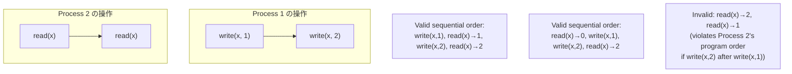

### 4.4 Sequential Consistencyの実装と利用

Sequential Consistencyは、Linearizabilityよりも弱い保証であるため、より効率的に実装できる場合がある。特に、操作の全順序をリアルタイム制約なしに決定できるため、バッチ処理やパイプライン処理との親和性が高い。

Apache ZooKeeperは、書き込みに対してはLinearizabilityを提供するが、読み取りに対してはSequential Consistencyのみを提供する。クライアントの読み取りは最寄りのレプリカから行われるため、最新の書き込みを反映していない可能性がある。ただし、同一クライアントの操作順序は保存される。

## 5. 因果一貫性（Causal Consistency）

### 5.1 定義と動機

**Causal Consistency**（因果一貫性）は、Sequential Consistencyよりもさらに弱い一貫性モデルだが、実用上非常に有用な保証を提供する。因果一貫性は、**因果的に関連する操作**の順序のみを保存し、因果的に無関係な操作については順序を規定しない。

> **定義**（Causal Consistency）：
> 因果的に先行する（happens-before関係にある）操作のペアについて、すべてのプロセスがその因果順序を同じように観測する。因果的に独立な操作については、異なるプロセスが異なる順序で観測してもよい。

因果一貫性の根底にあるのは、Lamportの**happens-before関係**である。操作Aの結果が操作Bに影響を与える場合、AとBは因果的に関連している。具体的には、以下の場合に操作AはBに因果的に先行する。

1. AとBが同一プロセスの操作であり、AがBの前に発行された
2. Aが書き込みであり、Bがその書き込みの結果を読み取る読み取りである
3. 上記の推移的閉包

### 5.2 因果一貫性の具体例

SNSにおける投稿とコメントを例に考える。

```
User A: post("明日の会議は中止です")           ... 操作 a
User B: read(A's post) → "明日の会議は中止です"  ... 操作 b (aに因果依存)
User B: comment("了解しました")                ... 操作 c (bに因果依存)
```

因果一貫性の下では、どのユーザーが見ても、操作aは操作cの前に観測されなければならない。「了解しました」というコメントが、元の投稿よりも先に表示されることは因果一貫性の違反である。

一方、以下のように因果的に独立な操作については順序の保証がない。

```
User A: post("今日は天気がいい")    ... 操作 p
User C: post("おすすめの本を紹介")  ... 操作 q
```

操作pとqは因果的に無関係であるため、あるユーザーにはpが先に見え、別のユーザーにはqが先に見えてもよい。

### 5.3 因果一貫性の実装

因果一貫性を実装するためには、操作間の因果関係を追跡する仕組みが必要である。代表的な手法として以下がある。

**ベクタークロック（Vector Clock）**：各プロセスが、すべてのプロセスの論理時計を保持するベクトルを管理する。操作にベクタークロックを付与し、因果的な先行関係をクロックの比較で判定する。

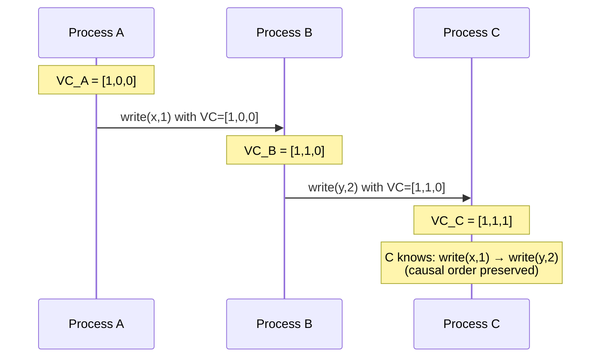

**明示的な依存関係追跡**：各操作が、自身が依存する操作のIDを明示的に記録する方式。CRDTベースのシステムで用いられることが多い。

### 5.4 因果一貫性の理論的意義：CAP定理との関係

因果一貫性が特に注目されるのは、CAP定理との関係においてである。2011年のMahajan, Alvisi, Dahlinによる論文「Consistency, Availability, and Convergence」は、以下の重要な結果を示した。

> 因果一貫性は、**可用性（Availability）を犠牲にせずに達成可能な最も強い一貫性モデル**である。

すなわち、ネットワーク分断が発生しても、因果一貫性を保ちつつすべてのリクエストに応答することが可能である。Linearizabilityの場合、CAP定理により、ネットワーク分断時にConsistencyとAvailabilityの一方を犠牲にしなければならない。しかし、因果一貫性はこの制約を受けない。これは、因果一貫性が「分散システムにおける一貫性のスイートスポット」と呼ばれる所以である。

## 6. 最終的一貫性（Eventual Consistency）

### 6.1 定義

**Eventual Consistency**（最終的一貫性）は、分散システムにおける最も弱い一貫性モデルのひとつである。

> **定義**（Eventual Consistency）：
> ある書き込みが行われた後、新たな書き込みが行われなければ、**いずれ**すべてのレプリカがその書き込みの結果を反映した状態に収束する。

「いずれ」という表現に明確な時間的上限はない。ネットワーク遅延が有限であれば最終的には収束するが、収束までの間は古い値や不整合な値が返される可能性がある。

### 6.2 最終的一貫性の保証と非保証

最終的一貫性が保証すること：

- **収束（Convergence）**：すべてのレプリカが最終的に同じ状態に到達する
- **持続性（Durability）**：一度書き込まれたデータは失われない（レプリケーションにより）

最終的一貫性が**保証しないこと**：

- **読み取りの新鮮さ**：ある書き込みの直後に行われた読み取りが、その書き込みを反映している保証はない
- **読み取りの単調性**：ある時点でnewしい値を読んだ後、古い値が返される可能性がある（読み取り先のレプリカが異なる場合）
- **操作の順序保証**：異なるクライアントの操作が、すべてのレプリカで同じ順序で適用される保証はない

### 6.3 コンフリクトの解決

最終的一貫性のシステムでは、複数のレプリカが独立に書き込みを受け付けるため、**コンフリクト（書き込み衝突）** が発生しうる。コンフリクト解決の代表的な戦略は以下のとおりである。

**Last Writer Wins（LWW）**：タイムスタンプが最も新しい書き込みを採用する。Amazon DynamoDBのデフォルト戦略である。シンプルだが、データの喪失が生じるリスクがある。

**アプリケーション側での解決**：複数のバージョンをすべて保持し、アプリケーション側でマージロジックを実装する。Amazon Dynamoの元論文で提案されたアプローチであり、ショッピングカートの例が有名である。

**CRDT（Conflict-free Replicated Data Type）**：数学的にコンフリクトフリーであることが保証されたデータ構造を使用する。G-Counter（成長のみのカウンター）、OR-Set（追加・削除が可能な集合）などが代表例である。

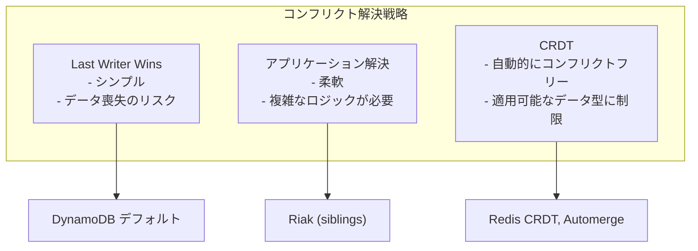

### 6.4 最終的一貫性の実用性

最終的一貫性が適切なユースケースは多い。

- **SNSのタイムライン**：投稿の表示順が数秒ずれても、ユーザー体験に深刻な影響はない
- **アクセスカウンター**：ページビュー数のわずかな不一致は許容できる
- **DNS**：DNSレコードの変更がすべてのリゾルバに伝播するまで時間がかかるが、最終的には整合する
- **CDN上のキャッシュ**：キャッシュの無効化が全エッジに伝播するまでの短い不整合は許容される

## 7. クライアント中心一貫性モデル

最終的一貫性は保証が弱すぎるが、強い一貫性はコストが高すぎる。この間を埋めるのが**クライアント中心一貫性モデル**（Client-Centric Consistency Models）である。これらのモデルは、**個々のクライアントの視点**から見たときの一貫性を保証する。

### 7.1 Read Your Writes

**Read Your Writes**（自分の書き込みを読める）は、最も直感的に理解しやすいクライアント中心一貫性モデルである。

> **定義**（Read Your Writes）：
> あるクライアントが値を書き込んだ後、同じクライアントの後続の読み取りは、少なくともその書き込みの結果（またはそれ以降の値）を返す。

この保証がないシステムでは、以下のような奇妙な振る舞いが起こりうる。

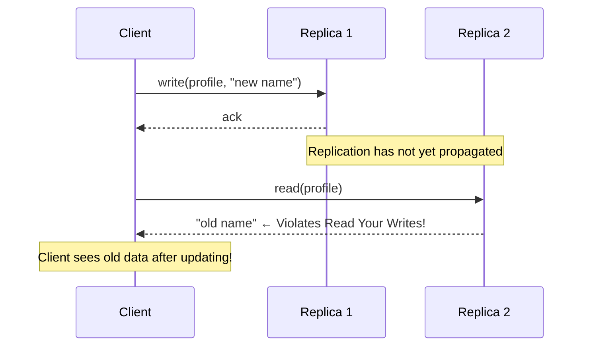

ユーザーがプロフィールを更新した直後にページをリロードしたら、古いプロフィールが表示される。これはユーザーにとって非常に混乱を招く状況であり、Read Your Writesの保証がない場合に起こりうる。

**実装手法**：
- **セッションスティッキネス**：同一クライアントのリクエストを常に同じレプリカにルーティングする。ただし、そのレプリカが障害を起こすとフェイルオーバー先では保証が崩れる
- **バージョンの追跡**：クライアントが最後に書き込んだバージョン番号を保持し、読み取り時にそのバージョン以降のデータを要求する

### 7.2 Monotonic Reads

**Monotonic Reads**（単調読み取り）は、読み取りの結果が時間とともに「巻き戻らない」ことを保証する。

> **定義**（Monotonic Reads）：
> あるクライアントが値vを読み取った後、同じクライアントの後続の読み取りは、v以降のバージョン（vと同じかそれより新しい値）を返す。

この保証がないと、以下のような問題が起こる。

```
Client reads from Replica A: x = 42 (version 5)
Client reads from Replica B: x = 37 (version 3)  ← Violates Monotonic Reads!
```

クライアントが一度「新しい」データを見た後に「古い」データを見ると、データが巻き戻ったように見える。例えば、メールの受信箱に新しいメールが表示された後、ページをリロードしたらそのメールが消えて見える、という状況である。

### 7.3 Monotonic Writes

**Monotonic Writes**（単調書き込み）は、同一クライアントの書き込みがすべてのレプリカで同じ順序で適用されることを保証する。

> **定義**（Monotonic Writes）：
> あるクライアントの書き込みW1の後に行われた書き込みW2は、W1が適用されたすべてのレプリカにおいて、W1の後にW2が適用される。

この保証がないと、以下のような問題が起こりうる。例えば、ソフトウェアのアップデートにおいて、パッチAの適用後にパッチBを適用する場合、パッチBがパッチAの変更に依存していれば、適用順序の逆転は破壊的な結果をもたらす。

### 7.4 Writes Follow Reads

**Writes Follow Reads**は、読み取りに基づく書き込みの因果関係を保存する。

> **定義**（Writes Follow Reads）：
> あるクライアントが値vを読み取った後に書き込みWを行った場合、Wはvの書き込みの後に順序付けられる。

これは、因果一貫性の部分的な実現とも見なせる。掲示板の返信を例にとると、元の投稿を読んでから返信を書いた場合、すべてのレプリカで返信が元の投稿の後に配置されることを保証する。

## 8. 強い一貫性と弱い一貫性のトレードオフ

### 8.1 トレードオフの本質

一貫性モデルの選択は、本質的に以下の三つの要素間のトレードオフである。

| 要素 | 強い一貫性 | 弱い一貫性 |
|------|-----------|-----------|
| レイテンシ | 高い（ノード間の調整が必要） | 低い（ローカルで応答可能） |
| 可用性 | 低い（分断時に応答不能） | 高い（分断時も応答可能） |
| プログラミングの容易さ | 容易（単一ノードと同等） | 困難（不整合を処理する必要） |
| スループット | 制限される | 高い |
| 地理的分散 | コストが高い | 自然に対応可能 |

### 8.2 なぜトレードオフが生じるのか

このトレードオフの根本的な原因は、**光速の有限性**と**障害の不可避性**にある。

地理的に離れた二つのデータセンター間の通信には、物理的な最小遅延が存在する。東京とニューヨーク間のラウンドトリップ時間は物理的に約70ミリ秒（光速の約2/3の速度でファイバーを伝搬する場合）であり、これを短縮することは不可能である。

強い一貫性を保証するためには、書き込みのたびにすべてのレプリカ（または過半数のレプリカ）からの確認を待つ必要がある。この確認を待つ時間がレイテンシに直接影響する。一方、弱い一貫性のシステムでは、書き込みをローカルレプリカに記録した時点で応答を返し、他のレプリカへの伝播は非同期で行える。

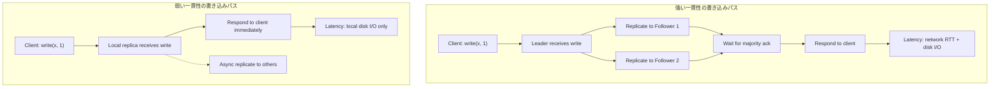

### 8.3 混合一貫性（Mixed Consistency）

実際のシステムでは、すべてのデータに同じ一貫性モデルを適用する必要はない。操作やデータの種類に応じて異なる一貫性レベルを使い分ける**混合一貫性**（Mixed Consistency）が一般的である。

例えば、Eコマースシステムにおいて：

- **在庫数量**：Linearizableにすることで、在庫がゼロの商品を販売するリスクを排除する
- **商品レビュー**：Eventual Consistencyで十分。レビューの表示が数秒遅れても問題ない
- **ショッピングカート**：Read Your Writesを保証し、ユーザーが追加した商品が即座に表示されるようにする
- **注文履歴**：Monotonic Readsを保証し、注文履歴が巻き戻らないようにする

## 9. CAP定理との関係

### 9.1 CAP定理の復習

CAP定理は、ネットワーク分断（Partition）が発生した場合、分散システムは一貫性（Consistency）と可用性（Availability）のいずれかを犠牲にしなければならないことを示す。ここでの「一貫性」はLinearizabilityに相当する。

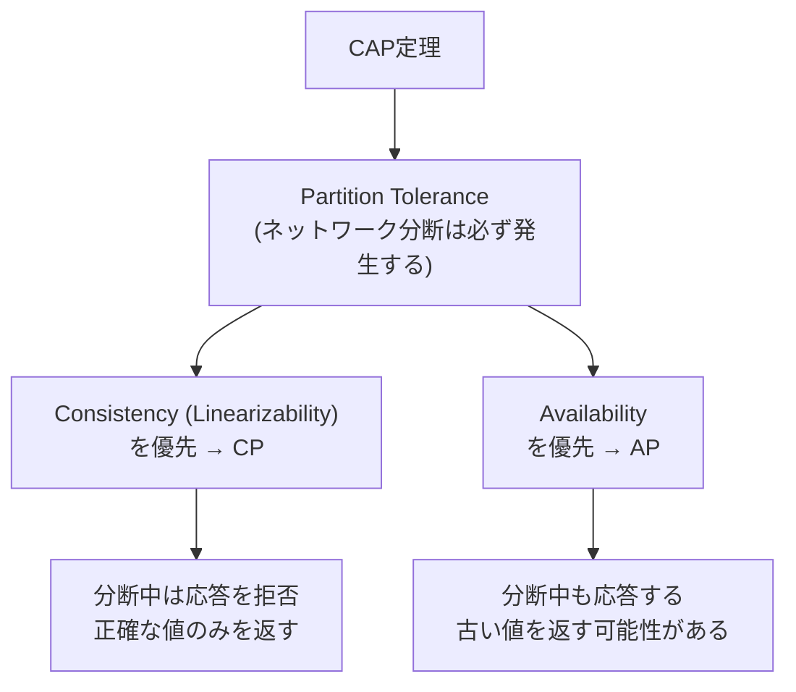

### 9.2 一貫性モデルとCAP定理の対応

CAP定理の「一貫性」はLinearizabilityを指すが、すべての一貫性モデルがCAP定理の制約を受けるわけではない。

| 一貫性モデル | CAP定理の制約を受けるか | 理由 |
|-------------|----------------------|------|
| Linearizability | はい | CAP定理はLinearizabilityに対して証明されている |
| Sequential Consistency | はい | リアルタイム制約は弱いが、全順序の要求がAvailabilityと両立しない |
| Causal Consistency | **いいえ** | 可用性を維持しながら達成可能 |
| Eventual Consistency | **いいえ** | 可用性を維持しながら達成可能 |

この結果は直感的にも理解できる。因果一貫性以下のモデルでは、各レプリカが独立に操作を受け付け、因果順序さえ保存すれば整合性が保たれる。このため、ネットワーク分断時にも各レプリカが単独で応答を返すことが可能である。

### 9.3 PACELC定理との統合

Daniel Abadiが提唱したPACELC定理は、CAP定理を拡張して、ネットワーク分断が**発生していない**通常時のトレードオフも考慮する。

> **PACELC**：
> ネットワーク**P**artition時には**A**vailabilityと**C**onsistencyのトレードオフがあり、
> **E**lse（通常時）には**L**atencyと**C**onsistencyのトレードオフがある。

PACELC定理は、一貫性モデルの選択が通常時においてもレイテンシに影響を与えることを明示的に捉えている。例えば、Google SpannerはPC/ECシステム（分断時はConsistencyを優先し、通常時もConsistencyを優先するがレイテンシが高い）であり、Amazon DynamoDBのデフォルト設定はPA/ELシステム（分断時はAvailabilityを優先し、通常時は低レイテンシを優先する）である。

## 10. Jepsenテストによる一貫性の検証

### 10.1 Jepsenとは何か

**Jepsen**は、Kyle Kingsburyが開発した、分散システムの一貫性をテストするためのフレームワークである。Jepsenは、ネットワーク分断、ノード障害、クロックスキューなどの障害を意図的に注入しながら、システムが主張する一貫性保証を実際に満たしているかどうかを検証する。

Jepsenテストの基本的な手順は以下のとおりである。

1. **セットアップ**：分散システムのクラスタをデプロイする
2. **ワークロードの実行**：複数のクライアントが並行に読み書きを行う
3. **障害の注入**：ネットワーク分断、ノードクラッシュ、プロセスの一時停止（pause）などをランダムに注入する
4. **履歴の収集**：すべての操作の呼び出しと応答を記録する
5. **検証**：収集した履歴が、システムが主張する一貫性モデルの仕様に合致するかを検証する

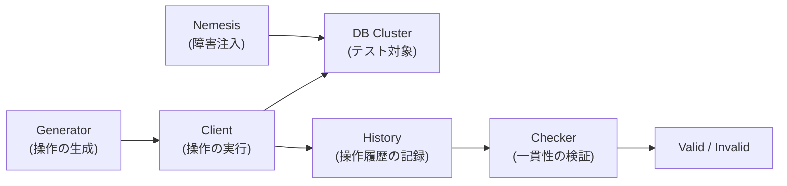

### 10.2 Linearizabilityの検証

Jepsenが一貫性を検証する際に中核となるのは、**Linearizability checker**である。収集された操作履歴に対して、その履歴がLinearizableであるかどうかを判定する。

この判定問題は、一般にはNP完全であることが知られている。しかし、実用的な操作数の範囲では、Knossos（JepsenのLinearizability checker）やPorcupineなどのアルゴリズムが効率的に動作する。

### 10.3 Jepsenが発見した有名な不具合

Jepsenテストは、多くの著名な分散システムにおいて、公称の一貫性保証に反する振る舞いを発見してきた。

- **MongoDB 3.4.0-rc3**：レプリカセットにおいて、ネットワーク分断時に古い値を返す場合があり、公称の読み取り一貫性保証に違反していた
- **CockroachDB**：特定の条件下でSerializableなトランザクション分離レベルの保証が崩れるケースが発見された
- **Redis Sentinel**：フェイルオーバー中にデータの喪失が発生しうることが確認された
- **etcd 3.4.3**：特定のネットワーク分断パターンにおいてLinearizabilityの違反が発見された

これらの発見は、一貫性の保証が「正しく実装すること」がいかに困難であるかを示している。

## 11. TLA+による形式的検証

### 11.1 TLA+と一貫性モデル

**TLA+**（Temporal Logic of Actions）は、Leslie Lamportが設計した形式仕様記述言語である。分散システムの設計を数学的に記述し、その正確性をモデル検査器（TLC）で網羅的に検証することができる。

一貫性モデルの文脈では、TLA+を用いて以下のことが可能である。

- 一貫性モデルの仕様を厳密に記述する
- 分散アルゴリズムが特定の一貫性モデルを満たすことを検証する
- 一貫性モデルの違反を引き起こす具体的な実行パスを発見する

### 11.2 Linearizabilityの TLA+ 仕様の概要

Linearizabilityの仕様をTLA+で表現するための基本的なアイデアは、以下のとおりである。

```
(* Simplified sketch of linearizability in TLA+ *)
VARIABLES history, linearization

(* An operation is a pair of invocation and response *)
(* A linearization is a total order on completed operations *)
(* The system satisfies linearizability if there exists *)
(* a linearization such that: *)
(*   1. The linearization respects real-time order *)
(*   2. The linearization is consistent with a sequential spec *)

LinearizabilityInvariant ==
    \E lin \in Linearizations(history):
        /\ RespectsRealTimeOrder(lin, history)
        /\ IsConsistentWithSequentialSpec(lin)
```

TLA+による形式的検証は、Jepsenによるブラックボックステストを補完する手法である。Jepsenがランダムなテストケースで不具合を発見するのに対し、TLA+は状態空間を網羅的に探索して設計上の欠陥を発見する。

### 11.3 実際のシステムでの採用

AmazonはDynamoDB、S3、EBSなどの主要サービスの設計においてTLA+を活用していることを公表している。2014年のAmazon Web Servicesの論文「Use of Formal Methods at Amazon Web Services」では、TLA+によって複数の微妙なバグが設計段階で発見されたことが報告されている。

また、CosmosDBの一貫性モデルの検証にもTLA+が使用されており、提供する5つの一貫性レベル（Strong, Bounded Staleness, Session, Consistent Prefix, Eventual）がそれぞれの仕様を正しく満たすことを形式的に検証している。

## 12. 実際のシステムにおける一貫性モデルの採用

### 12.1 Google Spanner：外部一貫性（External Consistency）

Google Spannerは、地理的に分散した分散データベースとして、**外部一貫性（External Consistency）** を提供する。外部一貫性はLinearizabilityと同等であり、分散トランザクションのSerializabilityと組み合わせることで、Strict Serializability（最も強いトランザクション分離レベル）を実現する。

Spannerがこの強い保証を実現できる鍵は、**TrueTime API**にある。TrueTimeは、GPS受信機とアトミッククロックを組み合わせた高精度な時計サービスであり、時刻の不確実性の上限を明示的に提供する。Spannerは、トランザクションのコミット時にTrueTimeの不確実性区間分だけ待機することで、コミットのタイムスタンプが確実に因果順序を反映するようにしている。

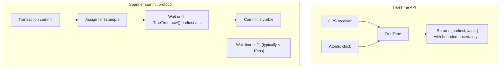

この設計により、SpannerはCAP定理におけるCPシステムとして、Linearizabilityを保証する。ただし、ネットワーク分断時には可用性が制限される。

### 12.2 Amazon DynamoDB：設定可能な一貫性

Amazon DynamoDBは、読み取りに対して二つの一貫性レベルを提供する。

- **Eventually Consistent Read（デフォルト）**：最終的一貫性の読み取り。最も近いレプリカから読み取るため、レイテンシが低い。書き込み後1秒以内にすべてのレプリカに反映されることが通常だが、保証はない
- **Strongly Consistent Read**：書き込みが反映された最新のデータを返す。リーダーレプリカからの読み取りが必要で、レイテンシが高く、ネットワーク分断時には利用できない場合がある

DynamoDBの**Global Tables**では、マルチリージョンのレプリケーションが行われ、各リージョンが独立に書き込みを受け付ける。この場合、リージョン間の一貫性は最終的一貫性となり、Last Writer Wins方式でコンフリクトが解決される。

### 12.3 CockroachDB：Serializability

CockroachDBは、PostgreSQL互換の分散SQLデータベースであり、Serializable分離レベルのトランザクションを提供する。デフォルトではSerializableを採用しており、これは実質的にLinearizable Readと組み合わされている。

CockroachDBは、タイムスタンプオーダリングに基づくMVCC（Multi-Version Concurrency Control）を使用する。HLC（Hybrid Logical Clock）を用いてトランザクションにタイムスタンプを付与し、並行トランザクション間の一貫性を保証する。コンフリクトが検出された場合はトランザクションをリトライする。

### 12.4 Azure Cosmos DB：5段階の一貫性レベル

Azure Cosmos DBは、一貫性モデルのスペクトルを最も明示的に製品化したデータベースである。以下の5段階の一貫性レベルをユーザーが選択できる。

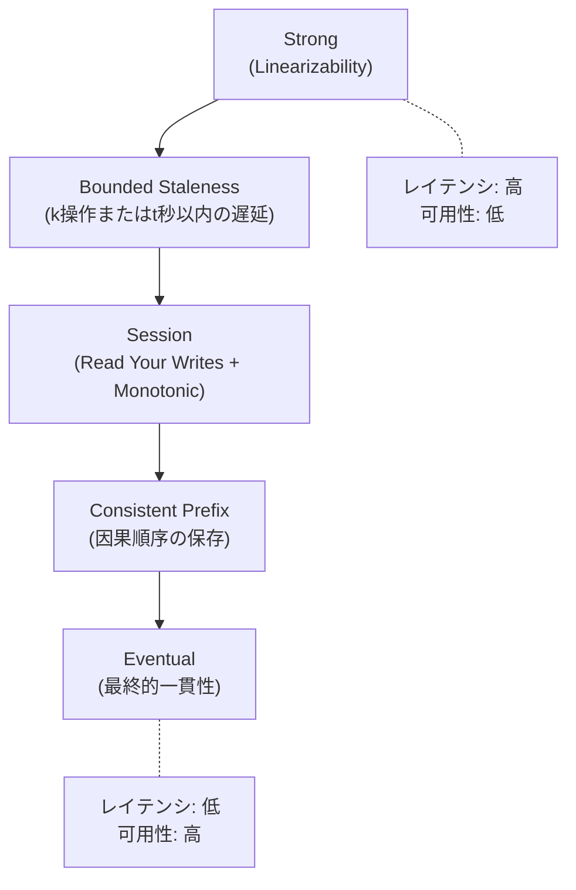

1. **Strong**：Linearizabilityを保証。読み取りは常に最新のコミット済み値を返す
2. **Bounded Staleness**：読み取りが最新の書き込みからk操作（またはt秒）以内であることを保証する。同一リージョン内ではLinearizabilityに近い保証を提供する
3. **Session**：同一セッション内でRead Your Writes、Monotonic Reads、Monotonic Writes、Writes Follow Readsを保証する。Cosmos DBの**デフォルト設定**
4. **Consistent Prefix**：書き込みが行われた順序で読み取られることを保証する。因果順序の保存に近い
5. **Eventual**：最も弱い保証。読み取りは任意の古い値を返す可能性がある

Cosmos DBの設計は、「一貫性は二者択一ではなくスペクトルである」という考え方を最も忠実に体現している。ユーザーがワークロードの特性に応じて適切な一貫性レベルを選択できるため、コストと性能の最適化が可能になる。

### 12.5 etcd：Linearizable Reads

etcdは、KubernetesのバックエンドストアとしてKeyとValueを管理する分散KVストアであり、Raftコンセンサスプロトコルに基づいてLinearizabilityを保証する。

etcdでは、書き込みは常にRaftリーダーを経由し、過半数のノードからの確認を待ってコミットされる。読み取りについては、以下の二つのモードが提供される。

- **Linearizable Read（デフォルト）**：リーダーが読み取りリクエストを受信した時点で自身がまだリーダーであることを確認する（ReadIndex方式、またはリース方式）。これによりLinearizabilityが保証される
- **Serializable Read**：最寄りのノードから読み取る。古い値が返される可能性があるが、レイテンシが低い

### 12.6 各システムの一貫性モデル比較

| システム | デフォルトの一貫性 | 最強の一貫性 | コンフリクト解決 |
|---------|------------------|-------------|----------------|
| Google Spanner | External Consistency | External Consistency | ロックベース |
| Amazon DynamoDB | Eventual | Strong (単一テーブル) | Last Writer Wins |
| CockroachDB | Serializable | Serializable | トランザクションリトライ |
| Azure Cosmos DB | Session | Strong | 設定可能（LWW等） |
| etcd | Linearizable | Linearizable | Raft consensus |
| Apache Cassandra | ONE (Eventual) | ALL (Strong) | Last Writer Wins / LWW |
| MongoDB | Local (Eventual) | Linearizable | ドキュメントレベルロック |

## 13. 一貫性モデルの形式的な階層関係

### 13.1 包含関係

一貫性モデルの間には、厳密な包含関係が成立する。以下の関係を理解することは、システム設計においてどの保証が「無料で」ついてくるかを判断するために重要である。

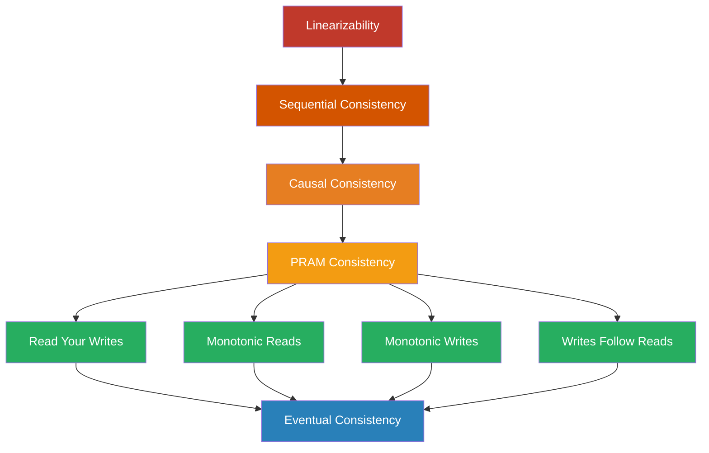

この図において、矢印は「包含」関係を表す。Linearizabilityを満たすすべての実行履歴はSequential Consistencyも満たし、Sequential Consistencyを満たすすべての実行履歴はCausal Consistencyも満たす。

### 13.2 分離定理と不可能性

各一貫性モデルの間には、分離する実行履歴が存在する。すなわち、下位のモデルを満たすが上位のモデルを満たさない実行履歴が具体的に構成できる。

**Sequential ConsistencyだがLinearizabilityではない例**：

```
Real-time order:
  Process 1: write(x, 1) completes at t=1
  Process 2: read(x) starts at t=2, returns 0

Sequential order: read(x) → 0, write(x, 1)
  This respects program order of each process
  But violates real-time ordering
```

**Causal ConsistencyだがSequential Consistencyではない例**：

```
Process 1: write(x, 1)
Process 2: write(x, 2)
Process 3: read(x) → 1, read(x) → 2
Process 4: read(x) → 2, read(x) → 1

No single total order satisfies both Process 3 and Process 4,
so this is not sequentially consistent.
But if write(x,1) and write(x,2) are causally independent,
each process can observe them in any order,
so causal consistency is not violated.
```

## 14. 実装上の考慮事項

### 14.1 一貫性とパフォーマンスの定量的関係

一貫性のレベルがパフォーマンスに与える影響を定量的に理解することは、実務上重要である。以下は、3ノードクラスタにおける典型的な特性の比較である。

| 一貫性レベル | 書き込みレイテンシ | 読み取りレイテンシ | 分断時の可用性 |
|-------------|------------------|------------------|--------------|
| Linearizable | 2 * RTT + fsync | 1 * RTT (quorum read) | 過半数のみ |
| Sequential | 2 * RTT + fsync | local read可能 | 過半数のみ |
| Causal | 1 * RTT + fsync | local read可能 | 全ノード |
| Eventual | fsync のみ | local read | 全ノード |

ここで、RTTはノード間のネットワークラウンドトリップ時間である。同一データセンター内ではRTTは通常0.5ms未満だが、地理的に分散した場合は数十msから数百msになりうる。

### 14.2 クォーラム（Quorum）と一貫性

分散システムにおいて、一貫性レベルを制御するための基本的な仕組みが**クォーラム**である。N個のレプリカのうち、書き込み時にW個のレプリカからの確認を待ち、読み取り時にR個のレプリカから値を取得する。

以下の条件を満たすとき、強い一貫性（Linearizability）が保証される。

$$W + R > N$$

この条件は、書き込みクォーラムと読み取りクォーラムの間に必ず重複するノードが存在することを保証する。少なくとも一つのノードが最新の書き込みを保持しているため、読み取りは最新の値を取得できる。

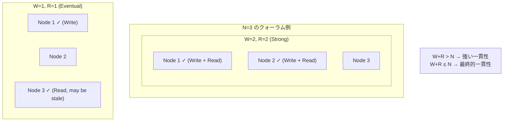

一般的な設定として、N=3, W=2, R=2（過半数クォーラム）が使われる。この場合、1ノードの障害に耐えつつ強い一貫性を提供できる。一方、N=3, W=1, R=1とすれば、最終的一貫性となるが、レイテンシが最小化される。

### 14.3 リードリペア（Read Repair）とアンチエントロピー

最終的一貫性のシステムにおいて、レプリカ間のデータの不整合を修復するための仕組みが重要である。

**Read Repair**：クライアントがクォーラム読み取りを行った際、レプリカ間でデータのバージョンが異なることを検出した場合、最新のデータを古いレプリカに書き戻す。CassandraやDynamoDBで採用されている。

**Anti-Entropy（アンチエントロピー）**：バックグラウンドプロセスがレプリカ間のデータを定期的に比較し、不整合を修復する。Merkle Treeを用いて効率的に差分を検出することが一般的である。

## 15. まとめと設計指針

### 15.1 一貫性モデル選択のフレームワーク

一貫性モデルの選択は、以下の問いに基づいて行うべきである。

1. **データの不整合はどの程度許容できるか**：金融データのように不整合が致命的な場合はLinearizabilityが必要であり、SNSの「いいね」数のように多少の不整合が許容される場合はEventual Consistencyで十分である

2. **レイテンシの要件は何か**：リアルタイム性が求められるアプリケーションでは、強い一貫性のコストが許容できない場合がある。地理的に分散したユーザーベースを持つサービスでは、レイテンシの制約が特に厳しい

3. **可用性の要件は何か**：99.99%以上の可用性が求められる場合、ネットワーク分断時にも応答可能な弱い一貫性モデルが適切である

4. **プログラマの認知負荷はどの程度許容できるか**：強い一貫性はプログラミングを単純化するが、弱い一貫性ではアプリケーション側で整合性を管理するロジックが必要になる

### 15.2 実践的な推奨事項

**デフォルトはSession Consistencyから始める**：多くのアプリケーションにおいて、Read Your WritesとMonotonic Readsの保証があれば、ユーザーにとって「自然な」振る舞いが実現できる。Cosmos DBがSession Consistencyをデフォルトとしているのは、この判断に基づいている。

**必要な箇所でのみ強い一貫性に昇格する**：一意性制約、分散ロック、金融取引など、正確性が絶対に必要な操作に対してのみLinearizabilityを適用する。

**Jepsenテストまたはそれに類するテストを実施する**：一貫性の保証は、実装が正しい場合にのみ成り立つ。障害注入テストを通じて、実装が仕様を満たしていることを継続的に検証する。

**一貫性の保証をドキュメント化する**：APIの利用者に対して、各操作がどのような一貫性を提供するかを明確にドキュメント化する。暗黙の前提に依存すると、システムの進化に伴って不具合が生じるリスクがある。

### 15.3 おわりに

一貫性モデルは、分散システムの設計における最も基本的な概念のひとつであると同時に、最も誤解されやすい概念でもある。「一貫性がある」「一貫性がない」という二値的な思考ではなく、一貫性のスペクトルの中から、アプリケーションの要件に最も適したポイントを選択することが重要である。

Linearizabilityは理想的だが、物理法則が課す制約（光速の有限性、障害の不可避性）のために、常に実現可能ではない。最終的一貫性はスケーラブルだが、プログラマに大きな認知負荷を課す。因果一貫性は、可用性を犠牲にせずに達成可能な最も強い一貫性として、理論と実践の接点に位置する。

分散システムの設計者として重要なのは、各一貫性モデルが何を保証し、何を保証しないのかを正確に理解したうえで、トレードオフを意識的に選択することである。そして、選択した一貫性モデルが正しく実装されていることを、Jepsenテストやtla+による形式検証を通じて継続的に確認することが、信頼性の高いシステムを構築するための礎となる。
