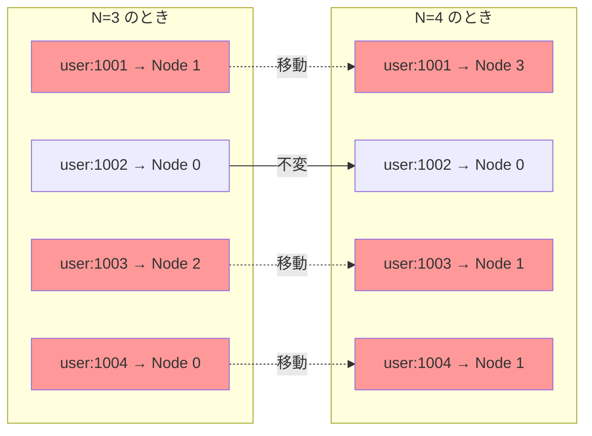
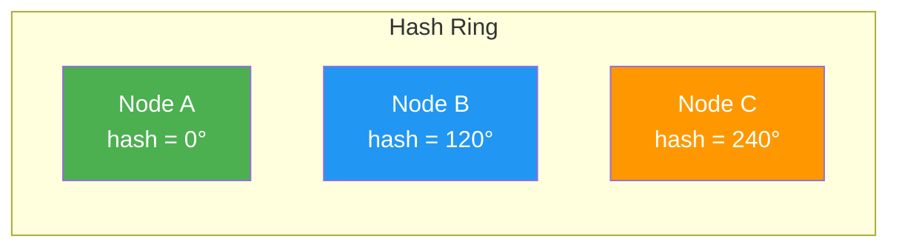
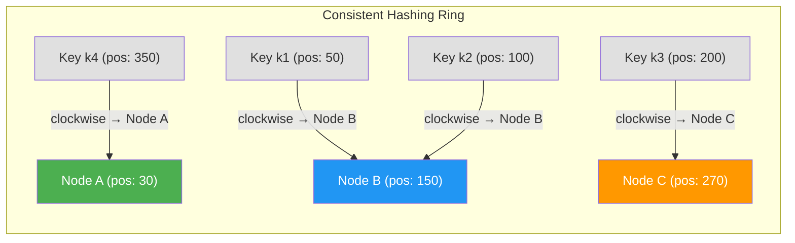
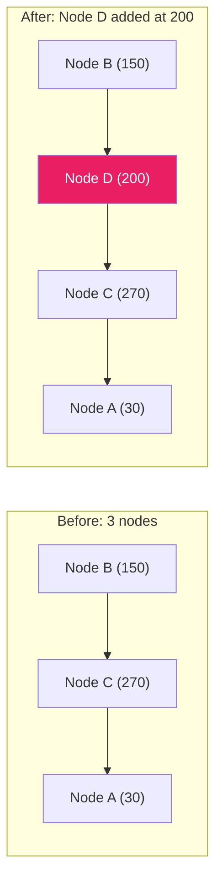
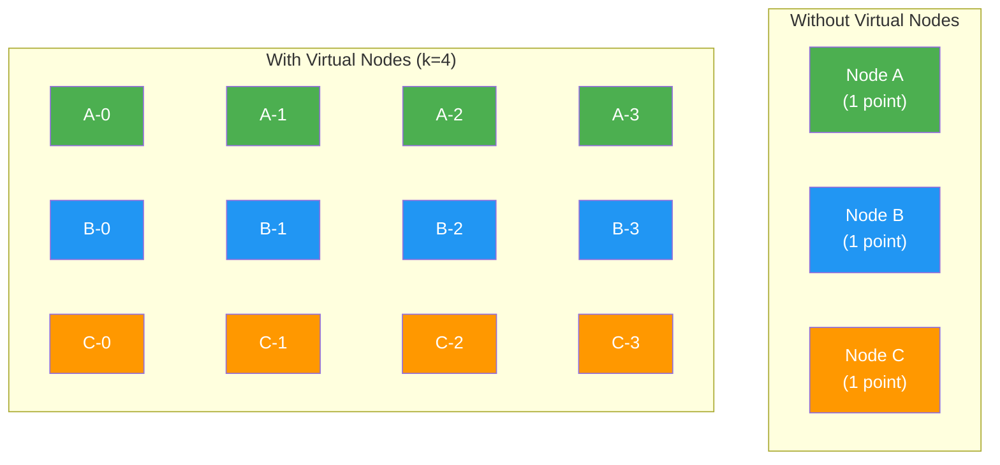
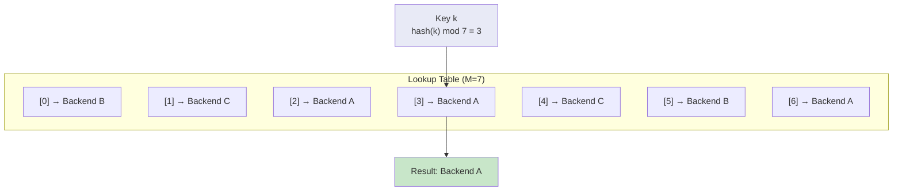
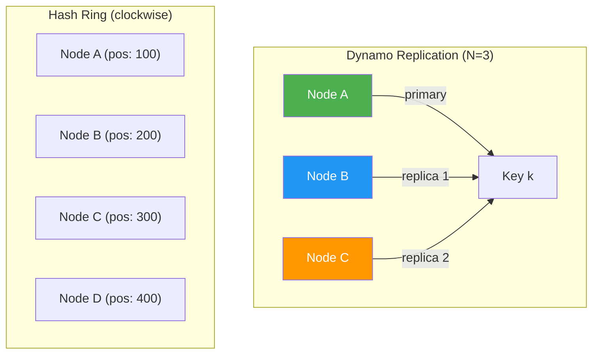

# Consistent Hashing — 分散システムにおけるデータ配置の技法

## 1. はじめに：なぜデータ配置が問題になるのか

分散システムにおいて、データを複数のノードに分散して格納することは、スケーラビリティと可用性を実現するための基本戦略である。しかし、「どのデータをどのノードに配置するか」という問いは、一見単純でありながら、実際には極めて奥深い設計課題を含んでいる。

例えば、分散キャッシュシステムを考えてみよう。Webアプリケーションの背後に複数のmemcachedサーバーを並べ、ユーザーからのリクエストに対してキャッシュヒット率を最大化したいとする。あるキーに対するリクエストが来たとき、そのキーが格納されているサーバーを素早く特定できなければならない。すべてのサーバーに問い合わせるのは論外であるから、キーからサーバーへの**決定論的なマッピング**が必要になる。

最も素朴なアプローチは、ハッシュ値をサーバー数で割った余りを使う方法である。しかし、この方法にはサーバーの追加・削除時に致命的な問題がある。この問題を優雅に解決する技法が、1997年にDavid Kargerらによって提案された**Consistent Hashing**である。

Consistent Hashingは、分散キャッシュの文脈で生まれたが、その適用範囲は遥かに広い。Amazon DynamoDB、Apache Cassandra、Akka Cluster、Discordのメッセージルーティングなど、現代の分散システムの至るところで採用されている。本記事では、Consistent Hashingの基本原理から派生手法、実世界での採用事例、そして実装上の考慮事項までを包括的に解説する。

## 2. 単純なハッシュ分割（mod N）の問題点

### 2.1 mod N 方式の基本

最も直感的なデータ分割方式は、キーのハッシュ値をノード数 $N$ で割った余りを使ってノードを決定する方法である。

$$
\text{node}(key) = \text{hash}(key) \mod N
$$

例えば、3台のサーバー（Node 0, Node 1, Node 2）がある場合を考えてみよう。

```
hash("user:1001") = 7   → 7 mod 3 = 1  → Node 1
hash("user:1002") = 12  → 12 mod 3 = 0 → Node 0
hash("user:1003") = 5   → 5 mod 3 = 2  → Node 2
hash("user:1004") = 9   → 9 mod 3 = 0  → Node 0
hash("user:1005") = 14  → 14 mod 3 = 2 → Node 2
hash("user:1006") = 3   → 3 mod 3 = 0  → Node 0
```

この方式は実装が極めて簡単であり、ハッシュ関数が一様分布を生成するならば、各ノードへのデータ配分もおおむね均等になる。ノード数が固定である限り、この方式は合理的に機能する。

### 2.2 ノード数変更時の破綻

問題は、ノード数が変わったときに顕在化する。サーバーを1台追加して $N = 3$ から $N = 4$ に変更した場合を見てみよう。

```
hash("user:1001") = 7   → 7 mod 4 = 3  → Node 3 (was Node 1)
hash("user:1002") = 12  → 12 mod 4 = 0 → Node 0 (unchanged)
hash("user:1003") = 5   → 5 mod 4 = 1  → Node 1 (was Node 2)
hash("user:1004") = 9   → 9 mod 4 = 1  → Node 1 (was Node 0)
hash("user:1005") = 14  → 14 mod 4 = 2 → Node 2 (unchanged)
hash("user:1006") = 3   → 3 mod 4 = 3  → Node 3 (was Node 0)
```

6つのキーのうち4つ（約67%）が異なるノードに再マッピングされている。これは偶然ではない。一般に、$N$ 台から $N+1$ 台への変更では、平均して全キーの $\frac{N}{N+1}$ の割合が再マッピングされる。$N$ が大きいほどこの割合は1に近づき、ほぼ全データの移動が必要になる。



### 2.3 実運用への影響

このような大量の再マッピングは、実運用において以下の深刻な問題を引き起こす。

**キャッシュミスの嵐（Thundering Herd）**: 分散キャッシュにおいてノードを追加した瞬間、ほぼすべてのキャッシュが無効化される。すべてのリクエストがバックエンドのデータベースに到達し、過負荷を引き起こす。

**大量のデータ移行**: 分散ストレージにおいてノードを追加・削除するたびに、全データの大部分を再配置しなければならない。ネットワーク帯域を圧迫し、移行中のサービス品質が低下する。

**非段階的なスケーリング**: 1台のノードを追加するだけで全体に影響が波及するため、段階的なスケールアウトが困難になる。

これらの問題は、ノード数の変更が「すべてのキーのマッピングを変えてしまう」というmod Nの本質的な性質に起因する。必要なのは、ノード数が変わっても**影響を受けるキーの数を最小限に抑える**マッピング方式である。

## 3. Consistent Hashingの基本原理

### 3.1 歴史的背景

Consistent Hashingは、1997年にMITのDavid Karger、Eric Lehman、Tom Leighton、Rina Panigrahy、Matthew Levine、Daniel Lewinによる論文「Consistent Hashing and Random Trees: Distributed Caching Protocols for Relieving Hot Spots on the World Wide Web」で提案された。この論文の共著者であるDaniel Lewinは、後にAkamai Technologiesを共同設立し、CDNの商業化に大きく貢献した人物である（彼は2001年9月11日のアメリカ同時多発テロ事件で命を落とした）。

Consistent Hashingが解決しようとした直接の課題は、Webキャッシュの分散化であった。当時、急速に成長するWebトラフィックに対処するため、複数のキャッシュサーバーにリクエストを分散する必要があったが、サーバーの追加・削除が頻繁に発生する環境では、mod N方式の再マッピング問題が深刻であった。

### 3.2 ハッシュリングの構造

Consistent Hashingの核となるアイデアは、ハッシュ値の空間を**リング（環）** として扱うことである。

ハッシュ関数の出力空間を $[0, 2^{m} - 1]$ とする（例えばSHA-1なら $m = 160$）。この空間の最大値と0を接続し、リング状の構造を形成する。



ノードとキーの両方を同じハッシュ関数でこのリング上にマッピングする。

1. **ノードの配置**: 各ノードの識別子（IPアドレスやホスト名など）をハッシュ関数に通し、リング上の位置を決定する
2. **キーの配置**: データキーをハッシュ関数に通し、リング上の位置を決定する
3. **キーの担当ノードの決定**: キーの位置からリング上を時計回りに進み、最初に遭遇するノードを、そのキーの担当ノードとする



上の図では、キー $k_1$（位置50）と $k_2$（位置100）は時計回りで最初に遭遇するNode B（位置150）に割り当てられる。$k_3$（位置200）はNode C（位置270）に、$k_4$（位置350）はリングを一周してNode A（位置30）に割り当てられる。

### 3.3 ノード追加・削除時の振る舞い

Consistent Hashingの真価は、ノードの追加・削除時に現れる。

**ノード追加の場合**: 新しいノードDをリング上の位置200に追加したとする。影響を受けるのは、Node Dの位置から反時計回りに遡って前のノード（Node B、位置150）までの間にあるキーのみである。具体的には、位置150〜200の範囲のキーが、Node CからNode Dに移動する。それ以外のすべてのキーは影響を受けない。



**ノード削除の場合**: Node Bがリングから離脱したとする。Node Bが担当していたキー（位置30〜150の範囲）は、リング上で次のノード（Node C）に引き継がれる。それ以外のキーは影響を受けない。

### 3.4 再マッピング量の理論的保証

$N$ 台のノードが存在するリングに1台のノードを追加した場合、平均して全キーの $\frac{1}{N+1}$ のみが再マッピングされる。これはmod N方式の $\frac{N}{N+1}$ と比較して劇的な改善である。

| ノード数 $N$ | mod N方式の再マッピング率 | Consistent Hashingの再マッピング率 |
|:---:|:---:|:---:|
| 3 → 4 | 75% | 25% |
| 10 → 11 | 91% | 9% |
| 100 → 101 | 99% | 1% |
| 1000 → 1001 | 99.9% | 0.1% |

この性質は、Kargerらの原論文で「最小限の変動（minimal disruption）」として形式化されている。Consistent Hashingは、以下のバランス条件を満たすハッシュ方式として定義される。

- **Balance（均衡）**: すべてのノードにほぼ均等にキーが分配される
- **Monotonicity（単調性）**: ノードが追加されたとき、既存ノードから新ノードへのキー移動のみが発生し、既存ノード間でのキー移動は起こらない
- **Spread（分散）**: 同じキーが異なるビュー（ノード集合）で異なるノードに割り当てられる度合いが限定的である
- **Load（負荷）**: あるノードに割り当てられうるキーの集合が、異なるビュー間で限定的である

### 3.5 実装の骨格

Consistent Hashingの基本的な実装は、ソート済みのリストまたは平衡二分探索木を用いて、リング上のノード位置を管理するものである。

```python
import hashlib
from bisect import bisect_right

class ConsistentHash:
    def __init__(self):
        self.ring = {}          # position -> node
        self.sorted_keys = []   # sorted list of positions

    def _hash(self, key: str) -> int:
        # Use SHA-1 and take first 8 bytes for a 64-bit hash
        digest = hashlib.sha1(key.encode()).hexdigest()
        return int(digest[:16], 16)

    def add_node(self, node: str) -> None:
        pos = self._hash(node)
        self.ring[pos] = node
        self.sorted_keys.append(pos)
        self.sorted_keys.sort()

    def remove_node(self, node: str) -> None:
        pos = self._hash(node)
        del self.ring[pos]
        self.sorted_keys.remove(pos)

    def get_node(self, key: str) -> str:
        if not self.ring:
            raise ValueError("No nodes in the ring")
        pos = self._hash(key)
        # Find the first node position >= key position (clockwise)
        idx = bisect_right(self.sorted_keys, pos)
        # Wrap around to the beginning of the ring
        if idx == len(self.sorted_keys):
            idx = 0
        return self.ring[self.sorted_keys[idx]]
```

キーの探索は二分探索により $O(\log N)$ で行える。ノードの追加・削除もソート済みリストへの挿入・削除であるから、$O(N)$（平衡二分探索木を使えば $O(\log N)$）である。

## 4. 仮想ノード（Virtual Nodes）による負荷分散

### 4.1 物理ノードのみの問題

基本的なConsistent Hashingには、実用上の重大な問題がある。ノード数が少ない場合、各ノードが担当するリング上の区間の長さが大きくばらつくのである。

3台のノードがリング上にランダムに配置された場合、理想的には各ノードがリングの3分の1ずつを担当するはずだが、実際にはハッシュ値の偏りによって、あるノードが50%以上のキーを担当し、別のノードは10%以下しか担当しないといった事態が生じうる。

数学的には、$N$ 台のノードがリング上に一様ランダムに配置されたとき、各ノードが担当するキーの割合の標準偏差は $O(1/\sqrt{N})$ のオーダーとなる。$N$ が小さい場合、この偏りは無視できない。

### 4.2 仮想ノードの導入

この問題を解決するのが**仮想ノード（Virtual Nodes, vnodes）** の概念である。各物理ノードをリング上の1点ではなく、複数の点に配置する。



物理ノード $A$ に対して、$k$ 個の仮想ノード $A\text{-}0, A\text{-}1, \ldots, A\text{-}(k-1)$ を作成し、それぞれ異なるハッシュ値でリング上に配置する。仮想ノードのハッシュは、例えば `hash("NodeA-0")`, `hash("NodeA-1")`, ... のように、物理ノード名にインデックスを付加して計算する。

キーの探索時に仮想ノードに到達した場合は、その仮想ノードが属する物理ノードを返す。

### 4.3 仮想ノードの効果

仮想ノードの数を $k$ とすると、$N$ 台の物理ノードに対してリング上には $N \times k$ 個のポイントが配置される。統計的に、各物理ノードが担当するキーの割合の標準偏差は $O(1/\sqrt{N \cdot k})$ となる。

例えば、3台の物理ノードに各100個の仮想ノードを割り当てた場合、リング上には300個のポイントが存在し、負荷の偏りは大幅に緩和される。

| 仮想ノード数 $k$ | リング上のポイント数（$N=3$） | 負荷の偏りの相対的な大きさ |
|:---:|:---:|:---:|
| 1 | 3 | 大きい |
| 10 | 30 | やや大きい |
| 100 | 300 | 小さい |
| 1000 | 3000 | 非常に小さい |

仮想ノード数を増やすほど負荷分散は改善されるが、メモリ使用量とルックアップのコストも増加する。実用上は、物理ノード1台あたり100〜200個の仮想ノードが適切なバランスとされることが多い。

### 4.4 異種ノードへの対応

仮想ノードには、負荷分散以外にもうひとつ重要な利点がある。物理ノードの性能が異なる場合に、仮想ノード数を調整することで負荷を性能に比例して分配できるのである。

例えば、高性能なサーバー（16コア、64GB RAM）には200個の仮想ノードを、低性能なサーバー（4コア、16GB RAM）には50個の仮想ノードを割り当てることで、各サーバーの処理能力に応じた負荷配分を実現できる。

### 4.5 仮想ノードありの実装

```python
class ConsistentHashWithVNodes:
    def __init__(self, num_vnodes: int = 150):
        self.num_vnodes = num_vnodes
        self.ring = {}
        self.sorted_keys = []
        self.nodes = set()

    def _hash(self, key: str) -> int:
        digest = hashlib.sha1(key.encode()).hexdigest()
        return int(digest[:16], 16)

    def add_node(self, node: str) -> None:
        self.nodes.add(node)
        for i in range(self.num_vnodes):
            vnode_key = f"{node}-vnode-{i}"
            pos = self._hash(vnode_key)
            self.ring[pos] = node
            self.sorted_keys.append(pos)
        self.sorted_keys.sort()

    def remove_node(self, node: str) -> None:
        self.nodes.discard(node)
        for i in range(self.num_vnodes):
            vnode_key = f"{node}-vnode-{i}"
            pos = self._hash(vnode_key)
            del self.ring[pos]
            self.sorted_keys.remove(pos)

    def get_node(self, key: str) -> str:
        if not self.ring:
            raise ValueError("No nodes in the ring")
        pos = self._hash(key)
        idx = bisect_right(self.sorted_keys, pos)
        if idx == len(self.sorted_keys):
            idx = 0
        return self.ring[self.sorted_keys[idx]]
```

## 5. 数学的な分析

### 5.1 負荷の偏り

$N$ 台のノードがリング上に一様ランダムに配置されたとき、最も多くのキーを担当するノードの負荷（全キーに対する割合）の期待値を分析する。

仮想ノードなし（$k = 1$）の場合、各ノードが担当するリング区間の長さは、$[0, 1]$ 区間上の $N$ 個の一様乱数による分割に等しい。この最大区間の長さの期待値は、以下のように知られている。

$$
E\left[\max_i L_i\right] = \frac{H_N}{N} = \frac{1}{N} \sum_{j=1}^{N} \frac{1}{j} \approx \frac{\ln N}{N}
$$

ここで $H_N$ は第 $N$ 調和数、$L_i$ はノード $i$ が担当する区間の長さである。理想的な負荷は $1/N$ であるから、最大負荷と理想負荷の比は $\Theta(\ln N)$ となる。すなわち、ノード数が増えても対数的な偏りが残る。

仮想ノードを $k$ 個使用した場合、リング上のポイント数は $N \cdot k$ となり、最大負荷の期待値は $\frac{\ln(Nk)}{Nk}$ のオーダーとなる。各物理ノードは $k$ 個の区間を受け持つため、大数の法則により個々の物理ノードの総負荷は $1/N$ に近づく。$k = \Theta(\log N)$ であれば、最大負荷を $O(1/N)$ に抑えられることが知られている。

### 5.2 ノード追加時の再配置量

$N$ 台のノードが存在するリングに新しいノードを1台追加した場合の再配置量を分析する。

新ノードがリング上の位置 $p$ に挿入されたとき、影響を受けるのは $p$ から反時計回りに最初の既存ノードまでの区間にあるキーのみである。この区間の期待長は $1/N$（リング全体を1として正規化）であるから、再配置されるキーの期待割合は以下の通りである。

$$
E[\text{再配置率}] = \frac{1}{N+1}
$$

仮想ノードを使用している場合、新ノードの $k$ 個の仮想ノードがそれぞれ小さな区間を「奪う」ことになるが、合計の再配置率は同じく $\frac{1}{N+1}$ に近い値となる。ただし、仮想ノードの利点は、再配置されるキーが**複数の既存ノードから少しずつ**移動する点にある。物理ノード1台のみの場合、新ノードの直前の1台から集中的にキーが移動するが、仮想ノードがあれば複数ノードから分散的に移動するため、移行時の負荷が特定ノードに集中しない。

### 5.3 理論的な下界

Consistent Hashingの理論において重要な結果のひとつは、再配置量に関する下界である。$N$ 台から $N+1$ 台への変更で、全キーの $\frac{1}{N+1}$ の再配置は**理論的な下界**であり、これ以上少なくすることは不可能である（新ノードに $\frac{1}{N+1}$ のキーを割り当てなければ、均衡条件が満たされないため）。Consistent Hashingはこの下界を達成しており、その意味で最適である。

## 6. Jump Consistent Hashing

### 6.1 背景と動機

2014年、GoogleのJohn LamportとEric Veachは「A Fast, Minimal Memory, Consistent Hash Algorithm」という論文で**Jump Consistent Hashing**を提案した。この手法は、Consistent Hashingの再マッピング量の最適性を維持しつつ、メモリ使用量と計算速度の両面で大幅な改善を実現する。

リングベースのConsistent Hashingには、以下の実用上の課題がある。

- **メモリオーバーヘッド**: 仮想ノードのためにリング上に数千のエントリを保持する必要がある
- **ルックアップコスト**: 二分探索により $O(\log(N \cdot k))$ の時間がかかる
- **初期化コスト**: リングの構築に $O(N \cdot k \cdot \log(N \cdot k))$ の時間が必要

Jump Consistent Hashingは、これらの課題を根本的に異なるアプローチで解決する。

### 6.2 アルゴリズム

Jump Consistent Hashingのアルゴリズムは驚くほど短い。

```cpp
int32_t JumpConsistentHash(uint64_t key, int32_t num_buckets) {
    int64_t b = -1, j = 0;
    while (j < num_buckets) {
        b = j;
        key = key * 2862933555777941757ULL + 1;  // Linear congruential generator
        j = (b + 1) * (double(1LL << 31) / double((key >> 33) + 1));
    }
    return b;
}
```

わずか数行のコードで、キーを $[0, \text{num\_buckets})$ のバケットに均等に分配し、バケット数の変更時に最小限のキーのみを再マッピングする。

### 6.3 動作原理

Jump Consistent Hashingの核心的なアイデアは、「バケット数が $n$ から $n+1$ に増えたとき、各キーが確率 $\frac{1}{n+1}$ で新しいバケット $n$ にジャンプする」という性質を実現することにある。

バケット数を1から順に増やしていく過程を考える。

- バケット数 = 1: すべてのキーはバケット0
- バケット数 = 2: 各キーは確率 $\frac{1}{2}$ でバケット1にジャンプ
- バケット数 = 3: 各キーは確率 $\frac{1}{3}$ でバケット2にジャンプ
- ...
- バケット数 = $n$: 各キーは確率 $\frac{1}{n}$ でバケット $n-1$ にジャンプ

キーごとに疑似乱数列を生成し、次にジャンプが発生するバケット番号を効率的に計算することで、$O(\ln N)$ の期待計算時間でバケット番号を決定できる。

### 6.4 特性と制約

Jump Consistent Hashingの利点は以下の通りである。

- **メモリ使用量**: $O(1)$（リング構造を持たない）
- **計算時間**: $O(\ln N)$（期待値）
- **完全な均一性**: すべてのバケットに正確に均等なキー数が割り当てられる
- **最小限の再マッピング**: バケット追加時に $\frac{1}{N+1}$ のキーのみが移動

一方で、重要な制約もある。

- **バケットは連番でなければならない**: バケットの任意の追加・削除には対応できず、末尾への追加のみをサポートする
- **バケットの削除が困難**: 中間のバケットを削除するには、全キーの再計算が必要
- **ノードの名前を返さない**: 0から$N-1$の整数を返すのみであり、ノードへのマッピングは呼び出し側が管理する必要がある

これらの制約から、Jump Consistent Hashingは**ノードの障害や任意の追加・削除が頻繁でない環境**に適している。典型的には、固定数のシャードへのデータ分配や、計画的なスケーリングが行われるシステムでの利用が想定される。

## 7. Rendezvous Hashing（Highest Random Weight）

### 7.1 概要

Rendezvous Hashing（別名: Highest Random Weight, HRW）は、1998年にDavid G. Thaler と Chinya V. Ravishankarによって提案されたハッシュ方式である。Consistent Hashingと同様にノードの追加・削除時の再マッピングを最小化するが、リングという抽象化を使わず、よりシンプルな原理に基づいている。

### 7.2 アルゴリズム

Rendezvous Hashingのアルゴリズムは極めて単純である。あるキーに対するノードの決定は、以下の手順で行う。

1. すべてのノード $n_i$ に対して、キーとノードの組み合わせからスコア $w_i = \text{hash}(key, n_i)$ を計算する
2. 最大のスコアを持つノードを選択する

$$
\text{node}(key) = \arg\max_{n_i \in N} \text{hash}(key, n_i)
$$

```python
def rendezvous_hash(key: str, nodes: list[str]) -> str:
    """Return the node with the highest hash score for the given key."""
    max_score = -1
    best_node = None
    for node in nodes:
        # Compute a score for each (key, node) pair
        score = hash_combine(key, node)
        if score > max_score:
            max_score = score
            best_node = node
    return best_node
```

### 7.3 ノード追加・削除時の振る舞い

ノードが追加された場合、既存のキーが新ノードに移動するのは、新ノードのスコアがそのキーの現在の最大スコアを上回る場合のみである。ハッシュ関数が一様分布を生成するならば、新ノードのスコアが最大となる確率は $\frac{1}{N+1}$ であるから、再マッピング量は最適な $\frac{1}{N+1}$ となる。

ノードが削除された場合、そのノードが担当していたキーは、**残りのノードの中で次に高いスコアを持つノード**に移動する。この移動先の決定は完全に決定論的であり、追加の情報なしに計算できる。

### 7.4 Consistent Hashingとの比較

| 特性 | Consistent Hashing（リング） | Rendezvous Hashing |
|------|------|------|
| ルックアップ時間 | $O(\log N)$ | $O(N)$ |
| メモリ使用量 | $O(N \cdot k)$ | $O(N)$ |
| 負荷分散 | 仮想ノードが必要 | 自然に均等 |
| 実装の複雑さ | リング構造の管理が必要 | 極めてシンプル |
| ノード追加・削除 | $O(k \cdot \log(N \cdot k))$ | $O(1)$ |
| 再マッピング量 | $\frac{1}{N+1}$（最適） | $\frac{1}{N+1}$（最適） |

Rendezvous Hashingの最大の欠点は、ルックアップ時にすべてのノードのスコアを計算する必要があるため、$O(N)$ の時間がかかることである。ノード数が数十〜数百程度であれば実用上問題にならないが、数千ノード以上の大規模クラスタでは無視できないコストとなる。

一方、Rendezvous Hashingの利点は、仮想ノードなしで均一な負荷分散を達成できること、実装が非常にシンプルであること、そしてリングのような追加のデータ構造を管理する必要がないことである。

### 7.5 Weighted Rendezvous Hashing

ノードごとに異なる重みを設定したい場合は、スコアの計算に重みを組み込むことで対応できる。

$$
\text{score}(key, n_i) = \frac{\text{hash}(key, n_i)}{-\ln(w_i / W)}
$$

ここで $w_i$ はノード $i$ の重み、$W = \sum_i w_i$ は全ノードの重みの合計である。この変換により、重みの大きいノードほど高いスコアを得やすくなり、結果として重みに比例したキー配分が実現される。

## 8. Maglev Hashing（Google）

### 8.1 背景

2016年にGoogleが発表した論文「Maglev: A Fast and Reliable Software Network Load Balancer」で紹介された**Maglev Hashing**は、ネットワークロードバランサのために設計されたConsistent Hashing の変種である。Maglevは、Googleのフロントエンドでトラフィックをバックエンドサーバーに振り分けるソフトウェアロードバランサであり、秒間数百万パケットを処理する性能が要求される。

### 8.2 設計目標

Maglev Hashingは、以下の3つの目標を同時に達成することを目指している。

1. **高速なルックアップ**: $O(1)$ のルックアップ時間
2. **均等な負荷分散**: すべてのバックエンドにほぼ均等なトラフィック配分
3. **最小限の再マッピング**: バックエンドの追加・削除時に変動を最小化

### 8.3 アルゴリズムの概要

Maglev Hashingは、事前にルックアップテーブルを構築し、ルックアップを定数時間で行うアプローチを採る。

1. **ルックアップテーブルの構築**: サイズ $M$（素数）のテーブルを構築する。各バックエンドに対して、テーブルの各位置への優先度リスト（Permutation）を計算する
2. **テーブルの充填**: 各バックエンドが順番にテーブルの空きスロットを、自身の優先度リストに従って埋めていく
3. **ルックアップ**: キーのハッシュ値を $M$ で割った余りをテーブルのインデックスとし、そこに格納されたバックエンドを返す



### 8.4 Permutationの計算

各バックエンドのPermutationは、2つのハッシュ関数 $h_1$ と $h_2$ を用いて決定論的に計算される。

$$
\text{offset} = h_1(\text{backend}) \mod M
$$
$$
\text{skip} = h_2(\text{backend}) \mod (M - 1) + 1
$$
$$
\text{permutation}[j] = (\text{offset} + j \times \text{skip}) \mod M
$$

これにより、各バックエンドはテーブルの全スロットを異なる順序で巡回するPermutationを持つ。$M$ が素数であるため、$\text{skip}$ と $M$ は互いに素となり、Permutationがテーブルの全スロットを確実にカバーすることが保証される。

### 8.5 テーブル充填アルゴリズム

テーブルの充填は、全バックエンドがラウンドロビン方式で進行する。各バックエンドは、自身のPermutationに従って次の空きスロットを探し、そこに自分自身を配置する。

```
entry = [-1, -1, -1, -1, -1, -1, -1]  (M=7, initially empty)
backends = [A, B, C]

Round 1:
  A picks its preferred slot → entry[permutation_A[0]] = A
  B picks its preferred slot → entry[permutation_B[0]] = B
  C picks its preferred slot → entry[permutation_C[0]] = C

Round 2:
  A picks next available in its permutation → ...
  B picks next available in its permutation → ...
  C picks next available in its permutation → ...

... until all M slots are filled
```

このアルゴリズムにより、各バックエンドにはテーブルの $\frac{M}{N}$ 個前後のスロットが割り当てられ、均等な負荷分散が実現される。

### 8.6 特性

Maglev Hashingは、テーブル構築後のルックアップが $O(1)$ であり、毎秒数百万パケットを処理するロードバランサにとって理想的である。一方で、以下のトレードオフがある。

- **テーブル構築コスト**: $O(M \cdot N)$ の時間が必要。バックエンドの変更のたびに再構築が必要
- **メモリ使用量**: $O(M)$ のテーブルを保持する必要がある。Googleの実装では $M = 65537$ が使用されている
- **再マッピング量**: Consistent Hashingと比較してやや多い。理論的な最小値 $\frac{1}{N+1}$ よりも多くのキーが移動する可能性がある（ただし実用上は十分に小さい）

## 9. 実世界での採用例

### 9.1 Amazon DynamoDB

Amazon DynamoDBは、Consistent Hashingの実世界での採用例として最も有名なシステムのひとつである。2007年に発表されたDynamoの論文「Dynamo: Amazon's Highly Available Key-value Store」は、Consistent Hashingを基盤としたデータパーティショニングの実用的な設計を示した。

DynamoDBでは、以下のようにConsistent Hashingが使用されている。

- パーティションキーのハッシュ値に基づいてデータをパーティションに分配する
- 各パーティションは仮想ノードとしてリング上に配置される
- ノードの追加・削除時に、影響を受けるパーティションのみがデータを再配置する

DynamoDBの設計で特筆すべきは、Consistent Hashingのリング上で**連続する $N$ 個のノードにデータを複製する**というレプリケーション戦略である。キーの担当ノードから時計回りに $N$ 個のノード（プリファレンスリスト）にデータを複製することで、ノード障害時のデータ可用性を確保する。



### 9.2 Apache Cassandra

Apache Cassandraは、DynamoDBの設計を参考に開発された分散NoSQLデータベースであり、Consistent Hashingをデータパーティショニングの中核に据えている。

Cassandraの特徴的な点は以下の通りである。

- **Murmur3Partitioner**: デフォルトのパーティショナーとしてMurmur3ハッシュを使用する。出力範囲は $[-2^{63}, 2^{63}-1]$ であり、この範囲がリングとして扱われる
- **トークン範囲**: 各ノードはリング上のトークン範囲を担当する。仮想ノード（vnodes）により、各物理ノードはデフォルトで256個のトークンを担当する
- **自動リバランス**: ノードの追加・削除時に、影響を受けるトークン範囲のデータのみがストリーミングされる

Cassandraの実装では、仮想ノード数（`num_tokens`）を調整することで、ノードごとの負荷バランスを制御できる。2020年頃からは、vnodeの代わりにより均一な分散を実現する「トークンアロケーション戦略」も導入されている。

### 9.3 memcached クライアントライブラリ

memcachedのサーバー自体は分散を認識しないが、クライアントライブラリがConsistent Hashingを実装し、キーに基づいてリクエスト先のサーバーを決定する。

2007年頃にlast.fmのRichard Jonesがlibketama（Consistent Hashingライブラリ）を公開し、memcachedクライアントでのConsistent Hashingの利用を広めた。以降、ほぼすべての主要なmemcachedクライアントライブラリがConsistent Hashingをサポートしている。

memcachedの文脈では、Consistent Hashingの利点が最も直接的に現れる。キャッシュサーバーの1台が障害でダウンしても、そのサーバーが担当していたキーのみがキャッシュミスとなり、他のキーのキャッシュは有効なまま維持される。mod N方式では、1台のダウンですべてのキャッシュが無効化されるのと対照的である。

### 9.4 Akka Cluster / Akka Sharding

Akka ClusterはConsistent Hashingを用いてメッセージのルーティングを行う。Consistent Hash Routerは、メッセージのキーに基づいてクラスタ内の特定のノードにメッセージを転送する。

Akka Shardingでは、エンティティID（例: ユーザーID）に基づいてエンティティをシャードに配分し、シャードをクラスタノードに割り当てる。ノードの参加・離脱時に、影響を受けるシャードのみが再配置される。これにより、アクターの状態を保持したまま動的なクラスタスケーリングが可能となる。

### 9.5 その他の採用例

- **Riak**: Dynamo型の分散KVSであり、Consistent Hashingによるデータ配置を行う
- **Apache Kafka**: パーティションのコンシューマーグループへの割り当てにConsistent Hashingの考え方が応用されている
- **Nginx**: upstream のハッシュベースロードバランシングでConsistent Hashing をオプションとしてサポートする（`hash $request_uri consistent` ディレクティブ）
- **HAProxy**: バックエンドサーバーへのリクエスト分散にConsistent Hashingを使用可能
- **Discord**: 数億ユーザーのメッセージルーティングにConsistent Hashingを活用している

## 10. 実装上の考慮事項

### 10.1 ハッシュ関数の選択

Consistent Hashingの実装において、ハッシュ関数の選択は性能と均一性に直接影響する。

| ハッシュ関数 | 速度 | 均一性 | 暗号学的安全性 | 用途 |
|:---|:---:|:---:|:---:|:---|
| MD5 | 中 | 高 | 低（非推奨） | レガシーシステム |
| SHA-1 | 中 | 高 | 低（非推奨） | レガシーシステム |
| MurmurHash3 | 高 | 高 | なし | Cassandra等 |
| xxHash | 非常に高 | 高 | なし | 高性能用途 |
| CityHash | 非常に高 | 高 | なし | Google系システム |

Consistent Hashingの文脈では暗号学的安全性は不要であるため、MurmurHash3やxxHashのような高速なハッシュ関数が推奨される。重要なのは、出力の均一性（キーをハッシュ空間に一様に分布させること）と雪崩効果（入力の小さな変化が出力の大きな変化を引き起こすこと）である。

### 10.2 仮想ノード数の調整

仮想ノード数は、負荷分散の精度、メモリ使用量、およびノード変更時の計算コストのトレードオフを決定する重要なパラメータである。

- **少なすぎる場合**（$k < 10$）: 負荷の偏りが大きい。テスト環境でのみ許容される
- **適度な値**（$k = 100 \sim 200$）: 多くの本番環境で推奨される範囲。負荷の偏りが許容範囲に収まり、メモリ使用量も合理的
- **多すぎる場合**（$k > 1000$）: 負荷分散は非常に均一になるが、メモリ使用量が増加し、ノード追加・削除時のリング更新コストが高くなる

Cassandraではデフォルトの `num_tokens` が256に設定されており、これは実績のあるバランス点のひとつである。

### 10.3 リングのデータ構造

リング上のノード位置の管理には、以下のデータ構造が使用される。

- **ソート済み配列 + 二分探索**: 最もシンプルな実装。ルックアップは $O(\log(N \cdot k))$、挿入・削除は $O(N \cdot k)$
- **平衡二分探索木（赤黒木、AVL木）**: ルックアップ、挿入、削除がすべて $O(\log(N \cdot k))$。Javaの `TreeMap` などが利用可能
- **スキップリスト**: 確率的なデータ構造で、期待計算量は平衡二分探索木と同等。並行更新に強い

ノードの追加・削除が頻繁でない場合は、ソート済み配列で十分である。動的なクラスタでは平衡二分探索木が適している。

### 10.4 レプリケーションとの統合

分散ストレージでは、Consistent Hashingとレプリケーションを組み合わせることが一般的である。DynamoDBスタイルのアプローチでは、リング上の時計回り方向で連続する $N$ 個の**異なる物理ノード**にレプリカを配置する。

ここで注意すべきは、仮想ノードを使用している場合、時計回りで連続する複数の仮想ノードが同じ物理ノードに属する可能性があることである。レプリカはデータの冗長性を確保するために**異なる物理ノード**に配置する必要があるため、同一物理ノードの仮想ノードをスキップするロジックが必要となる。

```python
def get_replica_nodes(self, key: str, num_replicas: int) -> list[str]:
    """Return num_replicas distinct physical nodes for the given key."""
    if len(self.nodes) < num_replicas:
        raise ValueError("Not enough physical nodes for replication")

    pos = self._hash(key)
    idx = bisect_right(self.sorted_keys, pos)

    replicas = []
    seen_physical = set()

    while len(replicas) < num_replicas:
        if idx >= len(self.sorted_keys):
            idx = 0  # Wrap around the ring
        physical_node = self.ring[self.sorted_keys[idx]]
        if physical_node not in seen_physical:
            replicas.append(physical_node)
            seen_physical.add(physical_node)
        idx += 1

    return replicas
```

### 10.5 ホットスポットの回避

Consistent Hashingは均一な負荷分散を目指すが、現実のワークロードではキーへのアクセス頻度が大きく偏ることがある（Zipf分布に従うことが多い）。特定のキーに対するアクセスが集中する「ホットスポット」問題は、ハッシュの均一性だけでは解決できない。

ホットスポットへの対処として、以下のアプローチが用いられる。

- **リードレプリカの活用**: 読み取りが集中するキーに対して、複数のレプリカから読み取りを分散する
- **キーのランダム化**: ホットキーに対してランダムなサフィックスを付加し、複数のノードに分散する（例: `hot_key#1`, `hot_key#2`, ...）。ただし、書き込みの一貫性の管理が複雑になる
- **ローカルキャッシュ**: 頻繁にアクセスされるキーをクライアント側やプロキシ層でキャッシュする

### 10.6 ノードの状態管理

動的なクラスタでは、ノードのメンバーシップ（どのノードがリングに参加しているか）の管理が重要である。すべてのクライアントやルーターが同一のリングビューを持つ必要があるためだ。

- **中央集権的な管理**: ZooKeeperやetcdなどの分散協調サービスを使用してノードリストを管理する。強い一貫性を保証できるが、Single Point of Failureとなりうる
- **Gossipプロトコル**: CassandraやRiakで採用されている方式。ノード間で定期的にメンバーシップ情報を交換し、結果整合性のあるリングビューを維持する。中央集権的なサービスを必要としないが、一時的に異なるビューが共存する可能性がある

## 11. 各手法の比較と使い分け

### 11.1 総合比較

| 特性 | Ring-based CH | Jump CH | Rendezvous | Maglev |
|:---|:---:|:---:|:---:|:---:|
| ルックアップ時間 | $O(\log N)$ | $O(\log N)$ | $O(N)$ | $O(1)$ |
| メモリ使用量 | $O(N \cdot k)$ | $O(1)$ | $O(N)$ | $O(M)$ |
| 再マッピング量 | 最適 | 最適 | 最適 | ほぼ最適 |
| 負荷均一性 | 仮想ノード依存 | 完全均一 | 完全均一 | ほぼ均一 |
| 任意のノード削除 | 可能 | 困難 | 可能 | 可能（再構築要） |
| 重み付け | 仮想ノード数で調整 | 困難 | 容易 | 困難 |
| 実装の複雑さ | 中 | 低 | 低 | 高 |

### 11.2 適用シナリオ

**Ring-based Consistent Hashing**が適するケース:
- ノードの動的な追加・削除が頻繁に発生する
- レプリケーションとの統合が必要（リング上の隣接ノードへのレプリカ配置）
- 長年の実績と幅広いエコシステムを活用したい

**Jump Consistent Hashing**が適するケース:
- ノード数が計画的に増減する（末尾への追加のみ）
- メモリ使用量を最小化したい
- 極めてシンプルな実装が求められる

**Rendezvous Hashing**が適するケース:
- ノード数が比較的少ない（数十〜数百）
- 仮想ノードの管理を避けたい
- 重み付けが必要
- 実装のシンプルさを最優先したい

**Maglev Hashing**が適するケース:
- パケットレベルの超高速ルックアップが必要
- ノード数の変更頻度が低い（テーブル再構築コストが許容できる）
- ネットワークロードバランサなどのデータプレーン

## 12. まとめ

Consistent Hashingは、分散システムにおけるデータ配置の根本的な課題、すなわち「ノード数の変更時に再配置を最小化しつつ、均一な負荷分散を実現する」という問題に対する、優雅かつ実用的な解法である。

1997年のKargerらの原論文から約30年を経て、Consistent Hashingの基本原理は変わらないものの、その応用と発展は多岐にわたる。仮想ノードによる負荷分散の改善、Jump Consistent Hashingによるメモリ効率の最適化、Rendezvous Hashingによるシンプルさの追求、Maglev Hashingによる超高速ルックアップの実現など、それぞれが異なるトレードオフの中で最適化を追求してきた。

分散システムの設計者にとって重要なのは、これらの手法の特性を正しく理解し、自身のシステムの要件（ノード数、変更頻度、ルックアップ速度、メモリ制約、レプリケーション戦略）に最も適した手法を選択することである。万能の解法は存在しない。しかし、Consistent Hashingという概念の核にある「変化の局所性」の原理は、分散システムの設計における普遍的な指針として、今後も重要であり続けるだろう。

## 参考文献

- Karger, D., Lehman, E., Leighton, T., Panigrahy, R., Levine, M., & Lewin, D. (1997). "Consistent Hashing and Random Trees: Distributed Caching Protocols for Relieving Hot Spots on the World Wide Web." *STOC '97*.
- Stoica, I., Morris, R., Karger, D., Kaashoek, M. F., & Balakrishnan, H. (2001). "Chord: A Scalable Peer-to-peer Lookup Service for Internet Applications." *SIGCOMM '01*.
- DeCandia, G., Hastorun, D., Jampani, M., et al. (2007). "Dynamo: Amazon's Highly Available Key-value Store." *SOSP '07*.
- Thaler, D. G., & Ravishankar, C. V. (1998). "Using Name-Based Mappings to Increase Hit Rates." *IEEE/ACM Transactions on Networking*.
- Lamping, J., & Veach, E. (2014). "A Fast, Minimal Memory, Consistent Hash Algorithm." *Google Research*.
- Eisenbud, D. E., Yi, C., Contavalli, C., et al. (2016). "Maglev: A Fast and Reliable Software Network Load Balancer." *NSDI '16*.
- Lakshman, A., & Malik, P. (2010). "Cassandra — A Decentralized Structured Storage System." *ACM SIGOPS Operating Systems Review*.
