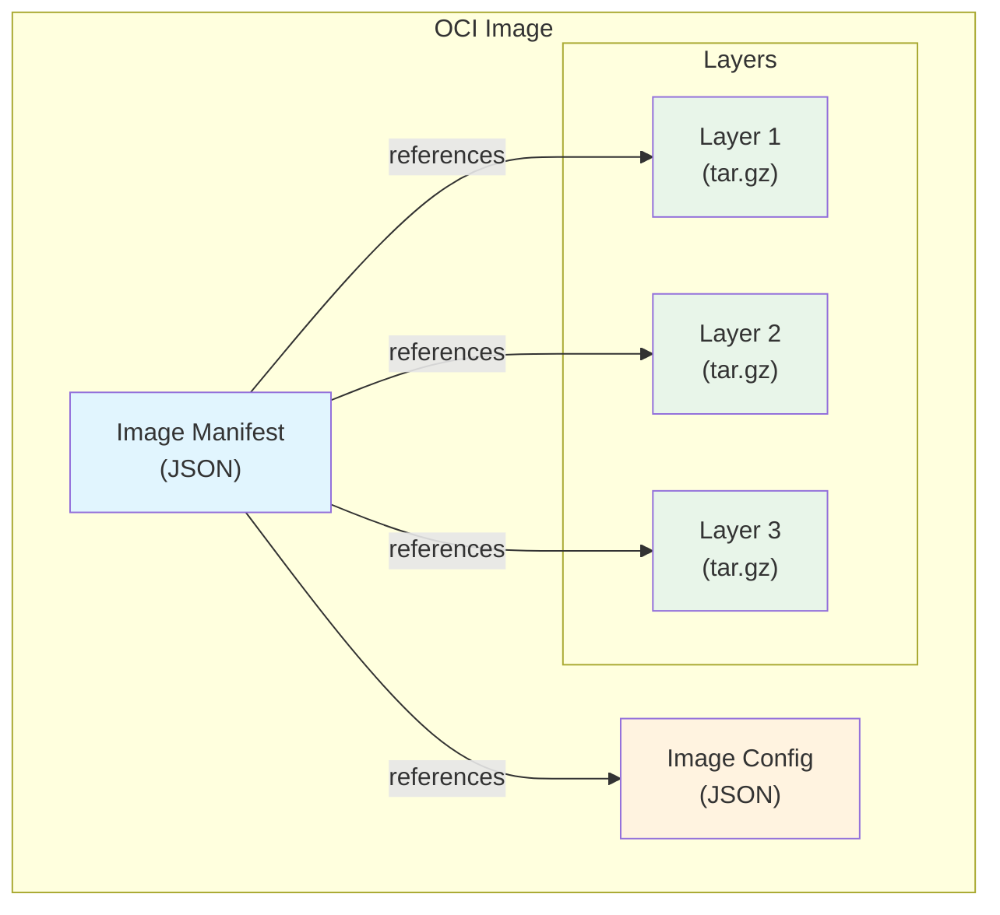
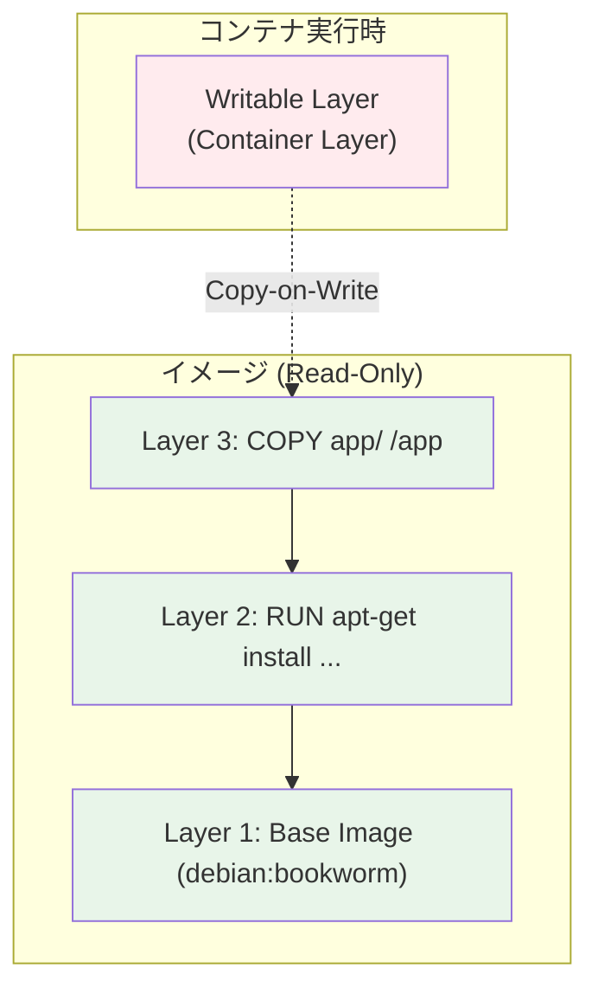
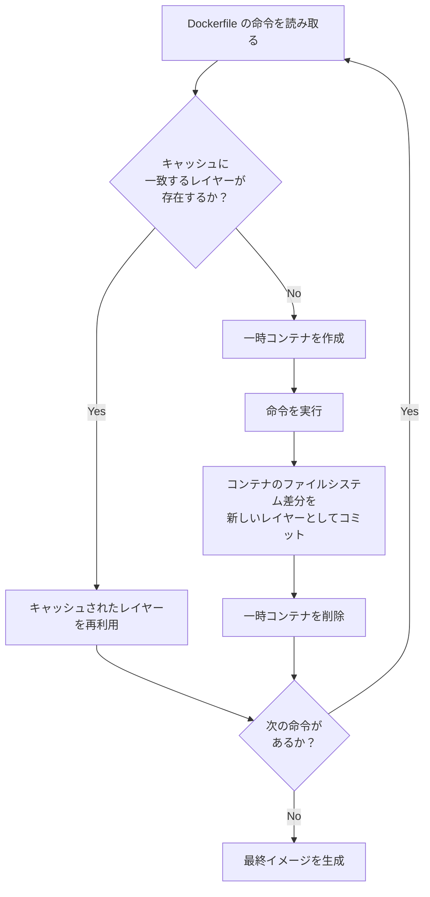
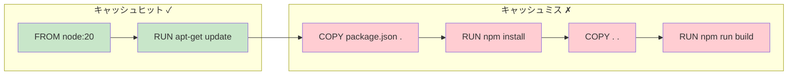
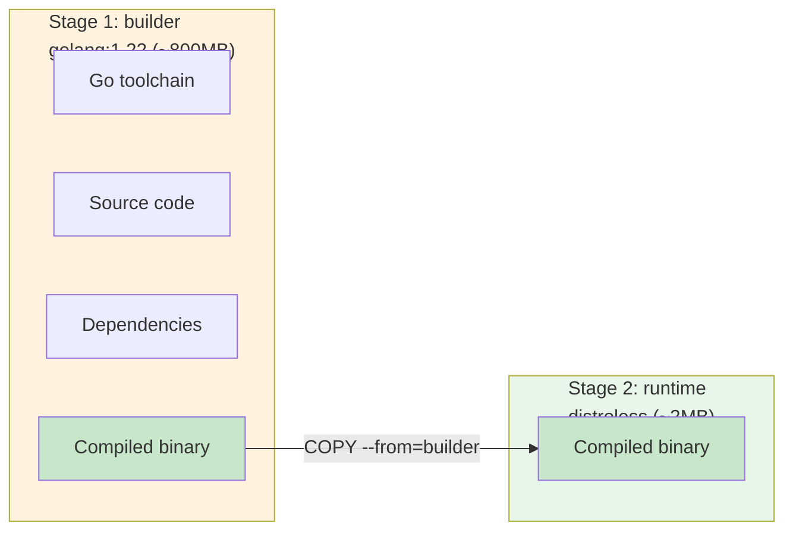
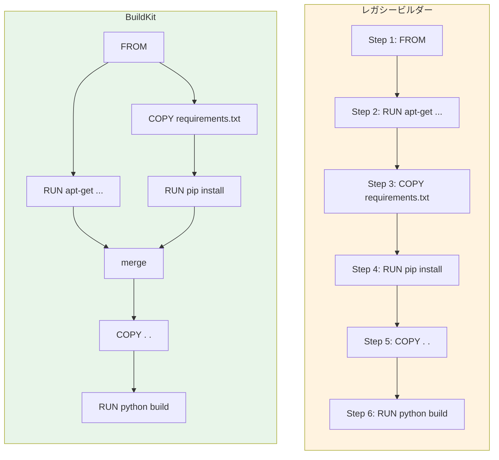
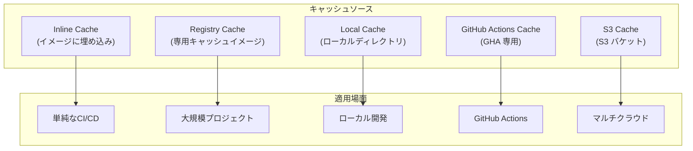
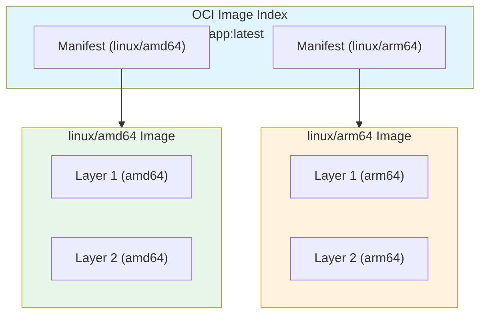

# コンテナイメージのビルド最適化（マルチステージ, レイヤーキャッシュ）

## 1. 背景と動機

### 1.1 コンテナイメージはなぜ重要か

コンテナ技術の普及により、ソフトウェアのビルド・配布・実行は劇的に変化した。`docker build` でイメージを作り、`docker push` でレジストリに送り、`docker run` で実行する――この一連のワークフローは現代の開発では当たり前のものとなっている。しかし、コンテナイメージの構造と挙動を正しく理解しないまま Dockerfile を書くと、以下のような問題に直面する。

- **イメージサイズの肥大化**: ビルドツールやソースコードが本番イメージに残り、数GBのイメージができあがる
- **ビルド時間の増大**: レイヤーキャッシュが効かず、些細な変更でも全レイヤーの再ビルドが走る
- **セキュリティリスクの拡大**: 不要なツールやライブラリが本番環境に含まれ、攻撃対象面（attack surface）が広がる
- **CI/CDパイプラインの遅延**: 大きなイメージの push/pull に時間がかかり、デプロイサイクルが鈍化する

これらの問題は、イメージの仕組みを理解し適切な最適化技法を適用することで、大幅に改善できる。本記事では、コンテナイメージの基礎構造から始め、レイヤーキャッシュの原理、マルチステージビルド、BuildKit の高度な機能まで、体系的に解説する。

### 1.2 歴史的背景

コンテナイメージの概念は Docker が 2013 年に登場した際に確立された。初期の Docker は AUFS（Another Union File System）を利用したレイヤー構造を採用し、イメージの差分管理と効率的な配布を実現した。その後、2015 年に OCI（Open Container Initiative）が設立され、コンテナイメージの仕様は標準化された。

ビルド最適化の歴史は、Docker の進化そのものである。初期にはシングルステージビルドしかなく、イメージサイズの削減には「ビルダーパターン」と呼ばれるシェルスクリプトベースのワークアラウンドが用いられていた。2017 年の Docker 17.05 でマルチステージビルドが導入され、2018 年の Docker 18.09 で BuildKit が統合されたことで、ビルド最適化の手段は飛躍的に充実した。

## 2. コンテナイメージの基礎構造

### 2.1 OCI Image Specification

OCI Image Specification は、コンテナイメージの標準フォーマットを定義する仕様である。Docker が事実上の標準を作り、それを OCI が標準化したという経緯がある。OCI イメージは以下の3つの要素で構成される。



**Image Manifest**: イメージの構成要素（Config とレイヤーの一覧）を記述する JSON ファイル。各レイヤーの digest（SHA256 ハッシュ）とサイズを含む。

**Image Config**: イメージのメタデータを記述する JSON ファイル。環境変数、エントリーポイント、作成日時、各レイヤーの差分ID（diffID）、ビルド履歴などを含む。

**Layers**: ファイルシステムの変更差分を tar アーカイブとして格納したもの。各レイヤーは、その時点でのファイルの追加・変更・削除を記録している。

各要素は content-addressable storage として管理され、SHA256 ハッシュ値によって一意に識別される。これにより、同一のレイヤーを複数のイメージ間で共有でき、ストレージとネットワーク帯域の効率化が実現される。

### 2.2 レイヤーとユニオンファイルシステム

コンテナイメージの核心的な設計概念がレイヤー構造である。各レイヤーは読み取り専用（read-only）であり、コンテナ実行時には最上位に書き込み可能なレイヤー（writable layer）が追加される。これらのレイヤーを重ね合わせて一つのファイルシステムとして見せるのが、ユニオンファイルシステム（Union Filesystem）である。



ユニオンファイルシステムにはいくつかの実装がある。

| 実装 | 特徴 | 現在の状況 |
|------|------|-----------|
| AUFS | Docker 初期の標準。安定しているがメインラインカーネルに未統合 | 非推奨 |
| OverlayFS（overlay2） | Linux カーネル 3.18 で統合。現在の Docker の標準 | 推奨 |
| Btrfs | Btrfs のスナップショット機能を利用 | 限定的 |
| ZFS | ZFS のクローン機能を利用 | 限定的 |
| VFS | ユニオンを使わず毎回フルコピー。テスト用途 | 非推奨 |

現在の主流は OverlayFS（overlay2 ストレージドライバー）であり、上位レイヤー（upper）と下位レイヤー（lower）を統合してマージされたビュー（merged）を提供する。ファイルの変更は Copy-on-Write（CoW）戦略で処理され、下位レイヤーのファイルを変更する場合は上位レイヤーにコピーしてから変更を加える。

### 2.3 レイヤーの内部構造

各レイヤーは実質的に tar アーカイブであり、そのレイヤーで追加・変更されたファイルを含む。ファイルの削除は「whiteout ファイル」という特殊なマーカーファイルで表現される。

```
# Layer 2 の内容例（tar の中身）
./usr/bin/python3        # added file
./usr/lib/python3/...    # added file
./etc/apt/.wh.apt.conf   # whiteout: /etc/apt/apt.conf was deleted
```

whiteout ファイルは `.wh.` プレフィクスを持ち、ユニオンファイルシステムがこれを認識して、下位レイヤーの対応するファイルを「見えなく」する。ディレクトリ全体を削除する場合は、opaque whiteout（`.wh..wh..opq`）が使用される。

この仕組みの重要な帰結として、「あるレイヤーで追加したファイルを後続のレイヤーで削除しても、イメージの総サイズは減らない」という事実がある。削除レイヤーは whiteout ファイルを追加するだけであり、元のファイルは下位レイヤーに依然として存在する。これはイメージ最適化において極めて重要なポイントである。

## 3. Dockerfile とビルドプロセス

### 3.1 Dockerfile の処理フロー

Dockerfile の各命令は、以下のプロセスで処理される。



レイヤーを生成する主な命令は `RUN`、`COPY`、`ADD` の3つである。`ENV`、`EXPOSE`、`LABEL` などのメタデータ命令はレイヤーを生成せず、イメージの Config（メタデータ）のみを変更する。

### 3.2 ビルドコンテキスト

`docker build` コマンドを実行すると、指定されたパス（ビルドコンテキスト）以下のすべてのファイルが Docker デーモンに送信される。これは意外と見落としがちなボトルネックである。

```bash
# Build context is the current directory
docker build -t myapp .
# Sending build context to Docker daemon  2.048GB  ← Too large!
```

`.git` ディレクトリ、`node_modules`、テストデータ、ログファイルなどがビルドコンテキストに含まれると、ビルドの開始前に大量のデータ転送が発生する。この問題への対策が `.dockerignore` ファイルである。

```dockerignore
# .dockerignore
.git
node_modules
*.log
tmp/
dist/
.env
*.md
```

### 3.3 レイヤーキャッシュの仕組み

レイヤーキャッシュは Docker ビルドの高速化において最も重要な仕組みである。Docker は各命令について、キャッシュを利用できるかどうかを以下のルールで判定する。

**`RUN` 命令の場合**: 命令の文字列そのものがキャッシュキーとなる。`RUN apt-get update && apt-get install -y curl` という命令が前回のビルドと完全に同一であり、かつ親レイヤーも同一であれば、キャッシュが利用される。命令の実行結果（インストールされるパッケージのバージョンなど）は考慮されない。

**`COPY` / `ADD` 命令の場合**: コピー元ファイルの内容のチェックサム（ファイルのメタデータとコンテンツのハッシュ）がキャッシュキーに含まれる。ファイルの内容が変更されていれば、キャッシュは無効化される。

**キャッシュの連鎖的無効化**: あるレイヤーのキャッシュが無効化されると、それ以降のすべてのレイヤーのキャッシュも無効化される。これは、各レイヤーが親レイヤーに依存しているためである。



上図は、`package.json` が変更された場合のキャッシュ無効化の連鎖を示している。`COPY package.json .` でキャッシュが無効化されると、以降の `RUN npm install`、`COPY . .`、`RUN npm run build` もすべて再実行される。

### 3.4 レイヤー順序の最適化

キャッシュの連鎖的無効化を最小限に抑えるため、Dockerfile の命令は「変更頻度の低いものから高いもの」の順に配置すべきである。

```dockerfile
# Bad: Application code is copied before dependency installation
FROM node:20-slim
WORKDIR /app
COPY . .
RUN npm install
RUN npm run build

# Good: Dependencies first, then application code
FROM node:20-slim
WORKDIR /app
COPY package.json package-lock.json ./
RUN npm install --production
COPY . .
RUN npm run build
```

改善後の Dockerfile では、アプリケーションコードを変更しても `package.json` と `package-lock.json` が変わっていなければ、`RUN npm install` のレイヤーはキャッシュから再利用される。依存関係のインストールは通常最も時間のかかるステップであるため、このキャッシュ効率の改善は大きなビルド時間の短縮につながる。

## 4. マルチステージビルド

### 4.1 マルチステージビルド以前の課題

マルチステージビルドが導入される以前、開発者は「ビルド時に必要なツール」と「実行時に必要な最小限のファイル」をどう分離するかという問題に悩んでいた。

典型的なビルドプロセスでは、コンパイラ、リンカー、開発用ヘッダーファイル、テストフレームワークなどが必要となる。しかし、これらは本番環境では不要であり、セキュリティリスクとイメージサイズの増大要因でしかない。

当時の回避策は「ビルダーパターン」と呼ばれる手法であった。

```bash
#!/bin/bash
# Old "builder pattern" - two Dockerfiles and a shell script

# Step 1: Build in a full development image
docker build -t myapp-builder -f Dockerfile.build .

# Step 2: Extract build artifacts
docker create --name extract myapp-builder
docker cp extract:/app/build ./build
docker rm -f extract

# Step 3: Build production image with only artifacts
docker build -t myapp -f Dockerfile.prod .
```

この方法は動作するが、2つの Dockerfile とシェルスクリプトの管理が必要であり、中間コンテナの作成と破棄というオーバーヘッドも生じる。何より、ビルドプロセスが Dockerfile の宣言的な記述から逸脱し、外部スクリプトに依存してしまう。

### 4.2 マルチステージビルドの仕組み

Docker 17.05（2017年）で導入されたマルチステージビルドは、単一の Dockerfile 内に複数の `FROM` 命令を記述し、あるステージのビルド成果物を別のステージにコピーできる機能である。

```dockerfile
# Stage 1: Build
FROM golang:1.22 AS builder
WORKDIR /app
COPY go.mod go.sum ./
RUN go mod download
COPY . .
RUN CGO_ENABLED=0 GOOS=linux go build -o /app/server ./cmd/server

# Stage 2: Runtime
FROM gcr.io/distroless/static-debian12
COPY --from=builder /app/server /server
EXPOSE 8080
ENTRYPOINT ["/server"]
```

この例では、ビルドステージ（`builder`）で Go のコンパイルに必要なツールチェイン全体を含む `golang:1.22` イメージを使用し、最終ステージでは `distroless` という最小限のイメージに、コンパイル済みバイナリだけをコピーしている。



最終イメージには Stage 2 のレイヤーのみが含まれるため、イメージサイズは劇的に小さくなる。上記の Go アプリケーションの例では、800MB 以上のビルドイメージから、10MB 以下の本番イメージを作成できる。

### 4.3 マルチステージビルドの応用パターン

#### 依存関係のキャッシュ最適化

```dockerfile
# Stage 1: Dependencies
FROM node:20-slim AS deps
WORKDIR /app
COPY package.json package-lock.json ./
RUN npm ci --production

# Stage 2: Build
FROM node:20-slim AS build
WORKDIR /app
COPY package.json package-lock.json ./
RUN npm ci
COPY . .
RUN npm run build

# Stage 3: Runtime
FROM node:20-slim
WORKDIR /app
COPY --from=deps /app/node_modules ./node_modules
COPY --from=build /app/dist ./dist
COPY package.json ./
USER node
EXPOSE 3000
CMD ["node", "dist/index.js"]
```

このパターンでは、本番用依存関係（`--production`）とビルド用依存関係を別々のステージで管理している。最終イメージには本番用の `node_modules` とビルド成果物のみが含まれ、開発用依存関係（TypeScript コンパイラ、テストフレームワーク等）は除外される。

#### テストステージの統合

```dockerfile
FROM golang:1.22 AS builder
WORKDIR /app
COPY go.mod go.sum ./
RUN go mod download
COPY . .
RUN go build -o /app/server ./cmd/server

# Test stage - only runs when targeted
FROM builder AS test
RUN go test ./...

# Production stage
FROM gcr.io/distroless/static-debian12
COPY --from=builder /app/server /server
ENTRYPOINT ["/server"]
```

```bash
# Run tests only
docker build --target test .

# Build production image (tests are not executed)
docker build .
```

`--target` フラグを使うことで、特定のステージまでだけをビルドできる。CI パイプラインではテストステージをターゲットとしてビルドし、テストが通った後に本番イメージをビルドするというワークフローが実現できる。

## 5. イメージサイズの最適化

### 5.1 ベースイメージの選択

ベースイメージの選択は、最終イメージサイズに最も大きな影響を与える要素である。

| ベースイメージ | サイズ目安 | 特徴 |
|--------------|----------|------|
| `ubuntu:24.04` | ~77MB | フル機能。デバッグしやすい |
| `debian:bookworm-slim` | ~75MB | 不要パッケージを削減した Debian |
| `alpine:3.19` | ~7MB | musl libc ベース。小さいが互換性に注意 |
| `distroless` | ~2-20MB | Google 提供。シェルすら含まない |
| `scratch` | 0MB | 完全に空のイメージ。静的リンクバイナリ専用 |
| `chainguard/static` | ~2MB | Wolfi ベース。SBOM 付き |

Alpine Linux は非常に小さいが、musl libc を使用するため、glibc を前提としたバイナリやライブラリで互換性の問題が生じることがある。特に、Python の C 拡張モジュールや、DNS 解決の挙動の違いが問題になるケースが報告されている。

`scratch` イメージは文字通り空であるため、静的にリンクされたバイナリ（Go、Rust の静的ビルドなど）専用である。シェルもなく、`ls` も `cat` もない。本番運用のデバッグが困難になるため、distroless を使う方がバランスが良い場合が多い。

### 5.2 RUN 命令の最適化

```dockerfile
# Bad: Each RUN creates a separate layer
RUN apt-get update
RUN apt-get install -y curl
RUN apt-get install -y wget
RUN rm -rf /var/lib/apt/lists/*

# Good: Single layer with cleanup in the same RUN
RUN apt-get update && \
    apt-get install -y --no-install-recommends \
        curl \
        wget && \
    rm -rf /var/lib/apt/lists/*
```

前述のレイヤー構造の原理により、別々のレイヤーでファイルを追加・削除しても、削除によるサイズ削減は実現されない。パッケージのインストールとキャッシュの削除は、必ず同一の `RUN` 命令内で行う必要がある。

`--no-install-recommends` フラグは、推奨パッケージのインストールを抑制し、必要最小限のパッケージのみをインストールする。これだけでも数十MBの削減になることがある。

### 5.3 COPY の粒度

```dockerfile
# Bad: Copy everything, invalidating cache frequently
COPY . .

# Good: Copy only what's needed, in order of change frequency
COPY package.json package-lock.json ./
RUN npm ci
COPY tsconfig.json ./
COPY src/ ./src/
RUN npm run build
```

`COPY . .` はビルドコンテキスト全体をコピーするため、どのファイルが変更されてもキャッシュが無効化される。必要なファイルだけを、変更頻度の低い順にコピーすることで、キャッシュ効率を最大化できる。

## 6. BuildKit

### 6.1 レガシービルダーからの進化

BuildKit は Docker 18.09（2018年）で導入された次世代ビルドエンジンである。Docker 23.0 以降ではデフォルトのビルダーとなっている。レガシービルダーと比較して、以下の点が大幅に改善されている。



**並列ビルド**: BuildKit はビルドの依存関係をDAG（有向非巡回グラフ）として解析し、互いに依存しないステップを並列に実行する。マルチステージビルドでは特に効果が大きく、独立したステージが同時に処理される。

**改善されたキャッシュ管理**: レガシービルダーではローカルのレイヤーキャッシュのみが使用可能であったが、BuildKit ではレジストリキャッシュ、インラインキャッシュ、ローカルディレクトリキャッシュなど、多様なキャッシュバックエンドが利用可能になった。

**セキュリティの向上**: `--mount=type=secret` によるシークレットのマウント機能が追加され、ビルド時に必要な認証情報をレイヤーに残すことなく使用できるようになった。

**出力の改善**: BuildKit はインタラクティブな進捗表示を提供し、どのステップが並列に実行されているか、どのステップがキャッシュから再利用されたかが一目でわかる。

### 6.2 BuildKit の有効化

```bash
# Docker 23.0 以降ではデフォルトで有効
# それ以前のバージョンでの有効化
export DOCKER_BUILDKIT=1

# docker buildx を使用する場合
docker buildx build -t myapp .

# BuildKit が有効か確認
docker buildx version
```

### 6.3 キャッシュマウント

BuildKit の最も強力な機能の一つが、`RUN --mount=type=cache` によるキャッシュマウントである。これにより、パッケージマネージャーのキャッシュディレクトリをビルド間で永続化できる。

```dockerfile
# syntax=docker/dockerfile:1

FROM python:3.12-slim

WORKDIR /app
COPY requirements.txt .

# pip cache is persisted across builds
RUN --mount=type=cache,target=/root/.cache/pip \
    pip install -r requirements.txt

COPY . .
CMD ["python", "app.py"]
```

```dockerfile
# syntax=docker/dockerfile:1

FROM golang:1.22

WORKDIR /app
COPY go.mod go.sum ./

# Go module cache is persisted across builds
RUN --mount=type=cache,target=/go/pkg/mod \
    --mount=type=cache,target=/root/.cache/go-build \
    go mod download

COPY . .
RUN --mount=type=cache,target=/go/pkg/mod \
    --mount=type=cache,target=/root/.cache/go-build \
    go build -o /app/server ./cmd/server
```

キャッシュマウントは最終イメージのレイヤーには含まれず、ビルドキャッシュとしてのみ存在する。これにより、`rm -rf /var/lib/apt/lists/*` のような明示的なキャッシュ削除が不要になり、かつビルド間でキャッシュの恩恵を受けられる。

### 6.4 シークレットマウント

ビルド中にプライベートリポジトリへのアクセスが必要な場合、従来は `ARG` や `ENV` で認証情報を渡すしかなかった。しかし、これらの値はイメージのメタデータやレイヤーに残ってしまうリスクがある。

```dockerfile
# syntax=docker/dockerfile:1

FROM node:20-slim
WORKDIR /app
COPY package.json package-lock.json ./

# Secret is mounted as a file, never stored in any layer
RUN --mount=type=secret,id=npmrc,target=/root/.npmrc \
    npm ci

COPY . .
RUN npm run build
```

```bash
# Pass the secret at build time
docker build --secret id=npmrc,src=$HOME/.npmrc -t myapp .
```

シークレットマウントは `tmpfs` として一時的にマウントされ、レイヤーには一切記録されない。`docker history` でも見えず、イメージを inspect しても痕跡は残らない。

## 7. ビルドキャッシュ戦略

### 7.1 キャッシュの種類と使い分け

CI/CD 環境では、ローカルのレイヤーキャッシュが利用できないことが多い（クリーンな環境で毎回ビルドが実行されるため）。BuildKit は複数のキャッシュエクスポート・インポート方式をサポートしている。



#### インラインキャッシュ

インラインキャッシュは、ビルドキャッシュのメタデータをイメージ自体に埋め込む方式である。

```bash
# Export with inline cache
docker build -t registry.example.com/myapp:latest \
    --build-arg BUILDKIT_INLINE_CACHE=1 .

docker push registry.example.com/myapp:latest

# Import cache from the pushed image
docker build -t registry.example.com/myapp:latest \
    --cache-from registry.example.com/myapp:latest .
```

インラインキャッシュは最も手軽だが、マルチステージビルドの中間ステージのキャッシュは保存されないという制限がある（最終ステージのキャッシュのみ）。

#### レジストリキャッシュ

レジストリキャッシュは、キャッシュ専用のイメージとしてレジストリに保存する方式であり、マルチステージビルドの全ステージのキャッシュを保存できる。

```bash
# Export cache to registry
docker buildx build -t registry.example.com/myapp:latest \
    --cache-to type=registry,ref=registry.example.com/myapp:cache,mode=max \
    --cache-from type=registry,ref=registry.example.com/myapp:cache \
    --push .
```

`mode=max` を指定すると、最終ステージだけでなく全ステージのレイヤーキャッシュが保存される。CI/CD 環境ではこの方式が最も強力である。

#### GitHub Actions キャッシュ

GitHub Actions を使用する場合、専用のキャッシュバックエンドを利用できる。

```yaml
# .github/workflows/build.yml
- name: Build and push
  uses: docker/build-push-action@v5
  with:
    context: .
    push: true
    tags: registry.example.com/myapp:latest
    cache-from: type=gha
    cache-to: type=gha,mode=max
```

GitHub Actions のキャッシュストレージ（リポジトリあたり 10GB）を利用するため、レジストリへのキャッシュ push/pull のオーバーヘッドがなく、高速である。

## 8. セキュリティに関する考慮事項

### 8.1 非 root ユーザーでの実行

デフォルトでは、コンテナ内のプロセスは root（UID 0）として実行される。コンテナの隔離が破られた場合、ホスト上でも root 権限を持つ可能性があるため、非 root ユーザーでの実行が強く推奨される。

```dockerfile
FROM node:20-slim
WORKDIR /app

# Create non-root user
RUN groupadd -r appuser && useradd -r -g appuser -s /bin/false appuser

COPY --chown=appuser:appuser package.json package-lock.json ./
RUN npm ci --production

COPY --chown=appuser:appuser . .

# Switch to non-root user
USER appuser

EXPOSE 3000
CMD ["node", "index.js"]
```

`COPY --chown` を使うことで、コピーされたファイルの所有者を非 root ユーザーに設定できる。`USER` 命令以降の `RUN`、`CMD`、`ENTRYPOINT` はすべて指定されたユーザーとして実行される。

### 8.2 最小限のベースイメージとセキュリティ

イメージに含まれるパッケージが多いほど、脆弱性を含む確率が高くなる。distroless イメージや Alpine ベースの最小イメージを使用することで、攻撃対象面を大幅に削減できる。

```
# Trivy による脆弱性スキャン結果の比較例
$ trivy image node:20
Total: 642 (UNKNOWN: 1, LOW: 423, MEDIUM: 156, HIGH: 48, CRITICAL: 14)

$ trivy image node:20-slim
Total: 78 (UNKNOWN: 0, LOW: 52, MEDIUM: 19, HIGH: 5, CRITICAL: 2)

$ trivy image node:20-alpine
Total: 3 (UNKNOWN: 0, LOW: 1, MEDIUM: 1, HIGH: 1, CRITICAL: 0)
```

### 8.3 イメージの脆弱性スキャン

CI/CD パイプラインにイメージの脆弱性スキャンを組み込むことは、現代のセキュリティプラクティスとして不可欠である。代表的なツールには以下がある。

- **Trivy**: Aqua Security が開発するオープンソーススキャナー。OS パッケージと言語パッケージの両方をスキャン可能
- **Grype**: Anchore が開発するオープンソーススキャナー。SBOM（Software Bill of Materials）との連携が強い
- **Snyk Container**: 商用ツール。修正提案やベースイメージの推奨を提供

```bash
# Trivy scan
trivy image --severity HIGH,CRITICAL myapp:latest

# Grype scan
grype myapp:latest
```

### 8.4 イメージの署名と検証

イメージの改ざんを防ぐために、イメージの署名と検証を行うことが推奨される。Sigstore の cosign は、現在最も広く採用されているイメージ署名ツールである。

```bash
# Sign the image
cosign sign registry.example.com/myapp:latest

# Verify the image
cosign verify registry.example.com/myapp:latest
```

## 9. 高度なパターン

### 9.1 ビルド引数と条件分岐

```dockerfile
# syntax=docker/dockerfile:1

ARG APP_ENV=production

FROM node:20-slim AS base
WORKDIR /app
COPY package.json package-lock.json ./

FROM base AS deps-production
RUN npm ci --production

FROM base AS deps-development
RUN npm ci

FROM deps-${APP_ENV} AS deps
# This stage resolves to deps-production or deps-development
# based on the APP_ENV build argument
```

```bash
# Build for production (default)
docker build -t myapp .

# Build for development
docker build --build-arg APP_ENV=development -t myapp:dev .
```

`ARG` を `FROM` 命令の引数として使用することで、ビルド時にステージを動的に選択できる。これにより、開発用と本番用のビルドを単一の Dockerfile で管理できる。

### 9.2 ヒアドキュメントによるインラインファイル

BuildKit の `syntax=docker/dockerfile:1.4` 以降では、Dockerfile 内にヒアドキュメントを記述できる。

```dockerfile
# syntax=docker/dockerfile:1

FROM python:3.12-slim

# Inline script without external file
RUN <<EOF
apt-get update
apt-get install -y --no-install-recommends curl
rm -rf /var/lib/apt/lists/*
EOF

# Inline configuration file
COPY <<EOF /app/config.ini
[server]
host = 0.0.0.0
port = 8080
workers = 4
EOF

WORKDIR /app
COPY . .
CMD ["python", "app.py"]
```

### 9.3 外部イメージからのコピー

`COPY --from` はビルドステージだけでなく、外部イメージからもファイルをコピーできる。

```dockerfile
FROM debian:bookworm-slim

# Copy binary from an external image
COPY --from=docker.io/bitnami/kubectl:latest /opt/bitnami/kubectl/bin/kubectl /usr/local/bin/
COPY --from=docker.io/hashicorp/terraform:latest /bin/terraform /usr/local/bin/

RUN kubectl version --client && terraform version
```

この手法は、特定のツールのバイナリだけをイメージに含めたい場合に有用である。ただし、外部イメージのバージョンを固定しないと、ビルドの再現性が損なわれるため注意が必要である。

### 9.4 マルチプラットフォームビルド

BuildKit と `docker buildx` を使用することで、単一の Dockerfile から複数のアーキテクチャ（amd64、arm64 など）向けのイメージを同時にビルドできる。

```bash
# Create a multi-platform builder
docker buildx create --name multiplatform --driver docker-container --use

# Build for multiple architectures
docker buildx build \
    --platform linux/amd64,linux/arm64 \
    -t registry.example.com/myapp:latest \
    --push .
```

マルチプラットフォームビルドは、OCI Image Index（旧 Docker Manifest List）を使用して、複数のアーキテクチャ固有イメージをひとつのタグの下にまとめる。`docker pull` は自動的にホストのアーキテクチャに適したイメージを選択する。



## 10. 実践的なベストプラクティスと落とし穴

### 10.1 ベストプラクティスまとめ

**1. レイヤー順序を最適化する**: 変更頻度の低い命令を先に、高い命令を後に配置する。依存関係の定義ファイル（`package.json`、`go.mod`、`requirements.txt` など）をアプリケーションコードよりも先にコピーする。

**2. マルチステージビルドを常に使う**: ビルドツールとランタイムの分離は、イメージサイズの削減とセキュリティ向上の両面で効果がある。単純なアプリケーションでも、マルチステージビルドの採用を検討すべきである。

**3. `.dockerignore` を適切に設定する**: `.git`、`node_modules`、テストデータ、ドキュメントなど、ビルドに不要なファイルを除外する。これにより、ビルドコンテキストの転送時間の短縮とキャッシュ効率の向上が得られる。

**4. イメージのタグ付けを適切に行う**: `latest` タグだけでなく、Git コミットハッシュやセマンティックバージョニングに基づくタグを使用する。これにより、デプロイの再現性と問題発生時のロールバックが容易になる。

**5. 非 root ユーザーで実行する**: `USER` 命令で非 root ユーザーに切り替えることを習慣にする。

**6. ビルドキャッシュを CI/CD で活用する**: レジストリキャッシュや GitHub Actions キャッシュを設定し、CI/CD 環境でもキャッシュの恩恵を受ける。

**7. 脆弱性スキャンを CI/CD に組み込む**: Trivy や Grype を CI パイプラインに統合し、CRITICAL/HIGH の脆弱性を検出した場合はビルドを失敗させる。

### 10.2 よくある落とし穴

#### `apt-get update` の単独実行

```dockerfile
# Bad: apt-get update in separate layer (stale cache issue)
RUN apt-get update
RUN apt-get install -y curl

# Good: Always combine update and install
RUN apt-get update && apt-get install -y curl && rm -rf /var/lib/apt/lists/*
```

`apt-get update` を単独の `RUN` 命令にすると、そのレイヤーがキャッシュされた場合、古いパッケージリストが使われ続け、`apt-get install` でパッケージが見つからないエラーが発生することがある。

#### タイムゾーンに依存するビルド

```dockerfile
# Bad: RUN date >> /app/build-info.txt
# This causes different output on every build, breaking cache

# Good: Use build arguments for build metadata
ARG BUILD_DATE
ARG GIT_SHA
LABEL org.opencontainers.image.created=$BUILD_DATE
LABEL org.opencontainers.image.revision=$GIT_SHA
```

ビルドの度に異なる出力を生む命令は、レイヤーキャッシュを常に無効化する。ビルドメタデータはラベルとして付与し、ファイルシステムに書き込まないようにする。

#### シークレットの漏洩

```dockerfile
# DANGEROUS: Secret is stored in image layer history
ARG API_KEY
RUN curl -H "Authorization: Bearer ${API_KEY}" https://api.example.com/data > /app/data.json

# SAFE: Use BuildKit secret mount
RUN --mount=type=secret,id=api_key \
    curl -H "Authorization: Bearer $(cat /run/secrets/api_key)" \
    https://api.example.com/data > /app/data.json
```

`ARG` で渡した値は `docker history` で閲覧可能であり、`ENV` で設定した値はコンテナの環境変数として残り続ける。ビルド時のシークレットには必ず `--mount=type=secret` を使用する。

#### COPY と ADD の混同

```dockerfile
# ADD has extra features (auto-extraction, URL fetching)
ADD archive.tar.gz /app/   # Auto-extracts the archive
ADD https://example.com/file /app/  # Downloads from URL (no cache invalidation control)

# COPY is simpler and more predictable
COPY archive.tar.gz /app/  # Copies as-is (no extraction)
```

`ADD` は tar アーカイブの自動展開や URL からのダウンロード機能を持つが、予期しない挙動を招くことがある。明示的な意図がない限り `COPY` を使用すべきである。Dockerfile のベストプラクティスガイドラインでも `COPY` の使用が推奨されている。

### 10.3 言語別の最適化パターン

各言語・フレームワークには、それぞれに適した最適化パターンがある。

#### Go

Go は静的にリンクされたシングルバイナリを生成できるため、マルチステージビルドとの相性が最も良い言語の一つである。

```dockerfile
# syntax=docker/dockerfile:1
FROM golang:1.22 AS builder
WORKDIR /app
COPY go.mod go.sum ./
RUN --mount=type=cache,target=/go/pkg/mod go mod download
COPY . .
RUN --mount=type=cache,target=/root/.cache/go-build \
    CGO_ENABLED=0 go build -ldflags="-s -w" -o /server ./cmd/server

FROM scratch
COPY --from=builder /etc/ssl/certs/ca-certificates.crt /etc/ssl/certs/
COPY --from=builder /server /server
ENTRYPOINT ["/server"]
```

`-ldflags="-s -w"` はデバッグ情報とDWARF情報を除去し、バイナリサイズを約30%削減する。`CGO_ENABLED=0` で純粋な Go コンパイルを強制し、`scratch` イメージ上での実行を可能にする。

#### Python

Python は Go と異なりインタープリタ型言語であるため、ランタイム自体をイメージに含める必要がある。

```dockerfile
# syntax=docker/dockerfile:1
FROM python:3.12-slim AS builder
WORKDIR /app
COPY requirements.txt .
RUN --mount=type=cache,target=/root/.cache/pip \
    pip install --user -r requirements.txt

FROM python:3.12-slim
WORKDIR /app
COPY --from=builder /root/.local /root/.local
ENV PATH=/root/.local/bin:$PATH
COPY . .
USER nobody
CMD ["python", "app.py"]
```

`pip install --user` は `~/.local` にパッケージをインストールする。このディレクトリをビルドステージから最終ステージにコピーすることで、pip 自体やビルド時の一時ファイルを最終イメージから除外できる。

#### Rust

Rust も Go と同様に静的リンクが可能であり、マルチステージビルドとの相性が良い。ただし、依存関係のビルドに長い時間がかかるため、キャッシュ戦略が特に重要である。

```dockerfile
# syntax=docker/dockerfile:1
FROM rust:1.77 AS builder
WORKDIR /app

# Cache dependencies by building a dummy project first
COPY Cargo.toml Cargo.lock ./
RUN mkdir src && echo "fn main() {}" > src/main.rs
RUN --mount=type=cache,target=/usr/local/cargo/registry \
    --mount=type=cache,target=/app/target \
    cargo build --release

# Build the actual application
COPY src/ ./src/
RUN --mount=type=cache,target=/usr/local/cargo/registry \
    --mount=type=cache,target=/app/target \
    cargo build --release && \
    cp target/release/myapp /usr/local/bin/

FROM debian:bookworm-slim
RUN apt-get update && apt-get install -y --no-install-recommends ca-certificates && \
    rm -rf /var/lib/apt/lists/*
COPY --from=builder /usr/local/bin/myapp /usr/local/bin/
CMD ["myapp"]
```

ダミーの `main.rs` で依存関係だけを先にビルドし、その後で実際のソースコードをコピーして再ビルドするパターンにより、依存関係のビルド結果をキャッシュできる。

## 11. まとめ

コンテナイメージのビルド最適化は、単なるイメージサイズの削減ではなく、ビルド速度、セキュリティ、再現性、運用効率のすべてに関わる重要な技術的実践である。

本記事で解説した内容の要点を整理する。

**基礎**: コンテナイメージは OCI 仕様に基づくレイヤーの積み重ねであり、ユニオンファイルシステムによって統合される。各レイヤーは不変（immutable）であり、削除操作は whiteout ファイルとして記録されるため、レイヤー構造を意識した設計が必要である。

**キャッシュ**: レイヤーキャッシュの連鎖的無効化を理解し、変更頻度の低い命令を先に配置することで、ビルド時間を劇的に短縮できる。BuildKit のキャッシュマウントやリモートキャッシュを活用することで、CI/CD 環境でもキャッシュの恩恵を受けられる。

**マルチステージビルド**: ビルド環境と実行環境を分離し、本番イメージに不要なファイルを含めないことで、セキュリティとサイズの両面で改善が得られる。

**BuildKit**: 並列ビルド、キャッシュマウント、シークレットマウントなど、レガシービルダーにはない高度な機能を提供する。現代の Docker ビルドでは BuildKit の活用が前提である。

**セキュリティ**: 非 root ユーザーでの実行、最小限のベースイメージの選択、脆弱性スキャンの CI/CD への統合、イメージ署名による改ざん防止が重要である。

コンテナ技術は今後も進化を続ける。Nix ベースの再現可能なビルド、WASM コンテナ、eBPF を活用したセキュリティ監視など、新しいアプローチが次々と登場している。しかし、本記事で解説したレイヤー構造、キャッシュ戦略、マルチステージビルドという基本原理は、これらの新技術を理解するための土台であり続ける。イメージの内部構造を正しく理解し、ビルドプロセスを意図的に設計することが、効率的で安全なコンテナ運用の第一歩である。
