# コンテナネットワーキングの内部 — veth, bridge, overlay, CNI プラグインの仕組み

## 1. Linuxネットワーク名前空間

### 1.1 名前空間によるネットワークスタックの隔離

コンテナネットワーキングを理解するには、まずLinuxカーネルのネットワーク名前空間（Network Namespace）を理解する必要がある。ネットワーク名前空間は、Linux Namespace 機構の一種であり、プロセスごとに独立したネットワークスタックを提供する。具体的には、以下の要素がネットワーク名前空間ごとに隔離される。

- **ネットワークインターフェース**: `eth0`、`lo` などの仮想・物理NICの一覧
- **IPアドレスとルーティングテーブル**: 各名前空間が独自のIPアドレスとルーティング情報を持つ
- **iptables/nftables ルール**: ファイアウォールやNATのルールが名前空間ごとに独立
- **ソケットとポート番号**: 異なる名前空間内のプロセスが同じポート番号をバインドできる
- **ARP テーブル**: MACアドレス解決情報の分離

この仕組みにより、コンテナAがポート80でリッスンしていても、コンテナBも同じポート80でリッスンできる。各コンテナから見えるネットワーク環境が完全に独立しているからである。

```bash
# Create a new network namespace
ip netns add container1

# List existing network namespaces
ip netns list

# Execute a command inside the namespace
ip netns exec container1 ip addr show

# Show routing table inside the namespace
ip netns exec container1 ip route show
```

### 1.2 名前空間の生成と管理

ネットワーク名前空間は `clone()` システムコールに `CLONE_NEWNET` フラグを渡すことで作成される。Docker や containerd などのコンテナランタイムは、コンテナ起動時にこのフラグを指定してプロセスを起動する。

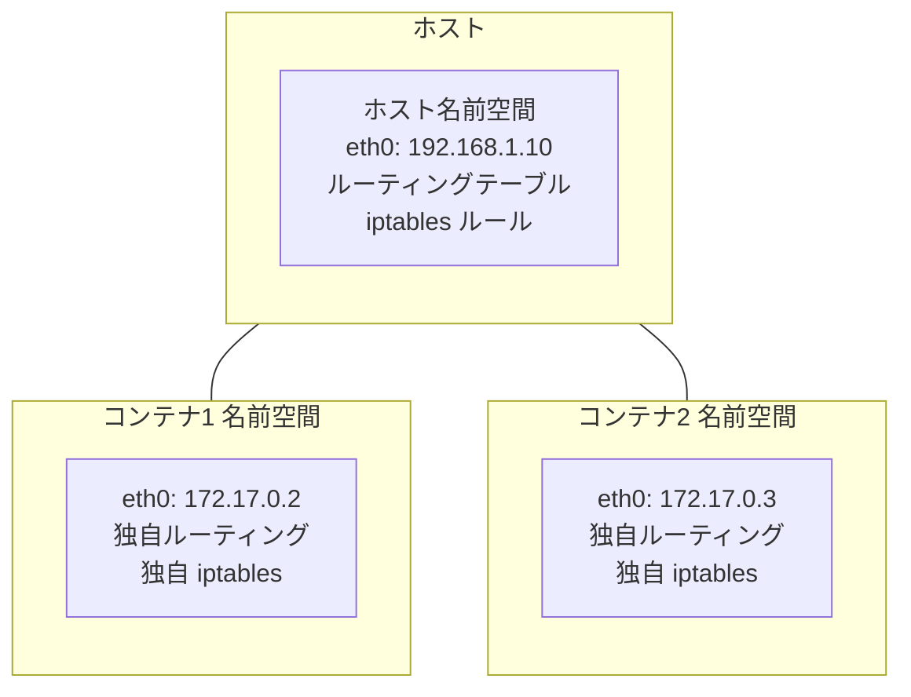

新しいネットワーク名前空間を作成した直後は、ループバックインターフェース (`lo`) すら起動していない。完全に空のネットワークスタックが用意されるだけであり、外部との通信手段は一切ない。ここから実用的なネットワーク接続を構築していくのが、コンテナネットワーキングの本質的な課題である。

### 1.3 /proc と名前空間の関係

Linuxカーネルは、各プロセスのネットワーク名前空間情報を `/proc/<pid>/ns/net` として公開している。同じ名前空間に属するプロセスは同じinode番号を持ち、`nsenter` コマンドを使えば任意のプロセスの名前空間に入ることができる。

```bash
# Check which network namespace a process belongs to
ls -la /proc/1/ns/net

# Enter the network namespace of a specific container process
nsenter -t <pid> -n ip addr show

# Compare namespaces of two processes
readlink /proc/<pid1>/ns/net
readlink /proc/<pid2>/ns/net
```

この仕組みは、コンテナのネットワークトラブルシューティングにおいて極めて重要である。`docker exec` や `kubectl exec` が内部的に行っているのは、まさにこの `nsenter` 相当の操作である。

## 2. veth ペア — 名前空間を繋ぐ仮想ケーブル

### 2.1 veth ペアとは何か

veth（Virtual Ethernet）ペアは、2つの仮想ネットワークインターフェースが仮想的なケーブルで接続されたものである。一方のインターフェースに送信されたパケットは、もう一方のインターフェースで受信される。この仕組みは、異なるネットワーク名前空間間でパケットをやり取りするための基本的な手段を提供する。

物理的なイーサネットケーブルの両端にNICが付いている状態を想像すると理解しやすい。ただし、veth ペアは完全にカーネル内で実装されており、物理ハードウェアは一切関与しない。

```
ネットワーク名前空間A          ネットワーク名前空間B
+------------------+          +------------------+
|                  |          |                  |
|  veth-a ◄════════════════► veth-b             |
|  172.17.0.2/16   |          |  172.17.0.3/16   |
|                  |          |                  |
+------------------+          +------------------+
```

### 2.2 veth ペアの作成と設定

veth ペアの作成は `ip link add` コマンドで行う。作成時に2つのインターフェース名を指定し、その後でそれぞれを異なる名前空間に移動する。

```bash
# Create a veth pair
ip link add veth-host type veth peer name veth-container

# Move one end to a network namespace
ip link set veth-container netns container1

# Configure IP addresses
ip addr add 172.17.0.1/24 dev veth-host
ip netns exec container1 ip addr add 172.17.0.2/24 dev veth-container

# Bring interfaces up
ip link set veth-host up
ip netns exec container1 ip link set veth-container up
ip netns exec container1 ip link set lo up

# Verify connectivity
ip netns exec container1 ping 172.17.0.1
```

### 2.3 veth ペアのパケット処理パス

veth ペアのパケット処理は、カーネルの `net/core/dev.c` および `drivers/net/veth.c` で実装されている。パケットの送信側インターフェースから `dev_forward_skb()` が呼ばれ、受信側のインターフェースにソフトウェア割り込み（softirq）経由で配送される。

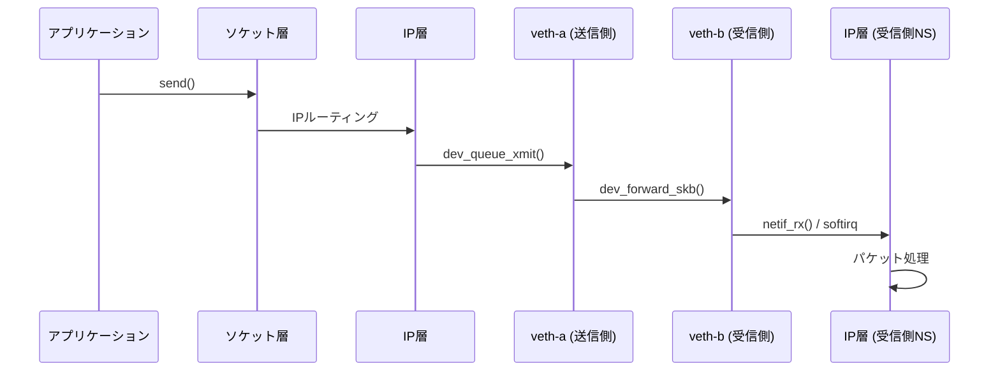

重要な特性として、veth ペアのパケット転送はカーネル内のメモリコピーで完結する。物理NICのDMAやハードウェア割り込みは発生しないため、レイテンシは非常に低い。ただし、ソフトウェア割り込みのオーバーヘッドは存在するため、ベアメタルの通信と比較すると若干の性能差がある。

### 2.4 veth ペアとコンテナランタイム

Docker がコンテナを起動する際、内部的には以下の手順が実行される。

1. 新しいネットワーク名前空間を作成する
2. veth ペアを作成する
3. veth ペアの一方をコンテナの名前空間に移動する
4. コンテナ側のインターフェースに `eth0` という名前を割り当てる
5. IPアドレスを設定する（IPAM から取得）
6. デフォルトルートをホスト側のブリッジに向ける
7. ホスト側の veth をブリッジに接続する

この一連の操作を自動化しているのがコンテナランタイムとCNIプラグインであり、ユーザーがこれらを手動で行う必要はない。しかし、トラブルシューティングの際にはこの内部構造の理解が不可欠となる。

## 3. ブリッジネットワーク — 同一ホスト内のコンテナ通信

### 3.1 Linux ブリッジの概要

Linux ブリッジ（`bridge`）は、カーネル内に実装されたソフトウェアL2スイッチである。複数の仮想インターフェースをブリッジに接続することで、それらのインターフェース間でイーサネットフレームを転送できる。Docker のデフォルトネットワークモード（`bridge`モード）は、この Linux ブリッジをコンテナ間通信の基盤として使用する。

```
                     ホスト名前空間
┌──────────────────────────────────────────────────────┐
│                                                      │
│    docker0 (bridge)  172.17.0.1/16                   │
│    ┌────────┬────────┬────────┐                      │
│    │        │        │        │                      │
│  veth-a   veth-b   veth-c    │                      │
│    │        │        │        │           eth0       │
│    │        │        │        │        (物理NIC)      │
└────┼────────┼────────┼────────┼──────────┤──────────┘
     │        │        │                   │
┌────┤   ┌────┤   ┌────┤                   │
│ eth0│   │ eth0│   │ eth0│            インターネット
│ .2  │   │ .3  │   │ .4  │
│     │   │     │   │     │
│ C1  │   │ C2  │   │ C3  │
└─────┘   └─────┘   └─────┘
```

### 3.2 ブリッジのフレーム転送メカニズム

Linux ブリッジは、物理的なL2スイッチと同様にMACアドレステーブル（FDB: Forwarding Database）を学習・維持する。あるポートからフレームが到着すると、送信元MACアドレスとポートの対応を学習し、宛先MACアドレスに対応するポートにのみフレームを転送する。宛先が不明な場合はフラッディング（全ポートへの転送）を行う。

```bash
# Create a bridge
ip link add name br0 type bridge
ip link set br0 up

# Attach veth endpoints to the bridge
ip link set veth-a master br0
ip link set veth-b master br0

# Show the bridge's forwarding database
bridge fdb show br0

# Show bridge port information
bridge link show
```

### 3.3 Docker のデフォルトブリッジネットワーク

Docker をインストールすると、`docker0` という名前のブリッジが自動的に作成される。デフォルトでは `172.17.0.0/16` のサブネットが割り当てられ、ブリッジ自体には `172.17.0.1` が設定される。各コンテナの veth ペアのホスト側端はこのブリッジに接続される。

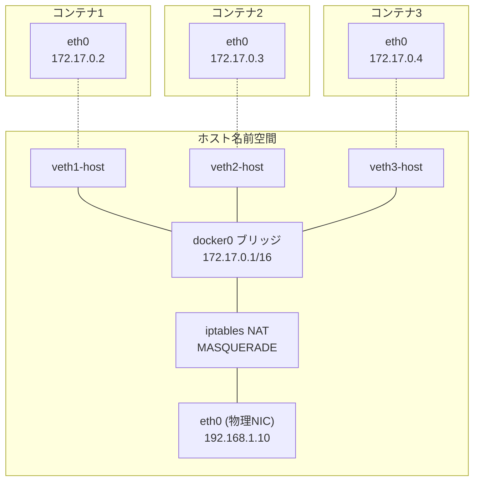

### 3.4 ユーザー定義ブリッジネットワーク

Docker のデフォルトブリッジネットワークにはいくつかの制限がある。最も大きな制限は、コンテナ名による名前解決ができないことである。Docker Compose やマイクロサービス環境では、ユーザー定義ブリッジネットワークを作成して使用するのが推奨される。

```bash
# Create a user-defined bridge network
docker network create --driver bridge --subnet 10.0.1.0/24 my-network

# Run containers on the custom network
docker run -d --name web --network my-network nginx
docker run -d --name api --network my-network my-api-image

# Containers can resolve each other by name
docker exec web ping api
```

ユーザー定義ブリッジネットワークでは、Docker 内蔵の DNS サーバー（`127.0.0.11`）が自動的に設定され、コンテナ名からIPアドレスへの名前解決が可能になる。これは後述するサービスディスカバリの基盤となる。

### 3.5 ブリッジネットワークの制約

ブリッジネットワークは同一ホスト内のコンテナ通信にのみ対応する。異なる物理ホスト上のコンテナ間で通信するには、Overlay ネットワークなどの追加的な仕組みが必要となる。また、ブリッジネットワークではL2ドメインが共有されるため、大量のコンテナが存在するとARPストームやブロードキャストトラフィックの増加が問題になることがある。

## 4. Overlay ネットワーク — 複数ホストにまたがるコンテナ通信

### 4.1 Overlay ネットワークの必要性

コンテナオーケストレーション環境（Docker Swarm, Kubernetes など）では、複数の物理ホストにまたがってコンテナが展開される。これらのコンテナが、あたかも同一のL2ネットワーク上にいるかのように通信できる仕組みが必要となる。Overlay ネットワークは、既存の物理ネットワーク（アンダーレイ）の上に仮想的なネットワーク（オーバーレイ）を構築することで、この課題を解決する。

### 4.2 VXLAN の仕組み

VXLAN（Virtual Extensible LAN）は、Overlay ネットワークの実装として最も広く使われているプロトコルである。RFC 7348 で標準化されており、Linux カーネルにネイティブ実装されている。

VXLANの基本的な動作は、L2フレームをUDPパケットにカプセル化して物理ネットワーク上で転送するというものである。

```
オリジナルフレーム:
+--------+--------+---------+
| Dst MAC| Src MAC| Payload |
+--------+--------+---------+

VXLANカプセル化後:
+----------+----------+--------+--------+--------+----------+--------+--------+---------+
| Outer    | Outer    | Outer  | Outer  | VXLAN  | Inner    | Inner  | Inner  | Inner   |
| Dst MAC  | Src MAC  | Src IP | Dst IP | Header | Dst MAC  | Src MAC| IP Hdr | Payload |
+----------+----------+--------+--------+--------+----------+--------+--------+---------+
|<--- 物理ネットワーク層 --->|<-UDP->|<-VNI->|<-------- オリジナルフレーム -------->|
```

VXLANヘッダーには24ビットのVNI（VXLAN Network Identifier）が含まれており、最大約1,677万のネットワークセグメントを識別できる。これは従来のVLANの4,094（12ビット）という制限を大幅に超えるものである。

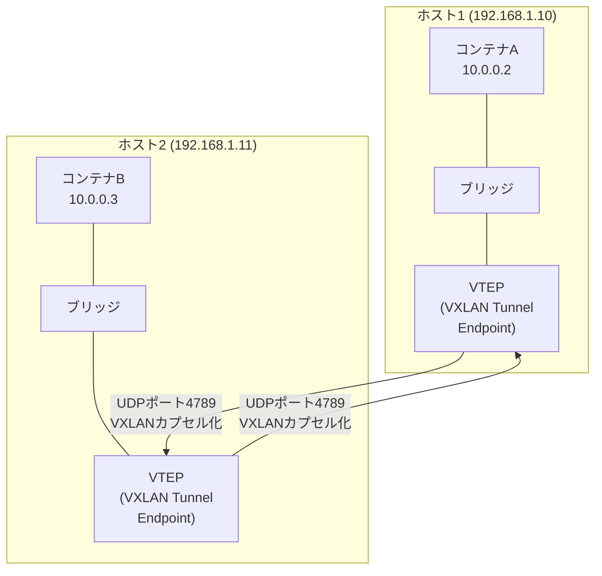

### 4.3 VXLAN のパケット処理フロー

コンテナAからコンテナBへパケットが送信される場合、以下の処理が行われる。

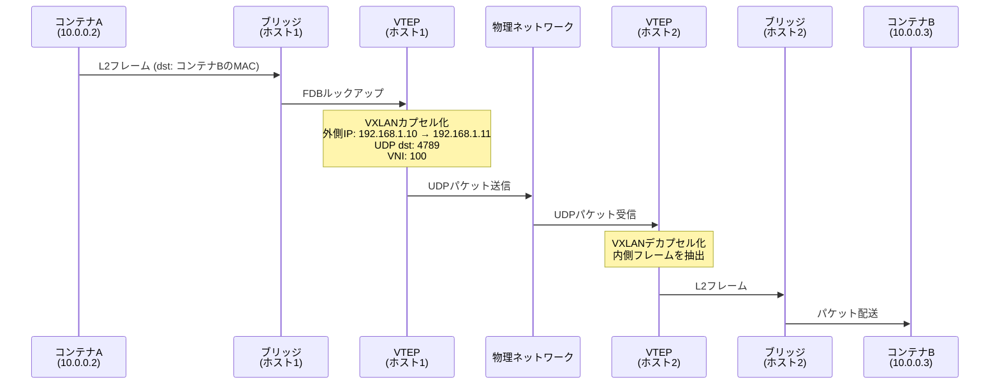

### 4.4 FDB とARP の管理

VXLAN において重要なのは、内側のMACアドレスと外側のVTEPアドレスの対応をどのように管理するかという問題である。以下の3つのアプローチが存在する。

**マルチキャスト方式**: VXLAN の RFC で定義された標準方式。未知のMACアドレス宛のフレームをマルチキャストグループに送信し、全VTEPにフラッディングする。物理ネットワークがマルチキャストをサポートしている必要がある。

**ユニキャスト方式（静的設定）**: 各VTEPのFDBを手動または自動化ツールで設定する。マルチキャスト不要だが、スケーラビリティに課題がある。

**コントロールプレーン方式**: etcd や Consul などの分散KVSに対応情報を格納し、各ノードが参照する。Flannel や Calico がこのアプローチを採用している。

```bash
# Create a VXLAN interface
ip link add vxlan100 type vxlan id 100 \
  local 192.168.1.10 \
  dstport 4789 \
  nolearning

# Add static FDB entry
bridge fdb add 00:00:00:00:00:00 dev vxlan100 dst 192.168.1.11
bridge fdb add <container_mac> dev vxlan100 dst 192.168.1.11

# Add ARP entry to avoid broadcast
ip neigh add 10.0.0.3 lladdr <container_mac> dev vxlan100 nud permanent
```

### 4.5 Overlay ネットワークのオーバーヘッド

VXLANによるカプセル化には以下のオーバーヘッドが伴う。

- **ヘッダーオーバーヘッド**: 外側イーサネット（14B）+ 外側IP（20B）+ UDP（8B）+ VXLAN（8B）= 50バイトの追加ヘッダー
- **MTU の縮小**: 通常のイーサネットMTU 1500バイトに対し、VXLANでは内側のMTUが1450バイトに制限される。MTU設定の不一致はパケットフラグメンテーションやパフォーマンス劣化を引き起こす
- **CPU負荷**: カプセル化・デカプセル化処理にCPUリソースが必要。ただし、最新のNICはVXLANのハードウェアオフロードをサポートしている

## 5. CNI プラグインの仕組み

### 5.1 CNI とは何か

CNI（Container Network Interface）は、コンテナのネットワーク接続を設定するための標準仕様である。CNCF（Cloud Native Computing Foundation）が管理しており、Kubernetes のネットワーキングの基盤となっている。

CNIの設計思想は極めてシンプルである。コンテナランタイム（containerd、CRI-Oなど）がCNIプラグイン（実行可能バイナリ）を呼び出し、コンテナのネットワーク名前空間にネットワークインターフェースを作成・設定する。プラグインは以下の操作をサポートする。

- **ADD**: コンテナにネットワークインターフェースを追加する
- **DEL**: コンテナからネットワークインターフェースを削除する
- **CHECK**: ネットワーク設定の正当性を検証する
- **VERSION**: サポートするCNI仕様のバージョンを返す

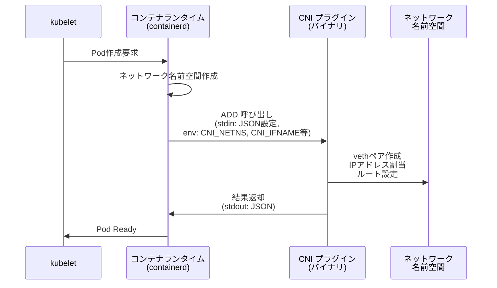

### 5.2 CNI 設定ファイル

CNI プラグインの設定は JSON 形式で記述され、通常 `/etc/cni/net.d/` ディレクトリに配置される。

```json
{
  "cniVersion": "1.0.0",
  "name": "my-bridge-network",
  "type": "bridge",
  "bridge": "cni0",
  "isGateway": true,
  "ipMasq": true,
  "ipam": {
    "type": "host-local",
    "subnet": "10.22.0.0/16",
    "routes": [
      { "dst": "0.0.0.0/0" }
    ]
  }
}
```

`type` フィールドが呼び出すプラグインのバイナリ名に対応する。`ipam` セクションはIPアドレス管理を担当する別のプラグインを指定する。このように、CNIはネットワーク接続とIPアドレス管理の責務を分離している。

### 5.3 プラグインチェーン

CNI では、複数のプラグインをチェーン（連鎖）として実行できる。これにより、基本的なネットワーク接続の上に、帯域制限やポートマッピングなどの機能を積み重ねることが可能になる。

```json
{
  "cniVersion": "1.0.0",
  "name": "my-network",
  "plugins": [
    {
      "type": "bridge",
      "bridge": "cni0",
      "ipam": {
        "type": "host-local",
        "subnet": "10.22.0.0/16"
      }
    },
    {
      "type": "portmap",
      "capabilities": {
        "portMappings": true
      }
    },
    {
      "type": "bandwidth",
      "ingressRate": 1000000,
      "egressRate": 1000000
    }
  ]
}
```

### 5.4 主要な CNI プラグイン

Kubernetes エコシステムには多数のCNIプラグインが存在する。それぞれが異なるアーキテクチャと設計方針を持っている。

| プラグイン | データプレーン | 特徴 |
|-----------|-------------|------|
| Flannel | VXLAN / host-gw | シンプル、導入容易 |
| Calico | BGP / VXLAN / eBPF | L3ルーティング、ネットワークポリシー充実 |
| Cilium | eBPF | 高性能、L7可視性、セキュリティ機能 |
| Weave Net | VXLAN / sleeve | メッシュ型、暗号化対応 |
| kube-router | BGP | BGPベース、軽量 |
| Multus | メタプラグイン | 複数CNIの同時利用 |

### 5.5 Flannel の内部動作

Flannel は最もシンプルなCNIプラグインの一つであり、VXLANバックエンドがデフォルトで使用される。各ノードにはクラスタ全体のCIDRからサブネットが割り当てられ、flanneld デーモンがノード間の経路情報を etcd または Kubernetes API 経由で同期する。

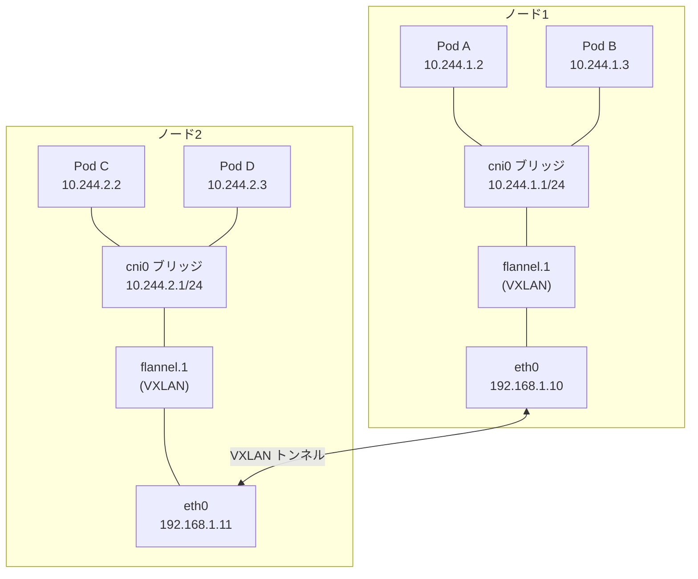

Flannel の `host-gw` バックエンドは VXLAN を使わず、各ノードのルーティングテーブルに直接経路を追加する。カプセル化のオーバーヘッドがないため高性能だが、全ノードが同一L2セグメントに存在する必要がある。

### 5.6 Calico の L3 アーキテクチャ

Calico は、コンテナネットワーキングにおいてユニークなアプローチを採用している。ブリッジやオーバーレイを使わず、各Podに `/32`（ホスト単位）のIPアドレスを割り当て、BGP（Border Gateway Protocol）で経路を交換する。

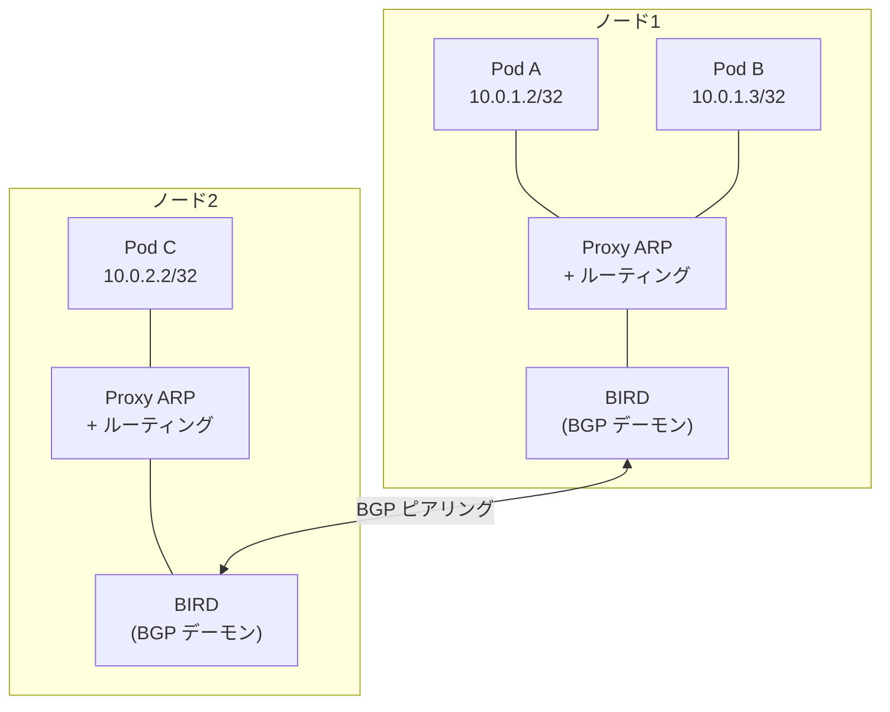

この設計では、各コンテナの veth ペアのホスト側端にIPアドレスは割り当てない。代わりに、Proxy ARP を使ってコンテナからのARP要求に応答し、カーネルのルーティングテーブルでパケットを転送する。ブリッジを経由しないため、L2のブロードキャストドメインの問題を回避できる。

大規模クラスタでは、BGPのフルメッシュ問題を避けるためにルートリフレクタを導入する。また、L3ルーティングが使えない環境（クラウドのVPCなど）では、VXLAN や IP-in-IP カプセル化にフォールバックすることもできる。

## 6. iptables/nftables によるNAT

### 6.1 コンテナのNATの必要性

コンテナには通常、プライベートIPアドレス（例: `172.17.0.0/16`）が割り当てられる。このアドレスはホスト外部からは到達できないため、コンテナが外部ネットワークと通信するにはNAT（Network Address Translation）が必要となる。

Linuxにおけるパケットフィルタリングとアドレス変換の仕組みは、従来は iptables（netfilter フレームワーク）が担ってきたが、近年は nftables への移行が進んでいる。さらに Cilium のように eBPF を使って netfilter をバイパスする手法も登場している。

### 6.2 Netfilter フックポイント

Linux カーネルの netfilter フレームワークは、パケットがネットワークスタックを通過する際の5つのフックポイントでパケットを処理する。

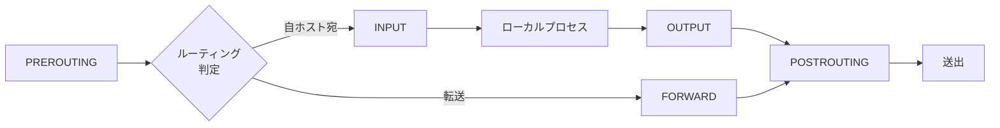

コンテナネットワーキングにおいて特に重要なのは以下のチェーンである。

- **PREROUTING（nat テーブル）**: DNAT（宛先アドレス変換）。ホストの公開ポートからコンテナの内部ポートへのマッピング
- **FORWARD（filter テーブル）**: コンテナ間のパケット転送の許可・拒否
- **POSTROUTING（nat テーブル）**: SNAT/MASQUERADE。コンテナから外部への通信で送信元アドレスをホストのIPに書き換え

### 6.3 Docker が設定する iptables ルール

Docker はコンテナの起動時に複数の iptables ルールを自動的に追加する。

```bash
# MASQUERADE: Outbound traffic from containers
iptables -t nat -A POSTROUTING -s 172.17.0.0/16 ! -o docker0 -j MASQUERADE

# DNAT: Port mapping (e.g., -p 8080:80)
iptables -t nat -A DOCKER -p tcp --dport 8080 \
  -j DNAT --to-destination 172.17.0.2:80

# FORWARD: Allow traffic to/from containers
iptables -A FORWARD -i docker0 -o docker0 -j ACCEPT
iptables -A FORWARD -i docker0 ! -o docker0 -j ACCEPT
iptables -A FORWARD -o docker0 -m conntrack --ctstate RELATED,ESTABLISHED -j ACCEPT
```

### 6.4 kube-proxy と iptables モード

Kubernetes の Service は、仮想IPアドレス（ClusterIP）を複数のPodエンドポイントに分散する仕組みである。kube-proxy コンポーネントがこの負荷分散を実現する方式として、iptables モードが広く使われている。

```bash
# ClusterIP Service example rules
# PREROUTING chain redirects to service chain
iptables -t nat -A PREROUTING -j KUBE-SERVICES

# Service chain: match ClusterIP and redirect to endpoint chains
iptables -t nat -A KUBE-SERVICES -d 10.96.0.100/32 -p tcp --dport 80 \
  -j KUBE-SVC-XXXX

# Load balancing across endpoints using random probability
iptables -t nat -A KUBE-SVC-XXXX -m statistic --mode random \
  --probability 0.33 -j KUBE-SEP-AAAA
iptables -t nat -A KUBE-SVC-XXXX -m statistic --mode random \
  --probability 0.50 -j KUBE-SEP-BBBB
iptables -t nat -A KUBE-SVC-XXXX -j KUBE-SEP-CCCC

# Endpoint chain: DNAT to actual Pod IP
iptables -t nat -A KUBE-SEP-AAAA -p tcp -j DNAT --to-destination 10.244.1.5:8080
```

この確率ベースの負荷分散は、iptables のルールが線形に評価されることと相まって、Service やエンドポイントの数が増加すると性能問題を引き起こす。数千のServiceが存在する大規模クラスタでは、iptables ルールの更新に数秒〜数十秒かかることがある。

### 6.5 IPVS モードと eBPF

iptables の性能問題を解決するため、kube-proxy は IPVS（IP Virtual Server）モードも提供している。IPVS はカーネル内のL4ロードバランサーであり、ハッシュテーブルベースのルックアップにより O(1) の計算量でパケットを処理する。

```bash
# Show IPVS rules
ipvsadm -Ln

# Example IPVS service
# TCP  10.96.0.100:80 rr
#   -> 10.244.1.5:8080    Masq    1      0          0
#   -> 10.244.2.3:8080    Masq    1      0          0
#   -> 10.244.3.7:8080    Masq    1      0          0
```

さらに、Cilium は eBPF を使用して netfilter を完全にバイパスし、XDP（eXpress Data Path）やTC（Traffic Control）フックでパケット処理を行う。これにより、iptables の線形チェーンや conntrack のオーバーヘッドを回避し、大幅な性能向上を実現している。

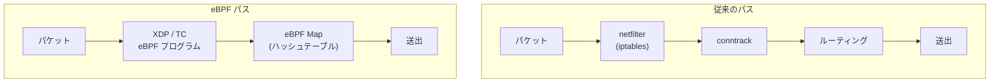

## 7. サービスディスカバリとDNS

### 7.1 コンテナ環境におけるサービスディスカバリの課題

コンテナ環境では、Podの作成と破棄が頻繁に発生し、IPアドレスは動的に変化する。アプリケーションが通信先のIPアドレスをハードコードすることは不可能であり、サービス名から動的にエンドポイントを解決する仕組みが必要となる。これがサービスディスカバリの本質的な課題である。

### 7.2 Docker の内蔵 DNS

Docker のユーザー定義ネットワークでは、各コンテナの `/etc/resolv.conf` に内蔵 DNS サーバー（`127.0.0.11`）が設定される。この DNS サーバーは、コンテナ名やネットワークエイリアスからIPアドレスを解決する。コンテナが作成・削除されるたびに、DNS レコードが自動的に更新される。

```bash
# Inside a container on a user-defined network
cat /etc/resolv.conf
# nameserver 127.0.0.11
# ndots:0

# Resolve another container by name
nslookup web
# Server:    127.0.0.11
# Address:   127.0.0.11#53
# Name:      web
# Address:   10.0.1.5
```

### 7.3 Kubernetes の DNS アーキテクチャ

Kubernetes では、CoreDNS がクラスタ内 DNS を担当する。CoreDNS は、Service と Pod の DNS レコードを自動的に管理し、以下の命名規則に従う。

- **Service**: `<service-name>.<namespace>.svc.cluster.local`
- **Pod**: `<pod-ip-dashed>.<namespace>.pod.cluster.local`
- **Headless Service**: 個々のPod IPを直接返す（ClusterIP なし）

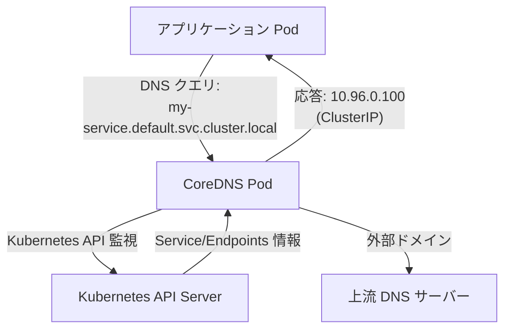

CoreDNS は Corefile という設定ファイルで動作を制御する。Kubernetes プラグインが API Server の Service と Endpoints リソースを監視し、DNS レコードをメモリ上に構築する。

```
.:53 {
    errors
    health
    kubernetes cluster.local in-addr.arpa ip6.arpa {
        pods insecure
        fallthrough in-addr.arpa ip6.arpa
    }
    forward . /etc/resolv.conf
    cache 30
    loop
    reload
    loadbalance
}
```

### 7.4 DNS クエリの最適化

Kubernetes 環境では、DNS クエリのパフォーマンスが全体のレイテンシに影響を与える。以下の最適化手法が知られている。

**ndots 設定の調整**: デフォルトの `ndots:5` は、ドット数が5未満のドメイン名に対して複数のサーチドメインを付加してクエリを発行するため、外部ドメインへのクエリが大量に増幅される。アプリケーションがFQDNを使用する場合、`ndots:1` や末尾にドットを付ける（`example.com.`）ことでクエリ数を削減できる。

```yaml
apiVersion: v1
kind: Pod
spec:
  dnsConfig:
    options:
      - name: ndots
        value: "1"
```

**NodeLocal DNSCache**: 各ノードにDNSキャッシュを配置し、CoreDNS Pod への集中を分散する。DaemonSet として動作し、iptables またはリンクローカルアドレス（`169.254.20.10`）経由でクエリを受け付ける。

## 8. ネットワークポリシー

### 8.1 ネットワークポリシーの必要性

デフォルトの Kubernetes クラスタでは、すべてのPod間の通信が許可されている。これはフラットなネットワークモデルとして開発者にとっては便利だが、セキュリティの観点からは望ましくない。たとえば、フロントエンドの Pod からデータベースの Pod に直接アクセスできてしまう。

ネットワークポリシーは、Pod間のトラフィックをラベルセレクタやCIDR範囲に基づいて制御する Kubernetes の仕組みである。ファイアウォールルールのコンテナ版と考えることができる。

### 8.2 NetworkPolicy リソース

Kubernetes の NetworkPolicy リソースは、Ingress（受信）と Egress（送信）のルールを宣言的に定義する。

```yaml
apiVersion: networking.k8s.io/v1
kind: NetworkPolicy
metadata:
  name: api-allow-frontend
  namespace: production
spec:
  podSelector:
    matchLabels:
      app: api
  policyTypes:
    - Ingress
    - Egress
  ingress:
    - from:
        - podSelector:
            matchLabels:
              app: frontend
        - namespaceSelector:
            matchLabels:
              env: production
      ports:
        - protocol: TCP
          port: 8080
  egress:
    - to:
        - podSelector:
            matchLabels:
              app: database
      ports:
        - protocol: TCP
          port: 5432
    - to:  # Allow DNS queries
        - namespaceSelector: {}
      ports:
        - protocol: UDP
          port: 53
        - protocol: TCP
          port: 53
```

::: warning
NetworkPolicy はCNIプラグインによって実装される。CNIプラグインがネットワークポリシーをサポートしていない場合（Flannel 単体など）、NetworkPolicy リソースを作成してもルールは適用されない。Calico や Cilium を使用するか、Flannel + Calico の組み合わせ（Canal）を使用する必要がある。
:::

### 8.3 ネットワークポリシーの実装方式

CNIプラグインによって、ネットワークポリシーの実装方式は異なる。

**Calico（iptables ベース）**: 各ノードの Felix エージェントが Kubernetes API を監視し、NetworkPolicy の変更を検知すると、対応する iptables ルールを動的に生成・更新する。各 Pod の veth インターフェースに iptables チェーンを設定し、パケット単位でフィルタリングを行う。

**Cilium（eBPF ベース）**: eBPF プログラムをTC（Traffic Control）フックにアタッチし、パケットの送受信時にBPFマップ（ハッシュテーブル）を参照してポリシー判定を行う。iptables を使用しないため、大量のポリシールールが存在しても性能劣化が少ない。さらに、L7（HTTP、gRPC）レベルのポリシーも eBPF で実現できる。

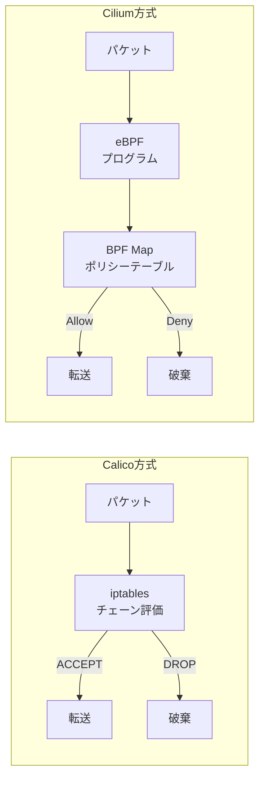

### 8.4 デフォルト拒否ポリシー

セキュリティのベストプラクティスとして、デフォルト拒否ポリシーを設定し、必要な通信のみを明示的に許可するホワイトリスト方式が推奨される。

```yaml
# Default deny all ingress traffic
apiVersion: networking.k8s.io/v1
kind: NetworkPolicy
metadata:
  name: default-deny-ingress
  namespace: production
spec:
  podSelector: {}
  policyTypes:
    - Ingress

# Default deny all egress traffic
---
apiVersion: networking.k8s.io/v1
kind: NetworkPolicy
metadata:
  name: default-deny-egress
  namespace: production
spec:
  podSelector: {}
  policyTypes:
    - Egress
```

このポリシーを適用した後、必要な通信パスのみを個別のNetworkPolicyで許可していく。Egress を制限する場合は、DNS（UDP/TCP 53）の通信を忘れずに許可する必要がある。これを忘れると、Pod がサービス名の解決をできなくなり、通信が一切できなくなる。

## 9. パフォーマンス最適化

### 9.1 コンテナネットワーキングのボトルネック

コンテナネットワーキングにおけるパフォーマンスのボトルネックは、大きく分けて以下の領域に存在する。

1. **データパスのオーバーヘッド**: veth ペア、ブリッジ、iptables、Overlay カプセル化など、パケットが通過するレイヤーが多いほどレイテンシとCPU消費が増加する
2. **コントロールプレーンのスケーラビリティ**: iptables ルールの更新、DNSクエリの集中、経路情報の同期
3. **カーネルのロック競合**: conntrack テーブルのロック、ソケットバッファの競合
4. **MTU とフラグメンテーション**: Overlay ネットワークによるMTU縮小がスループットに影響

### 9.2 eBPF によるデータパス最適化

eBPF は、コンテナネットワーキングのパフォーマンス最適化において最も注目されている技術である。Cilium を使用する場合、以下の最適化が実現される。

**iptables バイパス**: netfilter フレームワーク全体をスキップし、TC フックで直接パケット処理を行う。conntrack のオーバーヘッドも削減される。

**ソケットレベルリダイレクト**: 同一ノード上のPod間通信で、カーネルのネットワークスタック全体をバイパスし、ソケットバッファ間で直接データを転送する。`sock_ops` と `sk_msg` BPFプログラムにより実現される。

```
従来のパス（同一ノード内Pod間通信）:
App A → TCP → IP → veth → bridge → veth → IP → TCP → App B

eBPF 最適化パス:
App A → sock_ops → sk_msg → App B
```

**XDP（eXpress Data Path）**: NIC ドライバのレベルでパケットを処理し、カーネルのネットワークスタックに入る前にフィルタリングやリダイレクトを行う。DDoS対策やロードバランシングで数百万パケット/秒の処理が可能。

### 9.3 SR-IOV と DPDK

高性能が要求されるワークロード（NFV、5G、金融取引など）では、カーネルバイパス技術が使用される。

**SR-IOV（Single Root I/O Virtualization）**: 物理NICのハードウェア機能を利用して、仮想ファンクション（VF）をコンテナに直接割り当てる。veth ペアやブリッジを経由せず、コンテナがハードウェアレベルでネットワークにアクセスできるため、ベアメタルに近い性能が得られる。

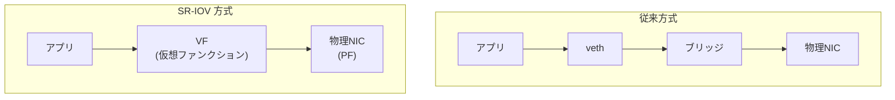

**DPDK（Data Plane Development Kit）**: カーネルのネットワークスタックを完全にバイパスし、ユーザー空間でパケット処理を行うフレームワーク。NICをポーリングモードで動作させることで、割り込みオーバーヘッドを排除する。ただし、CPUコアを専有するため、汎用ワークロードには適さない。

### 9.4 MTU の最適化

Overlay ネットワークを使用する環境では、MTU設定が性能に大きく影響する。VXLANの場合、50バイトのヘッダーオーバーヘッドがあるため、内側のMTUを適切に設定しなければフラグメンテーションが発生する。

```
物理ネットワーク MTU: 1500
  └─ VXLAN オーバーヘッド: 50
    └─ コンテナ MTU: 1450

物理ネットワーク MTU: 9000 (Jumbo Frame)
  └─ VXLAN オーバーヘッド: 50
    └─ コンテナ MTU: 8950
```

クラウド環境ではジャンボフレーム（MTU 9001）がサポートされていることが多い。AWSのVPC内では MTU 9001 が利用可能であり、これを活用することでVXLANのオーバーヘッドを相対的に小さくできる。

### 9.5 Conntrack チューニング

iptables ベースのネットワーキングでは、conntrack（接続追跡）テーブルのサイズが重要なチューニングパラメータとなる。大量の同時接続が存在する環境では、conntrack テーブルが溢れてパケットドロップが発生する。

```bash
# Check current conntrack table size
sysctl net.netfilter.nf_conntrack_max

# Increase conntrack table size
sysctl -w net.netfilter.nf_conntrack_max=1048576

# Check current entries
conntrack -C

# Monitor conntrack table usage
watch -n1 'conntrack -C; cat /proc/sys/net/netfilter/nf_conntrack_max'
```

conntrack テーブルが満杯になると `nf_conntrack: table full, dropping packet` というカーネルログが出力される。これはKubernetes環境で頻繁に遭遇する問題であり、NodePort Service を多用する環境や、短命なコネクションが大量に発生するワークロードで特に顕在化する。

### 9.6 TCP チューニング

コンテナ内のTCPスタックも性能に影響する。以下のカーネルパラメータが特に重要である。

```bash
# TCP buffer sizes (min, default, max)
sysctl -w net.core.rmem_max=16777216
sysctl -w net.core.wmem_max=16777216
sysctl -w net.ipv4.tcp_rmem="4096 87380 16777216"
sysctl -w net.ipv4.tcp_wmem="4096 65536 16777216"

# Enable TCP BBR congestion control
sysctl -w net.core.default_qdisc=fq
sysctl -w net.ipv4.tcp_congestion_control=bbr

# Increase local port range
sysctl -w net.ipv4.ip_local_port_range="1024 65535"

# Reuse TIME_WAIT sockets
sysctl -w net.ipv4.tcp_tw_reuse=1
```

::: tip
これらのカーネルパラメータはネットワーク名前空間ごとに設定できるもの（例: `tcp_congestion_control`）と、ホスト全体で共有されるもの（例: `nf_conntrack_max`）がある。コンテナ内から変更できるパラメータは限定的であり、多くの場合はノードレベルでの設定が必要となる。Kubernetes では `initContainers` に `privileged` コンテナを使用するか、ノードのチューニングにSysctl設定を適用する方法がある。
:::

### 9.7 ベンチマークと計測

ネットワーク最適化の効果を正確に評価するには、適切なベンチマークツールを使用する必要がある。

```bash
# Throughput measurement with iperf3
# Server side (in container B)
iperf3 -s

# Client side (in container A)
iperf3 -c <container-b-ip> -t 30 -P 4

# Latency measurement with sockperf
sockperf ping-pong -i <container-b-ip> -p 12345 --tcp

# HTTP layer benchmarking
wrk -t4 -c100 -d30s http://<service-ip>/

# Network path analysis
traceroute -n <destination-ip>
```

最適化を行う際は、まず現状のベースラインを計測し、変更後に同じ条件で再計測して効果を定量的に評価することが重要である。「速くなった気がする」では不十分であり、レイテンシのp50/p95/p99、スループット（Gbps）、パケットレート（pps）を客観的な数値で比較すべきである。

## まとめ — コンテナネットワーキングの全体像

コンテナネットワーキングは、Linuxカーネルの複数の機能を組み合わせることで実現されている。その全体像を改めて整理する。

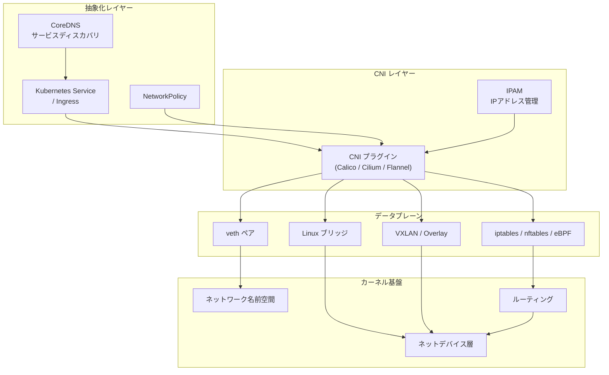

**ネットワーク名前空間**がプロセスのネットワークスタックを隔離し、**veth ペア**が名前空間間の通信路を提供する。**ブリッジ**が同一ホスト内のコンテナ間通信を仲介し、**Overlay（VXLAN）**が複数ホストにまたがる通信を可能にする。**iptables/nftables/eBPF**がNATとパケットフィルタリングを担い、**CNI プラグイン**がこれらの設定を自動化する。そして**DNS**がサービスディスカバリを、**NetworkPolicy**がマイクロセグメンテーションを実現する。

これらの技術は個別に見れば、それぞれがLinuxカーネルやネットワーキングの既存技術の延長線上にある。コンテナネットワーキングの本質は、これらを統合し、宣言的なAPIで制御可能にしたことにある。Kubernetes の NetworkPolicy を1つ書くだけで、裏では iptables ルールや eBPF プログラムが動的に生成・適用される。この抽象化の階層構造を理解することが、コンテナネットワーキングのトラブルシューティングやパフォーマンスチューニングにおいて最も重要な知識となる。

今後の方向性としては、eBPF のさらなる活用、サービスメッシュとの統合（sidecar-less アーキテクチャ）、マルチクラスタネットワーキング、そして IPv6 ネイティブ環境への移行が進んでいく。特に eBPF は、従来 iptables が担っていたほぼすべての機能を、より高い性能と柔軟性で置き換えつつあり、コンテナネットワーキングのデータプレーンにおける標準技術になりつつある。
