# コンテナオブザーバビリティパイプライン

## なぜオブザーバビリティが必要なのか

### モノリスからマイクロサービスへの移行がもたらした複雑性

かつてモノリシックなアプリケーションでは、1台のサーバーにSSHでログインし、ログファイルを`tail -f`で眺め、`top`コマンドでリソース状況を確認すれば、多くの問題を特定できた。アプリケーションの状態は単一プロセスに閉じており、デバッグの範囲は明確だった。

しかし、マイクロサービスアーキテクチャとコンテナオーケストレーションの普及により、この素朴なアプローチは完全に破綻した。1つのユーザーリクエストが10個以上のサービスを横断し、各サービスが複数のコンテナインスタンスで動作し、それらが数百ノードに分散している環境では「どこで何が起きているのか」を把握すること自体が困難な課題となる。

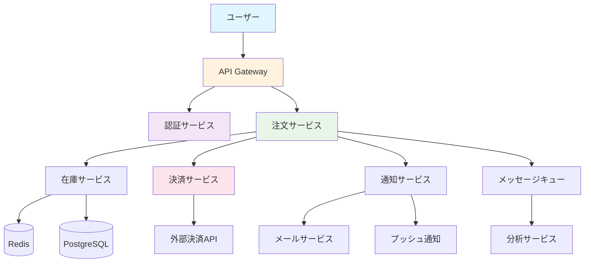

この図のように、1つのリクエストが多数のサービスを経由する。注文処理が遅い場合、その原因は認証サービスのレイテンシかもしれないし、在庫サービスのデータベースクエリかもしれない。あるいは決済サービスと外部APIとの通信の問題かもしれない。従来の監視（Monitoring）だけでは、こうした問題の根本原因を特定するのは極めて難しい。

### MonitoringからObservabilityへ

Monitoring（監視）とObservability（オブザーバビリティ、可観測性）は、しばしば混同されるが、本質的に異なる概念である。

**Monitoring**は「既知の問題を検出する」ためのアプローチである。CPUが80%を超えたらアラートを出す、レスポンスタイムが1秒を超えたらアラートを出す、といった具合に、事前に定義した閾値に基づいて問題を検出する。しかし、これは「何を監視すべきか」を事前に知っている必要がある。

**Observability**は「未知の問題を調査できる」ためのアプローチである。システムの内部状態を外部から推測できる能力のことであり、事前に想定していなかった問題に対しても、テレメトリデータを組み合わせて根本原因にたどり着くことができる。制御工学に由来する概念であり、「システムの出力から内部状態を再構成できる度合い」と定義される。

つまり、Monitoringが「ダッシュボードの赤いランプが点灯したから問題がある」と教えてくれるのに対し、Observabilityは「なぜそのランプが点灯したのか、根本原因は何か」を探索的に調査できる基盤を提供する。

## オブザーバビリティの3本柱

オブザーバビリティは、3種類のテレメトリデータ（シグナル）によって構成される。これらは「3本柱（Three Pillars）」と呼ばれ、それぞれが異なる観点からシステムの状態を記述する。

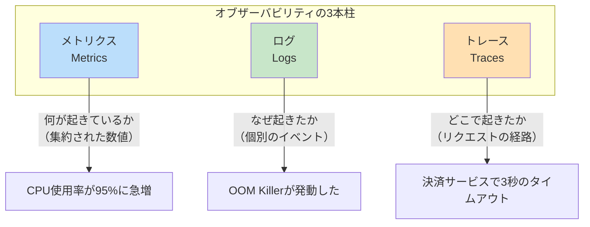

### メトリクス（Metrics）

メトリクスは、時間軸に沿って集約された数値データである。特定の時点におけるシステムの状態を定量的に表現する。

メトリクスの主な種類は以下の通りである。

| 種類 | 説明 | 例 |
|------|------|-----|
| **Counter** | 単調増加する累積値 | リクエスト総数、エラー発生回数 |
| **Gauge** | 任意に上下する瞬時値 | CPU使用率、メモリ使用量、キュー深度 |
| **Histogram** | 値の分布を表現 | レスポンスタイムの分布（p50, p95, p99） |
| **Summary** | クライアント側で計算した分位数 | 類似だがサーバー側集約が困難 |

メトリクスの最大の強みは、データ量が時系列の数に比例し、リクエスト数には依存しない点である。毎秒10万リクエストを処理するサービスでも、「リクエスト数」というメトリクスは1つの時系列として管理できる。そのため、長期間の保存やリアルタイムのアラート判定に適している。

一方で、メトリクスは集約された情報であるため、個別のリクエストで何が起きたかを追跡することはできない。「平均レスポンスタイムが上昇した」ことはわかるが、「どのリクエストが遅かったのか」はメトリクスだけでは特定できない。

### ログ（Logs）

ログは、特定の時点で発生した個別のイベントを記録したテキストまたは構造化データである。

```json
{
  "timestamp": "2026-03-05T10:23:45.123Z",
  "level": "ERROR",
  "service": "order-service",
  "trace_id": "abc123def456",
  "span_id": "789ghi",
  "message": "Failed to process order",
  "error": "PaymentTimeoutException",
  "order_id": "ORD-2026-0305-001",
  "user_id": "USR-42",
  "duration_ms": 3052
}
```

構造化ログ（Structured Logging）は、オブザーバビリティにおけるログの基本形式である。従来のプレーンテキストログ（`[ERROR] 2026-03-05 Something went wrong`）とは異なり、JSON等の構造化フォーマットで出力することで、検索・フィルタリング・集約が容易になる。

ログの強みは、個別のイベントに関する詳細なコンテキスト情報を含むことである。エラーメッセージ、スタックトレース、関連するビジネスデータなど、問題の原因調査に必要な情報を直接的に記録できる。

一方で、ログは高コストなシグナルである。すべてのイベントを個別に記録するため、トラフィックに比例してデータ量が増大する。大規模システムでは1日に数テラバイトのログが生成されることも珍しくない。保存コスト、転送コスト、検索コストの管理が重要な課題となる。

### トレース（Traces）

分散トレースは、1つのリクエストが複数のサービスを横断する際の経路と各サービスでの処理時間を可視化するデータである。

```mermaid
gantt
    title 分散トレースの例：注文API
    dateFormat X
    axisFormat %L ms

    section API Gateway
    リクエスト受信・ルーティング : 0, 50

    section 認証サービス
    トークン検証 : 50, 120

    section 注文サービス
    注文データ作成 : 120, 200
    在庫確認呼び出し : 200, 450
    決済呼び出し : 450, 900
    レスポンス構築 : 900, 950

    section 在庫サービス
    DB問い合わせ : 210, 440

    section 決済サービス
    外部API呼び出し : 460, 880
```

トレースは「スパン（Span）」の集合体として構成される。各スパンは1つの処理単位（関数呼び出し、HTTPリクエスト、データベースクエリなど）を表し、開始時刻・終了時刻・メタデータを含む。スパン同士は親子関係を持ち、トレースID（Trace ID）によって1つのリクエスト全体が紐付けられる。

トレースの最大の価値は、分散システムにおけるリクエストの全体像を可視化できることである。上の例では、注文APIの全体レスポンスタイム（950ms）のうち、決済サービスの外部API呼び出し（420ms）がボトルネックであることが一目で判断できる。

### 3つのシグナルの相互関係

3つのシグナルは単独でも有用だが、相互に関連付けることで真の力を発揮する。

1. **メトリクスでアラートを検出**: 注文APIのエラーレートが急増（Counter）
2. **トレースで問題箇所を特定**: エラーが発生したリクエストのトレースを確認し、決済サービスのスパンでエラーが発生していることを特定
3. **ログで根本原因を調査**: 決済サービスの該当Trace IDのログを確認し、外部決済APIの証明書期限切れが原因であることを突き止める

この「メトリクス → トレース → ログ」の流れは、オブザーバビリティにおける典型的な調査パターンである。これを効果的に実現するためには、3つのシグナル間でTrace IDやSpan ID等のコンテキスト情報を共有する必要がある。これを「テレメトリの相関（Correlation）」と呼ぶ。

## OpenTelemetryの概要

### OTelの誕生と意義

OpenTelemetry（OTel）は、テレメトリデータの生成・収集・エクスポートのための標準化されたフレームワークである。Cloud Native Computing Foundation（CNCF）のプロジェクトであり、2019年にOpenTracingとOpenCensusの2つのプロジェクトが統合されて誕生した。

OpenTelemetryが解決する根本的な問題は「ベンダーロックイン」と「計装の断片化」である。OpenTelemetry以前は、各オブザーバビリティベンダー（Datadog、New Relic、Dynatraceなど）が独自のSDKとデータフォーマットを持っていた。アプリケーションコードにベンダー固有の計装コードを埋め込む必要があり、バックエンドを変更する際にはアプリケーションコードの書き換えが必要だった。

OpenTelemetryは、テレメトリデータの「生成」と「送信先」を分離する。アプリケーションはOpenTelemetryの標準APIで計装し、データの送信先（バックエンド）は設定で切り替えられる。これにより、ベンダーに依存しないテレメトリ基盤を構築できる。

### OpenTelemetryのアーキテクチャ

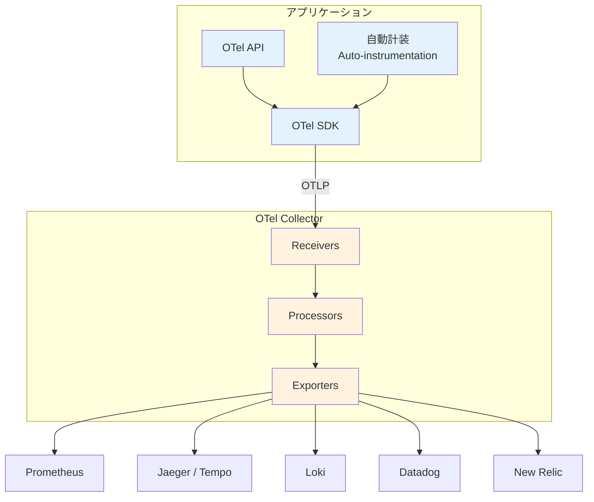

OpenTelemetryは以下の主要コンポーネントで構成される。

#### API

OTel APIは、アプリケーションコードが直接利用するインターフェースである。トレースの作成、メトリクスの記録、ログの出力に使用する。API自体は実装を持たず、SDK（後述）が実際の処理を担当する。これにより、ライブラリ作者はOTel APIに対して計装を行い、エンドユーザーがSDKの設定でバックエンドを選択できる。

#### SDK

OTel SDKは、APIの実装であり、テレメトリデータのサンプリング、バッチ処理、エクスポートを行う。各言語（Go、Java、Python、JavaScript、.NETなど）に対応したSDKが提供されている。

```go
package main

import (
    "context"
    "go.opentelemetry.io/otel"
    "go.opentelemetry.io/otel/exporters/otlp/otlptrace/otlptracegrpc"
    "go.opentelemetry.io/otel/sdk/trace"
)

func initTracer() (*trace.TracerProvider, error) {
    // Create OTLP exporter
    exporter, err := otlptracegrpc.New(
        context.Background(),
        otlptracegrpc.WithEndpoint("otel-collector:4317"),
        otlptracegrpc.WithInsecure(),
    )
    if err != nil {
        return nil, err
    }

    // Create TracerProvider with batch span processor
    tp := trace.NewTracerProvider(
        trace.WithBatcher(exporter),
        trace.WithSampler(trace.ParentBased(
            trace.TraceIDRatioBased(0.1), // Sample 10% of traces
        )),
    )
    otel.SetTracerProvider(tp)
    return tp, nil
}
```

#### 自動計装（Auto-instrumentation）

自動計装は、アプリケーションコードを変更せずにテレメトリデータを生成する仕組みである。HTTPクライアント/サーバー、データベースドライバ、メッセージングライブラリなど、一般的なフレームワークやライブラリに対する計装が事前に用意されている。Java ではJavaagent、Pythonではインポートフックなど、言語固有のメカニズムを活用する。

#### OTel Collector

OTel Collectorは、テレメトリデータの受信・処理・エクスポートを行う独立したプロセスである。アプリケーションとバックエンドの間に配置され、データのルーティング、変換、フィルタリングを担当する。

Collectorは3つのパイプラインコンポーネントで構成される。

- **Receivers**: テレメトリデータを受信する。OTLP、Prometheus、Jaeger、Zipkin等の多様なフォーマットに対応
- **Processors**: データの加工を行う。バッチ処理、サンプリング、属性の追加/削除、メモリ制限など
- **Exporters**: データをバックエンドに送信する。Prometheus、Jaeger、Loki、各種SaaSなどに対応

```yaml
# otel-collector-config.yaml
receivers:
  otlp:
    protocols:
      grpc:
        endpoint: 0.0.0.0:4317
      http:
        endpoint: 0.0.0.0:4318
  prometheus:
    config:
      scrape_configs:
        - job_name: 'kubernetes-pods'
          kubernetes_sd_configs:
            - role: pod

processors:
  batch:
    timeout: 5s
    send_batch_size: 1000
  memory_limiter:
    check_interval: 1s
    limit_mib: 512
    spike_limit_mib: 128
  attributes:
    actions:
      - key: environment
        value: production
        action: upsert

exporters:
  prometheusremotewrite:
    endpoint: "http://prometheus:9090/api/v1/write"
  otlp/tempo:
    endpoint: "tempo:4317"
    tls:
      insecure: true
  loki:
    endpoint: "http://loki:3100/loki/api/v1/push"

service:
  pipelines:
    metrics:
      receivers: [otlp, prometheus]
      processors: [memory_limiter, batch]
      exporters: [prometheusremotewrite]
    traces:
      receivers: [otlp]
      processors: [memory_limiter, batch, attributes]
      exporters: [otlp/tempo]
    logs:
      receivers: [otlp]
      processors: [memory_limiter, batch]
      exporters: [loki]
```

### OTLP（OpenTelemetry Protocol）

OTLPは、OpenTelemetryが定義するテレメトリデータの転送プロトコルである。gRPCとHTTPの2つのトランスポートをサポートし、メトリクス・ログ・トレースのすべてのシグナルを統一的に転送できる。Protocol Buffersをベースとしたスキーマにより、効率的なシリアライゼーションと明確な型定義を実現している。

OTLPの標準化により、テレメトリデータの「共通言語」が確立された。OTLPをサポートするバックエンドであれば、アプリケーション側の変更なしにバックエンドを切り替えることができる。

## Prometheusアーキテクチャ

### Prometheusとは何か

Prometheusは、SoundCloudで2012年に開発が始まったオープンソースのメトリクス監視・アラートシステムである。2016年にCNCFの2番目のプロジェクト（Kubernetesに次ぐ）として採択され、現在ではKubernetes環境におけるメトリクス収集のデファクトスタンダードとなっている。

Prometheusの設計思想の核心は「Pullモデル」にある。多くの監視システムが採用するPushモデル（監視対象がデータを監視サーバーに送信する）とは異なり、PrometheusはPullモデル（Prometheusサーバーが監視対象からデータを取得する）を採用している。

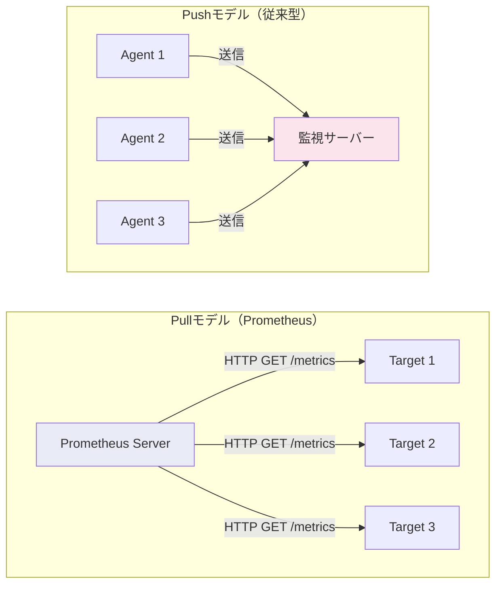

Pullモデルの利点は以下の通りである。

- **監視対象の状態把握が容易**: スクレイプが失敗すれば、対象がダウンしていることが即座にわかる
- **設定の一元管理**: Prometheusサーバー側でスクレイプ対象を管理するため、監視対象側にPush先の設定を配布する必要がない
- **開発時のデバッグが容易**: `/metrics`エンドポイントにブラウザでアクセスすれば、出力されているメトリクスを直接確認できる
- **バックプレッシャー不要**: 監視サーバーが自分のペースでデータを取得するため、監視対象からの大量データによる過負荷が発生しにくい

### Prometheusのコンポーネント

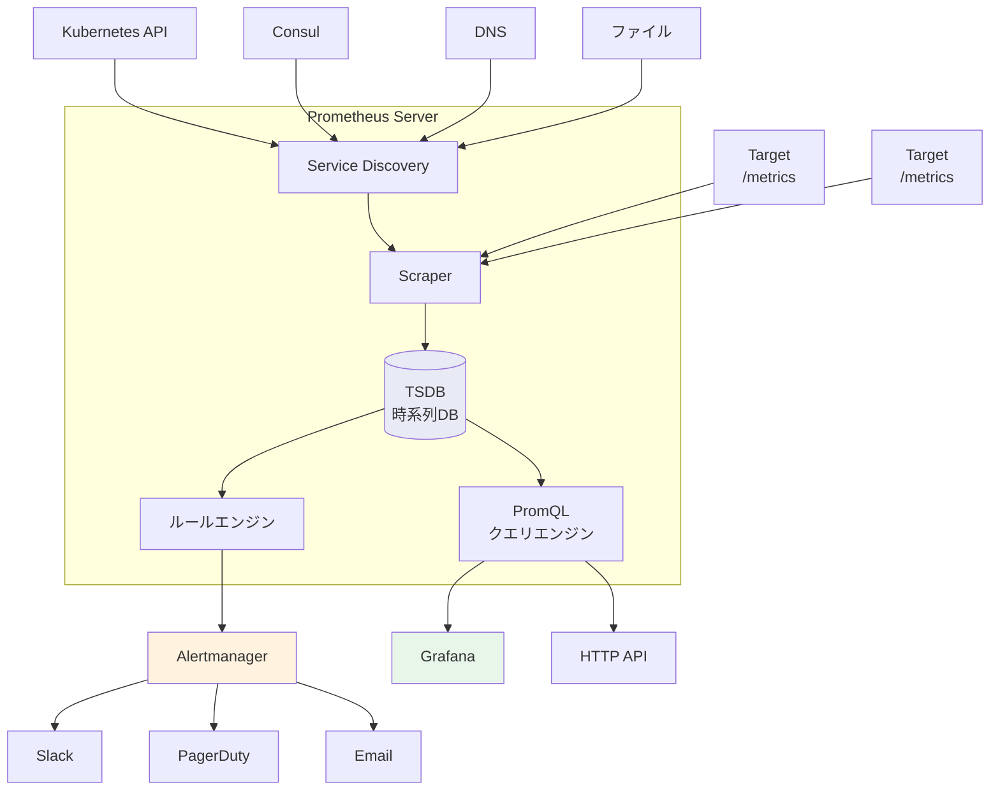

#### Service Discovery

Prometheusは、監視対象を動的に検出するService Discovery機能を持つ。Kubernetes環境では、Kubernetes APIを通じてPod、Service、Nodeなどのリソースを自動的に検出し、スクレイプ対象として登録する。アノテーションベースの設定により、特定のPodのみを対象にしたり、スクレイプのポートやパスをカスタマイズしたりできる。

#### TSDB（Time Series Database）

Prometheus内蔵のTSDBは、時系列データの効率的な保存に特化した設計を持つ。データは2時間ごとのブロックに分割され、各ブロックはイミュータブルなファイルとして保存される。WAL（Write-Ahead Log）により、未コミットのデータも安全に保持される。圧縮率は非常に高く、1サンプルあたり平均1〜2バイト程度で保存できる。

#### PromQL

PromQLは、Prometheus独自のクエリ言語であり、時系列データに対する強力な集約・フィルタリング機能を提供する。

```promql
# Request rate per second over the last 5 minutes
rate(http_requests_total{job="api-server"}[5m])

# 95th percentile latency
histogram_quantile(0.95, rate(http_request_duration_seconds_bucket{job="api-server"}[5m]))

# Error rate percentage
sum(rate(http_requests_total{status=~"5.."}[5m])) /
sum(rate(http_requests_total[5m])) * 100

# CPU usage per pod
sum by (pod) (rate(container_cpu_usage_seconds_total{namespace="production"}[5m]))

# Memory usage percentage per node
(1 - (node_memory_MemAvailable_bytes / node_memory_MemTotal_bytes)) * 100
```

PromQLの特徴的な関数として、`rate()`がある。`rate()`はCounterメトリクスの1秒あたりの変化量を計算する関数であり、リクエストレートやエラーレートの算出に不可欠である。Counterは単調増加する値であるため、生の値をそのまま見ても意味がなく、`rate()`で変化量に変換して初めて有用な情報になる。

#### Alertmanager

Alertmanagerは、Prometheusのアラートルールに基づいて発火したアラートを受信し、重複排除（Deduplication）、グルーピング（Grouping）、抑制（Inhibition）、サイレンス（Silence）などの処理を行った上で、通知先に配信するコンポーネントである。

### Prometheusの限界とスケーリング

Prometheusは単一サーバーで動作する設計であり、以下の限界がある。

- **水平スケーリング不可**: 単一のPrometheusインスタンスが扱えるメトリクス数には上限がある（数百万時系列程度）
- **長期保存に不向き**: ローカルストレージは数週間〜数ヶ月程度の保存が現実的
- **高可用性の欠如**: 単一障害点となる

これらの限界を克服するために、以下のソリューションが存在する。

| ソリューション | アプローチ | 特徴 |
|----------------|-----------|------|
| **Thanos** | サイドカーパターン | 既存のPrometheusに付加、オブジェクトストレージに長期保存 |
| **Cortex / Mimir** | Remote Write | 水平スケーラブルな分散バックエンド |
| **VictoriaMetrics** | 独自実装 | 高圧縮率、Prometheusとの高い互換性 |

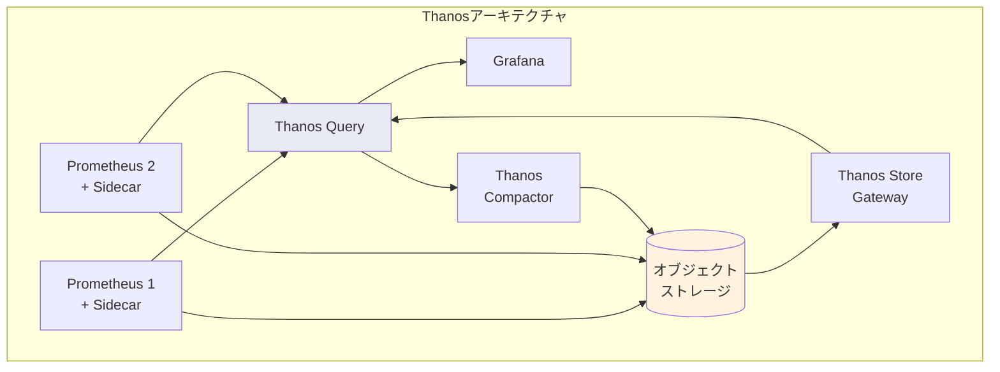

Thanosは最も広く採用されているスケーリングソリューションであり、既存のPrometheus環境への導入が比較的容易である。各Prometheusインスタンスにサイドカーを追加し、データをオブジェクトストレージ（S3、GCSなど）にアップロードする。Thanos Queryが複数のPrometheusインスタンスとStore Gatewayに対して統一的なクエリを提供し、グローバルビューを実現する。

## Grafanaダッシュボード

### Grafanaの役割

Grafanaは、オブザーバビリティスタックにおける可視化レイヤーを担うオープンソースのダッシュボードツールである。2014年にTorkel Odegaardによって開発が始まり、現在では事実上のオブザーバビリティダッシュボードの標準となっている。

Grafanaの核となる設計思想は「データソース非依存」である。Prometheus、Loki、Tempo、Elasticsearch、InfluxDB、PostgreSQLなど、50以上のデータソースに対応しており、異なるバックエンドのデータを1つのダッシュボード上で統合的に可視化できる。

### ダッシュボード設計の原則

効果的なダッシュボードは、以下の階層構造で設計することが推奨される。

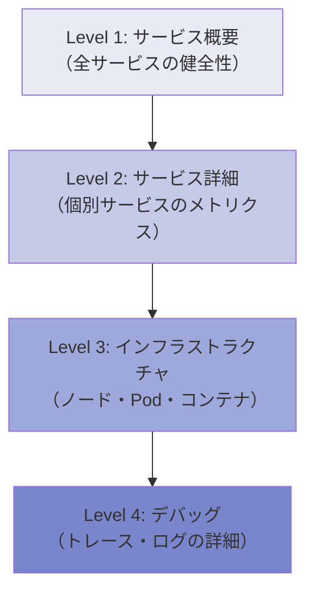

#### USE / REDメソッド

ダッシュボードに表示するメトリクスの選定には、確立されたフレームワークを活用する。

**USEメソッド**（Brendan Gregg提唱）はインフラストラクチャリソースの監視に適用する。

- **U**tilization（利用率）: リソースがどの程度使用されているか
- **S**aturation（飽和度）: リソースがどの程度飽和しているか（キュー待ち等）
- **E**rrors（エラー）: エラーイベントの数

**REDメソッド**（Tom Wilkie提唱）はサービスレベルの監視に適用する。

- **R**ate（レート）: 1秒あたりのリクエスト数
- **E**rrors（エラー）: 失敗したリクエストの割合
- **D**uration（所要時間）: リクエストの所要時間分布

```promql
# RED method example for Grafana panels

# Rate: Request per second
sum(rate(http_requests_total{service="order-service"}[5m]))

# Errors: Error rate percentage
sum(rate(http_requests_total{service="order-service", status=~"5.."}[5m]))
/ sum(rate(http_requests_total{service="order-service"}[5m])) * 100

# Duration: 95th percentile latency
histogram_quantile(0.95,
  sum by (le) (rate(http_request_duration_seconds_bucket{service="order-service"}[5m]))
)
```

### Grafanaの拡張エコシステム

Grafana Labsは、Grafanaを中心としたオブザーバビリティスタック全体を提供している。

- **Grafana Loki**: ログ集約システム
- **Grafana Tempo**: 分散トレーシングバックエンド
- **Grafana Mimir**: 長期メトリクスストレージ
- **Grafana Alloy（旧 Agent）**: テレメトリ収集エージェント
- **Grafana OnCall**: インシデント管理

これらは個別に利用することもできるが、統合して利用することで「メトリクスからトレースへ」「トレースからログへ」といったシームレスな遷移（Exemplar連携等）が可能になる。

## ログ集約

### なぜログ集約が必要なのか

Kubernetes環境では、コンテナは揮発的（Ephemeral）である。Podが再起動されれば、コンテナ内のログは消失する。また、1つのサービスが10個のPodで動作している場合、問題調査のために10個のPodに個別にアクセスしてログを確認することは現実的ではない。

ログ集約の目的は、分散したコンテナから発生するログを中央のストレージに収集し、統一的に検索・分析できるようにすることである。

### Fluentd / Fluent Bit

Fluentd（2011年〜）は、CNCFのGraduatedプロジェクトであるログ収集・転送エージェントである。プラグインアーキテクチャにより、多様な入力元と出力先をサポートする。

Fluent Bitは、Fluentdの軽量版として設計されたログ収集エージェントである。C言語で実装されており、メモリフットプリントが極めて小さい（数MB程度）。Kubernetes環境ではDaemonSetとしてデプロイされ、各ノード上のコンテナログを収集する。

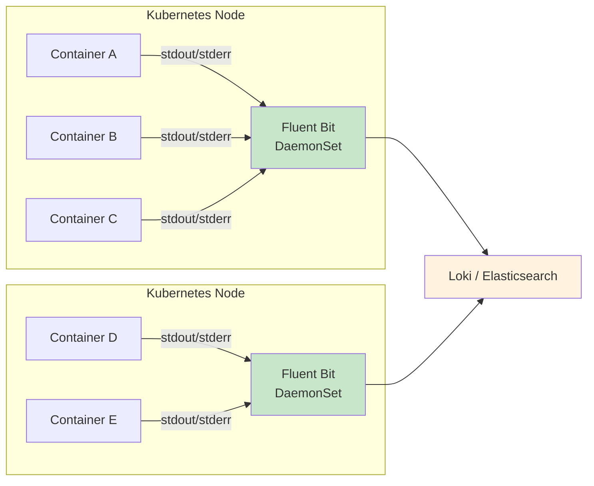

Kubernetesにおけるコンテナログの仕組みは以下の通りである。コンテナのstdout/stderrに出力されたログは、コンテナランタイム（containerd等）によって各ノードの`/var/log/containers/`配下にファイルとして書き出される。Fluent BitはこのファイルをTail入力プラグインで監視し、新しいログエントリを読み取る。読み取ったログは、パーサーによる構造化、フィルターによる加工を経て、出力プラグインによりバックエンドに転送される。

```yaml
# Fluent Bit configuration example
[SERVICE]
    Flush         5
    Log_Level     info
    Daemon        off
    Parsers_File  parsers.conf

[INPUT]
    Name              tail
    Tag               kube.*
    Path              /var/log/containers/*.log
    Parser            cri
    DB                /var/log/flb_kube.db
    Mem_Buf_Limit     5MB
    Skip_Long_Lines   On
    Refresh_Interval  10

[FILTER]
    Name                kubernetes
    Match               kube.*
    Kube_URL            https://kubernetes.default.svc:443
    Kube_CA_File        /var/run/secrets/kubernetes.io/serviceaccount/ca.crt
    Kube_Token_File     /var/run/secrets/kubernetes.io/serviceaccount/token
    Merge_Log           On
    K8S-Logging.Parser  On
    K8S-Logging.Exclude On

[OUTPUT]
    Name        loki
    Match       *
    Host        loki.monitoring.svc.cluster.local
    Port        3100
    Labels      job=fluent-bit
    Auto_Kubernetes_Labels On
```

### Grafana Loki

Lokiは、Grafana Labsが開発したログ集約システムである。「Prometheusのようなログシステム」というコンセプトで設計されており、ログ本文のフルテキストインデックスを作成しない点が最大の特徴である。

従来のログシステム（Elasticsearch/ELKスタック等）はログ本文の全文検索インデックスを作成するため、インデックスの構築と保存に膨大なリソースを消費する。Lokiは、ログ本文にはインデックスを作成せず、ラベル（Kubernetesのメタデータ等）のみをインデックスする。検索時は、まずラベルでログストリームを絞り込み、次に対象ストリーム内のログ本文をブルートフォースで検索する。

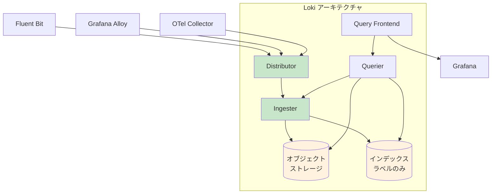

このアプローチのトレードオフは明確である。

| 観点 | Loki | Elasticsearch |
|------|------|---------------|
| インデックスサイズ | 非常に小さい | 大きい（ログ本文の数倍になることも） |
| ストレージコスト | 低い | 高い |
| 運用の複雑さ | 低い | 高い |
| 全文検索の速度 | 遅い（ブルートフォース） | 速い（転置インデックス） |
| ラベルベースの検索 | 高速 | 高速 |

多くのKubernetes環境では、ログの検索は「特定のサービス・特定の時間帯」に絞り込んだ上で行うことがほとんどであり、Lokiのアプローチは実用上十分な性能を提供する。加えて、コスト効率の高さは大規模環境では圧倒的な優位性となる。

#### LogQL

LogQLは、Lokiのクエリ言語であり、PromQLに強く影響を受けた構文を持つ。

```logql
# Basic log query: filter by labels
{namespace="production", app="order-service"} |= "error"

# Pipeline: parse JSON and filter
{app="order-service"} | json | status >= 500 | line_format "{{.method}} {{.path}} {{.status}}"

# Log-based metrics: error rate
sum(rate({app="order-service"} |= "ERROR" [5m])) by (pod)

# Top 10 slowest endpoints
topk(10,
  avg by (path) (
    {app="order-service"} | json | unwrap duration_ms [5m]
  )
)
```

## 分散トレーシング

### Jaeger

Jaegerは、Uber Technologiesが2015年に開発した分散トレーシングシステムである。CNCFのGraduatedプロジェクトであり、OpenTracingの参照実装として広く利用されてきた。

Jaegerの主な機能は以下の通りである。

- トレースデータの収集・保存・検索
- サービス依存関係の可視化（Service Dependency Graph）
- レイテンシ分析
- トレースの比較（正常時と異常時の比較）

バックエンドストレージとして、Elasticsearch、Cassandra、ClickHouseなどを選択できる。

### Grafana Tempo

Tempoは、Grafana Labsが開発した分散トレーシングバックエンドである。Lokiと同様の設計哲学を持ち、Trace IDのみをインデックスする。トレースデータ本体はオブジェクトストレージ（S3、GCS等）に保存され、検索はTrace IDによるルックアップが基本となる。

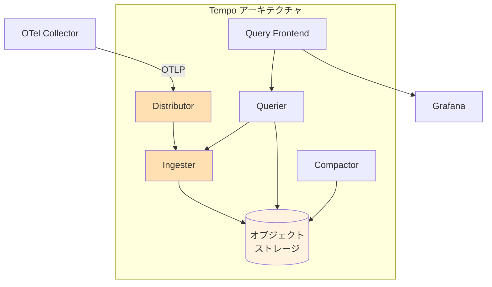

Tempoの最大の利点は運用コストの低さである。Elasticsearchのような複雑な分散データベースを運用する必要がなく、オブジェクトストレージに直接保存するため、ストレージコストも低い。Jaegerと比較して大幅に運用の手間が削減される。

### TraceQL

TraceQLはTempoのクエリ言語であり、トレースデータに対する柔軟な検索を可能にする。

```
# Find traces where order-service has latency > 1s
{ span.service.name = "order-service" && span.duration > 1s }

# Find traces with errors in payment-service
{ span.service.name = "payment-service" && status = error }

# Find traces spanning both services
{ span.service.name = "order-service" } && { span.service.name = "payment-service" }
```

### Exemplar：メトリクスとトレースの橋渡し

Exemplarは、メトリクスの特定のデータポイントから関連するトレースへの参照を埋め込む仕組みである。たとえば、Prometheusのヒストグラムバケットに対して、そのバケットに属する実際のリクエストのTrace IDを記録しておく。Grafanaのダッシュボード上で、メトリクスのグラフからワンクリックで該当トレースに遷移できるようになる。

これにより、前述の「メトリクス → トレース → ログ」という調査フローがシームレスに実現される。

## Kubernetes環境での構成

### 全体アーキテクチャ

Kubernetes環境における典型的なオブザーバビリティパイプラインの全体像を以下に示す。

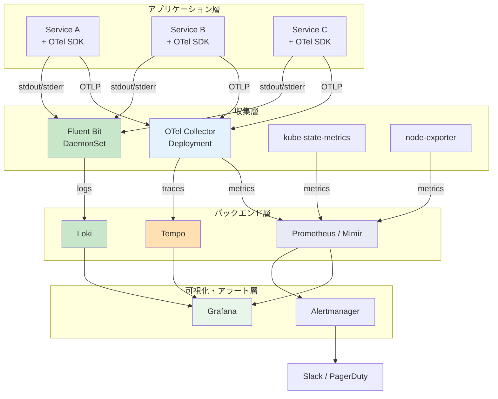

### デプロイパターン

各コンポーネントのKubernetesにおける代表的なデプロイパターンは以下の通りである。

| コンポーネント | デプロイ方式 | 理由 |
|----------------|-------------|------|
| **Fluent Bit** | DaemonSet | 各ノードのコンテナログを収集するため、全ノードに配置 |
| **OTel Collector** | Deployment（+ HPA） | アプリケーションからのOTLPデータを受信。負荷に応じてスケール |
| **node-exporter** | DaemonSet | 各ノードのハードウェア・OSメトリクスを収集 |
| **kube-state-metrics** | Deployment（1レプリカ） | Kubernetes APIからオブジェクトの状態メトリクスを生成 |
| **Prometheus** | StatefulSet | 永続的な時系列データを保持するため |
| **Loki** | StatefulSet / Deployment | マイクロサービスモードでは複数コンポーネントに分離 |
| **Tempo** | StatefulSet / Deployment | Lokiと同様 |
| **Grafana** | Deployment | ステートレス（ダッシュボード定義は外部DBまたはConfigMapに保存） |
| **Alertmanager** | StatefulSet | アラート状態の永続化のため |

### Helm Chartによるデプロイ

Kubernetes環境へのオブザーバビリティスタックのデプロイには、Helmチャートが広く利用されている。代表的なチャートは以下の通りである。

```bash
# Add Helm repositories
helm repo add prometheus-community https://prometheus-community.github.io/helm-charts
helm repo add grafana https://grafana.github.io/helm-charts

# Deploy kube-prometheus-stack (Prometheus + Grafana + Alertmanager + exporters)
helm install monitoring prometheus-community/kube-prometheus-stack \
  --namespace monitoring \
  --create-namespace \
  --set prometheus.prometheusSpec.retention=30d \
  --set prometheus.prometheusSpec.storageSpec.volumeClaimTemplate.spec.resources.requests.storage=100Gi

# Deploy Loki
helm install loki grafana/loki \
  --namespace monitoring \
  --set loki.storage.type=s3 \
  --set loki.storage.s3.endpoint=s3.amazonaws.com \
  --set loki.storage.s3.bucketnames=loki-chunks

# Deploy Tempo
helm install tempo grafana/tempo-distributed \
  --namespace monitoring \
  --set storage.trace.backend=s3

# Deploy OpenTelemetry Collector
helm install otel-collector open-telemetry/opentelemetry-collector \
  --namespace monitoring \
  --set mode=deployment
```

`kube-prometheus-stack`は特に重要なチャートであり、Prometheus Operator、Prometheus、Alertmanager、Grafana、node-exporter、kube-state-metricsなど、メトリクス監視に必要なコンポーネントを一括でデプロイできる。Prometheus Operatorは、`ServiceMonitor`や`PodMonitor`などのCustom Resource（CR）を通じて、Prometheusの監視対象を宣言的に管理する。

```yaml
# ServiceMonitor example
apiVersion: monitoring.coreos.com/v1
kind: ServiceMonitor
metadata:
  name: order-service
  namespace: production
  labels:
    release: monitoring
spec:
  selector:
    matchLabels:
      app: order-service
  endpoints:
    - port: metrics
      interval: 15s
      path: /metrics
  namespaceSelector:
    matchNames:
      - production
```

### Kubernetesメタデータの活用

Kubernetes環境のオブザーバビリティにおいて、メタデータの付与は極めて重要である。Pod名、Namespace、Node名、Deployment名、ラベルなどのKubernetesメタデータをテレメトリデータに付与することで、以下が可能になる。

- **Namespace単位のフィルタリング**: 環境（production、staging）やチーム単位でのダッシュボード
- **Deployment単位の集約**: サービスレベルのメトリクス算出
- **Node単位の分析**: インフラストラクチャの問題切り分け
- **Pod単位のドリルダウン**: 特定インスタンスの詳細調査

OpenTelemetryの`k8sattributes`プロセッサやFluent Bitの`kubernetes`フィルターは、テレメトリデータにこれらのメタデータを自動的に付与する。

## アラート設計

### アラート疲れの問題

オブザーバビリティパイプラインの構築において、アラート設計は最も難しく、かつ最も重要な要素の一つである。適切に設計されていないアラートは「アラート疲れ（Alert Fatigue）」を引き起こす。

アラート疲れとは、大量のアラート（特に誤報や対処不要なアラート）が頻繁に発生することで、運用者がアラートに対して鈍感になる現象である。結果として、本当に重要なアラートも無視されるようになり、重大なインシデントの検出が遅れる。

### SLOベースのアラート

アラート疲れを防ぐ最も効果的なアプローチは、SLO（Service Level Objective）に基づいたアラートである。個々のコンポーネントの閾値ではなく、ユーザー体験に直結する指標でアラートを定義する。

```yaml
# Prometheus alerting rules based on SLO
groups:
  - name: slo-alerts
    rules:
      # Multi-window, multi-burn-rate alerting
      # Fast burn: consuming error budget quickly
      - alert: HighErrorBudgetBurn_Fast
        expr: |
          (
            sum(rate(http_requests_total{status=~"5..", job="api-server"}[5m]))
            / sum(rate(http_requests_total{job="api-server"}[5m]))
          ) > (14.4 * 0.001)
          and
          (
            sum(rate(http_requests_total{status=~"5..", job="api-server"}[1h]))
            / sum(rate(http_requests_total{job="api-server"}[1h]))
          ) > (14.4 * 0.001)
        for: 2m
        labels:
          severity: critical
        annotations:
          summary: "High error budget burn rate (fast window)"
          description: "Error rate is consuming error budget at 14.4x the allowed rate"

      # Slow burn: steady consumption of error budget
      - alert: HighErrorBudgetBurn_Slow
        expr: |
          (
            sum(rate(http_requests_total{status=~"5..", job="api-server"}[30m]))
            / sum(rate(http_requests_total{job="api-server"}[30m]))
          ) > (3 * 0.001)
          and
          (
            sum(rate(http_requests_total{status=~"5..", job="api-server"}[6h]))
            / sum(rate(http_requests_total{job="api-server"}[6h]))
          ) > (3 * 0.001)
        for: 5m
        labels:
          severity: warning
        annotations:
          summary: "Elevated error budget burn rate (slow window)"
```

上記は「マルチウィンドウ・マルチバーンレート」アラートの例である。Googleが提唱したこのアプローチでは、短い時間窓（5分）と長い時間窓（1時間）の両方でエラーバジェットの消費速度を確認する。短い時間窓のみでアラートすると一時的なスパイクで誤報が発生し、長い時間窓のみでは検出が遅れる。両方の条件を組み合わせることで、精度と速度のバランスを取る。

### Alertmanagerのルーティング設計

```yaml
# Alertmanager configuration
route:
  receiver: 'default-slack'
  group_by: ['alertname', 'namespace', 'service']
  group_wait: 30s
  group_interval: 5m
  repeat_interval: 4h
  routes:
    # Critical alerts: PagerDuty + Slack
    - match:
        severity: critical
      receiver: 'pagerduty-critical'
      group_wait: 10s
      repeat_interval: 1h

    # Warning alerts: Slack only
    - match:
        severity: warning
      receiver: 'slack-warnings'
      repeat_interval: 4h

    # Info alerts: low-priority channel
    - match:
        severity: info
      receiver: 'slack-info'
      repeat_interval: 12h

receivers:
  - name: 'pagerduty-critical'
    pagerduty_configs:
      - routing_key: '<PD_ROUTING_KEY>'
        severity: critical
    slack_configs:
      - channel: '#incidents'
        title: 'CRITICAL: {{ .GroupLabels.alertname }}'

  - name: 'slack-warnings'
    slack_configs:
      - channel: '#alerts'
        title: 'WARNING: {{ .GroupLabels.alertname }}'

  - name: 'slack-info'
    slack_configs:
      - channel: '#monitoring'

  - name: 'default-slack'
    slack_configs:
      - channel: '#monitoring'

inhibit_rules:
  # If critical is firing, suppress warning for the same service
  - source_match:
      severity: 'critical'
    target_match:
      severity: 'warning'
    equal: ['alertname', 'namespace', 'service']
```

Alertmanagerの設計において重要なポイントは以下の通りである。

- **グルーピング**: 同じアラートが複数のインスタンスで発生した場合、1つの通知にまとめる
- **抑制（Inhibition）**: Criticalアラートが発火している場合、同じサービスのWarningアラートを抑制する
- **サイレンス**: メンテナンス時に特定のアラートを一時的に無効化する
- **ルーティング**: 重要度に応じて通知先を分岐する（Critical → PagerDuty、Warning → Slack等）

### アラート設計のベストプラクティス

以下は、実運用で得られたアラート設計のベストプラクティスである。

1. **症状（Symptom）に対してアラートし、原因（Cause）にはアラートしない**: 「レスポンスタイムが遅い」はアラートすべきだが、「CPU使用率が高い」は直接ユーザーに影響しない限りアラート不要
2. **すべてのアラートにRunbookリンクを付与する**: アラートを受け取った人が即座に対応手順を参照できるようにする
3. **アラートは「誰かが何かをすべき」場合のみ発火する**: 情報提供だけのアラートはダッシュボードに表示すべき
4. **定期的にアラートを見直す**: 一度も発火しないアラートや常に無視されるアラートは削除する

## コスト最適化

### オブザーバビリティのコスト構造

オブザーバビリティは本質的にコストのかかる取り組みである。テレメトリデータの収集・転送・保存・検索のすべてのフェーズでリソースを消費する。特にクラウド環境では、以下のコスト要因が大きい。

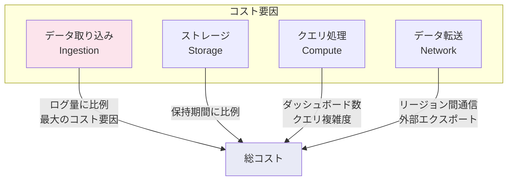

### データ量の削減

コスト最適化の第一歩は、不要なデータを収集しないことである。

#### メトリクスのカーディナリティ管理

メトリクスのコストは、時系列の「カーディナリティ」（ラベルの組み合わせ数）に比例する。たとえば、`http_requests_total`メトリクスに`method`、`path`、`status`、`pod`のラベルがある場合、カーディナリティは以下のように爆発する可能性がある。

```
method: 5種類 × path: 1000種類 × status: 20種類 × pod: 50個 = 5,000,000時系列
```

パス（URL）にユーザーIDやリソースIDが含まれると、カーディナリティは事実上無限大になる。これを「カーディナリティ爆発」と呼び、Prometheusのメモリ消費を急増させ、最悪の場合OOM Killを引き起こす。

対策として以下が有効である。

- **パスの正規化**: `/users/123/orders/456` → `/users/:id/orders/:id`
- **不要なラベルの削除**: OTel Collectorのattributesプロセッサで不要なラベルを除去
- **relabel_configsによるフィルタリング**: Prometheusのスクレイプ設定で不要なメトリクスを除外

```yaml
# Prometheus relabel_configs example
scrape_configs:
  - job_name: 'kubernetes-pods'
    metric_relabel_configs:
      # Drop high-cardinality metrics
      - source_labels: [__name__]
        regex: 'go_gc_.*'
        action: drop
      # Drop unnecessary labels
      - regex: 'instance'
        action: labeldrop
```

#### ログの適切なフィルタリング

ログは最もデータ量が多いシグナルであり、コスト削減の効果も最大である。

- **ログレベルによるフィルタリング**: 本番環境ではDEBUGログを収集しない
- **冗長なログの除外**: ヘルスチェック、readinessプローブのアクセスログ等を除外
- **サンプリング**: 正常系のログは一定割合のみ収集し、エラー系は全件収集する

```yaml
# Fluent Bit filter to drop health check logs
[FILTER]
    Name    grep
    Match   kube.*
    Exclude log /health|/readyz|/livez/
```

#### トレースのサンプリング

すべてのリクエストのトレースを収集する必要はない。サンプリングにより、統計的に十分なデータを低コストで収集できる。

- **Head-based Sampling**: リクエストの開始時に確率的にサンプリングを決定（例：10%のリクエストのみ）
- **Tail-based Sampling**: リクエスト完了後に、条件（エラー発生、高レイテンシ等）に基づいてサンプリングを決定

```yaml
# OTel Collector tail-based sampling configuration
processors:
  tail_sampling:
    decision_wait: 10s
    num_traces: 100000
    policies:
      # Always sample errors
      - name: errors
        type: status_code
        status_code:
          status_codes: [ERROR]
      # Always sample slow requests
      - name: slow-requests
        type: latency
        latency:
          threshold_ms: 1000
      # Sample 5% of remaining
      - name: probabilistic
        type: probabilistic
        probabilistic:
          sampling_percentage: 5
```

Tail-based Samplingは、エラーや高レイテンシのトレースを確実に収集しつつ、正常系のトレースのデータ量を大幅に削減できるため、コスト効率と調査能力のバランスに優れている。ただし、OTel Collectorにトレース全体がいったん集まる必要があるため、Collector自体のメモリ消費が増加する点に注意が必要である。

### ストレージの階層化

データの鮮度に応じてストレージを階層化することで、コストを最適化できる。

| 期間 | ストレージ | コスト | 用途 |
|------|-----------|--------|------|
| 直近1〜2週間 | ローカルSSD / EBS | 高い | リアルタイムのダッシュボード・アラート |
| 2週間〜3ヶ月 | オブジェクトストレージ（S3 Standard） | 中程度 | 最近のインシデント調査 |
| 3ヶ月〜1年以上 | 低頻度アクセスストレージ（S3 IA / Glacier） | 低い | コンプライアンス・長期分析 |

Thanos、Loki、Tempoはいずれもオブジェクトストレージをバックエンドとして利用できるため、この階層化を自然に実現できる。Thanos CompactorやLoki Compactorが自動的にデータを圧縮・ダウンサンプリングし、古いデータの保存効率を向上させる。

### コスト見積もりの目安

コスト管理において重要なのは、データ量の見積もりである。目安として以下の数値が参考になる。

- **メトリクス**: 1時系列 × 15秒間隔 × 1日 = 約5,760サンプル（圧縮後 約10KB/日/時系列）
- **ログ**: 1コンテナあたり 1〜100MB/日（アプリケーションの性質に大きく依存）
- **トレース**: 1トレースあたり 数KB〜数十KB（スパン数に依存）

10サービス × 10Pod × 15メトリクス/Podの場合、1,500時系列 × 10KB/日 ≒ 15MB/日程度のメトリクスデータとなる。一方、同規模のログは数GB〜数十GB/日に達することがある。ログのコスト管理が最も重要である理由がここにある。

## 実践的な構築手順

### ステップバイステップの導入

オブザーバビリティパイプラインの構築は、一度にすべてを導入するのではなく、段階的に進めることが推奨される。

**Phase 1: メトリクス基盤**
- kube-prometheus-stackの導入（Prometheus + Grafana + Alertmanager）
- 基本的なKubernetesメトリクスの収集開始
- REDメソッドに基づくサービスダッシュボードの作成

**Phase 2: ログ集約**
- Fluent Bit（DaemonSet）+ Lokiの導入
- 構造化ログへの移行（アプリケーション側の対応）
- ログベースのアラート設定

**Phase 3: 分散トレーシング**
- OTel Collector + Tempoの導入
- アプリケーションへのOTel SDK組み込み（まずは自動計装から）
- Exemplarによるメトリクスとトレースの連携

**Phase 4: 最適化**
- サンプリング戦略の導入
- カーディナリティの最適化
- ストレージ階層化の設定
- アラートの見直し・チューニング

### よくある失敗パターン

オブザーバビリティパイプラインの構築において、以下の失敗パターンが頻繁に観察される。

1. **ツール導入が目的化する**: Prometheus、Grafana、Lokiなどを導入しただけで満足し、ダッシュボードの設計やアラートルールの整備を怠る。ツールは手段であり、目的はシステムの状態を理解し、問題を迅速に解決することである

2. **すべてを収集しようとする**: 「必要になるかもしれない」という理由であらゆるメトリクス・ログ・トレースを収集し、コストが爆発する。まずは最小限のシグナルから始め、必要に応じて追加する

3. **テレメトリの相関を無視する**: メトリクス、ログ、トレースを個別のサイロとして運用し、Trace IDによる相互参照を設定しない。3つのシグナルの真の価値は相互関連にある

4. **アプリケーション側の計装を軽視する**: インフラストラクチャのメトリクスは自動的に収集されるが、ビジネスロジックに関するカスタムメトリクスやトレースは、アプリケーション開発者が意識的に計装する必要がある

5. **監視対象のチームが監視基盤を理解していない**: SREチームだけがオブザーバビリティ基盤を管理し、アプリケーション開発チームがダッシュボードやアラートの作成方法を知らない。オブザーバビリティは組織全体の取り組みであるべきである

## まとめ

コンテナオブザーバビリティパイプラインは、現代の分散システムにおける運用の基盤である。メトリクス・ログ・トレースの3本柱を適切に構築し、相互に関連付けることで、複雑なシステムの内部状態を外部から理解可能にする。

OpenTelemetryの標準化により、ベンダーロックインのリスクなくテレメトリ基盤を構築できるようになった。Prometheus、Grafana、Loki、Tempoといったオープンソースツールの成熟により、高品質なオブザーバビリティスタックを低コストで構築できる環境が整っている。

しかし、ツールの導入は出発点に過ぎない。効果的なダッシュボードの設計、SLOベースのアラート設計、コスト最適化のためのサンプリング戦略など、運用面での継続的な改善が不可欠である。オブザーバビリティは一度構築して終わりではなく、システムの成長とともに進化させ続けるべきものである。

最も重要なのは、オブザーバビリティの目的を忘れないことである。それは、ユーザーに影響が出る前に問題を検出し、問題が発生した際に迅速に根本原因を特定し、システムの信頼性を継続的に向上させることである。テクノロジーの選択は手段であり、この目的に沿った形で設計・運用されることが成功の鍵となる。
