# コンテナリソース管理（requests/limits, OOM, CPU throttling）

## 1. はじめに — なぜコンテナリソース管理が重要か

Kubernetes上で稼働するコンテナは、物理マシンのリソースを複数のPodで共有する。適切なリソース管理なしでは、一つのコンテナが暴走してノード全体のCPUやメモリを独占し、他のサービスに深刻な影響を与える。

しかし、「リソース管理」は単に制限を設けるだけではない。スケジューリングの精度、コスト効率、システム安定性、さらには障害時の挙動まで、コンテナのライフサイクル全体に影響する。現代のクラウドネイティブ運用において、requests/limitsを適切に設定し、CPU throttlingやOOM Killedを理解することは、基礎的な必須スキルである。

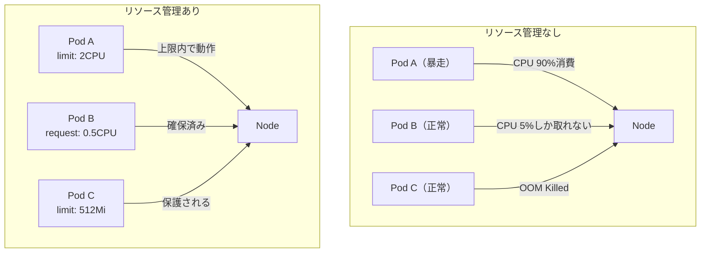

本記事では、Kubernetesのリソースモデルを基礎から解説し、Linuxカーネルのcgroupsによる実装、QoSクラス、CPU throttling問題、そして実践的なベストプラクティスまでを体系的に説明する。

---

## 2. Kubernetesのリソースモデル

### 2.1 requestsとlimitsの概念

KubernetesはPodの各コンテナに対して2種類のリソース量を設定できる。

| 設定値 | 意味 | スケジューリングへの影響 | ランタイムへの影響 |
|--------|------|----------------------|------------------|
| `requests` | コンテナが要求する最低保証量 | ノード選択の基準 | cgroupの重み・共有設定 |
| `limits` | コンテナが使用できる上限 | 影響なし | cgroup上限として強制 |

```yaml
apiVersion: v1
kind: Pod
metadata:
  name: example-pod
spec:
  containers:
    - name: app
      image: my-app:latest
      resources:
        requests:
          cpu: "500m"      # 0.5 CPU core (minimum guaranteed)
          memory: "256Mi"  # 256 MiB (minimum guaranteed)
        limits:
          cpu: "2000m"     # 2 CPU cores (hard upper bound)
          memory: "512Mi"  # 512 MiB (hard upper bound)
```

**CPU単位**: `m` はミリCPUを表す。`1000m = 1 CPU core`。フラクショナルな指定も可能で、`0.5` と `500m` は同義である。

**メモリ単位**: `Mi`（メビバイト）、`Gi`（ギビバイト）が一般的。`M`（メガバイト）との混同に注意する。`256Mi = 268,435,456 bytes`。

### 2.2 requestsとlimitsの非対称性

requestsとlimitsの関係は非対称である。requestsはスケジューリング時の論理的な「予約」であり、コンテナが実際にその量を常時使用する必要はない。一方、limitsはカーネルレベルで強制される上限であり、超過は即座に制約が発動する。

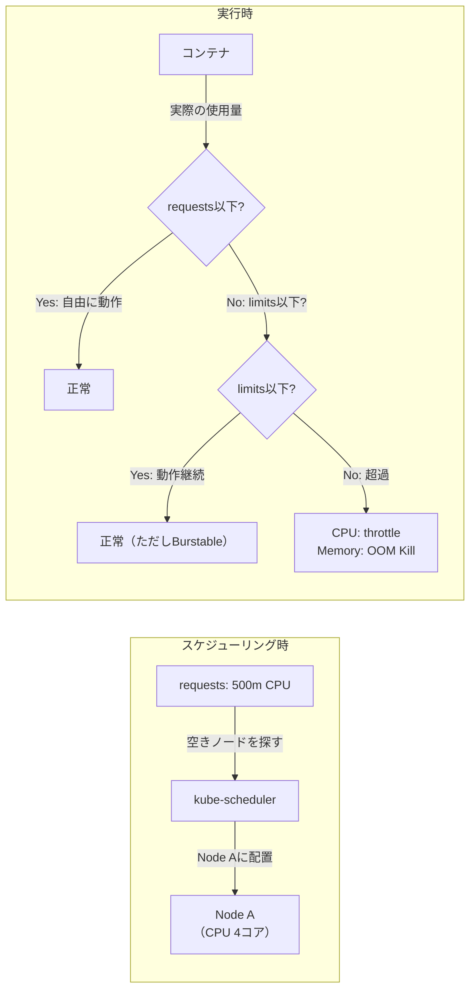

> [!IMPORTANT]
> requestsとlimitsの比率（オーバーコミット比率）は、クラスタの安定性に直接影響する。requestsをlimitsより大幅に低く設定すると、ノードが過負荷になるリスクがある。

### 2.3 Node Allocatableとリソース計算

Kubernetesノードで実際にPodが利用できるリソース量は、ノードの物理リソースから各種システムコンポーネントの予約を差し引いた **Node Allocatable** である。

```
Node Capacity
    - kube-reserved  (kubelet, container runtime 用)
    - system-reserved (OS, journald 等 用)
    - eviction-threshold (メモリプレッシャー時の退避閾値)
= Node Allocatable
```

```bash
# Check allocatable resources for a node
kubectl describe node <node-name> | grep -A 10 "Allocatable:"
```

```
Allocatable:
  cpu:                3920m
  memory:             14364Mi
  pods:               110
  ephemeral-storage:  95551679333
```

4コアのノードでも、Allocatable CPUは`3920m`程度になるのが典型的である。この差分（80m相当）はkubeletやcontainerdが消費する。

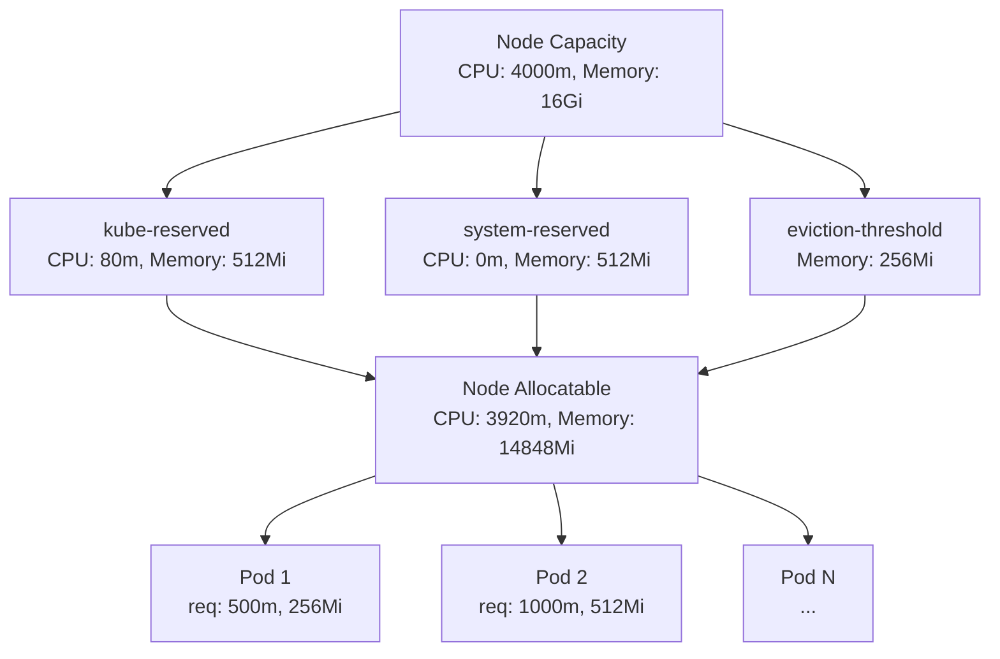

kubeletの起動設定で予約量を調整できる。

```yaml
# kubelet configuration (kubelet-config.yaml)
apiVersion: kubelet.config.k8s.io/v1beta1
kind: KubeletConfiguration
kubeReserved:
  cpu: "100m"
  memory: "512Mi"
systemReserved:
  cpu: "100m"
  memory: "256Mi"
evictionHard:
  memory.available: "300Mi"
  nodefs.available: "10%"
```

---

## 3. CPUリソース管理の仕組み

### 3.1 cpu.shares（相対的な重み付け）

CPU requestsは、Linuxカーネルのcgroups v1における `cpu.shares`、またはcgroups v2における `cpu.weight` に変換される。これは**絶対的な上限ではなく、CPUが競合したときの相対的な優先度**を表す。

変換式は以下の通りである。

```
cpu.shares = floor(requests_in_millicores * 1024 / 1000)
```

例えば `requests: 500m` は `cpu.shares = 512` となる。デフォルト値は1024である。

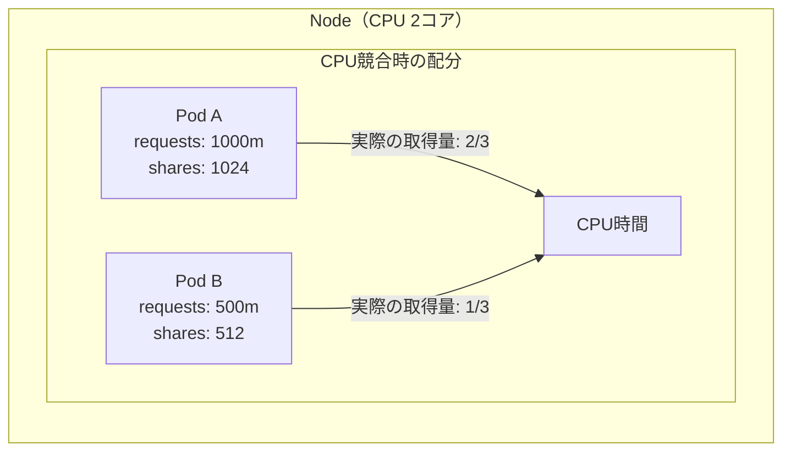

**重要な特性**: ノードのCPUに余裕があれば、requestsを超えてCPUを使用できる。競合が発生したときだけ、sharesの比率に応じた配分が適用される。

### 3.2 CFS帯域幅制御（cpu.max）

CPU limitsは、Linux CFS（Completely Fair Scheduler）の**帯域幅制御（Bandwidth Control）**を使って実装される。cgroups v2では `cpu.max` ファイルで管理される。

```
# Format: quota period (microseconds)
cat /sys/fs/cgroup/kubepods/pod<uid>/<container-id>/cpu.max
200000 100000
# → 100ms周期のうち200ms分のCPU時間（= 2 CPU cores limit）
```

仕組みを詳しく見てみる。

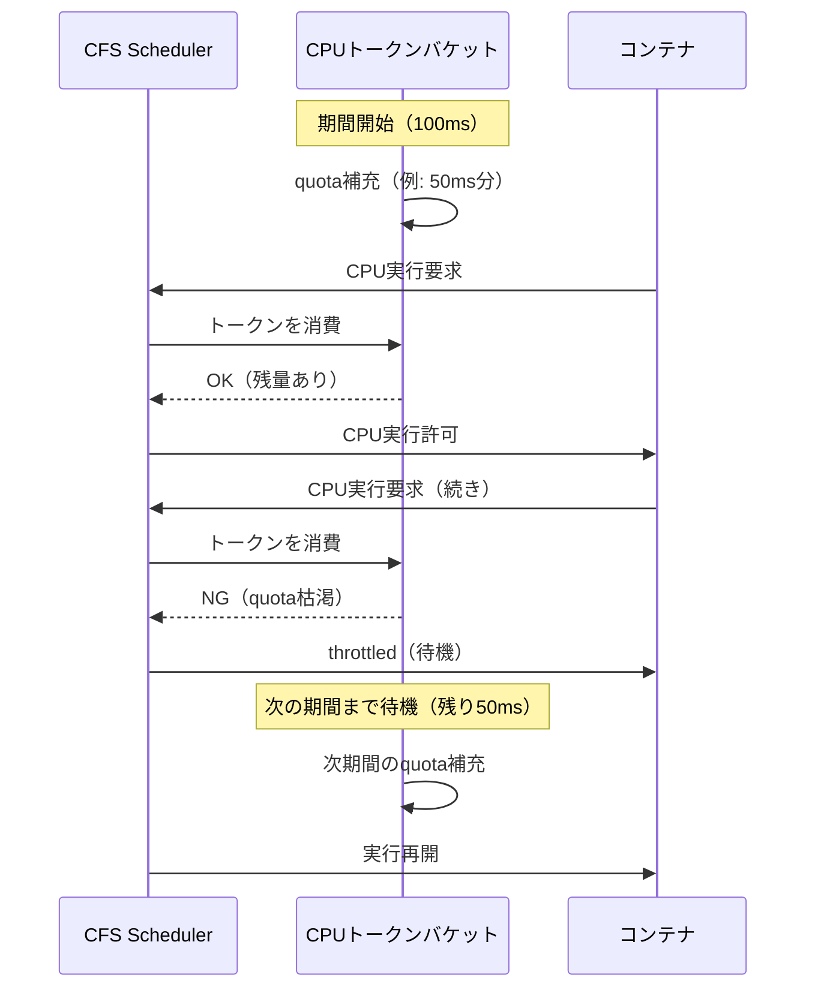

Kubernetesでの変換:

```
cpu.max の quota = limits_in_millicores * period / 1000
period = 100,000 μs (デフォルト)

例: limits: 500m → quota = 500 * 100000 / 1000 = 50,000 μs
→ cpu.max = "50000 100000"
```

### 3.3 CPU Throttlingの問題

CPU throttlingは、コンテナのCPU使用量がlimitsに達した際にカーネルがCPU時間を制限する現象である。これはパフォーマンス劣化の主要因となる。

**CFSバグ（CVE-2019-相当の問題）**: Linuxカーネル4.18以前には、マルチコア環境でcpu.sharesとCFS帯域幅制御が組み合わさると、実際の使用率がlimitsを下回っているにも関わらず throttling が発生するバグがあった。

```mermaid
gantt
    title CFS Throttlingの例（100ms周期、limit=50ms）
    dateFormat x
    axisFormat %Lms

    section スレッド1
    実行    :active, 0, 25
    Throttled :crit, 25, 100

    section スレッド2
    実行    :active, 0, 30
    Throttled :crit, 30, 100

    section 次の周期
    実行    :active, 100, 150
```

複数スレッドが並行して動作すると、各スレッドがquotaを個別に消費するため、50ms分のquotaが25ms+25ms=50msで枯渇し、残り50msはidle状態でもthrottledになる。

**throttling率の確認**:

```bash
# Check CPU throttling stats
cat /sys/fs/cgroup/kubepods/.../cpu.stat | grep throttled

# nr_throttled: throttling が発生した期間数
# throttled_usec: throttling された合計時間
nr_periods 1000
nr_throttled 234
throttled_usec 11700000
```

```bash
# Prometheus metric for CPU throttling
container_cpu_cfs_throttled_seconds_total / container_cpu_cfs_periods_total
# > 25% なら要調査
```

> [!WARNING]
> CPU throttlingが25%を超えている場合、レイテンシに敏感なサービスでは顕著なパフォーマンス低下が起こる。`cpu.stat` の `throttled_usec` を監視することが重要である。

### 3.4 CPU Throttling対策の設計指針

1. **limits/requestsの比率を適切に設定**: 一般的に2〜4倍以内に抑える
2. **低レイテンシサービスにはlimitsを設定しない選択肢も検討**: Guaranteed QoSを狙うか、limitsを高めに設定する
3. **カーネルバージョンを4.18以上に**: 多くのCFSバグが修正されている
4. **cpu.cfs_period_usの調整**: デフォルト100msを短縮（例: 10ms）することでバースト許容量を細分化できる（ただしオーバーヘッドが増加する）

```bash
# Adjust CFS period via feature gate (Kubernetes 1.12+)
--cpu-cfs-quota-period=10ms
```

---

## 4. メモリリソース管理の仕組み

### 4.1 memory.maxとOOM Kill

メモリlimitsは、cgroupsの `memory.max`（v2）または `memory.limit_in_bytes`（v1）として設定される。コンテナがこの値を超えてメモリを確保しようとすると、Linux OOM Killerが発動する。

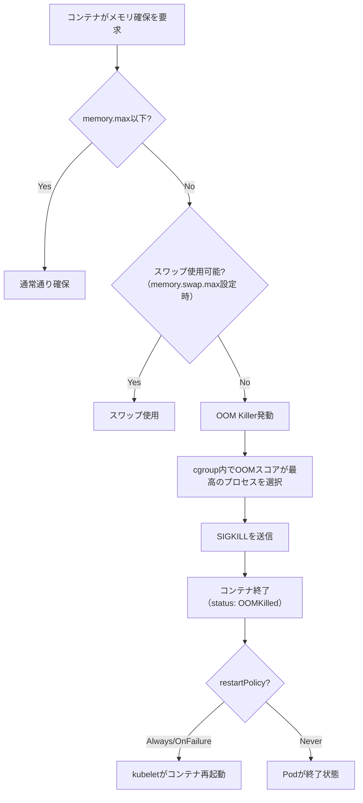

**OOM Killedの確認方法**:

```bash
# Check if Pod was OOMKilled
kubectl describe pod <pod-name> | grep -A 5 "Last State:"

# Output example:
#   Last State:  Terminated
#     Reason:    OOMKilled
#     Exit Code: 137
#     Started:   Mon, 01 Mar 2026 10:00:00 +0000
#     Finished:  Mon, 01 Mar 2026 10:05:00 +0000
```

終了コード137は `128 + SIGKILL(9)` であり、OOM Killerによる強制終了を示す。

### 4.2 メモリrequestsとscheduling

メモリrequestsは、スケジューリング時に「このノードに十分な空きメモリがあるか」の判断基準となる。ただし、実際のメモリ使用はrequestsを超えても即座にkilledにはならない（limitsに達するまで）。

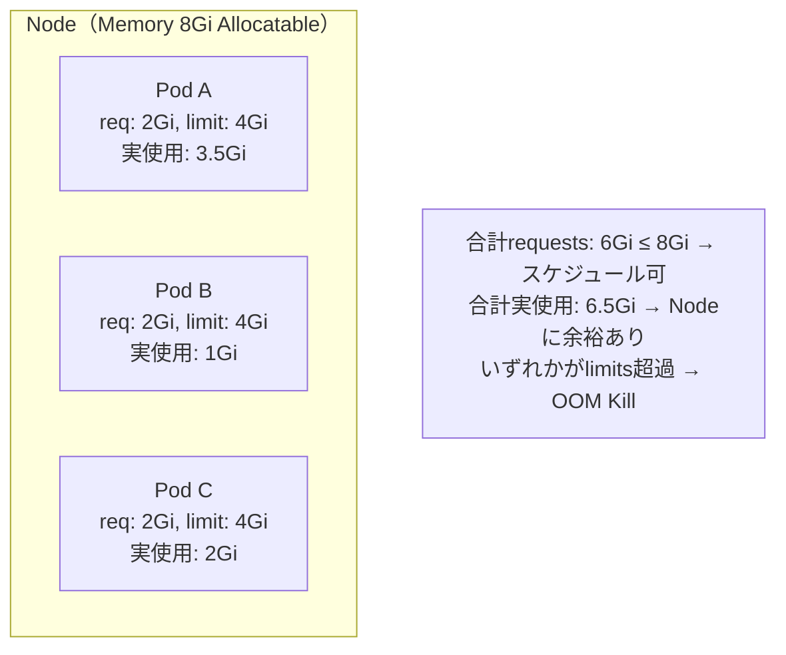

**メモリプレッシャー時の退避（Eviction）**: ノード全体のメモリが逼迫すると、kubeletは `eviction-threshold` に基づいてPodを強制退避させる。この場合はOOM Killedではなく、`Evicted` 状態でPodが終了する。

```bash
# Check for evicted Pods
kubectl get pods --all-namespaces | grep Evicted

# Check eviction events
kubectl describe node <node-name> | grep -A 5 "Events:"
```

### 4.3 メモリの種類とrss/cache

cgroupsのメモリ計測では複数の値が区別される。

```bash
# Check memory usage details (cgroups v2)
cat /sys/fs/cgroup/kubepods/.../memory.stat

# Key fields:
# anon: anonymous memory (heap, stack) - OOM Killの主対象
# file: page cache (ファイルキャッシュ) - 退避可能
# slab_reclaimable: カーネルスラブキャッシュ（回収可能）
```

**重要**: `memory.current` が `memory.max` に近づいた場合、まずpage cacheが解放される。カーネルがpage cacheを解放しきっても足りない場合にOOM Killerが発動する。

> [!TIP]
> JavaアプリケーションはヒープサイズをJVM引数で制御するが、JVM自体のオーバーヘッド（MetaSpace、スレッドスタック、JITコンパイルバッファ等）が存在する。memory limitsはJavaヒープ + JVMオーバーヘッドを考慮して設定すること。目安として、JVMオーバーヘッドは200〜500MBを見込む。

---

## 5. QoSクラス（Quality of Service）

KubernetesはPodのrequests/limits設定に基づき、自動的に3つのQoSクラスを割り当てる。このクラスはメモリプレッシャー時のOOM Kill順序やスケジューリング優先度に影響する。

### 5.1 Guaranteedクラス

**条件**: 全コンテナのcpuとmemoryについて、requestsとlimitsが**同じ値**で設定されている。

```yaml
resources:
  requests:
    cpu: "1000m"
    memory: "512Mi"
  limits:
    cpu: "1000m"      # requests と同値
    memory: "512Mi"   # requests と同値
```

**特性**:
- OOM Kill時に最後に選択される
- CPUスケジューリングでも最優先
- スケジューリング精度が最高（予約とlimitが一致するため）
- ただし、CPUについては常にthrottlingが発生する可能性がある

### 5.2 Burstableクラス

**条件**: 少なくとも1つのコンテナにrequestsまたはlimitsが設定されているが、Guaranteedの条件を満たさない。

```yaml
resources:
  requests:
    cpu: "250m"
    memory: "128Mi"
  limits:
    cpu: "1000m"      # requests より大きい
    memory: "512Mi"
```

**特性**:
- 通常時はrequests以上を使用できる（バースト可能）
- メモリプレッシャー時はBestEffortの次にKill対象
- 最も一般的なQoSクラス

### 5.3 BestEffortクラス

**条件**: 全コンテナのcpuとmemoryについて、requestsもlimitsも設定されていない。

```yaml
resources: {}  # no resource specification
```

**特性**:
- スケジューリング時にリソース要求を主張しない
- メモリプレッシャー時に最初にKill対象
- バッチジョブや開発環境での一時的なPodに適している

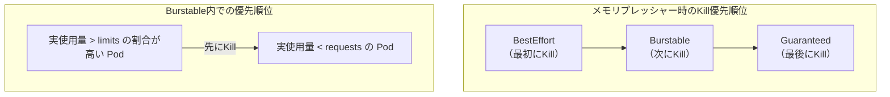

**QoSクラスの確認**:

```bash
# Check QoS class of a Pod
kubectl get pod <pod-name> -o jsonpath='{.status.qosClass}'
# Output: Guaranteed / Burstable / BestEffort
```

> [!NOTE]
> QoSクラスはKubernetes側の概念であり、cgroupsのOOM scoreに変換される。Guaranteed Podは `oom_score_adj = -997`、BestEffort Podは `oom_score_adj = 1000` に設定される。値が高いほどOOM Killerに選ばれやすい。

---

## 6. CPU Throttlingの深掘りと対策

### 6.1 なぜthrottlingが問題なのか

CPU throttlingの影響は単純な「CPUが足りない」とは異なる。特にガベージコレクション（GC）、HTTP接続処理、ロックの取得など、短時間に高い計算負荷が集中する操作でスパイクが起き、それがthrottlingのトリガーになる。

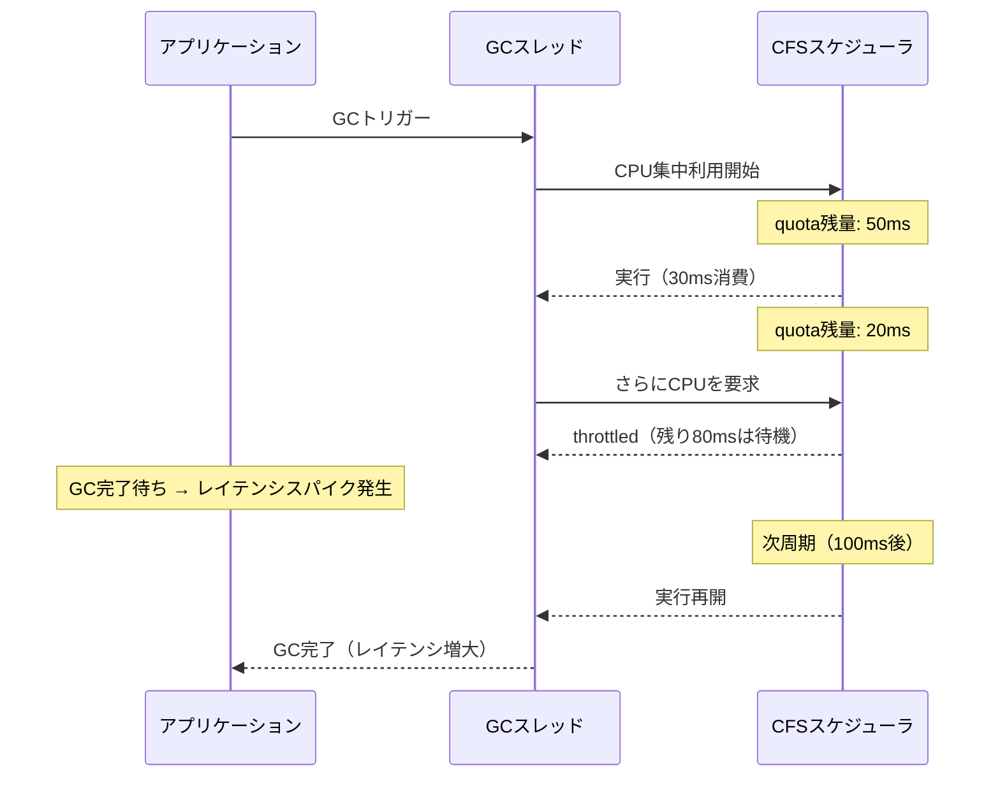

P99レイテンシが突然悪化する根本原因として、CPU throttlingは最も頻繁に見落とされる要因の一つである。

### 6.2 Throttling率の監視

PrometheusとGrafanaを使ったモニタリングが標準的である。

```yaml
# Grafana alert rule example
- alert: HighCPUThrottling
  expr: |
    sum(rate(container_cpu_cfs_throttled_seconds_total[5m])) by (pod, container)
    /
    sum(rate(container_cpu_cfs_periods_total[5m])) by (pod, container)
    > 0.25
  for: 10m
  labels:
    severity: warning
  annotations:
    summary: "CPU throttling > 25% for {{ $labels.pod }}/{{ $labels.container }}"
```

### 6.3 実践的な対策

**対策1: limitsを引き上げる（最も単純）**

throttlingが発生している場合、最初に試みるべきはlimitsの引き上げである。VPA（後述）を使って自動化できる。

**対策2: limitsを削除してBurstable/BestEffortにする**

Guaranteed QoSを必要としないサービスでは、limitsを削除してthrottlingを回避する選択肢がある。ただしノードの過負荷リスクが増加する。

```yaml
# Remove CPU limits, keep only requests
resources:
  requests:
    cpu: "500m"
    memory: "256Mi"
  limits:
    memory: "512Mi"  # memory limit only; no CPU limit
```

**対策3: requests == limits にしてGuaranteedにする**

レイテンシに極めて敏感なサービスでは、Guaranteed QoSでCPUを専有する。ただしリソース利用効率は低下する。

**対策4: CPUManagerポリシーを使用する**

Kubernetesの `static` CPUManagerポリシーを使うと、Guaranteed PodのCPU coreを物理コアに固定できる（Exclusive CPU）。これによりNUMAの影響やコンテキストスイッチを最小化できる。

```yaml
# kubelet configuration for static CPU Manager
cpuManagerPolicy: static
reservedSystemCPUs: "0,1"  # CPUs reserved for system use
```

```yaml
# Pod spec for exclusive CPU allocation
resources:
  requests:
    cpu: "2"       # integer value required for static policy
    memory: "1Gi"
  limits:
    cpu: "2"       # must equal requests
    memory: "1Gi"
```

---

## 7. Vertical Pod Autoscaler（VPA）

### 7.1 VPAの概要

Vertical Pod Autoscaler（VPA）は、過去のリソース使用実績に基づいてPodのrequests/limitsを自動調整するKubernetesアドオンである。

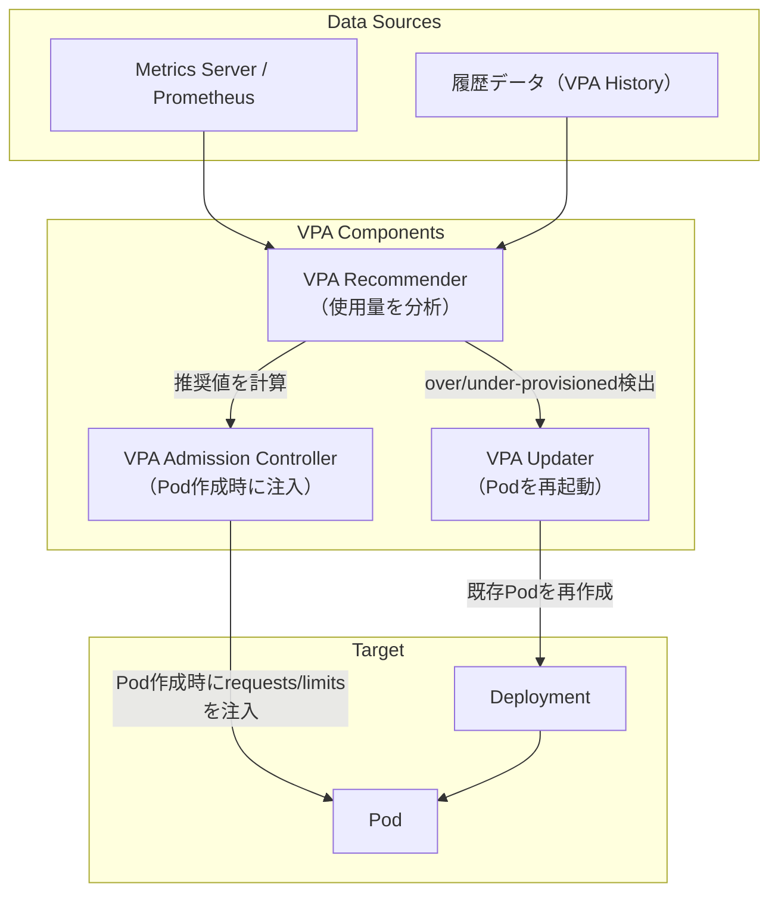

### 7.2 VPAのモード

| モード | 動作 | 用途 |
|--------|------|------|
| `Off` | 推奨値を計算するが自動適用しない | 推奨値の参照のみ |
| `Initial` | Pod作成時のみ適用 | 初期設定の最適化 |
| `Recreate` | 推奨値から外れたら既存Podを再作成 | 継続的な自動調整 |
| `Auto` | 将来的にin-place updateを利用予定（現在はRecreateと同じ） | 最新推奨 |

```yaml
apiVersion: autoscaling.k8s.io/v1
kind: VerticalPodAutoscaler
metadata:
  name: my-app-vpa
spec:
  targetRef:
    apiVersion: apps/v1
    kind: Deployment
    name: my-app
  updatePolicy:
    updateMode: "Auto"
  resourcePolicy:
    containerPolicies:
      - containerName: app
        minAllowed:
          cpu: "100m"
          memory: "128Mi"
        maxAllowed:
          cpu: "4"
          memory: "4Gi"
        controlledResources: ["cpu", "memory"]
        controlledValues: RequestsAndLimits
```

### 7.3 VPA推奨値の確認

```bash
# Check VPA recommendations
kubectl describe vpa my-app-vpa

# Output includes:
#   Recommendation:
#     Container Recommendations:
#       Container Name: app
#       Lower Bound:
#         Cpu: 100m
#         Memory: 200Mi
#       Target:         ← これが最適値
#         Cpu: 300m
#         Memory: 350Mi
#       Upper Bound:
#         Cpu: 1000m
#         Memory: 700Mi
#       Uncapped Target:
#         Cpu: 280m
#         Memory: 325Mi
```

> [!WARNING]
> VPA `Recreate`/`Auto` モードはPodの再起動を伴う。StatefulSetやシングルレプリカのDeploymentでは、サービス断が発生する可能性がある。HPAとの併用時はVPAのCPU自動調整を無効化すること（CPUベースのHPAと競合する）。

### 7.4 VPAとHPAの使い分け

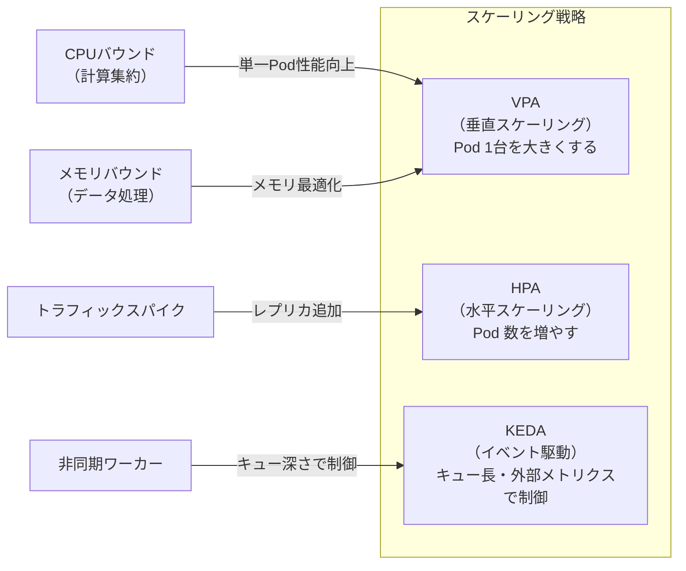

---

## 8. Namespace ResourceQuotaとLimitRange

### 8.1 ResourceQuota

ResourceQuotaは、Namespace全体のリソース消費量に上限を設ける仕組みである。

```yaml
apiVersion: v1
kind: ResourceQuota
metadata:
  name: production-quota
  namespace: production
spec:
  hard:
    # CPU and memory limits across all Pods
    requests.cpu: "20"
    requests.memory: "40Gi"
    limits.cpu: "40"
    limits.memory: "80Gi"
    # Maximum number of objects
    pods: "100"
    services: "20"
    persistentvolumeclaims: "50"
    # Storage class specific quotas
    requests.storage: "1Ti"
    gold.storageclass.storage.k8s.io/requests.storage: "500Gi"
```

```bash
# Check ResourceQuota usage
kubectl describe resourcequota production-quota -n production

# Output:
# Name:            production-quota
# Namespace:       production
# Resource         Used    Hard
# --------         ----    ----
# limits.cpu       8       40
# limits.memory    16Gi    80Gi
# pods             23      100
# requests.cpu     4       20
# requests.memory  8Gi     40Gi
```

ResourceQuotaが設定されたNamespaceでは、resourcesを指定しないPodの作成が**拒否**される。そのため、LimitRangeでデフォルト値を設定することが一般的である。

### 8.2 LimitRange

LimitRangeは、Namespace内の個々のPod/コンテナに対するデフォルト値・最小値・最大値を設定する。

```yaml
apiVersion: v1
kind: LimitRange
metadata:
  name: production-limits
  namespace: production
spec:
  limits:
    # Default and max for containers
    - type: Container
      default:
        cpu: "500m"      # default limit if not specified
        memory: "256Mi"
      defaultRequest:
        cpu: "100m"      # default request if not specified
        memory: "128Mi"
      max:
        cpu: "4"
        memory: "4Gi"
      min:
        cpu: "50m"
        memory: "64Mi"
      maxLimitRequestRatio:
        cpu: "10"        # limits/requests ratio cannot exceed 10
        memory: "4"
    # Constraints for PersistentVolumeClaims
    - type: PersistentVolumeClaim
      max:
        storage: "100Gi"
      min:
        storage: "1Gi"
```

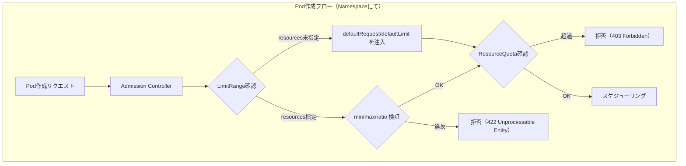

> [!TIP]
> ResourceQuotaとLimitRangeを組み合わせることで、開発者がrequests/limitsを未設定のままDeployするのを防ぎ、Namespace全体のリソース消費を制御できる。チーム・環境別にNamespaceを分ける大規模クラスタ運用では必須の設定である。

---

## 9. リソース見積もりのベストプラクティス

### 9.1 初期見積もりの方法

リソース量の初期設定は難しい。以下のアプローチを段階的に適用する。

**Step 1: ベンチマーク測定**

ロードテスト環境でアプリケーションに実際の負荷をかけ、ピーク時のリソース使用量を計測する。

```bash
# Measure actual resource usage with kubectl top
kubectl top pod <pod-name> --containers

# Output:
# POD           NAME    CPU(cores)   MEMORY(bytes)
# my-app-xxx    app     150m         200Mi
```

**Step 2: requestsを実使用量の平均値ベースで設定**

```
requests.cpu = avg(CPU usage) + 1σ (標準偏差)
requests.memory = p90(Memory usage)
```

**Step 3: limitsをrequestsの倍数で設定**

```
limits.cpu = requests.cpu × 2〜4  (バースト余裕)
limits.memory = requests.memory × 1.5〜2  (OOM回避余裕)
```

### 9.2 リソース設定の典型的なアンチパターン

**アンチパターン1: requestsとlimitsを同じにしすぎる（CPU）**

```yaml
# Bad: CPU requests == limits for non-latency-sensitive services
resources:
  requests:
    cpu: "1000m"
  limits:
    cpu: "1000m"  # throttling が常に発生する可能性
```

**アンチパターン2: 過小なメモリlimits**

```yaml
# Bad: limits too close to actual usage → frequent OOM Kill
resources:
  requests:
    memory: "200Mi"
  limits:
    memory: "210Mi"  # 10Mi の余裕しかない
```

**アンチパターン3: 超大きなlimitsで「保険」にする**

```yaml
# Bad: oversized limits → cannot detect actual bottleneck
resources:
  requests:
    cpu: "100m"
    memory: "128Mi"
  limits:
    cpu: "32"        # ノードのCPU全部
    memory: "64Gi"   # ノードのメモリ全部
```

**アンチパターン4: requestsを設定しない（BestEffort）**

本番ワークロードでresourcesを未設定にすると、メモリプレッシャー時に真っ先にKillされる。

### 9.3 サービスタイプ別の推奨設定

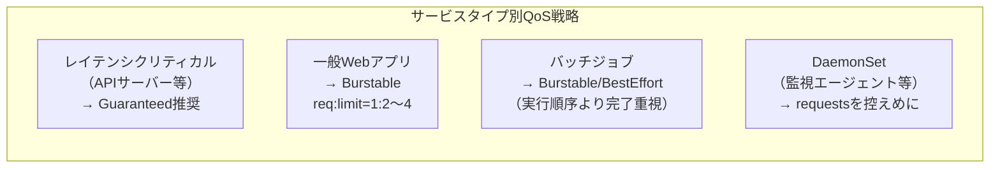

| サービスタイプ | QoS目標 | CPU requests | CPU limits | Memory requests | Memory limits |
|--------------|---------|-------------|-----------|----------------|--------------|
| APIサーバー（SLA厳格） | Guaranteed | 1000m | 1000m | 512Mi | 512Mi |
| 一般Webアプリ | Burstable | 500m | 2000m | 256Mi | 512Mi |
| バッチジョブ | Burstable | 250m | 4000m | 512Mi | 2Gi |
| 監視エージェント | Burstable | 100m | 500m | 128Mi | 256Mi |
| 開発環境Pod | BestEffort | 未設定 | 未設定 | 未設定 | 未設定 |

### 9.4 継続的なリソース最適化フロー

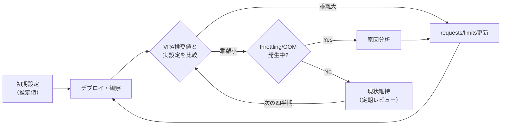

---

## 10. 実践的なトラブルシューティング

### 10.1 OOM Kill調査のチェックリスト

OOM Killedが頻発する場合の調査手順。

```bash
# Step 1: OOMKilled Pod一覧
kubectl get pods -A | grep OOMKilled

# Step 2: 詳細確認
kubectl describe pod <pod-name> -n <namespace>
# → "Reason: OOMKilled", "Exit Code: 137" を確認

# Step 3: メモリ使用量推移の確認
kubectl top pod <pod-name> --containers

# Step 4: VPA推奨値の確認（VPA導入済みの場合）
kubectl describe vpa <vpa-name>

# Step 5: Nodeのメモリ状況
kubectl describe node <node-name> | grep -A 10 "Allocated resources:"
```

```bash
# Prometheus query for OOM Kill events
kube_pod_container_status_last_terminated_reason{reason="OOMKilled"}
```

### 10.2 CPU Throttling調査のチェックリスト

```bash
# Step 1: throttling 率の確認（コンテナIDを特定）
kubectl describe pod <pod-name> | grep "Container ID"

# Step 2: cgroup ファイルを直接確認（Nodeにsshできる場合）
# Get container cgroup path
CONTAINER_ID=<container-id-without-prefix>
cat /sys/fs/cgroup/kubepods/pod*/$(ls /sys/fs/cgroup/kubepods/pod*/ | grep ${CONTAINER_ID:0:12})/cpu.stat

# Step 3: Prometheus でthrottling 率を確認
# Query: 直近5分間のthrottling率（Pod別）
sum(rate(container_cpu_cfs_throttled_seconds_total[5m])) by (pod) /
sum(rate(container_cpu_cfs_periods_total[5m])) by (pod)
```

### 10.3 リソース不足によるスケジュール失敗

```bash
# Pending Podの原因確認
kubectl describe pod <pending-pod-name> | grep -A 20 "Events:"

# よくある出力例:
# Events:
#   Warning  FailedScheduling  Insufficient cpu
#   Warning  FailedScheduling  Insufficient memory

# Node別のAllocatable vs Requested確認
kubectl describe nodes | grep -A 10 "Allocated resources"
```

```bash
# Namespace別のリソース使用状況
kubectl get resourcequota -n <namespace> -o yaml

# 全Nodeのリソース使用率サマリ（kubectlプラグイン使用）
kubectl resource-capacity --sort cpu.util
```

---

## 11. まとめ

Kubernetesのリソース管理は、単なるYAMLの設定値以上の複雑な仕組みの上に成り立っている。

| 概念 | 実装 | 重要性 |
|------|------|--------|
| CPU requests | cpu.shares / cpu.weight | スケジューリング精度・競合時の配分 |
| CPU limits | CFS quota (cpu.max) | throttlingの原因・レイテンシへの影響 |
| Memory requests | スケジューリング判断のみ | ノードの過負荷防止 |
| Memory limits | memory.max (OOM Kill) | サービス安定性の要 |
| QoS Guaranteed | oom_score_adj = -997 | 最優先保護・Exclusive CPU可 |
| QoS Burstable | oom_score_adj = 中間値 | バランス型・最も一般的 |
| QoS BestEffort | oom_score_adj = 1000 | 最初にKill対象 |
| ResourceQuota | Namespace全体の上限 | マルチテナント管理 |
| LimitRange | デフォルト値・最大値 | ガードレール設定 |
| VPA | 自動requests/limits最適化 | 継続的最適化 |

::: details リソース設定の判断フロー

1. **OOM Killedが頻発する** → memory limitsを引き上げる（p99使用量の1.5〜2倍）
2. **レイテンシスパイクがある** → CPU throttling率を確認。>25%なら limits引き上げまたは削除
3. **Pendingが続く** → requests値が大きすぎないか確認。Node Allocatableと比較
4. **コスト最適化したい** → VPAの推奨値を参考に、過剰なrequestsを削減
5. **本番の安定性を最優先** → Guaranteed QoSにしてCPU/Memoryを専有

:::

適切なリソース設定は、クラスタ全体の安定性・コスト・パフォーマンスを左右する。VPAによる自動最適化、Prometheusによる継続監視、そして定期的なリソースレビューを組み合わせることで、Kubernetesクラスタのリソース効率を最大化できる。
