# コンテナランタイム（runc, crun, containerd, CRI-O）

## はじめに — コンテナランタイムとは何か

コンテナ技術は、現代のソフトウェア開発とデプロイメントにおいて不可欠な基盤となっている。Docker の登場によってコンテナは爆発的に普及したが、その内部では複数のコンポーネントが階層的に連携してコンテナのライフサイクルを管理している。この階層構造の中核を担うのが「コンテナランタイム」である。

コンテナランタイムという用語は、文脈によって異なるレイヤのソフトウェアを指すことがある。Linux カーネルの namespace や cgroups を直接操作してプロセスを隔離する「低レベルランタイム」と、イメージの管理やコンテナのライフサイクル全体を統括する「高レベルランタイム」の2層に大別される。本記事では、この2つの層の役割を明確にし、代表的な実装である runc、crun、containerd、CRI-O のアーキテクチャと設計思想を掘り下げる。

さらに、Kubernetes が CRI（Container Runtime Interface）を通じてランタイムと統合する仕組みや、gVisor や Kata Containers といったサンドボックスランタイムによるセキュリティ強化のアプローチについても解説する。

## OCI（Open Container Initiative）標準

### OCI 設立の背景

2013年に Docker が登場し、コンテナ技術は急速に普及した。しかし、Docker が事実上の標準となる中で、ベンダーロックインやエコシステムの断片化に対する懸念が高まった。2015年、Docker、CoreOS、Google、Red Hat などの主要企業が共同で **OCI（Open Container Initiative）** を設立し、コンテナ技術の標準化に乗り出した。OCI は Linux Foundation のプロジェクトとして運営されている。

### OCI の3つの仕様

OCI は以下の3つの仕様を策定している。

| 仕様 | 概要 |
|------|------|
| **Runtime Specification** | コンテナの設定（`config.json`）とライフサイクル操作（create, start, kill, delete）の標準 |
| **Image Specification** | コンテナイメージのフォーマット（マニフェスト、レイヤ、設定）の標準 |
| **Distribution Specification** | コンテナイメージの配布プロトコル（レジストリ API）の標準 |

### Runtime Specification の詳細

Runtime Specification は、コンテナランタイムが満たすべきインターフェースを定義する。中核となるのは `config.json` であり、以下の情報を含む。

- **ルートファイルシステム**: コンテナの rootfs のパス
- **マウント**: ボリュームマウントの設定
- **プロセス**: 実行するコマンド、環境変数、作業ディレクトリ
- **Linux 固有設定**: namespace、cgroups、seccomp、capabilities
- **フック**: コンテナライフサイクルの各段階で実行されるスクリプト

```json
{
  "ociVersion": "1.0.2",
  "process": {
    "terminal": false,
    "user": { "uid": 0, "gid": 0 },
    "args": ["/bin/sh", "-c", "echo hello"],
    "env": ["PATH=/usr/local/sbin:/usr/local/bin:/usr/sbin:/usr/bin:/sbin:/bin"],
    "cwd": "/"
  },
  "root": {
    "path": "rootfs",
    "readonly": true
  },
  "linux": {
    "namespaces": [
      { "type": "pid" },
      { "type": "network" },
      { "type": "mount" },
      { "type": "ipc" },
      { "type": "uts" }
    ],
    "resources": {
      "memory": { "limit": 536870912 },
      "cpu": { "shares": 1024 }
    }
  }
}
```

OCI Runtime Specification が定義するコンテナのライフサイクルは以下の通りである。

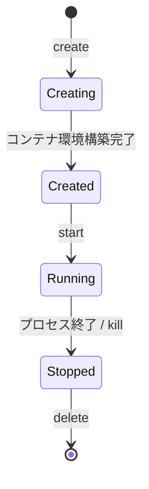

この標準化により、異なるランタイム実装間での互換性が保証され、上位レイヤのソフトウェア（containerd や CRI-O）はランタイムの実装詳細に依存せずにコンテナを管理できるようになった。

## 低レベルランタイム

低レベルランタイム（OCI ランタイム）は、OCI Runtime Specification に準拠し、Linux カーネルの機能を直接操作してコンテナプロセスを生成・管理するコンポーネントである。上位レイヤから `config.json` と rootfs を受け取り、隔離されたプロセスを起動する。

### runc

#### 概要と歴史

**runc** は、Docker が自社のコンテナランタイム実装を切り出してオープンソース化したものであり、OCI ランタイムのリファレンス実装である。Go 言語で実装されており、OCI Runtime Specification に完全に準拠している。

Docker は元々 `libcontainer` というライブラリを用いてコンテナを管理していた。OCI 設立に伴い、この `libcontainer` を基盤として runc が誕生した。現在も runc は最も広く使われている低レベルランタイムであり、containerd と CRI-O の両方がデフォルトで runc を使用している。

#### アーキテクチャ

runc のコンテナ起動プロセスは以下のように進行する。

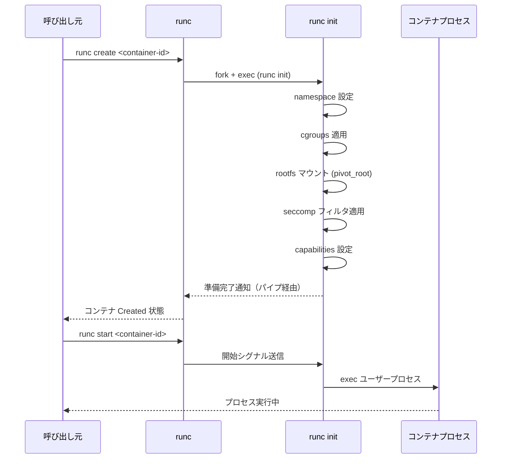

runc はコンテナ作成時に `runc init` プロセスを fork する。この init プロセスは新しい namespace 内で初期化処理を行い、最終的に `execve` でユーザー指定のプロセスに置き換わる。この2段階のプロセス（create + start）は OCI 仕様に基づいており、prestart フックなどを create と start の間に実行できるようにするための設計である。

#### 主な機能

- **namespace の設定**: PID, Network, Mount, UTS, IPC, User, Cgroup の各 namespace を作成・参加
- **cgroups の管理**: cgroups v1 / v2 の両方に対応し、CPU、メモリ、I/O などのリソース制限を適用
- **seccomp フィルタ**: システムコールのフィルタリングによるセキュリティ強化
- **capabilities の制御**: Linux capabilities の細粒度な設定
- **rootless コンテナ**: root 権限なしでのコンテナ実行をサポート

#### runc の CLI 使用例

```bash
# Create a bundle directory
mkdir -p mycontainer/rootfs

# Generate a default config.json
cd mycontainer
runc spec

# Export a container filesystem (e.g., from Docker)
docker export $(docker create busybox) | tar -C rootfs -xf -

# Create the container
runc create mycontainer

# Start the container
runc start mycontainer

# List running containers
runc list

# Delete the container
runc delete mycontainer
```

### crun

#### 概要と設計思想

**crun** は、Red Hat が開発した OCI ランタイムの C 言語実装である。runc が Go 言語で実装されているのに対し、crun は C で実装されていることが最大の特徴である。この設計決定にはいくつかの技術的な動機がある。

1. **起動速度**: Go のランタイムは起動時にガベージコレクタやゴルーチンスケジューラを初期化する必要があるが、C にはそのようなオーバーヘッドがない
2. **メモリ消費**: Go ランタイムのスタック管理やヒープ管理のオーバーヘッドがなく、メモリフットプリントが小さい
3. **fork の安全性**: Go は内部でスレッドを使用するため、`fork()` と `exec()` の間での安全性に注意が必要である。C はこの問題がない

#### パフォーマンス比較

crun は runc と比較して以下のような性能特性を持つ。

| 指標 | runc | crun |
|------|------|------|
| コンテナ起動時間 | ~50ms | ~15ms |
| バイナリサイズ | ~10MB | ~300KB |
| メモリ使用量（起動時） | ~20MB | ~2MB |
| 実装言語 | Go | C |

::: tip
上記の数値は環境によって変動するが、crun が runc に比べて大幅に軽量かつ高速であるという傾向は一貫している。特に、サーバーレスやエッジコンピューティングのように大量のコンテナを高速に起動する必要があるユースケースで、この差は顕著になる。
:::

#### crun の追加機能

crun は OCI 仕様への準拠に加え、以下のような拡張機能を提供する。

- **WASM サポート**: WebAssembly ランタイム（wasmedge, wasmtime）との統合
- **cgroup v2 の先行対応**: crun は cgroup v2 への対応が早くから進められた
- **Podman との緊密な統合**: Red Hat のコンテナエコシステムにおけるデフォルトランタイム

### runc と crun の比較

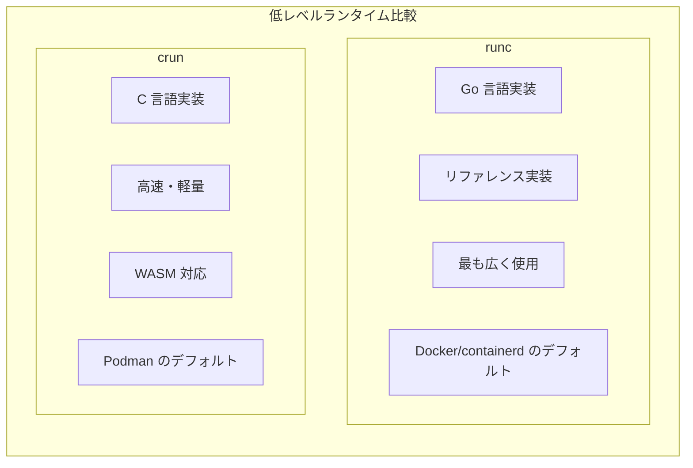

## 高レベルランタイム

高レベルランタイム（コンテナマネージャ）は、低レベルランタイムの上位に位置し、コンテナのライフサイクル全体を管理するデーモンプロセスである。イメージの pull、展開、ストレージ管理、ネットワーキング、そして低レベルランタイムの呼び出しまでを担当する。

### containerd

#### 概要と歴史

**containerd** は、Docker が自社のコンテナ管理機能を切り出して CNCF（Cloud Native Computing Foundation）に寄贈したプロジェクトである。2017年に CNCF の incubating プロジェクトとなり、2019年に graduated プロジェクトに昇格した。

containerd の設計思想は「業界標準のコンテナランタイムであること」にある。シンプルで安定した API を提供し、上位レイヤ（Docker Engine や Kubernetes）がコンテナ管理の詳細に依存しなくて済むようにすることを目指している。

#### アーキテクチャ

containerd は以下のコンポーネントで構成される。

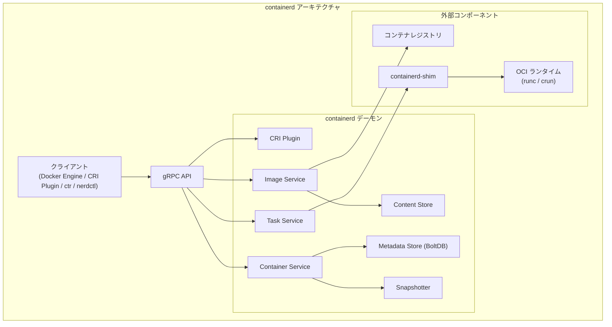

#### containerd-shim の役割

containerd のアーキテクチャで特に重要なのが **containerd-shim** の存在である。shim は containerd とコンテナプロセスの間に位置する軽量なプロセスで、以下の役割を担う。

1. **containerd のダウンタイム許容**: shim がコンテナの親プロセスとなることで、containerd の再起動やアップグレード時にもコンテナが影響を受けない
2. **stdio の中継**: コンテナの標準入出力をログドライバやクライアントに中継する
3. **終了ステータスの保持**: コンテナプロセスの終了コードを保持し、containerd が後から取得できるようにする
4. **OCI ランタイムの抽象化**: 異なる OCI ランタイム（runc, crun など）を透過的に扱えるようにする

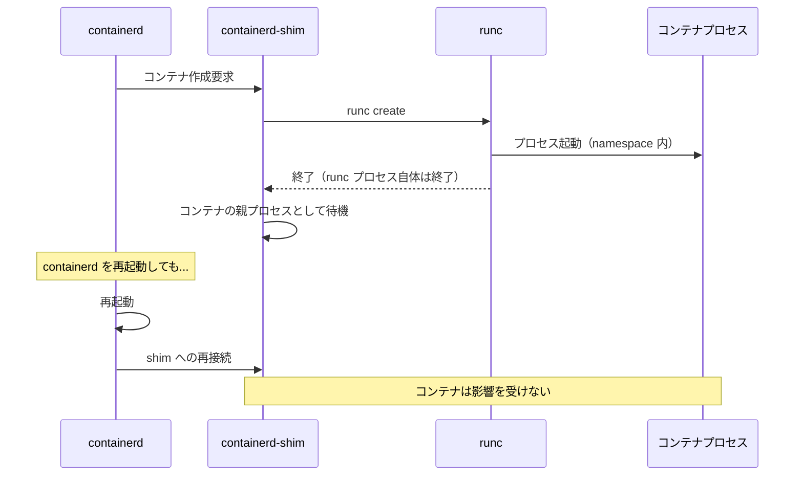

containerd-shim には v1 と v2 の2つのバージョンがある。v1 では shim とランタイム呼び出しが分離されていたが、**shim v2** ではプラグイン形式で統一され、カスタムランタイム（gVisor、Kata Containers など）との統合がより柔軟になった。shim v2 のバイナリは `containerd-shim-<runtime>-v1` という命名規則に従う（v2 API を実装しているが、バイナリ名の末尾は v1 であることに注意）。

#### Snapshotter

containerd の **Snapshotter** は、コンテナのファイルシステムを効率的に管理するプラグインインターフェースである。OCI イメージのレイヤ構造を展開し、コンテナ用の rootfs を準備する。

主要な Snapshotter 実装は以下の通り。

| Snapshotter | 説明 |
|-------------|------|
| **overlayfs** | Linux の OverlayFS を使用（最も一般的） |
| **native** | 単純なディレクトリコピー（デバッグ用） |
| **devmapper** | Device Mapper thin provisioning を使用 |
| **zfs** | ZFS のクローン機能を使用 |
| **stargz** | 遅延読み込み（Lazy pulling）に対応 |

#### containerd の CLI ツール

containerd には複数の CLI ツールが存在する。

- **ctr**: containerd に付属する低レベル CLI。デバッグ用途が主
- **nerdctl**: Docker 互換の CLI。Docker コマンドとほぼ同じ使い勝手を提供

```bash
# Pull an image using nerdctl
nerdctl pull nginx:latest

# Run a container
nerdctl run -d --name web -p 8080:80 nginx:latest

# List containers
nerdctl ps

# Using ctr (low-level)
ctr images pull docker.io/library/nginx:latest
ctr run docker.io/library/nginx:latest web
```

### CRI-O

#### 概要と設計思想

**CRI-O** は、Kubernetes の CRI（Container Runtime Interface）に特化して設計されたコンテナランタイムである。Red Hat、Intel、SUSE などが中心となって開発しており、CNCF の incubating プロジェクトである。

CRI-O の名前は「CRI + OCI」に由来する。その設計思想は明確で、「Kubernetes のための最小限のランタイム」を目指している。containerd が汎用的なコンテナ管理デーモンであるのに対し、CRI-O は Kubernetes 以外のユースケースを意図的に切り捨てることで、コードベースの簡潔さと安定性を追求している。

#### アーキテクチャ

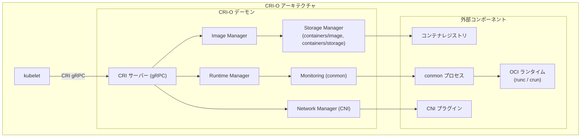

#### conmon の役割

CRI-O における **conmon**（container monitor）は、containerd-shim と類似の役割を果たす。conmon はコンテナごとに起動される軽量な C プログラムで、以下の機能を持つ。

- コンテナプロセスの PID 1 監視
- ログ管理（stdout/stderr のキャプチャとログファイルへの書き出し）
- 終了コードの報告
- CRI-O デーモンのクラッシュからの独立動作

::: tip
CRI-O プロジェクトでは、conmon の後継として **conmon-rs**（Rust 実装）の開発も進められている。Rust による実装はメモリ安全性の向上と、非同期 I/O によるパフォーマンス改善を目的としている。
:::

#### CRI-O の特徴

1. **Kubernetes バージョンとの同期**: CRI-O のメジャー/マイナーバージョンは Kubernetes に合わせている（例: CRI-O 1.29.x は Kubernetes 1.29.x に対応）
2. **コンパクトなコードベース**: Kubernetes に不要な機能を持たないため、攻撃対象面が小さい
3. **containers/image ライブラリ**: Skopeo や Podman と共通のイメージ管理ライブラリを使用
4. **containers/storage ライブラリ**: コンテナストレージの管理に共通ライブラリを使用

### containerd と CRI-O の比較

| 観点 | containerd | CRI-O |
|------|-----------|-------|
| **設計思想** | 汎用コンテナランタイム | Kubernetes 専用ランタイム |
| **主要スポンサー** | Docker, CNCF | Red Hat, Intel, SUSE |
| **CNCF ステータス** | Graduated | Incubating |
| **イメージ管理** | 独自実装 | containers/image ライブラリ |
| **ストレージ** | Snapshotter プラグイン | containers/storage ライブラリ |
| **shim** | containerd-shim | conmon / conmon-rs |
| **Kubernetes 以外の利用** | Docker, nerdctl 等で利用可 | 基本的に Kubernetes 専用 |
| **デフォルトのOCIランタイム** | runc | runc（crun も広く利用） |

## Kubernetes との統合 — CRI（Container Runtime Interface）

### CRI の背景

Kubernetes の初期バージョンでは、Docker が唯一のコンテナランタイムとしてハードコードされていた。しかし、コンテナランタイムの多様化に伴い、Kubernetes v1.5 で CRI（Container Runtime Interface）が導入された。CRI は gRPC ベースのプラグインインターフェースであり、kubelet とコンテナランタイムの間の通信を標準化する。

### dockershim の廃止

Docker は CRI に直接対応していなかったため、Kubernetes は **dockershim** というアダプタを内蔵して Docker をサポートしていた。しかし、この中間レイヤはメンテナンスコストが高く、バグの原因にもなっていた。

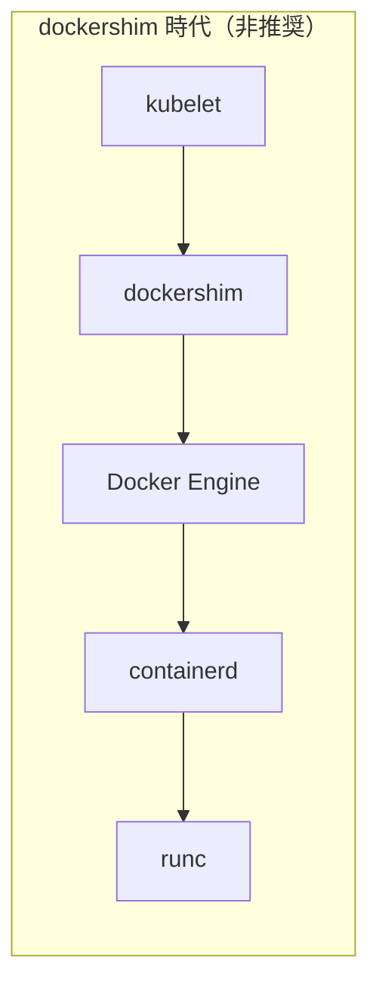

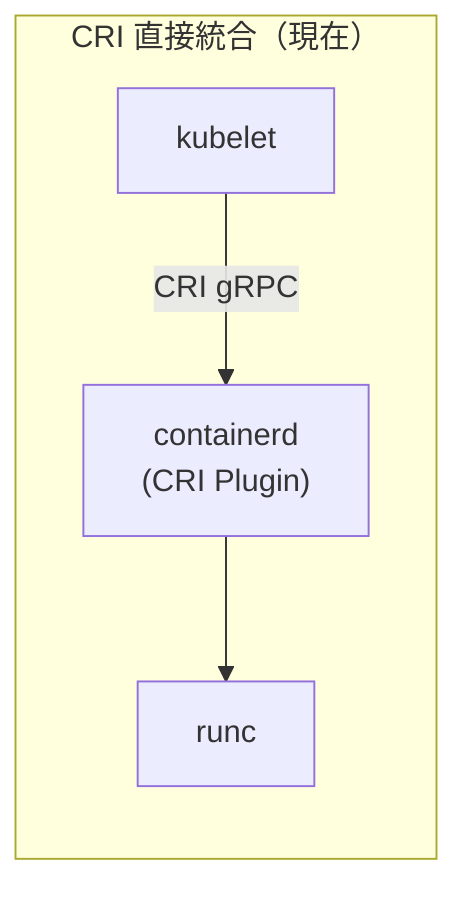

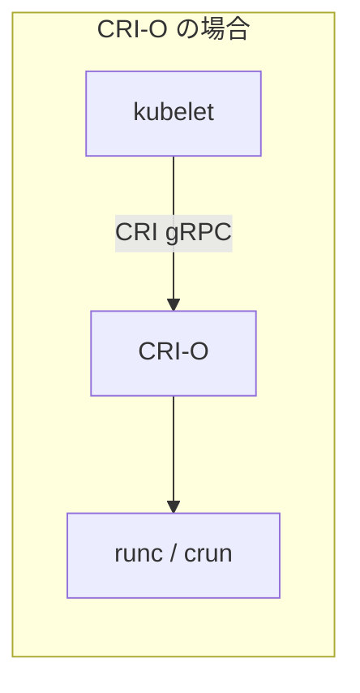

Kubernetes v1.24（2022年5月）で dockershim は正式に削除された。これにより、Kubernetes で Docker Engine を直接使用することはできなくなり、containerd または CRI-O を使用する必要がある。

::: warning
dockershim の廃止は「Docker で作ったイメージが使えなくなる」ことを意味しない。Docker で作成されたイメージは OCI イメージ仕様に準拠しているため、containerd や CRI-O で問題なく実行できる。変わったのはあくまで kubelet とランタイムの通信インターフェースである。
:::

### CRI の API 構造

CRI は2つの gRPC サービスで構成される。

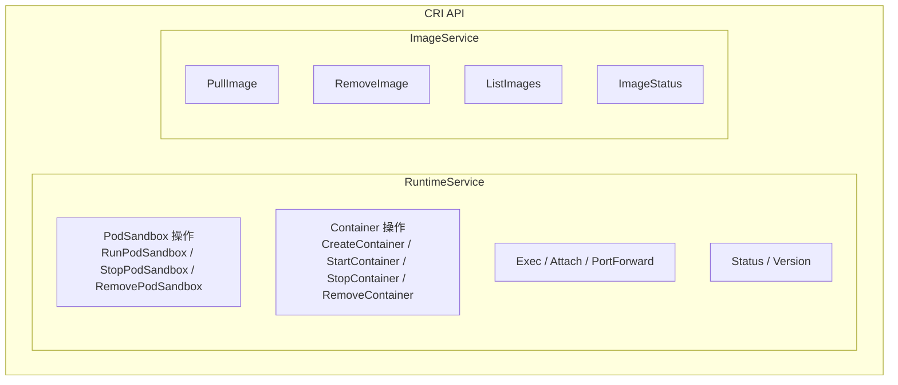

**RuntimeService** はコンテナとサンドボックス（Pod）のライフサイクルを管理し、**ImageService** はコンテナイメージの操作を担当する。

### Pod の作成フロー

Kubernetes で Pod が作成される際の、kubelet からコンテナプロセスまでのフローを見てみる。

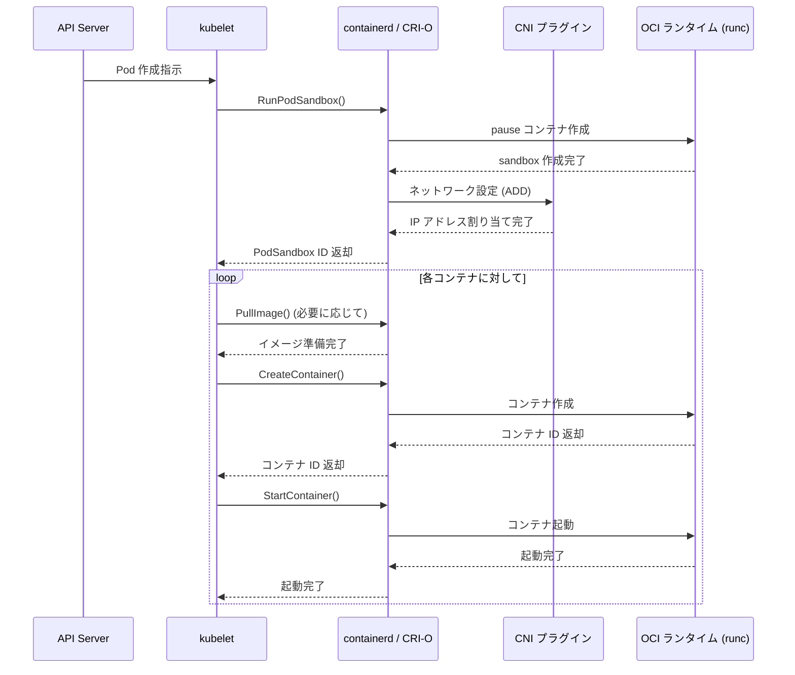

ここで注目すべきは、最初に「**pause コンテナ**」が作成されることである。pause コンテナは Pod 内のすべてのコンテナが共有する namespace（Network, IPC など）を保持するための特殊なコンテナで、実質的に何もしない極小のプロセスである。Pod 内の他のコンテナは、この pause コンテナの namespace に参加する形で起動される。

## ランタイムアーキテクチャの全体像

ここで、Docker、containerd、CRI-O のアーキテクチャを俯瞰する。

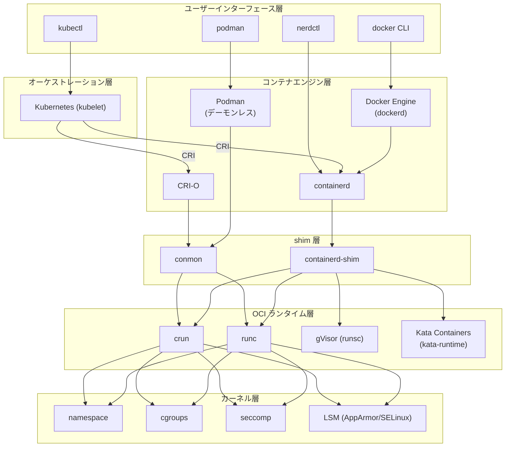

この図から、コンテナランタイムが明確に階層化されていることがわかる。

1. **ユーザーインターフェース層**: ユーザーがコンテナを操作するための CLI ツール
2. **オーケストレーション層**: Kubernetes のような自動化レイヤ
3. **コンテナエンジン層**: イメージ管理とコンテナライフサイクルの統括
4. **shim 層**: コンテナプロセスの監視と中継
5. **OCI ランタイム層**: 実際にカーネル機能を使ってプロセスを隔離
6. **カーネル層**: namespace, cgroups, seccomp 等の隔離メカニズム

### Podman — デーモンレスアーキテクチャ

上図に含まれている **Podman** についても触れておく。Podman は Red Hat が開発したコンテナ管理ツールで、Docker とコマンド互換を持ちつつ、根本的に異なるアーキテクチャを採用している。

Docker が `dockerd` デーモンを常駐させるのに対し、Podman はデーモンを持たない（daemonless）。各コンテナ操作は独立したプロセスとして実行され、conmon がコンテナを監視する。このアーキテクチャには以下のメリットがある。

- **セキュリティ**: root 権限で動作するデーモンが不要
- **systemd 統合**: 各コンテナを systemd ユニットとして管理可能
- **rootless コンテナ**: 一般ユーザーでのコンテナ実行が設計の中心
- **Pod 概念のネイティブサポート**: Kubernetes の Pod と同等の概念を直接サポート

## セキュリティとサンドボックスランタイム

従来のコンテナ（runc/crun）は、ホストカーネルを共有する形でプロセスを隔離する。namespace と cgroups による隔離は効果的だが、カーネルの脆弱性がコンテナエスケープにつながるリスクがある。この問題に対処するために、サンドボックスランタイムが開発された。

### gVisor（runsc）

#### 概要

**gVisor** は Google が開発したサンドボックスランタイムで、ユーザー空間でカーネルの機能を再実装するアプローチを採る。gVisor の OCI ランタイムバイナリは `runsc`（run Sandboxed Container）と呼ばれる。

#### アーキテクチャ

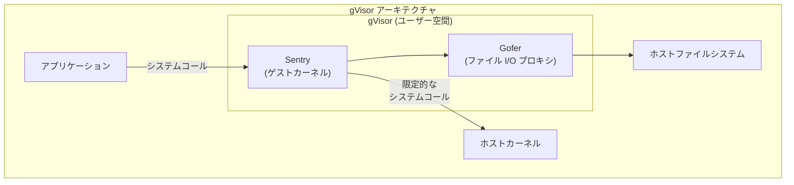

gVisor の中核は **Sentry** と呼ばれるコンポーネントで、Go 言語で実装されたゲストカーネルである。アプリケーションのシステムコールは Sentry がインターセプトし、大部分をユーザー空間内で処理する。ホストカーネルへ実際に発行されるシステムコールは大幅に削減されるため、攻撃対象面が縮小される。

**Gofer** はファイルシステム操作を仲介するプロキシプロセスで、9P プロトコルを使って Sentry からのファイル I/O 要求をホストファイルシステムに中継する。

#### システムコールのインターセプト方式

gVisor は以下の2つの方式でシステムコールをインターセプトする。

- **ptrace**: `ptrace` システムコールを使い、コンテナプロセスのシステムコールをトラップする。互換性は高いが、コンテキストスイッチが多くオーバーヘッドが大きい
- **KVM**: gVisor が仮想マシンモニタとして動作し、アプリケーションをゲストモードで実行する。ptrace より高速だが、KVM が利用可能な環境に限定される

#### トレードオフ

- **メリット**: カーネルの脆弱性からの保護、ホストカーネルへのシステムコール削減
- **デメリット**: 完全なシステムコール互換性がない（一部未実装）、ファイル I/O のオーバーヘッド、ネットワーク I/O のオーバーヘッド（ユーザー空間ネットワークスタック）

### Kata Containers

#### 概要

**Kata Containers** は、Intel Clear Containers と Hyper runV を統合して生まれたプロジェクトで、軽量な仮想マシンの中でコンテナを実行するアプローチを採る。OCI ランタイムインターフェースに準拠しており、containerd や CRI-O から透過的に利用できる。

#### アーキテクチャ

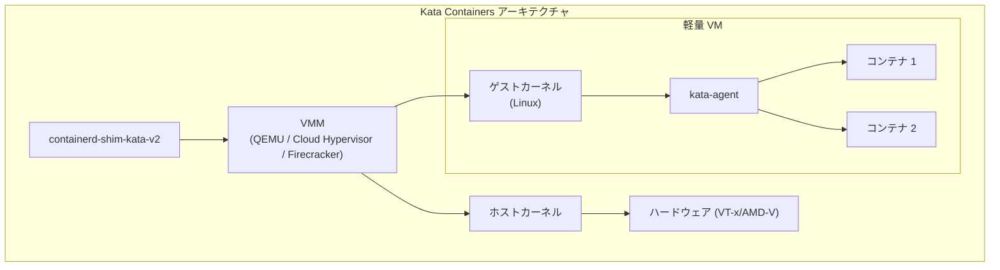

Kata Containers は、Pod ごとに軽量な仮想マシンを起動する。VM 内で専用のゲストカーネルが動作し、**kata-agent** がコンテナプロセスの管理を行う。VM 上位の shim（`containerd-shim-kata-v2`）とゲスト内の kata-agent は、vsock や virtio-serial を通じて通信する。

#### VMM（Virtual Machine Monitor）の選択肢

Kata Containers は複数の VMM をサポートする。

| VMM | 特徴 |
|-----|------|
| **QEMU** | 最も多機能。デバイスエミュレーションが豊富だが起動が遅い |
| **Cloud Hypervisor** | Rust 製。KVM ベースで高速起動・低メモリ消費 |
| **Firecracker** | Amazon が開発した軽量 VMM。AWS Lambda で使用 |
| **ACRN** | Intel が IoT 向けに開発した軽量ハイパーバイザ |

#### トレードオフ

- **メリット**: ハードウェアレベルの隔離（VM 境界）、ホストカーネルとの完全な分離、既存のカーネル互換性
- **デメリット**: VM 起動オーバーヘッド（数百ミリ秒）、メモリオーバーヘッド（ゲストカーネル分）、ネストされた仮想化環境での制約

### サンドボックスランタイムの比較

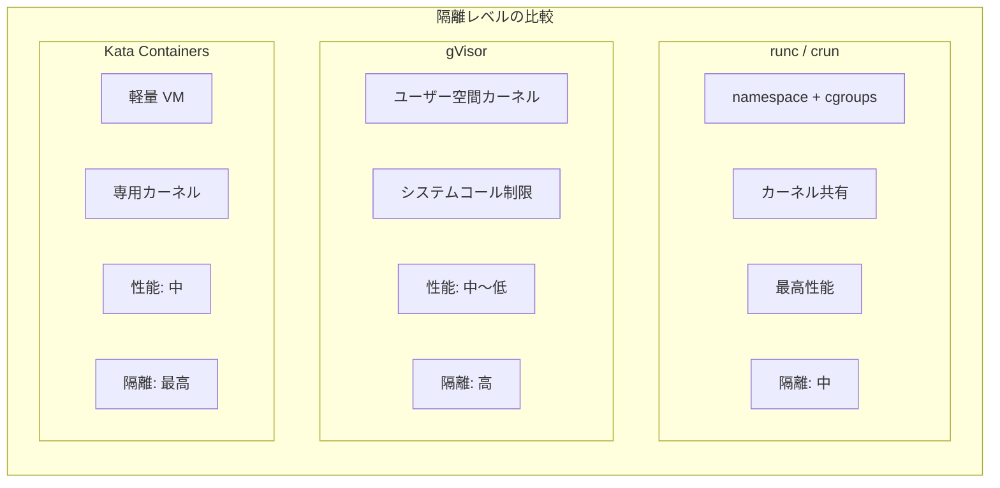

| 観点 | runc/crun | gVisor | Kata Containers |
|------|-----------|--------|-----------------|
| **隔離方式** | namespace + cgroups | ユーザー空間カーネル | 軽量 VM |
| **カーネル共有** | ホストカーネル共有 | 部分的に分離 | 完全に分離 |
| **起動速度** | ~50ms | ~150ms | ~500ms |
| **メモリオーバーヘッド** | 最小 | 中程度 | 大（ゲストカーネル分） |
| **互換性** | 完全 | 一部制限あり | ほぼ完全 |
| **主なユースケース** | 一般的なワークロード | マルチテナント環境 | 機密ワークロード |

## パフォーマンスと選定基準

### ランタイム選定のフローチャート

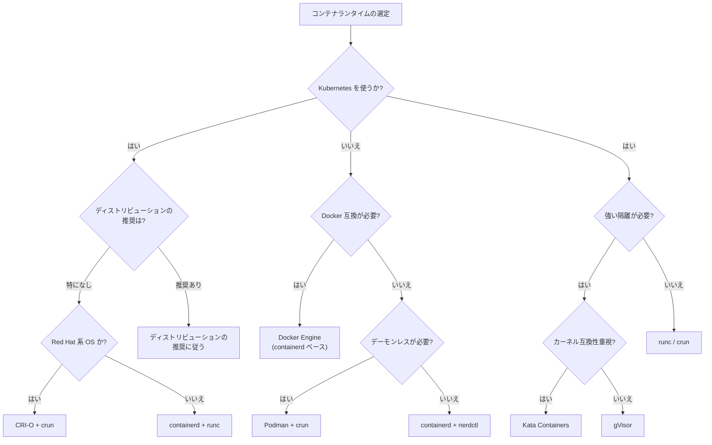

### 選定基準の整理

#### 高レベルランタイムの選定

**containerd を選ぶ場合:**
- Kubernetes 以外でもコンテナを使用する
- Docker Engine からの移行
- 幅広いエコシステムとの統合が必要
- GKE、EKS、AKS など主要クラウドの Kubernetes サービスでのデフォルト

**CRI-O を選ぶ場合:**
- Kubernetes 専用の環境
- OpenShift（Red Hat のKubernetes ディストリビューション）を使用
- 最小限のコンポーネントで攻撃対象面を小さくしたい
- Kubernetes バージョンとの厳密な互換性を重視

#### 低レベルランタイムの選定

**runc を選ぶ場合:**
- 安定性と広いコミュニティサポートを重視
- リファレンス実装としての信頼性
- containerd のデフォルトとしてそのまま使いたい

**crun を選ぶ場合:**
- コンテナの起動速度を重視
- メモリフットプリントを最小化したい
- サーバーレス/エッジ環境で大量のコンテナを扱う
- WASM ワークロードとの統合が必要

### 主要 Kubernetes ディストリビューションのデフォルトランタイム

| ディストリビューション | デフォルトランタイム |
|------------------------|---------------------|
| **GKE** (Google) | containerd |
| **EKS** (AWS) | containerd |
| **AKS** (Azure) | containerd |
| **OpenShift** (Red Hat) | CRI-O |
| **k3s** (Rancher) | containerd |
| **MicroK8s** (Canonical) | containerd |
| **Talos Linux** | containerd |

## 実践: ランタイムの切り替え

### containerd で OCI ランタイムを変更する

containerd の設定ファイル（`/etc/containerd/config.toml`）でデフォルトのランタイムを変更できる。

```toml
# /etc/containerd/config.toml
version = 2

[plugins."io.containerd.grpc.v1.cri".containerd]
  default_runtime_name = "crun"

[plugins."io.containerd.grpc.v1.cri".containerd.runtimes.crun]
  runtime_type = "io.containerd.runc.v2"

[plugins."io.containerd.grpc.v1.cri".containerd.runtimes.crun.options]
  BinaryName = "/usr/bin/crun"
```

### Kubernetes で RuntimeClass を使う

Kubernetes では **RuntimeClass** リソースを使って、Pod ごとに異なるランタイムを指定できる。

```yaml
# RuntimeClass definition
apiVersion: node.k8s.io/v1
kind: RuntimeClass
metadata:
  name: gvisor
handler: runsc
---
apiVersion: node.k8s.io/v1
kind: RuntimeClass
metadata:
  name: kata
handler: kata
```

```yaml
# Pod using a specific RuntimeClass
apiVersion: v1
kind: Pod
metadata:
  name: secure-pod
spec:
  runtimeClassName: gvisor
  containers:
    - name: app
      image: nginx:latest
```

この仕組みにより、同一クラスタ内で通常のワークロードは runc で実行しつつ、信頼できないワークロードは gVisor や Kata Containers で実行するといった運用が可能になる。

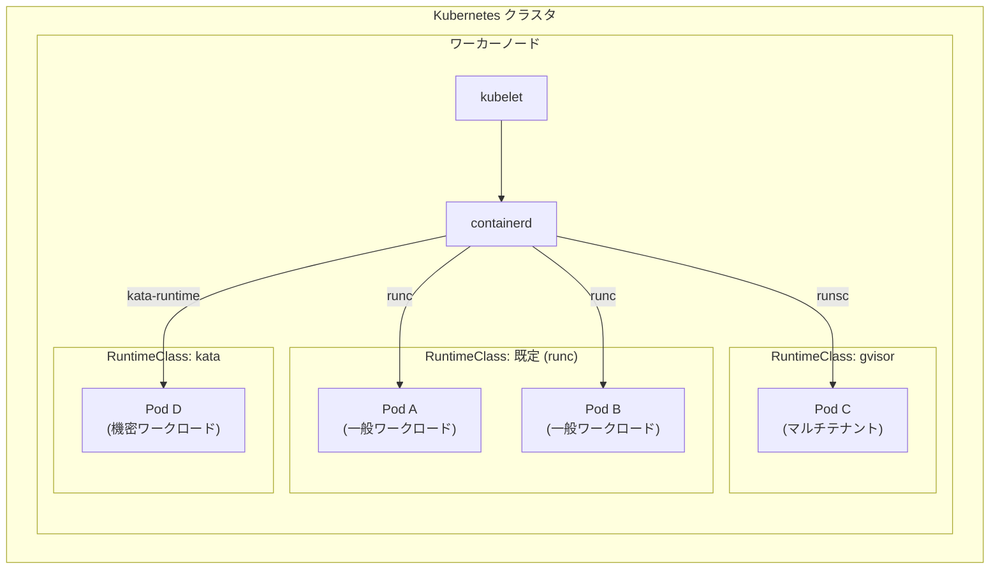

## コンテナランタイムの進化と将来展望

### WebAssembly（WASM）ランタイムとの融合

WebAssembly はブラウザ外でのランタイムとして注目されており、コンテナの代替として議論されることが増えている。WASM のサンドボックスは軽量でセキュアであり、以下のような利点がある。

- **起動速度**: ミリ秒未満でのコールドスタート
- **ポータビリティ**: CPU アーキテクチャに依存しない
- **セキュリティ**: capability-based のサンドボックス
- **フットプリント**: コンテナより遥かに軽量

containerd の **runwasi** プロジェクトや crun の WASM サポートにより、既存のコンテナエコシステムから WASM ワークロードを管理できるようになりつつある。

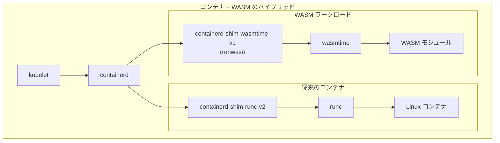

### Confidential Containers

クラウド環境での機密コンピューティング需要の高まりに伴い、**Confidential Containers** プロジェクトが注目されている。これは、TEE（Trusted Execution Environment）を活用して、クラウドプロバイダを含む外部からのアクセスに対してもコンテナワークロードを保護する技術である。

Intel SGX、AMD SEV-SNP、ARM CCA などのハードウェア機能と Kata Containers を組み合わせることで、実行時のメモリ暗号化やリモート認証（Remote Attestation）を実現する。

### コンテナランタイムの軽量化

サーバーレスやエッジコンピューティングの需要増加に伴い、コンテナランタイムのさらなる軽量化が進んでいる。Firecracker による microVM の高速起動（~125ms）、crun の最小フットプリント、そして WASM ランタイムの台頭は、すべてこの方向性に沿った進化である。

将来的には、ワークロードの特性に応じて最適なランタイムを自動的に選択する仕組みが標準化されていくと考えられる。Kubernetes の RuntimeClass はその第一歩であり、セキュリティ要件、性能要件、互換性要件を基に最適な隔離レベルを動的に決定するフレームワークの研究が進んでいる。

## まとめ

コンテナランタイムは、コンテナ技術の最も基盤的なレイヤであり、その設計と選択はシステムの性能、セキュリティ、運用性に直結する。本記事で解説した内容を整理する。

1. **OCI 標準**: Runtime Specification、Image Specification、Distribution Specification の3つの仕様がコンテナエコシステムの互換性を保証する
2. **低レベルランタイム**: runc（Go、リファレンス実装）と crun（C、高速・軽量）が代表的。OCI 仕様に従い、カーネル機能を直接操作してプロセスを隔離する
3. **高レベルランタイム**: containerd（汎用）と CRI-O（Kubernetes 専用）が二大勢力。イメージ管理からコンテナライフサイクルの統括までを担う
4. **Kubernetes 統合**: CRI を通じて kubelet とランタイムが通信。dockershim 廃止後は containerd または CRI-O が直接使用される
5. **サンドボックスランタイム**: gVisor（ユーザー空間カーネル）と Kata Containers（軽量 VM）が、カーネル共有に起因するセキュリティリスクに対処する
6. **将来展望**: WASM ランタイムとの融合、Confidential Containers、さらなる軽量化が進行中

コンテナランタイムの選定にあたっては、単に「最も高速なもの」や「最も安全なもの」を選ぶのではなく、ワークロードの特性、セキュリティ要件、運用体制、既存エコシステムとの親和性を総合的に判断することが重要である。Kubernetes の RuntimeClass を活用すれば、同一クラスタ内で複数のランタイムを使い分けることも可能であり、適材適所の運用が現実的になっている。
