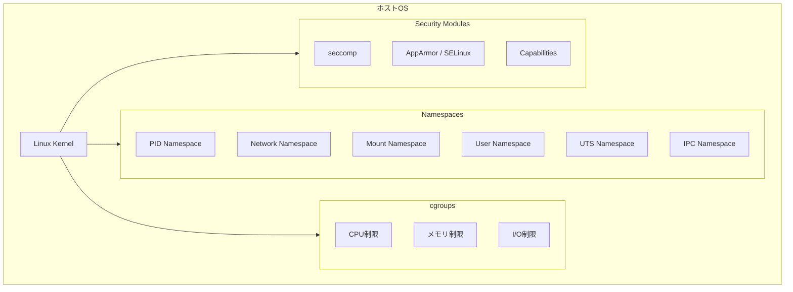
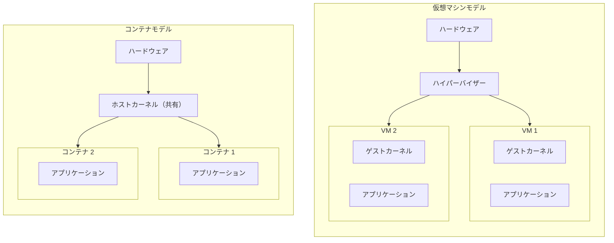
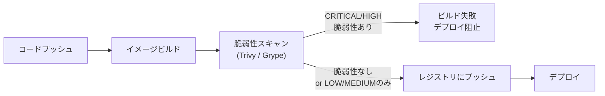
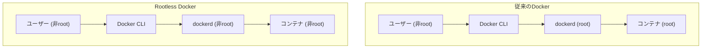
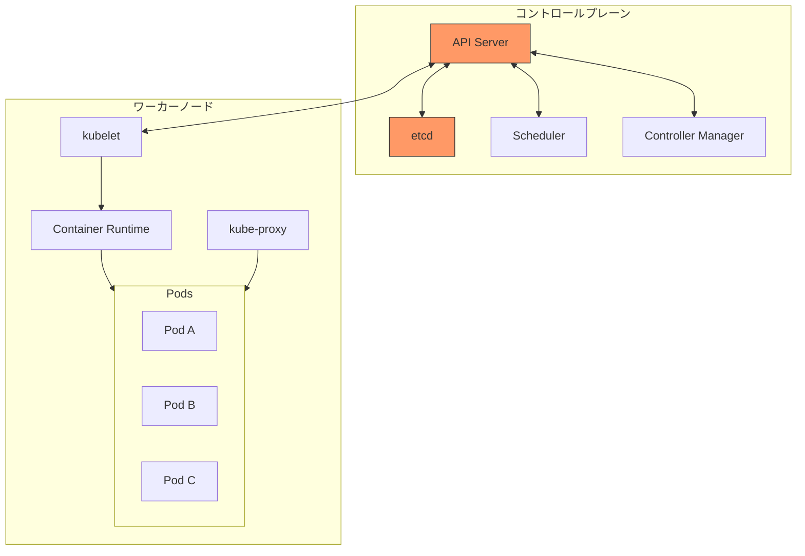
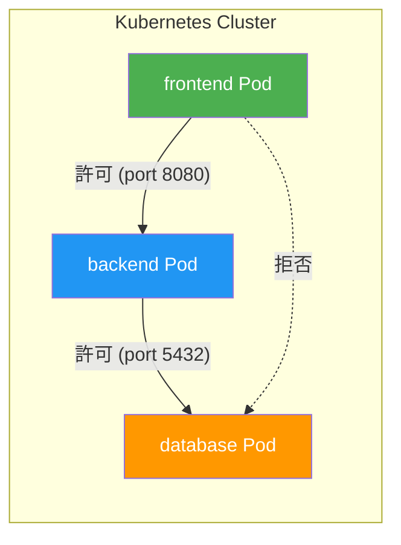
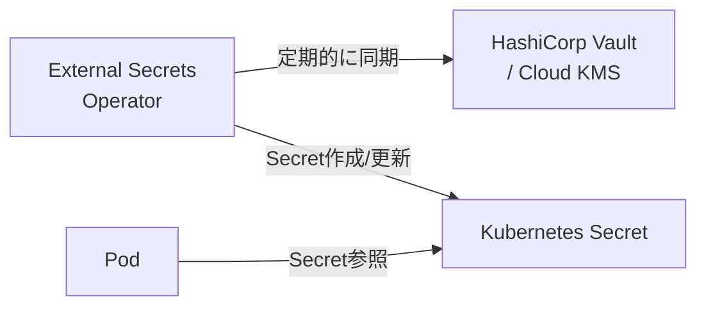
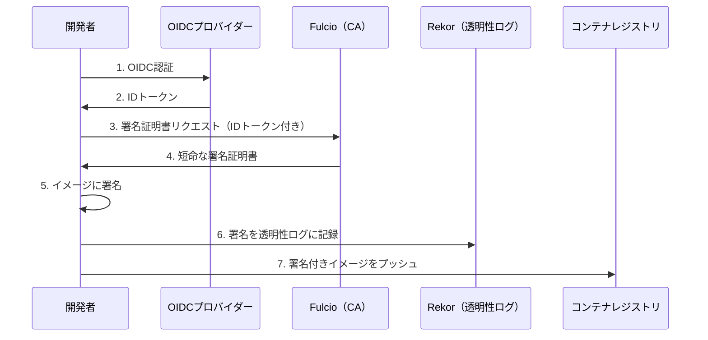
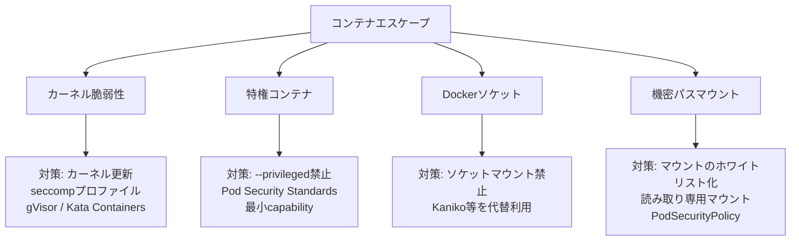
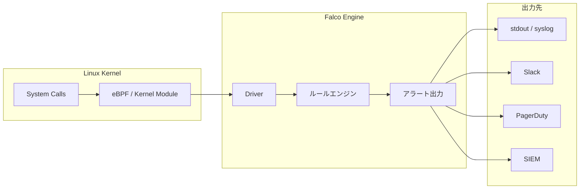

# コンテナセキュリティ — 隔離の仕組みから実践的防御まで

## 1. 背景と動機

### 1.1 コンテナ技術の台頭とセキュリティの課題

2013年にDockerが登場して以来、コンテナ技術はソフトウェア開発・運用の在り方を根本的に変えた。「Build once, run anywhere」という理念のもと、アプリケーションとその依存関係を一つのパッケージにまとめ、どの環境でも同一の動作を保証する。この利便性により、コンテナは瞬く間にマイクロサービスアーキテクチャの基盤として普及し、2026年現在では本番環境のワークロードの大半がコンテナ上で稼働している。

しかし、コンテナの急速な普及は、新たなセキュリティ上の課題を生み出した。従来の仮想マシン（VM）ベースの運用では、ハイパーバイザーによる強力なハードウェアレベルの隔離が前提であった。一方、コンテナはホストOSのカーネルを共有するという根本的に異なるアーキテクチャを持つ。この設計上の差異は、攻撃面の拡大と隔離強度の低下を意味し、コンテナ固有のセキュリティモデルを理解し適切に対策を講じることが不可欠となる。

### 1.2 なぜコンテナセキュリティを学ぶ必要があるのか

コンテナセキュリティが重要な理由は、以下の構造的な要因にある。

**カーネル共有のリスク**: コンテナはホストOSのカーネルを全コンテナで共有する。カーネルの脆弱性が一つでも存在すれば、任意のコンテナからホスト全体を掌握される可能性がある。VMの場合、ゲストOSのカーネルとホストOSのカーネルは完全に分離されているため、このリスクは大幅に低い。

**イメージのサプライチェーン**: コンテナイメージは多数のレイヤーで構成され、ベースイメージ、ライブラリ、アプリケーションコードがそれぞれ異なるソースから取得される。このサプライチェーンのどこかに脆弱性や悪意のあるコードが混入すれば、デプロイされるすべての環境に影響が波及する。

**動的で短命なワークロード**: コンテナは頻繁に作成・破棄される。この動的な性質は、従来の静的なセキュリティ監視ツールでは追跡しきれない攻撃面を生む。

**オーケストレーションの複雑さ**: Kubernetesのようなオーケストレーターは、ネットワーキング、ストレージ、シークレット管理など多くの機能を提供するが、それぞれが適切に設定されなければセキュリティホールとなる。

## 2. コンテナの基盤技術

コンテナのセキュリティを理解するためには、コンテナがどのような仕組みで動作しているかを正確に把握する必要がある。コンテナは「軽量な仮想マシン」ではなく、Linuxカーネルの機能を組み合わせてプロセスの隔離を実現する技術である。



### 2.1 Namespace（名前空間）

Namespaceは、Linuxカーネルが提供するリソース隔離の仕組みである。各コンテナに独立した「世界の見え方」を提供し、あたかも専用のシステム上で動作しているかのように振る舞わせる。コンテナのセキュリティの根幹をなす機能であり、6つの主要なNamespaceが存在する。

#### PID Namespace

プロセスIDの名前空間を分離する。コンテナ内では、コンテナのエントリーポイントプロセスがPID 1として見え、ホスト上の他のプロセスは一切見えない。ホスト側からはコンテナ内のプロセスが通常のプロセスとして見えるが、コンテナ内からはホストのプロセスツリーにアクセスできない。

```
ホスト側の視点:
  PID 1    (systemd)
  PID 1234 (dockerd)
  PID 5678 (コンテナのエントリーポイント)  ← ホストでの実PID
  PID 5679 (コンテナ内のワーカー)

コンテナ内の視点:
  PID 1    (コンテナのエントリーポイント)   ← コンテナ内ではPID 1に見える
  PID 2    (コンテナ内のワーカー)
```

セキュリティ上の意義は、コンテナ内のプロセスがホスト上の他のプロセスに対してシグナルを送信したり、`/proc` 経由で情報を読み取ったりすることを防ぐ点にある。

#### Network Namespace

ネットワークスタックを分離する。各コンテナは独自のネットワークインターフェース、IPアドレス、ルーティングテーブル、iptablesルールを持つ。コンテナ間の通信は、仮想イーサネットペア（veth pair）やブリッジネットワークを介して行われる。

この分離により、コンテナは他のコンテナのネットワークトラフィックを直接傍受できず、ホストのネットワーク設定を変更することもできない。ただし、`--network=host` オプションでNetwork Namespaceの分離を無効化すると、コンテナはホストのネットワークスタックに直接アクセスでき、セキュリティ上の重大なリスクとなる。

#### Mount Namespace

ファイルシステムのマウントポイントを分離する。コンテナは独自のルートファイルシステムを持ち、ホストのファイルシステムとは異なるマウント構成を見る。これにより、コンテナはホストのファイルシステムに直接アクセスできない（明示的にバインドマウントされた場合を除く）。

#### User Namespace

ユーザーIDとグループIDの空間を分離する。コンテナ内のroot（UID 0）をホスト上の非特権ユーザー（例: UID 100000）にマッピングすることが可能になる。これは「rootlessコンテナ」の基盤技術であり、コンテナ内でrootとして動作するプロセスがホスト上では非特権ユーザーとして制限されるため、コンテナエスケープ時の被害を大幅に軽減できる。

#### UTS Namespace

ホスト名とドメイン名を分離する。コンテナごとに独自のホスト名を設定できる。セキュリティ上の直接的な影響は小さいが、コンテナの完全な隔離を構成する一要素である。

#### IPC Namespace

System V IPCオブジェクト（共有メモリ、セマフォ、メッセージキュー）を分離する。異なるコンテナ間でのプロセス間通信を防ぎ、共有メモリを介した情報漏洩やDoS攻撃を防止する。

### 2.2 cgroups（コントロールグループ）

cgroupsはプロセスが使用できるリソース量を制限・管理する仕組みである。Namespaceが「何が見えるか」を制御するのに対し、cgroupsは「どれだけ使えるか」を制御する。

| リソース | 制御内容 | セキュリティ上の意義 |
|---------|---------|-------------------|
| CPU | 使用可能なCPU時間を制限 | 一つのコンテナがCPUを占有するDoS攻撃を防止 |
| メモリ | 使用可能なメモリ量を制限 | メモリ枯渇による他コンテナやホストへの影響を防止 |
| I/O | ディスクI/Oの帯域幅を制限 | ディスクI/Oの独占を防止 |
| PID | 作成可能なプロセス数を制限 | Fork爆弾（fork bomb）攻撃を防止 |

cgroupsがない場合、一つの悪意あるコンテナがシステムリソースを使い尽くし、同一ホスト上の他のコンテナやホストOS自体を機能不全に陥れることが可能になる。これはリソース枯渇型のDoS攻撃の典型例である。

### 2.3 コンテナ vs 仮想マシンのセキュリティモデル

コンテナとVMのセキュリティモデルの違いを正確に理解することは、適切なセキュリティ対策を選択する上で極めて重要である。



**隔離の境界**: VMはハイパーバイザーが提供するハードウェアレベルの隔離に依存する。各VMは独自のカーネルを持ち、ハイパーバイザーを介してハードウェアにアクセスする。攻撃者がVM内のカーネルを完全に掌握しても、ハイパーバイザーの壁を突破しない限りホストには到達できない。一方、コンテナはホストカーネルを共有するため、カーネルの脆弱性が直接的な脅威となる。

**攻撃面の大きさ**: Linuxカーネルは300以上のシステムコールを提供しており、コンテナからはこれらのシステムコールインターフェースが攻撃面となる。ハイパーバイザーの攻撃面はこれよりはるかに小さい（仮想デバイスのエミュレーション部分に限定される）。

**パフォーマンス**: コンテナはカーネルを共有するため、VMと比較してオーバーヘッドが極めて小さい。起動時間は秒単位（VMは分単位）であり、リソース効率も高い。このパフォーマンス上の利点が、セキュリティモデルの弱さとのトレードオフとなっている。

**実用上のバランス**: セキュリティ要件が極めて高い場合（マルチテナント環境での完全な隔離など）にはVMが適しており、信頼性の高いワークロードをパフォーマンス効率よく実行する場合にはコンテナが適する。両者を組み合わせた「VM内でコンテナを実行する」アプローチや、Kata ContainersやFirecrackerのような軽量VMベースのコンテナランタイムも選択肢となる。

## 3. イメージセキュリティ

コンテナイメージは、コンテナとして実行されるファイルシステムの静的なスナップショットである。イメージに含まれる脆弱性は、そのイメージから作成されるすべてのコンテナに継承される。したがって、イメージの構築段階でのセキュリティ対策は、コンテナセキュリティの最も基本的な層である。

### 3.1 ベースイメージの選択

ベースイメージの選択は、コンテナのセキュリティに直接的な影響を与える。一般的に、イメージに含まれるソフトウェアが多いほど攻撃面が広くなる。

| ベースイメージ | サイズの目安 | パッケージ数 | セキュリティ特性 |
|--------------|------------|------------|----------------|
| `ubuntu:24.04` | ~78MB | 多数 | パッケージマネージャー、シェルを含む。デバッグ容易だが攻撃面が広い |
| `alpine:3.20` | ~7MB | 最小限 | musl libc、BusyBoxベース。小さいが互換性の問題が生じうる |
| `gcr.io/distroless/static` | ~2MB | ほぼなし | シェル、パッケージマネージャーなし。最小の攻撃面 |
| `scratch` | 0MB | なし | 空のイメージ。静的リンクバイナリ専用 |

**Distrolessイメージ**はGoogleが提供する最小限のコンテナイメージであり、アプリケーションの実行に必要なランタイムのみを含む。シェル（`/bin/sh`）すら存在しないため、攻撃者がコンテナに侵入しても任意のコマンドを実行することが極めて困難になる。Go、Java、Python、Node.jsなど主要な言語向けのDistrolessイメージが提供されている。

```dockerfile
# Multi-stage build: build in full image, run in distroless
FROM golang:1.22 AS builder
WORKDIR /app
COPY . .
RUN CGO_ENABLED=0 go build -o /server .

FROM gcr.io/distroless/static:nonroot
COPY --from=builder /server /server
USER nonroot:nonroot
ENTRYPOINT ["/server"]
```

この例では、ビルドステージでは完全なGoツールチェーンを使用し、実行ステージではDistrolessイメージに最終的なバイナリのみをコピーしている。マルチステージビルドは、ビルドツールや中間成果物が最終イメージに含まれることを防ぐ基本的なプラクティスである。

### 3.2 脆弱性スキャン

コンテナイメージに含まれるOS パッケージやアプリケーションの依存ライブラリに既知の脆弱性（CVE）が含まれていないかを検査することは、CI/CDパイプラインに組み込むべき必須のプロセスである。

#### Trivy

Trivyは、Aqua Securityが開発するオープンソースの脆弱性スキャナーである。コンテナイメージだけでなく、ファイルシステム、Gitリポジトリ、IaC（Infrastructure as Code）の設定ファイルもスキャンできる包括的なツールである。

```bash
# Scan a container image
trivy image myapp:latest

# Scan with severity filter
trivy image --severity HIGH,CRITICAL myapp:latest

# Scan and fail CI if high/critical vulnerabilities found
trivy image --exit-code 1 --severity HIGH,CRITICAL myapp:latest

# Scan filesystem (e.g., project directory)
trivy fs --security-checks vuln,secret,config .
```

Trivyの特長は、脆弱性データベースの自動更新、幅広い言語のパッケージマネージャー対応（npm、pip、Maven、Go modules等）、そしてシークレット検出やIaCの設定ミス検出までカバーする多機能性にある。

#### Grype

GrypeはAnchoreが開発する脆弱性スキャナーで、SBOMとの連携に強みを持つ。Syftと組み合わせることでSBOM生成とスキャンを統合できる。

```bash
# Scan a container image
grype myapp:latest

# Generate SBOM with Syft and scan with Grype
syft myapp:latest -o spdx-json > sbom.json
grype sbom:sbom.json
```

#### CI/CDパイプラインへの統合

脆弱性スキャンは、イメージのビルド直後に自動的に実行されるべきである。重大な脆弱性が検出された場合はパイプラインを失敗させ、脆弱なイメージがデプロイされることを防ぐ。



### 3.3 イメージ構築のベストプラクティス

安全なコンテナイメージを構築するための主要な原則を以下に示す。

**1. rootユーザーで実行しない**: Dockerfileで `USER` ディレクティブを使い、非特権ユーザーでアプリケーションを実行する。多くの公式イメージはデフォルトでrootとして実行されるため、明示的な変更が必要である。

```dockerfile
# Create a non-root user and switch to it
RUN addgroup --system appgroup && adduser --system --ingroup appgroup appuser
USER appuser
```

**2. `.dockerignore` を活用する**: `.git`、`.env`、秘密鍵ファイルなどがイメージに含まれないよう、`.dockerignore` で除外する。

**3. レイヤーを最小化する**: 不要なパッケージのインストールを避け、`RUN` 命令を統合してレイヤー数を減らす。パッケージインストール後にキャッシュを削除する。

**4. 固定バージョンのタグを使用する**: `FROM node:latest` ではなく `FROM node:22.5.0-slim` のように具体的なバージョンを指定する。`latest` タグは予期しない変更を招き、再現性を損なう。

**5. `COPY` は `ADD` より優先する**: `ADD` はURLからのダウンロードやtarの自動展開機能を持つが、これらの暗黙的な動作はセキュリティリスクとなりうる。明示的な `COPY` を使用すべきである。

## 4. ランタイムセキュリティ

イメージの安全性を確保しても、コンテナの実行時（ランタイム）のセキュリティ設定が適切でなければ防御は不十分である。ランタイムセキュリティは、コンテナが実行中に持つ権限と能力を最小化し、攻撃者がコンテナ内部に侵入した場合の被害を限定することを目的とする。

### 4.1 読み取り専用ファイルシステム

コンテナのファイルシステムを読み取り専用でマウントすることで、攻撃者がマルウェアをファイルシステムに書き込むことを防ぐ。

```bash
# Run container with read-only root filesystem
docker run --read-only myapp:latest

# Allow writing only to specific directories (e.g., /tmp)
docker run --read-only --tmpfs /tmp:rw,noexec,nosuid myapp:latest
```

`--tmpfs` オプションで一時ファイル用のディレクトリのみ書き込み可能にする。`noexec` フラグを付けることで、一時ディレクトリに書き込まれたファイルの実行を防止できる。

### 4.2 Linux Capabilities

従来、Linuxではプロセスの権限は「rootか非rootか」の二択であった。Linux Capabilitiesは、root権限を細分化した約40の個別の権限（capability）として定義し、必要な権限のみを付与できる仕組みである。

Dockerはデフォルトで一部のcapabilityを付与しているが、多くの場合これらも不要である。

```bash
# Drop all capabilities, then add only what's needed
docker run --cap-drop=ALL --cap-add=NET_BIND_SERVICE myapp:latest
```

主要なcapabilityとそのリスク：

| Capability | 機能 | リスク |
|-----------|------|--------|
| `CAP_SYS_ADMIN` | 多数の管理操作 | ほぼroot同等。コンテナエスケープの温床 |
| `CAP_NET_RAW` | rawソケットの使用 | パケットスプーフィング、ネットワーク盗聴が可能 |
| `CAP_SYS_PTRACE` | 他プロセスのトレース | プロセスのメモリ読み取り・改ざんが可能 |
| `CAP_NET_BIND_SERVICE` | 1024未満のポートにバインド | 低リスク。Webサーバーに必要 |
| `CAP_CHOWN` | ファイル所有者の変更 | 権限昇格の足がかりとなりうる |

原則として `--cap-drop=ALL` ですべてのcapabilityを削除し、アプリケーションが実際に必要とするものだけを `--cap-add` で追加する（最小権限の原則）。

### 4.3 no-new-privileges

`no-new-privileges` フラグは、コンテナ内のプロセスが `setuid` バイナリや他の手段を通じて新しい特権を取得することを防ぐ。

```bash
docker run --security-opt=no-new-privileges:true myapp:latest
```

`setuid` ビットが設定された実行ファイル（例: `/usr/bin/passwd`）は、通常、実行者の権限に関係なくファイル所有者（通常はroot）の権限で実行される。`no-new-privileges` を設定すると、この特権昇格メカニズムが無効化される。

### 4.4 Seccompプロファイル

Seccomp（Secure Computing Mode）は、プロセスが使用できるシステムコールを制限するLinuxカーネルの機能である。コンテナが本来必要としないシステムコールをブロックすることで、カーネルの攻撃面を大幅に縮小できる。

Dockerはデフォルトでseccompプロファイルを適用し、約300のシステムコールのうち約50を制限している。しかし、アプリケーション固有のカスタムプロファイルを作成することで、さらに攻撃面を縮小できる。

```json
{
  "defaultAction": "SCMP_ACT_ERRNO",
  "architectures": ["SCMP_ARCH_X86_64"],
  "syscalls": [
    {
      "names": ["read", "write", "open", "close", "stat", "fstat",
                "mmap", "mprotect", "munmap", "brk", "exit_group",
                "accept", "bind", "listen", "socket", "connect"],
      "action": "SCMP_ACT_ALLOW"
    }
  ]
}
```

このプロファイルは、デフォルトですべてのシステムコールを拒否し（`SCMP_ACT_ERRNO`）、明示的にリストされたシステムコールのみを許可するホワイトリスト方式である。

```bash
# Apply custom seccomp profile
docker run --security-opt seccomp=custom-profile.json myapp:latest
```

注意すべきは、`--security-opt seccomp=unconfined` でseccompを完全に無効化することは極めて危険であるという点である。デバッグ目的以外では絶対に使用すべきではない。

### 4.5 Rootlessコンテナ

Rootlessコンテナは、Dockerデーモン自体を非特権ユーザーとして実行する構成である。従来のDockerでは、Dockerデーモン（`dockerd`）がroot権限で動作し、コンテナの作成・管理を行っていた。この構成では、Dockerデーモンの脆弱性がそのままroot権限での攻撃を許す。



Rootlessモードでは、User Namespaceを活用してコンテナ内のrootをホスト上の非特権ユーザーにマッピングする。Podmanは設計当初からデーモンレス・rootless動作を前提としており、rootlessコンテナのデファクトスタンダードの一つとなっている。

```bash
# Run rootless container with Podman (no daemon required)
podman run --rm -it myapp:latest

# Docker rootless mode setup
dockerd-rootless-setuptool.sh install
```

## 5. Kubernetesのセキュリティ

Kubernetesはコンテナオーケストレーションのデファクトスタンダードであるが、その豊富な機能と複雑なアーキテクチャは、適切に設定されなければ広大な攻撃面を生む。



### 5.1 RBAC（Role-Based Access Control）

RBACは、Kubernetes APIへのアクセスを「誰が」「何に対して」「何をできるか」で制御する仕組みである。適切に設定されていない場合、サービスアカウントやユーザーが過剰な権限を持ち、クラスター全体を危険にさらす。

```yaml
# Role: defines permissions within a namespace
apiVersion: rbac.authorization.k8s.io/v1
kind: Role
metadata:
  namespace: production
  name: pod-reader
rules:
- apiGroups: [""]
  resources: ["pods"]
  verbs: ["get", "list", "watch"]

---
# RoleBinding: assigns the role to a service account
apiVersion: rbac.authorization.k8s.io/v1
kind: RoleBinding
metadata:
  name: read-pods
  namespace: production
subjects:
- kind: ServiceAccount
  name: monitoring-sa
  namespace: production
roleRef:
  kind: Role
  name: pod-reader
  apiGroup: rbac.authorization.k8s.io
```

RBACの重要な原則：

- **最小権限の原則**: 各サービスアカウントには、その機能に必要な最小限の権限のみを付与する
- **`cluster-admin` の使用を最小限に**: `cluster-admin` ClusterRoleはクラスター全体への完全なアクセス権を持つ。人間のオペレーターにも可能な限り制限された権限を付与する
- **ワイルドカードの回避**: `verbs: ["*"]` や `resources: ["*"]` は避ける
- **デフォルトサービスアカウントの権限を制限する**: Podにはデフォルトでサービスアカウントトークンが自動マウントされる。不要な場合は `automountServiceAccountToken: false` を設定する

### 5.2 Pod Security Standards

Pod Security Standards（PSS）は、Podのセキュリティに関する設定をポリシーとして定義・適用するKubernetesのネイティブ機能である。Kubernetes 1.25でGA（正式版）となったPod Security Admissionにより、NamespaceレベルでPodのセキュリティポリシーを強制できる。

PSSには3つのレベルが定義されている：

| レベル | 説明 | 主な制限 |
|-------|------|---------|
| Privileged | 制限なし | なし（すべて許可） |
| Baseline | 既知の特権昇格を防止 | privilegedコンテナ、hostNetwork、hostPID、hostIPCを禁止 |
| Restricted | 最も厳格 | Baselineに加え、root実行禁止、capability制限、seccomp必須 |

```yaml
# Apply restricted policy to a namespace
apiVersion: v1
kind: Namespace
metadata:
  name: production
  labels:
    pod-security.kubernetes.io/enforce: restricted
    pod-security.kubernetes.io/audit: restricted
    pod-security.kubernetes.io/warn: restricted
```

Restrictedレベルに準拠したPodの例：

```yaml
apiVersion: v1
kind: Pod
metadata:
  name: secure-app
  namespace: production
spec:
  securityContext:
    runAsNonRoot: true
    seccompProfile:
      type: RuntimeDefault
  containers:
  - name: app
    image: myapp:1.0.0
    securityContext:
      allowPrivilegeEscalation: false
      readOnlyRootFilesystem: true
      capabilities:
        drop: ["ALL"]
      runAsUser: 1000
      runAsGroup: 1000
    resources:
      limits:
        memory: "256Mi"
        cpu: "500m"
      requests:
        memory: "128Mi"
        cpu: "250m"
```

### 5.3 Network Policies

デフォルトでは、Kubernetes内のすべてのPodは互いに自由に通信できる。Network Policyを使用することで、Pod間の通信を明示的に許可されたものだけに制限できる（ゼロトラストネットワーキング）。

```yaml
# Deny all ingress traffic by default
apiVersion: networking.k8s.io/v1
kind: NetworkPolicy
metadata:
  name: default-deny-ingress
  namespace: production
spec:
  podSelector: {}
  policyTypes:
  - Ingress

---
# Allow traffic only from frontend to backend
apiVersion: networking.k8s.io/v1
kind: NetworkPolicy
metadata:
  name: allow-frontend-to-backend
  namespace: production
spec:
  podSelector:
    matchLabels:
      app: backend
  policyTypes:
  - Ingress
  ingress:
  - from:
    - podSelector:
        matchLabels:
          app: frontend
    ports:
    - protocol: TCP
      port: 8080
```



重要な注意点として、Network PolicyはCNI（Container Network Interface）プラグインによって実装される。Calico、Cilium、WeavenetなどのプラグインはNetwork Policyをサポートするが、FlannelなどサポートしないCNIプラグインもある。Network Policyを定義しても、CNIプラグインがサポートしていなければ効果がない。

### 5.4 Secrets管理

KubernetesのSecretsは、パスワード、APIキー、TLS証明書などの機密情報を管理するためのリソースである。しかし、デフォルトのSecretsにはいくつかの重要なセキュリティ上の制約がある。

**デフォルトのSecretsの問題点**:

- SecretsはBase64エンコードされているだけで、暗号化されていない
- etcdに平文で保存される（暗号化を明示的に有効にしない限り）
- RBAC設定が不適切な場合、Secretsへの不正アクセスが容易

**対策とベストプラクティス**:

```yaml
# Enable encryption at rest for etcd
apiVersion: apiserver.config.k8s.io/v1
kind: EncryptionConfiguration
resources:
  - resources:
    - secrets
    providers:
    - aescbc:
        keys:
        - name: key1
          secret: <base64-encoded-key>
    - identity: {}
```

実運用では、以下のような外部シークレット管理ツールの導入が強く推奨される：

- **HashiCorp Vault**: 動的シークレット生成、リース管理、監査ログを提供する業界標準のシークレット管理ツール
- **AWS Secrets Manager / Azure Key Vault / Google Secret Manager**: クラウドネイティブなシークレット管理サービス
- **External Secrets Operator**: 外部のシークレット管理サービスからKubernetes Secretsを自動的に同期するオペレーター



## 6. サプライチェーンセキュリティ

コンテナのサプライチェーンセキュリティとは、コンテナイメージの構築・配布・デプロイのプロセス全体にわたって、ソフトウェアの完全性と信頼性を保証することである。近年、SolarWinds事件やLog4Shell脆弱性に代表されるサプライチェーン攻撃の増加により、この領域への関心が急速に高まっている。

### 6.1 イメージ署名

コンテナイメージの署名は、イメージが信頼できるソースから提供され、配布過程で改ざんされていないことを暗号学的に検証する仕組みである。

#### Sigstore / cosign

Sigstoreは、Linux Foundationが支援するソフトウェア署名のためのオープンソースプロジェクトであり、cosignはそのコンテナイメージ署名ツールである。

```bash
# Sign a container image with cosign
cosign sign myregistry.io/myapp:v1.0.0

# Verify a signed image
cosign verify myregistry.io/myapp:v1.0.0

# Keyless signing with OIDC (recommended)
COSIGN_EXPERIMENTAL=1 cosign sign myregistry.io/myapp:v1.0.0
```

Sigstoreのキーレス署名は、開発者がOIDCプロバイダー（GitHub、Google等）で認証し、短命な証明書で署名する仕組みである。長期間の秘密鍵管理が不要になるため、鍵の紛失や漏洩のリスクを大幅に低減できる。



Kubernetesでは、Admission Controllerを使用して署名されていないイメージのデプロイを拒否できる。Sigstore Policy ControllerやKyvernoがこの機能を提供する。

### 6.2 SBOM（Software Bill of Materials）

SBOMは、ソフトウェアに含まれるすべてのコンポーネント（ライブラリ、パッケージ、依存関係）の一覧である。食品の原材料表示に例えられることが多い。SBOMにより、新たな脆弱性が公開された際に、影響を受けるイメージを即座に特定できる。

```bash
# Generate SBOM with Syft
syft myapp:latest -o spdx-json > sbom.spdx.json

# Attach SBOM to container image with cosign
cosign attach sbom --sbom sbom.spdx.json myregistry.io/myapp:v1.0.0
```

主要なSBOM標準フォーマット：

- **SPDX（Software Package Data Exchange）**: Linux Foundationが策定。ISO/IEC 5962として国際標準化されている
- **CycloneDX**: OWASPが策定。脆弱性管理に特化した設計

米国の大統領令（EO 14028）やEUのCRA（Cyber Resilience Act）など、各国の規制がソフトウェアのサプライチェーン透明性を求めるようになっており、SBOMの作成は法規制遵守の観点からも重要性を増している。

### 6.3 イメージの来歴追跡（Provenance）

SLSA（Supply-chain Levels for Software Artifacts）は、Googleが提唱するサプライチェーンセキュリティのフレームワークであり、ソフトウェア成果物がどのように構築されたかを検証可能な形で記録する「来歴（provenance）」の概念を定義している。

SLSAは4つのレベルを定義し、レベルが上がるほどサプライチェーンの信頼性保証が強くなる：

| レベル | 要件 | 説明 |
|-------|------|------|
| SLSA 1 | ビルドプロセスの文書化 | ビルドが何らかの形で記録されている |
| SLSA 2 | ホスティングされたビルドサービス | バージョン管理と統合されたビルド |
| SLSA 3 | ハード化されたビルド環境 | ビルド環境の改ざん防止 |
| SLSA 4 | 再現可能なビルド | 同じソースから同一の成果物を再現できる |

GitHub ActionsはSLSAレベル3のprovenance生成をネイティブにサポートしている。

## 7. コンテナエスケープ攻撃

コンテナエスケープとは、コンテナの隔離を破ってホストOSやホスト上の他のコンテナにアクセスする攻撃である。コンテナセキュリティにおいて最も重大な脅威の一つであり、その攻撃手法を理解することは防御策を設計する上で不可欠である。

### 7.1 主な攻撃ベクトル

#### カーネル脆弱性の悪用

コンテナはホストカーネルを共有しているため、カーネルの脆弱性はすべてのコンテナからの攻撃に利用される可能性がある。歴史的な例としては以下がある：

- **CVE-2016-5195（Dirty COW）**: Copy-on-Writeの競合状態を利用した特権昇格。コンテナ内からホストのファイルを書き換えることが可能であった
- **CVE-2019-5736（runc脆弱性）**: コンテナランタイムruncの脆弱性により、悪意あるコンテナがホスト上のruncバイナリを上書きし、以降のコンテナ操作時にrootとして任意のコードを実行できた
- **CVE-2020-15257（Containerd脆弱性）**: host networkモードのコンテナからcontainerdの抽象UNIXソケットにアクセスし、ホスト上で任意のコードを実行できた
- **CVE-2022-0185**: ファイルシステム関連のヒープオーバーフローにより、非特権ユーザーがコンテナから脱出可能であった

#### 特権コンテナの悪用

`--privileged` フラグで起動されたコンテナは、ほぼホスト上のroot権限と同等の能力を持つ。すべてのcapabilityが付与され、すべてのデバイスへのアクセスが可能になり、seccompやAppArmorによる制限も無効化される。

```bash
# DANGEROUS: privileged container can easily escape
docker run --privileged -it ubuntu bash

# Inside the container: mount host filesystem
mount /dev/sda1 /mnt
chroot /mnt
# Now you have full access to the host filesystem
```

特権コンテナは絶対に本番環境で使用してはならない。

#### Dockerソケットのマウント

CI/CDパイプラインやDocker-in-Docker構成で、Dockerソケット（`/var/run/docker.sock`）をコンテナにマウントするパターンは非常に危険である。

```bash
# DANGEROUS: mounting Docker socket
docker run -v /var/run/docker.sock:/var/run/docker.sock myapp

# Inside the container: create a privileged container to escape
docker run --privileged -v /:/host -it ubuntu chroot /host
```

Dockerソケットへのアクセス権は、実質的にホスト上のroot権限と同等である。

#### 機密ホストパスのマウント

`/`、`/etc`、`/proc`、`/sys` などのホストパスをコンテナにマウントすることで、ホストの設定ファイルの読み取り・書き換えやカーネルパラメータの変更が可能になる。

### 7.2 防御策のまとめ



コンテナエスケープに対する多層防御の考え方：

1. **予防**: 特権コンテナの禁止、最小capabilityの原則、seccompプロファイルの適用
2. **検知**: ランタイム監視ツール（Falco等）による異常動作の検知
3. **被害限定**: rootlessコンテナ、User Namespace、読み取り専用ファイルシステム
4. **カーネル保護**: カーネルの定期的なアップデート、gVisorやKata Containersによるカーネル攻撃面の縮小

## 8. ランタイム監視

### 8.1 Falco

Falcoは、CNCF（Cloud Native Computing Foundation）のインキュベーションプロジェクトであり、コンテナとKubernetesのランタイムセキュリティ監視ツールのデファクトスタンダードである。Linuxカーネルのシステムコールをリアルタイムで監視し、事前に定義されたルールに基づいて異常な動作を検知・アラートする。



#### 検知ルールの例

Falcoのルールは、条件（condition）、出力（output）、優先度（priority）で構成される。

```yaml
# Detect shell execution in container
- rule: Terminal shell in container
  desc: Detect a shell being spawned in a container
  condition: >
    spawned_process and container and
    proc.name in (bash, sh, zsh, csh, dash) and
    not proc.pname in (cron, supervisord)
  output: >
    Shell spawned in container
    (user=%user.name container=%container.name
     shell=%proc.name parent=%proc.pname
     image=%container.image.repository)
  priority: WARNING
  tags: [container, shell]

# Detect reading sensitive files
- rule: Read sensitive file in container
  desc: Detect reading of sensitive files in a container
  condition: >
    open_read and container and
    fd.name in (/etc/shadow, /etc/passwd, /etc/sudoers)
  output: >
    Sensitive file read in container
    (user=%user.name file=%fd.name
     container=%container.name
     image=%container.image.repository)
  priority: CRITICAL
  tags: [container, filesystem]

# Detect outbound connection to unexpected port
- rule: Unexpected outbound connection
  desc: Detect outbound network connections to non-standard ports
  condition: >
    outbound and container and
    not fd.sport in (80, 443, 53, 8080, 8443)
  output: >
    Unexpected outbound connection
    (user=%user.name command=%proc.cmdline
     connection=%fd.name container=%container.name)
  priority: NOTICE
  tags: [container, network]
```

これらのルールにより、以下のような攻撃の兆候をリアルタイムで検知できる：

- コンテナ内でのシェルの起動（攻撃者がインタラクティブアクセスを獲得した可能性）
- 機密ファイルの読み取り（認証情報の窃取の試み）
- 予期しないネットワーク接続（C2サーバーへの通信、データの外部送信）
- 権限昇格の試み（setuid/setgidバイナリの実行）
- コンテナ内からのコンテナ管理ツールの実行（エスケープの試み）

### 8.2 その他のランタイムセキュリティツール

| ツール | 提供元 | 特徴 |
|-------|--------|------|
| Falco | CNCF | eBPFベースのルール駆動型検知。OSS |
| Tetragon | Isovalent / Cilium | eBPFベースのカーネルレベル監視。ポリシー適用も可能 |
| Sysdig Secure | Sysdig | Falcoベースの商用版。脅威インテリジェンス統合 |
| Aqua Security | Aqua | コンテナライフサイクル全体のセキュリティプラットフォーム |
| Tracee | Aqua | eBPFベースのランタイムセキュリティ。OSS |

## 9. 包括的なベストプラクティス

コンテナセキュリティは単一の対策ではなく、多層防御（Defense in Depth）の考え方に基づいて実装される。以下に、コンテナのライフサイクル全体にわたるベストプラクティスを体系的にまとめる。

### 9.1 イメージ構築フェーズ

```
[ベースイメージ]
□ 信頼できるソースからの公式イメージを使用する
□ 可能な限り最小限のイメージ（distroless / alpine / scratch）を選択する
□ イメージタグは具体的なバージョンを指定する（latestを避ける）
□ マルチステージビルドでビルドツールを最終イメージから除外する

[Dockerfile]
□ rootユーザーで実行しない（USERディレクティブを使用）
□ 不要なパッケージをインストールしない
□ シークレットをイメージに含めない（ビルド引数やレイヤーに残る）
□ COPYをADDより優先する
□ .dockerignoreで機密ファイルを除外する

[スキャン]
□ CI/CDパイプラインに脆弱性スキャンを組み込む
□ CRITICAL/HIGHの脆弱性でビルドを失敗させる
□ 定期的に既存イメージを再スキャンする（新たなCVEへの対応）
□ シークレット検出スキャンを実行する
```

### 9.2 コンテナランタイムフェーズ

```
[権限制御]
□ --privileged を使用しない
□ --cap-drop=ALL で全capabilityを削除し、必要なもののみ追加
□ --security-opt=no-new-privileges:true を設定する
□ seccompプロファイルを適用する（最低限デフォルトプロファイル）

[ファイルシステム]
□ --read-only で読み取り専用ファイルシステムにする
□ 一時ファイル用のtmpfsは noexec,nosuid フラグ付きで設定する
□ ホストパスのマウントを最小限にする
□ Dockerソケットをマウントしない

[ネットワーク]
□ --network=host を使用しない
□ 不要なポートを公開しない
□ コンテナ間通信を制限する

[ユーザー]
□ rootlessコンテナを使用する（可能な場合）
□ User Namespaceを有効にする
```

### 9.3 Kubernetesフェーズ

```
[アクセス制御]
□ RBACを最小権限で設定する
□ cluster-adminの使用を最小限にする
□ 不要なサービスアカウントトークンの自動マウントを無効化する

[Podセキュリティ]
□ Pod Security Standards（Restricted）を適用する
□ リソースの limits と requests を設定する
□ コンテナセキュリティコンテキストを明示的に設定する

[ネットワーク]
□ デフォルトのNetwork Policyで全トラフィックを拒否する
□ 必要な通信のみを明示的に許可する
□ Namespace間の通信を制限する

[シークレット]
□ etcdの暗号化を有効にする
□ 外部シークレット管理ツール（Vault等）を使用する
□ 環境変数よりもボリュームマウントでシークレットを渡す

[サプライチェーン]
□ イメージの署名を検証するAdmission Controllerを導入する
□ SBOMを生成・管理する
□ プライベートレジストリを使用し、イメージプルポリシーをAlwaysに設定する
```

### 9.4 運用・監視フェーズ

```
[ランタイム監視]
□ Falco等のランタイムセキュリティツールを導入する
□ 異常動作の検知ルールを定義・チューニングする
□ アラートを適切なチャネル（Slack、PagerDuty等）に通知する

[ログ・監査]
□ Kubernetes Audit Logを有効にする
□ コンテナログを集約・分析する
□ セキュリティイベントのダッシュボードを構築する

[更新・パッチ管理]
□ ベースイメージを定期的に更新する
□ ホストOSのカーネルを最新に保つ
□ コンテナランタイム（containerd、runc等）を最新に保つ
□ Kubernetesを定期的にアップグレードする
```

## 10. 高度な隔離技術

標準的なコンテナの隔離では不十分な場合（マルチテナント環境、信頼されないワークロードの実行など）に、より強力な隔離を提供する技術が存在する。

### 10.1 gVisor

gVisorはGoogleが開発したアプリケーションカーネルであり、コンテナとホストカーネルの間に追加の隔離レイヤーを提供する。コンテナのシステムコールをgVisorのユーザー空間カーネル（Sentry）がインターセプトし、必要なシステムコールのみをホストカーネルに転送する。

```
通常のコンテナ:
  アプリケーション → システムコール → ホストカーネル

gVisor:
  アプリケーション → システムコール → Sentry（ユーザー空間） → 限定的なシステムコール → ホストカーネル
```

gVisorはカーネルの攻撃面を大幅に縮小するが、システムコールのオーバーヘッドがあり、すべてのアプリケーションと互換性があるわけではない。Google Cloud Runでは内部的にgVisorが使用されている。

### 10.2 Kata Containers

Kata Containersは、軽量なVMの中でコンテナを実行するアプローチである。各コンテナ（またはPod）が独自の軽量カーネルを持つため、VMレベルの隔離とコンテナの利便性（OCI互換のインターフェース）を両立する。

AWS Firecrackerは同様のコンセプトに基づくmicroVMであり、AWS LambdaやFargateの基盤技術として使用されている。起動時間が100ms未満と極めて高速であり、従来のVMのオーバーヘッドを大幅に削減している。

### 10.3 eBPFによるセキュリティ

eBPF（extended Berkeley Packet Filter）は、カーネルの動作をカーネルモジュールの変更なしにプログラム可能にする技術であり、コンテナセキュリティの分野で急速に普及している。

Ciliumは、eBPFベースのCNIプラグインであり、従来のiptablesベースのNetwork Policyよりもきめ細かく高性能なネットワークセキュリティを提供する。L7（HTTPレベル）のポリシー適用や、プロセスレベルでのネットワークアクセス制御が可能である。

TetragonはCiliumチームが開発するeBPFベースのランタイムセキュリティツールであり、検知だけでなくカーネルレベルでの即座のポリシー適用（プロセスのkillやネットワーク接続の切断）が可能である。

## 11. まとめと今後の展望

コンテナセキュリティは、単一の技術や対策で完結するものではなく、コンテナのライフサイクル全体にわたる多層防御として設計・運用されるべきものである。

**基盤の理解**: コンテナはLinuxカーネルのNamespace、cgroups、Capabilities、seccompを組み合わせた隔離技術であり、VMとは根本的に異なるセキュリティモデルを持つ。カーネル共有という構造的特性を正しく理解し、その上で適切な防御策を講じる必要がある。

**ビルド時の防御**: 最小限のベースイメージの選択、非rootユーザーでの実行、脆弱性スキャンのCI/CDパイプラインへの統合。これらはコンテナイメージという「静的な成果物」の安全性を確保する。

**ランタイムの防御**: capabilityの削除、seccompプロファイルの適用、読み取り専用ファイルシステム、rootlessコンテナ。これらは実行中のコンテナの権限を最小化し、攻撃者がコンテナに侵入した場合の被害を限定する。

**オーケストレーションの防御**: RBACの最小権限設定、Pod Security Standards、Network Policy、Secrets管理。これらはKubernetes環境全体のセキュリティポスチャーを強化する。

**サプライチェーンの防御**: イメージ署名、SBOM、来歴追跡。これらは「信頼できるソフトウェアのみが実行される」ことを保証する。

**ランタイム監視**: Falcoなどのツールによるリアルタイムの異常検知。予防策をすり抜けた攻撃を検知し、対応する最後の防御線である。

今後のコンテナセキュリティの方向性として、eBPFの活用はますます重要になっていく。カーネルモジュールを追加することなく、きめ細かいセキュリティポリシーの適用と高性能な監視を実現するeBPFは、コンテナセキュリティの基盤技術としての地位を確立しつつある。また、ゼロトラストアーキテクチャの浸透により、サービスメッシュ（Istio、Linkerd）との統合による暗号化通信の強制やアイデンティティベースのアクセス制御も標準的なプラクティスとなりつつある。

コンテナセキュリティの本質は、利便性とセキュリティの間の適切なバランスを見つけることにある。過度に厳格なセキュリティ設定はDevOpsのアジリティを損ない、逆に緩すぎる設定はセキュリティインシデントのリスクを高める。組織のリスク許容度と運用能力に応じて、段階的にセキュリティ成熟度を高めていくアプローチが現実的である。
