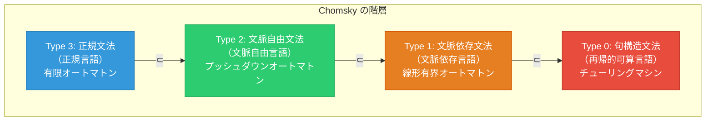
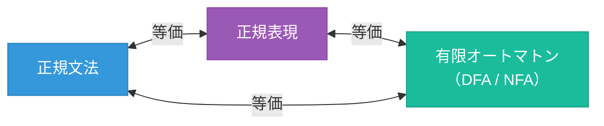
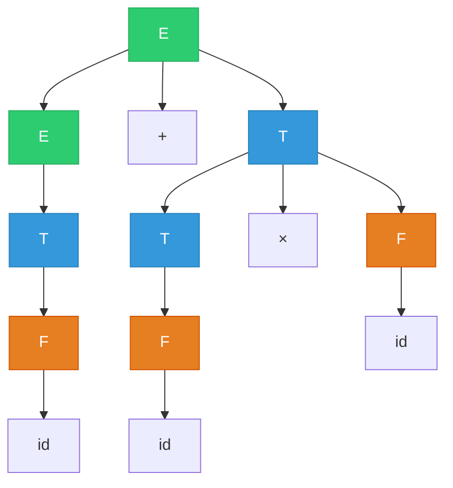
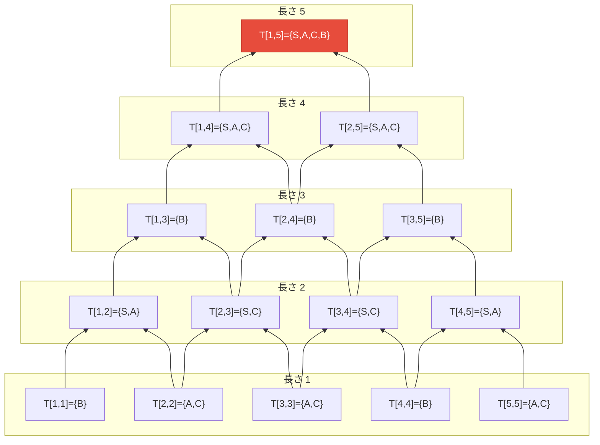
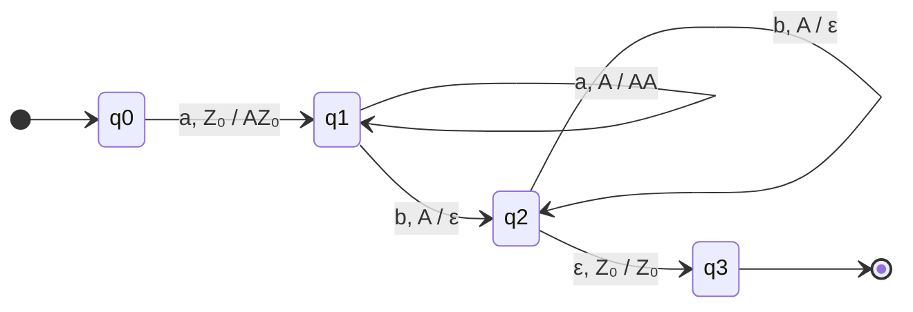
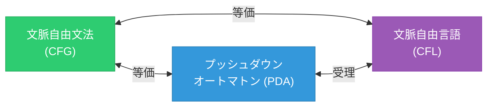
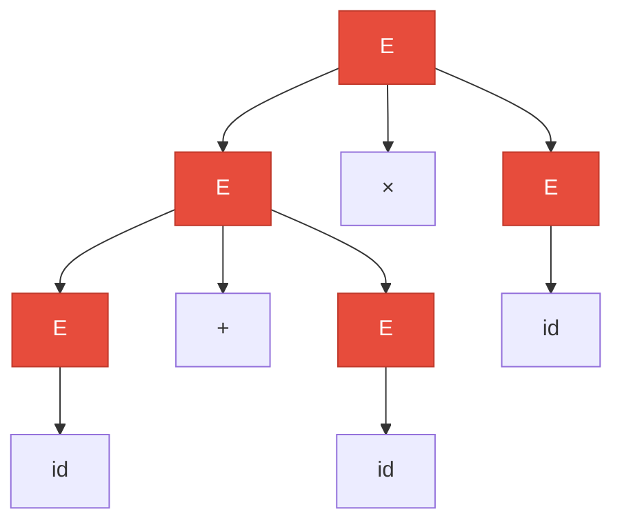
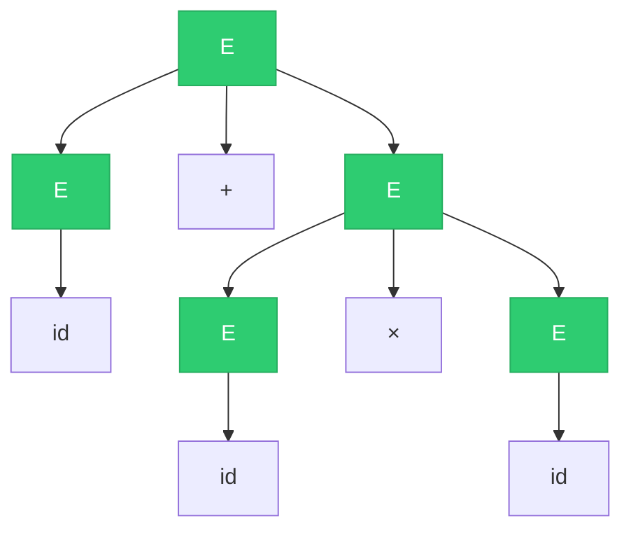
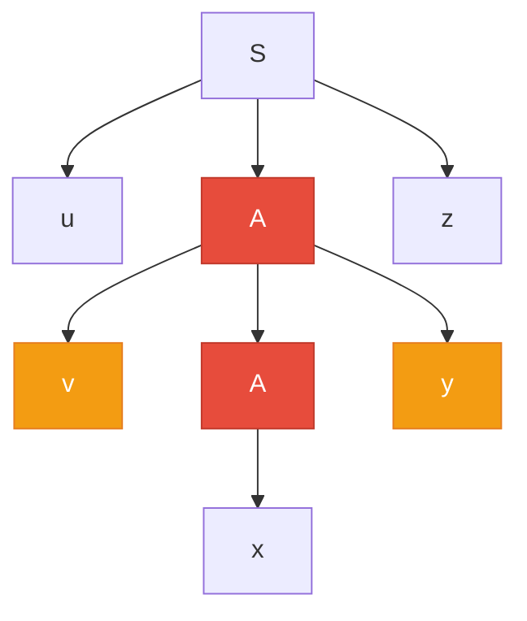
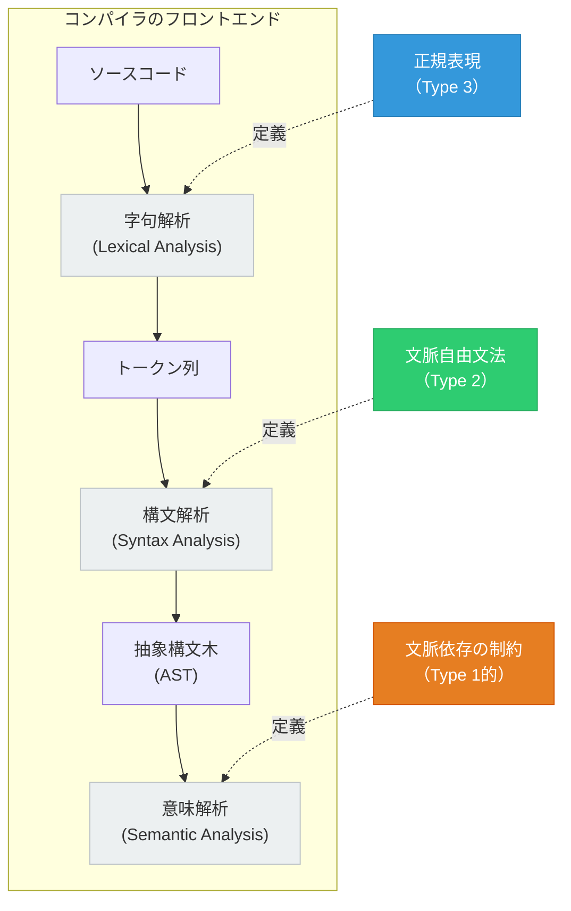

# 文脈自由文法と言語の階層 — 形式言語理論の中核を理解する

## 1. 形式言語と形式文法

### 1.1 なぜ形式言語が必要なのか

コンピューターサイエンスにおいて、「言語」は日常的な会話のための自然言語だけを意味しない。プログラミング言語のソースコード、数式、正規表現、DNA配列、通信プロトコルのメッセージ——これらはすべて、ある種の**規則**に従って構成された文字列の集まりであり、**形式言語**（formal language）として数学的に扱うことができる。

形式言語理論が解決しようとする根本的な問いは次のようなものである。

> **ある文字列の集合を、有限の規則で正確に記述することは可能か？ そしてその規則の「表現力」にはどのような階層があるのか？**

この問いに対する体系的な回答を与えたのが、言語学者 Noam Chomsky による**形式文法**（formal grammar）の理論である。Chomsky は1956年から1959年にかけて、自然言語の構文構造を数学的に分析するための枠組みを構築した。その成果は言語学にとどまらず、コンパイラ設計、オートマトン理論、計算可能性理論など、計算機科学の広範な領域に決定的な影響を与えた。

### 1.2 基本的な定義

形式言語を議論するために、まずいくつかの基本概念を定義する。

**アルファベット**（alphabet）$\Sigma$ は、有限個のシンボル（記号）の集合である。たとえば $\Sigma = \{0, 1\}$ や $\Sigma = \{a, b, c\}$ である。

**文字列**（string）は、アルファベット上のシンボルを有限個並べたものである。空文字列は $\varepsilon$ で表す。$\Sigma$ 上のすべての文字列の集合を $\Sigma^*$ と書く。たとえば $\{0, 1\}^* = \{\varepsilon, 0, 1, 00, 01, 10, 11, 000, \ldots\}$ である。

**形式言語**（formal language）$L$ は、$\Sigma^*$ の部分集合、すなわち $L \subseteq \Sigma^*$ として定義される。言語は有限の場合も無限の場合もある。たとえば「偶数個の $0$ を含むすべての二進文字列」の集合は、$\{0, 1\}$ 上の無限の形式言語である。

### 1.3 形式文法の定義

**形式文法**（formal grammar）$G$ は、4つの要素の組 $G = (V, \Sigma, R, S)$ として定義される。

- $V$：**非終端記号**（nonterminal symbol）の有限集合。変数（variable）とも呼ばれる。
- $\Sigma$：**終端記号**（terminal symbol）の有限集合。$V \cap \Sigma = \emptyset$（非終端記号と終端記号は互いに素）。
- $R$：**生成規則**（production rule）の有限集合。各規則は $\alpha \to \beta$ の形をとり、$\alpha \in (V \cup \Sigma)^+$（少なくとも1つの非終端記号を含む）、$\beta \in (V \cup \Sigma)^*$ である。
- $S \in V$：**開始記号**（start symbol）。

生成規則を繰り返し適用することで、開始記号 $S$ から文字列を**導出**（derive）する。文法 $G$ から導出可能なすべての終端記号列の集合を、$G$ が**生成する言語** $L(G)$ と呼ぶ。

$$
L(G) = \{ w \in \Sigma^* \mid S \Rightarrow^* w \}
$$

ここで $\Rightarrow^*$ は「0回以上の導出ステップで到達可能」を意味する。

## 2. Chomsky の階層

### 2.1 階層の全体像

Chomsky は、生成規則に対する制約の厳しさによって文法を4つのクラスに分類した。これが**Chomsky の階層**（Chomsky hierarchy）である。制約が厳しいほど表現力は弱くなるが、その分、解析が容易になるというトレードオフがある。

| 型 | 名称 | 生成規則の制約 | 対応するオートマトン | 判定問題の計算量 |
|---|---|---|---|---|
| Type 0 | 句構造文法（Unrestricted grammar） | 制約なし | チューリングマシン | 決定不能 |
| Type 1 | 文脈依存文法（Context-sensitive grammar） | $\lvert\alpha\rvert \leq \lvert\beta\rvert$ | 線形有界オートマトン | PSPACE完全 |
| Type 2 | 文脈自由文法（Context-free grammar） | $A \to \beta$（左辺は非終端記号1つ） | プッシュダウンオートマトン | $O(n^3)$（CYK） |
| Type 3 | 正規文法（Regular grammar） | $A \to aB$ または $A \to a$ | 有限オートマトン | $O(n)$ |

この階層は**真の包含関係**を形成する。

$$
\text{正規言語} \subsetneq \text{文脈自由言語} \subsetneq \text{文脈依存言語} \subsetneq \text{再帰的可算言語}
$$



### 2.2 各階層の直観的な理解

この階層を直感的に理解するには、「生成規則の左辺がどれだけ自由か」という観点が役立つ。

**Type 3（正規文法）** では、左辺は非終端記号1つ、右辺は終端記号1つに続く非終端記号（最大1つ）のみ。これは「今の状態からシンボルを1つ出力して、次の状態に移る」という有限オートマトンの動作に直接対応する。

**Type 2（文脈自由文法）** では、左辺は非終端記号1つであるが、右辺の制約が緩和され、非終端記号と終端記号の任意の列を置ける。「文脈自由」という名前は、非終端記号 $A$ の書き換えが、$A$ の周囲の文脈（前後の記号列）に依存しないことに由来する。

**Type 1（文脈依存文法）** では、左辺に複数の記号を含めることができ、非終端記号の書き換えがその周囲の文脈に依存しうる。ただし、生成規則の右辺の長さが左辺以上でなければならない（$\lvert\alpha\rvert \leq \lvert\beta\rvert$）。

**Type 0（句構造文法）** には制約がなく、あらゆる生成規則が許される。チューリングマシンと同等の計算能力を持つ。

### 2.3 なぜこの階層が重要なのか

Chomsky の階層が重要である理由は、**問題の解析可能性と表現力のトレードオフ**を明確にする点にある。

プログラミング言語のコンパイラを設計する際には、「その言語の構文を記述できる最も制約の強い（＝解析が効率的な）文法クラスはどれか？」という問いが中心的な役割を果たす。多くのプログラミング言語の構文は文脈自由文法で近似できるが、型の整合性や変数のスコープなど一部の制約は文脈依存的であり、意味解析のフェーズで別途処理される。

## 3. 正規文法と正規言語

### 3.1 正規文法の定義

**正規文法**（regular grammar）は、Chomsky 階層の最下層に位置する最も制約の強い文法クラスである。正規文法の生成規則は、以下の形式のいずれかに限定される。

**右線形文法**（right-linear grammar）の場合：

$$
A \to aB \quad \text{または} \quad A \to a \quad \text{または} \quad A \to \varepsilon
$$

ここで $A, B \in V$（非終端記号）、$a \in \Sigma$（終端記号）である。

たとえば、$\{0, 1\}$ 上の「$01$ で終わるすべての文字列」を生成する正規文法は次のように定義できる。

$$
\begin{aligned}
S &\to 0S \mid 1S \mid 0A \\
A &\to 1
\end{aligned}
$$

### 3.2 正規表現と有限オートマトンとの等価性

正規文法の特筆すべき性質は、以下の3つの形式化が等価であることである。

1. **正規文法**（regular grammar）
2. **正規表現**（regular expression）
3. **有限オートマトン**（finite automaton; DFA / NFA）

つまり、正規文法で記述できる言語は、正規表現でも有限オートマトンでも記述できる。この等価性は Kleene の定理として知られている。



有限オートマトンは**有限個の状態**しか持たないため、「これまでに見た入力の要約」を有限の情報量でしか記憶できない。この制約が正規言語の表現力の限界を決定する。

### 3.3 正規言語の限界：ポンピング補題

正規言語では表現できない言語の代表例が $L = \{a^n b^n \mid n \geq 0\}$（$a$ が $n$ 個に続いて $b$ が $n$ 個並ぶ文字列の集合）である。直感的に言えば、有限オートマトンは $a$ を何個読んだかを正確に記憶する手段を持たないため、$a$ と $b$ の個数が等しいことを保証できない。

この限界は**正規言語のポンピング補題**（pumping lemma for regular languages）によって厳密に証明される。

::: details 正規言語のポンピング補題
言語 $L$ が正規言語であるならば、あるポンピング長 $p \geq 1$ が存在し、$L$ に属する長さ $p$ 以上のすべての文字列 $w$ に対して、$w = xyz$ と分解できて以下を満たす。

1. $|y| \geq 1$（$y$ は空でない）
2. $|xy| \leq p$
3. すべての $i \geq 0$ に対して $xy^iz \in L$

$L = \{a^n b^n\}$ がこの条件を満たさないことを示すことで、$L$ が正規言語でないことを証明できる。$w = a^p b^p$ とすると、条件2から $xy$ は $a$ のみで構成される。$y = a^k$（$k \geq 1$）として $i = 2$ とすると、$xy^2z = a^{p+k}b^p$ となり、$a$ と $b$ の個数が異なるため $L$ に属さない。
:::

## 4. 文脈自由文法（CFG）の定義

### 4.1 正式な定義

正規言語の限界を乗り越えるのが、**文脈自由文法**（Context-Free Grammar, CFG）である。文脈自由文法は Chomsky 階層の Type 2 に位置し、プログラミング言語の構文解析において中心的な役割を果たす。

文脈自由文法 $G$ は、4つの要素 $G = (V, \Sigma, R, S)$ で定義される。

- $V$：非終端記号の有限集合
- $\Sigma$：終端記号の有限集合（$V \cap \Sigma = \emptyset$）
- $R$：生成規則の有限集合。すべての規則は $A \to \beta$ の形式（$A \in V$, $\beta \in (V \cup \Sigma)^*$）
- $S \in V$：開始記号

正規文法との決定的な違いは、**右辺に対する制約がない**ことである。正規文法では右辺が「終端記号＋非終端記号（最大1つ）」に限定されていたのに対し、CFG では非終端記号と終端記号の任意の列を右辺に置ける。

### 4.2 具体例：$a^n b^n$

正規言語では記述できなかった $L = \{a^n b^n \mid n \geq 0\}$ が、CFG では簡潔に記述できる。

$$
S \to aSb \mid \varepsilon
$$

この文法からの導出の例を示す。

$$
S \Rightarrow aSb \Rightarrow aaSbb \Rightarrow aaaSbbb \Rightarrow aaa\varepsilon bbb = aaabbb
$$

ここで $n = 3$ の場合、$a^3b^3 = aaabbb$ が導出された。この文法の生成規則 $S \to aSb$ は、「$S$ を展開するたびに左側に $a$ を、右側に $b$ を1つずつ追加する」という対称的な構造を持つ。これは有限オートマトンでは実現できない「対応する括弧」のような入れ子構造を表現する能力を反映している。

### 4.3 具体例：算術式の文法

プログラミング言語における算術式の構文は、CFG の典型的な応用例である。

$$
\begin{aligned}
E &\to E + T \mid T \\
T &\to T \times F \mid F \\
F &\to (E) \mid \textbf{id}
\end{aligned}
$$

ここで $E$ は式（Expression）、$T$ は項（Term）、$F$ は因子（Factor）を表す。$\textbf{id}$ は識別子（変数名や数値リテラル）を表す終端記号である。

この文法は、演算子の優先順位（$\times$ が $+$ よりも優先）と結合性（左結合）を自然に表現している。$T$ が $E$ の「部品」として使われ、$F$ が $T$ の「部品」として使われるという階層構造が、優先順位を定めている。

### 4.4 文脈自由文法の「文脈自由」の意味

名前の由来を改めて明確にしておく。生成規則 $A \to \beta$ において、非終端記号 $A$ の書き換えは、$A$ が出現する文脈（前後の記号列）に一切依存しない。どこに $A$ が現れても、$A$ は常に $\beta$ に書き換え可能である。

これに対して、文脈依存文法では $\alpha A \gamma \to \alpha \beta \gamma$ のように、$A$ の前後の文脈 $\alpha$ と $\gamma$ が特定の場合にのみ書き換えが許される。

::: tip 文脈自由の実用的な意義
「文脈自由」という性質は、構文解析を**局所的な操作**の積み重ねで行えることを意味する。パーサは現在注目している非終端記号を、その周囲を気にせずに展開できる。これが効率的な構文解析アルゴリズムの存在を可能にしている。
:::

### 4.5 Chomsky 標準形と Greibach 標準形

CFG にはいくつかの**標準形**（normal form）が定義されている。任意の CFG は、生成する言語を変えることなく、これらの標準形に変換できる。

**Chomsky 標準形**（Chomsky Normal Form, CNF）では、すべての生成規則が次のいずれかの形をとる。

$$
A \to BC \quad \text{または} \quad A \to a \quad \text{または} \quad S \to \varepsilon
$$

ここで $A, B, C \in V$（$B, C \neq S$）、$a \in \Sigma$ である。つまり、右辺は「非終端記号ちょうど2つ」か「終端記号ちょうど1つ」のいずれかである。最後の $S \to \varepsilon$ は開始記号からのみ許される空文字列生成である。

CNF への変換は以下の手順で行う。

1. **$\varepsilon$-生成規則の除去**：$A \to \varepsilon$（$A \neq S$）の形の規則を、他の規則を修正することで除去する。
2. **単位生成規則の除去**：$A \to B$（非終端記号から非終端記号への直接書き換え）を除去する。
3. **右辺の長さの調整**：右辺に3つ以上のシンボルがある規則を、新しい非終端記号を導入して分解する。
4. **終端記号の分離**：右辺に混在する終端記号を、対応する非終端記号に置き換える。

**Greibach 標準形**（Greibach Normal Form, GNF）では、すべての生成規則が次の形をとる。

$$
A \to a\alpha \quad (\alpha \in V^*)
$$

つまり、右辺は終端記号1つで始まり、0個以上の非終端記号が続く。GNF は、プッシュダウンオートマトンとの対応関係を明確にする上で有用である。

## 5. 導出木（Parse Tree）

### 5.1 導出木の定義

文脈自由文法による導出の過程は、**導出木**（parse tree、構文木とも呼ばれる）として視覚的に表現できる。導出木は CFG の構造的理解において不可欠な概念であり、コンパイラの構文解析フェーズの出力でもある。

導出木は以下の性質を持つ木構造である。

1. **根**（root）は開始記号 $S$ でラベル付けされる。
2. **内部ノード**（internal node）は非終端記号でラベル付けされる。
3. **葉**（leaf）は終端記号または $\varepsilon$ でラベル付けされる。
4. 内部ノード $A$ の子ノードが左から右に $X_1, X_2, \ldots, X_k$ であるとき、$A \to X_1 X_2 \cdots X_k$ は文法の生成規則に含まれる。
5. 葉を左から右に読んだ文字列が、導出された文字列（**yield**）となる。

### 5.2 導出木の例

前述の算術式の文法を用いて、文字列 $\textbf{id} + \textbf{id} \times \textbf{id}$ の導出木を示す。



この導出木は、$\textbf{id} + \textbf{id} \times \textbf{id}$ が $\textbf{id} + (\textbf{id} \times \textbf{id})$ として解釈されることを示している。$\times$ の方が $+$ よりも木の深い位置にあるため、先に評価される。

### 5.3 最左導出と最右導出

同じ導出木に対して、非終端記号を展開する順序は複数ありうる。代表的なのが**最左導出**（leftmost derivation）と**最右導出**（rightmost derivation）である。

**最左導出**：各ステップで最も左にある非終端記号を展開する。

$$
E \Rightarrow E + T \Rightarrow T + T \Rightarrow F + T \Rightarrow \textbf{id} + T \Rightarrow \textbf{id} + T \times F \Rightarrow \textbf{id} + F \times F \Rightarrow \textbf{id} + \textbf{id} \times F \Rightarrow \textbf{id} + \textbf{id} \times \textbf{id}
$$

**最右導出**：各ステップで最も右にある非終端記号を展開する。

$$
E \Rightarrow E + T \Rightarrow E + T \times F \Rightarrow E + T \times \textbf{id} \Rightarrow E + F \times \textbf{id} \Rightarrow E + \textbf{id} \times \textbf{id} \Rightarrow T + \textbf{id} \times \textbf{id} \Rightarrow F + \textbf{id} \times \textbf{id} \Rightarrow \textbf{id} + \textbf{id} \times \textbf{id}
$$

展開する順序は異なるが、いずれも同じ導出木に対応する。重要なのは、**導出木こそが文字列の構造的意味を定める**ということであり、導出の順序そのものは意味を持たない。

## 6. CYK パーサ

### 6.1 構文解析の問題

構文解析（parsing）とは、与えられた文字列 $w$ が文法 $G$ によって生成されるかどうかを判定し、生成される場合にはその導出木を構築する問題である。形式的に言えば、$w \in L(G)$ かどうかの**所属問題**（membership problem）を解くことである。

CFG の所属問題に対する代表的なアルゴリズムが、**CYK アルゴリズム**（Cocke-Younger-Kasami algorithm）である。CYK アルゴリズムは動的計画法に基づき、Chomsky 標準形の文法に対して $O(n^3 |G|)$ の時間計算量で所属判定を行う。ここで $n$ は入力文字列の長さ、$|G|$ は文法の規則数である。

### 6.2 アルゴリズムの着想

CYK アルゴリズムの核心的なアイデアは、**入力文字列のすべての部分文字列に対して、その部分文字列を導出できる非終端記号の集合を、短い部分文字列から長い部分文字列へとボトムアップに計算する**ことである。

CNF の生成規則は $A \to BC$ または $A \to a$ の2種類しかないことを思い出そう。$A \to a$ の形の規則は、長さ1の部分文字列に直接対応する。$A \to BC$ の形の規則は、部分文字列を2つの連続する部分に分割し、左の部分が $B$ から導出可能で、右の部分が $C$ から導出可能であるとき、全体が $A$ から導出可能であることを意味する。

### 6.3 アルゴリズムの定義

入力文字列を $w = w_1 w_2 \cdots w_n$ とする。表（テーブル）$T[i][j]$（$1 \leq i \leq j \leq n$）を定義し、$T[i][j]$ は部分文字列 $w_i w_{i+1} \cdots w_j$ を導出できるすべての非終端記号の集合とする。

**初期化**（$l = 1$）：各 $i$ に対して、$A \to w_i$ が生成規則に含まれるならば $A \in T[i][i]$ とする。

**再帰**（$l = 2, 3, \ldots, n$）：長さ $l$ の部分文字列 $w_i \cdots w_{i+l-1}$ に対して、すべての分割点 $k$（$i \leq k < i + l - 1$）を試す。$B \in T[i][k]$ かつ $C \in T[k+1][i+l-1]$ であり、$A \to BC$ が生成規則に含まれるならば、$A \in T[i][i+l-1]$ とする。

**判定**：$S \in T[1][n]$ であれば $w \in L(G)$、そうでなければ $w \notin L(G)$。

### 6.4 CYK の実行例

文法 $G$ を以下のように定義する（CNF）。

$$
\begin{aligned}
S &\to AB \mid BC \\
A &\to BA \mid a \\
B &\to CC \mid b \\
C &\to AB \mid a
\end{aligned}
$$

入力文字列 $w = baaba$ に対して CYK を実行する。

```
          j=1    j=2    j=3    j=4    j=5
          b      a      a      b      a
i=1  l=1: {B}
i=2  l=1:        {A,C}
i=3  l=1:               {A,C}
i=4  l=1:                      {B}
i=5  l=1:                             {A,C}

i=1  l=2: {S,A}     (B·{A,C} → BA∈A, check S→BC? no B→CC? no... BA→A, AB→S,C)
i=2  l=2:        {S,C}
i=3  l=2:               {S,C}
i=4  l=2:                      {S,A}

i=1  l=3: {B}
i=2  l=3:        {B}
i=3  l=3:               {B}

i=1  l=4: {S,A,C}
i=2  l=4:        {S,A,C}

i=1  l=5: {S,A,C,B}
```

$S \in T[1][5]$ であるため、$baaba \in L(G)$ と判定される。

### 6.5 CYK の可視化

CYK アルゴリズムのテーブル充填プロセスを図示する。



### 6.6 CYK の擬似コード

```python
def cyk(grammar, word):
    """
    CYK algorithm for membership testing.
    grammar: dict mapping nonterminal -> list of productions (in CNF)
    word: input string
    """
    n = len(word)
    # T[i][j] = set of nonterminals that can derive word[i:j+1]
    T = [[set() for _ in range(n)] for _ in range(n)]

    # Base case: length 1
    for i in range(n):
        for lhs, rhs_list in grammar.items():
            for rhs in rhs_list:
                if len(rhs) == 1 and rhs[0] == word[i]:
                    T[i][i].add(lhs)

    # Inductive case: length l = 2, 3, ..., n
    for length in range(2, n + 1):
        for i in range(n - length + 1):
            j = i + length - 1
            for k in range(i, j):
                for lhs, rhs_list in grammar.items():
                    for rhs in rhs_list:
                        if len(rhs) == 2:
                            B, C = rhs
                            if B in T[i][k] and C in T[k + 1][j]:
                                T[i][j].add(lhs)

    return 'S' in T[0][n - 1]
```

::: warning CYK の実用性
CYK アルゴリズムは $O(n^3)$ の計算量を持ち、理論的にはあらゆる CFG（CNF に変換後）に対して適用可能である。しかし実用上は、プログラミング言語のパーサには LL(1)、LR(1)、LALR(1) などの $O(n)$ パーサがよく使われる。これらは CFG の一部のクラスにしか適用できないが、大半のプログラミング言語の構文はこれらのクラスで記述できるため、実用的には十分である。CYK は主に一般的な CFG の所属判定が必要な場面（自然言語処理など）で用いられる。
:::

## 7. プッシュダウンオートマトン（PDA）

### 7.1 有限オートマトンの限界とスタック

正規言語を受理する有限オートマトン（FA）は、有限個の状態のみを持ち、外部の記憶装置を持たない。そのため、$a^n b^n$ のように「過去に読んだシンボルの個数」を記憶する必要がある言語を受理できなかった。

この限界を克服するのが**プッシュダウンオートマトン**（Pushdown Automaton, PDA）である。PDA は有限オートマトンに**スタック**（stack）——後入れ先出し（LIFO）のメモリ——を追加した計算モデルである。

### 7.2 PDA の形式的定義

PDA は7つの要素の組 $M = (Q, \Sigma, \Gamma, \delta, q_0, Z_0, F)$ で定義される。

- $Q$：状態の有限集合
- $\Sigma$：入力アルファベット
- $\Gamma$：スタックアルファベット
- $\delta$：遷移関数 $\delta: Q \times (\Sigma \cup \{\varepsilon\}) \times \Gamma \to \mathcal{P}(Q \times \Gamma^*)$
- $q_0 \in Q$：初期状態
- $Z_0 \in \Gamma$：スタックの初期記号
- $F \subseteq Q$：受理状態の集合

遷移関数 $\delta(q, a, X) = \{(q_1, \gamma_1), (q_2, \gamma_2), \ldots\}$ は、「状態 $q$ で入力 $a$ を読み、スタックの先頭が $X$ であるとき、状態を $q_i$ に移し、スタックの先頭 $X$ を $\gamma_i$ に置き換える」ことを意味する。$a = \varepsilon$ の場合は入力を消費せずに遷移する（$\varepsilon$-遷移）。

### 7.3 PDA の動作例：$a^n b^n$

$L = \{a^n b^n \mid n \geq 1\}$ を受理する PDA を構成する。



この PDA の動作を文字列 $aabb$ に対して追跡する。

| ステップ | 状態 | 残入力 | スタック | 操作 |
|---|---|---|---|---|
| 0 | $q_0$ | $aabb$ | $Z_0$ | 初期状態 |
| 1 | $q_1$ | $abb$ | $AZ_0$ | $a$ を読み、$A$ をプッシュ |
| 2 | $q_1$ | $bb$ | $AAZ_0$ | $a$ を読み、$A$ をプッシュ |
| 3 | $q_2$ | $b$ | $AZ_0$ | $b$ を読み、$A$ をポップ |
| 4 | $q_2$ | $\varepsilon$ | $Z_0$ | $b$ を読み、$A$ をポップ |
| 5 | $q_3$ | $\varepsilon$ | $Z_0$ | $\varepsilon$-遷移、受理 |

スタックが「$a$ の個数」を記憶し、$b$ を読むたびにスタックからポップすることで、$a$ と $b$ の個数が一致しているかを検証している。

### 7.4 PDA と CFG の等価性

文脈自由文法とプッシュダウンオートマトンの間には、正規文法と有限オートマトンの関係と同様の等価性が成立する。

> **定理**：言語 $L$ がある CFG によって生成されるならば、かつその場合に限り、ある PDA によって受理される。

$$
L \text{ は文脈自由言語} \iff L \text{ は PDA で受理可能}
$$

この等価性の証明は双方向で行われる。

**CFG → PDA**：文法の生成規則をスタック操作に変換する。開始記号をスタックに積み、最左導出をシミュレートする。スタックの先頭が非終端記号ならば生成規則を適用（非決定的に選択）、終端記号ならば入力と照合する。

**PDA → CFG**：PDA の各遷移を生成規則に変換する。状態とスタックの組合せから非終端記号を構成し、PDA の動作を文法規則として符号化する。



### 7.5 決定性と非決定性

有限オートマトンの場合、決定性有限オートマトン（DFA）と非決定性有限オートマトン（NFA）は等価（受理できる言語のクラスが同じ）であった。しかし、PDA の場合はこの等価性が**成立しない**。

**決定性プッシュダウンオートマトン**（DPDA）が受理できる言語のクラス（**決定性文脈自由言語**）は、非決定性 PDA が受理できる言語のクラス（文脈自由言語全体）の真部分集合である。

$$
\text{決定性文脈自由言語} \subsetneq \text{文脈自由言語}
$$

この性質は、プッラミング言語の設計に直接影響する。多くのプログラミング言語は、効率的な決定的構文解析を可能にするために、文法を決定性文脈自由言語のクラスに収まるように設計されている。LL文法や LR文法は、決定性文脈自由言語のサブクラスを記述するための実用的な文法クラスである。

## 8. 曖昧性（Ambiguity）

### 8.1 曖昧な文法の定義

文脈自由文法 $G$ が**曖昧**（ambiguous）であるとは、ある文字列 $w \in L(G)$ に対して、2つ以上の異なる導出木が存在することをいう。

### 8.2 曖昧性の具体例

以下の文法を考える。

$$
E \to E + E \mid E \times E \mid (E) \mid \textbf{id}
$$

この文法は算術式を生成するが、文字列 $\textbf{id} + \textbf{id} \times \textbf{id}$ に対して2つの異なる導出木を持つ。

**導出木 1：$+$ が先に適用される解釈**



この導出木は $(\textbf{id} + \textbf{id}) \times \textbf{id}$ という解釈に対応する。

**導出木 2：$\times$ が先に適用される解釈**



この導出木は $\textbf{id} + (\textbf{id} \times \textbf{id})$ という解釈に対応する。

### 8.3 曖昧性の解消

上記の曖昧な文法は、セクション4.3で示した文法のように、演算子ごとに異なる非終端記号を導入することで曖昧性を解消できる。

$$
\begin{aligned}
E &\to E + T \mid T \\
T &\to T \times F \mid F \\
F &\to (E) \mid \textbf{id}
\end{aligned}
$$

この文法では $\textbf{id} + \textbf{id} \times \textbf{id}$ に対する導出木は1つしかなく、$\times$ が $+$ よりも先に評価される（優先順位が高い）ことを表現している。

### 8.4 固有的曖昧性

興味深いことに、**言語自体が固有的に曖昧**（inherently ambiguous）である場合がある。言語 $L$ が固有的に曖昧であるとは、$L$ を生成するすべての CFG が曖昧であることをいう。

固有的に曖昧な言語の代表例は次の言語である。

$$
L = \{a^i b^j c^k \mid i = j \text{ または } j = k\}
$$

この言語は文脈自由であるが、これを生成する非曖昧な CFG は存在しないことが証明されている。直感的には、$i = j$ の条件を満たす部分と $j = k$ の条件を満たす部分が重なる場合（例えば $a^n b^n c^n$）に、文法がどちらの条件で導出するかを一意に決定できないためである。

### 8.5 曖昧性と決定不能性

文法の曖昧性に関して、以下の問題は**決定不能**（undecidable）であることが知られている。

- **曖昧性問題**：与えられた CFG が曖昧かどうかを判定する問題
- **固有的曖昧性問題**：与えられた CFL が固有的に曖昧かどうかを判定する問題

つまり、任意の CFG を入力として受け取り、それが曖昧かどうかを常に正しく判定するアルゴリズムは存在しない。これは CFG の理論における重要な限界の一つである。

::: danger 曖昧性の実務上の影響
プログラミング言語の文法設計において、曖昧性は致命的な問題となりうる。同じソースコードが複数の意味に解釈される可能性があるからである。C言語の有名な「ぶら下がり else 問題」（dangling else problem）はその一例である。

```c
// Which 'if' does 'else' belong to?
if (a) if (b) x = 1; else x = 2;
```

この問題は、多くの言語で「else は最も近い if に結合する」という規則で解消される。yacc/bison などのパーサジェネレータでは、shift-reduce conflict の解決規則として実装される。
:::

## 9. CFG の限界と文脈依存文法

### 9.1 文脈自由言語のポンピング補題

正規言語にポンピング補題があったように、文脈自由言語にも**ポンピング補題**（pumping lemma for context-free languages）が存在する。これは、ある言語が文脈自由でないことを証明するための道具である。

::: details 文脈自由言語のポンピング補題
言語 $L$ が文脈自由言語であるならば、あるポンピング長 $p \geq 1$ が存在し、$L$ に属する長さ $p$ 以上のすべての文字列 $s$ に対して、$s = uvxyz$ と分解できて以下を満たす。

1. $|vy| \geq 1$（$v$ と $y$ の少なくとも一方は空でない）
2. $|vxy| \leq p$
3. すべての $i \geq 0$ に対して $uv^ixy^iz \in L$

直感的には、十分に長い文字列の導出木には、同じ非終端記号が祖先-子孫の関係で2回現れる部分があり、その間の部分を「ポンプ」（繰り返し）できるということである。
:::



この図で、非終端記号 $A$ が2回現れている。$A_1$ から $A_2$ への経路上にある部分（$v$ と $y$）は繰り返すことができ、$uv^i xy^i z$ はすべて $L$ に属する。

### 9.2 文脈自由でない言語の例

ポンピング補題を用いて、以下の言語が文脈自由でないことを示せる。

**例 1**：$L_1 = \{a^n b^n c^n \mid n \geq 0\}$

直感的に言えば、CFG（あるいは PDA）は $a$ と $b$ の個数を一致させることはできるが、同時に $b$ と $c$ の個数も一致させるという「2つの独立したカウント」を同時に行うことができない。PDA のスタックは1本しかなく、2つの独立したカウンターを同時に管理するには不十分なのである。

**証明の概略**：ポンピング長を $p$ とし、$s = a^p b^p c^p$ を選ぶ。条件2から $|vxy| \leq p$ であるため、$vxy$ は $a, b, c$ の3種類すべてを含むことはできない。したがって、$v$ と $y$ を「ポンプ」すると、3つの文字の個数のバランスが崩れ、$uv^2xy^2z \notin L_1$ となる。

**例 2**：$L_2 = \{ww \mid w \in \{a, b\}^*\}$（文字列の「完全な複製」）

この言語も文脈自由ではない。文字列の前半と後半がまったく同じであることを保証するには、任意の位置のシンボルを記憶して照合する必要があるが、スタック1本ではこれを実現できない。

> [!NOTE]
> 一方で、$L' = \{ww^R \mid w \in \{a, b\}^*\}$（$w^R$ は $w$ の逆順）は文脈自由言語である。$S \to aSa \mid bSb \mid \varepsilon$ という CFG で生成できる。回文的な構造はスタックの LIFO 特性と相性が良い。

### 9.3 CFG で表現できないプログラミング言語の制約

プログラミング言語の構文の多くは CFG で記述できるが、一部の制約は CFG の表現力を超える。

1. **変数宣言と使用の一致**：変数が使用される前に宣言されていなければならないという制約は、宣言された識別子を「記憶」して参照箇所で照合する必要があり、文脈自由では扱えない。

2. **型の整合性**：関数の引数の型と仮引数の型が一致しなければならないという制約も、文脈依存的である。

3. **関数の引数の個数の一致**：関数定義における仮引数の個数と、関数呼び出しにおける実引数の個数が一致しなければならないという制約。これは $\{a^n b^n c^n\}$ と構造的に類似しており、CFG では表現できない。

実際のコンパイラでは、これらの制約は構文解析（CFG ベース）ではなく、**意味解析**（semantic analysis）のフェーズで、記号表（symbol table）などのデータ構造を用いてチェックされる。

### 9.4 文脈依存文法（CSG）

CFG の限界を超えるのが、**文脈依存文法**（Context-Sensitive Grammar, CSG）である。CSG は Chomsky 階層の Type 1 に位置する。

CSG の生成規則は、$\alpha A \beta \to \alpha \gamma \beta$ の形をとる。ここで $A \in V$、$\alpha, \beta \in (V \cup \Sigma)^*$、$\gamma \in (V \cup \Sigma)^+$ である。非終端記号 $A$ の書き換えは、その前後の文脈 $\alpha$ と $\beta$ に依存する。また、$\gamma$ は空でないため、導出の過程で文字列が短くなることはない（$|\alpha A \beta| \leq |\alpha \gamma \beta|$）。

**$a^n b^n c^n$ の文脈依存文法**：

$$
\begin{aligned}
S &\to aSBC \mid aBC \\
CB &\to HB \\
HB &\to HC \\
HC &\to BC \\
aB &\to ab \\
bB &\to bb \\
bC &\to bc \\
cC &\to cc
\end{aligned}
$$

この文法は、$CB$ を $BC$ に並べ替える操作を中間記号 $H$ を経由して行う。まず $S$ の規則で $a^n(BC)^n$ を生成し、次に $CB \to BC$ の並べ替えを繰り返し適用して $a^n B^n C^n$ の形にし、最後に $B$ を $b$ に、$C$ を $c$ に変換する。

### 9.5 文脈依存文法と線形有界オートマトン

文脈依存文法に対応するオートマトンは、**線形有界オートマトン**（Linear Bounded Automaton, LBA）である。LBA は非決定性チューリングマシンの一種で、テープの使用量が入力の長さに比例して線形に制限されている。

$$
L \text{ は文脈依存言語} \iff L \text{ は LBA で受理可能}
$$

### 9.6 各言語クラスの閉包性

形式言語理論において重要な性質の一つが**閉包性**（closure properties）である。言語クラスがある演算に対して閉じているとは、そのクラスに属する言語にその演算を適用した結果も同じクラスに属することを意味する。

| 演算 | 正規言語 | 文脈自由言語 | 文脈依存言語 |
|---|---|---|---|
| 和集合 $L_1 \cup L_2$ | 閉 | 閉 | 閉 |
| 連結 $L_1 \cdot L_2$ | 閉 | 閉 | 閉 |
| Kleene閉包 $L^*$ | 閉 | 閉 | 閉 |
| 共通部分 $L_1 \cap L_2$ | 閉 | **非閉** | 閉 |
| 補集合 $\overline{L}$ | 閉 | **非閉** | 閉 |

特筆すべきは、文脈自由言語が**共通部分と補集合に対して閉じていない**ことである。

共通部分について具体例を挙げると、$L_1 = \{a^n b^n c^m \mid n, m \geq 0\}$ と $L_2 = \{a^m b^n c^n \mid n, m \geq 0\}$ はいずれも文脈自由言語であるが、$L_1 \cap L_2 = \{a^n b^n c^n \mid n \geq 0\}$ は文脈自由言語ではない。

ただし、文脈自由言語と正規言語の共通部分は文脈自由言語になる。この性質はコンパイラ設計において実用的に重要である。

$$
L_{\text{CFL}} \cap L_{\text{REG}} \in \text{CFL}
$$

### 9.7 決定問題のまとめ

各言語クラスにおける主要な決定問題の計算可能性を整理する。

| 決定問題 | 正規言語 | 文脈自由言語 | 文脈依存言語 |
|---|---|---|---|
| 所属問題（$w \in L$?） | 決定可能（$O(n)$） | 決定可能（$O(n^3)$） | 決定可能（PSPACE完全） |
| 空判定（$L = \emptyset$?） | 決定可能 | 決定可能 | 決定不能 |
| 等価判定（$L_1 = L_2$?） | 決定可能 | 決定不能 | 決定不能 |
| 包含判定（$L_1 \subseteq L_2$?） | 決定可能 | 決定不能 | 決定不能 |
| 曖昧性判定 | — | 決定不能 | — |

文脈自由言語では所属問題と空判定は決定可能であるが、等価判定と包含判定は決定不能である。この事実は、「2つの文法が同じ言語を生成するかどうか」を一般的に判定するアルゴリズムが存在しないことを意味する。

## 10. 文脈自由文法の応用と歴史的意義

### 10.1 コンパイラ設計における CFG

文脈自由文法の最も影響力のある応用は、プログラミング言語のコンパイラにおける**構文解析**（parsing）である。

1960年代以降、CFG はプログラミング言語の構文を定義する標準的な形式化として定着した。**BNF（Backus-Naur Form）** は、CFG を実用的に記述するための記法であり、1960年の ALGOL 60 の仕様記述に用いられたことで広く知られるようになった。

```
<expr> ::= <expr> "+" <term> | <term>
<term> ::= <term> "*" <factor> | <factor>
<factor> ::= "(" <expr> ")" | <id>
```

BNF は本質的に CFG の生成規則を別の記法で表したものであり、`<...>` が非終端記号、引用符で囲まれたものが終端記号、`::=` が $\to$、`|` が選択肢の区切りに対応する。



この図に示されるように、コンパイラのフロントエンドにおいて、Chomsky 階層の各レベルが自然に対応している。字句解析は正規表現（Type 3）、構文解析は CFG（Type 2）、意味解析は文脈依存的な制約（Type 1的）を扱う。

### 10.2 自然言語処理における CFG

Chomsky が CFG を考案した元々の動機は**自然言語の構文解析**であった。英語の文構造を CFG で記述する試みは、計算言語学の出発点となった。

$$
\begin{aligned}
S &\to NP \; VP \\
NP &\to Det \; N \mid Det \; N \; PP \\
VP &\to V \; NP \mid V \; NP \; PP \\
PP &\to P \; NP \\
Det &\to \text{the} \mid \text{a} \\
N &\to \text{dog} \mid \text{cat} \mid \text{park} \\
V &\to \text{saw} \mid \text{chased} \\
P &\to \text{in} \mid \text{with}
\end{aligned}
$$

しかし、自然言語は CFG だけでは記述しきれない現象を多く含む。たとえば、スイスドイツ語の交差依存（cross-serial dependency）は、$a^n b^n$ ではなく $a^n b^m c^n d^m$ のような構造を持ち、文脈自由言語を超える。

現代の自然言語処理では、**確率的文脈自由文法**（Probabilistic Context-Free Grammar, PCFG）が重要な役割を果たしてきた。PCFG は各生成規則に確率を付与し、最も確率の高い導出木を求めることで曖昧性を解消する。CYK アルゴリズムを拡張した Viterbi アルゴリズムによって効率的に計算できる。

近年はニューラルネットワークベースの手法（Transformer など）が主流となっているが、構文構造の分析においては CFG の概念が依然として理論的基盤を提供している。

### 10.3 XML と JSON の構文

XML や JSON の構文も CFG で自然に記述できる。たとえば、JSON の値の構文は以下のように簡略化して記述できる。

$$
\begin{aligned}
\text{value} &\to \text{object} \mid \text{array} \mid \text{string} \mid \text{number} \mid \text{true} \mid \text{false} \mid \text{null} \\
\text{object} &\to \{ \text{members} \} \mid \{ \} \\
\text{members} &\to \text{pair} \mid \text{pair} , \text{members} \\
\text{pair} &\to \text{string} : \text{value} \\
\text{array} &\to [ \text{elements} ] \mid [ ] \\
\text{elements} &\to \text{value} \mid \text{value} , \text{elements}
\end{aligned}
$$

JSON の構造はまさに再帰的な入れ子構造であり、CFG（および PDA のスタック）と自然に対応している。

### 10.4 Parsing Expression Grammar（PEG）

2004年に Bryan Ford が提案した **Parsing Expression Grammar（PEG）** は、CFG の代替として注目されている形式化である。PEG は生成的（generative）ではなく認識的（recognition-based）な定義を採用し、選択演算子 `/` が**順序付き選択**（ordered choice）である点が CFG の `|`（非順序の選択）と本質的に異なる。

PEG は定義上曖昧性を持たず、**Packrat パーサ**によって線形時間 $O(n)$ で解析可能である。ただし、PEG で記述できる言語のクラスと CFL の関係は完全には解明されておらず、活発な研究テーマとなっている。

## 11. まとめ

本記事では、形式言語理論の中核をなす概念を、Chomsky の階層を軸に概観した。

形式言語と形式文法の基礎概念から出発し、Chomsky の4つの階層——正規文法、文脈自由文法、文脈依存文法、句構造文法——がそれぞれ異なる表現力と計算複雑性を持つことを確認した。各階層は対応するオートマトン（有限オートマトン、プッシュダウンオートマトン、線形有界オートマトン、チューリングマシン）と等価であり、この対応関係は計算理論の根幹をなす。

特に文脈自由文法（CFG）については、その形式的定義、導出木、CYK パーサ、プッシュダウンオートマトンとの等価性、曖昧性の問題を詳しく論じた。CFG はプログラミング言語の構文解析において中心的な役割を果たす一方で、変数の宣言と使用の一致や型の整合性など、文脈依存的な制約を表現する能力には限界がある。

この階層的な理解は、「あるクラスの問題にはこのレベルの計算能力が必要十分である」という洞察を与える。正規表現で十分な場面で CFG を持ち出す必要はないし、CFG で記述できない制約を構文解析で無理に扱おうとすべきでもない。**問題の構造を見極め、適切なレベルの抽象化を選択する**——これこそが形式言語理論が実務に対して提供する最も重要な指針である。
