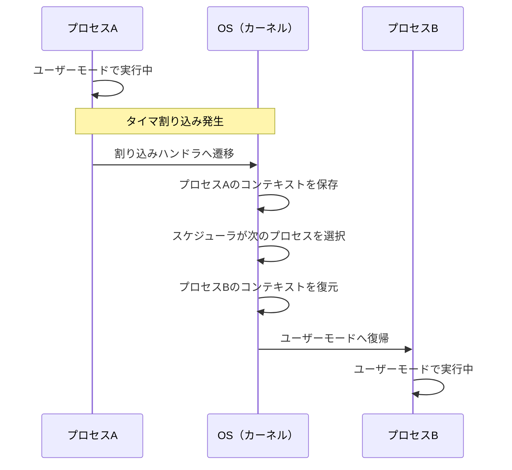
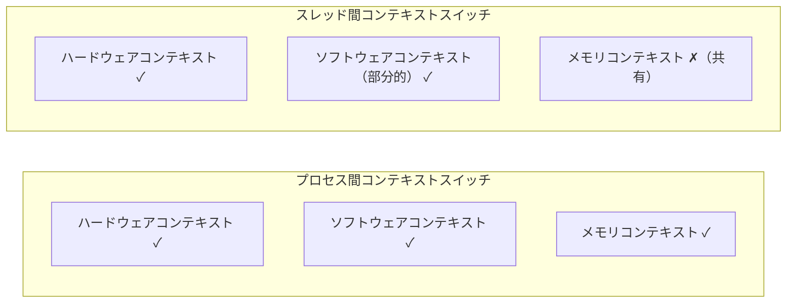
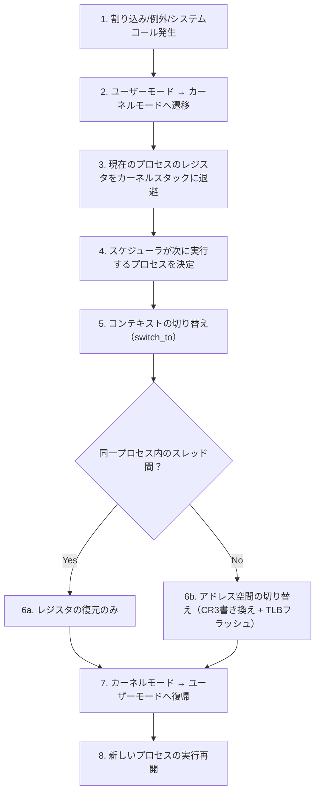
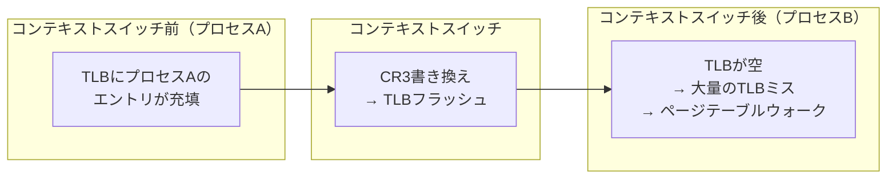
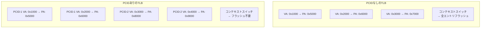

# コンテキストスイッチ — CPUの実行状態を切り替える仕組み

## 1. 背景と動機 — なぜコンテキストスイッチが必要なのか

### 1.1 マルチタスクの本質

現代のオペレーティングシステム（OS）は、数十から数千のプロセスやスレッドを「同時に」実行しているように見せる。しかし、物理的なCPUコアの数は限られている。4コアのCPUで100個のプロセスを動かしている場合、ある瞬間にCPU上で実際に命令を実行できるのは最大4つのプロセスだけである。残りの96個は「実行可能だが待機中」の状態にある。

この「同時に動いているように見せる」仕組みの根幹をなすのが**コンテキストスイッチ（context switch）**である。コンテキストスイッチとは、CPUが現在実行しているプロセス（またはスレッド）の実行状態を保存し、別のプロセス（またはスレッド）の実行状態を復元してCPUの制御を移す操作を指す。

### 1.2 タイムシェアリングとプリエンプション

1960年代のバッチ処理時代には、1つのプログラムが完了するまでCPUを占有していた。I/O待ちの間もCPUは遊休状態となり、計算資源の利用効率は低かった。この問題を解決するために**マルチプログラミング**が導入された。あるプログラムがI/O待ちに入ったとき、OSがCPUの制御を奪い、別のプログラムに切り替える。これがコンテキストスイッチの最も初期の形態である。

さらに**タイムシェアリングシステム**では、一定の時間間隔（タイムスライスまたはタイムクォンタム、典型的には1〜10ミリ秒）でタイマ割り込みが発生し、OSが強制的にCPUの制御を奪う。この仕組みを**プリエンプション（preemption）**と呼ぶ。プリエンプションにより、1つのプロセスがCPUを独占することを防ぎ、すべてのプロセスに公平にCPU時間を配分できる。



### 1.3 コンテキストスイッチが発生する場面

コンテキストスイッチはプリエンプションだけでなく、以下のさまざまな場面で発生する。

1. **タイマ割り込み（プリエンプション）** — タイムスライスの消費により、スケジューラが強制的にCPUを奪う
2. **I/O待ち** — ディスク読み書き、ネットワーク通信などでプロセスがブロックされ、実行可能な別のプロセスに切り替わる
3. **システムコール** — `read()`、`write()`、`sleep()` などのシステムコールにより、プロセスが自発的にCPUを手放す
4. **同期プリミティブの待ち** — ミューテックスやセマフォの獲得待ちでプロセスがブロックされる
5. **シグナル処理** — シグナルの配送に伴い、コンテキストの保存・復元が行われる
6. **優先度逆転の解決** — より高い優先度のプロセスが実行可能になったとき、現在のプロセスをプリエンプトする
7. **ページフォルト** — 物理メモリにマッピングされていないページへのアクセスでページフォルトが発生し、ディスクからのページ読み込み中に他のプロセスへ切り替わる

### 1.4 歴史的経緯

コンテキストスイッチの概念は、1960年代のMulticsにまで遡る。Multicsは複数のプロセスを時分割で実行するために、プロセスの状態を体系的に管理する仕組みを導入した。しかし、その実装は複雑であり、オーバーヘッドも大きかった。

1969年に誕生したUNIXでは、コンテキストスイッチの仕組みがシンプルに再設計された。UNIXの初期実装では、プロセスの切り替えはカーネル内の `swtch()` 関数（後に `context_switch()` や `switch_to()` に改名）が担っており、この設計思想は現在のLinuxカーネルにも受け継がれている。

## 2. コンテキスト（実行状態）とは何か

### 2.1 プロセスコンテキスト

**コンテキスト（context）**とは、プロセスの実行を再開するために必要な情報の集合である。この情報を正確に保存・復元できなければ、プロセスの実行を正しく継続することはできない。

プロセスのコンテキストは大きく3つの層に分けられる。

**ハードウェアコンテキスト（Hardware Context）**

CPUレジスタの値であり、コンテキストスイッチの際に最も直接的に保存・復元される対象である。

| レジスタ | 説明 | 例（x86-64） |
|---|---|---|
| プログラムカウンタ | 次に実行する命令のアドレス | `RIP` |
| スタックポインタ | 現在のスタックの先頭アドレス | `RSP` |
| ベースポインタ | 現在のスタックフレームの基準点 | `RBP` |
| 汎用レジスタ | 計算用の一時的なデータ格納 | `RAX`, `RBX`, `RCX`, `RDX`, `RSI`, `RDI`, `R8`〜`R15` |
| フラグレジスタ | 演算結果の状態フラグ（ゼロ、キャリー等） | `RFLAGS` |
| 浮動小数点/SIMD レジスタ | 浮動小数点演算やベクトル演算のデータ | `XMM0`〜`XMM15`, `YMM0`〜`YMM15`, `ZMM0`〜`ZMM31` |
| セグメントレジスタ | メモリセグメントの選択（x86特有） | `CS`, `DS`, `SS`, `ES`, `FS`, `GS` |
| 制御レジスタ | ページテーブルベース、CPU動作モード等 | `CR0`, `CR3`, `CR4` |

x86-64アーキテクチャでは、汎用レジスタだけで16個、浮動小数点/SIMDレジスタ（AVX-512の場合は `ZMM0`〜`ZMM31` の32個で、各512ビット）を含めると、保存すべきレジスタの総量は相当なものになる。

**ソフトウェアコンテキスト（Software Context）**

OSカーネルが管理するプロセスの状態情報であり、プロセス制御ブロック（PCB）に格納される。具体的には以下の情報を含む。

- プロセスID（PID）、親プロセスID
- プロセスの状態（実行中、実行可能、待機中、ゾンビ等）
- スケジューリング情報（優先度、タイムスライスの残量、CPU affinity）
- オープンしているファイルディスクリプタのテーブル
- シグナルハンドラとシグナルマスク
- 仮想メモリの管理情報（ページテーブルのベースアドレス）
- プロセスの資源使用量（CPU時間、メモリ使用量）
- ユーザーID、グループID、ケーパビリティ

**メモリコンテキスト（Memory Context）**

プロセスの仮想アドレス空間全体を構成する情報である。

- ページテーブル — 仮想アドレスから物理アドレスへの変換テーブル
- メモリマッピング情報 — テキスト、データ、ヒープ、スタック、共有ライブラリのマッピング
- メモリ保護属性 — 各ページの読み取り/書き込み/実行の許可設定

### 2.2 スレッドコンテキスト

同じプロセスに属するスレッド間でのコンテキストスイッチでは、保存・復元すべき情報が少ない。スレッドは同一プロセスのアドレス空間を共有しているため、メモリコンテキストの切り替えが不要である。



スレッド間のコンテキストスイッチで保存・復元されるのは以下の情報だけである。

| 項目 | プロセス間 | スレッド間 |
|---|---|---|
| 汎用レジスタ | 保存・復元 | 保存・復元 |
| プログラムカウンタ | 保存・復元 | 保存・復元 |
| スタックポインタ | 保存・復元 | 保存・復元 |
| 浮動小数点/SIMDレジスタ | 保存・復元 | 保存・復元 |
| フラグレジスタ | 保存・復元 | 保存・復元 |
| ページテーブルベース（CR3） | 切り替え | **不要** |
| TLB | フラッシュ | **不要** |
| ファイルディスクリプタ | 切り替え | **不要（共有）** |
| シグナルハンドラ | 切り替え | **不要（共有）** |

この差がスレッドの主要な利点の一つであり、スレッド間のコンテキストスイッチがプロセス間のそれより高速である理由である。

### 2.3 プロセス制御ブロック（PCB）

**プロセス制御ブロック（Process Control Block, PCB）**は、OSカーネルがプロセスの状態を管理するためのデータ構造である。コンテキストスイッチの際、現在のプロセスのレジスタ状態はそのプロセスのPCBに保存され、次に実行するプロセスのPCBからレジスタ状態が復元される。

Linuxカーネルでは、PCBに相当する構造体が `task_struct` である。`task_struct` はLinuxカーネルの中でも最も巨大なデータ構造の一つであり、数千バイトにおよぶ。コンテキストスイッチに直接関係する主要なフィールドを擬似コードで示す。

```c
// Simplified representation of Linux task_struct
struct task_struct {
    volatile long state;          // process state (TASK_RUNNING, etc.)
    int prio;                     // scheduling priority
    struct mm_struct *mm;         // memory descriptor (page tables, VMAs)
    struct thread_struct thread;  // CPU-specific state (registers)
    pid_t pid;                    // process ID
    struct files_struct *files;   // open file descriptors
    // ... hundreds more fields
};

// x86-64 thread_struct (simplified)
struct thread_struct {
    unsigned long sp;             // kernel stack pointer
    unsigned long ip;             // instruction pointer (saved RIP)
    unsigned long fs;             // FS segment base (TLS)
    unsigned long gs;             // GS segment base
    struct fpu fpu;               // FPU/SSE/AVX state
};
```

`task_struct` の `mm` フィールドがメモリディスクリプタ（`mm_struct`）を指しており、ここにページテーブルのベースアドレスが含まれる。プロセス間のコンテキストスイッチではこの `mm` が切り替わるが、同一プロセス内のスレッド間では同じ `mm` が共有されるため、切り替えが不要となる。

## 3. コンテキストスイッチの手順 — 何が起きているのか

### 3.1 全体の流れ

コンテキストスイッチは、概略すると以下の手順で実行される。



それぞれの段階を詳しく見ていく。

### 3.2 カーネルモードへの遷移

コンテキストスイッチは必ず**カーネルモード（特権モード）**で実行される。ユーザーモードで動作しているプロセスが直接別のプロセスに切り替わることはない。カーネルモードへの遷移は、以下の3つの経路で発生する。

1. **割り込み（Interrupt）** — タイマ割り込み、I/O完了割り込みなど、ハードウェアから非同期に発生するイベント
2. **例外（Exception）** — ページフォルト、ゼロ除算、不正命令など、CPUが命令実行中に検出する異常
3. **システムコール（System Call）** — `read()`、`write()`、`sched_yield()` など、ユーザープログラムが明示的にカーネルサービスを要求する操作

x86-64アーキテクチャでは、システムコールの発行に `syscall` 命令が使われる。この命令が実行されると、CPUは自動的に以下の動作を行う。

1. 現在の `RIP`（命令ポインタ）を `RCX` に保存
2. 現在の `RFLAGS` を `R11` に保存
3. `STAR` MSRからカーネルのコードセグメントセレクタを `CS` にロード
4. `LSTAR` MSRからカーネルのエントリポイントアドレスを `RIP` にロード
5. 特権レベルをRing 0（カーネルモード）に変更

割り込みの場合は、CPUが自動的にスタックを切り替え（TSS経由）、割り込みフレームとして `SS`、`RSP`、`RFLAGS`、`CS`、`RIP` をカーネルスタックにプッシュする。

### 3.3 レジスタの保存

カーネルモードに遷移した後、現在実行中のプロセスのレジスタ状態をそのプロセスのカーネルスタックまたはPCB（`task_struct`）に保存する。Linuxカーネルでは、この操作は `__switch_to_asm` というアセンブリルーチンで実行される。

x86-64における `__switch_to_asm` の擬似コードは以下のようになる。

```asm
; __switch_to_asm(prev, next)
; Save callee-saved registers of the previous task
__switch_to_asm:
    push rbp
    push rbx
    push r12
    push r13
    push r14
    push r15

    ; Save the current stack pointer into prev->thread.sp
    mov [rdi + THREAD_SP], rsp

    ; Load the next task's stack pointer
    mov rsp, [rsi + THREAD_SP]

    ; Restore callee-saved registers of the next task
    pop r15
    pop r14
    pop r13
    pop r12
    pop rbx
    pop rbp

    ; Jump to the return address on the next task's stack
    ret
```

ここで注目すべきは、**すべてのレジスタが保存されるわけではない**という点である。C言語の呼び出し規約（calling convention）では、レジスタは**caller-saved（呼び出し元保存）**と**callee-saved（呼び出し先保存）**に分類される。

| 分類 | x86-64レジスタ | 保存の責任 |
|---|---|---|
| callee-saved | `RBX`, `RBP`, `R12`〜`R15` | 呼び出された関数が保存 |
| caller-saved | `RAX`, `RCX`, `RDX`, `RSI`, `RDI`, `R8`〜`R11` | 呼び出した関数が保存 |

コンテキストスイッチのアセンブリルーチン自体が「関数呼び出し」として振る舞うため、callee-savedレジスタのみを明示的に保存すればよい。caller-savedレジスタは、コンテキストスイッチを呼び出す前のC言語のコード（`schedule()` 関数など）が既にスタック上に退避しているためである。

### 3.4 浮動小数点/SIMDレジスタの遅延保存

x86-64のSSE/AVX/AVX-512レジスタ（`XMM0`〜`XMM15`、`YMM0`〜`YMM15`、`ZMM0`〜`ZMM31`）は、合計で数KBのデータを含む可能性がある。すべてのコンテキストスイッチでこれらを保存・復元するのはコストが大きい。

そこで、Linuxカーネルでは**遅延FPUコンテキストスイッチ（Lazy FPU Context Switching）**という最適化が歴史的に使われてきた。これは、コンテキストスイッチの際にFPU/SIMDレジスタの保存・復元を先送りし、次のプロセスが実際にFPU/SIMD命令を使おうとしたときに初めて保存・復元を行う手法である。

具体的には、CR0レジスタの`TS`（Task Switched）ビットをセットしておくことで、FPU/SIMD命令の実行時にDevice Not Available例外（`#NM`）が発生する。この例外ハンドラ内で前のプロセスのFPUステートを保存し、現在のプロセスのFPUステートを復元する。

ただし、現代のLinuxカーネル（4.x以降）では、`XSAVE` / `XRSTOR` 命令の高速化に伴い、**積極的FPU復元（Eager FPU Restore）**がデフォルトとなっている。Spectre/Meltdownの脆弱性対策としても、遅延FPUは避けるべきとされるようになった。`XSAVE` 命令はCPUが使用しているFPU/SSE/AVX拡張の状態だけを効率的に保存できるため、不要なレジスタのコピーを回避する。

### 3.5 アドレス空間の切り替え

異なるプロセス間のコンテキストスイッチでは、仮想アドレス空間の切り替えが必要である。x86-64アーキテクチャでは、この操作は**CR3レジスタ**にロードするページテーブルのベースアドレスを変更することで実現される。

```c
// Simplified context_switch() in Linux kernel
static __always_inline struct rq *
context_switch(struct rq *rq, struct task_struct *prev,
               struct task_struct *next)
{
    struct mm_struct *mm = next->mm;
    struct mm_struct *prev_mm = prev->active_mm;

    if (!mm) {
        // kernel thread: borrow the previous task's mm
        next->active_mm = prev_mm;
        mmgrab(prev_mm);
    } else {
        // user process: switch the address space
        switch_mm(prev_mm, mm, next);
    }

    // Switch CPU register state
    switch_to(prev, next, prev);

    return finish_task_switch(prev);
}
```

`switch_mm()` の核心は、CR3レジスタの書き換えである。

```c
// Simplified switch_mm on x86-64
static inline void switch_mm(struct mm_struct *prev,
                              struct mm_struct *next,
                              struct task_struct *tsk)
{
    if (prev != next) {
        // Load the new page table base into CR3
        load_cr3(next->pgd);
    }
}
```

CR3レジスタの書き換えは、後述するTLBフラッシュを引き起こすため、コンテキストスイッチのコストの中で最も影響が大きい操作の一つである。

### 3.6 TSS（Task State Segment）の役割

x86アーキテクチャには**TSS（Task State Segment）**というハードウェア機構が存在する。TSSは元来、ハードウェアによるタスクスイッチを実現するために設計されたものであり、タスクの状態（レジスタの値など）を格納するセグメントである。

しかし、現代のOS（Linux、Windows、macOS）は、TSSによるハードウェアタスクスイッチを使用していない。ハードウェアタスクスイッチは柔軟性に欠け、パフォーマンスも悪いためである。代わりに、ソフトウェアによるコンテキストスイッチ（前述のアセンブリルーチン）が使用されている。

それでもTSSが完全に不要になったわけではない。x86-64の64ビットモードでは、TSSは以下の重要な用途で依然として使われている。

1. **カーネルスタックポインタの保持** — ユーザーモードからカーネルモードに遷移する際、CPUはTSSに格納された `RSP0` フィールドからカーネルスタックのアドレスを取得する。つまり、割り込みやシステムコールでカーネルモードに入るとき、「どのスタックを使うか」をTSSが教える。
2. **IST（Interrupt Stack Table）** — ダブルフォルト、NMI、マシンチェックなどの致命的例外に対して、専用のスタックを割り当てるための仕組み。通常のカーネルスタックが破壊されている場合でも、安全に例外を処理できる。
3. **I/Oポートの権限ビットマップ** — ユーザーモードからI/Oポートへのアクセスを制御する。

コンテキストスイッチの際には、TSSの `RSP0` フィールドを次のプロセスのカーネルスタックのアドレスに更新する必要がある。これにより、次に割り込みが発生したとき、CPUが正しいカーネルスタックに切り替えられる。

## 4. カーネルモードとユーザーモードの遷移

### 4.1 特権レベルの仕組み

x86アーキテクチャでは、CPUの動作モードを4段階の**特権レベル（リング、Ring）**で制御する。Ring 0が最も高い特権を持ち、Ring 3が最も低い特権となる。現代のOSではRing 0（カーネルモード）とRing 3（ユーザーモード）のみが使用される。

```
+---------------------------------------------------+
|                  Ring 0（カーネルモード）            |
|    ・すべての命令を実行可能                          |
|    ・すべてのメモリにアクセス可能                     |
|    ・I/Oポートに直接アクセス可能                     |
|    ・制御レジスタ（CR0, CR3, CR4）の操作可能         |
|  +-----------------------------------------------+ |
|  |              Ring 3（ユーザーモード）           | |
|  |    ・特権命令の実行は禁止                       | |
|  |    ・カーネル空間のメモリにアクセス不可           | |
|  |    ・I/Oポートへの直接アクセスは不可             | |
|  |    ・制御レジスタの操作は不可                    | |
|  +-----------------------------------------------+ |
+---------------------------------------------------+
```

コンテキストスイッチはCR3レジスタの書き換えやTSSの更新など、特権命令を伴う操作であるため、必ずカーネルモードで実行される。

### 4.2 モード遷移のコスト

ユーザーモードからカーネルモードへの遷移（モードスイッチ）と、コンテキストスイッチは異なる概念であることに注意すべきである。

**モードスイッチ（Mode Switch）** — 同じプロセス内で、ユーザーモードからカーネルモード（またはその逆）に切り替わること。システムコールや割り込みの度に発生する。これだけではコンテキストスイッチにはならない。

**コンテキストスイッチ（Context Switch）** — 実行するプロセス（またはスレッド）自体を切り替えること。モードスイッチを伴うが、逆は必ずしも真ではない。

例えば、`getpid()` システムコールを呼び出した場合を考える。ユーザーモードからカーネルモードに遷移し（モードスイッチ）、PIDを取得して即座にユーザーモードに復帰する。この間、プロセスの切り替えは発生しないため、コンテキストスイッチではない。

一方、`read()` システムコールでディスクI/Oが必要な場合は、モードスイッチの後にプロセスがブロックされ、スケジューラが別のプロセスを選択してコンテキストスイッチが発生する。

モードスイッチ単体のコストは、x86-64では `syscall` / `sysret` 命令で数百サイクル程度である。コンテキストスイッチはこれに加えてレジスタの保存・復元、場合によってはアドレス空間の切り替えが加わるため、数千サイクル以上のコストとなる。

### 4.3 KPTI（Kernel Page Table Isolation）の影響

2018年に発覚したMeltdown脆弱性への対策として、Linuxカーネル4.15以降に**KPTI（Kernel Page Table Isolation）**が導入された。KPTIは、ユーザーモードとカーネルモードで異なるページテーブルを使用する仕組みである。

KPTI導入前は、カーネルのメモリ空間がユーザーモードのページテーブルにもマッピングされていた（ただし特権レベルにより直接アクセスはできない）。Meltdownはこのマッピングを悪用して投機的実行により カーネルメモリの内容を推測する攻撃であった。

KPTIの導入により、ユーザーモードでは最小限のカーネルコード（エントリ/エグジットの trampoline）のみがマッピングされる。モード遷移のたびに、ユーザー用ページテーブルとカーネル用ページテーブルの切り替え（CR3の書き換え）が必要となり、TLBフラッシュが追加で発生する。

これによりシステムコールのオーバーヘッドが増加し、コンテキストスイッチのコストも間接的に増大した。IntelのPCIDサポートを活用することで、TLBの完全フラッシュを回避する最適化が適用されているが、それでもKPTI無効時と比較して数%〜数十%のオーバーヘッドが報告されている。

## 5. コンテキストスイッチのコスト

### 5.1 直接コスト（Direct Cost）

直接コストは、コンテキストスイッチの操作そのものにかかるCPUサイクルである。

**レジスタの保存・復元**

汎用レジスタの保存・復元は比較的軽量で、x86-64では`push`/`pop`命令を使って数十サイクル程度で完了する。ただし、FPU/SIMDレジスタを含めると、`XSAVE`/`XRSTOR`命令で数百サイクルが追加される。

**アドレス空間の切り替え**

CR3レジスタの書き換えは約100〜200サイクル程度であるが、その副作用（TLBフラッシュ）の影響が圧倒的に大きい。

**カーネルコードの実行**

スケジューラの実行、PCBの更新、各種ブックキーピング処理のために、数千命令のカーネルコードが実行される。

典型的な計測結果として、直接コストは以下のようなオーダーとなる。

| 操作 | 概算コスト |
|---|---|
| スレッド間コンテキストスイッチ（同一プロセス） | 数百ナノ秒〜数マイクロ秒 |
| プロセス間コンテキストスイッチ | 数マイクロ秒〜数十マイクロ秒 |
| モードスイッチのみ（システムコール） | 100〜200ナノ秒 |

### 5.2 間接コスト（Indirect Cost）

間接コストは、コンテキストスイッチの直後に発生するパフォーマンスペナルティであり、直接コストよりも遥かに大きい影響を持つことが多い。

**TLBフラッシュ（TLB Flush）**

プロセス間のコンテキストスイッチでCR3レジスタが書き換えられると、TLB（Translation Lookaside Buffer）のエントリが無効化される。TLBは仮想アドレスから物理アドレスへの変換結果をキャッシュする高速なハードウェアテーブルであり、TLBヒットの場合はアドレス変換が1〜2サイクルで完了する。一方、TLBミスが発生するとページテーブルウォークが必要となり、メモリアクセスが数十〜数百サイクル遅延する。

コンテキストスイッチ直後は、新しいプロセスのTLBエントリがまだキャッシュされていないため、大量のTLBミスが発生する。この「ウォームアップ」期間が間接コストの主要な要因となる。



**キャッシュ汚染（Cache Pollution）**

CPUキャッシュ（L1/L2/L3）には、直前まで実行していたプロセスのデータが格納されている。コンテキストスイッチ後、新しいプロセスが異なるメモリ領域にアクセスすると、キャッシュ上の既存データが追い出される（eviction）。これにより**キャッシュミス**が多発し、メモリアクセスのレイテンシが大幅に増加する。

| キャッシュレベル | ヒット時のレイテンシ | ミス時のレイテンシ（メインメモリアクセス） |
|---|---|---|
| L1（32〜64KB） | 約1〜4サイクル | — |
| L2（256KB〜1MB） | 約4〜12サイクル | — |
| L3（数MB〜数十MB） | 約20〜50サイクル | — |
| メインメモリ | — | 約100〜300サイクル |

L1キャッシュは数十KBと小さいため、コンテキストスイッチ後に急速に新しいプロセスのデータで上書きされる。L3キャッシュは数MB〜数十MBと大きいため影響は緩和されるが、それでもワーキングセットの大きいプロセスでは顕著なキャッシュミスが発生する。

**分岐予測の汚染（Branch Prediction Pollution）**

現代のCPUは**分岐予測器（Branch Predictor）**を備えており、条件分岐の結果を予測して投機的に命令を実行する。分岐予測器は直近の分岐パターンを学習しているが、コンテキストスイッチにより異なるプロセスの分岐パターンが混在すると、予測精度が低下する。分岐予測ミスは約10〜20サイクルのペナルティを引き起こす。

### 5.3 コンテキストスイッチの計測

Linuxではコンテキストスイッチの頻度やコストを計測するための複数の手段が提供されている。

```bash
# View context switch counts per process
cat /proc/<pid>/status | grep ctxt

# System-wide context switch rate
vmstat 1

# Detailed context switch profiling with perf
perf stat -e context-switches,cpu-migrations sleep 10

# Measure context switch latency
perf bench sched messaging
perf bench sched pipe
```

`/proc/<pid>/status` の `voluntary_ctxt_switches` は自発的コンテキストスイッチ（I/O待ちなどで自らCPUを手放した回数）、`nonvoluntary_ctxt_switches` は非自発的コンテキストスイッチ（タイムスライスの消費でプリエンプトされた回数）を示す。

## 6. TLBフラッシュとその回避

### 6.1 TLBの構造

TLB（Translation Lookaside Buffer）は、仮想アドレスから物理アドレスへの変換結果をキャッシュするハードウェアである。x86-64では通常、命令用TLB（ITLB）とデータ用TLB（DTLB）が分離されており、それぞれL1 TLBとL2 TLBの2階層構造を持つ。

| TLBの種類 | エントリ数（典型値） | 対応ページサイズ |
|---|---|---|
| L1 ITLB | 64〜128 | 4KB, 2MB |
| L1 DTLB | 64〜128 | 4KB, 2MB |
| L2 STLB（統合） | 1024〜2048 | 4KB, 2MB |

TLBエントリの総数は有限であり、大きなアドレス空間を使うプロセスではTLBがすべてのページのマッピングをカバーしきれないことがある。コンテキストスイッチによるTLBフラッシュは、この限られたTLBリソースをすべて無効化するため、影響が大きい。

### 6.2 PCID（Process Context Identifier）

**PCID（Process Context Identifier）**は、TLBエントリにプロセスの識別子を付与することで、コンテキストスイッチ時のTLBフラッシュを回避する技術である。IntelのCPUではHaswell世代（2013年）以降でサポートされている。

PCIDが有効な場合、各TLBエントリには12ビットのPCID（0〜4095）が付与される。CR3レジスタにPCIDを含めてロードすることで、異なるPCIDを持つTLBエントリが共存できる。コンテキストスイッチの際、CR3を書き換えてもPCIDが異なるエントリは無効化されないため、プロセスが再びスケジュールされたときにTLBエントリが残っている可能性がある。



Linuxカーネル4.14以降では、PCIDサポートが有効化されており、KPTI環境下でのTLBフラッシュのコストを大幅に削減している。各プロセスには最大で6個のPCID（通常カーネル用とユーザー用のペア × 直近3プロセス分）が割り当てられ、LRU方式で管理される。

### 6.3 ASID（Address Space Identifier）

ARM アーキテクチャでは、PCIDに相当する機能として**ASID（Address Space Identifier）**が提供されている。ASIDは8ビットまたは16ビットの識別子で、TLBエントリにタグ付けすることでコンテキストスイッチ時のTLBフラッシュを回避する。

ARMv8-Aでは、ASID は `TTBR0_EL1`（Translation Table Base Register）に含まれ、ページテーブルベースアドレスとともに設定される。16ビットASIDが利用可能な場合、最大65,536個のアドレス空間を識別でき、実用上はTLBフラッシュがほぼ不要となる。

### 6.4 ラージページ（Huge Pages）

TLBのエントリ数は固定であるため、より大きなページサイズを使用することで、同じ数のTLBエントリでカバーできるメモリ範囲を拡大できる。

| ページサイズ | TLBエントリ1つがカバーする範囲 | 1024エントリでカバーする範囲 |
|---|---|---|
| 4KB | 4KB | 4MB |
| 2MB | 2MB | 2GB |
| 1GB | 1GB | 1TB |

Linuxでは**Huge Pages**（2MBまたは1GB）を使用することで、コンテキストスイッチ後のTLBミスの影響を軽減できる。特にデータベースや仮想マシンモニタなど、大量のメモリを連続的にアクセスするアプリケーションで効果が大きい。

## 7. 最適化手法

### 7.1 コンテキストスイッチの回数を減らす

コンテキストスイッチのコストを削減する最も直接的なアプローチは、そもそもコンテキストスイッチの発生回数を減らすことである。

**CPU Affinity（CPU親和性）**

`sched_setaffinity()` システムコールやLinuxの `taskset` コマンドを使用して、プロセスを特定のCPUコアに固定（ピン留め）できる。これにより、プロセスが異なるCPUコアに移動する**CPUマイグレーション**を防ぎ、キャッシュの有効利用を促進する。

```c
// Pin the current thread to CPU core 0
cpu_set_t cpuset;
CPU_ZERO(&cpuset);
CPU_SET(0, &cpuset);
sched_setaffinity(0, sizeof(cpuset), &cpuset);
```

**イベント駆動アーキテクチャ**

プロセス/スレッドごとに1つのクライアント接続を処理するモデル（スレッドパーコネクション）では、接続数に比例してコンテキストスイッチが増加する。イベント駆動モデル（`epoll`、`kqueue`、`io_uring`を使用）では、少数のスレッドで大量の接続を処理できるため、コンテキストスイッチの頻度が大幅に減少する。

Nginx、Node.js、Redisなどの高性能サーバーがイベント駆動アーキテクチャを採用しているのは、この理由が大きい。

**スピンロック（短時間のクリティカルセクション向け）**

ロック待ちでスレッドをブロック（スリープ）させると、コンテキストスイッチが発生する。ロックの保持時間が非常に短い場合は、**スピンロック**（ビジーウェイトでロックの解放を待つ）のほうがコンテキストスイッチのコストを回避できて効率的な場合がある。ただし、スピンロックはCPU時間を消費するため、ロック保持時間が長い場合は逆にパフォーマンスが悪化する。

### 7.2 コンテキストスイッチのコストを減らす

**PCIDの活用**

前述のPCID（x86）やASID（ARM）を活用することで、TLBフラッシュのコストを大幅に削減できる。Linuxカーネルは対応CPUで自動的にPCIDを有効化する。

**コルーチンとユーザーレベルスケジューリング**

Go言語のgoroutine、Java Virtual Threads（Project Loom）、Rust の tokio などのランタイムは、**ユーザーレベルのコンテキストスイッチ**を実現する。カーネルを介さずにユーザー空間でスタックの切り替えを行うため、コンテキストスイッチのコストが桁違いに小さい。

| 方式 | コンテキストスイッチのコスト | 特徴 |
|---|---|---|
| プロセス間 | 数マイクロ秒〜数十マイクロ秒 | TLBフラッシュ、キャッシュ汚染あり |
| カーネルスレッド間 | 数百ナノ秒〜数マイクロ秒 | TLBフラッシュなし |
| goroutine / Virtual Thread | 数十ナノ秒 | カーネル不介在 |

ユーザーレベルのスケジューリングでは、スタックポインタとプログラムカウンタの切り替えだけで済むため、CPUレジスタの全保存・復元やカーネルモードへの遷移が不要である。

**スレッドプール**

スレッドの生成と破棄のたびにコンテキストスイッチが発生するのを避けるため、事前に一定数のスレッドを生成してプールしておく設計パターンがスレッドプールである。タスクをキューに投入し、空いているスレッドが取り出して処理することで、スレッドの生成・破棄コストとそれに伴うコンテキストスイッチを回避する。

### 7.3 スケジューラによる最適化

Linuxのデフォルトスケジューラ**CFS（Completely Fair Scheduler）**は、以下のような最適化によりコンテキストスイッチのコストを抑えている。

**最小粒度の保証** — CFS は各タスクに最低でも `sched_min_granularity`（デフォルト0.75ミリ秒）の実行時間を保証する。これにより、過度に頻繁なコンテキストスイッチ（スラッシング）を防ぐ。

**キャッシュホット判定** — タスクを他のCPUコアに移行（load balancing）する際、直近にそのCPUで実行されていたタスクは「キャッシュホット」と判定し、移行を遅延させる。これにより不必要なキャッシュ汚染を回避する。

**wake affinity** — ブロックされたタスクが起床するとき、そのタスクを起こしたタスクと同じCPU（またはLLCを共有するCPU）で実行するよう優先する。これにより、共有データへのキャッシュアクセスが最適化される。

## 8. 各OSでの実装の違い

### 8.1 Linux

Linuxカーネルは、プロセスとスレッドを統一的に `task_struct` で管理する。`clone()` システムコールのフラグ（`CLONE_VM`、`CLONE_FS`、`CLONE_FILES` など）により、新しいタスクが親とどの資源を共有するかを細かく制御できる。スレッドは `CLONE_VM` フラグ付きで `clone()` された結果であり、プロセスとの本質的な違いはアドレス空間を共有するかどうかだけである。

Linuxのコンテキストスイッチの中心は `kernel/sched/core.c` の `context_switch()` 関数であり、x86-64固有の低レベル操作は `arch/x86/kernel/process_64.c` の `__switch_to()` と `arch/x86/entry/entry_64.S` の `__switch_to_asm` で実装されている。

```c
// Simplified call chain in Linux
schedule()
    → __schedule()
        → pick_next_task()     // select next task via CFS
        → context_switch()
            → switch_mm()      // switch address space if needed
            → switch_to()      // switch CPU registers
                → __switch_to_asm()  // assembly: save/restore regs
                → __switch_to()      // C: update TSS, TLS, debug regs
```

### 8.2 Windows

Windows NTカーネルは、プロセスとスレッドを明確に区別する。プロセスは `EPROCESS` 構造体、スレッドは `ETHREAD` / `KTHREAD` 構造体で管理される。コンテキストスイッチはカーネルのディスパッチャ（スレッドスケジューラ）が実行し、`KiSwapContext()` → `SwapContext()` の呼び出しチェーンで実装されている。

Windowsの特徴的な点は以下の通りである。

- **スレッドが基本的なスケジューリング単位** — Linuxが `task_struct` でプロセスとスレッドを統一的に扱うのに対し、Windowsではスレッドのみがスケジューリングの対象である
- **DPC（Deferred Procedure Call）** — 割り込み処理の後半部分を遅延実行する仕組みで、コンテキストスイッチのタイミングに影響する
- **UMS（User-Mode Scheduling）** — Windows 7以降で提供されたユーザーモードでのスレッドスケジューリング機能（ただし、Windows 11でサポート終了が予定されている）

### 8.3 macOS / iOS（XNU / Darwin）

AppleのXNUカーネル（macOS、iOS）は、MachマイクロカーネルとBSD層のハイブリッドアーキテクチャである。XNUでのスケジューリング単位は**Machスレッド**であり、コンテキストスイッチは `machine_switch_context()` 関数で実装されている。

XNUの特徴的な点は以下の通りである。

- **Machスレッドベースのスケジューリング** — BSD層のpthreadsは内部的にMachスレッドにマッピングされる
- **Mach IPC（ポートベースのメッセージパッシング）** — プロセス間通信がカーネルの中核的な機能であり、コンテキストスイッチのトリガーとなることが多い
- **Quality of Service（QoS）クラス** — タスクの優先度をQoSクラス（User Interactive、User Initiated、Utility、Background）で分類し、スケジューリングの決定に反映する
- **Apple Silicon（ARM64）への移行** — Intel CPUのPCIDに代わり、ARMのASIDが使用される。Apple M1以降のCPUは大容量のTLBと高効率の分岐予測器を備えており、コンテキストスイッチのコストが相対的に小さい

### 8.4 FreeBSD

FreeBSDは、独自のスケジューラ**ULE Scheduler**を使用している。ULEは各CPUコアに独立したランキューを持ち、スレッドをインタラクティブ/バッチに自動分類する。コンテキストスイッチは `mi_switch()` → `cpu_switch()` で実行される。

FreeBSDの注目すべき特徴は、`kern.sched.preempt_thresh` パラメータにより、プリエンプションの閾値を動的に調整できる点である。リアルタイム性が要求される場合は閾値を下げてプリエンプションの応答性を向上させ、スループットが重要な場合は閾値を上げてコンテキストスイッチの頻度を減らすことができる。

### 8.5 実装の比較まとめ

| 特性 | Linux | Windows NT | XNU (macOS) | FreeBSD |
|---|---|---|---|---|
| スケジューリング単位 | task_struct | スレッド (KTHREAD) | Machスレッド | スレッド (kthread) |
| デフォルトスケジューラ | CFS (EEVDF in 6.6+) | 優先度ベース | 優先度ベース + QoS | ULE |
| PCB構造 | task_struct | EPROCESS / KTHREAD | task / thread | proc / thread |
| コンテキストスイッチ関数 | context_switch() | SwapContext() | machine_switch_context() | cpu_switch() |
| プロセスとスレッドの区別 | 統一的 | 明確に分離 | Mach/BSD層の二重構造 | 明確に分離 |

## 9. コンテキストスイッチの現実的な影響

### 9.1 パフォーマンスへの影響

コンテキストスイッチのオーバーヘッドは、ワークロードの特性によって大きく異なる。

**CPUバウンドなワークロード** — 計算集約的な処理では、コンテキストスイッチにより計算に使えるCPU時間が減少する。また、キャッシュ汚染により計算のスループットが低下する。このような場合、スレッド数をCPUコア数に合わせ、不必要なコンテキストスイッチを最小化することが重要である。

**I/Oバウンドなワークロード** — I/O待ちが多い処理では、コンテキストスイッチはむしろCPU利用効率を向上させる。プロセスAがI/O待ちの間にプロセスBが実行されるため、CPUが遊休状態になることを防ぐ。Webサーバーやデータベースサーバーでは、適切なコンテキストスイッチがスループットの鍵となる。

**レイテンシクリティカルなワークロード** — 高頻度取引（HFT）やリアルタイムシステムでは、マイクロ秒レベルのレイテンシ変動が問題になる。これらの環境では、`isolcpus`カーネルパラメータでCPUコアを隔離し、`SCHED_FIFO`ポリシーで特定のプロセスにCPUを専有させることで、コンテキストスイッチを排除する。

### 9.2 `isolcpus` と CPU 隔離

レイテンシに極めて敏感なアプリケーションでは、Linuxの `isolcpus` カーネルパラメータを使ってCPUコアをスケジューラの管理対象から除外できる。

```bash
# Boot parameter: isolate CPU cores 2 and 3 from the scheduler
isolcpus=2,3
```

隔離されたCPUコアでは、通常のプロセスがスケジューリングされないため、コンテキストスイッチが発生しない。`taskset` や `sched_setaffinity()` で特定のプロセスをこれらのコアに配置することで、ジッタの少ない安定した実行環境を実現できる。

### 9.3 リアルタイムカーネルとプリエンプション

LinuxカーネルにはプリエンプションのレベルとしてPREEMPT_NONE、PREEMPT_VOLUNTARY、PREEMPT（Linuxカーネル6.12以降ではPREEMPT_DYNAMICがデフォルト）のオプションがある。

- **PREEMPT_NONE** — カーネルコード実行中はプリエンプションが発生しない。スループットは最大化されるが、レイテンシは最悪値が大きくなる
- **PREEMPT_VOLUNTARY** — カーネルコード中の明示的なプリエンプションポイントでのみプリエンプションが可能
- **PREEMPT** — ほぼすべてのカーネルコードでプリエンプションが可能。レスポンスタイムが向上するが、コンテキストスイッチの頻度が増加する
- **PREEMPT_RT（PREEMPT_RT パッチ）** — スピンロックをmutexに変換し、割り込みハンドラをスレッド化することで、ほぼすべてのカーネルコードをプリエンプション可能にする。LinuxカーネルのメインラインへのPREEMPT_RTの統合は長年の課題であったが、2024年にLinux 6.12でメインラインにマージされた

## 10. まとめ — コンテキストスイッチの本質

コンテキストスイッチは、マルチタスクOSを実現するための不可欠な仕組みである。その本質は「CPUという有限な資源を複数の実行単位で時分割共有するための状態の保存と復元」にある。

設計上の重要なトレードオフを以下にまとめる。

**応答性 vs スループット** — コンテキストスイッチの頻度を上げればインタラクティブな応答性が向上するが、スイッチ自体のオーバーヘッドによりスループットが低下する。タイムスライスの長さ、スケジューラのプリエンプションポリシーは、このトレードオフを調整するパラメータである。

**隔離 vs 効率** — プロセス間のコンテキストスイッチはアドレス空間の切り替え（TLBフラッシュ）を伴うため高コストだが、強力なメモリ隔離を提供する。スレッド間のコンテキストスイッチは効率的だが、隔離性が低い。コルーチンやグリーンスレッドはさらに効率的だが、カーネルによる保護を受けられない。

**ハードウェアの進化による軽減** — PCID/ASIDによるTLBフラッシュの回避、`XSAVE`/`XRSTOR`によるFPU状態の効率的な保存・復元、大容量L3キャッシュによるキャッシュ汚染の緩和など、ハードウェアの進化がコンテキストスイッチのコストを継続的に低減している。

**ソフトウェアの進化による回避** — イベント駆動プログラミング、コルーチン、ユーザーレベルスケジューリングなど、不必要なコンテキストスイッチを回避するソフトウェア技術も進化を続けている。

コンテキストスイッチの仕組みとコストを正確に理解することは、高性能なシステムを設計・運用するうえでの基礎となる。OSカーネルの内部動作、CPUアーキテクチャの特性、アプリケーションのワークロード特性を総合的に考慮し、適切な設計判断を行うことが求められる。
