# 継続（Continuation）と call/cc — 「残りの計算」を操る抽象

## 1. 背景と動機 — 「残りの計算」という概念

プログラムの実行とは、式を評価して値を得る過程の連鎖である。ある式を評価しているとき、その評価結果を「待っている」処理が必ず存在する。たとえば `(+ 1 (* 2 3))` という式を評価する場合、`(* 2 3)` を評価した結果 `6` は、「1を足す」という処理に渡される。この「1を足す」処理こそが、`(* 2 3)` の評価時点における**継続（continuation）**である。

継続とは、**「ある式を評価した後に、その結果を使って行われる残りの計算全体」**を表す概念である。この概念自体は、すべてのプログラムのすべての評価時点に暗黙的に存在する。プログラムを一時停止したとき、「次に何をするか」という情報が継続にあたる。

### 1.1 なぜ継続を明示的に扱いたいのか

継続が暗黙的に存在するだけならば、わざわざ取り出す必要はない。しかし、継続を**ファーストクラスの値（first-class value）**として捉え、変数に代入したり引数として渡したりできるようにすると、驚くほど多くの制御構造を統一的に表現できることがわかった。

- **例外処理**（非局所脱出）
- **コルーチン**（協調的マルチタスク）
- **バックトラッキング**（非決定的計算）
- **ジェネレータ**（遅延ストリーム）
- **マルチタスク**（軽量スレッド）

これらは一見まったく異なる制御フローのパターンに見えるが、すべて「残りの計算」を捕捉・操作するという一つの原理から導き出せる。継続は、制御フローの**万能抽象**と呼べる存在である。

### 1.2 歴史的経緯

継続の概念は1960年代に遡る。Adriaan van Wijngaarden は1964年に、プログラムの意味論を記述する文脈で「残りの計算」に相当する概念を用いた。その後、Christopher Strachey と Dana Scott が1970年に**表示的意味論（denotational semantics）**を体系化する際に、継続は中心的な道具となった。

プログラミング言語の機能としての継続は、1970年代の Scheme で実現された。Guy Steele と Gerald Jay Sussman による *Lambda Papers*（1975-1980）の中で、`call-with-current-continuation`（call/cc）が導入された。これは、実行中のプログラムの「現在の継続」を捕捉し、関数の引数として渡すという革新的なプリミティブであった。

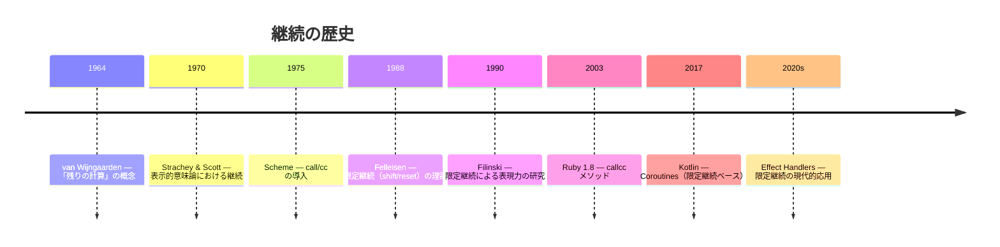

::: tip 継続の本質
継続とは、**「プログラムのある時点から見た、残りの計算全体」を値として表現したもの**である。通常は暗黙的に存在するが、これを明示的に捕捉・操作できるようにすると、あらゆる制御フローパターンを統一的に表現できるようになる。
:::

## 2. 継続の定義と直感的理解

### 2.1 評価文脈としての継続

式 `(+ 1 (* 2 3))` の評価過程を、もう少し丁寧に見てみよう。Scheme風の表記で書くと、`(* 2 3)` が評価される時点での「残りの計算」は以下のようになる。

```
「□ に値を入れたら、(+ 1 □) を計算して、その結果をプログラムの最終結果とする」
```

この「□」（ホール）を含む式は、**評価文脈（evaluation context）**と呼ばれる。評価文脈は、ある部分式を評価した後に行われる計算を、穴の開いた式として表現する。ここで、評価文脈を関数として見ると、次のように書ける。

```scheme
;; The continuation of (* 2 3) in (+ 1 (* 2 3))
;; is the function: (lambda (v) (+ 1 v))
```

すなわち、**継続とは「残りの計算」を関数として表現したもの**である。

### 2.2 もう少し複雑な例

ネストした式の中間地点にある式の継続を考えてみよう。

```scheme
(define (f x)
  (* x (+ x 1)))

(f (- 5 2))
```

`(- 5 2)` の評価時点における継続は何か。`(- 5 2)` の結果 `3` が得られた後、次のような処理が行われる。

1. `3` を `f` の引数 `x` に束縛する
2. `(* x (+ x 1))` を評価する（すなわち `(* 3 (+ 3 1))` → `(* 3 4)` → `12`）
3. 結果を返す

つまり、`(- 5 2)` の継続は以下の関数に相当する。

```scheme
;; Continuation of (- 5 2) in (f (- 5 2))
(lambda (v) (* v (+ v 1)))
```

### 2.3 継続の形式的定義

表示的意味論では、継続を次のように定義する。プログラムの意味を値の領域 $D$ 上の関数として定式化するとき、**継続**は型 $D \to \text{Answer}$ の関数である。ここで $\text{Answer}$ はプログラム全体の結果の型である。

式 $e$ の評価関数を $\mathcal{E}[\![e]\!]$ と書くとき、継続渡しスタイルでは以下のように定義される。

$$
\mathcal{E}[\![e]\!] : \text{Env} \to \text{Cont} \to \text{Answer}
$$

ここで $\text{Cont} = D \to \text{Answer}$ が継続の型である。式 $e$ は、環境 $\text{Env}$ と継続 $\text{Cont}$ を受け取り、$e$ の値を継続に渡すことで最終的な答え $\text{Answer}$ を生成する。

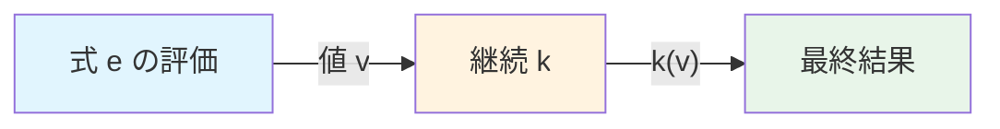

## 3. CPS（Continuation-Passing Style）変換

### 3.1 CPS とは何か

**CPS（Continuation-Passing Style, 継続渡しスタイル）**とは、すべての関数が「自分の結果を返す」代わりに、「結果を継続に渡す」ように書き換えるプログラミングスタイルである。通常のスタイル（ダイレクトスタイル）とCPSの対比を見てみよう。

```scheme
;; Direct style
(define (factorial n)
  (if (= n 0)
      1
      (* n (factorial (- n 1)))))

;; CPS (Continuation-Passing Style)
(define (factorial-cps n k)
  (if (= n 0)
      (k 1)                           ; pass result to continuation
      (factorial-cps (- n 1)
                     (lambda (result)  ; continuation that multiplies
                       (k (* n result))))))
```

ダイレクトスタイルの `factorial` では、再帰呼び出し `(factorial (- n 1))` の結果を受け取り、`(* n ...)` で掛け算してから返す。CPSの `factorial-cps` では、再帰呼び出しに「結果をどう使うか」を関数（継続）として明示的に渡している。

呼び出し方も異なる。

```scheme
;; Direct style
(factorial 5)  ; => 120

;; CPS
(factorial-cps 5 (lambda (v) v))  ; => 120
;; The initial continuation is the identity function
```

### 3.2 CPS変換の規則

任意のダイレクトスタイルのプログラムをCPSに機械的に変換できる。主要な変換規則は以下の通りである。

**定数と変数**：
```scheme
;; Direct: c (constant or variable)
;; CPS: (lambda (k) (k c))
```

**関数適用**：
```scheme
;; Direct: (f e)
;; CPS:
(lambda (k)
  (e-cps (lambda (v)        ; evaluate argument first
    (f-cps v k))))           ; then call function with continuation
```

**関数定義**：
```scheme
;; Direct: (lambda (x) body)
;; CPS: (lambda (k) (k (lambda (x k2) body-cps)))
;; Each function takes an extra parameter for its continuation
```

### 3.3 CPS変換の実例

次の式をCPS変換してみよう。

```scheme
;; Direct style
(+ (* 2 3) (* 4 5))
```

この式では、`(* 2 3)` と `(* 4 5)` をそれぞれ評価し、その結果を `+` に渡す。CPS変換すると以下のようになる。

```scheme
;; CPS version
(lambda (k)
  (*-cps 2 3
    (lambda (v1)          ; continuation after (* 2 3)
      (*-cps 4 5
        (lambda (v2)      ; continuation after (* 4 5)
          (+-cps v1 v2 k))))))  ; final continuation
```

ここで `*-cps` と `+-cps` は算術演算のCPS版であり、追加の引数として継続を受け取る。

```scheme
(define (*-cps a b k) (k (* a b)))
(define (+-cps a b k) (k (+ a b)))
```

### 3.4 CPS変換がもたらすもの

CPS変換にはいくつかの重要な性質がある。

1. **すべての関数呼び出しが末尾呼び出し（tail call）になる**：CPSでは関数の戻り値を直接利用する代わりに継続に渡すため、すべての呼び出しが末尾位置で行われる。これはコンパイラの最適化（末尾呼び出し最適化, TCO）と相性が良い。

2. **制御フローが明示化される**：ダイレクトスタイルでは暗黙的に存在する「何を次に実行するか」という情報が、継続として明示的にコードに現れる。

3. **コンパイラの中間表現として有用**：SML/NJ や Haskell（GHC の STG マシン）など、多くのコンパイラがCPSまたはCPS類似の中間表現を採用している。

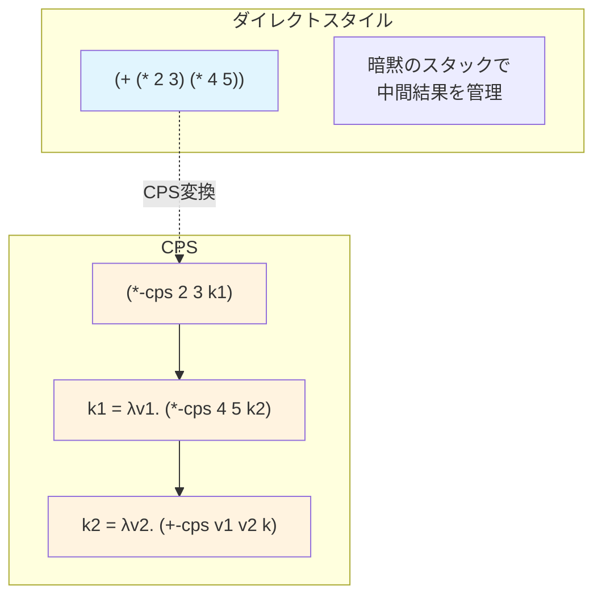

### 3.5 CPS変換とコンパイラ

CPSは単なるプログラミングスタイルにとどまらず、コンパイラの中間表現としても広く使われている。Andrew Appel は著書 *Compiling with Continuations*（1992）で、SML/NJ コンパイラにおけるCPS中間表現の活用を詳細に論じた。

CPS中間表現の利点は以下の通りである。

- **制御フローとデータフローが統一的に表現される**：goto文、条件分岐、例外、ループなど、あらゆる制御構造がCPSの関数呼び出しで表現される。
- **最適化が容易**：インライン展開、定数伝播、不要コード除去などの最適化が、関数の置き換えという単一の操作で実現できる。
- **末尾呼び出しが自然に表現される**：CPSでは全呼び出しが末尾呼び出しなので、スタックフレームの管理が単純化される。

一方で、CPSの欠点として、コードサイズの膨張（継続のクロージャ生成）と可読性の低下が挙げられる。そのため、近年では**ANF（Administrative Normal Form）**や**SSA（Static Single Assignment）形式**がCPSの代替として用いられることも多い。ANFはCPSと等価な表現力を持ちながら、よりコンパクトな表現を提供する。

## 4. call/cc（call-with-current-continuation）

### 4.1 call/cc の定義

**call/cc（call-with-current-continuation）**は、Scheme で導入された最も強力な制御プリミティブの一つである。call/cc は、その呼び出し時点における「現在の継続」を捕捉し、それを引数として渡された関数に渡す。

Scheme での call/cc のシグネチャは以下の通りである。

```scheme
;; (call/cc f)
;; f is a function that takes one argument: the current continuation
;; call/cc captures the current continuation and passes it to f
```

call/cc の動作を直感的に説明すると、以下のようになる。

1. `(call/cc f)` が評価される
2. その時点での「残りの計算」が継続 `k` として捕捉される
3. `(f k)` が呼び出される
4. `f` の中で `k` が呼び出されると（`(k v)`）、プログラムの実行は `call/cc` が呼ばれた地点に「ジャンプ」し、`call/cc` の値が `v` になる
5. `f` が `k` を呼び出さずに正常に値を返した場合、その値が `call/cc` の結果になる

### 4.2 call/cc のCPS的理解

call/cc をCPSで理解すると非常にわかりやすい。CPS変換されたプログラムでは、すべての関数が継続を引数として受け取る。call/cc は、この継続をユーザーのコードに「見せる」だけの操作である。

```scheme
;; CPS definition of call/cc
(define (call/cc-cps f k)
  (f (lambda (v ignored-k)  ; captured continuation
       (k v))               ; jump back to the original continuation
     k))
```

ここで重要なのは、捕捉された継続 `(lambda (v ignored-k) (k v))` が、呼び出されたときに自分自身の継続 `ignored-k` を無視し、元の継続 `k` にジャンプするという点である。これが「非局所脱出」の本質である。

### 4.3 基本的な使用例

#### 例1：非局所脱出

最も単純な call/cc の使用例は、ループや再帰からの脱出である。

```scheme
;; Non-local exit: find the first negative number in a list
(define (find-first-negative lst)
  (call/cc
    (lambda (exit)
      (for-each (lambda (x)
                  (when (< x 0)
                    (exit x)))  ; jump out immediately
                lst)
      #f)))  ; return #f if no negative found

(find-first-negative '(3 1 -4 1 5))  ; => -4
(find-first-negative '(3 1 4 1 5))   ; => #f
```

`exit` は call/cc によって捕捉された継続であり、`(exit x)` を呼び出すと、`call/cc` の呼び出し地点に即座に戻り、`x` がその値となる。これは、多くの言語における `return` 文や `break` 文のようなものだが、ファーストクラスの値として扱える点が異なる。

#### 例2：例外処理

例外処理を call/cc で実装できる。

```scheme
;; Simple exception handling with call/cc
(define (try thunk handler)
  (call/cc
    (lambda (exit)
      (let ((raise (lambda (exn)
                     (exit (handler exn)))))
        (thunk raise)))))

;; Usage
(try
  (lambda (raise)
    (let ((x (string->number "abc")))
      (if (not x)
          (raise "invalid number")
          (* x 2))))
  (lambda (exn)
    (string-append "Error: " exn)))
;; => "Error: invalid number"
```

#### 例3：継続の保存と再呼び出し

call/cc の真の力は、捕捉した継続を保存しておき、後から（何度でも）呼び出せることにある。

```scheme
;; Saving and re-invoking a continuation
(define saved-k #f)

(define (test)
  (let ((x (call/cc (lambda (k)
                      (set! saved-k k)  ; save the continuation
                      1))))             ; initial value
    (display x)
    (newline)
    x))

(test)       ; prints 1, saved-k is now set
(saved-k 10) ; prints 10 — execution resumes from the call/cc point
(saved-k 42) ; prints 42 — can be called multiple times
```

`saved-k` を呼び出すたびに、`call/cc` が呼ばれた地点から実行が再開される。これは、プログラムの実行状態のスナップショットを撮り、後からそのスナップショットに戻るようなものである。

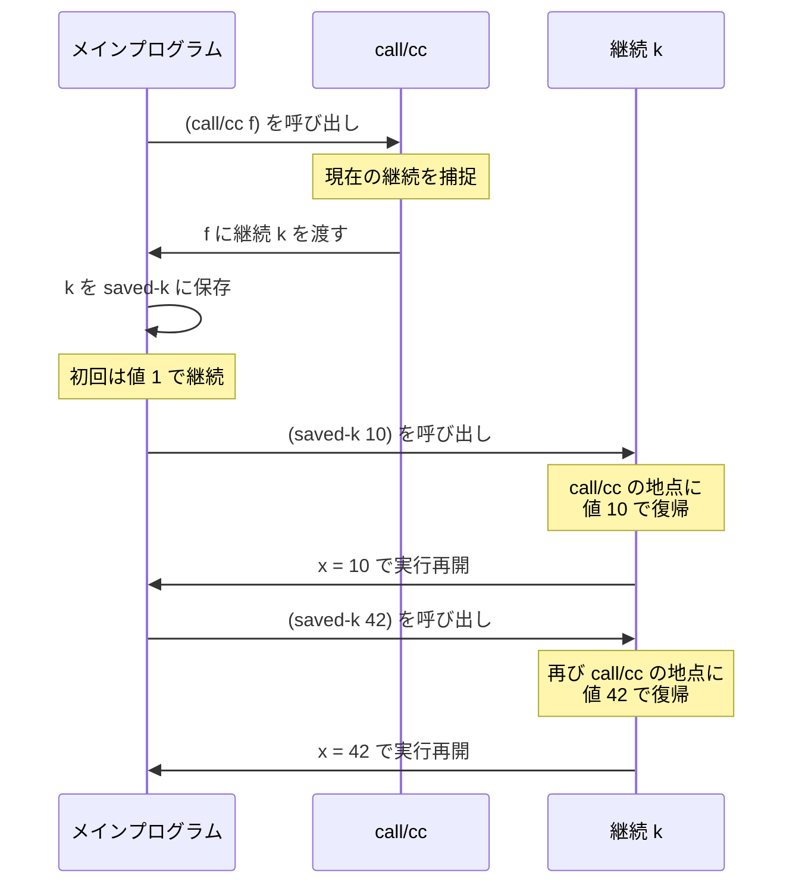

### 4.4 call/cc の分類：Upward と Downward

call/cc の使い方は、捕捉された継続がどのように使われるかによって二つに分類できる。

**Downward continuation**（下方向の継続使用）：
捕捉された継続が、`call/cc` の引数関数の実行中にのみ使われる場合。非局所脱出がこれに該当する。継続のライフタイムが `call/cc` の動的スコープ内に限定されるため、実装が比較的単純である（スタックのアンワインドで実現可能）。

**Upward continuation**（上方向の継続使用）：
捕捉された継続が、`call/cc` の動的スコープの外から呼び出される場合。例3のように、継続をグローバル変数に保存して後から呼び出すケースがこれにあたる。実装には、コールスタック全体のコピーやヒープへの退避が必要になり、コストが高い。

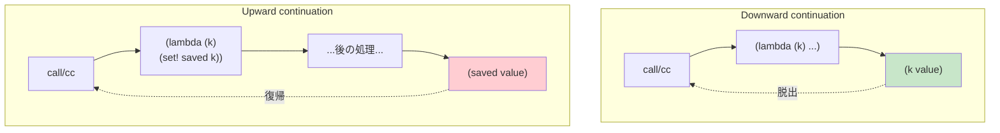

### 4.5 call/cc の意味論と型

call/cc に型を付けることを考えると、興味深い性質が見えてくる。型付きラムダ計算において、call/cc の型は以下のようになる。

$$
\text{call/cc} : ((\alpha \to \beta) \to \alpha) \to \alpha
$$

ここで、$\alpha$ は call/cc の結果の型、$\alpha \to \beta$ は継続の型である。継続は $\alpha$ 型の値を受け取るが、$\beta$ は任意の型でよい（継続を呼び出すと通常の制御フローに戻らないため、戻り値の型は何でもよい）。

この型は、**Peirceの法則**と呼ばれる古典論理の公理に対応する。

$$
((A \to B) \to A) \to A
$$

Curry-Howard対応（命題と型の対応）のもとで、call/cc は古典論理の**排中律**に対応する。すなわち、構成的（直観主義的）な証明体系には call/cc に対応する証明は存在しないが、古典論理では妥当な推論規則である。このことは、call/cc が「計算的に非構成的」な操作——すなわち、計算の途中で「タイムトラベル」するような操作——であることの型理論的な裏付けである。

## 5. 限定継続（Delimited Continuations）

### 5.1 call/cc の問題点

call/cc は強力だが、いくつかの実用上の問題がある。

1. **捕捉される継続が大きすぎる**：call/cc は「プログラムの最後まで」の計算全体を捕捉する。これは多くの場合、必要以上に広い範囲を含む。
2. **合成性（composability）が低い**：call/cc で捕捉した継続は、呼び出すと呼び出し元に戻らない（制御を完全に奪う）ため、継続を組み合わせて使うことが困難である。
3. **実装コストが高い**：プログラムのスタック全体をコピーする必要があり、パフォーマンスに影響する。

### 5.2 限定継続の着想

1988年、Matthias Felleisen は**限定継続（delimited continuation）**の概念を提案した（Andrzej Filinski も独立に同様のアイデアを発展させた）。限定継続は、call/cc が捕捉する「プログラム全体の残り」ではなく、**指定された境界（delimiter）までの計算の一部分**を捕捉する。

限定継続を実現する最も有名なプリミティブが **shift/reset** である。

- **reset**（`reset`）：継続の捕捉範囲の境界（デリミタ）を設定する
- **shift**（`shift`）：最も近い `reset` までの継続を捕捉する

### 5.3 shift/reset の動作

```scheme
;; reset establishes a delimiter
;; shift captures the continuation up to the nearest reset

(reset
  (+ 1 (shift k       ; k = (lambda (v) (+ 1 v))
         (k 10))))     ; => (+ 1 10) => 11
```

この例では、`shift` が呼ばれた時点で、最も近い `reset` までの継続が `k` として捕捉される。`shift` が呼ばれた地点から `reset` までの「残りの計算」は `(+ 1 □)` であるから、`k` は `(lambda (v) (+ 1 v))` に相当する。

そして、`(k 10)` を評価すると `(+ 1 10)` = `11` が得られる。この値が `reset` 全体の結果となる。

### 5.4 call/cc との決定的な違い

shift/reset と call/cc の最大の違いは、**捕捉された継続が関数として振る舞い、呼び出し後に制御が戻る**という点である。

```scheme
;; shift: the captured continuation returns a value
(reset
  (+ 1 (shift k
         (* 2 (k 10)))))
;; k = (lambda (v) (+ 1 v))
;; (k 10) => 11
;; (* 2 11) => 22
```

ここで、`(k 10)` は `11` を返し、その後 `(* 2 11)` が評価されて `22` になる。call/cc の場合、継続を呼び出すと制御が完全に移動して戻ってこないが、shift/reset では継続の呼び出しが通常の関数呼び出しと同じように値を返す。

これにより、限定継続は**合成可能（composable）**になる。複数の限定継続を組み合わせて、より複雑な制御フローを構築できる。

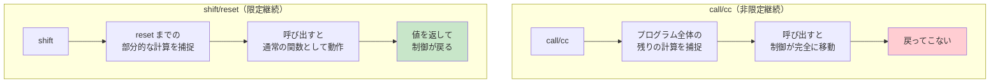

### 5.5 限定継続のさらなる例

#### 非決定的計算（バックトラッキング）

限定継続を使うと、非決定的な計算を自然に表現できる。

```scheme
;; Non-deterministic choice using shift/reset
(define (amb choices)
  (shift k
    (let loop ((cs choices))
      (if (null? cs)
          '()
          (append (k (car cs))      ; try each choice
                  (loop (cdr cs)))))))

;; Find all Pythagorean triples
(reset
  (let ((a (amb '(1 2 3 4 5 6 7 8 9 10)))
        (b (amb '(1 2 3 4 5 6 7 8 9 10)))
        (c (amb '(1 2 3 4 5 6 7 8 9 10))))
    (if (and (<= a b)
             (= (+ (* a a) (* b b)) (* c c)))
        (list (list a b c))
        '())))
;; => ((3 4 5) (6 8 10))
```

`amb` は「複数の選択肢から非決定的に一つを選ぶ」関数である。shift/reset によって、各選択肢に対して「残りの計算」を実行し、結果を収集する。

#### ジェネレータ

```scheme
;; Generator using shift/reset
(define (yield v)
  (shift k (cons v k)))  ; return value and continuation as a pair

(define (generate-range n)
  (reset
    (let loop ((i 0))
      (when (< i n)
        (yield i)
        (loop (+ i 1))))
    'done))

;; Usage
(define gen (generate-range 5))
;; gen => (0 . #<continuation>)
(define gen2 ((cdr gen)))
;; gen2 => (1 . #<continuation>)
```

### 5.6 限定継続の理論的位置づけ

Andrzej Filinski は1994年の論文 *"Representing Monads"* で、限定継続（shift/reset）がすべてのモナディックな効果を表現できることを示した。具体的には、任意のモナドによる計算を、shift/reset を使って直接的に（モナディックなインターフェースを経由せずに）記述できる。

この結果は、限定継続が**計算効果の万能表現手段**であることを意味する。例外、状態、非決定性、入出力——これらすべてが shift/reset で表現可能なのである。

## 6. 継続の応用

### 6.1 非局所脱出（Non-local Exit）

最も基本的な応用は非局所脱出である。深くネストした処理から一気に脱出する。

```scheme
;; Searching a tree: abort when found
(define (search-tree tree target)
  (call/cc
    (lambda (found!)
      (let walk ((node tree))
        (cond
          ((null? node) #f)
          ((equal? (car node) target) (found! #t))
          ((pair? (car node)) (walk (car node)))
          (else (walk (cdr node)))))
      #f)))

(search-tree '(1 (2 (3 4)) (5 6)) 4)  ; => #t
(search-tree '(1 (2 (3 4)) (5 6)) 7)  ; => #f
```

### 6.2 コルーチン

継続を用いてコルーチンを実装できる。二つのコルーチンが交互に実行権を渡し合うパターンを以下に示す。

```scheme
;; Simple coroutines using call/cc
(define (make-coroutine body)
  (let ((saved-k #f))
    (define (resume value)
      (call/cc
        (lambda (k)
          (set! saved-k k)   ; save current continuation
          (saved-k value)))) ; resume the other coroutine
    (define (start)
      (call/cc
        (lambda (k)
          (set! saved-k k)
          (body resume))))
    (values start resume)))

;; Producer-consumer example
(define producer-resume #f)
(define consumer-resume #f)

(define (producer resume)
  (let loop ((i 0))
    (display (format "Produced: ~a\n" i))
    (resume i)              ; yield value to consumer
    (loop (+ i 1))))

(define (consumer resume)
  (let loop ()
    (let ((value (resume #f)))  ; get value from producer
      (display (format "Consumed: ~a\n" value))
      (loop))))
```

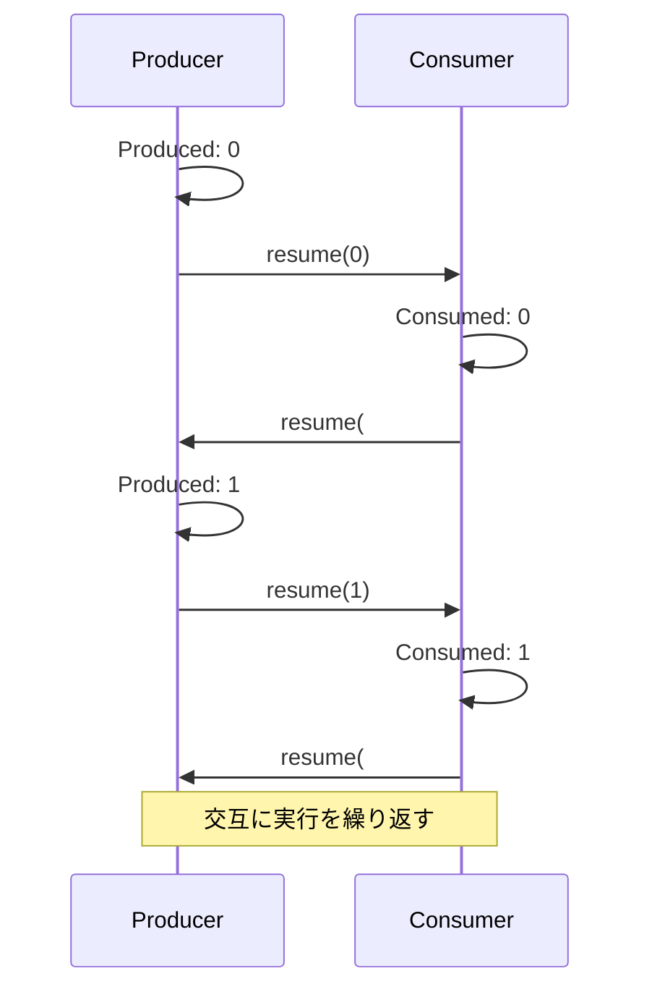

### 6.3 バックトラッキング

論理プログラミングスタイルのバックトラッキングを call/cc で実装できる。

```scheme
;; Backtracking with call/cc
(define fail-stack '())

(define (fail)
  (if (null? fail-stack)
      (error "No more choices")
      (let ((back (car fail-stack)))
        (set! fail-stack (cdr fail-stack))
        (back 'backtrack))))

(define (choose . choices)
  (call/cc
    (lambda (k)
      (for-each
        (lambda (choice)
          (call/cc
            (lambda (fk)
              (set! fail-stack (cons fk fail-stack))
              (k choice))))  ; return this choice
        choices)
      (fail))))  ; all choices exhausted

;; Solve: x + y = 5, x * y = 6
(let ((x (choose 1 2 3 4))
      (y (choose 1 2 3 4)))
  (if (and (= (+ x y) 5) (= (* x y) 6))
      (list x y)
      (fail)))
;; => (2 3)
```

### 6.4 軽量スレッド（協調的スケジューリング）

限定継続を用いて、ユーザーレベルの軽量スレッドを実装できる。

```scheme
;; Lightweight threads using delimited continuations
(define run-queue '())

(define (spawn thunk)
  (set! run-queue
    (append run-queue (list thunk))))

(define (yield!)
  (shift k
    (spawn k)      ; put current thread at end of queue
    (schedule)))   ; run next thread

(define (schedule)
  (if (null? run-queue)
      'done
      (let ((next (car run-queue)))
        (set! run-queue (cdr run-queue))
        (reset (next 'resume)))))

;; Usage
(spawn (lambda (_)
  (display "Thread A: step 1\n")
  (yield!)
  (display "Thread A: step 2\n")
  (yield!)
  (display "Thread A: step 3\n")))

(spawn (lambda (_)
  (display "Thread B: step 1\n")
  (yield!)
  (display "Thread B: step 2\n")))

(reset (schedule))
;; Output:
;; Thread A: step 1
;; Thread B: step 1
;; Thread A: step 2
;; Thread B: step 2
;; Thread A: step 3
```

### 6.5 応用のまとめ

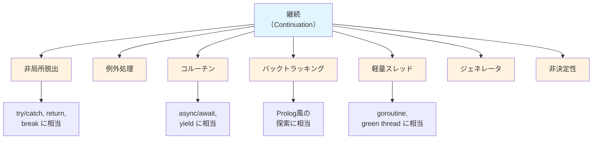

## 7. 各言語での継続の実装

### 7.1 Scheme — 正統な call/cc

Scheme は call/cc をR5RS以降の標準で定めている唯一の主要言語である。Schemeの call/cc はフルスペックの first-class continuation を提供する。

```scheme
;; Scheme (R7RS) — full call/cc
(import (scheme base) (scheme write))

;; Classic example: cooperative multitasking with call/cc
(define (make-thread thunk)
  (let ((cont #f))
    (lambda ()
      (if cont
          (cont 'resume)
          (begin
            (call/cc
              (lambda (return)
                (set! cont return)
                (thunk))))))))
```

Schemeにおける call/cc の実装方式にはいくつかのアプローチがある。

- **スタックコピー方式**：call/cc が呼ばれた時点のCスタックを丸ごとコピーして保存する。Gambit-C や Guile が採用。
- **ヒープ割り当てフレーム方式**：最初からすべてのスタックフレームをヒープに割り当てる。Chicken Scheme が採用するCheney on the MTA方式がこの変形。
- **CPS変換方式**：コンパイラがプログラム全体をCPSに変換し、継続が自然にクロージャとして表現される。

> [!NOTE]
> Scheme のR7RS-large ではさらに限定継続のライブラリも検討されている。SRFI-226 は限定継続を提供するSRFI（Scheme Requests for Implementation）であり、shift/reset に加えて複数のプロンプト（delimiter）をサポートする。

### 7.2 Ruby — callcc と Fiber

Ruby は callcc メソッドを提供していたが、Ruby 1.9以降は非推奨となり、代わりに **Fiber**（限定継続の一形態）が推奨されている。

```ruby
# Ruby — Fiber (delimited continuation in spirit)
fib = Fiber.new do
  a, b = 0, 1
  loop do
    Fiber.yield a  # suspend and return value
    a, b = b, a + b
  end
end

10.times { puts fib.resume }  # 0, 1, 1, 2, 3, 5, 8, 13, 21, 34
```

Ruby の Fiber は限定継続の一種と見なせる。`Fiber.yield` が shift に、`fib.resume` が reset + 継続の呼び出しに相当する。ただし、Fiber は一度に一つの中断ポイントしか持てない（ワンショット限定継続）ため、完全な shift/reset ほどの表現力は持たない。

```ruby
# Ruby — the deprecated callcc (for reference)
require 'continuation'

callcc do |k|
  puts "Before"
  k.call       # non-local exit
  puts "After"  # never reached
end
puts "Outside"
# Output:
# Before
# Outside
```

### 7.3 Kotlin — Coroutines（限定継続ベース）

Kotlin のコルーチンは、コンパイラレベルでのCPS変換に基づいている。`suspend` 関数はコンパイル時にCPSに変換され、継続オブジェクトが生成される。

```kotlin
// Kotlin — suspend functions are CPS-transformed
suspend fun fetchData(): String {
    val response = httpClient.get("https://api.example.com/data")  // suspension point
    return response.body()  // continuation resumes here
}

// Compiler transforms this to approximately:
// fun fetchData(continuation: Continuation<String>): Any? {
//     when (continuation.label) {
//         0 -> {
//             continuation.label = 1
//             val result = httpClient.get(url, continuation)
//             if (result == COROUTINE_SUSPENDED) return COROUTINE_SUSPENDED
//         }
//         1 -> {
//             val response = continuation.result
//             continuation.resume(response.body())
//         }
//     }
// }
```

Kotlin のアプローチの特徴は以下の通りである。

- **限定継続をコンパイラが自動生成**：プログラマは `suspend` と書くだけで、コンパイラが状態機械（state machine）ベースのCPS変換を行う。
- **ワンショット**：各継続は一度しか再開できない。これにより実装が効率的になる。
- **構造化された並行性**：`CoroutineScope` によって継続のライフタイムが管理される。

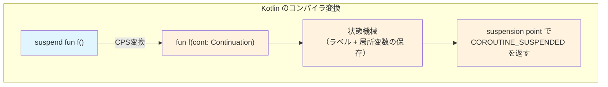

### 7.4 Effect Handlers — 限定継続の現代的発展

**Algebraic Effect Handlers（代数的エフェクトハンドラ）**は、限定継続を構造化して扱う最新のアプローチである。OCaml 5.0、Koka、Eff などの言語で実装されている。

Effect handlers の基本的な考え方は以下の通りである。

1. **エフェクトの宣言**：プログラムが実行する可能性のある「効果（effect）」を宣言する
2. **エフェクトの発動（perform）**：エフェクトを「投げる」（shift に相当）
3. **ハンドラの設置（handle/match）**：エフェクトを「捕捉する」（reset に相当）

```ocaml
(* OCaml 5.0 — Effect Handlers *)
open Effect
open Effect.Deep

(* Declare an effect *)
type _ Effect.t += Yield : int -> unit Effect.t

(* A generator that yields values *)
let generate () =
  for i = 0 to 4 do
    perform (Yield i)  (* like shift *)
  done

(* Handle the Yield effect *)
let collected =
  match_with generate ()  (* like reset *)
    { retc = (fun () -> []);
      exnc = raise;
      effc = fun (type a) (eff : a Effect.t) ->
        match eff with
        | Yield v -> Some (fun (k : (a, _) continuation) ->
            v :: continue k ())  (* resume the continuation *)
        | _ -> None }

(* collected = [0; 1; 2; 3; 4] *)
```

Effect handlers の利点は、shift/reset に比べて以下の点が改善されていることである。

- **型安全**：どのエフェクトがどこでハンドルされるかを型レベルで追跡できる
- **合成性**：異なるエフェクトのハンドラを独立に定義し、組み合わせられる
- **実用性**：例外処理、状態管理、非同期I/Oなど、日常的なプログラミングパターンを自然に表現できる

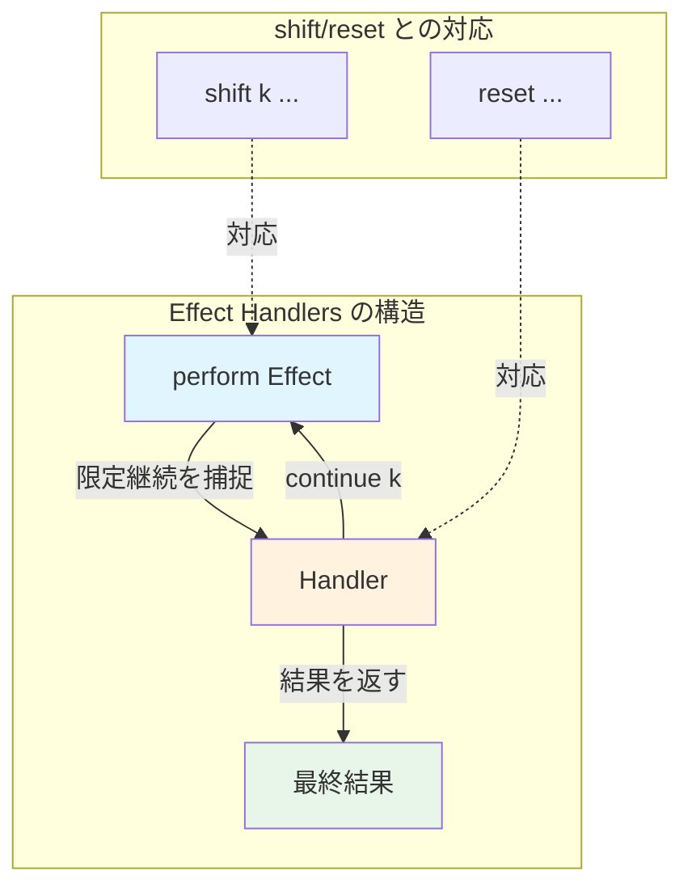

### 7.5 各言語の比較

| 言語 | 継続の種類 | プリミティブ | ワンショット/マルチショット | 実装方式 |
|------|-----------|-------------|---------------------------|---------|
| Scheme | 非限定（フル） | `call/cc` | マルチショット | スタックコピー / CPS変換 |
| Scheme (SRFI-226) | 限定 | `shift/reset` | マルチショット | ライブラリ依存 |
| Ruby | 限定（Fiber） | `Fiber.yield/resume` | ワンショット | コンテキスト切り替え |
| Kotlin | 限定 | `suspend/resume` | ワンショット | CPS変換（状態機械） |
| OCaml 5.0 | 限定 | `perform/match_with` | ワンショット（デフォルト） | ファイバー |
| Haskell | モナド経由 | `ContT` | マルチショット | CPS変換 |

## 8. 継続とモナドの関係

### 8.1 Continuation モナド

Haskell では、継続を**Continuation モナド**として扱うことができる。

```haskell
-- The Continuation monad
newtype Cont r a = Cont { runCont :: (a -> r) -> r }

instance Monad (Cont r) where
  return a = Cont (\k -> k a)
  -- (>>=) :: Cont r a -> (a -> Cont r b) -> Cont r b
  (Cont f) >>= g = Cont (\k -> f (\a -> runCont (g a) k))
```

`Cont r a` は「`a` 型の値を生成する計算で、`a -> r` 型の継続を受け取って最終結果 `r` を返す」と読める。これはまさにCPSの型 `(a -> r) -> r` をnewtype wrapperで包んだものである。

### 8.2 callCC

Haskell の `Control.Monad.Cont` には `callCC` が定義されている。

```haskell
-- callCC in Haskell
callCC :: ((a -> Cont r b) -> Cont r a) -> Cont r a
callCC f = Cont (\k -> runCont (f (\a -> Cont (\_ -> k a))) k)

-- Usage example: early exit from a computation
example :: Cont r String
example = callCC $ \exit -> do
  val <- someComputation
  when (val < 0) $ exit "Negative value!"
  return $ "Result: " ++ show val
```

### 8.3 Continuation モナドの万能性

Continuation モナドはすべてのモナドの「母」とも呼ばれる。その理由は、任意のモナドの操作を Continuation モナドで模倣できるからである。

Filinski（1994）の定理をHaskellの文脈で述べると、以下のようになる。

> 限定継続のプリミティブ（shift/reset に相当する reify/reflect）があれば、任意のモナドのインスタンスを構成できる。

これは、Continuation モナドが**モナドのトランスフォーマスタックの頂点**に位置することを意味する。

```haskell
-- State monad via Continuation monad
type State s a = Cont (s -> (a, s)) a

get :: State s s
get = Cont (\k -> \s -> k s s)

put :: s -> State s ()
put s = Cont (\k -> \_ -> k () s)

-- Exception monad via Continuation monad
type Except e a = Cont (Either e a) a

throw :: e -> Except e a
throw e = Cont (\_ -> Left e)
```

### 8.4 モナドと限定継続の双対性

モナドと限定継続は、計算効果を構造化する二つのアプローチである。

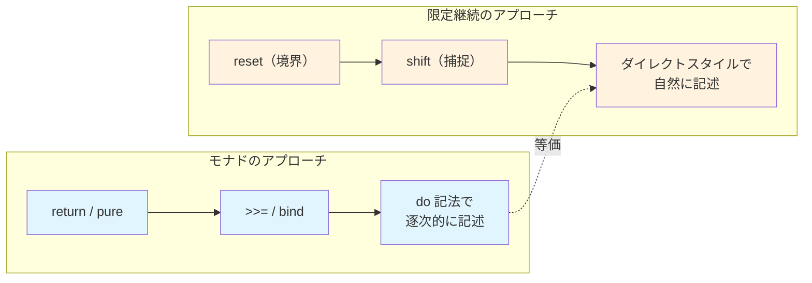

モナドのアプローチでは、効果を含む計算を明示的に `>>=` で連結する必要がある（do記法はこれの糖衣構文）。一方、限定継続のアプローチでは、普通のダイレクトスタイルでプログラムを書き、必要な箇所で `shift` を使ってエフェクトを発動する。

どちらも同じ計算を表現できるが、人間工学（ergonomics）が異なる。限定継続のアプローチは、既存のダイレクトスタイルのコードに効果を「後付け」しやすいという利点がある。Effect handlers がこのアプローチの現代的な具現化である。

## 9. 継続の実装技術

### 9.1 実装の分類

継続をプログラミング言語に実装する方法はいくつかある。それぞれにトレードオフがある。

#### スタックコピー方式

call/cc が呼ばれた時点でCのコールスタック全体をコピーし、ヒープに保存する。継続を呼び出す際は、保存したスタックを復元する。

- **利点**：既存のC言語ベースのランタイムに比較的容易に追加できる
- **欠点**：スタックのコピーはO(n)のコストがかかる。深いスタックでは高コスト

#### ヒープ割り当てフレーム方式

すべてのスタックフレームを最初からヒープに割り当てる。call/cc はヒープ上のフレームへのポインタを返すだけなので、O(1) で動作する。

- **利点**：call/cc が非常に高速
- **欠点**：通常の関数呼び出しのオーバーヘッドが増加する（スタック上のフレームより遅い）。GCの負荷も増える

#### CPS変換方式

コンパイラがプログラム全体をCPSに変換する。継続は通常のクロージャとして表現されるため、特別なランタイムサポートは不要。

- **利点**：概念的にクリーン。最適化の機会が豊富
- **欠点**：コードサイズの膨張。Cとの相互運用（FFI）が困難になることがある

#### セグメンテッドスタック / スタックレットコピー方式

スタックを小さなセグメント（スタックレット）に分割し、限定継続の捕捉時にはデリミタまでのセグメントのみをコピーする。

- **利点**：限定継続の捕捉コストが小さい（フルスタックのコピーは不要）
- **欠点**：スタック管理の複雑さが増す

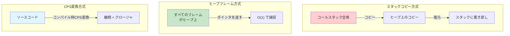

### 9.2 ワンショット vs マルチショット

継続を一度だけ呼び出せる場合を**ワンショット（one-shot）**、何度でも呼び出せる場合を**マルチショット（multi-shot）**と呼ぶ。

- **ワンショット継続**：Kotlin, OCaml 5.0, Lua のコルーチン。コンテキスト（スタックフレーム、レジスタ）を一度だけスワップすれば十分なため、実装が効率的。
- **マルチショット継続**：Scheme の call/cc、Haskell の Cont モナド。コンテキストをコピーして保持する必要があるため、コストが高い。

多くの実用的なユースケース（コルーチン、async/await、例外処理）ではワンショット継続で十分であるため、近年の言語はワンショット継続を採用する傾向にある。

### 9.3 パフォーマンスの考慮

継続の実装は、その言語のパフォーマンス特性に大きな影響を与える。

| 操作 | スタックコピー | ヒープフレーム | CPS変換 |
|------|-------------|-------------|---------|
| 通常の関数呼び出し | 高速（ネイティブスタック） | 中程度（ヒープ割り当て） | 高速（末尾呼び出し） |
| 継続の捕捉 | 遅い（O(n) コピー） | 高速（O(1) ポインタ） | 高速（クロージャ生成） |
| 継続の呼び出し | 遅い（O(n) 復元） | 高速（O(1) ジャンプ） | 高速（関数呼び出し） |
| メモリ使用量 | 低い（通常時） | 高い（GC圧力） | 中程度 |

Chicken Scheme は、Henry Baker の "Cheney on the MTA" 方式を採用した独特なアプローチで知られる。すべての関数呼び出しをCスタック上で行い、スタックがいっぱいになったらGC（Cheneyのコピーアルゴリズム）を発動してライブフレームをヒープにコピーする。この方式では、call/cc が自然にサポートされ、かつCとの相互運用性も維持される。

## 10. 継続に関する議論と批判

### 10.1 call/cc は強力すぎるか

call/cc は強力なプリミティブだが、その強力さゆえに問題も指摘されている。

**推論の困難さ**：call/cc を含むプログラムは、制御フローが非線形になるため、プログラムの動作を推論するのが非常に難しい。これは goto 文と同様の問題である。Dijkstra が goto 文を批判したのと同じ理由で、call/cc の無制限な使用はプログラムの理解を困難にする。

**リソース管理との衝突**：ファイルハンドルやデータベース接続などのリソースを扱う際、call/cc でスコープを飛び越えると、リソースの解放漏れが起きる可能性がある。`dynamic-wind` で一部対処できるが、完全ではない。

**実装コスト**：フルスペックのマルチショット call/cc は実装コストが高く、通常のプログラムのパフォーマンスにも影響を与える可能性がある。

### 10.2 限定継続への移行

これらの問題の多くは、限定継続によって緩和される。

- **スコープが限定される**：reset で境界を設定するため、影響範囲が予測可能
- **合成性がある**：通常の関数のように組み合わせられる
- **実装が効率的**：捕捉する範囲が限定されるため、コストが低い
- **型安全性と組み合わせやすい**：Effect handlers のように型システムと統合しやすい

Oleg Kiselyov は "Against call/cc"（2012）で、call/cc の問題点を体系的に論じ、限定継続の優位性を主張した。この見解は言語設計コミュニティで広く受け入れられており、近年の言語は call/cc ではなく限定継続（またはその特殊化であるコルーチン、effect handlers）を採用する傾向にある。

### 10.3 グリーンスレッドとの関係

現代の多くの言語が採用するグリーンスレッド（Go の goroutine、Erlang のプロセスなど）は、限定継続の特殊なケースと見なせる。これらはワンショットの限定継続をスケジューラと組み合わせたものであり、プログラマから見ると「中断と再開」が透過的に行われる。

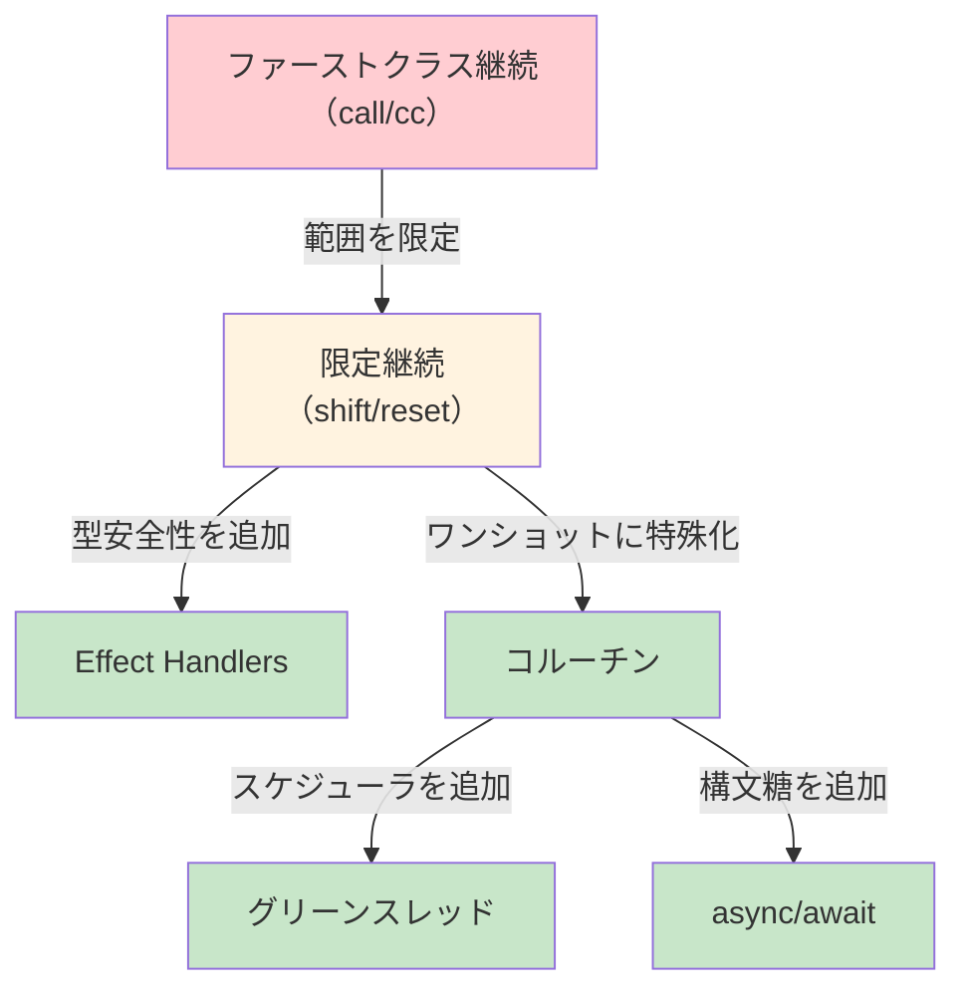

## 11. まとめ

### 11.1 継続の本質

継続とは「残りの計算」を値として表現する概念である。この単純な着想から、驚くほど多様な制御フローパターンが導き出される。

1. **暗黙の継続**：すべてのプログラムのすべての評価時点に存在する
2. **CPS変換**：暗黙の継続をコードの中で明示化する体系的な手法
3. **call/cc**：実行中のプログラムの現在の継続を捕捉する言語プリミティブ
4. **限定継続**：捕捉範囲を限定し、合成可能にした進化版
5. **Effect Handlers**：限定継続に型安全性と構造を追加した現代的な発展

### 11.2 歴史からの教訓

継続の歴史は、プログラミング言語の設計における重要な教訓を示している。

- **抽象化の力**：「残りの計算」という一つの抽象から、例外、コルーチン、バックトラッキング、スレッドなど、あらゆる制御構造が導き出せる
- **表現力と使いやすさのトレードオフ**：call/cc は万能だが使いにくい。限定継続はやや制限されるが、はるかに使いやすい。最も使いやすいのは async/await や effect handlers のような「限定継続の特殊化・構造化」された形態である
- **理論と実践の相互作用**：表示的意味論から生まれた概念が、プログラミング言語の実用的な機能として結実し、さらに型理論（Curry-Howard 対応）と結びついて深い理論的洞察をもたらした

### 11.3 継続の現在と未来

今日の主要なプログラミング言語の多くは、直接的に「継続」という名前を使わないが、その背後にある概念を様々な形で取り入れている。

- **Python の `async/await`**：限定継続のワンショット特殊化
- **JavaScript の `async/await` と Generator**：限定継続のワンショット特殊化
- **Go の goroutine**：限定継続 + スケジューラ
- **Kotlin の Coroutines**：CPS変換に基づく限定継続
- **OCaml 5.0 の Effect Handlers**：型安全な限定継続

::: tip 継続は「制御フローの DNA」
継続は、あらゆる制御フローの構成要素を統一的に説明する「DNA」のような存在である。具体的な言語機能（例外、コルーチン、async/await など）は、この DNA から発現した個々の「形質」と見なせる。継続を理解することは、これらすべての制御フロー機構の本質を理解することにつながる。
:::

Effect handlers は、限定継続の概念を型システムと統合し、実用的かつ理論的にエレガントな形で提供する。OCaml 5.0 での実装が成功を収めつつあり、Koka や Eff などの研究言語でも活発に研究が進んでいる。WebAssembly にもスタック切り替え（stack switching）の提案があり、ブラウザ上での効率的な継続サポートが検討されている。

継続は1960年代に生まれた概念だが、その重要性は現代の言語設計においてますます高まっている。「残りの計算を値として扱う」という革新的な着想は、半世紀以上を経てなお、プログラミング言語の進化を導き続けているのである。

## 参考文献

- Strachey, C. & Scott, D. (1970). *Outline of a Mathematical Theory of Computation*
- Steele, G. & Sussman, G. (1975-1980). *Lambda Papers* (MIT AI Memo series)
- Appel, A. (1992). *Compiling with Continuations*. Cambridge University Press
- Felleisen, M. (1988). *The Theory and Practice of First-Class Prompts*
- Filinski, A. (1994). *Representing Monads*. POPL '94
- Kiselyov, O. (2012). *An argument against call/cc*
- Dolan, S. et al. (2017). *Concurrent System Programming with Effect Handlers*. TFP 2017
- Sivaramakrishnan, K.C. et al. (2021). *Retrofitting Effect Handlers onto OCaml*. PLDI 2021
