# コルーチンとasync/await — 協調的マルチタスクの設計

## 1. 背景と動機 — なぜ非同期処理が必要なのか

現代のソフトウェアシステムにおいて、I/O（ネットワーク通信、ディスクアクセス、データベースクエリなど）は最も頻繁に発生するボトルネックである。CPUが1命令を実行するのに約0.3ナノ秒しかかからないのに対し、ネットワーク越しのラウンドトリップには数十ミリ秒、ディスクI/Oには数ミリ秒を要する。この時間差は実に **数百万倍** に達する。

同期的なプログラミングモデルでは、I/O操作の完了を待つ間、スレッドはただ待機するだけである。Webサーバーがリクエストごとに1スレッドを割り当てる「thread-per-request」モデルでは、大量の同時接続を処理しようとするとスレッド数が爆発し、以下の問題が顕在化する。

1. **メモリ消費**：各スレッドは通常1〜8MBのスタック領域を確保する。10,000接続を同時に処理するには10〜80GBのメモリがスタックだけで必要になる
2. **コンテキストスイッチのオーバーヘッド**：OSカーネルによるスレッド切り替えには数マイクロ秒を要し、スレッド数が増えるほど全体のスループットが低下する
3. **C10K問題**：1999年にDan Kegelsが提起した問題であり、「1台のサーバーで1万の同時接続をどう処理するか」という課題を示した

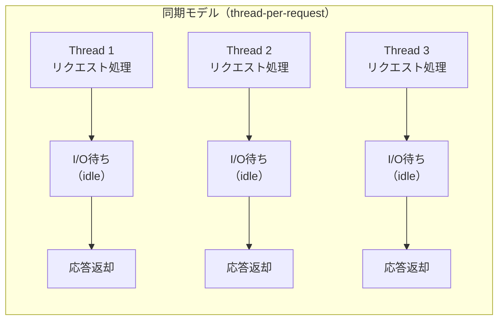
```mermaid
graph LR
    subgraph "同期モデル（thread-per-request）"
        T1["Thread 1<br/>リクエスト処理"] --> W1["I/O待ち<br/>（idle）"] --> T1R["応答返却"]
        T2["Thread 2<br/>リクエスト処理"] --> W2["I/O待ち<br/>（idle）"] --> T2R["応答返却"]
        T3["Thread 3<br/>リクエスト処理"] --> W3["I/O待ち<br/>（idle）"] --> T3R["応答返却"]
    end
```

### 1.1 コールバックによる非同期処理とその限界

I/O待ちの非効率性を解決するために、イベント駆動のコールバックモデルが登場した。Node.jsはこのモデルの代表例であり、シングルスレッドのイベントループ上で非同期I/Oを処理する。

```javascript
// Callback-based asynchronous I/O in Node.js
const fs = require('fs');

fs.readFile('/path/to/config.json', 'utf8', (err, data) => {
  if (err) {
    console.error('Failed to read config:', err);
    return;
  }
  const config = JSON.parse(data);
  db.connect(config.connectionString, (err, connection) => {
    if (err) {
      console.error('Failed to connect:', err);
      return;
    }
    connection.query('SELECT * FROM users', (err, results) => {
      if (err) {
        console.error('Query failed:', err);
        return;
      }
      // Process results...
    });
  });
});
```

このコードは動作するが、3段階のコールバックのネストが発生している。これが **コールバック地獄（Callback Hell）** と呼ばれるパターンである。問題点は以下の通りである。

- **可読性の低下**：ネストが深くなるにつれて、処理の流れを追うのが困難になる
- **エラーハンドリングの散在**：各コールバックで個別にエラーチェックが必要になり、統一的な例外処理ができない
- **制御フローの断片化**：ループや条件分岐をコールバック間で表現するのが非常に煩雑になる
- **リソースリークのリスク**：エラーパスでのクリーンアップ漏れが起きやすい

この「同期的な見た目で非同期処理を書きたい」という要求こそが、コルーチンとasync/awaitの登場を促した根本的な動機である。

## 2. コルーチンの概念と歴史

### 2.1 コルーチンとは何か

**コルーチン（coroutine）** とは、実行を途中で中断（suspend）し、後から再開（resume）できるサブルーチンの一般化である。通常のサブルーチン（関数）が呼び出しと復帰の2つの操作しか持たないのに対し、コルーチンは中断と再開という追加の操作を持つ。

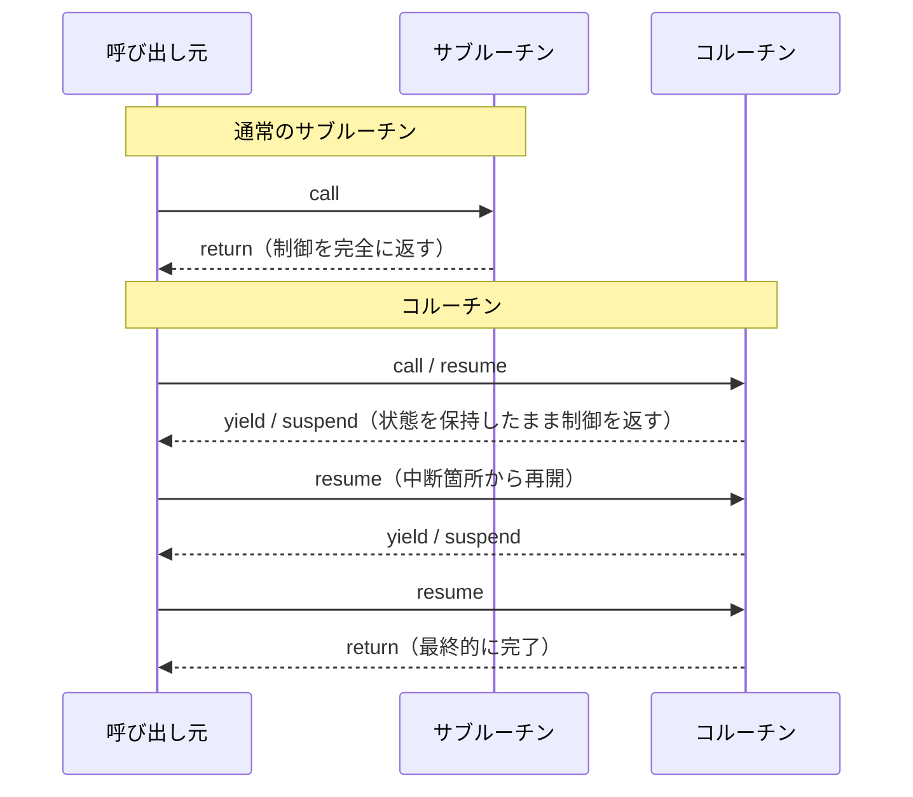
```mermaid
sequenceDiagram
    participant Caller as 呼び出し元
    participant Sub as サブルーチン
    participant Cor as コルーチン

    Note over Caller,Sub: 通常のサブルーチン
    Caller->>Sub: call
    Sub-->>Caller: return（制御を完全に返す）

    Note over Caller,Cor: コルーチン
    Caller->>Cor: call / resume
    Cor-->>Caller: yield / suspend（状態を保持したまま制御を返す）
    Caller->>Cor: resume（中断箇所から再開）
    Cor-->>Caller: yield / suspend
    Caller->>Cor: resume
    Cor-->>Caller: return（最終的に完了）
```

重要なのは、コルーチンが中断する際に **ローカル変数や実行位置を含む自身の状態をすべて保持する** という点である。再開時には、あたかも中断していなかったかのように処理が続行される。

### 2.2 歴史的背景

コルーチンの概念は驚くほど古い。**Melvin Conway** が1958年にCOBOLコンパイラの設計において考案したのが最初である。Conwayは1963年の論文 *"Design of a Separable Transition-Diagram Compiler"* でこの概念を正式に発表した。彼のコンパイラでは、字句解析（lexer）と構文解析（parser）が対等な立場でデータをやり取りするコルーチンとして設計されていた。


```mermaid
graph LR
    L["Lexer<br/>（コルーチン）"] -- "トークンを yield" --> P["Parser<br/>（コルーチン）"]
    P -- "次のトークンを要求" --> L
```

この設計では、lexerが1つのトークンを生成するたびに制御をparserに渡し、parserがそのトークンを消費した後に制御をlexerに戻す。従来の「lexerが全トークンをリストに出力し、parserがそれを入力として読む」というアプローチと比較して、メモリ効率が良く、パイプライン的に処理が進む利点があった。

その後のコルーチンの歴史は以下のように展開される。

| 年代 | 出来事 |
|------|--------|
| 1958 | Melvin Conwayがコルーチンを考案 |
| 1963 | Conwayの論文でコルーチンが正式に記述される |
| 1967 | Simula 67がコルーチンのようなプロセス機構を導入 |
| 1972 | Schemeの `call/cc` が継続（continuation）の概念を導入 |
| 1980s | Modula-2がコルーチンをサポート |
| 1990s | Pythonのジェネレータ（PEP 255）が部分的なコルーチンを提供 |
| 2005 | Python 2.5でジェネレータベースのコルーチン（PEP 342） |
| 2009 | Go言語がgoroutineを導入 |
| 2012 | C# 5.0がasync/awaitを導入（先駆的実装） |
| 2015 | Python 3.5がネイティブのasync/await構文を導入（PEP 492） |
| 2017 | JavaScript ES2017がasync/awaitを標準化 |
| 2018 | Kotlin 1.3でコルーチンが正式リリース |
| 2019 | Rust 1.39がasync/awaitを安定化 |
| 2020 | C++20がコルーチンを標準化 |

### 2.3 サブルーチンとの関係

Donald Knuthは *The Art of Computer Programming* においてコルーチンの本質を明確に述べている：「サブルーチンはコルーチンの特殊なケースである」。サブルーチンでは呼び出し元と呼び出し先の間に明確な主従関係があるが、コルーチン同士は対等（symmetric）な関係にある。

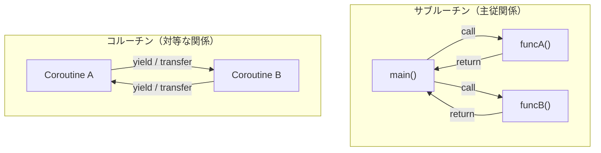
```mermaid
graph TD
    subgraph "サブルーチン（主従関係）"
        M["main()"] -->|call| A["funcA()"]
        A -->|return| M
        M -->|call| B["funcB()"]
        B -->|return| M
    end

    subgraph "コルーチン（対等な関係）"
        C1["Coroutine A"] -->|"yield / transfer"| C2["Coroutine B"]
        C2 -->|"yield / transfer"| C1
    end
```

## 3. スタックフルコルーチン vs スタックレスコルーチン

コルーチンの実装方式は大きく2つに分類される。この分類は性能特性、機能の制約、実装の複雑さに直結するため、非常に重要である。

### 3.1 スタックフルコルーチン（Stackful Coroutines）

スタックフルコルーチンは、各コルーチンが **独自のコールスタック** を持つ。これにより、コルーチンはコールスタックの任意の深さで中断できる。つまり、コルーチン内から呼び出した関数のさらに内部で中断し、再開時にはそのスタック全体を復元できる。

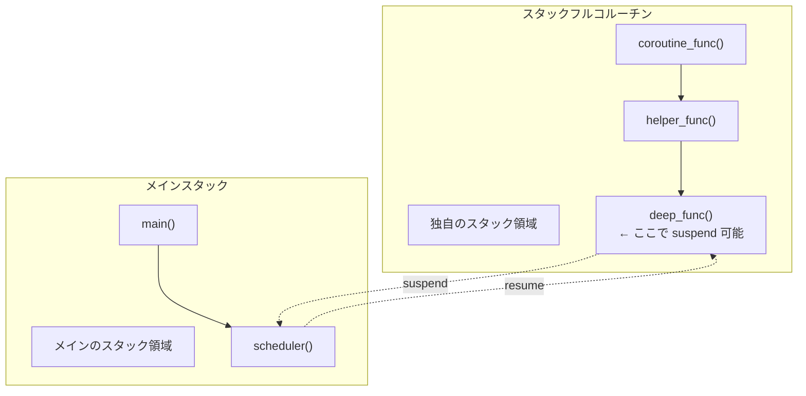
```mermaid
graph TD
    subgraph "スタックフルコルーチン"
        direction TB
        S1["独自のスタック領域"]
        F1["coroutine_func()"] --> F2["helper_func()"] --> F3["deep_func()<br/>← ここで suspend 可能"]
    end

    subgraph "メインスタック"
        direction TB
        S2["メインのスタック領域"]
        M1["main()"] --> M2["scheduler()"]
    end

    F3 -.->|"suspend"| M2
    M2 -.->|"resume"| F3
```

**代表的な実装**：

- **Go goroutine**：最初は4KB（現在は2KB）のスタックから開始し、必要に応じて動的にスタックを拡張するセグメンテッドスタック（後にコピースタック方式に変更）を採用
- **Lua coroutine**：スタックフルなコルーチンを直接言語機能として提供
- **Java Virtual Threads（Project Loom）**：JVM上にスタックフルなバーチャルスレッドを実装

```go
// Go goroutine — stackful coroutine example
func fetchData(url string, ch chan<- string) {
    resp, err := http.Get(url) // suspends here (I/O wait)
    if err != nil {
        ch <- fmt.Sprintf("error: %v", err)
        return
    }
    defer resp.Body.Close()
    body, _ := io.ReadAll(resp.Body)
    ch <- string(body)
}

func main() {
    ch := make(chan string, 3)
    urls := []string{
        "https://api.example.com/a",
        "https://api.example.com/b",
        "https://api.example.com/c",
    }
    for _, url := range urls {
        go fetchData(url, ch) // launch goroutine
    }
    for range urls {
        fmt.Println(<-ch)
    }
}
```

**スタックフルコルーチンの特徴**：

| 項目 | 詳細 |
|------|------|
| 中断の自由度 | コールスタックの任意の深さで中断可能 |
| メモリオーバーヘッド | コルーチンごとに独自のスタック領域が必要（数KB〜数MB） |
| 実装の複雑さ | スタックの切り替え、動的拡張が必要 |
| 既存コードとの互換性 | 既存の同期的な関数をそのまま呼び出せる |

### 3.2 スタックレスコルーチン（Stackless Coroutines）

スタックレスコルーチンは、独自のコールスタックを持たない。代わりに、中断時に保持すべきローカル変数を **ヒープ上のオブジェクト（ステートマシン）** として保存する。中断できるのはコルーチン関数の直接のボディ内のみであり、コルーチンから呼び出した通常の関数の内部で中断することはできない。

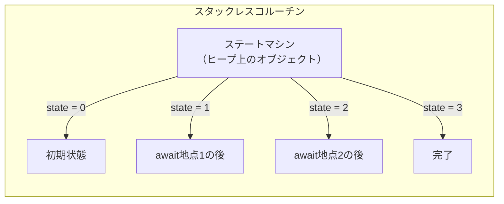
```mermaid
graph TD
    subgraph "スタックレスコルーチン"
        direction TB
        SM["ステートマシン<br/>（ヒープ上のオブジェクト）"]
        SM --> |"state = 0"| S0["初期状態"]
        SM --> |"state = 1"| S1["await地点1の後"]
        SM --> |"state = 2"| S2["await地点2の後"]
        SM --> |"state = 3"| S3["完了"]
    end
```

**代表的な実装**：

- **Python async/await**：コルーチンオブジェクトとしてヒープに格納
- **Rust async/await**：Futureトレイトを実装するステートマシンにコンパイル
- **JavaScript async/await**：Promiseチェーンに変換
- **C# async/await**：AsyncStateMachineにコンパイル
- **C++20 coroutines**：コンパイラがステートマシンを生成
- **Kotlin suspend functions**：Continuation Passing Style（CPS）変換

```python
# Python — stackless coroutine
import asyncio

async def fetch_data(url: str) -> str:
    # Can only suspend at 'await' points
    async with aiohttp.ClientSession() as session:
        async with session.get(url) as response:
            return await response.text()

async def process():
    # Each 'await' is a potential suspension point
    data = await fetch_data("https://api.example.com/data")
    parsed = parse(data)  # regular function — cannot suspend inside
    result = await save_to_db(parsed)
    return result
```

### 3.3 両者の比較

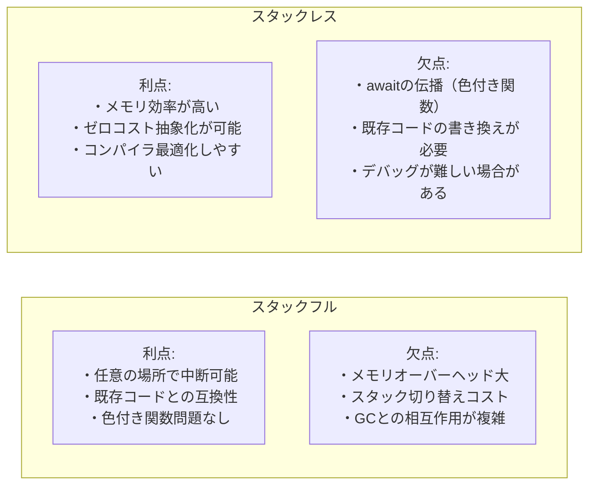
```mermaid
graph LR
    subgraph "スタックフル"
        SF_PRO["利点:<br/>・任意の場所で中断可能<br/>・既存コードとの互換性<br/>・色付き関数問題なし"]
        SF_CON["欠点:<br/>・メモリオーバーヘッド大<br/>・スタック切り替えコスト<br/>・GCとの相互作用が複雑"]
    end

    subgraph "スタックレス"
        SL_PRO["利点:<br/>・メモリ効率が高い<br/>・ゼロコスト抽象化が可能<br/>・コンパイラ最適化しやすい"]
        SL_CON["欠点:<br/>・awaitの伝播（色付き関数）<br/>・既存コードの書き換えが必要<br/>・デバッグが難しい場合がある"]
    end
```

| 特性 | スタックフル | スタックレス |
|------|-------------|-------------|
| コルーチンあたりのメモリ | 2KB〜8MB | 数十〜数百バイト |
| 中断の自由度 | 任意の深さで可能 | awaitキーワードの箇所のみ |
| 生成コストの目安 | 数百ナノ秒 | 数十ナノ秒 |
| 色付き関数問題 | なし | あり |
| 代表的な言語 | Go, Lua, Java (Loom) | Python, Rust, JS, C#, Kotlin |

## 4. ジェネレータからコルーチンへ — Pythonにおける進化

コルーチンの概念がモダンな言語に浸透する過程を最もよく示しているのがPythonの歴史である。Pythonでは、ジェネレータから段階的にコルーチンへと進化する道筋がたどられた。

### 4.1 ジェネレータ — yield（PEP 255, Python 2.2, 2001年）

ジェネレータは「値を逐次生成するイテレータ」として導入された。`yield` 文により関数の実行を中断し、値を呼び出し元に返すことができる。

```python
# Generator — produces values lazily
def fibonacci():
    a, b = 0, 1
    while True:
        yield a        # suspend and produce a value
        a, b = b, a + b

gen = fibonacci()
for _ in range(10):
    print(next(gen))   # resume and get next value
```

この時点でのジェネレータは **単方向** である。値を生成して呼び出し元に渡すことはできるが、呼び出し元からジェネレータに値を送り込むことはできなかった。

### 4.2 拡張ジェネレータ — send / throw（PEP 342, Python 2.5, 2005年）

PEP 342により、ジェネレータは **双方向通信** が可能になった。`send()` メソッドでジェネレータに値を送り込み、`throw()` で例外を投入できるようになった。

```python
# Enhanced generator — bidirectional communication
def accumulator():
    total = 0
    while True:
        value = yield total   # receive value via send(), produce total
        if value is None:
            break
        total += value

acc = accumulator()
next(acc)              # initialize (advance to first yield)
print(acc.send(10))    # send 10, get total=10
print(acc.send(20))    # send 20, get total=30
print(acc.send(5))     # send 5, get total=35
```

この拡張により、ジェネレータは概念的にはコルーチンに近い存在になった。しかし、「ジェネレータの中からジェネレータを呼び出し、値の受け渡しを透過的に行う」ことが困難であるという問題が残っていた。

### 4.3 yield from — サブジェネレータの委譲（PEP 380, Python 3.3, 2012年）

`yield from` 構文は、サブジェネレータへの委譲（delegation）を可能にした。これにより、ジェネレータベースのコルーチンを組み合わせて複雑な非同期フローを構築できるようになった。

```python
# yield from — delegating to a sub-generator
def sub_task():
    result = yield "waiting for data"
    return result * 2

def main_task():
    # Transparently delegates to sub_task
    value = yield from sub_task()
    print(f"Got: {value}")

# Without yield from, manual delegation would be required:
# def main_task_manual():
#     gen = sub_task()
#     result = next(gen)
#     while True:
#         try:
#             sent = yield result
#             result = gen.send(sent)
#         except StopIteration as e:
#             value = e.value
#             break
```

`yield from` は以下のことを自動的に処理する。

- サブジェネレータへの `send()` と `throw()` の転送
- サブジェネレータの `StopIteration` 例外から戻り値を取得
- サブジェネレータの完了後に外側のジェネレータの実行を再開

この `yield from` がasyncioライブラリの基盤となり、`@asyncio.coroutine` デコレータと組み合わせてコルーチンベースの非同期プログラミングが可能になった。

### 4.4 ネイティブコルーチン — async/await（PEP 492, Python 3.5, 2015年）

最終的に、Python 3.5で `async def` と `await` という専用の構文が導入された。これにより、コルーチンはジェネレータとは明確に区別される独立した概念になった。

```python
# Native coroutine — async/await syntax
import asyncio

async def fetch_user(user_id: int) -> dict:
    # await suspends this coroutine until the result is ready
    await asyncio.sleep(0.1)  # simulate network delay
    return {"id": user_id, "name": f"User {user_id}"}

async def fetch_all_users(user_ids: list[int]) -> list[dict]:
    # Run multiple coroutines concurrently
    tasks = [fetch_user(uid) for uid in user_ids]
    return await asyncio.gather(*tasks)

async def main():
    users = await fetch_all_users([1, 2, 3, 4, 5])
    for user in users:
        print(user)

asyncio.run(main())
```

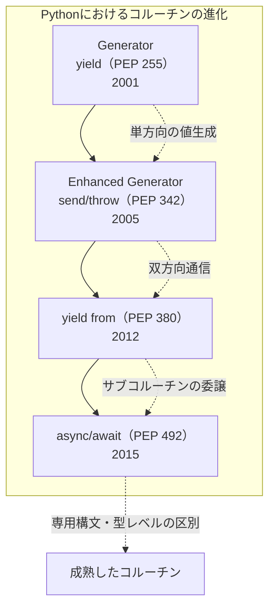
```mermaid
graph TD
    subgraph "Pythonにおけるコルーチンの進化"
        G1["Generator<br/>yield（PEP 255）<br/>2001"] --> G2["Enhanced Generator<br/>send/throw（PEP 342）<br/>2005"]
        G2 --> G3["yield from（PEP 380）<br/>2012"]
        G3 --> G4["async/await（PEP 492）<br/>2015"]
    end

    G1 -.->|"単方向の値生成"| G2
    G2 -.->|"双方向通信"| G3
    G3 -.->|"サブコルーチンの委譲"| G4
    G4 -.->|"専用構文・型レベルの区別"| DONE["成熟したコルーチン"]
```

## 5. async/awaitの意味論

### 5.1 Future / Promise — 未来の値の表現

async/awaitを理解するうえで、**Future**（または **Promise**）の概念が不可欠である。Futureとは、「現時点ではまだ利用できないが、将来のある時点で利用可能になる値」を表現するオブジェクトである。

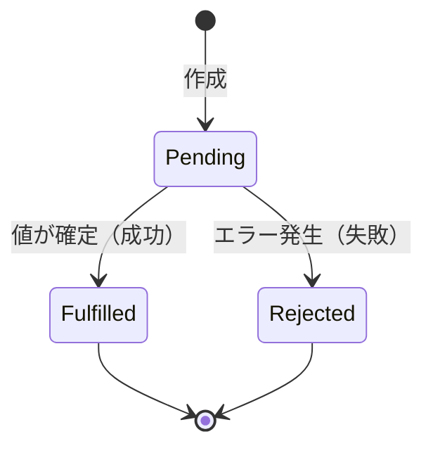
```mermaid
stateDiagram-v2
    [*] --> Pending : 作成
    Pending --> Fulfilled : 値が確定（成功）
    Pending --> Rejected : エラー発生（失敗）
    Fulfilled --> [*]
    Rejected --> [*]
```

各言語では異なる名前で呼ばれるが、本質的には同じ概念である。

| 言語 | 名称 | 説明 |
|------|------|------|
| JavaScript | `Promise` | resolve/rejectのコールバックで状態遷移 |
| Python | `Future` / `Coroutine` | asyncio.Futureまたはコルーチンオブジェクト |
| Rust | `Future` trait | `poll()` メソッドで進捗を確認 |
| Kotlin | `Deferred` | `await()` メソッドで結果を取得 |
| C# | `Task<T>` | ステートマシンにラップされた非同期結果 |
| Java | `CompletableFuture<T>` | Project Loomではバーチャルスレッドが代替 |

### 5.2 ステートマシン変換

async/await構文の最も重要な実装メカニズムは、コンパイラ（またはインタプリタ）による **ステートマシン変換** である。`async` 関数は、`await` の各地点を境界として複数の状態に分割され、ステートマシンとして再構成される。

以下のasync関数を考えてみよう。

```rust
// Original async function (Rust)
async fn process_request(req: Request) -> Response {
    let user = fetch_user(req.user_id).await;     // await point 1
    let permissions = check_permissions(user).await; // await point 2
    let data = load_data(permissions).await;        // await point 3
    build_response(data)
}
```

コンパイラはこれを概念的に以下のようなステートマシンに変換する。

```rust
// Conceptual state machine transformation (simplified)
enum ProcessRequestState {
    Start { req: Request },
    WaitingForUser { future: FetchUserFuture, req: Request },
    WaitingForPermissions { future: CheckPermsFuture, user: User },
    WaitingForData { future: LoadDataFuture, permissions: Permissions },
    Complete,
}

impl Future for ProcessRequestStateMachine {
    type Output = Response;

    fn poll(self: Pin<&mut Self>, cx: &mut Context<'_>) -> Poll<Response> {
        loop {
            match self.state {
                Start { req } => {
                    let future = fetch_user(req.user_id);
                    self.state = WaitingForUser { future, req };
                }
                WaitingForUser { future, .. } => {
                    match future.poll(cx) {
                        Poll::Pending => return Poll::Pending,
                        Poll::Ready(user) => {
                            let future = check_permissions(user);
                            self.state = WaitingForPermissions { future, user };
                        }
                    }
                }
                // ... similar for other states
                _ => unreachable!(),
            }
        }
    }
}
```

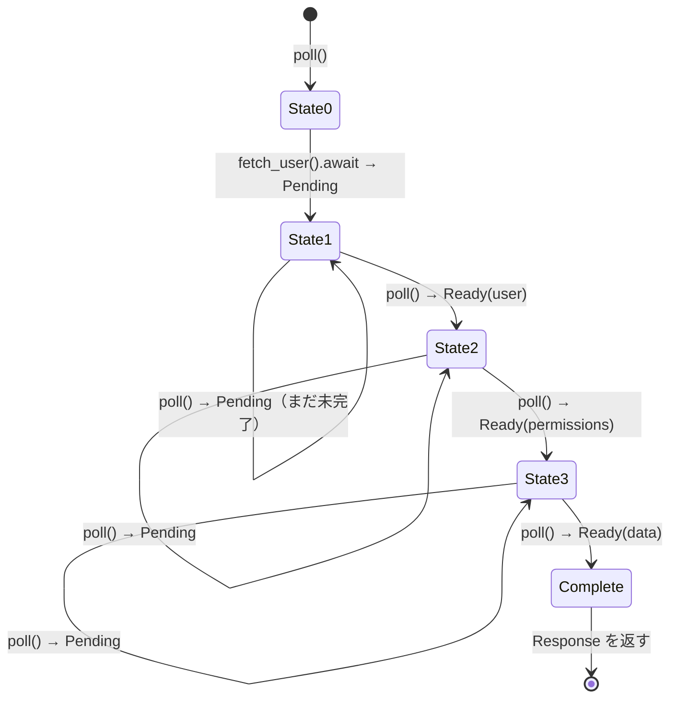
```mermaid
stateDiagram-v2
    [*] --> State0 : poll()
    State0 --> State1 : fetch_user().await → Pending
    State1 --> State1 : poll() → Pending（まだ未完了）
    State1 --> State2 : poll() → Ready(user)
    State2 --> State2 : poll() → Pending
    State2 --> State3 : poll() → Ready(permissions)
    State3 --> State3 : poll() → Pending
    State3 --> Complete : poll() → Ready(data)
    Complete --> [*] : Response を返す
```

この変換の利点は以下の通りである。

1. **ゼロコスト抽象化**：ステートマシンのサイズはコンパイル時に決定でき、各状態で必要なローカル変数だけを保持する。ヒープアロケーションを最小限に抑えられる（Rustの場合）
2. **明示的な中断地点**：`await` の箇所でのみ中断が発生するため、データ競合の発生箇所を推論しやすい
3. **コンパイラ最適化の機会**：ステートマシンの各遷移はコンパイラが完全に把握しているため、インライン化や定数畳み込みなどの最適化を適用できる

### 5.3 awaitの実行モデル

`await` 式が評価されるとき、内部では以下のような処理が行われる。

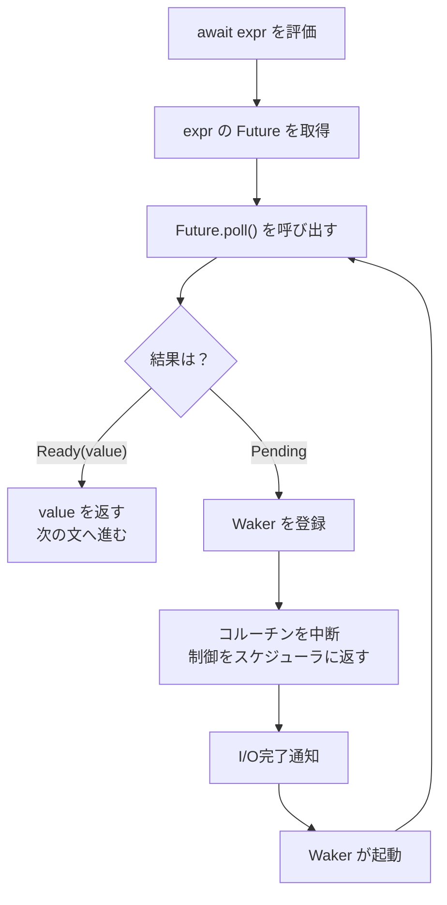
```mermaid
flowchart TD
    A["await expr を評価"] --> B["expr の Future を取得"]
    B --> C["Future.poll() を呼び出す"]
    C --> D{結果は？}
    D -->|"Ready(value)"| E["value を返す<br/>次の文へ進む"]
    D -->|"Pending"| F["Waker を登録"]
    F --> G["コルーチンを中断<br/>制御をスケジューラに返す"]
    G --> H["I/O完了通知"]
    H --> I["Waker が起動"]
    I --> C
```

## 6. イベントループとスケジューラ

コルーチンが中断と再開を繰り返すためには、「いつ・どのコルーチンを再開するか」を決定する **スケジューラ** が必要である。非同期プログラミングにおけるスケジューラの中心的な存在が **イベントループ** である。

### 6.1 イベントループの基本構造

イベントループの基本的な動作は以下の通りである。

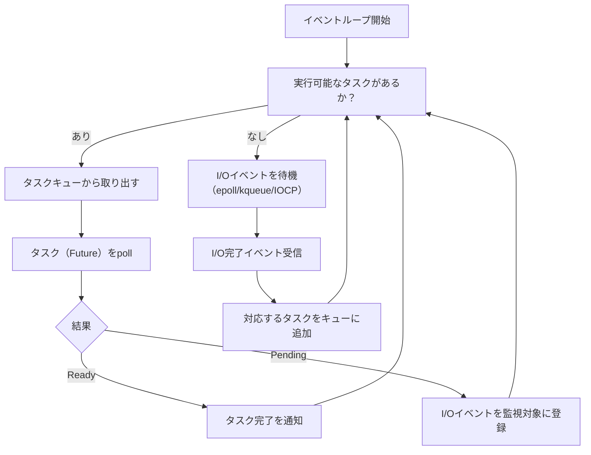
```mermaid
flowchart TD
    START["イベントループ開始"] --> CHECK["実行可能なタスクがあるか？"]
    CHECK -->|"あり"| DEQUEUE["タスクキューから取り出す"]
    DEQUEUE --> POLL["タスク（Future）をpoll"]
    POLL --> RESULT{結果}
    RESULT -->|"Ready"| COMPLETE["タスク完了を通知"]
    RESULT -->|"Pending"| REGISTER["I/Oイベントを監視対象に登録"]
    COMPLETE --> CHECK
    REGISTER --> CHECK
    CHECK -->|"なし"| WAIT["I/Oイベントを待機<br/>（epoll/kqueue/IOCP）"]
    WAIT --> WAKEUP["I/O完了イベント受信"]
    WAKEUP --> ENQUEUE["対応するタスクをキューに追加"]
    ENQUEUE --> CHECK
```

この構造は、OSカーネルが提供するI/O多重化メカニズム（Linux の `epoll`、macOS の `kqueue`、Windows の IOCP）の上に構築される。

### 6.2 シングルスレッドとマルチスレッドのイベントループ

イベントループの設計には大きく2つのアプローチがある。

**シングルスレッドイベントループ（Python asyncio, Node.js）**：

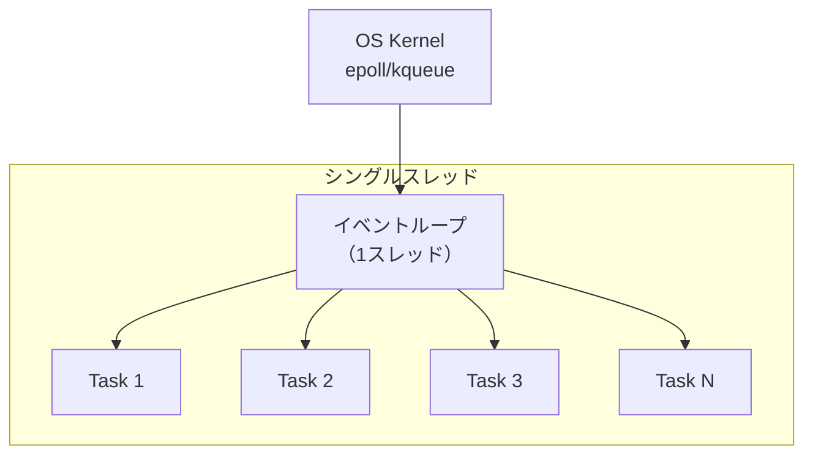
```mermaid
graph TD
    subgraph "シングルスレッド"
        EL["イベントループ<br/>（1スレッド）"]
        EL --> T1["Task 1"]
        EL --> T2["Task 2"]
        EL --> T3["Task 3"]
        EL --> T4["Task N"]
    end
    OS["OS Kernel<br/>epoll/kqueue"] --> EL
```

- 実装がシンプルでデータ競合が発生しない
- CPU集約的な処理がイベントループをブロックする危険性がある
- マルチコアCPUを活用するには追加の工夫が必要

**マルチスレッドイベントループ（Rust tokio, Go runtime）**：

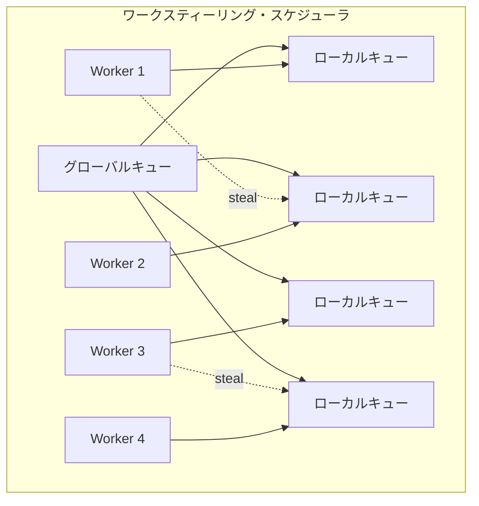
```mermaid
graph TD
    subgraph "ワークスティーリング・スケジューラ"
        W1["Worker 1"] --> Q1["ローカルキュー"]
        W2["Worker 2"] --> Q2["ローカルキュー"]
        W3["Worker 3"] --> Q3["ローカルキュー"]
        W4["Worker 4"] --> Q4["ローカルキュー"]
        GQ["グローバルキュー"]
    end

    W1 -.->|"steal"| Q2
    W3 -.->|"steal"| Q4
    GQ --> Q1
    GQ --> Q2
    GQ --> Q3
    GQ --> Q4
```

- マルチコアCPUを効率的に活用できる
- ワークスティーリングにより負荷の偏りを自動的に解消
- タスク間のデータ共有にはSend/Syncなどの安全性保証が必要

### 6.3 協調的マルチタスクと先取りマルチタスク

コルーチンベースの非同期モデルは **協調的マルチタスク（cooperative multitasking）** に分類される。各タスクが自発的に制御を手放す（`await` で中断する）ことで、他のタスクの実行機会が生まれる。

一方、OSのスレッドスケジューラは **先取りマルチタスク（preemptive multitasking）** であり、タイマー割り込みにより強制的にコンテキストスイッチが行われる。

| 特性 | 協調的マルチタスク | 先取りマルチタスク |
|------|-------------------|-------------------|
| 切り替えの契機 | タスクが自発的に制御を返す | OS/ランタイムが強制的に切り替える |
| データ競合の可能性 | await間では発生しない | いつでも発生し得る |
| 応答性の保証 | タスクがyieldしなければ他が動けない | タイムスライスで保証 |
| オーバーヘッド | 低い（ユーザー空間での切り替え） | 比較的高い（カーネルモードの遷移） |
| 代表例 | async/await, コルーチン | OSスレッド |

::: warning 協調的マルチタスクの落とし穴
協調的マルチタスクでは、1つのタスクがCPU集約的な処理を長時間行うと、他のすべてのタスクがブロックされる。例えばPythonのasyncioで `time.sleep(10)` （同期的なスリープ）を呼ぶと、イベントループ全体が10秒間停止する。必ず `await asyncio.sleep(10)` のように非同期版を使わなければならない。
:::

## 7. 各言語の実装比較

### 7.1 Python — asyncio

Python の async/await は **スタックレスコルーチン** として実装されている。シングルスレッドのイベントループ（asyncio）の上でコルーチンがスケジューリングされる。

```python
# Python asyncio — single-threaded event loop with stackless coroutines
import asyncio
import aiohttp

async def fetch(session: aiohttp.ClientSession, url: str) -> str:
    async with session.get(url) as response:
        return await response.text()

async def main():
    async with aiohttp.ClientSession() as session:
        # Concurrent execution of multiple coroutines
        results = await asyncio.gather(
            fetch(session, "https://api.example.com/a"),
            fetch(session, "https://api.example.com/b"),
            fetch(session, "https://api.example.com/c"),
        )
        for r in results:
            print(len(r))

asyncio.run(main)
```

**特徴**：
- GIL（Global Interpreter Lock）の存在により、CPUバウンドな並列処理には不向き
- `asyncio.to_thread()` で同期的なブロッキングAPIをスレッドプールに委譲可能
- uvloopを使うことでイベントループの性能を大幅に向上できる

### 7.2 Rust — async/await と tokio

Rustのasync/awaitは **ゼロコスト抽象化** を実現するスタックレスコルーチンである。`async fn` はコンパイル時に `Future` トレイトを実装するステートマシンに変換され、ランタイムのオーバーヘッドがほぼゼロになる。

```rust
// Rust async/await — zero-cost stackless coroutines
use tokio;
use reqwest;

#[tokio::main]
async fn main() -> Result<(), Box<dyn std::error::Error>> {
    // Spawn multiple concurrent tasks
    let handles: Vec<_> = vec![
        "https://api.example.com/a",
        "https://api.example.com/b",
        "https://api.example.com/c",
    ]
    .into_iter()
    .map(|url| {
        tokio::spawn(async move {
            let body = reqwest::get(url).await?.text().await?;
            Ok::<_, reqwest::Error>(body)
        })
    })
    .collect();

    for handle in handles {
        let result = handle.await??;
        println!("Got {} bytes", result.len());
    }

    Ok(())
}
```

**Rustのasync/awaitの特筆すべき点**：

- **ランタイムが言語に組み込まれていない**：tokio, async-std, smolなど複数のランタイムから選択できる
- **ステートマシンのサイズがコンパイル時に決定**：ヒープアロケーションを最小限に抑えられる
- **Pin/Unpin**：自己参照構造体の安全性を型レベルで保証する仕組み
- **Send/Sync境界**：マルチスレッドランタイムで安全にタスクを移動できるかを型システムが検証する

### 7.3 Kotlin — コルーチンとstructured concurrency

Kotlinのコルーチンは **ライブラリレベル** で実装されており、コンパイラがsuspend関数をCPS（Continuation Passing Style）に変換する。言語レベルでは `suspend` キーワードのみが追加され、`async/await`のような専用構文はない。

```kotlin
// Kotlin coroutines — structured concurrency
import kotlinx.coroutines.*

suspend fun fetchUser(id: Int): User {
    delay(100) // non-blocking sleep (suspension point)
    return User(id, "User $id")
}

fun main() = runBlocking {
    // CoroutineScope provides structured concurrency
    coroutineScope {
        val users = (1..5).map { id ->
            async { fetchUser(id) } // launch concurrent coroutine
        }
        users.awaitAll().forEach { println(it) }
    }
    // All child coroutines are guaranteed to complete here
}
```

**Kotlinの特徴**：

- `CoroutineScope` による構造化並行性が言語設計の中核
- `suspend` 関数はCPS変換により `Continuation` パラメータが追加される
- ディスパッチャ（`Dispatchers.IO`, `Dispatchers.Default`）でスレッドプールを制御
- キャンセレーション伝播が自動的に行われる

### 7.4 Go — goroutine

Go の goroutine は **スタックフルコルーチン** の一種であり、Goランタイムのスケジューラによって管理される。goroutine は言語レベルで先取りスケジューリングをサポートしており（Go 1.14以降、非同期先取り）、純粋な協調的マルチタスクとは異なる独自の位置づけにある。

```go
// Go goroutines — stackful coroutines with M:N scheduling
package main

import (
    "fmt"
    "io"
    "net/http"
    "sync"
)

func fetchURL(url string, wg *sync.WaitGroup, results chan<- string) {
    defer wg.Done()
    resp, err := http.Get(url)
    if err != nil {
        results <- fmt.Sprintf("error: %v", err)
        return
    }
    defer resp.Body.Close()
    body, _ := io.ReadAll(resp.Body)
    results <- fmt.Sprintf("%s: %d bytes", url, len(body))
}

func main() {
    urls := []string{
        "https://example.com/a",
        "https://example.com/b",
        "https://example.com/c",
    }
    var wg sync.WaitGroup
    results := make(chan string, len(urls))

    for _, url := range urls {
        wg.Add(1)
        go fetchURL(url, &wg, results)
    }

    go func() {
        wg.Wait()
        close(results)
    }()

    for r := range results {
        fmt.Println(r)
    }
}
```

**GoのM:Nスケジューリング**：

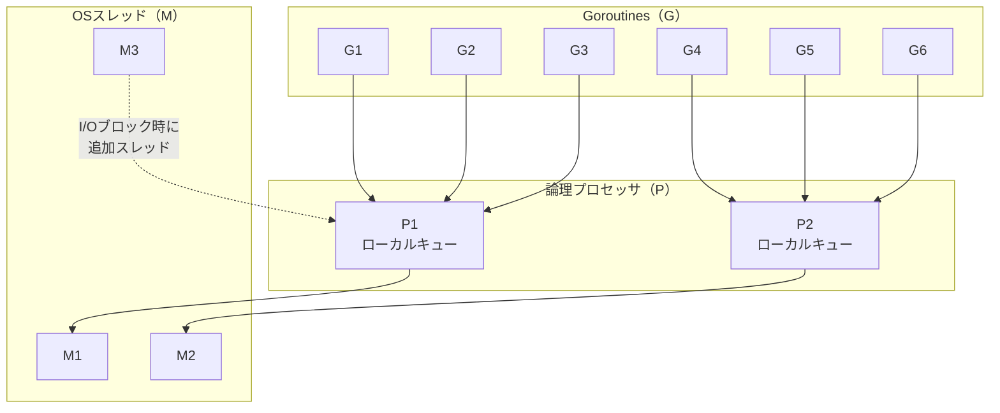
```mermaid
graph TD
    subgraph "Goroutines（G）"
        G1["G1"]
        G2["G2"]
        G3["G3"]
        G4["G4"]
        G5["G5"]
        G6["G6"]
    end

    subgraph "論理プロセッサ（P）"
        P1["P1<br/>ローカルキュー"]
        P2["P2<br/>ローカルキュー"]
    end

    subgraph "OSスレッド（M）"
        M1["M1"]
        M2["M2"]
        M3["M3"]
    end

    G1 --> P1
    G2 --> P1
    G3 --> P1
    G4 --> P2
    G5 --> P2
    G6 --> P2

    P1 --> M1
    P2 --> M2
    M3 -.->|"I/Oブロック時に<br/>追加スレッド"| P1
```

GoのGMPモデル（Goroutine, Machine, Processor）では、N個のgoroutineをM個のOSスレッド上にスケジューリングする。各論理プロセッサ（P）はローカルのrunキューを持ち、ワークスティーリングにより負荷を分散する。

### 7.5 JavaScript — async/await

JavaScriptのasync/awaitは **Promise** の上に構築されたシンタックスシュガーである。JavaScriptのランタイム環境（ブラウザやNode.js）が提供するイベントループ上で動作する。

```javascript
// JavaScript async/await — built on top of Promises
async function fetchData(url) {
  const response = await fetch(url);
  if (!response.ok) {
    throw new Error(`HTTP error: ${response.status}`);
  }
  return response.json();
}

async function processAll() {
  // Concurrent execution with Promise.all
  const [users, posts, comments] = await Promise.all([
    fetchData('/api/users'),
    fetchData('/api/posts'),
    fetchData('/api/comments'),
  ]);

  return { users, posts, comments };
}

// Error handling with try/catch works naturally
async function main() {
  try {
    const data = await processAll();
    console.log(`Loaded ${data.users.length} users`);
  } catch (err) {
    console.error('Failed to load data:', err);
  }
}
```

**JavaScriptの特徴**：

- シングルスレッドのイベントループが前提（Web Workers を除く）
- マイクロタスクキュー（Promiseのコールバック）とマクロタスクキュー（setTimeout等）の優先度の違い
- `for await...of` による非同期イテレーション
- `AbortController` によるキャンセレーション

### 7.6 各言語の比較表

| 特性 | Python | Rust | Kotlin | Go | JavaScript |
|------|--------|------|--------|----|------------|
| コルーチン方式 | スタックレス | スタックレス | スタックレス (CPS) | スタックフル | スタックレス |
| ランタイム | asyncio | tokio等 (選択式) | kotlinx.coroutines | Go runtime (組込) | エンジン組込 |
| スレッドモデル | シングル+スレッドプール | マルチスレッド | マルチスレッド | M:N スケジューリング | シングルスレッド |
| 色付き関数問題 | あり | あり | あり（suspend） | なし | あり |
| キャンセレーション | TaskGroup | tokio::select! | CoroutineScope | context.Context | AbortController |
| 構造化並行性 | TaskGroup (3.11+) | 部分的 | CoroutineScope | なし（明示的管理） | 部分的 |

## 8. 構造化並行性（Structured Concurrency）

### 8.1 非構造化並行性の問題

従来の並行プログラミングでは、タスクの起動と完了の関係が構造化されていなかった。これは「構造化プログラミング」以前の `goto` 文の濫用に類似する問題を引き起こす。

```python
# Unstructured concurrency — "fire and forget" tasks
async def problematic():
    # Who owns this task? When does it complete?
    # What happens if this function throws before the task finishes?
    task = asyncio.create_task(background_work())

    result = await some_operation()

    # If some_operation() raises, background_work() is orphaned
    return result
```

非構造化並行性の問題点は以下の通りである。

- **タスクのライフタイムが不明確**：どのタスクがいつ完了するのかを追跡するのが困難
- **エラーの伝播漏れ**：バックグラウンドタスクで発生した例外が見落とされる
- **リソースリーク**：親タスクが終了しても子タスクが残留する
- **キャンセレーションの困難**：関連するすべてのタスクを確実にキャンセルする手段がない

### 8.2 構造化並行性の原則

**構造化並行性（Structured Concurrency）** は、Nathaniel J. Smith が2018年のブログ記事 *"Notes on structured concurrency, or: Go statement considered harmful"* で体系化した概念である。その核心は以下の原則にある。

> 並行タスクのライフタイムは、それを起動したコードブロックのスコープに束縛されなければならない。

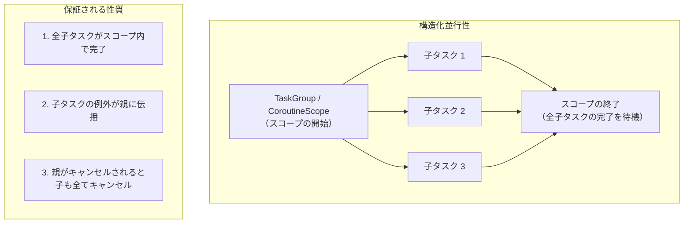
```mermaid
graph TD
    subgraph "構造化並行性"
        SCOPE["TaskGroup / CoroutineScope<br/>（スコープの開始）"]
        SCOPE --> C1["子タスク 1"]
        SCOPE --> C2["子タスク 2"]
        SCOPE --> C3["子タスク 3"]
        C1 --> JOIN["スコープの終了<br/>（全子タスクの完了を待機）"]
        C2 --> JOIN
        C3 --> JOIN
    end

    subgraph "保証される性質"
        P1["1. 全子タスクがスコープ内で完了"]
        P2["2. 子タスクの例外が親に伝播"]
        P3["3. 親がキャンセルされると子も全てキャンセル"]
    end
```

### 8.3 各言語での実現

**Python（3.11+の TaskGroup）**：

```python
# Python structured concurrency with TaskGroup
async def process_batch(items: list[str]) -> list[Result]:
    results = []
    async with asyncio.TaskGroup() as tg:
        for item in items:
            tg.create_task(process_item(item))
    # All tasks are guaranteed to have completed (or raised) here
    # If any task raises, all other tasks are cancelled
    return results
```

**Kotlin の CoroutineScope**：

```kotlin
// Kotlin structured concurrency with coroutineScope
suspend fun processAll(ids: List<Int>): List<Result> = coroutineScope {
    // All async tasks are children of this scope
    ids.map { id ->
        async { processItem(id) }
    }.awaitAll()
    // If any child fails, all siblings are cancelled
    // The scope only completes when ALL children complete
}
```

**Java の StructuredTaskScope（Project Loom, JDK 21+）**：

```java
// Java structured concurrency with StructuredTaskScope
Response handle(Request request) throws Exception {
    try (var scope = new StructuredTaskScope.ShutdownOnFailure()) {
        Subtask<User> user = scope.fork(() -> fetchUser(request.userId()));
        Subtask<Perms> perms = scope.fork(() -> fetchPermissions(request.userId()));

        scope.join();           // wait for all subtasks
        scope.throwIfFailed();  // propagate errors

        return new Response(user.get(), perms.get());
    }
    // All subtasks are guaranteed to complete within try block
}
```

## 9. キャンセレーションとタイムアウト

非同期プログラミングにおいて、タスクのキャンセレーションは実装が最も難しい問題の1つである。I/O操作の途中でキャンセルが要求された場合、リソースの整合性を保ちながら安全に処理を中断しなければならない。

### 9.1 キャンセレーションのアプローチ

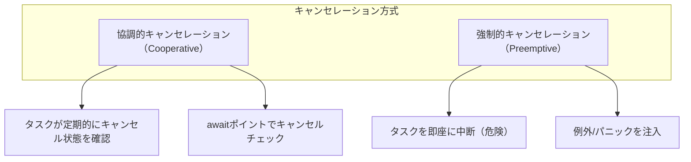
```mermaid
graph TD
    subgraph "キャンセレーション方式"
        A["協調的キャンセレーション<br/>（Cooperative）"]
        B["強制的キャンセレーション<br/>（Preemptive）"]
    end

    A --> A1["タスクが定期的にキャンセル状態を確認"]
    A --> A2["awaitポイントでキャンセルチェック"]

    B --> B1["タスクを即座に中断（危険）"]
    B --> B2["例外/パニックを注入"]
```

ほとんどのasync/awaitフレームワークは **協調的キャンセレーション** を採用している。各 `await` ポイントがキャンセレーションのチェックポイントとなり、キャンセルが要求されると次の `await` でタスクが終了する。

### 9.2 各言語でのキャンセレーション実装

**Python**：

```python
# Python — cancellation with asyncio
async def long_running_task():
    try:
        while True:
            data = await fetch_next_batch()
            await process(data)
    except asyncio.CancelledError:
        # Cleanup on cancellation
        await cleanup_resources()
        raise  # re-raise to propagate cancellation

async def with_timeout():
    try:
        # Automatically cancels after 5 seconds
        result = await asyncio.wait_for(long_running_task(), timeout=5.0)
    except asyncio.TimeoutError:
        print("Operation timed out")
```

**Rust**：

```rust
// Rust — cancellation by dropping the Future
use tokio::time::{timeout, Duration};

async fn long_running_task() -> Result<Data, Error> {
    loop {
        let batch = fetch_next_batch().await?;
        process(batch).await?;
    }
}

async fn with_timeout() -> Result<Data, Error> {
    // When timeout expires, the future is dropped (cancelled)
    match timeout(Duration::from_secs(5), long_running_task()).await {
        Ok(result) => result,
        Err(_) => Err(Error::Timeout),
    }
}
```

Rustのキャンセレーションは独特であり、Futureをドロップ（所有権の放棄）することで暗黙的にキャンセルが行われる。これはリソースの安全な解放をRAIIパターンで保証するRustのメモリモデルと自然に統合される。

**Go**：

```go
// Go — cancellation with context.Context
func longRunningTask(ctx context.Context) error {
    for {
        select {
        case <-ctx.Done():
            // Cancellation or timeout
            return ctx.Err()
        default:
            batch, err := fetchNextBatch(ctx)
            if err != nil {
                return err
            }
            if err := process(ctx, batch); err != nil {
                return err
            }
        }
    }
}

func withTimeout() error {
    ctx, cancel := context.WithTimeout(context.Background(), 5*time.Second)
    defer cancel() // always call cancel to release resources
    return longRunningTask(ctx)
}
```

### 9.3 キャンセレーション安全性

キャンセレーション安全性（cancellation safety）は、タスクがキャンセルされた際にデータが失われたり不整合が生じたりしないことを保証する性質である。

```rust
// Rust — cancellation safety issue example
async fn unsafe_transfer(from: &mut Account, to: &mut Account, amount: u64) {
    from.balance -= amount;  // debit executed
    save(from).await;        // <-- if cancelled here, credit is lost!
    to.balance += amount;    // credit NOT executed
    save(to).await;
}

// Cancellation-safe version
async fn safe_transfer(from: &mut Account, to: &mut Account, amount: u64) {
    // Prepare changes atomically before any await point
    let debit = from.balance - amount;
    let credit = to.balance + amount;

    // Apply via a single atomic operation
    apply_transfer(from.id, to.id, debit, credit).await;
}
```

::: danger キャンセレーション安全性の重要性
`tokio::select!` や `asyncio.wait_for()` のようなタイムアウト付き操作は、内部のFutureを任意の `await` 地点でキャンセルする可能性がある。部分的に完了した状態でのキャンセルがデータ不整合を引き起こさないよう、各 `await` 地点でキャンセルされても安全であることを保証する設計が必要である。
:::

## 10. 色付き関数問題（What Color is Your Function?）

### 10.1 問題の提起

2015年、Bob Nystromが *"What Color is Your Function?"* というブログ記事で提起した問題は、async/await設計の本質的な限界を鮮やかに浮き彫りにした。

この議論は以下のように要約される。すべての関数に「色」があると想像してほしい。**赤い関数**（非同期関数）と **青い関数**（同期関数）である。

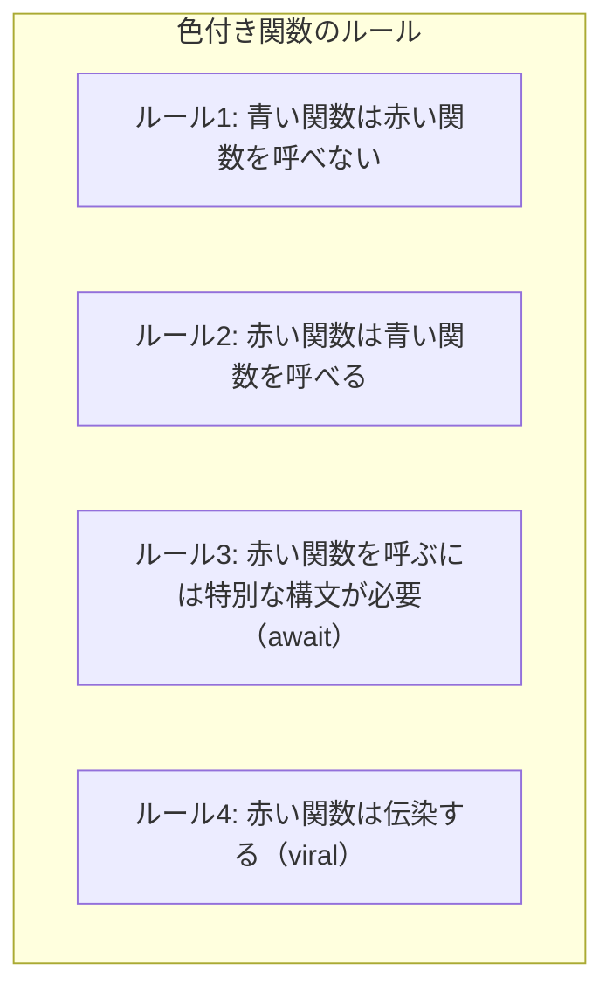
```mermaid
graph TD
    subgraph "色付き関数のルール"
        R1["ルール1: 青い関数は赤い関数を呼べない"]
        R2["ルール2: 赤い関数は青い関数を呼べる"]
        R3["ルール3: 赤い関数を呼ぶには特別な構文が必要（await）"]
        R4["ルール4: 赤い関数は伝染する（viral）"]
    end
```

### 10.2 実際のコードでの問題

```python
# The function coloring problem in Python

# "Blue" function — synchronous
def get_user_sync(user_id: int) -> User:
    return db.query(f"SELECT * FROM users WHERE id = {user_id}")

# "Red" function — asynchronous
async def get_user_async(user_id: int) -> User:
    return await db.query_async(f"SELECT * FROM users WHERE id = {user_id}")

# Blue function CANNOT call red function
def process_sync():
    user = get_user_sync(1)      # OK
    # user = await get_user_async(1)  # ERROR! Cannot use await in sync function

# Red function CAN call both
async def process_async():
    user1 = get_user_sync(1)           # OK
    user2 = await get_user_async(2)    # OK
```

この「色」の伝播は以下のような実際的な問題を引き起こす。

1. **ライブラリのエコシステムの分裂**：同期版と非同期版のライブラリが別々に必要になる（例：`requests` vs `aiohttp`、`psycopg2` vs `asyncpg`）
2. **コードの重複**：同じロジックを同期版と非同期版の両方で書かなければならないケースがある
3. **リファクタリングの困難**：既存の同期コードベースに非同期処理を導入する際、呼び出しチェーン全体の書き換えが必要になる
4. **トレイト/インターフェースの互換性の問題**：同期的なインターフェースを非同期関数で実装できない

### 10.3 色付き関数問題への対処法

各言語はこの問題に異なるアプローチで対処している。

**Go — 色のない関数**：

Goはスタックフルコルーチン（goroutine）を採用することで、この問題を根本的に回避している。すべての関数は同じ「色」であり、I/O操作は暗黙的にgoroutineを中断する。

```go
// Go — no function coloring
func getUser(userID int) (User, error) {
    // This may suspend the goroutine internally,
    // but the function signature looks synchronous
    return db.Query("SELECT * FROM users WHERE id = ?", userID)
}

// No special syntax needed — all functions are the "same color"
func processUsers(ids []int) ([]User, error) {
    var users []User
    for _, id := range ids {
        user, err := getUser(id) // just a normal function call
        if err != nil {
            return nil, err
        }
        users = append(users, user)
    }
    return users, nil
}
```

**Rust — 色の分離を型安全性として活用**：

Rustコミュニティの一部は、関数の色分けをむしろ **利点** として捉えている。非同期関数が型レベルで区別されることで、どこで中断が起こりうるかが明示的になり、データ競合の推論が容易になるという立場である。

**Java Project Loom — バーチャルスレッドによる解決**：

Java 21以降のバーチャルスレッドは、Goと同様にスタックフルなアプローチで色付き関数問題を回避している。

```java
// Java virtual threads — no function coloring
// Existing blocking code works as-is on virtual threads
User getUser(int userId) throws SQLException {
    // Blocking call — but on a virtual thread, it suspends efficiently
    return jdbc.query("SELECT * FROM users WHERE id = ?", userId);
}

void main() {
    try (var executor = Executors.newVirtualThreadPerTaskExecutor()) {
        var futures = userIds.stream()
            .map(id -> executor.submit(() -> getUser(id)))
            .toList();
        // ...
    }
}
```

### 10.4 問題の本質

色付き関数問題の根底にあるのは、以下のトレードオフである。

- **明示性 vs 透過性**：非同期操作が構文的に明示されること（`await`）は、コードの理解とデバッグを助ける。一方で、それが関数シグネチャを通じて伝播する「viral」な性質は、大規模なコードベースでの柔軟性を損なう
- **コンパイル時の保証 vs ランタイムの柔軟性**：スタックレスコルーチンはコンパイル時により多くの情報を持つが、それが制約にもなる。スタックフルコルーチンはランタイムの柔軟性と引き換えに、中断地点の明示性を失う

この問題に「正解」はなく、言語の設計哲学とユースケースに応じた判断が求められる。

## 11. パフォーマンス特性とスレッドとの比較

### 11.1 コルーチン vs OSスレッドのリソース消費

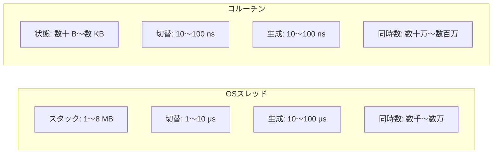
```mermaid
graph LR
    subgraph "OSスレッド"
        OT_STACK["スタック: 1〜8 MB"]
        OT_SWITCH["切替: 1〜10 μs"]
        OT_CREATE["生成: 10〜100 μs"]
        OT_MAX["同時数: 数千〜数万"]
    end

    subgraph "コルーチン"
        CO_STACK["状態: 数十 B〜数 KB"]
        CO_SWITCH["切替: 10〜100 ns"]
        CO_CREATE["生成: 10〜100 ns"]
        CO_MAX["同時数: 数十万〜数百万"]
    end
```

| メトリクス | OSスレッド | goroutine | Rust Future | Python coroutine |
|-----------|-----------|-----------|-------------|-----------------|
| 初期メモリ | 1〜8 MB | 2 KB (初期) | 数十〜数百バイト | ~1 KB |
| コンテキストスイッチ | 1〜10 us | ~200 ns | ~10 ns | ~100 ns |
| 生成コスト | 10〜100 us | ~300 ns | ~10 ns | ~50 ns |
| 同時実行可能数 | ~10,000 | ~1,000,000 | ~10,000,000 | ~100,000 |

::: tip なぜコルーチンはこれほど軽量なのか
OSスレッドはカーネルオブジェクト（task_struct、スタック領域、ページテーブルエントリなど）を必要とし、コンテキストスイッチではレジスタの退避/復元、TLBのフラッシュ、カーネルモードへの遷移が発生する。一方、コルーチンの切り替えはユーザー空間で完結し、必要最小限の状態（ステートマシンの現在状態とローカル変数）のみを保持すればよい。
:::

### 11.2 ベンチマーク: 同時接続数とスループット

Webサーバーのシナリオでは、コルーチンベースのアーキテクチャは特にI/Oバウンドなワークロードで劇的な改善をもたらす。

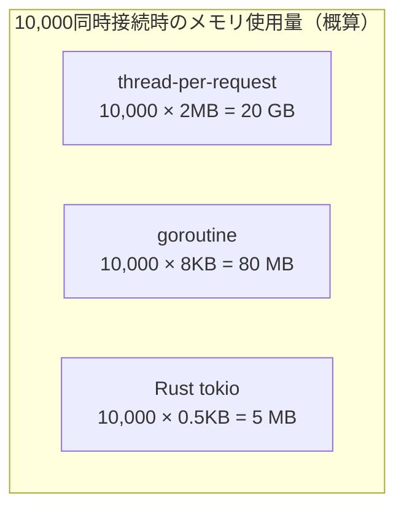
```mermaid
graph TD
    subgraph "10,000同時接続時のメモリ使用量（概算）"
        TH["thread-per-request<br/>10,000 × 2MB = 20 GB"]
        GO["goroutine<br/>10,000 × 8KB = 80 MB"]
        RS["Rust tokio<br/>10,000 × 0.5KB = 5 MB"]
    end
```

ただし、CPU集約的なワークロードではコルーチンの利点は限定的である。コルーチン自体は並列実行を提供するものではなく、あくまで並行性（concurrency）の仕組みである。CPU集約的な処理の並列化には、スレッドプールやプロセスプールとの組み合わせが必要になる。

### 11.3 いつコルーチンを使うべきか、スレッドを使うべきか

| シナリオ | 推奨 | 理由 |
|---------|------|------|
| 大量の同時接続を処理するWebサーバー | コルーチン | I/O待ちが主体であり、メモリ効率が重要 |
| CPU集約的な並列計算 | OSスレッド（またはプロセス） | 実際に複数コアで同時に計算を実行する必要がある |
| データベースクエリの並行実行 | コルーチン | I/O待ちの間に他のクエリを発行できる |
| GUIアプリケーション | コルーチン + メインスレッド | UIスレッドをブロックせずに非同期処理を実行 |
| CPU + I/O の混合ワークロード | コルーチン + スレッドプール | I/O部分はコルーチン、CPU部分はスレッドに委譲 |

## 12. まとめ — コルーチンの本質

コルーチンとasync/awaitは、「I/O待ちの間にCPUを遊ばせない」という本質的な問題に対する洗練された解決策である。その歴史は1958年のMelvin Conwayにまで遡るが、現代のasync/awaitとして結実するまでに60年以上の歳月を要した。

この技術の核心は以下の3点に集約される。

1. **協調的な中断と再開**：コルーチンは自発的に制御を手放し、I/O完了後に中断箇所から処理を再開する。これにより、同期的な見た目で非同期処理を記述できる

2. **ステートマシン変換**：コンパイラがasync関数を明示的なステートマシンに変換することで、ランタイムオーバーヘッドを最小限に抑えつつ、プログラマには直線的なコードの書き味を提供する

3. **スタックフル vs スタックレスのトレードオフ**：スタックフルコルーチン（Go, Java Loom）は透過性と互換性に優れ、スタックレスコルーチン（Rust, Python, JS）はメモリ効率と明示性に優れる。どちらが「正しい」わけではなく、言語の設計哲学に応じた選択がなされている

構造化並行性、キャンセレーション安全性、色付き関数問題といった課題は現在も活発に研究・議論されており、コルーチンの設計空間はまだ完全に探索されたとは言えない。特にRustの `Pin` / `Unpin` メカニズムや、Kotlinの構造化並行性モデル、Java Project Loomのバーチャルスレッドなど、各言語がそれぞれの哲学に基づいた独自の解決策を模索し続けている。

非同期プログラミングの未来は、これらのアプローチの収斂と新たな抽象化の発見にかかっている。コルーチンは単なるシンタックスシュガーではなく、並行プログラミングの根本的な思考モデルを変える強力な概念なのである。
