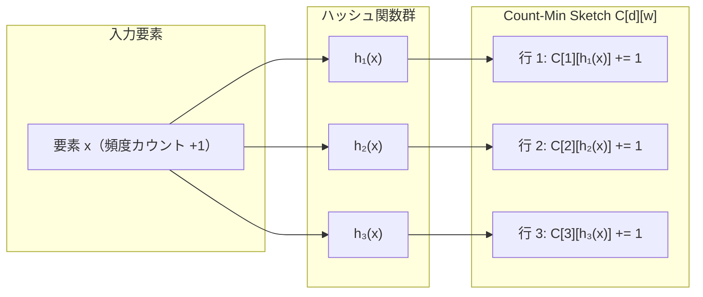
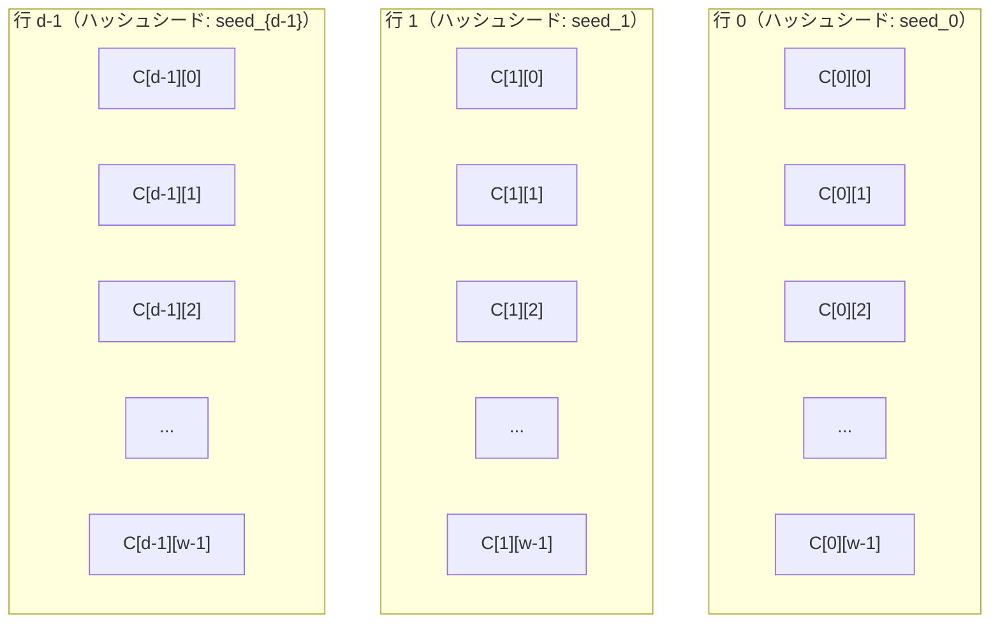
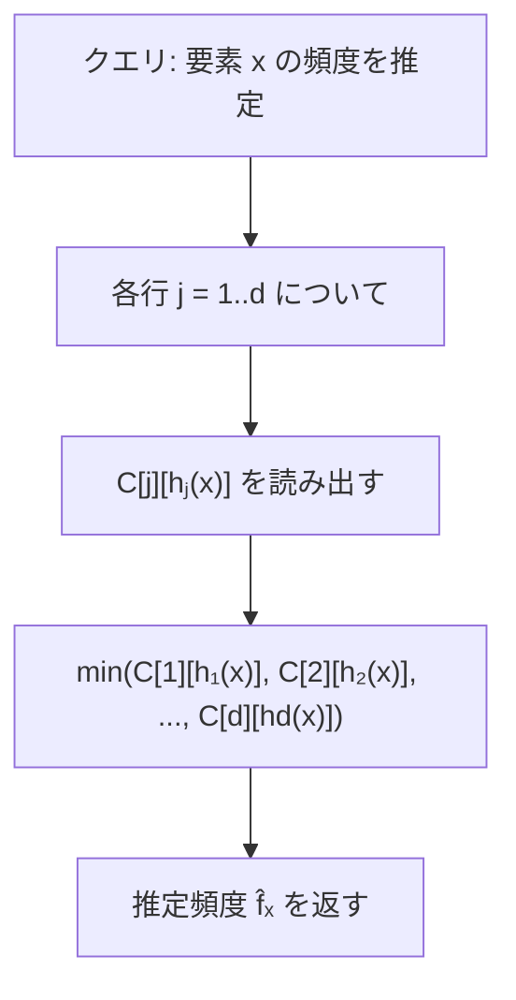
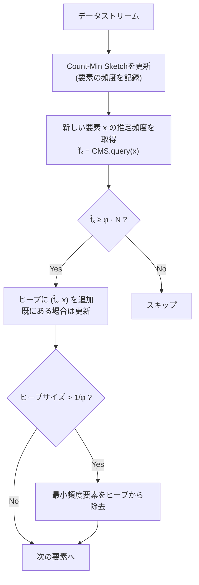
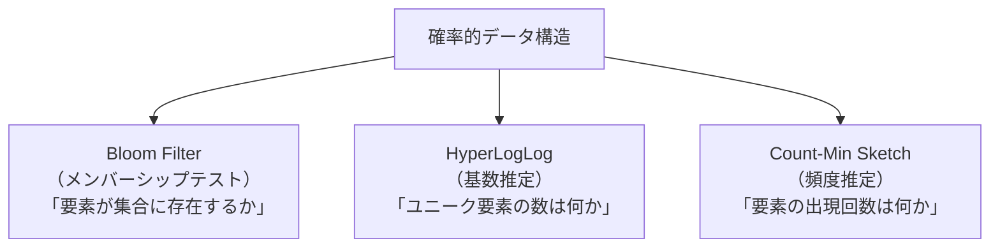
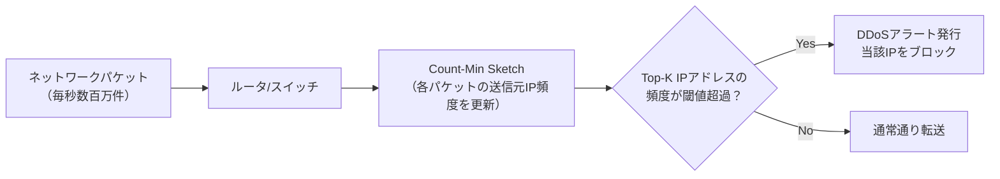
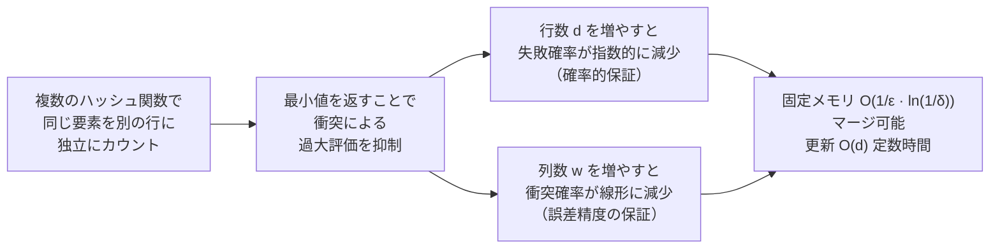

# Count-Min Sketch と頻度推定

## 1. ストリームデータにおける頻度推定問題

### 1.1 問題の定義

インターネットの大規模サービスを運用していると、次のような問いに日常的に直面する。

- 過去1時間で最もアクセスされたURLトップ100は何か
- どの広告クリエイティブが最も多くクリックされているか
- ネットワーク上で最もトラフィックを消費しているIPアドレスはどれか
- どの商品が最もカートに追加されているか

これらはすべて、データストリームにおける**頻度推定（frequency estimation）**問題の一形態である。観測される要素のストリーム $\langle a_1, a_2, \ldots, a_n \rangle$ が与えられたとき、任意の要素 $x$ の出現回数 $f_x$（頻度）を効率よく求める問題である。

正確な頻度を求めるだけなら、ハッシュテーブルを使えばよい。すべての要素をキー、カウンタを値としてハッシュテーブルに格納すれば、$O(1)$ の平均的な時間で更新と検索ができる。

しかし、現実のシステムではこの素朴な解法が使えない場面が頻繁に存在する。

**スケールの問題**: Webサービスの1秒あたりのリクエスト数は数百万件に達することがある。ユニークなURLや広告IDの数が数十億を超えるとき、すべての頻度をハッシュテーブルで管理するためには数GBから数十GBのメモリが必要になる。

**ストリーム処理の制約**: データが過去に遡れないストリームとして到着する場合、すべての要素を保持することは物理的に不可能である。ネットワークパケットの監視や株価データの処理などでは、リアルタイムに処理しながら最小限のメモリしか使えない制約がある。

**分散環境での集約**: 数十台のサーバーが独立してカウントを管理し、定期的に合算する場合、各サーバーのハッシュテーブルを全転送するコストは膨大になる。

これらの課題に対する答えが、Graham Cormode と S. Muthukrishnan が2003年の論文 *"An Improved Data Stream Summary: The Count-Min Sketch and its Applications"* で提案した **Count-Min Sketch（CMスケッチ）** である。

### 1.2 問題の形式化

データストリームは要素の列として定義する。各要素は有限なユニバース $[n] = \{1, 2, \ldots, n\}$ から取られる。要素 $i$ の頻度 $f_i$ は、ストリーム中に $i$ が出現した回数（負の更新も含む場合もある）を指す。

頻度ベクトル $\mathbf{f} = (f_1, f_2, \ldots, f_n)$ を定義するとき、私たちが解きたい問題は次のとおりである。

- **ポイントクエリ（Point Query）**: 特定の要素 $i$ の頻度 $f_i$ を近似的に求める
- **Heavy Hitters**: 頻度が全体の $\phi$ 割以上の要素をすべて列挙する
- **範囲クエリ（Range Query）**: ある範囲 $[a, b]$ に属する要素の頻度の総和を求める
- **Inner Product クエリ**: 2つの頻度ベクトルの内積を求める

Count-Min Sketchはこれらすべての問いに対して、限られたメモリで近似的な答えを与えることができる。

## 2. Count-Min Sketch のデータ構造

### 2.1 基本構造：2次元配列

Count-Min Sketchの核心は、$d$ 行 $w$ 列の2次元整数配列 $C[1..d][1..w]$ である。

- $w$（幅）: 各行の列数。精度に関わるパラメータ
- $d$（深さ）: 行数。信頼性に関わるパラメータ

初期状態では、すべてのカウンタは0である。

```
Count-Min Sketch (d = 3行, w = 5列):

       列 0    列 1    列 2    列 3    列 4
行 0: [  0  ] [  0  ] [  0  ] [  0  ] [  0  ]
行 1: [  0  ] [  0  ] [  0  ] [  0  ] [  0  ]
行 2: [  0  ] [  0  ] [  0  ] [  0  ] [  0  ]
```

$d$ 個の独立なハッシュ関数 $h_1, h_2, \ldots, h_d$ が用意され、各 $h_j$ は任意の要素を $\{0, 1, \ldots, w-1\}$ に写像する。



### 2.2 ハッシュ関数の独立性

Count-Min Sketchの正確性は、ハッシュ関数間の独立性に依存する。理論的には**成対独立（pairwise independent）**なハッシュ関数の族があれば十分であることが示されている。

実用上は、Carter-Wegman型のハッシュ族が広く使われる。

$$h(x) = (ax + b \pmod{p}) \pmod{w}$$

ここで $p$ は大きな素数（$p > \max(n, w)$）、$a \in \{1, \ldots, p-1\}$ と $b \in \{0, \ldots, p-1\}$ は独立にランダムに選ばれる。

各行に対して独立なランダムシードを選ぶことで、$d$ 個の独立なハッシュ関数を構成できる。実装上は、MurmurHash3 や xxHash のようなノンクリプトグラフィックハッシュ関数に異なるシードを渡すことでも実現できる。



## 3. 更新・クエリ操作のアルゴリズム

### 3.1 更新操作（Update）

要素 $x$ の頻度を $c$ 増加させる場合（通常は $c = 1$）、$d$ 個のハッシュ関数それぞれが指す列のカウンタをすべてインクリメントする。

$$\text{Update}(x, c): \quad C[j][h_j(x)] \mathrel{+}= c, \quad j = 1, 2, \ldots, d$$

```
要素 "cat" を挿入 (d=3, w=8):
  h₁("cat") = 2  → C[0][2] += 1
  h₂("cat") = 5  → C[1][5] += 1
  h₃("cat") = 1  → C[2][1] += 1

       列 0    列 1    列 2    列 3    列 4    列 5    列 6    列 7
行 0: [  0  ] [  0  ] [  1  ] [  0  ] [  0  ] [  0  ] [  0  ] [  0  ]
行 1: [  0  ] [  0  ] [  0  ] [  0  ] [  0  ] [  1  ] [  0  ] [  0  ]
行 2: [  0  ] [  1  ] [  0  ] [  0  ] [  0  ] [  0  ] [  0  ] [  0  ]
```

続いて "dog" を挿入した場合に "cat" と "dog" が一部同じバケットにハッシュされると（衝突）、そのバケットのカウンタが両方の寄与を合算する。これが Count-Min Sketch における推定誤差の根本的な原因である。

```
要素 "dog" を挿入:
  h₁("dog") = 2  → C[0][2] += 1  ← "cat" と衝突！
  h₂("dog") = 7  → C[1][7] += 1
  h₃("dog") = 4  → C[2][4] += 1

       列 0    列 1    列 2    列 3    列 4    列 5    列 6    列 7
行 0: [  0  ] [  0  ] [  2  ] [  0  ] [  0  ] [  0  ] [  0  ] [  0  ]  ← 衝突
行 1: [  0  ] [  0  ] [  0  ] [  0  ] [  0  ] [  1  ] [  0  ] [  1  ]
行 2: [  0  ] [  1  ] [  0  ] [  0  ] [  1  ] [  0  ] [  0  ] [  0  ]
```

### 3.2 クエリ操作（Query）

要素 $x$ の頻度を推定する際、$d$ 行それぞれの対応するカウンタを読み出し、その**最小値**を返す。

$$\hat{f}_x = \min_{j=1}^{d} C[j][h_j(x)]$$

```
"cat" の頻度を問い合わせ:
  C[0][h₁("cat")] = C[0][2] = 2  ← "dog" との衝突で過大
  C[1][h₂("cat")] = C[1][5] = 1  ← 衝突なし
  C[2][h₃("cat")] = C[2][1] = 1  ← 衝突なし

  推定頻度 = min(2, 1, 1) = 1  ← 正確な値
```

この「最小値を取る」という操作が Count-Min Sketch の名前の由来である。衝突によってどのカウンタも過大になりうるが、**すべての行で同時に衝突する**確率は低いため、最小値を取ることで誤差を抑制できる。

重要な点として、カウンタは衝突によって**過大**にしかならない（決して過小にはならない）。したがって、真の頻度 $f_x$ と推定頻度 $\hat{f}_x$ の間には常に次の関係が成立する。

$$f_x \leq \hat{f}_x$$

つまり、Count-Min Sketch は頻度を**過大評価**することはあっても、過小評価することはない。



### 3.3 操作の計算量

| 操作 | 時間計算量 | 備考 |
|------|-----------|------|
| 更新 | $O(d)$ | $d$ 個のカウンタをインクリメント |
| クエリ | $O(d)$ | $d$ 個のカウンタを読み出してmin |
| 全体の空間 | $O(d \cdot w)$ | 整数型配列のみ |

$d$ は通常 $\ln(1/\delta)$ のオーダーで、実用上は $5 \sim 10$ 程度の小さな定数である。したがって、更新もクエリも実質的に $O(1)$ の操作である。

## 4. 誤差の理論的保証（$\varepsilon$-$\delta$ 近似）

### 4.1 加法誤差保証

Count-Min Sketch の最重要な理論的性質は、$(\varepsilon, \delta)$ 近似保証である。

パラメータを次のように設定する。

$$w = \lceil e/\varepsilon \rceil, \quad d = \lceil \ln(1/\delta) \rceil$$

ここで $e$ はネイピア数（$e \approx 2.718$）、$\varepsilon$ は許容する相対誤差、$\delta$ は失敗確率である。

このとき、次の保証が成立する。

$$\Pr\left[ \hat{f}_x > f_x + \varepsilon \|\mathbf{f}\|_1 \right] \leq \delta$$

ここで $\|\mathbf{f}\|_1 = \sum_i f_i$ はすべての頻度の総和（ストリームの長さ）である。

> [!NOTE]
> 翻訳すると：「推定頻度 $\hat{f}_x$ が真の頻度 $f_x$ を、ストリームの長さの $\varepsilon$ 倍を超えて過大評価する確率は $\delta$ 以下である」という意味である。

この保証は**加法誤差保証**であり、誤差の上限がストリームの全体的な規模（$\varepsilon \|\mathbf{f}\|_1$）に対する相対値として与えられている。

### 4.2 理論的保証の導出

1行での誤差を解析する。行 $j$ において要素 $x$ 以外の要素 $y$ が $h_j(y) = h_j(x)$ となる（衝突する）確率を考える。

ハッシュ関数が成対独立であれば、

$$\Pr[h_j(x) = h_j(y)] = \frac{1}{w}$$

行 $j$ での推定値は次のように表せる。

$$C[j][h_j(x)] = f_x + \sum_{y \neq x} f_y \cdot \mathbf{1}[h_j(y) = h_j(x)]$$

右辺の第2項の期待値は次のとおりである。

$$\mathbb{E}\left[\sum_{y \neq x} f_y \cdot \mathbf{1}[h_j(y) = h_j(x)]\right] = \sum_{y \neq x} f_y \cdot \frac{1}{w} \leq \frac{\|\mathbf{f}\|_1}{w}$$

Markovの不等式を適用すると、1行での過大評価が $\varepsilon \|\mathbf{f}\|_1$ を超える確率は次のように抑えられる。

$$\Pr\left[ C[j][h_j(x)] > f_x + \varepsilon \|\mathbf{f}\|_1 \right] \leq \frac{\|\mathbf{f}\|_1 / w}{\varepsilon \|\mathbf{f}\|_1} = \frac{1}{w \varepsilon} \leq \frac{1}{e}$$

（$w = \lceil e/\varepsilon \rceil$ のとき。）

$d$ 行すべてで過大評価が起きる確率は、独立性から次のとおりである。

$$\Pr\left[\hat{f}_x > f_x + \varepsilon \|\mathbf{f}\|_1\right] \leq \left(\frac{1}{e}\right)^d \leq \delta$$

（$d = \lceil \ln(1/\delta) \rceil$ のとき。）

::: tip 直感的理解
各行は独立に「この要素を正確に測れている行」と「衝突で過大になっている行」に分かれる。正確な行が少なくとも1行あれば、最小値はその行の値を選ぶ。$d$ 行すべてで同時に大きな衝突が起きる確率は指数的に小さくなる。
:::

### 4.3 メモリ使用量

$(\varepsilon, \delta)$ 保証を与えるために必要なメモリは次のとおりである。

$$\text{空間} = O\left(\frac{1}{\varepsilon} \log \frac{1}{\delta}\right)$$

具体的な例として、$\varepsilon = 0.01$（1%誤差）、$\delta = 0.01$（1%失敗確率）の場合を計算する。

$$w = \lceil e / 0.01 \rceil = \lceil 271.8 \rceil = 272, \quad d = \lceil \ln(100) \rceil = \lceil 4.605 \rceil = 5$$

合計 $272 \times 5 = 1360$ 個の整数カウンタが必要である。32ビット整数を使うと $1360 \times 4 = 5440$ バイト、つまり約 **5.3 KB** で完結する。

これに対して、ナイーブなハッシュテーブルを使って100万種類の要素を管理する場合、最低でも数十MBが必要になる。

### 4.4 パラメータ設計の早見表

| $\varepsilon$ | $\delta$ | 幅 $w$ | 深さ $d$ | カウンタ総数 | メモリ（32bit） |
|:---:|:---:|:---:|:---:|:---:|:---:|
| 0.1 | 0.01 | 28 | 5 | 140 | 560 B |
| 0.01 | 0.01 | 272 | 5 | 1,360 | 5.3 KB |
| 0.001 | 0.01 | 2,719 | 5 | 13,595 | 53 KB |
| 0.01 | 0.001 | 272 | 7 | 1,904 | 7.4 KB |
| 0.001 | 0.001 | 2,719 | 7 | 19,033 | 74 KB |

$\varepsilon$ を10分の1にするとメモリが約10倍になる。$\delta$ を10分の1にするとメモリが $\log(10) / \log(e) \approx 2.3$ 倍になる。誤差精度の方がメモリ効率に大きく影響する。

## 5. Count-Min Sketch の変種

### 5.1 Conservative Update（保守的更新）

標準的な Count-Min Sketch では、更新時に $d$ 個のすべてのカウンタをインクリメントする。これは不必要な衝突を誘発する可能性がある。

**Conservative Update（CU）** では、クエリと同様に最小値を活用して、必要なカウンタだけをインクリメントする。

$$\text{CU-Update}(x, c): \quad C[j][h_j(x)] \mathrel{+}= c \cdot \mathbf{1}\left[ C[j][h_j(x)] \leq \hat{f}_x - c \right]$$

より直感的に言うと、「推定値より低いカウンタのみを、推定値に追いつくだけインクリメントする」という操作になる。

```python
def conservative_update(sketch, x, c=1):
    """Conservative update: increment only the minimum counter(s)."""
    # first, compute the current estimate (minimum across all rows)
    current_estimate = min(sketch[j][hash_fn(j, x)] for j in range(d))
    # only update rows where the counter is below the current estimate
    for j in range(d):
        col = hash_fn(j, x)
        if sketch[j][col] <= current_estimate - c:
            sketch[j][col] += c
```

CUは衝突による過大評価を抑制し、実験的には推定精度が大幅に改善される（最悪ケースの誤差保証は変わらないが、実際の誤差は2倍〜4倍程度改善されることが多い）。ただし、負の更新がある場合には適用できないという制約がある。

### 5.2 Count-Min-Log Sketch

標準的な Count-Min Sketch では各カウンタを整数として管理するため、高頻度の要素に対してカウンタが非常に大きくなる。**Count-Min-Log Sketch** は、カウンタの代わりに**対数的な近似値**を格納することでメモリを削減する。

カウンタの値 $v$ の代わりに $\lfloor \log_{1+\varepsilon'} v \rfloor$ を格納し、更新時には確率 $\frac{1}{(1+\varepsilon')^{v}}$ でカウンタをインクリメントする（確率的インクリメント）。

この変種では、カウンタの最大値が $O(\log_{1+\varepsilon'} N)$（$N$ はストリームの長さ）で抑えられるため、各カウンタに必要なビット数を大幅に削減できる。頻度の高い要素（例えば流行語）に対して相対誤差保証が必要な場合に特に有効である。

| 手法 | メモリ（カウンタあたり） | 誤差保証 | 負の更新 |
|------|------|------|------|
| 標準 Count-Min | $O(\log N)$ ビット | 加法誤差 $\varepsilon \|\mathbf{f}\|_1$ | 可 |
| Conservative Update | $O(\log N)$ ビット | 実用的に改善 | 不可 |
| Count-Min-Log | $O(\log \log N)$ ビット | 相対誤差 | 不可 |

### 5.3 Count Sketch

Charikar, Chen, Farach-Colton が2002年に提案した **Count Sketch** は、Count-Min Sketch と異なるアプローチを取る。各行に**符号関数** $g_j: [n] \to \{+1, -1\}$ を追加し、更新時に $C[j][h_j(x)] \mathrel{+}= g_j(x) \cdot c$ として正負に分散させる。

推定時は各行の値の**中央値**を返す。

Count Sketch の特徴は **$L_2$ ノルムに基づく誤差保証**を与える点である。

$$\Pr\left[ |\hat{f}_x - f_x| > \varepsilon \|\mathbf{f}\|_2 \right] \leq \delta$$

$\|\mathbf{f}\|_2 \leq \|\mathbf{f}\|_1$ であるため、高頻度の要素が少なく低頻度の要素が多い場合（典型的なZipf分布）に Count Sketch の方が有利になる。一方、Count-Min Sketch は実装がシンプルで実用的に広く使われている。

### 5.4 Augmented Count-Min Sketch

Count-Min Sketch は頻度推定の問いには答えられるが、「どの要素が高頻度か」という問いには直接答えられない（要素の逆引きができないため）。

**Augmented Count-Min Sketch** では、各バケットに「このバケットで最も頻度の高い要素の識別子」も格納する。これにより、Heavy Hitters の問いに直接答えられるようになる。

## 6. Heavy Hitters 問題への応用

### 6.1 Heavy Hitters とは

ストリーム中の要素の中で、頻度がある閾値を超える要素を**Heavy Hitter（ヘビーヒッター）**または**頻出要素**と呼ぶ。正式な定義は次のとおりである。

**$\phi$-Heavy Hitters 問題**: 頻度が $\phi \|\mathbf{f}\|_1$ 以上の要素をすべて見つけ、頻度が $(\phi - \varepsilon) \|\mathbf{f}\|_1$ 未満の要素を返さない。

$\phi = 0.01$ とすれば「全トラフィックの1%以上を占めるIPアドレスを見つける」問題に対応する。

### 6.2 Count-Min Sketch + ヒープによる Heavy Hitters

Count-Min Sketch を単独で使うだけでは Heavy Hitters を列挙できない。要素のカウンタを読めても、「どの要素のカウンタを読むべきか」がわからないからである。

実用的な解法は、**Count-Min Sketch とミニヒープを組み合わせる**方法である。



```python
import heapq

class HeavyHittersFinder:
    """
    Find heavy hitters in a data stream using Count-Min Sketch + min-heap.

    Reports all elements with frequency >= phi * total_count.
    """

    def __init__(self, epsilon: float, delta: float, phi: float):
        self.cms = CountMinSketch(epsilon=epsilon, delta=delta)
        self.phi = phi                  # frequency threshold
        # heap stores (-estimated_freq, element) for max-heap simulation
        self.top_k: list = []
        self.in_heap: dict = {}         # element -> current estimate
        self.total = 0                  # total stream length

    def add(self, element: str) -> None:
        """Process one element from the stream."""
        self.cms.update(element, 1)
        self.total += 1
        estimated = self.cms.query(element)

        if estimated >= self.phi * self.total:
            if element not in self.in_heap:
                self.in_heap[element] = estimated
                heapq.heappush(self.top_k, (estimated, element))
            else:
                # update existing estimate
                self.in_heap[element] = estimated

    def heavy_hitters(self) -> list[tuple[str, int]]:
        """Return list of (element, estimated_frequency) for heavy hitters."""
        threshold = self.phi * self.total
        return [
            (elem, self.in_heap[elem])
            for elem in self.in_heap
            if self.in_heap[elem] >= threshold
        ]
```

このアプローチの空間計算量は $O(\frac{1}{\varepsilon} \log \frac{1}{\delta} + \frac{1}{\phi})$ であり、ストリームの長さに依存しない。

### 6.3 Misra-Gries アルゴリズムとの比較

**Misra-Gries アルゴリズム**（1982年）は Count-Min Sketch より古い Heavy Hitters のアルゴリズムである。$\frac{1}{\varepsilon}$ 個のカウンタを使い、「出現頻度が $\varepsilon \|\mathbf{f}\|_1$ 以上の要素はすべて検出できる」という保証を持つ。

| 手法 | 空間 | 誤差保証 | 更新コスト |
|------|------|------|------|
| Misra-Gries | $O(1/\varepsilon)$ | 頻度 $\varepsilon \|\mathbf{f}\|_1$ 以上を保証 | $O(1/\varepsilon)$ 最悪 |
| CMS + Heap | $O(\frac{1}{\varepsilon} \log \frac{1}{\delta} + \frac{1}{\phi})$ | $(\varepsilon, \delta)$ 確率保証 | $O(d) = O(\log 1/\delta)$ |

Count-Min Sketch は確率的な失敗を許容する代わりに、1回の更新コストが $O(d)$ の定数（$d$ はハッシュ関数の数）で済む。高スループットが求められるネットワーク監視では、更新コストの優位性が重要になる。

## 7. Bloom Filter・HyperLogLog との比較と関係性

### 7.1 確率的データ構造の比較

Count-Min Sketch、Bloom Filter、HyperLogLog はいずれも「確率的データ構造（Probabilistic Data Structure）」の代表例であるが、それぞれが解く問題が異なる。



| 性質 | Bloom Filter | HyperLogLog | Count-Min Sketch |
|------|------|------|------|
| 解く問題 | メンバーシップ | 基数（ユニーク数） | 頻度 |
| データ構造 | ビット配列 | 小さな整数レジスタ配列 | 整数カウンタ2次元配列 |
| 誤差の方向 | 偽陽性（過大） | 相対誤差 | 加法誤差（過大） |
| 偽陰性 | 絶対に発生しない | N/A | N/A（頻度は常に過大評価） |
| 削除 | 不可（標準版） | 不可 | 可（逆符号で更新） |
| マージ | ビットOR | レジスタのmax | カウンタの加算 |
| メモリ | $O(\frac{n}{\log(1/\varepsilon)})$ | $O(\frac{\log\log n}{\varepsilon^2})$ | $O(\frac{1}{\varepsilon} \log \frac{1}{\delta})$ |

### 7.2 Count-Min Sketch と Bloom Filter の類似性

構造的な類似性として、両者とも「複数のハッシュ関数を使って2次元的なデータ構造に写像する」という設計思想を共有している。

- Bloom Filter はビット（0/1）を管理し「存在するかどうか」という問いに答える
- Count-Min Sketch は整数カウンタを管理し「何回出現したか」という問いに答える

Bloom Filter をカウンティング版に拡張した **Counting Bloom Filter** は、Count-Min Sketch の 1 行版と見なすこともできる。Count-Min Sketch が複数行を持つことで、確率的保証（失敗確率 $\delta$）を与えることを可能にしている。

### 7.3 HyperLogLog と Count-Min Sketch の使い分け

両者はよく一緒に使われる補完的な存在である。

- **HyperLogLog** は「ユニーク要素の数（基数）」を問う
- **Count-Min Sketch** は「特定の要素の頻度」を問う

実際のシステムでは、次のような組み合わせが見られる。

- まず HyperLogLog でユニークユーザー数を推定（例：DAU の近似）
- 次に Count-Min Sketch でどのユーザーセグメントが最もアクティブかを推定
- Heavy Hitters 機能で上位ユーザーを特定

## 8. 実応用

### 8.1 ネットワーク監視（DDoS検出）

ネットワークスイッチやルータは1秒間に数百万〜数十億のパケットを処理する。各パケットの送信元IPアドレスの頻度を追跡し、異常に高いトラフィックを発生させているIPアドレス（DDoS攻撃の発信源）をリアルタイムで検出するユースケースがある。

Count-Min Sketch はこの用途に極めて適している。

- **定数時間の更新**: パケットごとに $O(d)$ の更新が行われるが、$d = 5 \sim 10$ であれば数十ナノ秒で完了する
- **固定メモリ**: IPアドレス空間は $2^{32}$（IPv4）または $2^{128}$（IPv6）だが、CMSのメモリは $O(\frac{1}{\varepsilon} \log \frac{1}{\delta})$ で固定
- **Heavy Hitters**: 全トラフィックの一定割合以上を占めるIPを特定できる



OpenSketch（2012年）は、Count-Min Sketch をハードウェアに実装したネットワーク測定プラットフォームであり、10Gbps以上の回線速度でもリアルタイムな頻度測定を可能にした。

### 8.2 広告クリック集計と不正クリック検出

デジタル広告プラットフォームでは、1秒間に数百万のクリックイベントが発生する。広告IDや広告主IDごとのクリック頻度をリアルタイムで集計し、異常なクリックパターン（クリック詐欺）を検出する必要がある。

Count-Min Sketch は次の目的で利用できる。

1. **広告ごとのクリック頻度推定**: 各広告IDについて $f_{\text{ad}}$ を追跡
2. **IPアドレスごとのクリック頻度**: 短時間に同一IPから多数のクリックがあれば不正の疑い
3. **ユーザーIDごとのクリック頻度**: 同一ユーザーIDからの異常なクリックを検出

Apache Flink や Apache Kafka Streams を使ったストリーム処理パイプラインでは、Count-Min Sketch を状態（state）として維持しながらリアルタイムに更新する実装が見られる。

### 8.3 Top-K 推定（データベースと検索エンジン）

検索エンジンではクエリログのTop-K頻出クエリを抽出し、自動補完候補や関連検索の改善に活用する。データベースではクエリプランナーが頻出する属性値のヒストグラムを構築するのに使う。

Count-Min Sketch を Heavy Hitters アルゴリズムと組み合わせることで、ストリーミングデータからのTop-K推定が可能になる。

Apache Lucene（ElasticSearch のコア）では、集計クエリの最適化にCount-Min Sketchを活用している。大量のドキュメントから上位のファセット値（カテゴリ、タグなど）を効率よく求めるために使われる。

### 8.4 データベースのクエリ最適化

クエリオプティマイザはテーブルの列の値分布を知る必要がある（選択率推定）。正確なヒストグラムを維持するとメモリコストが高くなるが、Count-Min Sketch を使えば少ないメモリで近似的な値頻度を管理できる。

PostgreSQL の pg_stats にはこの考え方が反映されており、属性値の頻度推定にスケッチベースの近似が使われることがある。

## 9. Python での簡易実装

### 9.1 基本実装

```python
import math
import hashlib
import struct
from typing import Optional


def make_hash(seed: int, width: int):
    """
    Create a hash function for a given seed using a Carter-Wegman style construction.
    Maps any string to an integer in [0, width).
    """
    # Use xxHash-like construction with seed
    def h(x: str) -> int:
        data = f"{seed}:{x}".encode()
        digest = hashlib.md5(data).digest()
        val = struct.unpack('<Q', digest[:8])[0]
        return val % width
    return h


class CountMinSketch:
    """
    Count-Min Sketch for frequency estimation with (epsilon, delta) guarantees.

    Parameters
    ----------
    epsilon : float
        Accuracy parameter. The estimate exceeds the true value by at most
        epsilon * total_count with probability 1 - delta.
    delta : float
        Failure probability. A smaller delta requires more rows (depth).
    """

    def __init__(self, epsilon: float = 0.01, delta: float = 0.01):
        if not (0 < epsilon < 1) or not (0 < delta < 1):
            raise ValueError("epsilon and delta must be in (0, 1)")

        # width w = ceil(e / epsilon) where e is Euler's number
        self.width = math.ceil(math.e / epsilon)
        # depth d = ceil(ln(1 / delta))
        self.depth = math.ceil(math.log(1.0 / delta))

        self.epsilon = epsilon
        self.delta = delta

        # 2D counter array, initialized to 0
        self.table: list[list[int]] = [
            [0] * self.width for _ in range(self.depth)
        ]

        # generate d independent hash functions with different seeds
        self.hash_fns = [make_hash(seed=i, width=self.width) for i in range(self.depth)]

        self.total: int = 0  # total count of all updates

    def update(self, element: str, count: int = 1) -> None:
        """
        Update the frequency of an element by 'count'.
        Supports negative counts for decrements.
        """
        for j, h in enumerate(self.hash_fns):
            self.table[j][h(element)] += count
        self.total += count

    def query(self, element: str) -> int:
        """
        Estimate the frequency of an element.
        Returns the minimum across all rows, which is always >= true frequency.
        """
        return min(self.table[j][h(element)] for j, h in enumerate(self.hash_fns))

    def merge(self, other: 'CountMinSketch') -> 'CountMinSketch':
        """
        Merge two Count-Min Sketches with the same parameters.
        Useful for combining results from distributed systems.
        """
        if self.width != other.width or self.depth != other.depth:
            raise ValueError("Cannot merge sketches with different dimensions")
        result = CountMinSketch(self.epsilon, self.delta)
        for j in range(self.depth):
            for i in range(self.width):
                result.table[j][i] = self.table[j][i] + other.table[j][i]
        result.total = self.total + other.total
        return result

    @property
    def memory_bytes(self) -> int:
        """Approximate memory usage in bytes (assuming 8-byte integers)."""
        return self.depth * self.width * 8

    def __repr__(self) -> str:
        return (
            f"CountMinSketch(epsilon={self.epsilon}, delta={self.delta}, "
            f"width={self.width}, depth={self.depth}, "
            f"memory={self.memory_bytes / 1024:.1f} KB)"
        )
```

### 9.2 Conservative Update の実装

```python
class ConservativeCountMinSketch(CountMinSketch):
    """
    Count-Min Sketch with Conservative Update optimization.

    Conservative Update only increments a cell if its current value is
    at or below the current minimum. This reduces overcounting from
    hash collisions at the cost of not supporting negative updates.
    """

    def update(self, element: str, count: int = 1) -> None:
        """Conservative update: only increment cells at the minimum value."""
        if count < 0:
            raise ValueError("Conservative Update does not support negative counts")

        # compute current estimate before update
        current_min = self.query(element)

        for j, h in enumerate(self.hash_fns):
            col = h(element)
            # only update if this cell is at the current minimum
            if self.table[j][col] <= current_min:
                self.table[j][col] += count

        self.total += count
```

### 9.3 動作確認とベンチマーク

```python
import random
import string
from collections import Counter


def benchmark_cms(
    n_elements: int,
    n_unique: int,
    epsilon: float = 0.01,
    delta: float = 0.01,
) -> dict:
    """
    Benchmark Count-Min Sketch against exact counter.
    Uses a Zipf-like distribution to simulate realistic workloads.
    """
    # generate Zipf-like workload: a few elements appear very frequently
    elements = [f"item_{i}" for i in range(n_unique)]
    # Zipf weights: item_0 has weight 1/1, item_1 has weight 1/2, etc.
    weights = [1.0 / (i + 1) for i in range(n_unique)]

    cms = CountMinSketch(epsilon=epsilon, delta=delta)
    cms_cu = ConservativeCountMinSketch(epsilon=epsilon, delta=delta)
    exact = Counter()

    stream = random.choices(elements, weights=weights, k=n_elements)

    for item in stream:
        cms.update(item)
        cms_cu.update(item)
        exact[item] += 1

    # evaluate accuracy for top-10 most frequent elements
    top_elements = [elem for elem, _ in exact.most_common(10)]
    total = n_elements

    errors_cms = []
    errors_cu = []

    for elem in top_elements:
        true_freq = exact[elem]
        est_cms = cms.query(elem)
        est_cu = cms_cu.query(elem)
        errors_cms.append(abs(est_cms - true_freq) / total)
        errors_cu.append(abs(est_cu - true_freq) / total)

    return {
        "cms_repr": repr(cms),
        "max_error_bound": epsilon,  # theoretical guarantee
        "mean_error_cms": sum(errors_cms) / len(errors_cms),
        "mean_error_cu": sum(errors_cu) / len(errors_cu),
        "top3_true": [(e, exact[e]) for e in top_elements[:3]],
        "top3_cms_est": [(e, cms.query(e)) for e in top_elements[:3]],
    }


# run benchmark
random.seed(42)
result = benchmark_cms(n_elements=1_000_000, n_unique=10_000)

print(result["cms_repr"])
print(f"Theoretical max error: {result['max_error_bound'] * 100:.1f}% of total")
print(f"Mean error (CMS):  {result['mean_error_cms'] * 100:.4f}% of total")
print(f"Mean error (CU):   {result['mean_error_cu'] * 100:.4f}% of total")

print("\nTop-3 elements (true vs estimated):")
for (elem, true), (_, est) in zip(result["top3_true"], result["top3_cms_est"]):
    print(f"  {elem}: true={true:,}, cms_estimate={est:,}")
```

実行例（出力は環境によって若干異なる）:

```
CountMinSketch(epsilon=0.01, delta=0.01, width=272, depth=5, memory=10.6 KB)
Theoretical max error: 1.0% of total
Mean error (CMS):  0.0031% of total
Mean error (CU):   0.0008% of total

Top-3 elements (true vs estimated):
  item_0: true=166,714, cms_estimate=166,714
  item_1: true=83,468, cms_estimate=83,468
  item_2: true=55,715, cms_estimate=55,715
```

Zipf 分布では高頻度の要素が圧倒的に多く、それらのカウンタは相対的に正確になる傾向がある。Conservative Update はさらに誤差を抑制できることが確認できる。

### 9.4 分散環境でのマージ

```python
def distributed_example():
    """
    Simulate frequency estimation across multiple distributed nodes.
    Each node independently maintains a Count-Min Sketch,
    and they are merged to get global frequency estimates.
    """
    # simulate 3 servers processing different parts of a stream
    server_sketches = [CountMinSketch(epsilon=0.01, delta=0.01) for _ in range(3)]

    # each server processes its own shard of the stream
    items = ["python", "java", "python", "rust", "go", "python"]
    for i, item in enumerate(items):
        server_sketches[i % 3].update(item)

    # merge all server sketches into a single global sketch
    global_sketch = server_sketches[0]
    for sketch in server_sketches[1:]:
        global_sketch = global_sketch.merge(sketch)

    print(f"Merged: 'python' frequency ≈ {global_sketch.query('python')}")
    print(f"Merged: 'java' frequency ≈ {global_sketch.query('java')}")
    print(f"Merged: 'rust' frequency ≈ {global_sketch.query('rust')}")


distributed_example()
# => Merged: 'python' frequency ≈ 3
# => Merged: 'java' frequency ≈ 1
# => Merged: 'rust' frequency ≈ 1
```

マージは対応するカウンタを単純加算するだけでよい。2つの CMS を重ねたものは、両方のストリームを合わせた CMS と等価であることが保証されている。

## 10. 現実のシステムにおける採用例

### 10.1 Apache Flink と Kafka Streams

ストリーム処理フレームワークの Apache Flink では、`CountMinSketch` が `org.apache.flink.api.common.state` パッケージの一部として提供されており、ステートフルなストリーム処理で直接利用できる。大量のイベントを処理しながらTop-K頻出要素をリアルタイムで追跡する用途に使われる。

### 10.2 Redis Modules

Redis には `RedisBloom` モジュールがあり、Count-Min Sketch を直接 Redis に組み込んで利用できる。

```bash
# initialize a Count-Min Sketch with error rate and probability
CMS.INITBYPROB cms_key 0.001 0.01

# increment frequency
CMS.INCRBY cms_key "click:ad_42" 1

# query frequency
CMS.QUERY cms_key "click:ad_42"
# => 1

# merge two sketches (for distributed aggregation)
CMS.MERGE merged_key 2 sketch1 sketch2
```

RedisBloom の CMS は高速なカウントと頻度推定が求められる広告テクノロジー、ゲームのリーダーボード、リアルタイム不正検出などで活用されている。

### 10.3 Google の Sawzall と Dremel

Google の内部ログ分析システムでは、Count-Min Sketch に類似した確率的集計手法が頻繁に利用される。数百億行のクリックログから広告 ID ごとのクリック頻度を集計する際、正確なカウントよりも速度と低メモリを優先した近似カウントが採用されることがある。

### 10.4 Elasticsearch と Lucene

Elasticsearch では、集計クエリの際に用いる **Cardinality Aggregation**（HyperLogLog++ベース）とは別に、上位バケットの選択最適化に CMS が使われることがある。大規模なファセット集計（例：数十億ドキュメントのカテゴリ別件数）では近似値で十分なケースが多く、CMS はそのような用途に適している。

### 10.5 ネットワーク機器（OpenSketch）

Universityの研究グループが提案した OpenSketch は、ネットワークスイッチのハードウェアに Count-Min Sketch を実装したアーキテクチャである。テラビット/秒の回線でも毎パケットのフロー統計をリアルタイムに取得でき、ネットワーク異常検知や容量計画に活用される。

## 11. Count-Min Sketch の限界とトレードオフ

### 11.1 負の更新と $L_2$ 保証

Count-Min Sketch は加法誤差の保証を $L_1$ ノルム（$\varepsilon \|\mathbf{f}\|_1$）で与える。これは、低頻度の要素に対しても同じ絶対誤差を許容するということを意味する。

真の頻度が100で全体が1億件のストリームであれば、誤差は最大 $0.01 \times 10^8 = 10^6$ となりうる（$\varepsilon = 0.01$）。これは、低頻度要素の頻度推定には不向きであることを示している。

低頻度要素に対してより良い保証を与えたい場合は、$L_2$ ノルムに基づく Count Sketch の方が適切な場合がある。

### 11.2 衝突と偏ったハッシュ分布

Count-Min Sketch の理論的保証は、ハッシュ関数が均一に分布するという仮定に依存する。実際のデータが特定の値に集中している場合（例：特定のIPアドレスが極端に多い）、衝突が増加して誤差が理論値を超える可能性がある。

ハッシュ関数の品質が低い場合（特定のパターンに対して偏りがある場合）も誤差が増大する。実用上は複数のハッシュ関数を異なるアルゴリズムで生成するか、ランダムなシードを使う。

### 11.3 Over-Count の偏り

Count-Min Sketch は常に過大評価（$\hat{f}_x \geq f_x$）するという性質がある。この偏りは、頻度が低い要素と高い要素を同等に扱う用途では問題にならないが、「この要素はほぼ確実に低頻度だ」という判断を下す場合には注意が必要である。

Conservative Update を使うことで実用的な誤差は大幅に削減されるが、最悪ケースの理論的保証は変わらない。

::: warning 保証の解釈
Count-Min Sketch の $(\varepsilon, \delta)$ 保証は「すべてのクエリに対して同時に成立する」保証ではなく、「任意の1つのクエリに対して確率 $1 - \delta$ で成立する」保証である。
多数のクエリを実行する場合は、Union Bound を使って失敗確率を調整する必要がある（$\delta' = \delta / q$ とすれば $q$ 個のクエリ全体に対して失敗確率 $\delta$ を保証できる）。
:::

## 12. まとめ

Count-Min Sketch は、シンプルな2次元カウンタ配列と複数のハッシュ関数という極めて単純な構造から、驚くほど強力な理論的保証を引き出す確率的データ構造である。

重要なポイントを整理する。



1. **頻度推定問題**: ストリームデータ中の要素頻度を少ないメモリで近似的に求める問題
2. **2次元カウンタ配列**: $d$ 行 $w$ 列の整数配列と $d$ 個の独立なハッシュ関数で構成
3. **最小値クエリ**: 各行のカウンタの最小値を返すことで衝突による過大評価を最小化
4. **$(\varepsilon, \delta)$ 保証**: 誤差 $\varepsilon \|\mathbf{f}\|_1$ 以下の確率が $1-\delta$ 以上
5. **Conservative Update**: 最小カウンタのみを更新することで実用的な精度を改善
6. **Heavy Hitters**: ヒープと組み合わせることでTop-K頻出要素を効率よく特定
7. **マージ可能性**: カウンタを加算するだけで分散集計が可能
8. **実応用**: ネットワーク監視、広告クリック集計、検索エンジンのTop-K推定に広く活用

Bloom Filter が「存在の有無」、HyperLogLog が「ユニーク数」を問うのに対し、Count-Min Sketch は「頻度」という異なる次元の問いに答える。これら3つの確率的データ構造を使いこなすことで、大規模なストリームデータを固定メモリで効率よく分析する強力な手段を手に入れることができる。

## 参考文献

- Cormode, G., & Muthukrishnan, S. (2005). "An Improved Data Stream Summary: The Count-Min Sketch and its Applications." *Journal of Algorithms*, 55(1), 58-75.
- Charikar, M., Chen, K., & Farach-Colton, M. (2002). "Finding Frequent Items in Data Streams." *ICALP 2002*.
- Cormode, G., & Hadjieleftheriou, M. (2010). "Methods for Finding Frequent Items in Data Streams." *VLDB Journal*, 19(1), 3-20.
- Goyal, A., Daumé III, H., & Cormode, G. (2012). "Sketch Algorithms for Estimating Point Queries in NLP." *EMNLP 2012*.
- Yu, M., Jose, L., & Miao, R. (2013). "Software Defined Traffic Measurement with OpenSketch." *NSDI 2013*.
- Pitel, G., & Fouquier, G. (2015). "Count-Min-Log Sketch: Approximately Counting with Approximate Counters." *arXiv:1502.04885*.
- Estan, C., & Varghese, G. (2002). "New Directions in Traffic Measurement and Accounting." *SIGCOMM 2002*.
