# コピーオンライトファイルシステム（ZFS, Btrfs）

## なぜコピーオンライトファイルシステムが必要なのか

従来のファイルシステム（ext4, XFS など）は、データを更新する際に**既存のブロックを直接上書き（in-place update）**する。この方式は単純で効率的だが、本質的な問題を抱えている。書き込みの途中でシステムがクラッシュした場合、データが中途半端な状態で残ってしまう可能性があるのだ。この問題に対処するため、ext4 などはジャーナリング（Write-Ahead Logging）を採用しているが、ジャーナリングは「変更内容を先にジャーナル領域に書き、その後に実データを更新する」という二重書き込みのオーバーヘッドを伴う。

**コピーオンライト（Copy-on-Write, CoW）** ファイルシステムは、この問題に根本的に異なるアプローチで対処する。データを変更する際に既存のブロックを上書きするのではなく、**新しい場所にデータを書き込み、メタデータのポインタを原子的に切り替える**。この方式により、以下のような利点が得られる。

1. **常に一貫性のあるデータ**: 書き込みが完了するまで古いデータは保持されるため、クラッシュしても一貫性が保たれる
2. **スナップショットの効率的な実装**: 古いデータが保持されるため、スナップショットがほぼゼロコストで作成可能
3. **チェックサムによるデータ整合性検証**: すべてのデータとメタデータにチェックサムを付与し、サイレントデータ破損（bit rot）を検出できる
4. **柔軟なストレージ管理**: 論理ボリュームとファイルシステムを統合し、ストレージプールとして管理できる

この記事では、CoW ファイルシステムの代表格である **ZFS** と **Btrfs** を中心に、その設計思想、内部アーキテクチャ、そして実運用上の考慮点を深く掘り下げる。

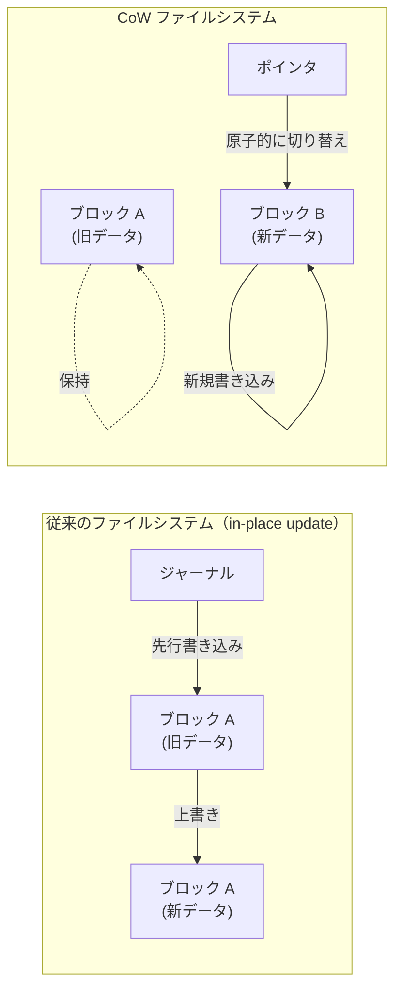

## 歴史的背景

### ZFS の誕生

ZFS は、2001年に Sun Microsystems の Jeff Bonwick と Matthew Ahrens によって開発が開始された。当時、Sun のエンジニアたちは Solaris で使用されている UFS（Unix File System）の限界に直面していた。UFS は信頼性の確保にジャーナリングに依存しており、大容量ストレージの管理にはボリュームマネージャ（Solaris Volume Manager）が別途必要であった。この「ファイルシステム + ボリュームマネージャ」という分離されたアーキテクチャが管理の複雑さを増大させていた。

Bonwick のビジョンは明確だった。**ファイルシステムとボリューム管理を統合し、エンドツーエンドのデータ整合性を保証する、管理が容易なストレージシステム**を作ることである。ZFS は 2005年に OpenSolaris の一部としてオープンソース化され、その後 Oracle による Sun 買収を経て、現在は OpenZFS プロジェクトとしてコミュニティ主導で開発が続けられている。

ZFS の名前は当初「Zettabyte File System」の略とされていたが、現在は単に「ZFS」という固有名詞として扱われている。これは、ZFS が 128bit アドレッシングを採用しており、理論上ゼタバイト規模のストレージを扱えることに由来する。

### Btrfs の登場

Btrfs（B-tree FS, 「バターFS」と読まれることが多い）は、2007年に Oracle の Chris Mason によって開発が開始された。Btrfs の目標は、ZFS が提供するような高度な機能（スナップショット、チェックサム、RAID 統合）を **Linux カーネルにネイティブに統合された形で** 提供することであった。

ZFS は優れたファイルシステムであるが、ライセンスの問題（CDDL と GPL の非互換性）により Linux カーネルにマージすることができない。Btrfs は GPL v2 ライセンスで開発されており、Linux カーネルのメインラインに含まれている。2009年に Linux 2.6.29 で初めてマージされ、以降継続的に開発が進められている。

Btrfs の設計は ZFS から多くの影響を受けているが、実装は独立しており、いくつかの異なる設計判断を行っている。特に B-Tree ベースのメタデータ管理は Btrfs の名前の由来でもあり、ZFS のブロックポインタベースの設計とは異なるアプローチを採用している。

## コピーオンライトの基本原理

### 従来の in-place update との対比

従来のファイルシステムがファイルの内容を変更する場合、以下のような手順を踏む。

1. 変更対象のブロックをディスクから読み込む
2. メモリ上でデータを変更する
3. 変更されたブロックを**元の場所に上書き**する

この方式では、手順 3 の途中でシステムがクラッシュすると、ブロックが部分的に書き換えられた状態（torn write）になる可能性がある。ジャーナリングはこの問題を軽減するが、根本的な解決ではなく、パフォーマンスオーバーヘッドを伴う。

### CoW の動作メカニズム

CoW ファイルシステムでは、データの変更時に以下の手順を踏む。

1. 変更対象のブロックをディスクから読み込む
2. メモリ上でデータを変更する
3. 変更されたデータを**新しいブロック位置に書き込む**
4. 新しいブロックを指すようにメタデータ（ポインタ）を**原子的に更新**する
5. 古いブロックは参照がなくなった時点で解放可能になる

この方式の鍵は、**古いデータが新しいデータの書き込みが完了するまで破壊されない**という点にある。クラッシュが発生した場合、古いポインタがまだ有効であるため、ファイルシステムは自動的に最後の一貫した状態に復帰できる。

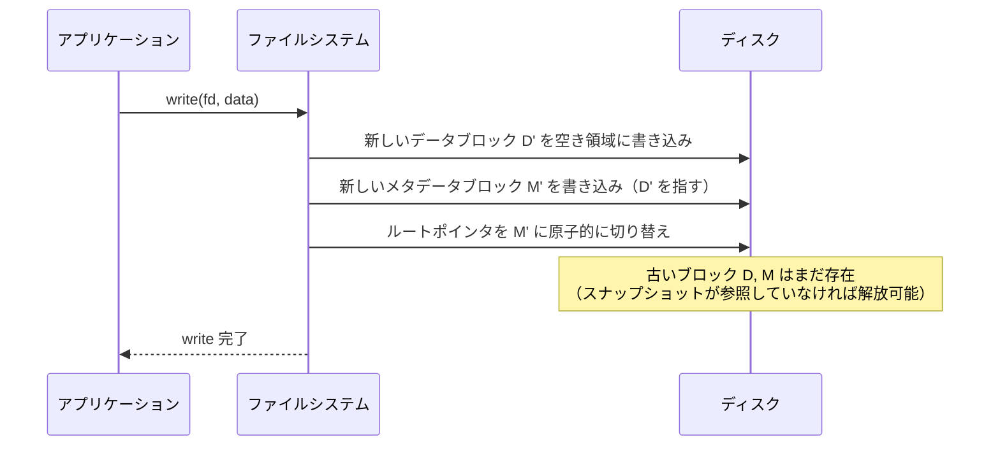

### Merkle Tree 構造とルートポインタの更新

CoW ファイルシステムの内部構造は、**Merkle Tree（ハッシュ木）** に類似した構造を持っている。データブロックが変更されると、そのブロックを指す間接ブロック（メタデータ）も更新が必要になり、この更新は木構造を根に向かって伝播する。最終的にルートノード（uberblock / superblock）が更新されることで、変更がアトミックにコミットされる。

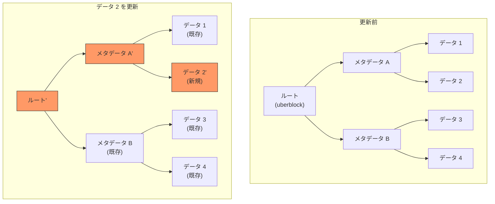

上図では、「データ 2」が変更されると、「データ 2'」が新しい場所に書き込まれ、それを指す「メタデータ A'」も新しく作成される。最終的に「ルート'」も新しく作成され、ルートポインタの切り替えにより変更が確定する。変更されていない「メタデータ B」「データ 1」「データ 3」「データ 4」は既存のものがそのまま共有される。

## ZFS のアーキテクチャ

### ストレージプールモデル（zpool）

ZFS の最も革新的な設計の一つが、**ストレージプール（zpool）** の概念である。従来のファイルシステムでは、パーティション → ボリュームマネージャ → ファイルシステムという階層構造が必要であった。ZFS はこれらを統合し、物理ディスクの集合から直接ファイルシステムを作成する。

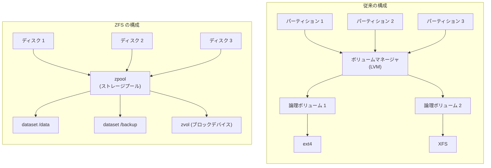

zpool の主要な特徴は以下の通りである。

- **動的な容量割り当て**: データセット間でストレージ容量を動的に共有する。事前にパーティションサイズを決める必要がない
- **VDEV（仮想デバイス）**: 物理ディスクを VDEV として抽象化し、ミラーリングや RAID-Z などの冗長化構成を柔軟に組める
- **オンラインでの拡張**: プールにディスクを追加することで、すべてのデータセットが自動的に拡張された容量を利用可能になる

::: tip VDEV の構成例
```bash
# mirror VDEV (RAID 1 相当)
zpool create mypool mirror /dev/sda /dev/sdb

# RAID-Z1 VDEV (RAID 5 相当、1台まで故障許容)
zpool create mypool raidz1 /dev/sda /dev/sdb /dev/sdc

# RAID-Z2 VDEV (RAID 6 相当、2台まで故障許容)
zpool create mypool raidz2 /dev/sda /dev/sdb /dev/sdc /dev/sdd

# 複合構成: データ用 RAID-Z2 + キャッシュ用 SSD + ログ用 SSD
zpool create mypool \
    raidz2 /dev/sda /dev/sdb /dev/sdc /dev/sdd \
    cache /dev/nvme0n1 \
    log mirror /dev/nvme1n1 /dev/nvme2n1
```
:::

### DMU（Data Management Unit）と SPA（Storage Pool Allocator）

ZFS の内部アーキテクチャは、明確に分離されたレイヤーで構成されている。

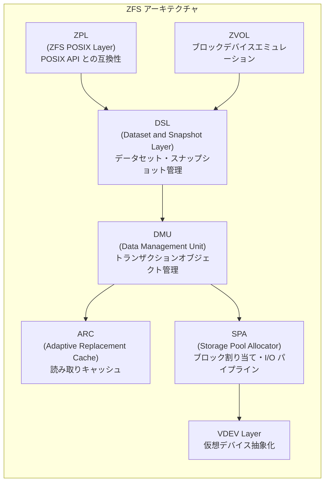

**DMU** は ZFS の中核をなすコンポーネントであり、以下の責務を持つ。

- **オブジェクトベースのストレージ**: ファイルやディレクトリを「オブジェクト」として管理する。各オブジェクトは dnode（ディスク上のメタデータ構造体）によって記述される
- **トランザクショングループ（TXG）**: 書き込みをトランザクショングループに集約し、一定間隔（デフォルト 5秒）でディスクにコミットする。これにより、小さな書き込みが効率的にバッチ処理される
- **チェックサムの管理**: すべてのブロックにチェックサムを付与し、読み込み時に検証する

**SPA** はブロックの割り当てとI/Oパイプラインを管理する。

- **ブロック割り当て**: metaslab allocator と呼ばれるアロケータが、ディスク上の空き領域を metaslab 単位で管理する
- **I/O パイプライン**: 書き込み時のチェックサム計算、圧縮、暗号化、RAID-Z のパリティ計算などを段階的に処理する
- **uberblock**: プールの状態を表すルートブロック。TXG のコミット時にアトミックに更新される

### ARC（Adaptive Replacement Cache）

ZFS は独自のキャッシュ機構である **ARC** を持っている。ARC は IBM の研究から生まれたアルゴリズムであり、従来の LRU（Least Recently Used）キャッシュの限界を克服するために設計された。

LRU キャッシュの問題点は、**頻繁にアクセスされるデータ（frequency）** と **最近アクセスされたデータ（recency）** のバランスを適切に取れないことである。例えば、大量のデータを一度だけスキャンする操作が行われると、頻繁にアクセスされる「ホットデータ」がキャッシュから追い出されてしまう。

ARC はこの問題を以下の仕組みで解決する。

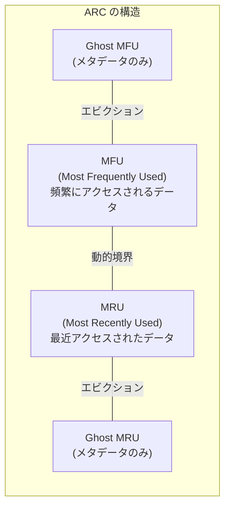

- **MRU リスト**: 最近アクセスされたデータを保持する
- **MFU リスト**: 頻繁にアクセスされるデータを保持する
- **Ghost リスト**: キャッシュから追い出されたデータのメタデータ（キーのみ）を保持する。Ghost リストへのヒットにより、MRU と MFU の境界を動的に調整する

例えば、Ghost MRU に多くのヒットが発生する場合、最近アクセスされたデータが追い出されすぎていると判断し、MRU の領域を拡大する。逆に Ghost MFU へのヒットが多ければ、MFU の領域を拡大する。この適応的な動作により、ワークロードの変化に自動的に対応できる。

::: details L2ARC — セカンダリキャッシュ
ZFS は、メインメモリの ARC に加えて、SSD をセカンダリキャッシュとして利用する **L2ARC** をサポートしている。ARC から追い出されたデータが L2ARC に格納され、HDD からの読み込みを回避できる。これにより、「少ないメモリ + 大量の HDD + 少量の SSD」という構成で高いキャッシュヒット率を実現できる。

```bash
# L2ARC デバイスの追加
zpool add mypool cache /dev/nvme0n1
```
:::

### エンドツーエンドのデータ整合性

ZFS の設計思想の中でもっとも重要なものの一つが、**エンドツーエンドのデータ整合性**である。これは「ディスクに書き込んだデータが、読み出したときに正しいことを保証する」という一見当たり前の要件であるが、現実のストレージシステムでは驚くほど困難な課題である。

#### サイレントデータ破損の脅威

ハードウェアは完璧ではない。ディスク上のビットは宇宙線、磁気的な劣化、ファームウェアのバグなどにより、エラーを報告することなく反転することがある。この現象は **bit rot** または **サイレントデータ破損** と呼ばれる。CERN の研究によれば、大規模ストレージシステムでは年間で数千件のサイレントデータ破損が発生しうる。

従来のファイルシステムやハードウェア RAID コントローラは、この問題に対して無力である。RAID コントローラはビット単位のエラーを検出できず、ファイルシステムはデータブロックのチェックサムを持たない。

#### ZFS のチェックサム戦略

ZFS は、**すべてのブロック**（データブロックとメタデータブロックの両方）にチェックサムを付与する。重要なのは、チェックサムが **親ブロックに格納される** という設計である。

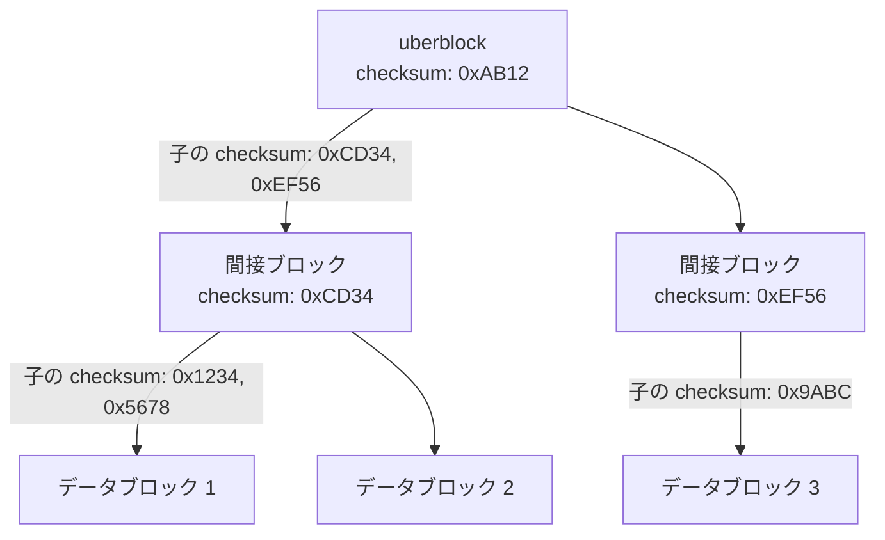

チェックサムを親ブロックに格納する理由は、データとチェックサムが同じブロックに存在すると、ブロック全体が破損した場合にチェックサムも一緒に破損してしまうためである。親ブロックにチェックサムを格納することで、子ブロックの破損を確実に検出できる。

さらに、ZFS は冗長構成（ミラーまたは RAID-Z）を使用している場合、破損を検出した際に**自動修復（self-healing）**を行う。正しいコピーから破損したコピーを再構築し、透過的にデータを返す。

::: warning scrub の重要性
ZFS の `scrub` 操作は、プール上のすべてのデータを読み込んでチェックサムを検証し、破損を検出・修復する。定期的な scrub の実行が推奨される（例えば月次）。scrub を行わないと、二重障害（冗長化で対応できない同時破損）が発生するまで破損が検出されないリスクがある。

```bash
# scrub の実行
zpool scrub mypool

# scrub のステータス確認
zpool status mypool
```
:::

### ZFS のスナップショットとクローン

CoW の設計により、ZFS のスナップショットは**ほぼゼロコスト**で作成できる。スナップショットは、ある時点のデータセットの状態を読み取り専用で保持するものであり、その実装は「現在のルートポインタを記録する」という単純な操作に帰着する。

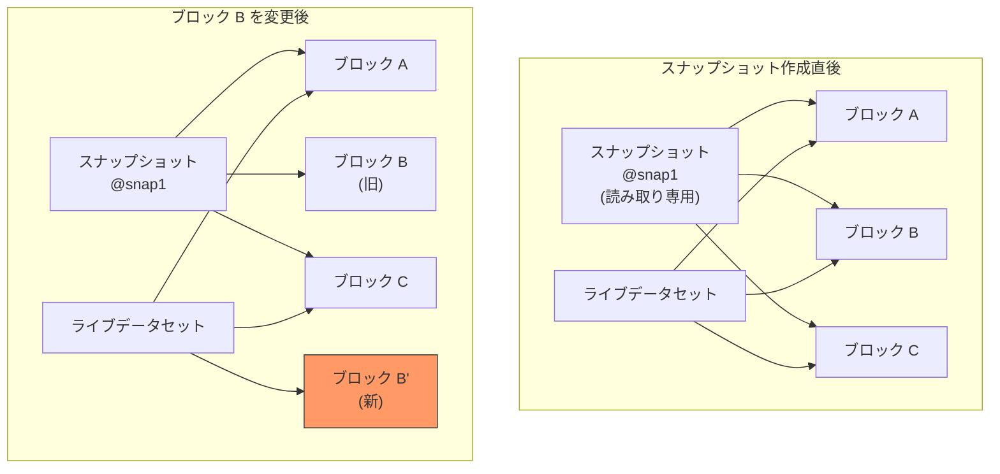

スナップショット作成直後は、ライブデータセットとスナップショットがすべてのブロックを共有する。ライブデータセットに変更が加えられると、CoW により新しいブロックが作成されるが、スナップショットは引き続き古いブロックを参照し続ける。追加のストレージは、変更が発生した分だけ消費される。

```bash
# スナップショットの作成
zfs snapshot mypool/data@before-upgrade

# スナップショットの一覧
zfs list -t snapshot

# スナップショットへのロールバック
zfs rollback mypool/data@before-upgrade

# クローン（書き込み可能なスナップショットのコピー）の作成
zfs clone mypool/data@before-upgrade mypool/data-clone
```

**クローン**は、スナップショットから派生した書き込み可能なデータセットである。クローンもまたスナップショットとブロックを共有するため、即座に作成でき、初期のストレージ消費はほぼゼロである。これは、開発環境のテストデータベースを本番のコピーから素早く作成する、といった用途に極めて有用である。

### send / receive によるレプリケーション

ZFS は `send` / `receive` コマンドにより、データセットの効率的なレプリケーションをサポートしている。

```bash
# フルバックアップ（初回）
zfs send mypool/data@snap1 | ssh remote zfs receive backup/data

# 増分バックアップ（差分のみ転送）
zfs send -i mypool/data@snap1 mypool/data@snap2 | ssh remote zfs receive backup/data
```

増分 send は、2つのスナップショット間で変更されたブロックのみを転送するため、非常に効率的である。この機能は、ZFS の CoW 設計から自然に導出される。すべての変更がトランザクショングループ単位で管理されているため、「どのブロックが変更されたか」を正確に特定できるのだ。

## Btrfs のアーキテクチャ

### B-Tree を中心とした設計

Btrfs の内部構造は、名前が示す通り **B-Tree** を中心に設計されている。ZFS がブロックポインタベースの構造を用いるのに対し、Btrfs はほぼすべてのメタデータとデータ参照を B-Tree に格納する。

Btrfs の主要な B-Tree は以下の通りである。

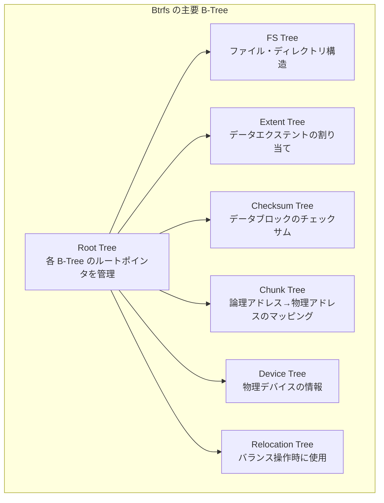

- **Root Tree**: すべての B-Tree のルートポインタを管理するマスターテーブル
- **FS Tree（File System Tree）**: ファイルやディレクトリの inode、ファイル名、エクステント情報を格納する。サブボリュームごとに独立した FS Tree が存在する
- **Extent Tree**: ディスク上のデータエクステント（連続したブロックの塊）の割り当て状態を管理する
- **Checksum Tree**: データエクステントに対応するチェックサムを格納する
- **Chunk Tree**: 論理アドレスから物理デバイス上のアドレスへのマッピングを管理する。これにより、複数デバイスにまたがるストレージプールを実現する

### Btrfs における CoW B-Tree

Btrfs の B-Tree は、通常の B-Tree とは異なり **CoW セマンティクス** で動作する。ノードを更新する際に、そのノードを in-place で書き換えるのではなく、新しいノードを割り当ててデータをコピーし、親のポインタを更新する。この更新は根まで伝播する。

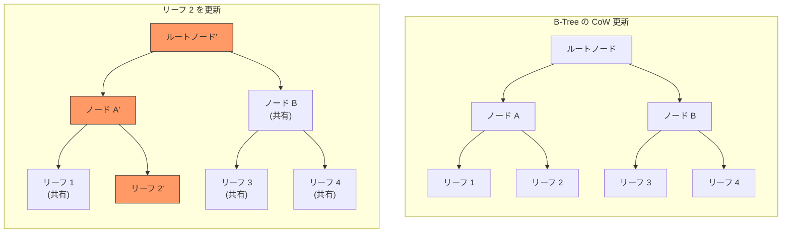

この設計により、B-Tree の更新操作自体がトランザクション的な一貫性を持つ。ルートポインタの切り替えが完了するまで、古い B-Tree は完全に有効な状態を維持する。

### サブボリュームとスナップショット

Btrfs のサブボリュームは、ZFS のデータセットに相当する概念である。各サブボリュームは独自の FS Tree を持ち、独立したファイルシステムとしてマウントできる。

```bash
# サブボリュームの作成
btrfs subvolume create /mnt/data/subvol1

# サブボリュームの一覧
btrfs subvolume list /mnt/data

# スナップショットの作成（読み取り専用）
btrfs subvolume snapshot -r /mnt/data/subvol1 /mnt/data/snap1

# スナップショットの作成（書き込み可能）
btrfs subvolume snapshot /mnt/data/subvol1 /mnt/data/writable-snap
```

Btrfs のスナップショットは ZFS と同様に CoW により効率的に作成される。Btrfs のスナップショットは実質的に「サブボリュームのクローン」であり、ZFS におけるスナップショットとクローンの区別が明確でない（Btrfs では読み取り専用フラグの有無で区別される）。

::: tip send / receive
Btrfs も ZFS と同様に `send` / `receive` による増分レプリケーションをサポートしている。

```bash
# フルバックアップ
btrfs send /mnt/data/snap1 | btrfs receive /mnt/backup/

# 増分バックアップ
btrfs send -p /mnt/data/snap1 /mnt/data/snap2 | btrfs receive /mnt/backup/
```
:::

### Btrfs の RAID 実装

Btrfs はファイルシステムレベルで RAID 機能を統合している。論理的なチャンク（通常 1 GiB）を物理デバイスにマッピングする際に、チャンクの種類（data, metadata, system）ごとに異なる RAID プロファイルを適用できる。

```bash
# RAID 1 で構成（データ・メタデータ共にミラーリング）
mkfs.btrfs -d raid1 -m raid1 /dev/sda /dev/sdb

# データは RAID 0、メタデータは RAID 1
mkfs.btrfs -d raid0 -m raid1 /dev/sda /dev/sdb

# RAID 10（4台以上必要）
mkfs.btrfs -d raid10 -m raid10 /dev/sda /dev/sdb /dev/sdc /dev/sdd
```

::: danger Btrfs RAID 5/6 の注意
Btrfs の RAID 5/6 実装には、2026年時点でも「write hole」問題が完全には解決されていない。パリティの更新とデータの更新が非アトミックに行われるため、クラッシュ時にパリティの不整合が発生する可能性がある。本番環境では RAID 5/6 の使用は推奨されない。RAID 1 または RAID 10 を使用すべきである。
:::

### 透過的圧縮

Btrfs は透過的なデータ圧縮をサポートしている。ファイルシステムレベルで圧縮を行うことで、アプリケーションの変更なしにストレージ消費量を削減できる。

```bash
# zstd 圧縮を有効化（推奨）
mount -o compress=zstd /dev/sda /mnt/data

# lzo 圧縮（低CPU負荷）
mount -o compress=lzo /dev/sda /mnt/data

# ファイル単位での圧縮設定
btrfs property set /mnt/data/logs compression zstd

# 圧縮率の確認
compsize /mnt/data
```

ZFS も同様に透過的圧縮をサポートしており、LZ4（デフォルト推奨）や zstd などのアルゴリズムを選択できる。

```bash
# ZFS での圧縮有効化
zfs set compression=lz4 mypool/data

# zstd 圧縮（より高い圧縮率）
zfs set compression=zstd mypool/data

# 圧縮率の確認
zfs get compressratio mypool/data
```

## CoW ファイルシステムのトレードオフ

### 書き込み増幅（Write Amplification）

CoW の最大のデメリットの一つが **書き込み増幅** である。小さなデータの変更でも、メタデータの更新がツリーの根まで伝播するため、実際のディスク書き込み量が増大する。

例えば、4 KiB のデータブロックを1つ変更する場合、以下の書き込みが発生する。

1. 新しいデータブロック（4 KiB）
2. 新しい間接ブロック（各レベルで 1ブロック、木の深さに応じて複数）
3. 更新されたチェックサム
4. uberblock / superblock の更新

この書き込み増幅は、特にランダム書き込みが多いワークロードで顕著になる。SSD の場合、書き込み増幅はデバイスの寿命に直接影響するため、注意が必要である。

### フラグメンテーション

CoW はデータを新しい場所に書き込むため、時間の経過とともに**フラグメンテーション**が進行する傾向がある。従来のファイルシステムでは、ファイルのデータブロックがディスク上で連続して配置される（シーケンシャルレイアウト）ことが多いが、CoW ファイルシステムでは更新のたびにデータが分散していく。

HDD ではフラグメンテーションがシーク時間の増大を招き、パフォーマンスに直接影響する。SSD ではシーク時間は問題にならないが、大きなシーケンシャル I/O が小さなランダム I/O に分割されることで、スループットが低下する可能性がある。

::: warning Btrfs のデフラグメンテーション
Btrfs は `btrfs filesystem defragment` コマンドでデフラグメンテーションが可能であるが、**デフラグ操作はスナップショットとの共有を解除してしまう**点に注意が必要である。デフラグにより、スナップショットが参照していたブロックが新しいブロックにコピーされ、スナップショットのストレージ消費が大幅に増加する場合がある。

```bash
# デフラグ（スナップショットの共有を解除する可能性あり）
btrfs filesystem defragment -r /mnt/data
```
:::

### メモリ消費

ZFS は大量のメモリを消費する傾向がある。ARC はデフォルトでシステムメモリの大部分を占有し、メタデータのキャッシュにも多くのメモリが必要である。

ZFS の一般的な推奨メモリ量は以下の通りである。

- 最低限: 8 GiB
- 重複排除を使用する場合: 1 TiB あたり 1-5 GiB の追加メモリ（重複排除テーブルのため）
- ECC メモリの推奨: ZFS はデータ整合性を重視するため、ECC メモリの使用が強く推奨される

::: danger 重複排除の注意点
ZFS の重複排除（deduplication）機能は、同一のデータブロックを1つだけ格納することでストレージを節約する機能であるが、**重複排除テーブル（DDT）をメモリ上に保持する必要がある**ため、大量のメモリを消費する。1 TiB のデータに対して数 GiB のメモリが必要になる場合があり、メモリ不足に陥るとパフォーマンスが壊滅的に低下する。多くのユースケースでは、重複排除よりも圧縮（compression）の方が適切である。
:::

### 小さなランダム書き込みの性能

CoW ファイルシステムは、小さなランダム書き込みが多いワークロードでは、従来のファイルシステムに比べてパフォーマンスが低下する傾向がある。典型的な例として、データベースのワークロードがある。データベースは通常、小さなページ単位でランダムにデータを更新するため、CoW の書き込み増幅が顕著に現れる。

この問題に対する一般的な対策として、データベースファイルに対して CoW を無効化することがある。

```bash
# Btrfs: ファイルに NOCOW 属性を設定
chattr +C /mnt/data/database.db

# Btrfs: ディレクトリに NOCOW を設定（以後そのディレクトリ内に作成されるファイルに適用）
chattr +C /mnt/data/databases/

# ZFS: データセットのレコードサイズを調整
zfs set recordsize=16k mypool/database
```

::: warning NOCOW の制約
Btrfs で NOCOW を設定したファイルは、チェックサム検証やスナップショットの CoW 共有ができなくなる。つまり、CoW ファイルシステムの主要なメリットを放棄することになる。データベースには専用のデータセット / サブボリュームを用意し、NOCOW を適用するのが一般的なベストプラクティスである。
:::

## ZFS と Btrfs の比較

### 機能比較

| 機能 | ZFS | Btrfs |
|------|-----|-------|
| CoW | 対応 | 対応 |
| チェックサム | 全ブロック（メタデータ+データ） | 全ブロック（メタデータ+データ） |
| 自動修復 | 対応（冗長構成時） | 対応（冗長構成時） |
| スナップショット | 対応 | 対応 |
| クローン | 対応 | 対応（書き込み可能スナップショット） |
| 送受信レプリケーション | 対応 | 対応 |
| 透過的圧縮 | 対応（LZ4, zstd 等） | 対応（zstd, lzo, zlib） |
| 重複排除 | 対応（非推奨） | 対応（帯域外のみ） |
| 暗号化 | 対応（ネイティブ） | 非対応（dm-crypt で代替） |
| RAID | RAID-Z1/Z2/Z3, ミラー | RAID 0/1/10/5/6（5/6 は不安定） |
| クォータ | 対応 | 対応（qgroup） |
| POSIX ACL | 対応 | 対応 |
| オンラインリサイズ | 拡大のみ | 拡大・縮小 |
| デバイス削除 | 制限的 | 対応 |
| ライセンス | CDDL（Linux カーネル非統合） | GPL v2（Linux カーネル統合） |

### 設計哲学の違い

**ZFS** は「エンタープライズグレードのストレージシステム」としての信頼性と一貫性を最優先する。ストレージプールの設計は保守的で、例えば VDEV をプールから削除することは基本的にできない（ミラー VDEV の削除のみ対応）。この制約は、データの安全性を確保するための意図的な設計判断である。

**Btrfs** は「柔軟で進化的なファイルシステム」を目指している。デバイスの追加・削除、RAID プロファイルの変更、オンラインでのファイルシステム縮小など、ZFS よりも柔軟な操作が可能である。ただし、この柔軟性は一部の機能（特に RAID 5/6）の成熟度がまだ低いというトレードオフを伴う。

### 安定性と成熟度

ZFS は 20年以上の歴史を持ち、エンタープライズ環境で広く検証されてきた。特に FreeBSD と Solaris 系 OS では、ZFS はデフォルトのファイルシステムとして長年使用されている。OpenZFS プロジェクトにより、Linux 上でも安定した実装が提供されている。

Btrfs は ZFS と比較して新しいファイルシステムであり、一部の機能（特に RAID 5/6）はまだ実験的段階にある。ただし、データおよびメタデータの RAID 1/10 とスナップショット機能は十分に成熟しており、SUSE Linux Enterprise Server ではデフォルトファイルシステムとして採用されている。Facebook（Meta）も大規模な本番環境で Btrfs を使用していることが知られている。

## ユースケースと実運用

### NAS / ファイルサーバー

NAS（Network Attached Storage）は、CoW ファイルシステムのもっとも典型的なユースケースである。特に ZFS は、FreeNAS（現 TrueNAS）などの NAS ディストリビューションで広く採用されている。

NAS 環境での CoW ファイルシステムの利点は以下の通りである。

- **定期スナップショットによるバージョニング**: ユーザーが誤ってファイルを削除・上書きしても、スナップショットから簡単に復旧できる
- **データ整合性の保証**: ネットワーク越しに保存されたファイルの bit rot を検出・修復できる
- **効率的なバックアップ**: send / receive による増分バックアップで、遠隔地へのレプリケーションが効率的に行える

```bash
# 典型的な ZFS NAS 構成例

# プールの作成（RAID-Z2、6台のディスク）
zpool create tank raidz2 /dev/sd{a,b,c,d,e,f}

# データセットの作成と設定
zfs create tank/shared
zfs set compression=lz4 tank/shared
zfs set atime=off tank/shared

# 自動スナップショット用のデータセット
zfs create tank/shared/documents
zfs create tank/shared/photos
zfs create tank/shared/backups

# 15分ごとの自動スナップショット（zfs-auto-snapshot等のツールで）
# 保持ポリシー: 15分×4, 1時間×24, 1日×30, 1月×12
```

### コンテナとバーチャルマシン

CoW ファイルシステムのスナップショット機能は、コンテナ技術との相性が非常に良い。Docker は Btrfs と ZFS をストレージドライバとして公式にサポートしている。

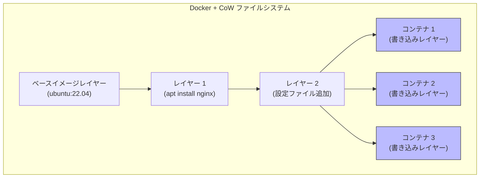

各コンテナは共通のイメージレイヤーを CoW で共有し、書き込みが発生した場合のみ新しいブロックが割り当てられる。これにより、100個のコンテナを起動しても、ベースイメージのストレージ消費は1つ分で済む。

### データベースサーバー

前述のように、データベースワークロードは CoW ファイルシステムと相性が悪い面がある。しかし、スナップショット機能はデータベースのバックアップに極めて有用である。

```bash
# ZFS スナップショットによるデータベースバックアップ
# 1. データベースをフリーズ（一貫性のあるスナップショットのため）
mysql -e "FLUSH TABLES WITH READ LOCK;"

# 2. スナップショットを作成（瞬時に完了）
zfs snapshot mypool/mysql@backup-$(date +%Y%m%d)

# 3. ロックを解放
mysql -e "UNLOCK TABLES;"

# フリーズ時間は通常数十ミリ秒程度
```

::: tip PostgreSQL と ZFS
PostgreSQL は WAL（Write-Ahead Logging）を使用しているため、ZFS スナップショットとの組み合わせで一貫性のあるバックアップが取得しやすい。`full_page_writes=on`（デフォルト有効）であれば、ZFS スナップショットから復旧した場合でも WAL リプレイにより一貫した状態に回復できる。ただし、`recordsize` を PostgreSQL のブロックサイズ（8 KiB）に合わせて調整することが推奨される。

```bash
zfs create -o recordsize=8k -o primarycache=metadata mypool/pgdata
```
:::

## CoW ファイルシステムの内部で起こること — 書き込みの一生

ここでは、ZFS を例に、1つの書き込み操作がファイルシステム内部でどのように処理されるかを追跡する。

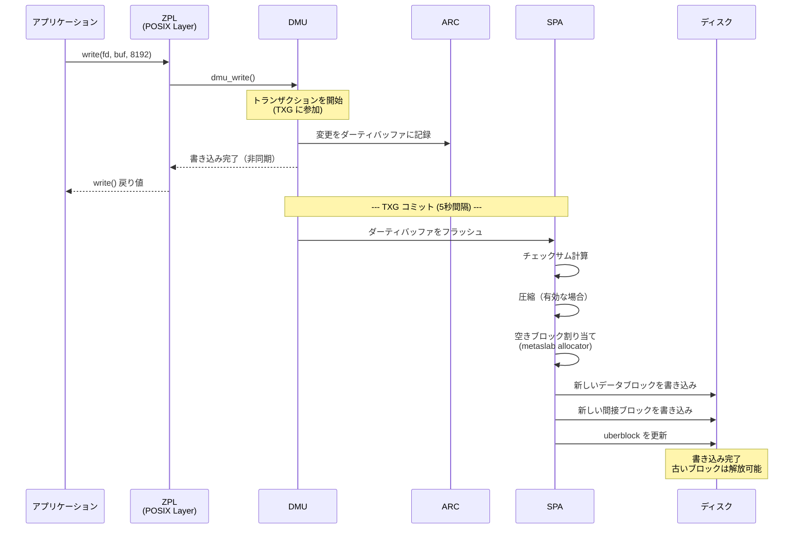

1. **アプリケーションが write() を呼び出す**: ZPL（ZFS POSIX Layer）がシステムコールを受け取り、DMU に転送する
2. **DMU がトランザクショングループ（TXG）に変更を記録**: 変更はまず ARC 内のダーティバッファに記録される。この時点で write() はアプリケーションに戻る（非同期書き込み）
3. **TXG のコミット**: デフォルトで 5秒ごと、または一定量のダーティデータが溜まった場合に、TXG がコミットされる
4. **SPA がI/Oパイプラインを実行**: チェックサム計算、圧縮、暗号化（有効な場合）、ブロック割り当て、RAID パリティ計算が順に行われる
5. **ディスクへの書き込み**: 新しいデータブロック → 新しい間接ブロック → uberblock の順に書き込まれる。uberblock の更新が最後に行われることで、トランザクションの原子性が保証される

::: details sync write の場合
アプリケーションが `fsync()` や `O_SYNC` で同期書き込みを要求した場合、ZFS は **ZIL（ZFS Intent Log）** にトランザクションを記録する。ZIL は、TXG のコミットを待たずに永続性を保証するための先行書き込みログである。ZIL はストレージプール内の専用領域、または別途指定された高速デバイス（SLOG: Separate Log Device）に書き込まれる。

```bash
# SLOG デバイスの追加（高速 NVMe SSD を使用）
zpool add mypool log mirror /dev/nvme1n1 /dev/nvme2n1
```
:::

## 将来の展望

### ZFS の進化

OpenZFS プロジェクトは継続的に開発が進められており、以下のような機能強化が進行中である。

- **Block Cloning**: `cp --reflink` のような操作で、ファイルコピー時にブロックを共有する機能。Btrfs には以前から存在していたが、ZFS 2.2 で導入された
- **RAIDZ Expansion**: 既存の RAIDZ VDEV にディスクを追加して容量を拡張する機能。従来は新しい VDEV を追加するしかなかった
- **永続的 L2ARC**: システム再起動後も L2ARC キャッシュを保持する機能

### Btrfs の成熟

Btrfs は Linux カーネルの一部として積極的に開発されており、以下の点で成熟が進んでいる。

- **RAID 5/6 の安定化**: write hole 問題の解決に向けた取り組みが進行中
- **zoned storage のサポート**: SMR（Shingled Magnetic Recording）HDD や ZNS（Zoned Namespace）SSD への対応
- **Extent Tree v2**: スケーラビリティ向上のための新しいエクステント管理機構
- **FIEMAP とデフラグの改善**: フラグメンテーション問題の軽減

### bcachefs — 新たな選択肢

Linux カーネル 6.7（2024年）でマージされた **bcachefs** は、CoW ファイルシステムの新たな選択肢として注目されている。bcachefs は ZFS と Btrfs の長所を取り入れつつ、より優れたパフォーマンスを目指して設計されている。特にチェックサムの実装、スナップショット機能、階層型キャッシングなど、ZFS の設計思想を多く取り入れている。bcachefs は GPL v2 ライセンスであり、Linux カーネルにネイティブに統合されている。

## まとめ

コピーオンライトファイルシステムは、データの整合性、スナップショット、ストレージ管理の柔軟性という現代のストレージ要件に対する根本的な解答である。その核心は「データを上書きしない」というシンプルな原則にあり、この原則からスナップショット、チェックサム、自動修復、効率的なレプリケーションといった強力な機能が自然に導出される。

ZFS は 20年以上の実績を持つ成熟したシステムであり、特にデータの整合性と信頼性が求められる環境で広く採用されている。Btrfs は Linux ネイティブの CoW ファイルシステムとして急速に成熟しており、特にスナップショットとサブボリューム管理の柔軟性に優れる。

一方で、CoW の設計は書き込み増幅、フラグメンテーション、メモリ消費という固有のトレードオフを伴う。これらのトレードオフを理解し、ワークロードに応じた適切な設定（レコードサイズの調整、NOCOW の活用、圧縮の選択など）を行うことが、CoW ファイルシステムを効果的に運用する鍵となる。

従来の「ファイルシステムはブロックを上書きするもの」という前提を捨て、「データを不変として扱い、変更は常に新しいコピーとして記録する」という発想の転換こそが、CoW ファイルシステムの本質的な貢献である。
