# CPUキャッシュ — メモリ階層とキャッシュコヒーレンス

## 1. 背景 — メモリウォール問題

### 1.1 CPUとメモリの速度差

現代のコンピュータにおいて、CPUとメインメモリの間には巨大な速度差が存在する。CPUの演算速度は半導体プロセスの微細化やアーキテクチャの革新によって急速に向上し続けてきた一方、DRAMのアクセスレイテンシの改善ペースは緩やかなままである。

1980年代には、CPUのクロックサイクルとDRAMのアクセス時間はほぼ同等であった。しかし2020年代の現在、CPUは1クロックサイクルあたり0.3ns程度（3GHz動作時）で演算を行うのに対し、DRAMへのアクセスには約50〜100nsを要する。つまり、CPUがメインメモリからデータを取得する間に、**150〜300クロックサイクル以上**を空費することになる。

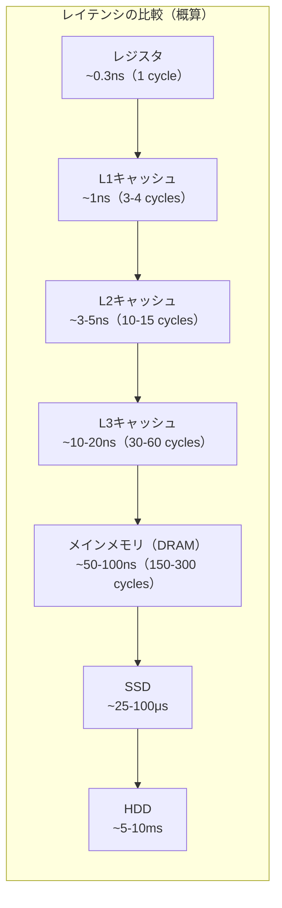

この乖離は**メモリウォール（Memory Wall）**と呼ばれ、1995年にWulf and McKeeによる論文 "Hitting the Memory Wall: Implications of the Obvious" で体系的に指摘された。メモリウォール問題は、CPUの性能向上がメモリアクセス速度によって律速されるという、コンピュータアーキテクチャにおける根本的な課題である。

### 1.2 キャッシュという解決策

メモリウォール問題に対する最も効果的な解決策が、CPUとメインメモリの間に**高速な小容量メモリ（キャッシュ）**を配置する階層構造の導入である。キャッシュは、頻繁にアクセスされるデータのコピーをCPUの近くに保持することで、メインメモリへのアクセス頻度を大幅に削減する。

キャッシュが有効に機能するのは、プログラムのメモリアクセスパターンに**局所性（locality）**が存在するからである。

## 2. キャッシュの基本原理 — 局所性

キャッシュが効果を発揮する理論的根拠は、プログラムのメモリアクセスパターンに見られる2種類の局所性にある。

### 2.1 時間的局所性（Temporal Locality）

**時間的局所性**とは、最近アクセスされたデータが近い将来に再びアクセスされる可能性が高いという性質である。

例えば、ループ内で使用される変数やカウンタは、ループの各反復で繰り返しアクセスされる。関数内のローカル変数も、その関数の実行中は継続的に参照される。時間的局所性が高いデータをキャッシュに保持しておけば、メインメモリへのアクセスを大幅に削減できる。

```c
// temporal locality example
int sum = 0;
for (int i = 0; i < 1000; i++) {
    sum += i;  // 'sum' is accessed repeatedly
}
```

この例では、変数 `sum` はループの1000回の反復すべてでアクセスされる。`sum` がキャッシュに保持されていれば、最初の1回を除くすべてのアクセスがキャッシュヒットとなる。

### 2.2 空間的局所性（Spatial Locality）

**空間的局所性**とは、あるアドレスがアクセスされた場合、その近傍のアドレスも近い将来にアクセスされる可能性が高いという性質である。

配列の逐次走査は空間的局所性の典型例である。配列の要素はメモリ上に連続して配置されるため、1つの要素にアクセスした後、隣接する要素にもアクセスする可能性が極めて高い。

```c
// spatial locality example
int arr[1024];
int total = 0;
for (int i = 0; i < 1024; i++) {
    total += arr[i];  // sequential access pattern
}
```

キャッシュは、この空間的局所性を活用するため、1バイト単位ではなく**キャッシュライン（Cache Line）**と呼ばれるブロック単位（通常64バイト）でデータを転送する。1つの `int` 型変数（4バイト）にアクセスした際、そのアドレスを含む64バイト分のデータがまとめてキャッシュに読み込まれるため、隣接する15個の `int` 型変数も同時にキャッシュに載ることになる。

### 2.3 局所性の欠如とその影響

局所性が低いアクセスパターン（ランダムアクセス、大きなストライドでのアクセスなど）では、キャッシュの恩恵をほとんど受けられない。これがキャッシュの本質的な限界であり、アルゴリズムやデータ構造の設計においてキャッシュフレンドリーな配置を意識することの重要性に直結する。

## 3. キャッシュの構造

キャッシュは、メインメモリのどのアドレスのデータをどこに格納するかという**マッピング方式**によって分類される。マッピング方式は、キャッシュのヒット率、検索速度、ハードウェアの複雑さのトレードオフを反映している。

### 3.1 ダイレクトマップ（Direct-Mapped）

**ダイレクトマップキャッシュ**は、メモリの各ブロックがキャッシュ内の決まった1つのラインにのみ配置できる方式である。メモリアドレスの一部（インデックスビット）を使ってキャッシュラインを一意に特定する。

```
メモリアドレス: | タグ | インデックス | オフセット |
```

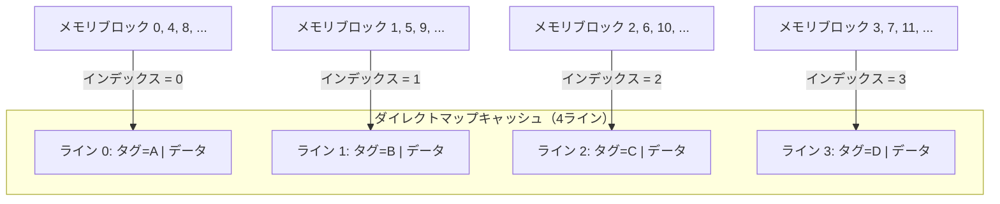

**長所**: ハードウェアが最もシンプルであり、検索（ルックアップ）が1回の比較で済む。

**短所**: 同一インデックスにマッピングされる複数のメモリブロックに交互にアクセスする場合、互いを追い出し合う**コンフリクトミス（conflict miss）**が頻発する。これは**スラッシング（thrashing）**と呼ばれ、キャッシュの有効性を著しく損なう。

### 3.2 フルアソシエイティブ（Fully Associative）

**フルアソシエイティブキャッシュ**は、メモリの各ブロックをキャッシュ内のどのラインにも配置できる方式である。インデックスの概念がなく、検索時にはすべてのキャッシュラインのタグを同時に比較する必要がある。

```
メモリアドレス: | タグ | オフセット |
```

**長所**: コンフリクトミスが発生しない。容量の許す限り、あらゆるメモリブロックをキャッシュに保持できる。

**短所**: すべてのタグを同時に比較するために**CAM（Content-Addressable Memory）**が必要であり、ハードウェアコストが大きい。大容量キャッシュでの実装は現実的ではなく、TLB（Translation Lookaside Buffer）のような小規模なキャッシュに限定して使用される。

### 3.3 セットアソシエイティブ（Set-Associative）

**セットアソシエイティブキャッシュ**は、ダイレクトマップとフルアソシエイティブの中間に位置する方式であり、現代のCPUキャッシュで最も広く採用されている。キャッシュを複数の**セット**に分割し、各セットに複数のライン（**ウェイ（way）**）を持たせる。

$n$ ウェイ・セットアソシエイティブキャッシュでは、メモリの各ブロックは特定の1つのセットにマッピングされるが、そのセット内の $n$ 個のウェイのいずれにも配置できる。

```
メモリアドレス: | タグ | セットインデックス | オフセット |
```

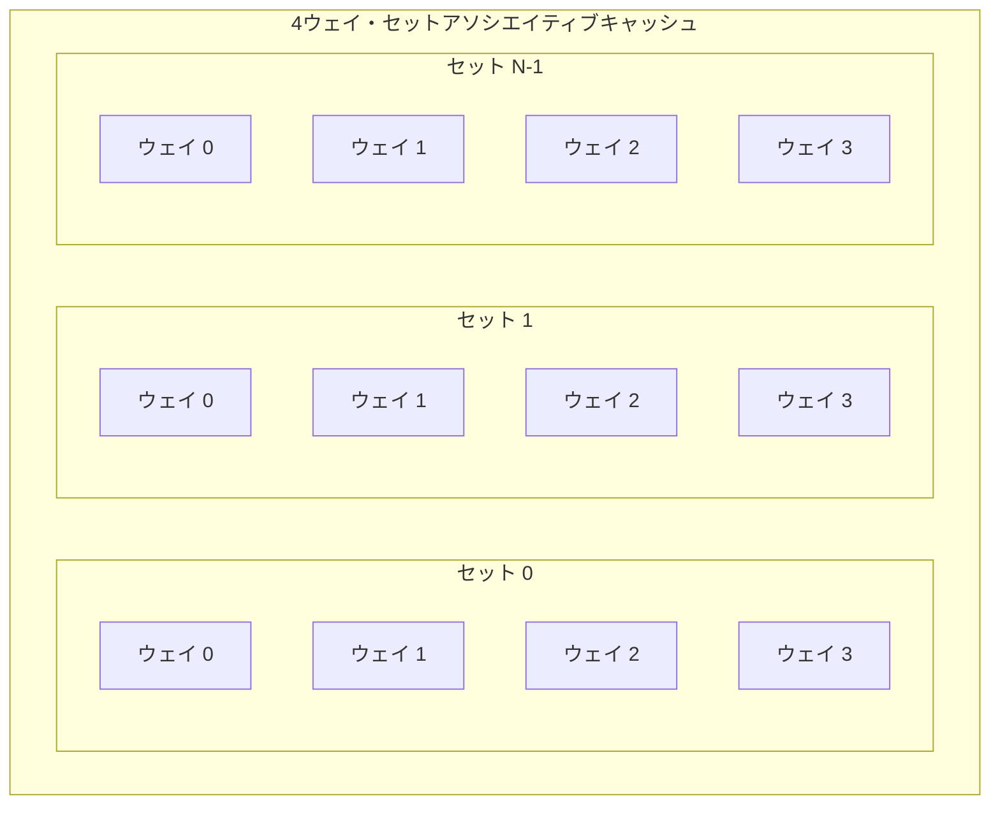

- **ダイレクトマップ** = 1ウェイ・セットアソシエイティブ
- **フルアソシエイティブ** = セット数が1のセットアソシエイティブ

現代のCPUでは、L1キャッシュに8ウェイ、L2キャッシュに8〜16ウェイ、L3キャッシュに12〜16ウェイのセットアソシエイティブが一般的である。ウェイ数を増やすとコンフリクトミスは減少するが、検索回路の複雑さとレイテンシが増大するため、適切なバランスが求められる。

## 4. キャッシュライン、タグ、インデックス、オフセット

キャッシュの動作を正確に理解するには、メモリアドレスがどのように分解されてキャッシュ内の位置とデータの同一性検証に利用されるかを把握する必要がある。

### 4.1 キャッシュライン（Cache Line）

キャッシュラインは、キャッシュとメインメモリ間のデータ転送の最小単位である。現代のほぼすべてのx86プロセッサ、およびARMプロセッサにおいて、キャッシュラインのサイズは**64バイト**である。

キャッシュラインが1バイトではなくブロック単位である理由は、前述の空間的局所性を活用するためである。1つのアドレスにアクセスした際に、その近傍のデータもまとめてキャッシュに読み込むことで、後続のアクセスがキャッシュヒットとなる確率を高める。

### 4.2 アドレスの分解

64バイトのキャッシュラインを持つ $n$ ウェイ・セットアソシエイティブキャッシュにおいて、メモリアドレスは以下の3つのフィールドに分解される。

```
|<---- タグ ---->|<-- セットインデックス -->|<-- オフセット -->|
|    上位ビット    |     中間ビット          |   下位6ビット    |
```

- **オフセット（Offset）**: キャッシュライン内のバイト位置を指定する。64バイトのキャッシュラインでは $\log_2 64 = 6$ ビットが必要。
- **セットインデックス（Set Index）**: データが配置されるセットを特定する。セット数が $S$ のとき $\log_2 S$ ビットが必要。
- **タグ（Tag）**: セット内の各ウェイに格納されたデータがどのメモリブロックのものかを識別する。残りの上位ビットすべてがタグとなる。

### 4.3 具体例

32KBの8ウェイ・セットアソシエイティブL1データキャッシュ（キャッシュラインサイズ64バイト）の場合を考える。

- キャッシュの総ライン数: $32{,}768 \div 64 = 512$ ライン
- セット数: $512 \div 8 = 64$ セット
- オフセット: $\log_2 64 = 6$ ビット
- セットインデックス: $\log_2 64 = 6$ ビット
- タグ: 残りのビット（64ビットアドレスの場合は $64 - 6 - 6 = 52$ ビット）

キャッシュへのアクセス時、CPUは以下の手順でデータを検索する。

1. アドレスからセットインデックスを抽出し、該当セットを特定する
2. そのセット内の8つのウェイすべてのタグを、アドレスのタグフィールドと**並列に比較**する
3. 一致するタグが見つかれば**キャッシュヒット**、見つからなければ**キャッシュミス**
4. ヒットの場合、オフセットを使ってキャッシュライン内の目的のバイトを取得する

### 4.4 キャッシュラインの構成要素

各キャッシュラインは、データ本体以外にも管理情報を持っている。

| フィールド | サイズ | 説明 |
|---|---|---|
| Valid ビット | 1ビット | このラインに有効なデータが格納されているか |
| Dirty ビット | 1ビット（Write-Backの場合） | キャッシュ上のデータがメモリと異なるか |
| Tag | 可変 | メモリブロックの識別子 |
| データ | 64バイト（通常） | メモリから読み込んだデータ本体 |
| 置換情報 | 可変 | LRUカウンタなどの置換ポリシー用データ |

## 5. L1/L2/L3 キャッシュ階層

### 5.1 階層構造の理由

キャッシュを1段階だけ設ける代わりに、複数階層のキャッシュを設ける理由は、**速度と容量のトレードオフ**にある。SRAMは高速だが高価で面積を消費する。CPUに極めて近い超高速キャッシュは物理的制約から大容量にできず、大容量キャッシュはレイテンシが増大する。そこで、段階的に速度と容量のバランスを変えた複数のキャッシュを積層することで、全体として高いヒット率と低いレイテンシを両立させる。

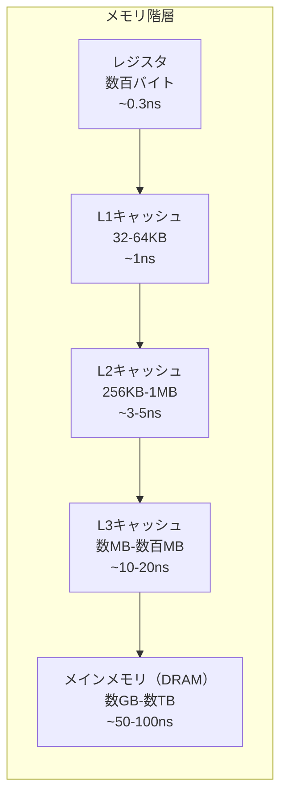

### 5.2 L1キャッシュ

L1キャッシュは、CPUコアに最も近いキャッシュであり、最速だが最小容量である。現代のプロセッサでは、L1キャッシュは**命令キャッシュ（L1i）**と**データキャッシュ（L1d）**に分離されている（**ハーバードアーキテクチャ**）。

- **容量**: 32〜64KB（命令/データ各）
- **レイテンシ**: 3〜5クロックサイクル（約1ns）
- **アソシエイティビティ**: 通常8ウェイ
- **配置**: 各CPUコアに専用

L1キャッシュが命令とデータに分離されている理由は、命令フェッチとデータアクセスが同時に発生するため、分離することで帯域幅を倍増させられるからである。また、命令キャッシュは読み取り専用（通常）であるため、設計を最適化できる。

### 5.3 L2キャッシュ

L2キャッシュは、L1のバックアップとして機能する中間層である。

- **容量**: 256KB〜1MB
- **レイテンシ**: 10〜15クロックサイクル（約3〜5ns）
- **アソシエイティビティ**: 8〜16ウェイ
- **配置**: 各CPUコアに専用（現代のプロセッサでは）

かつてはL2キャッシュがCPUチップ外部に配置されていた時代もあったが、現在ではほぼすべてのプロセッサでオンダイ（チップ上）に統合されている。L2キャッシュは命令とデータの両方を格納する**ユニファイドキャッシュ（unified cache）**である。

### 5.4 L3キャッシュ（LLC: Last Level Cache）

L3キャッシュは、複数のCPUコアで共有されるキャッシュであり、**LLC（Last Level Cache）**とも呼ばれる。

- **容量**: 数MB〜数百MB（プロセッサによる）
- **レイテンシ**: 30〜60クロックサイクル（約10〜20ns）
- **アソシエイティビティ**: 12〜16ウェイ
- **配置**: 同一チップ（ダイ）上の全コアで共有

L3キャッシュが共有されていることには、いくつかの重要な意味がある。

1. **コア間のデータ共有**: あるコアが書き込んだデータを別のコアが読み取る場合、L3を経由することで効率的にデータを共有できる
2. **容量の柔軟な利用**: 特定のコアがL3を多く消費しても、他のコアがアイドルであれば問題にならない
3. **コヒーレンスのアンカーポイント**: L3がキャッシュコヒーレンスプロトコルのディレクトリとして機能する実装がある（IntelのSnoop Filterなど）

### 5.5 包含・排他・非包含ポリシー

マルチレベルキャッシュにおいて、上位レベルと下位レベルのキャッシュの間のデータ保持に関する3つのポリシーがある。

#### 包含型（Inclusive）

上位キャッシュのデータは必ず下位キャッシュにも存在する。つまり、L1のすべてのデータはL2にも、L2のすべてのデータはL3にも含まれる。

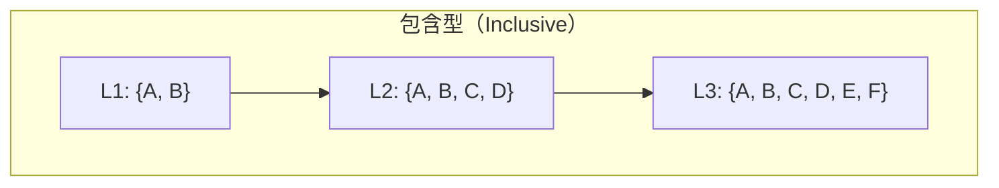

- **長所**: コヒーレンスの管理が容易。L3を見ればデータの所在を把握できるため、スヌープフィルタとして活用可能。
- **短所**: 上位キャッシュのデータが下位キャッシュの容量を「浪費」する。L1が64KB、L2が256KBの場合、実質的な排他容量は256KBではなく192KBに留まる。

#### 排他型（Exclusive）

上位キャッシュにあるデータは下位キャッシュには存在しない。L1から追い出されたデータがL2に格納される（victim cache的な動作）。

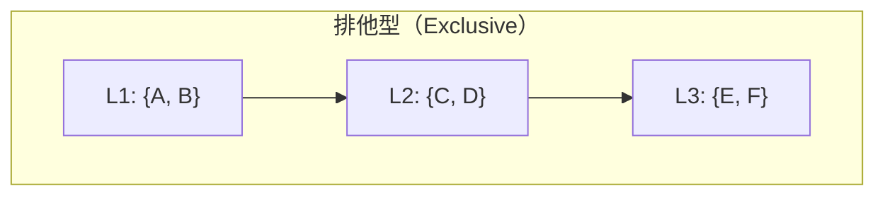

- **長所**: キャッシュ容量を最大限に活用できる。全階層の合計容量が実質的な総キャッシュ容量となる。
- **短所**: データの移動が頻繁に発生し、コヒーレンスの管理が複雑になる。

AMDのZenアーキテクチャでは、L2とL3の間に排他的な関係を採用している。

#### 非包含型（Non-Inclusive, NINE: Non-Inclusive Non-Exclusive）

包含も排他も強制しない折衷的なポリシーである。上位キャッシュのデータが下位に存在してもしなくてもよい。

- **長所**: 設計の柔軟性が高く、包含型の容量浪費も排他型の複雑さも回避できる。
- **短所**: データの所在追跡のために追加のメカニズム（ディレクトリなど）が必要。

IntelのSkylake-SP以降のサーバプロセッサでは、L3にNINEポリシーを採用している。

## 6. 書き込みポリシー

キャッシュ上のデータに対して書き込みが発生した場合、その変更をメインメモリにいつ反映するかを決定するのが書き込みポリシーである。

### 6.1 Write-Through（ライトスルー）

**Write-Through**は、キャッシュへの書き込みと同時にメインメモリへの書き込みも行う方式である。

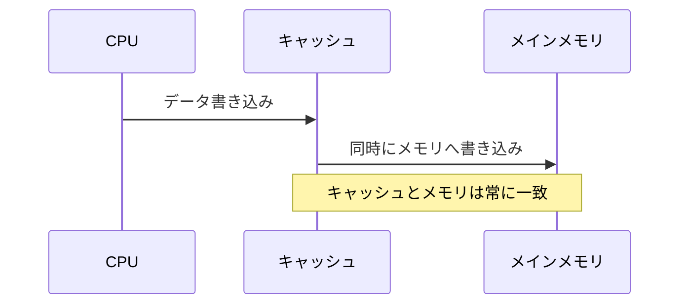

- **長所**: キャッシュとメモリの一貫性が常に保たれる。設計がシンプルで、電源障害時のデータ損失リスクが低い。
- **短所**: すべての書き込みがメインメモリへのアクセスを伴うため、書き込み性能が低い。

Write-Throughの性能問題を緩和するために、**ライトバッファ（write buffer）**が併用されることが多い。ライトバッファはメモリへの書き込みを一時的に蓄積し、CPUがメモリ書き込みの完了を待たずに次の処理を続行できるようにする。

### 6.2 Write-Back（ライトバック）

**Write-Back**は、書き込みをキャッシュに対してのみ行い、メインメモリへの反映はキャッシュラインが追い出される時点まで遅延させる方式である。書き込みが行われたキャッシュラインには**Dirty ビット**がセットされ、このラインがメモリと異なる内容を持っていることを示す。

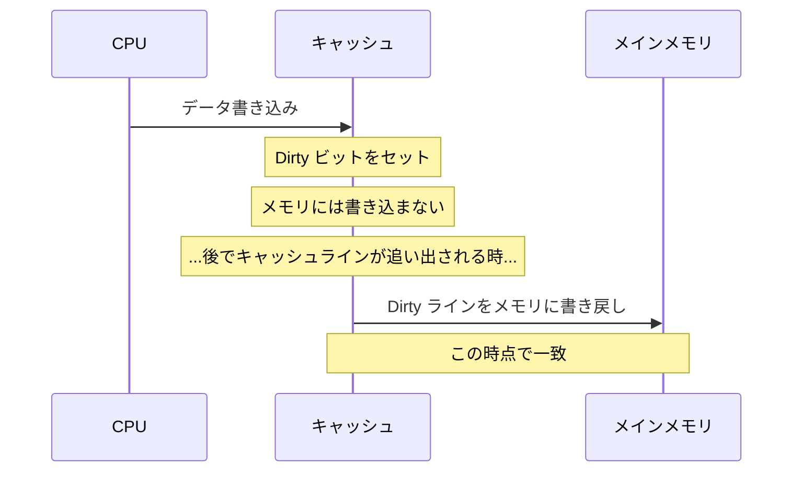

- **長所**: 同一ラインへの複数回の書き込みを集約でき、メモリバス帯域を節約できる。現代のプロセッサで広く採用されている。
- **短所**: キャッシュとメモリの間に不一致が生じるため、マルチプロセッサ環境ではコヒーレンスプロトコルが不可欠となる。

### 6.3 Write-Allocate と No-Write-Allocate

書き込みポリシーには、**キャッシュミス時の書き込み**に関するサブポリシーもある。

- **Write-Allocate（ライトアロケート）**: 書き込みミスが発生した場合、対象のメモリブロックをまずキャッシュに読み込んでから書き込みを行う。Write-Backと組み合わせて使用されることが多い。
- **No-Write-Allocate（ノーライトアロケート）**: 書き込みミスが発生した場合、キャッシュへの読み込みは行わず、直接メインメモリに書き込む。Write-Throughと組み合わせて使用されることが多い。

現代のプロセッサのL1/L2/L3キャッシュは、ほぼ例外なく**Write-Back + Write-Allocate**の組み合わせを採用している。

## 7. キャッシュ置換ポリシー

セットアソシエイティブキャッシュにおいて、新しいデータをキャッシュに読み込む際にセット内のすべてのウェイが使用中である場合、既存のラインの1つを追い出す必要がある。どのラインを追い出すかを決定するのが**置換ポリシー（replacement policy）**である。

### 7.1 LRU（Least Recently Used）

**LRU**は、最も長い間アクセスされていないラインを追い出す方式である。時間的局所性の原理に基づき、最近使われていないデータは将来も使われる可能性が低いと仮定する。

- **長所**: 多くのアクセスパターンにおいて高いヒット率を実現する。
- **短所**: ウェイ数が増えると、完全なLRUの管理に必要な状態量が指数的に増大する。$n$ ウェイのキャッシュでは $\log_2(n!)$ ビットの状態が必要であり、16ウェイでは1セットあたり44ビットの状態が必要になる。

### 7.2 Pseudo-LRU（擬似LRU）

完全なLRUの実装コストを回避するため、近似的にLRU的な動作を実現する**Pseudo-LRU**が広く採用されている。代表的な手法は**Tree-PLRU（ツリーベース擬似LRU）**である。

Tree-PLRUでは、ウェイをバイナリツリーの葉ノードとみなし、内部ノードにビットを持たせる。各ビットは左右どちらの部分木に最近アクセスされたものがあるかを示し、置換時にはビットを辿って「最も最近使われていない側」のウェイを選択する。

$n$ ウェイのキャッシュでTree-PLRUに必要な状態量は $n - 1$ ビットであり、完全なLRUと比較して大幅に少ない。8ウェイの場合、完全なLRUでは15ビット必要なところ、Tree-PLRUでは7ビットで済む。

### 7.3 Random

**ランダム置換**は、追い出すラインをランダムに選択する方式である。

- **長所**: 実装が極めて単純であり、追加の状態管理が不要。最悪ケースの性能が予測可能。
- **短所**: 平均的なヒット率ではLRUに劣る。

ランダム置換は、特にアソシエイティビティが高いキャッシュにおいて、LRUとの性能差が小さくなることが知られている。ARMの一部のプロセッサではランダム置換が採用されている。

### 7.4 現代のプロセッサにおける置換ポリシー

現代のプロセッサでは、上記の基本的なポリシーに加えて、適応的な置換ポリシーが研究・導入されている。

- **RRIP（Re-Reference Interval Prediction）**: 各ラインに「再参照間隔」の予測値を付与し、再参照される可能性が低いラインを優先的に追い出す。Intelの一部プロセッサのL3で採用されている。
- **適応型ポリシー**: ワークロードのアクセスパターンを動的に監視し、LRU的な動作とスキャン耐性のある動作を切り替える。

## 8. キャッシュコヒーレンスプロトコル

### 8.1 コヒーレンス問題の本質

マルチコアプロセッサにおいて、各コアがプライベートなL1/L2キャッシュを持っている場合、同一のメモリアドレスのデータが複数のキャッシュに同時に存在する可能性がある。あるコアがそのデータを更新した場合、他のコアのキャッシュに残っている古いコピーとの間に不整合が生じる。この問題を解決するメカニズムが**キャッシュコヒーレンスプロトコル（cache coherence protocol）**である。

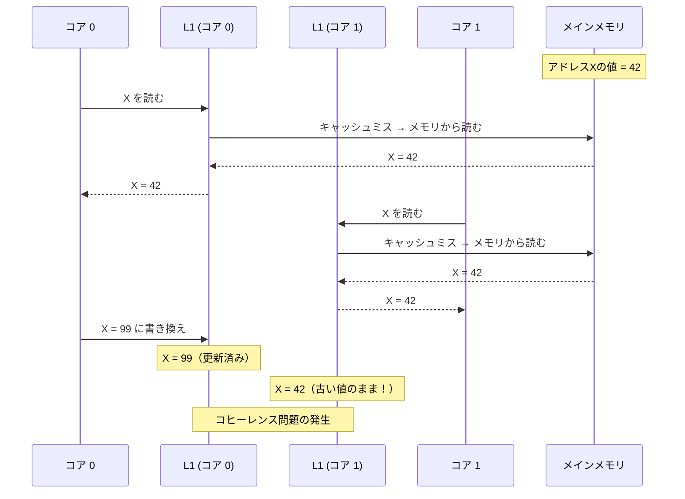

キャッシュコヒーレンスが保証する条件は以下の通りである。

1. **書き込みの伝播（Write Propagation）**: あるコアによる書き込みは、最終的に他のすべてのコアから観測可能でなければならない
2. **書き込みの直列化（Write Serialization）**: 同一アドレスへの複数のコアからの書き込みは、すべてのコアから同一の順序で観測されなければならない

### 8.2 スヌーピング方式とディレクトリ方式

コヒーレンスプロトコルの実装方式は大きく2つに分類される。

**スヌーピング方式（Snooping）**: すべてのキャッシュがバス上のトランザクションを監視（snoop）し、自身が保持するデータに関するトランザクションを検出して適切に対応する。

- **長所**: レイテンシが低い（ブロードキャストベース）
- **短所**: バス帯域がボトルネックになるため、コア数が多いシステムではスケーラビリティに限界がある

**ディレクトリ方式（Directory-Based）**: 各メモリブロックの共有状態を中央のディレクトリ（通常はL3やメモリコントローラに配置）で管理する。状態変更が必要な場合、ディレクトリが関連するキャッシュにのみポイントツーポイントで通知を送る。

- **長所**: ブロードキャストが不要でスケーラブル。多コアシステムに適する
- **短所**: ディレクトリの管理にメモリと帯域を消費する。間接的な通信によるレイテンシ増加

現代の多コアプロセッサでは、チップ内のコア間ではスヌーピング方式（またはSnoop Filter付き）、チップ間（マルチソケット）ではディレクトリ方式を組み合わせるハイブリッドアプローチが一般的である。

### 8.3 MESIプロトコル

**MESI**は、最も基本的で広く知られたキャッシュコヒーレンスプロトコルである。各キャッシュラインは、以下の4つの状態のいずれかを持つ。

| 状態 | 名称 | 意味 |
|---|---|---|
| **M（Modified）** | 変更済み | このキャッシュだけがコピーを持ち、メモリとは異なる（Dirty）。メモリへの書き戻し責任を持つ |
| **E（Exclusive）** | 排他的 | このキャッシュだけがコピーを持ち、メモリと一致する（Clean）。書き込み時にM状態に遷移できる（バスへの通知不要） |
| **S（Shared）** | 共有 | 複数のキャッシュがコピーを持ち、メモリと一致する。書き込みにはInvalidate要求が必要 |
| **I（Invalid）** | 無効 | このラインは無効であり、有効なデータを保持していない |

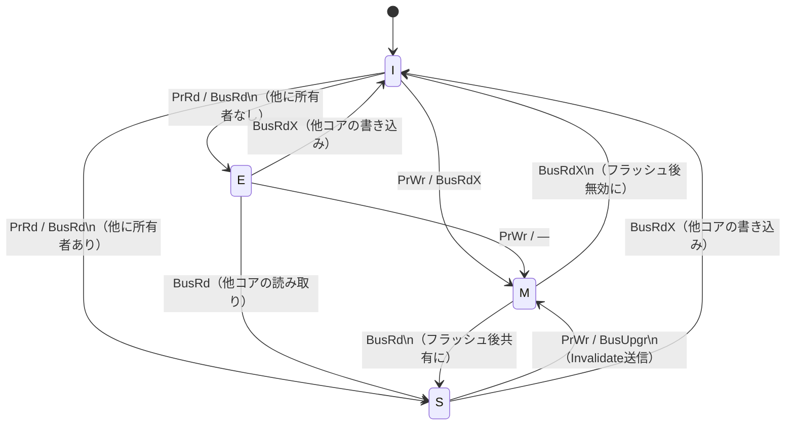

**PrRd** = プロセッサリード（自コアの読み取り）、**PrWr** = プロセッサライト（自コアの書き込み）、**BusRd** = バス上の読み取り要求、**BusRdX** = バス上の排他読み取り要求（所有権取得）、**BusUpgr** = バス上のアップグレード要求（S→Mへの遷移）

#### MESIの動作例

2つのコア（コア0、コア1）が同じメモリアドレスXにアクセスする場合の動作を追う。

**ステップ1**: コア0がXを読み取る

コア0のL1にXは存在しない（I状態）。BusRd要求がバスに発行される。他のキャッシュにもXがないため、メモリからデータを取得し、コア0のキャッシュラインはE状態になる。

**ステップ2**: コア1がXを読み取る

コア1のL1にXは存在しない（I状態）。BusRd要求がバスに発行される。コア0がスヌープし、自身がE状態でXを持っていることを応答する。両方のキャッシュラインがS状態になる。

**ステップ3**: コア0がXに書き込む

コア0のキャッシュラインはS状態であるため、書き込みにはBusUpgr（Invalidate）要求が必要。コア1のキャッシュラインがI状態に遷移し、コア0のキャッシュラインがM状態に遷移する。

**ステップ4**: コア1がXを読み取る

コア1のL1にXはI状態。BusRd要求が発行される。コア0がスヌープし、M状態のデータをバスに供給（フラッシュ）する。両方のキャッシュラインがS状態になり、メモリも更新される。

### 8.4 MOESIプロトコル

**MOESI**は、MESIに**O（Owned）**状態を追加した拡張プロトコルである。AMDのプロセッサで採用されている。

| 状態 | 名称 | 意味 |
|---|---|---|
| **O（Owned）** | 所有 | このキャッシュが最新のデータを持ち、他のキャッシュにもS状態のコピーが存在する。メモリとは異なる（Dirty）。このキャッシュがデータ供給の責任を持つ |

MESIでは、M状態のラインが他のコアから読み取り要求を受けた場合、データをメモリに書き戻してからS状態に遷移する必要がある。MOESIでは、M状態のラインがO状態に遷移し、メモリへの書き戻しを遅延できる。これにより、コア間でデータを直接共有する際のメモリバスへの不要なトラフィックを削減できる。

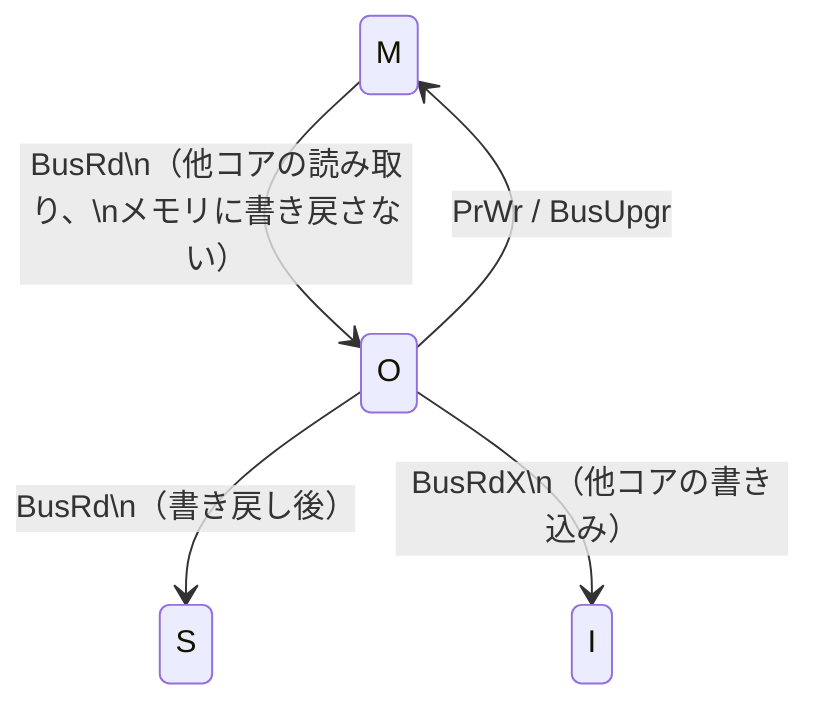

### 8.5 MESIFプロトコル

**MESIF**は、MESIに**F（Forward）**状態を追加したプロトコルで、Intelのプロセッサで採用されている。

S状態のラインが複数のキャッシュに存在する場合、読み取り要求に対してすべてのキャッシュが応答しようとすると冗長なトラフィックが生じる。F状態は、複数のS状態のコピーのうち1つだけをF状態に昇格させ、そのキャッシュだけが読み取り要求に応答する役割を担う。

## 9. False Sharing問題

### 9.1 False Sharingとは

**False Sharing**は、マルチコアプログラミングにおける重要な性能問題であり、論理的には独立したデータが同一のキャッシュラインに配置されることで発生する。

2つのコアがそれぞれ異なる変数を更新する場合でも、それらの変数が同一のキャッシュライン（64バイト）上に存在すると、キャッシュコヒーレンスプロトコルはキャッシュライン全体を無効化する。結果として、実際にはデータの共有が発生していないにもかかわらず、キャッシュラインが2つのコア間で往復（**ピンポン**）し、深刻な性能劣化を招く。

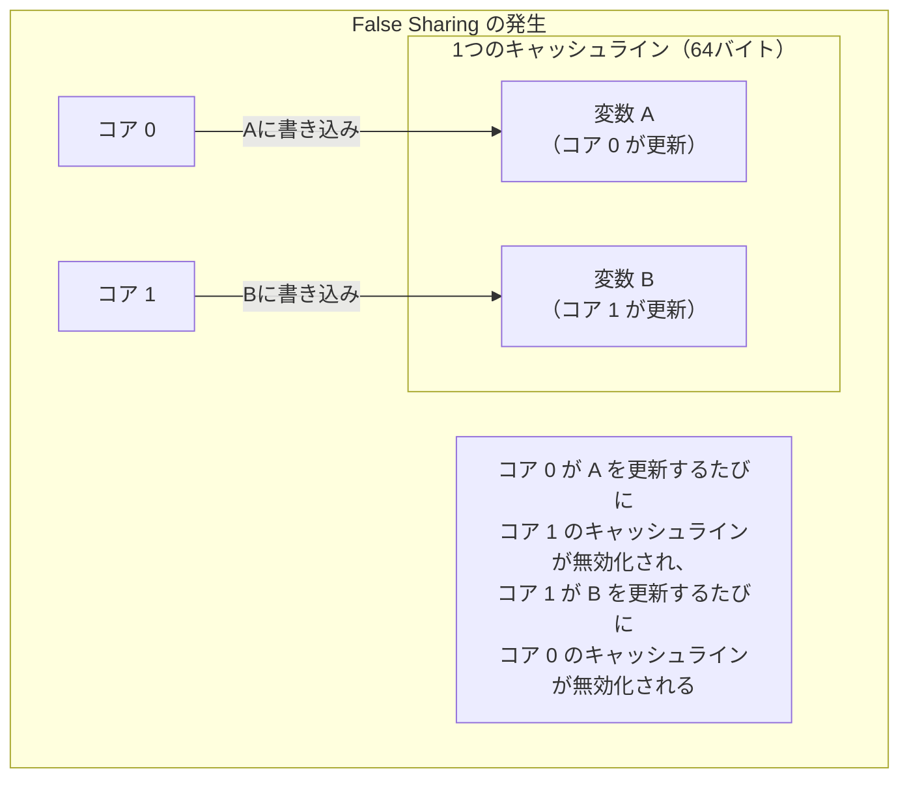

### 9.2 False Sharingの具体例

以下のC言語のコードは、典型的なFalse Sharingの例である。

```c
// false sharing example
#include <pthread.h>
#include <stdio.h>

struct shared_data {
    long counter0;  // offset 0-7
    long counter1;  // offset 8-15
    // both within the same 64-byte cache line
};

struct shared_data data = {0, 0};

void *thread0(void *arg) {
    for (int i = 0; i < 100000000; i++) {
        data.counter0++;  // core 0 updates counter0
    }
    return NULL;
}

void *thread1(void *arg) {
    for (int i = 0; i < 100000000; i++) {
        data.counter1++;  // core 1 updates counter1
    }
    return NULL;
}
```

`counter0` と `counter1` は論理的に独立しているが、構造体のメモリレイアウトにより同一キャッシュライン上に配置される。このため、2つのスレッドが異なるコアで動作すると、互いのキャッシュラインを絶えず無効化し合う。

### 9.3 False Sharingの対策

**パディングによるキャッシュラインの分離**: 変数間にパディングを挿入し、各変数が異なるキャッシュラインに配置されるようにする。

```c
// false sharing mitigation with padding
struct padded_data {
    long counter0;
    char padding[56];  // pad to 64-byte boundary
    long counter1;     // now on a separate cache line
};
```

多くのコンパイラやランタイムは、キャッシュラインアライメントのための仕組みを提供している。

```c
// using compiler attribute for alignment
struct aligned_data {
    __attribute__((aligned(64))) long counter0;
    __attribute__((aligned(64))) long counter1;
};
```

C++17では `std::hardware_destructive_interference_size` が標準化され、False Sharingを避けるためのキャッシュラインサイズをポータブルに取得できるようになった。

```cpp
// C++17 approach
#include <new>

struct aligned_data {
    alignas(std::hardware_destructive_interference_size) long counter0;
    alignas(std::hardware_destructive_interference_size) long counter1;
};
```

### 9.4 False Sharingの検出

False Sharingは、ソースコードの検査だけでは発見が困難な場合がある。以下のツールが検出に役立つ。

- **Linux perf**: `perf c2c`（cache-to-cache）コマンドにより、キャッシュライン単位のコンテンション情報を可視化できる
- **Intel VTune Profiler**: False Sharing検出機能を備えている
- **Valgrind（cachegrind）**: キャッシュミスのプロファイリングが可能

## 10. キャッシュを意識したプログラミング

### 10.1 データレイアウトの最適化

キャッシュ性能に最も大きな影響を与えるのは、データのメモリレイアウトである。

#### AoS vs SoA

オブジェクト指向プログラミングでは、関連するフィールドを1つの構造体にまとめる**AoS（Array of Structures）**が自然な設計である。しかし、特定のフィールドのみを走査する処理では、**SoA（Structure of Arrays）**のほうがキャッシュ効率が高い。

```c
// AoS (Array of Structures)
// all fields of each particle are contiguous
struct Particle {
    float x, y, z;       // position
    float vx, vy, vz;    // velocity
    float mass;           // mass
    int type;             // type
};
struct Particle particles[10000];

// SoA (Structure of Arrays)
// each field is stored in a separate array
struct Particles {
    float x[10000], y[10000], z[10000];
    float vx[10000], vy[10000], vz[10000];
    float mass[10000];
    int type[10000];
};
struct Particles particles;
```

位置座標のみを更新する処理では、AoS形式ではパーティクルごとに32バイトの構造体全体がキャッシュラインに読み込まれるが、実際に使用するのは12バイト（x, y, z）だけであり、キャッシュラインの帯域が浪費される。SoA形式では、x座標の配列が連続してキャッシュラインに読み込まれるため、空間的局所性が最大限に活用される。

ゲームエンジンやHPC（High Performance Computing）の分野では、この違いが性能に数倍の影響を及ぼすことがある。

### 10.2 ループ最適化

#### ループ交換（Loop Interchange）

多次元配列の走査において、アクセスの順序がキャッシュ性能を大きく左右する。C言語では配列は行優先（row-major）で格納されるため、内側ループで列方向に走査するとキャッシュミスが頻発する。

```c
// poor cache utilization (column-major access in C)
for (int j = 0; j < N; j++) {
    for (int i = 0; i < N; i++) {
        sum += matrix[i][j];  // stride = N * sizeof(element)
    }
}

// good cache utilization (row-major access in C)
for (int i = 0; i < N; i++) {
    for (int j = 0; j < N; j++) {
        sum += matrix[i][j];  // stride = sizeof(element)
    }
}
```

#### ループタイリング（Loop Tiling / Blocking）

行列乗算などの計算では、**ループタイリング**によってデータのワーキングセットをキャッシュに収まるブロック単位に分割することで、キャッシュミスを劇的に削減できる。

```c
// naive matrix multiplication — O(N^3) cache misses
for (int i = 0; i < N; i++)
    for (int j = 0; j < N; j++)
        for (int k = 0; k < N; k++)
            C[i][j] += A[i][k] * B[k][j];

// tiled matrix multiplication — better cache utilization
#define BLOCK 64
for (int ii = 0; ii < N; ii += BLOCK)
    for (int jj = 0; jj < N; jj += BLOCK)
        for (int kk = 0; kk < N; kk += BLOCK)
            for (int i = ii; i < ii + BLOCK && i < N; i++)
                for (int j = jj; j < jj + BLOCK && j < N; j++)
                    for (int k = kk; k < kk + BLOCK && k < N; k++)
                        C[i][j] += A[i][k] * B[k][j];
```

タイリングにより、$A$, $B$, $C$ のブロックがL1/L2キャッシュに収まるサイズで処理され、キャッシュミスの回数が $O(N^3 / B)$（$B$ はブロックサイズ）に削減される。高性能な数値計算ライブラリ（BLAS, LAPACK, Intel MKL）は、このタイリング技法を高度に最適化して実装している。

### 10.3 プリフェッチ

**プリフェッチ（prefetch）**は、将来アクセスするであろうデータを事前にキャッシュに読み込むことで、キャッシュミスのレイテンシを隠蔽する技法である。

#### ハードウェアプリフェッチ

現代のCPUには、メモリアクセスパターンを検出して自動的にプリフェッチを行う**ハードウェアプリフェッチャ**が搭載されている。ストライドが一定の逐次アクセスパターンに対しては高い効果を発揮するが、不規則なアクセスパターン（リンクリストの追跡、ハッシュテーブルの探索など）には対応できない。

#### ソフトウェアプリフェッチ

ハードウェアプリフェッチが対応できないアクセスパターンに対しては、プログラマが明示的にプリフェッチ命令を挿入する**ソフトウェアプリフェッチ**が有効な場合がある。

```c
// software prefetch example
#include <xmmintrin.h>  // for _mm_prefetch

for (int i = 0; i < N; i++) {
    // prefetch data for a future iteration
    _mm_prefetch(&data[i + 16], _MM_HINT_T0);
    process(data[i]);
}
```

ただし、ソフトウェアプリフェッチの効果はアクセスパターンとタイミングに強く依存し、不適切なプリフェッチはかえってキャッシュ汚染を引き起こすため、慎重なチューニングが必要である。

### 10.4 キャッシュ非対応アルゴリズム（Cache-Oblivious Algorithm）

**キャッシュ非対応アルゴリズム**は、キャッシュのサイズやキャッシュラインのサイズを明示的にパラメータとして使用しなくても、任意のキャッシュ階層に対して（漸近的に）最適なキャッシュ性能を達成するアルゴリズムである。1999年にFrigoらによって提唱された。

代表的な例として、**Cache-Oblivious 行列乗算**がある。行列を再帰的に4つのサブ行列に分割し、サブ行列がキャッシュに収まるサイズになるまで分割を繰り返す。どのレベルのキャッシュに対しても最適に近い振る舞いをする点が、明示的なタイリングとの違いである。

## 11. 現代CPUのキャッシュ — Intel, AMD, Apple Siliconの比較

### 11.1 Intel（第13世代 Raptor Lake / 第14世代 Meteor Lake）

Intelの近年のデスクトップ向けプロセッサは、**ハイブリッドアーキテクチャ**を採用し、高性能コア（P-core）と高効率コア（E-core）でキャッシュ構成が異なる。

**P-core（Performance Core）**:
- L1i: 32KB, 8ウェイ
- L1d: 48KB, 12ウェイ
- L2: 2MB（コアごと）, 16ウェイ

**E-core（Efficiency Core）**:
- L1i: 64KB（4コアクラスタ共有）
- L1d: 32KB, 8ウェイ
- L2: 4MB（4コアクラスタ共有）

**L3（共有）**: 最大36MB, 12ウェイ

IntelのL3キャッシュは、Skylake-SP以降のサーバ向けプロセッサでは非包含型（NINE）を採用し、コヒーレンスにはSnoop Filterを使用している。クライアント向けでは包含型が長らく使われていたが、近年は非包含型への移行が進んでいる。

Intelのキャッシュコヒーレンスプロトコルは**MESIF**をベースとしている。

### 11.2 AMD（Zen 4 / Zen 5）

AMDのZenアーキテクチャは、**CCX（Core Complex）**と**CCD（Core Chiplet Die）**という独自の構造を持ち、キャッシュ階層にも大きな影響を与えている。

**Zen 4（Ryzen 7000シリーズ）**:
- L1i: 32KB, 8ウェイ
- L1d: 32KB, 8ウェイ
- L2: 1MB（コアごと）, 8ウェイ
- L3: 32MB（CCXあたり、最大8コアで共有）

AMDのZenアーキテクチャの特徴は、L3キャッシュとL2キャッシュの間に**排他型**のポリシーを採用している点である。L2から追い出されたデータがL3に格納される（victim cache的動作）ため、L3の実効容量がL2の内容と重複せず、キャッシュ容量を最大限に活用できる。

さらに、AMD **3D V-Cache**テクノロジーにより、CCD上に追加のSRAMダイを積層し、L3キャッシュを最大96MB（Zen 4ベース）まで拡張した製品も存在する。ゲームやHPCなど、ワーキングセットが大きいアプリケーションで顕著な性能向上が報告されている。

AMDのキャッシュコヒーレンスプロトコルは**MOESI**をベースとしている。O状態の活用により、メモリへの不要な書き戻しを回避し、CCX間やCCD間のデータ共有効率を高めている。

### 11.3 Apple Silicon（M3 / M4）

Apple Siliconは、ARMアーキテクチャベースの独自設計であり、キャッシュ階層にもApple独自の設計思想が反映されている。

**Apple M4**:
- P-core L1i: 192KB
- P-core L1d: 128KB
- P-core L2: 16MB（P-coreクラスタ共有）
- E-core L1i: 128KB
- E-core L1d: 64KB
- E-core L2: 4MB（E-coreクラスタ共有）
- SLC（System Level Cache）: 約16〜32MB

Apple SiliconのL1キャッシュは、IntelやAMDと比較して極めて大容量であることが特徴的である。特にL1dの128KBは、一般的なx86プロセッサの32〜48KBと比較して3〜4倍のサイズである。これは、ARMアーキテクチャの命令エンコーディングの規則性により、L1キャッシュのレイテンシ増加をある程度許容できることと、Apple独自のマイクロアーキテクチャ設計によるものと考えられる。

また、Apple Siliconは**SLC（System Level Cache）**と呼ばれるシステムレベルのキャッシュを持ち、CPU、GPU、Neural Engineなど複数の処理ユニットが共有するLast Level Cacheとして機能する。これは、統合メモリアーキテクチャ（Unified Memory Architecture）を採用するApple Siliconならではの設計である。

### 11.4 比較表

| 項目 | Intel Raptor Lake (P-core) | AMD Zen 4 | Apple M4 (P-core) |
|---|---|---|---|
| L1d サイズ | 48KB | 32KB | 128KB |
| L1i サイズ | 32KB | 32KB | 192KB |
| L2 サイズ | 2MB/コア | 1MB/コア | 16MB/クラスタ |
| L3 サイズ | 最大36MB（共有） | 32MB/CCX | SLC ~16-32MB |
| L2-L3 包含関係 | 非包含 | 排他 | 非公開 |
| コヒーレンス | MESIF | MOESI | 非公開（ARMベース） |
| 特筆事項 | ハイブリッドアーキテクチャ | 3D V-Cache対応 | 巨大L1、SLC |

### 11.5 設計思想の違い

この比較から見えてくる各社の設計思想の違いは興味深い。

**Intel**は、P-coreとE-coreのハイブリッド構成により、性能と電力効率の両立を図っている。L2キャッシュをコアあたり2MBと比較的大きくし、L3の負荷を軽減する設計である。

**AMD**は、チップレットアーキテクチャとL3の排他型ポリシーにより、大容量のキャッシュを効率的に活用する戦略を取っている。3D V-Cacheによる物理的なキャッシュ拡張は、メモリウォール問題に対する正面からのアプローチといえる。

**Apple**は、統合メモリアーキテクチャの利点を活かし、巨大なL1キャッシュとSLCにより、メモリアクセスレイテンシの全体的な削減を図っている。モバイル由来の設計思想から、電力あたりの性能効率も高い。

## 12. まとめ

CPUキャッシュは、メモリウォール問題に対するコンピュータアーキテクチャの最も重要な解答である。その本質は、局所性の原理を活用して、高速だが小容量のメモリと低速だが大容量のメモリの間のギャップを埋めることにある。

キャッシュの理解が重要なのは、現代のソフトウェアの性能がキャッシュの振る舞いに大きく左右されるからである。アルゴリズムの計算量（Big-O）が同じであっても、キャッシュフレンドリーな実装とそうでない実装では、実行時間に数倍から数十倍の差が生じることがある。

本記事で解説した要点を整理する。

1. **メモリウォール問題**: CPUとDRAMの速度差は拡大の一途をたどり、キャッシュ階層の重要性は増している
2. **局所性**: 時間的局所性と空間的局所性がキャッシュの理論的基盤である
3. **キャッシュの構造**: セットアソシエイティブ方式が、ヒット率と実装コストのバランスとして現実的な選択肢である
4. **書き込みポリシー**: Write-Back + Write-Allocateが現代のプロセッサの標準である
5. **キャッシュコヒーレンス**: MESI/MOESI/MESIFプロトコルにより、マルチコア環境でのデータ一貫性が保証される
6. **False Sharing**: キャッシュラインの粒度に起因する見えにくい性能問題であり、パディングやアライメントで対策する
7. **キャッシュ意識プログラミング**: データレイアウト（AoS vs SoA）、ループ最適化（タイリング）、プリフェッチにより、大幅な性能向上が可能である

キャッシュはハードウェアの詳細であるが、その動作原理を理解することは、高性能なソフトウェアを書く上で不可欠な知識である。特にシステムプログラミング、ゲーム開発、数値計算、データベースエンジンの開発など、性能が重視される領域では、キャッシュの振る舞いを常に意識した設計とチューニングが求められる。
