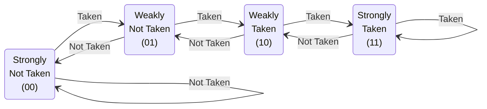
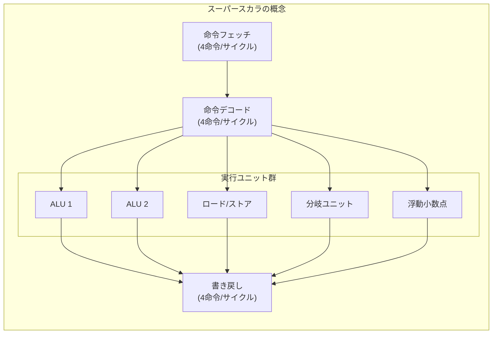

# 命令パイプラインとハザード — CPUの高速化を支える仕組み

## 1. 背景と動機 — 命令実行の高速化への要求

### 1.1 なぜパイプラインが必要か

コンピュータの性能を測る最も基本的な指標の一つは、「単位時間あたりに実行できる命令数」である。プログラムの実行時間は以下の式で表される。

$$
T = N \times \text{CPI} \times T_c
$$

ここで $N$ は命令数、$\text{CPI}$（Cycles Per Instruction）は1命令あたりの平均クロックサイクル数、$T_c$ はクロック周期である。性能を向上させるには、これら3つの要素のいずれか（あるいは複数）を改善する必要がある。

命令パイプラインは、主に **CPI を 1 に近づける**ことを目標とするアーキテクチャ技術である。パイプラインが存在しなければ、1つの命令が完全に完了してから次の命令の処理を開始するため、CPI は命令の処理に必要なステージ数と等しくなる（典型的には 4〜5）。パイプラインを導入することで、理想的には CPI = 1 を達成し、スループットを大幅に向上させることができる。

### 1.2 歴史的経緯

命令パイプラインの概念は、1960年代の IBM Stretch（IBM 7030）に遡る。Stretch は命令のフェッチとデコードを重畳して実行する初歩的なパイプラインを備えていた。しかし、パイプラインが体系的に設計・実装されるようになったのは、1980年代の RISC（Reduced Instruction Set Computer）ムーブメント以降である。

1981年にスタンフォード大学の John Hennessy が MIPS アーキテクチャを、カリフォルニア大学バークレー校の David Patterson が RISC-I を発表した。これらの設計では、命令セットを単純化し、すべての命令がパイプラインの各ステージを均等な時間で通過できるようにすることで、効率的なパイプライン実行を実現した。この思想は後に商用プロセッサにも広く採用され、現代の CPU アーキテクチャの基盤となっている。

## 2. パイプラインの基本概念

### 2.1 洗濯機の比喩

パイプラインの動作原理は、コインランドリーの比喩で理解しやすい。

4人分の洗濯物があり、各洗濯物に対して以下の4工程が必要だとする。

1. **洗濯**（30分）
2. **乾燥**（30分）
3. **たたむ**（30分）
4. **しまう**（30分）

パイプラインなし（逐次実行）の場合、1人分の洗濯物の全工程が完了してから次の人の洗濯物に着手する。合計所要時間は $4 \times 4 \times 30 = 480$ 分（8時間）となる。

パイプラインあり（重畳実行）の場合、1人目の洗濯物が乾燥機に移った時点で、洗濯機は空いている。この空いた洗濯機に2人目の洗濯物を投入できる。同様に、各工程の設備が空くたびに次の洗濯物を流し込む。

```mermaid
gantt
    title パイプラインなし — 逐次実行
    dateFormat X
    axisFormat %s

    section 洗濯物1
    洗濯     :a1, 0, 30
    乾燥     :a2, after a1, 30
    たたむ   :a3, after a2, 30
    しまう   :a4, after a3, 30

    section 洗濯物2
    洗濯     :b1, after a4, 30
    乾燥     :b2, after b1, 30
    たたむ   :b3, after b2, 30
    しまう   :b4, after b3, 30

    section 洗濯物3
    洗濯     :c1, after b4, 30
    乾燥     :c2, after c1, 30
    たたむ   :c3, after c2, 30
    しまう   :c4, after c3, 30

    section 洗濯物4
    洗濯     :d1, after c4, 30
    乾燥     :d2, after d1, 30
    たたむ   :d3, after d2, 30
    しまう   :d4, after d3, 30
```

```mermaid
gantt
    title パイプラインあり — 重畳実行
    dateFormat X
    axisFormat %s

    section 洗濯物1
    洗濯     :a1, 0, 30
    乾燥     :a2, 30, 60
    たたむ   :a3, 60, 90
    しまう   :a4, 90, 120

    section 洗濯物2
    洗濯     :b1, 30, 60
    乾燥     :b2, 60, 90
    たたむ   :b3, 90, 120
    しまう   :b4, 120, 150

    section 洗濯物3
    洗濯     :c1, 60, 90
    乾燥     :c2, 90, 120
    たたむ   :c3, 120, 150
    しまう   :c4, 150, 180

    section 洗濯物4
    洗濯     :d1, 90, 120
    乾燥     :d2, 120, 150
    たたむ   :d3, 150, 180
    しまう   :d4, 180, 210
```





パイプラインありの場合、合計所要時間は $(4 + 3) \times 30 = 210$ 分（3時間30分）に短縮される。一般に $n$ 個の洗濯物を $k$ ステージのパイプラインで処理すると、所要時間は $(k + n - 1) \times t$ となる。$n$ が十分に大きいとき、スループットは約 $k$ 倍に向上する。

### 2.2 古典的5段パイプライン

CPU の命令パイプラインにおいて、最も基本的かつ広く教えられているのが **5段パイプライン**である。MIPS R2000/R3000 などの初期 RISC プロセッサで採用されたこのモデルは、命令の実行を以下の5つのステージに分割する。

| ステージ | 略称 | 処理内容 |
|---------|------|---------|
| Instruction Fetch | **IF** | プログラムカウンタ（PC）が指すアドレスから命令をメモリ（命令キャッシュ）からフェッチし、PC を更新する |
| Instruction Decode | **ID** | フェッチした命令をデコードし、レジスタファイルからオペランドを読み出す。制御信号を生成する |
| Execute | **EX** | ALU で演算を実行する。算術演算、論理演算、分岐先アドレスの計算、メモリアドレスの計算などを行う |
| Memory Access | **MEM** | ロード命令の場合はデータメモリ（データキャッシュ）からデータを読み出し、ストア命令の場合はデータを書き込む。それ以外の命令はこのステージを素通りする |
| Write Back | **WB** | 演算結果またはメモリから読み出したデータをレジスタファイルに書き戻す |


各ステージは独立したハードウェアリソースを持ち、ステージ間には**パイプラインレジスタ（ラッチ）**が配置される。パイプラインレジスタは、各クロックサイクルの境界でステージの出力を保持し、次のステージの入力として渡す役割を持つ。

理想的な5段パイプラインでは、パイプラインが満杯になった後は**毎クロックサイクルに1つの命令が完了**する。つまり CPI = 1 が実現される。

```mermaid
gantt
    title 5段パイプラインの動作
    dateFormat X
    axisFormat %s

    section 命令1
    IF  :a1, 0, 1
    ID  :a2, 1, 2
    EX  :a3, 2, 3
    MEM :a4, 3, 4
    WB  :a5, 4, 5

    section 命令2
    IF  :b1, 1, 2
    ID  :b2, 2, 3
    EX  :b3, 3, 4
    MEM :b4, 4, 5
    WB  :b5, 5, 6

    section 命令3
    IF  :c1, 2, 3
    ID  :c2, 3, 4
    EX  :c3, 4, 5
    MEM :c4, 5, 6
    WB  :c5, 6, 7

    section 命令4
    IF  :d1, 3, 4
    ID  :d2, 4, 5
    EX  :d3, 5, 6
    MEM :d4, 6, 7
    WB  :d5, 7, 8

    section 命令5
    IF  :e1, 4, 5
    ID  :e2, 5, 6
    EX  :e3, 6, 7
    MEM :e4, 7, 8
    WB  :e5, 8, 9
```



上図では、クロックサイクル 5 以降は毎サイクル 1 命令が完了している。パイプラインの「立ち上がり」に 4 サイクル（$k - 1$ サイクル）を要するが、定常状態ではスループットが最大化される。

## 3. スループットとレイテンシの関係

パイプラインを理解する上で、**スループット**と**レイテンシ**の区別は極めて重要である。

### 3.1 定義

- **レイテンシ（Latency）**: 1つの命令が IF ステージに入ってから WB ステージを出るまでの時間。パイプライン化された CPU では、レイテンシは $k \times T_c$（$k$ はステージ数、$T_c$ はクロック周期）となる
- **スループット（Throughput）**: 単位時間あたりに完了する命令数。理想的なパイプラインでは $1/T_c$（毎クロック 1 命令）

### 3.2 パイプラインの逆説

パイプラインは**個々の命令のレイテンシを改善しない**。むしろ、パイプラインレジスタのセットアップ時間やホールド時間のオーバーヘッドにより、レイテンシは若干増加する場合もある。パイプラインが改善するのは**スループット**である。

これは洗濯機の比喩で考えると分かりやすい。1人分の洗濯物の完了時間（レイテンシ）は、パイプラインの有無にかかわらず 120分（$4 \times 30$）である。しかし、4人分すべてが完了するまでの合計時間は大幅に短縮される。

### 3.3 クロック周期の制約

パイプラインの各ステージの処理時間は均等であるのが理想だが、現実にはステージごとに処理時間が異なる。クロック周期は**最も遅いステージの処理時間**によって決定される。

$$
T_c = \max(t_{\text{IF}}, t_{\text{ID}}, t_{\text{EX}}, t_{\text{MEM}}, t_{\text{WB}}) + t_{\text{latch}}
$$

ここで $t_{\text{latch}}$ はパイプラインレジスタ（ラッチ）のオーバーヘッドである。ステージ間の処理時間のバランスが悪いと、速いステージは遅いステージを待つことになり、パイプラインの効率が低下する。これが **パイプラインバランシング**の問題であり、命令セットアーキテクチャの設計段階から考慮される。

### 3.4 理想的なスピードアップ

$k$ 段パイプラインの理想的なスピードアップは以下の式で表される。

$$
S = \frac{k \times n}{k + n - 1}
$$

ここで $n$ は実行する命令数である。$n \to \infty$ のとき $S \to k$ となり、ステージ数に等しいスピードアップが得られる。しかし現実には、後述するハザード（hazard）の存在により、理想的なスピードアップは達成できない。

## 4. データハザード

パイプラインの正常な動作を妨げる要因を**ハザード（hazard）**と呼ぶ。データハザードは、命令間のデータ依存関係によって発生するハザードである。

### 4.1 データ依存の3類型

命令間のデータ依存関係には、以下の3種類がある。

#### RAW（Read After Write）— 真のデータ依存

先行命令が書き込むデータを、後続命令が読み出す場合に発生する。これは**真の依存関係（true dependence）**であり、プログラムの意味を変えずに除去することはできない。

```
add  r1, r2, r3    # r1 = r2 + r3  (r1 に書き込み)
sub  r4, r1, r5    # r4 = r1 - r5  (r1 を読み出し) ← RAW hazard
```

5段パイプラインでは、`add` 命令が `r1` に結果を書き戻すのは WB ステージ（サイクル 5）である。しかし、`sub` 命令は ID ステージ（サイクル 3）で `r1` の値を読み出そうとする。この時点では `add` 命令の結果はまだレジスタファイルに反映されていないため、`sub` 命令は古い（誤った）値を読んでしまう。

```mermaid
gantt
    title RAW ハザードの発生
    dateFormat X
    axisFormat %s

    section add r1, r2, r3
    IF   :a1, 0, 1
    ID   :a2, 1, 2
    EX   :a3, 2, 3
    MEM  :a4, 3, 4
    WB(書込) :a5, 4, 5

    section sub r4, r1, r5
    IF   :b1, 1, 2
    ID(読出) :crit, b2, 2, 3
    EX   :b3, 3, 4
    MEM  :b4, 4, 5
    WB   :b5, 5, 6
```



上図で、`sub` 命令の ID ステージ（サイクル 3）は `add` 命令の WB ステージ（サイクル 5）よりも前に実行されるため、正しい値が読めない。

#### WAR（Write After Read）— 逆依存

先行命令がデータを読み出し、後続命令が同じ場所にデータを書き込む場合に発生する。

```
add  r1, r2, r3    # r2 を読み出し
sub  r2, r4, r5    # r2 に書き込み ← WAR hazard
```

古典的な5段パイプラインでは、読み出し（ID ステージ）が書き込み（WB ステージ）よりも常にパイプラインの上流にあるため、WAR ハザードは自然に回避される。しかし、アウトオブオーダー実行を行うプロセッサでは WAR ハザードが問題になりうる。

#### WAW（Write After Write）— 出力依存

先行命令と後続命令が同じ場所にデータを書き込む場合に発生する。

```
add  r1, r2, r3    # r1 に書き込み
sub  r1, r4, r5    # r1 に書き込み ← WAW hazard
```

古典的な5段パイプラインでは、命令の書き込みは常にプログラム順序で WB ステージに到達するため、WAW ハザードも自然に回避される。しかし、パイプラインの深さが異なるステージ（例えば浮動小数点演算パイプラインと整数演算パイプラインが異なる長さを持つ場合）やアウトオブオーダー実行を行うプロセッサでは問題となる。

::: tip WAR と WAW は「偽の依存」
WAR と WAW は**名前依存（name dependence）**とも呼ばれ、レジスタリネーミング（register renaming）によって解消できる。アウトオブオーダー実行プロセッサでは、物理レジスタの動的な割り当てにより、これらの偽の依存関係を除去して命令レベル並列性（ILP）を最大化する。
:::

### 4.2 フォワーディング（バイパッシング）

RAW ハザードに対する最も重要な解決策が**フォワーディング（forwarding）**、別名**バイパッシング（bypassing）**である。

フォワーディングの基本的な考え方は、演算結果がレジスタファイルに書き戻される前に、パイプラインの内部経路を通じて後続命令に直接転送するというものである。

先ほどの例では、`add` 命令の演算結果は EX ステージの終了時点（サイクル 3 の終わり）ですでに確定している。この値をパイプラインレジスタから取り出し、`sub` 命令の EX ステージの入力に直接供給すれば、ストールなしで正しい実行が可能になる。

```mermaid
gantt
    title フォワーディングによるRAWハザードの解消
    dateFormat X
    axisFormat %s

    section add r1, r2, r3
    IF    :a1, 0, 1
    ID    :a2, 1, 2
    EX(結果確定) :a3, 2, 3
    MEM   :a4, 3, 4
    WB    :a5, 4, 5

    section sub r4, r1, r5
    IF    :b1, 1, 2
    ID    :b2, 2, 3
    EX(転送値使用) :b3, 3, 4
    MEM   :b4, 4, 5
    WB    :b5, 5, 6
```



フォワーディングは、EX/MEM パイプラインレジスタや MEM/WB パイプラインレジスタから ALU 入力へのマルチプレクサ経路を追加することで実装される。ハードウェアコストは増加するが、パイプラインストールの削減効果は非常に大きい。

### 4.3 ロード・ユース・ハザード

フォワーディングでも解消できないデータハザードが存在する。それが**ロード・ユース・ハザード（load-use hazard）**である。

```
lw   r1, 0(r2)     # メモリからr1にロード
add  r3, r1, r4    # r1を使用 ← load-use hazard
```

`lw`（ロードワード）命令は MEM ステージの終了時点でデータが確定する。しかし、後続の `add` 命令は EX ステージの開始時に `r1` の値を必要とする。フォワーディングを用いても、`lw` の MEM ステージ終了は `add` の EX ステージ開始と同じタイミング（あるいはそれより後）になるため、1サイクルのストールが不可避となる。

```mermaid
gantt
    title ロード・ユース・ハザード（1サイクルストール）
    dateFormat X
    axisFormat %s

    section lw r1, 0(r2)
    IF   :a1, 0, 1
    ID   :a2, 1, 2
    EX   :a3, 2, 3
    MEM(データ確定)  :a4, 3, 4
    WB   :a5, 4, 5

    section add r3, r1, r4
    IF   :b1, 1, 2
    ID   :b2, 2, 3
    stall :b_stall, 3, 4
    EX(転送値使用)   :b3, 4, 5
    MEM  :b4, 5, 6
    WB   :b5, 6, 7
```



このストールの影響を最小化するため、コンパイラは**命令スケジューリング（instruction scheduling）**を行い、ロード命令と使用命令の間に無関係な命令を挿入する。

```
# before scheduling
lw   r1, 0(r2)
add  r3, r1, r4    # r1 depends on lw (stall)
lw   r5, 4(r2)
add  r6, r5, r7    # r5 depends on lw (stall)

# after scheduling
lw   r1, 0(r2)
lw   r5, 4(r2)     # moved here: no dependency on r1
add  r3, r1, r4    # 1 cycle has passed since lw r1
add  r6, r5, r7    # 1 cycle has passed since lw r5
```

スケジューリング後は、ロード命令と使用命令の間に1サイクル以上の間隔が確保されるため、フォワーディングだけでストールなしに実行できる。

## 5. 制御ハザード

**制御ハザード（control hazard）**は、分岐命令（条件分岐、ジャンプ、関数呼び出しなど）によって引き起こされるハザードである。分岐命令の結果が確定するまで、次にフェッチすべき命令が分からないという問題が生じる。

### 5.1 分岐によるパイプラインストール

5段パイプラインにおいて、条件分岐命令の成否は EX ステージで判定される（比較結果が確定する）。つまり、分岐命令の IF ステージから数えて 2 サイクル後まで、分岐先が確定しない。この間にフェッチされた命令は、分岐が成立した場合に無効化しなければならない。

```
beq  r1, r2, target   # 分岐命令（EXステージで判定）
add  r3, r4, r5        # 分岐判定前にフェッチ済み（無駄になる可能性）
sub  r6, r7, r8        # 分岐判定前にフェッチ済み（無駄になる可能性）
```

最も単純な対処法は、分岐の結果が確定するまでパイプラインをストールさせることだが、これでは分岐命令のたびに 2 サイクルのペナルティが発生する。一般的なプログラムでは命令の 15〜25% が分岐命令であるため、この影響は甚大である。

### 5.2 分岐予測

分岐ペナルティを軽減するための最も重要な技術が**分岐予測（branch prediction）**である。分岐の結果が確定する前に、分岐が「成立する（taken）」か「不成立（not taken）」かを予測し、予測した方向の命令をフェッチ・実行する。予測が正しければペナルティはゼロとなり、誤った場合にのみパイプラインフラッシュが必要になる。

#### 静的分岐予測

コンパイル時に決定される固定的な予測方式。

- **常に不成立と予測（Predict Not Taken）**: 分岐が成立しないと仮定し、次のアドレスの命令をフェッチし続ける。分岐が成立した場合はフェッチ済みの命令を破棄する
- **常に成立と予測（Predict Taken）**: 分岐が成立すると仮定する。ただし分岐先アドレスの計算が必要なため、実装上の利点は限定的
- **後方分岐は成立、前方分岐は不成立と予測（BTFNT: Backward Taken, Forward Not Taken）**: ループの末尾から先頭への分岐（後方分岐）は通常成立するという経験則に基づく。これにより、ループの反復処理での予測精度が向上する

#### 動的分岐予測

実行時の分岐履歴に基づいて予測を行う方式。

**1ビット予測器**: 各分岐命令に1ビットの状態を持たせ、前回の結果（taken/not taken）をそのまま次回の予測とする。ループのように同じ結果が連続する場合は有効だが、ループの終了時と開始時に必ず2回の予測ミスが発生する。

**2ビット飽和カウンタ予測器**: 各分岐命令に2ビット（4状態）のカウンタを持たせる。分岐が成立するとカウンタをインクリメント、不成立ならデクリメントし、カウンタの最上位ビットで予測を行う。2回連続で逆の結果が出ないと予測が変わらないため、ループ末尾での予測ミスが1回に抑えられる。



**相関予測器（Two-Level Predictor）**: 分岐履歴レジスタ（BHR: Branch History Register）を用いて、過去の分岐パターンに基づく予測を行う。例えば、直前2回の分岐結果のパターン（TT, TN, NT, NN）ごとに異なる2ビットカウンタを用意する。これにより `if-else` のような相関する分岐パターンの予測精度が向上する。

**トーナメント予測器（Tournament Predictor）**: 複数の予測器を組み合わせ、メタ予測器がどの予測器の結果を採用するかを動的に選択する。Alpha 21264 で採用された方式で、ローカル履歴予測器とグローバル履歴予測器を組み合わせることで高い予測精度を実現する。

現代の高性能プロセッサでは、**TAGE（Tagged Geometric History Length）予測器**やニューラルネットワークベースの予測器（パーセプトロン予測器）が使用されており、予測精度は 95〜99% に達する。

### 5.3 パイプラインフラッシュ

分岐予測が外れた場合、予測に基づいてフェッチ・実行された命令は無効化しなければならない。この操作を**パイプラインフラッシュ（pipeline flush）**と呼ぶ。

フラッシュでは、誤った経路で実行中の命令をパイプラインから除去し、正しい分岐先から命令のフェッチを再開する。フラッシュによるペナルティは、フラッシュされるステージ数に等しい。5段パイプラインで EX ステージで分岐が確定する場合、IF と ID の2ステージ分の命令がフラッシュされ、2サイクルの**分岐ペナルティ（branch penalty）**が発生する。

$$
\text{実効CPI} = \text{理想CPI} + \text{分岐頻度} \times \text{予測ミス率} \times \text{分岐ペナルティ}
$$

例えば、命令の 20% が分岐、予測ミス率が 5%、分岐ペナルティが 2 サイクルの場合：

$$
\text{実効CPI} = 1 + 0.20 \times 0.05 \times 2 = 1.02
$$

一見小さな影響に見えるが、パイプラインが深くなると分岐ペナルティが増大するため、深いパイプラインでは分岐予測の精度がより重要になる。

### 5.4 遅延分岐

MIPS などの初期 RISC アーキテクチャでは、**遅延分岐（delayed branch）**という手法が採用されていた。分岐命令の直後のスロット（**遅延スロット / delay slot**）に配置された命令は、分岐の成否にかかわらず常に実行される。

```
beq  r1, r2, target
add  r3, r4, r5      # delay slot: always executed
# target or next instruction continues here
```

コンパイラは、分岐の結果に影響されない有用な命令を遅延スロットに配置することで、分岐ペナルティの1サイクルを有効活用できる。適切な命令が見つからない場合は `nop` を挿入するが、これはスロットの無駄使いとなる。

遅延分岐はパイプラインが浅い場合には有効だが、パイプラインが深くなると遅延スロットの数が増え、有用な命令で埋めることが困難になる。また、ISA レベルで遅延スロットの存在を規定すると、マイクロアーキテクチャの変更が制約されるため、現代のアーキテクチャでは採用されない傾向にある。RISC-V は遅延分岐を意図的に採用していない。

## 6. 構造ハザード

**構造ハザード（structural hazard）**は、ハードウェアリソースの競合によって発生するハザードである。複数の命令が同じクロックサイクルで同一のハードウェアリソースを使用しようとすると、一方がストールしなければならない。

### 6.1 メモリアクセスの競合

最も典型的な構造ハザードは、命令メモリとデータメモリが統合されている（単一ポートメモリ）場合に発生する。IF ステージでの命令フェッチと MEM ステージでのデータアクセスが同一サイクルで行われると、メモリポートの競合が生じる。

```mermaid
gantt
    title メモリアクセスの構造ハザード
    dateFormat X
    axisFormat %s

    section 命令1
    IF     :a1, 0, 1
    ID     :a2, 1, 2
    EX     :a3, 2, 3
    MEM(データ読出) :a4, 3, 4
    WB     :a5, 4, 5

    section 命令2
    IF     :b1, 1, 2
    ID     :b2, 2, 3
    EX     :b3, 3, 4
    MEM    :b4, 4, 5
    WB     :b5, 5, 6

    section 命令3
    IF     :c1, 2, 3
    ID     :c2, 3, 4
    EX     :c3, 4, 5
    MEM    :c4, 5, 6
    WB     :c5, 6, 7

    section 命令4（競合）
    stall  :d0, 3, 4
    IF(競合回避) :d1, 4, 5
    ID     :d2, 5, 6
    EX     :d3, 6, 7
    MEM    :d4, 7, 8
    WB     :d5, 8, 9
```



この問題は、**命令キャッシュとデータキャッシュを分離する（ハーバードアーキテクチャ）**ことで解消される。現代のプロセッサは L1 キャッシュを命令用（L1I）とデータ用（L1D）に分離しているのが一般的である。

### 6.2 レジスタファイルの読み書き競合

レジスタファイルが同一サイクルでの複数読み出し・書き込みに対応できない場合も構造ハザードとなる。例えば、WB ステージでのレジスタ書き込みと ID ステージでのレジスタ読み出しが同一サイクルで同一レジスタに対して行われる場合がこれに当たる。

この問題は、レジスタファイルを**前半サイクルで書き込み、後半サイクルで読み出し**を行うように設計するか、フォワーディングで対処する。

### 6.3 構造ハザードとコストのトレードオフ

構造ハザードは、ハードウェアリソースを十分に用意すれば原理的に解消できる。しかし、リソースの追加はチップ面積、消費電力、コストの増加を伴う。構造ハザードをある程度許容することで、パイプラインのハードウェアコストを抑えるという設計上のトレードオフが存在する。安価なプロセッサでは意図的に構造ハザードを残す設計が採用されることもある。

## 7. パイプラインストールとバブル

### 7.1 ストールの仕組み

ハザードが検出されると、パイプラインの**ハザード検出ユニット（hazard detection unit）**がストール信号を生成する。ストールが発生すると、以下の処理が行われる。

1. ハザードの原因となる命令を含むステージとそれより上流のステージの**パイプラインレジスタの更新を停止**する（命令を「凍結」する）
2. ハザードの原因となるステージの下流に**バブル（bubble）**を挿入する。バブルとは `nop` に相当する無効な命令であり、パイプラインを流れるがいかなる状態変更も行わない

### 7.2 バブルの伝搬

ストールにより挿入されたバブルは、パイプラインの下流に向かって1サイクルずつ進行する。バブルが WB ステージを通過するまで、そのスロットでは有用な処理は行われない。

```mermaid
gantt
    title バブルの挿入（ロード・ユース・ハザード）
    dateFormat X
    axisFormat %s

    section lw r1, 0(r2)
    IF   :a1, 0, 1
    ID   :a2, 1, 2
    EX   :a3, 2, 3
    MEM  :a4, 3, 4
    WB   :a5, 4, 5

    section [bubble]
    ---  :x1, 2, 3
    ---  :x2, 3, 4
    nop  :x3, 4, 5
    nop  :x4, 5, 6
    nop  :x5, 6, 7

    section add r3, r1, r4
    IF   :b1, 1, 2
    ID(stall) :b2, 2, 3
    ID   :b2a, 3, 4
    EX   :b3, 4, 5
    MEM  :b4, 5, 6
    WB   :b5, 6, 7
```



### 7.3 パイプラインインターロック

パイプラインのハザードを自動的に検出し、必要なストールを挿入する機構を**パイプラインインターロック（pipeline interlock）**と呼ぶ。インターロック機構は、各ステージの命令が使用するレジスタ番号を比較し、データ依存関係があるかどうかをハードウェアで検出する。

IBM 360/91（1967年）の **Tomasulo のアルゴリズム**は、レジスタリネーミングとリザベーションステーションを用いてデータハザードを動的に解決する先駆的な手法であった。現代のアウトオブオーダー実行プロセッサも、基本的にはこの手法の延長線上にある。

## 8. スーパーパイプライン — 深いパイプライン

### 8.1 パイプラインの深化

パイプラインのスループットは $1/T_c$ で決まるため、クロック周期を短縮すればスループットが向上する。クロック周期を短縮する直接的な方法は、各ステージの処理をさらに細分化して**パイプラインの段数を増やす**ことである。これを**スーパーパイプライン（superpipeline）**あるいは**深いパイプライン（deep pipeline）**と呼ぶ。

例えば、5段パイプラインの各ステージを2分割すれば10段パイプラインとなり、理想的にはクロック周波数を2倍にできる。実際の例として、MIPS R4000（1991年）は8段パイプラインを採用し、当時としては深いパイプラインの先駆けとなった。

### 8.2 深いパイプラインの利点

- **クロック周波数の向上**: 各ステージの処理時間が短くなるため、より高いクロック周波数で動作できる
- **スループットの向上**: 理想的には、段数に比例してスループットが向上する

### 8.3 深いパイプラインの代償

パイプラインを深くすることには、以下の深刻なデメリットが伴う。

**分岐ペナルティの増大**: パイプラインが深くなると、分岐判定ステージまでの距離が長くなり、分岐予測ミス時のペナルティ（フラッシュされるステージ数）が増大する。例えば Intel Pentium 4（Prescott コア）は 31段パイプラインを持ち、分岐予測ミス時のペナルティは約 20 サイクルに達した。

**パイプラインレジスタのオーバーヘッド**: ステージ数が増えるとパイプラインレジスタの数も増え、各クロックサイクルにおけるレジスタのセットアップ時間とホールド時間の累積的なオーバーヘッドが無視できなくなる。

**消費電力の増加**: パイプラインレジスタの増加とクロック周波数の上昇により、消費電力が増加する。2000年代半ばに顕在化した「パワーウォール」の一因ともなった。

**設計の複雑化**: ステージが増えることで、ハザード検出やフォワーディングの経路が増加し、制御ロジックが複雑化する。

### 8.4 パイプライン深度の最適点

パイプラインの深度には「最適点」が存在する。浅すぎるとクロック周波数が制限されてスループットが低下し、深すぎるとハザードペナルティとオーバーヘッドが増大して実効性能が頭打ちになる。

この最適点は、対象とするワークロードの特性（分岐頻度、データ依存の密度など）に依存する。研究では、分岐予測精度やフォワーディングの効率を考慮した場合、12〜20段程度が多くのワークロードに対する実用的な最適範囲とされている。

## 9. 実例 — 代表的なプロセッサのパイプライン

### 9.1 MIPS R2000/R3000（1985/1988年）

RISC パイプラインの教科書的な実装であり、古典的5段パイプライン（IF, ID, EX, MEM, WB）そのものである。

- **パイプライン段数**: 5段
- **クロック周波数**: 8〜40 MHz
- **特徴**: 命令セットがパイプラインの効率を最大化するよう設計されている。すべての命令が同一の5段パイプラインを通過し、命令長は固定32ビット。ロード遅延スロットと分岐遅延スロットが ISA レベルで規定されている

### 9.2 MIPS R4000（1991年）

スーパーパイプラインの先駆けであり、5段パイプラインを8段に拡張した。

- **パイプライン段数**: 8段（IF1, IF2, RF, EX, DF, DS, TC, WB）
- **クロック周波数**: 100 MHz（当時としては高速）
- **特徴**: IF ステージと MEM ステージを各2段に分割することで、クロック周波数を引き上げた。ロード遅延は2サイクルに増加し、分岐遅延も増大した

| R2000/R3000 | R4000 |
|-------------|-------|
| IF | IF1, IF2 |
| ID | RF |
| EX | EX |
| MEM | DF, DS |
| WB | TC, WB |

### 9.3 Intel i486（1989年）

Intel x86 アーキテクチャ初のパイプラインプロセッサ。

- **パイプライン段数**: 5段
- **クロック周波数**: 25〜100 MHz
- **特徴**: CISC 命令セットでありながらパイプラインを導入した。可変長命令のデコードが課題となり、後の Pentium Pro 以降では CISC 命令を内部的に RISC 風のマイクロオペレーション（uop）に変換するアプローチが採用された

### 9.4 Intel Pentium（1993年）

x86 アーキテクチャ初のスーパースカラプロセッサ。

- **パイプライン段数**: 5段（U パイプラインと V パイプラインの2本）
- **クロック周波数**: 60〜200 MHz
- **特徴**: 2つのパイプライン（U パイプと V パイプ）を持ち、条件が揃えば1クロックサイクルに2命令を同時に発行できる。ただし V パイプで実行できる命令は限定されており、完全なスーパースカラとは言い難い

### 9.5 Intel Pentium 4 / NetBurst（2000〜2006年）

深いパイプラインの極端な例。

- **パイプライン段数**: 20段（Willamette）→ 31段（Prescott）
- **クロック周波数**: 最大 3.8 GHz
- **特徴**: クロック周波数至上主義に基づく設計。パイプラインを極端に深くすることで高クロックを実現したが、分岐予測ミス時のペナルティが大きく、また消費電力も問題となった。後継の Core マイクロアーキテクチャ（2006年）では 14段に縮小し、クロックあたりの性能（IPC）を重視する方向に転換した

### 9.6 ARM Cortex-A77（2019年）

モバイル向け高性能プロセッサの例。

- **パイプライン段数**: 13段（整数パイプライン）
- **特徴**: アウトオブオーダー実行、4命令デコード幅、8命令ディスパッチ幅。モバイル環境の電力制約の中で性能と効率のバランスを追求した設計

### 9.7 パイプライン段数の変遷

以下に代表的なプロセッサのパイプライン段数の推移をまとめる。

| プロセッサ | 年 | パイプライン段数 | アーキテクチャ |
|-----------|-----|----------------|-------------|
| MIPS R2000 | 1985 | 5 | RISC |
| Intel i486 | 1989 | 5 | CISC |
| MIPS R4000 | 1991 | 8 | RISC |
| Intel Pentium | 1993 | 5（2本） | CISC |
| MIPS R10000 | 1996 | 5〜7 | RISC/OoO |
| Intel Pentium III | 1999 | 10 | CISC/OoO |
| Intel Pentium 4 (Willamette) | 2000 | 20 | CISC/OoO |
| Intel Pentium 4 (Prescott) | 2004 | 31 | CISC/OoO |
| Intel Core (Yonah) | 2006 | 14 | CISC/OoO |
| ARM Cortex-A77 | 2019 | 13 | RISC/OoO |
| Apple M1 (Firestorm) | 2020 | 16程度 | RISC/OoO |

パイプライン段数は 2000年代に一度深化の極限に達した後、消費電力と分岐ペナルティの問題から適切な深さに収束する傾向を示している。

## 10. パイプラインの限界とスーパースカラへの展開

### 10.1 パイプラインだけでは不十分

パイプラインは命令レベル並列性（ILP: Instruction-Level Parallelism）を活用する最も基本的な技術だが、単一のパイプラインでは CPI = 1 が理論的な下限である。つまり、毎クロックサイクルに最大 1 命令しか完了できない。

現代のプロセッサは、CPI < 1（つまり IPC > 1）を目指してさまざまな技術を組み合わせている。

### 10.2 スーパースカラ

**スーパースカラ（superscalar）**アーキテクチャは、パイプラインを複数本持ち、1クロックサイクルに複数の命令を同時に発行（issue）・実行する。例えば 4-way スーパースカラプロセッサは、理想的には毎クロック 4 命令を完了でき、CPI = 0.25（IPC = 4）を目指す。



スーパースカラには、命令の発行順序に応じて以下の2つの方式がある。

- **インオーダー発行（In-order issue）**: 命令をプログラム順序で発行する。先行命令がハザードでストールすると、後続命令も発行できない
- **アウトオブオーダー発行（Out-of-order issue）**: 命令をプログラム順序に依らず、データ依存関係が解消された命令から順に発行する。これにより命令レベル並列性の抽出効率が大幅に向上する

### 10.3 アウトオブオーダー実行

**アウトオブオーダー実行（Out-of-Order Execution, OoO）**は、スーパースカラアーキテクチャの性能を最大化するための中核的な技術である。プログラム順序で命令をフェッチ・デコードした後、データ依存関係が解消された命令から先に実行する。

OoO 実行の基本的な構成要素は以下の通りである。

- **リオーダーバッファ（ROB: Reorder Buffer）**: 命令をプログラム順序でトラッキングし、実行完了した命令を順序通りにコミット（リタイア）する。これにより、アウトオブオーダーで実行してもプログラムの正しい意味（sequential consistency）が保証される
- **リザベーションステーション**: 命令が実行に必要なオペランドが揃うのを待機する場所。オペランドが利用可能になると命令が発行される
- **レジスタリネーミング**: 物理レジスタファイルをアーキテクチャレジスタより多く用意し、WAR / WAW ハザード（偽の依存）を除去する

### 10.4 VLIW

パイプラインの限界に対するもう一つのアプローチが、**VLIW（Very Long Instruction Word）**である。VLIW は、複数の演算を1つの長い命令語にパックし、ハードウェアではなくコンパイラが命令レベル並列性の抽出とスケジューリングを担当する。

VLIW の代表例は Intel Itanium（IA-64）である。Itanium は「Explicitly Parallel Instruction Computing（EPIC）」と称し、128ビットの命令バンドルに3つの命令をパックした。しかし、汎用ワークロードにおけるコンパイラの ILP 抽出能力には限界があり、x86 の互換性問題もあって商業的には成功しなかった。一方、VLIW は DSP（デジタルシグナルプロセッサ）の分野では現在も広く使用されている。

### 10.5 現代のプロセッサにおけるパイプラインの位置づけ

現代の高性能プロセッサは、パイプラインを基盤としつつ、以下の技術を組み合わせている。

| 技術 | 目的 |
|------|------|
| スーパースカラ | 毎サイクル複数命令の発行・実行 |
| アウトオブオーダー実行 | データ依存がない命令の先行実行 |
| レジスタリネーミング | WAR/WAW ハザードの除去 |
| 分岐予測 | 制御ハザードの軽減 |
| 投機的実行 | 分岐予測に基づく先行実行 |
| フォワーディング | データハザードの軽減 |
| 命令キャッシュ / データキャッシュの分離 | 構造ハザードの除去 |
| プリフェッチ | キャッシュミスのレイテンシ隠蔽 |
| SMT（Simultaneous Multithreading） | 複数スレッドの命令で実行ユニットを充填 |

これらの技術はすべて、パイプラインの効率を高め、実効 IPC を最大化することを目的としている。

## まとめ

命令パイプラインは、CPU の命令実行を複数のステージに分割し、異なる命令のステージを同時に処理することでスループットを向上させる基本技術である。その本質は「個々の命令の実行時間を短縮するのではなく、命令の完了頻度を高める」ことにある。

しかし、パイプラインの効率はハザードによって制限される。データハザード（特に RAW 依存）にはフォワーディングと命令スケジューリングで対処し、制御ハザードには分岐予測で対処し、構造ハザードにはリソースの複製で対処する。これらの手法を組み合わせても、単一パイプラインでは CPI = 1 が限界であり、この壁を越えるためにスーパースカラやアウトオブオーダー実行といった技術が発展してきた。

パイプラインの深度は、クロック周波数の向上と分岐ペナルティの増大のトレードオフで決定される。2000年代の Intel Pentium 4 が 31段パイプラインの極端な深化を試み、その後 Core アーキテクチャで適切な深さに回帰した歴史は、このトレードオフの実際的な教訓を示している。

現代のプロセッサにおいて、パイプラインは依然として性能の基盤であり続けている。パイプラインの原理を理解することは、プロセッサアーキテクチャ全体を理解するための不可欠な第一歩である。
