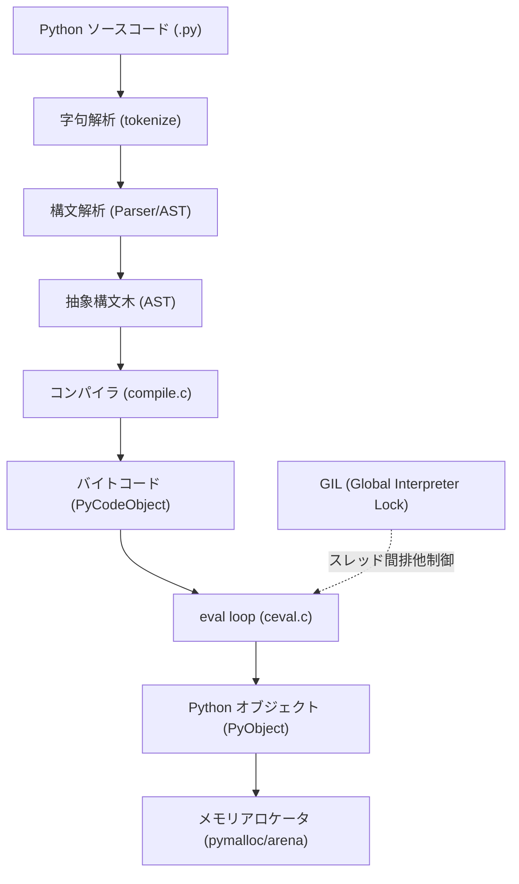
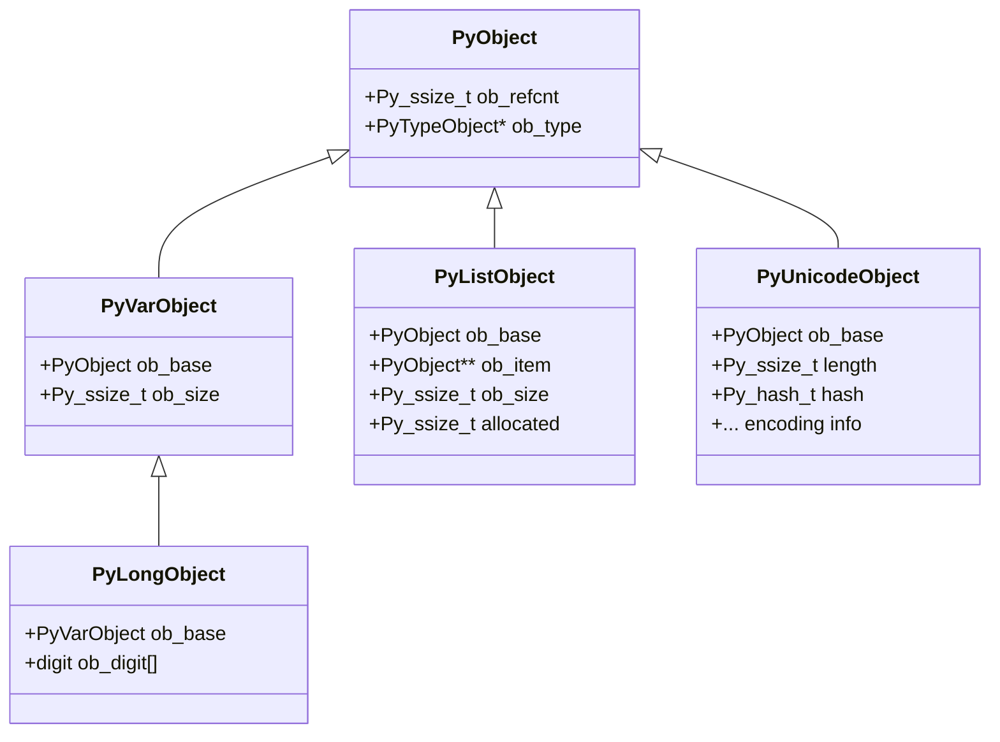
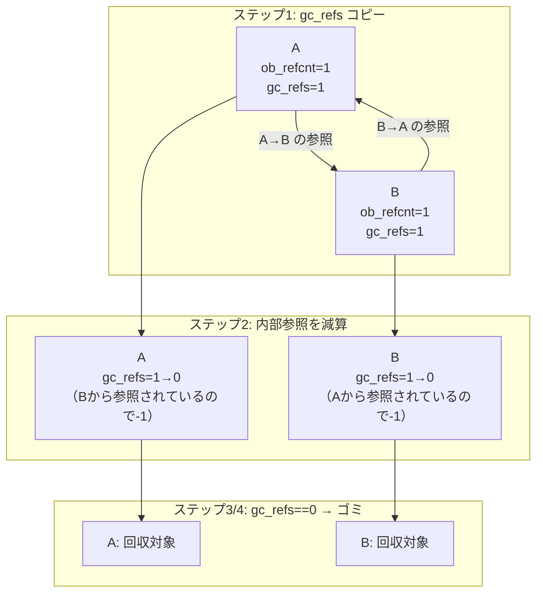
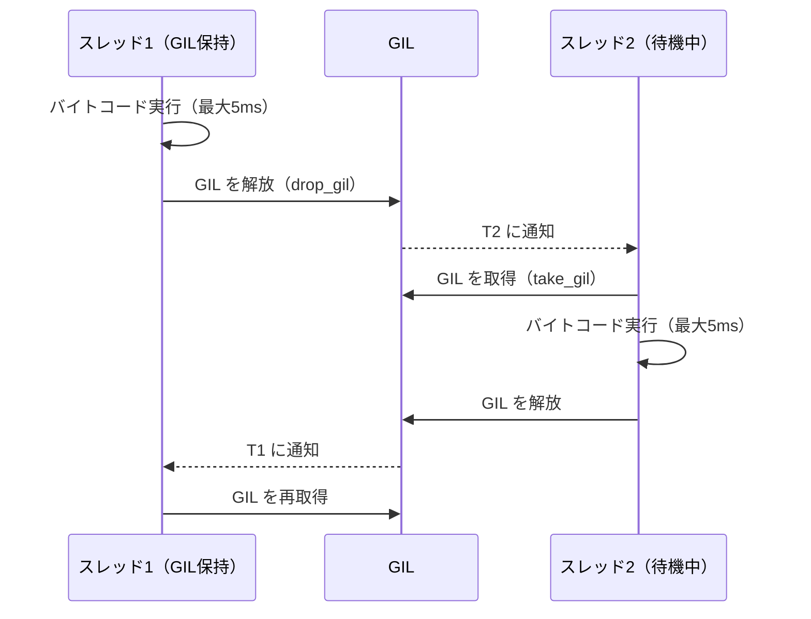
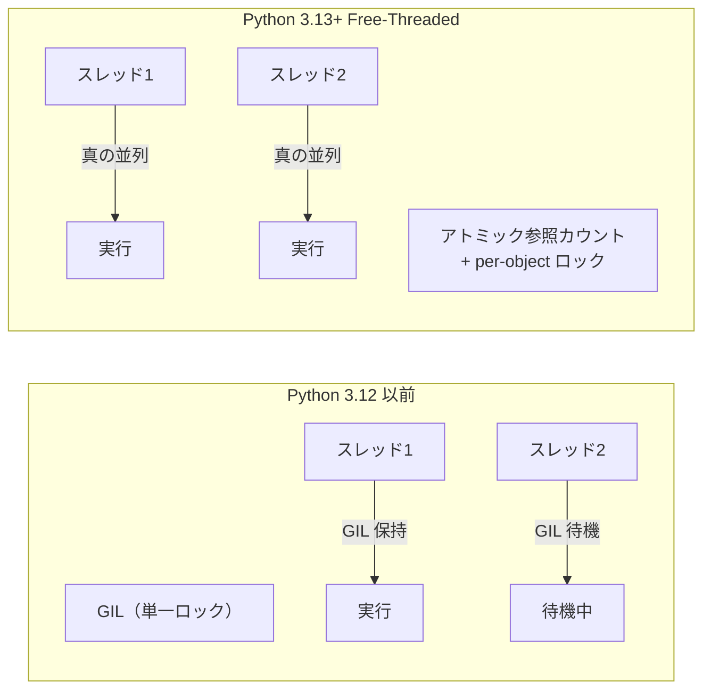
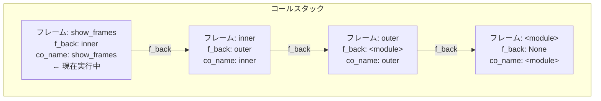
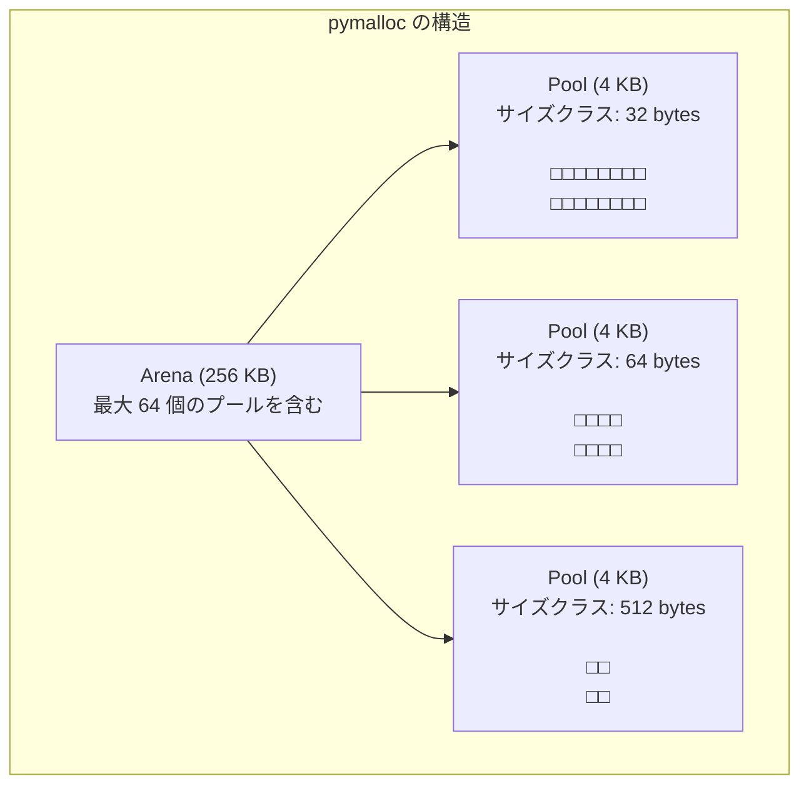
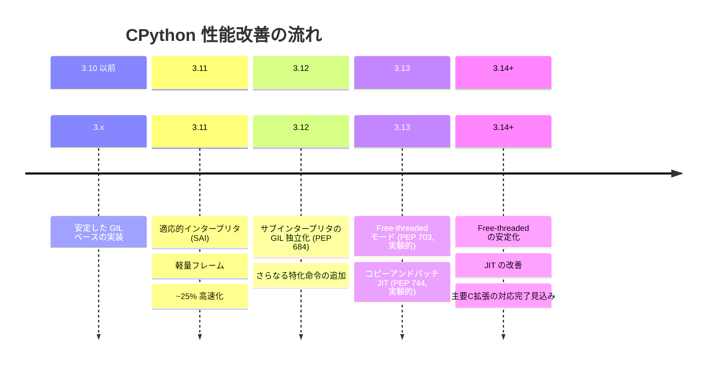

# CPython の内部（GIL, 参照カウント, バイトコード実行）

## 1. はじめに — CPython とは何か

Python は 1991 年に Guido van Rossum によって公開されたプログラミング言語であり、現在では機械学習、Web 開発、データ分析など幅広い分野で使われている。その参照実装が **CPython** である。CPython の名称は、C 言語で実装されていることに由来する。他にも PyPy（JIT コンパイラを持つ実装）、Jython（JVM 上の実装）、IronPython（.NET 上の実装）などが存在するが、`python` コマンドを打てば通常は CPython が起動する。

Python のコードを書くとき、私たちは高レベルな構文だけを扱う。しかしその裏側では、CPython が複雑な一連の処理を行っている。ソースコードはバイトコードにコンパイルされ、仮想マシン（eval loop）によって解釈実行される。メモリは参照カウントと循環参照 GC によって管理される。そして、CPython の最も有名かつ論争的な設計上の決定である **GIL（Global Interpreter Lock）** が、スレッドの並行実行に根本的な制約を課している。

本稿では CPython 3.12 / 3.13 を主な対象として、これらの内部機構を詳細に解説する。CPython のソースコードは GitHub（`python/cpython`）上で公開されており、本稿で触れる実装はすべて実際のコードに対応している。



> [!NOTE]
> 本稿のコード例は CPython 3.12 および 3.13 を前提としている。バージョンによって内部実装は異なる場合があるが、本稿で解説する根本的な設計は 3.x 全体を通じてほぼ共通である。

---

## 2. PyObject — すべてのオブジェクトの基盤

### 2.1 Python オブジェクトモデルの基本

CPython では、Python のすべての値が C のポインタ `PyObject *` として扱われる。整数も文字列もリストも関数も、すべて `PyObject` 構造体（またはそのスーパーセット）として表現される。これが Python の「すべてはオブジェクト」という哲学の C レベルでの実現形態である。

`PyObject` の定義は `Include/object.h` にある。簡略化すると以下のとおりである。

```c
/* Simplified from Include/object.h */
typedef struct _object {
    Py_ssize_t ob_refcnt;   // reference count
    PyTypeObject *ob_type;  // pointer to type object
} PyObject;
```

すべての Python オブジェクトはこの2つのフィールドを先頭に持つ。

- `ob_refcnt`：参照カウント。このオブジェクトを参照しているものの数。0 になった瞬間にオブジェクトは解放される。
- `ob_type`：型オブジェクトへのポインタ。`type(x)` が返す値はこのフィールドから取得される。

可変長オブジェクト（リスト、タプルなど）はさらに `ob_size` フィールドを持つ `PyVarObject` を基底とする。

```c
/* Simplified from Include/object.h */
typedef struct {
    PyObject ob_base;
    Py_ssize_t ob_size;  // number of items in variable-length part
} PyVarObject;
```

### 2.2 型オブジェクト (PyTypeObject)

`PyTypeObject` は Python の型システムを C レベルで実現する構造体である。`tp_name`（型名）、`tp_basicsize`（基本サイズ）、`tp_hash`（ハッシュ関数へのポインタ）、`tp_repr`（repr 関数へのポインタ）など、200 個以上のフィールドが型の振る舞いを定義する。

```c
/* Simplified: a few key fields of PyTypeObject */
typedef struct _typeobject {
    PyVarObject ob_base;
    const char *tp_name;           // type name string
    Py_ssize_t tp_basicsize;       // size of instances
    Py_ssize_t tp_itemsize;        // size of each item (for var-length types)
    destructor tp_dealloc;         // destructor function
    reprfunc tp_repr;              // __repr__
    hashfunc tp_hash;              // __hash__
    ternaryfunc tp_call;           // __call__
    /* ... hundreds more fields ... */
} PyTypeObject;
```

`int` 型は `PyLong_Type`、`str` 型は `PyUnicode_Type`、`list` 型は `PyList_Type` として静的に定義されている。Python でクラスを定義するとき、CPython はこの `PyTypeObject` のインスタンスを動的に生成する。

### 2.3 整数オブジェクト (PyLongObject)

Python の整数は `PyLongObject` として表現される。CPython 3.12 までは可変長のディジット配列（任意精度整数）として実装されていたが、3.12 以降では小さな整数のために `ob_digit[1]` のみを使う最適化（compact integer）が導入された。

```c
/* Simplified from Objects/longobject.c (CPython 3.12+) */
struct _longobject {
    PyObject_HEAD
    /* For compact integers (fits in one digit): inline storage */
    /* For larger integers: pointer to allocated digit array */
    digit ob_digit[1];
};
```



---

## 3. 参照カウント — CPython のメモリ管理の核心

### 3.1 参照カウントの基本

CPython のメモリ管理の主軸は**参照カウント（reference counting）** である。各オブジェクトは `ob_refcnt` フィールドに現在の参照カウントを保持し、以下のルールに従って増減する。

- オブジェクトへの新しい参照が作成される（変数への代入、コンテナへの追加など） → カウント +1（`Py_INCREF`）
- オブジェクトへの参照が消える（変数のスコープ終了、コンテナからの削除など） → カウント -1（`Py_DECREF`）
- カウントが 0 になる → オブジェクトの型の `tp_dealloc` 関数が呼ばれ、メモリが解放される

```c
/* Core macros from Include/object.h */
#define Py_INCREF(op) ((op)->ob_refcnt++)
#define Py_DECREF(op) \
    do { \
        if (--(op)->ob_refcnt == 0) { \
            (op)->ob_type->tp_dealloc((PyObject *)(op)); \
        } \
    } while (0)
```

実際のコードではオーバーフロー検査などが加わるが、本質はこれだけである。

Python コードでの参照カウント変動を `sys.getrefcount` で確認できる。

```python
import sys

x = []           # refcount: 1 (x holds a reference)
y = x            # refcount: 2 (y also holds a reference)
print(sys.getrefcount(x))  # prints 3 (getrefcount itself adds 1)

del y            # refcount: 2 (back to x + getrefcount)
del x            # refcount: 1 (only getrefcount's temporary ref)
# After this line, the list object has refcount 0 and is freed
```

> [!TIP]
> `sys.getrefcount(obj)` の引数渡し自体が一時的な参照を作るため、実際のカウントより常に 1 多く表示される。

### 3.2 参照カウントの利点と欠点

参照カウントの最大の利点は**即時回収**である。オブジェクトが不要になった瞬間にメモリが解放されるため、ヒープが増大しにくく、デストラクタ（`__del__`）の呼び出しタイミングも予測可能である。これは C++ の RAII に似た性質であり、ファイルハンドルやネットワークソケットなどのリソース管理に有利に働く。

一方で、参照カウントには本質的な欠点が2つある。

**欠点1：循環参照を回収できない**

```python
# Circular reference example
a = []
b = []
a.append(b)  # a -> b: b's refcount = 1
b.append(a)  # b -> a: a's refcount = 1 (from b's reference)

del a  # a's refcount drops to 1 (b still references it)
del b  # b's refcount drops to 1 (a still references it)
# Neither a nor b reaches refcount 0!
# Memory leak without cyclic GC
```

**欠点2：参照カウントの更新コスト**

`Py_INCREF` / `Py_DECREF` はほぼすべての操作で呼ばれる。これはキャッシュ効率を下げ、特にマルチスレッド環境では排他制御のコストを生む。後述の GIL の根本的な必要性のひとつがここにある。

### 3.3 循環参照 GC — 世代別ガベージコレクション

循環参照の問題を解決するために、CPython は参照カウントと**補助的な世代別 GC（cyclic garbage collector）** を組み合わせて使用する。このモジュールは `Modules/gcmodule.c` に実装されており、Python からは `gc` モジュールとして操作できる。

循環参照 GC が追跡するのは、他のオブジェクトへの参照を「含む可能性がある」コンテナオブジェクト（リスト、辞書、クラスインスタンス、タプルなど）のみである。整数や文字列などの不変オブジェクトは循環参照を作れないため追跡されない。

#### 世代別 GC の構造

世代別 GC は世代仮説（generational hypothesis）に基づく。

> **若いオブジェクトは早く死に、古いオブジェクトは長く生き残る**という経験則。

CPython の GC は 3 世代（generation 0, 1, 2）を維持する。

```
Generation 0: 新しく確保されたオブジェクト（最も頻繁にGC）
Generation 1: Generation 0 のGCを生き残ったオブジェクト
Generation 2: Generation 1 のGCを生き残ったオブジェクト（最も稀にGC）
```

各世代はオブジェクトの双方向連結リストとして実装されている。`PyObject` に GC 情報を付与する `PyGC_Head` 構造体が各追跡対象オブジェクトの先頭に付加される。

```c
/* From Include/cpython/objimpl.h */
typedef struct {
    uintptr_t _gc_next;  // next object in gc list
    uintptr_t _gc_prev;  // previous object in gc list
} PyGC_Head;
```

#### 循環参照の検出アルゴリズム

CPython の循環参照検出は以下のアルゴリズムで動作する。

```
1. 対象世代のすべての追跡オブジェクトについて、
   gc_refs = ob_refcnt のコピーを作成

2. 各オブジェクトが参照するオブジェクトの gc_refs を 1 減らす
   （コンテナ内の参照を「内部参照」としてキャンセルアウト）

3. gc_refs > 0 のオブジェクトは外部から参照されている（到達可能）
   → これをルートとして到達可能集合を広げる

4. 最終的に gc_refs == 0 のオブジェクトは循環参照ゴミ
   → tp_dealloc を呼んで解放
```



#### GC の閾値と手動制御

```python
import gc

# Check current thresholds (generation 0, 1, 2)
print(gc.get_threshold())  # (700, 10, 10) by default

# Generation 0 GC triggers when:
#   (allocations - deallocations) > threshold[0] = 700
# Generation 1 GC triggers every threshold[1] = 10 gen-0 collections
# Generation 2 GC triggers every threshold[2] = 10 gen-1 collections

# Manual GC
gc.collect(0)  # collect generation 0 only
gc.collect()   # collect all generations

# Disable GC (useful in tight loops with no circular references)
gc.disable()
# ... performance-critical code ...
gc.enable()
```

> [!WARNING]
> `gc.disable()` を使うと循環参照がメモリリークになる。オブジェクトが循環参照を作らないことが確実な場合（フラットな数値計算など）のみ使用すること。

---

## 4. GIL — Global Interpreter Lock

### 4.1 GIL とは何か

**GIL（Global Interpreter Lock）** は CPython インタープリタ全体を保護する単一のミューテックスである。ある時点において、GIL を保持しているスレッドだけが Python バイトコードを実行できる。複数のスレッドが存在しても、Python コードは事実上シリアルに実行される。

GIL の定義は `Python/ceval_gil.c`（旧バージョンでは `Python/ceval.c`）にある。

```c
/* Simplified concept (from Python/ceval_gil.c) */
struct _gil_runtime_state {
    unsigned long interval;    // switch interval in microseconds (default: 5000)
    PyThread_type_lock lock;   // the actual mutex
    volatile int locked;       // is the GIL currently held?
    volatile unsigned long last_holder; // thread id of current holder
    /* ... */
};
```

### 4.2 GIL が必要な理由

GIL は複数の理由から CPython の設計に深く組み込まれている。

**理由1：参照カウントの安全性**

`ob_refcnt` の更新（`Py_INCREF` / `Py_DECREF`）はアトミック操作ではない。インクリメント・デクリメントは読み取り→計算→書き込みの複数ステップからなる。GIL なしにマルチスレッドで `ob_refcnt` を更新すると、カウントが不正になり、生きているオブジェクトが早期解放される（use-after-free）か、ゴミが永遠に残るかのどちらかが起きる。

```
Thread 1                    Thread 2
read ob_refcnt = 2
                            read ob_refcnt = 2
ob_refcnt = 2 - 1 = 1
                            ob_refcnt = 2 - 1 = 1  (wrong! should be 0)
write ob_refcnt = 1
                            write ob_refcnt = 1
# Both wrote 1, but correct result was 0 → memory leak
```

**理由2：CPython 内部データ構造の保護**

インタープリタは辞書（`dict`）、リスト（`list`）、クラスの `__dict__` などの内部データ構造を多数持つ。これらへの同時アクセスを GIL 一本で保護できるため、個別にロックを実装する必要がなく、C 拡張モジュールとの互換性も保ちやすい。

**理由3：C 拡張モジュールとの互換性**

NumPy や SciPy などの C 拡張は、スレッドセーフでないサードパーティ C ライブラリを呼ぶことが多い。GIL はこれらの呼び出しを自動的にシリアル化する安全装置でもある。

### 4.3 GIL のスイッチングメカニズム

Python 3.2 以前は命令数カウンタ（`sys.checkinterval`、デフォルト 100 命令）に基づくスイッチングだったが、3.2 以降は時間ベース（`sys.getswitchinterval()`、デフォルト 5ms）に変わった。

```python
import sys
print(sys.getswitchinterval())  # 0.005 (5 milliseconds)

# Change switch interval (rarely needed)
sys.setswitchinterval(0.001)  # 1ms
```

スイッチングの仕組みを概略すると以下のとおりである。



I/O 操作（ファイル読み書き、ネットワーク通信）や時間のかかる C 拡張の計算（NumPy の行列演算など）は、実行前に GIL を解放し、完了後に再取得する。そのため、**I/O バウンドなタスクではマルチスレッドが有効**に機能する。

```python
import threading
import time
import urllib.request

# I/O-bound: threads are effective because GIL is released during I/O
def download(url):
    urllib.request.urlopen(url).read()

# These threads run concurrently (GIL released during network I/O)
threads = [threading.Thread(target=download, args=("https://example.com",))
           for _ in range(5)]
```

一方、**CPU バウンドなタスクではマルチスレッドはほぼ効果がなく**、逆にオーバーヘッドが増える。

```python
import threading

def cpu_bound():
    # Pure Python computation: GIL is barely released
    total = sum(i * i for i in range(10_000_000))

# Single thread: ~2s
# Two threads: ~2s (GIL prevents true parallelism) + scheduling overhead
```

### 4.4 GIL の迂回策

GIL の制約を迂回する方法はいくつかある。

| 方法 | 説明 | 適用場面 |
|---|---|---|
| `multiprocessing` | プロセスを分けて各々が独立した GIL を持つ | CPU バウンドタスク |
| C 拡張 + `Py_BEGIN_ALLOW_THREADS` | 計算中に GIL を解放 | NumPy, OpenCV など |
| `concurrent.futures.ProcessPoolExecutor` | プロセスプールで並列実行 | 汎用 CPU 並列 |
| `asyncio` | 協調的マルチタスク（GIL は常時保持だが問題なし） | I/O バウンド非同期 |

```python
import concurrent.futures
import math

def cpu_task(n):
    return sum(math.sqrt(i) for i in range(n))

# Use ProcessPoolExecutor to bypass GIL
with concurrent.futures.ProcessPoolExecutor() as executor:
    results = list(executor.map(cpu_task, [1_000_000] * 4))
```

### 4.5 CPython 3.13 Free-Threaded Mode（PEP 703）

GIL は長年の技術的負債として認識されており、**PEP 703（Making the Global Interpreter Lock Optional in CPython）** が 2023 年に採択された。CPython 3.13（2024 年 10 月リリース）では、実験的な **free-threaded ビルド**（`--disable-gil` オプション付きのビルド）が正式に提供された。

```bash
# Build CPython without GIL (Python 3.13+)
# git clone https://github.com/python/cpython
# cd cpython && ./configure --disable-gil && make -j8

# Check if running in free-threaded mode
import sys
print(sys._is_gil_enabled())  # True (normal) or False (free-threaded)
```

Free-threaded モードでは GIL が廃止される代わりに、以下の仕組みが導入された。

**参照カウントのアトミック操作化**

`ob_refcnt` の更新がアトミックな操作（CPU のアトミック命令）に置き換えられる。ただし、これ単体では不十分であり、より精巧なスキームが採用されている。

**Biased Reference Counting（偏向参照カウント）**

PEP 703 の中心的なアイデアの一つ。ほとんどのオブジェクトは1つのスレッドからしか参照されないという観察に基づき、**ローカルカウント**（オーナースレッドがアトミックでなく更新できる）と**共有カウント**（複数スレッドがアトミックに更新する）に分けて管理する。

```
オーナースレッドのアクセス:
  ob_refcnt_local を非アトミックに更新（高速）

他スレッドのアクセス:
  ob_refcnt_shared をアトミックに更新（低速だが稀）
```

**Per-object ロック**

辞書、リスト、集合などの内部データ構造には各オブジェクトごとの細粒度ロックが追加された。

> [!WARNING]
> CPython 3.13 の free-threaded モードは実験的扱いであり、多くの C 拡張モジュール（NumPy、pandas など）が GIL を前提として書かれているため互換性の問題がある。本番環境での使用は慎重に行うこと。3.14 以降でより安定したサポートが見込まれている。



---

## 5. バイトコードとコンパイル

### 5.1 コンパイルの流れ

Python ソースコードが実行されるまでのコンパイルパイプラインは以下の段階からなる。

```
ソースコード (.py)
    ↓ tokenize（字句解析）
トークン列
    ↓ Parser（構文解析、PEG パーサ：3.9以降）
CST/AST（抽象構文木）
    ↓ compile() / AST optimizer
バイトコード（PyCodeObject）
    ↓ __pycache__/.pyc にキャッシュ
.pyc ファイル（バイトコードキャッシュ）
```

`PyCodeObject` がバイトコードを格納する構造体である。主要なフィールドを示す。

```c
/* Simplified from Include/cpython/code.h */
struct PyCodeObject {
    PyObject_HEAD
    int co_argcount;          // number of positional arguments
    int co_nlocals;           // number of local variables
    int co_stacksize;         // required stack size
    PyObject *co_consts;      // tuple of constants used by bytecode
    PyObject *co_names;       // tuple of names used by bytecode
    PyObject *co_varnames;    // tuple of local variable names
    PyObject *co_code;        // bytecode string (raw bytes)
    PyObject *co_filename;    // source filename
    int co_firstlineno;       // first source line number
    /* ... */
};
```

### 5.2 dis モジュールによるバイトコードの観察

`dis` モジュールを使うと、コンパイルされたバイトコードを人間が読める形式で表示できる。

```python
import dis

def factorial(n):
    if n <= 1:
        return 1
    return n * factorial(n - 1)

dis.dis(factorial)
```

出力（CPython 3.12 の場合）：

```
  2           RESUME          0

  3           LOAD_FAST       0 (n)
              LOAD_CONST      1 (1)
              COMPARE_OP      1 (<=)
              POP_JUMP_IF_FALSE 2 (to 18)

  4           LOAD_CONST      1 (1)
              RETURN_VALUE

  6     >>    LOAD_FAST       0 (n)
              LOAD_FAST       0 (n)
              LOAD_GLOBAL     1 (NULL + factorial)
              LOAD_FAST       0 (n)
              LOAD_CONST      1 (1)
              BINARY_OP       10 (-)
              CALL            1
              BINARY_OP       5 (*)
              RETURN_VALUE
```

各バイトコード命令の構造は以下のとおりである。

- **オフセット**（命令の位置）
- **オペコード**（命令名、例：`LOAD_FAST`）
- **オペランド**（引数、例：`0`）
- **注釈**（人間可読の説明、例：`(n)`）

CPython 3.6 以降、すべての命令は「ワード（2バイト）」単位に揃えられた（以前は命令によってサイズが異なった）。3.12 では一部命令が「特化（specialization）」される適応的インタープリタが導入された。

### 5.3 主要なバイトコード命令

```
データ操作系:
  LOAD_CONST   スタックに定数をプッシュ
  LOAD_FAST    ローカル変数をプッシュ
  STORE_FAST   スタックトップをローカル変数に格納
  LOAD_GLOBAL  グローバル変数をプッシュ

スタック操作系:
  POP_TOP      スタックトップを捨てる
  DUP_TOP      スタックトップを複製

演算系:
  BINARY_OP    2項演算（+, -, *, /, etc.）
  UNARY_NEGATIVE  単項マイナス

制御フロー系:
  POP_JUMP_IF_FALSE   条件ジャンプ
  JUMP_BACKWARD       ループのバック エッジ
  FOR_ITER            イテレータの次の値取得

関数呼び出し系:
  CALL         関数呼び出し
  RETURN_VALUE 値を返してフレームを終了
```

---

## 6. フレームオブジェクト — 実行コンテキスト

### 6.1 フレームとは何か

関数が呼ばれるたびに、CPython は**フレームオブジェクト（frame object）**を作成する。フレームは現在の実行コンテキストを表し、以下の情報を持つ。

- 実行中の `PyCodeObject`（バイトコード）
- ローカル変数の値（`co_varnames` に対応する配列）
- 評価スタック（バイトコード実行中の一時値）
- 現在の命令ポインタ（`f_lasti`）
- 呼び出し元フレームへのリンク（`f_back`）

```c
/* Simplified from Include/cpython/frameobject.h */
struct PyFrameObject {
    PyObject_HEAD
    struct PyFrameObject *f_back;  // previous frame (caller)
    PyCodeObject *f_code;          // code object
    PyObject *f_builtins;          // built-in namespace
    PyObject *f_globals;           // global namespace
    PyObject *f_locals;            // local namespace
    int f_lasti;                   // index in bytecode of last attempt
    /* evaluation stack follows */
};
```

フレームはコールスタックを形成する。`traceback` モジュールや Python デバッガはこのリンクリストをたどってスタックトレースを構築する。

```python
import sys

def show_frames():
    frame = sys._getframe()  # get current frame
    while frame:
        print(f"File: {frame.f_code.co_filename}, "
              f"Line: {frame.f_lineno}, "
              f"Function: {frame.f_code.co_name}")
        frame = frame.f_back

def inner():
    show_frames()

def outer():
    inner()

outer()
# Output:
# File: ..., Line: 4, Function: show_frames
# File: ..., Line: 10, Function: inner
# File: ..., Line: 13, Function: outer
# File: ..., Line: 16, Function: <module>
```

### 6.2 CPython 3.11 以降のフレームの最適化

CPython 3.11 以前は、すべてのフレームが Python レベルから `sys._getframe()` でアクセス可能な `PyFrameObject` としてヒープに確保されていた。3.11 では、ほとんどのフレームを**スタック上（C の実行スタック）に配置する軽量フレーム**として最適化し、Python オブジェクトとしての公開が必要なときのみヒープ上の `PyFrameObject` に「昇格」するようになった。これにより関数呼び出しの性能が大幅に向上した（CPython 3.11 はこの最適化を含む多数の改善で前バージョン比 25% 程度の高速化を達成した）。

### 6.3 コールスタックの視覚化



---

## 7. eval loop — バイトコードの解釈実行

### 7.1 eval loop の概要

CPython のバイトコード実行の中心は `Python/ceval.c` に定義された `_PyEval_EvalFrameDefault()` 関数（以下 "eval loop"）である。この関数は巨大な `switch` 文（あるいは computed goto テーブル）で実装されており、各オペコードに対応するハンドラが直接コーディングされている。

```c
/* Simplified structure of the eval loop (Python/ceval.c) */
PyObject *
_PyEval_EvalFrameDefault(PyThreadState *tstate, _PyInterpreterFrame *frame, int throwflag)
{
    /* ... setup ... */

    for (;;) {
        opcode = NEXTOPCODE();  // fetch next instruction
        oparg  = NEXTOPARG();

        switch (opcode) {
        case LOAD_FAST: {
            PyObject *value = GETLOCAL(oparg);
            PUSH(value);
            Py_INCREF(value);  // increment reference count
            DISPATCH();        // go to next instruction
        }
        case STORE_FAST: {
            PyObject *value = POP();
            SETLOCAL(oparg, value);
            DISPATCH();
        }
        case BINARY_OP: {
            PyObject *right = POP();
            PyObject *left = TOP();
            PyObject *result = binary_op(left, right, oparg);
            Py_DECREF(left);
            Py_DECREF(right);
            SET_TOP(result);
            DISPATCH();
        }
        /* ... hundreds more cases ... */
        }
    }
}
```

`DISPATCH()` マクロは次の命令へのジャンプを表す。`computed goto` がサポートされる GCC/Clang では、`switch` の代わりにラベルへの直接ジャンプ（`goto *jump_table[opcode]`）が使われ、分岐予測の精度が上がりパフォーマンスが向上する。

### 7.2 評価スタックの動作

eval loop はスタックマシンとして動作する。オペランドは評価スタックから取り出され、結果がスタックにプッシュされる。`1 + 2 * 3` の計算を追ってみる。

```python
import dis
dis.dis(compile("1 + 2 * 3", "<string>", "eval"))
```

```
  LOAD_CONST 1 (1)      スタック: [1]
  LOAD_CONST 2 (2)      スタック: [1, 2]
  LOAD_CONST 3 (3)      スタック: [1, 2, 3]
  BINARY_OP  5 (*)      スタック: [1, 6]   (2*3=6)
  BINARY_OP  0 (+)      スタック: [7]      (1+6=7)
  RETURN_VALUE          return 7
```

### 7.3 適応的インタープリタ（Specializing Adaptive Interpreter）

CPython 3.12 では**適応的インタープリタ（Specializing Adaptive Interpreter, SAI）** が導入された。これは「見てから最適化する（observe-then-specialize）」アプローチで、実行時の型情報に基づいて命令を特化バージョンに書き換える。

```
BINARY_OP (汎用)
  ↓ 同じ型で複数回実行されたら
BINARY_OP_ADD_INT   (int + int に特化、型チェックをインライン展開)
BINARY_OP_ADD_FLOAT (float + float に特化)
BINARY_OP_ADD_UNICODE (str + str に特化)
```

特化された命令は型チェックを最小化し、直接 C の処理を呼び出すため、汎用命令より大幅に高速である。型の前提が崩れた場合は汎用命令に戻す（deoptimize）。


---

## 8. メモリアロケータ — pymalloc と arena

### 8.1 Python のメモリ管理階層

CPython のメモリ管理は 3 層構造である。

```
Layer 3: Python オブジェクトアロケータ
          （PyObject_New, PyObject_GC_New など）
             ↓
Layer 2: Python メモリアロケータ（pymalloc）
          小オブジェクト（512バイト以下）を専用に管理
             ↓
Layer 1: OS / C ランタイムアロケータ
          （malloc / free / mmap）
```

### 8.2 pymalloc — 小オブジェクト専用アロケータ

Python プログラムは多数の小さなオブジェクト（整数、タプル、辞書エントリなど）を頻繁に確保・解放する。汎用の `malloc` / `free` はこのパターンに非効率であるため、CPython は **pymalloc** と呼ばれる専用アロケータを内蔵している。pymalloc は **512 バイト以下**（CPython 3.8 以降はデフォルト）のオブジェクトに適用される。

pymalloc の構造は 3 レベルのヒエラルキーからなる。

```
Arena（アリーナ）: 256KB の連続したメモリブロック
  └─ Pool（プール）: 4KB（1ページ）のブロック
       └─ Block（ブロック）: 固定サイズの割り当て単位
```



**サイズクラス（size class）**

pymalloc は要求サイズを 8 バイト単位で丸め上げてサイズクラスに割り当てる（8, 16, 24, ..., 512 バイト）。同じサイズクラスのプールをフリーリストで管理し、`malloc` / `free` のオーバーヘッドなしにO(1)でブロックを割り当て・回収できる。

```
要求サイズ 17 bytes → サイズクラス 24 bytes のプールから割り当て
要求サイズ 500 bytes → サイズクラス 504 bytes のプールから割り当て
要求サイズ 513 bytes → pymalloc の対象外 → malloc に委譲
```

**アリーナ管理**

アリーナは `mmap`（UNIX）または `VirtualAlloc`（Windows）で OS から直接確保される。すべてのプールが解放されたアリーナは OS に返却される。これにより、長時間実行するプロセスでも使用していないメモリが OS に戻るようになっている。

### 8.3 メモリ使用量の確認

```python
import tracemalloc

tracemalloc.start()

# ... some code ...
large_list = [i for i in range(100_000)]

snapshot = tracemalloc.take_snapshot()
top_stats = snapshot.statistics('lineno')
for stat in top_stats[:5]:
    print(stat)
```

```python
import sys

x = [1, 2, 3]
print(sys.getsizeof(x))    # size of list object itself (not elements)
print(sys.getsizeof(42))   # size of int object
print(sys.getsizeof("hello"))  # size of str object
```

---

## 9. インターン化と小整数キャッシュ

### 9.1 小整数キャッシュ

CPython は **-5 から 256** の範囲の整数オブジェクトを起動時に事前生成し、キャッシュする。この範囲の整数を「生成」すると、常に同じオブジェクトへのポインタが返される。

```c
/* From Objects/longobject.c */
#define NSMALLPOSINTS   257   // 0 to 256
#define NSMALLNEGINTS   5     // -5 to -1

static PyLongObject small_ints[NSMALLNEGINTS + NSMALLPOSINTS];
```

```python
# Small integers are interned (cached)
a = 256
b = 256
print(a is b)   # True  (same object)
print(id(a) == id(b))  # True

# Outside the cache range
x = 257
y = 257
print(x is y)   # False (usually; different objects)
# Note: in the REPL or same code block, CPython may optimize this
```

> [!NOTE]
> `is` は同一オブジェクト比較（`id()` が等しいか）であり、`==` は値比較（`__eq__`）である。整数の等値比較には必ず `==` を使うこと。`is` による比較は小整数キャッシュの有無で動作が変わる。

小整数キャッシュの利点は 2 つである。まずメモリ効率：よく使われる整数が何千ものコピーとして存在しない。次に速度：`Py_INCREF` / `Py_DECREF` の呼び出しが省略できるケースがある。

### 9.2 文字列のインターン化

文字列のインターン化（interning）は、同一内容の文字列オブジェクトを共有する最適化である。CPython は識別子として使えそうな文字列（ASCII 英数字とアンダースコアのみ）をコンパイル時に自動的にインターンする。

```python
# Identifiers are automatically interned at compile time
a = "hello"
b = "hello"
print(a is b)  # True (automatically interned)

# Strings with spaces are NOT automatically interned
x = "hello world"
y = "hello world"
print(x is y)  # False (usually)

# Manual interning
import sys
p = sys.intern("hello world")
q = sys.intern("hello world")
print(p is q)  # True
```

インターン化は辞書のキーとして文字列を使う場合に特に有効である。インターンされた文字列どうしの比較は、内容を比較せずにポインタ比較のみで O(1) で完了する。

```c
/* Optimized string comparison using interning */
if (a == b) {                  // pointer comparison
    /* definitely equal */
} else if (PyUnicode_CheckInterned(a) && PyUnicode_CheckInterned(b)) {
    /* both interned but different pointers → definitely not equal */
    return 0;
} else {
    /* fall back to content comparison */
}
```

### 9.3 その他のキャッシュ機構

**None, True, False のシングルトン**

```python
print(None is None)   # True (always the same object)
print(True is True)   # True
print(False is False) # True
```

これらはモジュール `Objects/object.c` で静的に定義されたシングルトンオブジェクトである。

**空のタプルのシングルトン**

```python
a = ()
b = ()
print(a is b)  # True (empty tuple is a singleton)
```

**フリーリスト（free list）**

フレームオブジェクト、リストオブジェクト、辞書オブジェクトなどは、解放時に即座に `free` するのではなく、型ごとのフリーリストにキャッシュする。次の同型オブジェクトの確保時にフリーリストから再利用することで `malloc` のオーバーヘッドを削減する。

```c
/* Simplified: list free list in Objects/listobject.c */
#define PyList_MAXFREELIST 80
static PyListObject *free_list[PyList_MAXFREELIST];
static int numfree = 0;
```

---

## 10. PEP 703 の展望と CPython の未来

### 10.1 PEP 703 の採択と現状

**PEP 703（Making the Global Interpreter Lock Optional in CPython）** は Sam Gross が提案し、2023 年に Python ステアリングカウンシルが採択した。採択の条件として以下が要求された。

- シングルスレッドのパフォーマンスへの影響を最小化すること（目標: 3% 以内）
- 既存の C API との後方互換性を可能な限り維持すること
- 3 年間（3.13〜3.15）かけて段階的に導入し、各フェーズで評価すること

CPython 3.13 では free-threaded ビルドが実験的に提供され、3.14（2025 年 10 月予定）では主要な C 拡張の対応が進む見込みである。

### 10.2 Free-Threaded モードの技術的課題

GIL を取り除くことは単純に見えて、実際には CPython の多くの場所に影響する。

**Py_INCREF / Py_DECREF のアトミック化**

最も基本的な変更だが、すべての参照カウント操作をアトミック命令に置き換えると、x86 では `LOCK XADD`（アトミックなフェッチアンドアド）が使われる。シングルスレッドでもこの命令は通常の加算より遅い（メモリバス全体をロックするため）。

**immortal オブジェクト**

PEP 683（Immortal Objects for Core CPython）で導入された**immortal オブジェクト**の仕組みが free-threaded では重要になる。`None`、`True`、`False`、小整数キャッシュなどのグローバルに共有される不変オブジェクトを「永続（immortal）」としてマークし、参照カウントの更新を完全にスキップする。

```c
/* Immortal objects have a special refcount value */
#define _Py_IMMORTAL_REFCNT PY_SSIZE_T_MAX
#define _Py_IsImmortal(op)  ((op)->ob_refcnt == _Py_IMMORTAL_REFCNT)

#define Py_INCREF(op) \
    do { \
        if (!_Py_IsImmortal(op)) { \
            (op)->ob_refcnt++; \
        } \
    } while(0)
```

**C 拡張のスレッドセーフ性**

GIL が存在する世界では、`PyGILState_Ensure()` と `PyGILState_Release()` を使うか、I/O 中に `Py_BEGIN_ALLOW_THREADS` で GIL を解放するだけで十分だった。Free-threaded モードでは、C 拡張が内部で保護しているデータ構造が複数スレッドから同時アクセスされる可能性があり、それぞれのスレッドセーフ化が必要になる。

### 10.3 JIT コンパイルの導入（CPython 3.13+）

PEP 744（JIT Compilation）により、CPython 3.13 ではコピーアンドパッチ（copy-and-patch）方式の JIT コンパイラが実験的に導入された。これは適応的インタープリタの上位レイヤとして動作し、ホットなコードパスをネイティブコードに変換する。

```bash
# Build with JIT enabled (Python 3.13+)
# ./configure --enable-experimental-jit && make
```

コピーアンドパッチ JIT は LLVM を使わず、事前生成したネイティブコードテンプレートをコピーして必要なアドレスだけをパッチする軽量な方式であり、ビルド時間とバイナリサイズへの影響を最小化している。

### 10.4 CPython の性能改善ロードマップ



---

## 11. サブインタープリタと GIL の独立化（PEP 684）

CPython 3.12 では **PEP 684（A Per-Interpreter GIL）** が実装され、サブインタープリタ（`_interpreters` モジュールで作成）ごとに独立した GIL を持てるようになった。これにより、複数のサブインタープリタを別々のスレッドで実行すれば、実質的な CPU バウンドの並列実行が可能になる。

```python
import _interpreters
import threading

# Python 3.12+: each interpreter has its own GIL
def run_in_interpreter(code):
    interp = _interpreters.create()
    _interpreters.exec(interp, code)
    _interpreters.destroy(interp)

# Two interpreters can run CPU-bound code in parallel
t1 = threading.Thread(target=run_in_interpreter,
                      args=("x = sum(range(10_000_000))",))
t2 = threading.Thread(target=run_in_interpreter,
                      args=("y = sum(range(10_000_000))",))
t1.start()
t2.start()
t1.join()
t2.join()
```

ただし、サブインタープリタ間でオブジェクトを直接共有することはできず、チャネルを通じたメッセージパッシングが必要になる。

---

## 12. まとめ

本稿で解説した CPython の内部機構を整理する。

| 機構 | 概要 | 課題・展望 |
|---|---|---|
| **PyObject** | すべての Python 値を表す基礎構造体。`ob_refcnt` と `ob_type` を持つ | free-threaded でアトミック化 |
| **参照カウント** | 即時回収が可能で予測可能なメモリ管理 | 循環参照を単独では処理できない |
| **循環参照 GC** | 世代別 GC で循環参照を補完的に処理 | GC 一時停止が発生する |
| **GIL** | スレッド間排他制御。I/O バウンドには有効だが CPU バウンドには制約 | PEP 703 で optional 化 |
| **バイトコード** | Python はスタックマシン型の仮想マシン命令に変換される | SAI で実行時特化 |
| **フレーム** | 関数呼び出しごとの実行コンテキスト | 3.11 以降軽量化 |
| **pymalloc** | 512 バイト以下の小オブジェクト専用アロケータ | arena 管理で OS へ返却 |
| **インターン化** | 小整数・識別子文字列のキャッシュ | ポインタ比較の高速化 |
| **PEP 703** | GIL を optional 化し真の並列 Python を実現 | 3.13 実験的、3.14+ で安定化 |

CPython は「ゆっくりだが確実に」進化を続けている。GIL という 30 年来の制約が取り除かれ、JIT コンパイルが現実のものになりつつある今、Python ランタイムの設計は歴史的な転換点にある。内部機構を理解することは、パフォーマンスチューニングやデバッグだけでなく、この変化の意味を正確に把握するためにも不可欠である。

---

## 参考文献・関連リソース

- CPython ソースコード: [https://github.com/python/cpython](https://github.com/python/cpython)
- PEP 703 (Making the GIL Optional): [https://peps.python.org/pep-0703/](https://peps.python.org/pep-0703/)
- PEP 684 (A Per-Interpreter GIL): [https://peps.python.org/pep-0684/](https://peps.python.org/pep-0684/)
- PEP 744 (JIT Compilation): [https://peps.python.org/pep-0744/](https://peps.python.org/pep-0744/)
- PEP 683 (Immortal Objects): [https://peps.python.org/pep-0683/](https://peps.python.org/pep-0683/)
- CPython Internals Book (Anthony Shaw, Real Python): PyObject と eval loop の詳細解説
- Inside the Python Virtual Machine (Obi Ike-Nwosu): フレームとバイトコードの深掘り
