# CSP（Communicating Sequential Processes）とGoのgoroutine

## 1. はじめに：並行処理の根本的な課題

ソフトウェアが扱う問題の多くは、本質的に並行性を持っている。Webサーバーは同時に数千のリクエストを処理し、GUIアプリケーションはユーザー入力とバックグラウンド処理を同時に行い、データパイプラインは複数のステージを並列に実行する。しかし、並行プログラムの記述と検証は、逐次プログラムと比較して桁違いに困難である。

その根本原因は**共有メモリの非決定的なアクセス**にある。複数のスレッドが同じメモリ領域を読み書きする場合、実行結果はスレッドのスケジューリング順序に依存する。この非決定性はレースコンディション、デッドロック、ライブロックといった検出困難なバグを生む。伝統的な対処法であるロック（mutex、セマフォ）は、正しく使えば問題を解決できるが、ロックの粒度設計、獲得順序の管理、パフォーマンスとのトレードオフなど、開発者に高い注意力を要求する。

1978年、英国の計算機科学者Tony Hoareは、この状況に対する根本的に異なるアプローチを提案した。それが**CSP（Communicating Sequential Processes）** である。CSPの核心的な洞察は明快だ。**共有メモリを介して通信するのではなく、通信を介してメモリを共有せよ**。この一言に凝縮された設計哲学は、約半世紀を経た現在でも並行プログラミングの指導原理として生き続けている。

本記事では、CSPの理論的基盤から出発し、それがGoプログラミング言語のgoroutineとchannelにどのように具現化されているかを詳細に解説する。さらに、実践的な並行パターンやアクターモデルとの比較を通じて、CSPの本質的な価値と限界を明らかにする。

## 2. CSPの理論（Hoare, 1978）

### 2.1 歴史的背景

CSPの起源は、1978年にCommunications of the ACMに掲載されたTony Hoareの論文「Communicating Sequential Processes」に遡る。当時の並行プログラミングは、Dijkstraのセマフォ（1965年）やHansenのモニター（1973年）といった共有メモリベースの同期機構が主流であった。これらの機構は低レベルで柔軟だが、プログラムの正しさを形式的に推論することが困難であった。

Hoareの論文は、並行プログラムを**独立したプロセスの集合**として捉え、プロセス間の相互作用を**メッセージパッシング**に限定するというモデルを提案した。この論文で示された核心的な概念は以下の通りである。

- **逐次プロセス（Sequential Process）**: 各プロセスは通常の逐次プログラムとして記述される
- **通信（Communication）**: プロセス間の唯一の相互作用手段は、入出力コマンドによるメッセージの送受信である
- **同期性（Synchronization）**: 通信は送信側と受信側の両方が準備完了したときにのみ成立する（ランデブー）

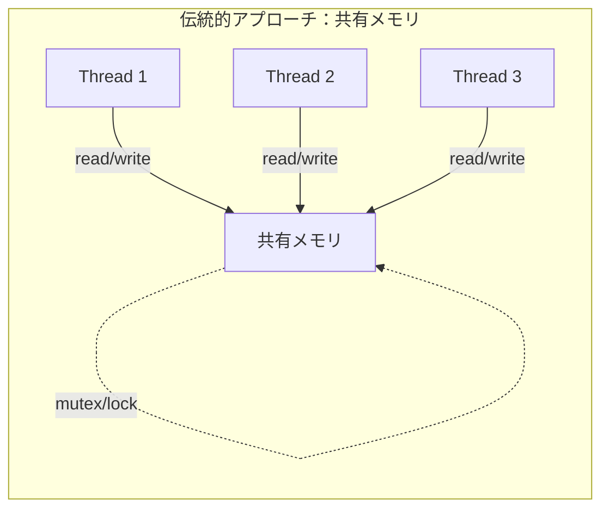

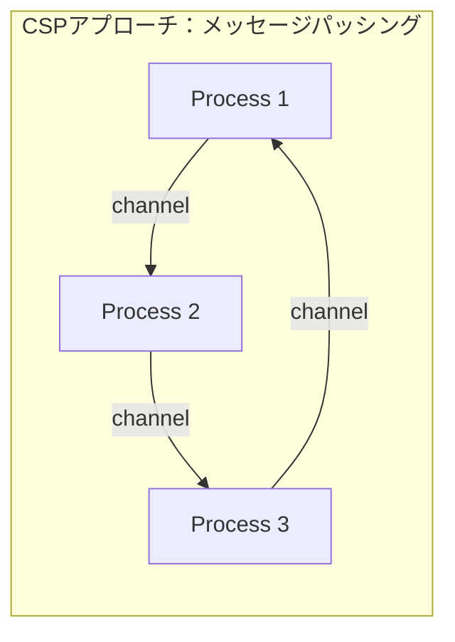

Hoareの1978年の論文は、プログラミング言語の記法としてCSPを提案したものであり、後述するプロセス代数としての形式化は1985年の著書で行われた。この区別は重要である。1978年の論文は、具体的な構文を持つプログラミング記法であり、Goのgoroutineとchannelの直接的な祖先にあたる。

### 2.2 1978年版CSPの構文

1978年版CSPにおいて、プロセス間通信は以下の構文で表現される。

- **出力コマンド**: `destination ! expression` — 指定されたプロセスにメッセージを送信する
- **入力コマンド**: `source ? variable` — 指定されたプロセスからメッセージを受信する

この通信は**同期的**である。すなわち、送信側は受信側がready状態になるまでブロックし、受信側も送信側がready状態になるまでブロックする。この同期通信（ランデブー）により、別途の同期機構を設ける必要がなくなる。

さらに、Hoareは**ガード付きコマンド**（Dijkstraのguarded commandsに着想を得たもの）を導入し、複数の通信候補から非決定的に選択する仕組みを提供した。これは後にGoの`select`文として具現化される概念である。

### 2.3 素数のふるい：CSPの古典的な例

1978年の論文で示された有名な例が、**素数のふるい（Sieve of Eratosthenes）** のCSPによる表現である。この例は、CSPの力を端的に示す。

```
SIEVE = [
  p: integer;
  source ? p;
  print(p);
  SIEVE(source filtered by p)
]
```

この考え方は、各素数に対応するプロセスを動的に生成し、パイプライン状に接続するものである。最初のプロセスは2以上の整数を生成し、次のプロセスは最初の数（2）を受け取って出力した後、2の倍数をフィルタリングするプロセスとなる。同様に、3の倍数、5の倍数...とフィルタリングが連鎖していく。

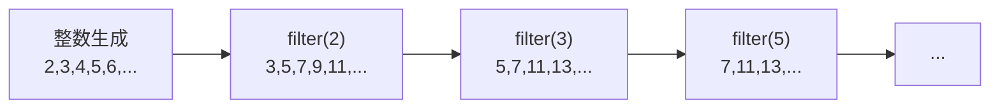

この例が示す重要な点は、**並行プロセスの動的な生成と接続**がCSPの自然な表現であるということだ。各フィルタプロセスは独立した逐次プロセスであり、入力と出力のチャネルを通じてのみ相互作用する。共有状態は存在しない。

## 3. プロセス代数としてのCSP

### 3.1 1985年の形式化

1978年の論文はプログラミング記法としてのCSPであったが、1985年に出版されたHoareの著書「Communicating Sequential Processes」（通称「CSP本」）は、CSPを**プロセス代数（Process Algebra）** として再定義した。プロセス代数とは、並行システムの振る舞いを代数的に記述し、推論するための数学的フレームワークである。

この形式化により、CSPは単なるプログラミング記法から、並行システムの**仕様記述**と**検証**のための形式手法へと昇華した。

### 3.2 基本的な構成要素

プロセス代数としてのCSPは、以下の基本要素から構成される。

**イベント（Event）**

CSPにおけるイベントは、環境との相互作用の最小単位である。イベントの集合を $\Sigma$（アルファベット）と呼ぶ。

**基本プロセス**

- $STOP$ — デッドロック状態。何のイベントも実行しない
- $SKIP$ — 正常終了。成功終了イベント $\checkmark$ を実行して停止する

**プリフィックス（Prefix）**

イベント $a$ の後にプロセス $P$ として振る舞うプロセスを $a \to P$ と記述する。

例えば、コインを入れてチョコレートを出す自動販売機は次のように表現される：

$$VendingMachine = coin \to choc \to VendingMachine$$

**選択（Choice）**

外部選択（External Choice）$P \mathrel{\Box} Q$ は、環境がPまたはQのどちらの最初のイベントを提供するかによって決まる。

内部選択（Internal Choice）$P \sqcap Q$ は、プロセス自身が非決定的にPまたはQを選択する。

$$ComplexVM = coin \to (choc \to ComplexVM \mathrel{\Box} tea \to ComplexVM)$$

この自動販売機は、コインを入れた後、利用者がチョコレートかお茶を選択できる。

**並行合成（Parallel Composition）**

CSPの最も重要な演算子は並行合成である。$P \parallel_A Q$ は、プロセスPとQが共通のイベント集合 $A$ 上で同期しながら並行に動作することを表す。

$$P \parallel_{\{a\}} Q$$

この場合、イベント $a$ はPとQが同時に実行しなければならない（ランデブー）。それ以外のイベントは独立に実行できる。

### 3.3 トレース意味論

CSPの最も基本的な意味論は**トレース意味論（Traces Semantics）** である。プロセスのトレースとは、そのプロセスが実行可能なイベント列の集合である。

$$traces(a \to b \to STOP) = \{\langle\rangle, \langle a \rangle, \langle a, b \rangle\}$$

トレース意味論では、プロセスPがプロセスQを**詳細化（Refinement）** する（$Q \sqsubseteq_T P$）とは、PのトレースがQのトレースの部分集合であることを意味する。

$$P \sqsubseteq_T Q \iff traces(Q) \subseteq traces(P)$$

この詳細化関係により、仕様（抽象的なプロセス）に対して実装（具体的なプロセス）が正しいかどうかを形式的に検証できる。

### 3.4 失敗・発散意味論

トレース意味論だけでは、デッドロックやライブロックを区別できない。より精密な分析のために、**失敗意味論（Failures Semantics）** と**失敗・発散意味論（Failures-Divergences Semantics）** が定義されている。

- **失敗（Failure）**: あるトレースの後に拒否できるイベントの集合
- **発散（Divergence）**: 内部イベントの無限ループ（ライブロック）

これらの意味論により、デッドロック自由性（deadlock-freedom）やライブロック自由性（livelock-freedom）を形式的に証明できる。

### 3.5 FDR：CSPの自動検証ツール

CSPの形式化の実用的な成果として、**FDR（Failures-Divergences Refinement）** というモデル検査ツールが開発された。FDRは、CSPで記述された仕様と実装の間の詳細化関係を自動的に検証する。FDRは産業界でも活用されており、特にセキュリティプロトコルの検証において顕著な成果を上げている。

## 4. チャネルによる通信

### 4.1 チャネルの概念

CSPにおけるチャネルは、プロセス間でメッセージを受け渡すための**型付きの通信路**である。1978年のオリジナル論文では、通信はプロセス名を直接指定して行われていたが、後の発展でチャネルという抽象化が導入された。

チャネルの重要な特性は以下の通りである。

| 特性 | 説明 |
|------|------|
| **型付き** | チャネルは特定の型のメッセージのみを伝送する |
| **方向性** | 送信と受信の区別がある |
| **同期的** | 基本的にランデブー方式（送受信が同時に成立） |
| **一対一** | 一つの通信は送信者と受信者の一対一で成立する |

### 4.2 同期通信（ランデブー）の意義

CSPにおけるチャネル通信の最も重要な特徴は**同期性**である。送信操作 `ch ! v` は、対応する受信操作 `ch ? x` が実行されるまでブロックし、その逆も同様である。

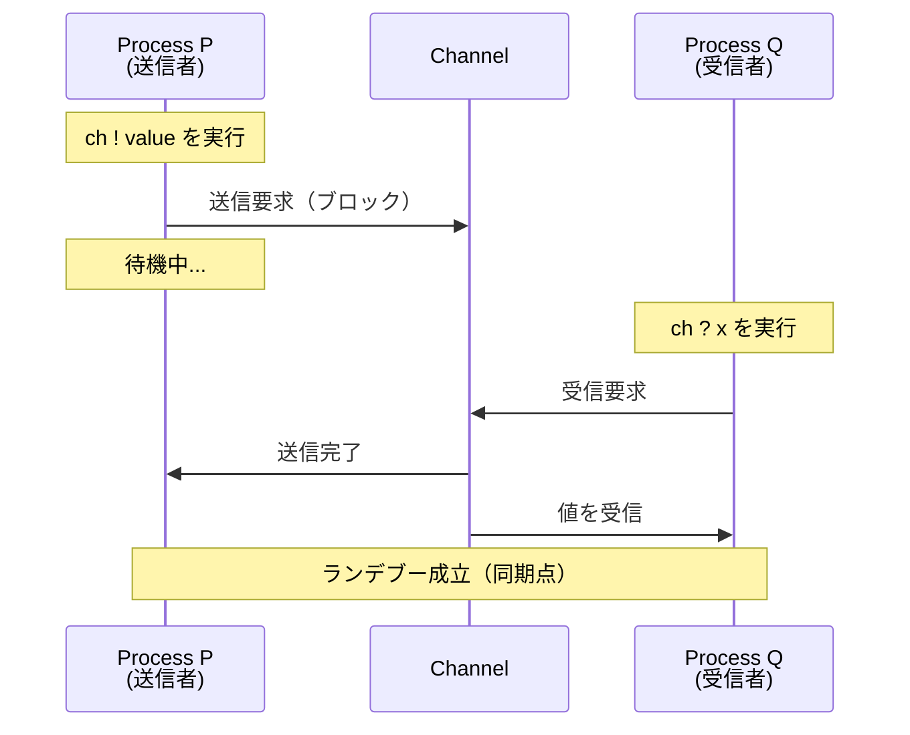

この同期通信の意義は深い。

1. **暗黙の同期**: 通信そのものが同期機構となるため、別途のロックやセマフォが不要
2. **因果関係の確立**: 送信が完了した時点で、受信側がメッセージを受け取ったことが保証される
3. **フロー制御**: 送信者は受信者の処理速度に自動的に合わせられる（バックプレッシャー）

### 4.3 バッファ付きチャネル

純粋なCSPのチャネルは同期的（バッファサイズ0）だが、実用的な実装では**バッファ付きチャネル**が提供されることが多い。バッファ付きチャネルでは、バッファが満杯でない限り送信操作はブロックしない。

バッファ付きチャネルは、CSPの理論的枠組みの中では、中間にバッファプロセスを挿入することでモデル化できる。

$$BUFFER_0 = left?x \to BUFFER_1(x)$$
$$BUFFER_1(x) = right!x \to BUFFER_0$$

容量nのバッファは、n個のこのようなプロセスを直列に接続することで表現できる。つまり、バッファ付きチャネルはCSPの基本モデルの拡張ではなく、**基本モデルから導出可能な構造**である。

## 5. Goのgoroutineとchannel

### 5.1 CSPからGoへ

Go言語の設計者であるRob Pike、Ken Thompson、Robert Griesemerは、CSPの理論を現代的なプログラミング言語に組み込むことに成功した。Rob PikeはBell研究所時代にCSPに影響を受けたNewSqueak（1989年）やLimbo（1995年、Infernoオペレーティングシステム用）を設計しており、Goはその系譜の延長線上にある。

Goの並行性モデルは、CSPの以下の要素を直接的に反映している。

| CSPの概念 | Goの対応物 |
|-----------|-----------|
| 逐次プロセス | goroutine |
| チャネル通信 | channel（`chan`型） |
| ガード付き選択 | `select`文 |
| 並行合成 | `go`文による goroutine起動 |

ただし、GoはCSPの純粋な実装ではない。Goは共有メモリアクセスも許容しており、`sync`パッケージでmutexやアトミック操作も提供している。CSPスタイルとロックベースの共有メモリスタイルの両方が使用可能であり、状況に応じて適切な方を選択することが推奨されている。

> "Do not communicate by sharing memory; instead, share memory by communicating."
>
> — Effective Go

### 5.2 goroutine

goroutineは、Goランタイムによって管理される軽量な並行実行単位である。OSスレッドと比較して以下の利点がある。

| 特性 | OSスレッド | goroutine |
|------|-----------|-----------|
| 初期スタックサイズ | 1-8 MB（固定） | 数 KB（動的に伸長） |
| 生成コスト | 高い（システムコール） | 低い（ランタイム内操作） |
| コンテキストスイッチ | カーネル空間の切替 | ユーザー空間の切替 |
| 同時実行数の実用的上限 | 数千〜数万 | 数十万〜数百万 |

goroutineは**M:Nスケジューリング**（M個のgoroutineをN個のOSスレッド上に多重化）で動作する。Goランタイムのスケジューラは、goroutineがI/Oやチャネル操作でブロックした際に、同じOSスレッド上で別のgoroutineを実行することで効率を最大化する。

```go
package main

import (
	"fmt"
	"time"
)

func worker(id int) {
	// Simulate work
	fmt.Printf("Worker %d started\n", id)
	time.Sleep(time.Second)
	fmt.Printf("Worker %d done\n", id)
}

func main() {
	for i := 0; i < 5; i++ {
		go worker(i) // Launch goroutine
	}
	time.Sleep(2 * time.Second)
}
```

`go`キーワードの後に関数呼び出しを記述するだけでgoroutineが起動する。この構文の簡潔さは意図的な設計であり、「並行処理は特別なものではなく、プログラムの自然な構成要素である」というGoの設計哲学を反映している。

### 5.3 GMP スケジューラモデル

Goランタイムのスケジューラは、**GMP（Goroutine-M-P）モデル**と呼ばれるアーキテクチャを採用している。

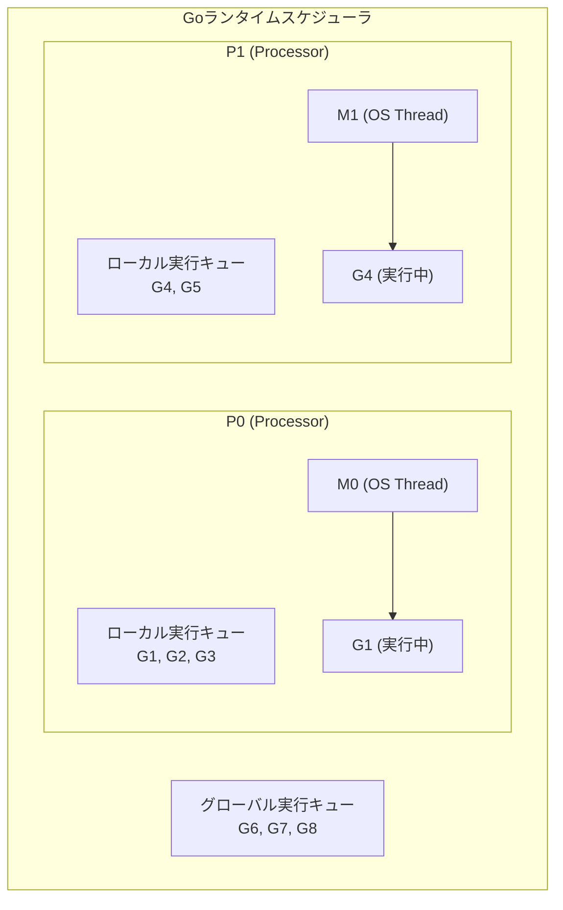

- **G（Goroutine）**: 実行すべきgoroutineの状態（スタック、プログラムカウンタなど）
- **M（Machine）**: OSスレッド。実際にgoroutineのコードを実行する
- **P（Processor）**: 論理プロセッサ。MとGを結びつけるスケジューリングコンテキスト。数は`GOMAXPROCS`で設定（デフォルトはCPUコア数）

Pはローカルの実行キューを持ち、goroutineを効率的にスケジューリングする。あるPのキューが空になった場合、**ワークスティーリング**により他のPのキューからgoroutineを奪取して負荷分散を行う。

### 5.4 channel

Goのchannelは、CSPのチャネル概念を直接的に実装したものである。

```go
package main

import "fmt"

func main() {
	// Unbuffered channel (synchronous, like pure CSP)
	ch := make(chan int)

	go func() {
		ch <- 42 // Send: blocks until receiver is ready
	}()

	value := <-ch // Receive: blocks until sender is ready
	fmt.Println(value)
}
```

**アンバッファードチャネル**（`make(chan int)`）は、CSPの同期通信を忠実に再現する。送信操作 `ch <- value` は受信者が準備できるまでブロックし、受信操作 `<-ch` は送信者が準備できるまでブロックする。

```go
package main

import "fmt"

func main() {
	// Buffered channel (capacity of 3)
	ch := make(chan int, 3)

	ch <- 1 // Does not block (buffer not full)
	ch <- 2 // Does not block
	ch <- 3 // Does not block
	// ch <- 4 would block here (buffer full)

	fmt.Println(<-ch) // 1
	fmt.Println(<-ch) // 2
	fmt.Println(<-ch) // 3
}
```

**バッファ付きチャネル**（`make(chan int, 3)`）は、指定した容量までの送信をブロックせずに受け付ける。バッファが満杯の場合に送信がブロックし、バッファが空の場合に受信がブロックする。

### 5.5 チャネルの方向性

Goでは、チャネルの方向性を型レベルで制約できる。これにより、送信専用・受信専用の区別をコンパイル時に強制できる。

```go
// Send-only channel type
func producer(out chan<- int) {
	for i := 0; i < 10; i++ {
		out <- i
	}
	close(out)
}

// Receive-only channel type
func consumer(in <-chan int) {
	for v := range in {
		fmt.Println(v)
	}
}
```

この方向性の制約は、CSPにおけるプロセスのインターフェースの概念に対応する。プロセスが外部に公開する入力チャネルと出力チャネルを明確に区別することで、プロセス間の通信契約を型システムで保証する。

## 6. select文

### 6.1 ガード付き選択の実現

CSPにおけるガード付きコマンドは、複数の通信候補の中から実行可能なものを非決定的に選択する仕組みである。Goの`select`文はこの概念を直接的に実装している。

```go
func main() {
	ch1 := make(chan string)
	ch2 := make(chan string)

	go func() {
		time.Sleep(1 * time.Second)
		ch1 <- "one"
	}()

	go func() {
		time.Sleep(2 * time.Second)
		ch2 <- "two"
	}()

	// Wait for whichever channel is ready first
	select {
	case msg1 := <-ch1:
		fmt.Println("Received from ch1:", msg1)
	case msg2 := <-ch2:
		fmt.Println("Received from ch2:", msg2)
	}
}
```

`select`文は、複数の`case`で指定されたチャネル操作の中から、**実行可能になったものを1つ選択して実行する**。複数のcaseが同時に実行可能な場合は、**擬似ランダムに1つが選択される**（公平性の確保）。

### 6.2 selectの実践的パターン

**タイムアウト**

```go
select {
case result := <-ch:
	fmt.Println("Received:", result)
case <-time.After(3 * time.Second):
	fmt.Println("Timeout: no response within 3 seconds")
}
```

`time.After`は、指定した時間後に値を送信するチャネルを返す。`select`と組み合わせることで、チャネル操作にタイムアウトを設定できる。

**非ブロッキング操作**

```go
select {
case msg := <-ch:
	fmt.Println("Received:", msg)
default:
	fmt.Println("No message available, proceeding...")
}
```

`default`節を含む`select`は、どのチャネルも即座に実行可能でない場合に`default`を実行する。これにより非ブロッキングのチャネル操作が実現できる。

**キャンセレーション**

```go
func worker(ctx context.Context, results chan<- int) {
	for i := 0; ; i++ {
		select {
		case <-ctx.Done():
			// Cancellation signal received
			fmt.Println("Worker cancelled")
			return
		case results <- i:
			// Successfully sent result
			time.Sleep(100 * time.Millisecond)
		}
	}
}
```

Goの`context`パッケージは内部的にチャネルベースのキャンセレーションを実装しており、`select`文と自然に統合できる。これはCSPの思想が言語の標準ライブラリレベルにまで浸透している好例である。

### 6.3 selectと公平性

CSPの理論では、外部選択における公平性（fairness）は重要な議題である。Goの`select`は、複数のcaseが同時に準備完了している場合に**一様ランダム**に選択することで、特定のチャネルが飢餓状態（starvation）に陥ることを防いでいる。

ただし、この擬似ランダムな選択は**強い公平性（strong fairness）** を保証するものではない。理論的には、あるcaseが無限に選択されない可能性がゼロではない。実用上は十分な公平性が確保されるが、厳密な公平性保証が必要な場合は、アプリケーションレベルで追加のロジックを実装する必要がある。

## 7. パイプラインパターン

### 7.1 パイプラインの基本構造

CSPの最も自然な応用パターンの一つが**パイプライン**である。Unixのパイプ（`|`）と同様に、複数の処理ステージをチャネルで直列に接続し、データがステージ間を流れていく構造である。

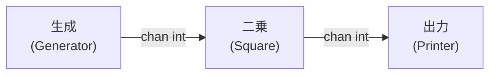

```go
package main

import "fmt"

// Stage 1: Generate numbers
func generate(nums ...int) <-chan int {
	out := make(chan int)
	go func() {
		for _, n := range nums {
			out <- n
		}
		close(out)
	}()
	return out
}

// Stage 2: Square each number
func square(in <-chan int) <-chan int {
	out := make(chan int)
	go func() {
		for n := range in {
			out <- n * n
		}
		close(out)
	}()
	return out
}

func main() {
	// Construct the pipeline
	ch := generate(2, 3, 4, 5)
	out := square(ch)

	// Consume the output
	for v := range out {
		fmt.Println(v) // 4, 9, 16, 25
	}
}
```

### 7.2 パイプラインの設計原則

この実装にはCSPの重要な原則が凝縮されている。

1. **各ステージは独立したgoroutine**: 各関数はgoroutineを起動し、チャネルを返す。goroutineの内部状態は外部から不可視
2. **チャネルによるステージ間結合**: ステージ間のデータフローはチャネルのみ。共有変数は一切存在しない
3. **close による終了通知**: `close(out)`によりチャネルの終了を通知し、受信側の`range`ループが自然に終了する
4. **戻り値は受信専用チャネル**: 各ステージは `<-chan int`（受信専用）を返すことで、呼び出し側が誤って送信することをコンパイル時に防ぐ

### 7.3 パイプラインのキャンセレーション

実際のアプリケーションでは、パイプラインの途中で処理を中断したいケースがある。CSPの同期通信モデルでは、受信側が消えた場合に送信側が永遠にブロックする（goroutineリーク）問題が生じる。

```go
func generate(ctx context.Context, nums ...int) <-chan int {
	out := make(chan int)
	go func() {
		defer close(out)
		for _, n := range nums {
			select {
			case out <- n:
			case <-ctx.Done():
				return // Cancelled: stop generating
			}
		}
	}()
	return out
}
```

`context.Context`を各ステージに渡すことで、パイプライン全体を外部からキャンセルできる。キャンセルシグナルはチャネル（`ctx.Done()`）で伝搬されるため、CSPのモデルと完全に整合している。

## 8. Fan-in / Fan-out

### 8.1 Fan-outパターン

**Fan-out**は、1つのチャネルから読み取った値を複数のgoroutineで並行に処理するパターンである。CPU負荷の高い処理や、I/O待ちの多い処理を並列化する際に有効である。

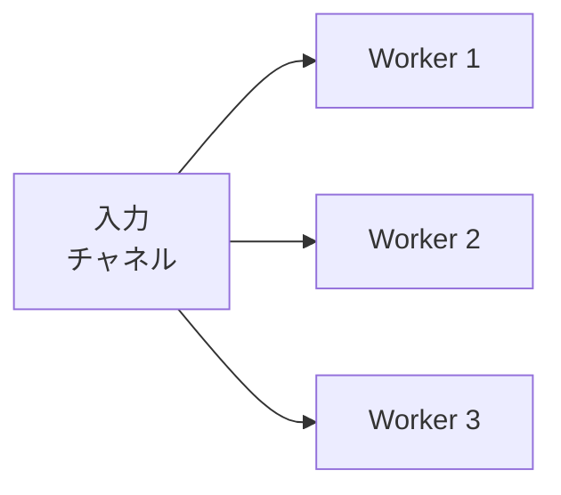

```go
func heavyWork(in <-chan int) <-chan int {
	out := make(chan int)
	go func() {
		defer close(out)
		for n := range in {
			// Simulate CPU-intensive work
			result := expensiveComputation(n)
			out <- result
		}
	}()
	return out
}

func main() {
	input := generate(1, 2, 3, 4, 5, 6, 7, 8)

	// Fan-out: 3 workers reading from the same channel
	w1 := heavyWork(input)
	w2 := heavyWork(input)
	w3 := heavyWork(input)

	// Fan-in: merge results
	for v := range merge(w1, w2, w3) {
		fmt.Println(v)
	}
}
```

複数のgoroutineが同一のチャネルから読み取る場合、Goのランタイムは各メッセージが**exactly once**で1つのgoroutineにのみ配信されることを保証する。これはCSPの一対一通信の原則に沿った動作である。

### 8.2 Fan-inパターン

**Fan-in**は、複数のチャネルからの入力を1つのチャネルに集約するパターンである。

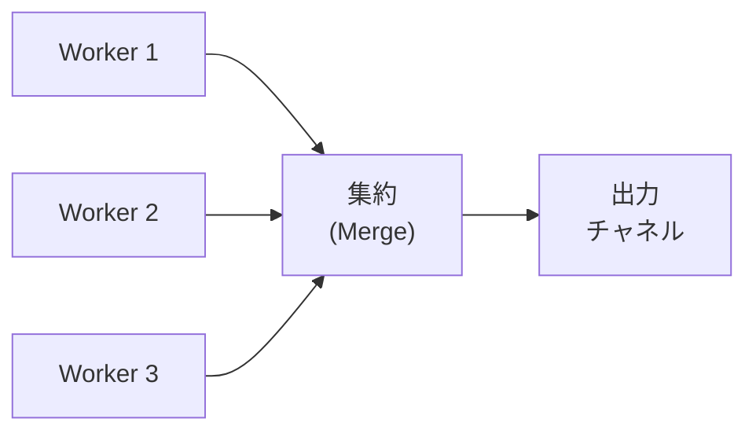

```go
func merge(channels ...<-chan int) <-chan int {
	out := make(chan int)
	var wg sync.WaitGroup

	// Start a goroutine for each input channel
	for _, ch := range channels {
		wg.Add(1)
		go func(c <-chan int) {
			defer wg.Done()
			for v := range c {
				out <- v
			}
		}(ch)
	}

	// Close output channel when all inputs are done
	go func() {
		wg.Wait()
		close(out)
	}()

	return out
}
```

この`merge`関数は、各入力チャネルに対してgoroutineを起動し、すべての値を出力チャネルに転送する。`sync.WaitGroup`を使ってすべての入力チャネルの終了を待ち、出力チャネルを閉じる。

::: tip Fan-in/Fan-outの組み合わせ
Fan-outとFan-inを組み合わせることで、パイプラインの特定のステージだけを並列化できる。これは**ボトルネックとなるステージを特定し、そのステージだけをスケールアウトする**という実践的な最適化手法として非常に有用である。
:::

### 8.3 具体例：並行Webクローラー

Fan-in/Fan-outの実践的な応用例として、並行Webクローラーを考える。

```go
func crawl(ctx context.Context, urls <-chan string, concurrency int) <-chan Result {
	results := make(chan Result)
	var wg sync.WaitGroup

	// Fan-out: launch multiple crawlers
	for i := 0; i < concurrency; i++ {
		wg.Add(1)
		go func() {
			defer wg.Done()
			for url := range urls {
				select {
				case <-ctx.Done():
					return
				default:
					result := fetch(url)
					select {
					case results <- result:
					case <-ctx.Done():
						return
					}
				}
			}
		}()
	}

	// Close results channel when all crawlers finish
	go func() {
		wg.Wait()
		close(results)
	}()

	return results
}
```

この実装は以下のCSPの原則を体現している。

- **並行性の制御**: `concurrency`パラメータでgoroutineの数を制御（バウンデッド並行性）
- **キャンセレーション**: `context`を通じたグレースフルな停止
- **チャネルによるバックプレッシャー**: `results`チャネルが消費されない場合、クローラーは自動的に減速する

## 9. アクターモデルとの比較

### 9.1 アクターモデルの概要

CSPと並んで、並行計算の重要なモデルとして**アクターモデル**がある。1973年にCarl HewittによってMITで提案されたアクターモデルは、CSPとは異なるアプローチで並行性を抽象化する。

アクターモデルでは、基本的な計算単位は**アクター（Actor）** であり、各アクターは以下の能力を持つ。

1. 受信したメッセージに応じて処理を行う
2. 有限個の新しいアクターを生成する
3. 有限個のメッセージを他のアクターに送信する
4. 次に受信するメッセージに対する振る舞いを決定する

代表的な実装として、Erlang/OTP、Akka（Scala/Java）、Microsoft Orleans（C#）がある。

### 9.2 CSPとアクターモデルの構造的な違い

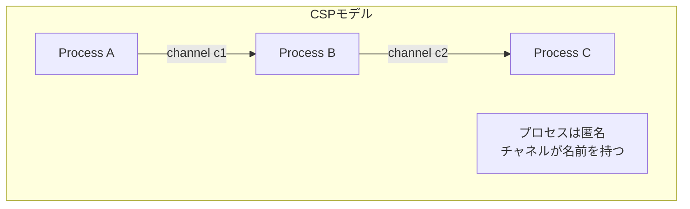

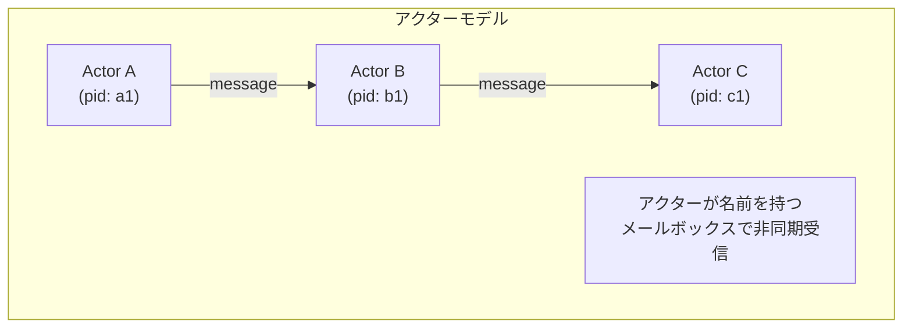

| 特性 | CSP | アクターモデル |
|------|-----|---------------|
| **通信の名前付け** | チャネル（通信路）に名前がある | アクター（エンティティ）に名前がある |
| **通信方式** | 同期的（ランデブー） | 非同期的（メールボックス） |
| **トポロジー** | チャネルの接続で定義 | アクターのアドレス知識で定義 |
| **メッセージ配信** | 送受信が同時に成立 | ファイア・アンド・フォーゲット |
| **バッファリング** | 基本的になし（明示的に追加可能） | メールボックスが暗黙のバッファ |
| **分散への適性** | チャネルの分散が必要 | アドレスで自然に分散可能 |
| **形式的検証** | FDRなどで自動検証可能 | 比較的難しい |

### 9.3 設計哲学の違い

CSPとアクターモデルの最も本質的な違いは、**通信の結合点（coupling point）** にある。

**CSPの立場**: 通信路（チャネル）が第一級オブジェクトである。プロセスは匿名であり、チャネルを共有することで通信する。チャネルの接続トポロジーを変更することで、システムの構造を変更できる。

**アクターモデルの立場**: エンティティ（アクター）が第一級オブジェクトである。アクターは固有のアドレスを持ち、アドレスを知ることで通信できる。アクターの生成と消滅がシステムの構造変化を駆動する。

この違いは実用上の重要な帰結をもたらす。CSPは**トポロジーの明示的な設計**に適しており、パイプラインやワーカープールのような静的な構造を美しく表現できる。一方、アクターモデルは**動的なネットワーク構造**に適しており、アクターの生成・消滅が頻繁なシステム（チャットルーム、IoTデバイス管理など）で自然なモデリングが可能である。

### 9.4 Erlangとの対比

Erlangはアクターモデルの最も成功した実装の一つであり、Goと対比されることが多い。

```
%% Erlang: Actor-style message passing
Pid = spawn(fun() ->
    receive
        {hello, From} ->
            From ! {world, self()},
            loop()
    end
end),
Pid ! {hello, self()}.
```

```go
// Go: CSP-style channel communication
ch := make(chan string)
go func() {
    msg := <-ch
    ch <- "world"
}()
ch <- "hello"
response := <-ch
```

Erlangのアクター間通信は非同期であり、送信側はメッセージが処理されるのを待たない。Goのチャネル通信は（アンバッファードの場合）同期的であり、送受信が同時に成立する。この違いは、エラーハンドリングのアプローチにも影響する。Erlangの「Let it crash」哲学とsupervisor treeは、非同期メッセージパッシングとアクターの独立性を前提としている。

### 9.5 相互模倣可能性

理論的には、CSPとアクターモデルは**互いに模倣（simulate）可能**である。CSPのチャネルはアクターとして実装でき、アクターのメールボックスはチャネルとバッファプロセスで表現できる。したがって、表現力の観点では両モデルは同等である。

違いは**記述の自然さ**にある。あるシステムがCSPで自然に表現できるか、アクターモデルで自然に表現できるかは、そのシステムの構造的特性に依存する。

## 10. CSPの限界と実践的パターン

### 10.1 デッドロック

CSPモデルにおけるデッドロックは、循環的な通信依存関係から生じる。

```go
func deadlockExample() {
	ch1 := make(chan int)
	ch2 := make(chan int)

	go func() {
		// Goroutine A: send to ch1, then receive from ch2
		ch1 <- 1  // Blocks waiting for receiver
		<-ch2
	}()

	go func() {
		// Goroutine B: send to ch2, then receive from ch1
		ch2 <- 2  // Blocks waiting for receiver
		<-ch1
	}()

	// Both goroutines are permanently blocked:
	// A waits for someone to receive from ch1
	// B waits for someone to receive from ch2
}
```

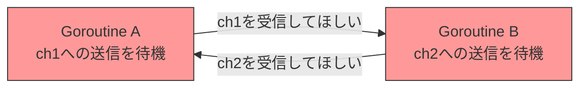

Goのランタイムは、すべてのgoroutineがブロックしている状態を検出して`fatal error: all goroutines are asleep - deadlock!`を報告するが、**部分的なデッドロック**（一部のgoroutineだけがデッドロックしている状態）は検出できない。

CSPの理論的フレームワーク（FDRなどのモデル検査ツール）を使えば、設計段階でデッドロックを検出できるが、実際のGoプログラムは状態空間が大きすぎて網羅的な検査が困難な場合が多い。

### 10.2 goroutineリーク

CSPモデル特有の実践的な問題として、**goroutineリーク**がある。チャネルの送信または受信でブロックしたgoroutineが、対応する操作を行う相手がいなくなった場合に永遠にブロックし続ける問題である。

```go
func leakyFunction() <-chan int {
	ch := make(chan int)
	go func() {
		// This goroutine will leak if nobody reads from ch
		result := expensiveComputation()
		ch <- result // Blocks forever if no receiver
	}()
	return ch
}

func main() {
	ch := leakyFunction()
	// If we decide not to read from ch, the goroutine leaks
	_ = ch
}
```

goroutineリークを防ぐための実践的なパターンは以下の通りである。

1. **`context.Context`によるキャンセレーション**: 前述の通り、すべてのgoroutineにcontextを渡し、キャンセル可能にする
2. **`done`チャネルパターン**: contextが使えない場合、明示的なdoneチャネルで終了を通知する
3. **バッファ付きチャネル**: 送信側がブロックしないよう、容量1のバッファ付きチャネルを使用する

### 10.3 チャネルを使うべきとき、mutexを使うべきとき

GoはCSPスタイル（チャネル）と共有メモリスタイル（mutex）の両方を提供している。どちらを使うべきかの判断基準は以下の通りである。

::: tip チャネルが適している場面
- **データの所有権を移転**する場合（あるgoroutineから別のgoroutineへデータを渡す）
- **ワーカープール**や**パイプライン**のような構造化された並行パターン
- **イベント通知**やシグナリング
- 複数のソースからの入力を**select**で待ち受ける場合
:::

::: warning mutexが適している場面
- **キャッシュ**や**カウンター**のような単純な共有状態の保護
- **構造体の内部状態**を複数のメソッドから安全にアクセスする場合
- パフォーマンスが極めて重要で、チャネルのオーバーヘッドが許容できない場合
:::

Rob Pike自身も「すべてをチャネルで解決しようとしないこと」と繰り返し述べている。CSPはGoの並行性モデルの中心的な思想であるが、すべての並行問題に対する万能解ではない。

### 10.4 構造化並行性（Structured Concurrency）

CSPの実践的な限界の一つは、goroutineのライフサイクル管理が開発者に委ねられている点である。`go`文で起動されたgoroutineは呼び出し元と独立に実行され、その完了を待つための言語組み込みの機構がない。

この問題に対して、近年**構造化並行性（Structured Concurrency）** という概念が注目されている。Kotlin（`coroutineScope`）、Python（`asyncio.TaskGroup`）、Java（Project Loom / `StructuredTaskScope`）などが採用している。

構造化並行性の核心は、**並行タスクのライフサイクルをレキシカルスコープに結びつける**ことである。スコープを抜ける際にすべての子タスクが完了（またはキャンセル）されていることを保証する。

Goには構造化並行性の言語レベルのサポートはないが、`errgroup`パッケージを使うことで類似のパターンを実現できる。

```go
import "golang.org/x/sync/errgroup"

func processAll(ctx context.Context, items []Item) error {
	g, ctx := errgroup.WithContext(ctx)

	for _, item := range items {
		item := item // Capture loop variable
		g.Go(func() error {
			return process(ctx, item)
		})
	}

	// Wait for all goroutines to complete
	// If any returns an error, ctx is cancelled
	return g.Wait()
}
```

`errgroup`は以下を保証する。

- すべてのgoroutineの完了を`Wait()`で待機
- いずれかのgoroutineがエラーを返した場合、contextがキャンセルされる
- goroutineリークを防止

### 10.5 実践的な設計パターン集

CSPを実用的に活用するための主要な設計パターンをまとめる。

**ジェネレータパターン**

値を逐次的に生成するgoroutineを起動し、受信専用チャネルを返す。

```go
func fibonacci(ctx context.Context) <-chan int {
	ch := make(chan int)
	go func() {
		defer close(ch)
		a, b := 0, 1
		for {
			select {
			case ch <- a:
				a, b = b, a+b
			case <-ctx.Done():
				return
			}
		}
	}()
	return ch
}
```

**セマフォパターン**

バッファ付きチャネルをセマフォとして使用し、並行度を制限する。

```go
func processWithLimit(items []Item, maxConcurrency int) {
	sem := make(chan struct{}, maxConcurrency)
	var wg sync.WaitGroup

	for _, item := range items {
		wg.Add(1)
		sem <- struct{}{} // Acquire semaphore (blocks if full)
		go func(it Item) {
			defer wg.Done()
			defer func() { <-sem }() // Release semaphore
			process(it)
		}(item)
	}

	wg.Wait()
}
```

**Or-doneパターン**

キャンセル可能なチャネル読み取りを汎用化する。

```go
func orDone(ctx context.Context, in <-chan int) <-chan int {
	out := make(chan int)
	go func() {
		defer close(out)
		for {
			select {
			case <-ctx.Done():
				return
			case v, ok := <-in:
				if !ok {
					return
				}
				select {
				case out <- v:
				case <-ctx.Done():
					return
				}
			}
		}
	}()
	return out
}
```

**Teeパターン**

1つの入力チャネルを2つの出力チャネルに分配する。

```go
func tee(ctx context.Context, in <-chan int) (<-chan int, <-chan int) {
	out1 := make(chan int)
	out2 := make(chan int)
	go func() {
		defer close(out1)
		defer close(out2)
		for v := range orDone(ctx, in) {
			// Local copies for select
			o1, o2 := out1, out2
			for i := 0; i < 2; i++ {
				select {
				case o1 <- v:
					o1 = nil // Disable this case after sending
				case o2 <- v:
					o2 = nil
				case <-ctx.Done():
					return
				}
			}
		}
	}()
	return out1, out2
}
```

## 11. CSPの影響と今後の展望

### 11.1 CSPの影響を受けた言語と技術

CSPの影響は、Go以外にも多くの言語やシステムに及んでいる。

| 言語 / 技術 | CSPからの影響 |
|-------------|-------------|
| **occam**（1983年） | CSPの直接的な実装言語。Transputerプロセッサ向けに設計 |
| **Erlang**（1986年） | 間接的な影響。アクターモデルベースだが、プロセス間通信の思想は共通 |
| **Limbo**（1995年） | Rob PikeがBell研で設計。Goの直接的な祖先 |
| **Clojure core.async**（2013年） | CSPのチャネル概念をClojureに導入 |
| **Kotlin Channels**（2018年） | コルーチンと統合されたCSPスタイルのチャネル |
| **Rust crossbeam**（2015年〜） | CSPスタイルのチャネルライブラリ |

### 11.2 occamとTransputer

CSPの最も忠実な実装は、1983年にINMOS社が開発した**occam**言語と**Transputer**プロセッサである。Transputerはハードウェアレベルでプロセス間通信をサポートし、occam言語はCSPのセマンティクスを直接的に反映した構文を持っていた。

occamの`PAR`構文は並行合成を、`ALT`構文はガード付き選択を表現し、チャネル通信はCSPの同期通信そのものであった。Transputerは商業的には成功しなかったが、CSPの実践的な有効性を実証した重要な先例である。

### 11.3 形式検証の実用化

CSPの理論的フレームワークは、形式検証の分野で今なお活用されている。特に、セキュリティプロトコルの検証において、CSPベースのモデル検査ツールFDRは多数の脆弱性を発見してきた。Needham-Schroederプロトコルの攻撃をGavin Loweが1996年にFDRを用いて発見したことは、形式手法の実用的価値を示す重要な事例である。

### 11.4 並行プログラミングの未来

CSPが提起した「通信による同期」という思想は、並行プログラミングの未来においても重要な指導原理であり続けるだろう。しかし、以下の新しい課題に対しては、CSPだけでは十分に対応できない側面もある。

- **大規模分散システム**: ネットワーク分断やメッセージの喪失を前提としたモデルが必要
- **リアクティブプログラミング**: バックプレッシャーを含む非同期データストリームの抽象化
- **ヘテロジニアスコンピューティング**: GPU、FPGA、TPUなど異種プロセッサ間の通信モデル

これらの課題に対して、CSPの拡張や他のモデルとの統合が模索されている。Goにおいても、channelの型安全な合成やジェネリクスとの統合など、進化の余地は大きい。

## 12. まとめ

CSPは、1978年のHoareの論文に端を発する並行計算の理論的フレームワークであり、「共有メモリの代わりに通信を使う」という根本的な設計哲学を提示した。この思想は、1985年のプロセス代数としての形式化を経て、数十年にわたり並行プログラミングの理論と実践の両面に影響を与え続けている。

Goは、CSPの中核概念であるgoroutine（逐次プロセス）、channel（チャネル通信）、select（ガード付き選択）を言語に直接組み込むことで、CSPの理論的な優美さを実用的なプログラミングツールとして提供することに成功した。パイプライン、Fan-in/Fan-out、ジェネレータといった並行パターンは、CSPの理論から自然に導出されるものである。

しかし、CSPは万能ではない。デッドロックの可能性、goroutineリークのリスク、構造化並行性の欠如といった実践的な課題が存在する。また、アクターモデルとの比較が示すように、動的なトポロジーを持つシステムではアクターモデルの方が自然な場合がある。

重要なのは、CSPを教条的に適用することではなく、その本質的な洞察——**通信を同期の手段として使い、共有状態を最小化する**——をプログラム設計の指導原理として内在化することである。この原則は、チャネルを使うかmutexを使うかという表面的な選択よりも、はるかに深い設計上の価値を持つ。
