# CSS設計手法（BEM, CSS Modules, CSS-in-JS, Tailwind CSS, Vanilla Extract）

## 1. はじめに：CSSの根本的課題

CSS（Cascading Style Sheets）は1996年にW3Cによって勧告された、Webページの見た目を定義するためのスタイルシート言語である。HTMLが文書構造を担い、CSSが視覚的表現を担うという役割分担は、Webの根幹をなす設計思想だ。しかし、CSSが設計された当時のWebは静的な文書の集合体であり、現代のような大規模Webアプリケーションは想定されていなかった。

CSSが大規模開発において引き起こす本質的な問題は、以下の4つに集約される。

### 1.1 グローバルスコープ問題

CSSの最大の課題は、すべてのスタイル定義がグローバルスコープに属することである。あるファイルで定義した `.button` というクラスは、アプリケーション全体のあらゆる `.button` 要素に影響を及ぼす。プログラミング言語において「すべての変数がグローバル変数」という状態を想像すれば、この問題の深刻さが理解できるだろう。

```css
/* components/header.css */
.title {
  font-size: 24px;
  color: #333;
}

/* components/card.css */
/* This unintentionally overrides the header title */
.title {
  font-size: 16px;
  color: #666;
}
```

上記の例では、`card.css` で定義した `.title` が `header.css` の `.title` を意図せず上書きしてしまう。小規模なプロジェクトでは名前の衝突を手動で回避できるが、数百のコンポーネントを持つアプリケーションではこれは現実的ではない。

### 1.2 詳細度（Specificity）の管理困難

CSSには**カスケード**と**詳細度**という仕組みがあり、複数のルールが同一要素に適用される場合、詳細度の高いセレクタが優先される。

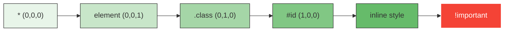

開発者はスタイルの上書きが必要になるたびに、より高い詳細度のセレクタを使うか、`!important` に頼ることになる。これは「詳細度戦争（Specificity War）」と呼ばれる悪循環を引き起こし、最終的にはほぼすべてのルールに `!important` が付与されるという破綻した状態に至る。

### 1.3 未使用CSSの蓄積

CSSはHTMLから参照されるという間接的な関係性しか持たないため、どのスタイルがどのコンポーネントで使われているかを静的に判定することが困難である。コンポーネントを削除してもそれに対応するCSSは残り続け、プロジェクトが進行するにつれて未使用CSSが蓄積していく。いわゆる「デッドCSS」問題である。

### 1.4 依存関係の不透明性

JavaScriptのモジュールシステムでは `import` 文によってファイル間の依存関係が明示されるが、CSSにはそのような仕組みがない。あるコンポーネントがどのCSSに依存しているのか、あるCSSルールを変更した場合にどのコンポーネントが影響を受けるのかが不明瞭である。

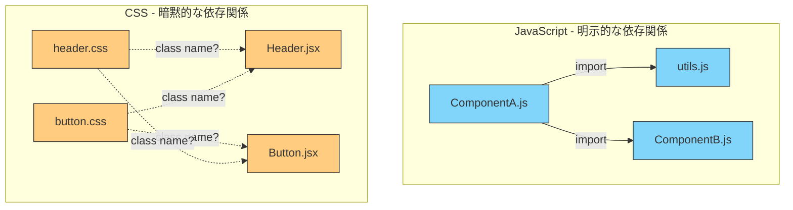

これらの問題に対して、フロントエンドコミュニティは過去20年以上にわたり、さまざまなCSS設計手法を考案してきた。本記事では、代表的な手法を歴史的な発展順に追いながら、それぞれの設計思想、利点、課題を深く掘り下げる。

## 2. 命名規約によるアプローチ：BEM

### 2.1 BEMの誕生と設計思想

**BEM（Block Element Modifier）** は、2009年にロシアの検索エンジン企業Yandexで開発されたCSS命名規約である。CSSの言語仕様そのものを変えるのではなく、クラス名の命名ルールを厳格に定めることで、グローバルスコープ問題を実質的に解消しようとするアプローチだ。

BEMの名前は、その3つの構成要素に由来する。

- **Block（ブロック）**: 独立した意味を持つコンポーネント。例：`header`, `menu`, `search-form`
- **Element（エレメント）**: ブロックの一部で、単独では意味をなさないもの。例：`menu__item`, `search-form__input`
- **Modifier（モディファイア）**: ブロックまたはエレメントの見た目や状態のバリエーション。例：`menu__item--active`, `button--large`

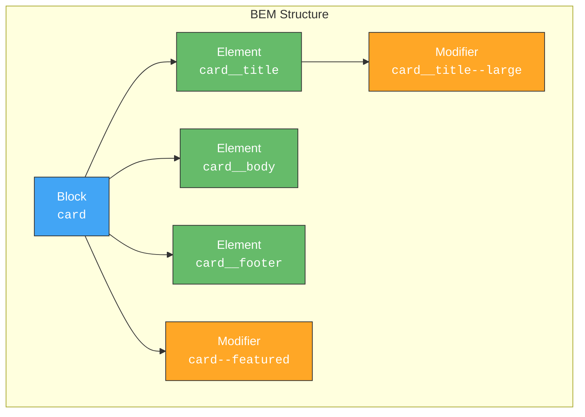

### 2.2 BEMの命名規則

BEMでは、ダブルアンダースコア `__` でブロックとエレメントを、ダブルハイフン `--` でモディファイアを接続する。

```css
/* Block */
.search-form {
  display: flex;
  gap: 8px;
}

/* Element */
.search-form__input {
  flex: 1;
  padding: 8px 12px;
  border: 1px solid #ccc;
  border-radius: 4px;
}

.search-form__button {
  padding: 8px 16px;
  background-color: #007bff;
  color: white;
  border: none;
  border-radius: 4px;
  cursor: pointer;
}

/* Modifier */
.search-form__button--disabled {
  background-color: #ccc;
  cursor: not-allowed;
}

.search-form--large .search-form__input {
  padding: 12px 16px;
  font-size: 18px;
}
```

対応するHTMLは以下のようになる。

```html
<form class="search-form search-form--large">
  <input class="search-form__input" type="text" />
  <button class="search-form__button">Search</button>
  <button class="search-form__button search-form__button--disabled">
    Reset
  </button>
</form>
```

### 2.3 BEMがもたらす構造的な利点

BEMの最大の利点は、**セレクタの詳細度が均一に保たれる**ことだ。すべてのスタイルがクラスセレクタ1つで定義されるため、詳細度は常に `(0,1,0)` となる。これにより、詳細度戦争が原理的に発生しない。

また、クラス名がコンポーネントのスコープを明示的に示すため、`.search-form__input` というクラス名を見るだけで「これは `search-form` ブロックに属する `input` エレメントだ」と分かる。命名がそのままドキュメントの役割を果たす。

### 2.4 BEMの限界

BEMは命名規約であるため、ツールによる強制がない。開発者が規約を破っても、エラーにはならず、ただスタイルが意図しない形で適用されるだけだ。チーム全員がBEMのルールを理解し、一貫して適用し続ける必要がある。

さらに、クラス名が長くなりがちである。`navigation__menu-item--highlighted` のような名前は読みにくく、HTMLの可読性を損なう。ネストが深くなると `.block__element1__element2` のようにしたくなるが、BEMではエレメントのネストは推奨されず、代わりにフラットな構造を求める。この制約が実際のDOM構造との乖離を生み、設計判断を難しくする場面がある。

## 3. ビルドツールによるスコープ化：CSS Modules

### 3.1 CSS Modulesの着想

2015年に登場した**CSS Modules**は、CSSのグローバルスコープ問題をビルドツールレベルで解決するアプローチだ。通常のCSSファイルを記述し、それをJavaScriptから `import` すると、クラス名が自動的にユニークな識別子に変換される。

この発想は「CSSの言語仕様を変えるのではなく、ビルドプロセスでクラス名を変換することでローカルスコープを実現する」という実践的なものだった。

### 3.2 仕組みと使い方

CSS Modulesでは、CSSファイルはデフォルトでローカルスコープとなる。

```css
/* Button.module.css */
.button {
  padding: 8px 16px;
  border-radius: 4px;
  border: none;
  cursor: pointer;
}

.primary {
  background-color: #007bff;
  color: white;
}

.secondary {
  background-color: #6c757d;
  color: white;
}
```

```jsx
// Button.jsx
import styles from './Button.module.css';

function Button({ variant = 'primary', children }) {
  return (
    <button className={`${styles.button} ${styles[variant]}`}>
      {children}
    </button>
  );
}
```

ビルド後、クラス名は以下のように変換される。

```html
<button class="Button_button_x3f2k Button_primary_a8j1m">
  Click me
</button>
```

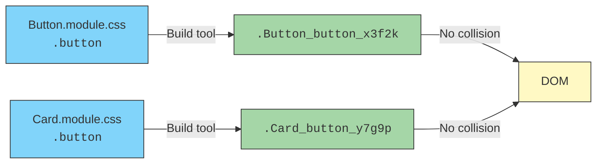

### 3.3 コンポジション機能

CSS Modulesは `composes` キーワードによるスタイルの合成を提供する。これはCSSの `@extend` に似ているが、ビルド時にクラス名を結合する方式であり、生成されるCSSに余計な複製は生まれない。

```css
/* shared.module.css */
.resetButton {
  border: none;
  background: none;
  cursor: pointer;
  padding: 0;
}

/* IconButton.module.css */
.iconButton {
  composes: resetButton from './shared.module.css';
  display: inline-flex;
  align-items: center;
  gap: 4px;
}
```

### 3.4 CSS Modulesの利点と課題

CSS Modulesの大きな利点は、**既存のCSS知識がそのまま使える**ことだ。特別な構文やAPIを学ぶ必要がなく、通常のCSSを書くだけでスコープの恩恵を受けられる。生成されるCSSは通常の静的CSSファイルであり、ランタイムコストは一切かからない。

一方で、動的スタイルの扱いに弱い。JavaScriptの値に基づいてスタイルを変えたい場合、CSS変数（Custom Properties）とインラインスタイルを組み合わせるか、あらかじめ複数のクラスを用意しておく必要がある。また、TypeScriptとの統合においてクラス名の型情報を得るには追加のツール設定が必要であり、`styles.buttonn`（タイポ）のようなミスがビルド時に検出できないことがある。

## 4. CSS-in-JS：スタイルのJavaScript統合

### 4.1 CSS-in-JSの台頭

2014年、Facebook のエンジニアである Christopher Chedeau (vjeux) が "CSS in JS" という発表を行い、CSSが大規模アプリケーションで引き起こす問題を体系的に整理した。彼が挙げた問題は以下の7つだった。

1. グローバル名前空間（Global Namespace）
2. 依存関係（Dependencies）
3. デッドコードの除去（Dead Code Elimination）
4. 圧縮（Minification）
5. 定数の共有（Sharing Constants）
6. 非決定的な解決順序（Non-deterministic Resolution）
7. 分離（Isolation）

この発表を契機に、CSSをJavaScriptのコード内に記述するCSS-in-JSという概念が爆発的に広まった。

### 4.2 styled-components

2016年に登場した**styled-components**は、ES2015のTagged Template Literalsを活用し、CSSをJavaScriptの中に自然に埋め込むライブラリだ。

```jsx
import styled from 'styled-components';

// Styled component definition
const Button = styled.button`
  padding: ${props => props.size === 'large' ? '12px 24px' : '8px 16px'};
  font-size: ${props => props.size === 'large' ? '18px' : '14px'};
  background-color: ${props => props.variant === 'primary' ? '#007bff' : '#6c757d'};
  color: white;
  border: none;
  border-radius: 4px;
  cursor: pointer;
  transition: opacity 0.2s;

  &:hover {
    opacity: 0.9;
  }

  &:disabled {
    background-color: #ccc;
    cursor: not-allowed;
  }
`;

// Usage
function App() {
  return (
    <div>
      <Button variant="primary" size="large">Primary</Button>
      <Button variant="secondary">Secondary</Button>
    </div>
  );
}
```

styled-componentsの革新的な点は、コンポーネントのpropsに基づいてスタイルを動的に変更できることだ。CSSとコンポーネントが完全に一体化するため、コンポーネントを削除すればスタイルも自動的に消える。デッドCSS問題が原理的に解消される。

### 4.3 Emotion

**Emotion**はstyled-componentsと同様のCSS-in-JSライブラリだが、`css` プロップによるインラインスタイリングと、`styled` APIの両方を提供する。

```jsx
/** @jsxImportSource @emotion/react */
import { css } from '@emotion/react';
import styled from '@emotion/styled';

// css prop approach
const buttonStyle = (variant) => css`
  padding: 8px 16px;
  border: none;
  border-radius: 4px;
  cursor: pointer;
  background-color: ${variant === 'primary' ? '#007bff' : '#6c757d'};
  color: white;
`;

function Button({ variant, children }) {
  return <button css={buttonStyle(variant)}>{children}</button>;
}

// styled approach (same as styled-components)
const Card = styled.div`
  padding: 16px;
  border: 1px solid #e0e0e0;
  border-radius: 8px;
`;
```

### 4.4 ランタイムCSS-in-JSの動作原理

styled-componentsやEmotionといったランタイムCSS-in-JSライブラリは、以下の手順でスタイルを適用する。

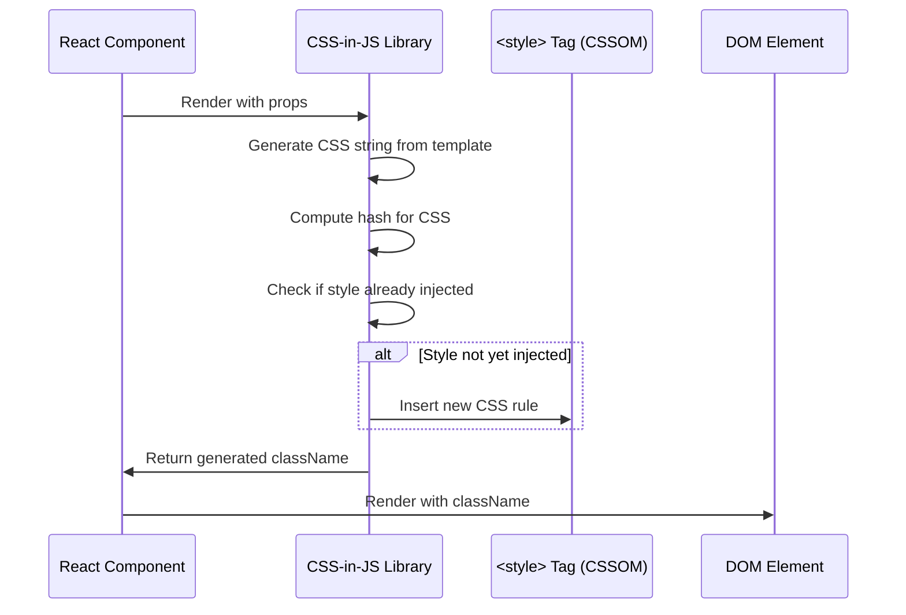

1. コンポーネントがレンダリングされると、propsをテンプレートリテラルに適用してCSSの文字列を生成する
2. 生成したCSSのハッシュ値を計算し、ユニークなクラス名を生成する
3. そのクラス名のスタイルがまだDOMに注入されていなければ、`<style>` タグに動的に挿入する
4. 生成されたクラス名をコンポーネントのDOM要素に適用する

### 4.5 ランタイムCSS-in-JSの課題

ランタイムCSS-in-JSは強力だが、パフォーマンス面に本質的な課題を抱えている。

**レンダリングコスト**: Reactコンポーネントがレンダリングされるたびに、CSSの文字列生成、ハッシュ計算、スタイルの注入判定といった処理が実行される。これはコンポーネント数が多い大規模アプリケーションで顕著なボトルネックとなる。

**Server-Side Rendering（SSR）の複雑化**: サーバーサイドでHTMLを生成する場合、スタイルも同時に抽出してHTMLに埋め込む必要がある。styled-componentsの `ServerStyleSheet` やEmotionの `extractCritical` といったAPIを使う必要があり、設定が複雑になる。

**React Server Components（RSC）との非互換性**: React 18以降で導入されたServer Componentsは、クライアントサイドのJavaScriptを必要とするランタイムCSS-in-JSとは根本的に相容れない。Server Componentsはサーバー上でのみ実行されるため、`useContext` や `useInsertionEffect` といったクライアントサイドのAPIに依存するstyled-componentsやEmotionは使用できない。

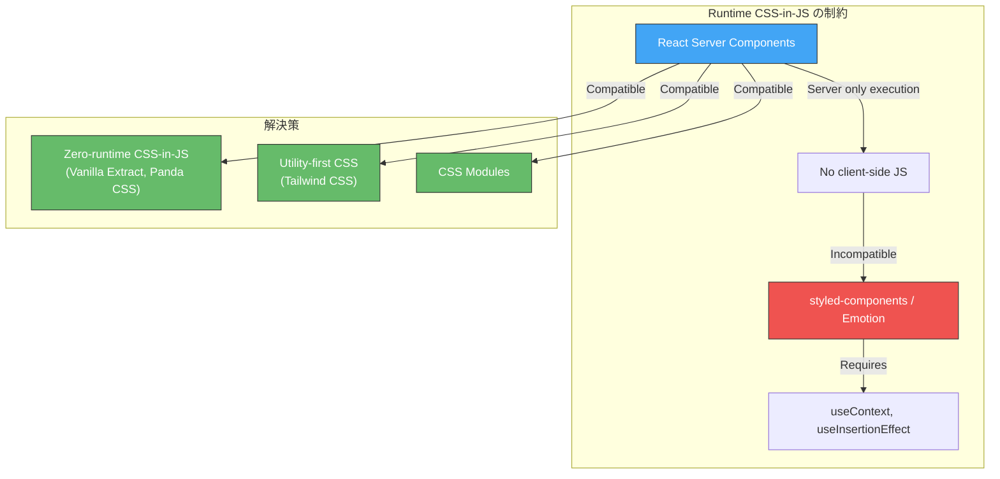

この互換性の問題は、CSS-in-JSの世界に大きな転換をもたらした。ランタイムでスタイルを生成するのではなく、**ビルド時にCSSを静的に生成する**ゼロランタイムCSS-in-JSという新たな方向性が台頭することになる。

## 5. ゼロランタイムCSS-in-JS

### 5.1 ゼロランタイムという発想

ランタイムCSS-in-JSの課題を根本的に解決するために生まれたのが、**ゼロランタイムCSS-in-JS**という概念だ。開発時にはJavaScriptやTypeScriptでスタイルを記述するが、ビルド時にすべてが静的なCSSファイルに変換され、本番環境ではランタイムのJavaScript処理が一切発生しない。

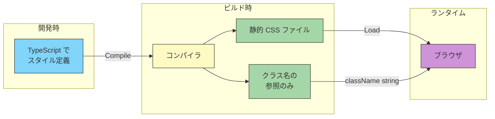

### 5.2 Vanilla Extract

**Vanilla Extract**は2021年にSEEK（オーストラリアの求人サービス企業）のMark Dalgleishによって開発されたゼロランタイムCSS-in-JSライブラリだ。Mark Dalgleishは CSS Modules の共同作者でもあり、CSS ModulesとCSS-in-JSの長所を融合させるという明確なビジョンを持っていた。

Vanilla Extractの最大の特徴は、**TypeScriptでスタイルを記述し、完全な型安全性を得られる**ことだ。

```typescript
// button.css.ts
import { style, styleVariants } from '@vanilla-extract/css';

// Base button style
export const button = style({
  padding: '8px 16px',
  border: 'none',
  borderRadius: '4px',
  cursor: 'pointer',
  fontSize: '14px',
  fontWeight: 600,
  transition: 'background-color 0.2s, opacity 0.2s',
  ':hover': {
    opacity: 0.9,
  },
  ':disabled': {
    backgroundColor: '#ccc',
    cursor: 'not-allowed',
  },
});

// Variant styles using styleVariants
export const variant = styleVariants({
  primary: {
    backgroundColor: '#007bff',
    color: 'white',
  },
  secondary: {
    backgroundColor: '#6c757d',
    color: 'white',
  },
  danger: {
    backgroundColor: '#dc3545',
    color: 'white',
  },
});

// Size variants
export const size = styleVariants({
  small: { padding: '4px 8px', fontSize: '12px' },
  medium: { padding: '8px 16px', fontSize: '14px' },
  large: { padding: '12px 24px', fontSize: '18px' },
});
```

```tsx
// Button.tsx
import { button, variant, size } from './button.css';

type ButtonProps = {
  variant: keyof typeof variant;
  size: keyof typeof size;
  children: React.ReactNode;
};

// Type-safe: typos are caught at compile time
function Button({ variant: v, size: s, children }: ButtonProps) {
  return (
    <button className={`${button} ${variant[v]} ${size[s]}`}>
      {children}
    </button>
  );
}
```

`variant` や `size` の型は `styleVariants` の引数から自動推論されるため、存在しないバリアントを指定するとTypeScriptのコンパイルエラーになる。これはランタイムCSS-in-JSにはなかった重要な利点だ。

### 5.3 Vanilla Extractのスプリンクルス（Sprinkles）

Vanilla Extractには**Sprinkles**というユーティリティファーストなスタイリング機能も用意されている。これはTailwind CSSに似た事前定義済みのユーティリティプロパティを、型安全に利用できる仕組みだ。

```typescript
// sprinkles.css.ts
import { defineProperties, createSprinkles } from '@vanilla-extract/sprinkles';

// Define responsive conditions
const responsiveProperties = defineProperties({
  conditions: {
    mobile: {},
    tablet: { '@media': 'screen and (min-width: 768px)' },
    desktop: { '@media': 'screen and (min-width: 1024px)' },
  },
  defaultCondition: 'mobile',
  properties: {
    display: ['none', 'flex', 'block', 'inline-flex', 'grid'],
    flexDirection: ['row', 'column'],
    justifyContent: ['flex-start', 'center', 'flex-end', 'space-between'],
    alignItems: ['flex-start', 'center', 'flex-end', 'stretch'],
    gap: {
      0: '0px',
      1: '4px',
      2: '8px',
      3: '12px',
      4: '16px',
      5: '24px',
      6: '32px',
    },
    padding: {
      0: '0px',
      1: '4px',
      2: '8px',
      3: '12px',
      4: '16px',
      5: '24px',
      6: '32px',
    },
  },
});

export const sprinkles = createSprinkles(responsiveProperties);
export type Sprinkles = Parameters<typeof sprinkles>[0];
```

### 5.4 Panda CSS

**Panda CSS**は2023年にChakra UIチームによって開発されたゼロランタイムCSS-in-JSフレームワークだ。Vanilla Extractと同様にビルド時にCSSを生成するが、より直感的なAPI設計を志向している。

```tsx
import { css } from '../styled-system/css';

// Panda CSS style definition
function Button({ variant = 'primary', children }) {
  return (
    <button
      className={css({
        padding: '8px 16px',
        borderRadius: '4px',
        border: 'none',
        cursor: 'pointer',
        bg: variant === 'primary' ? 'blue.500' : 'gray.500',
        color: 'white',
        _hover: {
          opacity: 0.9,
        },
        _disabled: {
          bg: 'gray.300',
          cursor: 'not-allowed',
        },
      })}
    >
      {children}
    </button>
  );
}
```

Panda CSSはChakra UIの設計トークンシステムを継承しており、`blue.500` のようなデザイントークン参照を自然に使える。また、`_hover` や `_disabled` のような擬似クラスの記法がより簡潔で、開発体験に優れている。

### 5.5 ゼロランタイムCSS-in-JSのトレードオフ

ゼロランタイムCSS-in-JSは、ランタイムコストの問題を解決する一方で、いくつかの制約がある。

**動的スタイルの制限**: ビルド時にCSSが確定するため、ランタイムの値に基づく完全に動的なスタイルは記述できない。対策としてCSS変数を利用するが、ランタイムCSS-in-JSほどの柔軟性はない。

```typescript
// Vanilla Extract: runtime values via CSS variables
import { style, createVar } from '@vanilla-extract/css';

const colorVar = createVar();

export const dynamicBox = style({
  vars: { [colorVar]: 'blue' },
  backgroundColor: colorVar,
});

// At runtime, override via inline style
// <div className={dynamicBox} style={{ [colorVar]: userColor }} />
```

**ビルド時間の増加**: スタイルのコンパイルがビルドプロセスに追加されるため、プロジェクトの規模によってはビルド時間が顕著に増加する。特にVanilla Extractは `.css.ts` ファイルごとにNode.jsで評価を行うため、ファイル数が多い場合のビルドパフォーマンスに注意が必要だ。

## 6. ユーティリティファーストCSS：Tailwind CSS

### 6.1 ユーティリティファーストの思想

**Tailwind CSS**は2017年にAdam Wathan によって開発されたユーティリティファーストCSSフレームワークだ。従来のCSSフレームワーク（Bootstrap, Foundation等）がコンポーネント単位の既成スタイル（`.btn`, `.card`, `.navbar`）を提供していたのに対し、Tailwind CSSは個々のCSSプロパティに対応する小さなユーティリティクラスを提供する。

この発想は一見して直感に反する。「関心の分離」の原則に従い、構造（HTML）と見た目（CSS）を分離するのがWeb開発の常識とされてきたからだ。しかし Adam Wathan は自身のブログ記事 "CSS Utility Classes and 'Separation of Concerns'" で、コンポーネントベースの開発ではHTMLとCSSは本質的に結合しており、無理に分離することの方が非合理であると論じた。

### 6.2 基本的な使い方

```html
<!-- Traditional CSS approach -->
<button class="primary-button">Click me</button>

<!-- Tailwind CSS approach -->
<button class="px-4 py-2 bg-blue-500 text-white rounded hover:bg-blue-600
               disabled:bg-gray-300 disabled:cursor-not-allowed
               transition-colors duration-200">
  Click me
</button>
```

Tailwind CSSでは、各ユーティリティクラスが単一のCSSプロパティ（または密接に関連する少数のプロパティ）に対応する。

| ユーティリティクラス | 対応するCSS |
|---|---|
| `px-4` | `padding-left: 1rem; padding-right: 1rem;` |
| `py-2` | `padding-top: 0.5rem; padding-bottom: 0.5rem;` |
| `bg-blue-500` | `background-color: #3b82f6;` |
| `text-white` | `color: #ffffff;` |
| `rounded` | `border-radius: 0.25rem;` |
| `hover:bg-blue-600` | `.hover\:bg-blue-600:hover { background-color: #2563eb; }` |

### 6.3 設計トークンとしての設定

Tailwind CSSの真の強みは、`tailwind.config.js`（v4以降はCSSベースの設定）によってデザイントークンを一元管理できることだ。

```javascript
// tailwind.config.js
/** @type {import('tailwindcss').Config} */
module.exports = {
  theme: {
    extend: {
      colors: {
        brand: {
          50: '#eff6ff',
          100: '#dbeafe',
          500: '#3b82f6',
          600: '#2563eb',
          700: '#1d4ed8',
        },
      },
      spacing: {
        '18': '4.5rem',
        '88': '22rem',
      },
      fontFamily: {
        sans: ['Inter', 'system-ui', 'sans-serif'],
      },
    },
  },
};
```

この設定により `bg-brand-500`, `text-brand-700` のようなクラスが自動的に利用可能になる。デザインシステムの変更は設定ファイルの修正だけで済み、個々のコンポーネントを書き換える必要がない。

### 6.4 JITコンパイラと最適化

Tailwind CSS v3以降ではJIT（Just-In-Time）コンパイラがデフォルトとなり、ソースコード中で実際に使用されたクラスのみを含むCSSファイルが生成される。これにより、生成されるCSSのサイズは通常10KB未満に収まる。

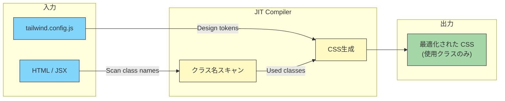

JITコンパイラの動作原理は、ソースファイル（HTML, JSX, TSX, Vue, Svelte など）の内容を正規表現でスキャンし、Tailwind CSSのユーティリティクラスに合致する文字列を抽出するというものだ。これはASTの解析ではなく単純な文字列マッチングであるため高速だが、動的に構築されたクラス名（`bg-${color}-500`）は検出できないという制限がある。

### 6.5 コンポーネント抽象化との組み合わせ

「HTMLにユーティリティクラスを大量に並べるのは保守性が悪い」という批判は的確だが、実際のTailwind CSS開発ではコンポーネントによる抽象化が前提となる。

```tsx
// Button.tsx - Component abstraction with Tailwind CSS
const variants = {
  primary: 'bg-blue-500 hover:bg-blue-600 text-white',
  secondary: 'bg-gray-500 hover:bg-gray-600 text-white',
  outline: 'border border-blue-500 text-blue-500 hover:bg-blue-50',
} as const;

const sizes = {
  sm: 'px-3 py-1.5 text-sm',
  md: 'px-4 py-2 text-base',
  lg: 'px-6 py-3 text-lg',
} as const;

type ButtonProps = {
  variant?: keyof typeof variants;
  size?: keyof typeof sizes;
  children: React.ReactNode;
};

function Button({ variant = 'primary', size = 'md', children }: ButtonProps) {
  return (
    <button
      className={`${variants[variant]} ${sizes[size]}
                  rounded font-medium transition-colors duration-200
                  disabled:bg-gray-300 disabled:cursor-not-allowed`}
    >
      {children}
    </button>
  );
}
```

このようにコンポーネント内でTailwindのクラスをカプセル化すれば、利用側は `<Button variant="primary" size="lg">` のようにクリーンなAPIでスタイルを指定できる。

### 6.6 Tailwind CSS v4

2025年にリリースされたTailwind CSS v4では、設定ファイルがJavaScriptからCSSベースに移行し、`@theme` ディレクティブによるデザイントークンの定義が導入された。

```css
/* app.css */
@import "tailwindcss";

@theme {
  --color-brand-500: #3b82f6;
  --color-brand-600: #2563eb;
  --font-family-sans: "Inter", system-ui, sans-serif;
  --spacing-18: 4.5rem;
}
```

v4ではOxide engineと呼ばれるRust製の高速エンジンが導入され、ビルドパフォーマンスが大幅に向上した。また、CSSの `@layer` を活用したカスケード制御や、コンテナクエリのネイティブサポートなど、モダンCSS機能との統合が深化している。

## 7. 各手法の比較と選定基準

### 7.1 技術的特性の比較

ここまで見てきた各手法の技術的特性を整理する。

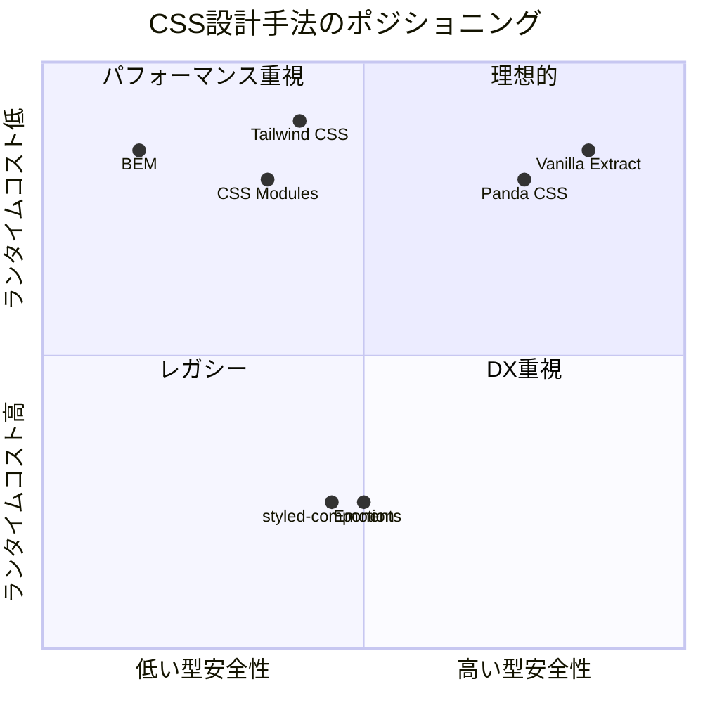

| 特性 | BEM | CSS Modules | styled-components | Emotion | Vanilla Extract | Panda CSS | Tailwind CSS |
|---|---|---|---|---|---|---|---|
| スコープ | 命名規約 | ビルド時変換 | ランタイム生成 | ランタイム生成 | ビルド時生成 | ビルド時生成 | ユーティリティ |
| ランタイムコスト | なし | なし | あり | あり | なし | なし | なし |
| 型安全性 | なし | 部分的 | 部分的 | 部分的 | 完全 | 完全 | 部分的 |
| 動的スタイル | CSS変数 | CSS変数 | JS式 | JS式 | CSS変数 | CSS変数 | CSS変数 |
| SSR対応 | 容易 | 容易 | 設定要 | 設定要 | 容易 | 容易 | 容易 |
| RSC対応 | 対応 | 対応 | 非対応 | 非対応 | 対応 | 対応 | 対応 |
| 学習コスト | 低 | 低 | 中 | 中 | 中〜高 | 中 | 中 |
| ツール依存 | なし | webpack等 | React | React | TypeScript + ビルドツール | ビルドツール | PostCSS |

### 7.2 選定のディシジョンツリー

プロジェクトの要件に基づいてCSS設計手法を選定するための判断基準を示す。

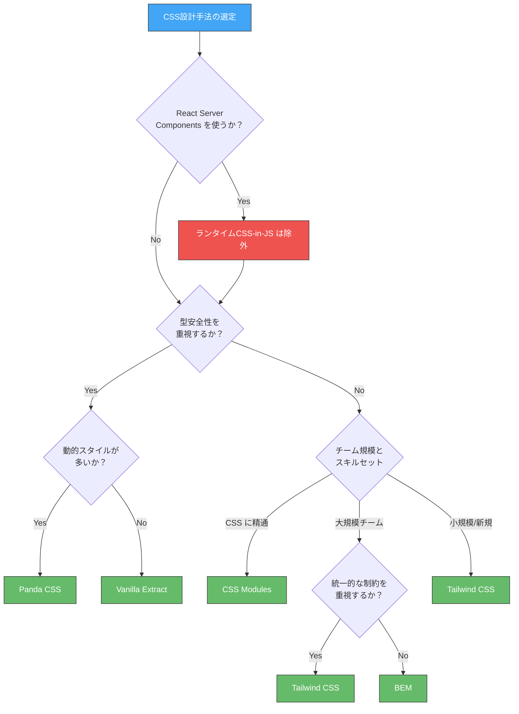

### 7.3 プロジェクト特性別の推奨

**新規のReactプロジェクト（Next.js App Router）**: Tailwind CSS または Vanilla Extract を推奨する。React Server Components との互換性が確保されており、パフォーマンス面でも有利だ。Tailwind CSSはプロトタイピング速度に優れ、Vanilla Extractは型安全性に優れる。

**既存の大規模プロジェクト**: 既存のCSS資産を活かすならCSS Modules への段階的な移行が現実的だ。既存のCSSをそのまま `.module.css` に変換するだけでスコープの恩恵を受けられる。

**デザインシステムの構築**: Vanilla ExtractまたはPanda CSSを推奨する。デザイントークンをTypeScriptで定義することで、トークンの変更がコンパイルエラーとして検出される。Tailwind CSSもデザイントークンの管理に優れるが、型安全性の面ではこれらに劣る。

**非Reactプロジェクト（Vue, Svelte）**: VueにはScoped CSS、SvelteにはコンポーネントスコープのCSSが組み込まれているため、フレームワーク標準の仕組みを活用するのが第一選択だ。横断的にTailwind CSSを組み合わせるケースも多い。

## 8. パフォーマンスへの影響

### 8.1 CSSのパフォーマンス指標

CSS設計手法がパフォーマンスに与える影響を理解するには、以下の指標を考慮する必要がある。

**CSSファイルサイズ**: ネットワーク転送量とパース時間に直結する。一般に、ユーティリティCSSは再利用性が高いためファイルサイズが小さくなりやすい。

**レンダリングブロック**: CSSはレンダリングブロックリソースであり、CSSの読み込みが完了するまでページの描画は開始されない。クリティカルCSSの抽出と非同期読み込みの戦略が重要になる。

**ランタイムコスト**: ランタイムCSS-in-JSでは、コンポーネントのレンダリングごとにスタイルの計算と注入が発生する。これはFCP（First Contentful Paint）やINP（Interaction to Next Paint）に悪影響を及ぼす。

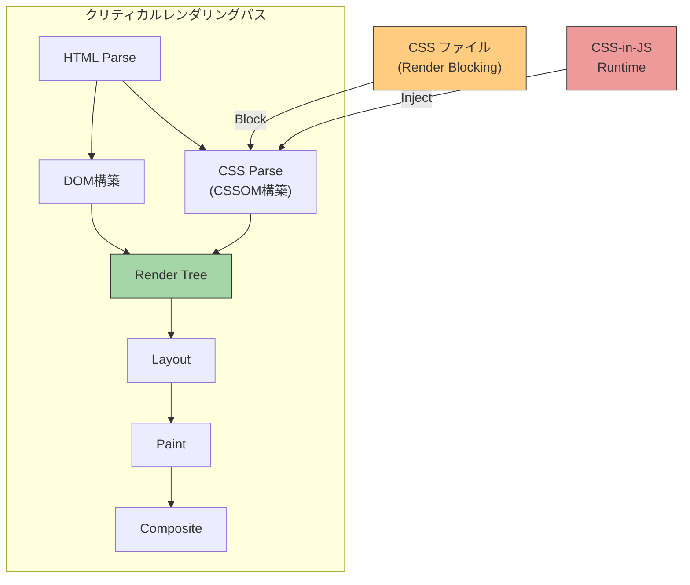

### 8.2 各手法のパフォーマンス特性

**BEM / CSS Modules**: 静的なCSSファイルが生成されるため、ブラウザの最適化が最大限に効く。CSSファイルはHTTPキャッシュの対象となり、2回目以降のアクセスではネットワーク転送が不要になる。詳細度が低く均一であるため、ブラウザのセレクタマッチング処理も高速だ。

**ランタイムCSS-in-JS**: Reactの公式ブログでも言及されているように、ランタイムCSS-in-JSは以下の3つの局面でパフォーマンスコストが発生する。

1. **スタイル生成**: テンプレートリテラルの評価とCSS文字列の構築
2. **ハッシュ計算**: ユニーク性を保証するためのハッシュ関数の実行
3. **DOM注入**: `<style>` タグへのルールの動的挿入（CSSOMの再構築を引き起こす）

特に注意すべきは、これらの処理がReactのレンダリングサイクルの中で**同期的に**実行されるため、UIスレッドをブロックするという点だ。

**Tailwind CSS / ゼロランタイムCSS-in-JS**: ビルド時にすべてのCSSが確定するため、ランタイムコストはゼロだ。Tailwind CSSの場合、JITコンパイラが未使用のクラスを除外するため、CSSファイルサイズも極めて小さくなる。

### 8.3 実測データに基づく考察

CSS設計手法のパフォーマンス影響を定量的に示す。以下は一般的な中規模アプリケーション（約200コンポーネント）における目安値だ。

| 指標 | BEM / CSS Modules | styled-components | Vanilla Extract | Tailwind CSS |
|---|---|---|---|---|
| CSSファイルサイズ (gzip) | 15-30KB | 0 (JS内) | 10-25KB | 5-15KB |
| JSバンドルサイズへの影響 | なし | +15-30KB | なし | なし |
| 初回レンダリング追加コスト | なし | 10-50ms | なし | なし |
| 再レンダリング追加コスト | なし | 2-10ms/回 | なし | なし |
| HTTPキャッシュ効率 | 高 | 低 | 高 | 高 |

::: warning パフォーマンス数値について
上記の数値は一般的な目安であり、アプリケーションの構成、コンポーネント数、スタイルの複雑さによって大きく変動する。実際のプロジェクトでは必ずプロファイリングを行い、ボトルネックを特定すべきだ。
:::

## 9. デザインシステムとの統合

### 9.1 デザインシステムの構成要素

現代のフロントエンド開発において、CSS設計手法はデザインシステムの実装基盤として機能する。デザインシステムは通常、以下の層で構成される。

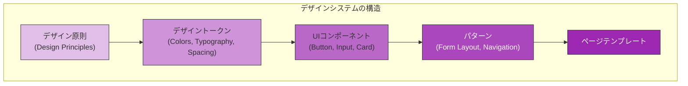

CSS設計手法の選択は、特に**デザイントークン**と**UIコンポーネント**の実装に大きく影響する。

### 9.2 デザイントークンの実装パターン

デザイントークンとは、色、タイポグラフィ、スペーシング、ボーダーラディウスなど、デザイン上の決定事項を抽象化した変数のことだ。各CSS設計手法でのデザイントークンの実装方法を比較する。

**CSS Custom Properties（CSS変数）**: どの手法とも組み合わせ可能な基盤技術だ。

```css
/* tokens.css - Foundation layer */
:root {
  /* Colors */
  --color-primary-50: #eff6ff;
  --color-primary-500: #3b82f6;
  --color-primary-600: #2563eb;
  --color-primary-700: #1d4ed8;

  /* Typography */
  --font-size-sm: 0.875rem;
  --font-size-base: 1rem;
  --font-size-lg: 1.125rem;
  --font-size-xl: 1.25rem;

  /* Spacing */
  --spacing-1: 0.25rem;
  --spacing-2: 0.5rem;
  --spacing-3: 0.75rem;
  --spacing-4: 1rem;
  --spacing-6: 1.5rem;
  --spacing-8: 2rem;

  /* Border Radius */
  --radius-sm: 0.25rem;
  --radius-md: 0.375rem;
  --radius-lg: 0.5rem;
  --radius-full: 9999px;
}
```

**Vanilla Extractでの型安全なトークン管理**:

```typescript
// tokens.css.ts
import { createGlobalTheme } from '@vanilla-extract/css';

export const vars = createGlobalTheme(':root', {
  color: {
    primary: {
      50: '#eff6ff',
      500: '#3b82f6',
      600: '#2563eb',
      700: '#1d4ed8',
    },
    neutral: {
      100: '#f5f5f5',
      300: '#d4d4d4',
      500: '#737373',
      700: '#404040',
      900: '#171717',
    },
  },
  font: {
    size: {
      sm: '0.875rem',
      base: '1rem',
      lg: '1.125rem',
      xl: '1.25rem',
    },
    weight: {
      normal: '400',
      medium: '500',
      bold: '700',
    },
  },
  spacing: {
    1: '0.25rem',
    2: '0.5rem',
    3: '0.75rem',
    4: '1rem',
    6: '1.5rem',
    8: '2rem',
  },
  radius: {
    sm: '0.25rem',
    md: '0.375rem',
    lg: '0.5rem',
    full: '9999px',
  },
});
```

```typescript
// button.css.ts
import { style } from '@vanilla-extract/css';
import { vars } from './tokens.css';

export const button = style({
  padding: `${vars.spacing[2]} ${vars.spacing[4]}`,
  fontSize: vars.font.size.base,
  fontWeight: vars.font.weight.medium,
  borderRadius: vars.radius.md,
  backgroundColor: vars.color.primary[500],
  color: 'white',
  // TypeScript error if token doesn't exist:
  // backgroundColor: vars.color.primary[999], // Error!
});
```

この方式では、存在しないトークンを参照するとTypeScriptのコンパイルエラーになる。デザイナーがトークンの名前を変更した場合、対応するTypeScriptの型が変わるため、影響を受ける全箇所がエラーとして検出される。

### 9.3 テーマ切り替え（ダークモード）

デザインシステムにおいて頻繁に求められるのがテーマ切り替え、特にダークモード対応だ。各手法でのアプローチを見る。

**CSS Custom Propertiesベース（BEM, CSS Modules, Tailwind CSS）**:

```css
/* Light theme (default) */
:root {
  --bg-primary: #ffffff;
  --bg-secondary: #f5f5f5;
  --text-primary: #171717;
  --text-secondary: #737373;
  --border-color: #e5e5e5;
}

/* Dark theme */
[data-theme="dark"] {
  --bg-primary: #171717;
  --bg-secondary: #262626;
  --text-primary: #fafafa;
  --text-secondary: #a3a3a3;
  --border-color: #404040;
}
```

**Vanilla Extractでの型安全なテーマ切り替え**:

```typescript
// theme.css.ts
import { createTheme, createThemeContract } from '@vanilla-extract/css';

// Define the shape of the theme (contract)
const themeVars = createThemeContract({
  color: {
    bgPrimary: null,
    bgSecondary: null,
    textPrimary: null,
    textSecondary: null,
    borderColor: null,
  },
});

// Light theme implementation
export const lightTheme = createTheme(themeVars, {
  color: {
    bgPrimary: '#ffffff',
    bgSecondary: '#f5f5f5',
    textPrimary: '#171717',
    textSecondary: '#737373',
    borderColor: '#e5e5e5',
  },
});

// Dark theme implementation
export const darkTheme = createTheme(themeVars, {
  color: {
    bgPrimary: '#171717',
    bgSecondary: '#262626',
    textPrimary: '#fafafa',
    textSecondary: '#a3a3a3',
    borderColor: '#404040',
  },
});

export { themeVars };
```

`createThemeContract` で定義した「テーマの形」に従わないテーマ実装を作ろうとすると、TypeScriptエラーになる。ライトテーマにはあるがダークテーマには欠けているトークンがある、といった不整合をコンパイル時に検出できる。

**Tailwind CSSでのダークモード**:

```html
<!-- Tailwind CSS dark mode (class strategy) -->
<div class="bg-white dark:bg-gray-900 text-gray-900 dark:text-gray-100">
  <h1 class="text-xl font-bold text-gray-800 dark:text-gray-200">
    Dark mode example
  </h1>
  <p class="text-gray-600 dark:text-gray-400">
    Content adapts to the current theme.
  </p>
</div>
```

Tailwind CSSの `dark:` バリアントは簡潔だが、すべてのカラー指定に `dark:` を付ける必要があり、マークアップが冗長になる。CSS変数と組み合わせることでこの問題を緩和できる。

### 9.4 マルチブランド対応

大規模な組織では、複数のブランドやプロダクトで共通のコンポーネントライブラリを使いつつ、ブランドごとに見た目を変えるという要件がある。

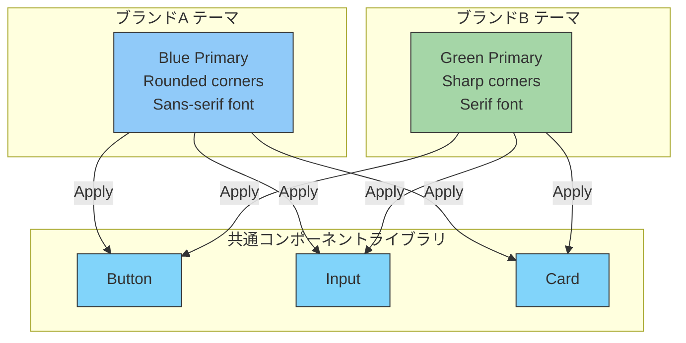

このようなマルチブランド対応では、Vanilla Extractの `createTheme` / `createThemeContract` が特に強力だ。テーマのコントラクト（型契約）により、新しいブランドテーマを追加する際に必要なすべてのトークンが漏れなく定義されることが保証される。

## 10. CSS設計手法の歴史的変遷と今後の展望

### 10.1 進化の軌跡

CSS設計手法は、Webの発展とともに以下のような変遷をたどってきた。

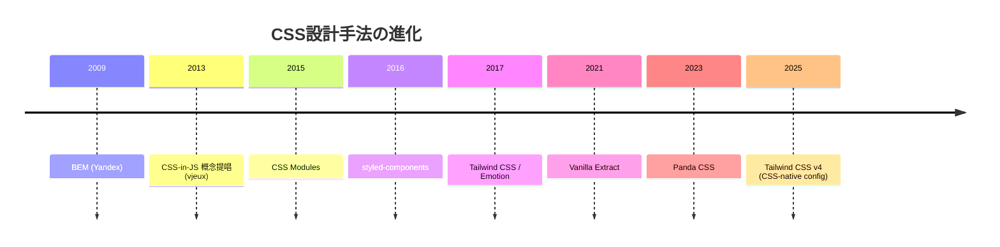

この変遷を俯瞰すると、一つの大きな潮流が見える。それは**ランタイムからビルドタイムへの移行**だ。初期のCSS-in-JSはランタイムの柔軟性を追求したが、パフォーマンスの問題とReact Server Componentsとの非互換性により、ビルド時にCSSを確定させるアプローチが主流になった。

### 10.2 モダンCSSの進化がもたらす変化

CSS自体も急速に進化しており、従来はツールやフレームワークに頼るしかなかった機能がCSS標準として利用可能になりつつある。

**CSS Nesting**: CSSのネスト記法がすべての主要ブラウザでサポートされた。Sass/LESSの主要なユースケースの一つであったネスト記法がネイティブで使えるようになり、CSSプリプロセッサの必要性が低下している。

```css
/* Native CSS Nesting (no preprocessor needed) */
.card {
  padding: 16px;
  border: 1px solid #e0e0e0;

  & .title {
    font-size: 18px;
    font-weight: bold;
  }

  & .body {
    margin-top: 8px;
    color: #666;
  }

  &:hover {
    border-color: #007bff;
  }
}
```

**CSS Cascade Layers（`@layer`）**: カスケードの制御が宣言的に可能になった。これにより、詳細度に依存しないスタイルの優先順位管理が実現する。

```css
/* Define layer order */
@layer reset, base, components, utilities;

@layer reset {
  * { margin: 0; padding: 0; box-sizing: border-box; }
}

@layer base {
  body { font-family: system-ui, sans-serif; line-height: 1.6; }
}

@layer components {
  .button { padding: 8px 16px; border-radius: 4px; }
}

@layer utilities {
  .mt-4 { margin-top: 1rem; }
}
```

`@layer` では、レイヤーの宣言順序がスタイルの優先度を決定する。後に宣言されたレイヤーのスタイルが優先されるため、`utilities` レイヤーのスタイルは `components` レイヤーのスタイルを常に上書きする。これにより、ユーティリティクラスによる上書きが詳細度に関係なく確実に機能する。Tailwind CSS v4はこの仕組みを積極的に活用している。

**CSS Scope（`@scope`）**: CSSのスコープ機能が標準化されつつある。これが広くサポートされれば、CSS Modulesのようなビルドツールによるスコープ化が不要になる可能性がある。

```css
@scope (.card) to (.card-body) {
  /* Only applies within .card but not inside .card-body */
  .title {
    font-size: 18px;
    font-weight: bold;
  }
}
```

### 10.3 今後の方向性

CSS設計手法の今後は、以下のようなトレンドが予想される。

**ゼロランタイムの定着**: ランタイムCSS-in-JSからゼロランタイムCSS-in-JSへの移行は不可逆的な流れだ。React Server Components の普及がこの流れをさらに加速させる。

**CSS標準機能への回帰**: CSS Nesting、`@layer`、`@scope`、Container Queries などのモダンCSS機能が充実するにつれ、フレームワークやツールへの依存度は低下していく。「素のCSS + 最小限のツーリング」で十分な開発が可能になる時代が近づいている。

**型安全なスタイリングの普及**: TypeScriptの普及に伴い、スタイルの型安全性への要求は高まる一方だ。Vanilla ExtractやPanda CSSのような型安全なCSS-in-JSは、今後のデザインシステム構築の標準的な選択肢になりうる。

**AIとCSS設計**: AIによるコード生成においては、ユーティリティクラスベースのTailwind CSSが特に相性が良い。クラス名がそのままスタイルの意味を表すため、AIモデルにとって生成しやすく、結果も予測可能だ。この傾向は、Tailwind CSSの採用をさらに後押しする可能性がある。

## 11. まとめ

CSSの設計手法は、Webの発展と共に「グローバルスコープをいかに制御するか」という根本的な課題に対する回答として進化してきた。

**BEM**は命名規約という最もシンプルなアプローチで、ツール依存がなく導入障壁が低い。しかし規約の遵守は人間の自律性に依存し、大規模チームでは限界がある。

**CSS Modules**はビルドツールによる自動的なスコープ化を提供し、既存のCSS知識をそのまま活用できる。ランタイムコストがゼロで、段階的な導入も容易だ。

**ランタイムCSS-in-JS**（styled-components, Emotion）はJavaScriptとCSSの完全な統合を実現し、動的スタイルの表現力に優れる。しかし、パフォーマンスコストとReact Server Componentsとの非互換性により、新規プロジェクトでの採用は減少傾向にある。

**ゼロランタイムCSS-in-JS**（Vanilla Extract, Panda CSS）はランタイムCSS-in-JSの利点を維持しつつ、ビルド時のCSS生成によりパフォーマンス課題を解消した。特にTypeScriptによる型安全性は、デザインシステムの構築において大きな価値を持つ。

**Tailwind CSS**はユーティリティファーストという独自の思想で、デザイントークンの一元管理と高速な開発体験を実現する。JITコンパイラによる最適化でパフォーマンスも優秀だ。

最終的な選択は、プロジェクトの規模、チームのスキルセット、フレームワークの要件、パフォーマンス要求を総合的に判断して行うべきだ。重要なのは、どの手法にも明確なトレードオフがあり、「唯一の正解」は存在しないということだ。技術的な判断材料を正しく理解した上で、プロジェクトの文脈に最も適した手法を選択することが、CSS設計の本質的な課題である。
