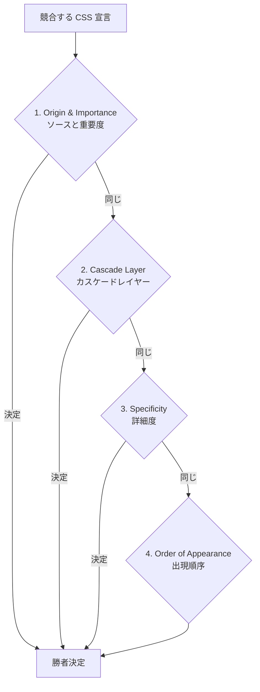
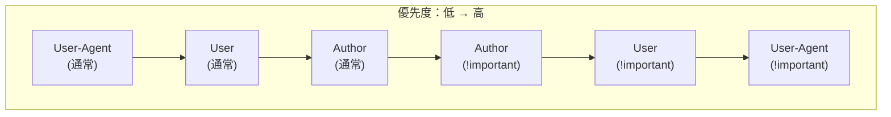
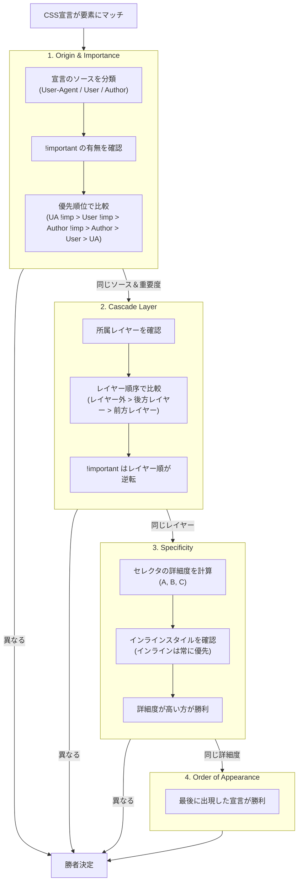

# CSSのカスケードと詳細度

## 1. カスケードとは何か

### 1.1 名前の由来

CSS の正式名称は **Cascading Style Sheets** である。「Cascade（カスケード）」とは、もともと「段々になった滝」を意味する英語であり、水が段差を流れ落ちていくように、複数のスタイルルールが段階的に適用されていく仕組みを表現している。

この命名は、CSS の生みの親である Hakon Wium Lie が1994年に提案した初期仕様「Cascading HTML Style Sheets」にまで遡る。当時、Web ページの見た目を制御するための提案は複数存在したが、Lie の提案の革新的な点は、**複数のスタイルソースが共存し、それらが定義されたルールに従って合成される**という概念を導入したことだった。ブラウザのデフォルトスタイル、ユーザーの設定、そしてページ制作者のスタイル——これらが「カスケード」することで最終的な見た目が決定される。

### 1.2 カスケードが解決する問題

Web ページのスタイリングでは、同一のプロパティに対して複数の宣言が競合する状況が日常的に発生する。例えば、以下のような状況を考えてみよう。

```css
/* Browser default stylesheet */
p { color: black; }

/* Author stylesheet (external) */
p { color: navy; }

/* Author stylesheet (embedded) */
p.intro { color: darkgreen; }

/* Inline style */
/* <p class="intro" style="color: red;"> */
```

1つの `<p class="intro">` 要素に対して、4つの異なる `color` 宣言が適用候補となっている。ブラウザは、これらの中からどれを最終的に適用するかを一貫したアルゴリズムで決定しなければならない。このアルゴリズムこそがカスケードである。

カスケードは単なる「上書きルール」ではない。**宣言の出自（Origin）、重要度（Importance）、カスケードレイヤー（Layer）、詳細度（Specificity）、出現順序（Order of Appearance）** という複数の基準を階層的に評価する、精緻なアルゴリズムである。

### 1.3 カスケードの全体像

カスケードアルゴリズムは、競合する宣言を以下の順序で評価し、勝者を決定する。



この階層構造を理解することが、CSS を予測可能に制御するための第一歩である。

## 2. カスケードの第1段階：ソースと重要度（Origin & Importance）

### 2.1 3つのソース

CSS の宣言は、その出自によって3つのソース（Origin）に分類される。

| ソース | 説明 | 例 |
|--------|------|-----|
| **User-Agent（ブラウザ）** | ブラウザが提供するデフォルトスタイルシート | `h1 { font-size: 2em; }` |
| **User（ユーザー）** | ユーザーが設定するカスタムスタイル | アクセシビリティ設定、拡張機能 |
| **Author（制作者）** | Web ページの制作者が記述するスタイル | 外部CSS、埋め込みCSS、インラインスタイル |

歴史的に、ユーザースタイルシートはブラウザの設定画面からカスタム CSS ファイルを読み込む仕組みとして存在していた。近年のブラウザではこの機能が縮小されているが、ブラウザ拡張（例：Stylus）や、アクセシビリティ設定（フォントサイズの拡大、ハイコントラストモード）が実質的にユーザースタイルの役割を果たしている。

### 2.2 通常宣言の優先順位

`!important` が付与されていない通常の宣言については、以下の優先順位が適用される。

```
Author（制作者） > User（ユーザー） > User-Agent（ブラウザ）
```

これは直感的に理解しやすい。ページ制作者のスタイルが最も優先され、ブラウザのデフォルトスタイルが最も低い優先度を持つ。

### 2.3 !important 宣言と優先順位の逆転

`!important` が付与された宣言については、**優先順位が逆転する**。これはカスケードの中でも最も誤解されやすいポイントの1つである。

```
User-Agent !important > User !important > Author !important > Author > User > User-Agent
```

この逆転は意図的な設計である。ユーザーが `!important` を使ってスタイルを指定した場合、それはアクセシビリティ上の切実な理由（例：文字を大きくしなければ読めない）があると想定される。このようなユーザーの意思は、ページ制作者のデザイン上の意図よりも尊重されるべきである。さらに、ブラウザの `!important` 宣言は、アクセシビリティの最終防衛線として最高の優先度が与えられている。



### 2.4 Transition と Animation の位置づけ

CSS の仕様上、**Transition** による宣言と **Animation** による宣言も、このソース順の中に組み込まれている。

完全な優先順位は以下のようになる。

1. User-Agent `!important`
2. User `!important`
3. Author `!important`
4. **CSS Animation（`@keyframes`）**
5. Author 通常
6. User 通常
7. User-Agent 通常

CSS Transition は動的に値を補間するため、Animation とは異なる振る舞いをする。Transition による値は通常の Author スタイルよりも高い優先度を持つが、`!important` 宣言よりは低い。

## 3. カスケードレイヤー（@layer）

### 3.1 カスケードレイヤーの登場背景

2022年に主要ブラウザでサポートされた **Cascade Layers**（`@layer`）は、CSS のカスケードに新しい制御軸を追加する仕組みである。

従来、大規模プロジェクトでは、サードパーティのCSSライブラリ（リセットCSS、UIフレームワークなど）と自前のスタイルが混在し、詳細度の競争（Specificity War）が頻発していた。開発者はこれを回避するために、より詳細なセレクタを使ったり、`!important` を多用したりせざるを得なかった。

```css
/* Problem: Third-party library uses specific selectors */
.framework .btn.btn-primary { color: white; }

/* Developer needs even more specific selector to override */
body .framework .btn.btn-primary.custom { color: navy; }
/* Or resorts to !important */
.custom-btn { color: navy !important; }
```

カスケードレイヤーは、**詳細度の比較よりも前の段階で**宣言の優先順位を制御することで、この問題を根本的に解決する。

### 3.2 @layer の基本構文

```css
/* Declare layer order */
@layer reset, base, components, utilities;

/* Add styles to a layer */
@layer reset {
  * { margin: 0; padding: 0; box-sizing: border-box; }
}

@layer base {
  body { font-family: sans-serif; line-height: 1.6; }
  a { color: navy; }
}

@layer components {
  .card { padding: 1rem; border: 1px solid #ddd; border-radius: 8px; }
  .button { padding: 0.5rem 1rem; background: navy; color: white; }
}

@layer utilities {
  .mt-4 { margin-top: 1rem; }
  .hidden { display: none; }
}
```

レイヤーの優先順位は、**宣言された順序の後者が高い**。上記の例では、`utilities` が最も高く、`reset` が最も低い。

### 3.3 レイヤーの優先順位ルール

カスケードレイヤーに関する重要なルールは以下の通りである。

1. **レイヤーの順序は最初の宣言で確定する**：`@layer reset, base, components, utilities;` のように順序を明示的に宣言できる
2. **後に宣言されたレイヤーが高優先度**：リストの最後のレイヤーが最も強い
3. **レイヤー外のスタイルが最も高優先度**：どのレイヤーにも属さないスタイルは、すべてのレイヤーよりも優先される
4. **`!important` の場合は逆転する**：レイヤー内の `!important` は、レイヤー外の `!important` よりも優先される

```css
@layer base, components;

@layer base {
  p { color: red; }         /* Lower layer */
}

@layer components {
  p { color: blue; }        /* Higher layer — wins */
}

p { color: green; }          /* Unlayered — wins over all layers */
```

この例では、`<p>` 要素の色は `green` になる。レイヤー外のスタイルが最も高い優先度を持つためである。

### 3.4 ネストされたレイヤー

レイヤーはネストすることができる。

```css
@layer framework {
  @layer base {
    p { color: gray; }
  }
  @layer components {
    .card { padding: 1rem; }
  }
}

/* Reference nested layer with dot notation */
@layer framework.components {
  .card { border: 1px solid #ccc; }
}
```

ネストされたレイヤーの優先順位は、親レイヤーの中で完結する。`framework.components` は `framework.base` よりも優先されるが、`framework` レイヤー全体としての優先度は変わらない。

### 3.5 @import との統合

外部スタイルシートをレイヤーに割り当てることもできる。

```css
/* Import third-party CSS into a layer */
@import url("reset.css") layer(reset);
@import url("framework.css") layer(framework);

/* Your styles in a higher-priority layer */
@layer app {
  /* Application-specific styles */
}
```

この仕組みにより、サードパーティ CSS の詳細度がどれほど高くても、レイヤーの優先順位で制御できるようになる。

## 4. 詳細度（Specificity）

### 4.1 詳細度とは

カスケードの第1段階（ソースと重要度）と第2段階（カスケードレイヤー）で決着がつかない場合、第3段階として**詳細度（Specificity）** が比較される。

詳細度は、セレクタの「具体性の度合い」を数値化したものである。より具体的な（より限定的な条件を指定する）セレクタほど、高い詳細度を持つ。これは直感的に理にかなっている——「すべての段落」に対するスタイルよりも、「このクラスが付いたこの段落」に対するスタイルのほうが、制作者の意図がより明確であると判断できるからである。

### 4.2 詳細度の計算方法

詳細度は3つの成分からなるタプル **(A, B, C)** として計算される（CSS Selectors Level 4仕様）。

| 成分 | 対象 | 例 |
|------|------|-----|
| **A** | IDセレクタ | `#header`, `#main-nav` |
| **B** | クラスセレクタ、属性セレクタ、擬似クラス | `.active`, `[type="text"]`, `:hover` |
| **C** | タイプセレクタ（要素セレクタ）、擬似要素 | `div`, `p`, `::before` |

詳細度の比較は、**A を最上位、C を最下位として左から順に比較される**。A の値が異なればそこで決定し、A が同じなら B を比較し、B も同じなら C を比較する。

::: tip 旧来の「0,0,0,0」表記について
かつて詳細度は4桁のタプルとして説明されることがあり、最上位にインラインスタイルの有無を示す桁が含まれていた。しかし、現行のCSS仕様（CSS Cascading and Inheritance Level 6）では、インラインスタイルはカスケードの別の段階で処理されるため、詳細度は3成分 (A, B, C) で表現される。
:::

### 4.3 具体例で学ぶ詳細度

```css
/* (0, 0, 1) — one type selector */
p { color: black; }

/* (0, 1, 0) — one class selector */
.intro { color: gray; }

/* (0, 1, 1) — one class + one type */
p.intro { color: navy; }

/* (0, 2, 0) — two classes */
.container .intro { color: darkblue; }

/* (1, 0, 0) — one ID selector */
#hero { color: red; }

/* (1, 1, 0) — one ID + one class */
#hero.active { color: crimson; }

/* (1, 0, 1) — one ID + one type */
div#hero { color: darkred; }

/* (0, 1, 1) — one pseudo-class + one type */
a:hover { color: orange; }

/* (0, 0, 2) — one pseudo-element + one type */
p::first-line { color: blue; }
```

重要なのは、**成分間の桁上がりは発生しない**という点である。クラスセレクタを何個連ねても、IDセレクタ1つに勝つことはない。

```css
/* (0, 11, 0) — eleven classes: STILL loses to one ID */
.a.b.c.d.e.f.g.h.i.j.k { color: blue; }

/* (1, 0, 0) — one ID: wins */
#target { color: red; }
```

これは、詳細度が「点数の合計」ではなく「桁の異なるタプル」であることの重要な帰結である。

### 4.4 ユニバーサルセレクタと結合子

以下の要素は詳細度に影響を**与えない**（詳細度 0 として扱われる）。

- ユニバーサルセレクタ（`*`）
- 結合子（` `, `>`, `+`, `~`, `||`）
- 詳細度調整擬似クラス（`:where()`）
- 否定擬似クラス `:not()` 自体（ただし引数のセレクタは詳細度に加算される）

```css
/* (0, 0, 0) — universal selector has no specificity */
* { margin: 0; }

/* (0, 0, 1) — combinator does not add specificity */
div > p { color: black; }  /* same as: div p */

/* (0, 1, 1) — :not() itself adds nothing, but its argument (.active) adds (0,1,0) */
p:not(.active) { color: gray; }
```

### 4.5 インラインスタイルの位置づけ

HTML 要素の `style` 属性に直接記述されたインラインスタイルは、通常の Author スタイルシートの宣言よりも常に優先される。これはカスケードの仕組みの中で、詳細度とは別の軸で処理される。

```html
<!-- Inline style always beats stylesheet rules (for same origin/importance) -->
<p id="hero" class="intro" style="color: purple;">
  This text is purple regardless of stylesheet specificity.
</p>
```

インラインスタイルを上書きする通常の手段は `!important` のみである。これが、`!important` の「正当な」使用場面の1つとされる理由でもある。

## 5. カスケードの第4段階：出現順序

### 5.1 出現順序のルール

ソース、レイヤー、詳細度がすべて同一である場合、**最後に出現した宣言が勝つ**。これが「後勝ち（Last One Wins）」の原則である。

```css
/* Same specificity (0, 1, 0) — last declaration wins */
.message { color: blue; }
.message { color: red; }   /* Wins: appears later */
```

出現順序は、以下の要因で決定される。

1. **`<link>` 要素や `@import` の順序**：HTML内で後に読み込まれるスタイルシートが優先
2. **同一スタイルシート内の記述順序**：後に記述されたルールが優先
3. **`<style>` 要素と `<link>` 要素の相対位置**：HTML内での出現順序に従う

```html
<head>
  <!-- Loaded first: lower priority -->
  <link rel="stylesheet" href="base.css">
  <!-- Loaded second: higher priority for same specificity -->
  <link rel="stylesheet" href="theme.css">
</head>
```

### 5.2 出現順序とメディアクエリ

`@media` ルールに囲まれた宣言も、出現順序のルールに従う。メディアクエリの条件がマッチする場合、その中の宣言は通常の宣言と同じようにカスケードに参加する。

```css
.button { background: blue; }

/* When screen is narrow, this declaration appears "later" if matched */
@media (max-width: 768px) {
  .button { background: green; }
}
```

この場合、画面幅が768px以下のときは `.button` の背景が `green` になる。これは出現順序による上書きである（両者の詳細度は同じ `(0, 1, 0)`）。

## 6. !important の正しい理解

### 6.1 !important は何をするのか

`!important` は、宣言の**重要度（Importance）** を変更するフラグである。カスケードアルゴリズムの第1段階（ソースと重要度）において、`!important` 付きの宣言は通常の宣言とは別のグループとして扱われ、通常宣言よりも高い優先度が与えられる。

```css
p { color: red !important; }
#hero p.special { color: blue; } /* Loses despite higher specificity */
```

上記の例では、`#hero p.special` の詳細度 `(1, 1, 1)` は `p` の詳細度 `(0, 0, 1)` を大幅に上回る。しかし、`!important` が付与された宣言はカスケードの第1段階で優先されるため、詳細度の比較に到達する前に勝敗が決定する。

### 6.2 !important 同士の競合

複数の `!important` 宣言が競合した場合は、通常のカスケードと同様に、レイヤー、詳細度、出現順序で決定される。ただし、ソースの優先順位は**逆転する**（前述の通り）。

```css
/* Both are !important: specificity decides */
p { color: red !important; }           /* (0, 0, 1) */
.intro { color: blue !important; }     /* (0, 1, 0) — wins */
```

### 6.3 !important のアンチパターンと正当な使用場面

`!important` の多用は、CSSのメンテナンス性を著しく損なう。`!important` を上書きするには、さらに高い詳細度の `!important` が必要になり、際限のないエスカレーションが発生する。

**避けるべきパターン**：

```css
/* Specificity war escalation */
.button { color: blue !important; }
.nav .button { color: red !important; }
#header .nav .button { color: green !important; }
```

**正当な使用場面**：

1. **ユーティリティクラス**：`display: none !important;` のような、意図的に最高優先度で適用すべきユーティリティ
2. **外部ライブラリの上書き**：ソースコードを変更できないサードパーティ CSS のスタイルを上書きする場合（ただし、`@layer` が利用可能なら、そちらが推奨される）
3. **インラインスタイルの上書き**：JavaScript が動的に付与するインラインスタイルを CSS から上書きする必要がある場合

```css
/* Legitimate use: utility that must always apply */
.sr-only {
  position: absolute !important;
  width: 1px !important;
  height: 1px !important;
  overflow: hidden !important;
  clip: rect(0, 0, 0, 0) !important;
  white-space: nowrap !important;
  border: 0 !important;
}
```

## 7. 継承（Inheritance）

### 7.1 カスケードと継承の違い

カスケードと継承はどちらも「要素にスタイルが適用される仕組み」であるが、本質的に異なるメカニズムである。

- **カスケード**：同一要素に対する複数の宣言から勝者を選ぶ仕組み
- **継承**：親要素のプロパティ値が子要素に自動的に伝播する仕組み

継承は、カスケードによって宣言の勝者が決まった**後**に適用される。つまり、要素に対してカスケードで決定された宣言が存在しない場合に、親要素からの継承が検討される。

### 7.2 継承されるプロパティ

CSS プロパティは、デフォルトで継承されるものとされないものに分類される。

**継承されるプロパティの例**：

| カテゴリ | プロパティ |
|----------|-----------|
| テキスト関連 | `color`, `font-family`, `font-size`, `font-weight`, `line-height`, `text-align` |
| リスト関連 | `list-style-type`, `list-style-position` |
| テーブル関連 | `border-collapse`, `border-spacing` |
| 可視性 | `visibility`, `cursor` |

**継承されないプロパティの例**：

| カテゴリ | プロパティ |
|----------|-----------|
| ボックスモデル | `margin`, `padding`, `border`, `width`, `height` |
| 背景 | `background`, `background-color` |
| レイアウト | `display`, `position`, `float`, `flex`, `grid` |
| アウトライン | `outline` |

この分類は、直感的に合理的である。テキストの色やフォントは、親要素から子要素に自然に伝播することが期待される。一方、マージンやパディングが親から子に継承されたら、レイアウトは混乱するだろう。

### 7.3 継承を明示的に制御するキーワード

CSS では、継承の挙動を明示的に制御するための特別なキーワードが用意されている。

```css
.child {
  /* Explicitly inherit from parent (even for non-inherited properties) */
  border: inherit;

  /* Use the property's initial (default) value */
  color: initial;

  /* Inherited property → inherit; Non-inherited property → initial */
  margin: unset;

  /* Roll back cascade to the previous origin */
  background: revert;

  /* Roll back cascade to the previous layer */
  padding: revert-layer;
}
```

| キーワード | 振る舞い |
|-----------|---------|
| `inherit` | 親要素の計算値を強制的に継承する |
| `initial` | プロパティの初期値（CSS仕様で定義された値）にリセットする |
| `unset` | 継承されるプロパティなら `inherit`、そうでなければ `initial` と同じ |
| `revert` | カスケードの前のソースの値にロールバックする |
| `revert-layer` | カスケードの前のレイヤーの値にロールバックする |

`revert` は特に有用である。`initial` がプロパティの仕様上の初期値にリセットするのに対し、`revert` はブラウザのデフォルトスタイルシートの値に戻す。例えば、`display: revert;` は `<div>` に対して `block` を、`<span>` に対して `inline` を返す。`initial` を使うと、どちらも `inline`（`display` の仕様上の初期値）になってしまう。

### 7.4 all プロパティ

`all` プロパティは、`unicode-bidi` と `direction` を除くすべてのプロパティを一括でリセットする。

```css
/* Reset all styles to browser defaults */
.isolated-component {
  all: revert;
}

/* Reset all styles and prevent inheritance */
.clean-slate {
  all: initial;
}

/* Useful with revert-layer to undo a layer's styles */
.undo-layer {
  all: revert-layer;
}
```

## 8. CSS Custom Properties（カスタムプロパティ）とカスケード

### 8.1 カスタムプロパティの基本

CSS Custom Properties（CSS変数）は、`--` プレフィックスで定義されるプロパティであり、通常のCSSプロパティと同様にカスケードと継承の対象となる。

```css
:root {
  --primary-color: navy;
  --spacing-unit: 8px;
}

.dark-theme {
  --primary-color: lightblue;
}

.button {
  color: var(--primary-color);
  padding: var(--spacing-unit);
}
```

### 8.2 カスタムプロパティとカスケード

カスタムプロパティは**常に継承される**プロパティである。これは、通常のCSSプロパティが継承するかどうかをプロパティごとに定義しているのとは異なる。

カスタムプロパティに対するカスケードは、通常のプロパティとまったく同じルールで処理される。

```css
/* Specificity (0, 0, 0) */
:root { --color: red; }

/* Specificity (0, 1, 0) — wins for elements matching .theme */
.theme { --color: blue; }

/* Specificity (1, 0, 0) — wins for elements matching #app */
#app { --color: green; }
```

### 8.3 カスタムプロパティの動的な性質

カスタムプロパティの値は、**使用される場所のコンテキスト**で解決される。これは、プリプロセッサ（Sass, Less）の変数とは根本的に異なる点である。

```css
:root {
  --text-color: black;
}

.card {
  --text-color: navy;
  color: var(--text-color); /* navy */
}

.card .highlight {
  /* Inherits --text-color: navy from .card, not black from :root */
  color: var(--text-color); /* navy */
}

.card .highlight.special {
  --text-color: red;
  color: var(--text-color); /* red */
}
```

### 8.4 フォールバック値

`var()` 関数は第2引数としてフォールバック値を受け取ることができる。

```css
.element {
  /* If --accent is not defined, use #333 */
  color: var(--accent, #333);

  /* Fallback can also reference another custom property */
  background: var(--bg-color, var(--default-bg, white));
}
```

フォールバック値は、カスタムプロパティが定義されていないか、`initial` に設定されている場合に使用される。カスタムプロパティが空文字列（`--empty: ;`）に設定されている場合は、フォールバックは使用**されない**。

### 8.5 @property によるカスタムプロパティの型定義

`@property` ルールを使用すると、カスタムプロパティに型、初期値、継承の有無を明示的に定義できる。

```css
@property --progress {
  syntax: "<percentage>";
  inherits: false;
  initial-value: 0%;
}

.progress-bar {
  --progress: 75%;
  background: linear-gradient(
    to right,
    green var(--progress),
    lightgray var(--progress)
  );
  /* Now --progress can be animated/transitioned */
  transition: --progress 0.3s ease;
}
```

`@property` を使うことで、カスタムプロパティに対して `inherits: false` を指定し、デフォルトの継承動作を変更することも可能である。

## 9. :where() と :is() による詳細度制御

### 9.1 :is() 擬似クラス

`:is()` は、セレクタリストを引数に取る関数型擬似クラスである。マッチングの観点では引数のいずれかにマッチすれば全体がマッチするが、詳細度の計算においては**引数の中で最も高い詳細度**がそのまま採用される。

```css
/* Without :is() — repetitive */
header a:hover,
nav a:hover,
footer a:hover {
  color: red;
}

/* With :is() — concise, specificity = (0, 1, 1) from :hover + a, plus (0, 0, 1) from element */
:is(header, nav, footer) a:hover {
  color: red;
}
```

`:is()` の詳細度は、引数リストの中で最も高い詳細度を持つセレクタによって決まる。

```css
/* Specificity = (1, 0, 0) because #main has the highest specificity in the list */
:is(.intro, #main, footer) p {
  color: navy;
}
```

この例では、`.intro` の詳細度は `(0, 1, 0)`、`#main` の詳細度は `(1, 0, 0)`、`footer` の詳細度は `(0, 0, 1)` であるが、`:is()` 全体の詳細度は最も高い `(1, 0, 0)` が採用される。

### 9.2 :where() 擬似クラス

`:where()` は `:is()` と同じマッチング動作を持つが、**詳細度が常に (0, 0, 0)** である点が異なる。

```css
/* Specificity = (0, 0, 0) — :where() contributes nothing */
:where(header, nav, footer) a {
  color: gray;
}

/* Specificity = (0, 0, 1) — easily overridden */
a { color: blue; } /* This wins over the :where() rule above */
```

`:where()` は、**上書きされることを意図したスタイル**を記述するために設計された。

### 9.3 実践的な使い分け

`:where()` と `:is()` の使い分けは、「このスタイルは上書きされるべきか」という設計意図に基づく。

```css
/* Base styles: intentionally low specificity, easy to override */
:where(.card) {
  padding: 1rem;
  border: 1px solid #ddd;
  border-radius: 8px;
}

/* Component styles: normal specificity, harder to accidentally override */
:is(.card) .title {
  font-size: 1.25rem;
  font-weight: bold;
}
```

**リセットCSS・ベーススタイルには `:where()` を使う**：

```css
/* Modern CSS reset using :where() for zero specificity */
:where(*, *::before, *::after) {
  box-sizing: border-box;
}

:where(body) {
  margin: 0;
  line-height: 1.5;
}

:where(img, picture, video, canvas, svg) {
  display: block;
  max-width: 100%;
}

:where(input, button, textarea, select) {
  font: inherit;
}
```

このリセットCSSは詳細度 `(0, 0, 0)` であるため、後から記述するどんなスタイルでも容易に上書きできる。

### 9.4 :not() と :has() の詳細度

`:not()` と `:has()` の詳細度計算は `:is()` と同じ方式である——引数リストの中で最も高い詳細度が採用される。

```css
/* Specificity: (1, 0, 1) — #special is the highest in :not() → (1,0,0) + p → (0,0,1) */
p:not(#special) { color: gray; }

/* Specificity: (0, 1, 1) — .active is the highest in :has() → (0,1,0) + div → (0,0,1) */
div:has(.active) { border: 2px solid blue; }
```

## 10. カスケードの全体フロー

ここまで解説した各要素を統合して、カスケードアルゴリズムの完全なフローを示す。



## 11. 実務でのスタイル管理戦略

### 11.1 カスケードとの付き合い方

カスケードは強力な仕組みであるが、大規模プロジェクトにおいてはその予測困難性が問題になることがある。チームの規模が大きくなり、コードベースが成長するにつれて、意図しないスタイルの上書きやセレクタの詳細度競争が発生しやすくなる。

この問題に対して、CSS コミュニティはさまざまな管理戦略を発展させてきた。

### 11.2 命名規約（BEM）

**BEM（Block, Element, Modifier）** は、クラス名の命名規約によってセレクタの詳細度を均一に保つアプローチである。

```css
/* BEM: All selectors have specificity (0, 1, 0) */
.card { }
.card__title { }
.card__body { }
.card--featured { }
.card--featured .card__title { }  /* (0, 2, 0) at most */
```

BEM の規約に従えば、IDセレクタやタイプセレクタを使わず、すべてのスタイルをクラスセレクタのみで記述する。結果として、セレクタの詳細度は `(0, 1, 0)` または `(0, 2, 0)` 程度に収まり、出現順序だけで競合を解決できるようになる。

BEM はカスケードの仕組み自体を変更するのではなく、**カスケードの複雑さが表面化しないようにセレクタの設計を制約する**アプローチである。

### 11.3 CSS Modules

CSS Modules は、ビルドツールによってクラス名をスコープ化（自動的にユニークな名前に変換）する手法である。

```css
/* styles.module.css */
.button {
  background: navy;
  color: white;
}
```

```jsx
// React component
import styles from './styles.module.css';
// styles.button → "styles_button_1a2b3c"

function Button() {
  return <button className={styles.button}>Click</button>;
}
```

CSS Modules は、クラス名の衝突を物理的に排除することで、カスケードの予測困難性を回避する。各コンポーネントのスタイルは独立したスコープを持つため、他のコンポーネントのスタイルとの干渉が発生しない。

ただし、CSS Modules はカスケードを無効化するわけではない。グローバルなスタイル（リセットCSS、テーマ変数など）との間では依然としてカスケードが動作する。

### 11.4 CSS-in-JS

CSS-in-JS（styled-components, Emotion, Panda CSS など）は、JavaScript のコンテキストでスタイルを定義し、実行時またはビルド時にユニークなクラス名を生成する手法である。

```jsx
// styled-components example
const Button = styled.button`
  background: ${props => props.primary ? 'navy' : 'white'};
  color: ${props => props.primary ? 'white' : 'navy'};
  padding: 0.5rem 1rem;
  border: 2px solid navy;
`;
```

CSS-in-JS の利点は、JavaScript の変数やロジックをスタイル定義に直接利用できることに加え、CSS Modules と同様にスコープの分離が実現されることである。

### 11.5 Tailwind CSS とユーティリティファースト

Tailwind CSS に代表されるユーティリティファーストアプローチは、事前に定義された低レベルのユーティリティクラスを直接 HTML に適用する手法である。

```html
<button class="bg-blue-500 text-white px-4 py-2 rounded hover:bg-blue-600">
  Click me
</button>
```

ユーティリティクラスは原則として1つのプロパティのみを設定するため、詳細度は `(0, 1, 0)` で統一される。カスケードにおける競合は、クラスの出現順序ではなく、**CSS ファイル内での宣言順序**で決まる。Tailwind はこの宣言順序を内部で管理しており、例えば `p-4`（padding: 1rem）と `px-2`（padding-left/right: 0.5rem）が同時に指定された場合、より限定的な `px-2` が後に宣言されるよう設計されている。

### 11.6 カスケードレイヤーとの統合

最新のアプローチでは、カスケードレイヤーを基盤として上記の手法を組み合わせることが推奨される。

```css
/* Establish layer order */
@layer reset, base, vendor, components, utilities;

/* Reset CSS in the lowest layer */
@layer reset {
  :where(*, *::before, *::after) {
    box-sizing: border-box;
    margin: 0;
  }
}

/* Base typography and design tokens */
@layer base {
  :root {
    --color-primary: navy;
    --color-text: #333;
    --spacing-sm: 0.5rem;
    --spacing-md: 1rem;
  }
  body {
    font-family: system-ui, sans-serif;
    color: var(--color-text);
    line-height: 1.6;
  }
}

/* Third-party library styles */
@import url("vendor-library.css") layer(vendor);

/* Application component styles */
@layer components {
  .card {
    padding: var(--spacing-md);
    border: 1px solid #ddd;
    border-radius: 8px;
  }
}

/* Utility classes with highest layer priority */
@layer utilities {
  .hidden { display: none; }
  .sr-only { /* Screen reader only styles */ }
}
```

この構成により、レイヤーの順序で大きな優先順位を管理し、各レイヤー内では詳細度と出現順序で細かな制御を行うという、階層的なスタイル管理が実現する。

## 12. 計算値の解決プロセス

### 12.1 Specified Value から Computed Value へ

CSS プロパティの値が最終的に決定されるまでには、いくつかの段階を経る。


| 段階 | 説明 |
|------|------|
| **Declared Values** | 要素にマッチするすべての宣言 |
| **Cascaded Value** | カスケードアルゴリズムで選ばれた勝者 |
| **Specified Value** | カスケード勝者がなければ、継承またはプロパティの初期値 |
| **Computed Value** | 相対値（`em`, `%`）を可能な限り絶対値に解決 |
| **Used Value** | レイアウト計算後の最終的な値（`%` の幅など） |
| **Actual Value** | ブラウザの制約（小数点以下の丸め等）を反映した値 |

### 12.2 継承と初期値のフローティング

カスケードによって値が決まらなかった場合、以下のフォールバックが適用される。

1. プロパティが**継承されるプロパティ**であれば、親要素の Computed Value を継承
2. プロパティが**継承されないプロパティ**であれば、プロパティの Initial Value（初期値）を使用

```css
div {
  color: navy;   /* Inherited property */
  border: 1px solid black;  /* Non-inherited property */
}

/* <div><p>Text</p></div> */
/* p inherits color: navy from div */
/* p does NOT inherit border — gets initial value (none) */
```

## 13. よくある誤解と落とし穴

### 13.1 「詳細度は10進数で計算する」という誤解

Web上の多くの解説で、詳細度を「IDは100点、クラスは10点、要素は1点」として合算する説明が見られる。この説明は簡易的な理解としては有用だが、技術的には**不正確**である。

前述の通り、詳細度の成分間に桁上がりは発生しない。11個のクラスセレクタの詳細度 `(0, 11, 0)` は、1個のIDセレクタの詳細度 `(1, 0, 0)` に勝てない。「110点 vs 100点で勝つ」という計算は誤りである。

### 13.2 セレクタの記述場所と詳細度

セレクタが外部CSSファイルにあるか `<style>` タグ内にあるかは、詳細度に影響を**与えない**。影響するのは出現順序のみである。

```html
<head>
  <style>
    p { color: red; }   /* Same specificity as external CSS */
  </style>
  <link rel="stylesheet" href="styles.css">
  <!-- If styles.css contains p { color: blue; }, blue wins (later in order) -->
</head>
```

### 13.3 擬似クラスと擬似要素の詳細度の違い

擬似クラス（`:hover`, `:focus`, `:nth-child()`）はクラスセレクタと同じ B 成分に加算される。擬似要素（`::before`, `::after`, `::first-line`）はタイプセレクタと同じ C 成分に加算される。

```css
/* (0, 1, 1) — :hover adds to B, a adds to C */
a:hover { color: red; }

/* (0, 0, 2) — ::before adds to C, p adds to C */
p::before { content: "»"; }
```

### 13.4 :nth-child() の詳細度の特例

`:nth-child()` や `:nth-last-child()` のセレクタリスト引数（`of` 節）は、`:is()` と同じルールで詳細度に加算される。

```css
/* (0, 2, 0) — :nth-child adds (0,1,0) + .highlight from of-clause adds (0,1,0) */
:nth-child(2 of .highlight) { color: red; }
```

## 14. ブラウザのデフォルトスタイルシート

### 14.1 User-Agent スタイルシート

すべてのブラウザは、HTML要素に対するデフォルトスタイルを定義した User-Agent スタイルシートを持っている。カスケードにおいて、これは最も低い優先度のソースである。

主要なブラウザのデフォルトスタイルシートは公開されている。

- **Chromium**: `user-agent-style-sheet` として Blink ソースコードに含まれる
- **Firefox**: `res/html.css` としてGecko ソースコードに含まれる
- **WebKit**: `Source/WebCore/css/html.css`

ブラウザ間でデフォルトスタイルが微妙に異なることが、**リセットCSS**や**ノーマライズCSS**が必要とされる理由である。

### 14.2 リセット CSS の進化

リセット CSS のアプローチは、カスケードの理解の深化とともに進化してきた。

**第1世代（Eric Meyer's Reset, 2008）**：すべてのマージン・パディングを0にリセット。

```css
/* Aggressive reset — strips ALL default styles */
html, body, div, span, h1, h2, h3, p, a, ul, ol, li {
  margin: 0;
  padding: 0;
  border: 0;
  font-size: 100%;
  font: inherit;
}
```

**第2世代（Normalize.css, 2011）**：ブラウザ間の差異のみを正規化し、有用なデフォルトは保持。

**第3世代（Modern CSS Reset, 2019以降）**：`:where()` を活用して詳細度 0 のリセットを実現。

```css
/* Modern approach using :where() */
:where(*, *::before, *::after) {
  box-sizing: border-box;
}
:where(html) {
  -moz-text-size-adjust: none;
  -webkit-text-size-adjust: none;
  text-size-adjust: none;
}
:where(body) {
  min-height: 100svh;
  line-height: 1.5;
}
```

`:where()` を使うことで、リセットCSSの宣言が詳細度 `(0, 0, 0)` となり、後から記述するどんなスタイルでも容易に上書きできる。これはカスケードの仕組みを正しく理解した上での最適解といえる。

## 15. デバッグとツール

### 15.1 DevTools による詳細度の確認

Chrome DevTools の Elements パネルでは、要素に適用されるスタイルがカスケード順（優先度の高い順）で表示される。取り消し線が引かれたプロパティは、より高い優先度の宣言によって上書きされたことを示す。

「Computed」タブでは、最終的に要素に適用された計算値が表示される。各プロパティを展開すると、カスケードの過程で競合したすべての宣言を確認できる。

### 15.2 デバッグのヒント

スタイルが意図通りに適用されない場合、以下の手順で原因を特定する。

1. **DevTools で打ち消されたプロパティを確認する**：どの宣言が勝っているかを確認
2. **勝者のセレクタの詳細度を確認する**：詳細度の差が原因かを判定
3. **ソースの違いを確認する**：`!important` やインラインスタイルが関与していないか
4. **レイヤーの影響を確認する**：`@layer` を使用している場合、レイヤーの順序が正しいか
5. **継承を確認する**：プロパティの値が親要素から継承されたものでないか

## 16. まとめと設計指針

### 16.1 カスケードの設計思想

カスケードは、「複数のスタイルソースが共存する世界」を秩序立てるためのアルゴリズムである。ブラウザのデフォルト、ユーザーのアクセシビリティ設定、ページ制作者のデザイン——これらが衝突することなく協調するための仕組みが、Origin の概念と重要度の逆転ルールに表現されている。

詳細度は、制作者のスタイルシート内での競合を解決する手段であり、「より具体的な指定がより一般的な指定に勝つ」という合理的な原則に基づく。そして、出現順序は最後の砦として、同じ条件の宣言間に確定的な順序を与える。

### 16.2 実践的な設計指針

1. **詳細度を低く保つ**：IDセレクタの使用を避け、クラスセレクタを中心にスタイルを記述する
2. **カスケードレイヤーを活用する**：リセット、ベース、コンポーネント、ユーティリティの順にレイヤーを構成する
3. **`:where()` をベーススタイルに使う**：上書きされることを意図したスタイルには `:where()` を使用する
4. **`!important` は最終手段**：可能な限り、詳細度の調整やレイヤーの活用で対処する
5. **CSS Custom Properties でテーマを管理する**：カスケードと継承を活用して、テーマの切り替えを効率化する
6. **一貫したセレクタ戦略を採用する**：BEM、CSS Modules、CSS-in-JS など、チームで統一した手法を選択する

カスケードは CSS の設計の核心であり、これを正しく理解することが、予測可能で保守性の高いスタイルシートを記述するための基盤となる。カスケードレイヤーや `:where()` / `:is()` といった新しい仕様の登場により、カスケードの制御はかつてないほど柔軟で精密なものになっている。これらの道具を適切に使いこなすことが、モダンなCSS設計の鍵である。
