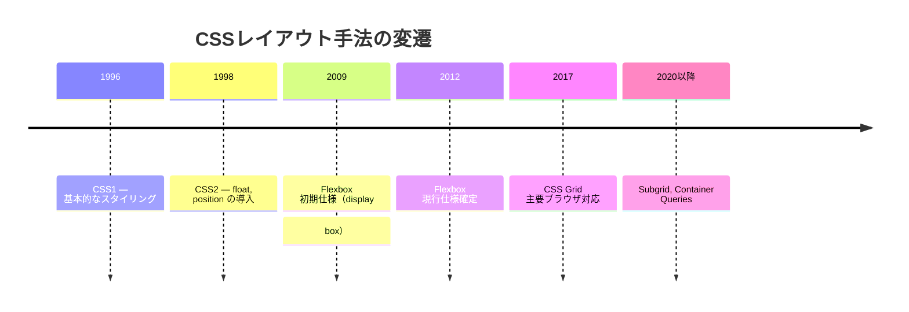
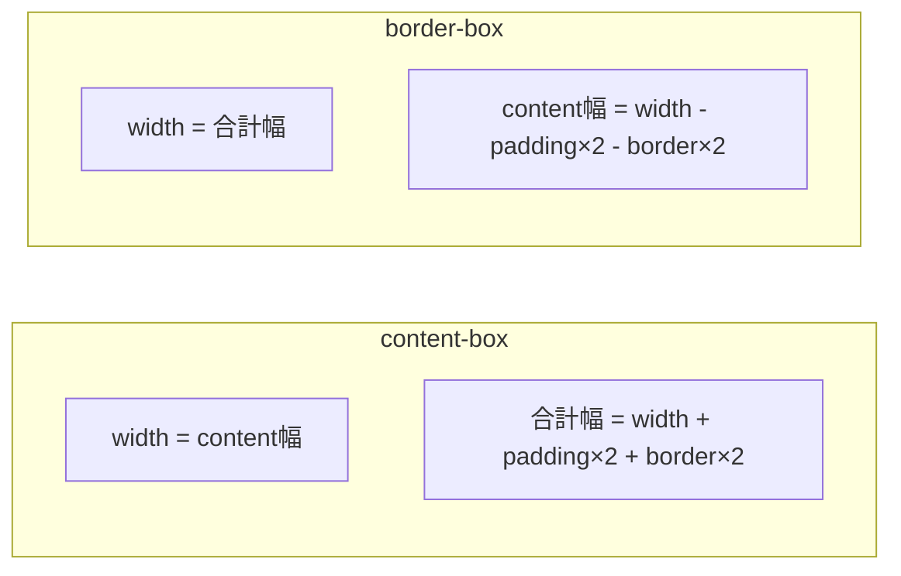
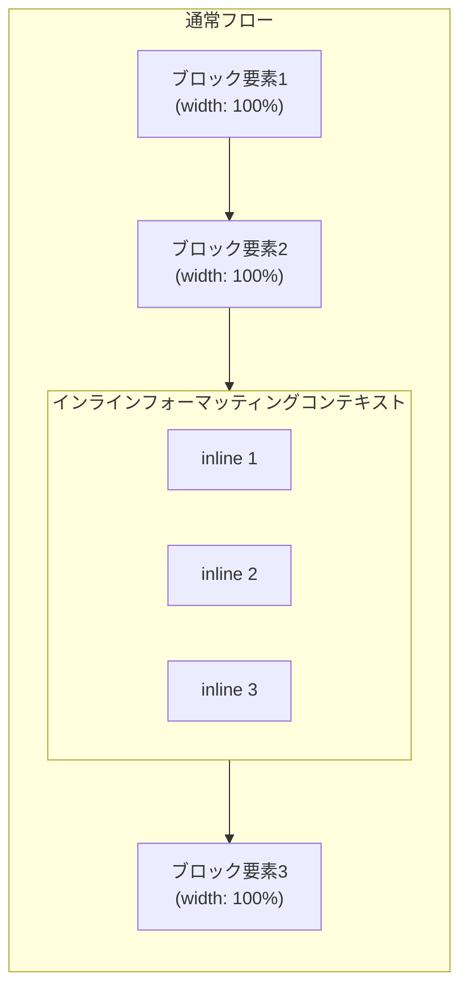
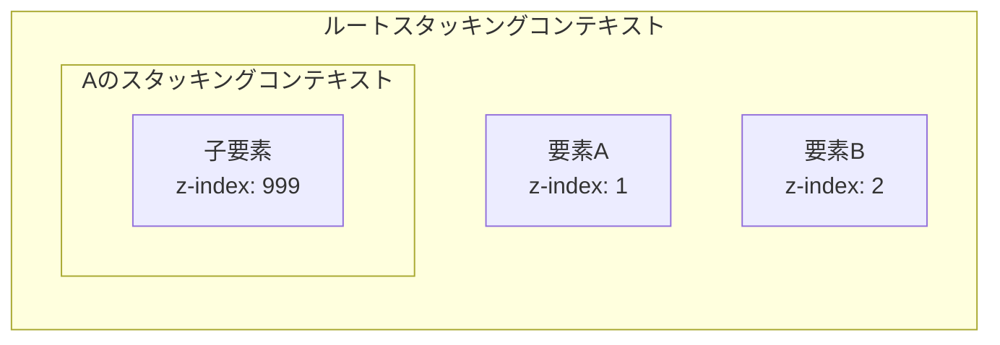
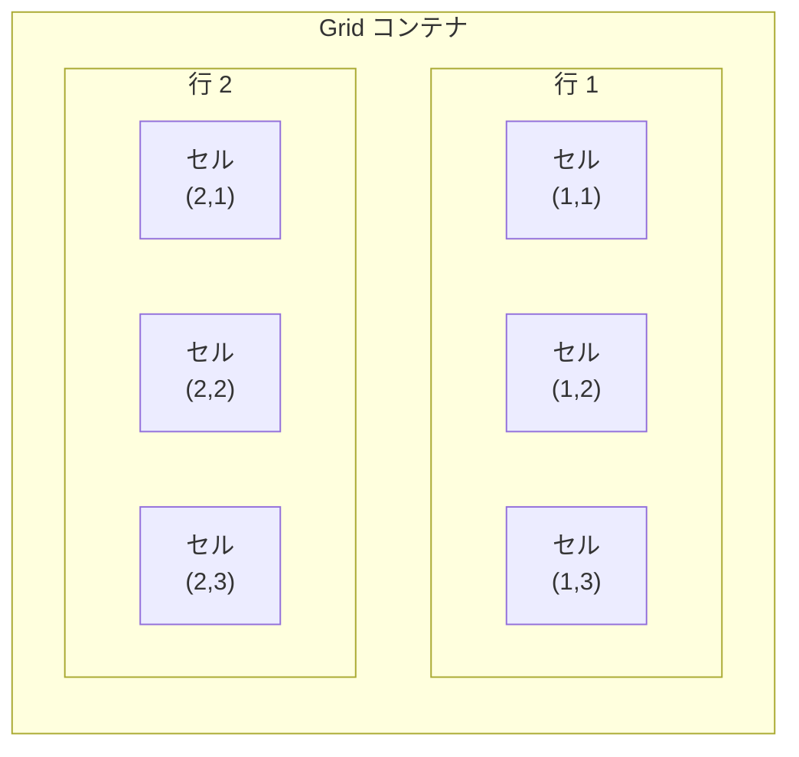
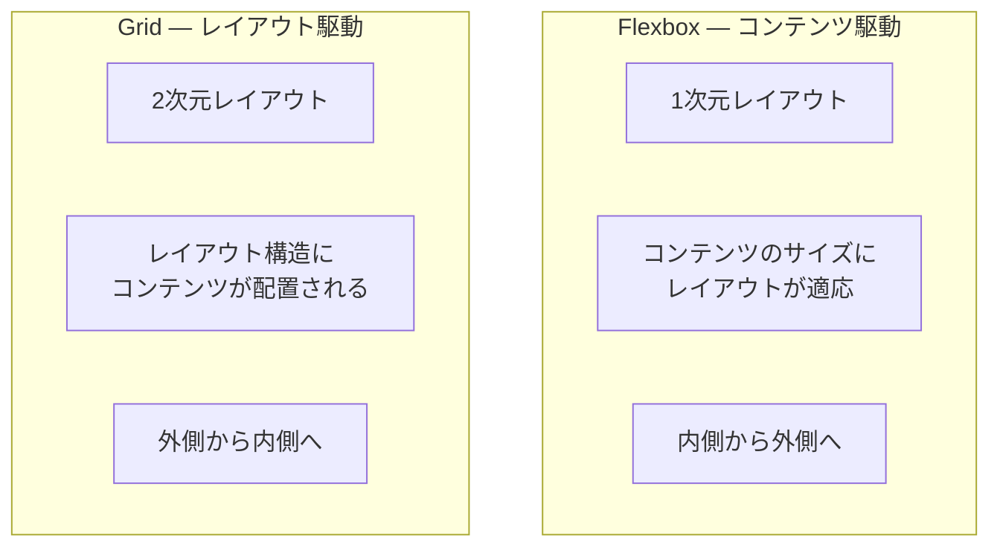
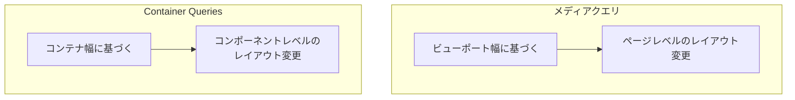
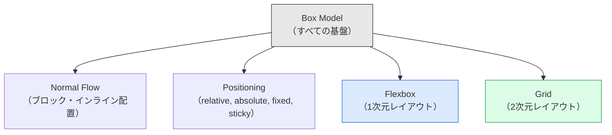

# CSSレイアウトモデル（Box Model, Flexbox, Grid）

## 1. 背景と歴史：テーブルレイアウトからモダンCSSへ

### 1.1 Webレイアウトの黎明期

1990年代前半、HTML は文書構造を記述するための言語として設計された。当時のWebページは論文や報告書のような構造を持ち、見出し・段落・リスト・リンクといった要素が上から下へと流れる単純なレイアウトだった。レイアウトを制御するCSSという仕組みは存在せず、ブラウザのデフォルトスタイルがそのまま表示されていた。

しかし、Webが商用利用されるようになると、デザインへの要求が高まった。ページを複数カラムに分割したい、ナビゲーションバーを固定したい、要素を横並びにしたい——こうした要求に応えるため、開発者たちは `<table>` 要素を本来の用途（表形式データの表示）から逸脱させ、レイアウトのために使い始めた。これがいわゆる**テーブルレイアウト**である。

```html
<!-- Typical table-based layout from the late 1990s -->
<table width="100%" cellpadding="0" cellspacing="0">
  <tr>
    <td width="200" valign="top">
      <!-- Navigation sidebar -->
    </td>
    <td valign="top">
      <!-- Main content -->
    </td>
  </tr>
</table>
```

テーブルレイアウトは、構造と見た目の分離という原則に反し、アクセシビリティの問題を引き起こし、メンテナンス性も悪かった。しかし、当時は他に選択肢がなかったのである。

### 1.2 CSS1からCSS3への進化

1996年にCSS Level 1が勧告され、文書の見た目を構造から分離するための基盤が整った。CSS1ではフォント、色、テキスト装飾、マージンなどの基本的なプロパティが定義されたが、レイアウトに関する機能は極めて限定的だった。

1998年に策定されたCSS2（および2011年のCSS 2.1）では、`position`プロパティ、`float`プロパティ、`display`プロパティの拡充など、レイアウト制御に関する重要な機能が追加された。特に `float` は、テーブルレイアウトに代わるレイアウト手法として広く利用されるようになった。

```css
/* Float-based two-column layout (CSS2 era) */
.sidebar {
  float: left;
  width: 200px;
}
.main {
  margin-left: 220px;
}
.clearfix::after {
  content: "";
  display: table;
  clear: both;
}
```

しかし、`float` によるレイアウトにも課題があった。フロート解除（clearfix）の必要性、垂直方向の中央揃えの困難さ、ソースオーダーとビジュアルオーダーの不一致など、開発者は多くのハック的テクニックを駆使しなければならなかった。

### 1.3 モダンレイアウトモデルの登場

こうした課題を根本的に解決するために設計されたのが、**CSS Flexible Box Layout（Flexbox）** と **CSS Grid Layout** である。



Flexboxは2009年に初期仕様が提案され（当時は`display: box`）、複数の仕様変更を経て2012年に現在の仕様が確定した。CSS Gridは2017年に主要ブラウザでサポートが開始され、2次元レイアウトの決定版として位置づけられている。

現在では、Box Modelを基盤とし、その上にFlexboxとGridという2つの強力なレイアウトモデルが構築されるという、階層的なアーキテクチャが完成している。本記事では、これらの仕組みを基礎から体系的に解説する。

## 2. Box Model：CSSレイアウトの基盤

### 2.1 すべてはボックスである

CSSにおけるレイアウトの最も根本的な概念は、**すべてのHTML要素は矩形のボックスを生成する**という原則である。この原則はCSS仕様全体を貫く設計思想であり、Box Modelと呼ばれる。

ブラウザがHTMLをレンダリングする際、まずDOMツリーからレンダーツリーを構築する。このレンダーツリーの各ノードが、CSSの Box Model に基づいたボックスとして配置される。見出し、段落、画像、リンク——あらゆるHTML要素が、Box Modelの4つの領域で構成されるボックスとして扱われるのである。

### 2.2 Box Modelの4つの領域

Box Modelは、内側から外側に向かって以下の4つの領域で構成される。

```
┌─────────────────────────────────────────────┐
│                  margin                      │
│  ┌───────────────────────────────────────┐  │
│  │              border                   │  │
│  │  ┌───────────────────────────────┐    │  │
│  │  │          padding              │    │  │
│  │  │  ┌───────────────────────┐    │    │  │
│  │  │  │                       │    │    │  │
│  │  │  │      content          │    │    │  │
│  │  │  │                       │    │    │  │
│  │  │  └───────────────────────┘    │    │  │
│  │  │                               │    │  │
│  │  └───────────────────────────────┘    │  │
│  │                                       │  │
│  └───────────────────────────────────────┘  │
│                                              │
└─────────────────────────────────────────────┘
```

1. **Content（コンテンツ領域）**: テキストや画像など、要素の実際のコンテンツが表示される領域。`width`と`height`プロパティは、デフォルトではこの領域のサイズを指定する。
2. **Padding（パディング）**: コンテンツ領域とボーダーの間の余白。要素の背景色はパディング領域にも適用される。
3. **Border（ボーダー）**: パディングの外側を囲む枠線。幅、スタイル、色を指定できる。
4. **Margin（マージン）**: ボーダーの外側の余白。要素間の間隔を制御する。マージンは常に透明であり、背景色は適用されない。

### 2.3 content-box と border-box

Box Modelの仕様において最も混乱を招く点の一つが、`width`と`height`プロパティの解釈である。CSS仕様のデフォルトでは、`width`と`height`はコンテンツ領域のサイズを指定する。これは `box-sizing: content-box` という動作である。

```css
/* content-box (default): total width = 200 + 20*2 + 2*2 = 244px */
.box-content {
  box-sizing: content-box;
  width: 200px;
  padding: 20px;
  border: 2px solid #333;
}
```

この場合、要素の実際の表示幅はコンテンツ幅（200px）にパディング（左右40px）とボーダー（左右4px）を加えた244pxとなる。開発者が「幅200px」と指定しても、実際に占有する幅はそれより大きくなるのである。

この直感に反する動作を解決するのが `box-sizing: border-box` である。

```css
/* border-box: total width = 200px (content area is 200 - 20*2 - 2*2 = 156px) */
.box-border {
  box-sizing: border-box;
  width: 200px;
  padding: 20px;
  border: 2px solid #333;
}
```

`border-box`では、`width`と`height`がボーダーまでを含む全体のサイズを指定する。コンテンツ領域はパディングとボーダーを引いた残りとなる。これにより、要素のサイズ計算が格段に容易になる。



実務では、ほぼすべてのプロジェクトで以下のリセットが適用される。

```css
/* Universal border-box reset */
*,
*::before,
*::after {
  box-sizing: border-box;
}
```

この手法はCSS界で広く採用されており、Paul Irishが2012年に提案して以来、デファクトスタンダードとなっている。

### 2.4 マージンの相殺（Margin Collapsing）

Box Modelのもう一つの重要な振る舞いが**マージンの相殺（margin collapsing）**である。これは隣接するブロックレベル要素のマージンが重なり合って、大きい方のマージンのみが適用される現象を指す。

マージン相殺が発生する3つのケース：

1. **隣接する兄弟要素**: 上の要素の`margin-bottom`と下の要素の`margin-top`が相殺される。
2. **親要素と最初/最後の子要素**: 親にパディングやボーダーがない場合、子の`margin-top`が親の`margin-top`と相殺される。
3. **空のブロック**: コンテンツやパディング、ボーダー、heightがない要素の`margin-top`と`margin-bottom`が相殺される。

```css
/* Margin collapsing example */
.element-a {
  margin-bottom: 30px;
}
.element-b {
  margin-top: 20px;
}
/* The gap between A and B is 30px (not 50px) */
```

マージン相殺はブロックフォーマッティングコンテキスト（BFC）の境界を越えない。Flexboxコンテナ内やGridコンテナ内では、マージン相殺は発生しない。これは後述するFlexboxやGridの振る舞いを理解する上で重要なポイントである。

### 2.5 インラインボックスとブロックボックス

HTMLの各要素はデフォルトで**ブロックレベル**または**インラインレベル**のいずれかの表示タイプを持つ。この区別はBox Modelの振る舞いに大きく影響する。

| 特性 | ブロックボックス | インラインボックス |
|------|------------------|-------------------|
| 改行 | 前後に改行が入る | 改行されない |
| 幅 | 親の幅いっぱいに広がる | コンテンツに応じた幅 |
| width/height | 指定可能 | 指定不可 |
| マージン（上下） | 有効 | 無効 |
| パディング（上下） | 正常に機能 | 視覚的には適用されるが、レイアウトに影響しない |

`display: inline-block` はこの両者のハイブリッドであり、インラインのように横に並びながら、ブロックのように `width`、`height`、上下のマージンが有効になる。

## 3. 通常フロー（Normal Flow）とポジショニング

### 3.1 通常フロー

CSSにおけるレイアウトの基本は**通常フロー（Normal Flow）**である。特別なポジショニングやフロートが適用されていない要素は、通常フローに従って配置される。通常フローでは、以下のルールに基づいて要素が配置される。

- **ブロックレベル要素**: 垂直方向（上から下）に、ドキュメント内での出現順に積み重なる。各要素は新しい行を開始し、親要素の幅いっぱいに広がる。
- **インラインレベル要素**: 水平方向（左から右、RTL言語では右から左）に並ぶ。行の幅を超えると自動的に改行される。



通常フローは、ブラウザのレンダリングエンジンにおいて最も効率的に処理されるレイアウトモードである。Flexbox や Grid を使わない場面では、通常フローの特性を理解し活用することが重要である。

### 3.2 ブロックフォーマッティングコンテキスト（BFC）

**ブロックフォーマッティングコンテキスト（Block Formatting Context, BFC）** は、CSSレイアウトにおいて独立した配置領域を形成する概念である。BFC内の要素配置はBFC外の要素に影響を与えず、逆もまた然りである。

BFCが生成される主な条件：

- ルート要素（`<html>`）
- `float`が`none`以外
- `position`が`absolute`または`fixed`
- `display`が`inline-block`、`table-cell`、`flow-root`
- `overflow`が`visible`以外（`auto`、`hidden`、`scroll`）
- FlexboxアイテムやGridアイテム

BFCの主な効果：

1. **フロートの包含**: BFCは内部のフロートを包含する。これにより、フロートした子要素が親要素からはみ出す問題を解決できる。
2. **マージン相殺の防止**: 異なるBFCに属する要素間ではマージン相殺が発生しない。
3. **フロートとの重なり防止**: BFCを形成する要素は、隣接するフロート要素と重ならない。

```css
/* Creating a BFC with display: flow-root (modern approach) */
.container {
  display: flow-root;
}
```

`display: flow-root`は、BFCを生成するために設計されたモダンなプロパティである。従来の `overflow: hidden` によるハックと異なり、副作用がない。

### 3.3 position プロパティ

`position`プロパティは、要素を通常フローから取り出し、任意の位置に配置するための仕組みである。

| 値 | 基準点 | 通常フローへの影響 | スクロールへの追従 |
|------|--------|---------------------|---------------------|
| `static` | なし（デフォルト） | 通常フロー内 | 通常 |
| `relative` | 要素自身の通常位置 | 元の位置を占有 | 通常 |
| `absolute` | 最も近い positioned 祖先 | 通常フローから除外 | 通常（基準要素に対して） |
| `fixed` | ビューポート | 通常フローから除外 | 固定 |
| `sticky` | 最も近いスクロール祖先 | 元の位置を占有 | 条件付き固定 |

```css
/* Sticky header example */
.header {
  position: sticky;
  top: 0;
  z-index: 100;
  background: white;
}
```

`position: sticky` は `relative` と `fixed` のハイブリッドである。通常は相対配置として振る舞い、スクロールによって指定した閾値に達するとビューポートに固定される。テーブルのヘッダー固定やサイドバーの追従など、実用的な場面で非常に便利である。

### 3.4 スタッキングコンテキスト

`position`と`z-index`を使う際に理解すべき重要な概念が**スタッキングコンテキスト（Stacking Context）** である。スタッキングコンテキストは、要素のZ軸方向（奥行き）の配置順序を決定する独立した空間である。



上図の例では、要素A内の子要素が`z-index: 999`を持っていても、要素Bの上には表示されない。なぜなら、親の要素Aが`z-index: 1`であり、要素B（`z-index: 2`）より下に位置するからである。スタッキングコンテキスト内の`z-index`は、そのコンテキスト内でのみ比較される。

スタッキングコンテキストを生成する主な条件：

- `position`が`static`以外で`z-index`が`auto`以外
- `opacity`が1未満
- `transform`、`filter`、`perspective`、`clip-path`が`none`以外
- `will-change`が上記プロパティを指定
- `isolation: isolate`

## 4. Flexbox：1次元レイアウトの革命

### 4.1 Flexboxが解決する問題

CSS Flexible Box Layout Module（Flexbox）は、1次元方向のレイアウト—すなわち行（横方向）または列（縦方向）のいずれか一方に沿って要素を配置するためのモデルである。Flexboxが登場する以前、以下の操作はCSSで非常に困難だった。

- 要素の垂直方向中央揃え
- 複数要素への均等なスペース配分
- コンテンツ量に応じた柔軟なサイズ調整
- ソースオーダー（HTML上の順序）に依存しないビジュアルオーダー
- 利用可能なスペースに応じた要素の伸縮

Flexboxはこれらすべてを、直感的かつ宣言的に解決する。

### 4.2 Flexコンテナとアイテム

Flexboxレイアウトは、**Flexコンテナ**と**Flexアイテム**という2つの役割で構成される。`display: flex`（または`display: inline-flex`）を指定した要素がFlexコンテナとなり、その直接の子要素がFlexアイテムとなる。

```html
<!-- Flex container and items -->
<div class="flex-container">
  <div class="flex-item">Item 1</div>
  <div class="flex-item">Item 2</div>
  <div class="flex-item">Item 3</div>
</div>
```

```css
.flex-container {
  display: flex;
}
```

Flexコンテナとなった要素には、通常フローとは異なる新しいレイアウトアルゴリズムが適用される。Flexアイテムは、ブロック要素であれインライン要素であれ、Flexレイアウトのルールに従って配置される。重要な点として、Flexアイテム間ではマージンの相殺が発生しない。

### 4.3 主軸と交差軸

Flexboxの中核となる概念が**主軸（Main Axis）** と**交差軸（Cross Axis）** である。

```
flex-direction: row（デフォルト）

主軸 (Main Axis) →
┌──────────────────────────────────────┐
│  ┌─────┐  ┌─────┐  ┌─────┐         │  ↕ 交差軸
│  │  1  │  │  2  │  │  3  │         │  (Cross Axis)
│  └─────┘  └─────┘  └─────┘         │
└──────────────────────────────────────┘

flex-direction: column

交差軸 (Cross Axis) →
┌──────────────┐
│  ┌────────┐  │  ↕ 主軸
│  │   1    │  │  (Main Axis)
│  └────────┘  │
│  ┌────────┐  │
│  │   2    │  │
│  └────────┘  │
│  ┌────────┐  │
│  │   3    │  │
│  └────────┘  │
└──────────────┘
```

`flex-direction`プロパティによって主軸の方向が決まり、交差軸はそれに直交する方向となる。

| flex-direction | 主軸 | 交差軸 |
|----------------|------|--------|
| `row`（デフォルト） | 左→右 | 上→下 |
| `row-reverse` | 右→左 | 上→下 |
| `column` | 上→下 | 左→右 |
| `column-reverse` | 下→上 | 左→右 |

### 4.4 配置（Alignment）プロパティ

Flexboxの配置プロパティは、主軸と交差軸に沿ったアイテムの位置を制御する。

**主軸方向の配置: `justify-content`**

```
justify-content: flex-start（デフォルト）
┌──[1][2][3]────────────────────┐

justify-content: flex-end
┌────────────────────[1][2][3]──┐

justify-content: center
┌──────────[1][2][3]────────────┐

justify-content: space-between
┌──[1]──────────[2]──────────[3]──┐

justify-content: space-around
┌───[1]──────[2]──────[3]───┐

justify-content: space-evenly
┌────[1]────[2]────[3]────┐
```

**交差軸方向の配置: `align-items`**

| 値 | 動作 |
|---|---|
| `stretch`（デフォルト） | コンテナの高さに引き伸ばす |
| `flex-start` | 交差軸の開始端に揃える |
| `flex-end` | 交差軸の終了端に揃える |
| `center` | 交差軸の中央に揃える |
| `baseline` | テキストのベースラインに揃える |

Flexboxによる垂直方向中央揃え——CSS史上最も困難だった課題の一つ——は、たった3行で実現できるようになった。

```css
/* Vertical and horizontal centering with Flexbox */
.center-container {
  display: flex;
  justify-content: center;
  align-items: center;
}
```

### 4.5 flex プロパティ：伸縮の制御

Flexアイテムの伸縮動作は `flex` ショートハンドプロパティ（`flex-grow`、`flex-shrink`、`flex-basis` の3つの値）で制御される。

- **`flex-grow`**: 余剰スペースをどの比率で分配するか。デフォルト値は `0`（伸びない）。
- **`flex-shrink`**: スペースが不足した際にどの比率で縮小するか。デフォルト値は `1`。
- **`flex-basis`**: 伸縮前のアイテムの初期サイズ。デフォルト値は `auto`。

```css
/* flex shorthand: flex-grow | flex-shrink | flex-basis */
.item-fixed {
  flex: 0 0 200px;  /* No grow, no shrink, 200px base */
}
.item-flexible {
  flex: 1 1 0;      /* Grow and shrink equally, no fixed base */
}
```

`flex`プロパティの値の組み合わせには一般的なパターンがある。

```css
/* Common flex value patterns */
.item { flex: 1; }         /* flex: 1 1 0%   — Equal distribution */
.item { flex: auto; }      /* flex: 1 1 auto — Grow from content size */
.item { flex: none; }      /* flex: 0 0 auto — Rigid, no flex */
.item { flex: 0 1 auto; }  /* Default        — Can shrink but not grow */
```

### 4.6 flex-grow の分配アルゴリズム

`flex-grow` の動作を正確に理解するため、具体的な計算例を示す。

```
コンテナ幅: 600px
アイテムA: flex-basis: 100px, flex-grow: 1
アイテムB: flex-basis: 100px, flex-grow: 2
アイテムC: flex-basis: 100px, flex-grow: 1

余剰スペース = 600 - (100 + 100 + 100) = 300px
flex-grow の合計 = 1 + 2 + 1 = 4

アイテムA の最終幅 = 100 + 300 × (1/4) = 100 + 75 = 175px
アイテムB の最終幅 = 100 + 300 × (2/4) = 100 + 150 = 250px
アイテムC の最終幅 = 100 + 300 × (1/4) = 100 + 75 = 175px
合計: 175 + 250 + 175 = 600px ✓
```

### 4.7 flex-wrap と複数行レイアウト

デフォルトでは、Flexアイテムは1行に収められる（`flex-wrap: nowrap`）。アイテムの合計幅がコンテナを超える場合、アイテムは縮小される（`flex-shrink`に基づいて）。

`flex-wrap: wrap` を指定すると、収まりきらないアイテムは新しい行に折り返される。

```css
/* Wrapping flex layout */
.card-grid {
  display: flex;
  flex-wrap: wrap;
  gap: 16px;
}
.card {
  flex: 1 1 300px; /* Grow, shrink, min 300px base */
}
```

`flex-wrap: wrap` と `flex-grow` を組み合わせることで、メディアクエリなしでレスポンシブなカードレイアウトを実現できる。ただし、最終行のアイテム数が少ない場合にアイテムが不自然に伸びる問題がある。この場合はCSS Gridの方が適切な解決策となることが多い。

### 4.8 gap プロパティ

`gap`プロパティは、FlexアイテムやGridアイテム間の間隔を指定する。従来はマージンで制御していたが、`gap`はコンテナ側で宣言するため、最初と最後のアイテムに余計なマージンが付かないという利点がある。

```css
/* gap property for consistent spacing */
.flex-container {
  display: flex;
  gap: 16px;      /* Both row and column gap */
}
.grid-container {
  display: grid;
  row-gap: 24px;
  column-gap: 16px;
}
```

### 4.9 order プロパティとアクセシビリティの注意

`order`プロパティは、Flexアイテムのビジュアルオーダーをソースオーダーから変更する機能を提供する。デフォルト値は0で、値が小さいほど前に配置される。

```css
/* Reordering flex items */
.item-a { order: 2; }
.item-b { order: 1; }
.item-c { order: 3; }
/* Visual order: B, A, C (regardless of source order) */
```

::: warning
`order`プロパティや`flex-direction: row-reverse`によるビジュアルオーダーの変更は、キーボードナビゲーションやスクリーンリーダーの読み上げ順序には影響しない。視覚的な順序とフォーカス順序が乖離すると、アクセシビリティの問題を引き起こす可能性がある。WCAG 2.2の達成基準1.3.2「意味のある順序」および2.4.3「フォーカス順序」に留意すべきである。
:::

## 5. CSS Grid：2次元レイアウトの決定版

### 5.1 CSS Gridが解決する問題

CSS Grid Layout（以下、Grid）は、行と列の2次元に渡ってコンテンツを配置するためのレイアウトモデルである。Flexboxが1次元のレイアウトに最適化されているのに対し、Gridは2次元のレイアウトを明示的に定義できる。

Gridが登場する以前、2次元レイアウト（例えば、複雑なダッシュボードやマガジンスタイルのレイアウト）を実現するには、Flexboxのネストやfloatのハック、あるいはJavaScriptによるレイアウト計算に頼らざるを得なかった。Gridはこれらの課題をCSSのみで、宣言的かつ直感的に解決する。

### 5.2 Gridの基本概念

Gridレイアウトは以下の概念で構成される。



- **Gridコンテナ**: `display: grid` が適用された要素。
- **Gridアイテム**: Gridコンテナの直接の子要素。
- **Gridライン**: 行と列を区切る水平・垂直の線。番号またはカスタム名で参照される。
- **Gridトラック**: 隣接する2本のグリッドラインの間のスペース。行トラックと列トラックがある。
- **Gridセル**: 行と列が交差する1つの区画。テーブルのセルに相当する。
- **Gridエリア**: 1つ以上のGridセルで構成される矩形の領域。

```
        列ライン1  列ライン2  列ライン3  列ライン4
           │         │         │         │
行ライン1──┼─────────┼─────────┼─────────┤
           │  セル   │  セル   │  セル   │  ← 行トラック1
行ライン2──┼─────────┼─────────┼─────────┤
           │  セル   │  セル   │  セル   │  ← 行トラック2
行ライン3──┼─────────┼─────────┼─────────┤
           ↑
        列トラック1
```

### 5.3 グリッドの定義

`grid-template-columns`と`grid-template-rows`でグリッドの構造を定義する。

```css
/* Basic grid definition */
.grid-container {
  display: grid;
  grid-template-columns: 200px 1fr 1fr;  /* 3 columns */
  grid-template-rows: 80px auto 60px;     /* 3 rows */
  gap: 16px;
}
```

### 5.4 fr 単位

`fr`（fraction）は、Gridにおける柔軟な長さの単位であり、利用可能なスペースに対する比率を表す。`fr`単位はFlexboxの`flex-grow`に相当する概念をGrid側で提供する。

```css
/* fr unit distribution */
.grid {
  display: grid;
  grid-template-columns: 1fr 2fr 1fr;
  /* Column widths: 25% | 50% | 25% of available space */
}
```

`fr`と固定値を組み合わせることもできる。固定サイズのトラックが先に確保され、残りのスペースが`fr`の比率で分配される。

```css
/* Mixing fixed and flexible tracks */
.layout {
  display: grid;
  grid-template-columns: 250px 1fr 1fr;
  /* Sidebar: fixed 250px, two content areas share the rest */
}
```

### 5.5 repeat() 関数

`repeat()`関数は、繰り返しパターンを簡潔に記述するための関数である。

```css
/* repeat() function */
.grid-12 {
  grid-template-columns: repeat(12, 1fr);
  /* Equivalent to: 1fr 1fr 1fr 1fr 1fr 1fr 1fr 1fr 1fr 1fr 1fr 1fr */
}
```

`repeat()`は `auto-fill` や `auto-fit` キーワードと組み合わせることで、レスポンシブなグリッドを宣言的に定義できる。

```css
/* Auto-fill: creates as many tracks as fit, leaving empty tracks */
.auto-fill-grid {
  grid-template-columns: repeat(auto-fill, minmax(250px, 1fr));
}

/* Auto-fit: same as auto-fill, but collapses empty tracks to 0 */
.auto-fit-grid {
  grid-template-columns: repeat(auto-fit, minmax(250px, 1fr));
}
```

`auto-fill`と`auto-fit`の違いは微妙だが重要である。

```
コンテナ幅: 900px, アイテム3つ, minmax(250px, 1fr)

auto-fill:
┌──────────┬──────────┬──────────┬──(空)──┐
│  Item 1  │  Item 2  │  Item 3  │        │
└──────────┴──────────┴──────────┴────────┘
  (225px)    (225px)    (225px)   (225px)
  → 4トラック生成、最後は空

auto-fit:
┌────────────┬────────────┬────────────┐
│   Item 1   │   Item 2   │   Item 3   │
└────────────┴────────────┴────────────┘
   (300px)      (300px)      (300px)
  → 空トラックが潰れ、アイテムが拡張
```

### 5.6 minmax() 関数

`minmax()`関数は、トラックの最小サイズと最大サイズの範囲を指定する。

```css
/* minmax() function */
.grid {
  grid-template-columns: minmax(200px, 300px) 1fr minmax(100px, 200px);
  /* First column: 200px to 300px, middle: flexible, third: 100px to 200px */
}
```

`minmax()`と`auto-fit`/`auto-fill`の組み合わせは、メディアクエリなしのレスポンシブグリッドを実現する最も強力なパターンの一つである。

```css
/* Responsive grid without media queries */
.responsive-grid {
  display: grid;
  grid-template-columns: repeat(auto-fit, minmax(min(100%, 300px), 1fr));
  gap: 24px;
}
```

上記では `min(100%, 300px)` を使うことで、コンテナ幅が300px未満の場合でもオーバーフローしないようにしている。

### 5.7 アイテムの配置

Gridアイテムは、グリッドライン番号やグリッドエリア名を使って明示的に配置できる。

**ライン番号による配置：**

```css
/* Placing items by line numbers */
.header {
  grid-column: 1 / -1;   /* Span from first to last column line */
  grid-row: 1 / 2;
}
.sidebar {
  grid-column: 1 / 2;
  grid-row: 2 / 4;       /* Span 2 rows */
}
.main {
  grid-column: 2 / -1;
  grid-row: 2 / 3;
}
.footer {
  grid-column: 1 / -1;
  grid-row: 3 / 4;
}
```

**span キーワードによる配置：**

```css
/* Using span keyword */
.wide-item {
  grid-column: span 2;   /* Span 2 columns from auto-placed position */
}
.tall-item {
  grid-row: span 3;      /* Span 3 rows */
}
```

### 5.8 grid-template-areas による名前付きレイアウト

`grid-template-areas`は、Gridレイアウトの最も直感的な定義方法である。ASCIIアートのような形式でレイアウト構造を視覚的に記述できる。

```css
/* Named grid areas */
.page-layout {
  display: grid;
  grid-template-columns: 250px 1fr;
  grid-template-rows: 80px 1fr 60px;
  grid-template-areas:
    "header  header"
    "sidebar main"
    "footer  footer";
  gap: 16px;
  min-height: 100vh;
}

.header  { grid-area: header; }
.sidebar { grid-area: sidebar; }
.main    { grid-area: main; }
.footer  { grid-area: footer; }
```

`.`（ドット）を使うと、空のセルを定義できる。

```css
/* Empty cells with dots */
.layout {
  grid-template-areas:
    "header header header"
    "nav    main   aside"
    ".      footer .";
}
```

`grid-template-areas`の利点は、レスポンシブデザインにおいてメディアクエリでレイアウト構造を簡潔に切り替えられることである。

```css
/* Responsive layout with grid-template-areas */
.page-layout {
  display: grid;
  grid-template-areas:
    "header"
    "main"
    "sidebar"
    "footer";
  grid-template-columns: 1fr;
}

@media (min-width: 768px) {
  .page-layout {
    grid-template-columns: 250px 1fr;
    grid-template-areas:
      "header  header"
      "sidebar main"
      "footer  footer";
  }
}
```

### 5.9 暗黙的グリッドと自動配置

`grid-template-columns`や`grid-template-rows`で明示的に定義されたグリッドの外にアイテムが配置される場合、ブラウザは**暗黙的グリッドトラック**を自動生成する。暗黙的トラックのサイズは `grid-auto-rows` と `grid-auto-columns` で制御できる。

```css
/* Implicit grid tracks */
.grid {
  display: grid;
  grid-template-columns: repeat(3, 1fr);
  grid-auto-rows: minmax(100px, auto);
  /* Rows are auto-generated with at least 100px height */
}
```

`grid-auto-flow`プロパティは、自動配置アルゴリズムの動作を制御する。

```css
/* Dense packing algorithm */
.masonry-like {
  display: grid;
  grid-template-columns: repeat(auto-fill, minmax(200px, 1fr));
  grid-auto-flow: dense;
  /* Fills in gaps left by larger items */
}
```

`grid-auto-flow: dense`は、通常の配置順序では空いてしまうセルを、後続の小さなアイテムで埋める。ギャラリーレイアウトなどで有用だが、ビジュアルオーダーとソースオーダーが大きく乖離する可能性があるため、アクセシビリティへの配慮が必要である。

### 5.10 Subgrid

CSS Grid Level 2で導入された**Subgrid**は、ネストされたGridアイテムが親グリッドのトラック定義を継承する機能である。

```css
/* Subgrid example */
.parent-grid {
  display: grid;
  grid-template-columns: 1fr 2fr 1fr;
  gap: 16px;
}

.child-spanning-all {
  grid-column: 1 / -1;
  display: grid;
  grid-template-columns: subgrid; /* Inherits parent's column tracks */
}
```

Subgrid以前は、ネストされたGridがあると、内部のGridは親のトラックとは独立したグリッドを形成していた。これにより、親と子のグリッドラインを揃えることが困難だった。Subgridはこの問題を解決し、カードリスト内のタイトルや本文のベースラインを揃えるといった実用的なレイアウトを可能にする。

## 6. FlexboxとGridの使い分け

### 6.1 設計思想の違い

FlexboxとGridは競合する技術ではなく、異なる設計思想に基づく補完的なレイアウトモデルである。



- **Flexbox**は「コンテンツアウト（content-out）」のアプローチである。アイテムのサイズがまず決定され、それに基づいてレイアウトが形成される。コンテンツの量やサイズに応じて柔軟に適応するレイアウトに適している。
- **Grid**は「レイアウトイン（layout-in）」のアプローチである。まずグリッド構造が定義され、そこにアイテムが配置される。ページ全体の骨格や、厳密な行列に揃えたいレイアウトに適している。

### 6.2 選択の指針

| 要件 | 推奨 |
|------|------|
| ナビゲーションバーの水平配置 | Flexbox |
| カードの均等配置 | Grid |
| フォーム入力の行内レイアウト | Flexbox |
| ページ全体の骨格（ヘッダー/サイドバー/メイン/フッター） | Grid |
| 中央揃え | Flexbox |
| ダッシュボードの複雑なタイルレイアウト | Grid |
| 不定個数のタグやバッジの折り返し | Flexbox |
| 画像ギャラリー | Grid |
| コンポーネント内部のレイアウト | Flexbox |
| ページ構造のレイアウト | Grid |

### 6.3 組み合わせるのが正解

実際のプロジェクトでは、FlexboxとGridを組み合わせて使うのが最も効果的である。ページ全体の構造はGridで定義し、各コンポーネント内部のレイアウトはFlexboxで制御するというパターンが一般的である。

```css
/* Grid for page structure */
.page {
  display: grid;
  grid-template-columns: 250px 1fr;
  grid-template-rows: auto 1fr auto;
  grid-template-areas:
    "header header"
    "nav    main"
    "footer footer";
  min-height: 100vh;
}

/* Flexbox for navigation items */
.nav-list {
  display: flex;
  flex-direction: column;
  gap: 4px;
}

/* Grid for content card layout */
.card-grid {
  display: grid;
  grid-template-columns: repeat(auto-fit, minmax(280px, 1fr));
  gap: 24px;
}

/* Flexbox inside each card */
.card {
  display: flex;
  flex-direction: column;
}
.card-body {
  flex: 1; /* Push footer to bottom */
}
```

## 7. レスポンシブデザインとの関係

### 7.1 レスポンシブデザインの基本原則

レスポンシブWebデザイン（RWD）は、Ethan Marcotteが2010年に提唱した設計手法であり、単一のHTMLソースで異なる画面サイズに対応するアプローチである。RWDの3つの柱は以下の通りである。

1. **フルードグリッド（Fluid Grid）**: 固定幅ではなく相対単位（%、fr）でレイアウトを定義する。
2. **フルードイメージ（Fluid Images）**: 画像がコンテナからはみ出さないようにする（`max-width: 100%`）。
3. **メディアクエリ（Media Queries）**: 画面幅に応じてCSSルールを切り替える。

### 7.2 メディアクエリ

メディアクエリは、デバイスやビューポートの特性に応じてCSSを適用する仕組みである。

```css
/* Mobile-first media queries */
.container {
  padding: 16px;
}

/* Tablet and up */
@media (min-width: 768px) {
  .container {
    padding: 24px;
    max-width: 720px;
    margin: 0 auto;
  }
}

/* Desktop and up */
@media (min-width: 1024px) {
  .container {
    max-width: 960px;
  }
}

/* Wide desktop */
@media (min-width: 1280px) {
  .container {
    max-width: 1200px;
  }
}
```

**モバイルファースト**のアプローチでは、まずモバイル向けのスタイルをベースとして記述し、`min-width`メディアクエリでより大きな画面向けのスタイルを追加していく。これにより、モバイルデバイスでは不要なCSSの上書きが発生しないため、パフォーマンス面で有利である。

### 7.3 Container Queries

メディアクエリがビューポートの幅に基づくのに対し、**Container Queries**はコンテナ要素の幅に基づいてスタイルを適用する。これにより、コンポーネントが自身の配置されたコンテキストに応じてスタイルを変更できる、真にモジュラーなコンポーネント設計が可能になる。

```css
/* Container Queries */
.card-wrapper {
  container-type: inline-size;
  container-name: card;
}

/* Default: vertical card layout */
.card {
  display: flex;
  flex-direction: column;
}

/* When container is wider than 400px: horizontal layout */
@container card (min-width: 400px) {
  .card {
    flex-direction: row;
  }
  .card-image {
    width: 40%;
  }
}
```



Container Queriesは2023年に主要ブラウザでサポートが完了し、モダンなCSS設計の重要な構成要素となっている。

### 7.4 ビューポート単位と論理プロパティ

レスポンシブデザインにおいて、ビューポート相対単位と論理プロパティの理解は欠かせない。

**ビューポート単位：**

| 単位 | 説明 |
|------|------|
| `vw` | ビューポート幅の1% |
| `vh` | ビューポート高さの1% |
| `dvh` | 動的ビューポート高さの1%（モバイルでアドレスバーの表示/非表示を考慮） |
| `svh` | 小さなビューポート高さの1%（アドレスバー表示時） |
| `lvh` | 大きなビューポート高さの1%（アドレスバー非表示時） |

モバイルブラウザではアドレスバーの表示・非表示によってビューポートの高さが変化する。`100vh`を使うと、アドレスバーが表示されている状態ではコンテンツがはみ出す問題があった。`100dvh`はこの問題を解決するために導入された単位である。

```css
/* Full-height layout with dynamic viewport units */
.hero {
  min-height: 100dvh; /* Adapts to mobile address bar visibility */
}
```

**論理プロパティ：**

国際化（i18n）対応において、`margin-left`/`margin-right`といった物理方向のプロパティは問題を引き起こす。RTL（Right-to-Left）言語では方向が逆になるためである。論理プロパティはこの問題を解決する。

```css
/* Physical properties (direction-dependent) */
.old-style {
  margin-left: 16px;
  padding-right: 8px;
}

/* Logical properties (direction-independent) */
.modern-style {
  margin-inline-start: 16px;
  padding-inline-end: 8px;
}
```

## 8. 実践的なレイアウトパターン

### 8.1 Holy Grail レイアウト

「Holy Grail」レイアウトは、ヘッダー、フッター、3カラムのメインコンテンツから成る古典的なレイアウトパターンである。かつてはCSSで実現するのが非常に困難だったため、この名前が付けられた。

```css
/* Holy Grail layout with CSS Grid */
.holy-grail {
  display: grid;
  grid-template:
    "header header  header" auto
    "nav    main    aside"  1fr
    "footer footer  footer" auto
    / 200px 1fr     200px;
  min-height: 100dvh;
  gap: 16px;
}

.header { grid-area: header; }
.nav    { grid-area: nav; }
.main   { grid-area: main; }
.aside  { grid-area: aside; }
.footer { grid-area: footer; }

/* Responsive: single column on mobile */
@media (max-width: 768px) {
  .holy-grail {
    grid-template:
      "header" auto
      "main"   1fr
      "nav"    auto
      "aside"  auto
      "footer" auto
      / 1fr;
  }
}
```

### 8.2 スティッキーフッター

コンテンツが少ないページでもフッターをビューポートの下端に表示する「スティッキーフッター」パターンは、FlexboxまたはGridで簡潔に実現できる。

```css
/* Sticky footer with Flexbox */
.page-flex {
  display: flex;
  flex-direction: column;
  min-height: 100dvh;
}
.page-flex .main {
  flex: 1; /* Takes up all remaining space */
}

/* Sticky footer with Grid */
.page-grid {
  display: grid;
  grid-template-rows: auto 1fr auto;
  min-height: 100dvh;
}
```

### 8.3 レスポンシブカードグリッド

メディアクエリなしでレスポンシブに対応するカードグリッドは、CSS Gridの最も有用なパターンの一つである。

```css
/* Responsive card grid without media queries */
.card-grid {
  display: grid;
  grid-template-columns: repeat(auto-fit, minmax(min(100%, 300px), 1fr));
  gap: 24px;
}

.card {
  display: flex;
  flex-direction: column;
  border: 1px solid #e0e0e0;
  border-radius: 8px;
  overflow: hidden;
}

.card-image {
  aspect-ratio: 16 / 9;
  object-fit: cover;
  width: 100%;
}

.card-content {
  flex: 1; /* Ensures footer stays at bottom */
  display: flex;
  flex-direction: column;
  padding: 16px;
}

.card-footer {
  margin-top: auto; /* Push to bottom of card */
}
```

### 8.4 パンケーキスタック

「パンケーキスタック」は、ヘッダー・メイン・フッターの3要素を垂直に積み、メインコンテンツが残りのスペースを占有するパターンである。

```css
/* Pancake stack */
.pancake {
  display: grid;
  grid-template-rows: auto 1fr auto;
  min-height: 100dvh;
}
```

これは上述のスティッキーフッターと本質的に同じ構造だが、Grid版は3行のCSSで完結する簡潔さがある。

### 8.5 サイドバーレイアウト（sidebar says）

固定幅のサイドバーと、残りのスペースを占有するメインコンテンツのパターン。

```css
/* Sidebar layout */
.sidebar-layout {
  display: grid;
  grid-template-columns: minmax(150px, 25%) 1fr;
  gap: 24px;
}

/* Collapsible sidebar on small screens */
@media (max-width: 768px) {
  .sidebar-layout {
    grid-template-columns: 1fr;
  }
}
```

### 8.6 12カラムグリッドシステム

Bootstrapなどのフレームワークで広く使われてきた12カラムグリッドを、CSS Gridでネイティブに実現できる。

```css
/* 12-column grid system */
.grid-12 {
  display: grid;
  grid-template-columns: repeat(12, 1fr);
  gap: 24px;
}

/* Spanning columns */
.col-4  { grid-column: span 4; }
.col-6  { grid-column: span 6; }
.col-8  { grid-column: span 8; }
.col-12 { grid-column: span 12; }
```

### 8.7 アスペクト比を維持したメディア

`aspect-ratio`プロパティにより、メディア要素のアスペクト比を宣言的に維持できる。

```css
/* Aspect ratio with modern CSS */
.video-wrapper {
  aspect-ratio: 16 / 9;
  width: 100%;
}

.square-thumbnail {
  aspect-ratio: 1 / 1;
  object-fit: cover;
}
```

かつては「パディングハック」（`padding-bottom: 56.25%`で16:9を再現）という手法が使われていたが、`aspect-ratio`プロパティの登場により不要となった。

## 9. パフォーマンスとレイアウトの考慮事項

### 9.1 レイアウトスラッシング

レイアウトスラッシング（Layout Thrashing）は、JavaScriptによるDOM操作がレイアウトの再計算を繰り返し引き起こす現象である。

```javascript
// BAD: Forces layout recalculation on each iteration
for (const box of boxes) {
  // Reading offsetHeight triggers layout recalculation
  box.style.height = box.offsetHeight + 10 + "px";
}

// GOOD: Batch reads, then batch writes
const heights = boxes.map((box) => box.offsetHeight);
boxes.forEach((box, i) => {
  box.style.height = heights[i] + 10 + "px";
});
```

Flexboxは各アイテムのサイズ計算のために複数回のパスを必要とする場合があり、大量のFlexアイテム（数千以上）がある場合はパフォーマンスに影響することがある。CSS Gridは明示的なトラック定義があるため、一般的にレイアウト計算が予測しやすい。

### 9.2 contain プロパティ

`contain`プロパティは、要素のレイアウト・スタイル・ペイントの影響範囲を制限し、ブラウザの最適化を助けるプロパティである。

```css
/* Layout containment */
.card {
  contain: layout style;
  /* The card's layout changes don't affect the rest of the page */
}

/* Content visibility for off-screen optimization */
.below-the-fold {
  content-visibility: auto;
  contain-intrinsic-size: 0 500px;
  /* Skips rendering for off-screen elements */
}
```

`content-visibility: auto`は、ビューポート外の要素のレンダリングをスキップすることで、初期表示のパフォーマンスを大幅に改善できる。長いリストやフィードの表示で特に有効である。

### 9.3 will-change

`will-change`プロパティは、要素が近い将来どのプロパティが変更されるかをブラウザに事前通知し、最適化（GPUレイヤーの事前生成など）を行わせるヒントである。

```css
/* Use will-change sparingly and remove after animation */
.animated-element {
  will-change: transform;
}
```

::: warning
`will-change`の過剰な使用はメモリ消費を増大させる。常時ではなく、アニメーション開始直前に適用し、終了後に削除するのが望ましい。
:::

## 10. まとめと将来展望

### 10.1 CSSレイアウトの現在地

CSSのレイアウトモデルは、テーブルレイアウトからfloat、そしてFlexboxとGridへと進化を遂げてきた。現在では、以下の階層構造が確立されている。



- **Box Model** はあらゆるCSS要素のサイズと間隔を決定する基盤である。
- **Normal Flow** は特別な指定がない場合のデフォルトの配置ルールである。
- **Flexbox** はナビゲーション、コンポーネント内部のレイアウト、1次元方向の配置に最適である。
- **Grid** はページ構造、ダッシュボード、2次元の複雑なレイアウトに最適である。

### 10.2 今後の注目すべき機能

CSSレイアウトは今なお活発に進化し続けている。以下は今後注目すべき機能と仕様である。

**CSS Masonry Layout**: PinterestのようなMasonryレイアウトをCSS Gridの拡張として実現する提案が進行中である。現在のGridでは均等な行の高さが前提だが、Masonry Layoutではアイテムがカラムごとにパックされる不均等なレイアウトが可能になる。

**Anchor Positioning**: ある要素を別の要素に対して相対的に配置する仕組み。ツールチップやポップオーバーの配置がCSSのみで可能になる。JavaScriptベースのライブラリ（Floating UI/Popperなど）が担っていた役割をCSSが吸収しつつある。

**Scroll-driven Animations**: スクロール位置に連動したアニメーションをCSSだけで定義できる。従来はIntersection Observer APIやスクロールイベントリスナーで実装していた機能がCSS宣言に置き換わる。

### 10.3 CSSの設計哲学

CSSレイアウトの進化は、一貫した設計哲学に支えられている。それは「**宣言的にレイアウトの意図を表明し、具体的な配置計算はブラウザに委ねる**」というアプローチである。

開発者が「この要素を中央に配置したい」「これら要素を均等に配分したい」「この構造を3カラムにしたい」という意図を表明すれば、ブラウザがビューポートサイズやコンテンツ量に応じて最適な配置を計算する。命令的にピクセル単位の位置を指定するのではなく、制約と意図を宣言するのがCSSレイアウトの本質である。

FlexboxとGridは、この宣言的パラダイムの頂点とも言えるレイアウトモデルであり、CSSの表現力を飛躍的に向上させた。今後の仕様もこの方向性を引き継ぎ、より多くのレイアウトパターンがJavaScriptからCSSへと移行していくだろう。
