# CXL（Compute Express Link）— 次世代インターコネクトによるメモリ拡張とコヒーレンシ

## 1. CXLの背景と動機

### 1.1 メモリウォール問題の深刻化

現代のデータセンターにおいて、CPUの演算能力とメモリ容量・帯域のギャップは年々拡大している。AI/MLワークロード、大規模インメモリデータベース、仮想デスクトップインフラ（VDI）など、メモリ集約型アプリケーションの台頭により、サーバあたりのメモリ需要は指数関数的に増大してきた。しかしながら、DRAMの容量増加ペースは鈍化しており、DDRチャネルあたりのDIMM搭載数にも物理的な上限がある。

従来、メモリ容量を増やすには CPU ソケットに接続される DDR DIMM を追加するしかなかった。しかしこの手法には以下の問題がある。

- **コスト**: サーバ級の DDR5 DIMM は高価であり、ソケットあたりのチャネル数には上限がある
- **スケーラビリティ**: CPUソケット数を増やせばNUMAレイテンシが増大し、ソフトウェアの複雑性も高まる
- **利用効率**: ワークロードのメモリ使用量は動的に変動するが、物理DIMMは静的に固定されるため、平均利用率は30〜50%程度にとどまることが多い

こうした「メモリの壁」を突破するために、CPU と外部デバイス間で**キャッシュコヒーレントなメモリアクセス**を実現する新たなインターコネクト規格が求められた。

### 1.2 PCIe の限界とCXL の着想

PCI Express（PCIe）はデータセンターにおける事実上の標準インターコネクトであり、GPU、NVMe SSD、ネットワークカードなどの I/O デバイスの接続に広く使われている。しかし PCIe は本質的に**I/Oプロトコル**であり、メモリアクセスに必要なキャッシュコヒーレンシの仕組みを持たない。CPUが PCIe デバイス上のメモリにアクセスする場合、ソフトウェアが明示的にデータの整合性を管理する必要があり、レイテンシも大きい。

一方で、CPU間のキャッシュコヒーレンシを実現するプロプライエタリなインターコネクト（Intel の UPI、AMD の Infinity Fabric など）は存在するが、これらはCPUベンダー固有の技術であり、オープンなエコシステムを形成していない。

CXL（Compute Express Link）は、この両方の課題を解決するために設計された。PCIe の物理層を再利用しつつ、その上にキャッシュコヒーレントなプロトコルを構築することで、**既存のPCIeインフラとの互換性を保ちながら、メモリセマンティクスの拡張**を実現する。

### 1.3 CXLの誕生と標準化

CXLは Intel が中心となって開発し、2019年3月に仕様 1.0 が公開された。同時期にCXLコンソーシアムが設立され、設立メンバーとして Alibaba Group、Cisco Systems、Dell EMC、Meta（旧Facebook）、Google、Hewlett Packard Enterprise（HPE）、Huawei、Intel、Microsoft の9社が名を連ねた。

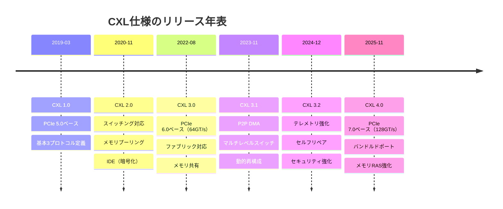

CXLの設計思想において重要なのは、**PCIe の物理層・電気層を完全に共有する**という判断である。これにより、既存のPCIeスロット、コネクタ、ケーブル、リタイマーをそのまま利用でき、半導体ベンダーは同一のSerDesIPでPCIeとCXLの両方をサポートできる。CXLは「PCIeの拡張」ではなく、PCIeの物理インフラ上に構築された**別のプロトコルファミリ**であるという点が、Gen-Z や CCIX といった競合規格との決定的な差異であり、結果的にCXLが業界標準として収束する最大の要因となった。

## 2. CXLプロトコルアーキテクチャ

CXLは3つの独立したサブプロトコルで構成される。これらはPCIeの物理層上で多重化（マルチプレクス）され、同一のリンク上で同時に動作する。

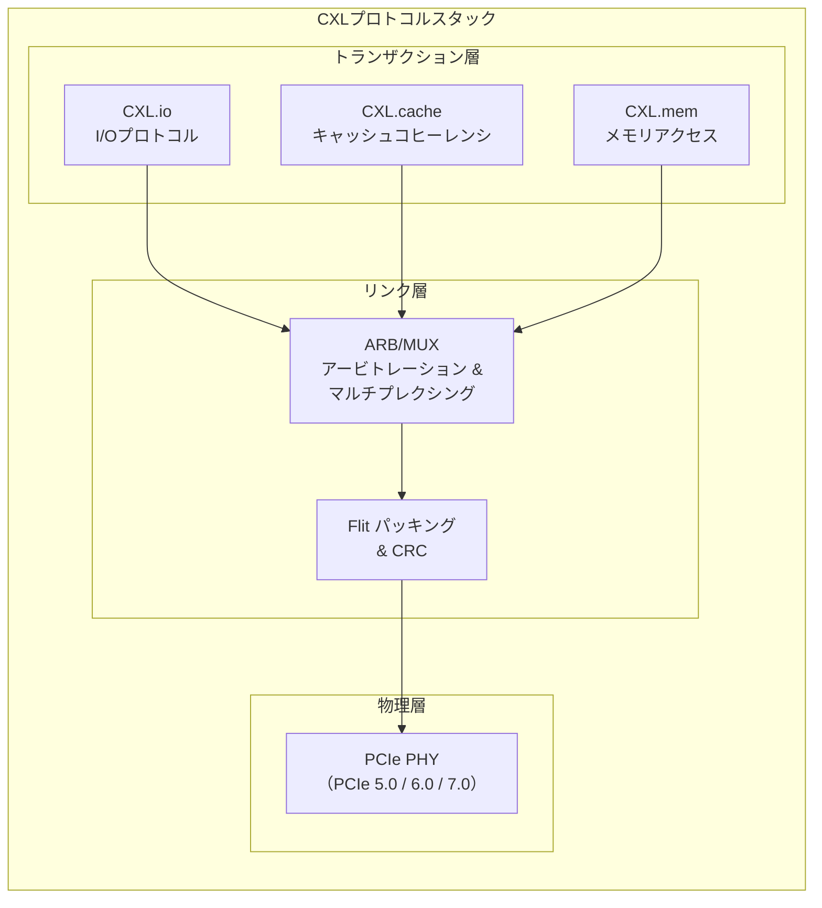

### 2.1 CXL.io — I/Oプロトコル

CXL.io は、PCIe のトランザクション層プロトコル（TLP）と機能的に等価なプロトコルであり、デバイスのディスカバリ、コンフィギュレーション、レジスタアクセス、割り込み、DMA といった基本的な I/O 操作を担う。すべての CXL デバイスは CXL.io をサポートしなければならず、これがデバイスの列挙・初期化のエントリポイントとなる。

CXL.io のセマンティクスは PCIe と同一であるため、既存の PCIe ソフトウェアスタック（ドライバ、BIOS/UEFI の列挙ロジック等）が大部分そのまま適用できる。ただし、物理層で多重化される点において PCIe ネイティブのトランスポートとは異なる。

主な役割は以下のとおりである。

- **デバイス列挙（Enumeration）**: PCIe と同様の Configuration Space を通じた BDF（Bus/Device/Function）ベースのデバイス発見
- **MMIO アクセス**: デバイスレジスタのメモリマップド I/O
- **DMA**: デバイスからホストメモリへの Direct Memory Access
- **割り込み**: MSI/MSI-X による割り込み通知

### 2.2 CXL.cache — キャッシュコヒーレンシプロトコル

CXL.cache は、CXL デバイスがホスト CPU のメインメモリに**キャッシュコヒーレント**にアクセスするためのプロトコルである。デバイスはホストメモリの一部をローカルにキャッシュし、ホスト CPU のキャッシュ階層との間でコヒーレンシが自動的に維持される。

CXL.cache の通信は、3種類の双方向チャネルで構成される。

| 方向 | チャネル | 説明 |
|------|---------|------|
| D2H（Device to Host） | Request | デバイスからホストへのキャッシュライン要求 |
| D2H | Response | デバイスからホストへの応答 |
| D2H | Data | デバイスからホストへのデータ転送 |
| H2D（Host to Device） | Request（Snoop） | ホストからデバイスへのスヌープ要求 |
| H2D | Response | ホストからデバイスへの応答 |
| H2D | Data | ホストからデバイスへのデータ転送 |

CXL.cache のコヒーレンシモデルは**非対称（asymmetric）**である。ホスト CPU がキャッシュのホーム・エージェント（Home Agent）として動作し、システム全体のコヒーレンシを管理する。デバイスはキャッシングエージェントとして振る舞い、ホストのメモリに対するキャッシュリクエストを発行する。この非対称設計により、デバイス側の実装複雑性が大幅に低減される。CPU間のフルメッシュなコヒーレンシプロトコル（MESI、MOESI など）と比較して、CXL.cache ではデバイスはホームエージェントの指示に従うだけでよい。

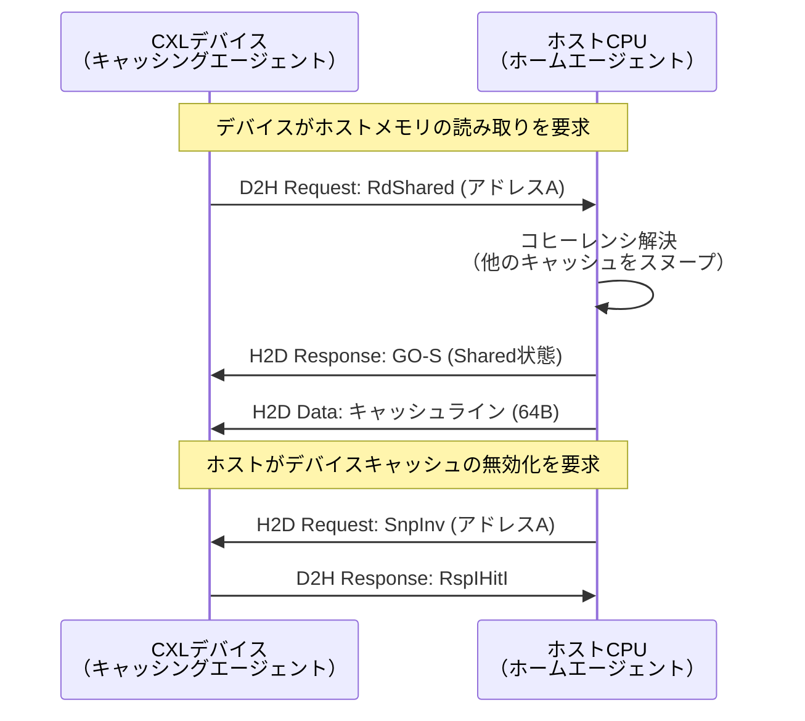

コヒーレンシの粒度は **4KB ページ単位**で設定可能であり、各ページに対して個別にコヒーレンシモードを指定できる。CXL 1.0/1.1 では「ホストバイアス」と「デバイスバイアス」の2つのモードが定義されている。

- **ホストバイアス**: ホスト CPU がそのアドレス範囲を頻繁にアクセスする場合に最適。デバイスからのアクセスにはスヌープが必要
- **デバイスバイアス**: デバイスがそのアドレス範囲を主に使用する場合に最適。ホスト CPU のキャッシュからは排除される

CXL 3.0 ではバイアスモードが廃止され、**拡張コヒーレンシセマンティクス（Enhanced Coherency）**に置き換えられた。これにより、Type 2 および Type 3 デバイスがホスト CPU のキャッシュに対して**バックインバリデーション（back-invalidation）**を発行できるようになり、より柔軟なコヒーレンシ管理が可能となった。

### 2.3 CXL.mem — メモリアクセスプロトコル

CXL.mem は、ホスト CPU がデバイス上のメモリに**キャッシュコヒーレント**にアクセスするためのプロトコルである。CXL.cache が「デバイスからホストメモリへのアクセス」であるのに対し、CXL.mem は「ホストからデバイスメモリへのアクセス」という逆方向の関係にある。

CXL.mem においても、3種類の双方向チャネルが使用される。

| 方向 | チャネル | 説明 |
|------|---------|------|
| M2S（Master to Subordinate） | Request | ホストからデバイスメモリへのリード/ライト要求 |
| M2S | RwD | ホストからデバイスへの書き込みデータ |
| S2M（Subordinate to Master） | NDR | データなし応答 |
| S2M | DRS | データ付き応答（読み取りデータ） |

ここで「Master」はホスト CPU、「Subordinate」は CXL デバイスを指す。ホスト CPU のメモリコントローラが CXL.mem リクエストを発行し、デバイスのメモリコントローラが応答する。

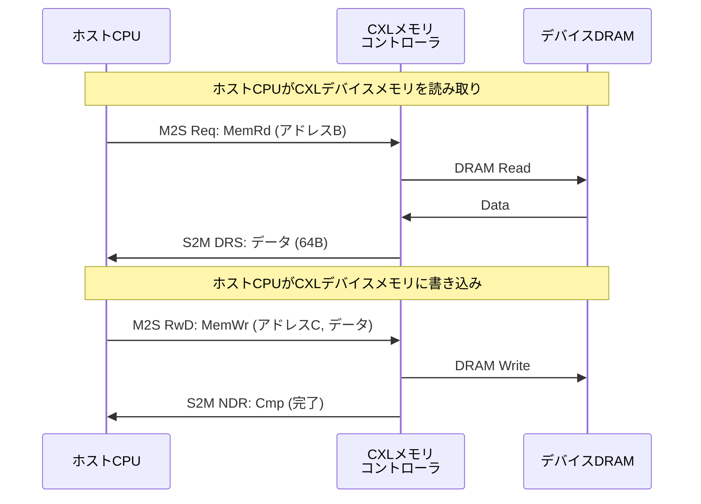

CXL.mem の最大の特徴は、デバイスメモリをホスト CPU のアドレス空間に直接マッピングできることである。これにより、CPU はロード/ストア命令（`mov` 命令等）で CXL デバイスのメモリに直接アクセスでき、従来の DMA や MMIO のようなソフトウェア介在が不要となる。

### 2.4 ARB/MUX — プロトコルの多重化

3つのサブプロトコルは、ARB/MUX（Arbitration and Multiplexing）ブロックによって多重化され、単一のPCIeリンク上で同時に転送される。ARB/MUX は**重み付きラウンドロビン**方式で各プロトコルの送信機会を調停し、重みはホストが設定する。

多重化されたデータは**Flit（Flow Control Unit）**と呼ばれる固定長のパケットに格納されて転送される。

| 世代 | Flitサイズ | 構造 | 転送速度 |
|------|-----------|------|---------|
| CXL 1.0/1.1/2.0 | 68バイト | 2B プロトコルID + 64B ペイロード + 2B CRC | 32 GT/s（PCIe 5.0） |
| CXL 3.0/3.1 | 256バイト | 複数のスロット + CRC + FEC | 64 GT/s（PCIe 6.0、PAM-4） |
| CXL 4.0 | 256バイト | 複数のスロット + CRC + FEC | 128 GT/s（PCIe 7.0） |

68バイト Flit の構造は、4つの16バイトデータスロットと2バイトの CRC から成る。各スロットには CXL.io、CXL.cache、CXL.mem いずれかのプロトコルパケットが格納される。CXL 3.0 で導入された256バイト Flit では、FEC（Forward Error Correction）が追加され、PAM-4 シグナリングに起因するビットエラー率の増加に対処している。

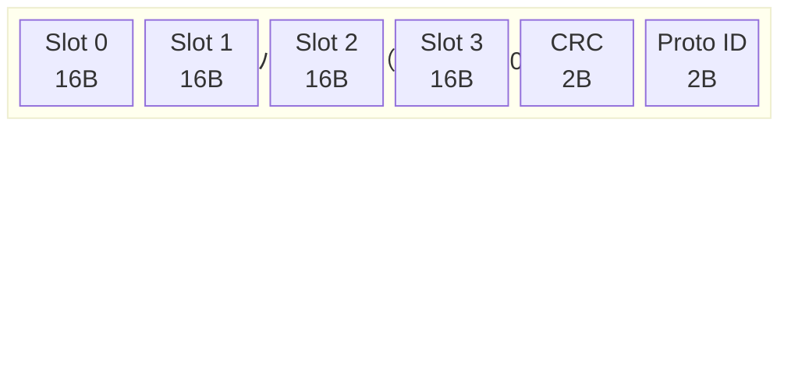

## 3. CXLデバイスタイプ

CXL仕様では、デバイスが使用するサブプロトコルの組み合わせに基づいて、3種類のデバイスタイプを定義している。

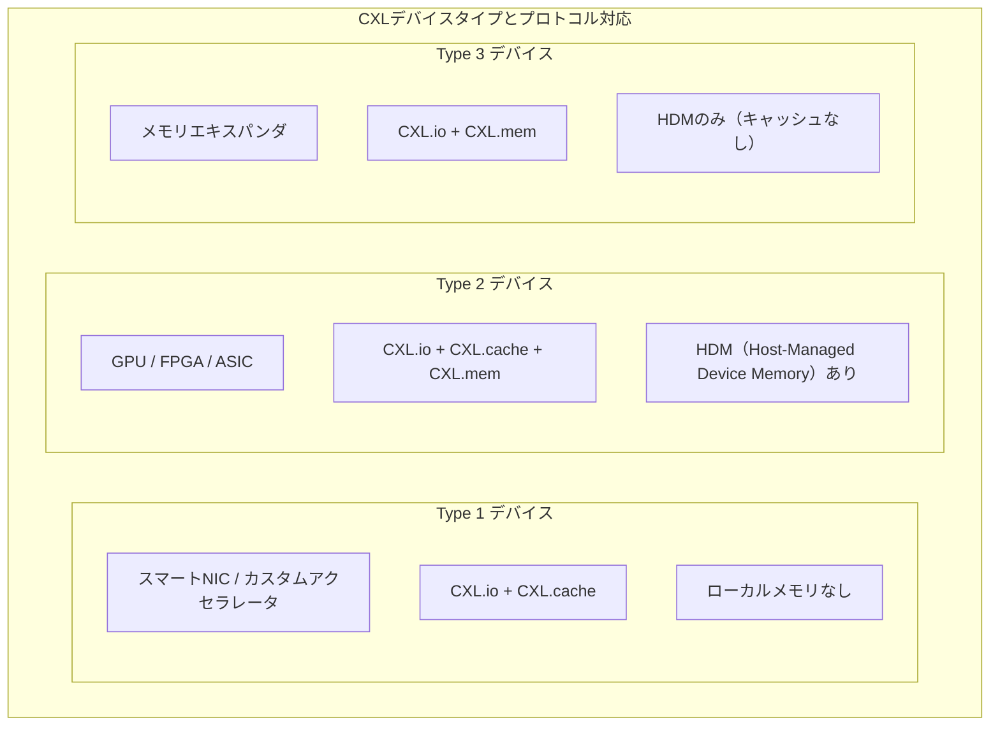

### 3.1 Type 1 デバイス — キャッシュコヒーレントアクセラレータ

Type 1 デバイスは、**ローカルメモリを持たず、ホストメモリにキャッシュコヒーレントにアクセスする**アクセラレータである。CXL.io と CXL.cache の2つのプロトコルを使用する。

代表的なユースケースは、スマートNIC（SmartNIC）やネットワークアクセラレータである。例えば、スマートNIC がホスト CPU のメモリに格納されたパケットバッファに直接アクセスし、パケット処理を行うシナリオがこれにあたる。従来のDMAベースのアプローチでは、デバイスがホストメモリにアクセスするたびにソフトウェアによるバッファ管理と同期が必要だったが、CXL.cache によりハードウェアレベルのコヒーレンシが保証されるため、プログラミングモデルが大幅に簡素化される。

Type 1 デバイスでは、デバイスがホストメモリの一部をローカルキャッシュに保持し、ホスト CPU のキャッシュ階層との間で自動的にコヒーレンシが維持される。デバイス側のキャッシュ状態は MESI プロトコルのサブセットで管理される。

### 3.2 Type 2 デバイス — メモリ付きアクセラレータ

Type 2 デバイスは、**ローカルメモリ（HBM、GDDR 等）を搭載し、かつホストメモリにもキャッシュコヒーレントにアクセスする**アクセラレータである。3つのプロトコルすべて（CXL.io、CXL.cache、CXL.mem）を使用する。

GPU、FPGA、AI推論ASIC などが典型的な Type 2 デバイスである。Type 2 デバイスの特徴は、**双方向のコヒーレンシ**を持つ点にある。

- デバイスは CXL.cache を通じてホストメモリにコヒーレントにアクセスする
- ホスト CPU は CXL.mem を通じてデバイスメモリにコヒーレントにアクセスする

これにより、CPU とアクセラレータが同一のキャッシュコヒーレンスドメインに統合され、共有メモリモデルでの協調動作が可能となる。従来の GPU プログラミングでは、ホストメモリとデバイスメモリ間でデータを明示的にコピーする必要があった（`cudaMemcpy` 等）。Type 2 CXL デバイスでは、CPUとデバイスが同一のアドレス空間を共有するため、このデータコピーのオーバーヘッドが解消される。

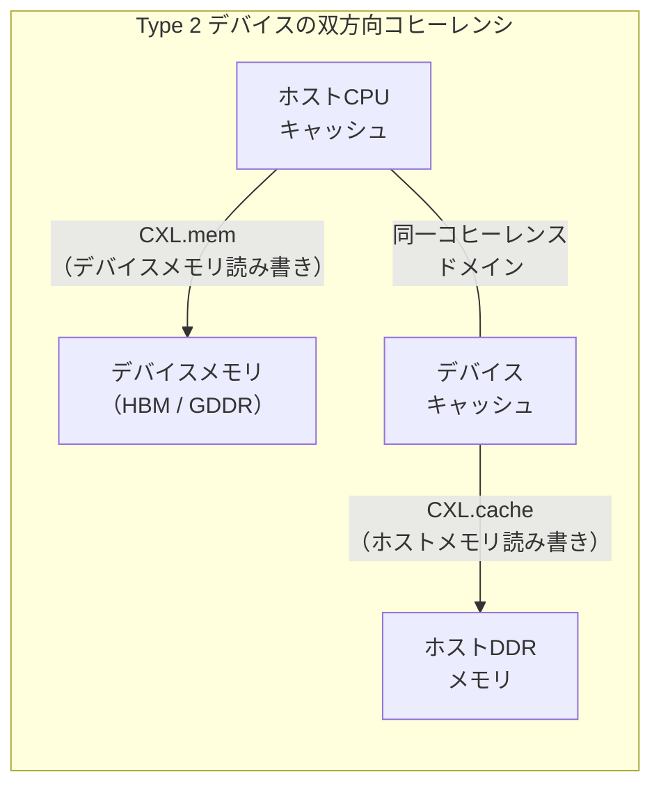

### 3.3 Type 3 デバイス — メモリエキスパンダ

Type 3 デバイスは、**ホスト CPU に追加メモリを提供する**ことを主目的とするデバイスである。CXL.io と CXL.mem の2つのプロトコルを使用し、CXL.cache は使用しない（デバイス側にキャッシュを持たない）。

Type 3 デバイスは CXL のエコシステムにおいて最も注目されているカテゴリであり、メモリ容量のスケーリング問題を直接的に解決する。ホスト CPU から見ると、Type 3 デバイスのメモリは通常の DRAM と同様にロード/ストア命令でアクセス可能な、アドレス空間にマッピングされたメモリとして認識される。

Type 3 デバイスの搭載メモリは**HDM（Host-Managed Device Memory）**と呼ばれる。HDM は以下の2種類に分類される。

- **HDM-H（Host-Only Coherent）**: ホスト CPU のキャッシュ階層のみでコヒーレンシが管理される。デバイスがキャッシュを持たないため、ホスト側のスヌープフィルタだけで十分
- **HDM-D（Device-Managed Coherent）**: デバイス内にメタデータキャッシュを持ち、複数ホストからのアクセスに対するコヒーレンシをデバイス自身が管理する（CXL 2.0 以降のマルチホスト構成で使用）

Type 3 デバイスの代表的な製品例として、Samsung の CMM-D（CXL Memory Module-DRAM）、Micron の CXL メモリモジュール、SK hynix の CXL DRAM などがある。これらは PCIe スロットに装着する DRAM 拡張ボードの形態をとる。

#### Type 3 デバイスのレイテンシ特性

Type 3 CXL メモリのレイテンシは、ローカル DDR に比べて追加のオーバーヘッドが生じる。実測値に基づく典型的なレイテンシ比較は以下のとおりである。

| アクセス先 | 典型的なレイテンシ | ローカルDDR比 |
|-----------|-----------------|-------------|
| ローカル DDR5 | 約80〜140 ns | 1.0x |
| リモートNUMAノード | 約120〜200 ns | 約1.5x |
| CXL Type 3 メモリ | 約170〜350 ns | 約2.0〜2.5x |

CXL メモリの追加レイテンシは主に、CXL コントローラの処理遅延（約50〜100ns）、ARB/MUX のプロトコル変換、リタイマーの信号中継、およびデバイス側メモリコントローラの処理に起因する。ベストケースではローカルメモリの約2倍、テールレイテンシではさらに大きな差が生じ得る。

とはいえ、CXL メモリのレイテンシはSSD（数十μs）やネットワーク越しのRDMA（数μs）と比較すれば桁違いに低く、メモリ階層としては「ローカルDDRに次ぐ第2層」のポジションに位置づけられる。

## 4. メモリプーリングとスイッチング

### 4.1 メモリプーリングの概念

CXL 2.0 で導入された**メモリプーリング**は、CXL のキラーフィーチャーの一つである。メモリプーリングとは、複数の CXL メモリデバイスを CXL スイッチを介して複数のホスト CPU で共有する仕組みである。

従来のサーバアーキテクチャでは、各サーバに搭載されるメモリは物理的にそのサーバのCPUに固定されている。しかし実際のワークロードでは、メモリ使用量は時間帯やタスクによって大きく変動する。あるサーバではメモリが逼迫する一方、別のサーバでは大量のメモリが遊んでいるという状況が日常的に発生する。

メモリプーリングでは、複数の CXL Type 3 メモリデバイスをプールとして管理し、各ホストに動的にメモリ領域を割り当て・解放する。これにより、メモリの利用効率を大幅に向上させることができる。

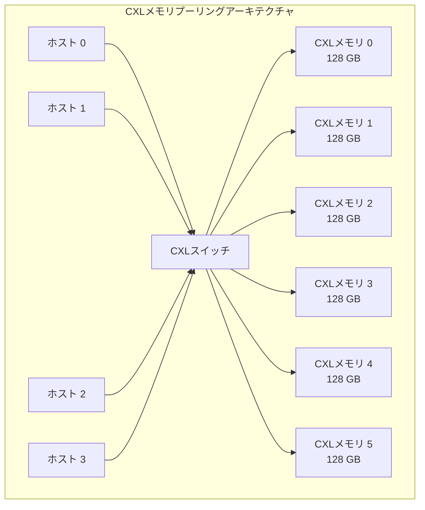

上図の構成では、6台の CXL メモリデバイス（合計768GB）が4台のホストで共有される。ファブリックマネージャが各ホストのメモリ需要に応じて動的にメモリ領域を割り当てるため、すべてのホストが必要な時に必要な量のメモリを使用できる。

### 4.2 CXLスイッチのアーキテクチャ

CXL スイッチは、PCIe スイッチに CXL プロトコルのサポートを追加したものである。CXL スイッチは複数のアップストリームポート（ホスト接続）とダウンストリームポート（デバイス接続）を持ち、CXL.io、CXL.cache、CXL.mem のトラフィックをルーティングする。

CXL 2.0 のスイッチは**シングルレベル**（1段）のスイッチングのみをサポートしていたが、CXL 3.0/3.1 では**マルチレベルスイッチング**が導入され、スイッチ同士の接続（スイッチファブリック）が可能となった。

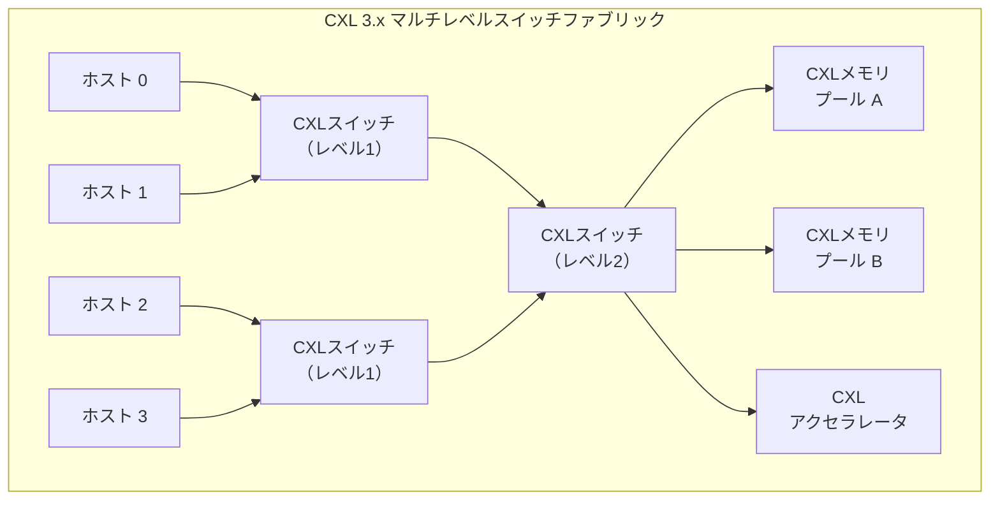

### 4.3 ファブリックマネージャ（FM）

CXL スイッチベースの構成を管理するのが**ファブリックマネージャ（Fabric Manager: FM）**である。FM はシステム構成、リソースの割り当て・解放、および仮想階層（Virtual Hierarchy: VH）の管理を担うソフトウェア/ファームウェアコンポーネントである。

FM の主な機能は以下のとおりである。

- **ポートバインディング**: CXL スイッチ上のポートを特定のホストの仮想階層に論理的にバインドする
- **メモリ割り当て**: プール内の CXL メモリ領域を各ホストに動的に割り当て・解放する
- **障害管理**: デバイスの障害検出とフェイルオーバー
- **テレメトリ収集**: デバイスのパフォーマンスメトリクスの監視

FM は以下の形態で実装される。

- ホスト上で動作するソフトウェア
- BMC（Baseboard Management Controller）内のファームウェア
- CXL スイッチ内蔵のファームウェア
- 専用の管理デバイス

CXL 3.1 以降では、メモリプーリングの再構成が**ホストの再起動なし**で実行可能となり、運用上の柔軟性が大幅に向上した。

### 4.4 メモリプーリングとメモリ共有の違い

CXL 2.0 のメモリプーリングでは、プール内のメモリ領域は一時点において単一のホストに排他的に割り当てられる。つまり、同じメモリ領域を複数のホストが同時にアクセスすることはできない。これは「プーリング」であって「共有」ではない。

CXL 3.0 で導入された**メモリ共有（Memory Sharing）**では、同じメモリ領域を複数のホストが**同時に**キャッシュコヒーレントにアクセスできる。ハードウェアレベルでコヒーレンシが保証されるため、あるホストがデータを更新すると、他のホストは最新のデータを自動的に参照できる。

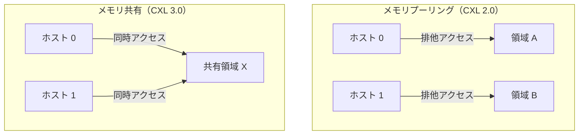

メモリ共有は、分散共有メモリ（DSM）をハードウェアレベルで実現するものであり、分散コンピューティングのプログラミングモデルを根本的に変革する可能性を持つ。従来、ノード間でデータを共有するにはメッセージパッシング（MPI 等）やRDMA を使用する必要があったが、CXL メモリ共有により、通常のロード/ストア命令でノード間のデータ共有が可能となる。

## 5. CXL仕様の進化

### 5.1 CXL 1.0 / 1.1 — 基本プロトコルの確立

CXL 1.0（2019年3月）は、PCIe 5.0 の物理層上に CXL.io、CXL.cache、CXL.mem の3つのプロトコルを定義した最初の仕様である。68バイト Flit、ARB/MUX による多重化、3種類のデバイスタイプという基本アーキテクチャが確立された。

CXL 1.1（2020年6月）は、CXL 1.0 のマイナーアップデートであり、IDE（Integrity and Data Encryption）のフレームワークや DOE（Data Object Exchange）などのセキュリティ機能が追加された。

### 5.2 CXL 2.0 — スイッチングとメモリプーリング

CXL 2.0（2020年11月）は、CXL の実用性を大きく拡張した重要なリリースである。主要な新機能は以下のとおりである。

- **CXL スイッチング**: CXL スイッチを導入し、複数のデバイスを1つのホストに接続、または1つのデバイスを複数のホストに接続可能とした
- **メモリプーリング**: 複数の CXL メモリデバイスをプールとして管理し、動的に割り当て可能
- **IDE（Integrity and Data Encryption）**: リンク上のデータの完全性と暗号化を保証
- **永続メモリサポート**: CXL.mem を通じた不揮発性メモリ（PMEM）のサポート強化

CXL 2.0 により、CXL はポイントツーポイントの接続から**スイッチドファブリック**へと進化し、データセンターレベルのメモリリソース管理が可能となった。

### 5.3 CXL 3.0 — ファブリックとメモリ共有

CXL 3.0（2022年8月）は、PCIe 6.0 の物理層（64 GT/s、PAM-4シグナリング）を採用し、帯域幅を倍増させた画期的なリリースである。

| 特徴 | CXL 2.0 | CXL 3.0 |
|------|---------|---------|
| 物理層 | PCIe 5.0（32 GT/s） | PCIe 6.0（64 GT/s） |
| Flit サイズ | 68バイト | 256バイト |
| 帯域幅（x16） | 128 GB/s | 256 GB/s |
| スイッチング | シングルレベル | マルチレベル |
| メモリモデル | プーリング（排他） | 共有（同時アクセス） |
| コヒーレンシ | バイアスモード | 拡張コヒーレンシ |
| P2P | なし | ピアツーピアDMA |

CXL 3.0 の主要な技術革新を以下に整理する。

**ファブリック対応**: マルチレベルスイッチングにより、ツリー、メッシュ、スパイン/リーフなど非ツリー型トポロジを含むデバイスファブリックの構築が可能となった。1つのCXLルートポートに複数の Type 1、Type 2 デバイスを接続できる。

**メモリ共有**: 前節で説明したように、複数のホストが同一のメモリ領域にキャッシュコヒーレントに同時アクセスする機能が追加された。

**拡張コヒーレンシ**: バイアスモードが廃止され、Type 2/Type 3 デバイスからのバックインバリデーションが可能となった。これにより、デバイスがローカルメモリを変更した際にホスト CPU のキャッシュ内の古いコピーを自動的に無効化できる。

**256バイト Flit**: PAM-4 シグナリングの採用に伴い、FEC を含む256バイトの新しい Flit フォーマットが導入された。標準256B、レイテンシ最適化256B、PBR 256B の3つのモードが定義されている。

### 5.4 CXL 3.1 / 3.2 — 実用性と信頼性の強化

CXL 3.1（2023年11月）は、CXL 3.0 の実用性を高めるアップデートである。

- **ピアツーピア DMA の強化**: 同一コヒーレンシドメイン内のデバイス間で直接データ転送が可能
- **動的再構成**: ホストの再起動なしでメモリプーリングの構成変更が可能
- **マルチレベルスイッチングの拡張**: スイッチファブリックのスケーラビリティ向上

CXL 3.2（2024年12月）は、運用面の成熟を重視したリリースである。リンク速度の向上ではなく、以下のデバイスレベルの機能強化に焦点を当てた。

- **ハードウェア組み込みテレメトリ**: デバイスの状態監視を標準化
- **セルフリペア**: デバイスの自己修復機能
- **細粒度エラーレポーティング**: 訂正済みエラーのより詳細な報告
- **セキュリティプロトコル検証**: IDE の強化

### 5.5 CXL 4.0 — 帯域幅の倍増とスケーラビリティ

CXL 4.0（2025年11月）は、PCIe 7.0 の物理層（128 GT/s）を採用し、帯域幅をさらに倍増させた最新の仕様である。

主要な新機能は以下のとおりである。

- **128 GT/s**: CXL 3.0 の 64 GT/s から倍増。x16リンクで約512 GB/sの帯域幅を実現
- **バンドルドポート（Bundled Ports）**: 複数の物理CXLポートを1つの論理ポートに束ねる機能。Type 1 および Type 2 デバイスで利用可能で、単一デバイスに対してさらに高い帯域幅を提供する。ソフトウェアからは単一のデバイスとして見えるため、ドライバの変更は不要
- **ネイティブ x2 幅**: x2 リンク幅がフルパフォーマンスで最適化（x4〜x16 と同等の効率）
- **リタイマー拡張**: 最大4個のリタイマーをサポートし、リンク到達距離を延伸
- **メモリRAS強化**: 細粒度の訂正済みエラーレポーティング、ホスト主導のポストパッケージリペア（PPR）、より柔軟なメモリスペアリングオプション
- **後方互換性**: CXL 3.x、2.0、1.1、1.0 との完全な後方互換性を維持

## 6. メモリ拡張のユースケース

### 6.1 メモリ容量のスケールアウト

CXL の最も直接的なユースケースは、サーバのメモリ容量拡張である。現代のサーバCPUは一般的に8〜12チャネルの DDR5 メモリをサポートするが、最大搭載量にはCPUソケットあたりの DIMM スロット数という物理的制約がある。

CXL Type 3 メモリエキスパンダを使用すれば、PCIe スロットを通じて追加のメモリ容量を提供できる。例えば、DDR5 で最大 512GB のサーバに対して、CXL メモリエキスパンダを複数台搭載することで、テラバイト級のメモリ空間を実現できる。

::: tip メモリ容量拡張の経済性
CXL メモリエキスパンダによる容量拡張は、DDR DIMM の追加（ソケット数増加が必要な場合）や、より大容量の DIMM への交換と比較して、コスト効率が高い場合がある。特に、DDR5 の高容量モジュール（256GB 以上）は非常に高価であるため、CXL による増設は経済合理性を持つ。
:::

### 6.2 メモリ帯域幅の拡張

CXL メモリは容量だけでなく、帯域幅の拡張にも寄与する。Intel の実測では、CXL メモリ拡張により読み取り専用帯域幅が24%、読み書き混合帯域幅が最大38%向上する事例が報告されている。

これは、CXL メモリが DDR チャネルとは独立した追加の帯域幅を提供するためである。DDR チャネルが飽和するワークロードにおいて、CXL メモリが「メモリ帯域幅のバイパス」として機能する。

### 6.3 AI/ML ワークロード

AI/ML は CXL の恩恵を最も受けるワークロードカテゴリの一つである。

**大規模言語モデル（LLM）の推論**: LLM の推論では、モデルパラメータ全体をメモリに展開する必要がある。例えば、700億パラメータのモデルをFP16で保持するには約140GBのメモリが必要であり、単一サーバの DDR 容量を超えることがある。CXL メモリプーリングにより、複数ホストが100TB超の共有メモリにアクセスでき、巨大モデルの効率的な推論が可能となる。

**学習の効率化**: CXL メモリ拡張により、従来はマルチノードに分散させる必要があった学習構成を単一ノードで実行可能となるケースがある。ノード間通信のオーバーヘッドが排除されるため、学習速度が向上する。

**GPU と CPU の協調**: Type 2 デバイスとしての GPU が CXL で接続されれば、CPU-GPU 間のデータ移動がキャッシュコヒーレントなロード/ストアで実現され、`cudaMemcpy` のような明示的なデータ転送が不要となる。

### 6.4 インメモリデータベース

大規模なインメモリデータベース（SAP HANA、Redis、Memcached など）は、テラバイト級のメモリ容量を要求する。CXL メモリプーリングにより、データベースのバッファプールを柔軟にスケーリングできる。

CXL メモリのレイテンシ特性から、**メモリティアリング**が特に有効である。頻繁にアクセスされるホットデータをローカル DDR に配置し、アクセス頻度の低いウォームデータを CXL メモリに配置することで、コストパフォーマンスの最適化を図る。

### 6.5 HPC・科学計算

高性能計算（HPC）のワークロードでは、大規模なシミュレーションや数値解析において膨大なメモリ容量が必要とされる。CXL メモリプーリングは、計算ノード間で高スループットなメモリ共有を実現し、科学シミュレーションにおけるデータ共有の効率を向上させる。例えば、Pacific Northwest National Laboratory（PNNL）の Crete プロジェクトでは、CXL プールを科学シミュレーションのメモリ共有に活用する研究が進められている。

## 7. データセンターへの影響

### 7.1 メモリの利用効率向上

データセンターにおけるメモリの平均利用率は30〜50%程度とされる。これは、ピーク負荷に備えてメモリを過剰に搭載（オーバープロビジョニング）する必要があるためである。CXL メモリプーリングにより、メモリリソースをデータセンター全体で共有することで、利用効率を大幅に改善できる。

シミュレーションによれば、CXL メモリプーリングはメモリの消費電力を**20〜30%削減**できるとされている。これは、オーバープロビジョニングの削減による DRAM チップ数の減少に起因する。

### 7.2 ディスアグリゲーテッドアーキテクチャ

CXL の究極的なビジョンは、**コンピュートとメモリのディスアグリゲーション（分離）**である。従来のサーバアーキテクチャでは、CPU、メモリ、ストレージが1つの筐体に統合されているが、CXL ファブリックにより、これらのリソースを独立したプールとして管理し、ワークロードに応じて動的に組み合わせる**コンポーザブルインフラストラクチャ**が実現可能となる。

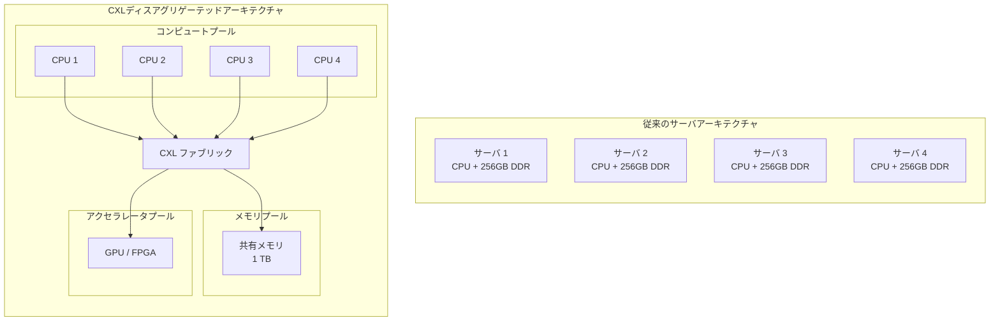

ディスアグリゲーテッドアーキテクチャにより、以下のメリットが得られる。

- **独立したスケーリング**: コンピュートとメモリを独立に増減できる
- **障害ドメインの分離**: メモリ障害がコンピュートノードに波及しない
- **ライフサイクルの分離**: CPU とメモリの更新サイクルを独立に管理できる
- **TCO削減**: リソースの共有により、全体のハードウェアコストを削減

### 7.3 既存インフラとの統合

CXL が PCIe の物理層を共有するという設計判断は、データセンターへの導入障壁を大幅に低減する。既存のサーバの PCIe スロットに CXL デバイスを装着するだけで、段階的にCXLの恩恵を受けることができる。

::: warning 導入に際しての注意点
CXL デバイスを使用するためには、CPU が CXL をサポートしている必要がある。Intel の第4世代 Xeon Scalable（Sapphire Rapids）以降、AMD の第4世代 EPYC（Genoa）以降が CXL 1.1 をサポートしている。CXL 2.0 のスイッチング機能を活用するには、対応する CXL スイッチハードウェアも必要である。
:::

### 7.4 業界の採用状況

2025〜2026年時点での CXL エコシステムの状況は以下のとおりである。

- **CXL 1.1**: 量産出荷が進行中。Samsung、Micron、SK hynix から Type 3 メモリエキスパンダが商用利用可能
- **CXL 2.0**: 量産製品が2025年に登場。スイッチ製品の商用展開が始まっている
- **CXL 3.0/3.1**: PCIe 6.0 ベースの製品は2027年頃の商用化が見込まれる
- **CXL 4.0**: 仕様策定完了（2025年11月）。製品化は2028年以降

## 8. ソフトウェアスタック

### 8.1 Linux カーネルにおける CXL サポート

Linux カーネルは CXL デバイスの包括的なサポートを提供しており、以下のカーネルモジュールが存在する。

| モジュール | 役割 |
|-----------|------|
| `cxl_core` | CXL サブシステムのコアフレームワーク |
| `cxl_pci` | PCIe バス上の CXL デバイスのプローブと初期化 |
| `cxl_acpi` | ACPI テーブルからの CXL トポロジ情報の解析 |
| `cxl_port` | CXL ポート（ルートポート、スイッチポート）の管理 |
| `cxl_mem` | CXL.mem プロトコルのエンドポイントドライバ |
| `cxl_pmem` | CXL 永続メモリのサポート |
| `cxl_pmu` | CXL Performance Monitoring Unit のドライバ |
| `dax_cxl` | CXL メモリの DAX（Direct Access）サポート |

CXL メモリは Linux カーネルにおいて **NUMA ノード**として認識される。つまり、CXL メモリは通常の DDR メモリとは異なる NUMA ノードに配置され、カーネルのNUMAメモリ管理機構がそのまま適用される。

```
# CXL メモリの NUMA ノード確認
$ numactl -H
available: 3 nodes (0-2)
node 0 cpus: 0-15
node 0 size: 65536 MB
node 1 cpus: 16-31
node 1 size: 65536 MB
node 2 cpus:
node 2 size: 131072 MB   ← CXL メモリ（CPUなし）
```

上記の例では、node 2 が CXL メモリに対応するNUMAノードであり、CPUコアは紐づいていない。

### 8.2 メモリティアリング

CXL メモリの最も実用的なソフトウェア活用方法の一つが**メモリティアリング**である。ローカル DDR を高速な「Tier 0」、CXL メモリを低速だが大容量の「Tier 1」として階層化し、アクセス頻度に応じてページを自動的に配置する。

Linux カーネルは **TPP（Transparent Page Placement）** 機能により、メモリティアリングをサポートしている。TPP は以下のように動作する。

1. 新規ページはまずローカル DDR（Tier 0）に配置される
2. ローカル DDR がメモリプレッシャーを受けると、アクセス頻度の低いページが CXL メモリ（Tier 1）にデモートされる
3. CXL メモリ上のページが頻繁にアクセスされると、ローカル DDR にプロモートされる

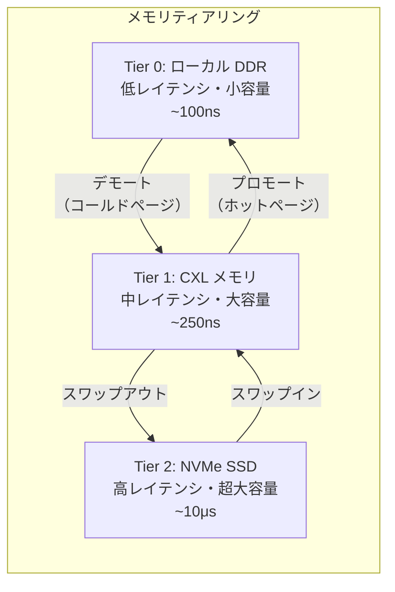

メモリティアリングの有効性は、ワークロードのメモリアクセスパターンに強く依存する。多くの実用的なワークロードでは、メモリアクセスに**ホットスポット**が存在し（全メモリの20%が全アクセスの80%を占めるといったパレートの法則に従う）、ティアリングの恩恵を受けやすい。

### 8.3 SMDK（Samsung Memory Development Kit）

Samsung は CXL メモリの活用を促進するため、**SMDK**（Samsung Memory Development Kit）というフルスタックのソフトウェア開発ツールを提供している。SMDK は以下のコンポーネントで構成される。

- **カーネルモジュール**: CXL メモリのヘテロジニアスメモリプール管理
- **ユーザスペースライブラリ**: アプリケーションからのCXLメモリ割り当て API
- **ティアリングデーモン**: ページのアクセス頻度に基づく自動ティアリング
- **ベンチマークツール**: メモリ性能測定ユーティリティ

### 8.4 アプリケーションレベルの対応

CXL メモリは基本的にカーネルの NUMA 管理機構を通じて透過的に利用可能であるが、性能を最大限に引き出すにはアプリケーションレベルでの意識的なメモリ配置が有効である。

- **`numactl`** によるプロセスのメモリ配置ポリシー指定
- **`mbind()`** / **`set_mempolicy()`** システムコールによるプログラマティックなメモリ配置
- **`mmap()` + DAX** による CXL メモリの直接マッピング
- **`memkind`** ライブラリによるヘテロジニアスメモリの抽象化

```c
#include <numaif.h>
#include <numa.h>

void allocate_on_cxl_memory() {
    int cxl_node = 2;  // CXL memory NUMA node

    // Allocate memory explicitly on the CXL NUMA node
    void *ptr = numa_alloc_onnode(1UL << 30, cxl_node);  // 1GB on CXL

    if (ptr == NULL) {
        // Handle allocation failure
        return;
    }

    // Use the CXL memory like regular memory
    memset(ptr, 0, 1UL << 30);

    numa_free(ptr, 1UL << 30);
}
```

## 9. CXLの将来

### 9.1 メモリセントリックアーキテクチャへの転換

CXL の長期的なビジョンは、コンピューティングアーキテクチャの根本的な転換——**コンピュートセントリック**から**メモリセントリック**への移行——を実現することにある。

従来のアーキテクチャでは、CPUを中心にメモリやストレージが配置され、データはCPUのもとへ移動させて処理される。しかし、データ量の爆発的増大により、大量のデータを CPU に移動するコストが無視できなくなっている。メモリセントリックアーキテクチャでは、大規模な共有メモリプールを中心に配置し、コンピュートリソースが必要に応じてメモリにアクセスする。CXL ファブリックはこの転換を実現するためのインフラストラクチャとなる。

### 9.2 CXL over Optical

現在の CXL は銅線（電気的）インターコネクトを前提としているが、データセンターの規模拡大に伴い、光インターコネクトとの統合が研究されている。光ファイバーを用いることで、CXL ファブリックのリーチをラック間、さらにはデータセンター棟間にまで拡張できる可能性がある。

CXL 4.0 で最大4個のリタイマーがサポートされたことは、リンク到達距離の延伸に向けた段階的なステップといえる。将来的には、シリコンフォトニクスを活用した CXL リンクにより、数十メートルから数百メートルの距離でもナノ秒オーダーのメモリアクセスが可能となることが期待されている。

### 9.3 プロセッシング・イン・メモリ（PIM）との融合

CXL メモリデバイスに演算機能を組み込む**PIM（Processing-in-Memory）**との融合も将来の方向性の一つである。Type 3 メモリエキスパンダに簡単な演算ユニットを搭載し、データの前処理やフィルタリングをメモリデバイス側で行うことで、CXL リンクを流れるデータ量を削減し、全体的なシステム性能を向上させるアプローチである。

### 9.4 セキュリティとテナント分離

データセンターにおけるマルチテナント環境では、CXL メモリプール上のテナント間データ分離が重要な課題となる。CXL の IDE（Integrity and Data Encryption）は、リンクレベルの暗号化を提供するが、メモリプール内でのテナント分離にはさらなるメカニズムが必要である。

将来的には、CXL デバイス内でのメモリ領域のハードウェア的な分離、暗号化されたメモリ領域のサポート、およびコンフィデンシャルコンピューティングとの統合が進展すると見込まれる。

### 9.5 標準化の展望と競合技術

CXL は、かつて競合していた Gen-Z、CCIX、OpenCAPI といったキャッシュコヒーレントインターコネクト規格を事実上統合し、業界標準の地位を確立した。Gen-Z コンソーシアムは CXL コンソーシアムに合流し、CCIX も実質的に CXL へ移行している。

この統合の原動力は、CXL が PCIe の物理層をそのまま利用するという設計判断にある。PCIe のエコシステム——SerDes IP、リタイマー、コネクタ、テスト機器——をそのまま活用できるため、半導体ベンダーにとっての採用コストが圧倒的に低い。

今後、CXL の仕様策定は PCIe の世代更新と同期して進むと見られる。PCIe 8.0（256 GT/s）に対応する CXL 5.0 の策定も将来的に想定されており、インターコネクトの帯域幅はムーアの法則に代わるスケーリングドライバとして機能し続けるだろう。

### 9.6 課題と現実的な制約

CXL の将来は明るいが、いくつかの現実的な課題も認識しておく必要がある。

- **レイテンシのオーバーヘッド**: CXL メモリのレイテンシはローカル DDR の約2〜2.5倍であり、レイテンシに敏感なワークロードでは性能影響が無視できない。ティアリング戦略の最適化が重要
- **ソフトウェアエコシステムの成熟度**: CXL メモリを最大限に活用するためのソフトウェアスタック（ティアリングポリシー、メモリ管理アルゴリズム、アプリケーション対応）はまだ発展途上
- **テールレイテンシ**: 実測データでは、CXL メモリはローカルメモリに比べてテールレイテンシの変動が大きいことが報告されている。リアルタイム性の高いワークロードでは注意が必要
- **コスト構造**: CXL メモリデバイスには DRAM に加えて CXL コントローラが必要であり、ギガバイトあたりの単価は同容量の DDR DIMM より割高になり得る。経済合理性はメモリ容量の規模とワークロード特性に依存する

## まとめ

CXL は、PCIe の物理層を基盤として、キャッシュコヒーレントなメモリアクセスを実現するインターコネクト規格である。CXL.io、CXL.cache、CXL.mem の3プロトコルにより、I/O、キャッシュコヒーレンシ、メモリアクセスの各機能を統合的に提供する。Type 1/2/3 の3種類のデバイスタイプにより、キャッシュコヒーレントなアクセラレータからメモリエキスパンダまで、多様なデバイスカテゴリをサポートする。

CXL 2.0 で導入されたメモリプーリングとスイッチング、CXL 3.0 のファブリックとメモリ共有、そして CXL 4.0 の帯域幅倍増により、CXL はポイントツーポイントの接続からデータセンターレベルのメモリファブリックへと進化してきた。

データセンターにおいて、CXL はメモリの利用効率向上、コンピュートとメモリのディスアグリゲーション、AI/HPC ワークロードへのメモリ拡張という、現代のコンピューティング課題に対する根本的な解決策を提供する。PCIe の物理層を共有するという設計判断により、既存インフラとの互換性を保ちながら段階的な導入が可能であり、この点が CXL を競合規格から差別化し、業界標準へと押し上げた最大の要因である。
