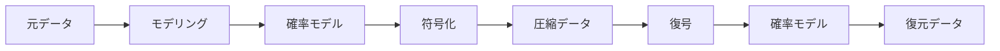
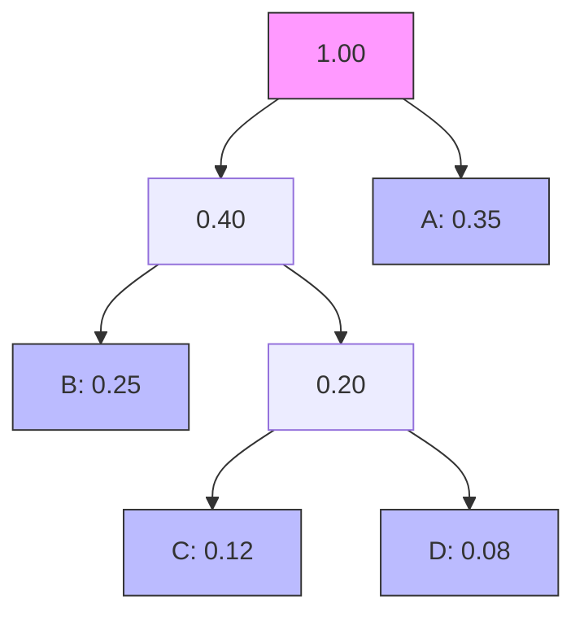
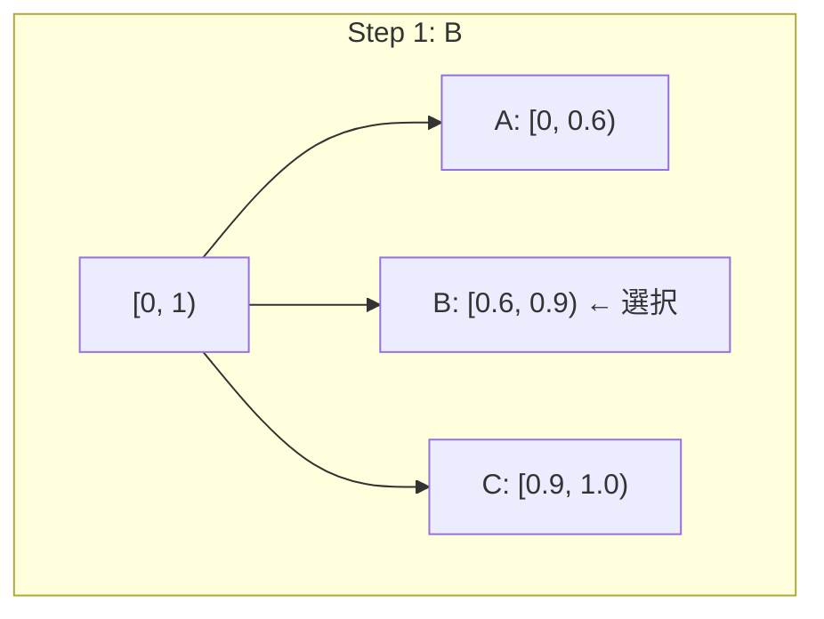
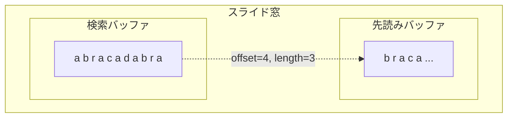
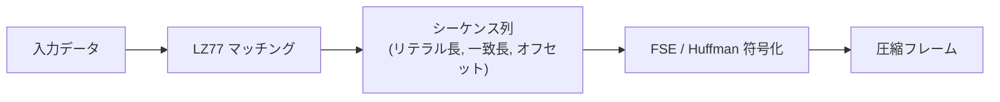
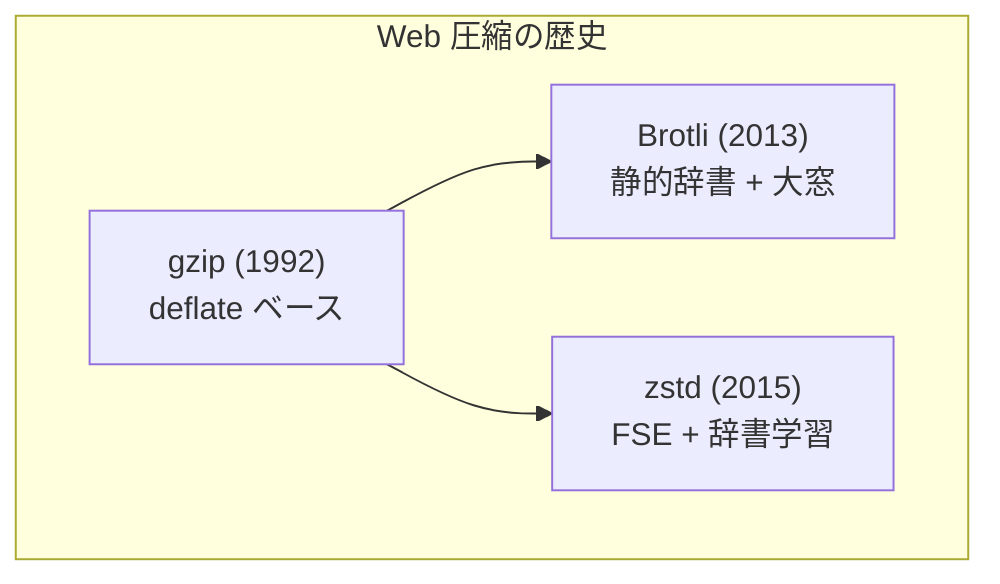
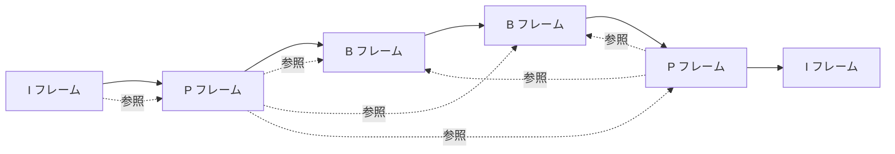

# データ圧縮 — 情報理論からzstdまで

データ圧縮は、コンピューターサイエンスのなかでも最も実用的かつ理論的に深い分野のひとつである。ストレージの節約、ネットワーク帯域の効率化、そしてシステム全体のスループット向上に直結するこの技術は、1940 年代の情報理論に端を発し、現代では HTTP 通信、ファイルシステム、データベース、機械学習モデルの配信に至るまで、あらゆる場面で活用されている。

本記事では、情報理論の基礎から始めて、Huffman 符号、算術符号、LZ ファミリー、deflate、Zstandard（zstd）、Brotli といった可逆圧縮アルゴリズムを体系的に解説し、さらに非可逆圧縮の概要と実用上の選択基準にまで踏み込む。

---

## 1. 情報理論とエントロピー

### 1.1 Shannon のエントロピー

データ圧縮の理論的限界を理解するためには、Claude Shannon が 1948 年の論文 *"A Mathematical Theory of Communication"* で提示した**情報エントロピー**の概念を避けて通れない。

離散的な情報源 $X$ が $n$ 個のシンボル $\{x_1, x_2, \dots, x_n\}$ を確率 $\{p_1, p_2, \dots, p_n\}$ で出力するとき、そのエントロピー $H(X)$ は次のように定義される：

$$
H(X) = -\sum_{i=1}^{n} p_i \log_2 p_i
$$

エントロピーの単位はビット（bit）であり、これは**情報源の各シンボルを符号化するのに最低限必要な平均ビット数**を表す。たとえば、公平なコインの表裏は $H = -2 \times \frac{1}{2} \log_2 \frac{1}{2} = 1$ ビットとなる。一方、表が 99% 出る偏ったコインであれば $H \approx 0.081$ ビットであり、ほとんど情報を伝えないため、はるかに少ないビットで符号化できる。

### 1.2 Shannon の情報源符号化定理

Shannon は、**いかなる可逆圧縮アルゴリズムも、平均符号長をエントロピー未満にすることはできない**ことを証明した。すなわち、平均符号長 $\bar{L}$ について以下が成り立つ：

$$
\bar{L} \geq H(X)
$$

この定理は圧縮の理論的限界を定め、圧縮アルゴリズムの性能を評価するベンチマークとなっている。エントロピーに近い平均符号長を達成するアルゴリズムほど「効率的」であるといえる。

### 1.3 冗長性とモデリング

実際のデータには**冗長性**（redundancy）が存在する。冗長性とは、データが持つ情報量に比べて余分に使われているビット数のことである。圧縮アルゴリズムの本質的な仕事は、この冗長性を除去することにほかならない。

冗長性の除去は大きく 2 つのステップに分けられる：

1. **モデリング**：データの統計的構造（出現頻度、繰り返しパターン、文脈依存性など）を捉える
2. **符号化**：モデルに基づいて、頻出するパターンに短い符号を、稀なパターンに長い符号を割り当てる

この分離は、圧縮アルゴリズムの設計において重要な原理である。



---

## 2. ハフマン符号化

### 2.1 歴史と基本原理

1952 年、MIT の大学院生であった David Huffman は、授業の課題として最適な接頭辞符号を構築するアルゴリズムを考案した。この**ハフマン符号**（Huffman coding）は、各シンボルの出現確率に基づいて可変長の符号語を割り当てる方式で、接頭辞符号のなかで最適（平均符号長が最小）であることが証明されている。

接頭辞符号（prefix code）とは、どの符号語も他の符号語の接頭辞になっていない符号体系のことである。これにより、符号語の区切りを示す特別な記号なしに、一意に復号できる。

### 2.2 ハフマン木の構築

ハフマン符号の構築は、貪欲法（greedy algorithm）に基づく以下の手順で行われる：

1. 各シンボルを出現確率とともにリーフノードとして用意する
2. 最も確率の低い 2 つのノードを選び、それらを子とする新しい内部ノードを作る。新ノードの確率は子の確率の和とする
3. 手順 2 を、ノードが 1 つになるまで繰り返す
4. 根から各リーフへのパスにおいて、左の枝に 0、右の枝に 1 を割り当てる

具体例として、シンボル集合 $\{A, B, C, D, E\}$ が確率 $\{0.35, 0.25, 0.20, 0.12, 0.08\}$ で出現する場合を考える。



::: tip 注意
上図は簡略化した例である。実際の構築過程では、優先度キュー（最小ヒープ）を用いて効率的に最小確率のノードを取り出す。計算量は $O(n \log n)$ である。
:::

この例での符号割り当ては以下のようになる：

| シンボル | 確率 | 符号語 | ビット長 |
|---------|------|--------|---------|
| A | 0.35 | `0` | 1 |
| B | 0.25 | `10` | 2 |
| C | 0.20 | `110` | 3 |
| D | 0.12 | `1110` | 4 |
| E | 0.08 | `1111` | 4 |

平均符号長は：

$$
\bar{L} = 0.35 \times 1 + 0.25 \times 2 + 0.20 \times 3 + 0.12 \times 4 + 0.08 \times 4 = 2.25 \text{ bits}
$$

一方、エントロピーは：

$$
H \approx 2.13 \text{ bits}
$$

このように、ハフマン符号はエントロピーに近い平均符号長を達成するが、各シンボルに整数ビット長の符号語を割り当てるため、エントロピーぴったりにはならない。

### 2.3 ハフマン符号の限界

ハフマン符号にはいくつかの制約がある：

- **整数ビット制約**：確率 0.9 のシンボルのエントロピーは約 0.15 ビットだが、ハフマン符号では最低でも 1 ビットの符号語が必要である。このギャップは確率が極端に偏った場合に顕著になる
- **静的モデル**：基本的なハフマン符号は、事前にシンボルの出現確率が分かっている必要がある。適応型ハフマン符号（adaptive Huffman coding）はこの制約を緩和するが、実装が複雑になる
- **シンボル単位の独立性仮定**：シンボル間の相関（文脈依存性）を直接的には利用しない

---

## 3. 算術符号化

### 3.1 整数ビット制約の克服

ハフマン符号の整数ビット制約を克服するために開発されたのが**算術符号化**（arithmetic coding）である。算術符号化は、メッセージ全体を $[0, 1)$ 区間上の単一の実数として表現する。

### 3.2 符号化の手順

算術符号化の基本的な手順は以下の通りである：

1. 初期区間を $[0, 1)$ とする
2. 各シンボルの出現確率に基づいて、現在の区間をシンボルごとに分割する
3. 入力シンボルに対応する部分区間を新たな現在の区間とする
4. 手順 2–3 をすべてのシンボルについて繰り返す
5. 最終的な区間内の任意の数値を符号として出力する

具体例として、シンボル $\{A, B, C\}$ が確率 $\{0.6, 0.3, 0.1\}$ で出現する情報源からのメッセージ `BAC` を符号化する場合を考える。



| ステップ | シンボル | 区間 |
|---------|---------|------|
| 初期 | — | $[0, 1)$ |
| 1 | B | $[0.6, 0.9)$ |
| 2 | A | $[0.6, 0.78)$ |
| 3 | C | $[0.762, 0.78)$ |

最終区間 $[0.762, 0.78)$ 内の任意の値（例：$0.77$）を出力すれば、復号側は同じ確率モデルを持っていれば元のメッセージを復元できる。

### 3.3 実装上の工夫

理論的には無限精度の実数演算が必要だが、実用上は以下の工夫で有限精度の整数演算に落とし込む：

- **区間の正規化**（renormalization）：区間が狭くなりすぎる前に、上位ビットが確定した段階で出力し、区間をスケーリングする
- **キャリー処理**：桁上がりの伝播に対応する

算術符号化はハフマン符号よりもエントロピーに近い圧縮率を達成できるが、特許の問題（かつて IBM 等が保有）や計算コストの面から、長らく実用化が遅れた。現在では特許が失効し、**ANS**（Asymmetric Numeral Systems）という代替手法も登場している。

### 3.4 ANS（Asymmetric Numeral Systems）

2009 年に Jarosław Duda が提案した ANS は、算術符号化に匹敵する圧縮率を、ハフマン符号並みの速度で実現する手法である。特に **rANS**（range ANS）と **tANS**（table ANS）の 2 つの変種が広く使われている。

ANS の基本的なアイデアは、整数状態 $s$ とシンボル $x$ から新しい状態 $s'$ への写像を定義することである。符号化は状態の更新として行われ、復号は逆写像で実現される。Zstandard や LZFSE（Apple）など、現代の圧縮アルゴリズムの多くが ANS を内部の符号化器として採用している。

---

## 4. LZ77 / LZ78 とスライド窓

### 4.1 辞書ベース圧縮の発想

ここまで述べてきたハフマン符号や算術符号は、個々のシンボルの出現確率に基づく**統計的符号化**であった。これに対し、1977 年に Abraham Lempel と Jacob Ziv が提案した **LZ77** は、データ中の繰り返しパターンを辞書として利用する**辞書ベース圧縮**の先駆けである。

辞書ベース圧縮の核心は、「過去に出現した文字列への参照」によって繰り返しを排除するという発想にある。

### 4.2 LZ77 のアルゴリズム

LZ77 は**スライド窓**（sliding window）を用いる。データストリームを処理する際、直近の $W$ バイト（典型的には 32KB）を「検索バッファ」として保持し、これから符号化するデータを「先読みバッファ」に置く。

符号化は以下のように行われる：

1. 先読みバッファの先頭から始まる文字列と一致する、検索バッファ内の最長一致を探す
2. 一致が見つかった場合、`(offset, length, next_char)` の三つ組を出力する
   - `offset`：一致位置までの距離（何バイト前か）
   - `length`：一致長
   - `next_char`：一致の直後の文字
3. 一致が見つからない場合、`(0, 0, current_char)` を出力する



例として、文字列 `abracadabra` を LZ77 で符号化する：

| 位置 | 検索バッファ | 先読み | 一致 | 出力 |
|------|------------|--------|------|------|
| 0 | （空） | abracadabra | なし | (0, 0, 'a') |
| 1 | a | bracadabra | なし | (0, 0, 'b') |
| 2 | ab | racadabra | なし | (0, 0, 'r') |
| 3 | abr | acadabra | 'a' @ offset 3 | (3, 1, 'c') |
| 5 | abrac | adabra | 'a' @ offset 2 | (2, 1, 'd') |
| 7 | abracad | abra | 'abra' @ offset 7 | (7, 4, EOF) |

### 4.3 LZ78 と LZW

1978 年に Lempel と Ziv が発表した **LZ78** は、スライド窓の代わりに明示的な辞書を構築する方式である。入力を処理しながら辞書にエントリを追加していく。

**LZW**（Lempel-Ziv-Welch, 1984）は LZ78 の改良版で、Terry Welch が考案した。LZW は GIF 画像フォーマットや Unix の `compress` コマンドで採用された。LZW のアルゴリズムは以下の通りである：

1. 初期辞書にすべての単一文字を登録する
2. 入力を読み進め、辞書に存在する最長の一致文字列 $w$ を見つける
3. $w$ の辞書インデックスを出力する
4. $w$ + 次の文字を新しい辞書エントリとして追加する
5. 手順 2 に戻る

LZW はかつて特許（Unisys）で保護されていたため、特許問題を回避するために PNG や gzip では LZ77 ベースの方式が採用された。この特許は 2003〜2004 年に失効している。

### 4.4 LZ ファミリーの位置づけ

LZ77 と LZ78 はどちらも**ユニバーサル圧縮**アルゴリズムである。すなわち、データの統計的性質を事前に知らなくても、十分に長いデータに対しては漸近的にエントロピーに近づく圧縮率を達成できる。これは理論的に非常に重要な性質である。

実用上、LZ77 系のアルゴリズム（deflate, LZ4, Zstandard, Snappy など）が LZ78 系よりも広く使われている。その理由は、LZ77 の方がメモリ効率がよく、後段の符号化器（ハフマンや ANS）と組み合わせやすいからである。

---

## 5. deflate（gzip, zlib）

### 5.1 deflate の設計

**deflate** は 1993 年に Phil Katz が PKZIP のために設計した圧縮アルゴリズムで、LZ77 とハフマン符号を組み合わせている。RFC 1951 で標準化されており、gzip（RFC 1952）、zlib（RFC 1950）、ZIP、PNG などで広く使われている。

deflate の処理フローは以下の通りである：


1. **LZ77 段階**：入力データをスライド窓（最大 32KB）内で最長一致を探し、リテラルバイトまたは（長さ, 距離）ペアの列に変換する
2. **ハフマン符号化段階**：リテラルと長さを 1 つのハフマン木で、距離を別のハフマン木で符号化する

### 5.2 ブロック構造

deflate ストリームは複数の**ブロック**から構成される。各ブロックは以下の 3 種類のいずれかである：

- **Type 0（無圧縮）**：データをそのまま格納する。すでに圧縮されたデータに対して有効
- **Type 1（固定ハフマン）**：事前に定義された固定のハフマン表を使用する。小さなデータに有効
- **Type 2（動的ハフマン）**：ブロック内のデータから最適なハフマン表を生成し、表自体も圧縮して格納する。通常のデータに最も有効

動的ハフマンブロックでは、ハフマン表のコード長をさらにランレングス符号化し、そのコード長自体をもう一段のハフマン符号で圧縮するという、多段的な手法が用いられている。

### 5.3 gzip と zlib

**gzip** は deflate にヘッダー（ファイル名、タイムスタンプ、OS 情報など）と CRC-32 チェックサムを付加したファイルフォーマットである。HTTP の `Content-Encoding: gzip` として Web 圧縮の標準となっている。

**zlib** は deflate にコンパクトなヘッダーと Adler-32 チェックサムを付加したストリームフォーマットである。PNG 画像の内部圧縮やネットワークプロトコルで使われている。

### 5.4 deflate の性能特性

deflate は 1990 年代の設計であるため、現代のハードウェア特性には最適化されていない部分がある：

- **圧縮率**：中程度。テキストデータで約 60〜70% の圧縮率（元のサイズの 30〜40%）
- **圧縮速度**：zlib の最速設定（level 1）でも、現代の高速圧縮アルゴリズム（LZ4, Snappy）には及ばない
- **展開速度**：比較的高速だが、Zstandard や LZ4 には劣る
- **互換性**：事実上の業界標準であり、ほぼすべてのプラットフォームで利用可能

---

## 6. Zstandard（zstd）の設計

### 6.1 背景と動機

**Zstandard**（zstd）は、Facebook（現 Meta）の Yann Collet が 2015 年に開発した圧縮アルゴリズムである。Collet は以前に **LZ4**（超高速だが圧縮率は低い）を開発しており、zstd はその経験を踏まえて「deflate を置き換える」という明確な目標のもとに設計された。

zstd が解決しようとした課題は以下の通りである：

- deflate よりも高い圧縮率を、同等以上の速度で実現する
- 圧縮レベルの幅を広げ、LZ4 並みの高速モードから LZMA 並みの高圧縮モードまでカバーする
- 辞書ベース圧縮のネイティブサポートにより、小さなデータの圧縮を効率化する
- マルチスレッド圧縮の容易な実装を可能にする

### 6.2 アーキテクチャ

zstd のアーキテクチャは以下の 3 段構成である：



1. **LZ77 マッチング**：高速なハッシュチェーンやバイナリツリーを用いて一致を検索する。圧縮レベルに応じて検索の深さと戦略を変える
2. **シーケンス表現**：一致結果を `(literal_length, match_length, offset)` のシーケンスとして表現する
3. **エントロピー符号化**：リテラルデータにはハフマン符号を、シーケンスのパラメータには **FSE**（Finite State Entropy、tANS の実装）を使用する

### 6.3 FSE（Finite State Entropy）

FSE は zstd の核心技術のひとつであり、tANS（table-based Asymmetric Numeral Systems）の具体的な実装である。FSE の特徴は以下の通りである：

- **テーブル駆動**：符号化・復号ともに状態遷移テーブルの参照のみで行えるため、分岐予測ミスが少なく、現代の CPU パイプラインに適している
- **ほぼ最適な圧縮率**：算術符号化に匹敵する圧縮率を達成する
- **高速な処理**：ハフマン符号と同等かそれ以上の速度で動作する

FSE の動作原理を概念的に説明すると、状態 $s$ とシンボル $x$ から次の状態 $s'$ への遷移を、事前に構築したテーブルで一意に定義する。符号化時にはこのテーブルを正方向に辿り、状態のビット表現から圧縮データを生成する。復号時には逆方向に辿る。

### 6.4 辞書圧縮

zstd の大きな特徴のひとつが、**辞書圧縮**（dictionary compression）のネイティブサポートである。小さなデータ（数百バイト〜数 KB）を圧縮する場合、LZ77 のスライド窓が十分に埋まらないため圧縮率が著しく低下する。

zstd の辞書圧縮では、事前にサンプルデータから辞書を学習しておき、圧縮時にその辞書をスライド窓の初期内容として設定する。これにより、小さなデータでも高い圧縮率を達成できる。

```bash
# Train a dictionary from sample data
zstd --train samples/* -o dictionary.dict

# Compress with dictionary
zstd -D dictionary.dict input.json -o output.zst

# Decompress with dictionary
zstd -d -D dictionary.dict output.zst -o input.json
```

辞書圧縮は、JSON API レスポンス、ログメッセージ、データベースのページなど、構造が類似した小さなデータの圧縮に特に有効である。

### 6.5 フレームフォーマット

zstd のフレームフォーマットは以下の構造を持つ：

```
┌─────────────────────────────────────────────────┐
│  Magic Number (4 bytes): 0xFD2FB528              │
├─────────────────────────────────────────────────┤
│  Frame Header                                    │
│  ├── Frame_Header_Descriptor (1 byte)            │
│  ├── Window_Descriptor (0-1 bytes)               │
│  ├── Dictionary_ID (0-4 bytes)                   │
│  └── Frame_Content_Size (0-8 bytes)              │
├─────────────────────────────────────────────────┤
│  Data Block 1                                    │
│  ├── Block_Header (3 bytes)                      │
│  └── Block_Data                                  │
├─────────────────────────────────────────────────┤
│  Data Block 2                                    │
│  ├── Block_Header (3 bytes)                      │
│  └── Block_Data                                  │
├─────────────────────────────────────────────────┤
│  ...                                             │
├─────────────────────────────────────────────────┤
│  Content Checksum (0 or 4 bytes, xxHash-64)      │
└─────────────────────────────────────────────────┘
```

フレームヘッダーにコンテンツサイズを含められるため、展開側は事前にバッファを割り当てることができ、展開速度の向上に寄与する。

### 6.6 圧縮レベルと性能

zstd は圧縮レベル 1〜22（およびマイナスレベル -1〜-7 の超高速モード）をサポートし、非常に広い速度・圧縮率のトレードオフ範囲を提供する。

| レベル | 圧縮速度（MB/s） | 展開速度（MB/s） | 圧縮率 | 用途 |
|--------|-----------------|-----------------|--------|------|
| -5 | ~1500 | ~1800 | 低 | リアルタイムストリーミング |
| 1 | ~500 | ~1700 | 中 | 汎用高速圧縮 |
| 3（デフォルト） | ~350 | ~1600 | 中〜高 | 一般的な用途 |
| 9 | ~100 | ~1500 | 高 | アーカイブ |
| 19 | ~10 | ~1400 | 非常に高 | 長期保存 |
| 22 | ~3 | ~1300 | 最高 | 最大圧縮 |

> [!NOTE]
> 上記の数値は典型的なテキストデータに対する目安であり、実際の性能はデータの特性とハードウェアに依存する。

### 6.7 実世界での採用

zstd は急速に普及しており、以下のシステムで採用されている：

- **Linux カーネル**：Btrfs, SquashFS の圧縮オプション（カーネル 4.14 以降）
- **Facebook/Meta**：ほぼすべての内部データパイプライン
- **データベース**：RocksDB, MySQL, PostgreSQL（透過圧縮）
- **パッケージ管理**：Arch Linux の pacman, Fedora の RPM パッケージ
- **HTTP 圧縮**：RFC 8878 により `Content-Encoding: zstd` が標準化（2021 年）
- **コンテナイメージ**: eStargz, Nydus 等での採用

---

## 7. Brotli とウェブ圧縮

### 7.1 Brotli の設計思想

**Brotli** は 2013 年に Google の Jyrki Alakuijala と Zoltan Szabadka が開発した圧縮アルゴリズムで、RFC 7932 で標準化されている。Brotli は特に Web コンテンツの圧縮に最適化されており、以下の特徴を持つ：

- LZ77 と Huffman 符号の組み合わせ（deflate と同じ基本構造）
- 大きなスライド窓（最大 16MB、deflate は 32KB）
- **静的辞書**：120KB 超の組み込み辞書に、HTML, CSS, JavaScript でよく使われる文字列（タグ名、CSS プロパティ、JavaScript キーワードなど）が含まれている
- コンテキストモデリング：直前のバイトに基づいて異なるハフマン表を選択する

### 7.2 静的辞書の威力

Brotli の静的辞書は、Web コンテンツに特化した圧縮率向上の鍵である。辞書には以下のようなエントリが含まれている：

- HTML タグ：`<html>`, `<div>`, `<script>`, `</p>` など
- CSS プロパティ：`background-color`, `font-size`, `margin` など
- JavaScript キーワード：`function`, `return`, `undefined` など
- 一般的な単語：英語の頻出単語

さらに、各辞書エントリに対して複数の変換（大文字化、末尾スペース付加、引用符で囲むなど）を適用できるため、実効的な辞書サイズは物理サイズの何倍にもなる。

### 7.3 Web 圧縮の比較

HTTP の `Content-Encoding` として使用される主要な圧縮方式を比較する：



| 方式 | Content-Encoding | 圧縮率（HTML） | 圧縮速度 | 展開速度 | ブラウザ対応 |
|------|-----------------|---------------|---------|---------|------------|
| gzip | `gzip` | 基準 | 中 | 中 | 全ブラウザ |
| Brotli | `br` | gzip +15〜25% | 低〜中 | 中〜高 | 主要ブラウザ |
| zstd | `zstd` | gzip +10〜20% | 高 | 非常に高 | 対応拡大中 |

Brotli は圧縮率では最も優れるが、最高圧縮レベルでの圧縮速度が遅いため、CDN での事前圧縮（static compression）に向いている。動的コンテンツのリアルタイム圧縮には、gzip の高速設定や zstd が適している。

### 7.4 実用的な Web 圧縮の戦略

Web サーバーでの圧縮は、通常以下のような戦略で運用される：

1. **静的アセット**（JS, CSS, フォント）：ビルド時に Brotli の高圧縮レベル（quality 11）で事前圧縮しておく
2. **動的コンテンツ**（API レスポンス, HTML）：gzip level 6 または zstd level 3 でリアルタイム圧縮する
3. **Accept-Encoding ネゴシエーション**：クライアントが対応する方式に応じて最適な圧縮を選択する

```
Accept-Encoding: br, gzip, zstd
Content-Encoding: br
```

---

## 8. 非可逆圧縮の概要

### 8.1 可逆と非可逆の境界

ここまで解説してきた圧縮アルゴリズムはすべて**可逆圧縮**（lossless compression）であり、展開後のデータは元のデータと完全に一致する。一方、**非可逆圧縮**（lossy compression）は、人間の知覚特性を利用して、知覚的に影響の少ない情報を捨てることで、可逆圧縮をはるかに超える圧縮率を達成する。

非可逆圧縮は主に、画像・音声・映像といったメディアデータに適用される。テキストやプログラムのバイナリなど、1 ビットの変化も許容されないデータには使えない。

### 8.2 JPEG（画像）

**JPEG**（Joint Photographic Experts Group, 1992）は、写真画像の非可逆圧縮の事実上の標準である。JPEG の処理パイプラインは以下の通りである：


1. **色空間変換**：RGB から YCbCr（輝度 + 色差）に変換する。人間の視覚は輝度に敏感で色差に鈍感であるため、色差チャンネルの解像度を下げることができる
2. **クロマサブサンプリング**：色差（Cb, Cr）チャンネルの解像度を水平・垂直に半分にする（4:2:0 など）
3. **DCT（離散コサイン変換）**：画像を 8x8 ブロックに分割し、各ブロックに 2 次元 DCT を適用して空間領域から周波数領域に変換する
4. **量子化**：DCT 係数を量子化テーブルで割る。高周波成分（細かいディテール）ほど大きな値で割り、多くがゼロになる。この段階で情報が失われる
5. **エントロピー符号化**：量子化された係数をジグザグ順にスキャンし、ランレングス符号化とハフマン符号で圧縮する

JPEG の品質パラメータ（quality, 0〜100）は量子化テーブルの粗さを制御する。quality 75〜85 が写真画像での実用的な範囲とされている。

近年の代替フォーマットとしては以下がある：

- **WebP**（Google, 2010）：VP8 ベースの非可逆 + 可逆圧縮
- **AVIF**（AOM, 2019）：AV1 ベースの画像フォーマット、JPEG より 50% 以上高効率
- **JPEG XL**（2020）：JPEG の正統な後継、可逆・非可逆の両方に対応

### 8.3 MP3 / AAC（音声）

**MP3**（MPEG-1 Audio Layer III, 1993）は、人間の聴覚の**マスキング効果**を利用した音声圧縮である：

- **同時マスキング**：大きな音によって同時に鳴る小さな音が聞こえなくなる現象
- **時間マスキング**：大きな音の直前・直後の小さな音が聞こえなくなる現象

MP3 は以下のステップで動作する：

1. 音声信号をサブバンドフィルターバンクで 32 の周波数帯域に分割する
2. 各帯域に MDCT（修正離散コサイン変換）を適用する
3. 心理音響モデルに基づいて各帯域のマスキング閾値を計算する
4. 閾値以下の成分を除去し、残りをハフマン符号で圧縮する

MP3 の標準的なビットレートは 128〜320 kbps で、CD 品質（1,411 kbps）から大幅に圧縮される。

**AAC**（Advanced Audio Coding）は MP3 の後継として設計され、同じビットレートでより高い音質を実現する。Apple Music, YouTube などで広く使われている。

### 8.4 H.264 / H.265 / AV1（映像）

映像圧縮は、フレーム内圧縮（intra-frame）とフレーム間圧縮（inter-frame）を組み合わせる：

- **I フレーム**（キーフレーム）：画像圧縮と同様に単独で圧縮する
- **P フレーム**（予測フレーム）：前のフレームからの差分（動きベクトル + 残差）を符号化する
- **B フレーム**（双方向予測フレーム）：前後のフレームからの差分を符号化する



各世代のコーデックは前世代比で約 50% のビットレート削減を達成している：

| コーデック | 年 | 典型的なビットレート（1080p） |
|-----------|-----|---------------------------|
| H.264/AVC | 2003 | 5〜8 Mbps |
| H.265/HEVC | 2013 | 3〜5 Mbps |
| AV1 | 2018 | 2〜4 Mbps |

---

## 9. 圧縮アルゴリズムの理論的基盤 — Kolmogorov 複雑性

ここで、圧縮の理論的限界をより深く理解するために、**Kolmogorov 複雑性**（Kolmogorov complexity）に触れておく。

文字列 $x$ の Kolmogorov 複雑性 $K(x)$ は、万能チューリングマシン $U$ 上で $x$ を出力する最短のプログラムの長さとして定義される：

$$
K(x) = \min \{ |p| : U(p) = x \}
$$

Kolmogorov 複雑性は、データの「本質的な情報量」を表す尺度である。Shannon のエントロピーが情報源の確率モデルに依存するのに対し、Kolmogorov 複雑性はモデルに依存しない、より根源的な概念である。

しかし、Kolmogorov 複雑性は**計算不可能**（uncomputable）であることが証明されている。すなわち、任意の文字列に対してその Kolmogorov 複雑性を正確に計算するアルゴリズムは存在しない。これは、圧縮の理論的限界が一般には到達不可能であることを意味している。

実用上の圧縮アルゴリズムは、特定のパターン（統計的規則性、繰り返し構造）に限定して冗長性を検出・除去しているに過ぎない。

---

## 10. 実用的な選択基準

### 10.1 ユースケース別の推奨

圧縮アルゴリズムの選択は、以下の要因によって決まる：

1. **圧縮率 vs 速度のトレードオフ**：どちらが重要か
2. **圧縮と展開のバランス**：一度圧縮して何度も展開するのか、それとも対称的に使うのか
3. **データサイズ**：小さなデータか大きなデータか
4. **データの種類**：テキスト、バイナリ、メディアなど
5. **互換性要件**：既存システムとの互換性が必要か

| ユースケース | 推奨アルゴリズム | 理由 |
|------------|----------------|------|
| ファイルアーカイブ（汎用） | zstd, gzip | 互換性と圧縮率のバランス |
| Web 静的アセット | Brotli（quality 11） | 最高の圧縮率、展開速度も十分 |
| Web 動的コンテンツ | gzip, zstd（level 1-3） | 低レイテンシ要件 |
| データベース圧縮 | zstd（辞書あり） | 小ブロック対応、高速展開 |
| リアルタイムストリーミング | LZ4, Snappy | 超高速、CPU 消費最小 |
| 長期アーカイブ | xz (LZMA2), zstd（高レベル） | 最大圧縮率 |
| ログ圧縮 | zstd（辞書あり） | 類似パターンの多いログに最適 |
| ネットワーク転送 | zstd（ストリーミングモード） | フレームベースの逐次処理 |
| 組み込みシステム | LZ4, heatshrink | 低メモリ消費 |

### 10.2 ベンチマークの考え方

圧縮アルゴリズムのベンチマークには、**Silesia corpus** や **Canterbury corpus** などの標準テストデータセットが広く使われている。しかし、ベンチマーク結果を評価する際には以下の点に注意が必要である：

- **データ依存性**：テキスト、バイナリ、画像など、データの種類によって結果は大きく異なる。自分の実データでテストすることが最も重要
- **パラメータの影響**：圧縮レベルやバッファサイズによって速度と圧縮率が大幅に変わる
- **システム要因**：CPU キャッシュサイズ、メモリ帯域、I/O 速度が結果に影響する
- **展開速度の重要性**：多くの場合、圧縮は一度だけだが展開は何度も行われるため、展開速度がより重要なことがある

### 10.3 圧縮のコスト分析

圧縮の導入判断には、以下のようなコスト分析が有効である：

$$
\text{圧縮の価値} = \text{節約コスト}(\text{ストレージ} + \text{帯域幅}) - \text{追加コスト}(\text{CPU} + \text{レイテンシ})
$$

例えば、ストレージコストが支配的なアーカイブシステムでは高圧縮率のアルゴリズム（xz, zstd level 19）が有利であり、レイテンシが重要な OLTP データベースでは超高速のアルゴリズム（LZ4, zstd level 1）が選択される。

### 10.4 現代のトレンド

データ圧縮の分野は現在も活発に進化している：

- **ハードウェアアクセラレーション**：Intel QAT（QuickAssist Technology）や専用 ASIC による deflate / zstd のハードウェア実装
- **学習ベース圧縮**：ニューラルネットワークを用いた画像・映像圧縮が急速に進展。Google の NLVC（Neural Layered Video Coding）など
- **汎用学習圧縮**：Transformer ベースのモデルを圧縮に応用する研究。CMIX は複数のモデル予測を統合して極めて高い圧縮率を達成するが、速度は実用レベルではない
- **ドメイン特化圧縮**：ゲノムデータ、時系列データ、グラフデータなど、特定のドメインに特化した圧縮アルゴリズムの開発

---

## まとめ

データ圧縮は、Shannon の情報理論によって理論的な限界が示され、その限界に向かって半世紀以上にわたる技術進歩が続いてきた分野である。

要点を整理すると：

1. **エントロピーは理論的下界**：可逆圧縮は情報源のエントロピーを下回ることができない
2. **統計的符号化**（Huffman, 算術符号, ANS）はシンボルの出現確率を直接利用する
3. **辞書ベース圧縮**（LZ77, LZ78）は繰り返しパターンを参照に置き換える
4. **実用的なアルゴリズム**は両者を組み合わせる：deflate = LZ77 + Huffman, zstd = LZ77 + FSE/Huffman
5. **zstd** は現代の汎用圧縮のデファクトスタンダードになりつつある。広い圧縮レベル範囲、辞書圧縮、高い展開速度が強み
6. **Brotli** は Web 静的アセットの圧縮に最適。組み込み辞書が Web コンテンツに特化
7. **非可逆圧縮**は人間の知覚特性を利用して、可逆圧縮をはるかに超える圧縮率を実現する
8. **選択は文脈依存**：万能の「最良」アルゴリズムは存在しない。ユースケースに応じた適切な選択が求められる

圧縮技術は今後も、ストレージとネットワークのコスト構造、CPU アーキテクチャの進化、そして機械学習の発展とともに進化し続けるだろう。特に、ニューラルネットワークベースの圧縮は、従来の手法では捉えきれない複雑な統計構造をモデル化できる可能性を秘めており、今後の研究動向から目が離せない。
