# データ並列処理（SIMD, GPU, MapReduce）

## 1. データ並列とタスク並列

並列処理（parallel processing）を設計するにあたり、最初に理解すべき概念は**データ並列（data parallelism）** と**タスク並列（task parallelism）** の区別である。この二つは並列計算の基本的な分類軸であり、どちらを選択するかによってプログラムの構造、性能特性、スケーラビリティが大きく異なる。

### 1.1 データ並列の定義

データ並列とは、**同一の操作を大量のデータ要素に対して同時に適用する**並列処理パターンである。配列の各要素に同じ関数を適用する、画像の各ピクセルに同一のフィルタ処理を行う、といった計算がこれに該当する。

```
// Data parallelism: apply the same operation to each element
for i in 0..N (in parallel):
    output[i] = f(input[i])
```

データ並列の本質は、処理の「形」が均一であることにある。すべてのスレッド（あるいはプロセッシングエレメント）が同じ命令列を実行し、異なるのはどのデータを処理するかだけである。この均一性こそが、データ並列がきわめて高いスケーラビリティを実現できる根拠となっている。

### 1.2 タスク並列の定義

一方、タスク並列は**異なる操作を異なるデータに対して同時に実行する**パターンである。Webサーバが複数のリクエストを並行して処理する場合や、パイプライン処理の各ステージを異なるスレッドが担当する場合がこれに該当する。

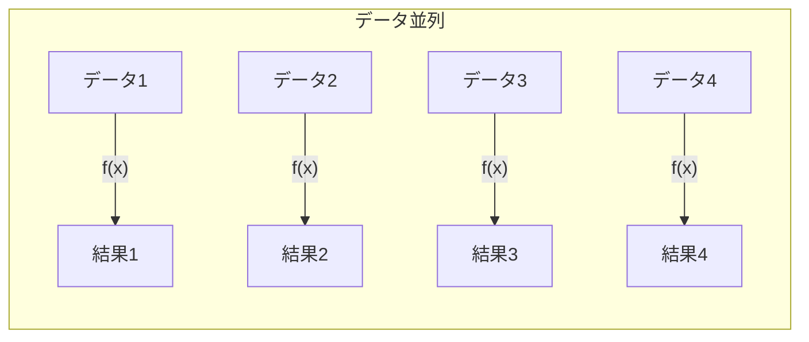

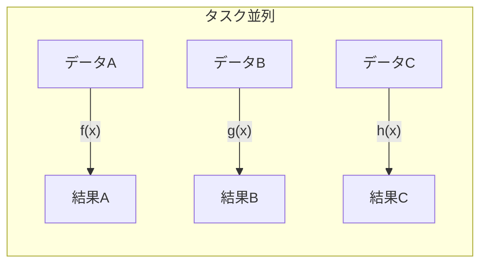

### 1.3 Flynnの分類との対応

Michael Flynnが1966年に提案した**Flynnの分類（Flynn's taxonomy）** は、コンピュータアーキテクチャを命令ストリームとデータストリームの数に基づいて4つに分類する。

| 分類 | 命令ストリーム | データストリーム | 説明 |
|------|-------------|-------------|------|
| **SISD** | 単一 | 単一 | 従来の逐次処理プロセッサ |
| **SIMD** | 単一 | 複数 | データ並列の典型 |
| **MISD** | 複数 | 単一 | 実用上稀（フォールトトレラント計算など） |
| **MIMD** | 複数 | 複数 | タスク並列、マルチコアCPU |

データ並列は主にSIMDモデルに対応する。単一の命令が複数のデータ要素に同時に作用するため、制御の複雑さが最小限に抑えられる。一方、GPUのアーキテクチャは厳密にはSIMDではなく、NVIDIAが提唱する**SIMT（Single Instruction, Multiple Threads）** という拡張モデルに分類されることが多い。SIMTについては後述する。

### 1.4 データ並列が有効な問題の特徴

データ並列が効果的に機能するためには、以下の条件が満たされる必要がある。

1. **データ間の独立性**: 各データ要素の処理が他の要素の処理結果に依存しないこと
2. **処理の均一性**: すべてのデータ要素に対して同一（またはほぼ同一）の操作が適用されること
3. **十分なデータ量**: 並列化のオーバーヘッドを償却できるだけの大量のデータが存在すること
4. **規則的なメモリアクセスパターン**: 連続的、あるいは規則的なアドレスパターンでのアクセスが可能であること

逆に、データ間に依存関係がある場合（例えば漸化式の計算）、処理が要素ごとに大きく異なる場合（不規則な分岐を含む処理）、データ量が少ない場合には、データ並列の恩恵は限定的になる。

## 2. SIMD（SSE, AVX, NEON）

### 2.1 SIMDの基本原理

**SIMD（Single Instruction, Multiple Data）** は、1つの命令で複数のデータ要素を同時に処理するハードウェアレベルのデータ並列機構である。従来のスカラ命令が1つの加算器で1組のオペランドを処理するのに対し、SIMD命令は幅の広いレジスタとALU（Arithmetic Logic Unit）を使って、複数組のオペランドを一度に処理する。

```
スカラ演算:   a[0] + b[0] → c[0]   （1クロック）

SIMD演算:     a[0] + b[0] → c[0]
              a[1] + b[1] → c[1]   （1クロックで4要素同時）
              a[2] + b[2] → c[2]
              a[3] + b[3] → c[3]
```

この「幅」をSIMDレーンと呼ぶ。レジスタ幅が128ビットで32ビット浮動小数点数を扱う場合、4レーンの並列処理が可能になる。256ビットレジスタなら8レーン、512ビットレジスタなら16レーンとなる。

### 2.2 x86のSIMD拡張の変遷

x86アーキテクチャにおけるSIMD命令セットは、段階的に拡張されてきた歴史がある。

| 命令セット | 導入年 | レジスタ幅 | 主な特徴 |
|-----------|--------|-----------|---------|
| **MMX** | 1997 | 64-bit | 整数SIMD、FPUレジスタと共用 |
| **SSE** | 1999 | 128-bit | 浮動小数点SIMD、専用XMMレジスタ |
| **SSE2** | 2001 | 128-bit | 倍精度浮動小数点、整数拡張 |
| **SSE3/SSSE3** | 2004-2006 | 128-bit | 水平演算、シャッフル強化 |
| **SSE4.1/4.2** | 2007-2008 | 128-bit | ドット積、文字列処理 |
| **AVX** | 2011 | 256-bit | YMMレジスタ、3オペランド形式 |
| **AVX2** | 2013 | 256-bit | 整数256-bit演算、gather命令 |
| **AVX-512** | 2017 | 512-bit | ZMMレジスタ、マスクレジスタ |

SSE（Streaming SIMD Extensions）は128ビットのXMMレジスタを16本導入し、単精度浮動小数点数4つを同時に処理可能とした。続くSSE2で倍精度浮動小数点と整数演算が追加され、事実上の基本要件となった。

AVX（Advanced Vector Extensions）はレジスタ幅を256ビットに拡張し、YMMレジスタとして既存のXMMレジスタを包含する設計とした。さらにAVX2では256ビットの整数演算と、不規則なアドレスからのデータ収集を行うgather命令が追加された。

AVX-512は512ビットまでレジスタ幅を拡張し、マスクレジスタによる条件実行の仕組みも導入した。ただし、AVX-512は消費電力が大きく、一部のプロセッサでは周波数が低下するため、実用上の利得は必ずしもレジスタ幅の比率通りにはならない。IntelはAlder Lake以降のコンシューマ向けプロセッサでAVX-512を無効化しており、サーバ向けとの棲み分けが進んでいる。

### 2.3 ARM NEON

ARM（AArch64）アーキテクチャにおけるSIMD拡張は**NEON（Advanced SIMD）** と呼ばれる。128ビットのベクトルレジスタを32本備え、8, 16, 32, 64ビットの整数および単精度・倍精度浮動小数点数をサポートする。

NEONの特筆すべき点は、モバイルデバイスやエッジコンピューティングで広く普及していることである。Apple Siliconのベースとなっているarm64アーキテクチャにもNEONは標準搭載されており、iOSおよびmacOSのメディア処理や機械学習推論の高速化に活用されている。

さらにARMv8.2以降では**SVE（Scalable Vector Extension）** が導入された。SVEの特徴はベクトル長がハードウェア実装に依存する設計である。128ビットから2048ビットまでの範囲で、128ビット刻みのいずれの長さにもなりうる。これにより、同一のバイナリが異なるベクトル長のハードウェアで動作し、ハードウェアの進化に合わせて自動的に性能が向上する。富岳スーパーコンピュータのA64FXプロセッサは512ビットのSVEを実装している。

### 2.4 SIMD intrinsicsによるプログラミング

SIMD命令を直接活用する方法の一つが、コンパイラが提供する**intrinsics（組み込み関数）** である。以下はAVX2を使った単精度浮動小数点数のベクトル加算の例である。

```c
#include <immintrin.h>

void vector_add_avx2(const float* a, const float* b, float* c, int n) {
    int i = 0;
    // Process 8 floats at a time with AVX2 (256-bit)
    for (; i + 7 < n; i += 8) {
        __m256 va = _mm256_loadu_ps(&a[i]);  // Load 8 floats from a
        __m256 vb = _mm256_loadu_ps(&b[i]);  // Load 8 floats from b
        __m256 vc = _mm256_add_ps(va, vb);   // Add 8 pairs simultaneously
        _mm256_storeu_ps(&c[i], vc);         // Store 8 results to c
    }
    // Handle remaining elements with scalar code
    for (; i < n; i++) {
        c[i] = a[i] + b[i];
    }
}
```

intrinsicsはアセンブリ言語よりは可読性が高いものの、依然として以下の課題がある。

- **移植性の欠如**: SSE、AVX、NEONごとに異なるintrinsicsが必要
- **メンテナンスの負担**: SIMD幅が変わるたびにコードの書き換えが必要
- **端数処理**: SIMDレーン数で割り切れないデータ量の処理が必要
- **アライメント**: メモリアライメントの考慮が求められる

こうした課題から、手動でのintrinsics利用は性能クリティカルなホットパスに限定し、それ以外は後述する自動ベクトル化やライブラリに委ねることが現実的なアプローチとなっている。

## 3. 自動ベクトル化

### 3.1 コンパイラによる自動ベクトル化の仕組み

**自動ベクトル化（auto-vectorization）** とは、コンパイラがスカラコードを解析し、SIMD命令を自動的に生成する最適化技術である。プログラマがintrinsicsを記述することなく、通常のループコードからSIMD命令が生成される。

現代の主要コンパイラ（GCC、Clang/LLVM、MSVC、ICC）はいずれも自動ベクトル化機能を備えている。一般的に、最適化レベル `-O2` 以上で有効になり、GCCでは `-ftree-vectorize` フラグで制御される（`-O3` ではデフォルトで有効）。

自動ベクトル化が機能するためには、コンパイラがループの以下の性質を解析・証明する必要がある。

1. **ループ回数の決定可能性**: ループの反復回数がコンパイル時または実行時に事前計算可能であること
2. **データ依存関係の不在**: 異なるイテレーション間でのデータ依存（特にループ搬送依存）がないこと
3. **ポインタエイリアスの不在**: 入力と出力のメモリ領域が重複しないこと

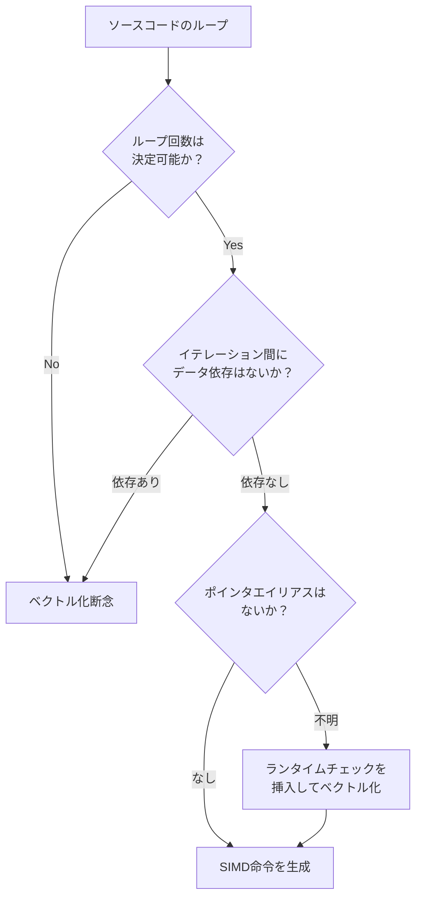

### 3.2 ベクトル化を阻害する要因

実際のコードでは、自動ベクトル化が適用されないケースが多い。主な阻害要因を見ていこう。

**ポインタエイリアス**: C/C++ではポインタが同じメモリ領域を指す可能性があるため、コンパイラは安全側に倒してベクトル化を見送ることがある。これを解決するのがC99で導入された `restrict` キーワードである。

```c
// Without restrict: compiler may not vectorize
void add(float* a, float* b, float* c, int n) {
    for (int i = 0; i < n; i++)
        c[i] = a[i] + b[i];
}

// With restrict: compiler can safely vectorize
void add(float* restrict a, float* restrict b, float* restrict c, int n) {
    for (int i = 0; i < n; i++)
        c[i] = a[i] + b[i];
}
```

**関数呼び出し**: ループ本体に関数呼び出しが含まれると、その関数の副作用が不明なためベクトル化が困難になる。インライン展開（inlining）が可能であれば解決するが、外部ライブラリの関数呼び出しなどでは不可能な場合がある。

**複雑な制御フロー**: `if-else` 分岐がループ内に存在する場合、コンパイラはマスク付きSIMD命令（predicated execution）に変換できることもあるが、分岐の複雑さによっては断念する。

**非連続メモリアクセス**: ストライドアクセス（要素間隔が一定でないアクセス）やインデックス配列を介した間接アクセスは、SIMDのロード/ストア効率を大幅に低下させる。

### 3.3 プログラマがベクトル化を支援する方法

コンパイラの自動ベクトル化を最大限に活用するために、プログラマが取れるアプローチがいくつかある。

**コンパイラヒント（プラグマ）**: OpenMPの `#pragma omp simd` やGCCの `#pragma GCC ivdep`（ループ搬送依存がないことをコンパイラに伝える）を使用する。

```c
// Tell the compiler this loop has no loop-carried dependencies
#pragma omp simd
for (int i = 0; i < n; i++) {
    c[i] = a[i] * b[i] + d[i];
}
```

**データレイアウトの工夫**: 構造体の配列（Array of Structures, AoS）よりも、配列の構造体（Structure of Arrays, SoA）の方がSIMDフレンドリーである。

```c
// AoS: poor for SIMD (non-contiguous access per field)
struct Particle_AoS {
    float x, y, z;
    float vx, vy, vz;
};
struct Particle_AoS particles[N];

// SoA: good for SIMD (contiguous access per field)
struct Particles_SoA {
    float x[N], y[N], z[N];
    float vx[N], vy[N], vz[N];
};
struct Particles_SoA particles;
```

SoAレイアウトでは、すべてのx座標が連続メモリに配置されるため、SIMD命令で効率的にロード・処理・ストアできる。一方AoSでは、x座標がy座標やz座標と交互に配置されるため、ストライドアクセスが必要になる。

**コンパイラ出力の確認**: GCCの `-fopt-info-vec-missed` オプションや、Clangの `-Rpass=loop-vectorize` / `-Rpass-missed=loop-vectorize` オプションを使うことで、どのループがベクトル化され、どのループが見送られたかを確認できる。ベクトル化されなかった理由も報告されるため、コード修正の指針となる。

## 4. GPUプログラミング（CUDA, OpenCL）

### 4.1 GPUアーキテクチャの概要

**GPU（Graphics Processing Unit）** は、もともとグラフィックスレンダリングのために設計されたプロセッサである。画面上の数百万のピクセルに対して同一のシェーディング計算を行うという処理は、本質的にデータ並列であり、GPUはまさにこの用途のために大量の小さなプロセッシングコアを搭載している。

CPUとGPUのアーキテクチャの違いを概観しよう。

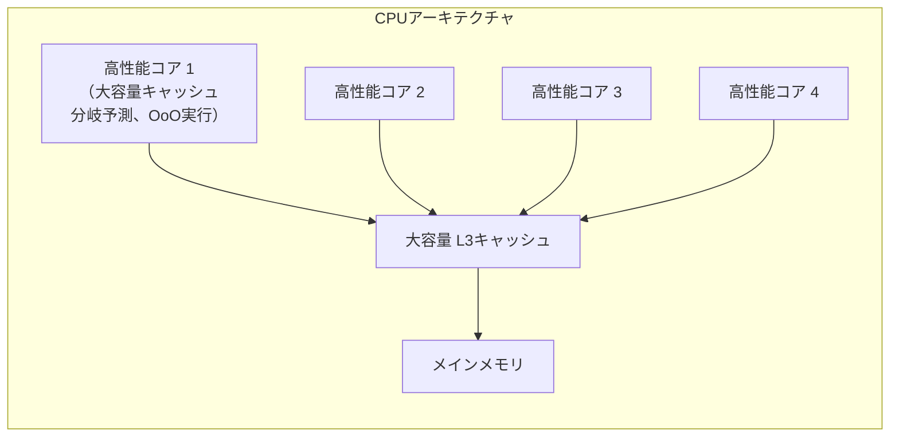

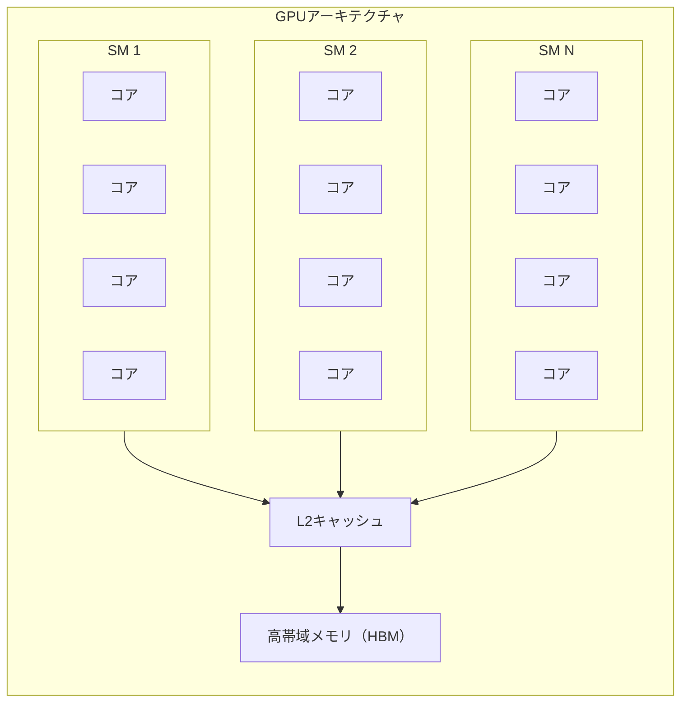

CPUは少数の高性能コアを持ち、各コアは分岐予測、アウトオブオーダー実行、大容量キャッシュといった複雑な機構によって**レイテンシの最小化**に注力している。一方GPUは、数千〜数万の小さなコアを持ち、各コアは単純だが**スループットの最大化**に特化している。

NVIDIAのGPUでは、コアの集まりを**SM（Streaming Multiprocessor）** と呼ぶ。1つのSMには数十〜百数十のCUDAコアが含まれ、それらが共有メモリやスケジューラなどのリソースを共用する。例えばNVIDIA H100 GPUは132個のSMを持ち、総計で16,896のCUDAコアを搭載している。

### 4.2 SIMTモデル

NVIDIAのGPUプログラミングモデルは**SIMT（Single Instruction, Multiple Threads）** と呼ばれる。SIMTはSIMDの概念を拡張したもので、以下の点で純粋なSIMDと異なる。

- **スレッドの概念**: プログラマは個々のスレッドの観点からプログラムを記述する。各スレッドは独自のプログラムカウンタとレジスタ状態を持つ
- **暗黙のベクトル化**: ハードウェアが32スレッド（**ワープ; warp** と呼ばれる）を束ねて同一命令を実行する
- **分岐の取り扱い**: ワープ内のスレッドが異なる分岐パスを取る場合、両方のパスが逐次的に実行される（**ワープダイバージェンス**）

ワープダイバージェンスは性能に大きな影響を与える。ワープ内の32スレッドがすべて同じ分岐パスを取れば最高効率だが、半分ずつ異なるパスを取ると実効スループットは半減する。

### 4.3 CUDAプログラミング

**CUDA（Compute Unified Device Architecture）** は、NVIDIAが2007年に発表したGPGPU（General-Purpose computing on GPU）フレームワークである。C/C++の拡張として設計されており、GPUで実行されるカーネル関数を `__global__` キーワードで修飾する。

```cuda
// CUDA kernel: each thread processes one element
__global__ void vector_add(const float* a, const float* b, float* c, int n) {
    // Calculate global thread index
    int idx = blockIdx.x * blockDim.x + threadIdx.x;
    if (idx < n) {
        c[idx] = a[idx] + b[idx];
    }
}

// Host code: launch kernel
int main() {
    int n = 1000000;
    // ... allocate and copy data to device ...

    // Launch with 1024 threads per block
    int threads_per_block = 256;
    int blocks = (n + threads_per_block - 1) / threads_per_block;
    vector_add<<<blocks, threads_per_block>>>(d_a, d_b, d_c, n);

    // ... copy results back to host ...
    return 0;
}
```

CUDAのスレッド階層は3段階で構成される。

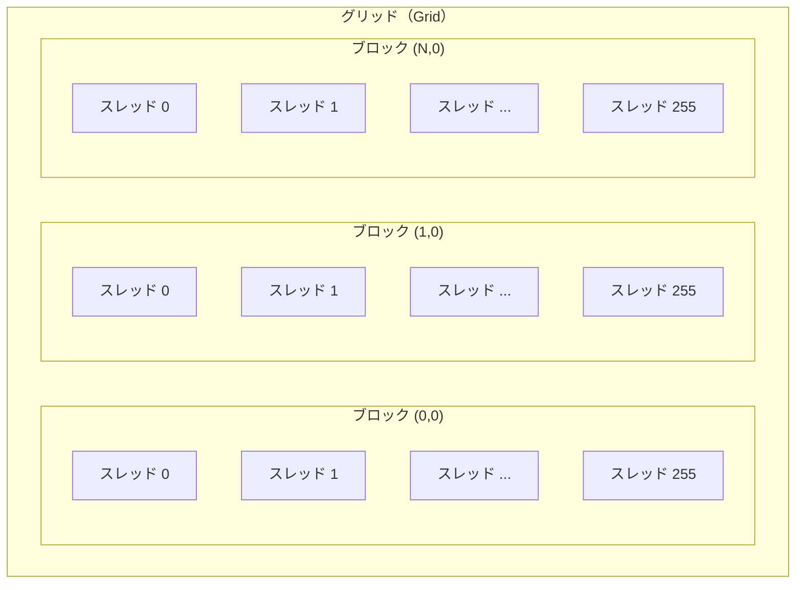

- **グリッド（Grid）**: カーネル呼び出し全体。複数のブロックで構成される
- **ブロック（Block）**: SM上で実行されるスレッドの集まり。最大1024スレッド。ブロック内のスレッドは共有メモリを介して協調可能
- **スレッド（Thread）**: 最小の実行単位。ワープ（32スレッド）単位で実際に実行される

`blockIdx` と `threadIdx` という組み込み変数により、各スレッドは自身のグローバルなインデックスを計算し、担当するデータ要素を特定する。

### 4.4 OpenCL

**OpenCL（Open Computing Language）** は、Khronos Groupが策定したヘテロジニアス並列計算のためのオープン標準である。CUDAがNVIDIA GPU専用であるのに対し、OpenCLはCPU、GPU（NVIDIA、AMD、Intel）、FPGA、DSPなど多様なデバイスをターゲットにできる。

OpenCLの用語はCUDAと対応関係がある。

| CUDA | OpenCL | 説明 |
|------|--------|------|
| スレッド | ワークアイテム（work-item） | 最小実行単位 |
| ブロック | ワークグループ（work-group） | 協調可能なスレッド群 |
| グリッド | NDRange | 全実行空間 |
| 共有メモリ | ローカルメモリ | ワークグループ内共有 |
| グローバルメモリ | グローバルメモリ | デバイス全体で共有 |

OpenCLのカーネルは独自のC方言で記述され、ランタイムにコンパイルされる（JITコンパイル）。このため実行時のオーバーヘッドは若干大きくなるが、デバイス非依存という利点がある。

```c
// OpenCL kernel
__kernel void vector_add(__global const float* a,
                         __global const float* b,
                         __global float* c,
                         int n) {
    int idx = get_global_id(0);
    if (idx < n) {
        c[idx] = a[idx] + b[idx];
    }
}
```

実用上、NVIDIA GPUを主なターゲットとする場合はCUDAが性能最適化の観点で有利であり、マルチベンダー対応が求められる場合はOpenCLが選択される。近年では**SYCL**（OpenCLの上位に位置づけられるC++ベースのフレームワーク）が台頭しており、IntelのoneAPIがその実装であるDPC++を推進している。

## 5. GPGPUのメモリモデル

### 5.1 メモリ階層

GPUのメモリ階層はCPUとは大きく異なり、プログラマが明示的に管理する必要がある。NVIDIAのCUDAにおけるメモリ階層は以下の通りである。

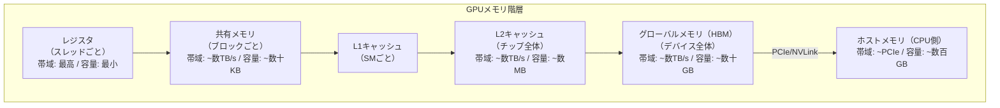

各メモリ層の特性をまとめると以下のようになる。

| メモリ種別 | スコープ | レイテンシ | 容量（典型値） |
|-----------|---------|-----------|-------------|
| **レジスタ** | スレッド | 0〜1サイクル | スレッドあたり数十〜数百本 |
| **共有メモリ** | ブロック | ~5サイクル | 48〜228 KB/SM |
| **L1キャッシュ** | SM | ~30サイクル | 128〜256 KB/SM |
| **L2キャッシュ** | チップ全体 | ~200サイクル | 数MB〜数十MB |
| **グローバルメモリ** | デバイス全体 | ~500サイクル | 16〜80 GB |

### 5.2 コアレッシング（メモリコアレッシング）

GPU性能を左右する最重要要因の一つが**メモリコアレッシング（memory coalescing）** である。これは、ワープ内の連続するスレッドが連続するメモリアドレスにアクセスする場合、ハードウェアがそれらを1つの大きなメモリトランザクションにまとめる仕組みである。

```
// Coalesced access: thread i accesses element i (contiguous)
// → 1 memory transaction for 32 threads
c[threadIdx.x] = a[threadIdx.x] + b[threadIdx.x];

// Strided access: thread i accesses element i*stride (non-contiguous)
// → multiple memory transactions (performance degradation)
c[threadIdx.x * stride] = a[threadIdx.x * stride];
```

コアレッシングが成立する場合、ワープ全体のメモリアクセスが128バイト（32スレッド x 4バイト）の1回のトランザクションとなる。一方、アクセスが分散している場合は最大32回のトランザクションが必要になり、実効メモリ帯域が大幅に低下する。

### 5.3 共有メモリの活用

共有メモリは、ブロック内のスレッド間でデータを共有するための高速なオンチップメモリである。グローバルメモリからのデータを共有メモリにキャッシュし、繰り返しアクセスすることで性能を向上させるテクニックは**タイリング（tiling）** と呼ばれる。

行列乗算を例に見てみよう。ナイーブな実装では、行列C = A x Bの1要素を計算するために行列Aの1行と行列Bの1列をグローバルメモリから読む必要がある。N x N行列の場合、各要素の計算でO(N)のグローバルメモリアクセスが発生し、全体ではO(N^3)のアクセスとなる。

タイリングを適用すると、共有メモリにブロック単位でデータをロードし、ブロック内で再利用する。

```cuda
// Tiled matrix multiplication using shared memory
__global__ void matmul_tiled(const float* A, const float* B, float* C,
                              int N) {
    // Shared memory for tile data
    __shared__ float tile_A[TILE_SIZE][TILE_SIZE];
    __shared__ float tile_B[TILE_SIZE][TILE_SIZE];

    int row = blockIdx.y * TILE_SIZE + threadIdx.y;
    int col = blockIdx.x * TILE_SIZE + threadIdx.x;
    float sum = 0.0f;

    // Iterate over tiles
    for (int t = 0; t < N / TILE_SIZE; t++) {
        // Load tile from global to shared memory
        tile_A[threadIdx.y][threadIdx.x] = A[row * N + t * TILE_SIZE + threadIdx.x];
        tile_B[threadIdx.y][threadIdx.x] = B[(t * TILE_SIZE + threadIdx.y) * N + col];
        __syncthreads();  // Wait for all threads to finish loading

        // Compute partial dot product using shared memory
        for (int k = 0; k < TILE_SIZE; k++) {
            sum += tile_A[threadIdx.y][k] * tile_B[k][threadIdx.x];
        }
        __syncthreads();  // Wait before loading next tile
    }

    C[row * N + col] = sum;
}
```

タイリングにより、グローバルメモリアクセスはO(N^3 / TILE_SIZE)に削減される。TILE_SIZE = 32の場合、約32倍の削減効果がある。

### 5.4 ホスト-デバイス間のデータ転送

GPU計算における大きなオーバーヘッドが、CPUメモリ（ホスト）とGPUメモリ（デバイス）間のデータ転送である。PCIe Gen4 x16の帯域幅は理論値で約32 GB/sであり、GPU内部のメモリ帯域（HBM3で数TB/s）と比較すると桁違いに小さい。

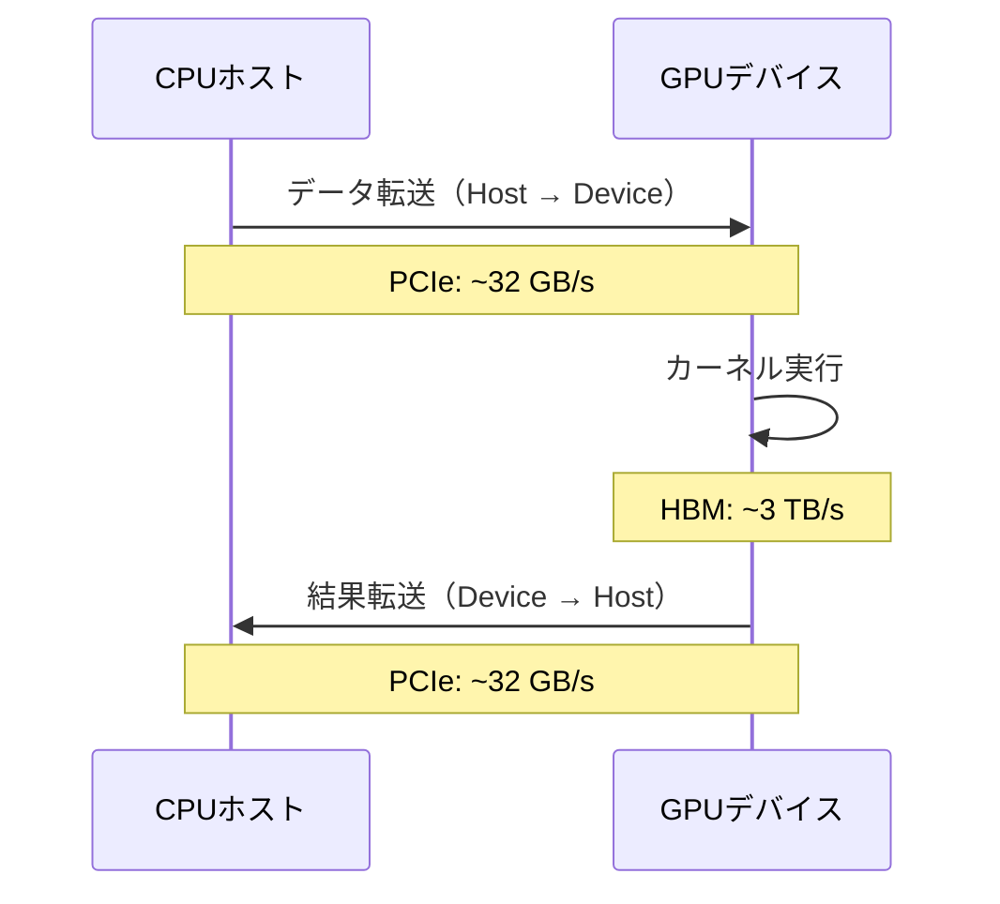

このボトルネックを軽減するためのテクニックがいくつかある。

- **ストリーミング**: データ転送とカーネル実行をオーバーラップさせる（CUDAストリームを利用）
- **ピン留めメモリ**: ページロックされたホストメモリを使うことで転送速度を向上させる
- **Unified Memory**: CUDAのマネージドメモリ機能により、ホストとデバイス間のデータ移動をランタイムが自動管理する（ただし性能は手動管理に劣ることが多い）
- **NVLink**: PCIeの代わりにNVLink（帯域幅900 GB/s、NVLink 4.0の場合）を使い、GPU間やCPU-GPU間の転送を高速化する

## 6. MapReduceパラダイム

### 6.1 起源と背景

**MapReduce**は、Googleが2004年に発表した論文 "MapReduce: Simplified Data Processing on Large Clusters" で提唱されたプログラミングモデルである。数千台のコモディティサーバ上で大規模データを処理するためのフレームワークとして設計された。

MapReduceの着想は、関数型プログラミングにおける `map` 関数と `reduce`（fold）関数に由来する。この二つの高階関数の組み合わせは、驚くほど広範な分散データ処理タスクを記述できることが、MapReduceの本質的な洞察である。

### 6.2 Map関数とReduce関数

MapReduceの処理フローは以下の3つのフェーズで構成される。

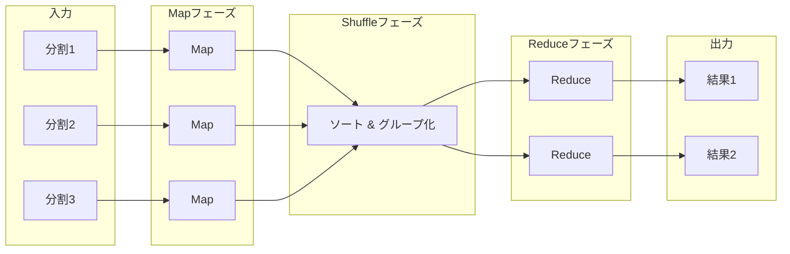

**Map関数**: 入力データの各レコードに対して適用され、0個以上のキー・バリューペアを出力する。

$$
\text{map}: (k_1, v_1) \rightarrow \text{list}(k_2, v_2)
$$

**Shuffle/Sort**: Map関数の出力を同一キーごとにグループ化し、ソートする。このフェーズはフレームワークが自動的に実行する。

**Reduce関数**: 同一キーに関連付けられた値のリストを受け取り、集約結果を出力する。

$$
\text{reduce}: (k_2, \text{list}(v_2)) \rightarrow \text{list}(v_3)
$$

### 6.3 単語カウントの例

MapReduceの古典的な例題である単語カウント（Word Count）を見てみよう。

```python
# Map function: emit (word, 1) for each word in the input
def map_function(document_id, document_text):
    for word in document_text.split():
        emit(word, 1)

# Reduce function: sum up all counts for each word
def reduce_function(word, counts):
    emit(word, sum(counts))
```

入力として3つのドキュメントがある場合の処理の流れは以下の通りである。

```
Input:
  Doc1: "hello world"
  Doc2: "hello mapreduce"
  Doc3: "world of mapreduce"

Map output:
  Doc1 → [("hello", 1), ("world", 1)]
  Doc2 → [("hello", 1), ("mapreduce", 1)]
  Doc3 → [("world", 1), ("of", 1), ("mapreduce", 1)]

Shuffle/Sort:
  "hello"     → [1, 1]
  "mapreduce" → [1, 1]
  "of"        → [1]
  "world"     → [1, 1]

Reduce output:
  "hello"     → 2
  "mapreduce" → 2
  "of"        → 1
  "world"     → 2
```

### 6.4 MapReduceの耐障害性

MapReduceの重要な設計目標の一つは、数千台のサーバからなるクラスタでの**耐障害性（fault tolerance）** である。大規模クラスタでは、ノードの故障は例外的な事象ではなく日常的な出来事である。

MapReduceは以下の仕組みで障害に対処する。

1. **タスクの再実行**: マスターノードがワーカーの応答を監視し、タイムアウトした場合はそのワーカーのタスクを別のノードで再実行する
2. **中間結果のローカルディスク書き込み**: Map出力はワーカーのローカルディスクに書き込まれ、障害時にはそのタスクだけを再実行すればよい
3. **投機的実行（speculative execution）**: 処理が遅いタスク（ストラグラー）を検出し、同じタスクを別のノードでも実行して先に終わった方の結果を採用する

### 6.5 MapReduceの限界とその後の発展

MapReduceはシンプルなプログラミングモデルと優れた耐障害性を提供したが、以下の限界も明らかになった。

- **反復処理の非効率性**: 機械学習のように同じデータに対して繰り返し処理を行うアルゴリズムでは、毎回ディスクI/Oが発生して非効率
- **低レイテンシ処理の不向き**: ストリーム処理やインタラクティブクエリには適さない
- **表現力の制限**: Map→Reduce の2段階だけでは、複雑なDAG（有向非巡回グラフ）型の処理フローを自然に表現できない

これらの限界を克服するために、以下のような後継技術が登場した。

- **Apache Spark**: RDD（Resilient Distributed Datasets）によるインメモリ計算。反復処理を10〜100倍高速化
- **Apache Flink**: ストリーム処理ファーストの設計。低レイテンシかつexactly-onceセマンティクス
- **Dryad / Tez**: 任意のDAG型処理グラフをサポート

## 7. データ並列フレームワーク

### 7.1 Apache Spark

Apache Sparkは、MapReduceの後継として最も広く普及したデータ並列フレームワークである。カリフォルニア大学バークレー校のAMPLabで開発され、2014年にApache Software Foundationのトップレベルプロジェクトとなった。

Sparkの中核概念である**RDD（Resilient Distributed Dataset）** は、クラスタ上に分散された読み取り専用のデータコレクションである。RDDに対する操作は**変換（transformation）** と**アクション（action）** に分類される。変換（`map`, `filter`, `flatMap` など）は遅延評価（lazy evaluation）され、アクション（`count`, `collect`, `reduce` など）がトリガーされた時点で初めて実際の計算が実行される。

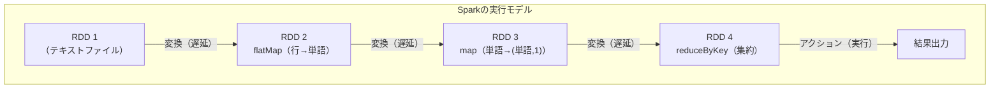

Sparkがインメモリで中間結果を保持できるため、反復的なアルゴリズムにおいてMapReduceを大幅に上回る性能を発揮する。また、Spark SQLによるSQLインターフェース、MLlibによる機械学習、GraphXによるグラフ処理など、統一的なAPIで多様なワークロードを扱える点も普及の要因である。

### 7.2 GPU向けデータ並列フレームワーク

GPU上でのデータ並列処理を抽象化するフレームワークも多数存在する。

**cuBLAS / cuDNN**: NVIDIAが提供するCUDA上の線形代数ライブラリ（cuBLAS）と深層学習プリミティブライブラリ（cuDNN）。行列乗算や畳み込み演算など、高頻度で使用される演算をハードウェアに最適化された形で提供する。

**Thrust**: CUDAのC++テンプレートライブラリで、STL風のインターフェースでGPU上のデータ並列操作（`sort`, `reduce`, `transform` など）を記述できる。

**PyTorch / TensorFlow**: 深層学習フレームワークとしての側面が強調されがちだが、本質的にはテンソル（多次元配列）に対するデータ並列演算フレームワークである。CPU/GPUのバックエンドを自動的に切り替え、自動微分と組み合わせて効率的な計算グラフを実行する。

**RAPIDS**: NVIDIAが提供するデータサイエンス向けGPUアクセラレーションライブラリ群。pandas互換のcuDF、scikit-learn互換のcuMLなど、Pythonエコシステムとの高い互換性を維持しながらGPUの演算能力を活用できる。

### 7.3 言語レベルのデータ並列サポート

プログラミング言語自体がデータ並列を言語機能としてサポートする動きもある。

**NumPy / Array Programming**: NumPyはPythonにおけるベクトル化計算の基盤であり、配列全体に対する演算を一括で記述できる。内部ではC/Fortranで実装されたBLASライブラリやSIMD命令を活用する。

```python
import numpy as np

# Data parallel operation: element-wise addition of 1 million elements
a = np.random.rand(1_000_000)
b = np.random.rand(1_000_000)
c = a + b  # Vectorized operation — no explicit loop
```

**ISPC（Intel SPMD Program Compiler）**: IntelのSPMD（Single Program, Multiple Data）コンパイラ。C風の言語でSIMDプログラムを記述でき、SSE/AVX/AVX-512命令に自動コンパイルされる。CUDAのプログラミングモデルに近い記述でCPUのSIMDを活用できる。

**Julia**: Juliaは科学技術計算に特化した言語で、ブロードキャスト（`.` 演算子）によるデータ並列表現と、LLVMを通じた積極的なベクトル化が特徴である。`@simd` マクロによる明示的なSIMDヒントも提供する。

## 8. Amdahlの法則とGustafsonの法則

### 8.1 Amdahlの法則

データ並列処理の性能向上を議論する際に避けて通れないのが、**Amdahlの法則（Amdahl's Law）** である。1967年にGene Amdahlが提唱したこの法則は、プログラムの逐次的に実行しなければならない部分が全体の高速化を制限することを定量的に示す。

プログラム全体のうち並列化可能な割合を $p$、プロセッサ数を $n$ とすると、最大速度向上比（スピードアップ）$S$ は以下で与えられる。

$$
S(n) = \frac{1}{(1 - p) + \frac{p}{n}}
$$

プロセッサ数 $n \to \infty$ の極限では

$$
S_{\max} = \frac{1}{1 - p}
$$

となる。つまり、プログラムの10%が逐次的であれば（$p = 0.9$）、どれだけプロセッサを増やしても最大10倍の速度向上しか得られない。

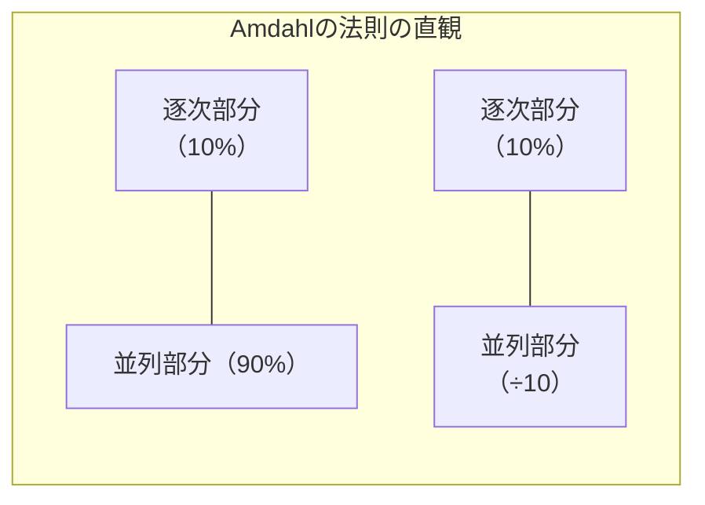

| 並列化率 $p$ | 2コア | 8コア | 64コア | 1024コア | $\infty$ |
|------------|-------|-------|--------|---------|----------|
| 50% | 1.33x | 1.78x | 1.97x | 2.00x | 2.00x |
| 75% | 1.60x | 2.91x | 3.77x | 3.99x | 4.00x |
| 90% | 1.82x | 4.71x | 8.77x | 9.91x | 10.00x |
| 95% | 1.90x | 5.93x | 14.29x | 18.66x | 20.00x |
| 99% | 1.98x | 7.48x | 39.26x | 91.17x | 100.00x |

この表から明らかなように、コア数を増やしても逐次部分がボトルネックとなり、速度向上は収穫逓減に陥る。これは特にGPUプログラミングにおいて重要な教訓である。数千のCUDAコアを活用するには、処理の大部分（99%以上）が並列化可能でなければならない。

### 8.2 Gustafsonの法則

Amdahlの法則に対する重要な反論が、1988年にJohn Gustafsonが提唱した**Gustafsonの法則（Gustafson's Law）** である。Amdahlの法則が**問題サイズを固定して**プロセッサ数を増やした場合の速度向上を論じるのに対し、Gustafsonの法則は**プロセッサ数に比例して問題サイズも拡大する**状況を考える。

Gustafsonの法則によるスピードアップ $S'$ は以下で与えられる。

$$
S'(n) = n - (1 - p) \cdot (n - 1) = 1 - p + p \cdot n
$$

ここでの $p$ は、並列実行時における並列部分の時間割合である。

この法則の含意は深い。現実の多くのケースでは、計算資源が増えれば解きたい問題のサイズも大きくなる。画像処理であればより高解像度の画像を、シミュレーションであればより細かいメッシュを、機械学習であればより大きなモデルとデータセットを扱いたい。このような**スケーリング（weak scaling）** のシナリオでは、逐次部分の影響は相対的に小さくなり、Amdahlの法則が示す悲観的な上限は当てはまらない。

### 8.3 Strong ScalingとWeak Scaling

並列処理の性能評価には二つのスケーリング指標がある。

**Strong Scaling**: 問題サイズを固定し、プロセッサ数を増やしたときの速度向上を測定する。Amdahlの法則が直接適用される。理想的には、プロセッサ数を2倍にすれば実行時間が半分になる。

**Weak Scaling**: プロセッサ数に比例して問題サイズも増やし、プロセッサあたりの実行時間が一定であるかを測定する。Gustafsonの法則が対応する。理想的には、プロセッサ数と問題サイズを2倍にしても実行時間は変わらない。


HPC（High-Performance Computing）の分野では、数万〜数十万コアのスーパーコンピュータでweak scalingの効率を維持することが主要な技術課題となっている。

## 9. 実践的なチューニング

### 9.1 プロファイリングの重要性

データ並列処理のチューニングにおいて、最初に行うべきは**プロファイリング**である。直観による最適化は多くの場合的外れに終わる。Donald Knuthの格言「早すぎる最適化は諸悪の根源」は、並列プログラミングにおいても真である。

主要なプロファイリングツールを紹介する。

| ツール | 対象 | 主な機能 |
|-------|------|---------|
| **perf** | CPU | ハードウェアパフォーマンスカウンタ、SIMDユニット使用率 |
| **Intel VTune** | CPU | ベクトル化効率、メモリアクセスパターン分析 |
| **NVIDIA Nsight Compute** | GPU | カーネルレベルの詳細プロファイル |
| **NVIDIA Nsight Systems** | GPU + CPU | システム全体のタイムライン分析 |
| **AMD ROCProfiler** | AMD GPU | AMD GPU向けプロファイリング |

### 9.2 CPUにおけるSIMDチューニング

CPU上でSIMD性能を最大化するための主要なチューニングポイントを整理する。

**メモリアライメント**: SIMDロード/ストア命令の多くは、アライメントされたアドレスからのアクセスが高速である。AVX2の256ビットロードは32バイトアライメントが推奨され、アンアラインドアクセスではペナルティが生じうる（近年のCPUではペナルティが小さくなっているが、それでもアライメントは有効）。

```c
// Aligned allocation
float* data = (float*)aligned_alloc(32, n * sizeof(float));  // 32-byte aligned for AVX2
```

**ループアンローリング**: コンパイラは通常自動でアンローリングを行うが、SIMDと組み合わせた手動アンローリングが有効な場合もある。SIMD幅の倍数でアンローリングすることで、ループオーバーヘッドを削減し、命令レベル並列性（ILP）を高められる。

**分岐の回避**: 条件分岐はSIMDのパイプラインを乱す。可能であれば、分岐を算術演算やビット演算に変換する（branchless programming）。SIMDのマスク命令（`_mm256_blendv_ps` など）を使えば、条件に応じた選択を分岐なしで実現できる。

**データの前処理**: AoSからSoAへのレイアウト変換、パディングによるアライメント調整、データの事前ソートなど、計算の前段階でデータをSIMDフレンドリーな形に整えることが、しばしば計算本体の最適化よりも大きな効果をもたらす。

### 9.3 GPUにおけるチューニング

GPU性能のチューニングは、CPU以上にメモリアクセスパターンに支配される。以下の主要な最適化戦略を押さえておくべきである。

**オキュパンシ（Occupancy）**: SM上でアクティブなワープ数と、SMが保持可能な最大ワープ数の比率。オキュパンシが低いと、メモリアクセスのレイテンシを隠蔽するのに十分なワープが存在せず、演算ユニットがアイドル状態になる。ただし、オキュパンシが100%でなくとも性能が最大化されるケースは多い。重要なのはメモリレイテンシが適切に隠蔽されているかどうかである。

**バンクコンフリクト**: 共有メモリは32個の**バンク**に分割されており、同一バンクに同時にアクセスすると逐次化（シリアライズ）される。32スレッドがそれぞれ異なるバンクにアクセスすれば全スレッドが同時にアクセスでき、すべて同一バンクにアクセスすると32倍のレイテンシが発生する。

```
// Bank conflict example (stride of 32 accesses same bank)
__shared__ float data[32][33];  // Padding to avoid bank conflict
// 33 instead of 32: ensures consecutive rows map to different banks
```

**レジスタプレッシャー**: カーネルが使用するレジスタ数が多すぎると、SM上で同時実行できるスレッド数が減少し、オキュパンシが低下する。`__launch_bounds__` 修飾子でコンパイラにヒントを与え、レジスタ使用量を制御できる。

**カーネル融合（Kernel Fusion）**: 複数のカーネル起動を1つに統合することで、カーネル起動オーバーヘッドとグローバルメモリへの中間結果書き出しを削減する。深層学習フレームワークでは、コンパイラが自動的にカーネル融合を行う（XLAやTorchInductorなど）。

### 9.4 分散データ並列におけるチューニング

MapReduceやSparkなどの分散データ並列フレームワークでは、ネットワーク通信とデータの偏りが主なボトルネックとなる。

**データパーティショニング**: データがパーティション間で均等に分散されていなければ、一部のノードに負荷が集中する（データスキュー）。適切なパーティショニング戦略（ハッシュパーティショニング、レンジパーティショニング）の選択が重要である。

**シャッフルの最小化**: MapReduceのShuffle/Sortフェーズ、SparkのShuffleは大量のネットワークI/OとディスクI/Oを伴う。`combiner`（Map側での事前集約）の活用や、`mapPartitions`（パーティション単位の処理）などによりシャッフルデータ量を削減できる。

**データ局所性**: 計算をデータが存在するノードに移動させる（data locality）。Sparkでは `PROCESS_LOCAL > NODE_LOCAL > RACK_LOCAL > ANY` の優先度でタスクが配置される。

### 9.5 性能ルーフラインモデル

データ並列処理の性能を体系的に分析するためのフレームワークとして、**ルーフラインモデル（Roofline Model）** がある。ルーフラインモデルは、あるカーネルの性能が**計算律速（compute bound）** か**メモリ律速（memory bound）** かを視覚的に判断するためのツールである。

演算強度（Operational Intensity）$I$ を以下のように定義する。

$$
I = \frac{\text{演算回数（FLOP）}}{\text{メモリ転送量（Byte）}} \quad [\text{FLOP/Byte}]
$$

ルーフラインモデルでは、横軸に演算強度、縦軸に性能（FLOP/s）をプロットし、ハードウェアのピーク演算性能とピークメモリ帯域で定まる「ルーフライン」を描く。

```
性能
(FLOP/s)
  |         _____________________ ← ピーク演算性能
  |        /
  |       /
  |      /  ← メモリ帯域 × 演算強度
  |     /
  |    /
  |   /
  |  /
  | /
  |/__________________________ 演算強度 (FLOP/Byte)
```

- **メモリ律速の領域**（低い演算強度）: 性能はメモリ帯域に比例して向上する。最適化の方向はメモリアクセスの効率化（キャッシュ活用、コアレッシング、プリフェッチなど）
- **計算律速の領域**（高い演算強度）: 性能はピーク演算性能で頭打ちになる。最適化の方向は演算効率の向上（SIMD活用、命令スケジューリングなど）

行列乗算は典型的な計算律速カーネルであり（演算強度がO(N)）、ベクトル加算は典型的なメモリ律速カーネルである（演算強度が O(1)）。ルーフラインモデルによる分析は、どの最適化に注力すべきかの判断に極めて有用である。

## 10. まとめ — データ並列の統一的な視座

本記事では、ハードウェアレベルのSIMDからクラスタスケールの分散処理まで、データ並列処理の全体像を概観してきた。これらの技術は規模こそ異なるが、根底にある原理は共通している。

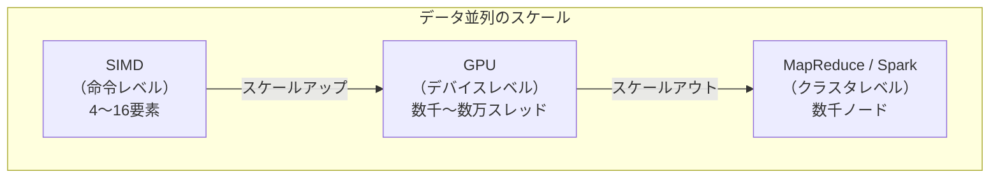

1. **同一操作の多数データへの適用**: SIMDレーン、CUDAスレッド、Mapタスクのいずれも、同じ関数を異なるデータに適用する
2. **データの分割と独立処理**: レジスタ内の要素分割、GPU上のブロック分割、分散ファイルシステム上のスプリット分割は、すべて同じ分割統治の原理に基づく
3. **集約（Reduction）**: SIMDの水平加算、CUDAのリダクションカーネル、MapReduceのReduceフェーズは、分散された部分結果を統合する同一のパターンである

データ並列処理は、ムーアの法則の鈍化とデータ量の指数的増加という二つのトレンドが交差する現代において、ますます重要性を増している。単一コアの性能向上が限界に近づく中、SIMDの幅は広がり、GPUのコア数は増え続け、分散フレームワークはより大規模なクラスタを扱えるように進化している。データ並列の原理を深く理解し、適切な抽象化レベルで適用することが、現代のソフトウェアエンジニアに求められる本質的なスキルである。
