# データ品質とデータ契約（Data Contracts）

## 1. データ品質問題の本質

### 1.1 なぜデータ品質が重要なのか

「ゴミを入れればゴミが出る（Garbage In, Garbage Out）」という言葉は、データエンジニアリングにおいて今も色褪せない真実を伝えている。機械学習モデルがどれほど高度であっても、ビジネスインテリジェンスダッシュボードがどれほど美しく設計されていても、その基盤となるデータが不正確・不完全・陳腐化していれば、意思決定は誤った方向に導かれる。

現代のデータ環境では、データの流れは複雑化している。SaaSアプリケーション、内製システム、外部APIから取り込まれたデータは、ETL/ELTパイプラインを通じて変換・加工され、データウェアハウスに集積された上で、BIツール、レポーティング、MLモデルの学習データとして消費される。この長い連鎖のどこかでデータ品質が劣化すれば、その影響はあらゆる下流に伝播する。

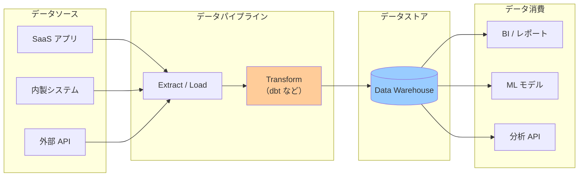

データ品質の問題が見つかるのは往々にして「事後」である。ダッシュボードの数値が先月比で突然 30% 減少した、ML モデルの推論精度が急落した、経営会議で提示した数字が後から誤りだと判明した――。こうした問題の根本原因を調査すると、多くの場合はパイプラインのどこかでデータ品質が静かに劣化していたことが明らかになる。

### 1.2 データ品質問題の構造的な原因

データ品質の問題が組織で繰り返し発生するのは、技術的な問題である以前に、**組織的・プロセス的な問題**である。

**プロデューサーとコンシューマーの分断**: データを生成するチーム（アプリケーション開発者、データエンジニア）と、データを消費するチーム（データアナリスト、データサイエンティスト）の間には、コミュニケーションのギャップが生じやすい。スキーマ変更が予告なく行われ、下流のダッシュボードが壊れるのは典型的な事例である。

**暗黙的な期待**: 「このカラムは絶対に NULL にならないはず」「このテーブルは毎時更新されているはず」という期待が、文書化されることなく暗黙知として存在している。実態と期待がずれたとき、問題は「気づけない」まま潜伏する。

**変化への対応の欠如**: ビジネスルールの変更、システムのリファクタリング、外部データソースの仕様変更によって、データの意味や構造が変わることは珍しくない。しかし、そうした変化が下流の利用者に伝わる仕組みがない場合、品質劣化は検知されないままになる。

これらの問題を解決するアプローチとして、近年注目を集めているのが**データ品質の体系的な測定・監視**と**データ契約（Data Contracts）**の概念である。

## 2. データ品質の6つの次元

データ品質を語るとき、「品質が高い」「低い」という二値的な評価では不十分である。品質を多角的に捉えるために、業界では複数の「次元（Dimensions）」に分解して評価する枠組みが広く使われている。代表的なものは以下の6つである。

### 2.1 正確性（Accuracy）

正確性とは、データが実世界の事実を正しく反映しているかという次元である。顧客の年齢が実際の年齢と一致しているか、注文金額が実際の取引金額と対応しているかを問う。

正確性の検証は、参照データ（ground truth）との突合せを必要とするため、6つの次元の中で最も直接的な検証が難しい。典型的なアプローチは以下の通りである。

- ソースシステムとの突合せ: CRMシステムの顧客データとデータウェアハウスの顧客データを定期的に照合する
- クロスシステム検証: 同じ事実を表すと期待される2つのデータソースを比較する（例: 会計システムの売上と決済システムの入金額）
- 統計的異常検知: 正確性が低下するとデータの統計的特性（平均値、分散、分布）が変化することを利用する

### 2.2 完全性（Completeness）

完全性とは、必要なデータが欠損なく存在しているかという次元である。NULLの割合、必須カラムへの値の充足率、期待されるレコード数に対する実際のレコード数の割合などで測定する。

```python
# Example: completeness check with Great Expectations
import great_expectations as gx

context = gx.get_context()
suite = context.create_expectation_suite("orders_completeness")

# Check that required columns have no nulls
validator.expect_column_values_to_not_be_null("order_id")
validator.expect_column_values_to_not_be_null("customer_id")
validator.expect_column_values_to_not_be_null("order_date")

# Check that optional columns have reasonable completeness
# At least 95% of orders should have a shipping address
validator.expect_column_values_to_not_be_null(
    "shipping_address",
    mostly=0.95
)
```

完全性の問題は多くの場合、アップストリームのシステム障害、ETLパイプラインのバグ、あるいはアプリケーション側の入力バリデーションの欠如に起因する。

### 2.3 一貫性（Consistency）

一貫性とは、複数のデータセット間、あるいは同一データセット内の異なるレコード間で、データが矛盾なく整合しているかという次元である。

- **クロスシステム一貫性**: 複数のデータストアに同じデータが存在する場合、それらが一致しているか（例: OLTP データベースとデータウェアハウスの顧客数が一致しているか）
- **時系列一貫性**: 時系列データで論理的に矛盾しないか（例: 注文の作成日が配送日より後になっていないか）
- **参照整合性**: 外部キーの参照先が存在するか（例: 注文テーブルの `customer_id` が顧客テーブルに存在するか）

```sql
-- Consistency check: order_date must be before or equal to shipped_date
SELECT COUNT(*) AS violation_count
FROM orders
WHERE shipped_date IS NOT NULL
  AND order_date > shipped_date;

-- Cross-system consistency: record count comparison
SELECT
    (SELECT COUNT(*) FROM source_system.orders) AS source_count,
    (SELECT COUNT(*) FROM warehouse.orders)     AS warehouse_count,
    (SELECT COUNT(*) FROM source_system.orders)
        - (SELECT COUNT(*) FROM warehouse.orders) AS difference;
```

### 2.4 鮮度（Timeliness / Freshness）

鮮度とは、データが利用目的に対して十分に新鮮かという次元である。データは常に「ある時点における事実」であり、それがどれだけ現在に近いかが鮮度を決める。

鮮度の指標としては以下が使われる。

- **最終更新時刻（Last Updated At）**: データが最後に更新された時刻と現在時刻の差分
- **遅延（Lag）**: データが生成されてからデータウェアハウスに届くまでの時間
- **更新頻度の遵守**: 「1時間ごとに更新される」という期待に対して、実際の更新が行われているか

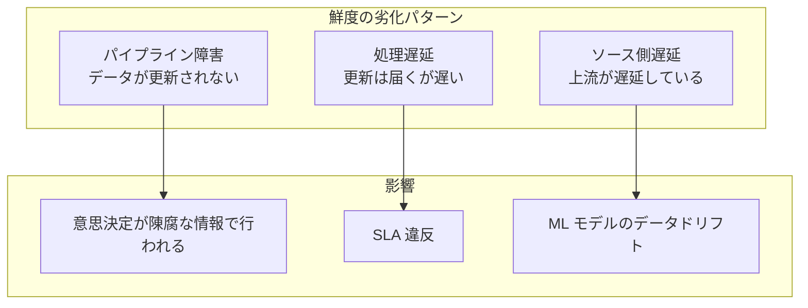

鮮度は特に、リアルタイムあるいはニアリアルタイムの意思決定（不正検知、在庫管理、価格最適化など）において重要な次元である。

### 2.5 一意性（Uniqueness）

一意性とは、識別子や本来重複してはいけないデータが重複していないかという次元である。ETLパイプラインのバグによる二重挿入、ソースシステムのデータ重複、JOIN 処理のミスによる行の増殖などが原因で発生する。

```sql
-- Uniqueness check: detect duplicate order_ids
SELECT
    order_id,
    COUNT(*) AS occurrence_count
FROM orders
GROUP BY order_id
HAVING COUNT(*) > 1
ORDER BY occurrence_count DESC;
```

一意性違反は集計処理で二重カウントを引き起こすため、売上や顧客数の集計が不正確になるという直接的な影響をもたらす。

### 2.6 妥当性（Validity）

妥当性とは、データが定義されたルールや制約に沿っているかという次元である。以下のような観点で評価する。

- **データ型の妥当性**: 日付カラムが有効な日付形式か、数値カラムに文字列が混入していないか
- **値域の妥当性**: 年齢が 0〜150 の範囲内か、割合が 0〜100%の範囲内か
- **フォーマットの妥当性**: メールアドレスが正規表現に一致するか、郵便番号が正しい桁数か
- **参照コードの妥当性**: 国コードが ISO 3166-1 に定義されたコードか

```python
# Example: validity checks with Great Expectations
# Age must be between 0 and 150
validator.expect_column_values_to_be_between(
    "age",
    min_value=0,
    max_value=150
)

# Status must be one of the defined values
validator.expect_column_values_to_be_in_set(
    "order_status",
    value_set={"pending", "processing", "shipped", "delivered", "cancelled"}
)

# Email format validation
validator.expect_column_values_to_match_regex(
    "email",
    regex=r"^[a-zA-Z0-9._%+\-]+@[a-zA-Z0-9.\-]+\.[a-zA-Z]{2,}$"
)
```

::: tip 6次元の相互関係
6つの次元は独立しているわけではない。例えば、一意性の問題（重複）はしばしば完全性を下げ（一意であるべきIDが重複することで、集計の完全性が意味をなさなくなる）、妥当性の問題（無効なデータ）は正確性を下げる。品質問題を診断する際は、複数の次元を横断的に見ることが重要である。
:::

### 2.7 次元ごとの指標化

6つの次元を具体的な指標として定量化することで、品質の経時変化を追跡し、SLAとして表現できるようになる。

| 次元 | 指標例 | 目標値の例 |
|---|---|---|
| 正確性 | ソースシステムとの一致率 | > 99.9% |
| 完全性 | 必須カラムの非NULL率 | = 100% |
| 一貫性 | 参照整合性違反件数 | = 0 件 |
| 鮮度 | 最終更新からの経過時間 | < 1時間 |
| 一意性 | 主キー重複件数 | = 0 件 |
| 妥当性 | ビジネスルール違反率 | < 0.01% |

## 3. データ品質の測定と監視ツール

### 3.1 Great Expectations

**Great Expectations（GX）** は、データ品質テストのためのオープンソースライブラリである。「期待値（Expectations）」という概念を使ってデータの品質ルールを宣言的に定義し、データセットに対して検証を実行する。Pandas、Spark、SQL データベースなど様々なバックエンドに対応している。

#### コアコンセプト

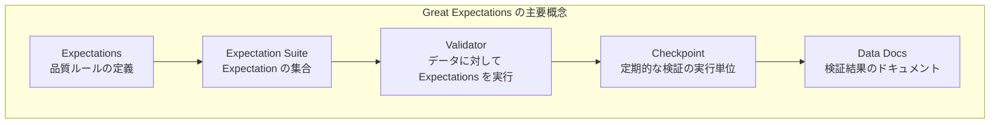

#### 実装例

```python
import great_expectations as gx
from great_expectations.core.batch import BatchRequest

# Initialize a GX context (file-based for local, cloud for production)
context = gx.get_context()

# Connect to a data source (e.g., Snowflake)
datasource = context.sources.add_snowflake(
    name="warehouse",
    account="my_account",
    user="gx_user",
    password="${SNOWFLAKE_PASSWORD}",
    database="ANALYTICS",
    schema="MARTS",
    warehouse="COMPUTE_WH"
)

# Define a data asset
asset = datasource.add_table_asset("fct_orders", table_name="fct_orders")
batch_request = asset.build_batch_request()

# Create an expectation suite
suite = context.create_expectation_suite("fct_orders_suite", overwrite_existing=True)
validator = context.get_validator(
    batch_request=batch_request,
    expectation_suite=suite
)

# Define expectations
validator.expect_column_values_to_not_be_null("order_id")
validator.expect_column_values_to_be_unique("order_id")
validator.expect_column_values_to_not_be_null("customer_id")
validator.expect_column_values_to_be_between("order_amount", min_value=0)
validator.expect_column_values_to_be_in_set(
    "status",
    value_set={"pending", "shipped", "delivered", "cancelled"}
)
# Expect order volume to be within historical range (anomaly detection)
validator.expect_table_row_count_to_be_between(
    min_value=10_000,
    max_value=200_000
)

# Save the suite
validator.save_expectation_suite()

# Create a checkpoint to run the suite periodically
checkpoint = context.add_or_update_checkpoint(
    name="daily_fct_orders_checkpoint",
    validations=[{"batch_request": batch_request, "expectation_suite_name": "fct_orders_suite"}]
)

# Run the checkpoint
result = checkpoint.run()
```

Great Expectations は実行結果を **Data Docs** と呼ばれる HTML レポートとして出力する。S3 などに公開することで、チーム全体がデータ品質の状態を確認できる。

### 3.2 dbt Tests

**dbt（data build tool）** は変換ツールとしてだけでなく、データ品質テストのプラットフォームとしても機能する。dbt Tests は、dbt のモデル（変換後のテーブル）に対して品質チェックを宣言的に記述できる機能である。

#### Generic Tests（組み込みテスト）

```yaml
# models/marts/schema.yml
version: 2

models:
  - name: fct_orders
    description: "Order fact table"
    columns:
      - name: order_id
        description: "Primary key"
        tests:
          - unique           # no duplicate order_id
          - not_null         # order_id must always be set
      - name: customer_id
        tests:
          - not_null
          - relationships:
              to: ref('dim_customers')
              field: customer_id   # referential integrity
      - name: status
        tests:
          - accepted_values:
              values: ['pending', 'shipped', 'delivered', 'cancelled']
      - name: order_amount
        tests:
          - not_null
          - dbt_utils.expression_is_true:
              expression: ">= 0"   # amount must be non-negative
```

#### Singular Tests（カスタムテスト）

```sql
-- tests/assert_order_date_before_shipped_date.sql
-- This test returns rows that violate the rule.
-- If the query returns 0 rows, the test passes.

SELECT
    order_id,
    order_date,
    shipped_date
FROM {{ ref('fct_orders') }}
WHERE shipped_date IS NOT NULL
  AND order_date > shipped_date
```

#### dbt-expectations によるテスト拡張

`dbt-expectations` パッケージは、Great Expectations にインスパイアされた豊富なテストを dbt に追加する。

```yaml
# models/marts/schema.yml with dbt-expectations
models:
  - name: fct_orders
    columns:
      - name: order_amount
        tests:
          - dbt_expectations.expect_column_values_to_be_between:
              min_value: 0
              max_value: 1000000
          - dbt_expectations.expect_column_quantile_values_to_be_between:
              quantile: 0.5
              min_value: 1000
              max_value: 50000
      - name: customer_id
        tests:
          - dbt_expectations.expect_column_values_to_match_regex:
              regex: "^cust-[0-9]{6}$"
    tests:
      # Table-level test: row count must be within range
      - dbt_expectations.expect_table_row_count_to_be_between:
          min_value: 10000
          max_value: 5000000
      # Column pair test: order_date must precede shipped_date
      - dbt_expectations.expect_column_pair_values_A_to_be_greater_than_B:
          column_A: shipped_date
          column_B: order_date
          or_equal: true
          row_condition: "shipped_date is not null"
```

### 3.3 Soda Core

**Soda Core** はオープンソースのデータ品質検証フレームワークで、**SodaCL（Soda Checks Language）** と呼ばれる YAML ベースの独自 DSL でデータ品質ルールを定義する。Python への依存を最小限にしながら、人間が読みやすいルール定義が特徴である。

```yaml
# checks/orders_checks.yml
checks for fct_orders:
  # Completeness
  - missing_count(order_id) = 0
  - missing_count(customer_id) = 0
  - missing_percent(shipping_address) < 5

  # Uniqueness
  - duplicate_count(order_id) = 0

  # Validity
  - invalid_count(status) = 0:
      valid values: [pending, shipped, delivered, cancelled]
  - min(order_amount) >= 0

  # Freshness
  - freshness(updated_at) < 2h

  # Volume anomaly detection (statistical)
  - anomaly score for row_count < default

  # Custom SQL check
  - failed rows:
      name: orders_shipped_after_order_date
      fail query: |
        SELECT order_id, order_date, shipped_date
        FROM fct_orders
        WHERE shipped_date IS NOT NULL
          AND order_date > shipped_date
```

Soda Core の実行は CLI から行う。

```bash
# Run checks against the data warehouse
soda scan -d snowflake -c config/soda_config.yml checks/orders_checks.yml
```

Soda は **Soda Cloud** というマネージドサービスも提供しており、チェック結果の履歴管理、アラート通知、品質ダッシュボードの機能を備えている。

### 3.4 ツールの選択指針

| 観点 | Great Expectations | dbt Tests | Soda Core |
|---|---|---|---|
| 定義方法 | Python コード | YAML + SQL | YAML (SodaCL) |
| 対象フェーズ | 取り込み・変換後 | 変換後（dbt モデル） | 任意のフェーズ |
| 統計的テスト | 充実 | dbt-expectations で拡張 | 基本的な異常検知あり |
| CI/CD 統合 | 可能（要設定） | dbt と自然に統合 | 可能（要設定） |
| 学習コスト | 高（Python 必要） | 低（dbt を使っている場合） | 低（YAML のみ） |
| 向いているケース | データ取り込み直後の検証 | dbt パイプラインの品質保証 | シンプルな宣言的チェック |

::: tip ツールの組み合わせ
実務では複数のツールを組み合わせることが多い。例えば、データ取り込み直後は Great Expectations で生データを検証し、dbt モデルの品質保証は dbt Tests で行い、横断的なモニタリングは Soda Cloud に任せる、というアーキテクチャが採用されることがある。
:::

## 4. データ契約（Data Contracts）の概念

### 4.1 データ契約とは何か

**データ契約（Data Contracts）** とは、データのプロデューサー（生成者）とコンシューマー（利用者）の間の合意を、明示的かつ機械可読な形で文書化したものである。「このデータはどのようなスキーマを持ち、どのような品質が保証され、誰が責任を持ち、どのような SLA で提供されるか」を契約として定義する。

概念としては、Web API の世界における OpenAPI 仕様（Swagger）に対応する。OpenAPI は「この API はこのエンドポイントを持ち、このリクエスト形式を受け付け、このレスポンス形式を返す」という契約をコードから独立した形で定義する。データ契約は、データパイプラインの世界でこれと同等の役割を果たす。

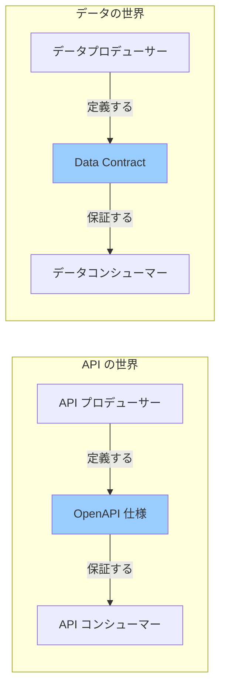

### 4.2 データ契約が解決する問題

データ契約が生まれた背景には、以下のような組織的な問題がある。

**暗黙の依存関係の顕在化**: 「誰が誰のデータを使っているか」が不明確なため、上流の変更が下流に予期せぬ破壊的影響をもたらす。データ契約は依存関係を明示し、変更の影響範囲を可視化する。

**責任の明確化**: データに問題が生じたとき、「これはプロデューサーの問題か、コンシューマーの問題か」という責任の所在が不明確になりがちである。データ契約は責任の境界を定義する。

**品質期待値の齟齬**: コンシューマーは「このデータは毎時更新される」と思っていたが、実際は日次更新だった、というような期待値のずれを解消する。

**スキーマ変更のガバナンス**: プロデューサーがデータのスキーマを変更する際、コンシューマーへの事前通知なしに変更されることへの対策となる。

::: warning データ契約は技術的解決策だけではない
データ契約の真の価値は、YAML ファイルを書くことではなく、プロデューサーとコンシューマーが**コミュニケーションするプロセスを組織に根付かせること**にある。技術的な仕様書を整備することは手段であり、目的はデータに対する信頼と責任の文化を育てることである。
:::

### 4.3 データ契約の構成要素

典型的なデータ契約は以下の要素で構成される。

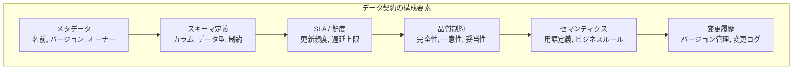

## 5. データ契約の仕様と実装

### 5.1 Open Data Contract Standard (ODCS)

データ契約の仕様として、業界では **Open Data Contract Standard（ODCS）** が標準化の動きをリードしている。ODCS は YAML 形式のスキーマで、データ契約に含まれるべき要素を定義している。

```yaml
# Example: Data Contract for orders dataset (ODCS format)
apiVersion: v2.2.0
kind: DataContract

id: "urn:orders:fct_orders:v2.1"
version: "2.1.0"
name: "fct_orders"
status: active

info:
  title: "注文ファクトテーブル"
  description: |
    注文に関する事実を記録するファクトテーブル。
    すべての注文ステータス変化を含む。
  owner: "data-platform-team"
  contact:
    name: "Data Platform Team"
    email: "data-platform@example.com"
    url: "https://slack.example.com/data-platform"

servers:
  - server: "production"
    type: bigquery
    project: "analytics-prod"
    dataset: "marts"
    table: "fct_orders"

terms:
  usage: "分析目的での参照のみ許可。直接書き込みは禁止。"
  billing: "クエリコストはコンシューマーチームに帰属。"
  limitations: "PII データを含むため、GDPR に準拠した取り扱いが必要。"

# Schema definition
schema:
  - name: order_id
    type: string
    description: "注文の一意識別子（UUID v4 形式）"
    primaryKey: true
    required: true
    pii: false

  - name: customer_id
    type: string
    description: "顧客の一意識別子"
    required: true
    references: "dim_customers.customer_id"

  - name: order_date
    type: date
    description: "注文が作成された日付（UTC）"
    required: true

  - name: order_amount
    type: decimal(12, 2)
    description: "注文合計金額（円）。税込み。"
    required: true
    minimum: 0

  - name: status
    type: string
    description: "注文の現在のステータス"
    required: true
    enum:
      - pending
      - processing
      - shipped
      - delivered
      - cancelled

  - name: updated_at
    type: timestamp
    description: "レコードの最終更新時刻（UTC）"
    required: true

# Service Level Agreement
sla:
  freshness:
    description: "データは1時間以内に更新される"
    interval: "1h"
    gracePeriod: "30m"
  completeness:
    description: "過去30日分のデータが完全に存在する"
    window: "30d"
  availability:
    description: "99.9% の可用性を保証する"
    target: "99.9%"
  support:
    description: "データ品質問題の対応時間"
    responseTime: "4h"
    resolutionTime: "24h"

# Quality rules
quality:
  - rule: "order_id は一意であること"
    dimension: uniqueness
    column: order_id
    check: "duplicate_count = 0"

  - rule: "order_amount は 0 以上であること"
    dimension: validity
    column: order_amount
    check: "min >= 0"

  - rule: "status は定義値のみであること"
    dimension: validity
    column: status
    check: "invalid_count = 0"

  - rule: "主要カラムに NULL がないこと"
    dimension: completeness
    columns: [order_id, customer_id, order_date, order_amount, status]
    check: "missing_count = 0"

# Change management
changelog:
  - version: "2.1.0"
    date: "2026-02-01"
    description: "discount_amount カラムを追加"
    breaking: false
    author: "data-platform-team"
  - version: "2.0.0"
    date: "2025-10-01"
    description: "amount カラムを order_amount にリネーム（破壊的変更）"
    breaking: true
    author: "data-platform-team"
    migration: "https://wiki.example.com/data-contracts/fct-orders-v2-migration"
```

### 5.2 datacontract-cli による実装

**datacontract-cli** は、ODCS 形式のデータ契約ファイルを処理するオープンソース CLI ツールである。契約の構文検証、品質チェックの実行、差分検出など、データ契約のライフサイクル管理を支援する。

```bash
# Install
pip install datacontract-cli

# Validate a data contract syntax
datacontract lint datacontract.yaml

# Test: run quality checks defined in the contract against the actual data
datacontract test datacontract.yaml

# Check if a new version of the contract introduces breaking changes
datacontract breaking \
    --old datacontract-v2.0.yaml \
    --new datacontract-v2.1.yaml

# Export to various formats (HTML, JSON Schema, Avro, dbt, etc.)
datacontract export --format html datacontract.yaml > contract.html
datacontract export --format dbt datacontract.yaml > schema.yml
```

破壊的変更の検出例。

```bash
$ datacontract breaking --old v2.0.yaml --new v2.1.yaml
Breaking changes detected:
  - BREAKING: Column 'amount' removed (was: required)
Non-breaking changes:
  - INFO: Column 'discount_amount' added (optional)
  - INFO: SLA freshness changed from 2h to 1h (improvement)
```

### 5.3 dbt との統合

dbt v1.5 以降では、モデルの `contract` 設定によってスキーマ契約を強制できる。これは dbt モデルをデータ契約のエンフォースポイントとして機能させる仕組みである。

```yaml
# models/marts/schema.yml
version: 2

models:
  - name: fct_orders
    description: "注文ファクトテーブル"
    config:
      contract:
        enforced: true  # contract enforcement is ON
    columns:
      - name: order_id
        data_type: string
        constraints:
          - type: not_null
          - type: primary_key
      - name: customer_id
        data_type: string
        constraints:
          - type: not_null
          - type: foreign_key
            to: ref('dim_customers')
            to_columns: ['customer_id']
      - name: order_amount
        data_type: numeric(12, 2)
        constraints:
          - type: not_null
          - type: check
            expression: "order_amount >= 0"
      - name: status
        data_type: string
        constraints:
          - type: not_null
```

`enforced: true` が設定されている場合、dbt はモデルの出力が宣言されたスキーマと一致しない場合にエラーを発生させる。これにより、上流モデルのカラム追加・削除・型変更が下流のデータ契約を壊すことをコンパイル時に検知できる。

## 6. Data Mesh における Data Contract の役割

### 6.1 Data Mesh とは

**Data Mesh** は、Zhamak Dehghani が 2019 年に提唱した分散型のデータアーキテクチャ思想である。従来の中央集権型データプラットフォーム（単一のデータエンジニアリングチームがすべてのデータパイプラインを管理する）に対するアンチテーゼとして提唱された。

Data Mesh の 4 つの原則は以下の通りである。

1. **ドメイン所有権（Domain Ownership）**: データはそれを最もよく理解しているドメインチームが所有・管理する
2. **データプロダクト（Data as a Product）**: データを社内のプロダクトとして扱い、品質・信頼性・使いやすさに責任を持つ
3. **セルフサービスプラットフォーム（Self-serve Data Platform）**: ドメインチームが自律的にデータプロダクトを開発・公開・消費できるプラットフォームを整備する
4. **連邦型ガバナンス（Federated Computational Governance）**: 分散した意思決定を保ちながら、相互運用性と標準化のための共通ルールを自動的に適用する

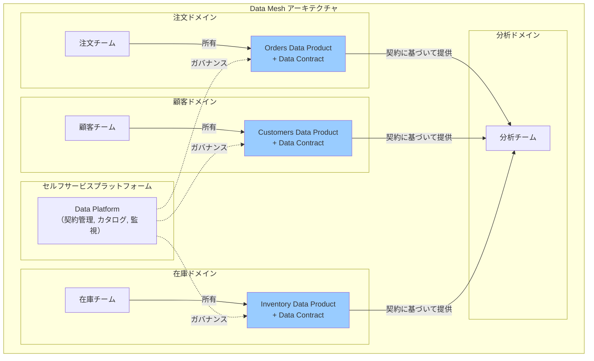

### 6.2 Data Contract が Data Mesh を成立させる

Data Mesh の思想において、データ契約は「データプロダクト」の表面（インターフェース）を定義する核心的な仕組みである。

ドメインチームが自律的にデータを管理する Data Mesh では、中央のデータエンジニアリングチームが品質を一括管理する代わりに、各ドメインが自分のデータプロダクトの品質に責任を持つ。しかし、分散した状態でも組織全体のデータエコシステムが機能するためには、**プロダクト間のインターフェースが明確かつ安定している**必要がある。

データ契約はこのインターフェースを定義する。「注文ドメインが公開する `fct_orders` はこのスキーマを持ち、この SLA で更新される」という契約があれば、分析ドメインは注文ドメームの内部実装を知らずとも、安心してデータを利用できる。

### 6.3 ドメイン所有権とデータ契約のガバナンス

Data Mesh における連邦型ガバナンスでは、以下のようなルールをプラットフォームレベルで自動適用する。

- すべての公開データプロダクトはデータ契約を持たなければならない
- データ契約は機械可読な標準形式（ODCS など）で定義されなければならない
- 破壊的変更は事前のコンシューマー通知と移行期間を必要とする
- 品質チェックは CI/CD パイプラインで自動実行されなければならない

これにより、各ドメインの自律性を尊重しながら、組織全体のデータ品質とガバナンスが担保される。

## 7. Schema Registry との統合

### 7.1 Schema Registry の役割

**Schema Registry**（Confluent Schema Registry が代表的）は、メッセージングシステム（Kafka など）で使われるデータスキーマを一元管理するサービスである。プロデューサーはスキーマを Schema Registry に登録し、コンシューマーはスキーマを取得してメッセージを正しくデシリアライズする。

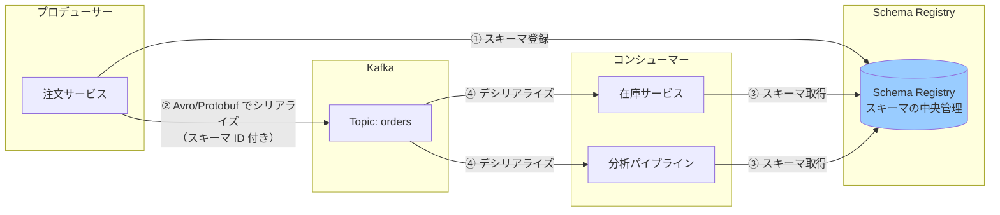

### 7.2 スキーマ互換性ルール

Schema Registry の最大の価値は、**スキーマの進化（Evolution）を管理するための互換性ルール**である。新しいスキーマのバージョンを登録する際に、既存のコンシューマーとの互換性を自動チェックする。

| 互換性モード | 説明 | 許可される変更 |
|---|---|---|
| `BACKWARD` | 新バージョンのスキーマで旧バージョンのデータを読める | フィールド削除（optional）、フィールド追加（with default） |
| `FORWARD` | 旧バージョンのスキーマで新バージョンのデータを読める | フィールド追加（optional）、フィールド削除（with default） |
| `FULL` | 前後方向に互換 | フィールド追加（with default）のみ |
| `NONE` | 互換性チェックなし | すべての変更 |

```python
# Check compatibility before deploying a new schema version
from confluent_kafka.schema_registry import SchemaRegistryClient
from confluent_kafka.schema_registry.avro import AvroSchema

sr_client = SchemaRegistryClient({"url": "http://schema-registry:8081"})

new_schema = AvroSchema("""{
  "type": "record",
  "name": "Order",
  "fields": [
    {"name": "order_id", "type": "string"},
    {"name": "customer_id", "type": "string"},
    {"name": "order_amount", "type": "double"},
    {"name": "status", "type": "string"},
    {"name": "discount_amount",
     "type": ["null", "double"],
     "default": null}
  ]
}""")

# Test compatibility against the current version
result = sr_client.test_compatibility("orders-value", new_schema)
if result:
    print("Schema is compatible. Safe to deploy.")
else:
    print("Schema is NOT compatible! Breaking change detected.")
    # Block the deployment
    exit(1)
```

### 7.3 データ契約と Schema Registry の関係

Schema Registry はストリーミングデータ（Kafka など）のスキーマ管理に特化しているのに対し、データ契約はより広い範囲（バッチデータ、ウェアハウステーブル、API レスポンスなど）のインターフェースを扱う。

両者は補完関係にある。

- ストリーミングイベントのスキーマは Schema Registry で管理し、そのスキーマをデータ契約の一部として参照する
- データ契約の「スキーマ定義」セクションは、Schema Registry に登録されたスキーマへの参照を含められる
- CI/CD パイプラインで、データ契約の変更が Schema Registry の互換性ルールに違反していないかを自動チェックする

```yaml
# Data contract referencing Schema Registry
schema:
  type: avro
  schemaRegistryUrl: "http://schema-registry:8081"
  subject: "orders-value"
  version: 3
  # Inline schema also defined for documentation purposes
  fields:
    - name: order_id
      type: string
    # ... etc
```

## 8. Data Observability

### 8.1 Data Observability とは

**Data Observability（データオブザーバビリティ）** とは、データシステムの健全性を継続的に監視・把握する能力のことである。ソフトウェアエンジニアリングにおける「オブザーバビリティ（可観測性）」の概念をデータの世界に持ち込んだものであり、「データダウンタイム（データが壊れている、古い、誤っている状態）」を最小化することを目的とする。

Data Observability の 5 つの柱は以下の通りである。

1. **鮮度（Freshness）**: データはいつ更新されたか。更新の遅延は発生していないか
2. **品質（Quality）**: データは想定された品質基準を満たしているか
3. **量（Volume）**: データ量は期待される範囲内か。突然の増減はないか
4. **スキーマ（Schema）**: スキーマは変更されていないか。変更は検知されているか
5. **リネージ（Lineage）**: データはどこから来てどこへ行くか。影響範囲はどこか

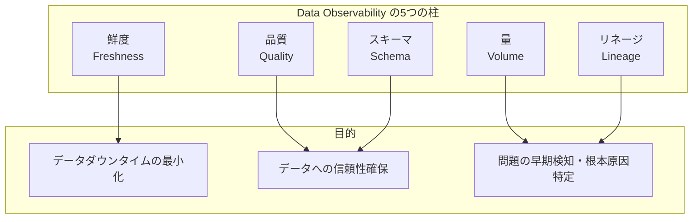

### 8.2 Monte Carlo

**Monte Carlo** は Data Observability の代表的なマネージドサービスである。統計的な機械学習手法を使い、「過去のデータの振る舞い」を学習して正常な範囲を自動的に推定する。定義済みのルールだけでなく、**未知の問題（Unknown Unknowns）** を自動的に検知できる点が特徴である。

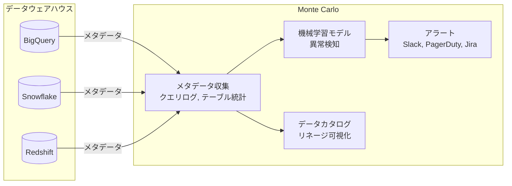

Monte Carlo の主な機能。

- **自動異常検知**: 行数、NULL 率、カラム分布の統計的な異常を検知する。手動でルールを定義しなくても、過去の正常パターンから逸脱を自動的に発見する
- **エンドツーエンドのデータリネージ**: SQL のクエリログを解析して、テーブル間の依存関係グラフを自動的に構築する
- **インシデント管理**: データ品質問題をインシデントとして管理し、根本原因の調査から解消まで追跡する
- **アラート通知**: Slack、PagerDuty、Jira などと連携して、品質問題を関係者に通知する

### 8.3 Elementary

**Elementary** は、dbt エコシステムに深く統合されたオープンソースの Data Observability ツールである。dbt の実行結果、テスト結果、モデルの統計情報を dbt プロジェクト内のテーブルに記録し、専用のダッシュボードで可視化する。

```yaml
# packages.yml - add Elementary to your dbt project
packages:
  - package: elementary-data/elementary
    version: [">=0.14.0", "<1.0.0"]
```

```yaml
# dbt_project.yml - enable Elementary monitoring
models:
  elementary:
    +schema: "elementary"
  my_project:
    marts:
      fct_orders:
        +meta:
          # Enable anomaly detection for this model
          elementary:
            timestamp_column: "updated_at"
            anomaly_sensitivity: medium
```

Elementary が自動的に収集するメトリクス。

```yaml
# models/marts/schema.yml - elementary data monitoring configuration
models:
  - name: fct_orders
    meta:
      elementary:
        timestamp_column: updated_at
    tests:
      # Volume anomaly detection: alert if row count deviates significantly
      - elementary.volume_anomalies:
          timestamp_column: order_date
          time_bucket:
            period: day
            count: 1

      # Freshness monitoring: alert if table is not updated within 2 hours
      - elementary.table_anomalies:
          timestamp_column: updated_at
          anomaly_params:
            anomaly_exclude_metrics: [freshness]

    columns:
      - name: order_amount
        tests:
          # Distribution anomaly: alert if average/stddev changes significantly
          - elementary.column_anomalies:
              column_anomalies:
                - average
                - standard_deviation
                - null_rate
                - zero_rate
```

Elementary のダッシュボード（`elementary report` コマンドで生成）では、以下を確認できる。

- すべての dbt テストの結果履歴
- モデルごとの行数・実行時間の推移グラフ
- 異常検知アラートの一覧
- データリネージグラフ（dbt の DAG から自動生成）

::: details Monte Carlo vs Elementary の選択
Monte Carlo はウェアハウスに直接接続し、クエリログを自動解析する**エージェントレス**なアプローチが特徴で、dbt 以外の環境でも使える汎用性がある。一方 Elementary は dbt プロジェクトに組み込む形で機能し、dbt の概念（モデル、テスト、DAG）と深く統合されているが、dbt を使っていない環境では利用できない。dbt を中心としたデータスタックを構築している場合は Elementary がシームレスに統合できる。
:::

## 9. 破壊的変更の防止とスキーマ進化

### 9.1 破壊的変更とは何か

**破壊的変更（Breaking Changes）** とは、データのコンシューマーが既存のコードを変更せずに継続して利用できなくなる変更のことである。代表的な破壊的変更は以下の通り。

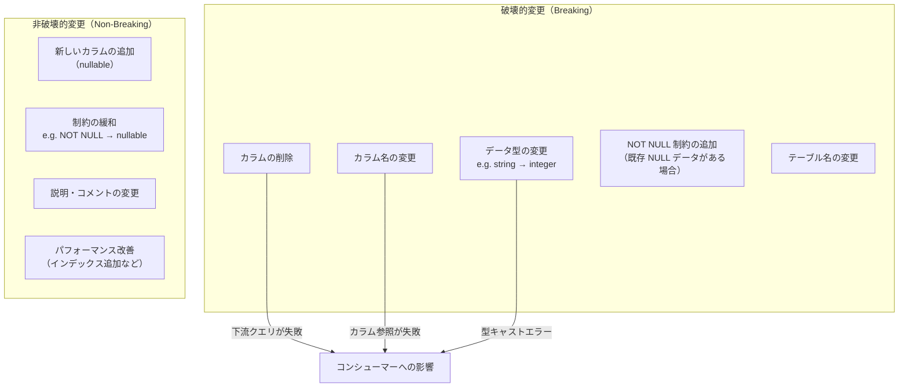

### 9.2 Breaking Change の防止戦略

#### CI/CD での自動チェック

データ契約とスキーマの差分を CI/CD パイプラインで自動チェックすることで、破壊的変更をデプロイ前に検知する。

```yaml
# .github/workflows/data-contract-check.yml
name: Data Contract Validation

on:
  pull_request:
    paths:
      - 'models/**/*.yml'
      - 'datacontracts/**/*.yaml'

jobs:
  contract-check:
    runs-on: ubuntu-latest
    steps:
      - uses: actions/checkout@v4

      - name: Install datacontract-cli
        run: pip install datacontract-cli

      - name: Check for breaking changes
        run: |
          # Compare the contract in the PR branch vs. main
          git fetch origin main
          datacontract breaking \
            --old <(git show origin/main:datacontracts/fct_orders.yaml) \
            --new datacontracts/fct_orders.yaml

      - name: Validate contract syntax
        run: |
          for f in datacontracts/*.yaml; do
            datacontract lint "$f"
          done

      - name: Run dbt compile to check schema contracts
        run: |
          dbt compile --select state:modified+
```

#### 2ステップマイグレーション

破壊的変更が避けられない場合は、コンシューマーへの影響を最小化するため、2ステップのマイグレーションを採用する。

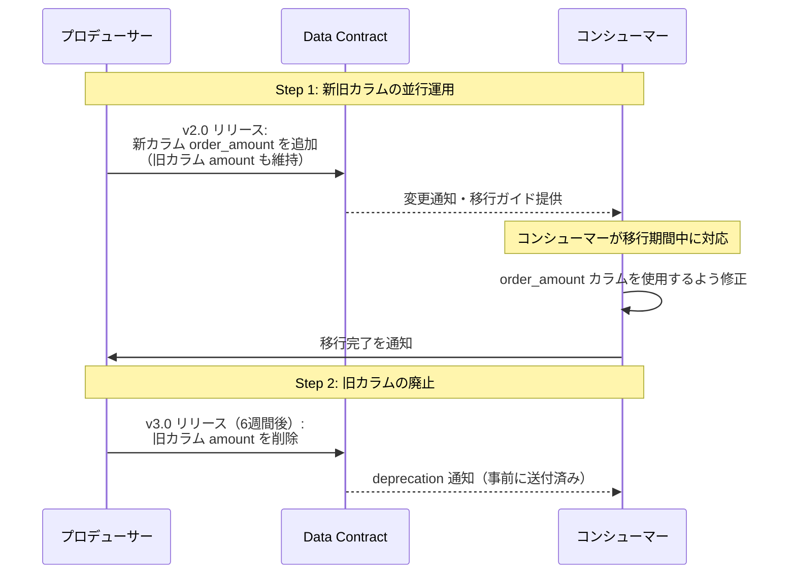

### 9.3 スキーマ進化のベストプラクティス

#### Expand-Contract パターン

ソフトウェアエンジニアリングの「Blue-Green Deploy」に対応するスキーマ移行パターンである。

```
Phase 1: Expand（拡張）
  - 新しいカラム/テーブルを追加（古いものは残す）
  - プロデューサーは両方に書き込む
  - コンシューマーは移行のための猶予期間を得る

Phase 2: Contract（縮小）
  - 全コンシューマーの移行が完了したことを確認
  - 古いカラム/テーブルを削除
  - データ契約のバージョンを更新
```

#### データ契約のバージョニングポリシー

```yaml
# Versioning policy in data contract
versioning:
  policy: semver
  # MAJOR: breaking changes (schema removal, type changes)
  # MINOR: non-breaking additions
  # PATCH: documentation, description fixes

deprecation:
  # Minimum notice period before removing a breaking change
  noticePeriod: "8 weeks"
  # Communication channels for deprecation notices
  channels:
    - type: email
      recipients: ["data-consumers@example.com"]
    - type: slack
      channel: "#data-platform-announcements"

compatibility:
  # Minimum number of versions to maintain backward compatibility
  backwardCompatibilityVersions: 2
```

### 9.4 フィールド廃止（Deprecation）の実装

データ契約でフィールドを廃止する際の具体的な実装例。

```yaml
# models/marts/schema.yml
version: 2

models:
  - name: fct_orders
    columns:
      # Deprecated column - will be removed in v3.0 (2026-04-01)
      - name: amount
        description: |
          [DEPRECATED - Use order_amount instead. Will be removed on 2026-04-01]
          注文合計金額（旧名称）。
        meta:
          deprecated: true
          deprecated_reason: "Renamed to order_amount for clarity"
          deprecated_since: "2026-02-01"
          removal_date: "2026-04-01"
          replacement: "order_amount"

      # New column
      - name: order_amount
        description: "注文合計金額（円）。税込み。"
        data_type: numeric(12, 2)
        tests:
          - not_null
```

## 10. 実践的なデータ品質・契約の導入戦略

### 10.1 段階的な導入アプローチ

データ品質とデータ契約の取り組みは、一度に完璧な仕組みを構築しようとするより、段階的に導入する方が組織に定着しやすい。

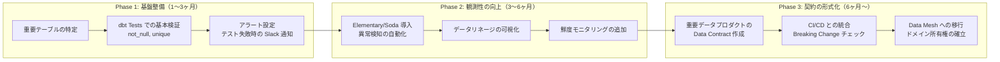

### 10.2 組織的な取り組み

技術的な仕組みと並行して、組織的な取り組みも重要である。

**データスチュワードシップ（Data Stewardship）**: 各データプロダクトに明確なオーナーを設定する。オーナーはデータ契約の作成・維持・更新に責任を持ち、コンシューマーからの問い合わせに対応する。

**変更管理プロセス**: スキーマ変更のプルリクエストには、影響を受けるコンシューマーを特定し、事前通知を行うことをプロセスとして義務付ける。

**データ品質 SLA の設定**: ビジネス側と協議の上、各データプロダクトの品質 SLA を定義し、それを達成できない場合のエスカレーションパスを整備する。

### 10.3 典型的なアーキテクチャ

本記事で解説したツールとコンセプトを統合した、典型的なデータ品質・契約アーキテクチャを示す。

```mermaid
graph TB
    subgraph "データソース"
        SRC1[SaaS / アプリケーション DB]
        SRC2[イベントストリーム<br/>（Kafka）]
    end

    subgraph "取り込みレイヤー"
        EL[EL ツール<br/>Fivetran / Airbyte]
        CDC[CDC<br/>Debezium]
        SR[Schema Registry<br/>スキーマ管理]
    end

    subgraph "変換レイヤー"
        DBT[dbt<br/>変換 + テスト + 契約]
        GX[Great Expectations<br/>取り込み時検証]
    end

    subgraph "データウェアハウス"
        DW[(Snowflake / BigQuery)]
    end

    subgraph "品質・契約管理"
        ELEM[Elementary<br/>Data Observability]
        SOD[Soda Core<br/>品質チェック]
        DCLI[datacontract-cli<br/>契約検証・差分チェック]
        CAT[データカタログ<br/>契約の公開・検索]
    end

    subgraph "消費レイヤー"
        BI[BI / レポート]
        ML[ML パイプライン]
    end

    SRC1 --> EL --> DW
    SRC2 --> CDC
    CDC --> SR
    SR --> DW

    GX -.->|取り込み直後の検証| EL
    DW --> DBT
    DBT --> DW
    DBT -.->|テスト結果| ELEM
    SOD -.->|品質チェック| DW
    DCLI -.->|契約検証 (CI/CD)| DBT
    ELEM --> CAT
    DCLI --> CAT

    DW --> BI
    DW --> ML

    style DBT fill:#ffcc99
    style DW fill:#99ccff
    style ELEM fill:#c8e6c9
    style CAT fill:#e1bee7
```

## 11. まとめ

データ品質とデータ契約は、データエンジニアリングが成熟するにつれて避けて通れないテーマとなっている。本記事の内容を整理すると以下のようになる。

**データ品質の6次元**: 正確性・完全性・一貫性・鮮度・一意性・妥当性という多角的な視点でデータ品質を評価することで、品質問題を定量化し SLA として表現できる。品質指標は一度測定して終わりではなく、継続的に監視する仕組みが必要である。

**測定・監視ツール**: Great Expectations はコード中心で柔軟性が高く、dbt Tests は dbt パイプラインとシームレスに統合し、Soda Core は宣言的な定義で使いやすい。これらは単独で使うのではなく、パイプラインの異なるフェーズで組み合わせることが多い。

**データ契約**: プロデューサーとコンシューマーの明示的な合意を機械可読な形で文書化することで、スキーマ変更のガバナンス・責任の明確化・品質期待値の共有が可能になる。ODCS のような標準仕様と datacontract-cli のような自動化ツールを活用することで、契約管理を CI/CD に組み込める。

**Data Mesh との関係**: Data Mesh においてデータ契約は、分散した自律的なドメインが協調して機能するための「接続インターフェース」を提供する。各ドメインがデータプロダクトの品質に責任を持ち、その品質を契約として表明することが Data Mesh アーキテクチャの基盤となる。

**Schema Registry**: Kafka のようなストリーミング基盤では Schema Registry がスキーマ管理を担い、データ契約とは補完的な関係にある。互換性ルールによる破壊的変更の自動検知は、スキーマ進化の安全な管理に不可欠である。

**Data Observability**: Monte Carlo や Elementary のようなツールは、定義したルールを超えた「未知の問題」を統計的異常検知によって発見する。事後的なインシデント対応から事前的な品質管理へのシフトを実現する。

**破壊的変更の管理**: Expand-Contract パターン、CI/CD への自動チェック統合、段階的なデプロイによって、スキーマ進化に伴うコンシューマーへの影響を最小化できる。

データ品質は「一度整備すれば終わり」のプロジェクトではなく、継続的な取り組みである。技術的な仕組みを整備するとともに、データに対するオーナーシップ意識とコミュニケーション文化を組織に根付かせることが、長期的なデータ品質の維持・向上につながる。
