# データ競合と ThreadSanitizer — 並行バグの検出と防止

## 1. 背景と動機 — なぜデータ競合は深刻なのか

マルチスレッドプログラミングは現代のソフトウェア開発において不可欠な技術である。マルチコアプロセッサの普及に伴い、性能を最大限に引き出すためには並行処理の活用が求められる。しかし、並行プログラムには逐次プログラムにはない固有の困難がある。その中でも最も基本的かつ深刻な問題が**データ競合（Data Race）** である。

データ競合は、プログラムの実行結果を非決定的にし、再現困難なバグを引き起こす。テスト環境では問題なく動作するプログラムが、本番環境で突如としてクラッシュしたり、データを破壊したりする。しかも、バグの発現がタイミングに依存するため、従来のデバッグ手法（ブレークポイント、ログ出力など）では原因の特定が極めて困難である。

本記事では、まずデータ競合の正確な定義と、しばしば混同される「競合状態（Race Condition）」との違いを明確にする。次に、データ競合がなぜ未定義動作を引き起こすのかをメモリモデルの観点から解説する。そして、この問題を動的に検出するツールである **ThreadSanitizer（TSan）** の仕組みと使い方を深く掘り下げる。

### 1.1 並行バグの歴史的な事例

データ競合に起因するバグは、多くの重大なソフトウェア障害を引き起こしてきた。

- **Therac-25（1985-1987年）**: 放射線治療機器において、競合状態が原因で患者が過剰な放射線を浴び、死亡事故が発生した。ソフトウェアの並行処理の不備が、ハードウェアのインターロック機構を無効化してしまった
- **Northeast blackout（2003年）**: 電力管理システムのソフトウェアにおける競合状態が、アラーム通知の遅延を引き起こし、米国北東部の大規模停電の一因となった
- **MySQL のレプリケーションバグ**: データ競合に起因するレプリケーション不整合が複数報告されている。並行アクセスの多いデータベースシステムでは、微妙なデータ競合が重大なデータ損失につながりうる

これらの事例が示すように、データ競合は単なるプログラミングミスではなく、人命や社会インフラに影響を及ぼしうる深刻な問題である。

## 2. データ競合の定義

### 2.1 データ競合とは何か

**データ競合（Data Race）** の厳密な定義は以下の通りである。

> 2つ以上のスレッドが、同一のメモリ位置に対して同時にアクセスし、少なくとも1つのアクセスが書き込みであり、かつそれらのアクセスの間に happens-before 関係が存在しない場合、データ競合が発生する。

この定義の各要素を分解して理解する。

1. **同一のメモリ位置**: 同じ変数、配列の同じ要素、構造体の同じフィールドなど
2. **同時アクセス**: 複数のスレッドが並行してアクセスする（つまり、適切な同期なしに同時に実行される可能性がある）
3. **少なくとも1つが書き込み**: 全てが読み取りであればデータ競合は発生しない
4. **happens-before 関係がない**: ロックやアトミック操作などの同期機構によって順序付けられていない

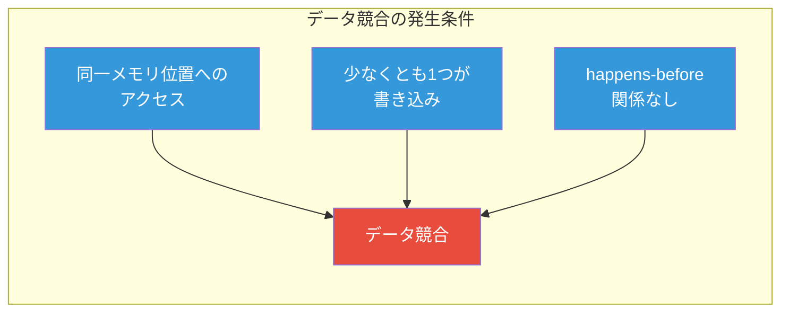

### 2.2 データ競合の具体例

最もシンプルなデータ競合の例を C++ で示す。

```cpp
#include <thread>

int counter = 0; // shared variable

void increment() {
    for (int i = 0; i < 1000000; i++) {
        counter++; // DATA RACE: unsynchronized write
    }
}

int main() {
    std::thread t1(increment);
    std::thread t2(increment);
    t1.join();
    t2.join();
    // Expected: 2000000, Actual: unpredictable
    return 0;
}
```

`counter++` は一見すると1つの操作に見えるが、実際にはCPU命令レベルでは「読み取り→加算→書き戻し」という3つのステップから成る。2つのスレッドがこのステップを同時に実行すると、更新が失われる（lost update）可能性がある。

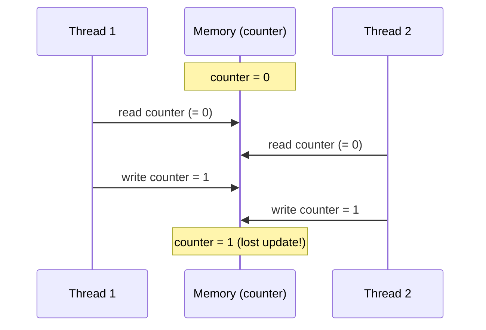

### 2.3 データ競合と競合状態の違い

**データ競合（Data Race）** と **競合状態（Race Condition）** は頻繁に混同されるが、本質的に異なる概念である。

| 特性 | データ競合（Data Race） | 競合状態（Race Condition） |
|------|------------------------|--------------------------|
| 定義 | 同期なしの同時メモリアクセス（少なくとも1つが書き込み） | プログラムの正しさが実行順序に依存する論理的バグ |
| 検出 | ツールで検出可能（TSan等） | ツールでの自動検出は困難（ロジックに依存） |
| 修正 | 適切な同期の追加 | アルゴリズムやプロトコルの再設計 |
| 未定義動作 | C/C++ では未定義動作 | 定義された動作だが意図しない結果 |

::: tip データ競合なしの競合状態
データ競合がなくても競合状態は発生しうる。例えば、以下のコードでは全てのアクセスがロックで保護されているためデータ競合はないが、check-then-act パターンによる競合状態が存在する。

```cpp
std::mutex mtx;
std::map<std::string, int> accounts;

void transfer(const std::string& from, const std::string& to, int amount) {
    {
        std::lock_guard<std::mutex> lock(mtx);
        if (accounts[from] >= amount) {
            // OK: enough balance
        } else {
            return; // insufficient funds
        }
    }
    // Race condition: balance may have changed between check and act!
    {
        std::lock_guard<std::mutex> lock(mtx);
        accounts[from] -= amount;
        accounts[to] += amount;
    }
}
```
:::

::: warning 競合状態なしのデータ競合
逆に、競合状態がなくてもデータ競合は発生しうる。例えば、フラグ変数を同期なしに書き込む場合、プログラムの意図としては正しく動く場合でも、C/C++ の規格上は未定義動作である。

```cpp
bool ready = false; // DATA RACE even if "logically correct"

void producer() {
    // prepare data ...
    ready = true; // unsynchronized write
}

void consumer() {
    while (!ready) {} // unsynchronized read — DATA RACE
    // use data ...
}
```
:::

### 2.4 データ競合のカテゴリ

データ競合は、アクセスパターンによっていくつかのカテゴリに分類される。

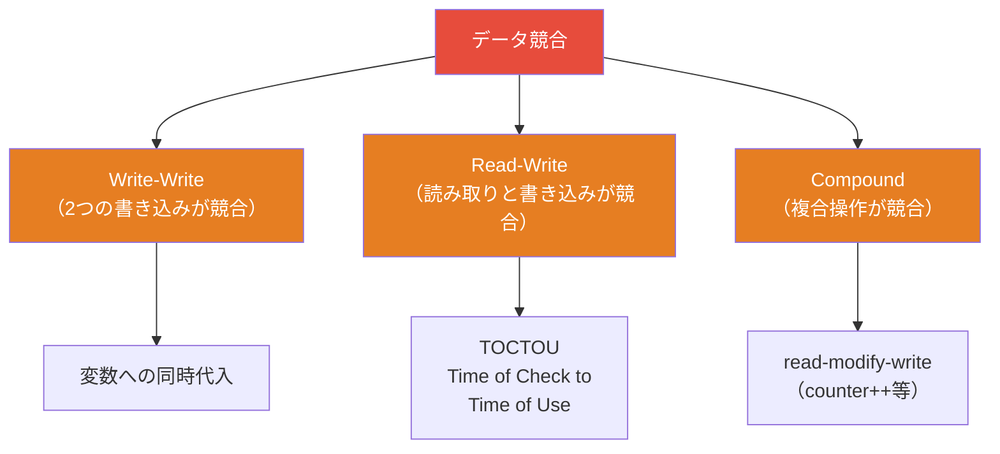

**Write-Write 競合**: 2つのスレッドが同じ変数に異なる値を書き込もうとする場合。最終的な値がどちらになるかは不定である。これは特にポインタやリソースハンドルの場合に危険で、一方のスレッドが書き込んだ値が失われることでリソースリークが発生する可能性がある。

**Read-Write 競合**: あるスレッドが変数を読み取っている最中に、別のスレッドがその変数を書き換える場合。読み取り側は不完全な値（torn read）を受け取る可能性がある。

**Compound 競合**: `counter++` のような read-modify-write 操作で発生する。個々のステップは正しくても、全体として原子的でないために更新が失われる。

## 3. メモリモデルとデータ競合の関係

### 3.1 なぜメモリモデルが必要なのか

現代のコンピュータアーキテクチャでは、プログラムの実行順序がソースコードに記述された順序と一致するとは限らない。これは主に以下の3つの要因による。

1. **コンパイラの最適化**: コンパイラはプログラムの意味を変えない限り、命令の並べ替え、ループの展開、変数のレジスタ割り当てなどの最適化を行う
2. **CPUのアウトオブオーダー実行**: CPUはパイプラインの効率を最大化するために、命令を順序通りに実行しない場合がある
3. **ストアバッファとキャッシュ**: 書き込みはストアバッファにキューイングされ、他のコアから即座に見えない場合がある

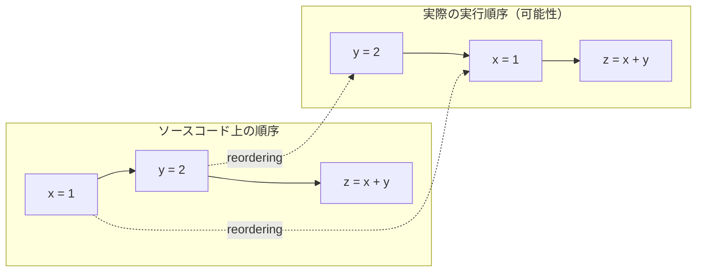

シングルスレッドプログラムでは、このような並べ替えはプログラムの観測可能な振る舞いに影響しない（as-if ルール）。しかし、マルチスレッドプログラムでは、あるスレッドで行われた並べ替えが、別のスレッドからの観測結果に影響を与えうる。

### 3.2 C++ メモリモデル（C++11以降）

C++11 で導入されたメモリモデルは、マルチスレッドプログラムにおけるメモリアクセスの意味を厳密に定義している。その中核にある概念が **happens-before 関係** である。

**happens-before 関係**は以下のように定義される。

- 同一スレッド内の操作は、プログラム順（program order）で happens-before 関係にある
- `std::mutex` の `unlock()` は、同じ Mutex の次の `lock()` に対して happens-before 関係にある
- `std::atomic` のリリース操作（`store` with `memory_order_release`）は、同じアトミック変数に対するアクワイア操作（`load` with `memory_order_acquire`）に対して happens-before 関係にある
- `std::thread` のコンストラクタは、新しいスレッドの最初の操作に対して happens-before 関係にある
- スレッドの最後の操作は、そのスレッドに対する `join()` に対して happens-before 関係にある

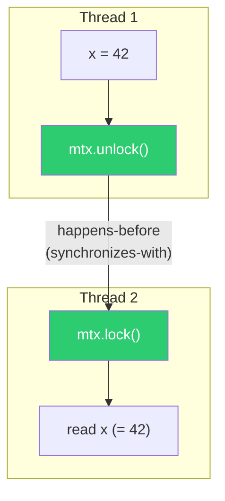

C++ のメモリモデルでは、データ競合は**未定義動作（Undefined Behavior, UB）** と定義されている。未定義動作とは、言語仕様が一切の保証を行わない状況であり、プログラムは以下のいずれかの振る舞いを示す可能性がある。

- 意図した通りに動作する（偶然）
- 間違った結果を返す
- クラッシュする
- 全く無関係なコードの振る舞いが変わる
- コンパイラがデータ競合のある分岐を削除する

::: danger 未定義動作の危険性
「実際にはうまく動いている」としても、データ競合のあるプログラムは壊れている。コンパイラのバージョン、最適化レベル、ターゲットアーキテクチャを変更するだけで、突然問題が顕在化する可能性がある。未定義動作は「何が起きてもおかしくない」状態であり、「たまたま動いている」のと「正しく動いている」のは全く異なる。
:::

### 3.3 Java と Go のメモリモデル

**Java メモリモデル（JMM）**: Java は C/C++ と異なり、データ競合を未定義動作とはしない。JMM では、データ競合のあるプログラムでも一定の保証が与えられる。具体的には、変数のアクセスは常に原子的であり（`long`/`double` を除く）、「無から値が出てくる（out-of-thin-air values）」ことはない。ただし、データ競合のあるプログラムの動作は依然として予測が困難であり、推奨されない。

**Go メモリモデル**: Go は Java と C++ の中間的なアプローチを取る。Go のメモリモデルでは、データ競合のある変数の読み取りは、その変数に書き込まれたことのある値のうちいずれかを返すことが保証される（ワードサイズ以下の場合）。ただし、Go の Race Detector（内部的に TSan と同じアルゴリズムを使用）は、データ競合をエラーとして報告する。

::: code-group
```cpp [C++ — アトミック操作]
#include <atomic>
#include <thread>

std::atomic<int> counter{0};

void increment() {
    for (int i = 0; i < 1000000; i++) {
        counter.fetch_add(1, std::memory_order_relaxed);
        // No data race: atomic operation
    }
}
```

```java [Java — volatile]
public class Counter {
    private volatile int counter = 0;

    // volatile prevents word tearing but does NOT make ++ atomic
    // Still need synchronization for compound operations
    public synchronized void increment() {
        counter++;
    }
}
```

```go [Go — sync/atomic]
package main

import (
    "sync"
    "sync/atomic"
)

var counter int64

func increment(wg *sync.WaitGroup) {
    defer wg.Done()
    for i := 0; i < 1000000; i++ {
        atomic.AddInt64(&counter, 1)
        // No data race: atomic operation
    }
}
```
:::

### 3.4 メモリオーダリング

C++ の `std::atomic` は、メモリオーダリングを明示的に指定できる。これにより、性能と正しさのトレードオフを制御できる。

| メモリオーダリング | 保証 | 典型的な用途 |
|---|---|---|
| `memory_order_relaxed` | 原子性のみ。順序保証なし | カウンタ、統計情報 |
| `memory_order_acquire` | この操作の後のメモリアクセスがこの操作の前に並べ替えられない | ロックの取得、データの消費側 |
| `memory_order_release` | この操作の前のメモリアクセスがこの操作の後に並べ替えられない | ロックの解放、データの生産側 |
| `memory_order_acq_rel` | acquire と release の両方 | CAS ループ |
| `memory_order_seq_cst` | 全ての seq_cst 操作に全順序が存在する（最も強い保証） | デフォルト。迷ったらこれ |

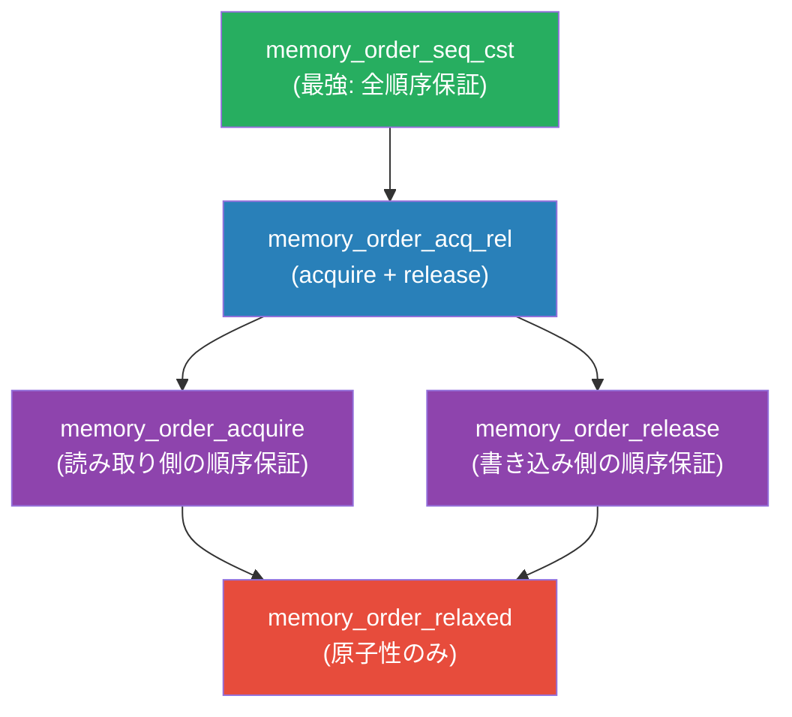

## 4. データ競合の防止手法

データ競合を防ぐ方法は、大きく以下の4つのカテゴリに分けられる。

### 4.1 ロックによる排他制御

最も一般的な方法は、Mutex などのロックを使って臨界区間を保護することである。

```cpp
#include <mutex>
#include <thread>

int counter = 0;
std::mutex mtx;

void increment() {
    for (int i = 0; i < 1000000; i++) {
        std::lock_guard<std::mutex> lock(mtx);
        counter++; // protected by mutex — no data race
    }
}
```

ロックは正しく使えばデータ競合を完全に防止できるが、以下の問題がある。

- **デッドロック**: 複数のロックを異なる順序で取得するとデッドロックが発生する
- **性能低下**: ロックの競合（contention）が増えるとスループットが大幅に低下する
- **粒度の選択**: 粒度が粗すぎると並行性が制限され、細かすぎるとオーバーヘッドが増える

### 4.2 アトミック操作

単純な変数のインクリメントやフラグの設定には、アトミック操作が効果的である。アトミック操作はロックよりも軽量で、デッドロックのリスクもない。

```cpp
#include <atomic>
#include <thread>

std::atomic<int> counter{0};

void increment() {
    for (int i = 0; i < 1000000; i++) {
        counter++; // atomic increment — no data race
    }
}
```

ただし、アトミック操作は単一の変数に対する操作に限定される。複数の変数をまとめて更新する必要がある場合は、ロックやトランザクショナルメモリなどの他の手段が必要である。

### 4.3 イミュータブルデータ

データを不変（immutable）にすることで、書き込みが存在しなくなり、データ競合の可能性を根本的に排除できる。関数型プログラミング言語（Haskell, Erlang など）はこのアプローチを言語レベルで採用している。

```cpp
#include <thread>
#include <string>
#include <iostream>

void process(const std::string& data) {
    // data is immutable (const reference) — no data race possible
    std::cout << data.length() << std::endl;
}

int main() {
    const std::string shared_data = "hello, world";
    std::thread t1(process, std::cref(shared_data));
    std::thread t2(process, std::cref(shared_data));
    t1.join();
    t2.join();
    return 0;
}
```

### 4.4 所有権と型システムによる防止

Rust は、コンパイル時に所有権と借用のルールを強制することで、データ競合を型システムレベルで防止する。Rust のルールは以下の通りである。

- ある時点で、変数に対する可変参照（`&mut T`）は高々1つしか存在できない
- 可変参照が存在する場合、不変参照（`&T`）は存在できない
- 複数の不変参照は同時に存在できる

これらのルールにより、「同時に書き込みを行う複数のスレッドが同じデータにアクセスする」という状況がコンパイル時に排除される。

```rust
use std::thread;
use std::sync::{Arc, Mutex};

fn main() {
    let counter = Arc::new(Mutex::new(0));
    let mut handles = vec![];

    for _ in 0..2 {
        let counter = Arc::clone(&counter);
        let handle = thread::spawn(move || {
            for _ in 0..1000000 {
                let mut num = counter.lock().unwrap();
                *num += 1;
                // Mutex guard dropped here — lock released
            }
        });
        handles.push(handle);
    }

    for handle in handles {
        handle.join().unwrap();
    }

    println!("Result: {}", *counter.lock().unwrap());
}
```

::: tip Rust の Send と Sync トレイト
Rust では、型が `Send` トレイトを実装していればスレッド間で所有権を移動でき、`Sync` トレイトを実装していればスレッド間で共有参照を安全に使える。`Rc<T>`（参照カウント型）は `Send` でも `Sync` でもないため、マルチスレッドのコンテキストではコンパイルエラーになる。代わりにスレッドセーフな `Arc<T>` を使う必要がある。
:::

## 5. ThreadSanitizer（TSan）の概要

### 5.1 TSan とは

**ThreadSanitizer（TSan）** は、Google が開発したデータ競合検出ツールである。C/C++ および Go のプログラムにおけるデータ競合を実行時に検出する。TSan は **LLVM/Clang** および **GCC** のコンパイラに統合されており、コンパイルオプションを追加するだけで使用できる。

TSan の歴史は以下の通りである。

- **TSan v1（2009年頃）**: Valgrind ベースの実装。バイナリ計装（binary instrumentation）を使用していたため、実行速度が20倍以上遅くなるという問題があった
- **TSan v2（2012年〜）**: コンパイラ計装（compiler instrumentation）に移行。Clang および GCC に統合され、実行速度の低下が5〜15倍程度に改善された。現在一般的に使われているのはこのバージョンである

### 5.2 TSan のアーキテクチャ

TSan は以下の2つの主要コンポーネントから構成される。

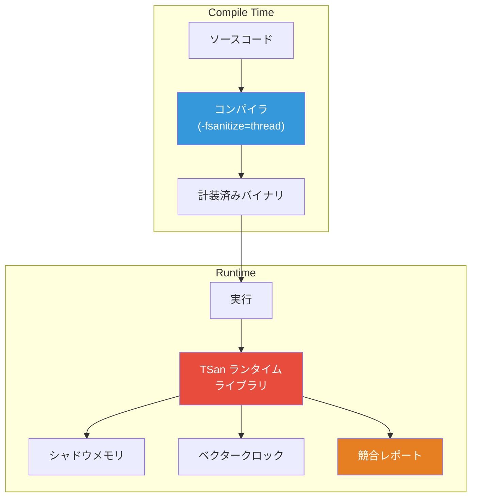

**コンパイラ計装（Compile-time Instrumentation）**: コンパイラが、すべてのメモリアクセス（load/store）および同期操作（mutex lock/unlock、thread create/join 等）の前後にフック関数の呼び出しを挿入する。これにより、ランタイムがすべてのメモリアクセスを監視できる。

**ランタイムライブラリ**: 計装されたフック関数の実装を提供する。メモリアクセスのメタデータ（どのスレッドが、いつ、どのアドレスに、読み取り/書き込みのどちらを行ったか）をシャドウメモリに記録し、データ競合を検出する。

### 5.3 TSan の使い方

TSan の使い方は非常にシンプルである。コンパイル時に `-fsanitize=thread` フラグを追加するだけでよい。

::: code-group
```bash [C++ (Clang)]
# Compile with TSan
clang++ -fsanitize=thread -g -O1 -o myprogram myprogram.cpp -lpthread

# Run the program — TSan reports are printed to stderr
./myprogram
```

```bash [C++ (GCC)]
# Compile with TSan
g++ -fsanitize=thread -g -O1 -o myprogram myprogram.cpp -lpthread

# Run
./myprogram
```

```bash [Go]
# Run with race detector (uses TSan algorithm internally)
go run -race myprogram.go

# Test with race detector
go test -race ./...

# Build with race detector
go build -race -o myprogram .
```
:::

::: warning 最適化レベルについて
TSan は `-O0`（最適化なし）でも動作するが、`-O1` 以上の最適化を推奨する。理由は以下の通りである。
- `-O0` ではスタック使用量が多くなり、TSan のシャドウメモリ使用量も増加する
- `-O0` では不要なメモリアクセスが残り、偽陽性（false positive）が発生する可能性がある
- ただし、`-O2` 以上ではコンパイラの最適化によりメモリアクセスが削除され、本来検出されるべき競合が見逃される可能性がある
:::

### 5.4 TSan の出力の読み方

TSan がデータ競合を検出すると、以下のようなレポートを出力する。

```
==================
WARNING: ThreadSanitizer: data race (pid=12345)
  Write of size 4 at 0x7f8c00000010 by thread T2:
    #0 increment() /home/user/example.cpp:6 (example+0x4a1234)
    #1 void std::__invoke_impl<...>(...) (example+0x4a1567)

  Previous write of size 4 at 0x7f8c00000010 by thread T1:
    #0 increment() /home/user/example.cpp:6 (example+0x4a1234)
    #1 void std::__invoke_impl<...>(...) (example+0x4a1567)

  Location is global 'counter' of size 4 at 0x7f8c00000010
    (example+0x000000601040)

  Thread T1 (tid=12346, running) created by main thread at:
    #0 pthread_create (example+0x425e6f)
    #1 std::thread::_M_start_thread(...) (example+0x4b2345)
    #2 main /home/user/example.cpp:11 (example+0x4a1890)

  Thread T2 (tid=12347, running) created by main thread at:
    #0 pthread_create (example+0x425e6f)
    #1 std::thread::_M_start_thread(...) (example+0x4b2345)
    #2 main /home/user/example.cpp:12 (example+0x4a18b0)

SUMMARY: ThreadSanitizer: data race /home/user/example.cpp:6 in increment()
==================
```

レポートには以下の情報が含まれる。

1. **競合するアクセスの種類と場所**: 「Write of size 4 at 0x...」のように、アクセスの種類（Read/Write）、サイズ、アドレスが示される
2. **スタックトレース**: 各アクセスが行われたコード上の位置が、完全なスタックトレースとして表示される
3. **メモリの識別**: 対象のメモリが何であるか（グローバル変数名、ヒープ上のオブジェクトなど）が表示される
4. **スレッドの作成元**: 競合に関わるスレッドがどこで作成されたかが表示される

## 6. ThreadSanitizer の内部アルゴリズム

### 6.1 happens-before ベースの検出

TSan v2 は、happens-before 関係に基づいてデータ競合を検出する。このアプローチの基本的な考え方は以下の通りである。

1. すべてのメモリアクセスと同期操作を監視する
2. 同期操作から happens-before 関係を構築する
3. あるメモリアクセスが、同じアドレスへの過去のアクセスと happens-before 関係にない場合、かつ少なくとも一方が書き込みである場合、データ競合として報告する

このアプローチの利点は、**偽陽性がない**（false positive free）ことである。TSan が報告するものは、すべて実際のデータ競合である。ただし、偽陰性（実際にはデータ競合があるのに検出されない）は存在しうる。これは、特定の実行パスでのみ競合が発現し、テスト時にそのパスが通らなかった場合に発生する。

### 6.2 ベクタークロック

TSan が happens-before 関係を効率的に追跡するために使用するデータ構造が**ベクタークロック（Vector Clock）** である。

ベクタークロックは、各スレッドの論理時計の値をベクトルとして保持する。N スレッドのシステムでは、ベクタークロックは N 要素のベクトルである。

```
VC = [t1_clock, t2_clock, ..., tn_clock]
```

各スレッドは自身のベクタークロックを持ち、以下の規則に従って更新する。

1. **内部イベント**: スレッド i が内部イベント（メモリアクセス等）を実行するたびに、自身のクロック `VC[i]` をインクリメントする
2. **同期操作（release）**: Mutex の unlock 時、スレッドのベクタークロックを Mutex に関連付ける
3. **同期操作（acquire）**: Mutex の lock 時、Mutex に関連付けられたベクタークロックと自身のベクタークロックの要素ごとの最大値を取る

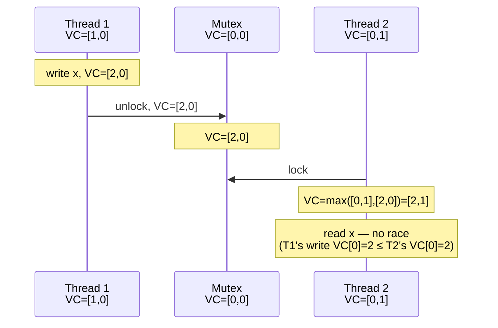

**データ競合の判定**: あるメモリアドレスに対して、スレッド i が時刻 `VC_i` にアクセスし、以前にスレッド j が時刻 `VC_j` にアクセスしていたとする。`VC_j[j] > VC_i[j]` でない場合（つまり、スレッド i がスレッド j のアクセスを「見ていない」場合）、かつ少なくとも一方が書き込みであれば、データ競合である。

### 6.3 シャドウメモリ

TSan は、アプリケーションのメモリ空間全体に対して**シャドウメモリ（Shadow Memory）** を維持する。アプリケーションの各8バイトのメモリ領域に対して、4つの**シャドウセル（Shadow Cell）** が割り当てられる。

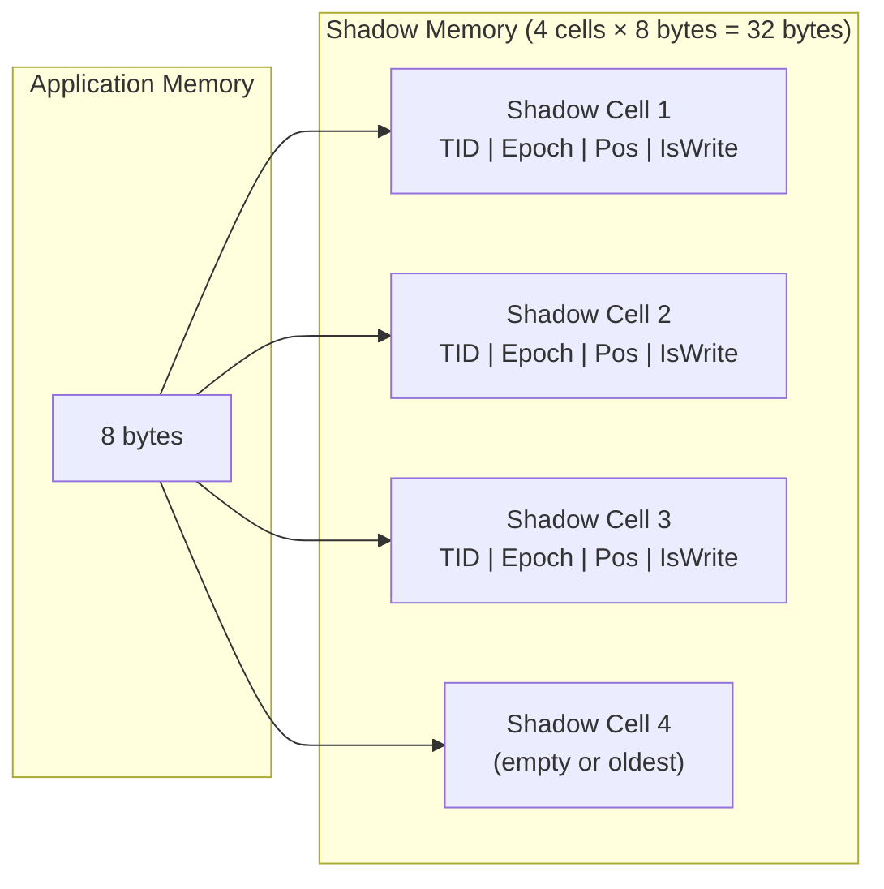

各シャドウセルは64ビットの値で、以下の情報をエンコードしている。

- **TID（Thread ID）**: アクセスしたスレッドの識別子（16ビット）
- **Epoch（エポック）**: スレッドのベクタークロックの値（42ビット）
- **Position**: 8バイト領域内のアクセス位置とサイズ（3ビット + 2ビット）
- **IsWrite**: 書き込みアクセスかどうか（1ビット）

4つのシャドウセルは、直近の異なる4スレッドからのアクセスを記録するために使われる。新しいアクセスが発生すると、最も古いセルが上書きされる。4つのセルという制限は、メモリ使用量と検出精度のトレードオフから決定されている。

### 6.4 データ競合検出のフロー

メモリアクセスが発生した際の TSan の処理フローは以下の通りである。

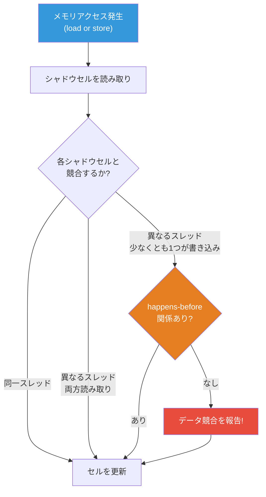

具体的なアルゴリズムは以下の通りである。

1. 現在のアクセスの情報（スレッドID、エポック、アドレス、読み/書き）を取得する
2. 対象アドレスの4つのシャドウセルを順に確認する
3. 各シャドウセルについて、以下を判定する:
   - 空のセルであれば、現在のアクセス情報を書き込む
   - 同一スレッドのアクセスであれば、セルを更新する
   - 異なるスレッドのアクセスで、両方とも読み取りであれば、競合ではない
   - 異なるスレッドのアクセスで、少なくとも一方が書き込みの場合、ベクタークロックを比較して happens-before 関係の有無を確認する
   - happens-before 関係がなければ、データ競合として報告する

### 6.5 メモリ使用量とパフォーマンス

TSan のオーバーヘッドは以下の通りである。

| 項目 | オーバーヘッド |
|------|--------------|
| メモリ使用量 | アプリケーションの約5〜10倍 |
| 実行速度 | 約5〜15倍遅くなる |
| コードサイズ | 約2倍に増加 |

メモリ使用量の大部分はシャドウメモリに起因する。各8バイトに対して32バイトのシャドウメモリが必要であり、加えてベクタークロックのストレージも必要である。

::: details TSan のメモリレイアウト
TSan は、仮想アドレス空間を複数の領域に分割して使用する。64ビットLinux の場合、典型的なメモリレイアウトは以下の通りである。

```
[0x7b0000000000, 0x7fffffffffff) — High shadow (for stack and high memory)
[0x7a0000000000, 0x7b0000000000) — High protection (unmapped)
[0x400000000000, 0x7a0000000000) — Shadow memory (main shadow region)
[0x300000000000, 0x400000000000) — Protection (unmapped)
[0x200000000000, 0x300000000000) — Trace memory (for stack traces)
[0x100000000000, 0x200000000000) — Meta shadow (metadata)
[0x000000000000, 0x100000000000) — Low memory (application code and data)
```

シャドウメモリの計算は、アプリケーションのアドレスに対して単純なビット演算で行われるため、アクセスのオーバーヘッドは非常に小さい。
:::

## 7. TSan の実践的な活用

### 7.1 CI/CD パイプラインへの統合

TSan は CI/CD パイプラインに統合することで、データ競合を早期に検出できる。以下は GitHub Actions での設定例である。

```yaml
# .github/workflows/tsan.yml
name: ThreadSanitizer

on: [push, pull_request]

jobs:
  tsan:
    runs-on: ubuntu-latest
    steps:
      - uses: actions/checkout@v4
      - name: Build with TSan
        run: |
          cmake -DCMAKE_CXX_FLAGS="-fsanitize=thread -g -O1" \
                -DCMAKE_EXE_LINKER_FLAGS="-fsanitize=thread" ..
          make -j$(nproc)
      - name: Run tests with TSan
        run: |
          export TSAN_OPTIONS="halt_on_error=1:second_deadlock_stack=1"
          ctest --output-on-failure
```

Go の場合はさらにシンプルで、`-race` フラグを付けるだけである。

```yaml
jobs:
  race-detector:
    runs-on: ubuntu-latest
    steps:
      - uses: actions/checkout@v4
      - uses: actions/setup-go@v5
        with:
          go-version: '1.23'
      - name: Test with race detector
        run: go test -race -count=1 ./...
```

### 7.2 TSan のオプション設定

TSan の動作は環境変数 `TSAN_OPTIONS` で制御できる。重要なオプションは以下の通りである。

```bash
# TSan options (colon-separated key=value pairs)
export TSAN_OPTIONS="halt_on_error=1:second_deadlock_stack=1:history_size=7:verbosity=1"
```

| オプション | デフォルト | 説明 |
|-----------|-----------|------|
| `halt_on_error` | 0 | 1 に設定すると、最初のデータ競合で即座に終了する |
| `second_deadlock_stack` | 0 | 1 に設定すると、デッドロック検出時に2つ目のスタックトレースを表示する |
| `history_size` | 3 | メモリアクセス履歴のサイズ（0-7）。大きいほど検出精度が上がるがメモリ使用量も増える |
| `suppressions` | なし | 既知の問題を抑制するサプレッションファイルのパス |
| `log_path` | stderr | レポートの出力先ファイルパス |
| `exitcode` | 66 | データ競合検出時の終了コード |

### 7.3 サプレッション（抑制）

サードパーティライブラリや既知の問題による誤報を抑制するには、サプレッションファイルを使用する。

```
# tsan_suppressions.txt

# Suppress races in third-party library
race:third_party::SomeFunction

# Suppress races in a specific file
race:legacy_code.cpp

# Suppress races by called function name
called_from_lib:libfoo.so
```

```bash
export TSAN_OPTIONS="suppressions=tsan_suppressions.txt"
```

::: warning サプレッションの注意点
サプレッションは一時的な措置としてのみ使用すべきである。サプレッションを安易に追加すると、本当のデータ競合が隠蔽されてしまう。サプレッションを追加する際は、なぜそのデータ競合が無害であるか（または修正不可能であるか）を必ずコメントとして記録すること。
:::

### 7.4 TSan を使ったデバッグの実例

以下に、典型的なデータ競合のパターンとその修正例を示す。

**パターン 1: 保護されていないフラグ変数**

```cpp
// BAD: data race on 'done' flag
bool done = false;
std::string result;

void worker() {
    result = compute(); // Write to 'result'
    done = true;        // Write to 'done' — DATA RACE
}

void waiter() {
    while (!done) {}    // Read of 'done' — DATA RACE
    use(result);        // Read of 'result' — DATA RACE
}
```

```cpp
// GOOD: use atomic flag with proper memory ordering
std::atomic<bool> done{false};
std::string result;

void worker() {
    result = compute();
    done.store(true, std::memory_order_release); // release: result is visible
}

void waiter() {
    while (!done.load(std::memory_order_acquire)) {} // acquire: sees result
    use(result); // safe: happens-after done.store
}
```

**パターン 2: 複数フィールドの不整合な更新**

```cpp
// BAD: fields updated without synchronization
struct Config {
    std::string host;
    int port;
};

Config global_config;

void update_config(const std::string& host, int port) {
    global_config.host = host; // DATA RACE
    global_config.port = port; // DATA RACE
}

void use_config() {
    // May see new host with old port, or partially written host
    connect(global_config.host, global_config.port); // DATA RACE
}
```

```cpp
// GOOD: use mutex to protect compound updates
struct Config {
    std::string host;
    int port;
};

std::mutex config_mutex;
Config global_config;

void update_config(const std::string& host, int port) {
    std::lock_guard<std::mutex> lock(config_mutex);
    global_config.host = host;
    global_config.port = port;
}

void use_config() {
    std::lock_guard<std::mutex> lock(config_mutex);
    connect(global_config.host, global_config.port);
}
```

**パターン 3: コレクションへの並行アクセス**

```cpp
// BAD: concurrent access to std::map
std::map<std::string, int> cache;

void insert(const std::string& key, int value) {
    cache[key] = value; // DATA RACE: modifies internal tree structure
}

int lookup(const std::string& key) {
    auto it = cache.find(key); // DATA RACE: reads internal tree structure
    return (it != cache.end()) ? it->second : -1;
}
```

```cpp
// GOOD: use concurrent data structure or external synchronization
#include <shared_mutex>
#include <map>

std::shared_mutex cache_mutex;
std::map<std::string, int> cache;

void insert(const std::string& key, int value) {
    std::unique_lock<std::shared_mutex> lock(cache_mutex);
    cache[key] = value;
}

int lookup(const std::string& key) {
    std::shared_lock<std::shared_mutex> lock(cache_mutex);
    auto it = cache.find(key);
    return (it != cache.end()) ? it->second : -1;
}
```

## 8. Go の Race Detector

### 8.1 概要

Go には組み込みの Race Detector が搭載されており、`-race` フラグで有効化できる。内部的には TSan v2 と同じアルゴリズム（ベクタークロック + シャドウメモリ）を使用しているが、Go のランタイムと緊密に統合されている。

Go の Race Detector は、以下の同期操作を認識する。

- `sync.Mutex` / `sync.RWMutex` の `Lock()` / `Unlock()`
- `sync.WaitGroup` の `Add()` / `Done()` / `Wait()`
- チャネル操作（`send` / `receive` / `close`）
- `sync/atomic` パッケージの関数
- `sync.Once` の `Do()`
- goroutine の生成と `runtime.Goexit()`

### 8.2 Go でのデータ競合の例

```go
package main

import (
    "fmt"
    "sync"
)

func main() {
    // BAD: data race on 'count'
    count := 0
    var wg sync.WaitGroup

    for i := 0; i < 1000; i++ {
        wg.Add(1)
        go func() {
            defer wg.Done()
            count++ // DATA RACE: unsynchronized read-modify-write
        }()
    }

    wg.Wait()
    fmt.Println(count) // unpredictable result
}
```

`go run -race` で実行すると、以下のような出力が得られる。

```
==================
WARNING: DATA RACE
Read at 0x00c0000140a8 by goroutine 8:
  main.main.func1()
      /home/user/main.go:15 +0x38

Previous write at 0x00c0000140a8 by goroutine 7:
  main.main.func1()
      /home/user/main.go:15 +0x4e

Goroutine 8 (running) created at:
  main.main()
      /home/user/main.go:13 +0x94

Goroutine 7 (finished) created at:
  main.main()
      /home/user/main.go:13 +0x94
==================
```

### 8.3 Go での修正例

::: code-group
```go [Mutex を使う]
package main

import (
    "fmt"
    "sync"
)

func main() {
    var mu sync.Mutex
    count := 0
    var wg sync.WaitGroup

    for i := 0; i < 1000; i++ {
        wg.Add(1)
        go func() {
            defer wg.Done()
            mu.Lock()
            count++
            mu.Unlock()
        }()
    }

    wg.Wait()
    fmt.Println(count) // always 1000
}
```

```go [atomic を使う]
package main

import (
    "fmt"
    "sync"
    "sync/atomic"
)

func main() {
    var count int64
    var wg sync.WaitGroup

    for i := 0; i < 1000; i++ {
        wg.Add(1)
        go func() {
            defer wg.Done()
            atomic.AddInt64(&count, 1)
        }()
    }

    wg.Wait()
    fmt.Println(count) // always 1000
}
```

```go [チャネルを使う]
package main

import "fmt"

func main() {
    ch := make(chan int, 1000)

    for i := 0; i < 1000; i++ {
        go func() {
            ch <- 1
        }()
    }

    count := 0
    for i := 0; i < 1000; i++ {
        count += <-ch
    }
    fmt.Println(count) // always 1000
}
```
:::

### 8.4 Go のよくあるデータ競合パターン

Go 固有のデータ競合パターンとして、以下が特に頻出する。

**パターン 1: ループ変数のキャプチャ**

```go
// BAD (Go 1.21 以前): loop variable captured by reference
for _, item := range items {
    go func() {
        process(item) // DATA RACE: 'item' is shared
    }()
}

// GOOD: pass as argument
for _, item := range items {
    go func(it Item) {
        process(it) // safe: 'it' is a copy
    }(item)
}
```

> [!NOTE]
> Go 1.22 以降では、ループ変数のセマンティクスが変更され、各イテレーションごとに新しい変数が作成されるようになった。そのため、Go 1.22 以降ではこのパターンは問題にならない。

**パターン 2: マップの並行アクセス**

```go
// BAD: concurrent map access causes panic (not just data race)
m := make(map[string]int)
go func() { m["a"] = 1 }()
go func() { m["b"] = 2 }()
// fatal error: concurrent map writes

// GOOD: use sync.Map for concurrent access
var m sync.Map
go func() { m.Store("a", 1) }()
go func() { m.Store("b", 2) }()
```

## 9. 他のデータ競合検出ツール

TSan 以外にも、データ競合を検出するためのツールやアプローチが存在する。

### 9.1 Helgrind と DRD（Valgrind）

**Helgrind** と **DRD** は、Valgrind フレームワーク上で動作するスレッドエラー検出ツールである。バイナリ計装方式を使用するため、ソースコードの再コンパイルが不要だが、実行速度の低下が大きい（20〜100倍）。

| 特性 | TSan | Helgrind | DRD |
|------|------|----------|-----|
| 計装方式 | コンパイラ計装 | バイナリ計装 | バイナリ計装 |
| 速度低下 | 5-15倍 | 20-100倍 | 20-100倍 |
| メモリ増加 | 5-10倍 | 2-5倍 | 2-5倍 |
| アルゴリズム | ベクタークロック | ベクタークロック | ベクタークロック |
| 偽陽性 | 非常に少ない | やや多い | やや多い |
| 対応言語 | C/C++/Go | C/C++/etc. | C/C++/etc. |
| 再コンパイル | 必要 | 不要 | 不要 |

### 9.2 静的解析ツール

動的な検出（実行時の検出）に対して、静的解析（コンパイル時の検出）によるアプローチも存在する。

- **Clang Thread Safety Analysis**: C++ のアノテーション（`GUARDED_BY`, `REQUIRES` など）を使って、ロック規約の違反をコンパイル時に検出する
- **RacerD（Infer）**: Facebook が開発した静的解析ツール Infer のモジュール。所有権に基づくデータ競合の静的検出を行う
- **Rust の借用チェッカー**: Rust のコンパイラは所有権と借用のルールに基づき、データ競合をコンパイル時に排除する

```cpp
// Clang Thread Safety Analysis example
#include <mutex>

class Account {
    std::mutex mu;
    int balance GUARDED_BY(mu); // annotation

public:
    void deposit(int amount) {
        std::lock_guard<std::mutex> lock(mu);
        balance += amount; // OK: mu is held
    }

    int get_balance() {
        return balance; // WARNING: reading 'balance' requires holding 'mu'
    }
};
```

### 9.3 検出手法の比較

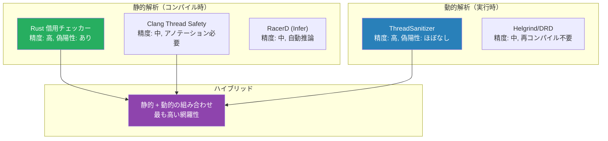

## 10. データ競合の本質的な困難さ

### 10.1 非決定性

データ競合に関するバグの最大の困難は、その**非決定性**にある。同じプログラムを同じ入力で何度実行しても、異なる結果が得られる可能性がある。これは、スレッドのスケジューリングがOSのスケジューラに依存し、実行のたびに微妙に異なるタイミングでスレッドが切り替えられるためである。

この非決定性は以下の問題を引き起こす。

- **テストでの発見が困難**: テスト環境と本番環境でスレッド数、CPU数、負荷が異なるため、テストで発見できないバグが本番で発現する
- **再現が困難**: バグが報告されても、開発環境で再現できないことが多い
- **デバッグが困難**: デバッガでブレークポイントを設定するとタイミングが変わり、バグが再現しなくなる（Heisenbug）

### 10.2 指数的な状態空間

N スレッドがそれぞれ M ステップの操作を行うプログラムの場合、可能なインターリービング（実行の交互配置）の数は以下の通りである。

$$
\frac{(N \cdot M)!}{(M!)^N}
$$

例えば、2スレッドがそれぞれ10ステップを実行する場合でも、約 184,756 通りのインターリービングが存在する。これらすべてをテストすることは現実的に不可能であり、特定のインターリービングでのみ発現するバグを見逃す可能性が常にある。

### 10.3 Benign Data Race の議論

一部の開発者は、「無害なデータ競合（benign data race）」が存在すると主張することがある。典型的な例は以下のようなケースである。

- 統計カウンタの近似値を取得する場合（正確な値は不要）
- 初期化フラグが一度だけ `false` から `true` に変わる場合
- ダブルチェックロッキングパターン

しかし、**C/C++ においてデータ競合は未定義動作**であり、「無害なデータ競合」は存在しないというのが正しい理解である。コンパイラは未定義動作が存在しないという前提で最適化を行うため、プログラマが「無害」と考えるデータ競合であっても、予期しない動作を引き起こす可能性がある。

::: danger Benign Data Race のリスク
Hans Boehm の論文 "How to miscompile programs with 'benign' data races"（2011年）では、「無害」と思われるデータ競合が、コンパイラの最適化によって実際に有害になる事例が多数示されている。例えば、以下のようなケースが報告されている。

- コンパイラが読み取りを最適化で消去し、古い値がキャッシュされ続ける
- 投機的ストア（speculative store）によって、書き込まれるべきでない値が書き込まれる
- ワードサイズより大きい型（構造体など）への書き込みが分割され、不完全な値が観測される（word tearing）

結論として、**すべてのデータ競合は修正すべき**であり、「この競合は無害だから放置する」という判断は避けるべきである。
:::

## 11. ベストプラクティス

データ競合を防止し、並行プログラムの品質を高めるためのベストプラクティスを以下にまとめる。

### 11.1 設計段階

1. **共有可変状態を最小化する**: 可能な限り、データを不変にするか、スレッドローカルに保持する。共有が必要な場合は、その範囲を明確に限定する
2. **所有権を明確にする**: データの所有者を1つのスレッドに限定し、他のスレッドはメッセージパッシングでアクセスする（CSP モデル）
3. **同期のスコープを文書化する**: どのロックがどのデータを保護するかを明示的に文書化する（コメント、アノテーション、または型システム）

### 11.2 実装段階

4. **高レベルの同期機構を優先する**: 低レベルの `std::atomic` よりも、`std::mutex` や `std::shared_mutex`、チャネルなどの高レベルな同期機構を使う
5. **RAII パターンでロックを管理する**: C++ では `std::lock_guard` や `std::unique_lock` を使い、ロックの取得と解放を自動化する
6. **アトミック操作のメモリオーダリングは慎重に**: デフォルトの `memory_order_seq_cst` で始め、性能測定に基づいて必要な場合のみ緩和する

### 11.3 検証段階

7. **TSan を CI/CD に統合する**: すべてのテストを TSan 付きで実行し、新しいデータ競合の混入を防ぐ
8. **ストレステストを実施する**: 並行テストを高い並列度で多数回実行し、タイミング依存のバグの発見確率を高める
9. **TSan のレポートを即座に修正する**: TSan のレポートは偽陽性が非常に少ないため、報告されたものはすべて実際のバグとして扱う

### 11.4 言語選択

10. **型安全な並行処理を持つ言語を検討する**: Rust は型システムでデータ競合を排除し、Go はチャネルベースの並行処理モデルと組み込みの Race Detector を提供する。新規プロジェクトでは、これらの言語が提供する安全性の恩恵を検討する価値がある

## 12. まとめ

データ競合は、並行プログラミングにおける最も基本的かつ危険なバグカテゴリである。その本質は、複数のスレッドが同一のメモリ位置に対して同期なしにアクセスし、少なくとも一方が書き込みを行うことにある。

C/C++ ではデータ競合は未定義動作であり、「たまたま動いている」ことは正しさの保証にはならない。データ競合を防止するためには、ロック、アトミック操作、イミュータブルデータ、所有権モデルなどの手法を適切に組み合わせる必要がある。

ThreadSanitizer は、ベクタークロックとシャドウメモリを用いた高精度なデータ競合検出ツールであり、コンパイルオプションの追加だけで利用できる手軽さと、偽陽性のほぼない高い信頼性を兼ね備えている。CI/CD パイプラインへの統合は、並行プログラムの品質を維持するために不可欠な施策である。

並行プログラミングの難しさは、非決定性と指数的な状態空間に起因する。この困難に対処するためには、ツールによる検出だけでなく、設計段階から共有可変状態を最小化し、型システムや言語機能による安全性の保証を積極的に活用することが重要である。

> [!TIP]
> 並行プログラムのバグは、それが発見されるまでの時間が長いほど修正コストが高くなる。TSan を開発プロセスの初期段階から導入し、「データ競合ゼロ」をポリシーとして維持することが、長期的にはプロジェクトの健全性を大きく改善する。
