# データベースのバックアップとリカバリ戦略

## 1. なぜバックアップは重要なのか

### 1.1 データ喪失のリアルなリスク

データベースは現代のビジネスにとって中枢的な存在である。しかし、どれほど堅牢に設計されたシステムであっても、以下のようなインシデントからは完全に免れることはできない。

- **ハードウェア障害**: ストレージデバイスの物理的な故障、RAIDコントローラの障害
- **ソフトウェアバグ**: データベースエンジン自体のバグによるデータ破損
- **ヒューマンエラー**: 誤った `DELETE` や `DROP TABLE` の実行
- **セキュリティインシデント**: ランサムウェアによる暗号化、悪意ある内部者によるデータ破壊
- **自然災害**: データセンターを直撃する火災、洪水、地震
- **論理的な破損**: アプリケーションのバグによる不整合データの書き込みが長期間蓄積される

2011年、Amazon S3で発生した大規模障害はデータの永続性に対する過信に警鐘を鳴らした。2022年にはOVHcloudのデータセンター火災によって、バックアップを持たない多数の企業がデータを永久に失った。バックアップは「保険」であり、問題が発生するまではその価値に気づきにくいが、いざ必要になったときに存在しないことが明らかになる。

### 1.2 バックアップの目的とスコープ

バックアップには大きく2つの役割がある。

1. **データリカバリ**: 失われたデータを復元する
2. **ディザスタリカバリ（DR）**: システム全体の障害から復旧し、ビジネスを継続させる

これらは重複するが同一ではない。バックアップからの復元はデータを取り戻すことに主眼を置くのに対し、ディザスタリカバリはシステム全体の稼働を回復させることまで含む概念である。

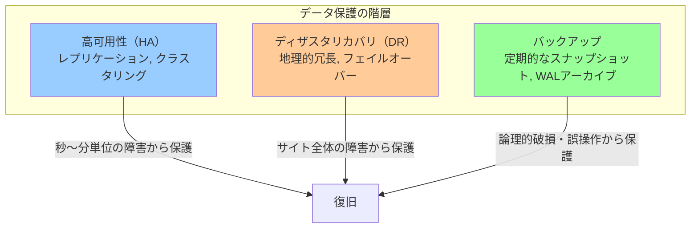

高可用性（HA）はリアルタイムのレプリケーションによって**計画外のダウンタイムを最小化**するが、誤った `DELETE` 文の実行は即座にレプリカにも反映されてしまう。バックアップはまさにこのような**論理的な破損**や**誤操作**に対する最後の防衛ラインである。

## 2. RPOとRTOの設計

### 2.1 二つの核心的な指標

バックアップとリカバリ戦略を設計する上で、最初に定義すべき2つの指標がある。

**RPO（Recovery Point Objective）**は、障害発生時に許容できるデータ喪失量を時間で表した指標である。「最大でどれくらい古い状態まで巻き戻ることを許容できるか」という問いへの答えである。

**RTO（Recovery Time Objective）**は、障害発生から業務を再開できるまでに許容される最大時間を表す指標である。「サービスが停止してから何時間以内に復旧させなければならないか」という問いへの答えである。

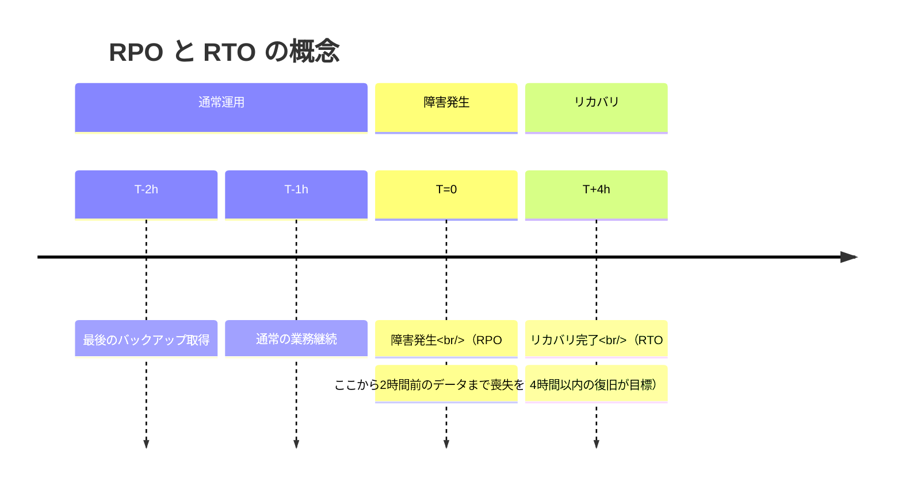

### 2.2 ビジネス要件からの逆算

RPOとRTOは技術的な制約から決めるものではなく、**ビジネス上の損失**を定量化することで決定される。

1時間のRPOと4時間のRTOが許容できるかどうかは、業種と業態によって大きく異なる。

| 業種 | RPO の目安 | RTO の目安 | 理由 |
|---|---|---|---|
| オンライン証券・為替取引 | 0〜数秒 | 数分 | 1秒のダウンで数億円の損失 |
| ECサイト（決済系） | 数秒〜数分 | 15〜30分 | 注文・決済データの喪失は直接的な損失 |
| ECサイト（商品情報） | 1〜数時間 | 数時間 | 商品情報の再入力は可能 |
| 一般的なSaaS | 1〜数時間 | 4〜8時間 | 翌営業日までに復旧できれば許容 |
| 社内システム（非クリティカル） | 24時間 | 24〜72時間 | 業務上の迂回手段が存在する |

### 2.3 RPO・RTOとコストのトレードオフ

RPOとRTOを短くするほど、必要なインフラとオペレーションのコストは指数的に増大する。

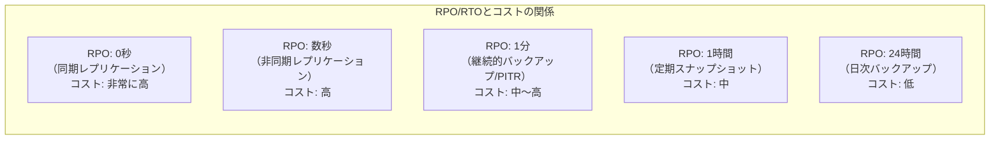

バックアップ戦略の設計では、ビジネス要件が定義するRPO・RTOに対して、技術的に実現可能な手段の中から**コストを最小化**する選択をすることが求められる。

## 3. バックアップの種類

### 3.1 フルバックアップ・差分バックアップ・増分バックアップ

データのバックアップ方法には3つの基本的な戦略がある。

**フルバックアップ（Full Backup）** はデータベース全体を丸ごとコピーする。最もシンプルで、リストアは単一のバックアップセットから行えるため高速である。しかし、毎回全データをコピーするためストレージコストと取得時間が大きい。

**差分バックアップ（Differential Backup）** は前回のフルバックアップ以降に変更されたデータのみを保存する。フルバックアップより取得は高速だが、リストア時はフルバックアップ＋最新の差分バックアップの2つが必要となる。

**増分バックアップ（Incremental Backup）** は前回のバックアップ（フルまたは増分）以降に変更されたデータのみを保存する。取得サイズが最も小さく高速だが、リストア時はフルバックアップ＋すべての増分バックアップを順番に適用する必要があり、増分の数が増えるほどリストア時間が延びる。

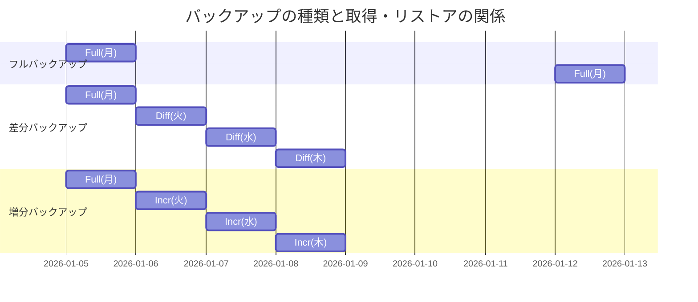

| 方式 | 取得サイズ | 取得時間 | リストア時間 | リストアに必要なセット数 |
|---|---|---|---|---|
| フルバックアップ | 大 | 長 | 短 | 1 |
| 差分バックアップ | 中 | 中 | 中 | 2（フル＋差分） |
| 増分バックアップ | 小 | 短 | 長 | N＋1（フル＋全増分） |

### 3.2 現実的な組み合わせ戦略

実際の運用では、これらを組み合わせる**ハイブリッド戦略**が採用されることが多い。一般的なパターンとして、「週次フルバックアップ＋日次増分バックアップ」がある。

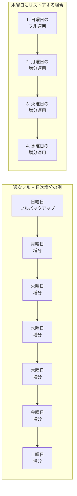

## 4. 論理バックアップと物理バックアップ

### 4.1 二つのアプローチの本質的な違い

**論理バックアップ（Logical Backup）** はデータベースの内容をSQL文やCSVなどの形式で出力する。データを「意味のある形」でエクスポートするため、異なるバージョンや異なるデータベースエンジンへの移行が容易である。

**物理バックアップ（Physical Backup）** はデータベースが使用するファイルシステム上のファイルをブロックレベルでコピーする。データの解釈を行わず生のバイナリデータをコピーするため、大規模データベースでは論理バックアップより大幅に高速である。

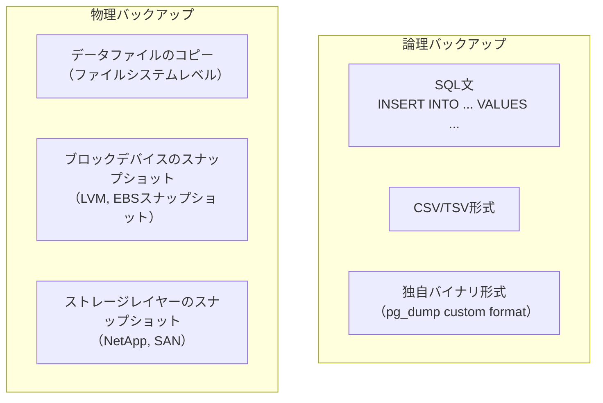

### 4.2 PostgreSQL: pg_dump vs pg_basebackup

PostgreSQLでは2つの代表的なバックアップツールが提供されている。

**pg_dump** は論理バックアップツールである。指定したデータベースの内容をSQL文または独自バイナリ形式で出力する。

```bash
# export in plain SQL format
pg_dump -h localhost -U postgres -d mydb -f backup.sql

# export in compressed custom format (recommended for large databases)
pg_dump -h localhost -U postgres -d mydb -Fc -f backup.dump

# restore from custom format
pg_restore -h localhost -U postgres -d mydb_restored backup.dump

# restore a specific table only
pg_restore -h localhost -U postgres -d mydb -t orders backup.dump
```

pg_dump の特徴：
- データベース稼働中にオンラインで取得可能（ロックは最小限）
- 特定のテーブルやスキーマだけの選択的なバックアップ・リストアが可能
- 異なるPostgreSQLバージョン間の移行に使える
- 大規模データベースでは時間とストレージが多く必要

**pg_basebackup** は物理バックアップツールである。PostgreSQLのデータディレクトリ全体をバイナリレベルでコピーし、PITR（後述）に対応したベースバックアップを取得する。

```bash
# take a base backup with WAL segments included
pg_basebackup -h localhost -U replicator -D /backup/base \
  -Ft -z -Xs -P

# options:
# -Ft : tar format
# -z  : gzip compression
# -Xs : stream WAL segments during backup
# -P  : show progress
```

pg_basebackup の特徴：
- データベースクラスター全体をコピーする（特定DBのみの選択不可）
- WALアーカイブと組み合わせることでPITRが可能
- 取得が高速（論理バックアップより数倍〜数十倍速い）
- 同じメジャーバージョン内でのみ使用可能

### 4.3 MySQL: mysqldump vs Percona XtraBackup

MySQLにも同様に論理バックアップと物理バックアップのツールが存在する。

**mysqldump** はMySQL付属の論理バックアップツールである。

```bash
# dump all databases
mysqldump -u root -p --all-databases > all_databases.sql

# dump a specific database with consistent snapshot
mysqldump -u root -p --single-transaction --databases mydb > mydb.sql

# options:
# --single-transaction : use REPEATABLE READ transaction for InnoDB consistency
# --master-data=2      : include binlog position as a comment (for PITR)
# --flush-logs         : rotate binary logs at dump start

# restore
mysql -u root -p mydb < mydb.sql
```

::: warning --single-transaction の重要性
MyISAMテーブルが含まれる場合、`--single-transaction` だけでは一貫性を保証できない。InnoDB専用の場合はこのオプションが有効だが、混在環境では `--lock-all-tables` が必要になる場合がある。現代のMySQLでは原則としてInnoDBを使用することが推奨される。
:::

**Percona XtraBackup** はオープンソースの物理バックアップツールで、InnoDBに対してロックなしのホットバックアップを提供する。

```bash
# take a full backup
xtrabackup --backup --target-dir=/backup/full \
  --user=backup_user --password=secret

# prepare the backup (apply InnoDB log)
xtrabackup --prepare --target-dir=/backup/full

# restore: stop MySQL, move data directory, restore backup
systemctl stop mysql
mv /var/lib/mysql /var/lib/mysql.old
xtrabackup --copy-back --target-dir=/backup/full
chown -R mysql:mysql /var/lib/mysql
systemctl start mysql
```

XtraBackup の特徴：
- InnoDBに対してロックなしのホットバックアップを実現
- 大規模データベースでの物理コピーによる高速なバックアップ
- 増分バックアップをサポート（LSNベースの差分検出）
- MySQL Enterprise Backupの無償代替として広く採用されている

### 4.4 論理バックアップと物理バックアップの選択基準

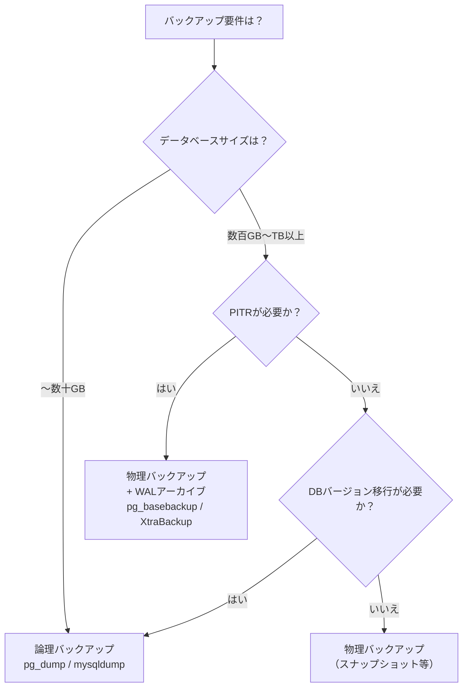

## 5. Point-in-Time Recovery（PITR）の仕組み

### 5.1 PITRとは何か

**PITR（Point-in-Time Recovery）** は、データベースを過去の任意の時点の状態に復元する機能である。日次バックアップだけでは、バックアップ取得後から障害発生までの変更は失われてしまう。PITRはバックアップ取得後の変更履歴（WALログ / バイナリログ）を保存し続けることで、この問題を解決する。

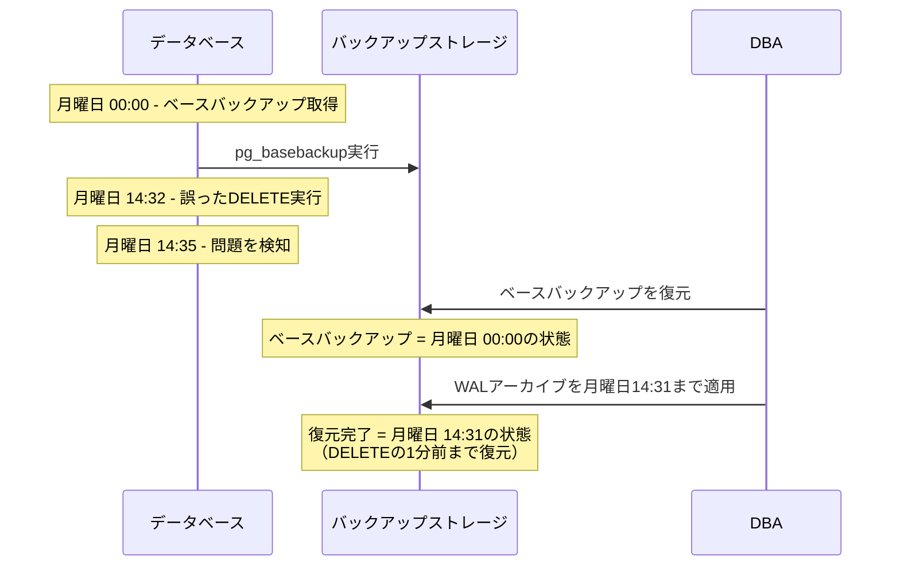

### 5.2 PostgreSQLのWALアーカイブによるPITR

PostgreSQLのPITRはWAL（Write-Ahead Logging）アーカイブを基盤とする。

**仕組みの概要**:

1. PostgreSQLは変更をWALセグメントファイルに記録し続ける
2. `archive_mode` を有効にすることで、使用済みのWALセグメントを外部ストレージにコピーする
3. PITRのリストアでは、ベースバックアップの展開後、指定した時刻まで順番にWALを再生する

```ini
# postgresql.conf - enable WAL archiving
wal_level = replica          # minimum level required for archiving
archive_mode = on            # enable archiving
archive_command = 'cp %p /mnt/archive/%f'  # copy WAL segment to archive
# for production, use more robust commands like:
# archive_command = 'rsync -a %p backup-server:/wal-archive/%f'
# archive_command = 'aws s3 cp %p s3://my-bucket/wal/%f'
```

PITRリストアの手順：

```bash
# 1. restore base backup
pg_basebackup -h localhost -U replicator -D /var/lib/postgresql/data_restore \
  -Ft -z -Xs

# 2. create recovery configuration file (PostgreSQL 12+)
cat > /var/lib/postgresql/data_restore/postgresql.conf <<EOF
restore_command = 'cp /mnt/archive/%f %p'
recovery_target_time = '2026-03-02 14:31:00'
recovery_target_action = 'promote'
EOF

# 3. create signal file to start recovery mode
touch /var/lib/postgresql/data_restore/recovery.signal

# 4. start PostgreSQL - it will automatically replay WAL until the target time
pg_ctl start -D /var/lib/postgresql/data_restore
```

::: tip WALアーカイブの遅延に注意
`archive_command` はWALセグメントが**完全に埋まった時点**でコピーされる。デフォルトのWALセグメントサイズは16MBで、低負荷環境では次のセグメントが埋まるまで時間がかかる場合がある。`archive_timeout` パラメータを設定することで、強制的なローテーション間隔（例：`archive_timeout = 60`で最大1分）を指定できる。
:::

### 5.3 MySQLのバイナリログ（binlog）によるPITR

MySQLでは**バイナリログ（binlog）** がWALと同等の役割を担う。

```ini
# my.cnf - enable binary logging
[mysqld]
log_bin = /var/log/mysql/mysql-bin.log
binlog_format = ROW          # ROW format is most reliable for PITR
expire_logs_days = 7         # automatic cleanup after 7 days
max_binlog_size = 100M       # rotate when file reaches 100MB
```

PITRリストアの手順：

```bash
# 1. restore from mysqldump with binlog position recorded
mysqldump -u root -p --single-transaction --master-data=2 \
  --databases mydb > mydb_backup.sql

# the backup file contains a line like:
# -- CHANGE MASTER TO MASTER_LOG_FILE='mysql-bin.000123', MASTER_LOG_POS=4;

# 2. restore the backup
mysql -u root -p mydb < mydb_backup.sql

# 3. apply binlog from recorded position to target time
mysqlbinlog --start-position=4 \
  --stop-datetime="2026-03-02 14:31:00" \
  /var/log/mysql/mysql-bin.000123 \
  /var/log/mysql/mysql-bin.000124 | mysql -u root -p
```

**binlogのフォーマット**には3種類ある。

| フォーマット | 記録内容 | PITRの信頼性 | パフォーマンス |
|---|---|---|---|
| STATEMENT | 実行されたSQL文 | 非決定的関数（NOW()等）で問題が出る可能性あり | 低オーバーヘッド |
| ROW | 変更された各行のビフォア・アフター | 最も信頼性が高い | 高オーバーヘッド |
| MIXED | 通常はSTATEMENT、必要時にROW | 中程度 | 中程度 |

本番環境のPITR用途では **ROWフォーマット** を強く推奨する。

## 6. バックアップの保管戦略

### 6.1 3-2-1ルール

バックアップの保管においては**3-2-1ルール**が業界標準として広く採用されている。

**3** つのコピーを保持する（オリジナル＋2つのバックアップ）
**2** 種類の異なるメディア・ストレージに保存する
**1** つは異なる地理的場所（オフサイト）に保管する

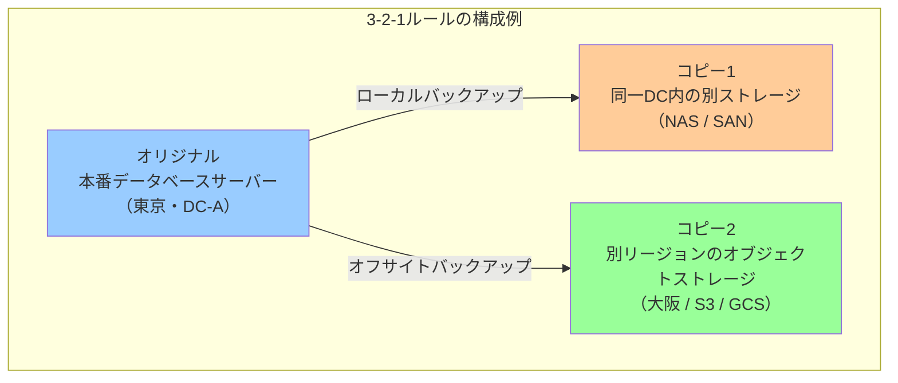

現代のクラウド環境では、オブジェクトストレージ（AWS S3、Google Cloud Storage、Azure Blob Storage）の活用により、オフサイト保管のコストとオペレーションの複雑さが大幅に低下している。

### 6.2 バックアップのローテーションと保持期間

すべてのバックアップを永遠に保持することはコスト面で現実的ではない。一般的なローテーション戦略として**GFS（Grandfather-Father-Son）**ローテーションがある。

**GFSローテーション**:
- **Son（日次）**: 直近7日分の日次バックアップを保持
- **Father（週次）**: 直近4〜5週分の週次バックアップを保持
- **Grandfather（月次）**: 直近12ヶ月分（または数年分）の月次バックアップを保持

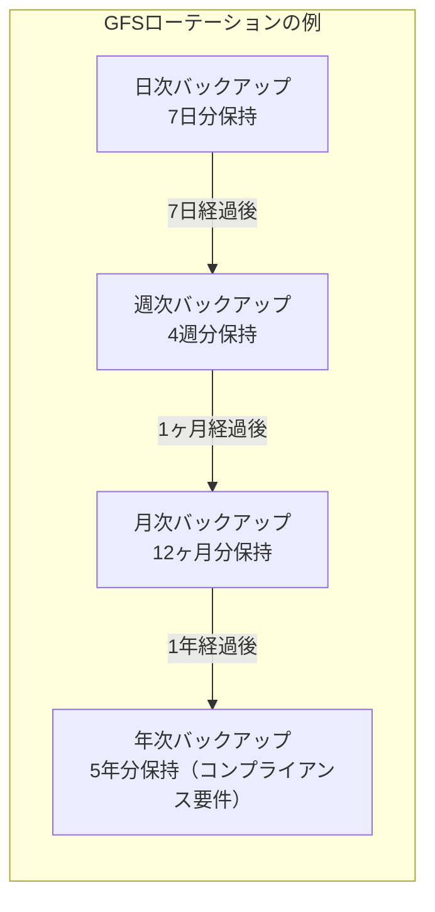

保持期間の決定には、ビジネス要件とコンプライアンス要件を考慮する必要がある。

| 要件 | 保持期間の例 |
|---|---|
| 運用上のリカバリ（ヒューマンエラー等） | 30日〜90日 |
| 財務データのコンプライアンス（金融庁規制等） | 7年 |
| 個人情報保護法への対応 | データ削除要求に対応できる期間 |
| 医療データ（医療法等） | 診療録は最終診療日から5年 |

### 6.3 オフサイトバックアップとネットワーク転送の考慮

大規模なデータベースのバックアップをオフサイトに転送する際、ネットワーク帯域が律速要因になる場合がある。

**転送最適化の手法**:

1. **圧縮**: gzipやzstdによる圧縮でデータサイズを削減
2. **差分転送**: rsyncのような差分転送ツールの活用
3. **並列転送**: 複数のストリームを使った並列アップロード
4. **暗号化**: AES-256等で暗号化してから転送（セキュリティ確保）

```bash
# example: compressed and encrypted backup to S3
pg_basebackup -D - -Ft | \
  gzip | \
  openssl enc -aes-256-cbc -k "$BACKUP_KEY" | \
  aws s3 cp - s3://my-backup-bucket/$(date +%Y%m%d)/base.tar.gz.enc
```

### 6.4 バックアップの暗号化とセキュリティ

バックアップには本番データと同じ機密情報が含まれる。バックアップ自体を適切に保護することは、セキュリティの観点から不可欠である。

::: danger バックアップの暗号化を必ず実施
暗号化されていないバックアップが盗難・漏洩した場合、本番データベースへの不正アクセスと同等のリスクが生じる。特に以下の場合は必須：
- クラウドストレージへの保存
- オフサイト転送
- テープメディアでの長期保存
:::

暗号化の実装方針：
- **転送中の暗号化**: TLS/SSLによるバックアップ転送
- **保存時の暗号化**: AES-256等での暗号化、鍵管理はKMS（Key Management Service）の活用
- **鍵のローテーション**: 定期的な暗号化鍵の更新

## 7. リストアのテストと検証

### 7.1 バックアップが「取れている」ことと「リストアできる」ことは別物

バックアップの最大の目的は**データを復元すること**である。しかし多くの組織で、バックアップは取れているがリストアを試したことがないまま運用している実態がある。これは非常に危険な状態である。

> バックアップが実際にリストアできると確認されていない限り、バックアップは存在しないも同然である。

実際に問題が発生してから初めてリストアを試みたところ、以下のような状況に直面するケースが報告されている。

- バックアップファイルが破損していた（checksum error）
- バックアップに必要なWALアーカイブが一部欠落していた
- バックアップ取得中のエラーがサイレントに無視されていた
- リストア手順書が古くなっており、現在の環境では動作しなかった
- リストアに想定より10倍の時間がかかり、RTOを超えた

### 7.2 定期的なリストアテストの設計

リストアテストは計画的・定期的に実施する必要がある。

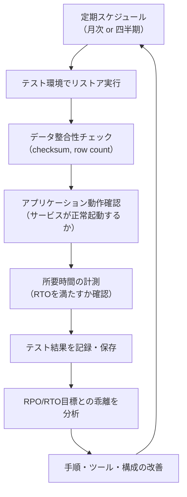

**リストアテストのチェックリスト**:

```
□ バックアップファイルのchecksum検証
□ テスト環境での実際のリストア実行
□ テーブル件数・合計データサイズの比較
□ データ整合性チェック（アプリケーションレベルのバリデーション）
□ インデックスの整合性確認（ANALYZE / CHECK TABLE）
□ PITRの動作確認（指定時刻への復元が正確か）
□ リストアにかかった実際の時間の記録
□ テスト結果のドキュメント化
```

### 7.3 自動化されたバックアップ検証

大規模なシステムでは手動テストに頼るのではなく、バックアップ検証を自動化することが推奨される。

```bash
#!/bin/bash
# automated backup verification script

BACKUP_FILE="$1"
TEST_DB="backup_verification_$(date +%Y%m%d)"
LOG_FILE="/var/log/backup_verify_$(date +%Y%m%d).log"

# verify checksum
echo "Verifying checksum..." | tee -a "$LOG_FILE"
if ! md5sum -c "${BACKUP_FILE}.md5"; then
    echo "FAILED: checksum mismatch" | tee -a "$LOG_FILE"
    exit 1
fi

# restore to test database
echo "Restoring to test database..." | tee -a "$LOG_FILE"
createdb "$TEST_DB"
pg_restore -d "$TEST_DB" "$BACKUP_FILE" 2>> "$LOG_FILE"

# verify row counts match production
echo "Verifying row counts..." | tee -a "$LOG_FILE"
PROD_COUNT=$(psql -d production -t -c "SELECT COUNT(*) FROM orders")
TEST_COUNT=$(psql -d "$TEST_DB" -t -c "SELECT COUNT(*) FROM orders")

if [ "$PROD_COUNT" != "$TEST_COUNT" ]; then
    echo "WARNING: row count mismatch (prod=$PROD_COUNT, test=$TEST_COUNT)" | tee -a "$LOG_FILE"
fi

# run consistency checks
echo "Running consistency checks..." | tee -a "$LOG_FILE"
psql -d "$TEST_DB" -c "SELECT schemaname, tablename FROM pg_stat_user_tables" | tee -a "$LOG_FILE"

# cleanup test database
dropdb "$TEST_DB"
echo "Verification completed." | tee -a "$LOG_FILE"
```

## 8. クラウド環境でのバックアップ

### 8.1 マネージドデータベースサービスの自動バックアップ

クラウドのマネージドデータベースサービスは、バックアップの多くの側面を自動化している。

**Amazon RDS / Aurora のバックアップ**:

RDSの自動バックアップはストレージレベルのスナップショットを使用する。デフォルトで有効になっており、保存期間は1〜35日で設定可能である。

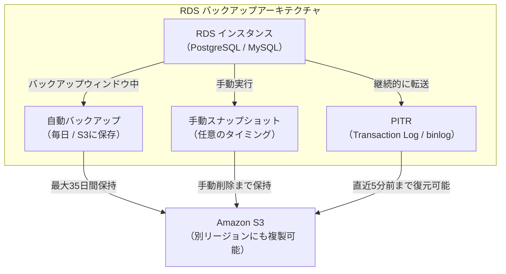

RDSのPITRはマネージドサービスとして提供されており、RDS管理コンソールまたはAWS CLIから指定時刻への復元が可能である。

```bash
# restore RDS instance to a specific point in time using AWS CLI
aws rds restore-db-instance-to-point-in-time \
  --source-db-instance-identifier mydb-production \
  --target-db-instance-identifier mydb-restored \
  --restore-time "2026-03-02T14:31:00Z" \
  --db-instance-class db.r6g.large \
  --publicly-accessible false
```

**Google Cloud SQL のバックアップ**:

Cloud SQLも同様に自動バックアップとPITRを提供する。バックアップはGCSに保存され、最大365日の保持期間を設定できる。

```bash
# restore Cloud SQL instance to a specific time
gcloud sql instances clone mydb-production mydb-restored \
  --point-in-time "2026-03-02T14:31:00.000Z"
```

### 8.2 クラウドバックアップの運用上の注意点

マネージドサービスの自動バックアップは便利だが、いくつかの重要な注意点がある。

::: warning マネージドバックアップの限界
1. **インスタンス削除時の自動バックアップ**: RDSでは、インスタンスを誤って削除した場合、自動バックアップも同時に削除される可能性がある（デフォルト動作）。削除保護（Deletion Protection）と自動スナップショットの保持設定を確認すること
2. **リージョン単位の障害**: 自動バックアップが同一リージョンのS3に保存される場合、リージョン全体の障害には対応できない。クロスリージョンレプリカやS3クロスリージョンレプリケーションを別途設定すること
3. **コスト**: スナップショットの保存にはストレージコストが発生する。保持期間とスナップショット頻度はコストと要件のバランスで決定すること
:::

### 8.3 クラウドネイティブなバックアップ戦略

クラウド環境では、マネージドサービスの自動バックアップに加えて、以下の補完的な手段を組み合わせることが推奨される。

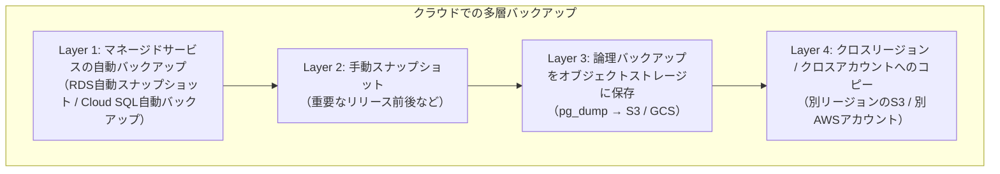

特にL4のクロスアカウントへのコピーは、ランサムウェアによる攻撃への耐性を高める上で重要である。本番アカウントのIAMが侵害されても、別アカウントのバックアップは保護される。

## 9. 大規模データベースのバックアップ最適化

### 9.1 大規模バックアップが直面する課題

テラバイト規模のデータベースになると、バックアップは以下の課題に直面する。

- バックアップの取得に数時間〜十数時間かかり、RPOを達成できない
- バックアップ中のI/Oがプロダクションのクエリパフォーマンスに影響する
- ネットワーク帯域がバックアップ転送のボトルネックになる
- バックアップストレージのコストが膨大になる

### 9.2 並列バックアップ

pg_dumpやXtraBackupは、テーブル単位での並列バックアップをサポートする。

```bash
# pg_dump with parallel workers (custom or directory format)
pg_dump -h localhost -U postgres -d large_database \
  -Fd -j 8 -f /backup/large_database_dir/
# -Fd : directory format
# -j 8 : use 8 parallel workers

# XtraBackup parallel copy
xtrabackup --backup --target-dir=/backup/full \
  --parallel=4 \           # parallel file copy threads
  --compress \             # enable compression
  --compress-threads=4     # parallel compression threads
```

### 9.3 ストレージスナップショットの活用

ファイルシステムレベルまたはブロックデバイスレベルのスナップショットを使用すると、データベースサイズに関わらず数秒〜数十秒でバックアップを取得できる。

**LVMスナップショット（オンプレミス）**:

```bash
# create LVM snapshot for MySQL backup
# 1. flush tables and acquire brief lock to get consistent state
mysql -u root -p -e "FLUSH TABLES WITH READ LOCK; SYSTEM lvcreate -L20G -s -n mysql_snap /dev/vg0/mysql; UNLOCK TABLES;"

# 2. mount snapshot and copy data
mount /dev/vg0/mysql_snap /mnt/mysql_snap -o ro
rsync -a /mnt/mysql_snap/ /backup/mysql_$(date +%Y%m%d)/

# 3. cleanup
umount /mnt/mysql_snap
lvremove /dev/vg0/mysql_snap
```

**AWSのEBSスナップショット**:

AWSのEBSスナップショットは、ボリュームサイズに関わらず数秒〜数十秒で「開始」できる（増分スナップショットは非同期でバックグラウンドコピーが行われる）。RDSだけでなく、EC2上の自己管理データベースでも活用できる。

```bash
# create EBS snapshot for EC2-hosted database
# 1. flush and freeze (for PostgreSQL)
psql -U postgres -c "CHECKPOINT;"
# or for more consistency: fsfreeze the filesystem

# 2. create snapshot via AWS CLI
aws ec2 create-snapshot \
  --volume-id vol-1234567890abcdef0 \
  --description "postgres-backup-$(date +%Y%m%d-%H%M)" \
  --tag-specifications 'ResourceType=snapshot,Tags=[{Key=Name,Value=postgres-backup}]'
```

### 9.4 増分バックアップとChangedPageTracking

大規模データベースの増分バックアップでは、**どのブロックが変更されたかを追跡する仕組み**が重要になる。

MySQLのXtraBackupは**LSN（Log Sequence Number）** を使って変更されたページを追跡する。

```bash
# take an incremental backup based on the last full backup
xtrabackup --backup \
  --target-dir=/backup/incremental/$(date +%Y%m%d) \
  --incremental-basedir=/backup/full
```

PostgreSQLでは、ブロックレベルの変更追跡に対応した**pg_rman**や**pgBackRest**などのツールが利用される。

**pgBackRest** は特に大規模PostgreSQL環境で推奨される高機能バックアップツールである。

```ini
# pgbackrest.conf
[global]
repo1-path=/backup/pgbackrest
repo1-cipher-type=aes-256-cbc
repo1-cipher-pass=s3cr3tkey
repo1-s3-bucket=my-backup-bucket
repo1-s3-region=ap-northeast-1
repo1-type=s3
process-max=4

[mydb]
pg1-path=/var/lib/postgresql/data
pg1-port=5432
```

```bash
# pgBackRest operations
pgbackrest --stanza=mydb --type=full backup    # full backup
pgbackrest --stanza=mydb --type=incr backup    # incremental backup
pgbackrest --stanza=mydb info                  # show backup information

# restore to specific point in time
pgbackrest --stanza=mydb --type=time \
  "--target=2026-03-02 14:31:00" \
  restore
```

### 9.5 バックアップ取得時のI/O負荷の制御

大規模なバックアップは本番サービスのI/Oに大きな影響を与える可能性がある。

```bash
# throttle I/O during backup using ionice and rate limiting
ionice -c 3 pg_basebackup ...  # use idle I/O scheduling class

# XtraBackup throttle
xtrabackup --backup --throttle=100  # max 100 MB/s

# rsync bandwidth limiting
rsync --bwlimit=50000 ...  # max 50 MB/s
```

また、バックアップの取得時間帯を負荷の低い時間（深夜）に設定し、本番サービスへの影響を最小化することが重要である。

## 10. バックアップのモニタリングとアラート

### 10.1 バックアップの監視指標

バックアップが正常に動作しているかを継続的に監視するための指標を定義する必要がある。

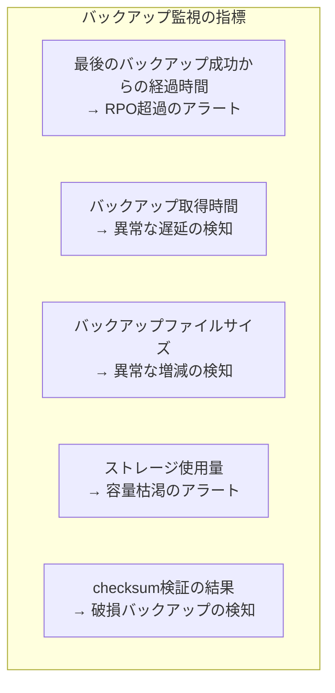

### 10.2 アラート設計の原則

バックアップのアラートは「サイレント失敗」を防ぐことが最重要である。バックアップの失敗は静かに起こりがちで、問題が発覚するのが実際にリストアを試みた時、という状況を避けなければならない。

- バックアップジョブの**成功通知**を送る（失敗通知だけでなく）
- 最後のバックアップ成功から**RPO時間が経過した場合**にアラートを発報する
- バックアップのchecksum検証を自動化し、失敗時は即座にアラートを送る

```bash
#!/bin/bash
# check if backup is recent enough (within RPO)
LAST_BACKUP=$(aws s3 ls s3://my-backup-bucket/ | tail -1 | awk '{print $1, $2}')
LAST_BACKUP_EPOCH=$(date -d "$LAST_BACKUP" +%s)
CURRENT_EPOCH=$(date +%s)
RPO_SECONDS=86400  # 24 hours

ELAPSED=$((CURRENT_EPOCH - LAST_BACKUP_EPOCH))
if [ $ELAPSED -gt $RPO_SECONDS ]; then
    # send alert to PagerDuty / Slack / etc.
    echo "CRITICAL: Last backup was $((ELAPSED/3600)) hours ago (RPO: $((RPO_SECONDS/3600)) hours)"
    exit 1
fi
echo "OK: Last backup $((ELAPSED/3600)) hours ago"
```

## 11. ディザスタリカバリとバックアップの統合

### 11.1 DRの計画と演習

ディザスタリカバリ計画（DRP）はバックアップの存在だけでは機能しない。定期的な**DR演習（ドリル）**が不可欠である。

DR演習の目的：
1. リストア手順書の正確性を検証する
2. 実際のRTOを計測し、目標値との乖離を把握する
3. チームメンバーが実際の緊急時に手順を実行できるようトレーニングする
4. ツールや環境の変化に合わせて手順書を更新する契機とする

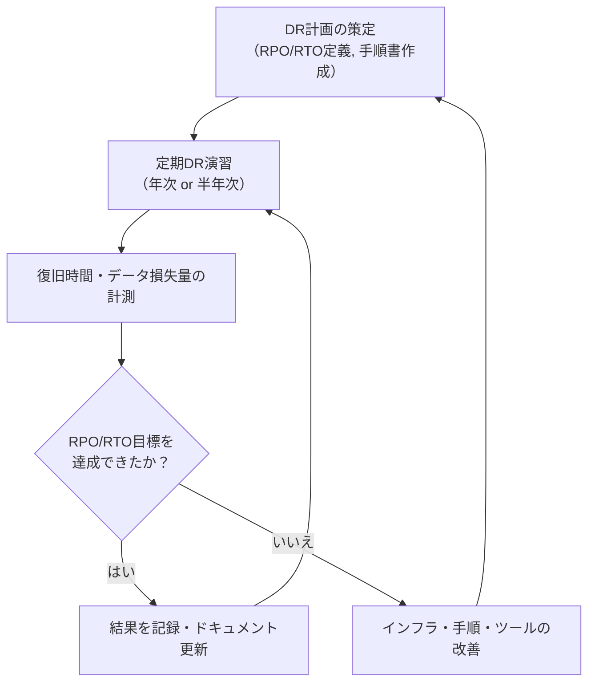

### 11.2 ランサムウェア対策としてのバックアップ

近年、ランサムウェアはバックアップシステムも攻撃対象とするようになっている。バックアップが暗号化された場合にも対応できるよう、**イミュータブルバックアップ（変更不可バックアップ）**の採用が重要になっている。

AWS S3のオブジェクトロック機能（WORM: Write Once, Read Many）を使うことで、指定期間内のバックアップ削除・変更を防止できる。

```bash
# create S3 bucket with object lock enabled
aws s3api create-bucket \
  --bucket my-immutable-backups \
  --object-lock-enabled-for-bucket \
  --region ap-northeast-1

# configure default retention (governance mode, 30 days)
aws s3api put-object-lock-configuration \
  --bucket my-immutable-backups \
  --object-lock-configuration \
    '{"ObjectLockEnabled":"Enabled","Rule":{"DefaultRetention":{"Mode":"GOVERNANCE","Days":30}}}'
```

## 12. バックアップ戦略の設計フレームワーク

### 12.1 設計の全体フロー

バックアップ戦略を設計する際の全体的な思考フレームワークを示す。

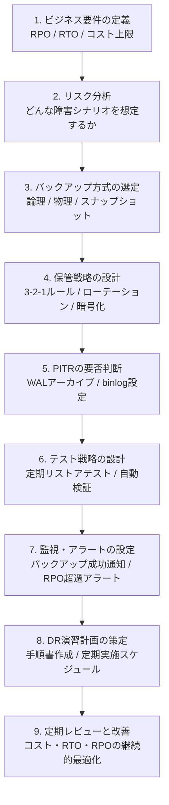

### 12.2 環境別のバックアップ設計例

**小規模Webアプリケーション（DB: 数GB）**:

```yaml
# backup strategy for small web application
backup:
  tool: pg_dump
  schedule: daily at 03:00
  format: custom (-Fc)
  compression: gzip
  retention: 30 days daily, 6 months monthly
  storage: local NAS + S3 (cross-region)
  encryption: AES-256 (key in AWS KMS)
  pitr: disabled (daily backup sufficient for RPO=24h)
  restore_test: monthly automated script
  rpo: 24 hours
  rto: 2 hours
```

**中規模SaaS（DB: 数百GB）**:

```yaml
# backup strategy for medium SaaS
backup:
  tool: pg_basebackup + WAL archiving (pgBackRest)
  schedule: full weekly, incremental daily
  pitr: enabled (WAL archive to S3)
  retention:
    daily: 14 days
    weekly: 8 weeks
    monthly: 12 months
  storage: S3 (primary) + S3 cross-region replication
  encryption: AES-256 (pgBackRest built-in)
  restore_test: monthly with automated verification
  rpo: 1 hour (WAL archive interval)
  rto: 4 hours
```

**大規模OLTP（DB: 数TB）**:

```yaml
# backup strategy for large OLTP
backup:
  tool: EBS snapshot + pgBackRest (incremental)
  schedule:
    snapshot: every 4 hours (EBS)
    pitr: continuous WAL streaming to S3
  retention:
    snapshots: 7 days
    pitr: 35 days
  storage: S3 (primary) + S3 another region
  immutable: S3 Object Lock (WORM, 30 days)
  encryption: AES-256 + KMS CMK
  restore_test: quarterly DR drill with full recovery simulation
  rpo: 5 minutes
  rto: 1 hour
```

## 13. まとめ

データベースのバックアップとリカバリは、単なる「万が一の備え」ではなく、信頼性の高いシステムを運用するための**基盤的なエンジニアリング**である。

**RPOとRTO**を起点にして戦略を設計し、ビジネス要件から逆算することが重要である。技術的な制約や好みから出発するのではなく、失いうるデータ量と許容できる停止時間を定量化することが設計の第一歩となる。

**バックアップの種類**（フル・差分・増分）と**バックアップの形式**（論理・物理）はそれぞれトレードオフを持つ。pg_dumpのような論理バックアップは柔軟性が高く、pg_basebackupやXtraBackupのような物理バックアップは大規模環境での速度に優れる。PITRを実現するためにはWALアーカイブやbinlogの設定が不可欠である。

**3-2-1ルール**と**GFSローテーション**は、バックアップの冗長性と保持コストのバランスを取るための実証されたフレームワークである。クラウド環境ではオブジェクトストレージとイミュータブルバックアップの組み合わせが、特にランサムウェア対策として有効である。

最後に、そして最も重要なこととして、**定期的なリストアテストと DR演習**を実施することを強調したい。バックアップは取得しているだけでは価値がない。実際にリストアできることを繰り返し確認し、RTOを計測し、手順書を最新の状態に保つことが、データベースの信頼性を真に支える実践である。
