# データベースの高可用性設計 — フェイルオーバー・自動昇格・スプリットブレイン対策

## 1. 高可用性の要件

### 1.1 高可用性とは何か

データベースにおける高可用性（High Availability, HA）とは、計画的・非計画的な障害が発生した場合でも、サービスが継続的にデータの読み書きを処理できる状態を維持することを指す。ここでの「可用性」は単に「動いている」だけでなく、**許容可能な時間内に**応答を返し、**許容可能なデータ損失範囲内で**復旧できることを意味する。

高可用性は一般的に「9」の数で表現される。

| 可用性レベル | 年間ダウンタイム | 分類 |
|-------------|----------------|------|
| 99% (Two 9s) | 約3.65日 | 低可用性 |
| 99.9% (Three 9s) | 約8.76時間 | 標準的 |
| 99.99% (Four 9s) | 約52.6分 | 高可用性 |
| 99.999% (Five 9s) | 約5.26分 | 超高可用性 |
| 99.9999% (Six 9s) | 約31.5秒 | 極限的高可用性 |

多くの商用データベースサービスはFour 9s（99.99%）を目標とするが、Five 9sを達成するには単なる技術的対策だけでなく、運用プロセス全体の最適化が必要になる。

### 1.2 障害の分類

高可用性設計を考える上で、まず障害の種類を理解する必要がある。

```
障害の分類
├── プロセス障害
│   ├── データベースプロセスのクラッシュ
│   ├── OOM Killer によるプロセス終了
│   └── アプリケーションバグによるハング
├── ノード障害
│   ├── ハードウェア故障（ディスク、メモリ、CPU）
│   ├── OS カーネルパニック
│   └── 電源喪失
├── ネットワーク障害
│   ├── ネットワーク分断（パーティション）
│   ├── パケットロス・遅延の増大
│   └── スイッチ・ルーターの故障
├── データセンター障害
│   ├── 停電
│   ├── 冷却装置故障
│   └── 自然災害
└── 計画的停止
    ├── ソフトウェアアップグレード
    ├── ハードウェア交換
    └── スキーマ変更
```

これらの障害に対して、高可用性設計は**冗長化（Redundancy）**、**検知（Detection）**、**回復（Recovery）** の3つの柱で対処する。

### 1.3 RTO と RPO

高可用性を定量的に議論するためには、2つの重要な指標を理解する必要がある。

- **RTO（Recovery Time Objective）**: 障害発生からサービス復旧までの許容時間
- **RPO（Recovery Point Objective）**: 障害発生時に許容できるデータ損失の量（時間で表現）

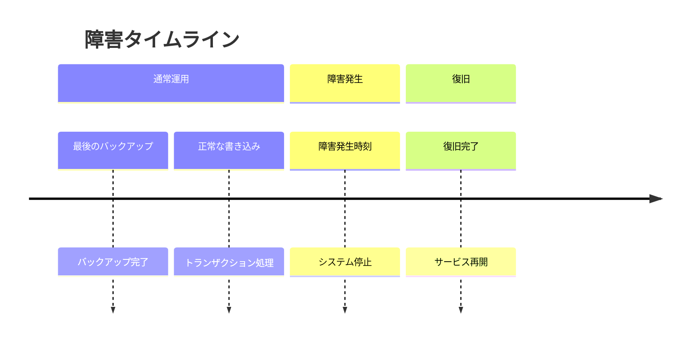

RPO = 0 を目指す場合、**同期レプリケーション**が必須となり、パフォーマンスとのトレードオフが発生する。RTO を最小化するには、**自動フェイルオーバー**機構が必要になる。この2つの指標は、以降のすべての設計判断の基盤となる。

## 2. レプリケーションの基礎

### 2.1 レプリケーションの方式

高可用性の基盤はデータの冗長化、すなわちレプリケーションである。レプリケーションには主に以下の方式がある。

#### 物理レプリケーション

物理レプリケーションは、データベースの内部的なストレージレベルでの変更を複製する。PostgreSQL の Streaming Replication が代表例であり、WAL（Write-Ahead Log）のバイナリデータをそのままスタンバイに転送する。

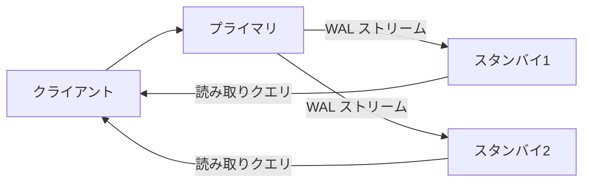

利点は設定が比較的簡単であり、すべての変更が忠実に複製される点にある。一方で、プライマリとスタンバイのデータベースバージョンが一致している必要があり、異なるアーキテクチャ間での複製はできない。

#### 論理レプリケーション

論理レプリケーションは、SQL レベルの変更（INSERT、UPDATE、DELETE）をデコードして転送する。テーブル単位での選択的な複製が可能であり、異なるバージョン間やスキーマが異なるデータベース間でも使用できる。MySQL のバイナリログレプリケーションや、PostgreSQL の Logical Replication がこれに該当する。

### 2.2 同期レプリケーションと非同期レプリケーション

レプリケーションのタイミングによって、データの一貫性保証が大きく異なる。

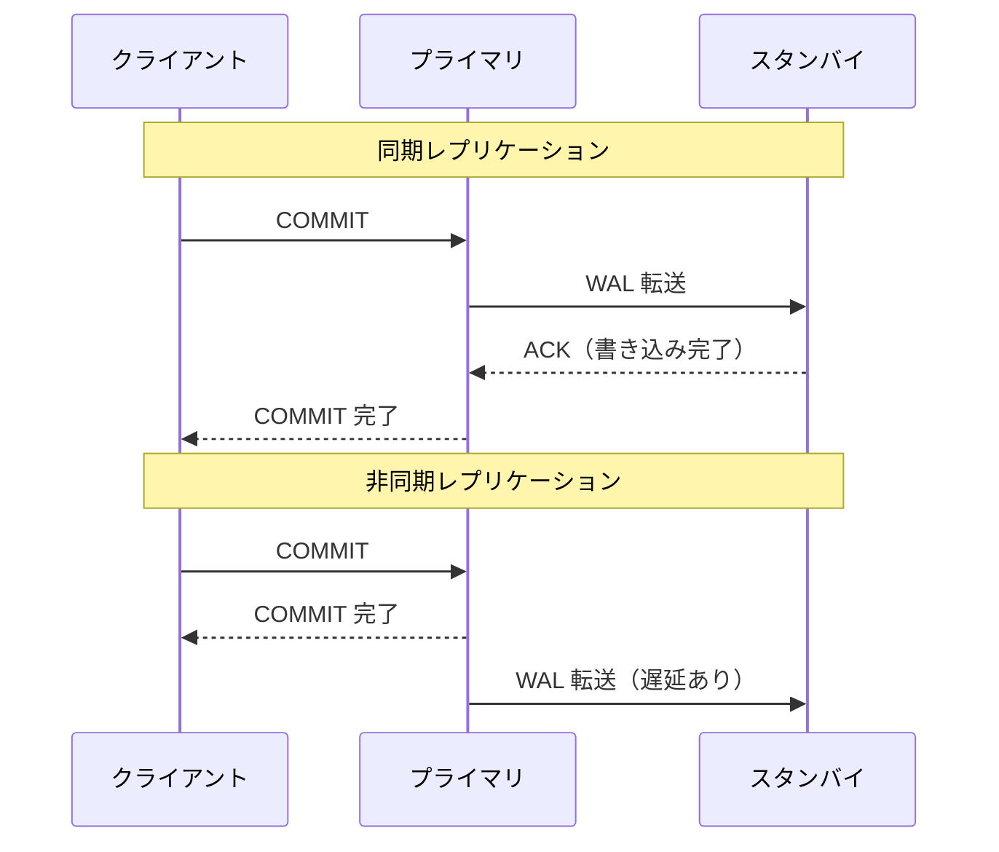

**同期レプリケーション**では、少なくとも1台のスタンバイが書き込みを確認するまでプライマリがコミットを返さない。これにより RPO = 0 が達成されるが、スタンバイの障害がプライマリのパフォーマンスに直接影響する。PostgreSQL では `synchronous_commit` パラメータで制御できる。

**非同期レプリケーション**では、プライマリはスタンバイの応答を待たずにコミットを完了する。パフォーマンスへの影響は最小限だが、プライマリ障害時にはスタンバイに未到達の WAL が失われる可能性がある（RPO > 0）。

**準同期（Semi-synchronous）レプリケーション**は、MySQL でよく使われるアプローチで、少なくとも1台のスタンバイがリレーログに書き込んだ時点でコミットを返す。完全な同期レプリケーションよりもレイテンシが低いが、スタンバイでの適用（Apply）前にプライマリが障害を起こした場合のデータ整合性について注意が必要である。

## 3. フェイルオーバーの仕組み

### 3.1 フェイルオーバーとは

フェイルオーバーとは、プライマリデータベースが障害を起こした際に、スタンバイデータベースをプライマリに昇格させ、サービスを継続させるプロセスである。フェイルオーバーは大きく**手動フェイルオーバー**と**自動フェイルオーバー**に分類される。

手動フェイルオーバーは、運用者が障害を確認し、明示的にスタンバイを昇格させる。判断の正確性は高いが、対応に時間がかかるため RTO が大きくなる。深夜帯のオンコール対応を考えると、障害検知から実際の対応開始まで数分〜数十分かかることも珍しくない。

自動フェイルオーバーは、障害を検知して自動的にスタンバイを昇格させる。RTO を大幅に短縮できるが、**誤検知による不要なフェイルオーバー**や**スプリットブレイン**のリスクがある。

### 3.2 フェイルオーバーのプロセス

自動フェイルオーバーの典型的なプロセスは以下の通りである。

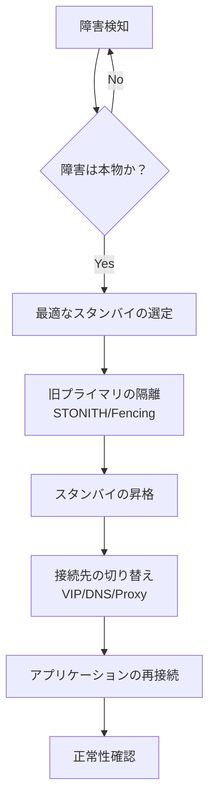

各ステップには固有の課題がある。

1. **障害検知**: ハートビートの途絶を検知するが、ネットワーク遅延と本物の障害を区別する必要がある
2. **障害確認**: 複数のモニタリングソースからの情報を組み合わせて確認する
3. **スタンバイ選定**: レプリケーションの遅延が最も少ないスタンバイを選ぶ
4. **旧プライマリの隔離（Fencing）**: 旧プライマリが書き込みを継続しないように確実に停止させる
5. **昇格**: スタンバイを読み書き可能なプライマリに昇格させる
6. **接続切り替え**: アプリケーションの接続先を新プライマリに向ける
7. **正常性確認**: 新プライマリが正常に動作していることを確認する

### 3.3 Fencing（旧プライマリの隔離）

フェイルオーバーにおいて最も見落とされがちだが重要なステップが、旧プライマリの隔離である。旧プライマリが実際にはまだ動作しており、書き込みを受け付け続けている場合、データの不整合が発生する。これがスプリットブレインの原因となる。

Fencing の方法としては、以下のアプローチがある。

- **STONITH（Shoot The Other Node In The Head）**: IPMIやiLOなどのリモート管理インターフェースを使用して、旧プライマリのサーバーを物理的に電源断する
- **ストレージ Fencing**: 共有ストレージへのアクセスを遮断する
- **ネットワーク Fencing**: ファイアウォールルールを動的に変更して、旧プライマリの通信を遮断する
- **ソフトウェア Fencing**: データベースプロセスを強制終了し、再起動を防止する

クラウド環境では、クラウドプロバイダーの API を利用してインスタンスを停止させる方法が一般的である。

## 4. 自動昇格の実装

### 4.1 Patroni

Patroni は、PostgreSQL の高可用性を実現するためのオープンソースのクラスタマネージャーである。Zalando が開発・メンテナンスしており、分散合意ストア（DCS: Distributed Configuration Store）を活用してリーダー選出とフェイルオーバーを管理する。

#### アーキテクチャ

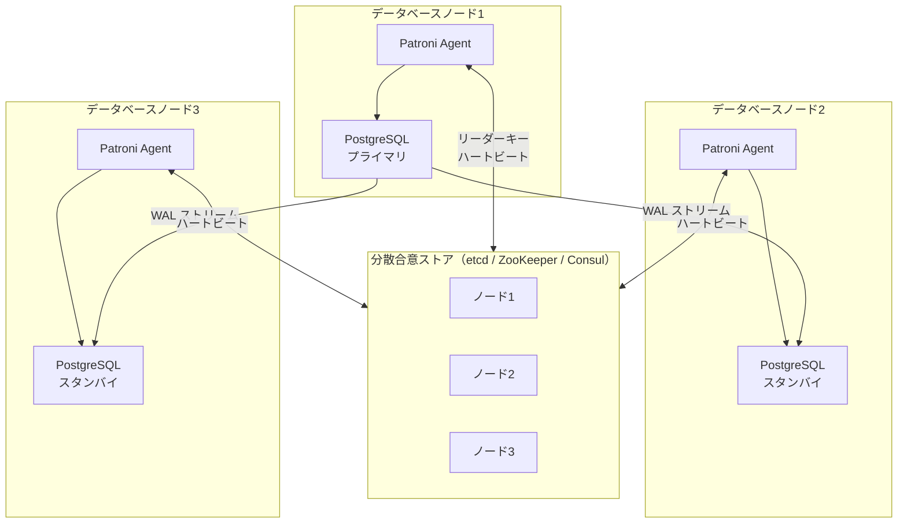

Patroni の中核的な仕組みは**リーダーキーの TTL（Time To Live）管理**である。プライマリの Patroni エージェントは、DCS 上のリーダーキーを定期的に更新（renew）する。リーダーキーの TTL が切れた場合、他の Patroni エージェントがリーダー選出を開始する。

#### Patroni の設定例

```yaml
scope: my-cluster
name: node1

restapi:
  listen: 0.0.0.0:8008
  connect_address: 192.168.1.1:8008

etcd3:
  hosts:
    - 192.168.1.10:2379
    - 192.168.1.11:2379
    - 192.168.1.12:2379

bootstrap:
  dcs:
    ttl: 30
    loop_wait: 10
    retry_timeout: 10
    maximum_lag_on_failover: 1048576  # 1MB
    synchronous_mode: true
    postgresql:
      use_pg_rewind: true
      parameters:
        max_connections: 200
        max_worker_processes: 8
        wal_level: replica
        max_wal_senders: 10
        max_replication_slots: 10
        hot_standby: "on"

postgresql:
  listen: 0.0.0.0:5432
  connect_address: 192.168.1.1:5432
  data_dir: /var/lib/postgresql/data
  authentication:
    superuser:
      username: postgres
      password: secret
    replication:
      username: replicator
      password: rep-pass
```

この設定で注目すべきポイントは以下の通りである。

- `ttl: 30`: リーダーキーの有効期間。30秒以内にリーダーキーが更新されなければ、リーダーが失われたとみなされる
- `loop_wait: 10`: Patroni のメインループの間隔。10秒ごとにリーダーキーを更新する
- `maximum_lag_on_failover: 1048576`: フェイルオーバー時に許容するレプリケーション遅延の上限（バイト）。これを超えて遅延しているスタンバイはフェイルオーバー候補から除外される
- `synchronous_mode: true`: 同期レプリケーションを有効化する。RPO = 0 を目指す場合に使用する
- `use_pg_rewind: true`: フェイルオーバー後に旧プライマリをスタンバイとして復帰させる際、`pg_rewind` を使用して効率的にデータを巻き戻す

#### フェイルオーバーの流れ

Patroni のフェイルオーバーは以下のように進行する。

1. プライマリの Patroni エージェントがクラッシュするか、DCS へのハートビートが TTL 内に更新されなくなる
2. DCS 上のリーダーキーが失効する
3. 各スタンバイの Patroni エージェントがリーダーキーの失効を検知する
4. 候補となるスタンバイが DCS に対してリーダーキーの取得を試みる（アトミックな compare-and-swap 操作）
5. 最初にリーダーキーを取得したスタンバイが新リーダーとなる
6. 新リーダーは PostgreSQL を `pg_ctl promote` で昇格させる
7. 他のスタンバイは新リーダーへのレプリケーションを再設定する

### 4.2 pg_auto_failover

pg_auto_failover は、Citus Data（現 Microsoft）が開発した PostgreSQL の自動フェイルオーバーソリューションである。Patroni とは異なり、外部の DCS を必要とせず、専用の**Monitor ノード**を使用してクラスタの状態を管理する。

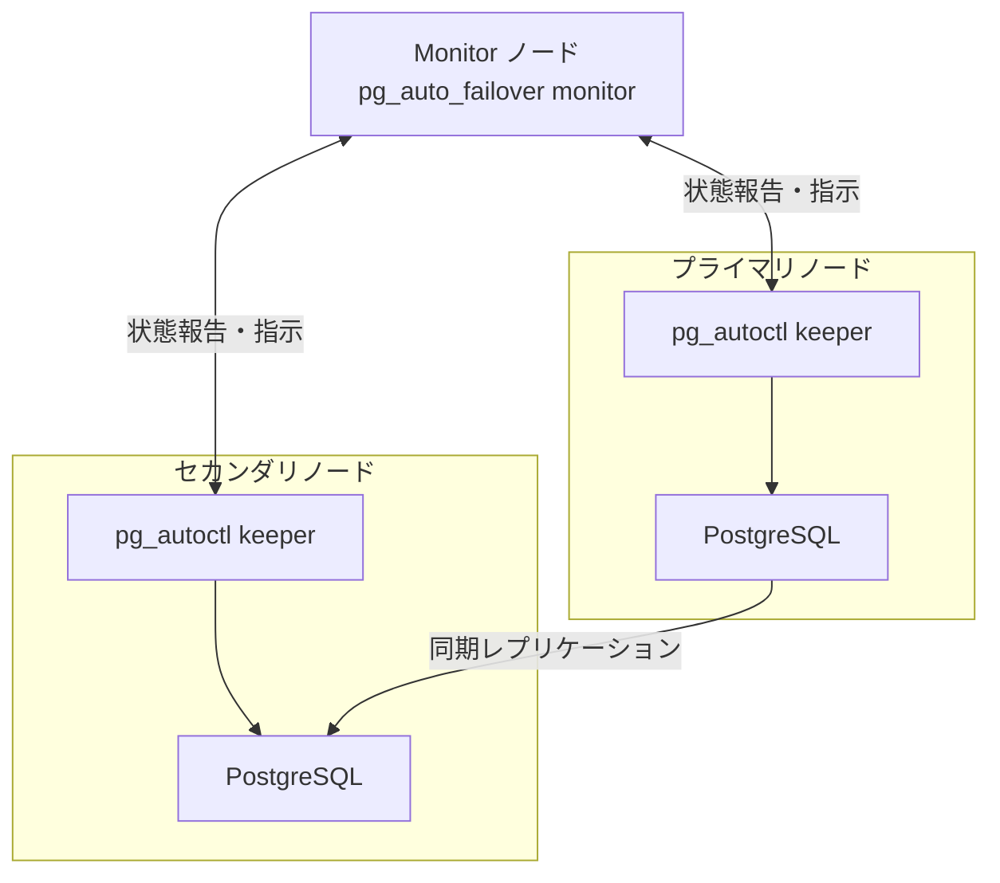

pg_auto_failover の特徴は、有限状態マシン（FSM）に基づいたフェイルオーバー管理である。各ノードは明確に定義された状態遷移に従い、Monitor ノードが状態遷移を調整する。

主な状態は以下の通りである。

| 状態 | 説明 |
|------|------|
| `single` | レプリカなしの単一ノード |
| `wait_primary` | セカンダリの準備待ち |
| `primary` | アクティブなプライマリ |
| `draining` | 新規接続の停止中 |
| `demote_timeout` | 降格タイムアウト中 |
| `demoted` | 降格完了 |
| `secondary` | アクティブなセカンダリ |
| `prepare_promotion` | 昇格準備中 |
| `wait_primary` | プライマリ昇格待ち |

pg_auto_failover は Patroni と比較してシンプルな構成が可能だが、Monitor ノードが単一障害点となりうる。ただし、Monitor ノード自体も PostgreSQL で構成されているため、Monitor のレプリカを用意することで冗長化できる。

### 4.3 MySQL の自動フェイルオーバー

MySQL エコシステムにおける自動フェイルオーバーの選択肢は以下の通りである。

#### MySQL InnoDB Cluster

MySQL InnoDB Cluster は、MySQL Group Replication を基盤とした公式の高可用性ソリューションである。Paxos ベースの合意プロトコルを使用して、クラスタ内のデータ整合性を保証する。

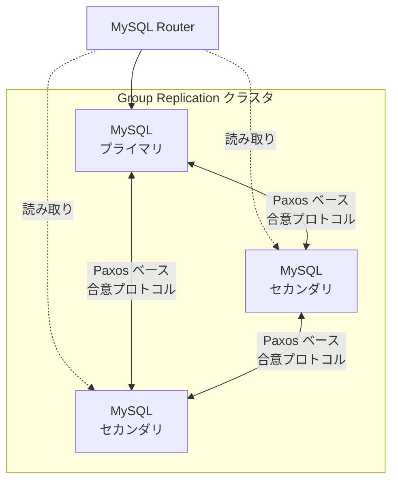

MySQL Router がプロキシとして機能し、アプリケーションからのトラフィックを適切なノードにルーティングする。プライマリ障害時には、Group Replication が自動的に新しいプライマリを選出し、MySQL Router が接続先を切り替える。

#### MHA（Master High Availability）

MHA は、長年にわたり MySQL の高可用性のデファクトスタンダードであったツールである。現在は開発があまり活発ではないが、その設計思想は多くの後続ツールに影響を与えた。MHA の特徴は、フェイルオーバー時にバイナリログの差分を各スレーブに適用し、データの一貫性を最大限に保つ点にある。

#### Orchestrator

Orchestrator は、GitHub が開発した MySQL のレプリケーショントポロジ管理・フェイルオーバーツールである。Web UI を備え、複雑なレプリケーショントポロジの可視化と管理が可能である。Raft 合意プロトコルを使用した分散配置をサポートしており、Orchestrator 自体の単一障害点を排除できる。

## 5. スプリットブレイン問題

### 5.1 スプリットブレインとは

スプリットブレイン（Split-Brain）とは、ネットワーク分断などにより、クラスタ内の複数のノードが同時に自分をプライマリであると認識し、それぞれが独立に書き込みを受け付けてしまう状態を指す。これはデータベースの高可用性設計において**最も危険な障害状態**である。

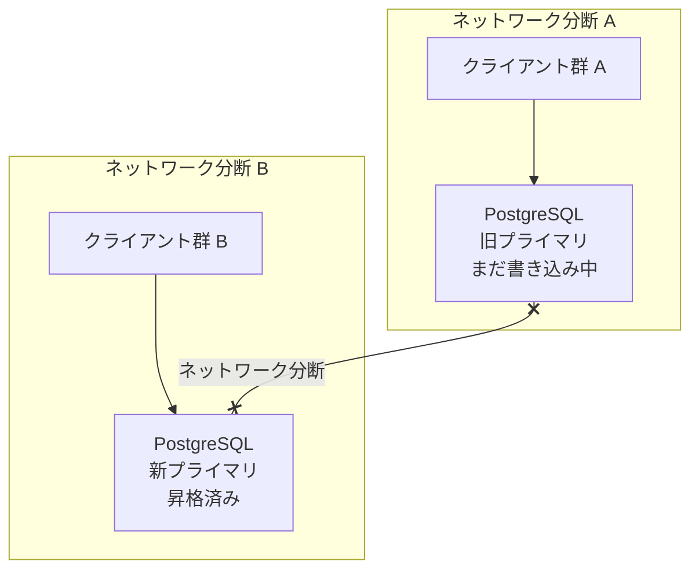

スプリットブレインが発生すると、以下の問題が起きる。

- **データの乖離**: 両方のプライマリが独立に書き込みを受け付けるため、データが乖離する
- **復旧の困難さ**: 分断解消後、乖離したデータのマージが極めて困難。場合によってはデータ損失が不可避
- **整合性の破壊**: 外部キー制約や一意制約の違反が発生しうる
- **ビジネスへの影響**: 二重発注、二重決済など、取り返しのつかない事態が起こりうる

### 5.2 スプリットブレインの発生パターン

スプリットブレインが発生する典型的なシナリオを考える。

**パターン1: ネットワーク分断によるフェイルオーバー**

1. プライマリとスタンバイの間のネットワークが分断される
2. スタンバイは「プライマリが障害を起こした」と判断する
3. スタンバイが自動的にプライマリに昇格する
4. 旧プライマリはまだ正常に動作しており、クライアントからの書き込みを受け付け続ける

**パターン2: GC pause やリソース枯渇による偽障害**

1. プライマリが長時間の GC pause やディスク I/O の飽和によりハートビートを返せなくなる
2. 監視システムが「プライマリの障害」を検知し、フェイルオーバーを開始する
3. GC pause が解消され、旧プライマリが復帰するが、既にスタンバイが昇格している

**パターン3: 監視システムの分断**

1. 監視ノード自体がネットワーク分断の影響を受ける
2. 分断された監視ノードがそれぞれ独立にフェイルオーバーを判断する

### 5.3 スプリットブレインの防止策

スプリットブレインを防止するための主要なアプローチは以下の通りである。

#### Fencing の徹底

前述の STONITH や API ベースの Fencing を確実に実行することで、旧プライマリが書き込みを続けることを防ぐ。Fencing が成功しない限りフェイルオーバーを進めないというポリシーが重要である。

#### リース（Lease）ベースの保護

プライマリは DCS 上のリースを保持することで、自身がプライマリであることを証明する。リースの更新に失敗した場合、プライマリ自身がサービスを停止する。Patroni のリーダーキー TTL 管理はこのアプローチの実装である。

```python
# Patroni-style lease management (simplified pseudocode)
class LeaseManager:
    def __init__(self, dcs, ttl=30, loop_wait=10):
        self.dcs = dcs
        self.ttl = ttl
        self.loop_wait = loop_wait

    def run_primary_loop(self):
        while True:
            try:
                # Attempt to renew the leader key
                success = self.dcs.renew_leader_key(ttl=self.ttl)
                if not success:
                    # Lost leadership - demote immediately
                    self.demote_to_standby()
                    return
            except ConnectionError:
                # Cannot reach DCS - must demote to be safe
                self.demote_to_standby()
                return
            time.sleep(self.loop_wait)
```

ここで重要なのは、DCS に到達できない場合、プライマリが**自らを降格する**という点である。これは「安全側に倒す」設計であり、一時的な可用性の低下と引き換えにデータの安全性を確保する。

## 6. Quorum ベースの判定

### 6.1 Quorum の原理

Quorum（クォーラム）とは、クラスタの過半数のノードが合意しなければ、決定が有効とならないという原則である。N ノードのクラスタにおいて、Quorum は ⌊N/2⌋ + 1 ノードである。

| クラスタサイズ | Quorum | 許容障害ノード数 |
|--------------|--------|----------------|
| 3 | 2 | 1 |
| 5 | 3 | 2 |
| 7 | 4 | 3 |

Quorum の数学的な保証は、**2つの Quorum は必ず少なくとも1つのノードを共有する**という点にある。これにより、ネットワーク分断が発生しても、Quorum を形成できるのは最大で1つのパーティションだけであることが保証され、スプリットブレインを原理的に防止できる。

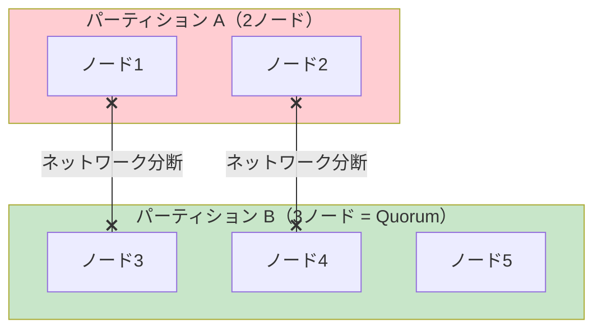

5ノードのクラスタでネットワークが2:3に分断された場合、3ノード側のみが Quorum を形成でき、プライマリの選出が可能となる。2ノード側は Quorum を形成できないため、新たなプライマリを選出できず、スプリットブレインが防止される。

### 6.2 Witness ノード

データベースノードを奇数台用意することが難しい場合、**Witness（ウィットネス）ノード**を使用して Quorum の偶数問題を解決できる。Witness ノードはデータを保持せず、Quorum の投票にのみ参加する軽量なノードである。

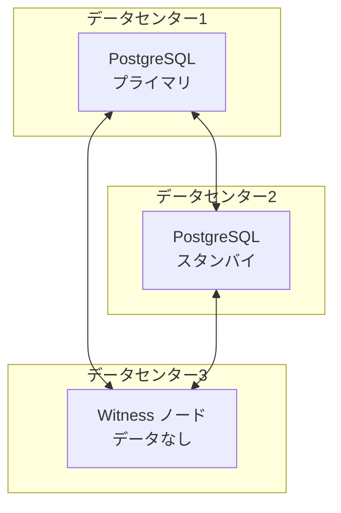

この構成では、3つのノードで Quorum（= 2）を形成する。いずれか1つのノードまたはデータセンターが障害を起こしても、残りの2ノードで Quorum を形成し、プライマリを選出できる。

### 6.3 DCS を活用した Quorum 判定

Patroni のようなツールでは、Quorum 判定を DCS に委託する。etcd や ZooKeeper は内部的に Raft や Zab などの合意プロトコルを使用しており、Quorum ベースの書き込みが保証されている。

データベースノードは DCS のリーダーキーを通じて間接的に Quorum に参加する。この設計には以下のメリットがある。

- データベースノード自体に合意プロトコルを実装する必要がない
- 合意プロトコルの実装は DCS に任せ、データベースの HA ロジックに集中できる
- etcd や ZooKeeper は広く使われており、信頼性が高い

一方で、DCS クラスタ自体の可用性がデータベースの可用性の前提条件となるため、DCS の運用にも十分な注意が必要である。

## 7. Proxy による VIP 管理と接続ルーティング

### 7.1 フェイルオーバー時の接続切り替え問題

フェイルオーバーが完了した後、アプリケーションの接続先を新プライマリに切り替える必要がある。この切り替えをいかに透過的に行うかが、実際の RTO に大きく影響する。

主なアプローチは以下の4つである。

### 7.2 VIP（Virtual IP Address）

VIP は、クラスタの論理的なエンドポイントとして仮想的な IP アドレスを割り当て、フェイルオーバー時にこの VIP を新プライマリに付け替える方式である。

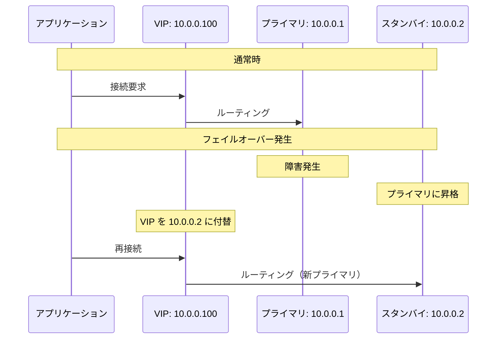

VIP 方式の利点は、アプリケーション側の設定変更が不要である点だが、L2 ネットワークの同一セグメント内でのみ動作するため、マルチリージョン構成には不向きである。また、ARP キャッシュの更新に依存するため、切り替えに数秒かかることがある。

### 7.3 DNS ベースの切り替え

DNS レコードの更新によって接続先を切り替える方式である。VIP と異なり L2 の制約がないため、マルチリージョンでも使用できる。しかし、DNS の TTL キャッシュにより、クライアントが古い IP を参照し続ける問題がある。

TTL を短く設定する（例: 5秒）ことで緩和できるが、DNS サーバーへの負荷が増大する。AWS Route 53 などのマネージド DNS では、ヘルスチェックと連動したフェイルオーバーレコードが利用できる。

### 7.4 プロキシベースのルーティング

HAProxy や PgBouncer、ProxySQL などのプロキシを配置し、バックエンドのデータベースの状態を監視しながらトラフィックをルーティングする方式である。

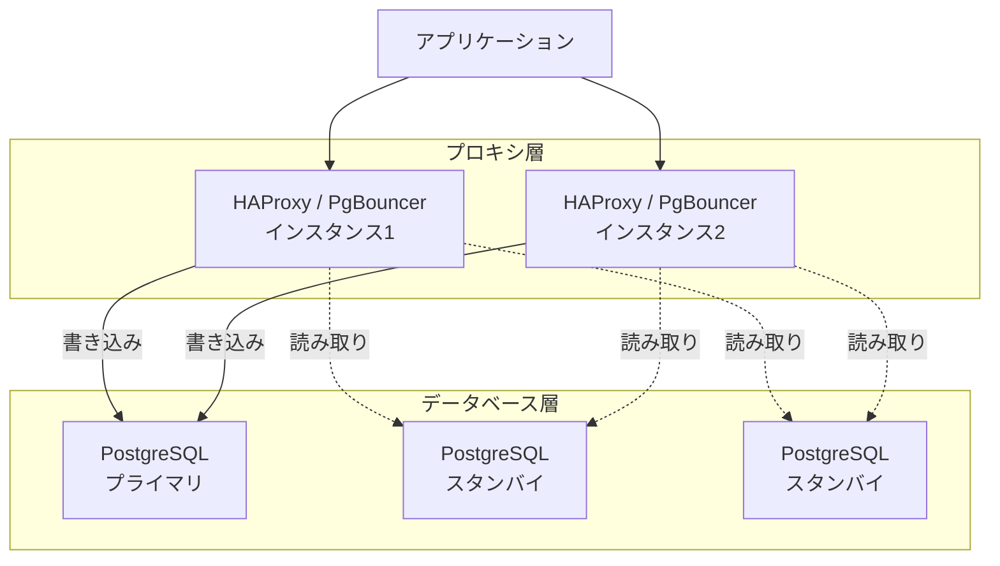

HAProxy を Patroni と組み合わせる設定例を示す。

```
# HAProxy configuration for Patroni
global
    maxconn 1000

defaults
    mode tcp
    timeout connect 5s
    timeout client 30m
    timeout server 30m

listen postgresql_primary
    bind *:5432
    option httpchk GET /primary
    http-check expect status 200
    default-server inter 3s fall 3 rise 2
    server node1 192.168.1.1:5432 check port 8008
    server node2 192.168.1.2:5432 check port 8008
    server node3 192.168.1.3:5432 check port 8008

listen postgresql_replicas
    bind *:5433
    balance roundrobin
    option httpchk GET /replica
    http-check expect status 200
    default-server inter 3s fall 3 rise 2
    server node1 192.168.1.1:5432 check port 8008
    server node2 192.168.1.2:5432 check port 8008
    server node3 192.168.1.3:5432 check port 8008
```

この設定では、Patroni の REST API エンドポイント（ポート8008）に対してヘルスチェックを行い、`/primary` に 200 を返すノードにのみ書き込みトラフィックを送る。`/replica` に 200 を返すノードには読み取りトラフィックを分散する。フェイルオーバーが発生すると、Patroni が各ノードの役割を更新し、HAProxy のヘルスチェックが自動的に新しいプライマリを検知する。

### 7.5 アプリケーション層での対応

一部のデータベースドライバは、複数のホストを指定し、自動的にプライマリを検出する機能を持つ。PostgreSQL の libpq は `target_session_attrs` パラメータをサポートしている。

```
# libpq connection string with multiple hosts
postgresql://host1:5432,host2:5432,host3:5432/mydb?target_session_attrs=read-write
```

この方式では、ドライバが順番に各ホストに接続を試み、`read-write`（プライマリ）のノードを自動的に検出する。プロキシ層を省略できるため構成がシンプルになるが、フェイルオーバー時の再接続ロジックをアプリケーション側で適切にハンドリングする必要がある。

## 8. マルチリージョン構成

### 8.1 マルチリージョンの動機

単一リージョン内の高可用性設計では、リージョン全体の障害（大規模停電、自然災害、クラウドプロバイダーのリージョン障害）に対処できない。ビジネスクリティカルなシステムでは、複数のリージョンにまたがるデータベースの冗長化が必要となる。

ただし、マルチリージョン構成は**物理的な距離に起因するネットワーク遅延**という根本的な制約を伴う。

| リージョン間 | 典型的なRTT |
|------------|-----------|
| 同一リージョン内のAZ間 | 0.5〜2 ms |
| 東京 ↔ 大阪 | 5〜10 ms |
| 東京 ↔ シンガポール | 60〜80 ms |
| 東京 ↔ バージニア | 150〜200 ms |

同期レプリケーションをリージョン間で行う場合、書き込みトランザクションのレイテンシが RTT 分だけ増大する。これはパフォーマンス上の大きなペナルティとなる。

### 8.2 マルチリージョン構成パターン

#### パターン1: アクティブ-パッシブ（非同期レプリケーション）

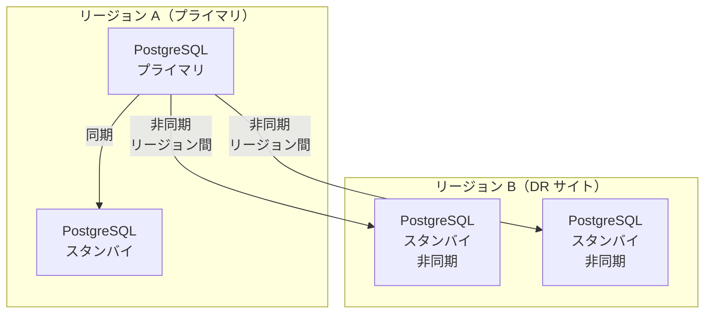

通常時はリージョン A のプライマリがすべての書き込みを処理する。リージョン B のスタンバイは非同期でレプリケーションされ、読み取りトラフィックの分散に使用できる。リージョン A 全体が障害を起こした場合、リージョン B のスタンバイを昇格させる。

この構成の RPO はリージョン間のレプリケーション遅延に依存する。非同期レプリケーションのため、数秒〜数十秒分のデータが失われる可能性がある。

#### パターン2: アクティブ-パッシブ（同期レプリケーション、近距離リージョン）

東京と大阪のように、物理的に近いリージョン間では同期レプリケーションが実用的である場合がある。RTT が 10ms 程度であれば、書き込みレイテンシへの影響は許容可能なケースが多い。この構成では RPO = 0 を達成できる。

#### パターン3: マルチマスター（Conflict Resolution）

各リージョンに書き込み可能なプライマリを配置し、コンフリクト解決メカニズムを用いてデータを同期する。CockroachDB や YugabyteDB などの NewSQL データベースはこのアプローチを採用している。

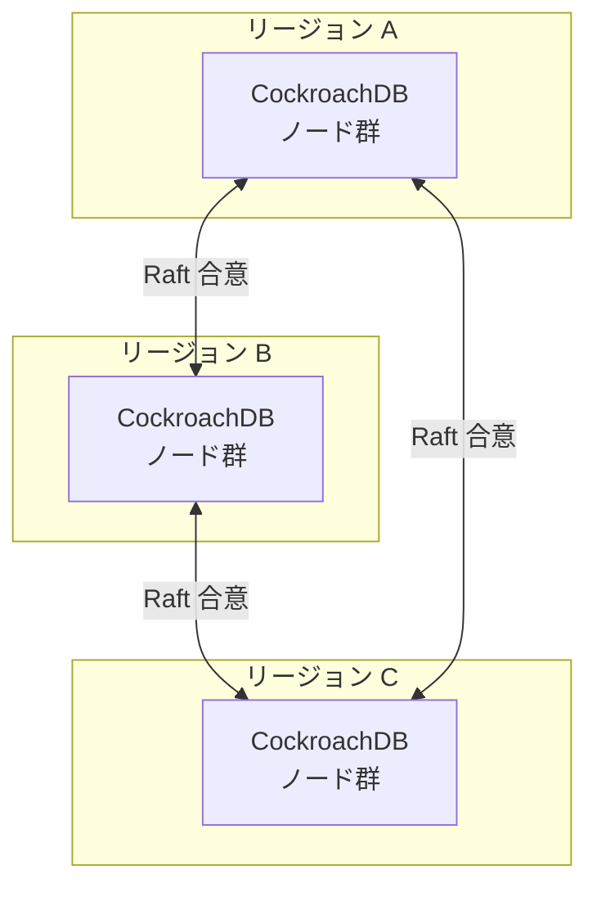

CockroachDB は、Range（データの分割単位）ごとに Raft 合意プロトコルを実行する。各 Range のリーダーは任意のリージョンに配置可能であり、データの配置を制御することで特定のリージョンでのレイテンシを最適化できる。

### 8.3 マルチリージョンにおけるフェイルオーバーの課題

マルチリージョンでのフェイルオーバーには、単一リージョン内とは異なる課題がある。

1. **フェイルオーバーの判断**: リージョン間のネットワーク分断なのか、リージョン全体の障害なのかを区別する必要がある
2. **データの一貫性**: 非同期レプリケーションの場合、リージョン障害時にデータが失われる可能性がある
3. **クライアントのルーティング**: グローバルロードバランサーや DNS の更新が必要であり、切り替えに時間がかかる
4. **フェイルバック**: 元のリージョンが復旧した際に、プライマリを戻す手順が複雑になる

## 9. RTO/RPO 設計の実践

### 9.1 RTO/RPO の設計フレームワーク

RTO と RPO の目標値を設定する際には、以下の要素を総合的に検討する必要がある。

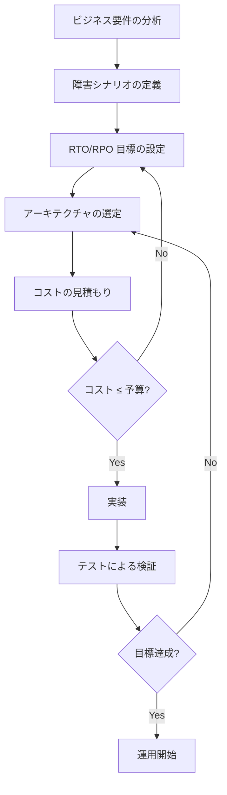

### 9.2 構成パターンと RTO/RPO の対応

| 構成パターン | 典型的な RTO | 典型的な RPO | コスト |
|------------|-----------|-----------|-------|
| バックアップ＆リストア | 数時間〜1日 | 数時間（前回バックアップ以降） | 低 |
| 非同期レプリケーション＋手動フェイルオーバー | 10分〜1時間 | 数秒〜数分 | 中 |
| 非同期レプリケーション＋自動フェイルオーバー | 30秒〜5分 | 数秒〜数分 | 中〜高 |
| 同期レプリケーション＋自動フェイルオーバー | 10秒〜1分 | 0 | 高 |
| マルチマスター（NewSQL） | ほぼ0 | 0 | 非常に高 |

### 9.3 RTO の内訳

自動フェイルオーバーにおける RTO は、複数のフェーズの合計である。

```
RTO = 障害検知時間 + 確認時間 + Fencing 時間 + 昇格時間 + 接続切り替え時間 + アプリ再接続時間
```

各フェーズの典型的な所要時間は以下の通りである。

| フェーズ | 所要時間 | 主な変動要因 |
|---------|---------|-----------|
| 障害検知 | 5〜30秒 | ヘルスチェック間隔、障害判定の閾値 |
| 確認 | 0〜10秒 | 複数ソースからの確認ロジック |
| Fencing | 1〜30秒 | Fencing 方式、クラウドAPI の応答時間 |
| 昇格 | 1〜10秒 | WAL の適用、チェックポイント |
| 接続切り替え | 0〜10秒 | VIP/DNS/Proxy の方式 |
| アプリ再接続 | 1〜30秒 | コネクションプールの設定、リトライロジック |

合計すると、一般的な自動フェイルオーバーの RTO は**10秒〜2分程度**となる。

### 9.4 RPO の最適化

RPO = 0 を達成するには同期レプリケーションが必要だが、パフォーマンスへの影響を最小限にするためのテクニックがある。

**Quorum Commit**: PostgreSQL の `synchronous_standby_names` で `ANY 1 (standby1, standby2, standby3)` のように設定すると、3台のスタンバイのうち任意の1台が応答すればコミットが完了する。これにより、最も速く応答できるスタンバイの遅延がコミットのレイテンシとなり、最悪ケースの遅延が軽減される。

```sql
-- PostgreSQL: Quorum-based synchronous replication
ALTER SYSTEM SET synchronous_standby_names = 'ANY 1 (standby1, standby2, standby3)';
SELECT pg_reload_conf();
```

**Write-heavy なワークロードの分離**: 同期レプリケーションが不要なデータ（セッション情報、キャッシュなど）を別のデータベースに分離し、ミッションクリティカルなデータのみ同期レプリケーションを適用する。

## 10. テストと運用

### 10.1 フェイルオーバーテストの重要性

高可用性設計は、テストなしには信頼できない。「フェイルオーバーが正しく動作する」という仮定は、定期的なテストによって検証され続ける必要がある。Netflix の Chaos Engineering の思想が示すように、障害は「起こるかもしれない」ではなく「必ず起こる」ものとして扱うべきである。

### 10.2 テストの種類

#### 計画的フェイルオーバーテスト

定期的に（例えば月次で）計画的なフェイルオーバーを実行し、以下を確認する。

- フェイルオーバーが正常に完了すること
- RTO が目標値内であること
- アプリケーションが正常に再接続すること
- データの損失がないこと（RPO の確認）
- 監視・アラートが正しく発火すること

```bash
#!/bin/bash
# Planned failover test script for Patroni

# Record the start time
START_TIME=$(date +%s)

# Trigger a switchover (graceful failover)
patronictl -c /etc/patroni/config.yml switchover \
  --master node1 \
  --candidate node2 \
  --force

# Wait for the switchover to complete
sleep 5

# Verify the new primary
NEW_PRIMARY=$(patronictl -c /etc/patroni/config.yml list \
  --format json | jq -r '.[] | select(.Role == "Leader") | .Member')

END_TIME=$(date +%s)
ELAPSED=$((END_TIME - START_TIME))

echo "Switchover completed in ${ELAPSED} seconds"
echo "New primary: ${NEW_PRIMARY}"

# Run a write test to confirm the new primary is accepting writes
psql -h "${NEW_PRIMARY}" -U postgres -d mydb \
  -c "INSERT INTO failover_test (tested_at) VALUES (NOW());"
```

#### Chaos Engineering

本番環境またはステージング環境で、意図的に障害を注入してシステムの耐障害性を検証する。

主なテストシナリオは以下の通りである。

| テストシナリオ | 方法 | 検証項目 |
|--------------|------|---------|
| プロセスクラッシュ | `kill -9` でデータベースプロセスを終了 | 自動フェイルオーバーの動作 |
| ノード停止 | インスタンスの停止/終了 | Fencing と昇格の確認 |
| ネットワーク分断 | iptables でトラフィックをブロック | スプリットブレインの防止 |
| ディスク I/O 遅延 | `tc` や `fio` で I/O 遅延を注入 | タイムアウト処理の確認 |
| DCS 障害 | etcd ノードの停止 | DCS 障害時の挙動 |

```bash
#!/bin/bash
# Simulate network partition using iptables

# Block traffic between primary and standby
iptables -A INPUT -s 192.168.1.2 -j DROP
iptables -A OUTPUT -d 192.168.1.2 -j DROP

echo "Network partition simulated"
echo "Monitoring failover behavior..."

# Monitor for 120 seconds
for i in $(seq 1 120); do
    sleep 1
    # Check if failover occurred
    LEADER=$(curl -s http://192.168.1.2:8008/patroni | jq -r '.role')
    if [ "$LEADER" == "master" ]; then
        echo "Second ${i}: Node2 promoted to primary"
        break
    fi
done

# Remove iptables rules to restore connectivity
iptables -D INPUT -s 192.168.1.2 -j DROP
iptables -D OUTPUT -d 192.168.1.2 -j DROP
echo "Network partition resolved"
```

### 10.3 モニタリングと可観測性

高可用性システムの運用には、適切なモニタリングが不可欠である。監視すべき主要なメトリクスは以下の通りである。

**レプリケーション関連**:
- レプリケーション遅延（バイト数、時間）
- WAL の送信・受信・適用の位置の差分
- レプリケーションスロットの状態

**クラスタ状態関連**:
- 各ノードの役割（プライマリ/スタンバイ）
- DCS のリーダーキーの状態
- Patroni エージェントの状態

**パフォーマンス関連**:
- トランザクションのレイテンシ（特に同期レプリケーション時）
- コネクション数
- ディスク I/O のレイテンシ

```sql
-- PostgreSQL: Check replication status
SELECT
    client_addr,
    state,
    sync_state,
    sent_lsn,
    write_lsn,
    flush_lsn,
    replay_lsn,
    pg_wal_lsn_diff(sent_lsn, replay_lsn) AS replay_lag_bytes,
    write_lag,
    flush_lag,
    replay_lag
FROM pg_stat_replication;
```

### 10.4 アラート設計

アラートは「アクション可能（Actionable）」であることが重要である。以下のアラートポリシーを推奨する。

| アラート | 重要度 | 閾値 | アクション |
|---------|-------|------|----------|
| レプリケーション遅延増大 | Warning | > 100MB or > 10秒 | 原因調査 |
| レプリケーション停止 | Critical | スタンバイが切断 | 即座に対応 |
| フェイルオーバー発生 | Critical | 自動通知 | 原因調査、フォローアップ |
| DCS ノード障害 | Critical | Quorum 危機 | 即座に復旧 |
| 同期スタンバイなし | Critical | 0台 | 即座に対応 |
| ディスク使用率 | Warning | > 80% | WAL/ログの清掃 |

### 10.5 フェイルバック戦略

フェイルオーバー後、元のプライマリを復旧させてスタンバイとして再参加させる（フェイルバック）手順も事前に計画しておく必要がある。

**`pg_rewind` を使用したフェイルバック（PostgreSQL）**:

1. 旧プライマリが新プライマリのタイムラインから分岐した場合、`pg_rewind` を使用してデータを巻き戻す
2. 旧プライマリを新プライマリのスタンバイとして起動する
3. レプリケーションが追いつくまで待機する
4. 必要に応じて、計画的なスイッチオーバーで元のプライマリに戻す

```bash
#!/bin/bash
# Failback procedure using pg_rewind

# Stop the old primary if it's still running
pg_ctl -D /var/lib/postgresql/data stop

# Rewind the old primary to match the new primary's timeline
pg_rewind \
  --target-pgdata=/var/lib/postgresql/data \
  --source-server="host=new_primary port=5432 user=postgres"

# Configure as standby
cat > /var/lib/postgresql/data/postgresql.auto.conf << EOF
primary_conninfo = 'host=new_primary port=5432 user=replicator password=rep-pass'
EOF

touch /var/lib/postgresql/data/standby.signal

# Start as standby
pg_ctl -D /var/lib/postgresql/data start
```

### 10.6 ランブック（Runbook）の整備

高可用性システムの運用には、障害対応手順を文書化したランブックが不可欠である。ランブックには以下の内容を含めるべきである。

- **障害シナリオごとの対応手順**: プロセスクラッシュ、ノード障害、ネットワーク分断、DCS 障害など
- **フェイルオーバーの確認手順**: 自動フェイルオーバーの結果の確認方法
- **フェイルバック手順**: 元のプライマリを復旧させる手順
- **エスカレーション基準**: どの時点でどのチームにエスカレーションするか
- **連絡先一覧**: 関係者の連絡先と対応時間帯

## 11. まとめ

データベースの高可用性設計は、単一の技術やツールで解決できるものではなく、レプリケーション、フェイルオーバー、スプリットブレイン対策、接続ルーティング、マルチリージョン構成、そして運用プロセスを総合的に設計する必要がある。

本記事で取り上げた要素を改めて整理する。

| 要素 | 選択肢・考慮事項 |
|------|----------------|
| レプリケーション | 物理/論理、同期/非同期/準同期 |
| フェイルオーバー | 手動/自動、Patroni / pg_auto_failover / InnoDB Cluster |
| スプリットブレイン対策 | Fencing、リース、Quorum |
| 接続ルーティング | VIP、DNS、Proxy、ドライバレベル |
| マルチリージョン | アクティブ-パッシブ、マルチマスター、NewSQL |
| RTO/RPO | ビジネス要件とコストのバランス |
| テスト・運用 | 定期テスト、Chaos Engineering、モニタリング、ランブック |

高可用性設計の最も重要な教訓は、**テストされていない高可用性は高可用性ではない**ということである。設計時に想定した RTO/RPO が実際に達成可能であることを、定期的なフェイルオーバーテストと Chaos Engineering によって継続的に検証することが、信頼性の高いデータベース運用の基盤となる。
