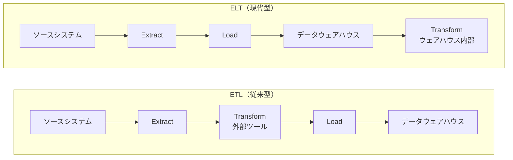
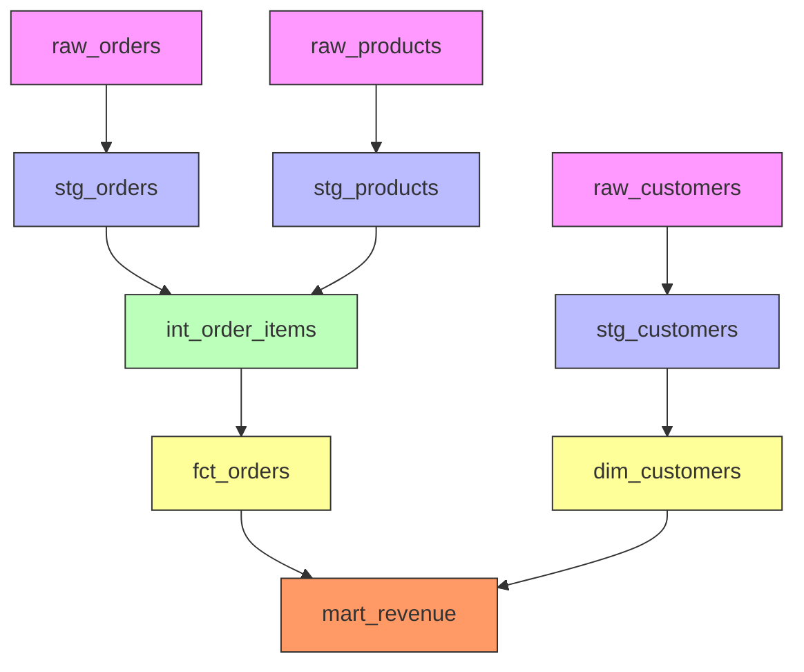
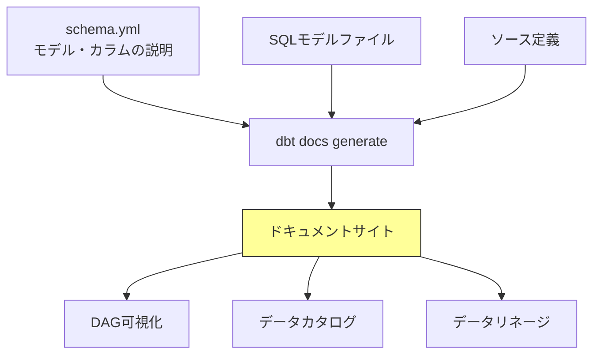
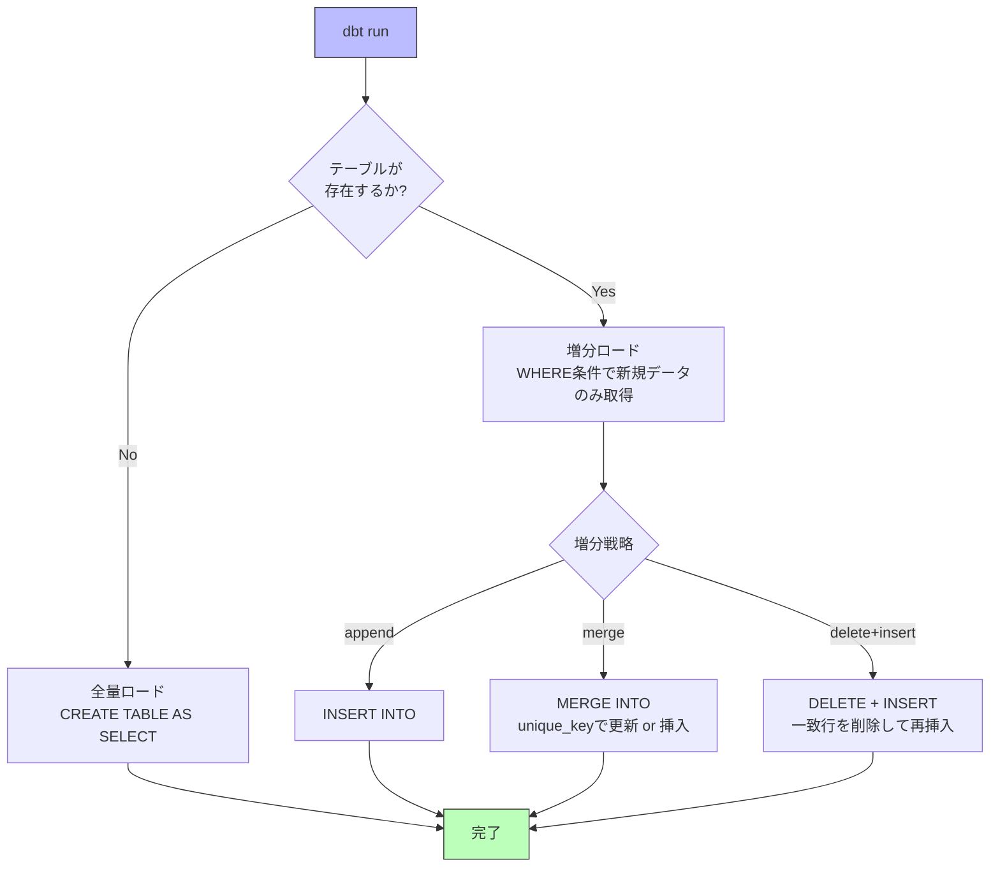
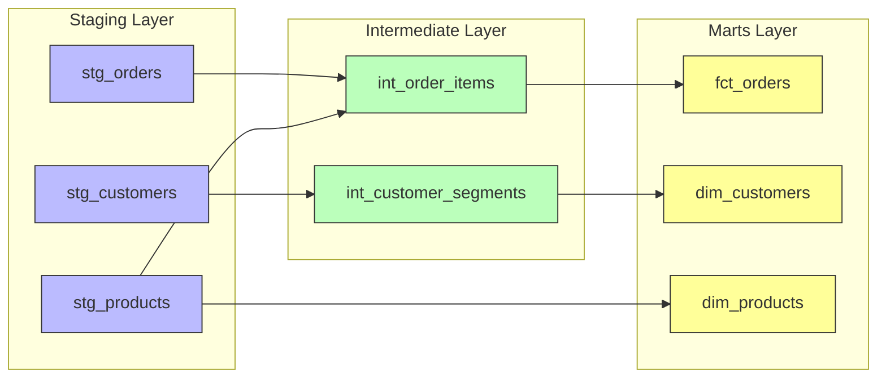
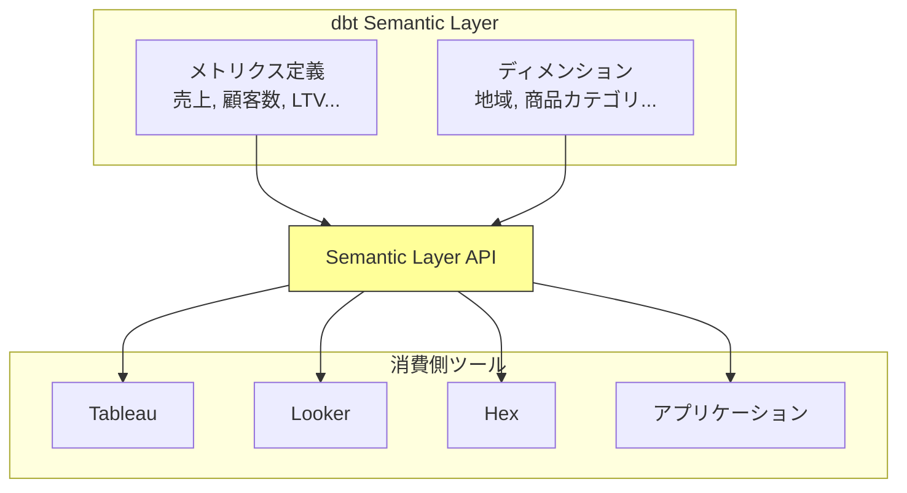
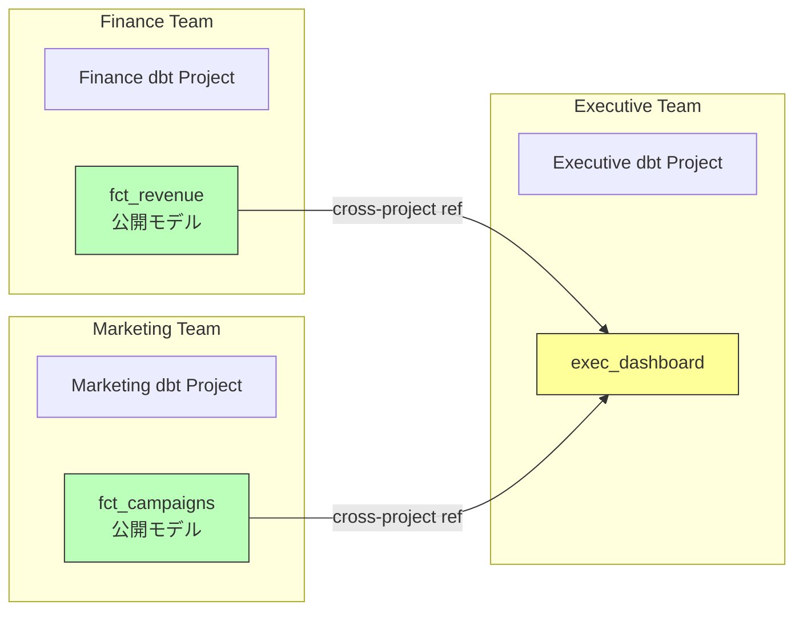
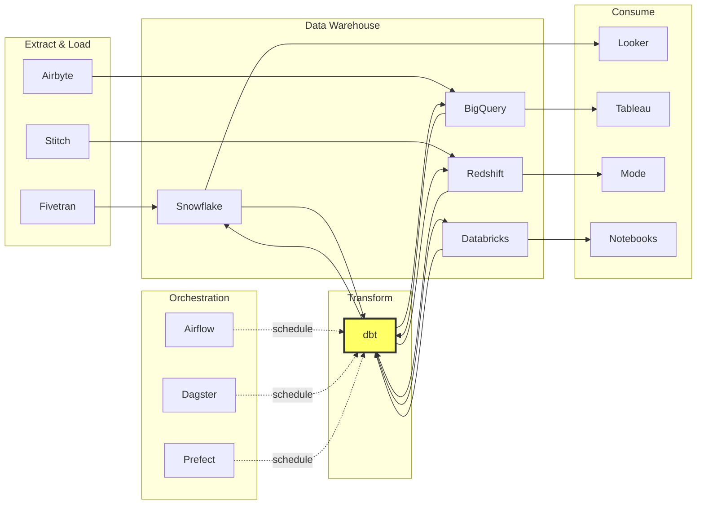

# dbt — データ変換のソフトウェアエンジニアリング化

## 1. 背景：ELTの台頭とTransformレイヤーの重要性

### 1.1 ETLからELTへのパラダイムシフト

データウェアハウスの歴史において、データの流れは長らく **ETL（Extract, Transform, Load）** というパターンで処理されてきた。ETLでは、ソースシステムからデータを抽出（Extract）し、変換処理（Transform）を行ったうえで、ターゲットとなるデータウェアハウスにロード（Load）する。この方式では、変換処理はウェアハウスの外部で、Informatica や Talend のような専用のETLツール上で実行されていた。

しかし、2010年代に入ると状況が大きく変わった。BigQuery、Snowflake、Redshift といったクラウドデータウェアハウス（CDW）の登場により、ストレージとコンピュートのコストが劇的に下がった。これらのシステムは、ペタバイト規模のデータに対しても高速なクエリ処理が可能であり、従来ウェアハウスの外部で行っていた変換処理をウェアハウスの内部で実行することが合理的になった。

こうして生まれたのが **ELT（Extract, Load, Transform）** パターンである。まず生のデータをそのままウェアハウスにロードし、その後にウェアハウスの計算能力を活用して変換処理を行う。



### 1.2 Transformレイヤーの課題

ELTパターンへの移行により、Transform（変換）レイヤーの処理はSQLで記述されるようになった。しかし、ここに新たな問題が生じた。データウェアハウス内部で実行されるSQLベースの変換処理は、次のような課題を抱えていた。

- **バージョン管理の欠如**: 変換ロジックがGUI上やスクリプト内にバラバラに存在し、Gitで管理されていない
- **テストの不在**: 変換結果の正しさを体系的に検証する仕組みがない
- **ドキュメントの不足**: テーブル間の依存関係やカラムの意味が暗黙知に留まっている
- **再利用性の低さ**: 同じようなSQLパターンがコピー&ペーストで散在している
- **環境分離の困難**: 開発環境と本番環境の切り替えが煩雑である

これらはすべて、ソフトウェアエンジニアリングの世界では当たり前に解決されてきた問題である。しかし、データ分析の領域ではこうしたプラクティスが十分に浸透していなかった。

### 1.3 Analytics Engineeringの誕生

このギャップを埋めるべく登場したのが **dbt（data build tool）** である。dbtは2016年にFishtown Analytics（現dbt Labs）によって開発された。創業者のTristan Handyは、ソフトウェアエンジニアリングのベストプラクティス――バージョン管理、テスト、ドキュメンテーション、CI/CD、コードレビュー――をデータ変換の世界に持ち込むことを目指した。

dbtの登場は、**Analytics Engineer** という新しい職種の確立にもつながった。Analytics Engineerとは、データエンジニアとデータアナリストの中間に位置する役割であり、SQLとソフトウェアエンジニアリングのプラクティスを駆使してデータの変換・モデリングを行う専門職である。

## 2. dbtの設計思想

### 2.1 SQLファースト

dbtの最も根本的な設計思想は **SQLファースト** である。データ変換ロジックはSQLの `SELECT` 文として記述する。dbtがこの `SELECT` 文をラップして、`CREATE TABLE AS SELECT` や `CREATE VIEW AS SELECT` といったDDLを自動生成し、ウェアハウス上で実行する。

この設計には大きな意味がある。データアナリストにとってSQLは最も馴染みのある言語であり、新しいプログラミング言語やフレームワークを学ぶ必要がない。一方で、dbtはそのSQLの周辺に、ソフトウェアエンジニアリングのインフラストラクチャを提供する。

::: tip SQLを知っていれば始められる
dbtの学習コストが低い理由の一つは、変換ロジックの核がSQLそのものであることにある。Pythonや独自のDSLを必要とせず、既存のSQLスキルをそのまま活かすことができる。
:::

### 2.2 ソフトウェアエンジニアリングのプラクティス適用

dbtがデータ変換に持ち込んだソフトウェアエンジニアリングのプラクティスは以下の通りである。

| プラクティス | ソフトウェア開発での対応 | dbtでの実現 |
|---|---|---|
| バージョン管理 | Git | dbtプロジェクトはGitリポジトリとして管理 |
| モジュール化 | 関数・クラス | SQLモデルファイルの分割、`ref()` による参照 |
| テスト | ユニットテスト・結合テスト | Generic Test、Singular Test |
| ドキュメンテーション | APIドキュメント、コメント | schema.yml、`dbt docs generate` |
| CI/CD | GitHub Actions等 | dbt Cloud CI、またはCLI + CI/CDパイプライン |
| コードレビュー | Pull Request | SQLモデルのPRレビュー |
| DRY原則 | 関数・テンプレート | Jinja2マクロ |
| 環境分離 | staging / production | target（dev / prod）による環境切り替え |

### 2.3 宣言的アプローチ

dbtのもう一つの重要な特徴は**宣言的アプローチ**である。ユーザーは「最終的にどのようなテーブルが欲しいか」をSQLで宣言するだけでよい。テーブルの作成・更新・依存関係の解決といった「どうやって実現するか」はdbtが自動的に処理する。

これは、Terraformがインフラの望ましい状態を宣言的に記述するのと同様のパラダイムである。手続き的にDDLやDMLを書き連ねる必要がなく、変換ロジックの本質にのみ集中できる。

## 3. コア概念

### 3.1 プロジェクト構成

dbtプロジェクトの典型的なディレクトリ構成は以下の通りである。

```
my_dbt_project/
├── dbt_project.yml        # Project configuration
├── profiles.yml           # Connection profiles (dbt Core)
├── models/
│   ├── staging/           # Raw data cleaning layer
│   │   ├── stg_orders.sql
│   │   └── stg_customers.sql
│   ├── intermediate/      # Business logic layer
│   │   └── int_order_items.sql
│   └── marts/             # Final consumption layer
│       ├── dim_customers.sql
│       └── fct_orders.sql
├── tests/                 # Singular tests
│   └── assert_positive_revenue.sql
├── macros/                # Reusable Jinja macros
│   └── cents_to_dollars.sql
├── seeds/                 # Static CSV data
│   └── country_codes.csv
├── snapshots/             # SCD Type 2 tracking
│   └── scd_orders.sql
└── analyses/              # Ad-hoc analytical queries
    └── monthly_revenue.sql
```

`dbt_project.yml` にはプロジェクト名、バージョン、モデルのデフォルト設定などを記述する。`profiles.yml` にはデータウェアハウスへの接続情報を定義する（dbt Cloudの場合はUIから設定するため不要）。

### 3.2 モデル（Models）

dbtにおける**モデル**とは、一つのSQLファイルのことである。各モデルファイルには単一の `SELECT` 文を記述する。dbtはこの `SELECT` 文を元に、ビューやテーブルをデータウェアハウス上に作成する。

```sql
-- models/staging/stg_orders.sql
-- Clean and rename columns from the raw orders table

SELECT
    id AS order_id,
    user_id AS customer_id,
    order_date,
    status,
    amount / 100.0 AS amount_dollars  -- convert cents to dollars
FROM {{ ref('raw_orders') }}
WHERE order_date IS NOT NULL
```

ここで重要なのは、`FROM` 句で直接テーブル名を指定するのではなく、<code v-pre>{{ ref('raw_orders') }}</code> という関数を使っている点である。これがdbtの依存関係管理の核心である。

::: warning CREATEやINSERTは書かない
dbtのモデルファイルには `SELECT` 文のみを記述する。`CREATE TABLE`、`INSERT INTO`、`DROP TABLE` といったDDLやDMLはdbtが自動的に生成・実行する。これにより、変換ロジックとインフラ管理の関心が分離される。
:::

dbt v1.3以降では、SQLに加えて**Pythonモデル**もサポートされている。pandasやPySparkを使った複雑なデータ処理が必要な場合に利用できるが、dbtの設計思想としてはあくまでSQLが主であり、Pythonは補完的な位置づけである。

### 3.3 ref関数とDAG

<code v-pre>{{ ref('model_name') }}</code> 関数は、dbtの最も重要な機能の一つである。この関数は以下の2つの役割を果たす。

1. **依存関係の明示**: dbtはすべてのモデル内の `ref()` 呼び出しを解析し、モデル間の依存関係グラフ（DAG: Directed Acyclic Graph）を自動的に構築する
2. **環境に応じたテーブル参照の解決**: `ref('stg_orders')` は、実行環境に応じて `dev_schema.stg_orders` や `prod_schema.stg_orders` のような完全修飾名に自動変換される



上の図は、dbtが `ref()` 関数から自動的に構築するDAGの例である。ピンクがソースデータ、青がステージング層、緑が中間層、黄がマート層、オレンジが最終的なレポーティング層を表している。dbtはこのDAGに基づいて、依存関係を尊重した正しい順序でモデルを実行する。

### 3.4 Materialization（マテリアライゼーション）

Materializationは、dbtがモデルのSQLをデータウェアハウス上にどのような形式で実体化するかを制御する仕組みである。dbtは4種類の標準的なMaterializationを提供する。

| Materialization | 説明 | 用途 |
|---|---|---|
| `view` | `CREATE VIEW AS SELECT` としてビューを作成する。デフォルト | 軽量な変換。ステージング層に適する |
| `table` | `CREATE TABLE AS SELECT` としてテーブルを作成する | 頻繁に参照される中間テーブル。マート層に適する |
| `incremental` | 新しいデータのみを追加・更新する。初回は全量、2回目以降は増分 | 大規模データの効率的な更新 |
| `ephemeral` | 実テーブルを作成せず、CTEとして他モデルにインライン展開される | 参照先が1箇所のみの簡単な変換 |

Materializationはモデルファイル内で `config` ブロックを使って指定する。

```sql
-- models/marts/fct_orders.sql

{{ config(materialized='table') }}

SELECT
    o.order_id,
    o.customer_id,
    o.order_date,
    o.amount_dollars,
    c.customer_name,
    c.segment
FROM {{ ref('stg_orders') }} AS o
LEFT JOIN {{ ref('dim_customers') }} AS c
    ON o.customer_id = c.customer_id
```

`dbt_project.yml` でディレクトリ単位のデフォルトMaterializationを設定することもできる。

```yaml
# dbt_project.yml
models:
  my_project:
    staging:
      +materialized: view
    intermediate:
      +materialized: ephemeral
    marts:
      +materialized: table
```

### 3.5 ソース（Sources）

モデルが参照する外部テーブル（dbtが管理しない、ELパイプラインで読み込まれたテーブル）は、**ソース**として定義する。ソースを定義することで、<code v-pre>{{ source('source_name', 'table_name') }}</code> 関数を使って参照でき、DAGの起点を明確化できる。

```yaml
# models/staging/_sources.yml
version: 2

sources:
  - name: raw
    database: analytics
    schema: raw_data
    tables:
      - name: orders
        description: "Raw orders from the transactional system"
        loaded_at_field: _etl_loaded_at
        freshness:
          warn_after: { count: 12, period: hour }
          error_after: { count: 24, period: hour }
      - name: customers
        description: "Raw customer master data"
```

`freshness` を設定すると、`dbt source freshness` コマンドでソースデータの鮮度を検証でき、ELパイプラインの障害を早期に検出できる。

## 4. テストとドキュメンテーション

### 4.1 テストの種類

dbtのテスト機能は、データパイプラインの品質保証において中核的な役割を果たす。テストには大きく分けて2種類がある。

**Generic Test（汎用テスト）**

schema.yml に宣言的に記述する定型テストである。dbtはビルトインで4種類のGeneric Testを提供する。

| テスト | 説明 |
|---|---|
| `unique` | カラムの値が一意であることを検証 |
| `not_null` | カラムにNULLが含まれないことを検証 |
| `accepted_values` | カラムの値が指定した値のリストに含まれることを検証 |
| `relationships` | 外部キー制約と同等の参照整合性を検証 |

```yaml
# models/staging/schema.yml
version: 2

models:
  - name: stg_orders
    description: "Cleaned orders from the raw layer"
    columns:
      - name: order_id
        description: "Primary key of the orders table"
        tests:
          - unique
          - not_null
      - name: status
        description: "Order status"
        tests:
          - accepted_values:
              values: ['placed', 'shipped', 'completed', 'returned']
      - name: customer_id
        description: "Foreign key to customers"
        tests:
          - relationships:
              to: ref('stg_customers')
              field: customer_id
```

**Singular Test（個別テスト）**

ビジネスロジック固有の検証を行う場合は、`tests/` ディレクトリにSQLファイルとして記述する。このSQLは「テストに失敗する行」を返すクエリであり、結果が0行であればテスト成功となる。

```sql
-- tests/assert_positive_revenue.sql
-- Ensure that revenue is never negative

SELECT
    order_id,
    amount_dollars
FROM {{ ref('fct_orders') }}
WHERE amount_dollars < 0
```

テストは `dbt test` コマンドで実行する。CI/CDパイプラインに組み込むことで、マージ前にデータ品質を自動検証できる。

::: details dbt-expectations と dbt-utils
dbtのテスト機能はコミュニティパッケージによって大幅に拡張できる。**dbt-utils** は `surrogate_key`、`pivot` などの汎用マクロとテストを提供し、**dbt-expectations** は Great Expectations にインスパイアされた豊富な統計テスト（分布テスト、カラム間の比較テストなど）を追加する。
:::

### 4.2 ドキュメンテーション

dbtのドキュメンテーション機能は、データカタログの自動生成を実現する。schema.yml に記述したモデルやカラムの説明は、`dbt docs generate` コマンドで静的サイトとして生成される。

生成されたドキュメントサイトには以下が含まれる。

- モデルの説明とカラム定義
- モデル間の依存関係グラフ（DAG）のインタラクティブな可視化
- ソースの定義とフレッシュネス情報
- テストの一覧と結果



`dbt docs serve` コマンドでローカルサーバーが起動し、ブラウザ上でDAGを探索したり、テーブル・カラムの説明を参照したりできる。これは、アプリケーション開発におけるAPIドキュメント自動生成（Swagger/OpenAPI）と同じ発想であり、ドキュメントをコードと密結合にすることで陳腐化を防ぐ。

## 5. Jinja2テンプレートとマクロ

### 5.1 Jinja2テンプレートエンジン

dbtはSQLの中に**Jinja2テンプレート**を埋め込むことを可能にしている。Jinja2はPythonエコシステムで広く使われているテンプレートエンジンであり、以下の構文をサポートする。

- <code v-pre>{{ ... }}</code> : 式の評価と出力（例: <code v-pre>{{ ref('model') }}</code>）
- <code v-pre></code> : 制御構文（if、for、setなど）
- <code v-pre>{# ... #}</code> : コメント

::: warning Jinja2の過度な使用に注意
Jinja2は非常に強力だが、過度に複雑なテンプレートロジックを書くと可読性が大きく損なわれる。基本的にはSQLの可読性を最優先とし、テンプレートの使用は反復パターンの排除やクロスデータベース互換性の確保など、明確な目的がある場合に限定するのが望ましい。
:::

Jinja2を使うことで、条件分岐やループを含む動的なSQLを生成できる。

```sql
-- models/marts/fct_events.sql
-- Generate a pivoted events table dynamically

SELECT
    user_id,
    event_date,
    
    SUM(CASE WHEN event_type = '{{ event_type }}' THEN 1 ELSE 0 END)
        AS {{ event_type }}_count
    ,
    
FROM {{ ref('stg_events') }}
GROUP BY user_id, event_date
```

このJinja2テンプレートは、コンパイル時に以下のようなSQLに展開される。

```sql
SELECT
    user_id,
    event_date,
    SUM(CASE WHEN event_type = 'page_view' THEN 1 ELSE 0 END)
        AS page_view_count,
    SUM(CASE WHEN event_type = 'click' THEN 1 ELSE 0 END)
        AS click_count,
    SUM(CASE WHEN event_type = 'purchase' THEN 1 ELSE 0 END)
        AS purchase_count,
    SUM(CASE WHEN event_type = 'signup' THEN 1 ELSE 0 END)
        AS signup_count
FROM analytics.prod.stg_events
GROUP BY user_id, event_date
```

### 5.2 マクロ（Macros）

**マクロ**は、再利用可能なJinja2テンプレートの断片である。`macros/` ディレクトリにSQLファイルとして定義し、プロジェクト全体から呼び出すことができる。これは、プログラミング言語における関数定義と同等の概念である。

```sql
-- macros/cents_to_dollars.sql
-- Convert cents to dollars with rounding


    ROUND({{ column_name }} / 100.0, {{ precision }})

```

このマクロはモデル内で以下のように使用する。

```sql
-- models/staging/stg_payments.sql

SELECT
    payment_id,
    order_id,
    {{ cents_to_dollars('amount') }} AS amount_dollars,
    {{ cents_to_dollars('tax', 4) }} AS tax_dollars
FROM {{ ref('raw_payments') }}
```

マクロの典型的な利用例は以下の通りである。

- **データ型変換の標準化**: タイムスタンプのタイムゾーン変換、通貨の単位変換など
- **クロスデータベース互換性**: データウェアハウスごとのSQL方言の差異を吸収
- **監査カラムの自動付与**: `created_at`、`updated_at` 等のメタデータカラムの統一的な生成
- **反復パターンの排除**: 同じ構造のSQLを複数モデルで使い回す

dbt自体もコアのマクロをこの仕組みで実装しており、ユーザーは `dispatch` 機能を使ってこれらのマクロをオーバーライドできる。

## 6. dbt Core vs dbt Cloud

### 6.1 dbt Core

**dbt Core** はOSS（Apache 2.0ライセンス）として公開されているCLIツールである。Pythonパッケージとして `pip install dbt-core` で導入できる。データベースアダプター（`dbt-snowflake`、`dbt-bigquery`、`dbt-redshift`、`dbt-postgres` など）を別途インストールすることで、各種データウェアハウスに接続する。

dbt Coreの実行は以下のようなコマンドで行う。

```bash
# Run all models
dbt run

# Run a specific model and its upstream dependencies
dbt run --select fct_orders+

# Run tests
dbt test

# Generate documentation
dbt docs generate

# Check source freshness
dbt source freshness

# Compile SQL (render Jinja without executing)
dbt compile
```

dbt Coreを使う場合、ジョブスケジューリングやCI/CDは外部ツール（Airflow、GitHub Actions、Dagster、Prefect など）で管理する必要がある。

### 6.2 dbt Cloud

**dbt Cloud** はdbt Labsが提供するマネージドサービスであり、dbt Coreを内包しつつ、以下のような追加機能を提供する。

- **Web IDE**: ブラウザベースのSQL開発環境
- **ジョブスケジューリング**: cronライクなスケジュール実行
- **CI/CD**: Pull Requestに対する自動テスト実行（Slim CI）
- **ドキュメントホスティング**: 生成したドキュメントのWebホスティング
- **アクセス制御**: ロールベースのアクセス管理
- **Semantic Layer**: メトリクス定義のためのセマンティックレイヤー
- **dbt Explorer**: DAGの高度な探索・分析機能

### 6.3 どちらを選ぶか

| 観点 | dbt Core | dbt Cloud |
|---|---|---|
| コスト | 無料 | 有料（チームプランあり） |
| セットアップ | 手動構築が必要 | すぐに使える |
| スケジューリング | 外部ツールが必要 | 組み込み |
| CI/CD | 自前で構築 | 組み込み（Slim CI） |
| 運用負荷 | 高い | 低い |
| カスタマイズ性 | 高い | プラットフォームの制約あり |
| 適したチーム | インフラに強いチーム | Analytics Engineer中心のチーム |

::: tip Slim CI
dbt CloudのSlim CIは、Pull Requestで変更されたモデルとその下流モデルのみを対象にテストを実行する機能である。全モデルを毎回テストする必要がなく、CI/CDのサイクルを高速化できる。これは `state:modified+` セレクタを活用して実現されている。
:::

## 7. 増分モデル（Incremental）

### 7.1 増分モデルの必要性

データウェアハウスのテーブルが数十億行規模になると、毎回全データを洗い替えする `table` Materializationは現実的でなくなる。処理時間が数時間に及び、コンピュートコストも膨大になるためである。

増分モデル（Incremental Materialization）は、前回実行以降に追加・更新されたデータのみを処理する仕組みである。これにより、処理時間とコストを大幅に削減できる。

### 7.2 増分モデルの実装

増分モデルは `is_incremental()` マクロを使って実装する。このマクロは、モデルが初回実行でなく、かつ既存のテーブルが存在する場合に `True` を返す。

```sql
-- models/marts/fct_page_views.sql

{{ config(
    materialized='incremental',
    unique_key='page_view_id',
    incremental_strategy='merge'
) }}

SELECT
    page_view_id,
    user_id,
    page_url,
    referrer_url,
    viewed_at,
    session_id
FROM {{ ref('stg_page_views') }}


    -- Only process rows newer than the latest row in the existing table
    WHERE viewed_at > (SELECT MAX(viewed_at) FROM {{ this }})

```



### 7.3 増分戦略

dbtは複数の増分戦略をサポートしている。利用可能な戦略はデータウェアハウスによって異なる。

| 戦略 | 説明 | サポート |
|---|---|---|
| `append` | 単純に新規行を追加する。更新は処理しない | 全アダプター |
| `merge` | `MERGE` 文を使い、`unique_key` に基づいて更新または挿入を行う | BigQuery, Snowflake, Databricks等 |
| `delete+insert` | `unique_key` に一致する既存行を削除し、新規データを挿入する | Snowflake, Redshift, Postgres等 |
| `insert_overwrite` | パーティション単位で上書きする | BigQuery, Spark, Hive等 |

::: warning 増分モデルのリスク
増分モデルは効率的だが、ロジックの変更やデータの遡及的修正があった場合、既存データとの整合性が崩れるリスクがある。このような場合は `dbt run --full-refresh` で全量洗い替えを実行する必要がある。増分モデルの設計では、「フルリフレッシュをいつ・どのように実行するか」を運用計画に含めることが重要である。
:::

### 7.4 Late Arriving Data の考慮

実務では、データが想定よりも遅れて到着する **Late Arriving Data** への対処が必要になることがある。単純に `MAX(timestamp)` で増分境界を決定すると、遅延データが漏れる可能性がある。

一般的な対策として、lookback windowを設ける方法がある。

```sql

    WHERE viewed_at > (
        SELECT DATEADD(hour, -3, MAX(viewed_at))
        FROM {{ this }}
    )

```

この例では、3時間のlookback windowを設けることで、多少の遅延データもカバーできる。`merge` 戦略と `unique_key` を組み合わせることで、重複挿入も防止される。

## 8. 運用上の課題

### 8.1 モデルの依存関係管理

dbtプロジェクトが成長すると、モデル数が数百から数千に達し、DAGの複雑度が急激に増す。この段階で直面する課題は以下の通りである。

**レイヤーアーキテクチャの徹底**

dbtプロジェクトでは一般的に、以下のような階層構造（レイヤー）を採用する。



- **Staging（ステージング層）**: ソースデータの型変換、リネーム、フィルタリングなど最低限のクリーニングを行う。1ソーステーブルにつき1モデルが原則
- **Intermediate（中間層）**: ビジネスロジックの組み立て。複数のステージングモデルを結合し、計算カラムを追加する
- **Marts（マート層）**: 最終的にBIツールやアナリストが消費する、ファクトテーブルやディメンションテーブル

レイヤー間の参照ルール（例: マートからステージングへの直接参照を禁止する）を `dbt_project.yml` やリンターで強制することが重要である。

### 8.2 パフォーマンスチューニング

dbtの実行パフォーマンスは最終的にデータウェアハウスのクエリ実行エンジンに依存するが、dbt側でも以下のような最適化が可能である。

- **Materializationの適切な選択**: 中間テーブルを不必要にテーブル化しない。一方で、頻繁に参照されるモデルをビューのままにすると下流クエリが遅くなる
- **クラスタリング・パーティショニングの設定**: BigQueryのパーティション、Snowflakeのクラスタリングキーなどをモデルの `config` で指定する
- **増分モデルの活用**: 大規模テーブルには増分モデルを適用する
- **並列実行**: `dbt run --threads 8` のようにスレッド数を増やし、DAG上で独立したモデルを並列実行する
- **モデルの選択的実行**: `dbt run --select model_name+` で特定モデルとその下流のみを実行する

```yaml
# dbt_project.yml - BigQuery partitioning example
models:
  my_project:
    marts:
      fct_orders:
        +materialized: incremental
        +partition_by:
          field: order_date
          data_type: date
          granularity: day
        +cluster_by: ['customer_id', 'status']
```

### 8.3 環境分離

dbtは `profiles.yml` の `target` を切り替えることで、開発（dev）と本番（prod）の環境を分離する。

典型的な戦略は以下の通りである。

- **スキーマベース**: 同一データベース内で `dev_<user>` と `prod` のスキーマを分離する
- **データベースベース**: 開発用と本番用で完全に別のデータベースを使用する
- **プロジェクトベース**: 環境ごとに別のdbtプロジェクトを用意する（非推奨）

```yaml
# profiles.yml
my_project:
  target: dev
  outputs:
    dev:
      type: snowflake
      account: my_account
      user: "{{ env_var('DBT_USER') }}"
      password: "{{ env_var('DBT_PASSWORD') }}"
      database: analytics
      schema: "dev_{{ env_var('DBT_USER') }}"  # per-developer schema
      warehouse: dev_wh
      threads: 4

    prod:
      type: snowflake
      account: my_account
      user: "{{ env_var('DBT_PROD_USER') }}"
      password: "{{ env_var('DBT_PROD_PASSWORD') }}"
      database: analytics
      schema: prod
      warehouse: prod_wh
      threads: 8
```

`ref()` 関数は自動的にターゲット環境のスキーマに解決されるため、モデルのSQL自体は環境によらず同一のコードを使用できる。これは「同じコードを複数環境にデプロイする」というソフトウェアエンジニアリングの原則そのものである。

### 8.4 データ契約と品質ゲート

dbt v1.5以降では**データ契約（Data Contracts）**の機能が導入されている。モデルのスキーマ（カラム名、データ型、制約）をYAMLで宣言し、実行時にこれを強制することができる。

```yaml
models:
  - name: fct_orders
    config:
      contract:
        enforced: true
    columns:
      - name: order_id
        data_type: int
        constraints:
          - type: not_null
          - type: primary_key
      - name: amount_dollars
        data_type: number(12, 2)
        constraints:
          - type: not_null
```

データ契約が有効な場合、モデルの出力が宣言されたスキーマに適合しなければ、dbtはエラーを発生させて実行を中断する。これは、アプリケーション開発におけるインターフェース定義やスキーマバリデーションと同等の概念であり、上流モデルの変更が下流に予期せぬ影響を与えることを防ぐ。

## 9. エコシステムとモダンデータスタック

### 9.1 dbt Packages

dbtのパッケージシステムにより、コミュニティが開発した再利用可能なマクロやモデルをプロジェクトに取り込むことができる。`packages.yml` に依存パッケージを記述し、`dbt deps` コマンドでインストールする。

```yaml
# packages.yml
packages:
  - package: dbt-labs/dbt_utils
    version: [">=1.0.0", "<2.0.0"]
  - package: calogica/dbt_expectations
    version: [">=0.8.0", "<1.0.0"]
  - package: dbt-labs/codegen
    version: [">=0.9.0", "<1.0.0"]
```

代表的なパッケージは以下の通りである。

- **dbt_utils**: サロゲートキー生成、ピボット、日付スパインなど汎用ユーティリティ
- **dbt_expectations**: Great Expectationsにインスパイアされた高度なデータ品質テスト
- **codegen**: schema.ymlのスケルトンやベースモデルのコード自動生成
- **dbt_artifacts**: dbtの実行メタデータ（マニフェスト、ランリザルト）をウェアハウスに保存し、分析可能にする
- **elementary**: データの異常検知、モニタリングダッシュボード

### 9.2 Semantic Layer

dbt Semantic Layerは、dbt内でメトリクス（KPI）を一元的に定義し、BIツールやアプリケーションから統一的にクエリ可能にする機能である。

従来の課題は、同じ「売上」というメトリクスがBIツールごとに異なる定義で計算されてしまう **"metrics chaos"** であった。Semantic Layerでは、メトリクスの定義（計算ロジック、ディメンション、フィルタ）をdbt側で一元管理し、消費側のツール（Tableau、Looker、Mode、Hex など）はAPIを通じてこの定義を参照する。



dbt Semantic LayerはMetricFlowエンジンを内部で使用しており、YAML形式でセマンティックモデルとメトリクスを定義する。

### 9.3 dbt Mesh

**dbt Mesh** は、大規模な組織において複数のdbtプロジェクトを相互連携させるためのアーキテクチャパターンである。dbt v1.6で導入された `cross-project ref` 機能により、異なるdbtプロジェクト間でモデルを参照できるようになった。



dbt Meshの背景にあるのは**データメッシュ**の思想である。中央集権的なデータチームがすべてのデータモデルを管理するのではなく、各ドメインチームが自分のデータプロダクトを所有し、明確なインターフェース（公開モデル）を通じて他チームに提供する。

公開モデルは `access: public` として宣言し、データ契約と組み合わせることで、プロジェクト間のインターフェースを安定させる。

```yaml
models:
  - name: fct_revenue
    access: public
    config:
      contract:
        enforced: true
    description: "Revenue fact table - maintained by the Finance team"
```

### 9.4 モダンデータスタックにおけるdbtの位置づけ

dbtはモダンデータスタック（Modern Data Stack）の中核コンポーネントとして位置づけられている。典型的なモダンデータスタックの構成は以下の通りである。



dbtの役割は、EL（Extract/Load）ツールが投入した生データを、BIツールやアナリストが消費可能な形に変換する **Transformレイヤー** を担うことである。オーケストレーションツールと連携してスケジュール実行され、データパイプラインの中核を形成する。

## 10. まとめ

dbtは、データ変換の世界にソフトウェアエンジニアリングのプラクティスを持ち込むという、一見シンプルだが革命的なアイデアに基づいたツールである。

dbtが実現したことを整理すると以下のようになる。

- **SQLファースト**: データアナリストが既存のスキルで始められる低い学習コスト
- **宣言的アプローチ**: 変換ロジックの本質にのみ集中できる
- **`ref()` によるDAG構築**: モデル間の依存関係を自動管理し、正しい実行順序を保証
- **テストとドキュメンテーション**: データ品質の体系的な検証とデータカタログの自動生成
- **Jinja2マクロ**: DRY原則によるSQLの再利用性向上
- **増分モデル**: 大規模データの効率的な更新
- **環境分離**: 同一コードベースを開発・本番で安全にデプロイ
- **Semantic Layer と Mesh**: 組織スケールでのメトリクスの一元管理とドメイン分散

一方で、dbtには限界もある。dbtはあくまでTransformレイヤーのツールであり、ExtractやLoadは扱わない。また、リアルタイムストリーム処理には対応しておらず、バッチ処理が前提である。さらに、Jinja2テンプレートの過度な使用はSQLの可読性を損なう可能性があり、チームとしてのコーディング規約の策定が重要になる。

それでも、dbtがデータ業界に与えた影響は計り知れない。Analytics Engineerという職種の確立、モダンデータスタックの中核コンポーネントとしての地位、そしてSQLによるデータ変換を「エンジニアリング」として昇華させたことは、データ業界のパラダイムシフトを象徴するものである。dbtは単なるツールではなく、データ変換の方法論を根本から変えた存在といえるだろう。
