# ドメイン駆動設計（DDD）

## 1. 歴史的背景 — なぜDDDが必要とされたのか

### 1.1 ソフトウェア開発における「複雑さ」の本質

ソフトウェア開発における最大の敵は何か。それはバグでもなく、パフォーマンスでもなく、「複雑さ」である。Fred Brooksは1986年の論文「No Silver Bullet」において、ソフトウェアの複雑さを「本質的複雑さ（Essential Complexity）」と「偶有的複雑さ（Accidental Complexity）」に分類した。

本質的複雑さとは、ソフトウェアが解決しようとする問題領域そのものに内在する複雑さである。保険の料率計算、国際物流の関税処理、医療の診断ワークフローといったビジネスルールは、技術とは無関係に本質的に複雑である。一方、偶有的複雑さとは、選択した技術やツール、フレームワークに起因する複雑さであり、原理的には解消可能である。

2000年代初頭、多くのエンタープライズソフトウェアプロジェクトが直面していた問題は、この2つの複雑さが分離されていないことだった。データベースのテーブル構造がそのままビジネスロジックの構造を規定し、UIのフォームレイアウトがデータモデルを決定し、技術的な制約がビジネスルールの表現を歪めていた。結果として、ビジネスの専門家が語る言葉とコードの間に深い溝が生まれ、要件の変更がシステム全体に波及するという悪循環が繰り返されていた。

### 1.2 Eric Evansの提唱

この問題に対する体系的な回答を提示したのが、Eric Evansが2003年に出版した「Domain-Driven Design: Tackling Complexity in the Heart of Software」である。この書籍は、ソフトウェア開発の中心にドメイン（問題領域）を据えるという設計哲学を打ち出した。

Evansの洞察の核心はこうである。「ソフトウェアの本質的な複雑さはドメインに由来する。したがって、ドメインの構造をそのままソフトウェアの構造に反映させるべきであり、技術的な都合でドメインの表現を歪めてはならない。」

この考え方自体は革新的というよりも、優れた開発者が暗黙的に実践していたことの言語化であった。しかし、Evansはそれを「Ubiquitous Language」「Bounded Context」「Aggregate」といった明確なパターン名を与えて体系化し、チーム全体で共有できる語彙を提供した。これがDDDの最大の功績である。

### 1.3 DDDの2つの柱

DDDは大きく2つの側面に分けられる。

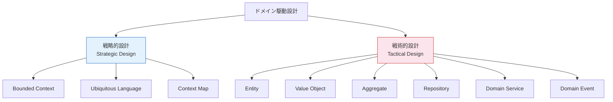

**戦略的設計（Strategic Design）** は、大規模なシステムをどのように分割し、各部分がどのように関係するかを定める。組織的・チーム的な関心事を扱い、技術的な詳細には踏み込まない。Bounded Context、Ubiquitous Language、Context Mapがその中核概念である。

**戦術的設計（Tactical Design）** は、個々のBounded Context内部において、ドメインモデルをどのようにコードとして表現するかを定める。Entity、Value Object、Aggregate、Repository、Domain Service、Domain Eventといった構成要素がこれにあたる。

Evansの書籍が出版された当初、多くの開発者は戦術的設計のパターン（特にEntityやValue Object）に注目した。しかし、Evansは後に「DDDの真の価値は戦略的設計にある」と繰り返し強調している。個々のクラス設計がどれほど洗練されていても、システム全体の境界設計が誤っていれば、プロジェクトは失敗する。

## 2. 戦略的設計

### 2.1 Ubiquitous Language（ユビキタス言語）

DDDの最も根本的な概念は、Ubiquitous Language（ユビキタス言語）である。これは、開発チームとドメインの専門家が共有する共通の語彙体系であり、コード、ドキュメント、日常の会話のすべてにおいて一貫して使用される言語である。

::: tip Ubiquitous Languageの本質
Ubiquitous Languageは単なる「用語集（グロッサリー）」ではない。それはドメインモデルそのものを反映した言語であり、コードの中にそのまま表れるべきものである。「注文を確定する」という表現が使われるなら、コード上にも `order.confirm()` というメソッドが存在すべきであり、`order.setStatus("confirmed")` のような技術的な表現に置き換えられるべきではない。
:::

なぜこれが重要なのか。ソフトウェア開発における多くの問題は、「翻訳」のコストに起因する。ビジネスの専門家が「出荷指示」と呼ぶものを、開発者が「配送リクエスト」と呼び、データベース上では `delivery_order` テーブルに格納され、API上では `shipping_instruction` エンドポイントで公開されている――このような「翻訳」が至るところで発生すると、コミュニケーションの齟齬が累積し、やがて致命的な認識のズレに発展する。

Ubiquitous Languageは、この翻訳コストをゼロにすることを目指す。ドメインの専門家と開発者が同じ用語を使い、その用語がそのままコードのクラス名やメソッド名に反映される。言語の変更はモデルの変更であり、モデルの変更はコードの変更である。

### 2.2 Bounded Context（境界づけられたコンテキスト）

現実の大規模なシステムにおいて、すべてのドメイン概念に対して一つの統一されたモデルを構築することは不可能であり、かつ望ましくもない。これがBounded Contextの出発点である。

例として、ECサイトにおける「商品」を考えてみよう。

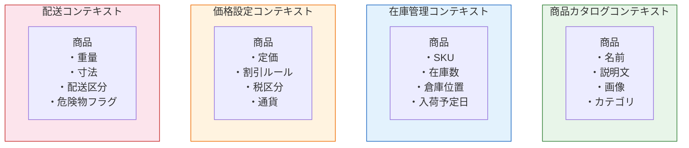

「商品」という同じ言葉でも、商品カタログの文脈では名前・説明文・画像が重要であり、在庫管理の文脈ではSKU・在庫数・倉庫位置が重要であり、価格設定の文脈では定価・割引ルール・税区分が重要である。これらすべてを一つの巨大な `Product` クラスに詰め込もうとすると、互いに無関係な属性が混在し、変更の影響範囲が予測不能になる。

Bounded Contextは、モデルが有効な範囲を明確に区切る。各コンテキスト内部では、そのコンテキスト固有のUbiquitous Languageが適用され、同じ用語が異なるコンテキストで異なる意味を持つことが許容される。

::: warning よくある誤解
Bounded Contextはマイクロサービスと同義ではない。Bounded Contextは論理的なモデルの境界であり、デプロイの単位とは独立した概念である。1つのBounded Contextが1つのマイクロサービスとして実装されることもあれば、1つのモノリス内の異なるモジュールとして実装されることもある。マイクロサービスへの分割を検討する際にBounded Contextを参考にすることは有用だが、両者を混同すべきではない。
:::

### 2.3 Bounded Contextの見つけ方

Bounded Contextの境界を発見するための手がかりをいくつか挙げる。

1. **言語の変化**: 同じ用語が異なる意味で使われている箇所は、コンテキストの境界を示唆する
2. **組織構造**: 異なるチームや部門が管轄するビジネス領域は、しばしば異なるコンテキストに対応する（Conway's Law）
3. **ビジネスプロセスの断絶**: ある業務の完了が別の業務のトリガーとなる箇所は、コンテキスト間の境界であることが多い
4. **データの所有権**: 同じデータに対して異なる視点を持つ主体が存在する場合、それぞれが異なるコンテキストに属する

### 2.4 Context Map（コンテキストマップ）

Bounded Context同士は孤立しているわけではなく、何らかの形で連携する必要がある。Context Mapは、システム内のすべてのBounded Contextとそれらの間の関係を可視化したものである。

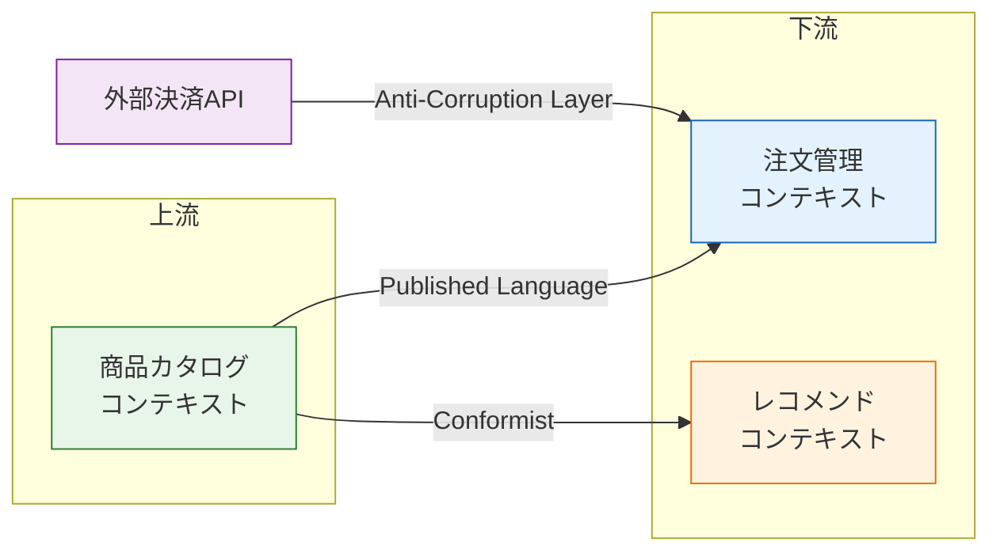

Context Map上で表現される主要な統合パターンは以下の通りである。

| パターン | 説明 |
|---------|------|
| **Shared Kernel** | 2つのコンテキストがモデルの一部を共有する。変更には双方の合意が必要 |
| **Customer-Supplier** | 上流（Supplier）と下流（Customer）の関係。下流のニーズが上流の開発計画に影響を与える |
| **Conformist** | 下流が上流のモデルにそのまま従う。上流は下流のニーズを考慮しない |
| **Anti-Corruption Layer（ACL）** | 下流が変換層を設けて、外部モデルの影響を自コンテキストに侵入させないようにする |
| **Published Language** | コンテキスト間の共通的な交換フォーマットを定義する |
| **Open Host Service** | 他のコンテキストが利用できる明確なプロトコル（API）を公開する |
| **Separate Ways** | 統合しない。各コンテキストが独自に問題を解決する |
| **Partnership** | 2つのコンテキストが対等な関係で相互に協力する |

::: details Anti-Corruption Layer（ACL）の具体例
ACLは、外部システムや既存のレガシーシステムとの統合において特に重要なパターンである。例えば、自社の注文管理コンテキストが外部の決済APIを利用する場合、決済APIの「charge」「refund」「dispute」といった概念を、自コンテキストの「支払い」「返金」「紛争」という概念にACLで変換する。これにより、外部APIの仕様変更が自コンテキストのドメインモデルに直接影響を与えることを防ぐ。
:::

## 3. 戦術的設計

### 3.1 Entity（エンティティ）

Entityは、同一性（Identity）によって定義されるオブジェクトである。たとえ属性がすべて変化しても、同一性が保持される限り、それは同じEntityである。

現実世界の例で考えてみよう。人間は名前が変わり、住所が変わり、外見が変わっても、同一人物として認識される。これは、その人に固有のアイデンティティ（日本であればマイナンバー、アメリカであればSSN）が存在するからである。

```typescript
class Order {
  // Identity - this is what makes an order unique
  private readonly id: OrderId;
  private status: OrderStatus;
  private items: OrderItem[];
  private shippingAddress: Address;

  constructor(id: OrderId, items: OrderItem[], shippingAddress: Address) {
    this.id = id;
    this.status = OrderStatus.Created;
    this.items = items;
    this.shippingAddress = shippingAddress;
  }

  // Equality is based on identity, not attributes
  equals(other: Order): boolean {
    return this.id.equals(other.id);
  }

  confirm(): void {
    if (this.status !== OrderStatus.Created) {
      throw new Error("Only created orders can be confirmed");
    }
    this.status = OrderStatus.Confirmed;
  }
}
```

Entityの設計において重要なのは、同一性の選択である。自然キー（メールアドレス、社会保障番号など）を使うか、人工キー（UUID、連番など）を使うかは、ドメインの性質に依存する。自然キーは業務上の意味を持つが変更される可能性があり、人工キーは変更されないが業務上の意味を持たない。

### 3.2 Value Object（値オブジェクト）

Value Objectは、属性の値によって定義されるオブジェクトである。同一性を持たず、同じ属性値を持つ2つのValue Objectは等価とみなされる。

典型的な例は「金額」である。1000円と1000円は区別する必要がない。金額に「ID」を振って管理するのは不自然であり、重要なのは通貨と数量の組み合わせという値そのものである。

```typescript
class Money {
  // Immutable - all fields are readonly
  constructor(
    private readonly amount: number,
    private readonly currency: Currency
  ) {
    if (amount < 0) {
      throw new Error("Amount must be non-negative");
    }
  }

  // Equality is based on attribute values
  equals(other: Money): boolean {
    return this.amount === other.amount && this.currency === other.currency;
  }

  add(other: Money): Money {
    if (!this.currency.equals(other.currency)) {
      throw new Error("Cannot add different currencies");
    }
    // Returns a new instance instead of modifying this
    return new Money(this.amount + other.amount, this.currency);
  }

  multiply(factor: number): Money {
    return new Money(this.amount * factor, this.currency);
  }
}
```

Value Objectの重要な特性は以下の通りである。

1. **不変性（Immutability）**: 一度生成されたValue Objectの値は変更されない。変更が必要な場合は新しいインスタンスを返す
2. **値による等価性**: 2つのValue Objectが等しいかどうかは、すべての属性値の比較によって判定される
3. **副作用のない振る舞い**: メソッドはすべて新しいValue Objectを返すか、計算結果を返すだけで、自身の状態を変更しない
4. **自己検証**: コンストラクタで不変条件を検証し、不正な値でのインスタンス生成を拒否する

::: tip EntityとValue Objectの判断基準
あるドメイン概念をEntityとValue Objectのどちらとしてモデリングするかは、コンテキストに依存する。例えば「住所」は、多くの場合Value Objectとして扱われる（同じ住所は区別する必要がない）。しかし、不動産管理システムでは住所そのものがEntity（固有のIDで管理され、属性が変化しうる追跡対象）として扱われるかもしれない。
:::

### 3.3 Aggregate（集約）

Aggregateは、DDDの戦術的設計において最も重要かつ理解が難しい概念である。Aggregateは、データ変更の単位として扱われるEntityとValue Objectのクラスタであり、1つのAggregate Root（集約ルート）を持つ。

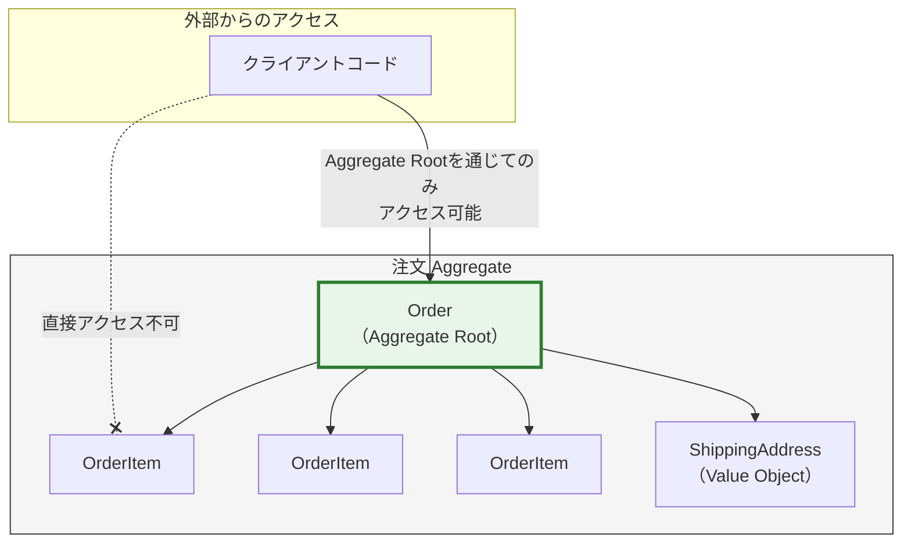

Aggregateの基本ルールは以下の通りである。

1. **Aggregate Rootのみが外部から参照される**: 外部のオブジェクトはAggregate Rootへの参照を保持できるが、内部のEntityやValue Objectへの直接参照を保持してはならない
2. **Aggregate内部の不変条件はAggregate Rootが守る**: ビジネスルールの整合性は、Aggregate Root内のメソッドによって保証される
3. **トランザクション境界**: 1つのトランザクションで変更されるのは1つのAggregateのみであるべき
4. **他のAggregateへの参照はIDで行う**: Aggregate間は直接のオブジェクト参照ではなく、IDによる間接参照を用いる

### 3.4 Repository（リポジトリ）

Repositoryは、Aggregateの永続化と取得を抽象化するパターンである。ドメインモデルの観点からは、Aggregateのコレクションのように振る舞い、データベースやストレージの技術的詳細を隠蔽する。

```typescript
// Domain layer - interface definition
interface OrderRepository {
  findById(id: OrderId): Promise<Order | null>;
  save(order: Order): Promise<void>;
  nextId(): OrderId;
}

// Infrastructure layer - implementation
class PostgresOrderRepository implements OrderRepository {
  constructor(private readonly db: Database) {}

  async findById(id: OrderId): Promise<Order | null> {
    const row = await this.db.query(
      "SELECT * FROM orders WHERE id = $1",
      [id.value]
    );
    if (!row) return null;
    return this.toDomain(row);
  }

  async save(order: Order): Promise<void> {
    // Persist the entire aggregate
    await this.db.transaction(async (tx) => {
      await tx.query(
        "INSERT INTO orders (id, status) VALUES ($1, $2) ON CONFLICT (id) DO UPDATE SET status = $2",
        [order.id.value, order.status]
      );
      // Persist order items within the same transaction
      for (const item of order.items) {
        await tx.query(
          "INSERT INTO order_items (order_id, product_id, quantity, price) VALUES ($1, $2, $3, $4) ON CONFLICT DO UPDATE ...",
          [order.id.value, item.productId.value, item.quantity, item.price.amount]
        );
      }
    });
  }

  nextId(): OrderId {
    return new OrderId(crypto.randomUUID());
  }

  // Reconstruct domain object from persistence representation
  private toDomain(row: any): Order {
    // ... mapping logic
  }
}
```

Repositoryの重要な原則は以下の通りである。

- Repositoryのインターフェースはドメイン層に定義し、実装はインフラストラクチャ層に配置する（依存性逆転の原則）
- RepositoryはAggregate単位で操作する。Aggregateの一部だけを保存・取得するメソッドは定義しない
- コレクションのような直感的なインターフェースを提供する（`findById`、`save`、`delete` 等）

### 3.5 Domain Service（ドメインサービス）

Domain Serviceは、特定のEntityやValue Objectに属さないドメインロジックをカプセル化する。典型的なケースは、複数のAggregateにまたがる操作や、外部サービスとの連携を伴うドメインロジックである。

```typescript
class TransferService {
  // Domain service encapsulates logic that doesn't belong to a single entity
  transfer(
    from: Account,
    to: Account,
    amount: Money
  ): TransferResult {
    if (!from.canWithdraw(amount)) {
      return TransferResult.insufficientFunds();
    }

    from.withdraw(amount);
    to.deposit(amount);

    return TransferResult.success(from, to, amount);
  }
}
```

::: warning Domain Serviceの使いすぎに注意
Domain Serviceは便利だが、安易に使うと「ドメインロジックがEntityやValue Objectから流出してサービスクラスに集中する」という「貧血ドメインモデル（Anemic Domain Model）」に陥る。まずはEntityやValue Objectにロジックを配置することを検討し、どうしても適切な置き場がない場合にのみDomain Serviceを使うべきである。
:::

### 3.6 Domain Event（ドメインイベント）

Domain Eventは、ドメインで発生した出来事を表現するオブジェクトである。「注文が確定された」「支払いが完了した」「在庫が不足した」といった、ビジネス上意味のある事象をモデル化する。

```typescript
class OrderConfirmed {
  // Domain events are immutable records of something that happened
  constructor(
    public readonly orderId: OrderId,
    public readonly confirmedAt: Date,
    public readonly totalAmount: Money,
    public readonly items: ReadonlyArray<OrderItemSnapshot>
  ) {}
}

class Order {
  private domainEvents: DomainEvent[] = [];

  confirm(): void {
    if (this.status !== OrderStatus.Created) {
      throw new Error("Only created orders can be confirmed");
    }
    this.status = OrderStatus.Confirmed;

    // Record the event
    this.domainEvents.push(
      new OrderConfirmed(this.id, new Date(), this.totalAmount(), this.itemSnapshots())
    );
  }

  pullDomainEvents(): DomainEvent[] {
    const events = [...this.domainEvents];
    this.domainEvents = [];
    return events;
  }
}
```

Domain Eventは以下のような目的で活用される。

1. **コンテキスト間の統合**: あるBounded Contextで発生したイベントを別のBounded Contextが購読して反応する
2. **監査ログ**: ドメインで何が起きたかの記録
3. **結果整合性の実現**: 即時的な整合性が不要な処理を非同期で実行する
4. **イベントソーシング**: すべての状態変更をイベントとして記録する

## 4. Aggregateの設計原則と整合性境界

### 4.1 なぜAggregateの設計が最も重要か

Aggregateの境界設計は、DDDの戦術的設計において最も難しく、かつ最もシステムの品質に影響を与える判断である。Aggregateが大きすぎると並行処理が困難になり、小さすぎるとビジネスルールの整合性を保つのが難しくなる。

Vaughn Vernonの「Implementing Domain-Driven Design」（通称IDDD本、2013年出版）は、Aggregate設計について以下の原則を示している。

### 4.2 小さなAggregateを設計する

大きなAggregateは魅力的に見える。関連するすべてのデータが1つのオブジェクトグラフに含まれ、整合性の維持が容易だからである。しかし実際には、大きなAggregateは深刻な問題を引き起こす。

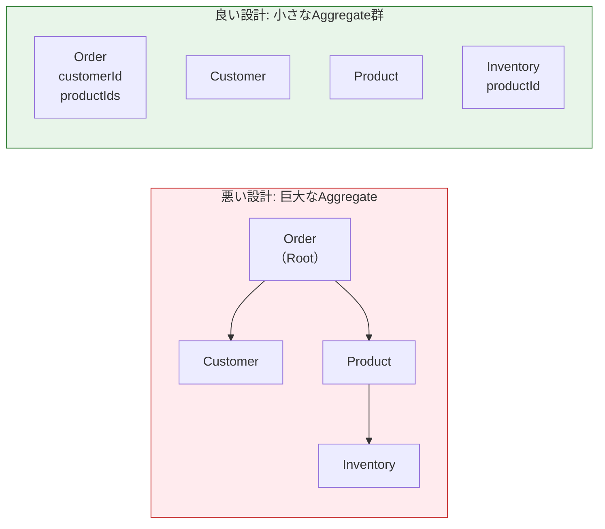

巨大なAggregateの問題点は以下の通りである。

1. **パフォーマンス**: Aggregate全体をロードする必要があるため、メモリ使用量が増大する
2. **並行処理の阻害**: Aggregate全体にロックがかかるため、無関係な操作が直列化される
3. **トランザクションの競合**: 複数のユーザーが同じAggregateの異なる部分を更新しようとすると、楽観的ロックの競合が頻発する

### 4.3 IDによる参照を用いる

Aggregate間の関係は、直接のオブジェクト参照ではなく、IDによる間接参照で表現する。

```typescript
// BAD: Direct object reference between aggregates
class Order {
  private customer: Customer; // Direct reference to another aggregate
  private product: Product;   // Direct reference to another aggregate
}

// GOOD: Reference by ID
class Order {
  private customerId: CustomerId; // ID reference only
  private items: OrderItem[];     // OrderItem is within this aggregate
}

class OrderItem {
  constructor(
    private readonly productId: ProductId, // ID reference only
    private readonly quantity: number,
    private readonly unitPrice: Money       // Snapshot of the price at order time
  ) {}
}
```

IDによる参照の利点は以下の通りである。

- Aggregate間の結合度が低下する
- 各Aggregateを独立して永続化・スケーリングできる
- 異なるBounded Contextに分離しやすくなる
- 不要な遅延ロードを回避できる

### 4.4 結果整合性を受け入れる

1つのトランザクションで1つのAggregateのみを変更するという原則に従うと、複数のAggregateにまたがるビジネスルールの整合性をどう保つかという問題が生じる。答えは、結果整合性（Eventual Consistency）である。

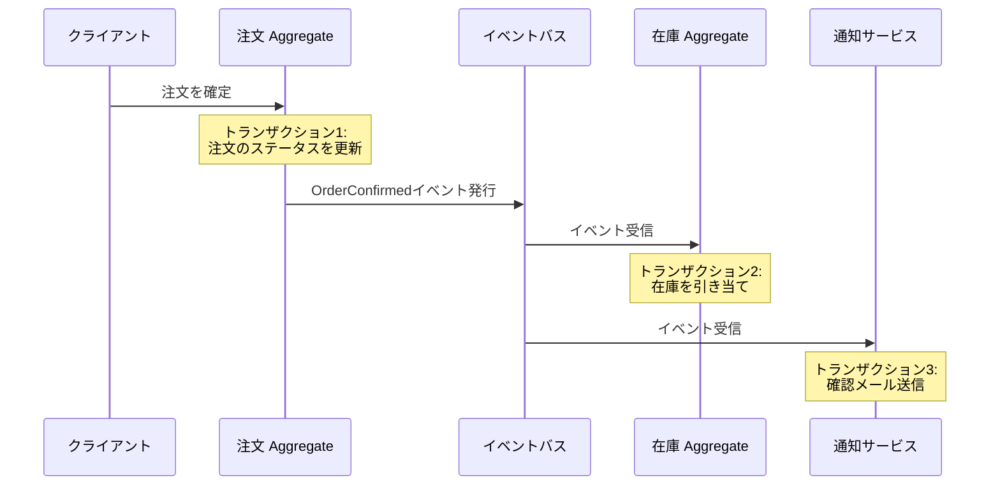

注文の確定と在庫の引き当ては、それぞれ独立したトランザクションで処理される。注文が確定された直後の瞬間、在庫はまだ引き当てられていない。しかし、イベントが処理されれば最終的に整合する。これが結果整合性である。

::: danger 結果整合性の適用には慎重な判断が必要
すべてのビジネスルールに結果整合性が適用できるわけではない。例えば、銀行口座の残高が負にならないというルールは、即時的な整合性で保証すべきである。結果整合性を適用する際は、「整合するまでの間に不整合な状態が存在することがビジネス上許容されるか」を必ず確認すべきである。
:::

### 4.5 Aggregate設計のヒューリスティクス

実践的なAggregate設計のためのヒューリスティクスをまとめる。

| 原則 | 説明 |
|------|------|
| 真の不変条件をAggregate内に閉じ込める | 「注文の合計金額は各明細の合計と一致する」のような即時的に守るべきルールはAggregate内で保証する |
| 小さくて軽いAggregateを選ぶ | 迷ったら小さい方を選ぶ。後から結合するより分割する方が難しい |
| 他のAggregateはIDで参照する | 直接のオブジェクト参照は同一Aggregate内部のみ |
| 結果整合性を活用する | Aggregate間の整合性はDomain Eventを介して非同期的に達成する |
| ユースケースに基づいて境界を引く | 「同時に変更されるべきもの」を同じAggregateに含める |

## 5. イベントストーミングとドメインモデリング手法

### 5.1 イベントストーミングとは

イベントストーミング（Event Storming）は、Alberto Brandoliniが2013年に考案したワークショップ形式のドメイン探索手法である。ドメインの専門家と開発者がオレンジ色の付箋（Domain Event）を時系列で壁に貼り出すことから始まり、そこからコマンド、Aggregate、Bounded Contextを発見していく。

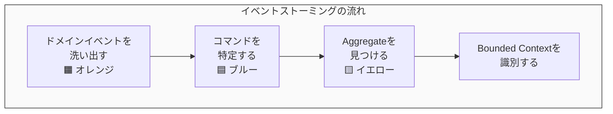

### 5.2 イベントストーミングの進め方

イベントストーミングはいくつかの段階を経て進行する。

**第1段階: ドメインイベントの洗い出し**

参加者全員がオレンジ色の付箋にDomain Event（過去形で記述）を書き出し、時系列で壁に貼っていく。例えば、ECサイトなら「商品がカートに追加された」「注文が作成された」「支払いが処理された」「出荷が完了した」といったイベントである。

この段階では正しさや網羅性を気にせず、思いつくままに書き出すことが重要である。議論や衝突が発生した場合は、ピンク色の付箋（ホットスポット）で問題点を記録して先に進む。

**第2段階: コマンドとアクターの特定**

各Domain Eventを引き起こすコマンド（アクション）とアクター（誰が実行するか）を特定する。「注文が作成された」というイベントに対して、「注文を作成する」というコマンドと「顧客」というアクターが対応する。

**第3段階: Aggregateの発見**

関連するコマンドとイベントをグルーピングし、それらを管理するAggregateを特定する。「注文を作成する」「注文を確定する」「注文をキャンセルする」といったコマンドと、それに対応するイベント群が「注文」Aggregateを形成する。

**第4段階: Bounded Contextの識別**

Aggregate群をさらに上位の境界でグルーピングし、Bounded Contextを識別する。言語の変化、チーム構造、ビジネスプロセスの断絶を手がかりにする。

### 5.3 他のモデリング手法との比較

| 手法 | 特徴 | 適用場面 |
|------|------|---------|
| **イベントストーミング** | ワークショップ形式、付箋を使った視覚的な探索 | 新規プロジェクトの初期探索、既存システムの理解 |
| **ドメインストーリーテリング** | ビジネスプロセスを物語として記述 | ビジネスの流れの可視化、要件の共有 |
| **ユースケース分析** | アクターとシステムの相互作用を記述 | 機能要件の整理 |
| **CRCカード** | クラス・責務・協調者をカードに記述 | オブジェクト指向設計のブレインストーミング |

イベントストーミングの最大の利点は、技術的な知識がなくてもドメインの専門家が積極的に参加できること、そして議論が「何が起きるか（イベント）」から始まるためビジネスの実態に即した結果が得られることである。

## 6. 実装パターン

### 6.1 レイヤードアーキテクチャとDDD

DDDのコードベースは、典型的には以下のようなレイヤー構造を取る。

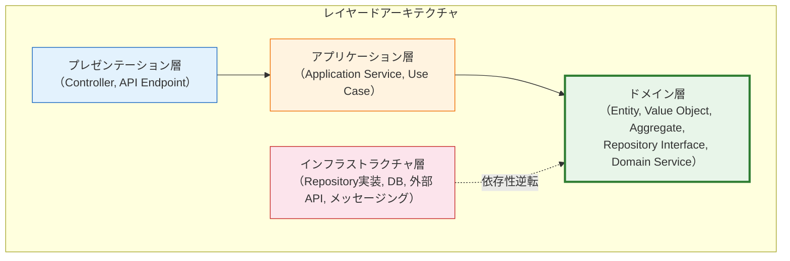

ここで最も重要なのは、ドメイン層が他のどの層にも依存しないことである。インフラストラクチャ層はドメイン層で定義されたインターフェース（Repositoryインターフェースなど）を実装する形で依存性が逆転される。

### 6.2 Application Serviceの役割

Application Service（ユースケース）は、ドメインオブジェクトを協調させてユースケースを実現する薄い層である。ドメインロジック自体は含まず、トランザクション制御やDomain Eventのディスパッチといった技術的な関心事を担う。

```typescript
class ConfirmOrderUseCase {
  constructor(
    private readonly orderRepository: OrderRepository,
    private readonly eventPublisher: EventPublisher,
    private readonly transactionManager: TransactionManager
  ) {}

  async execute(orderId: string): Promise<void> {
    await this.transactionManager.run(async () => {
      // 1. Retrieve the aggregate
      const order = await this.orderRepository.findById(new OrderId(orderId));
      if (!order) {
        throw new OrderNotFoundError(orderId);
      }

      // 2. Execute domain logic (the actual logic lives in the aggregate)
      order.confirm();

      // 3. Persist the aggregate
      await this.orderRepository.save(order);

      // 4. Publish domain events
      const events = order.pullDomainEvents();
      for (const event of events) {
        await this.eventPublisher.publish(event);
      }
    });
  }
}
```

Application Serviceのパターンを見ると、常に同じ構造が繰り返されることに気づく。「Aggregateを取得 → ドメインロジックを実行 → Aggregateを永続化 → イベントを発行」。この構造の単純さこそが正しい設計の証であり、複雑なロジックがApplication Serviceに紛れ込んでいる場合は、それがドメイン層に属すべきロジックである可能性が高い。

### 6.3 ディレクトリ構成の例

```
src/
├── order/                          # Bounded Context: Order
│   ├── domain/                     # Domain layer
│   │   ├── model/
│   │   │   ├── order.ts            # Aggregate Root
│   │   │   ├── order-item.ts       # Entity within aggregate
│   │   │   ├── order-id.ts         # Value Object
│   │   │   ├── order-status.ts     # Value Object (enum)
│   │   │   └── money.ts            # Value Object
│   │   ├── event/
│   │   │   ├── order-confirmed.ts  # Domain Event
│   │   │   └── order-cancelled.ts  # Domain Event
│   │   ├── repository/
│   │   │   └── order-repository.ts # Repository interface
│   │   └── service/
│   │       └── pricing-service.ts  # Domain Service
│   ├── application/                # Application layer
│   │   ├── confirm-order.ts        # Use case
│   │   └── cancel-order.ts         # Use case
│   └── infrastructure/             # Infrastructure layer
│       ├── postgres-order-repo.ts  # Repository implementation
│       └── event-publisher.ts      # Event publishing implementation
├── inventory/                      # Bounded Context: Inventory
│   ├── domain/
│   ├── application/
│   └── infrastructure/
└── shared/                         # Shared Kernel (if any)
    └── domain/
        └── money.ts
```

### 6.4 貧血ドメインモデルの罠

DDDの実装において最も陥りやすいアンチパターンが「貧血ドメインモデル（Anemic Domain Model）」である。Martin Fowlerが名付けたこのパターンでは、Entityがデータの入れ物に過ぎず、ビジネスロジックがすべてサービスクラスに集中する。

```typescript
// BAD: Anemic Domain Model
class Order {
  id: string;
  status: string;
  items: OrderItem[];
  // Only getters and setters, no business logic
}

class OrderService {
  confirmOrder(order: Order): void {
    // Business logic lives in the service, not in the entity
    if (order.status !== "created") {
      throw new Error("Invalid status");
    }
    order.status = "confirmed";
    // ... more logic
  }
}

// GOOD: Rich Domain Model
class Order {
  private readonly id: OrderId;
  private status: OrderStatus;
  private items: OrderItem[];

  // Business logic lives in the entity
  confirm(): void {
    if (this.status !== OrderStatus.Created) {
      throw new Error("Only created orders can be confirmed");
    }
    this.status = OrderStatus.Confirmed;
  }

  addItem(productId: ProductId, quantity: number, unitPrice: Money): void {
    if (this.status !== OrderStatus.Created) {
      throw new Error("Cannot modify confirmed order");
    }
    const item = new OrderItem(productId, quantity, unitPrice);
    this.items.push(item);
  }

  totalAmount(): Money {
    return this.items.reduce(
      (sum, item) => sum.add(item.subtotal()),
      Money.zero(Currency.JPY)
    );
  }
}
```

貧血ドメインモデルでは、Entityがただのデータ構造（C言語でいうstruct）と変わらず、オブジェクト指向の利点であるデータとロジックのカプセル化が失われている。DDDが目指すのは、ドメインの知識がドメインオブジェクト自身に埋め込まれた「リッチドメインモデル」である。

## 7. DDDのメリット・デメリット・適用が有効なケース

### 7.1 メリット

**ビジネスとコードの整合性**: Ubiquitous Languageとドメインモデルにより、ビジネスの専門家が語る言葉とコードの構造が一致する。これにより、要件の変更がコードのどこに影響するかが予測可能になり、ビジネスロジックの変更が局所的になる。

**変更への耐性**: Bounded Contextによるシステムの分割と、Aggregateによる整合性境界の設計により、ある部分の変更が他の部分に波及することが抑制される。

**チーム間の独立性**: Bounded ContextとContext Mapにより、異なるチームが異なるコンテキストを独立して開発できる。Conway's Lawに沿った自然なチーム分割が可能になる。

**複雑なビジネスロジックの表現力**: リッチドメインモデルは、複雑なビジネスルールを明示的かつ検証可能な形で表現できる。ビジネスルールがコード上で見つけやすく、テストしやすくなる。

### 7.2 デメリット

**学習コストの高さ**: DDDの概念体系は広く深い。Entity、Value Object、Aggregate、Repository、Domain Service、Domain Event、Bounded Context、Context Map――これらの概念を正しく理解し、適切に適用するまでには相当な学習時間を要する。

**初期開発速度の低下**: DDDに沿った設計は、CRUDベースの単純なアプリケーションと比較して初期のコード量が多くなる。短期的にはオーバーエンジニアリングに見えることがある。

**ドメインの専門家の関与が不可欠**: DDDはドメインの専門家との密接な協業を前提としている。技術チームだけで進めると、形骸化した「DDDっぽいコード」になりがちである。

**Aggregate設計の難しさ**: Aggregateの境界設計は経験と判断力を要する。誤った境界設計はパフォーマンス問題やデータ整合性の問題を引き起こし、後から修正するコストが高い。

**過剰適用のリスク**: すべてのシステムにDDDが必要なわけではない。単純なCRUDアプリケーションにDDDを適用すると、不必要な抽象化が増え、かえって複雑さが増す。

### 7.3 適用が有効なケース

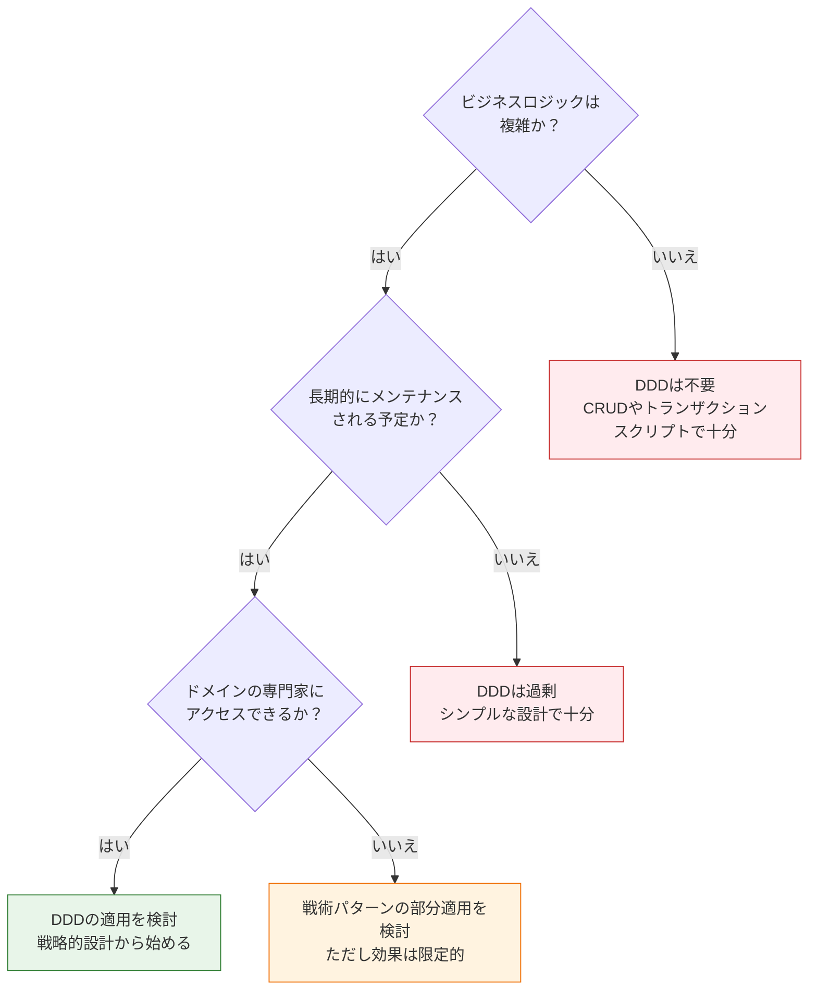

DDDが最も効果を発揮するのは、以下のような条件が揃った場合である。

- **複雑なビジネスロジック**: 保険、金融、物流、医療など、ルールが複雑で頻繁に変更されるドメイン
- **長期的な運用**: 数年以上にわたってメンテナンス・拡張されるシステム
- **ドメイン専門家の参加**: ビジネスの知識を持つ人材が開発チームと協業できる環境
- **チーム規模**: 複数のチームが協調して開発する中〜大規模プロジェクト

逆に、以下のようなケースではDDDの適用は推奨されない。

- データの入出力が主な処理であるCRUDアプリケーション
- プロトタイプや短命なプロジェクト
- ビジネスロジックが薄く、技術的な課題（パフォーマンス、スケーラビリティ）が主な関心事であるシステム

## 8. CQRSやイベントソーシングとの関係

### 8.1 CQRS（Command Query Responsibility Segregation）

CQRSは、コマンド（データの変更）とクエリ（データの読み取り）の責務を分離するアーキテクチャパターンである。DDDとの組み合わせが非常に自然であるため、しばしばセットで語られる。

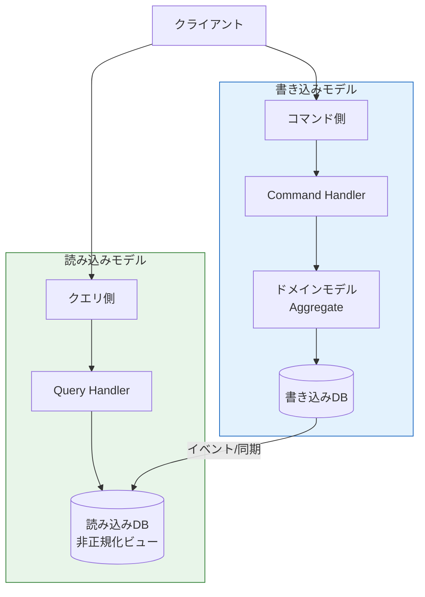

DDDとCQRSの組み合わせが自然な理由は以下の通りである。

**書き込み側はドメインモデルに最適化される**: Aggregateの設計は、ビジネスルールの整合性を保つことに最適化されている。書き込み操作はAggregate Rootを経由し、不変条件が検証される。

**読み込み側はクエリに最適化される**: 一方、UIが必要とするデータは、必ずしもAggregateの構造と一致しない。注文一覧画面では、注文情報に加えて顧客名や商品名が必要かもしれない。CQRSを使えば、読み込み側は非正規化されたビューモデルを直接返すことができ、複雑なAggregateの再構築が不要になる。

::: tip CQRSは必須ではない
DDDにCQRSは必須ではない。多くのアプリケーションでは、同じモデルで読み書き両方を処理して問題ない。CQRSの導入は、読み込みパターンと書き込みパターンが大きく異なる場合や、読み込みのパフォーマンス要件が厳しい場合に検討すべきである。
:::

### 8.2 イベントソーシング

イベントソーシング（Event Sourcing）は、状態そのものを保存するのではなく、状態に至るまでのすべてのイベントを保存するパターンである。

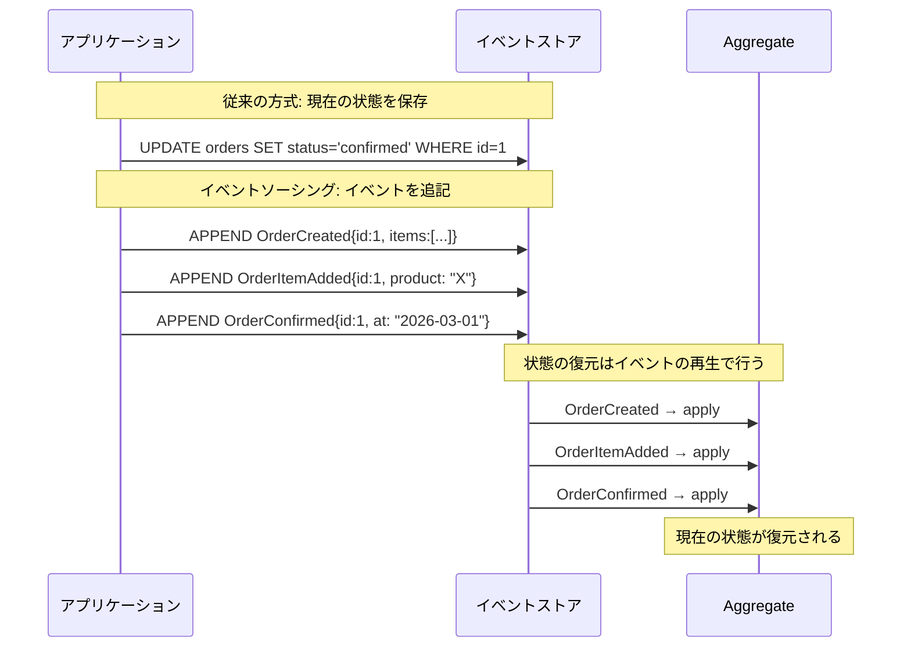

イベントソーシングとDDDの関係は以下の通りである。

**Domain Eventがそのままストレージモデルになる**: DDDのDomain Eventの概念がイベントソーシングの基盤となる。Aggregateが発生させるDomain Eventをそのままイベントストアに保存する。

**完全な監査証跡**: すべての状態変更がイベントとして記録されるため、「いつ、誰が、何を変更したか」の完全な履歴が得られる。金融や医療など、監査要件が厳しいドメインで特に有用である。

**時間旅行**: 任意の時点の状態をイベントの再生によって復元できる。デバッグや分析に極めて有用である。

しかし、イベントソーシングは以下のような課題も伴う。

| 課題 | 説明 |
|------|------|
| **イベントスキーマの進化** | 一度保存されたイベントの構造を後から変更するのは困難。アップキャスト等の戦略が必要 |
| **クエリの複雑さ** | 現在の状態を取得するにはイベントを再生する必要がある（スナップショットで緩和可能） |
| **結果整合性への対応** | CQRSとの組み合わせが事実上必須となり、読み込み側のビューが最新でない瞬間が存在する |
| **学習コスト** | 従来のCRUDモデルとは根本的に異なる思考が求められる |

::: danger イベントソーシングの適用は慎重に
イベントソーシングは強力だが、すべてのシステムに必要なわけではない。DDD + CQRS + イベントソーシングの全部入りアーキテクチャは複雑度が非常に高い。まずはDDDの戦略的設計と戦術的設計の基本から始め、本当に必要な場合にのみイベントソーシングを導入すべきである。
:::

### 8.3 DDDと関連アーキテクチャの位置づけ

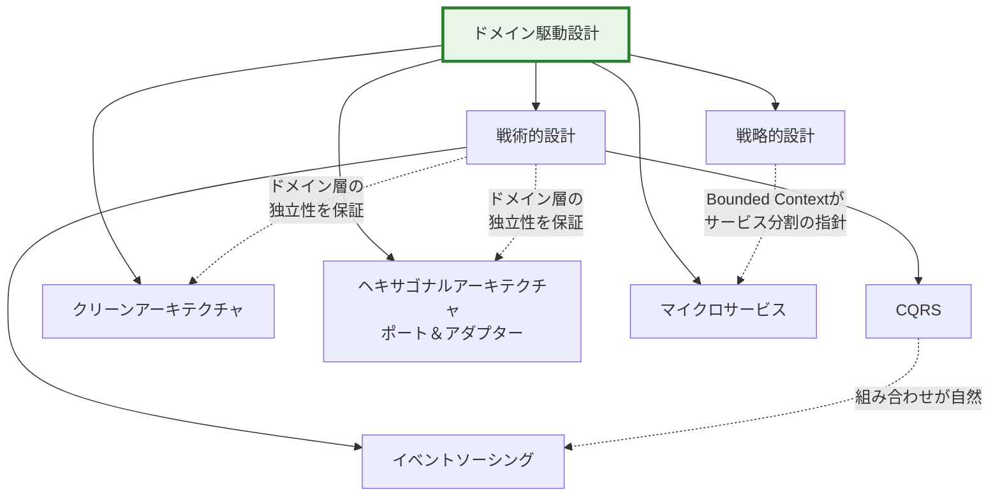

DDDは単独で使われるだけでなく、クリーンアーキテクチャ（Uncle Bobが提唱）やヘキサゴナルアーキテクチャ（Alistair Cockburnが提唱、ポート＆アダプターとも呼ばれる）と組み合わせて使われることが多い。これらのアーキテクチャは「ドメイン層を技術的な詳細から独立させる」という同じ思想を共有しており、DDDの戦術的パターンと自然に適合する。

また、マイクロサービスアーキテクチャにおいては、DDDの戦略的設計（特にBounded Context）がサービス分割の有力な指針となる。Sam Newmanの「Building Microservices」でもこの点が強調されている。

## 9. まとめ

### 9.1 DDDの核心

ドメイン駆動設計の核心は、ソフトウェアの複雑さの主たる源泉がドメイン（問題領域）にあると認識し、ドメインの構造をソフトウェアの構造に忠実に反映させるという設計哲学にある。

戦略的設計は「システムをどう分割するか」を定め、Bounded ContextとUbiquitous Languageを中心概念とする。戦術的設計は「分割された各部分をどう実装するか」を定め、Entity、Value Object、Aggregate、Repository、Domain Service、Domain Eventを中心概念とする。

### 9.2 実践への道筋

DDDを実践に導入する際の推奨される段階的アプローチは以下の通りである。

1. **Ubiquitous Languageから始める**: ドメインの専門家と対話し、共通の用語を確立する。これはコストがほぼゼロでありながら、最も大きな効果をもたらす
2. **Bounded Contextを識別する**: 既存のシステムや新規プロジェクトにおいて、モデルの境界を明確にする
3. **Core Domainに集中する**: すべてのBounded Contextに同じ労力を投入するのではなく、ビジネス上最も重要なコアドメインにDDDの戦術パターンを集中的に適用する
4. **イベントストーミングを実施する**: チーム全体でドメインの理解を深め、共有する
5. **段階的にパターンを導入する**: 最初からすべてのパターンを導入しようとせず、Entity/Value ObjectやAggregateから始めて、必要に応じてCQRSやイベントソーシングを検討する

### 9.3 DDDの進化と現在

Evansの原著が出版されてから20年以上が経過し、DDDの実践は大きく進化した。Vaughn Vernonの「Implementing Domain-Driven Design」（2013年）は実装面の具体的なガイダンスを提供し、Alberto Brandoliniのイベントストーミングはドメイン探索の実践的な手法を確立した。Scott Wlaschinの「Domain Modeling Made Functional」（2018年）は関数型プログラミングの視点からDDDを再解釈し、Aggregateを代数的データ型と純粋関数で表現するアプローチを示した。

DDDは完成された方法論ではなく、ソフトウェア開発の本質的な問題――複雑さの管理――に対する継続的な思考の枠組みである。すべてのプロジェクトにDDDが必要なわけではないが、複雑なドメインに取り組む開発者にとって、DDDが提供する語彙と思考ツールは依然として最も有力な武器の一つである。
