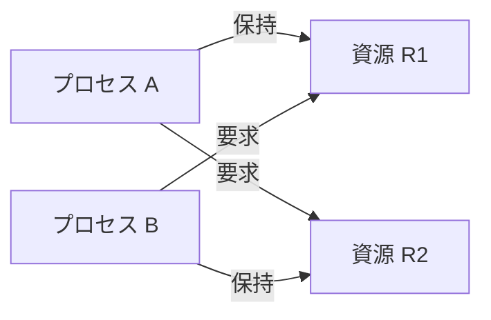
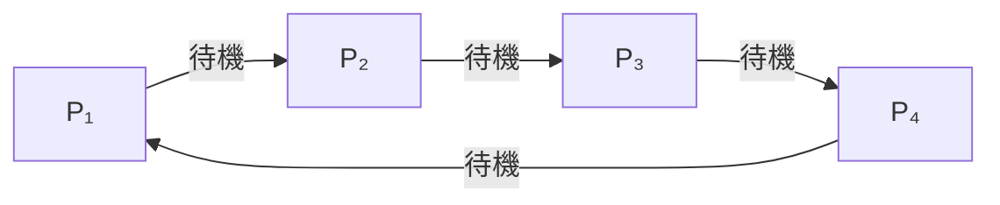
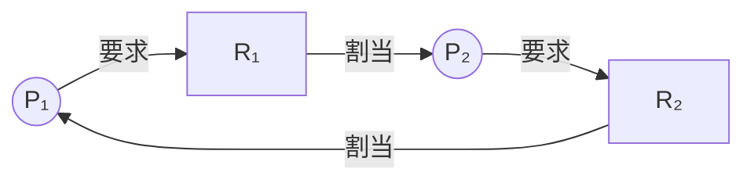
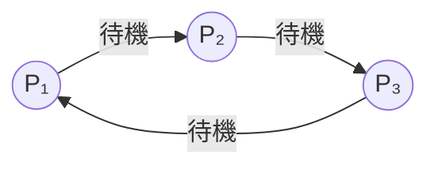
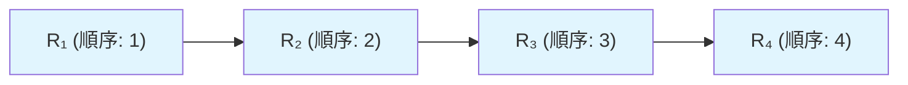
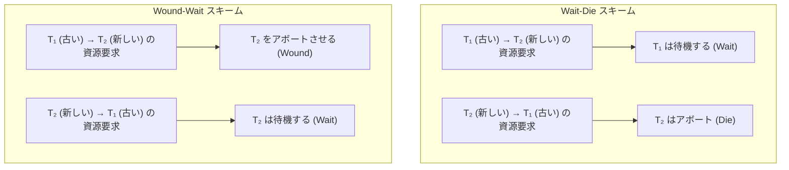
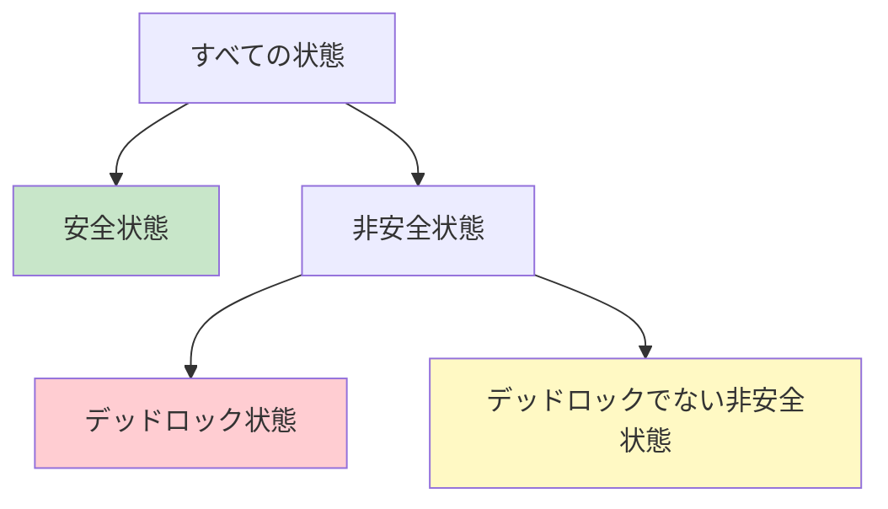
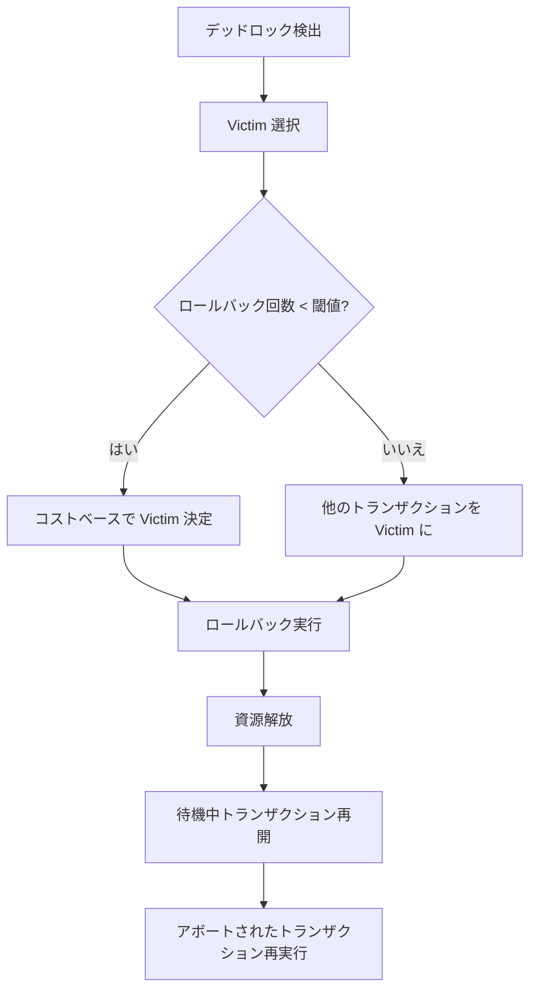
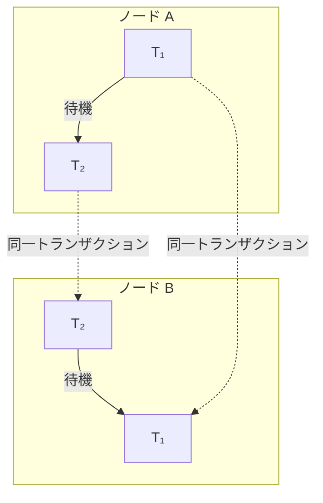

# デッドロック — 検出・予防・回避・リカバリの理論と実践

## 1. はじめに：デッドロックとは何か

### 1.1 並行システムにおける資源競合

オペレーティングシステムやデータベースシステムにおいて、複数のプロセス（あるいはトランザクション）が限られた資源を奪い合う場面は日常的に発生する。CPUコア、メモリ領域、ディスクI/Oチャネル、テーブルの行ロック、ファイルロック——これらの資源は有限であり、ある時点で一つのプロセスだけが排他的に使用する必要があることが多い。

この排他的なアクセスを安全に実現するために**ロック**という機構が存在する。プロセスAが資源Rを使用するとき、まずRのロックを取得する。他のプロセスがRを使いたい場合は、Aがロックを解放するまで待機する。これ自体は正しい動作であり、データの整合性を守るために不可欠な機構である。

しかし、複数のプロセスが**複数の資源を同時に必要とする**場合に問題が生じる。

### 1.2 デッドロックの定義

**デッドロック（Deadlock）**とは、2つ以上のプロセスが、互いに相手が保持する資源の解放を待ち続け、いずれのプロセスも先に進めなくなる状態を指す。

最も単純な例を示す。

```
プロセス A: 資源 R1 のロックを取得 → 資源 R2 のロックを要求（待機）
プロセス B: 資源 R2 のロックを取得 → 資源 R1 のロックを要求（待機）
```

AはR2の解放を待ち、BはR1の解放を待つ。しかしAはR1を保持したまま待機しており、BはR2を保持したまま待機している。外部からの介入がない限り、この状態は永遠に解消されない。



デッドロックはコンピューターサイエンスにおける古典的な問題であり、1965年にEdsger Dijkstraが「Cooperating Sequential Processes」の中で初めて体系的に議論した。以降、OSカーネル、DBMS、分散システム、さらにはマルチスレッドプログラミングに至るまで、あらゆる並行システムの設計において考慮すべき基本問題となっている。

### 1.3 デッドロックの影響

デッドロックが発生すると、関与するプロセスはすべて停止する。OSの場合、ユーザーのプロセスが応答しなくなる。DBMSの場合、トランザクションが完了せず、接続がタイムアウトし、アプリケーション全体のスループットが低下する。さらに深刻なケースでは、デッドロックに巻き込まれたプロセスが他のプロセスから必要とされる資源を保持しているために、連鎖的にシステム全体が停止する**カスケード障害**が発生する。

本記事では、デッドロックの理論的基盤から始まり、検出・予防・回避・リカバリの各戦略を詳しく解説し、DBMSにおける実装、分散環境での課題、そして実務での対策までを包括的に扱う。

## 2. デッドロックの4条件（Coffman条件）

### 2.1 Coffman条件の概要

1971年、Edward G. Coffman Jr. らは、デッドロックが発生するために**必要かつ十分な4つの条件**を定式化した。これらは**Coffman条件**と呼ばれ、デッドロックの理論的基盤となっている。

デッドロックは、以下の4条件が**すべて同時に**成立したときに、かつそのときに限り発生する。

### 2.2 条件1：相互排他（Mutual Exclusion）

少なくとも1つの資源が**非共有モード**で保持されていなければならない。つまり、ある資源は一度に一つのプロセスだけが使用でき、他のプロセスがその資源を要求した場合は待機しなければならない。

例えば、排他ロック（X-Lock）はその典型である。あるトランザクションが行に排他ロックをかけている間、他のトランザクションはその行に対して排他ロックも共有ロックも取得できない。一方、共有ロック（S-Lock）のみで構成される状況では相互排他は成立しないため、デッドロックは発生しない。

### 2.3 条件2：保持と待機（Hold and Wait）

プロセスが**少なくとも1つの資源を保持したまま**、追加の資源を要求して待機している状態が存在しなければならない。

先ほどの例では、プロセスAがR1を保持したままR2を要求している。この「保持しながら待つ」という行動がデッドロックの構造を作り出す。

### 2.4 条件3：横取り不可（No Preemption）

資源を保持しているプロセスから、その資源を**強制的に奪い取ることができない**。資源の解放は、保持しているプロセスが自発的に行う場合にのみ発生する。

もし資源の横取り（プリエンプション）が可能であれば、デッドロック状態を外部から解消できる。しかし多くの場合、ロックの強制解除はデータの整合性を破壊するリスクがあるため、安易に行えない。

### 2.5 条件4：循環待ち（Circular Wait）

プロセスの集合 $\{P_1, P_2, \ldots, P_n\}$ が存在し、$P_1$ が $P_2$ の保持する資源を待ち、$P_2$ が $P_3$ の保持する資源を待ち、……、$P_n$ が $P_1$ の保持する資源を待つという**循環的な待機関係**が成立しなければならない。



この循環構造がデッドロックの核心である。2つのプロセスによる単純な循環は最も一般的だが、3つ以上のプロセスが関与する複雑な循環も発生しうる。

### 2.6 4条件の意義

Coffman条件の重要性は、デッドロック対策の方針を明確にしてくれることにある。4条件がすべて成立しなければデッドロックは発生しないため、**いずれか1つの条件を崩す**ことでデッドロックを防げる。後述するデッドロック予防戦略は、まさにこの原理に基づいている。

| 条件 | 崩す方法の例 |
|---|---|
| 相互排他 | 資源を共有可能にする（実際には困難なことが多い） |
| 保持と待機 | 必要な資源をすべて一度に取得する |
| 横取り不可 | タイムアウトで強制解放する |
| 循環待ち | 資源に順序を付け、昇順でのみ取得する |

## 3. Wait-For グラフ

### 3.1 資源割当てグラフ

デッドロックの状態を形式的に表現するために、**資源割当てグラフ（Resource Allocation Graph, RAG）**が用いられる。RAGは有向グラフであり、以下の要素で構成される。

- **プロセスノード**：円で表す（$P_1, P_2, \ldots$）
- **資源ノード**：矩形で表す（$R_1, R_2, \ldots$）。資源のインスタンス数を内部の点で表す
- **要求辺**：プロセスから資源への有向辺（$P_i \to R_j$）。$P_i$ が $R_j$ を要求していることを示す
- **割当辺**：資源からプロセスへの有向辺（$R_j \to P_i$）。$R_j$ が $P_i$ に割り当てられていることを示す



上のグラフにはサイクルが存在する：$P_1 \to R_1 \to P_2 \to R_2 \to P_1$。各資源が単一インスタンスである場合、RAGにサイクルが存在することはデッドロックの**必要十分条件**である。

ただし、資源が複数インスタンスを持つ場合は、サイクルの存在は必要条件にすぎず、十分条件ではない。例えば、資源Rが2つのインスタンスを持ち、プロセスP1とP2がそれぞれ1つずつ保持し、P3がRを要求している場合、サイクルが存在していてもP1またはP2が資源を解放すればP3は進行できる。

### 3.2 Wait-For グラフへの変換

**Wait-For グラフ（WFG）**は、RAGを簡略化したものであり、各資源が単一インスタンスの場合に特に有用である。WFGでは資源ノードを省略し、プロセス間の待機関係のみを表現する。

$P_i$ が $P_j$ の保持する資源を待っているとき、$P_i \to P_j$ という有向辺を描く。



WFGにサイクルが存在すれば、デッドロックが発生している。この単純な構造が、デッドロック検出アルゴリズムの基盤となる。

### 3.3 WFGの構築と管理

DBMSでは、ロックマネージャがWFGをリアルタイムで管理する。以下のイベントでWFGが更新される。

- **ロック要求時**：要求が即座に許可されなければ、要求したトランザクションから、現在そのロックを保持しているトランザクションへの辺を追加する
- **ロック解放時**：解放したトランザクションへの待機辺を削除する。待機キューの次のトランザクションにロックが付与される場合は、グラフを更新する
- **トランザクション終了時**：そのトランザクションに関連するすべての辺を削除する

## 4. デッドロック検出アルゴリズム

### 4.1 検出の基本方針

デッドロック検出とは、「デッドロックの発生を許容し、発生後に検出して対処する」という事後対応型の戦略である。デッドロックを事前に防ぐコストが高い場合や、デッドロックの発生頻度が低い場合に有効な選択肢となる。

### 4.2 サイクル検出：単一インスタンス資源の場合

各資源が単一インスタンスである場合、デッドロック検出はWFGにおける**サイクル検出**に帰着する。有向グラフのサイクル検出には、**深さ優先探索（DFS）**を用いるのが一般的である。

以下に擬似コードを示す。

```python
def detect_deadlock(wfg):
    """
    Detect deadlock by finding cycles in the Wait-For Graph.
    Returns a list of transactions involved in the cycle, or None.
    """
    visited = set()
    rec_stack = set()  # tracks nodes in current DFS path
    parent = {}

    def dfs(node):
        visited.add(node)
        rec_stack.add(node)

        for neighbor in wfg.get_neighbors(node):
            if neighbor not in visited:
                parent[neighbor] = node
                cycle = dfs(neighbor)
                if cycle is not None:
                    return cycle
            elif neighbor in rec_stack:
                # Cycle detected — reconstruct it
                cycle = [neighbor]
                current = node
                while current != neighbor:
                    cycle.append(current)
                    current = parent[current]
                cycle.append(neighbor)
                return cycle

        rec_stack.remove(node)
        return None

    for node in wfg.get_all_nodes():
        if node not in visited:
            cycle = dfs(node)
            if cycle is not None:
                return cycle
    return None
```

このアルゴリズムの時間計算量は $O(V + E)$ であり、$V$ はプロセス（トランザクション）数、$E$ は待機辺の数である。

### 4.3 複数インスタンス資源の検出アルゴリズム

資源が複数インスタンスを持つ場合、単純なサイクル検出ではデッドロックを正確に判定できない。この場合は、**バンカーズアルゴリズムに類似した手法**が用いられる。

以下のデータ構造を使用する。

- $\text{Available}[j]$：資源 $R_j$ の利用可能なインスタンス数
- $\text{Allocation}[i][j]$：プロセス $P_i$ が保持する資源 $R_j$ のインスタンス数
- $\text{Request}[i][j]$：プロセス $P_i$ が要求している資源 $R_j$ のインスタンス数

```python
def detect_deadlock_multi_instance(available, allocation, request, n, m):
    """
    Detect deadlock with multiple-instance resources.
    n: number of processes
    m: number of resource types
    Returns list of deadlocked processes.
    """
    work = available.copy()
    finish = [False] * n

    # Mark processes with zero allocation as finished
    for i in range(n):
        if all(allocation[i][j] == 0 for j in range(m)):
            finish[i] = True

    changed = True
    while changed:
        changed = False
        for i in range(n):
            if not finish[i]:
                # Check if request can be satisfied
                if all(request[i][j] <= work[j] for j in range(m)):
                    # Assume process finishes and releases resources
                    for j in range(m):
                        work[j] += allocation[i][j]
                    finish[i] = True
                    changed = True

    # Processes still not finished are deadlocked
    deadlocked = [i for i in range(n) if not finish[i]]
    return deadlocked
```

このアルゴリズムは、「現在の資源で完了できるプロセスがあれば、そのプロセスが資源を解放すると仮定する」という楽観的シミュレーションを行う。最終的に完了できないプロセスがあれば、それらはデッドロック状態にある。時間計算量は $O(n^2 \cdot m)$ である。

### 4.4 検出の実行タイミング

デッドロック検出アルゴリズムをいつ実行するかは、性能と検出遅延のトレードオフである。

| タイミング | 利点 | 欠点 |
|---|---|---|
| ロック要求がブロックされるたび | 即座にデッドロックを検出 | オーバーヘッドが大きい |
| 定期的（例：1秒ごと） | オーバーヘッドが予測可能 | 検出が遅れる可能性 |
| CPU使用率が閾値以下のとき | デッドロック疑い時のみ実行 | 検出がさらに遅れる可能性 |
| 待機時間が閾値を超えたとき | 実用的なバランス | 長い正当な待機を誤検出する恐れ |

多くのDBMSでは、**定期的な検出**と**待機時間ベースの検出**を組み合わせる方式が採用されている。

## 5. デッドロック予防（Prevention）

### 5.1 予防の基本思想

デッドロック予防（Deadlock Prevention）は、Coffman条件のうち少なくとも1つが成立しないようにシステムを設計する戦略である。デッドロックの発生を**構造的に不可能**にするため、検出・リカバリの仕組みが不要になる。

### 5.2 相互排他の否定

理論上、すべての資源を共有可能にすればデッドロックは発生しない。しかし、排他ロックが必要な場面（データベースの書き込み、ファイルの更新など）は多く、この条件を崩すことは通常困難である。

ただし、部分的な適用は可能である。例えば、MVCCを採用するデータベースでは、読み取り操作にロックが不要となるため、読み取り-書き込み間のデッドロックが排除される。

### 5.3 保持と待機の否定

プロセスが資源を保持しながら他の資源を待つ状況を排除する方法は2つある。

**方法1：All-or-Nothing方式**

プロセスは実行開始前に、必要なすべての資源を一度に要求する。すべてが利用可能であれば割当て、そうでなければ何も割り当てない。

```python
def request_all_or_nothing(process, required_resources):
    """
    Atomically acquire all required resources or none.
    """
    # Check availability of all resources
    for resource in required_resources:
        if not resource.is_available():
            return False  # acquire nothing

    # All available — acquire them all
    for resource in required_resources:
        resource.acquire(process)
    return True
```

この方式の問題点は、プロセスが実行前にすべての必要資源を正確に予測しなければならないことと、資源の利用効率が大幅に低下することである。

**方法2：段階的解放方式**

新たな資源を要求する前に、現在保持しているすべての資源を一旦解放し、必要な資源をすべてまとめて再要求する。

```python
def request_with_release(process, new_resource):
    """
    Release all held resources before requesting new ones.
    """
    held = process.get_held_resources()
    all_needed = held + [new_resource]

    # Release everything
    for resource in held:
        resource.release(process)

    # Re-request all at once
    return request_all_or_nothing(process, all_needed)
```

この方式は、データベースのトランザクション処理では非現実的である。途中の更新を一旦解放することはACID特性の保証を困難にする。

### 5.4 横取り不可の否定

資源を強制的に奪い取れるようにする方式である。プロセスが新たな資源を要求してブロックされた場合、そのプロセスが保持する資源をすべて解放する。

OSにおいては、CPUのプリエンプティブスケジューリングがこの原理に基づいている。プロセスはCPU時間という資源を強制的に奪い取られる。しかし、ロックやトランザクションの文脈では、資源の横取りはデータの整合性を破壊するリスクがある。

DBMSではタイムアウトベースの横取りが広く使われている。一定時間ロックを待っても取得できないトランザクションを強制的にアボートする。これは厳密には「横取り」ではなく「犠牲者の選択」であるが、効果としてはCoffman条件の「横取り不可」を否定している。

### 5.5 循環待ちの否定：リソース順序付け

4つの条件のうち、実用上最も効果的に否定できるのが**循環待ち**である。その方法が**リソース順序付け（Resource Ordering）**である。

すべての資源に一意の番号（順序）を割り当て、プロセスは**昇順でのみ**資源を取得できるという規則を設ける。

$$
R_1 < R_2 < R_3 < \cdots < R_n
$$

プロセスが資源 $R_i$ を保持しているとき、次に要求できるのは $R_j$ ($j > i$) のみである。



**なぜこれでデッドロックが防げるのか？**

循環待ちが発生するためには、$P_1 \to P_2 \to \cdots \to P_n \to P_1$ という循環が必要である。$P_i$ が $P_{i+1}$ の保持する資源を待っているということは、$P_i$ が保持する資源の番号より大きい番号の資源を要求していることを意味する。しかし循環の最後で $P_n$ が $P_1$ の保持する資源を待つためには、$P_n$ が保持する資源の番号より**小さい**番号の資源を要求しなければならず、これは順序付けの規則に違反する。したがって、循環待ちは構造的に発生しない。

**実装例：マルチスレッドプログラミングでのロック順序付け**

```c
// Resource ordering: always acquire locks in ascending order of address
typedef struct {
    pthread_mutex_t mutex;
    int id;
} resource_t;

void acquire_two_resources(resource_t *a, resource_t *b) {
    // Always lock lower-addressed resource first
    if (a < b) {
        pthread_mutex_lock(&a->mutex);
        pthread_mutex_lock(&b->mutex);
    } else {
        pthread_mutex_lock(&b->mutex);
        pthread_mutex_lock(&a->mutex);
    }
}

void release_two_resources(resource_t *a, resource_t *b) {
    pthread_mutex_unlock(&a->mutex);
    pthread_mutex_unlock(&b->mutex);
}
```

リソース順序付けは、Linuxカーネル内部でも広く使われている。例えば、複数のinodeロックを取得する際には、inode番号の昇順で取得することが規則となっている。

### 5.6 Wait-Die / Wound-Wait スキーム

DBMSにおけるデッドロック予防として、トランザクションのタイムスタンプに基づく2つの有名なスキームがある。

**Wait-Die スキーム（非プリエンプティブ）**

- 古いトランザクション（タイムスタンプが小さい）が新しいトランザクションの保持する資源を要求した場合、**待機する（Wait）**
- 新しいトランザクションが古いトランザクションの保持する資源を要求した場合、**アボートされる（Die）**

**Wound-Wait スキーム（プリエンプティブ）**

- 古いトランザクションが新しいトランザクションの保持する資源を要求した場合、新しいトランザクションを**アボートさせる（Wound）**
- 新しいトランザクションが古いトランザクションの保持する資源を要求した場合、**待機する（Wait）**



どちらのスキームも、待機の方向が一方向に限定されるため、循環待ちが発生しない。アボートされたトランザクションは元のタイムスタンプを保持して再実行されるため、永久にアボートされ続ける「スターベーション」は発生しない（再実行を繰り返すうちに最も古いトランザクションとなり、優先される）。

## 6. デッドロック回避（Avoidance）

### 6.1 回避の基本思想

デッドロック回避（Deadlock Avoidance）は、予防と検出の中間に位置する戦略である。Coffman条件の成立を無条件に禁じるのではなく、**資源割当ての各時点で、その割当てがデッドロックにつながらないかを動的に判定**し、危険な割当てを回避する。

回避のためには、各プロセスが**将来必要とする資源の最大量**を事前に宣言する必要がある。この情報に基づき、システムは各資源割当て要求に対して「安全かどうか」を判定する。

### 6.2 安全状態と非安全状態

**安全状態（Safe State）**とは、すべてのプロセスが何らかの順序で完了できるようなプロセスの実行順序（**安全列, Safe Sequence**）が存在する状態を指す。

具体的には、プロセスの列 $\langle P_1, P_2, \ldots, P_n \rangle$ が安全列であるとは、各 $P_i$ について、$P_i$ がまだ必要とする資源が「現在利用可能な資源 + $P_1, \ldots, P_{i-1}$ が完了時に解放する資源」以下である状態を指す。

**非安全状態（Unsafe State）**とは、安全列が存在しない状態である。非安全状態はデッドロックが必ず発生することを意味しない。しかし、非安全状態ではプロセスの資源要求パターン次第でデッドロックに陥る**可能性がある**。



デッドロック回避の原則は明確である：**システムを常に安全状態に維持する**。

### 6.3 Banker's Algorithm（銀行家アルゴリズム）

Banker's Algorithmは、Dijkstraが1965年に提案した、複数インスタンス資源に対するデッドロック回避アルゴリズムである。名前の由来は、銀行が預金者への貸付を管理する方法とのアナロジーである。

#### データ構造

- $n$：プロセス数
- $m$：資源タイプ数
- $\text{Available}[j]$：資源タイプ $j$ の利用可能インスタンス数（$1 \leq j \leq m$）
- $\text{Max}[i][j]$：プロセス $P_i$ が資源タイプ $j$ を最大で何インスタンス必要とするか
- $\text{Allocation}[i][j]$：プロセス $P_i$ が現在保持する資源タイプ $j$ のインスタンス数
- $\text{Need}[i][j] = \text{Max}[i][j] - \text{Allocation}[i][j]$：プロセス $P_i$ がまだ必要とする資源タイプ $j$ のインスタンス数

#### 安全性判定アルゴリズム

```python
def is_safe_state(available, max_need, allocation, n, m):
    """
    Banker's Algorithm: Check if the current state is safe.
    Returns (is_safe, safe_sequence).
    """
    need = [[max_need[i][j] - allocation[i][j] for j in range(m)] for i in range(n)]
    work = available.copy()
    finish = [False] * n
    safe_sequence = []

    while len(safe_sequence) < n:
        found = False
        for i in range(n):
            if not finish[i]:
                # Check if Need[i] <= Work
                if all(need[i][j] <= work[j] for j in range(m)):
                    # Process i can finish
                    for j in range(m):
                        work[j] += allocation[i][j]
                    finish[i] = True
                    safe_sequence.append(i)
                    found = True

        if not found:
            # No process can proceed — unsafe state
            return False, []

    return True, safe_sequence
```

#### 資源要求アルゴリズム

プロセス $P_i$ が資源ベクトル $\text{Request}_i$ を要求したとき、以下の手順で判定する。

```python
def request_resources(process_id, request, available, max_need, allocation, n, m):
    """
    Handle a resource request using Banker's Algorithm.
    Returns True if request is granted, False otherwise.
    """
    i = process_id
    need = [[max_need[i][j] - allocation[i][j] for j in range(m)] for i in range(n)]

    # Step 1: Validate request
    for j in range(m):
        if request[j] > need[i][j]:
            raise ValueError("Request exceeds declared maximum need")
        if request[j] > available[j]:
            return False  # must wait — resources not available

    # Step 2: Tentatively allocate
    new_available = available.copy()
    new_allocation = [row.copy() for row in allocation]
    for j in range(m):
        new_available[j] -= request[j]
        new_allocation[i][j] += request[j]

    # Step 3: Check if resulting state is safe
    is_safe, _ = is_safe_state(new_available, max_need, new_allocation, n, m)

    if is_safe:
        # Apply allocation
        for j in range(m):
            available[j] = new_available[j]
            allocation[i][j] = new_allocation[i][j]
        return True
    else:
        # Reject — would lead to unsafe state
        return False
```

#### 具体例

3つのプロセスと3種類の資源で考える。資源の総量は $(10, 5, 7)$ とする。

| プロセス | Max | Allocation | Need |
|---|---|---|---|
| $P_0$ | (7, 5, 3) | (0, 1, 0) | (7, 4, 3) |
| $P_1$ | (3, 2, 2) | (2, 0, 0) | (1, 2, 2) |
| $P_2$ | (9, 0, 2) | (3, 0, 2) | (6, 0, 0) |

$\text{Available} = (10 - 0 - 2 - 3, \ 5 - 1 - 0 - 0, \ 7 - 0 - 0 - 2) = (5, 4, 5)$

安全性判定を行う。

1. $P_1$：$\text{Need} = (1, 2, 2) \leq (5, 4, 5) = \text{Work}$。完了後 $\text{Work} = (5+2, 4+0, 5+0) = (7, 4, 5)$
2. $P_0$：$\text{Need} = (7, 4, 3) \leq (7, 4, 5) = \text{Work}$。完了後 $\text{Work} = (7+0, 4+1, 5+0) = (7, 5, 5)$
3. $P_2$：$\text{Need} = (6, 0, 0) \leq (7, 5, 5) = \text{Work}$。完了

安全列 $\langle P_1, P_0, P_2 \rangle$ が存在するため、これは安全状態である。

### 6.4 Banker's Algorithmの限界

Banker's Algorithmは理論的には完全だが、実用上の制約が大きい。

1. **最大資源要求量の事前宣言が必要**：多くのシステムでは、プロセスが必要とする資源の最大量を事前に正確に知ることは困難である
2. **計算コスト**：安全性判定の時間計算量は $O(n^2 \cdot m)$ であり、プロセス数や資源タイプ数が多い場合に無視できないオーバーヘッドとなる
3. **プロセス数の固定**：アルゴリズムはプロセス数が固定であることを前提としているが、実際のシステムではプロセスが動的に生成・消滅する
4. **悲観的な判定**：安全でない状態を一律に拒否するため、実際にはデッドロックが発生しない割当てまで拒否してしまう

これらの理由から、Banker's Algorithmが現代のOSやDBMSでそのまま使われることはほとんどない。しかし、その理論的枠組み（安全状態の概念、動的な回避判定）は他のアルゴリズムの基盤となっている。

## 7. デッドロック時のリカバリ

### 7.1 リカバリの必要性

デッドロック検出によってデッドロックの存在が判明した後、システムはデッドロック状態を解消しなければならない。解消の方法は大きく2つに分かれる。

1. **プロセスの終了（トランザクションのアボート）**
2. **資源の横取り（リソースプリエンプション）**

### 7.2 Victim 選択

デッドロックに関与するすべてのプロセスをアボートすれば確実にデッドロックは解消されるが、これはコストが高すぎる。そこで、デッドロックを解消するために**最小のコストでアボートできるプロセス**を選択する。このプロセスを**Victim（犠牲者）**と呼ぶ。

Victim選択の基準として、以下の要素が考慮される。

| 基準 | 説明 |
|---|---|
| トランザクションの経過時間 | 短い方がコストが低い（やり直しが少ない） |
| 使用した資源量 | 少ない方が影響が小さい |
| 完了までの残り作業量 | 少ない方を生かした方が全体効率が良い場合もある |
| ロールバックのコスト | 実際に巻き戻す際のI/Oコスト |
| カスケードアボートの影響 | 他のトランザクションへの波及効果 |
| 優先度 | アプリケーションが設定した重要度 |

### 7.3 ロールバック戦略

Victimが選択されたら、そのトランザクションを**ロールバック**する。ロールバックの範囲には2つの選択肢がある。

**完全ロールバック（Total Rollback）**

トランザクションを最初からやり直す。実装が単純であり、データの一貫性が保証しやすい。多くのDBMSではこの方式が採用されている。

**部分ロールバック（Partial Rollback / Savepoint Rollback）**

デッドロックを解消するのに十分な地点まで巻き戻す。セーブポイント（Savepoint）機構が必要であり、実装は複雑になるが、無駄な再実行を削減できる。

```sql
-- Savepoint example in PostgreSQL
BEGIN;
UPDATE accounts SET balance = balance - 100 WHERE id = 1;
SAVEPOINT sp1;
UPDATE accounts SET balance = balance + 100 WHERE id = 2;
-- If deadlock is detected here, rollback to savepoint
ROLLBACK TO SAVEPOINT sp1;
-- Retry the operation
UPDATE accounts SET balance = balance + 100 WHERE id = 2;
COMMIT;
```

### 7.4 スターベーション問題

同じトランザクションが繰り返しVictimに選ばれ続ける問題を**スターベーション（Starvation）**と呼ぶ。これを防ぐために、Victimの選択基準に**ロールバック回数**を含める必要がある。ロールバック回数が閾値を超えたトランザクションは、Victimに選ばれないよう優先度を上げる。



## 8. DBMSにおけるデッドロック実装

### 8.1 PostgreSQL のデッドロック検出

PostgreSQLは**検出型**のデッドロック対策を採用している。その仕組みを詳しく見ていく。

**検出メカニズム**

PostgreSQLのロックマネージャは、ロック待ちが発生するとWait-Forグラフを構築し、サイクルを検出する。検出は`deadlock_timeout`パラメータ（デフォルト1秒）の経過後に実行される。

```
-- PostgreSQL deadlock detection configuration
deadlock_timeout = 1s       -- wait before checking for deadlock
lock_timeout = 0            -- 0 means no timeout (wait indefinitely)
```

この1秒の待機は、大半のロック待ちが正常な競合であり、短時間で解消されることを前提とした最適化である。不必要なデッドロック検出の実行を抑制する。

**Victim 選択**

PostgreSQLでは、デッドロックを検出したトランザクション自身がVictimとなる。これは実装の単純さを優先した設計であり、コストベースのVictim選択は行われない。

```
ERROR:  deadlock detected
DETAIL: Process 1234 waits for ShareLock on transaction 5678;
        blocked by process 9012.
        Process 9012 waits for ShareLock on transaction 1234;
        blocked by process 1234.
HINT:   See server log for query details.
```

### 8.2 MySQL（InnoDB）のデッドロック検出

InnoDBは即時検出型を採用しており、ロック待ちが発生するたびにWait-Forグラフのサイクル検出を行う。

**Victim 選択**

InnoDBは、デッドロックに関与するトランザクションのうち、**undoログのサイズが最も小さい**ものをVictimに選ぶ。undoログのサイズが小さいということは、変更量が少なく、ロールバックのコストが低いことを意味する。

```sql
-- Show InnoDB deadlock information
SHOW ENGINE INNODB STATUS\G
```

出力には、デッドロックに関与したトランザクション、取得・待機していたロック、実行していたSQL、そしてどのトランザクションがロールバックされたかが記録される。

**`innodb_deadlock_detect` パラメータ**

MySQL 8.0以降では、`innodb_deadlock_detect`パラメータで即時検出を無効化できる。高負荷環境では、デッドロック検出自体がボトルネックになることがある（検出のためにグローバルなロックテーブルにアクセスする必要がある）。無効化した場合は、`innodb_lock_wait_timeout`（デフォルト50秒）でタイムアウトベースの検出に切り替わる。

```sql
-- Disable deadlock detection (use timeout-based approach instead)
SET GLOBAL innodb_deadlock_detect = OFF;
SET GLOBAL innodb_lock_wait_timeout = 5;
```

### 8.3 Oracle Database のデッドロック処理

Oracleは、デッドロック検出を**バックグラウンドプロセス**ではなく、**待機中のセッション自体**が行う。セッションがロックを待つ際に定期的にWait-Forグラフを検査し、サイクルを検出した場合は自身の**現在のステートメント**（トランザクション全体ではなく）をロールバックしてORA-00060エラーを返す。

```
ORA-00060: deadlock detected while waiting for resource
```

Oracleの特徴的な点は、ステートメントレベルのロールバックにより、トランザクション全体をやり直す必要がないことである。アプリケーションはエラーを捕捉し、当該ステートメントを再実行するか、トランザクション全体をロールバックするかを選択できる。

### 8.4 ロックの粒度とデッドロック

デッドロックの発生頻度は、ロックの**粒度（Granularity）**と密接に関連する。


| 粒度 | 並行性 | デッドロック発生頻度 | ロック管理コスト |
|---|---|---|---|
| テーブルロック | 低 | 低 | 低 |
| ページロック | 中 | 中 | 中 |
| 行ロック | 高 | 高 | 高 |

行ロックは高い並行性を実現するが、トランザクションがロックする行の組み合わせが多様になるため、デッドロックの発生確率が上がる。テーブルロックは並行性が低いが、ロック対象が粗いためデッドロックは起きにくい。

### 8.5 インテントロック

多くのDBMSでは、粒度の異なるロックを組み合わせる**多粒度ロック（Multi-Granularity Locking）**を採用している。インテントロック（Intent Lock）は、下位レベルのロックの存在を上位レベルに通知する仕組みである。

- **IS（Intent Shared）**：下位レベルに共有ロックを取得する意図を表明
- **IX（Intent Exclusive）**：下位レベルに排他ロックを取得する意図を表明
- **SIX（Shared + Intent Exclusive）**：テーブル全体を共有ロックしつつ、一部の行に排他ロックする

インテントロックにより、テーブルレベルの排他ロック要求が行レベルのロックとの互換性を効率的に判定でき、不要なデッドロックの発生を抑制できる。

## 9. 分散デッドロック

### 9.1 分散環境の課題

分散システムでは、トランザクションが複数のノードにまたがって実行される。各ノードはローカルなWait-Forグラフしか持たず、グローバルなデッドロックを単独で検出できない。



上の例では、ノードAのローカルWFGには $T_1 \to T_2$ の辺があり、ノードBには $T_2 \to T_1$ の辺がある。それぞれのノードにはサイクルが存在しないが、グローバルに見れば $T_1 \to T_2 \to T_1$ というサイクルが存在する。

### 9.2 集中型検出

1つのノードを**コーディネーター**に指定し、すべてのノードからローカルWFGの情報を収集してグローバルWFGを構築する。

**利点**：実装が比較的単純で、正確なデッドロック検出が可能

**欠点**：
- コーディネーターが単一障害点となる
- コーディネーターへの通信がボトルネックになる
- ネットワーク遅延により、収集した情報が古くなり**ファントムデッドロック**（実際には存在しないデッドロック）を誤検出するリスクがある

### 9.3 分散型検出

各ノードが協調してデッドロックを検出する方式である。代表的なアルゴリズムとして、**Chandy-Misra-Haas アルゴリズム**がある。

このアルゴリズムでは、**プローブ（Probe）メッセージ**を用いる。プロセスがローカルで他のプロセスを待っていて、そのプロセスが別のノードのプロセスを待っている場合、プローブメッセージを送信する。プローブメッセージが発信元に戻ってきたら、サイクルが存在しデッドロックが検出される。

```
Probe message: (initiator_id, sender_id, receiver_id)
```

1. プロセス $P_i$ が別ノードのプロセス $P_j$ を待っている場合、プローブ $(P_i, P_i, P_j)$ を送信
2. ノード $B$ の $P_j$ がプローブを受信し、$P_j$ がさらに別のプロセス $P_k$ を待っている場合、プローブ $(P_i, P_j, P_k)$ を転送
3. プローブが $P_i$ に到達すれば、サイクルが検出されデッドロック確定

### 9.4 タイムアウトベースの検出

分散環境では、WFGベースの検出が複雑すぎるため、多くの実用システムは**タイムアウトベース**のデッドロック検出を採用している。

一定時間内にロックが取得できなければ、デッドロックが発生したと**推定**してトランザクションをアボートする。

```python
def acquire_lock_with_timeout(resource, timeout_ms):
    """
    Timeout-based deadlock handling for distributed systems.
    """
    start = current_time_ms()
    while current_time_ms() - start < timeout_ms:
        if resource.try_acquire():
            return True
        sleep(RETRY_INTERVAL_MS)

    # Timeout — assume deadlock and abort
    raise DeadlockTimeoutError(
        f"Lock acquisition timed out after {timeout_ms}ms"
    )
```

タイムアウトの設定は難しいトレードオフである。

- **短すぎるタイムアウト**：正常なロック待ちまでデッドロックと誤判定し、不必要なアボートが増える
- **長すぎるタイムアウト**：実際のデッドロックの検出が遅れ、システムのスループットが低下する

### 9.5 分散DBにおける実装例

**CockroachDB**

CockroachDBは、分散トランザクションにおけるデッドロック検出として、**Wait-Dieスキームの変種**を採用している。各トランザクションにはタイムスタンプが割り当てられ、古いトランザクションは新しいトランザクションを待つことが許されるが、新しいトランザクションが古いトランザクションを待つ場合はアボートされる。

**Google Spanner**

Spannerは**Wound-Waitスキーム**を使用する。古いトランザクションが新しいトランザクションの保持するロックを必要とする場合、新しいトランザクションをアボートさせる。これにより、古いトランザクションが不必要に待機することを防ぎ、スループットを向上させる。

**TiDB**

TiDBは悲観的トランザクションモードにおいて、分散環境でのデッドロック検出を行う。TiKV（ストレージレイヤー）の各ノードがローカルなWait-Forグラフを管理し、デッドロック検出専用のリーダーノードがグローバルな検出を担当する。

## 10. 実務での対策

### 10.1 アプリケーション設計によるデッドロック回避

実務においてデッドロックを完全に排除することは困難だが、発生頻度を大幅に削減するための設計原則がある。

**原則1：アクセス順序の統一**

複数のテーブルや行にアクセスする場合、すべてのトランザクションで同じ順序でロックを取得する。

```sql
-- BAD: Transaction A and B access tables in different order
-- Transaction A                    -- Transaction B
-- UPDATE accounts SET ...          UPDATE orders SET ...
-- WHERE id = 1;                    WHERE account_id = 1;
-- UPDATE orders SET ...            UPDATE accounts SET ...
-- WHERE account_id = 1;            WHERE id = 1;

-- GOOD: Both transactions access tables in the same order
-- Transaction A                    -- Transaction B
-- UPDATE accounts SET ...          UPDATE accounts SET ...
-- WHERE id = 1;                    WHERE id = 1;
-- UPDATE orders SET ...            UPDATE orders SET ...
-- WHERE account_id = 1;            WHERE account_id = 1;
```

**原則2：トランザクションを短く保つ**

トランザクションの実行時間が短いほど、ロックの保持時間が短くなり、デッドロックの発生確率が下がる。

```python
# BAD: Long-running transaction with external API call
def process_order_bad(order_id):
    with db.transaction():
        order = db.query("SELECT * FROM orders WHERE id = %s FOR UPDATE", order_id)
        # External API call — may take seconds
        payment_result = payment_api.charge(order.amount)
        db.execute("UPDATE orders SET status = %s WHERE id = %s",
                   payment_result.status, order_id)

# GOOD: Minimize lock duration
def process_order_good(order_id):
    # Read data without lock
    order = db.query("SELECT * FROM orders WHERE id = %s", order_id)

    # External call outside transaction
    payment_result = payment_api.charge(order.amount)

    # Short transaction for update only
    with db.transaction():
        db.execute("UPDATE orders SET status = %s WHERE id = %s",
                   payment_result.status, order_id)
```

**原則3：適切なインデックスの使用**

インデックスがない場合、データベースはテーブルスキャンを実行し、必要以上の行にロックをかける。これによりデッドロックの発生確率が上がる。

```sql
-- Without index: full table scan locks many rows
UPDATE accounts SET balance = balance - 100 WHERE email = 'user@example.com';

-- With index: only target row is locked
CREATE INDEX idx_accounts_email ON accounts(email);
UPDATE accounts SET balance = balance - 100 WHERE email = 'user@example.com';
```

**原則4：SELECT ... FOR UPDATEの慎重な使用**

`SELECT ... FOR UPDATE`は排他ロックを早期に取得するため、必要な場合にのみ使用する。読み取り専用の場合は通常の`SELECT`を使い、MVCCによるスナップショットリードで十分であることが多い。

### 10.2 リトライ戦略

デッドロックによるアボートは、アプリケーション側で適切にリトライすることで対処できる。

```python
import time
import random

MAX_RETRIES = 3
BASE_DELAY_MS = 100

def execute_with_retry(operation):
    """
    Retry logic for deadlock errors with exponential backoff and jitter.
    """
    for attempt in range(MAX_RETRIES):
        try:
            return operation()
        except DeadlockError:
            if attempt == MAX_RETRIES - 1:
                raise  # give up after max retries

            # Exponential backoff with jitter
            delay = BASE_DELAY_MS * (2 ** attempt)
            jitter = random.uniform(0, delay * 0.5)
            time.sleep((delay + jitter) / 1000.0)

    raise RuntimeError("Should not reach here")
```

リトライにおける重要なポイントは以下の通りである。

- **指数バックオフ（Exponential Backoff）**：リトライ間隔を指数的に増やすことで、同じデッドロックパターンの再発を避ける
- **ジッタ（Jitter）**：ランダムな遅延を加えることで、複数のトランザクションが同時にリトライして再びデッドロックすることを防ぐ
- **最大リトライ回数**：無限にリトライすると、システムリソースを浪費する。通常3～5回が上限として設定される

### 10.3 監視とアラート

デッドロックの発生を監視し、異常な頻度で発生している場合にアラートを発信する仕組みが重要である。

```sql
-- PostgreSQL: Query deadlock statistics
SELECT datname,
       deadlocks,
       conflicts
FROM pg_stat_database
WHERE datname = current_database();

-- MySQL: Monitor deadlock frequency
SELECT VARIABLE_VALUE as deadlock_count
FROM performance_schema.global_status
WHERE VARIABLE_NAME = 'Innodb_deadlocks';
```

監視すべきメトリクスには以下が含まれる。

- デッドロック発生回数（単位時間あたり）
- ロック待ち時間の分布
- デッドロックに関与するクエリパターン
- Victim選択されたトランザクションの再実行回数

### 10.4 デッドロック情報のログ分析

デッドロック発生時のログを分析することで、問題のあるクエリパターンを特定し、アプリケーションコードを改善できる。

```sql
-- MySQL: Enable deadlock logging
SET GLOBAL innodb_print_all_deadlocks = ON;
```

ログには以下の情報が記録される。

- デッドロックに関与したトランザクションの一覧
- 各トランザクションが保持していたロックと待機していたロック
- 実行中だったSQL文
- どのトランザクションがVictimとして選ばれたか

この情報をもとに、テーブルのアクセス順序の不統一、不要な排他ロックの使用、インデックスの欠如などの根本原因を特定できる。

### 10.5 楽観的並行制御の活用

デッドロックの根本的な原因はロック（悲観的並行制御）にある。ワークロードの特性によっては、**楽観的並行制御（Optimistic Concurrency Control, OCC）**を採用することでデッドロックを完全に排除できる。

OCCではロックを取得せずにトランザクションを実行し、コミット時に競合を検証する。競合があればトランザクションをアボートして再実行する。ロックを使わないため、デッドロックは構造的に発生しない。

ただし、OCCは競合が頻繁に発生するワークロードでは性能が劣化する（多くのトランザクションがアボートされるため）。競合が稀なワークロードで最も効果的である。

## 11. まとめ

デッドロックは並行システムにおける根本的な問題であり、完全に排除することは難しい。しかし、理論的な理解と適切な対策により、その影響を最小限に抑えることができる。

本記事で扱った主要な戦略を整理する。

| 戦略 | 方針 | 実用例 | 特徴 |
|---|---|---|---|
| 予防 | Coffman条件の1つを崩す | リソース順序付け、Wait-Die/Wound-Wait | デッドロック自体が発生しないが、制約が厳しい |
| 回避 | 安全状態を常に維持 | Banker's Algorithm | 理論的だが、実用上の制約が大きい |
| 検出+リカバリ | 発生を許容し事後対処 | WFGサイクル検出 + Victim選択 | 多くのDBMSで採用。実用的 |
| タイムアウト | 一定時間で打ち切り | `lock_timeout`、`innodb_lock_wait_timeout` | 単純だが、誤判定のリスク |

現代のDBMSの多くは**検出+リカバリ**を基本戦略とし、**タイムアウト**を補助的に使用している。分散環境では、タイムアウトベースの検出やWait-Die/Wound-Waitスキームが主流である。

実務では、アプリケーション設計レベルでの予防（アクセス順序の統一、トランザクションの短縮、適切なインデックス設計）が最も効果的であり、それでも発生するデッドロックに対しては適切なリトライ戦略と監視体制で対処する。デッドロックは「起きないように設計し、起きたら速やかに検出してリカバリする」——この二段構えが、堅牢な並行システムを構築するための基本原則である。

## 参考文献

- Coffman, E. G., Elphick, M. J., & Shoshani, A. (1971). "System Deadlocks." *Computing Surveys*, 3(2), 67-78.
- Dijkstra, E. W. (1965). "Cooperating Sequential Processes." Technical Report EWD-123.
- Silberschatz, A., Galvin, P. B., & Gagne, G. *Operating System Concepts* (10th Edition). Wiley.
- Ramakrishnan, R. & Gehrke, J. *Database Management Systems* (3rd Edition). McGraw-Hill.
- Chandy, K. M., Misra, J., & Haas, L. M. (1983). "Distributed Deadlock Detection." *ACM Transactions on Computer Systems*, 1(2), 144-156.
- PostgreSQL Documentation: "Deadlocks." https://www.postgresql.org/docs/current/explicit-locking.html#LOCKING-DEADLOCKS
- MySQL Documentation: "Deadlocks in InnoDB." https://dev.mysql.com/doc/refman/8.0/en/innodb-deadlocks.html
