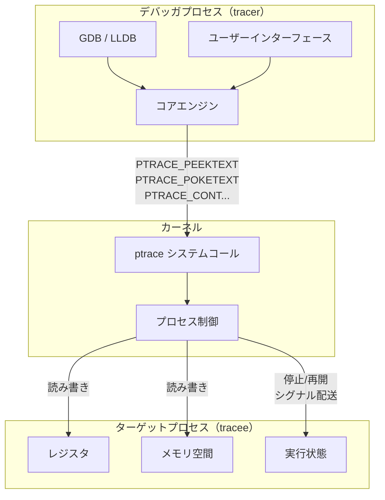
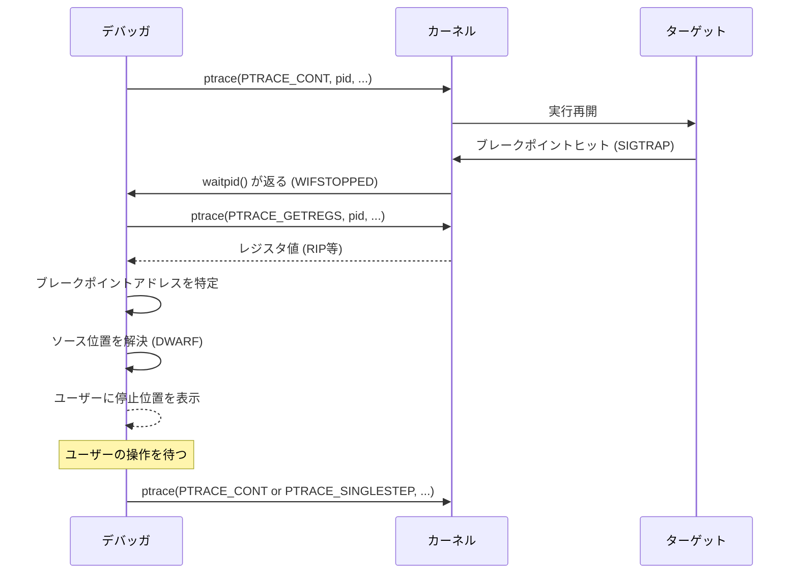
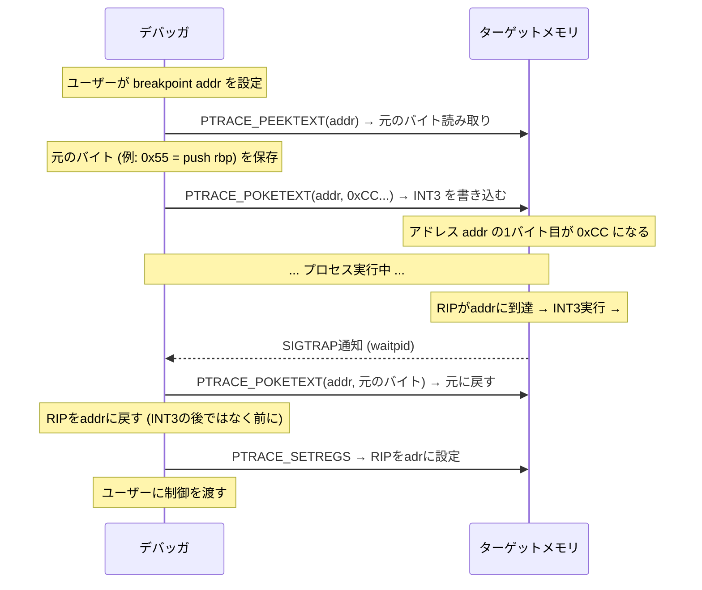
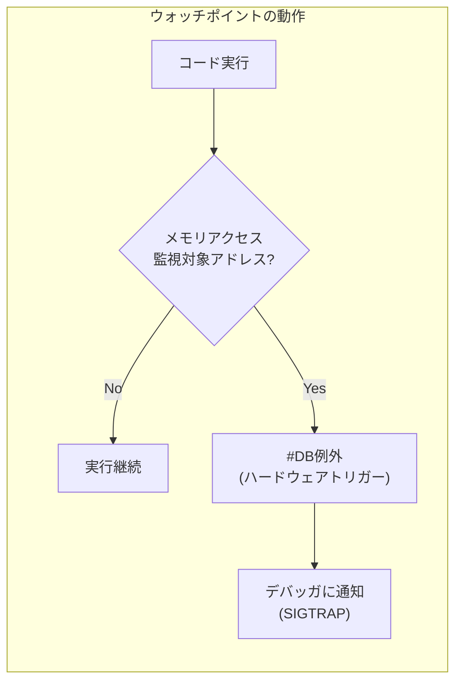
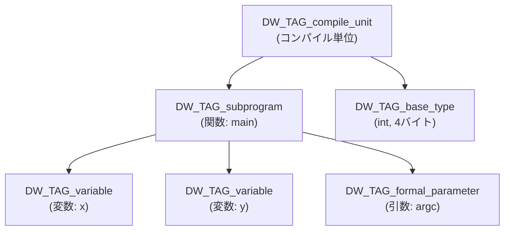
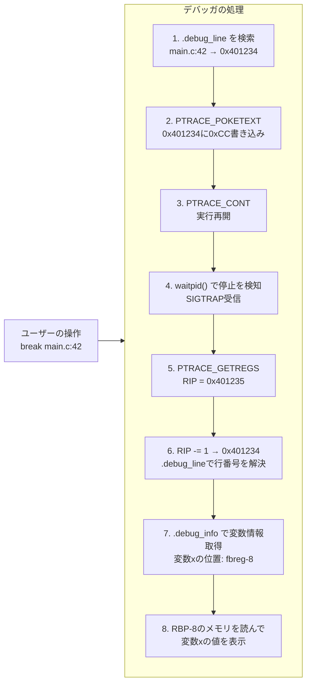
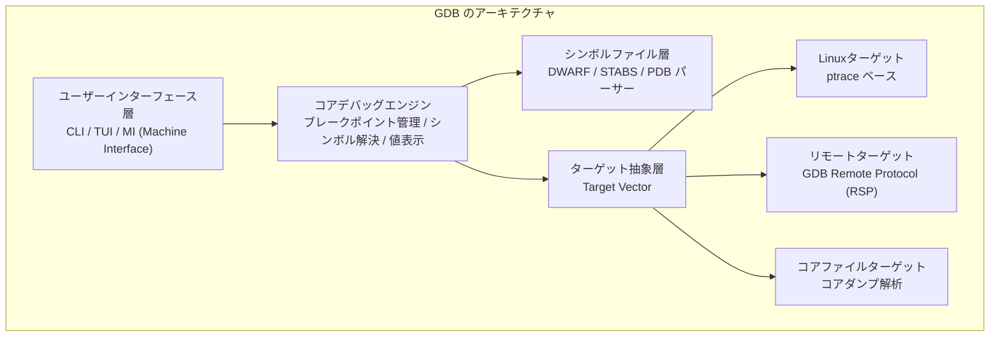
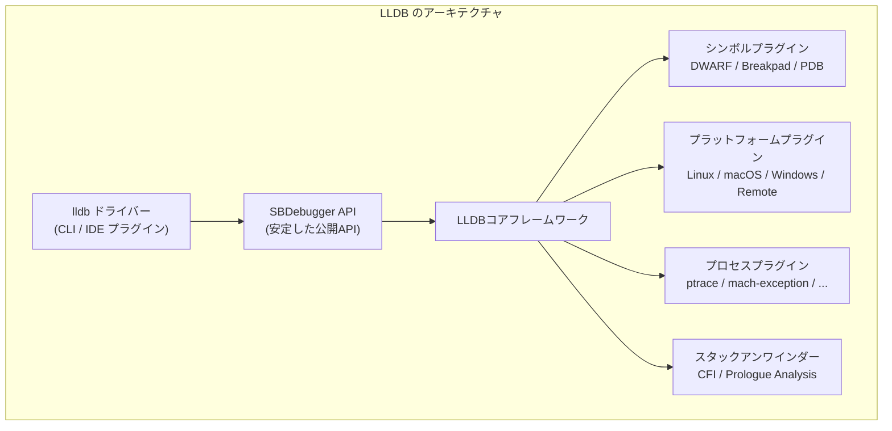
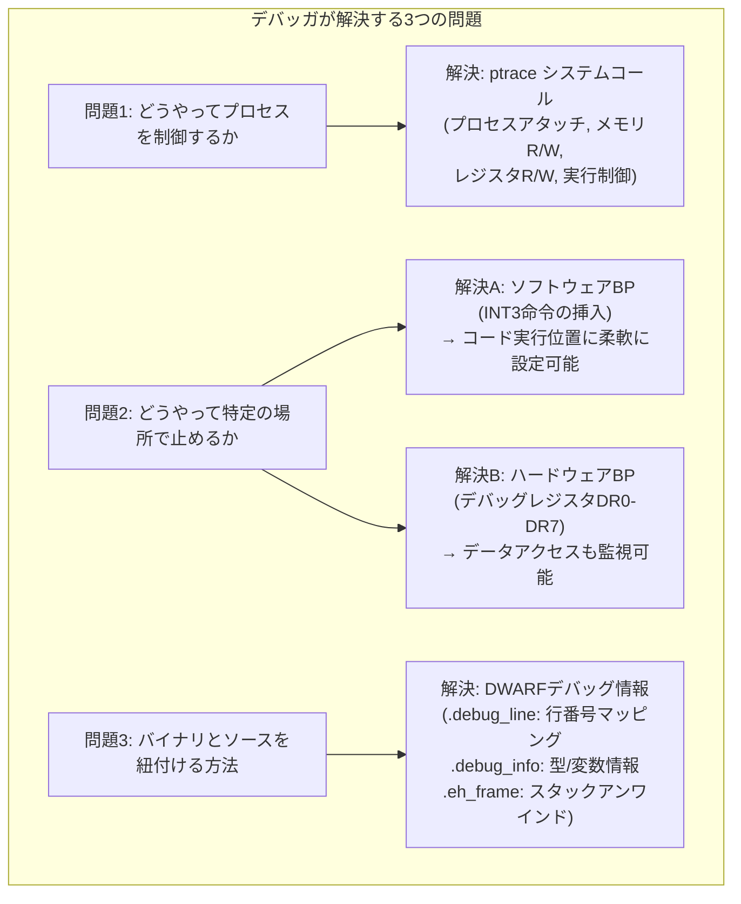

# デバッガの仕組み（ptrace, ブレークポイント, DWARF）

## 1. はじめに — デバッガはなぜ「魔法」のように見えるのか

プログラムが期待通りに動かない。変数の値を確認したい。特定の行で一時停止させたい。スタックトレースを確認したい。こうした場面でデバッガは欠かせないツールである。GDBやLLDBを使えば、実行中のプロセスを自在に操れる。ブレークポイントを設定すれば、その行で実行が止まる。変数名を入力すれば、現在の値が表示される。「次の行へ」と命令すれば、ソースコード上の次の文に進む。

しかし、どのような仕組みでこれが実現されているのかを理解している開発者は少ない。コンパイル後のバイナリはC言語やRustのソースコードを知らないはずである。にもかかわらず、なぜデバッガはソースコードの行番号を知っているのか。なぜ変数名で値を取得できるのか。なぜ特定の行でプロセスを一時停止できるのか。

これらはすべて、複数の精緻なメカニズムの連携によって実現されている。

- **ptrace システムコール** — カーネルが提供するプロセス制御の基盤
- **ブレークポイント** — 命令ストリームへの介入技術
- **DWARF デバッグ情報** — バイナリとソースコードを結ぶメタデータ

本記事では、これらのメカニズムを基礎から丁寧に解説する。最終的には「GDBが `main` 関数にブレークポイントを設定して変数 `x` の値を表示するまでに何が起きているか」を完全に理解できることを目標とする。

なお、本記事では主にLinux/x86-64環境を前提とする。他のプラットフォームでも類似の仕組みが存在するが、具体的なシステムコールやアーキテクチャ固有の詳細はLinuxを基準に説明する。

## 2. デバッガの基本原理 — プロセスへのアタッチと制御

### 2.1 デバッガとターゲットプロセスの関係

デバッガは**デバッガプロセス（debugger）** と**ターゲットプロセス（debuggee）** という2つのプロセスの協調によって動作する。デバッガは特別な権限でターゲットプロセスの実行を監視・制御する。この関係は一般に「トレーサー（tracer）とトレーシー（tracee）」と呼ばれる。



デバッガがターゲットプロセスを制御するための主要な操作は以下の4種類である。

1. **アタッチ（attach）** — 既存のプロセスにデバッガを接続する、またはデバッガ配下でプロセスを起動する
2. **メモリアクセス** — ターゲットプロセスのアドレス空間を読み書きする
3. **レジスタアクセス** — CPUレジスタの値を読み書きする
4. **実行制御** — プロセスの停止・再開・単一ステップ実行を制御する

Linuxでこれらを実現する仕組みが `ptrace` システムコールである。

### 2.2 デバッグの2つのシナリオ

デバッガがターゲットプロセスを制御する方法には2つのシナリオがある。

**シナリオ1: デバッガからプロセスを起動する場合**

```c
// Typical flow when launching a process under a debugger
pid_t pid = fork();
if (pid == 0) {
    // Child process: declare itself as tracee
    ptrace(PTRACE_TRACEME, 0, NULL, NULL);
    execvp(program, args);  // exec stops immediately after loading
} else {
    // Parent process: act as debugger (tracer)
    waitpid(pid, &status, 0);  // wait for the initial stop
    // ... set breakpoints, configure, etc.
    ptrace(PTRACE_CONT, pid, NULL, NULL);
}
```

子プロセスが `PTRACE_TRACEME` を呼び出すと、そのプロセスはトレース対象としてマークされる。その後に `exec` を実行すると、カーネルはプログラムをロードした直後にプロセスを自動的に停止させ、親プロセス（デバッガ）にシグナル（`SIGTRAP`）を送る。

**シナリオ2: 既存のプロセスにアタッチする場合**

```c
// Attach to an already running process
ptrace(PTRACE_ATTACH, target_pid, NULL, NULL);
waitpid(target_pid, &status, 0);  // target process is stopped
// ... interact with the process
ptrace(PTRACE_DETACH, target_pid, NULL, NULL);
```

`PTRACE_ATTACH` を呼び出すと、カーネルはターゲットプロセスに `SIGSTOP` を送り、停止させる。アタッチするにはデバッガプロセスが同じユーザーIDを持つか、`CAP_SYS_PTRACE` ケーパビリティが必要である。

### 2.3 停止とシグナルのループ

デバッガの基本的な動作ループは「停止 → 検査/操作 → 再開」の繰り返しである。



ターゲットプロセスが停止するたびに `waitpid()` が返り、デバッガは停止理由を確認して適切に対応する。停止理由はブレークポイントへの到達、シングルステップの完了、シグナルの受信などさまざまである。

## 3. ptrace システムコール

### 3.1 ptrace の概要

`ptrace` はLinuxカーネルが提供する、プロセスのトレース・制御のためのシステムコールである。シグネチャは以下のとおりである。

```c
#include <sys/ptrace.h>

long ptrace(enum __ptrace_request request, pid_t pid,
            void *addr, void *data);
```

- `request` — 操作の種類（後述する各種 `PTRACE_*` 定数）
- `pid` — ターゲットプロセスのPID
- `addr` — 操作対象のアドレス（操作によって意味が異なる）
- `data` — 送受信するデータ

`ptrace` の設計は1970年代のUnixにまで遡り、現代的な視点では設計上の制約が多い。しかし、後方互換性のために基本的なインターフェースは維持されている。

### 3.2 主要な ptrace リクエスト

**プロセス開始・終了関連**

| リクエスト | 説明 |
|---|---|
| `PTRACE_TRACEME` | 自プロセスをトレース対象として登録 |
| `PTRACE_ATTACH` | 既存プロセスにアタッチ |
| `PTRACE_DETACH` | プロセスからデタッチし実行再開 |

**メモリアクセス**

`PTRACE_PEEKTEXT` と `PTRACE_PEEKDATA` は、ターゲットプロセスのアドレス空間から1ワード（`long`型）を読み取る。

```c
// Read one word (8 bytes on x86-64) from the target process's memory
long word = ptrace(PTRACE_PEEKTEXT, pid, (void*)address, NULL);
```

`PTRACE_POKETEXT` と `PTRACE_POKEDATA` は逆に書き込みを行う。

```c
// Write one word to the target process's memory
ptrace(PTRACE_POKETEXT, pid, (void*)address, (void*)new_word);
```

> [!NOTE]
> `PTRACE_PEEKTEXT` と `PTRACE_PEEKDATA`、`PTRACE_POKETEXT` と `PTRACE_POKEDATA` は、歴史的にテキストセグメント（コード）とデータセグメントを区別していたUnixの名残である。現代のLinuxではこれらは同一の処理を行う。

より効率的なバルクアクセスには `PTRACE_PEEKDATA` を繰り返すか、`/proc/<pid>/mem` ファイルを使う方法もある。

**レジスタアクセス**

```c
#include <sys/user.h>

struct user_regs_struct regs;
// Read all general-purpose registers
ptrace(PTRACE_GETREGS, pid, NULL, &regs);
// Now regs.rip contains the instruction pointer, regs.rsp the stack pointer, etc.

// Modify the instruction pointer and write back
regs.rip = new_address;
ptrace(PTRACE_SETREGS, pid, NULL, &regs);
```

`user_regs_struct` はx86-64のすべての汎用レジスタ、セグメントレジスタ、フラグレジスタ、命令ポインタ（RIP）、スタックポインタ（RSP）などを含む。

浮動小数点レジスタやXMM/YMMレジスタには別途 `PTRACE_GETFPREGS` / `PTRACE_SETFPREGS` を使用する。

**実行制御**

| リクエスト | 説明 |
|---|---|
| `PTRACE_CONT` | 実行を再開する（次のシグナルまたはブレークポイントまで） |
| `PTRACE_SINGLESTEP` | 1命令だけ実行して停止（シングルステップ） |
| `PTRACE_SYSCALL` | 次のシステムコールの入口または出口で停止 |
| `PTRACE_SYSEMU` | システムコールをエミュレートして停止（`strace` 等で使用） |

### 3.3 シングルステップの仕組み

`PTRACE_SINGLESTEP` を発行すると、カーネルはCPUの **TFフラグ（Trap Flag）** をセットしてからプロセスを再開する。TFフラグはx86の EFLAGSレジスタのビット8であり、セットされると1命令の実行ごとにCPUが `#DB`（デバッグ例外）を発生させる。

```
EFLAGS レジスタ:
Bit  31  ...  11   10    9    8    7    6    5   4   3   2   1   0
     OF       OF   DF   IF   TF   SF   ZF  AF  PF  --  CF

TF (Trap Flag) = bit 8:
  0: 通常実行
  1: 各命令実行後にデバッグ例外(#DB)を発生させる
```

カーネルはこのデバッグ例外を `SIGTRAP` シグナルに変換し、デバッガ（ptrace のトレーサー）に通知する。デバッガは `waitpid()` でこれを受け取り、次の処理を行う。

::: details シングルステップとブレークポイントの違い

シングルステップは「1命令ずつ進む」のに対し、ブレークポイントは「特定の場所まで通常速度で実行し、そこで停止する」という違いがある。シングルステップはデバッグには有用だが、非常に低速である。ブレークポイントを使えば特定の場所まで高速に実行でき、そこでだけ停止できる。

実際のデバッガでは、ソースレベルの「次の行へ（next/step）」操作も内部的にはシングルステップだけで実装されているわけではない。次の行のアドレスを計算して一時的なブレークポイントを設定する方が効率的なためである。

:::

### 3.4 ptrace の制限と代替

`ptrace` はシンプルだが、いくつかの制限がある。

- **パフォーマンス** — すべての停止でカーネルとユーザー空間のコンテキストスイッチが発生する。大量のシステムコールをトレースする `strace` は、本来のプロセスより10〜100倍遅くなることがある
- **1対1の制約** — 1つのプロセスに対してトレーサーは1つだけしかアタッチできない
- **スレッドの扱い** — マルチスレッドプロセスの扱いが複雑である

これらの制限を補う仕組みとして、Linux 4.14以降ではより効率的な `PTRACE_SECCOMP_NEW_LISTENER` や、システムコールのフィルタリングのための **seccomp BPF** が利用可能である。GDBは内部的に最適化として `/proc/<pid>/mem` への直接アクセスも組み合わせて使用する。

## 4. ソフトウェアブレークポイント — INT3命令の挿入

### 4.1 ブレークポイントの本質

ブレークポイントとは、「特定のアドレスに到達したときにプロセスを一時停止させ、デバッガに制御を渡す」仕組みである。ソフトウェアブレークポイントは、**ターゲットプロセスのコードを書き換えることで実現される**。

x86アーキテクチャには、デバッグ用に専用設計された命令がある。それが **INT3（Interrupt 3）** 命令、オペコード `0xCC` である。

```
INT3命令:
  オペコード: 0xCC (1バイト)
  動作: CPUがソフトウェア割り込み3を発生させる (#BP例外)
  用途: デバッグ専用のブレークポイント
```

カーネルはこの `#BP` 例外を `SIGTRAP` シグナルに変換し、ptrace で監視しているデバッガに通知する。

### 4.2 ブレークポイントの設定手順

ブレークポイントの設定は以下の手順で行われる。



具体的なコードで見てみよう。

```c
// Data structure to track a breakpoint
typedef struct {
    uintptr_t address;
    uint8_t original_byte;  // the byte replaced by 0xCC
    bool enabled;
} Breakpoint;

// Set a breakpoint at the given address
void set_breakpoint(pid_t pid, Breakpoint *bp) {
    // Read the word containing the target address
    long word = ptrace(PTRACE_PEEKTEXT, pid, (void*)bp->address, NULL);

    // Save the original first byte
    bp->original_byte = (uint8_t)(word & 0xFF);

    // Replace the first byte with INT3 (0xCC)
    long new_word = (word & ~0xFF) | 0xCC;
    ptrace(PTRACE_POKETEXT, pid, (void*)bp->address, (void*)new_word);

    bp->enabled = true;
}

// Handle the breakpoint when the process stops
void handle_breakpoint(pid_t pid, Breakpoint *bp) {
    struct user_regs_struct regs;
    ptrace(PTRACE_GETREGS, pid, NULL, &regs);

    // When INT3 executes, RIP advances by 1 byte past the 0xCC
    // We must rewind RIP to the original instruction address
    regs.rip -= 1;
    ptrace(PTRACE_SETREGS, pid, NULL, &regs);

    // Restore the original byte
    long word = ptrace(PTRACE_PEEKTEXT, pid, (void*)bp->address, NULL);
    long restored_word = (word & ~0xFF) | bp->original_byte;
    ptrace(PTRACE_POKETEXT, pid, (void*)bp->address, (void*)restored_word);

    bp->enabled = false;
}
```

### 4.3 RIPの巻き戻しが必要な理由

INT3命令（`0xCC`）が実行されると、CPUはその命令の**次の**アドレスをスタックにプッシュしてからトラップを発生させる（他のほとんどの例外とは異なり、`#BP`は`INT3`の**次の**命令を指す）。しかしデバッガはブレークポイントのアドレスで停止したとユーザーに見せたい。そのため、RIPを1バイト後退させて元のアドレスに戻す処理が必要となる。

```
実行前:
  addr: 0x401234  [0xCC]  ← INT3を設定済み
                  [0x48]  ← 元の命令の続き
                  ...

INT3実行後（カーネルに通知が来た時点）:
  RIP = 0x401235  ← INT3の「次」を指している

デバッガによるRIPの巻き戻し:
  RIP = 0x401234  ← 元のアドレスに戻す
```

### 4.4 継続的なブレークポイント

一度ヒットしたブレークポイントをもう一度使うには工夫が必要である。元のバイトを復元した後、そのまま再開するとブレークポイントは機能しなくなる。一般的な解決策は以下のとおりである。

1. 元のバイトを復元する
2. シングルステップ（`PTRACE_SINGLESTEP`）で1命令だけ実行する
3. `0xCC` を再度書き込む
4. 実行を再開する

この「シングルステップしてから再挿入」のパターンは、すべての主要なデバッガで採用されている。

::: warning INT3 と INT 3 の違い

`INT3` は1バイト命令（`0xCC`）であり、`INT 3` は2バイト命令（`0xCD 0x03`）とは異なる。デバッグでは必ず1バイトの `0xCC` を使う。これは任意の命令の最初のバイトを1バイトで置換でき、マルチバイト命令の途中にバイトを挿入する必要がないためである。

:::

## 5. ハードウェアブレークポイント — デバッグレジスタ

### 5.1 ハードウェアブレークポイントの動機

ソフトウェアブレークポイントは強力だが、以下のような場合には使えない。

- **自己書き換えコード** — コードが実行時に変更される場合、0xCCを書き込んでも上書きされる可能性がある
- **ROM上のコード** — 書き込みができないメモリ上のコードをデバッグする場合
- **データウォッチポイント** — 特定のメモリアドレスへの**書き込み**または**読み取り**を検出したい場合

これらのケースに対応するのが**ハードウェアブレークポイント**である。x86アーキテクチャはCPUレベルで**デバッグレジスタ（Debug Registers）** を提供している。

### 5.2 デバッグレジスタ DR0〜DR7

x86/x86-64プロセッサは8本のデバッグレジスタを持つ。そのうち主要なものを説明する。

```
デバッグレジスタの構成:

DR0: ブレークポイントアドレス 0
DR1: ブレークポイントアドレス 1
DR2: ブレークポイントアドレス 2
DR3: ブレークポイントアドレス 3
DR4: DR6の別名（DR6と同一）
DR5: DR7の別名（DR7と同一）
DR6: デバッグステータスレジスタ
DR7: デバッグコントロールレジスタ
```

**DR0〜DR3** はブレークポイントのアドレスを保持する。つまり、ハードウェアブレークポイントは同時に最大4つまでしか設定できない。

**DR6（デバッグステータスレジスタ）** はどのブレークポイントがヒットしたかを示す。

```
DR6 ビットフィールド:
  Bit 0 (B0): DR0のアドレス条件がヒット
  Bit 1 (B1): DR1のアドレス条件がヒット
  Bit 2 (B2): DR2のアドレス条件がヒット
  Bit 3 (B3): DR3のアドレス条件がヒット
  Bit 13 (BD): デバッグレジスタへのアクセス検出
  Bit 14 (BS): シングルステップ（TFフラグ）によるトリガー
  Bit 15 (BT): タスクスイッチによるトリガー
```

**DR7（デバッグコントロールレジスタ）** は各ブレークポイントの有効化と条件を設定する。

```
DR7 ビットフィールド（簡略化）:
  Bit 0  (L0): DR0を現在タスクでローカルに有効化
  Bit 1  (G0): DR0をグローバルに有効化
  Bit 2  (L1): DR1をローカルに有効化
  Bit 3  (G1): DR1をグローバルに有効化
  ...（DR2, DR3も同様）...
  Bit 16-17 (R/W0): DR0の条件
    00 = 命令実行時（実行ブレークポイント）
    01 = データ書き込み時（ウォッチポイント）
    10 = I/Oポートアクセス時
    11 = データ読み書き時（ウォッチポイント）
  Bit 18-19 (LEN0): DR0の範囲
    00 = 1バイト
    01 = 2バイト
    10 = 8バイト (64ビットモードのみ)
    11 = 4バイト
```

### 5.3 ハードウェアブレークポイントの設定

デバッグレジスタはOSが管理しており、ユーザー空間から直接アクセスできない。ptrace を通じて設定する。

```c
// Set a hardware breakpoint using debug registers
// dr_index: 0-3 (DR0 to DR3)
// address: the target address
// condition: 0=execute, 1=write, 3=read/write
// size: 0=1byte, 1=2bytes, 2=8bytes, 3=4bytes
void set_hardware_breakpoint(pid_t pid, int dr_index,
                              uintptr_t address, int condition, int size) {
    // Write the address to DRn
    ptrace(PTRACE_POKEUSER, pid,
           offsetof(struct user, u_debugreg[dr_index]),
           (void*)address);

    // Read current DR7
    long dr7 = ptrace(PTRACE_PEEKUSER, pid,
                      offsetof(struct user, u_debugreg[7]), NULL);

    // Enable the breakpoint locally (Ln bit)
    int enable_bit = dr_index * 2;
    dr7 |= (1L << enable_bit);

    // Set condition (R/Wn bits) and size (LENn bits)
    int cond_shift = 16 + dr_index * 4;
    int size_shift = 18 + dr_index * 4;
    dr7 &= ~(3L << cond_shift);
    dr7 |= ((long)condition << cond_shift);
    dr7 &= ~(3L << size_shift);
    dr7 |= ((long)size << size_shift);

    // Write DR7 back
    ptrace(PTRACE_POKEUSER, pid,
           offsetof(struct user, u_debugreg[7]),
           (void*)dr7);
}
```

### 5.4 ウォッチポイント（データブレークポイント）

ウォッチポイントとは、特定のメモリアドレスへのアクセスを監視するブレークポイントである。DR7の R/W フィールドを `01`（書き込み）または `11`（読み書き）に設定することで実現される。



ウォッチポイントは「この変数がどこで書き換えられているか分からない」という問題のデバッグに絶大な威力を発揮する。コードを書き換えることなく、ハードウェアが自動的に監視してくれる。

ただし制約として、同時に使えるウォッチポイント（ハードウェアブレークポイント全体で）は4つまでである。また、監視できるアドレスのアラインメント制約がある（2バイト監視なら2バイト境界、4バイト監視なら4バイト境界のアドレスである必要がある）。

::: tip ソフトウェアウォッチポイント

ハードウェアブレークポイントの4つという制限を超えたい場合、デバッガはシングルステップを使ってすべての命令の後に対象アドレスの値をチェックする「ソフトウェアウォッチポイント」を実装することがある。ただし非常に低速であり、GDBでは `watch` コマンドが可能な限りハードウェアウォッチポイントを使い、枯渇した場合にのみソフトウェアウォッチポイントにフォールバックする。

:::

## 6. DWARF デバッグ情報

### 6.1 デバッグ情報の必要性

ここまでの説明で、ptrace によってターゲットプロセスの任意のアドレスに0xCCを書き込んでブレークポイントを設定できることが分かった。しかし、ユーザーが「`main.c` の42行目にブレークポイントを設定する」と言ったとき、デバッガはどのアドレスを計算するのか。変数 `x` の値を表示するとき、デバッガはどのメモリアドレス（またはレジスタ）を読めばよいのか。

これらの問いに答えるのが**デバッグ情報**である。コンパイラは `-g` オプションが指定されると、バイナリにデバッグ情報を埋め込む。この情報の標準フォーマットが **DWARF（Debugging With Attributed Record Formats）** である。

DWARFはELFバイナリの専用セクション（`.debug_*`）に格納される。主要なセクションは以下のとおりである。

```
ELFバイナリのデバッグセクション:
  .debug_info   — 型、変数、関数などの情報（コアセクション）
  .debug_abbrev — .debug_info の圧縮に使う略語テーブル
  .debug_line   — ソース行番号と機械語アドレスのマッピング
  .debug_frame  — スタックアンワインド情報（古い形式）
  .debug_loc    — 変数の位置情報（レジスタ/メモリ）
  .debug_str    — 文字列テーブル（名前の重複排除）
  .debug_ranges — アドレス範囲の情報
  .eh_frame     — 例外処理用スタックアンワインド情報
```

### 6.2 .debug_info — コアのデバッグ情報

`.debug_info` セクションは **DIE（Debugging Information Entry）** と呼ばれるエントリの木構造で構成される。各DIEはタグ（型を示す）と属性（メタデータ）を持つ。



DIEの例を具体的に見てみよう。以下のC言語コードを仮定する。

```c
// example.c
int add(int a, int b) {
    int result = a + b;
    return result;
}
```

このコードに対して生成される `.debug_info` の内容を `readelf --debug-dump=info` で確認すると、概略以下のような構造になる。

```
DW_TAG_compile_unit
  DW_AT_name : "example.c"
  DW_AT_comp_dir : "/home/user/project"
  DW_AT_language : DW_LANG_C99
  DW_AT_low_pc : 0x401130   ← このCUのコード開始アドレス
  DW_AT_high_pc : 0x401150  ← このCUのコード終了アドレス

  DW_TAG_subprogram
    DW_AT_name : "add"
    DW_AT_low_pc : 0x401130
    DW_AT_high_pc : 0x401150
    DW_AT_type : <ref to int type DIE>

    DW_TAG_formal_parameter
      DW_AT_name : "a"
      DW_AT_type : <ref to int type DIE>
      DW_AT_location : DW_OP_reg5  ← レジスタ RDI に格納

    DW_TAG_formal_parameter
      DW_AT_name : "b"
      DW_AT_type : <ref to int type DIE>
      DW_AT_location : DW_OP_reg4  ← レジスタ RSI に格納

    DW_TAG_variable
      DW_AT_name : "result"
      DW_AT_type : <ref to int type DIE>
      DW_AT_location : DW_OP_fbreg -4  ← スタックフレームのRSP-4

  DW_TAG_base_type
    DW_AT_name : "int"
    DW_AT_byte_size : 4
    DW_AT_encoding : DW_ATE_signed
```

`DW_AT_location` 属性は、変数が現在どこに存在するかを DWARF Expression として記述する。これによりデバッガは変数のアドレスを計算できる。

### 6.3 DWARF Expression と変数の位置

変数の位置は実行中のコンテキストによって変化することがある。特に最適化コンパイルでは、変数がレジスタに載ったり、スタックに退避されたりする。DWARFはこれを **Location Expression** で表現する。

よく使われる DWARF Location Expression の演算子：

```
DW_OP_reg0 〜 DW_OP_reg31  — CPUレジスタ番号で直接指定
DW_OP_fbreg <offset>       — フレームベースレジスタからのオフセット
DW_OP_addr <address>       — 静的アドレス（グローバル変数等）
DW_OP_deref                — スタックトップのアドレスをデリファレンス
DW_OP_plus_uconst <value>  — スタックトップに定数を加算
```

さらに最適化コードでは、変数の位置がコードのアドレス範囲によって変わる。これを **Location List** と呼び、`.debug_loc` セクションに格納される。

```
変数 x の Location List の例:
  [0x401130, 0x401138]: DW_OP_reg0   ← このアドレス範囲ではRAXに格納
  [0x401138, 0x401148]: DW_OP_fbreg -8  ← このアドレス範囲ではスタックに
  [0x401148, 0x401150]: <最適化により存在しない>
```

### 6.4 .debug_line — ソース行番号マッピング

`.debug_line` セクションは、機械語アドレスとソースファイルの行番号のマッピングを保持する。これによりデバッガは「現在の実行位置がソースコードのどこか」を特定できる。

このマッピングは**行番号プログラム（Line Number Program）** と呼ばれる仮想マシンの命令列として格納される。最初に状態機械の初期状態が設定され、オペコードが状態を変化させながら最終的にアドレス→行番号のテーブルを生成する。

```
.debug_line が生成するテーブルの例:

アドレス       ファイル    行   列   is_stmt  is_end_sequence
0x00401130    example.c   1    0    true
0x00401134    example.c   2    4    true
0x00401138    example.c   2    14   false
0x0040113c    example.c   3    5    true
0x00401144    example.c   3    12   false
0x00401148    example.c   4    3    true
0x0040114e    example.c   4    0    true
0x00401150    example.c   4    0    false    true
```

`is_stmt`（is statement）フラグは、その行が文の先頭であることを示し、デバッガはブレークポイントをこの位置に設定することが多い。

デバッガがユーザーから「`example.c` の3行目にブレークポイントを設定せよ」と指示された場合、このテーブルを参照して `is_stmt = true` かつ行番号 = 3 の最初のエントリ `0x0040113c` を見つけ、そのアドレスに `0xCC` を書き込む。

```bash
# Check the line number program with objdump
$ objdump --dwarf=decodedline example
example.dwarf_demo:     file format elf64-x86-64

DWARF Version 5 line data
File name                            Line number    Starting address
example.c                                      1          0x401130
example.c                                      2          0x401134
example.c                                      3          0x40113c
...
```

### 6.5 .debug_frame と .eh_frame — スタックアンワインド

デバッガが「バックトレース（backtrace）」を表示するには、現在のスタックフレームから呼び出し元のフレームを辿る「スタックアンワインド」が必要である。

伝統的なx86では、すべての関数が `push rbp; mov rbp, rsp` というプロローグを持ち、`rbp` をフレームポインタとして使っていた。この場合、`rbp` チェーンを辿ればスタックをアンワインドできる。

しかし現代のコンパイラは最適化のために `-fomit-frame-pointer` を使い、`rbp` をフレームポインタとして使わないことが多い。この場合、スタックアンワインドのために別の仕組みが必要である。それが **CFI（Call Frame Information）** であり、`.debug_frame`（DWARF形式）または `.eh_frame`（C++例外処理用の形式）として格納される。


CFI の核心概念は **CFA（Canonical Frame Address）** である。CFAは「呼び出し元のスタックポインタの値」と定義される。各アドレス範囲に対して、現在のレジスタ値からCFAを計算する式と、各レジスタがどこに保存されているかが記述されている。

```
.debug_frame のCFIテーブルの例（0x401130〜0x401150 の関数）:

アドレス    CFA の計算式         保存レジスタ
0x401130   rsp + 8             return_addr: *(cfa - 8)
0x401131   rsp + 16            return_addr: *(cfa - 8), rbp: *(cfa - 16)
0x401134   rbp + 16            return_addr: *(cfa - 8), rbp: *(cfa - 16)
...（関数本体）...
0x40114e   rsp + 8             return_addr: *(cfa - 8)
```

デバッガはこのテーブルを使って以下の手順でスタックをアンワインドする。

1. 現在のRIPからCFIエントリを検索する
2. CFAを計算する（例: `rsp + 8`）
3. リターンアドレスを取得する（例: `*(cfa - 8)`）
4. 保存されたレジスタを復元する
5. 得られたリターンアドレスを新しいRIPとして、次のフレームへ進む

## 7. ソースレベルデバッグの実現

### 7.1 全体像の統合

ここまで学んだ各要素がどのように組み合わさってソースレベルデバッグを実現するか、具体例で確認しよう。



### 7.2 変数の型と値の表示

DWARFが提供する型情報を使うことで、デバッガはバイト列を人間が読める形式に変換できる。

例えば整数型 `int x = 42` の場合、デバッガは：
1. `.debug_info` から変数 `x` の `DW_AT_location` を取得（例: `DW_OP_fbreg -8`）
2. 現在のフレームポインタ（RBP）の値を取得（例: `0x7fff1040`）
3. アドレス `0x7fff1040 - 8 = 0x7fff1038` のメモリを4バイト読む
4. `DW_AT_type` を参照し、`DW_AT_byte_size = 4`、`DW_ATE_signed` を確認
5. 4バイトのリトルエンディアン整数として解釈して表示

構造体やポインタの場合も同様に、DIEの木構造を再帰的に辿ることで型情報を取得し、適切に表示する。

### 7.3 ステップ実行の実装

ソースレベルの「次の行へ（next）」はどのように実装されるか。

**同じ関数内のステップ実行（next）:**

1. 現在のアドレスから `.debug_line` で現在の行番号を取得する
2. 次の行の先頭アドレスを `.debug_line` から検索する
3. そのアドレスに一時的なブレークポイント（内部的なもの）を設定する
4. 実行を再開する
5. ブレークポイントにヒットしたら一時ブレークポイントを削除する

**関数の中へのステップイン（step）:**

基本的に上記と同じだが、呼び出し先関数の先頭アドレスも考慮する。`PTRACE_SINGLESTEP` を使い、1命令ずつ進めながら行番号の変化を監視する実装もある。

**関数から出るまで実行（finish/step out）:**

1. 現在のフレームのリターンアドレスをCFIで取得する
2. そのアドレスに一時ブレークポイントを設定する
3. 実行を再開する

## 8. GDB と LLDB の内部アーキテクチャ

### 8.1 GDB の構造

GDB（GNU Debugger）は1986年にRichard Stallmanによって書かれ、以来40年近く改良が続いてきた。その内部は大きく以下の層に分かれる。



**Target Vector** は、異なるターゲット（ローカルプロセス、リモートデバッグ、コアダンプ）を統一的に扱うための抽象化レイヤーである。これにより同じコアエンジンで様々な環境のデバッグが可能になる。

**GDB Remote Protocol（RSP）** はGDBがリモートターゲットと通信するためのプロトコルである。組み込み開発では、ターゲットボード上の `gdbserver` とRSPで通信する。QEMUなどのエミュレータもRSPをサポートしており、仮想マシン内のデバッグに使われる。

### 8.2 LLDB の構造

LLDB（Low Level Debugger）はLLVMプロジェクトの一部として2010年頃に開発された。GDBの設計上の問題点を解決するため、当初からAPIファースト・ライブラリファーストの設計を採用した。



LLDBの重要な設計上の特徴はプラグインアーキテクチャである。シンボルパーサー、プロセス制御、プラットフォーム固有の処理はすべてプラグインとして実装されており、新しいプラットフォームへの対応が容易である。

また、LLDBはマルチスレッドデバッグを当初から考慮した設計になっており、GDBよりも複数スレッドの管理が整理されている。

### 8.3 GDB と LLDB の比較

| 特徴 | GDB | LLDB |
|---|---|---|
| 起源 | 1986年、GNU Project | 2010年頃、LLVMプロジェクト |
| ライセンス | GPL v3 | Apache License 2.0 |
| 主な使用プラットフォーム | Linux（特に組み込み） | macOS (Xcode標準), Linux |
| スクリプティング | Python (GDB 7+) | Python (第一級のAPI) |
| アーキテクチャ | モノリシック（改良途中） | プラグインベース |
| リモートデバッグ | GDB RSP | LLDB RSP（互換性あり） |
| LLVM/Clangとの親和性 | 低い | 高い |

どちらも現代のデバッグには十分な機能を持つ。GDBはLinux組み込み開発やサーバーサイドでの実績が豊富であり、LLDBはmacOSおよびXcode環境での標準デバッガとして広く使われている。

## 9. 実装の詳細と落とし穴

### 9.1 最適化コードのデバッグ

コンパイル最適化（`-O2`、`-O3`）が有効な場合、デバッグは大幅に複雑になる。

**変数の最適化消去** — 使われない変数や、次の代入までしか必要ない変数はコードから消去される。DWARFはこれを `DW_AT_location: empty` または Location List の対象範囲外として表現する。デバッガは「変数が最適化されました」と表示する。

**命令の並べ替え** — コンパイラはパフォーマンスのために命令を並べ替える。これにより、1つのソース行が複数のアドレス範囲に対応したり、逆に飛び飛びになったりする。

**インライン展開** — 関数がインライン化されると、呼び出し関数が存在しなくなる。DWARFはこれを `DW_TAG_inlined_subroutine` で表現し、デバッガはバーチャルなスタックフレームを構築して表示する。

```
// With -O2, this might be entirely inlined:
// The debugger shows a "virtual" stack frame for the inlined function
static inline int square(int x) { return x * x; }

int main() {
    int result = square(5);  // After inlining: result = 25; (直接計算)
    ...
}
```

### 9.2 Position Independent Executables と ASLR

現代のLinuxでは **ASLR（Address Space Layout Randomization）** によって、プロセスのメモリアドレスが実行ごとにランダム化される。**PIE（Position Independent Executable）** はASLRに対応するため、すべてのアドレスを相対的に扱う実行ファイル形式である。

デバッガはこれをどう扱うか。バイナリがロードされるとき、カーネルは実際のベースアドレスを決定する。デバッガは `/proc/<pid>/maps` を参照してこのベースアドレスを取得し、DWARFに記録されたオフセットを加算することで実際のアドレスを計算する。

```bash
# Check the actual load address of a PIE binary
$ cat /proc/$(pgrep my_program)/maps | head
555555554000-555555556000 r--p 00000000 08:01 ... /path/to/my_program
555555556000-555555558000 r-xp 00002000 08:01 ... /path/to/my_program
...
# Base address = 0x555555554000
# DWARF offset  = 0x1234
# Actual address = 0x555555554000 + 0x1234 = 0x555555555234
```

### 9.3 マルチスレッドデバッグ

マルチスレッドプロセスのデバッグでは、各スレッドが独立したTID（Thread ID）を持ち、ptrace は個々のスレッドに対して操作を行う。

```c
// When a new thread is created, the debugger receives notification
// via PTRACE_EVENT_CLONE
ptrace(PTRACE_SETOPTIONS, main_pid, NULL,
       PTRACE_O_TRACECLONE | PTRACE_O_TRACEFORK | PTRACE_O_TRACEEXEC);

// The debugger then attaches to each new thread
waitpid(-1, &status, __WALL);  // Wait for any thread/child
if (WIFSTOPPED(status)) {
    if (status >> 8 == (SIGTRAP | (PTRACE_EVENT_CLONE << 8))) {
        unsigned long new_tid;
        ptrace(PTRACE_GETEVENTMSG, pid, NULL, &new_tid);
        // Attach to the new thread
        waitpid(new_tid, NULL, __WALL);
    }
}
```

「あるスレッドがブレークポイントにヒットしたとき、他のスレッドを停止させるか」という問題は「All-stop モード」と「Non-stop モード」として知られる。GDBはデフォルトで All-stop（すべてのスレッドを同時に停止）を使うが、Non-stop モードも選択できる。

## 10. 実践的な理解の確認

### 10.1 `readelf` と `objdump` で DWARF を確認する

実際のバイナリのDWARF情報を確認する方法を示す。

```bash
# Compile with debug info
$ gcc -g -O0 -o example example.c

# Check section headers (look for .debug_* sections)
$ readelf -S example | grep debug
  [28] .debug_aranges    PROGBITS         ...
  [29] .debug_info       PROGBITS         ...
  [30] .debug_abbrev     PROGBITS         ...
  [31] .debug_line       PROGBITS         ...
  [32] .debug_str        PROGBITS         ...
  [33] .debug_line_str   PROGBITS         ...

# Decode line number information
$ readelf --debug-dump=decodedline example

# Show raw DIEs
$ readelf --debug-dump=info example

# Comprehensive DWARF dump via objdump
$ objdump --dwarf=info example | head -100
```

### 10.2 最小限のデバッガを実装する

概念を完全に理解するために、最小限のデバッガを実装してみよう。

```c
// minimal_debugger.c - A minimal debugger showing core concepts
#include <stdio.h>
#include <stdlib.h>
#include <sys/ptrace.h>
#include <sys/wait.h>
#include <sys/user.h>
#include <unistd.h>
#include <stdint.h>

// Set a software breakpoint: replace byte at addr with INT3 (0xCC)
static uint8_t set_breakpoint(pid_t pid, uintptr_t addr) {
    long word = ptrace(PTRACE_PEEKTEXT, pid, (void*)addr, NULL);
    uint8_t orig = (uint8_t)(word & 0xFF);
    // Replace the lowest byte with 0xCC (INT3)
    ptrace(PTRACE_POKETEXT, pid, (void*)addr,
           (void*)((word & ~0xFFL) | 0xCC));
    return orig;
}

// Remove a breakpoint and restore the original byte
static void remove_breakpoint(pid_t pid, uintptr_t addr, uint8_t orig) {
    long word = ptrace(PTRACE_PEEKTEXT, pid, (void*)addr, NULL);
    ptrace(PTRACE_POKETEXT, pid, (void*)addr,
           (void*)((word & ~0xFFL) | orig));
}

int main(int argc, char *argv[]) {
    if (argc < 2) {
        fprintf(stderr, "Usage: %s <program> [args...]\n", argv[0]);
        return 1;
    }

    pid_t pid = fork();
    if (pid == 0) {
        // Child: become tracee
        ptrace(PTRACE_TRACEME, 0, NULL, NULL);
        execvp(argv[1], &argv[1]);
        perror("execvp");
        exit(1);
    }

    // Parent: act as debugger
    int status;
    waitpid(pid, &status, 0);  // Wait for initial SIGTRAP after exec

    if (!WIFSTOPPED(status)) {
        fprintf(stderr, "Unexpected stop\n");
        return 1;
    }

    // Get the current instruction pointer
    struct user_regs_struct regs;
    ptrace(PTRACE_GETREGS, pid, NULL, &regs);
    printf("Process stopped at RIP = 0x%llx\n", regs.rip);

    // Example: set a breakpoint at RIP + 10 (for demonstration only)
    uintptr_t bp_addr = regs.rip + 10;
    uint8_t orig_byte = set_breakpoint(pid, bp_addr);
    printf("Breakpoint set at 0x%lx\n", bp_addr);

    // Continue execution
    ptrace(PTRACE_CONT, pid, NULL, NULL);
    waitpid(pid, &status, 0);

    if (WIFSTOPPED(status) && WSTOPSIG(status) == SIGTRAP) {
        ptrace(PTRACE_GETREGS, pid, NULL, &regs);
        // Rewind RIP by 1 (past the INT3)
        regs.rip -= 1;
        ptrace(PTRACE_SETREGS, pid, NULL, &regs);
        printf("Breakpoint hit! RIP = 0x%llx\n", regs.rip);

        // Restore the original byte
        remove_breakpoint(pid, bp_addr, orig_byte);
    }

    // Let the process finish
    ptrace(PTRACE_CONT, pid, NULL, NULL);
    waitpid(pid, &status, 0);
    printf("Process exited with status %d\n", WEXITSTATUS(status));

    return 0;
}
```

このコードは実際のデバッガの核心部分を150行程度で示している。実際のGDBやLLDBはこれを何十万行にもわたって洗練させたものである。

## 11. まとめ — デバッガが解決する本質的な問題

デバッガの仕組みを俯瞰すると、3つの独立した問題を解決していることが分かる。



デバッガは決して「魔法」ではない。ハードウェアが提供するデバッグ機構（TFフラグ、デバッグレジスタ、INT3命令）、カーネルが提供するプロセス制御機構（ptrace）、そしてコンパイラが生成するデバッグ情報（DWARF）の3つが精緻に組み合わさった工学的な産物である。

これらを理解することで、デバッガの「なぜ動くのか」「なぜ動かないのか」（最適化コードで変数が表示できない、など）を根本から理解できる。また、独自のデバッグツール、パフォーマンスプロファイラ、コードカバレッジツール、動的解析ツールを自作する際の基礎知識となる。現代のサニタイザ（ASan, TSan）や動的バイナリ計装ツール（Valgrind, DynamoRIO）も、これらと同じ原理の上に構築されている。

## 参考資料

- **DWARF Debugging Standard** — https://dwarfstd.org/ （DWARF仕様の公式サイト）
- **Eli Bendersky's blog** — "How debuggers work" シリーズ（ptrace を使ったデバッガ実装の詳解）
- **Linux man page: ptrace(2)** — `man 2 ptrace`（ptrace の完全なリファレンス）
- **Intel 64 and IA-32 Architectures Software Developer's Manual, Vol. 3** — Chapter 17: Debug, Branch Profile, TSC, and Intel® Resource Director Technology Features（デバッグレジスタの仕様）
- **GDB Internals Manual** — https://sourceware.org/gdb/wiki/Internals（GDB内部構造のドキュメント）
- **"Systems Programming" by Jonathan Blow** — LLDB/デバッガアーキテクチャに関する詳細な解説
