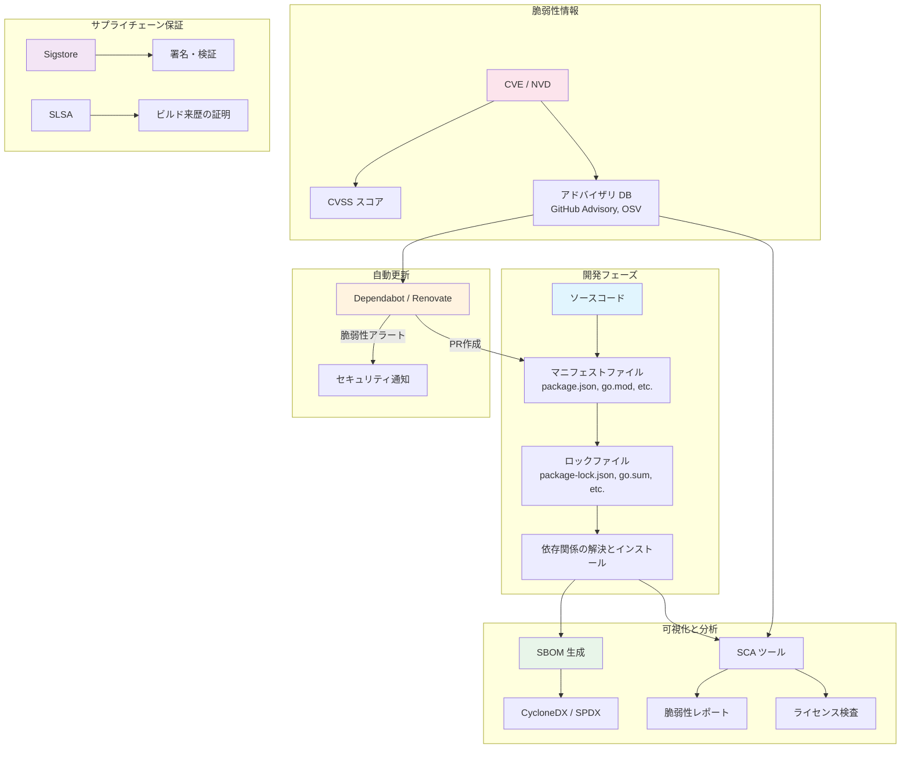
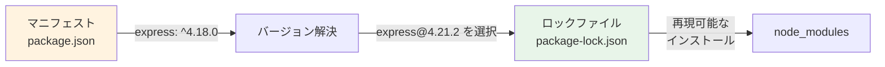
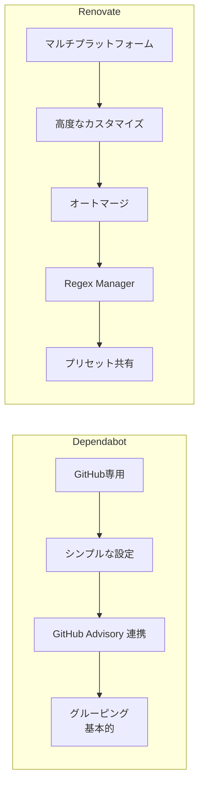
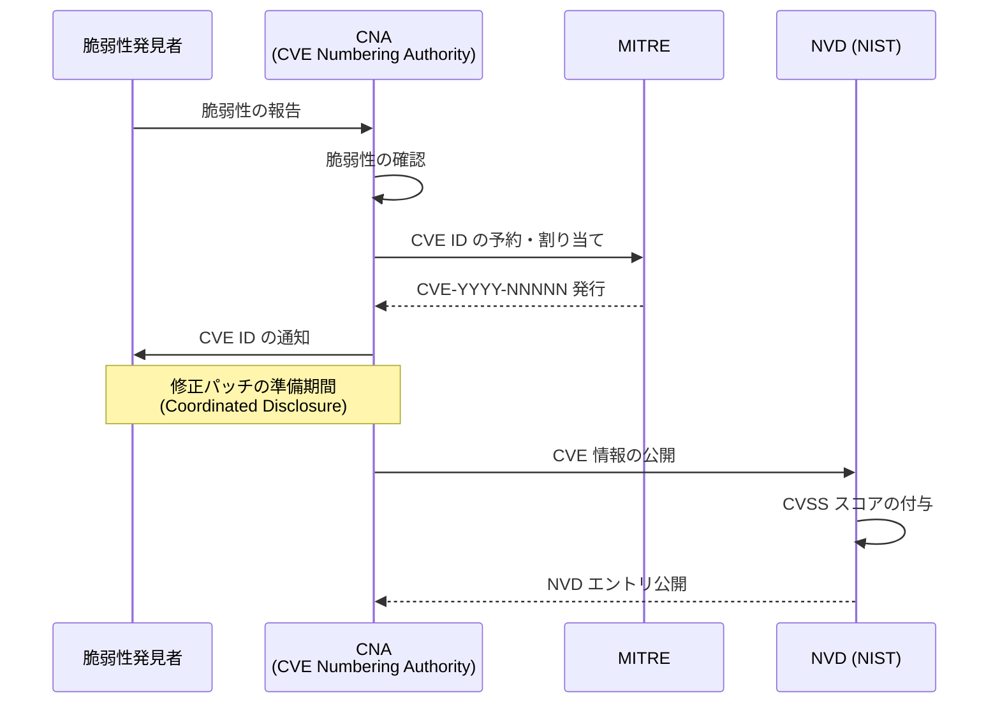
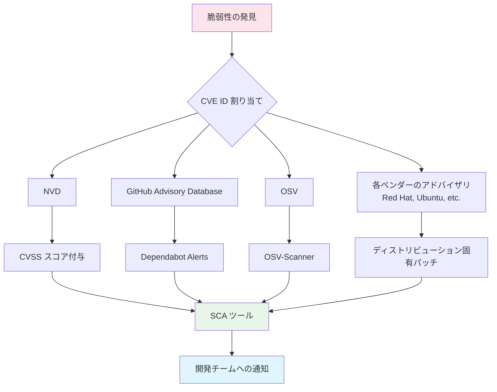
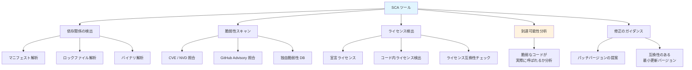
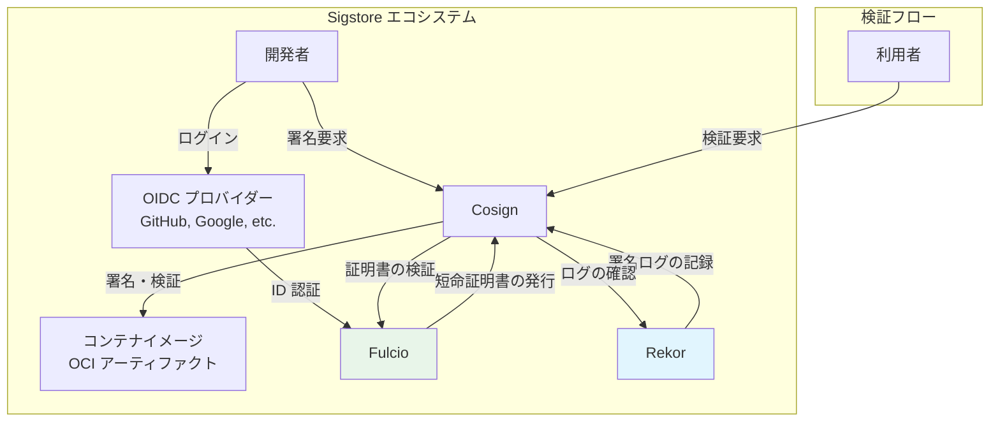
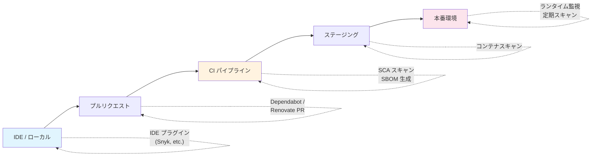
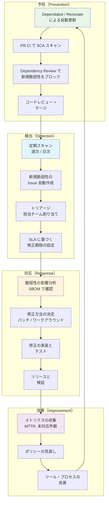
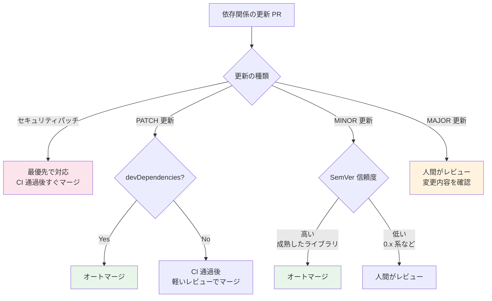

# 依存関係と脆弱性の管理 — Dependabot, Renovate, SBOM, CVE/CVSS

## 1. 依存関係管理の課題と重要性

### 1.1 現代のソフトウェアにおける依存関係の実態

現代のソフトウェアは、驚くほど多くの外部コンポーネントに依存している。典型的なNode.jsのWebアプリケーションでは、`package.json` に明示する直接依存は数十パッケージ程度だが、`node_modules` ディレクトリに実際にインストールされる推移的依存関係（transitive dependencies）を含めると、数百から数千のパッケージに達する。Pythonの機械学習プロジェクトやJavaのエンタープライズアプリケーションでも事情は同様であり、依存グラフは深く広い。

この状況は、生産性の向上と引き換えに、重大なリスクを内包している。依存するパッケージの数が増えるほど、以下の問題が指数関数的に複雑化する。

- **脆弱性の混入リスク**: 依存先のいずれか一つに脆弱性が発見されれば、自分のアプリケーションも影響を受ける
- **互換性の問題**: パッケージ間のバージョン制約が矛盾し、更新が困難になる（dependency hell）
- **メンテナンス放棄**: 依存先のメンテナーが活動を停止し、セキュリティパッチが提供されなくなる
- **ライセンスの複雑化**: 推移的依存関係を含めると、数十種類のライセンスが混在する可能性がある

### 1.2 依存関係が引き起こしたインシデントの歴史

依存関係の管理が不十分であったために発生した重大なセキュリティインシデントは枚挙にいとまがない。

**Equifax情報漏洩事件（2017年）**: Apache Struts 2の既知の脆弱性（CVE-2017-5638）に対するパッチ適用が遅れたため、約1億4,700万人の個人情報が漏洩した。脆弱性の公開からパッチが利用可能になるまでの期間はわずか数日であったが、Equifaxは数か月間パッチを適用しなかった。

**event-stream事件（2018年）**: npmの人気パッケージ `event-stream` のメンテナンス権限が悪意のある第三者に移譲され、暗号通貨ウォレットを標的とする悪意のあるコードが挿入された。このパッケージは週200万回以上ダウンロードされており、影響は甚大であった。

**Log4Shell（2021年）**: Apache Log4j 2の重大な脆弱性（CVE-2021-44228）は、CVSSスコア10.0（最大値）と評価された。Log4jはJavaエコシステムで極めて広く利用されており、直接依存していなくても、推移的依存関係を通じて影響を受けるアプリケーションが多数存在した。多くの組織が「自分たちがLog4jを使っているかどうか」すら即座に把握できなかった。

**xz-utils事件（2024年）**: 広く利用されている圧縮ライブラリxzに、長期間にわたるソーシャルエンジニアリングによりバックドアが仕込まれた。正規のメンテナーとして信頼を獲得した攻撃者が、ビルドプロセスに巧妙に悪意のあるコードを挿入していた。

これらの事件が示すのは、依存関係の管理が単なる「開発の利便性」の問題ではなく、**組織のセキュリティ体制の根幹**に関わる課題であるということである。

### 1.3 依存関係管理の全体像

依存関係と脆弱性の管理は、複数のツールとプロセスが連携して初めて機能する。本記事で扱う要素の関係を以下に示す。



## 2. セマンティックバージョニングとロックファイル

### 2.1 セマンティックバージョニング（SemVer）

依存関係の更新を安全に行うための基盤となるのが、**セマンティックバージョニング**（Semantic Versioning、SemVer）である。SemVerは `MAJOR.MINOR.PATCH` の3つの数値でバージョンを表現し、それぞれの数値に明確な意味を持たせる。

| 要素 | 意味 | 例 |
|------|------|-----|
| MAJOR | 後方互換性のない変更 | `1.0.0` → `2.0.0` |
| MINOR | 後方互換性のある機能追加 | `1.0.0` → `1.1.0` |
| PATCH | 後方互換性のあるバグ修正 | `1.0.0` → `1.0.1` |

パッケージマニフェストでは、依存先のバージョンを**範囲指定**で記述することが一般的である。

```json
{
  "dependencies": {
    "express": "^4.18.0",
    "lodash": "~4.17.21",
    "uuid": "9.0.0"
  }
}
```

- `^4.18.0`（キャレット）: MAJOR固定で、MINOR・PATCHの更新を許容（`>= 4.18.0 < 5.0.0`）
- `~4.17.21`（チルダ）: MAJOR・MINOR固定で、PATCHの更新を許容（`>= 4.17.21 < 4.18.0`）
- `9.0.0`（固定）: 完全に一致するバージョンのみ

SemVerの理念は合理的だが、実際にはすべてのパッケージがSemVerを厳密に遵守しているわけではない。MINORバージョンアップで後方互換性が崩れたり、PATCHリリースに意図しない振る舞いの変更が含まれることは珍しくない。このギャップが、ロックファイルの必要性を生む。

### 2.2 ロックファイルの役割

ロックファイルは、ある時点で実際に解決された依存関係の完全なスナップショットを保持するファイルである。



主要なエコシステムにおけるマニフェストとロックファイルの対応を以下に整理する。

| エコシステム | マニフェスト | ロックファイル |
|------------|------------|-------------|
| npm | `package.json` | `package-lock.json` |
| Yarn | `package.json` | `yarn.lock` |
| pnpm | `package.json` | `pnpm-lock.yaml` |
| pip | `requirements.txt` / `pyproject.toml` | `requirements.txt`（ハッシュ付き） |
| Poetry | `pyproject.toml` | `poetry.lock` |
| Cargo | `Cargo.toml` | `Cargo.lock` |
| Go Modules | `go.mod` | `go.sum` |
| Bundler | `Gemfile` | `Gemfile.lock` |
| Composer | `composer.json` | `composer.lock` |

ロックファイルの運用において重要な原則は以下の通りである。

1. **ロックファイルは必ずバージョン管理に含める**: チーム全員が同一の依存バージョンで開発することを保証する
2. **CIでもロックファイルに基づいてインストールする**: `npm ci`（`npm install` ではなく）を使用し、ロックファイルの内容を厳密に再現する
3. **ロックファイルの手動編集は避ける**: パッケージマネージャのコマンドを通じて更新する

### 2.3 ロックファイルとセキュリティ

ロックファイルは再現性だけでなく、セキュリティの観点でも重要な役割を果たす。

**パッケージの整合性検証**: 多くのロックファイルにはパッケージのハッシュ値（integrity hash）が記録されている。インストール時にダウンロードしたパッケージのハッシュと照合することで、改ざんの検知が可能になる。

```json
// excerpt from package-lock.json
{
  "node_modules/express": {
    "version": "4.21.2",
    "resolved": "https://registry.npmjs.org/express/-/express-4.21.2.tgz",
    "integrity": "sha512-28HqgMZAmih1Czt9ny7qr6ek2qddF4FclbMzwhCREB6OFfH+rXAnuNCwo1/wFvrtbgsQDb4kSbX9de9lFbrXA=="
  }
}
```

Go Modulesの `go.sum` も同様に、モジュールのハッシュを記録し、サプライチェーン攻撃に対する防御線として機能する。

## 3. 自動更新ツール — Dependabot と Renovate

### 3.1 手動更新の限界

依存関係を手動で更新する運用には、深刻な問題がある。

- **忘れがち**: 日常の開発タスクに追われ、依存関係の更新は後回しになりやすい
- **恐怖心**: 更新によるブレイキングチェンジが怖くて、更新を避ける心理が働く
- **把握不能**: 数百の依存のうちどれに更新があるかを人手で追跡するのは非現実的
- **パッチの遅延**: セキュリティパッチの存在に気づかず、脆弱な状態が長期間続く

自動更新ツールは、これらの課題を解決する。定期的に依存関係の更新を検出し、プルリクエスト（PR）として提出することで、更新を開発ワークフローの一部に組み込む。

### 3.2 Dependabot

Dependabotは、GitHubが提供する依存関係の自動更新サービスである。元々は独立したサービスとして運営されていたが、2019年にGitHubに買収され、現在はGitHubの機能として統合されている。

Dependabotは大きく分けて2つの機能を提供する。

1. **Dependabot Alerts**: 既知の脆弱性を含む依存関係を検出し、アラートを通知する
2. **Dependabot Version Updates**: 新しいバージョンが利用可能な依存関係に対して、自動的にPRを作成する

設定は `.github/dependabot.yml` で行う。

```yaml
# .github/dependabot.yml
version: 2
updates:
  # npm dependencies
  - package-ecosystem: "npm"
    directory: "/"
    schedule:
      interval: "weekly"
      day: "monday"
      time: "09:00"
      timezone: "Asia/Tokyo"
    open-pull-requests-limit: 10
    reviewers:
      - "security-team"
    labels:
      - "dependencies"
      - "automated"
    # Group minor and patch updates together
    groups:
      production-dependencies:
        patterns:
          - "*"
        update-types:
          - "minor"
          - "patch"

  # Docker base images
  - package-ecosystem: "docker"
    directory: "/"
    schedule:
      interval: "weekly"

  # GitHub Actions
  - package-ecosystem: "github-actions"
    directory: "/"
    schedule:
      interval: "weekly"
```

Dependabotの主な特徴は以下の通りである。

- **GitHub統合**: GitHubリポジトリに対してネイティブに動作し、追加のインフラは不要
- **セキュリティアドバイザリとの連携**: GitHub Advisory Databaseと連携し、脆弱性のあるバージョンに対して即座にアラートとPRを生成
- **幅広いエコシステムのサポート**: npm、pip、Maven、Gradle、Cargo、Go Modules、Docker、GitHub Actions、Terraform など多数
- **グルーピング機能**: 関連する更新をまとめて1つのPRにグループ化できる

### 3.3 Renovate

Renovateは、Mend（旧WhiteSource）が開発するオープンソースの依存関係自動更新ツールである。GitHub、GitLab、Bitbucket、Azure DevOps など複数のプラットフォームに対応し、Dependabotよりも高度なカスタマイズが可能である。

設定は `renovate.json` で行う。

```json5
// renovate.json
{
  "$schema": "https://docs.renovatebot.com/renovate-schema.json",
  "extends": [
    "config:recommended",
    "group:monorepos",
    "group:recommended",
    ":separateMajorMinor",
    ":prHourlyLimitNone"
  ],
  "timezone": "Asia/Tokyo",
  "schedule": ["before 9am on Monday"],
  "labels": ["dependencies"],
  "packageRules": [
    {
      "matchUpdateTypes": ["minor", "patch"],
      "matchCurrentVersion": "!/^0/",
      "automerge": true,
      "automergeType": "pr",
      "platformAutomerge": true
    },
    {
      "matchPackagePatterns": ["eslint"],
      "groupName": "eslint",
      "automerge": true
    },
    {
      "matchDepTypes": ["devDependencies"],
      "automerge": true
    },
    {
      "matchUpdateTypes": ["major"],
      "labels": ["dependencies", "breaking-change"],
      "automerge": false
    }
  ],
  "vulnerabilityAlerts": {
    "enabled": true,
    "labels": ["security"],
    "schedule": ["at any time"]
  }
}
```

Renovateの際立った特徴を以下に挙げる。

- **プリセットによる設定の共有**: `config:recommended` のようなプリセットを継承でき、組織全体で統一した設定を適用しやすい
- **高度なグルーピング**: モノレポ内のパッケージや関連パッケージを自動的にグループ化
- **オートマージ**: CI が通ったminor/patchの更新を自動でマージする設定が可能
- **Regex Manager**: 正規表現で任意のファイル内のバージョン文字列を検出・更新できるため、Dockerfile内のバージョン指定やカスタム設定ファイルにも対応
- **ダッシュボード Issue**: 保留中の更新や却下されたPRの状態をGitHub Issueとして一覧表示

### 3.4 Dependabot vs Renovate の比較



| 観点 | Dependabot | Renovate |
|------|------------|----------|
| プラットフォーム | GitHub のみ | GitHub, GitLab, Bitbucket, Azure DevOps |
| ホスティング | GitHub SaaS | SaaS / セルフホスト |
| 設定の複雑さ | シンプル | 高度（学習コスト高） |
| オートマージ | GitHub native auto-merge 利用 | 組み込みサポート |
| グルーピング | 基本的 | 高度（モノレポ対応） |
| Regex による検出 | 不可 | 可能 |
| 設定の共有 | 不可 | プリセットで可能 |
| 脆弱性アラート | GitHub Advisory 統合 | 複数ソース対応 |
| コスト | 無料（GitHub） | 無料（OSS / SaaS） |

実務的な選択基準として、GitHubのみを使用し設定の簡潔さを重視する場合はDependabotが適しており、複数プラットフォームにまたがるプロジェクトや高度な自動化を求める場合はRenovateが優れている。

## 4. CVE / CVSS / NVD — 脆弱性の識別と評価

### 4.1 CVE（Common Vulnerabilities and Exposures）

CVEは、公開されたセキュリティ脆弱性に対して一意の識別子を付与する仕組みである。MITRE Corporationが運営し、米国国立標準技術研究所（NIST）が管理するNational Vulnerability Database（NVD）と密接に連携している。

CVE識別子は `CVE-年-番号` の形式をとる。

```
CVE-2021-44228  (Log4Shell)
CVE-2017-5638   (Apache Struts 2 RCE)
CVE-2024-3094   (xz-utils backdoor)
CVE-2014-0160   (Heartbleed)
```

CVEの割り当てプロセスは以下の通りである。



CNA（CVE Numbering Authority）とは、CVE IDを割り当てる権限を持つ組織であり、MITRE自身の他に、Microsoft、Google、Red Hat、GitHub などの主要ベンダーがCNAとして活動している。

### 4.2 CVSS（Common Vulnerability Scoring System）

CVSSは、脆弱性の深刻度を定量的に評価するための標準的なスコアリングシステムである。現在はバージョン4.0（2023年公開）が最新だが、実務ではCVSS v3.1が依然として広く使われている。

CVSS v3.1のスコアは0.0から10.0の範囲で表現され、以下の定性的な評価に対応する。

| スコア | 深刻度 | 対応の目安 |
|--------|--------|-----------|
| 0.0 | なし | — |
| 0.1–3.9 | Low | 通常のリリースサイクルで対応 |
| 4.0–6.9 | Medium | 次回のリリースまでに対応 |
| 7.0–8.9 | High | 優先的に対応 |
| 9.0–10.0 | Critical | 即座に対応 |

CVSSスコアは3つのメトリクスグループで構成される。

**Base Metrics（基本メトリクス）**: 脆弱性の固有の特性を評価する。攻撃ベクター（AV）、攻撃の複雑さ（AC）、必要な権限（PR）、ユーザ操作の要否（UI）、機密性への影響（C）、完全性への影響（I）、可用性への影響（A）などの項目がある。

**Temporal Metrics（時間的メトリクス）**: 脆弱性の現在の状態を反映する。エクスプロイトの成熟度、修正の利用可能性、脆弱性情報の信頼性などが含まれる。

**Environmental Metrics（環境メトリクス）**: 組織固有の環境における影響を反映する。影響を受けるシステムの重要度や緩和策の有無などが含まれる。

以下に、Log4Shell（CVE-2021-44228）のCVSSベクター文字列を例示する。

```
CVSS:3.1/AV:N/AC:L/PR:N/UI:N/S:C/C:H/I:H/A:H
```

この文字列は以下のように解読できる。

- `AV:N` — Attack Vector: Network（ネットワーク経由で攻撃可能）
- `AC:L` — Attack Complexity: Low（攻撃の複雑さが低い）
- `PR:N` — Privileges Required: None（権限不要）
- `UI:N` — User Interaction: None（ユーザ操作不要）
- `S:C` — Scope: Changed（影響範囲が変化する）
- `C:H` — Confidentiality: High（機密性への影響が高い）
- `I:H` — Integrity: High（完全性への影響が高い）
- `A:H` — Availability: High（可用性への影響が高い）

結果としてスコアは10.0（Critical）となる。

### 4.3 NVD（National Vulnerability Database）

NVDは、NISTが管理する脆弱性情報のデータベースであり、CVEに対してCVSSスコア、影響を受けるソフトウェアの構成（CPE：Common Platform Enumeration）、参考リンクなどの詳細情報を付与する。NVDはAPIを提供しており、セキュリティツールが脆弱性情報をプログラム的に取得するための主要なデータソースとなっている。

しかし、NVDには運用上の課題も存在する。2024年以降、NVDの処理能力がCVEの発行ペースに追いつかず、多くのCVEが分析待ち（Awaiting Analysis）の状態に置かれる事態が発生した。この遅延により、NVDのCVSSスコアが付与されるまでに数週間かかるケースも報告されている。

### 4.4 その他の脆弱性データベース

NVDの課題を補完するため、複数の脆弱性データベースが運用されている。

- **GitHub Advisory Database**: GitHubが管理し、GitHub上のプロジェクトに関連する脆弱性情報を提供。Dependabotのデータソースとなっている
- **OSV（Open Source Vulnerabilities）**: Googleが主導するオープンソース脆弱性のデータベース。OSV Schemaという標準フォーマットを採用
- **GHSA（GitHub Security Advisory）**: GitHubが独自に発行するセキュリティアドバイザリ。CVEとは別に `GHSA-xxxx-xxxx-xxxx` 形式のIDが付与される



## 5. SBOM（Software Bill of Materials）

### 5.1 SBOMとは何か

SBOM（Software Bill of Materials）は、ソフトウェアを構成するすべてのコンポーネントを列挙した「部品表」である。製造業においてBOM（部品表）がその製品に含まれるすべての部品・材料を列挙するのと同様に、SBOMはソフトウェアに含まれるすべてのライブラリ、フレームワーク、ツールを一覧化する。

SBOMが注目されるようになった直接的な契機は、2021年の米国大統領令14028号「国家のサイバーセキュリティ改善」である。この大統領令は、連邦政府に販売されるソフトウェアにSBOMの提供を求めるものであり、SBOMの普及を加速させた。

SBOMに含まれるべき最低限の情報（NTIA minimum elements）は以下の通りである。

- **サプライヤー名**: コンポーネントの提供者
- **コンポーネント名**: パッケージやライブラリの名前
- **バージョン**: 使用されているバージョン
- **一意の識別子**: パッケージURL（purl）等
- **依存関係**: 他のコンポーネントとの関係
- **SBOMの作成者**: SBOMを生成した組織やツール
- **タイムスタンプ**: SBOMが作成された日時

### 5.2 SBOMフォーマット

SBOMには主に2つの標準フォーマットが存在する。

**SPDX（Software Package Data Exchange）**: Linux Foundationが策定した標準であり、ISO/IEC 5962:2021として国際標準化されている。ライセンス情報の表現に優れ、コンプライアンスの文脈で広く利用されている。

**CycloneDX**: OWASP（Open Worldwide Application Security Project）が策定した標準であり、セキュリティの観点を重視した設計となっている。脆弱性情報やサービス構成の表現に優れる。

```json
// CycloneDX SBOM example (JSON format, simplified)
{
  "bomFormat": "CycloneDX",
  "specVersion": "1.5",
  "serialNumber": "urn:uuid:3e671687-395b-41f5-a30f-a58921a69b79",
  "version": 1,
  "metadata": {
    "timestamp": "2026-03-02T00:00:00Z",
    "component": {
      "type": "application",
      "name": "my-web-app",
      "version": "1.0.0"
    }
  },
  "components": [
    {
      "type": "library",
      "name": "express",
      "version": "4.21.2",
      "purl": "pkg:npm/express@4.21.2",
      "licenses": [
        {
          "license": {
            "id": "MIT"
          }
        }
      ],
      "hashes": [
        {
          "alg": "SHA-256",
          "content": "a1b2c3d4e5f6..."
        }
      ]
    },
    {
      "type": "library",
      "name": "lodash",
      "version": "4.17.21",
      "purl": "pkg:npm/lodash@4.17.21",
      "licenses": [
        {
          "license": {
            "id": "MIT"
          }
        }
      ]
    }
  ],
  "dependencies": [
    {
      "ref": "pkg:npm/my-web-app@1.0.0",
      "dependsOn": [
        "pkg:npm/express@4.21.2",
        "pkg:npm/lodash@4.17.21"
      ]
    }
  ]
}
```

### 5.3 SBOMの生成ツール

SBOMを生成するための代表的なツールを以下に挙げる。

| ツール | 対応フォーマット | 特徴 |
|--------|---------------|------|
| Syft（Anchore） | SPDX, CycloneDX | コンテナイメージ・ファイルシステムから生成 |
| Trivy（Aqua Security） | SPDX, CycloneDX | 脆弱性スキャンとSBOM生成を統合 |
| cdxgen | CycloneDX | 多言語対応、CI/CD向け |
| SPDX Tools | SPDX | 公式リファレンス実装 |
| Microsoft SBOM Tool | SPDX | Microsoft製、大規模プロジェクト向け |

コンテナイメージからSBOMを生成する例を示す。

```bash
# Generate SBOM from a container image using Syft
syft packages alpine:3.19 -o cyclonedx-json > sbom.json

# Generate SBOM from a project directory
syft dir:. -o spdx-json > sbom-spdx.json

# Generate SBOM and scan for vulnerabilities using Trivy
trivy image --format cyclonedx --output sbom.json my-app:latest
trivy sbom sbom.json
```

### 5.4 SBOMの活用場面

SBOMは生成するだけでは意味がなく、具体的なユースケースに紐づけて活用することが重要である。

**脆弱性の影響範囲の特定**: Log4Shellのような脆弱性が公開された際に、「自組織のどのアプリケーションが影響を受けるか」を即座に特定できる。SBOMがなければ、すべてのリポジトリを個別に調査する必要があり、対応に数日から数週間を要しうる。

**ライセンスコンプライアンス**: 使用しているすべてのコンポーネントのライセンスを把握し、GPL汚染やライセンス違反のリスクを管理できる。

**調達と監査**: ソフトウェアの購入者や規制当局に対して、ソフトウェアの構成を透明に開示できる。

**インシデント対応**: セキュリティインシデント発生時に、影響を受けるコンポーネントのバージョンを迅速に特定し、対応の優先順位付けを支援する。

## 6. SCA（Software Composition Analysis）

### 6.1 SCAとは

SCA（Software Composition Analysis）は、ソフトウェアに含まれるオープンソースコンポーネントを識別し、それらの既知の脆弱性、ライセンス、コード品質などを分析するプロセスおよびツールの総称である。

SCAツールは一般的に以下の機能を提供する。



### 6.2 到達可能性分析（Reachability Analysis）

SCAの高度な機能として注目されているのが**到達可能性分析**である。依存関係に脆弱性が存在しても、アプリケーションのコードがその脆弱な関数やメソッドを実際に呼び出していなければ、現実的なリスクは低い。到達可能性分析は、コールグラフを解析して「脆弱なコードパスが実際にアプリケーションから到達可能か」を判定する。

これにより、CVSSスコアだけでは判断できない**実効的なリスク**を評価でき、修正の優先順位をより正確に決定できる。

たとえば、あるライブラリにCriticalな脆弱性が報告されていても、アプリケーションがそのライブラリの脆弱な機能を一切使用していなければ、対応の優先度を下げることが合理的である。

### 6.3 主要なSCAツール

| ツール | 特徴 | 提供形態 |
|--------|------|---------|
| Snyk | 開発者体験重視、IDE統合、豊富な修正提案 | SaaS（無料枠あり） |
| Trivy | コンテナ・IaC・ファイルシステムの統合スキャン | OSS |
| Grype（Anchore） | Syftと連携、SBOM入力対応 | OSS |
| OWASP Dependency-Check | Java/NETに強い、NVDベース | OSS |
| Mend（旧WhiteSource） | エンタープライズ向け、ポリシー管理 | SaaS |
| Socket | サプライチェーン攻撃の検出に特化 | SaaS |
| OSV-Scanner（Google） | OSVデータベースベース、軽量 | OSS |

Trivyによるスキャンの実行例を示す。

```bash
# Scan a project directory for vulnerabilities
trivy fs --severity HIGH,CRITICAL .

# Scan a container image
trivy image --severity HIGH,CRITICAL my-app:latest

# Scan with SBOM input
trivy sbom --severity HIGH,CRITICAL sbom.json

# Output in JSON format for CI/CD integration
trivy fs --format json --output results.json .
```

### 6.4 偽陽性と偽陰性の問題

SCAツールの実運用において避けて通れないのが、偽陽性（false positive）と偽陰性（false negative）の問題である。

**偽陽性の要因**:
- 脆弱なバージョンのパッケージを依存しているが、脆弱な機能を使用していない
- ディストリビューション固有のパッチが適用済みだが、バージョン番号では検出されてしまう
- テスト用の依存関係（devDependencies）に対する警告が本番環境のリスクとして報告される

**偽陰性の要因**:
- NVDへの登録が遅れている脆弱性
- バンドルされた依存関係（vendorディレクトリに含まれるもの）の未検出
- CPE（Common Platform Enumeration）のマッピングが不正確

偽陽性を適切に管理するため、多くのSCAツールは脆弱性の抑制（suppression）や無視リスト（ignore list）の機能を提供している。ただし、この機能の乱用は偽陰性を増やすことに繋がるため、抑制理由の記録と定期的な見直しが必要である。

## 7. サプライチェーンセキュリティ — Sigstore と SLSA

### 7.1 サプライチェーンセキュリティの課題

ソフトウェアサプライチェーン攻撃は、近年急速に増加している脅威である。依存関係の脆弱性管理が「既知の問題に対する防御」であるのに対し、サプライチェーンセキュリティはさらに踏み込んで「ソフトウェアの出所と改ざんの有無を検証する」ことを目指す。

具体的には、以下の問いに答えることが求められる。

- このソフトウェアは、主張されているソースコードから本当にビルドされたのか？
- ビルドプロセスは改ざんされていないか？
- パッケージは公開から取得までの間に改ざんされていないか？

### 7.2 Sigstore

Sigstoreは、ソフトウェアの成果物（artifacts）に対する**署名・検証・透明性**を提供するためのオープンソースプロジェクトである。Linux Foundationの下で運営され、Google、Red Hat、GitHub などが参加している。

Sigstoreの主要コンポーネントは以下の通りである。



**Cosign**: コンテナイメージやその他のOCIアーティファクトに対する署名と検証を行うCLIツール。

```bash
# Sign a container image (keyless signing with OIDC)
cosign sign my-registry.io/my-app:v1.0.0

# Verify a container image signature
cosign verify my-registry.io/my-app:v1.0.0

# Sign a blob (arbitrary file)
cosign sign-blob --output-signature sig.txt artifact.tar.gz

# Verify a blob
cosign verify-blob --signature sig.txt artifact.tar.gz
```

**Fulcio**: 短命（短寿命）のコード署名証明書を発行する認証局（CA）。開発者はOIDCプロバイダー（GitHub、Google等）で認証を行い、Fulcioから証明書を受け取る。証明書の有効期間は数分間と極めて短く、長期的な鍵管理の負担を排除する。

**Rekor**: 署名イベントを記録する改ざん防止の透明性ログ。Certificate Transparencyと同様の仕組みで、すべての署名が公開ログに記録され、後から監査できる。

Sigstoreの革新的な点は、**キーレス署名（keyless signing）**を実現したことにある。従来のコード署名では、開発者が秘密鍵を安全に管理する必要があったが、これは大きな運用負担であった。Sigstoreでは、OIDC認証に基づいて短命の証明書が発行されるため、開発者が長期的な鍵を管理する必要がない。

### 7.3 SLSA（Supply-chain Levels for Software Artifacts）

SLSA（「サルサ」と読む）は、ソフトウェアサプライチェーンの完全性を段階的に保証するためのフレームワークである。Googleが開発し、OpenSSF（Open Source Security Foundation）の下で標準化が進められている。

SLSAは4段階のレベルを定義している。

| レベル | 要件 | 概要 |
|--------|------|------|
| SLSA 1 | ビルド来歴（Provenance）の存在 | ビルドプロセスに関する文書が存在する |
| SLSA 2 | ホスティングされたビルドサービス | 信頼できるビルドサービスで生成された来歴 |
| SLSA 3 | 耐改ざんビルド | ビルドプラットフォームが来歴の改ざんを防止 |
| SLSA 4 | 二者レビューと再現可能ビルド | すべての変更が二者によりレビューされ、ビルドが再現可能 |

SLSAの中核概念は**ビルド来歴（Provenance）**である。来歴とは、「このアーティファクトがどのソースコードから、どのビルドシステムで、どのようなパラメータでビルドされたか」を証明する署名付きのメタデータである。

GitHub Actionsでは、SLSA Level 3のビルド来歴を生成するための公式のGitHub Actionsが提供されている。

```yaml
# .github/workflows/release.yml
name: Release with SLSA Provenance

on:
  push:
    tags:
      - 'v*'

permissions:
  id-token: write    # Required for OIDC
  contents: write    # Required for release
  attestations: write

jobs:
  build:
    runs-on: ubuntu-latest
    steps:
      - uses: actions/checkout@v4

      - name: Build artifact
        run: |
          # Build commands here
          npm ci
          npm run build
          tar -czf dist.tar.gz dist/

      - name: Generate SLSA provenance
        uses: actions/attest-build-provenance@v2
        with:
          subject-path: 'dist.tar.gz'
```

### 7.4 npm provenance

npm（v9.5.0以降）は、パッケージの公開時にSLSA準拠のビルド来歴を自動的に生成・公開する機能（npm provenance）を提供している。GitHub Actionsからパッケージを公開する際に `--provenance` フラグを付けることで、パッケージがどのリポジトリのどのコミットからビルドされたかを証明できる。

```yaml
# .github/workflows/publish.yml
jobs:
  publish:
    runs-on: ubuntu-latest
    permissions:
      id-token: write  # Required for provenance
    steps:
      - uses: actions/checkout@v4
      - uses: actions/setup-node@v4
        with:
          node-version: '20'
          registry-url: 'https://registry.npmjs.org'
      - run: npm ci
      - run: npm publish --provenance --access public
        env:
          NODE_AUTH_TOKEN: ${{ secrets.NPM_TOKEN }}
```

npmレジストリ上で来歴が確認でき、パッケージの利用者は「このパッケージが本当にGitHub上の特定のコミットからビルドされたものか」を検証できる。

## 8. CI/CDパイプラインへの統合

### 8.1 シフトレフトの原則

脆弱性の発見は、開発ライフサイクルの早い段階で行うほど修正コストが低い。これを**シフトレフト**（Shift Left）と呼ぶ。CIパイプラインに脆弱性スキャンを組み込むことで、脆弱な依存関係がマージされる前に検出できる。



### 8.2 GitHub Actionsでの統合例

以下に、脆弱性スキャン、SBOM生成、署名検証を統合したCI/CDパイプラインの実践的な例を示す。

```yaml
# .github/workflows/security.yml
name: Security Pipeline

on:
  pull_request:
    branches: [main]
  push:
    branches: [main]
  schedule:
    # Run weekly scan on Mondays at 9:00 AM JST
    - cron: '0 0 * * 1'

permissions:
  contents: read
  security-events: write

jobs:
  dependency-review:
    # Only run on pull requests
    if: github.event_name == 'pull_request'
    runs-on: ubuntu-latest
    steps:
      - uses: actions/checkout@v4

      # Check if new dependencies introduce vulnerabilities
      - name: Dependency Review
        uses: actions/dependency-review-action@v4
        with:
          fail-on-severity: high
          deny-licenses: GPL-3.0, AGPL-3.0
          comment-summary-in-pr: always

  vulnerability-scan:
    runs-on: ubuntu-latest
    steps:
      - uses: actions/checkout@v4

      - name: Install dependencies
        run: npm ci

      # Scan with Trivy
      - name: Run Trivy vulnerability scanner
        uses: aquasecurity/trivy-action@master
        with:
          scan-type: 'fs'
          severity: 'HIGH,CRITICAL'
          format: 'sarif'
          output: 'trivy-results.sarif'
          exit-code: '1'  # Fail the build on findings

      # Upload results to GitHub Security tab
      - name: Upload Trivy scan results
        uses: github/codeql-action/upload-sarif@v3
        if: always()
        with:
          sarif_file: 'trivy-results.sarif'

  sbom-generation:
    runs-on: ubuntu-latest
    steps:
      - uses: actions/checkout@v4

      - name: Install dependencies
        run: npm ci

      # Generate SBOM
      - name: Generate SBOM with Syft
        uses: anchore/sbom-action@v0
        with:
          format: cyclonedx-json
          output-file: sbom.json

      # Upload SBOM as artifact
      - name: Upload SBOM
        uses: actions/upload-artifact@v4
        with:
          name: sbom
          path: sbom.json

  container-scan:
    if: github.event_name == 'push' && github.ref == 'refs/heads/main'
    runs-on: ubuntu-latest
    steps:
      - uses: actions/checkout@v4

      - name: Build container image
        run: docker build -t my-app:${{ github.sha }} .

      # Scan the container image
      - name: Scan container image
        uses: aquasecurity/trivy-action@master
        with:
          image-ref: 'my-app:${{ github.sha }}'
          severity: 'HIGH,CRITICAL'
          format: 'table'
          exit-code: '1'
```

### 8.3 ゲート制御のポリシー

CIパイプラインにセキュリティスキャンを組み込む際に重要なのは、**どの条件でビルドを失敗させるか**のポリシーを明確に定義することである。

::: tip ゲートポリシーの設計指針
- **厳格すぎるポリシー**: すべてのCVEでビルドを停止すると、開発速度が著しく低下し、チームが警告を無視する文化（alert fatigue）が生まれる
- **緩すぎるポリシー**: Criticalな脆弱性を見逃し、本番環境にリスクを持ち込む
- **段階的なポリシー**: PR時にはHigh以上で警告、mainブランチではCriticalでブロック、リリース時にはMedium以上でブロック、など段階を設ける
:::

実効的なポリシーの例を以下に示す。

| フェーズ | 条件 | アクション |
|---------|------|----------|
| プルリクエスト | 新規にCritical/Highの脆弱性を導入 | ブロック |
| プルリクエスト | 既存のCritical/Highの脆弱性 | 警告（コメント） |
| mainブランチ | Critical脆弱性の存在 | ブロック + 通知 |
| リリース | Medium以上の脆弱性の存在 | ブロック（例外承認プロセスあり） |
| 定期スキャン | 新規脆弱性の検出 | Issue自動作成 + Slack通知 |

### 8.4 GitHub Dependency Review Action

GitHub が提供する `dependency-review-action` は、プルリクエストで導入される新しい依存関係を分析し、脆弱性やライセンスの問題を検出するアクションである。既存の脆弱性ではなく、**そのPRで新たに導入される脆弱性**にフォーカスすることで、偽陽性を大幅に削減できる。

```yaml
- name: Dependency Review
  uses: actions/dependency-review-action@v4
  with:
    # Fail on High or Critical vulnerabilities
    fail-on-severity: high
    # Deny specific licenses
    deny-licenses: GPL-3.0, AGPL-3.0
    # Allow specific advisories (false positives)
    allow-ghsas: GHSA-xxxx-xxxx-xxxx
    # Comment summary in the PR
    comment-summary-in-pr: always
```

## 9. 実務での運用フローとベストプラクティス

### 9.1 組織全体の運用フロー

依存関係と脆弱性の管理を組織として効果的に運用するためには、ツールの導入だけでなく、プロセスとガバナンスの設計が必要である。



### 9.2 脆弱性対応のSLA

脆弱性が発見された場合の対応期限（SLA）を事前に定義しておくことが重要である。以下は一般的なSLAの例である。

| 深刻度 | CVSSスコア | 修正期限 | エスカレーション |
|--------|-----------|---------|---------------|
| Critical | 9.0–10.0 | 24–72時間 | 即座にセキュリティチームに通知 |
| High | 7.0–8.9 | 7日以内 | 週次のセキュリティレビューで確認 |
| Medium | 4.0–6.9 | 30日以内 | 通常のスプリントで対応 |
| Low | 0.1–3.9 | 90日以内 | バックログに積んで順次対応 |

ただし、CVSSスコアだけで機械的に判断するのは危険である。以下の要素も考慮する必要がある。

- **エクスプロイトの存在**: 実際に攻撃コードが公開されているか（EPSS: Exploit Prediction Scoring System も参考になる）
- **到達可能性**: 脆弱なコードパスがアプリケーションから到達可能か
- **影響範囲**: インターネット公開サービスか、内部ツールか
- **緩和策の有無**: WAFルールや設定変更による一時的な緩和が可能か

### 9.3 Renovate / Dependabotの実務的な運用戦略

自動更新ツールを効果的に運用するためのベストプラクティスを以下に示す。

**1. 更新の分類とオートマージ**

すべての更新を人間がレビューする必要はない。リスクレベルに応じて対応を分ける。



**2. グルーピング戦略**

関連する更新をグループ化することで、PRの数を管理可能にする。

- ESLint関連パッケージ（eslint, eslint-plugin-*, @typescript-eslint/*）をまとめる
- テストフレームワーク関連（jest, @types/jest, ts-jest）をまとめる
- AWS SDK関連パッケージをまとめる
- minor/patchの更新を1つのPRにまとめる

**3. スケジューリング**

更新PRが作成されるタイミングを制御し、開発チームの負担を軽減する。

- 週初め（月曜日の朝）に更新PRを作成し、週の作業計画に組み込む
- 金曜日の午後に更新PRを作成するのは避ける（レビューが翌週に持ち越され、コンフリクトのリスクが増す）
- セキュリティパッチのみ即時作成（スケジュール外）

### 9.4 SBOM管理の運用

SBOMを組織として継続的に活用するための運用フローを以下に示す。

**ビルド時のSBOM自動生成**: CI/CDパイプラインの一部としてSBOMを自動生成し、リリースごとにアーカイブする。

**SBOMの保管と検索**: 生成したSBOMを一元管理し、特定のコンポーネントを含むアプリケーションを横断的に検索できる仕組みを構築する。Dependency-Track（OWASP）などのプラットフォームが有用である。

```bash
# Upload SBOM to Dependency-Track via API
curl -X "POST" "https://dtrack.example.com/api/v1/bom" \
  -H "X-Api-Key: ${DTRACK_API_KEY}" \
  -H "Content-Type: multipart/form-data" \
  -F "project=${PROJECT_UUID}" \
  -F "bom=@sbom.json"
```

**脆弱性発生時の横断検索**: 新たな脆弱性が公開された際に、影響を受けるアプリケーションを迅速に特定する。

```bash
# Search for a specific package across all SBOMs using Dependency-Track API
curl "https://dtrack.example.com/api/v1/search/component?query=log4j" \
  -H "X-Api-Key: ${DTRACK_API_KEY}"
```

### 9.5 メトリクスと継続的改善

依存関係管理の成熟度を測定するために、以下のメトリクスを追跡することを推奨する。

**MTTR（Mean Time to Remediate）**: 脆弱性が公開されてから修正がリリースされるまでの平均時間。深刻度別に計測する。

**未対応脆弱性の件数と経年**: SLAを超過している脆弱性の件数を追跡する。

**依存関係の新鮮さ（Freshness）**: 使用しているパッケージが最新バージョンからどれだけ離れているかを計測する。libyear（ライブラリ年数）メトリクスは、すべての依存関係について「最新バージョンまでの年数」を合計した値であり、依存関係の鮮度を端的に表現する。

**オートマージ率**: 自動更新PRのうち、人間のレビューなしに自動マージされた割合。高い値は、テストカバレッジとCI設定の充実を示す。

**SBOM完全性**: 生成されたSBOMがすべてのコンポーネントを正しく捕捉しているかの精度。

### 9.6 ゼロデイ脆弱性への備え

既知の脆弱性への対応プロセスが整っていても、ゼロデイ脆弱性（まだパッチが存在しない脆弱性）への備えも必要である。

- **SBOM の即座の検索能力**: 影響を受けるコンポーネントの特定が数分以内に完了できる状態を維持する
- **WAFやネットワーク制御による一時緩和**: パッチが利用可能になるまでの間、攻撃パターンをブロックするルールを迅速に適用できる体制
- **ランブック（Runbook）の整備**: 脆弱性の深刻度に応じた対応手順を文書化し、インシデント発生時に迷わず行動できるようにする
- **定期的な訓練**: Log4Shellクラスの緊急脆弱性が発見された際のシミュレーション訓練を実施する

## 10. まとめと今後の展望

### 10.1 本記事のまとめ

依存関係と脆弱性の管理は、現代のソフトウェア開発において避けて通れない課題である。本記事で扱った要素を改めて整理する。

| 要素 | 目的 | 代表的なツール/標準 |
|------|------|-------------------|
| セマンティックバージョニング | 更新の安全性の約束 | SemVer |
| ロックファイル | 再現可能なビルドの保証 | package-lock.json, go.sum 等 |
| 自動更新 | 依存関係の鮮度維持 | Dependabot, Renovate |
| 脆弱性識別 | 脆弱性の一意な追跡 | CVE, NVD, GHSA |
| 脆弱性評価 | リスクの定量化 | CVSS, EPSS |
| SBOM | ソフトウェア構成の可視化 | CycloneDX, SPDX |
| SCA | 脆弱性・ライセンスの検出 | Trivy, Snyk, Grype |
| 署名・来歴 | 改ざん防止・出所証明 | Sigstore, SLSA |

### 10.2 今後の展望

依存関係と脆弱性の管理は、今後も進化を続ける分野である。

**VEX（Vulnerability Exploitability eXchange）の普及**: VEXは、特定の脆弱性が特定の製品に対して「影響がある」「影響がない」「調査中」「修正済み」のいずれかであるかを表明するための標準である。SBOMとVEXを組み合わせることで、偽陽性の問題を構造的に解決できる可能性がある。

**AIによる脆弱性の優先順位付け**: CVSSスコアとエクスプロイト情報に加え、コードの到達可能性分析、資産の重要度、ビジネスコンテキストを統合的に分析し、修正の優先順位をインテリジェントに判定する仕組みが求められている。

**規制の強化**: 米国大統領令14028号に始まり、EUのCyber Resilience Act、各国のサイバーセキュリティ規制により、SBOMの提供やソフトウェアサプライチェーンの透明性が法的要件となりつつある。

**依存関係の最小化**: 管理すべき依存関係を減らすことも有効な戦略である。標準ライブラリの活用、不要な依存関係の除去、依存関係の定期的な棚卸しなど、根本的な対策も重要性を増している。

ソフトウェアの信頼性は、その構成要素すべての信頼性の上に成り立つ。依存関係の管理は「面倒な雑務」ではなく、ソフトウェアエンジニアリングの本質的な営みの一部であり、継続的な投資と改善が求められる領域である。
