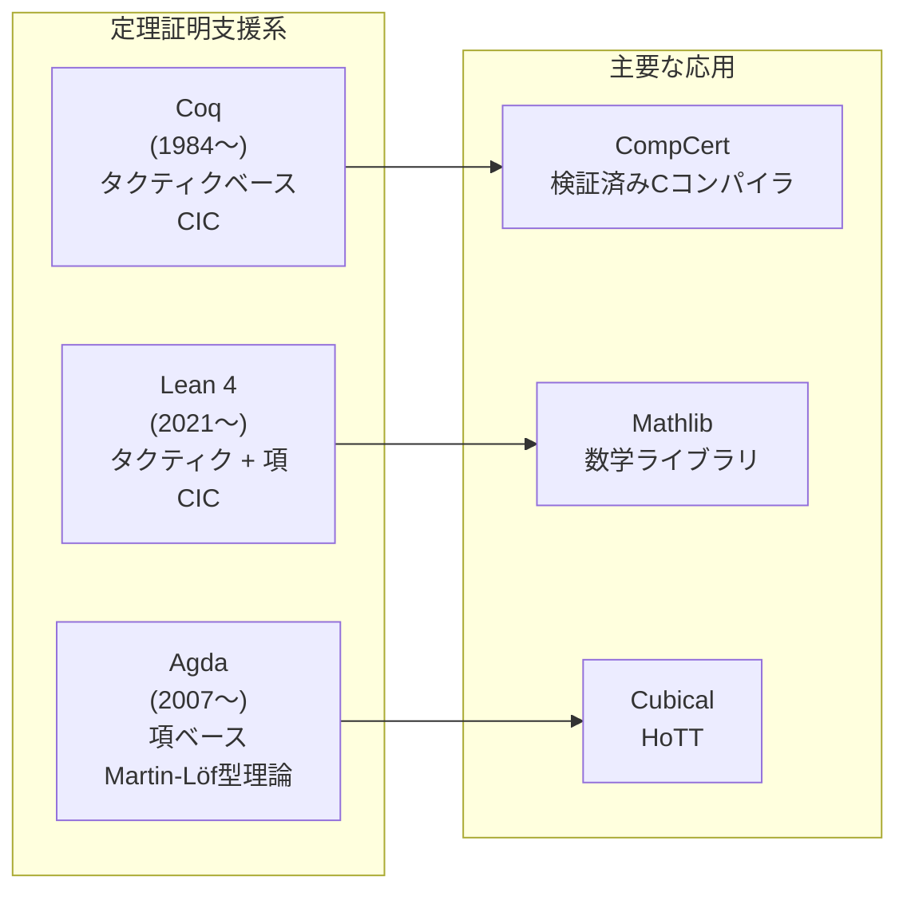
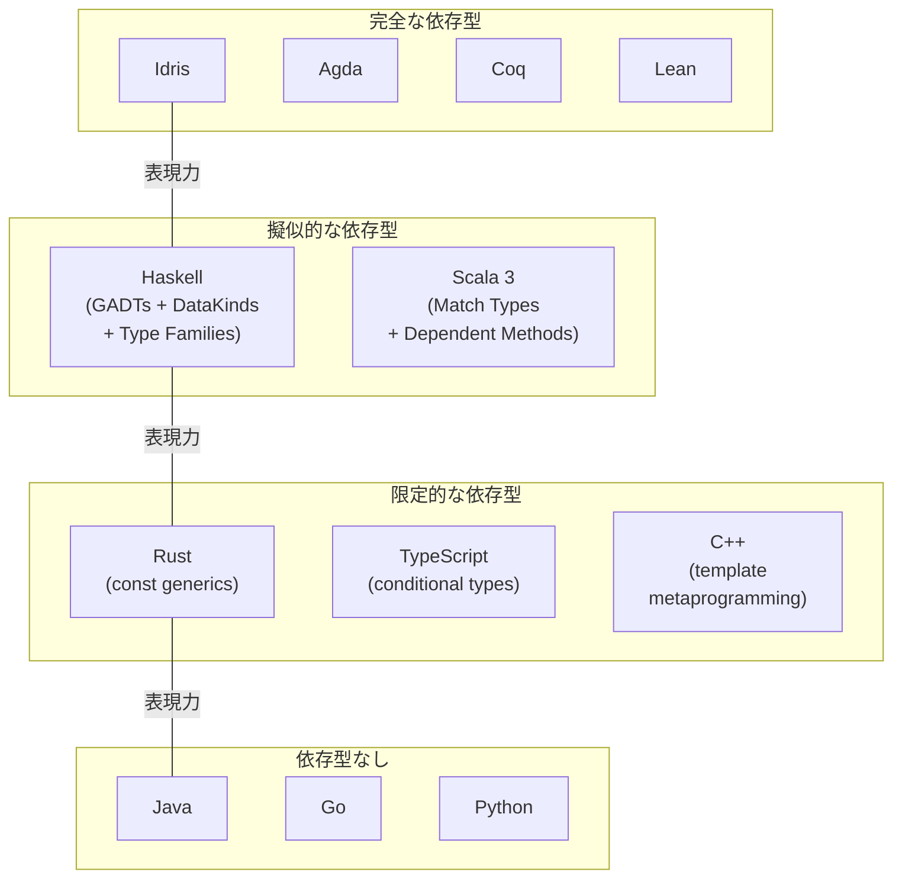
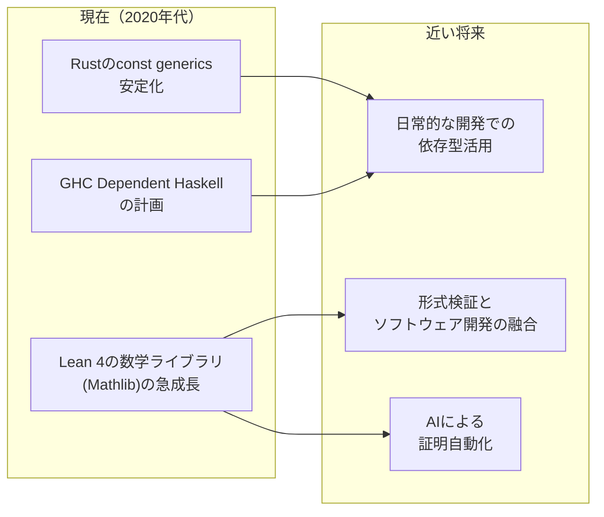

# 依存型 — 値に依存する型の理論と実践

## 1. はじめに：なぜ依存型が必要なのか

プログラミングにおける型システムの目的は、プログラムの誤りを実行前に検出することである。静的型付け言語では、「整数に文字列を足す」といった明らかな型エラーをコンパイル時に排除できる。しかし、通常の型システムでは表現できない不変条件は数多く存在する。

たとえば、以下のような制約を型で表現したい場面を考えてみよう：

- 「長さ $n$ のリストと長さ $m$ のリストを結合すると、長さ $n + m$ のリストになる」
- 「ソート済みのリストに対して二分探索を行う」
- 「行列の乗算で、左の列数と右の行数が一致している」
- 「配列のインデックスが範囲内である」

通常の型システムでは、`List<Int>` のように「要素の型」は表現できるが、「リストの長さ」のような**値に関する情報**を型に含めることはできない。この制約を打破するのが**依存型（Dependent Types）**である。

依存型とは、**型が値に依存できる**型システムの拡張である。つまり、型の定義の中に具体的な値や計算の結果を含めることができる。これにより、型はプログラムの振る舞いに関するきわめて精密な仕様を表現する手段となり、型検査がそのまま**仕様の検証**として機能するようになる。

::: tip 依存型の一言定義
依存型とは、型の中に値を含めることで、「この関数は長さ $n$ のベクトルを受け取り、長さ $n$ のベクトルを返す」のような精密な仕様を型レベルで表現できる型システムの拡張である。
:::

## 2. ラムダキューブ（Lambda Cube）

依存型の位置づけを理解するには、型システムの分類体系である**ラムダキューブ（Lambda Cube）**を知る必要がある。ラムダキューブは、Henk Barendregt によって1991年に提唱された、型付きラムダ計算の分類フレームワークである。

### 2.1 3つの軸

ラムダキューブは、単純型付きラムダ計算（$\lambda_{\to}$）を出発点として、以下の3つの軸に沿った拡張を考える：

1. **項が型に依存する（Terms depending on types）** — パラメトリック多相、ジェネリクス
2. **型が型に依存する（Types depending on types）** — 型演算子、高カインド型
3. **型が項に依存する（Types depending on terms）** — **依存型**

```mermaid
graph TB
    subgraph "ラムダキューブ"
        direction TB
        λω["λω<br/>(System Fω)<br/>多相 + 型演算子"]
        λΠω["λΠω<br/>(Calculus of Constructions)<br/>全部入り"]
        λ2["λ2<br/>(System F)<br/>多相"]
        λΠ2["λΠ2<br/>多相 + 依存型"]
        λω_["λω_<br/>型演算子"]
        λΠω_["λΠω_<br/>型演算子 + 依存型"]
        λ→["λ→<br/>(単純型付き)<br/>出発点"]
        λΠ["λΠ<br/>依存型"]
    end

    λ→ -->|"多相"| λ2
    λ→ -->|"型演算子"| λω_
    λ→ -->|"依存型"| λΠ

    λ2 -->|"型演算子"| λω
    λ2 -->|"依存型"| λΠ2

    λω_ -->|"多相"| λω
    λω_ -->|"依存型"| λΠω_

    λΠ -->|"多相"| λΠ2
    λΠ -->|"型演算子"| λΠω_

    λω -->|"依存型"| λΠω
    λΠ2 -->|"型演算子"| λΠω
    λΠω_ -->|"多相"| λΠω
```

### 2.2 各頂点の意味

| 体系 | 別名 | 特徴 | 対応する言語の例 |
|---|---|---|---|
| $\lambda_{\to}$ | 単純型付きラムダ計算 | 基本的な関数型 | — |
| $\lambda 2$ | System F | パラメトリック多相 | Haskell (基本), ML |
| $\lambda \underline{\omega}$ | — | 型演算子 | — |
| $\lambda \Pi$ | LF | 依存型 | LF |
| $\lambda \omega$ | System F$\omega$ | 多相 + 型演算子 | Haskell (高カインド型) |
| $\lambda \Pi 2$ | — | 多相 + 依存型 | — |
| $\lambda \Pi \underline{\omega}$ | — | 型演算子 + 依存型 | — |
| $\lambda \Pi \omega$ | **Calculus of Constructions** | 全ての拡張 | Coq, Lean |

ラムダキューブの最も豊かな頂点が **Calculus of Constructions（CoC）** であり、これは依存型、パラメトリック多相、型演算子のすべてを備えている。CoqやLeanの型システムの理論的基盤はCoC（およびその拡張であるCalculus of Inductive Constructions）に基づいている。

### 2.3 カリー・ハワード対応

依存型を理解する上で不可欠な概念が**カリー・ハワード対応（Curry-Howard Correspondence）**である。これは、**型と命題**、**プログラムと証明**の間の深い対応関係を示すものである。

| プログラミング | 論理学 |
|---|---|
| 型 | 命題 |
| プログラム（項） | 証明 |
| 関数型 $A \to B$ | 含意 $A \Rightarrow B$ |
| 直積型 $A \times B$ | 連言（AND）$A \land B$ |
| 直和型 $A + B$ | 選言（OR）$A \lor B$ |
| 空の型 $\bot$ | 偽（矛盾） |
| 依存関数型 $\Pi_{x:A} B(x)$ | 全称量化 $\forall x \in A.\, B(x)$ |
| 依存ペア型 $\Sigma_{x:A} B(x)$ | 存在量化 $\exists x \in A.\, B(x)$ |

単純型付きラムダ計算では、命題論理（全称・存在量化なし）に対応する証明しか表現できない。しかし、依存型を導入することで**述語論理**（$\forall$, $\exists$ を含む論理）の命題と証明を型システムの中で表現できるようになる。

::: details カリー・ハワード対応の直観的な例
「すべての自然数 $n$ について、$n + 0 = n$ である」という命題を考える。

これは全称量化 $\forall n : \mathbb{N}.\, n + 0 = n$ であり、依存関数型として次のように表現される：

$$
\Pi_{n : \mathbb{N}}.\, (n + 0 = n)
$$

この型を持つプログラム（関数）を構成できれば、それがこの命題の証明となる。関数の「入力」は任意の自然数 $n$ であり、「出力」は $n + 0 = n$ であることの証拠（evidence）である。
:::

## 3. 依存関数型（Π型）と依存ペア型（Σ型）

依存型の中核を成す2つの型構成子が、**依存関数型（Π型、Pi型）**と**依存ペア型（Σ型、Sigma型）**である。

### 3.1 依存関数型（Π型）

#### 形式的定義

依存関数型は、以下のように定義される：

$$
\Pi_{x : A}.\, B(x)
$$

これは「$A$ 型の値 $x$ を受け取り、$B(x)$ 型の値を返す関数」の型である。重要なのは、**戻り値の型 $B(x)$ が引数 $x$ に依存する**ことである。

通常の関数型 $A \to B$ は、$B$ が $x$ に依存しない特殊ケースである：

$$
A \to B \equiv \Pi_{x : A}.\, B \quad (\text{$B$ は $x$ に依存しない})
$$

#### 型付け規則

Π型の導入規則（introduction rule）と除去規則（elimination rule）を以下に示す：

**形成規則（Formation）**：

$$
\frac{\Gamma \vdash A : \text{Type} \quad \Gamma, x : A \vdash B(x) : \text{Type}}{\Gamma \vdash \Pi_{x:A}.\, B(x) : \text{Type}}
$$

**導入規則（Introduction / Lambda）**：

$$
\frac{\Gamma, x : A \vdash b(x) : B(x)}{\Gamma \vdash \lambda x.\, b(x) : \Pi_{x:A}.\, B(x)}
$$

**除去規則（Elimination / Application）**：

$$
\frac{\Gamma \vdash f : \Pi_{x:A}.\, B(x) \quad \Gamma \vdash a : A}{\Gamma \vdash f\, a : B(a)}
$$

**計算規則（Computation / Beta）**：

$$
(\lambda x.\, b(x))\, a \equiv b(a)
$$

除去規則に注目してほしい。関数 $f$ を引数 $a$ に適用すると、戻り値の型は $B(a)$ となる。つまり、**具体的な引数の値によって結果の型が変わる**のである。

#### 具体例

Idrisでの例を示す。長さ付きベクトル `Vect n a` に対して、先頭要素を取得する関数 `head` を考える：

```idris
-- Vect n a: length n, element type a
-- head requires that the vector is non-empty (n is S k for some k)
head : Vect (S k) a -> a
head (x :: xs) = x
```

この `head` の型は、「長さが1以上（`S k` は後者関数、つまり $k + 1$）のベクトルのみ受け付ける」ことを型レベルで保証している。空のベクトルを渡すとコンパイルエラーになるため、実行時の空リストエラーが原理的に発生しない。

### 3.2 依存ペア型（Σ型）

#### 形式的定義

依存ペア型は、以下のように定義される：

$$
\Sigma_{x : A}.\, B(x)
$$

これは「$A$ 型の値 $x$ と、$B(x)$ 型の値のペア」の型である。第二要素の型が第一要素の**値**に依存する点がポイントである。

通常の直積型 $A \times B$ は、$B$ が $x$ に依存しない特殊ケースである：

$$
A \times B \equiv \Sigma_{x : A}.\, B \quad (\text{$B$ は $x$ に依存しない})
$$

#### 型付け規則

**形成規則（Formation）**：

$$
\frac{\Gamma \vdash A : \text{Type} \quad \Gamma, x : A \vdash B(x) : \text{Type}}{\Gamma \vdash \Sigma_{x:A}.\, B(x) : \text{Type}}
$$

**導入規則（Introduction / Pair）**：

$$
\frac{\Gamma \vdash a : A \quad \Gamma \vdash b : B(a)}{\Gamma \vdash (a, b) : \Sigma_{x:A}.\, B(x)}
$$

**除去規則（Elimination / Projection）**：

$$
\frac{\Gamma \vdash p : \Sigma_{x:A}.\, B(x)}{\Gamma \vdash \pi_1(p) : A}
\qquad
\frac{\Gamma \vdash p : \Sigma_{x:A}.\, B(x)}{\Gamma \vdash \pi_2(p) : B(\pi_1(p))}
$$

#### 具体例

Σ型は、「ある性質を満たす値が存在する」ことの証拠を表現するのに使われる。たとえば、「長さが不明だが、空でないリスト」を型で表現できる：

```idris
-- A non-empty list: a pair of (n : Nat) and (Vect (S n) a)
NonEmptyVect : Type -> Type
NonEmptyVect a = (n : Nat ** Vect (S n) a)
```

ここで `(n : Nat ** Vect (S n) a)` はIdrisにおけるΣ型の構文であり、「ある自然数 $n$ が存在して、長さ $n + 1$ のベクトルが存在する」ことを表している。

### 3.3 Π型とΣ型の双対性

Π型とΣ型は、論理学における全称量化（$\forall$）と存在量化（$\exists$）に対応し、美しい双対性を持つ：

| 概念 | Π型 | Σ型 |
|---|---|---|
| 論理学 | $\forall x : A.\, B(x)$ | $\exists x : A.\, B(x)$ |
| 直観 | すべての $x$ について $B(x)$ | ある $x$ について $B(x)$ |
| プログラム的解釈 | $x$ を受け取り $B(x)$ を返す関数 | $x$ と $B(x)$ の証拠のペア |
| 非依存の特殊ケース | $A \to B$ | $A \times B$ |

## 4. 型レベルプログラミングと証明

依存型の最も強力な側面は、**型の中で計算を行える**ことである。これにより、型レベルでプログラムの性質を記述し、コンパイル時にそれを検証できる。

### 4.1 命題としての型

依存型の世界では、命題は型として表現される。たとえば、等式 $a = b$ は型 $a =_A b$ として表現され、この型の要素（inhabitant）が存在すれば、命題が真であることの証明となる。

```idris
-- The equality type: a propositional equality
-- Refl is the only constructor, witnessing that x = x
data (=) : a -> b -> Type where
  Refl : x = x
```

`Refl` は反射律（reflexivity）の証拠であり、$x = x$ であることの自明な証明である。より複雑な等式の証明は、パターンマッチと再帰を用いて構成する。

### 4.2 自然数の性質の証明

自然数に関する基本的な性質を証明する例を見てみよう。

```idris
-- Natural numbers
data Nat : Type where
  Z : Nat           -- zero
  S : Nat -> Nat    -- successor

-- Addition
plus : Nat -> Nat -> Nat
plus Z     m = m
plus (S k) m = S (plus k m)

-- Proof: 0 + n = n (trivial by definition)
plusZeroLeft : (n : Nat) -> plus Z n = n
plusZeroLeft n = Refl

-- Proof: n + 0 = n (requires induction)
plusZeroRight : (n : Nat) -> plus n Z = n
plusZeroRight Z     = Refl
plusZeroRight (S k) = cong S (plusZeroRight k)
```

`plusZeroLeft` は、`plus` の定義から直ちに `Refl` で証明できる（定義上の等式）。一方、`plusZeroRight` は `plus` が第一引数でパターンマッチしているため、$n$ に関する帰納法が必要となる。`cong S` は「$f(a) = f(b)$ ならば $S(f(a)) = S(f(b))$」という合同性（congruence）を利用している。

### 4.3 決定可能性としての証明

依存型では、命題の真偽を**決定手続き**として表現することもできる：

```idris
-- A decision procedure: either we have a proof, or a refutation
data Dec : Type -> Type where
  Yes : a -> Dec a
  No  : (a -> Void) -> Dec a

-- Decidable equality for natural numbers
decEq : (n : Nat) -> (m : Nat) -> Dec (n = m)
decEq Z     Z     = Yes Refl
decEq Z     (S _) = No absurd
decEq (S _) Z     = No absurd
decEq (S k) (S j) = case decEq k j of
  Yes prf => Yes (cong S prf)
  No contra => No (\prf => contra (succInjective prf))
```

`Dec a` 型は、命題 $a$ について「証明がある（`Yes`）」か「反駁がある（`No`、つまり $a$ から矛盾を導ける）」かのいずれかを要求する。これは構成的な排中律に相当する。

## 5. 長さ付きベクトル（Vect n a）— 典型的な例

依存型の最も有名な例が**長さ付きベクトル**（`Vect n a`）である。リストの長さを型レベルで追跡することで、多くの実行時エラーをコンパイル時に排除できる。

### 5.1 定義

```idris
-- A vector of length n with elements of type a
data Vect : Nat -> Type -> Type where
  Nil  : Vect Z a
  (::) : a -> Vect k a -> Vect (S k) a
```

`Vect` は型パラメータとして自然数 $n$ を取る。`Nil` は長さ $0$（`Z`）、`(::)` はコンスで長さが1増える（`S k`）。

### 5.2 安全な操作

```idris
-- Safe head: only accepts non-empty vectors
head : Vect (S k) a -> a
head (x :: _) = x

-- Safe tail: returns a vector one element shorter
tail : Vect (S k) a -> Vect k a
tail (_ :: xs) = xs

-- Safe indexing: the index is bounded by the vector length
index : Fin n -> Vect n a -> a
index FZ     (x :: _)  = x
index (FS i) (_ :: xs) = index i xs
```

ここで `Fin n` は $0$ 以上 $n$ 未満の自然数を表す有限型である。`Fin n` 型の値は定義上 $n$ 未満であることが保証されるため、範囲外アクセスがコンパイル時に排除される。

```idris
-- Fin n: natural numbers strictly less than n
data Fin : Nat -> Type where
  FZ : Fin (S k)          -- zero is less than any successor
  FS : Fin k -> Fin (S k) -- if i < k, then i+1 < k+1
```

### 5.3 長さを保存する操作

```idris
-- map preserves length
map : (a -> b) -> Vect n a -> Vect n b
map f Nil       = Nil
map f (x :: xs) = f x :: map f xs

-- zip requires equal lengths (enforced by type)
zip : Vect n a -> Vect n b -> Vect n (a, b)
zip Nil       Nil       = Nil
zip (x :: xs) (y :: ys) = (x, y) :: zip xs ys

-- append: lengths add up
append : Vect n a -> Vect m a -> Vect (n + m) a
append Nil       ys = ys
append (x :: xs) ys = x :: append xs ys
```

`zip` の型は、2つのベクトルが同じ長さ $n$ であることを要求している。異なる長さのベクトルを渡すとコンパイルエラーとなる。`append` の型は、結合後のベクトルの長さが $n + m$ であることを保証している。

### 5.4 型レベル計算の実例：行列の乗算

```idris
-- Matrix as a vector of vectors
Matrix : Nat -> Nat -> Type -> Type
Matrix rows cols a = Vect rows (Vect cols a)

-- Matrix multiplication: (r x c1) * (c1 x c2) -> (r x c2)
-- The inner dimensions must match (both c1)
matMul : Num a => Matrix r c1 a -> Matrix c1 c2 a -> Matrix r c2 a
```

行列の型に行数と列数を含めることで、型レベルで「左の行列の列数と右の行列の行数が一致しなければならない」という制約が自然に表現される。次元の不一致はコンパイル時にエラーとなる。

## 6. 定理証明支援系での応用

依存型を最も本格的に活用しているのが**定理証明支援系（Proof Assistant）**である。ここでは主要な3つのシステムを紹介する。

### 6.1 Coq

Coqは1984年にThierry Coquandらによって開発が始まった、最も歴史のある定理証明支援系の一つである。**Calculus of Inductive Constructions（CIC）**を基盤とし、**タクティク（tactic）**と呼ばれる証明記述言語を特徴とする。

```coq
(* Natural number addition is commutative *)
Theorem plus_comm : forall n m : nat, n + m = m + n.
Proof.
  intros n m.
  induction n as [| k IH].
  - (* base case: 0 + m = m + 0 *)
    simpl. rewrite Nat.add_0_r. reflexivity.
  - (* inductive case: S k + m = m + S k *)
    simpl. rewrite IH.
    rewrite Nat.add_succ_r. reflexivity.
Qed.
```

Coqのタクティクは対話的に証明を構築する手段であり、`intros`（仮定の導入）、`induction`（帰納法）、`rewrite`（書き換え）、`reflexivity`（反射律の適用）などがある。

**Coqの実績**：

- **CompCert**：形式的に検証されたCコンパイラ。コンパイラの全変換パスが正しいことがCoqで証明されている
- **四色定理**：2005年にGeorges Gonthierらによって完全に機械的に証明された
- **Feit-Thompson定理**（奇数位数定理）：有限群論の重要な定理がCoqで形式化された

### 6.2 Lean

Leanは、Microsoft Researchの Leonardo de Mouraらによって開発された定理証明支援系であり、現在はバージョン4が主流である。Coqと同様にCICベースだが、**汎用プログラミング言語としての実用性**を重視している点が特徴的である。

```lean
-- Proof that list reverse is involutive
theorem List.reverse_reverse {α : Type} (l : List α)
    : l.reverse.reverse = l := by
  induction l with
  | nil => simp [List.reverse]
  | cons x xs ih =>
    simp [List.reverse, List.reverse_append]
    exact ih
```

Lean 4の特徴は以下の通りである：

- **自己ホスティング**：Lean 4のコンパイラはLean 4自身で書かれている
- **高速なコンパイル**：参照カウントベースのメモリ管理で実用的な速度を実現
- **do記法**：一般的なプログラミング言語と同様のimperative風構文をサポート
- **Mathlib**：20万以上の定理を含む数学ライブラリが活発に開発されている

### 6.3 Agda

Agdaは、スウェーデンのチャルマース工科大学で開発された依存型プログラミング言語兼定理証明支援系である。Coqのタクティクベースのアプローチとは異なり、**直接的な項の構築**（proof terms）による証明を主とする。

```agda
module Example where

open import Data.Nat using (ℕ; zero; suc; _+_)
open import Relation.Binary.PropositionalEquality
  using (_≡_; refl; cong; sym; trans)

-- Proof that n + 0 ≡ n
+-identityʳ : ∀ (n : ℕ) → n + zero ≡ n
+-identityʳ zero    = refl
+-identityʳ (suc n) = cong suc (+-identityʳ n)

-- Proof that addition is associative
+-assoc : ∀ (m n p : ℕ) → (m + n) + p ≡ m + (n + p)
+-assoc zero    n p = refl
+-assoc (suc m) n p = cong suc (+-assoc m n p)
```

Agdaの際立った特徴：

- **Unicode記法**：数学記号をそのままコードに使える（例：`≡`, `∀`, `ℕ`）
- **パターンマッチと`with`節**：依存パターンマッチによる直観的な証明記述
- **同伴パターン（copatterns）**：余帰納的データの定義に利用
- **Cubical Agda**：ホモトピー型理論（HoTT）の実装をサポート

### 6.4 証明支援系の比較



| 特性 | Coq | Lean 4 | Agda |
|---|---|---|---|
| 理論的基盤 | CIC | CIC | Martin-Löf型理論 |
| 証明スタイル | タクティク | タクティク + 項 | 項（直接構築） |
| 実用プログラミング | 限定的 | 強力 | 限定的 |
| 主要ライブラリ | MathComp | Mathlib | 標準ライブラリ |
| コード抽出 | OCaml, Haskell | ネイティブ | Haskell |
| 学習曲線 | 急 | 中程度 | 急 |

## 7. Idrisでの依存型プログラミングの実践

Idrisは、Edwin Bradyによって設計された**汎用の依存型プログラミング言語**である。定理証明よりも**プログラミング**に重点を置いており、依存型を日常的なソフトウェア開発に持ち込むことを目指している。

### 7.1 型駆動開発（Type-Driven Development）

Idrisの開発スタイルは**型駆動開発**と呼ばれる。まず型（仕様）を書き、型に導かれてプログラムを段階的に完成させる手法である。

```idris
-- Step 1: Write the type signature (specification)
-- A function that removes an element at position i from a vector
removeElem : (value : a) ->
             (xs : Vect (S n) a) ->
             {auto prf : Elem value xs} ->
             Vect n a

-- Step 2: Let the type guide the implementation
removeElem value (value :: ys) {prf = Here} = ys
removeElem {n = S k} value (y :: ys) {prf = There later} =
  y :: removeElem value ys
```

ここで `Elem value xs` は「`value` がベクトル `xs` の要素である」ことの証拠を表す型であり、`auto` キーワードにより、コンパイラが自動的にこの証拠を探索する。

### 7.2 状態マシンの型による表現

Idrisの依存型は、**プロトコルやステートマシン**を型レベルで表現するのに適している：

```idris
-- Door states
data DoorState = Open | Closed

-- A door with typed state transitions
data Door : DoorState -> Type where
  MkDoor : (state : DoorState) -> Door state

-- Only a closed door can be opened
openDoor : Door Closed -> Door Open
openDoor (MkDoor Closed) = MkDoor Open

-- Only an open door can be closed
closeDoor : Door Open -> Door Closed
closeDoor (MkDoor Open) = MkDoor Closed

-- knock works on any state
knock : Door state -> Door state
knock door = door
```

この設計では、開いているドアを再び開こうとしたり、閉まっているドアを閉じようとしたりするとコンパイルエラーになる。状態遷移の正しさが型レベルで保証される。

### 7.3 リソース管理の型安全性

Idris 2では、**線形型（Quantitative Type Theory）**が統合されており、リソースの使用回数を型レベルで管理できる：

```idris
-- A file handle that tracks whether it's open or closed
data FileState = FileOpen | FileClosed

data FileHandle : FileState -> Type where
  MkHandle : (h : File) -> FileHandle FileOpen

-- openFile returns a handle in the Open state
openFile : (path : String) -> IO (Either FileError (FileHandle FileOpen))

-- readLine requires an open file
readLine : FileHandle FileOpen -> IO (Either FileError String)

-- closeFile consumes an open handle (cannot be used again)
closeFile : FileHandle FileOpen -> IO ()
```

### 7.4 printf の型安全な実装

依存型の威力を示す有名な例が、型安全な `printf` の実装である：

```idris
-- Format specifiers
data Format = FInt Format     -- %d
            | FString Format  -- %s
            | FChar Char Format -- literal character
            | FEnd            -- end of format

-- Compute the type of printf from the format string
PrintfType : Format -> Type
PrintfType (FInt rest)    = Int -> PrintfType rest
PrintfType (FString rest) = String -> PrintfType rest
PrintfType (FChar _ rest) = PrintfType rest
PrintfType FEnd           = String

-- Type-safe printf: the type depends on the format
printf : (fmt : Format) -> PrintfType fmt
```

フォーマット文字列に `%d` が含まれていれば `Int` 引数が必要になり、`%s` が含まれていれば `String` 引数が必要になる。引数の型と個数がフォーマット文字列から**コンパイル時に**決定される。

## 8. 依存型と一般的プログラミング言語の接点

完全な依存型を持つ言語は専門的であり、広く普及しているとは言い難い。しかし、依存型の**アイデア**は、主流のプログラミング言語にも段階的に取り入れられている。

### 8.1 Rust: const generics

Rustのconst genericsは、型パラメータとして**定数値**を取ることができる機能であり、限定的な依存型と見なせる：

```rust
// Array with compile-time known size
fn first<T, const N: usize>(arr: &[T; N]) -> &T
where
    // This bound is not expressible yet, but the concept is similar
    // to dependent types
{
    &arr[0]
}

// Matrix multiplication with dimension checking
struct Matrix<T, const ROWS: usize, const COLS: usize> {
    data: [[T; COLS]; ROWS],
}

impl<T, const R: usize, const C1: usize> Matrix<T, R, C1>
where T: Default + Copy + std::ops::Add<Output = T> + std::ops::Mul<Output = T>
{
    fn multiply<const C2: usize>(
        &self,
        other: &Matrix<T, C1, C2>,
    ) -> Matrix<T, R, C2> {
        // inner dimension C1 must match — enforced by type system
        todo!()
    }
}
```

Rustのconst genericsは型パラメータとして `usize`、`bool` などの基本型の値のみを受け取れる。完全な依存型のように任意の計算を型レベルで行うことはできないが、配列サイズの型安全性などには有用である。

### 8.2 TypeScript: conditional types とテンプレートリテラル型

TypeScriptのconditional typesは、型レベルの条件分岐を実現する：

```typescript
// Conditional type: type depends on another type
type IsString<T> = T extends string ? true : false;

// Template literal types: string manipulation at type level
type EventName<T extends string> = `on${Capitalize<T>}`;
type ClickEvent = EventName<"click">; // "onClick"

// Mapped types with conditional logic
type DeepReadonly<T> = {
  readonly [K in keyof T]: T[K] extends object
    ? DeepReadonly<T[K]>
    : T[K];
};

// Tuple manipulation
type First<T extends any[]> = T extends [infer F, ...any[]] ? F : never;
type Rest<T extends any[]> = T extends [any, ...infer R] ? R : never;

// Type-safe path access
type PathValue<T, P extends string> =
  P extends `${infer Key}.${infer Rest}`
    ? Key extends keyof T
      ? PathValue<T[Key], Rest>
      : never
    : P extends keyof T
      ? T[P]
      : never;
```

TypeScriptの型システムは実は**チューリング完全**であることが知られている。conditional types, mapped types, recursive types を組み合わせることで、型レベルで任意の計算が可能である。しかし、これは意図的な設計というよりも、型システムの表現力が偶発的にチューリング完全になったものであり、本格的な依存型とは設計思想が異なる。

### 8.3 Haskell: GADTs, Type Families, Singletons

Haskellは完全な依存型を持たないが、いくつかの拡張機能を組み合わせることで依存型に近い表現が可能である：

```haskell
{-# LANGUAGE GADTs, DataKinds, TypeFamilies, KindSignatures #-}

-- Promoted natural numbers (DataKinds)
data Nat = Z | S Nat

-- Length-indexed vector using GADTs
data Vec (n :: Nat) (a :: *) where
  VNil  :: Vec 'Z a
  VCons :: a -> Vec n a -> Vec ('S n) a

-- Safe head
vHead :: Vec ('S n) a -> a
vHead (VCons x _) = x

-- Type-level addition
type family Plus (n :: Nat) (m :: Nat) :: Nat where
  Plus 'Z     m = m
  Plus ('S n) m = 'S (Plus n m)

-- Append with length addition
vAppend :: Vec n a -> Vec m a -> Vec (Plus n m) a
vAppend VNil       ys = ys
vAppend (VCons x xs) ys = VCons x (vAppend xs ys)
```

::: warning HaskellのGADTsと完全な依存型の違い
Haskellでは、値レベルと型レベルが**分離**されている。`DataKinds` 拡張により値をカインド（型の型）に「昇格（promote）」させることはできるが、任意の値を直接型に埋め込むことはできない。`singletons` ライブラリは、この隔たりを橋渡しするボイラープレートコードを自動生成するが、本質的な分離は残る。GHCの将来バージョン（Dependent Haskell）では、この制限が緩和される計画がある。
:::

### 8.4 各言語の依存型的機能の比較



## 9. 依存型の型検査の決定可能性と停止性

依存型の型検査は、通常の型システムとは根本的に異なる課題を抱えている。型の中に計算が含まれるため、**型の等価性を判定するために計算を実行する必要がある**のだ。

### 9.1 型検査と項の正規化

依存型の型検査では、2つの型が等しいかどうかを判定する場面が頻繁に発生する。たとえば、`Vect (1 + 2) Int` と `Vect 3 Int` が同じ型かどうかを判定するには、`1 + 2` を計算して `3` を得る必要がある。

この「型に含まれる式を計算する」プロセスを**正規化（normalization）**と呼ぶ。型検査の健全性のためには、すべての式が正規形に到達する（つまり計算が停止する）ことが求められる。

$$
\frac{\Gamma \vdash e : A \quad \Gamma \vdash A \equiv B : \text{Type}}{\Gamma \vdash e : B} \quad (\text{型変換規則})
$$

ここで $A \equiv B$ は**定義上の等価性（definitional equality）**、すなわち正規化によって同一の正規形に到達することを意味する。

### 9.2 停止性の問題

型検査が決定可能であるためには、型の中の計算がすべて停止する必要がある。しかし、一般の再帰関数は停止するとは限らない（停止問題の決定不能性）。

そこで、多くの依存型言語では**全域性チェッカ（totality checker）**を導入し、定義される関数が必ず停止することを保証する：

- **構造的再帰（structural recursion）**：再帰呼び出しの引数が構造的に小さくなっていることを要求する
- **整礎再帰（well-founded recursion）**：整礎順序に基づく停止性の証明を要求する
- **サイズ型（sized types）**：型にサイズ情報を付与して停止性を保証する（Agdaの一部）

```idris
-- This passes the totality checker: structural recursion on n
total
factorial : Nat -> Nat
factorial Z     = 1
factorial (S k) = (S k) * factorial k

-- This would fail the totality checker: no structural decrease
-- bad : Nat -> Nat
-- bad n = bad n
```

::: warning 全域性と型検査の決定可能性
依存型言語が型検査の決定可能性を保証するためには、型の中で使われる関数がすべて全域的（total）でなければならない。Coq、Agda、Lean では、全域性チェッカがこれを強制する。一方、Idrisでは `total` アノテーションによりオプトインで全域性を要求でき、`partial` な関数も許容する（ただし、partial な関数は証明には使えない）。
:::

### 9.3 命題的等価性と定義上の等価性

依存型の体系では、2種類の等価性が重要な役割を果たす：

**定義上の等価性（Definitional / Judgmental Equality）**：

$$
A \equiv B
$$

計算（$\beta$簡約、$\delta$展開など）によって同一の正規形に到達する場合の等価性。型検査器が自動的に判定する。

**命題的等価性（Propositional Equality）**：

$$
A =_{\text{Type}} B
$$

型の中で明示的に述べられる等価性。証明項を構築する必要がある。

この区別は実用上重要である。たとえば、`n + 0 = n` は命題的には真だが、`plus` の定義が第一引数でパターンマッチしているため、定義上の等価性は成り立たない。そのため、`Vect (n + 0) a` と `Vect n a` は自動的には同じ型と見なされず、明示的な書き換え（rewrite）が必要になる：

```idris
-- Without rewrite, this would not type-check:
-- Vect (n + 0) a is not definitionally equal to Vect n a
reverseHelper : Vect n a -> Vect m a -> Vect (n + m) a
reverseHelper []        acc = rewrite plusZeroRight m in acc  -- need explicit rewrite
reverseHelper (x :: xs) acc = rewrite plusSuccRight ... in
                                reverseHelper xs (x :: acc)
```

### 9.4 決定可能性の限界

| 性質 | 単純型付き | System F | 依存型（全域的） | 依存型（非全域的） |
|---|---|---|---|---|
| 型検査 | 決定可能 | 決定可能 | 決定可能 | 決定不能 |
| 型推論 | 決定可能 | 決定不能 | 一般に決定不能 | 決定不能 |
| 正規化 | 強正規化 | 強正規化 | 強正規化 | 保証なし |

System Fの型推論は決定不能であり（Wells, 1999）、依存型ではさらに困難になる。そのため、依存型言語では通常、プログラマが十分な型注釈を提供することが期待される。ただし、Lean やIdrisの型推論エンジンは、ユニフィケーションやメタ変数の解決を通じて、多くの場面で型注釈を省略可能にしている。

## 10. 限界と今後の方向性

### 10.1 現在の限界

**学習曲線の急峻さ**：依存型を効果的に使うためには、型理論の深い理解が求められる。型エラーメッセージは通常の言語よりも複雑であり、デバッグが困難な場合がある。

**証明の負担**：プログラムが正しいことを型レベルで保証するには、しばしば煩雑な証明が必要となる。たとえば、リストの結合の結合律のような「当たり前」の性質でも、明示的な証明項を構築しなければならないことがある。

**性能の課題**：型検査時に項の正規化が必要なため、複雑な型レベル計算を含むプログラムでは型検査自体に時間がかかることがある。

**エコシステムの成熟度**：IdrisやAgdaは主流言語と比較してライブラリが少なく、ツール（IDE、デバッガ、パッケージマネージャ）のエコシステムも発展途上である。

**プログラムの抽出と効率**：定理証明支援系で書かれたプログラムを効率的な実行コードに変換するのは容易ではない。Coqのコード抽出やLeanのネイティブコンパイルは進歩しているが、手書きの最適化コードには及ばないことが多い。

### 10.2 理論的な発展

**ホモトピー型理論（Homotopy Type Theory / HoTT）**：Vladimir Voevodsky らによって提唱された、依存型理論と抽象代数トポロジーを融合する理論的フレームワークである。等価性の概念を豊かにし、**ユニバレンス公理（Univalence Axiom）**を中心とする新しい数学的基盤を提供する。Cubical Agda はHoTTの計算的解釈を実装している。

**Quantitative Type Theory（QTT）**：Idris 2の基盤となっている理論で、型に**使用回数**（0回、1回、無制限）の情報を持たせる。これにより、線形型と依存型を統一的に扱うことができる。

$$
\frac{\Gamma \vdash A : \text{Type} \quad \Gamma, x :^{\pi} A \vdash B(x) : \text{Type}}{\Gamma \vdash (x :^{\pi} A) \to B(x) : \text{Type}}
$$

ここで $\pi$ は使用量（$0$, $1$, $\omega$）を表す。$\pi = 0$ のとき、$x$ は型検査時にのみ使われ、実行時に消去される（erasure）。

### 10.3 実用化に向けた動き



**Lean 4のMathlib**：2020年代に入って急速に成長しており、2025年時点で数十万の定理が形式化されている。数学者コミュニティの参加が活発であり、形式的数学の実用性を示す重要な事例となっている。

**Dependent Haskell**：GHCの開発チームは、Haskellに完全な依存型を導入する計画を進めている。実現すれば、既存のHaskellエコシステムの上に依存型の恩恵をもたらすことになる。

**AIと証明自動化**：大規模言語モデル（LLM）を活用した自動定理証明の研究が活発化している。GoogleのAlphaProof やMeta のHyperTree Proof Searchなど、AIが定理証明を支援する試みが成果を上げつつある。将来的には、依存型プログラミングにおける「証明の負担」が大幅に軽減される可能性がある。

### 10.4 依存型の段階的な普及

依存型の完全な形が主流言語に一夜にして導入されることは考えにくい。より現実的な見通しは、依存型の**アイデアが段階的に**主流言語に取り込まれていくことである：

1. **現在**：const generics（Rust）、conditional types（TypeScript）、GADTs（Haskell/Scala）
2. **近い将来**：Dependent Haskell、より表現力の高いconst generics
3. **中期的**：型レベル計算の標準化、証明自動化ツールの成熟
4. **長期的**：汎用言語における依存型の標準的なサポート

## 11. まとめ

依存型は、「型が値に依存できる」というシンプルだが深遠な拡張である。この拡張により、型システムは単なるエラー検出の道具から、プログラムの仕様を精密に記述し、その正しさを機械的に検証する手段へと昇華する。

依存型の核心は2つの型構成子に集約される：

- **Π型**（依存関数型）：全称量化 $\forall$ に対応し、「すべての入力に対して性質が成り立つ」ことを表現する
- **Σ型**（依存ペア型）：存在量化 $\exists$ に対応し、「ある値が存在して性質を満たす」ことを表現する

カリー・ハワード対応を通じて、依存型はプログラミングと数学的証明を統一する。Coq、Lean、Agdaなどの定理証明支援系は、この対応を全面的に活用し、数学の定理の形式化からコンパイラの検証まで幅広い応用を実現している。

一方で、依存型には学習曲線の急峻さ、証明の負担、エコシステムの未成熟さなどの課題が残る。しかし、Lean 4のようなプログラミング言語としての実用性を重視する処理系の登場、AIによる証明自動化の進展、そして主流言語への段階的な依存型機能の導入により、依存型の恩恵はますます広い範囲のプログラマに届くようになるだろう。

型システムの究極の目標は、「正しいプログラムだけが型検査を通過する」ことである。依存型は、この理想に最も近づいた型システムの一つであり、プログラミング言語の未来を形づくる重要な概念であり続ける。
