# デザインパターン（GoF）

## 1. 歴史的背景：パターンランゲージからソフトウェアへ

### 1.1 建築のパターンランゲージ

デザインパターンという概念は、ソフトウェアの世界から生まれたものではない。その起源は建築にある。

1977年、建築家の Christopher Alexander は著書『A Pattern Language』において、建築や都市計画における繰り返し現れる設計上の問題と、その解決策を**パターン**として体系化した。Alexander は「良い設計には共通する構造がある」という信念のもと、253のパターンを記述した。各パターンは以下の要素で構成されている。

- **名前**：パターンを一意に識別し、設計者同士の共通語彙となる
- **コンテキスト**：どのような状況でこのパターンが適用されるか
- **問題**：そのコンテキストで繰り返し発生する問題
- **解決策**：問題に対する本質的な解決策の構造

この「問題—解決策」の対応関係を名前付きの再利用可能な知識として蓄積するという発想が、後のソフトウェア分野に大きな影響を与えることになる。

### 1.2 Gang of Four の誕生

1994年、Erich Gamma、Richard Helm、Ralph Johnson、John Vlissides の4名（通称 **Gang of Four**、略して **GoF**）は、Alexander のパターンランゲージの考え方をオブジェクト指向ソフトウェア設計に適用し、書籍『**Design Patterns: Elements of Reusable Object-Oriented Software**』を出版した。

この書籍は23のデザインパターンを体系的にカタログ化し、各パターンについて以下の情報を記述している。

| 項目 | 内容 |
|---|---|
| パターン名 | パターンの識別名 |
| 意図（Intent） | パターンが解決する問題の要約 |
| 動機（Motivation） | 具体的なシナリオによる問題の説明 |
| 適用可能性（Applicability） | いつこのパターンを使うべきか |
| 構造（Structure） | クラス図による参加者の関係 |
| 参加者（Participants） | 関与するクラスとオブジェクトの役割 |
| 協調関係（Collaborations） | 参加者がどう連携するか |
| 結果（Consequences） | パターン適用による利点と欠点 |
| 実装（Implementation） | 実装上の注意点とテクニック |
| 関連パターン | 他のパターンとの関係 |

GoF本は出版直後からソフトウェア開発者の間で爆発的に広まり、「パターン」という言葉がソフトウェア設計における共通語彙として定着するきっかけとなった。

### 1.3 パターンの本質

デザインパターンは**コードのコピー&ペーストのテンプレート**ではない。パターンの本質は以下の点にある。

- **設計上の問題とその解決策の対応関係**を名前付きで共有すること
- **設計の意図**を開発者間で効率的に伝達すること
- **変更に強い**設計の原則を具体的な形で示すこと

::: tip パターンは解法の「型」である
デザインパターンは料理のレシピに似ている。レシピそのものをそのまま再現するのではなく、食材や調理環境に応じてアレンジする。同様に、パターンも具体的なコンテキストに合わせて適用方法を調整する必要がある。
:::

## 2. パターンの分類

GoFの23のデザインパターンは、**目的**に基づいて3つのカテゴリに分類される。

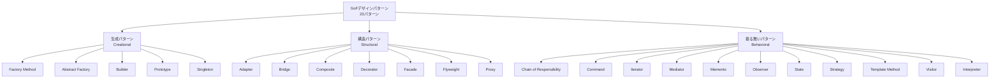
```mermaid
graph TD
    A[GoFデザインパターン<br>23パターン] --> B[生成パターン<br>Creational]
    A --> C[構造パターン<br>Structural]
    A --> D[振る舞いパターン<br>Behavioral]

    B --> B1[Factory Method]
    B --> B2[Abstract Factory]
    B --> B3[Builder]
    B --> B4[Prototype]
    B --> B5[Singleton]

    C --> C1[Adapter]
    C --> C2[Bridge]
    C --> C3[Composite]
    C --> C4[Decorator]
    C --> C5[Facade]
    C --> C6[Flyweight]
    C --> C7[Proxy]

    D --> D1[Chain of Responsibility]
    D --> D2[Command]
    D --> D3[Iterator]
    D --> D4[Mediator]
    D --> D5[Memento]
    D --> D6[Observer]
    D --> D7[State]
    D --> D8[Strategy]
    D --> D9[Template Method]
    D --> D10[Visitor]
    D --> D11[Interpreter]
```

### 2.1 生成パターン（Creational Patterns）

**オブジェクトの生成メカニズム**に関するパターン群。オブジェクトの生成を直接的な `new` 呼び出しから分離し、柔軟性と再利用性を高める。

核心的な課題は「**何を、いつ、どのように生成するか**」をクライアントコードから隠蔽することである。これにより、システムが使用する具体的なクラスに依存しない設計が可能になる。

### 2.2 構造パターン（Structural Patterns）

**クラスやオブジェクトの組み合わせ方**に関するパターン群。既存のクラスやオブジェクトを組み合わせて、より大きな構造を構築する方法を扱う。

核心的な課題は「**既存のインターフェースを変換・拡張・簡略化**して、異なるコンポーネント同士を効果的に連携させること」である。

### 2.3 振る舞いパターン（Behavioral Patterns）

**オブジェクト間の責務の割り当てと通信方法**に関するパターン群。アルゴリズムや処理フローをオブジェクト間でどう分担するかを扱う。

核心的な課題は「**変化する振る舞いをどのようにカプセル化し、オブジェクト間の結合度を下げるか**」である。

## 3. 代表的な生成パターン

### 3.1 Factory Method

**解決する問題**: オブジェクトの生成をサブクラスに委譲したい。親クラスが具体的なクラスを知らずに、適切なオブジェクトを生成する仕組みが必要である。

たとえば、文書処理アプリケーションで、文書の種類（PDF、Word、HTML）に応じて異なるパーサーを生成する必要があるとき、クライアントコードが具体的なパーサークラスに依存してしまうと、新しい文書形式への対応が困難になる。

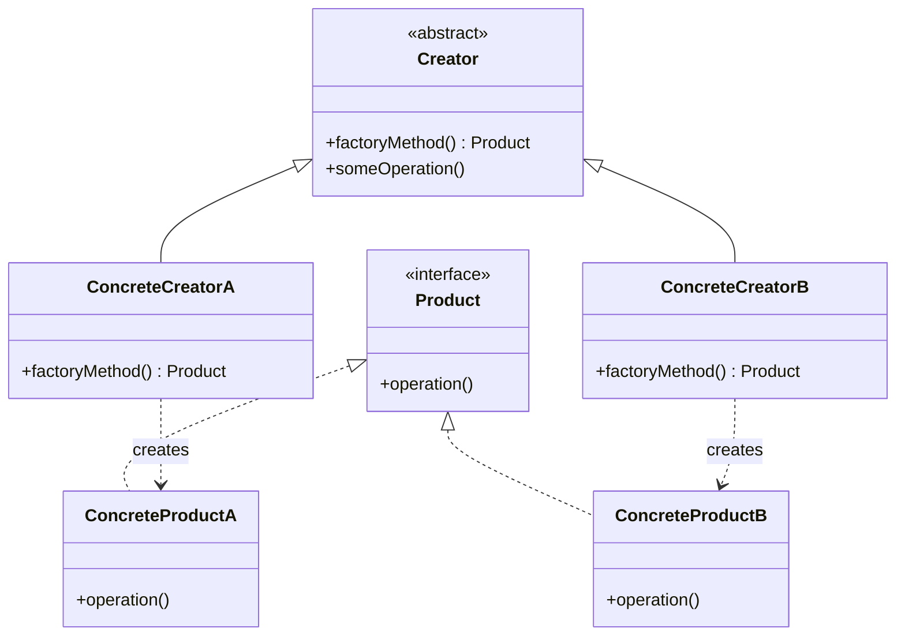
```mermaid
classDiagram
    class Creator {
        <<abstract>>
        +factoryMethod() Product
        +someOperation()
    }
    class ConcreteCreatorA {
        +factoryMethod() Product
    }
    class ConcreteCreatorB {
        +factoryMethod() Product
    }
    class Product {
        <<interface>>
        +operation()
    }
    class ConcreteProductA {
        +operation()
    }
    class ConcreteProductB {
        +operation()
    }

    Creator <|-- ConcreteCreatorA
    Creator <|-- ConcreteCreatorB
    Product <|.. ConcreteProductA
    Product <|.. ConcreteProductB
    ConcreteCreatorA ..> ConcreteProductA : creates
    ConcreteCreatorB ..> ConcreteProductB : creates
```

```java
// Product interface
interface Document {
    void open();
    void save();
}

// Concrete products
class PdfDocument implements Document {
    public void open() { /* PDF-specific logic */ }
    public void save() { /* PDF-specific logic */ }
}

class HtmlDocument implements Document {
    public void open() { /* HTML-specific logic */ }
    public void save() { /* HTML-specific logic */ }
}

// Creator (Factory Method pattern)
abstract class Application {
    // Factory Method - subclasses decide which class to instantiate
    abstract Document createDocument();

    public void openDocument() {
        Document doc = createDocument();
        doc.open();
    }
}

class PdfApplication extends Application {
    @Override
    Document createDocument() {
        return new PdfDocument();
    }
}

class HtmlApplication extends Application {
    @Override
    Document createDocument() {
        return new HtmlDocument();
    }
}
```

Factory Method の要点は、**オブジェクト生成のインターフェースを定義しつつ、実際にどのクラスをインスタンス化するかをサブクラスに委ねる**点にある。これにより、新しい具象クラスを追加しても、既存のクライアントコードを変更する必要がない。

### 3.2 Abstract Factory

**解決する問題**: 関連するオブジェクト群を、その具体的なクラスを指定せずに一貫性を保って生成したい。

GUIツールキットを例に考える。Windows と macOS で異なる外観のボタン、テキストボックス、チェックボックスを提供する必要があるとき、各プラットフォーム向けの部品を個別に生成すると、Windows のボタンと macOS のテキストボックスが混在するような不整合が起きうる。

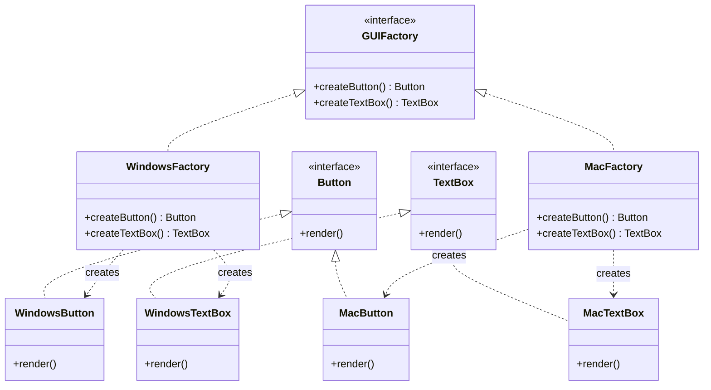
```mermaid
classDiagram
    class GUIFactory {
        <<interface>>
        +createButton() Button
        +createTextBox() TextBox
    }
    class WindowsFactory {
        +createButton() Button
        +createTextBox() TextBox
    }
    class MacFactory {
        +createButton() Button
        +createTextBox() TextBox
    }
    class Button {
        <<interface>>
        +render()
    }
    class TextBox {
        <<interface>>
        +render()
    }
    class WindowsButton {
        +render()
    }
    class MacButton {
        +render()
    }
    class WindowsTextBox {
        +render()
    }
    class MacTextBox {
        +render()
    }

    GUIFactory <|.. WindowsFactory
    GUIFactory <|.. MacFactory
    Button <|.. WindowsButton
    Button <|.. MacButton
    TextBox <|.. WindowsTextBox
    TextBox <|.. MacTextBox
    WindowsFactory ..> WindowsButton : creates
    WindowsFactory ..> WindowsTextBox : creates
    MacFactory ..> MacButton : creates
    MacFactory ..> MacTextBox : creates
```

```java
// Abstract Factory
interface GUIFactory {
    Button createButton();
    TextBox createTextBox();
}

// Concrete Factory for Windows
class WindowsFactory implements GUIFactory {
    public Button createButton() { return new WindowsButton(); }
    public TextBox createTextBox() { return new WindowsTextBox(); }
}

// Concrete Factory for macOS
class MacFactory implements GUIFactory {
    public Button createButton() { return new MacButton(); }
    public TextBox createTextBox() { return new MacTextBox(); }
}

// Client code - independent of concrete classes
class Application {
    private final GUIFactory factory;

    Application(GUIFactory factory) {
        this.factory = factory;
    }

    void buildUI() {
        Button button = factory.createButton();
        TextBox textBox = factory.createTextBox();
        button.render();
        textBox.render();
    }
}
```

Abstract Factory は Factory Method の拡張であり、**関連するオブジェクト群（ファミリー）の整合性を保証**する点が特徴である。ファクトリを差し替えるだけで、生成されるすべてのオブジェクトが一貫したファミリーに属するようになる。

### 3.3 Singleton

**解決する問題**: クラスのインスタンスがシステム全体で正確に1つだけ存在することを保証し、そのインスタンスへのグローバルなアクセスポイントを提供したい。

ログマネージャー、設定管理、データベース接続プールなど、リソースの一元管理が必要な場面で使われる。

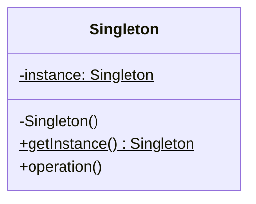
```mermaid
classDiagram
    class Singleton {
        -instance: Singleton$
        -Singleton()
        +getInstance() Singleton$
        +operation()
    }
```

```java
public class Singleton {
    // volatile ensures visibility across threads
    private static volatile Singleton instance;

    // Private constructor prevents external instantiation
    private Singleton() {}

    // Double-checked locking for thread safety
    public static Singleton getInstance() {
        if (instance == null) {
            synchronized (Singleton.class) {
                if (instance == null) {
                    instance = new Singleton();
                }
            }
        }
        return instance;
    }
}
```

::: warning Singleton の落とし穴
Singleton は GoF パターンの中で最も議論を呼ぶパターンである。以下の問題がある。

- **テストが困難になる**: グローバル状態を持つため、テスト間の独立性が損なわれる
- **隠れた依存関係**: コンストラクタのシグネチャに現れないため、依存関係が不透明になる
- **並行処理の複雑さ**: スレッドセーフな実装が必要になる
- **SOLID原則との矛盾**: 単一責任の原則に反しやすい（本来のロジック + インスタンス管理）

現代の開発では、Singleton の代わりに **DI（Dependency Injection）コンテナ**でライフタイムを管理する方法が推奨される。
:::

### 3.4 Builder

**解決する問題**: 複雑なオブジェクトの構築プロセスを段階的に行い、同じ構築プロセスで異なる表現を生成できるようにしたい。

コンストラクタの引数が多数あるオブジェクト（いわゆる **Telescoping Constructor** 問題）に対して、可読性の高い構築手順を提供する。

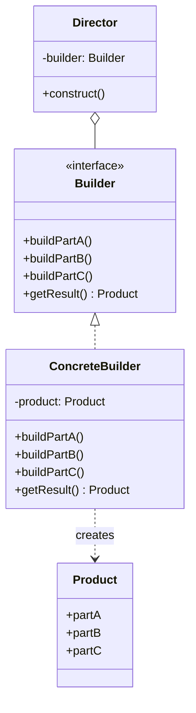
```mermaid
classDiagram
    class Builder {
        <<interface>>
        +buildPartA()
        +buildPartB()
        +buildPartC()
        +getResult() Product
    }
    class ConcreteBuilder {
        -product: Product
        +buildPartA()
        +buildPartB()
        +buildPartC()
        +getResult() Product
    }
    class Director {
        -builder: Builder
        +construct()
    }
    class Product {
        +partA
        +partB
        +partC
    }

    Builder <|.. ConcreteBuilder
    Director o-- Builder
    ConcreteBuilder ..> Product : creates
```

```java
// Product with many optional fields
class HttpRequest {
    private final String method;
    private final String url;
    private final Map<String, String> headers;
    private final String body;
    private final int timeout;

    private HttpRequest(Builder builder) {
        this.method = builder.method;
        this.url = builder.url;
        this.headers = builder.headers;
        this.body = builder.body;
        this.timeout = builder.timeout;
    }

    // Fluent Builder
    static class Builder {
        private final String method;  // required
        private final String url;     // required
        private Map<String, String> headers = new HashMap<>();
        private String body = "";
        private int timeout = 30000;

        Builder(String method, String url) {
            this.method = method;
            this.url = url;
        }

        Builder header(String key, String value) {
            headers.put(key, value);
            return this;
        }

        Builder body(String body) {
            this.body = body;
            return this;
        }

        Builder timeout(int timeout) {
            this.timeout = timeout;
            return this;
        }

        HttpRequest build() {
            return new HttpRequest(this);
        }
    }
}

// Usage
HttpRequest request = new HttpRequest.Builder("POST", "https://api.example.com/data")
    .header("Content-Type", "application/json")
    .body("{\"key\": \"value\"}")
    .timeout(5000)
    .build();
```

Builder パターンの特に重要な利点は、**不変（immutable）オブジェクトを段階的に構築できる**点である。すべてのフィールドをコンストラクタに渡す必要がなくなり、可読性と安全性が両立する。

## 4. 代表的な構造パターン

### 4.1 Adapter

**解決する問題**: 既存のクラスのインターフェースが、クライアントが期待するインターフェースと合わない場合に、両者を接続したい。

レガシーシステムとの統合、サードパーティライブラリの利用、異なるAPIバージョンの橋渡しなど、現実の開発で極めて頻繁に遭遇する問題である。

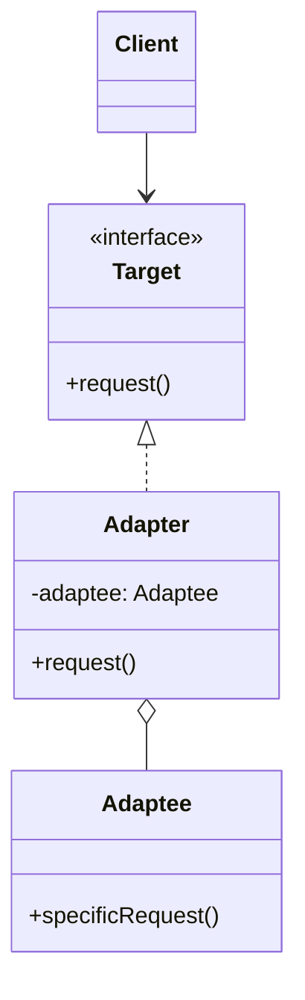
```mermaid
classDiagram
    class Target {
        <<interface>>
        +request()
    }
    class Adapter {
        -adaptee: Adaptee
        +request()
    }
    class Adaptee {
        +specificRequest()
    }
    class Client {
    }

    Target <|.. Adapter
    Adapter o-- Adaptee
    Client --> Target
```

```java
// Existing class with incompatible interface
class LegacyXmlParser {
    public String parseXml(String xmlData) {
        // Parse XML and return result
        return "parsed: " + xmlData;
    }
}

// Target interface expected by client
interface DataParser {
    Map<String, Object> parse(String data);
}

// Adapter bridges the gap
class XmlParserAdapter implements DataParser {
    private final LegacyXmlParser legacyParser;

    XmlParserAdapter(LegacyXmlParser legacyParser) {
        this.legacyParser = legacyParser;
    }

    @Override
    public Map<String, Object> parse(String data) {
        String xmlResult = legacyParser.parseXml(data);
        // Convert legacy format to expected format
        return convertToMap(xmlResult);
    }

    private Map<String, Object> convertToMap(String raw) {
        // Conversion logic
        return new HashMap<>();
    }
}
```

Adapter の本質は「**既存のコードを変更せずに、新しいインターフェースに適合させる**」ことにある。GoFの分類では、クラスの継承を使うクラスアダプタと、委譲（コンポジション）を使うオブジェクトアダプタの2種類がある。現代では、テスト容易性と柔軟性の観点からオブジェクトアダプタが推奨される。

### 4.2 Decorator

**解決する問題**: 既存のオブジェクトに対して、その構造を変更せずに**動的に機能を追加**したい。継承による静的な機能拡張ではなく、実行時に柔軟に機能を組み合わせたい。

Java の I/O ストリームがこのパターンの教科書的な実例である。`BufferedInputStream(new FileInputStream(file))` のように、ストリームを包むことで機能を積み重ねられる。

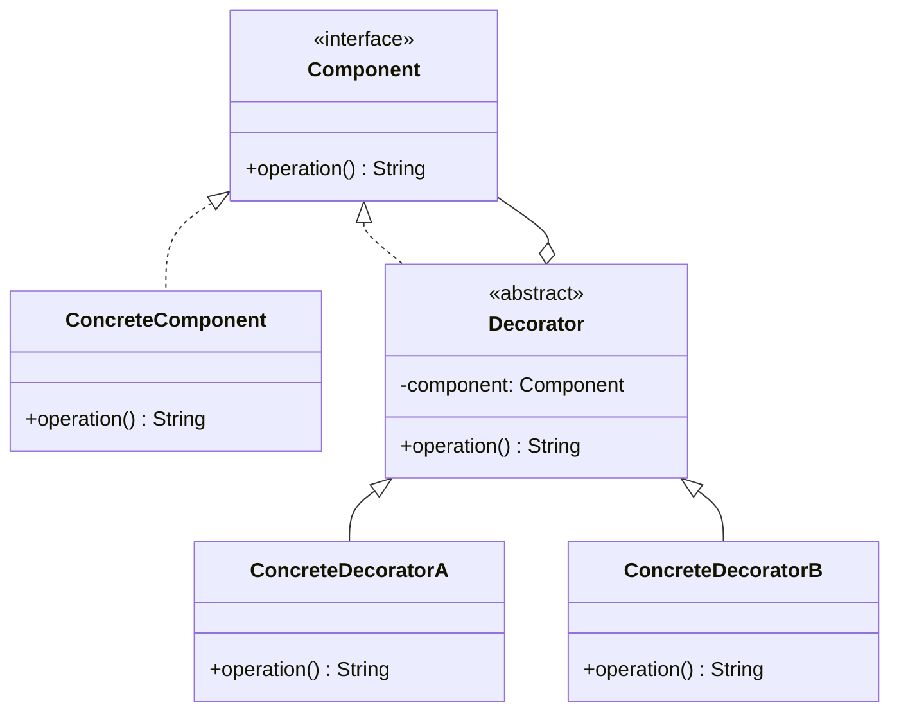
```mermaid
classDiagram
    class Component {
        <<interface>>
        +operation() String
    }
    class ConcreteComponent {
        +operation() String
    }
    class Decorator {
        <<abstract>>
        -component: Component
        +operation() String
    }
    class ConcreteDecoratorA {
        +operation() String
    }
    class ConcreteDecoratorB {
        +operation() String
    }

    Component <|.. ConcreteComponent
    Component <|.. Decorator
    Decorator <|-- ConcreteDecoratorA
    Decorator <|-- ConcreteDecoratorB
    Decorator o-- Component
```

```java
// Component interface
interface Logger {
    void log(String message);
}

// Base implementation
class ConsoleLogger implements Logger {
    public void log(String message) {
        System.out.println(message);
    }
}

// Decorator base class
abstract class LoggerDecorator implements Logger {
    protected final Logger wrapped;

    LoggerDecorator(Logger wrapped) {
        this.wrapped = wrapped;
    }
}

// Adds timestamp to log messages
class TimestampDecorator extends LoggerDecorator {
    TimestampDecorator(Logger wrapped) { super(wrapped); }

    public void log(String message) {
        String timestamped = Instant.now() + " " + message;
        wrapped.log(timestamped);
    }
}

// Adds encryption to log messages
class EncryptionDecorator extends LoggerDecorator {
    EncryptionDecorator(Logger wrapped) { super(wrapped); }

    public void log(String message) {
        String encrypted = encrypt(message);
        wrapped.log(encrypted);
    }

    private String encrypt(String msg) { /* encryption logic */ return msg; }
}

// Flexible combination at runtime
Logger logger = new EncryptionDecorator(
    new TimestampDecorator(
        new ConsoleLogger()
    )
);
logger.log("Hello");
```

Decorator は**継承の代替**として非常に強力である。$n$ 個の機能を任意に組み合わせる場合、継承では $2^n$ 個のサブクラスが必要になりうるが、Decorator ならば $n$ 個のデコレータクラスだけで済む。

### 4.3 Facade

**解決する問題**: 複雑なサブシステムに対して、**簡潔な統一インターフェース**を提供したい。

大規模なライブラリやフレームワークの複雑さをクライアントから隠蔽し、よく使う操作を簡単に呼び出せるようにする。

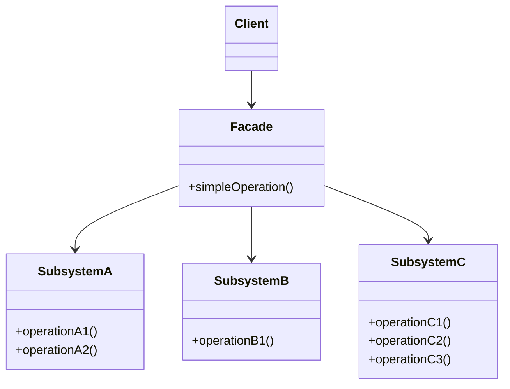
```mermaid
classDiagram
    class Facade {
        +simpleOperation()
    }
    class SubsystemA {
        +operationA1()
        +operationA2()
    }
    class SubsystemB {
        +operationB1()
    }
    class SubsystemC {
        +operationC1()
        +operationC2()
        +operationC3()
    }
    class Client {
    }

    Client --> Facade
    Facade --> SubsystemA
    Facade --> SubsystemB
    Facade --> SubsystemC
```

```java
// Complex subsystems
class VideoDecoder { void decode(String file) { /* ... */ } }
class AudioDecoder { void decode(String file) { /* ... */ } }
class SubtitleParser { void parse(String file) { /* ... */ } }
class VideoRenderer { void render() { /* ... */ } }

// Facade provides a simple interface
class MediaPlayerFacade {
    private final VideoDecoder video = new VideoDecoder();
    private final AudioDecoder audio = new AudioDecoder();
    private final SubtitleParser subtitle = new SubtitleParser();
    private final VideoRenderer renderer = new VideoRenderer();

    // One simple method hides all complexity
    public void play(String file) {
        video.decode(file);
        audio.decode(file);
        subtitle.parse(file);
        renderer.render();
    }
}
```

Facade はサブシステムのクラスを隠蔽するものではない。必要に応じてサブシステムに直接アクセスすることも可能である。あくまでも**よく使う操作の便利な入り口**を提供するパターンである。

### 4.4 Composite

**解決する問題**: オブジェクトを**木構造（ツリー）**に組み立て、個々のオブジェクトとその集合を**同一のインターフェース**で扱いたい。

ファイルシステム（ファイルとディレクトリ）、GUIコンポーネント（ボタンとパネル）、組織図（個人と部署）など、「部分—全体」の階層構造を表現する場面で使われる。

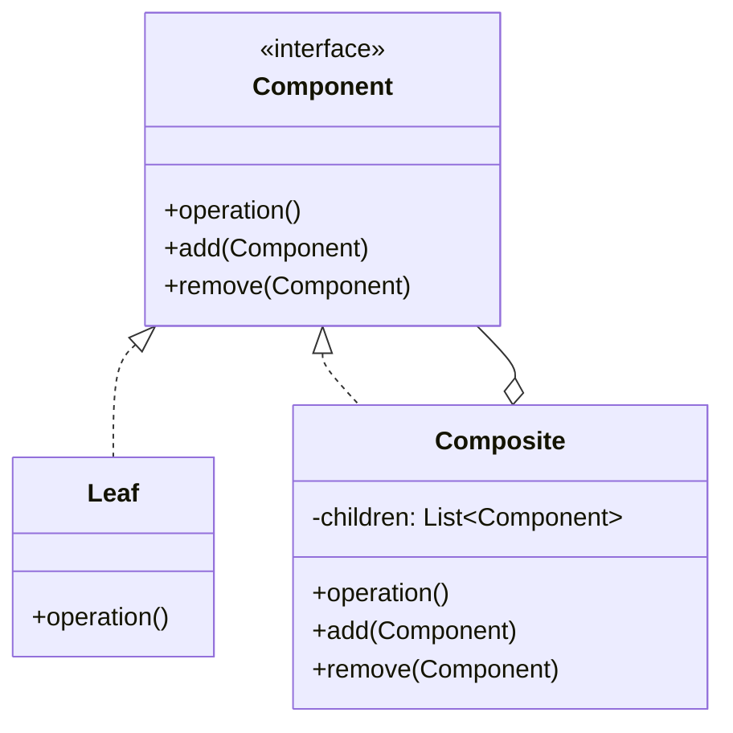
```mermaid
classDiagram
    class Component {
        <<interface>>
        +operation()
        +add(Component)
        +remove(Component)
    }
    class Leaf {
        +operation()
    }
    class Composite {
        -children: List~Component~
        +operation()
        +add(Component)
        +remove(Component)
    }

    Component <|.. Leaf
    Component <|.. Composite
    Composite o-- Component
```

```java
// Component interface
interface FileSystemEntry {
    long getSize();
    String getName();
}

// Leaf
class File implements FileSystemEntry {
    private final String name;
    private final long size;

    File(String name, long size) {
        this.name = name;
        this.size = size;
    }

    public long getSize() { return size; }
    public String getName() { return name; }
}

// Composite
class Directory implements FileSystemEntry {
    private final String name;
    private final List<FileSystemEntry> entries = new ArrayList<>();

    Directory(String name) { this.name = name; }

    public void add(FileSystemEntry entry) { entries.add(entry); }
    public void remove(FileSystemEntry entry) { entries.remove(entry); }

    // Recursively calculates total size
    public long getSize() {
        return entries.stream()
            .mapToLong(FileSystemEntry::getSize)
            .sum();
    }

    public String getName() { return name; }
}
```

Composite パターンにより、クライアントは個々のオブジェクト（Leaf）と複合オブジェクト（Composite）を区別することなく、再帰的な処理を自然に記述できる。

### 4.5 Proxy

**解決する問題**: あるオブジェクトへのアクセスを**制御**するための代理オブジェクトを提供したい。

Proxy にはいくつかの種類がある。

| 種類 | 目的 |
|---|---|
| Virtual Proxy | 重いオブジェクトの遅延初期化 |
| Protection Proxy | アクセス制御（認証・認可） |
| Remote Proxy | リモートオブジェクトのローカル表現 |
| Logging Proxy | リクエストのログ記録 |
| Caching Proxy | 結果のキャッシュ |

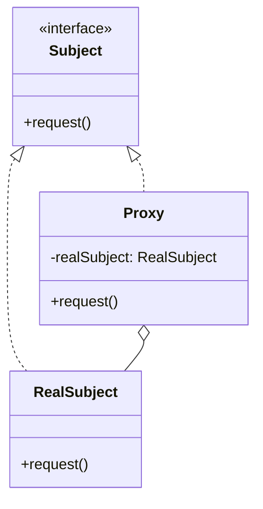
```mermaid
classDiagram
    class Subject {
        <<interface>>
        +request()
    }
    class RealSubject {
        +request()
    }
    class Proxy {
        -realSubject: RealSubject
        +request()
    }

    Subject <|.. RealSubject
    Subject <|.. Proxy
    Proxy o-- RealSubject
```

```java
// Subject interface
interface ImageLoader {
    void display();
}

// Real subject - expensive to create
class HighResolutionImage implements ImageLoader {
    private final String filename;

    HighResolutionImage(String filename) {
        this.filename = filename;
        loadFromDisk(); // Expensive operation
    }

    private void loadFromDisk() {
        System.out.println("Loading " + filename + " from disk...");
    }

    public void display() {
        System.out.println("Displaying " + filename);
    }
}

// Virtual Proxy - defers loading until needed
class ImageProxy implements ImageLoader {
    private final String filename;
    private HighResolutionImage realImage; // lazily initialized

    ImageProxy(String filename) {
        this.filename = filename;
    }

    public void display() {
        if (realImage == null) {
            realImage = new HighResolutionImage(filename);
        }
        realImage.display();
    }
}
```

Proxy パターンは、実際のオブジェクトと同じインターフェースを実装することで、クライアントに透過的な制御層を挿入する。Java では `java.lang.reflect.Proxy` による動的プロキシの仕組みが標準ライブラリに含まれており、AOP（アスペクト指向プログラミング）の基盤としても活用されている。

## 5. 代表的な振る舞いパターン

### 5.1 Strategy

**解決する問題**: アルゴリズムのファミリーを定義し、それぞれをカプセル化して、実行時に**交換可能**にしたい。

たとえば、ソートアルゴリズム、圧縮アルゴリズム、課金計算ロジック、経路探索アルゴリズムなど、同じ目的を達成する複数のアルゴリズムが存在し、状況に応じて切り替えたい場面で使われる。

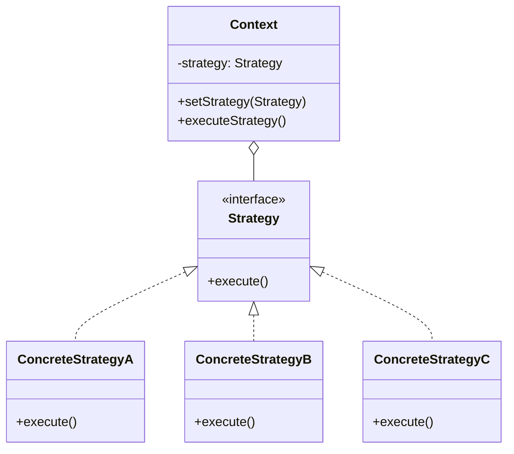
```mermaid
classDiagram
    class Context {
        -strategy: Strategy
        +setStrategy(Strategy)
        +executeStrategy()
    }
    class Strategy {
        <<interface>>
        +execute()
    }
    class ConcreteStrategyA {
        +execute()
    }
    class ConcreteStrategyB {
        +execute()
    }
    class ConcreteStrategyC {
        +execute()
    }

    Context o-- Strategy
    Strategy <|.. ConcreteStrategyA
    Strategy <|.. ConcreteStrategyB
    Strategy <|.. ConcreteStrategyC
```

```java
// Strategy interface
interface CompressionStrategy {
    byte[] compress(byte[] data);
}

// Concrete strategies
class GzipStrategy implements CompressionStrategy {
    public byte[] compress(byte[] data) { /* gzip compression */ return data; }
}

class ZstdStrategy implements CompressionStrategy {
    public byte[] compress(byte[] data) { /* zstd compression */ return data; }
}

class LZ4Strategy implements CompressionStrategy {
    public byte[] compress(byte[] data) { /* lz4 compression */ return data; }
}

// Context
class FileCompressor {
    private CompressionStrategy strategy;

    void setStrategy(CompressionStrategy strategy) {
        this.strategy = strategy;
    }

    byte[] compress(byte[] data) {
        return strategy.compress(data);
    }
}

// Usage - strategy is selected at runtime
FileCompressor compressor = new FileCompressor();
compressor.setStrategy(new ZstdStrategy());
byte[] result = compressor.compress(rawData);
```

Strategy パターンは、`if-else` や `switch` による条件分岐を排除し、**Open/Closed Principle（拡張に対して開き、修正に対して閉じる）**を実現する代表的な手法である。

### 5.2 Observer

**解決する問題**: あるオブジェクトの状態が変化したとき、それに依存する複数のオブジェクトに**自動的に通知**したい。通知する側と受け取る側の結合を疎にしたい。

GUIイベント処理、MVC アーキテクチャのモデルとビューの連携、Pub/Sub メッセージングシステムなどの基盤となるパターンである。

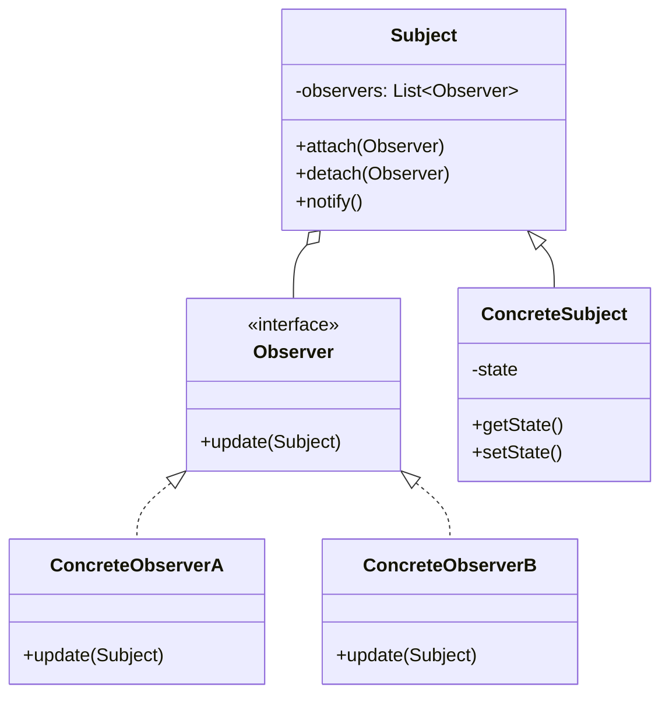
```mermaid
classDiagram
    class Subject {
        -observers: List~Observer~
        +attach(Observer)
        +detach(Observer)
        +notify()
    }
    class Observer {
        <<interface>>
        +update(Subject)
    }
    class ConcreteSubject {
        -state
        +getState()
        +setState()
    }
    class ConcreteObserverA {
        +update(Subject)
    }
    class ConcreteObserverB {
        +update(Subject)
    }

    Subject <|-- ConcreteSubject
    Observer <|.. ConcreteObserverA
    Observer <|.. ConcreteObserverB
    Subject o-- Observer
```

```java
// Observer interface
interface EventListener {
    void onEvent(String eventType, Object data);
}

// Subject (Event Emitter)
class EventEmitter {
    private final Map<String, List<EventListener>> listeners = new HashMap<>();

    public void subscribe(String eventType, EventListener listener) {
        listeners.computeIfAbsent(eventType, k -> new ArrayList<>())
                 .add(listener);
    }

    public void unsubscribe(String eventType, EventListener listener) {
        List<EventListener> list = listeners.get(eventType);
        if (list != null) list.remove(listener);
    }

    public void emit(String eventType, Object data) {
        List<EventListener> list = listeners.get(eventType);
        if (list != null) {
            for (EventListener listener : list) {
                listener.onEvent(eventType, data);
            }
        }
    }
}

// Usage
EventEmitter emitter = new EventEmitter();
emitter.subscribe("user.created", (type, data) -> {
    System.out.println("Send welcome email to: " + data);
});
emitter.subscribe("user.created", (type, data) -> {
    System.out.println("Initialize user profile: " + data);
});
emitter.emit("user.created", "alice@example.com");
```

::: tip Push モデルと Pull モデル
Observer パターンには2つの通知方式がある。

- **Push モデル**: Subject が変更されたデータを Observer に直接送る。Observer の受け取る情報が固定的になりやすい。
- **Pull モデル**: Subject は「変更があった」とだけ通知し、Observer が必要なデータを Subject から取得する。より柔軟だが、取得のための追加的なやり取りが発生する。
:::

### 5.3 Command

**解決する問題**: リクエスト（操作）をオブジェクトとしてカプセル化し、操作の**実行、取り消し（Undo）、キューイング、ログ記録**を可能にしたい。

テキストエディタの Undo/Redo、トランザクション処理、マクロの記録と再生、ジョブキューのタスク管理などに使われる。

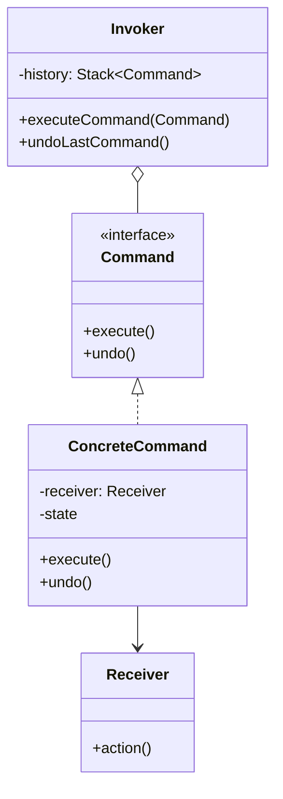
```mermaid
classDiagram
    class Command {
        <<interface>>
        +execute()
        +undo()
    }
    class ConcreteCommand {
        -receiver: Receiver
        -state
        +execute()
        +undo()
    }
    class Invoker {
        -history: Stack~Command~
        +executeCommand(Command)
        +undoLastCommand()
    }
    class Receiver {
        +action()
    }

    Command <|.. ConcreteCommand
    Invoker o-- Command
    ConcreteCommand --> Receiver
```

```java
// Command interface
interface Command {
    void execute();
    void undo();
}

// Receiver
class TextEditor {
    private StringBuilder content = new StringBuilder();

    void insert(int position, String text) {
        content.insert(position, text);
    }

    void delete(int position, int length) {
        content.delete(position, position + length);
    }

    String getContent() { return content.toString(); }
}

// Concrete Command
class InsertCommand implements Command {
    private final TextEditor editor;
    private final int position;
    private final String text;

    InsertCommand(TextEditor editor, int position, String text) {
        this.editor = editor;
        this.position = position;
        this.text = text;
    }

    public void execute() {
        editor.insert(position, text);
    }

    public void undo() {
        editor.delete(position, text.length());
    }
}

// Invoker with history
class CommandHistory {
    private final Deque<Command> history = new ArrayDeque<>();

    void execute(Command cmd) {
        cmd.execute();
        history.push(cmd);
    }

    void undo() {
        if (!history.isEmpty()) {
            Command cmd = history.pop();
            cmd.undo();
        }
    }
}
```

Command パターンの本質は、「**操作を一級市民（first-class object）として扱う**」ことにある。操作をオブジェクト化することで、操作の保存、転送、遅延実行、取り消しが可能になる。

### 5.4 Iterator

**解決する問題**: コレクションの内部構造を公開せずに、その要素を**順番にアクセス**する方法を提供したい。

配列、リンクリスト、ツリー、グラフなど、異なるデータ構造に対して統一的な走査インターフェースを提供する。

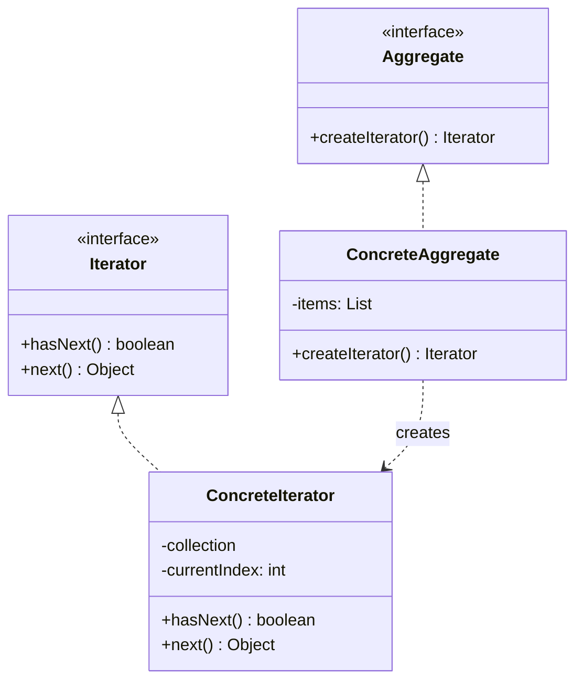
```mermaid
classDiagram
    class Iterator {
        <<interface>>
        +hasNext() boolean
        +next() Object
    }
    class ConcreteIterator {
        -collection
        -currentIndex: int
        +hasNext() boolean
        +next() Object
    }
    class Aggregate {
        <<interface>>
        +createIterator() Iterator
    }
    class ConcreteAggregate {
        -items: List
        +createIterator() Iterator
    }

    Iterator <|.. ConcreteIterator
    Aggregate <|.. ConcreteAggregate
    ConcreteAggregate ..> ConcreteIterator : creates
```

```java
// Custom collection with iterator
class BinaryTree<T> implements Iterable<T> {
    private Node<T> root;

    // In-order iterator
    @Override
    public Iterator<T> iterator() {
        return new InOrderIterator<>(root);
    }

    private static class InOrderIterator<T> implements Iterator<T> {
        private final Deque<Node<T>> stack = new ArrayDeque<>();

        InOrderIterator(Node<T> root) {
            pushLeftBranch(root);
        }

        private void pushLeftBranch(Node<T> node) {
            while (node != null) {
                stack.push(node);
                node = node.left;
            }
        }

        public boolean hasNext() {
            return !stack.isEmpty();
        }

        public T next() {
            Node<T> node = stack.pop();
            pushLeftBranch(node.right);
            return node.value;
        }
    }
}

// Usage - client doesn't know about tree internals
BinaryTree<Integer> tree = new BinaryTree<>();
for (int value : tree) {
    System.out.println(value);
}
```

Iterator パターンは現代の言語に深く組み込まれている。Java の `Iterable`/`Iterator`、Python の `__iter__`/`__next__`、Rust の `Iterator` トレイトなどがその例である。これらは言語機能として標準化されているため、パターンを明示的に実装する場面は減っている。

### 5.5 Template Method

**解決する問題**: アルゴリズムの**骨格**をスーパークラスで定義し、一部のステップの実装をサブクラスに委ねたい。アルゴリズムの全体構造を変えることなく、特定のステップだけをカスタマイズ可能にする。

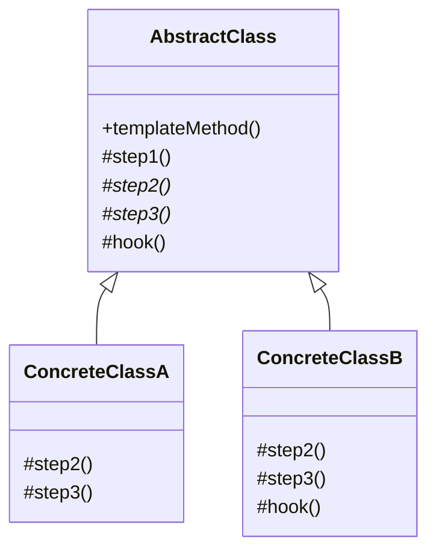
```mermaid
classDiagram
    class AbstractClass {
        +templateMethod()
        #step1()
        #step2()*
        #step3()*
        #hook()
    }
    class ConcreteClassA {
        #step2()
        #step3()
    }
    class ConcreteClassB {
        #step2()
        #step3()
        #hook()
    }

    AbstractClass <|-- ConcreteClassA
    AbstractClass <|-- ConcreteClassB
```

```java
// Template Method pattern
abstract class DataMiner {
    // Template method defines the algorithm skeleton
    public final void mine(String source) {
        openSource(source);
        String rawData = extractData();
        List<Record> data = parseData(rawData);
        List<Record> analyzed = analyzeData(data);
        generateReport(analyzed);
        closeSource();
    }

    // Concrete steps
    private void generateReport(List<Record> data) {
        // Common report generation logic
    }

    // Abstract steps - must be implemented by subclasses
    protected abstract void openSource(String source);
    protected abstract String extractData();
    protected abstract List<Record> parseData(String rawData);
    protected abstract void closeSource();

    // Hook - optional override point
    protected List<Record> analyzeData(List<Record> data) {
        return data; // Default: no analysis
    }
}

class CsvDataMiner extends DataMiner {
    protected void openSource(String source) { /* open CSV file */ }
    protected String extractData() { /* read CSV content */ return ""; }
    protected List<Record> parseData(String rawData) { /* parse CSV */ return List.of(); }
    protected void closeSource() { /* close file handle */ }
}

class DatabaseDataMiner extends DataMiner {
    protected void openSource(String source) { /* connect to DB */ }
    protected String extractData() { /* execute query */ return ""; }
    protected List<Record> parseData(String rawData) { /* map result set */ return List.of(); }
    protected void closeSource() { /* close connection */ }
}
```

Template Method は**ハリウッドの原則（"Don't call us, we'll call you"）**を体現するパターンである。フレームワークがアルゴリズムの全体フローを制御し、カスタマイズポイントだけをアプリケーションコードに委譲する。

### 5.6 State

**解決する問題**: オブジェクトの内部状態に応じて振る舞いを変化させたい。**状態遷移のロジック**を明確にし、条件分岐の複雑さを解消したい。

TCP接続の状態管理（LISTEN、ESTABLISHED、CLOSED など）、ワークフローエンジン、ゲームキャラクターの行動パターン切り替えなどに適用される。

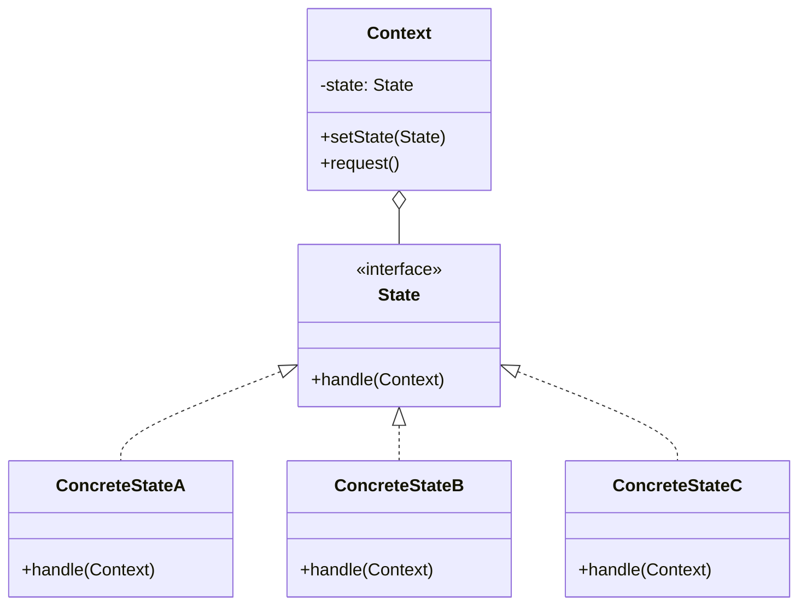
```mermaid
classDiagram
    class Context {
        -state: State
        +setState(State)
        +request()
    }
    class State {
        <<interface>>
        +handle(Context)
    }
    class ConcreteStateA {
        +handle(Context)
    }
    class ConcreteStateB {
        +handle(Context)
    }
    class ConcreteStateC {
        +handle(Context)
    }

    Context o-- State
    State <|.. ConcreteStateA
    State <|.. ConcreteStateB
    State <|.. ConcreteStateC
```

```java
// State interface
interface OrderState {
    void next(Order order);
    void cancel(Order order);
    String getStatus();
}

// Concrete States
class PendingState implements OrderState {
    public void next(Order order) {
        order.setState(new PaidState());
    }
    public void cancel(Order order) {
        order.setState(new CancelledState());
    }
    public String getStatus() { return "PENDING"; }
}

class PaidState implements OrderState {
    public void next(Order order) {
        order.setState(new ShippedState());
    }
    public void cancel(Order order) {
        // Refund logic required
        order.setState(new CancelledState());
    }
    public String getStatus() { return "PAID"; }
}

class ShippedState implements OrderState {
    public void next(Order order) {
        order.setState(new DeliveredState());
    }
    public void cancel(Order order) {
        throw new IllegalStateException("Cannot cancel shipped order");
    }
    public String getStatus() { return "SHIPPED"; }
}

// Context
class Order {
    private OrderState state = new PendingState();

    void setState(OrderState state) { this.state = state; }
    void next() { state.next(this); }
    void cancel() { state.cancel(this); }
    String getStatus() { return state.getStatus(); }
}
```

State パターンは、巨大な `switch` 文や状態フラグの乱立を回避するための構造化された手法である。状態ごとの振る舞いが独立したクラスに分離されるため、新しい状態の追加が容易であり、既存の状態に影響を与えない。

## 6. パターン間の関係性

GoFのデザインパターンは孤立した存在ではなく、互いに関連し合っている。以下にいくつかの重要な関係を示す。

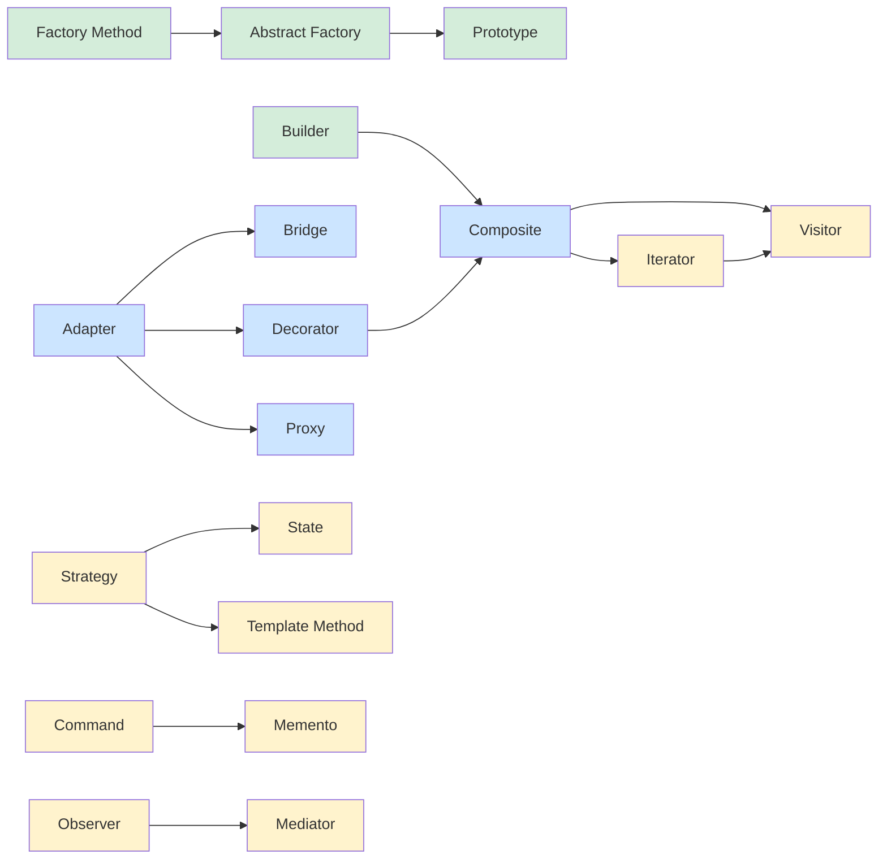
```mermaid
graph LR
    Factory["Factory Method"] --> AbstractFactory["Abstract Factory"]
    AbstractFactory --> Prototype
    Builder --> Composite

    Adapter --> Bridge
    Adapter --> Decorator
    Adapter --> Proxy
    Decorator --> Composite
    Composite --> Iterator
    Composite --> Visitor

    Strategy --> State
    Strategy --> TemplateMethod["Template Method"]
    Command --> Memento
    Observer --> Mediator
    Iterator --> Visitor

    style Factory fill:#d4edda
    style AbstractFactory fill:#d4edda
    style Prototype fill:#d4edda
    style Builder fill:#d4edda
    style Adapter fill:#cce5ff
    style Bridge fill:#cce5ff
    style Decorator fill:#cce5ff
    style Proxy fill:#cce5ff
    style Composite fill:#cce5ff
    style Strategy fill:#fff3cd
    style State fill:#fff3cd
    style TemplateMethod fill:#fff3cd
    style Command fill:#fff3cd
    style Memento fill:#fff3cd
    style Observer fill:#fff3cd
    style Mediator fill:#fff3cd
    style Iterator fill:#fff3cd
    style Visitor fill:#fff3cd
```

::: details パターン間の代表的な関係
- **Strategy と State**: 構造はほぼ同一だが、意図が異なる。Strategy はアルゴリズムの交換、State は状態に応じた振る舞いの変更を目的とする
- **Adapter と Decorator と Proxy**: いずれも既存のオブジェクトを「包む（wrap）」が、Adapter はインターフェースの変換、Decorator は機能の追加、Proxy はアクセスの制御を目的とする
- **Factory Method と Abstract Factory**: Factory Method は単一のオブジェクト生成、Abstract Factory は関連オブジェクト群の生成を扱う
- **Template Method と Strategy**: Template Method は継承で振る舞いを変え、Strategy は委譲で振る舞いを変える。現代では Strategy（委譲）が好まれる傾向にある
- **Composite と Iterator**: Composite で構築した木構造を走査するために Iterator が使われることが多い
- **Command と Memento**: Command の undo 機能を実現するために、実行前の状態を Memento で保存する
:::

## 7. モダンな言語機能による代替

GoF のデザインパターンは1994年に、主に C++ と Smalltalk を念頭に置いて設計された。その後の30年で、プログラミング言語は大きく進化し、パターンの一部は言語機能そのもので代替可能になっている。

### 7.1 関数型プログラミングによる代替

関数がファーストクラスの値として扱える言語では、振る舞いパターンの多くが関数の受け渡しで実現できる。

**Strategy パターンの代替**:

```java
// GoF style
interface SortStrategy { void sort(int[] data); }
class QuickSortStrategy implements SortStrategy { /* ... */ }

// Modern Java - lambda / method reference
List<String> names = List.of("Charlie", "Alice", "Bob");
names.stream()
     .sorted(Comparator.naturalOrder())  // Strategy as function
     .forEach(System.out::println);
```

```python
# Python - functions as strategies
def compress_gzip(data):
    # gzip implementation
    pass

def compress_zstd(data):
    # zstd implementation
    pass

def process(data, compress_fn):
    return compress_fn(data)

# Strategy selection via function passing
result = process(my_data, compress_zstd)
```

**Command パターンの代替**:

```python
# Python - closures capture state, replacing Command objects
def make_insert_command(editor, position, text):
    def execute():
        editor.insert(position, text)
    def undo():
        editor.delete(position, len(text))
    return execute, undo

# Usage
execute, undo = make_insert_command(editor, 0, "Hello")
execute()  # Execute
undo()     # Undo
```

**Observer パターンの代替**:

```typescript
// TypeScript - reactive streams replace Observer
import { Subject, filter, map } from 'rxjs';

const events$ = new Subject<Event>();

// Declarative subscription with operators
events$.pipe(
    filter(e => e.type === 'click'),
    map(e => e.target)
).subscribe(target => {
    console.log('Clicked:', target);
});
```

### 7.2 ジェネリクスとトレイトによる代替

型パラメータ（ジェネリクス）とトレイト/インターフェースのデフォルト実装により、パターンの一部は型システムに吸収される。

**Iterator パターン — Rust のトレイト**:

```rust
// Rust - Iterator is a built-in trait with default methods
struct Fibonacci {
    a: u64,
    b: u64,
}

impl Iterator for Fibonacci {
    type Item = u64;

    fn next(&mut self) -> Option<Self::Item> {
        let result = self.a;
        let new_b = self.a + self.b;
        self.a = self.b;
        self.b = new_b;
        Some(result)
    }
}

// All Iterator methods (map, filter, take, etc.) available for free
let sum: u64 = Fibonacci { a: 0, b: 1 }
    .take(20)
    .filter(|&x| x % 2 == 0)
    .sum();
```

**Template Method — トレイトのデフォルト実装**:

```rust
// Rust - trait with default implementation replaces Template Method
trait DataMiner {
    // Required methods (abstract steps)
    fn extract(&self) -> String;
    fn parse(&self, raw: &str) -> Vec<Record>;

    // Default method defines the algorithm skeleton
    fn mine(&self) -> Report {
        let raw = self.extract();
        let data = self.parse(&raw);
        self.generate_report(&data)
    }

    // Hook with default behavior
    fn generate_report(&self, data: &[Record]) -> Report {
        Report::default()
    }
}
```

### 7.3 パターンマッチングと代数的データ型

Rust、Scala、Kotlin などの言語では、代数的データ型とパターンマッチングにより、State パターンや Visitor パターンを型安全に表現できる。

```rust
// Rust - enum + match replaces State pattern
enum OrderState {
    Pending,
    Paid { amount: f64 },
    Shipped { tracking: String },
    Delivered,
    Cancelled,
}

impl OrderState {
    fn next(self) -> Result<OrderState, String> {
        match self {
            OrderState::Pending => Ok(OrderState::Paid { amount: 0.0 }),
            OrderState::Paid { .. } => Ok(OrderState::Shipped {
                tracking: String::new(),
            }),
            OrderState::Shipped { .. } => Ok(OrderState::Delivered),
            OrderState::Delivered => Err("Already delivered".into()),
            OrderState::Cancelled => Err("Order cancelled".into()),
        }
    }
}
```

### 7.4 まとめ：言語機能とパターンの対応

以下の表に、言語機能の進化によって簡素化または不要になったパターンをまとめる。

| パターン | 代替する言語機能 | 備考 |
|---|---|---|
| Strategy | ファーストクラス関数、ラムダ | 単一メソッドのインターフェースが関数で代替可能 |
| Command | クロージャ | 状態を捕捉した関数で代替可能 |
| Template Method | トレイトのデフォルト実装 | 継承なしで実現可能 |
| Iterator | 言語組み込みのイテレータプロトコル | ほぼすべての現代言語に標準搭載 |
| Observer | リアクティブストリーム、イベントシステム | RxJS、Kotlin Flow など |
| State | 代数的データ型 + パターンマッチ | コンパイル時に網羅性を検証可能 |
| Singleton | DI コンテナのスコープ管理 | Spring の `@Scope("singleton")` など |
| Visitor | パターンマッチ + sealed class | Kotlin の sealed class が代表例 |

::: warning パターンが不要になったわけではない
言語機能がパターンの実装を簡素化しても、パターンが解決する**問題そのもの**は消えていない。たとえば、Strategy パターンをラムダで実装したとしても、「アルゴリズムを交換可能にする」という設計判断自体は依然として Strategy パターンである。形式が変わっただけで、設計の意図は同じである。
:::

## 8. アンチパターンとパターンの過剰適用の危険性

### 8.1 パターン病（Pattern-itis）

デザインパターンを学びたての開発者が陥りやすい最大の罠は、**あらゆる場面でパターンを適用しようとすること**である。この現象は "Pattern-itis"（パターン病）と呼ばれる。

典型的な症状は以下の通りである。

- **Singleton の濫用**: あらゆるサービスクラスを Singleton にし、グローバル状態が蔓延する
- **不要な Abstract Factory**: 具象クラスが1つしかないのにファクトリを作成する
- **過剰な Observer**: 単純なメソッド呼び出しで済むところにイベントシステムを導入し、処理の流れが追えなくなる
- **無意味な Decorator**: 1つの機能しか追加しないのに Decorator パターンを適用し、コードが複雑になる

```java
// Over-engineering: unnecessary pattern application
// Bad - Factory for a single type
interface LoggerFactory {
    Logger createLogger();
}
class ConsoleLoggerFactory implements LoggerFactory {
    public Logger createLogger() { return new ConsoleLogger(); }
}
// This factory adds no value - just use "new ConsoleLogger()"

// Good - Direct instantiation when there's only one type
Logger logger = new ConsoleLogger();
```

### 8.2 YAGNI（You Aren't Gonna Need It）

パターンを適用する前に、以下の問いに誠実に答える必要がある。

1. **今、この柔軟性が本当に必要か？** — 将来の拡張のために今パターンを入れるのは時期尚早な最適化と同じ
2. **パターン適用によるコストは？** — クラス数の増加、間接参照の増加、コードの可読性低下
3. **より単純な解決策はないか？** — 条件分岐が2つしかないなら `if-else` で十分な場合が多い

::: danger パターンの過剰適用はアンチパターンである
「コードは書く時間より読む時間のほうが長い」という格言がある。パターンの過剰適用は、処理の流れを追いにくくし、結果的にコードの保守性を下げる。パターンは問題を解決するための道具であり、適用すること自体が目的ではない。
:::

### 8.3 パターンの悪用例

**Singleton のグローバル状態問題**:

```java
// Anti-pattern: Singleton holding mutable global state
class AppConfig {
    private static AppConfig instance;
    private Map<String, String> settings = new HashMap<>();

    public static AppConfig getInstance() { /* ... */ }

    // Global mutable state - any code can change settings
    public void set(String key, String value) {
        settings.put(key, value);
    }

    public String get(String key) {
        return settings.get(key);
    }
}
// Problem: test A modifies settings, affecting test B
// Problem: hard to track who changed what and when
```

**Observer のスパゲッティイベント問題**:

```
UserController
  → fires "user.updated"
    → ProfileService listens
      → fires "profile.updated"
        → NotificationService listens
          → fires "notification.sent"
            → AnalyticsService listens
              → ... (where does it end?)
```

イベントチェーンが長くなると、デバッグ時に処理の流れを追うことが極めて困難になる。このような場合は、明示的なメソッド呼び出しのほうが保守性が高い。

## 9. 現代のソフトウェア開発におけるデザインパターンの位置づけ

### 9.1 フレームワークへの内包

現代の主要なフレームワークは、GoF のデザインパターンを内部で広範囲に使用している。開発者はパターンを意識せずとも、フレームワークを通じてパターンの恩恵を受けている。

| フレームワーク / ライブラリ | 使用パターン | 具体例 |
|---|---|---|
| Spring Framework | Factory, Singleton, Proxy, Template Method, Observer | Bean Factory, AOP Proxy, JdbcTemplate, ApplicationEvent |
| React | Observer, Composite, Strategy | Hooks の状態管理、コンポーネントツリー、レンダリング戦略 |
| Java Streams API | Iterator, Strategy, Builder | Stream パイプライン、Collector |
| Express.js / Koa | Chain of Responsibility, Decorator | ミドルウェアパイプライン |
| Redux | Command, Observer, Singleton | Action（Command）、Store（Observer + Singleton） |

### 9.2 アーキテクチャパターンとの関係

GoF のデザインパターンは**クラスレベル**の設計に関するものだが、より大きなスケールでは**アーキテクチャパターン**が存在する。両者は相補的な関係にある。

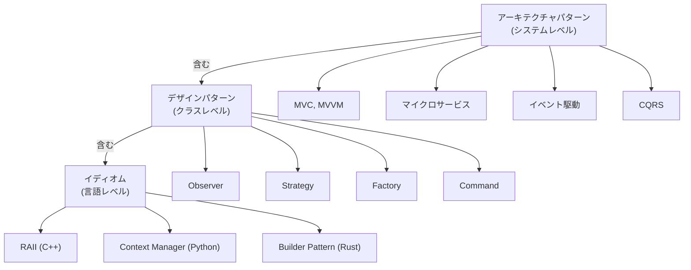
```mermaid
graph TB
    A["アーキテクチャパターン<br>(システムレベル)"]
    B["デザインパターン<br>(クラスレベル)"]
    C["イディオム<br>(言語レベル)"]

    A --> |"含む"| B
    B --> |"含む"| C

    A1["MVC, MVVM"]
    A2["マイクロサービス"]
    A3["イベント駆動"]
    A4["CQRS"]

    B1["Observer"]
    B2["Strategy"]
    B3["Factory"]
    B4["Command"]

    C1["RAII (C++)"]
    C2["Context Manager (Python)"]
    C3["Builder Pattern (Rust)"]

    A --> A1
    A --> A2
    A --> A3
    A --> A4
    B --> B1
    B --> B2
    B --> B3
    B --> B4
    C --> C1
    C --> C2
    C --> C3
```

- **MVC（Model-View-Controller）**: Observer（Model と View の連携）、Strategy（Controller の切り替え）、Composite（View の階層構造）を組み合わせたアーキテクチャパターン
- **マイクロサービス**: Facade（API Gateway）、Proxy（Service Mesh の Sidecar）、Observer（イベント駆動通信）が活用される
- **CQRS**: Command パターンを拡張し、読み取りと書き込みのモデルを分離するアーキテクチャパターン

### 9.3 新しいパターンの登場

GoF 以降も、ソフトウェア開発の現場からは新しいパターンが生まれ続けている。

- **Repository パターン**: データアクセスの抽象化（Domain-Driven Design で一般化）
- **Dependency Injection**: Singleton を代替し、テスト容易性を向上させる
- **Circuit Breaker**: 分散システムにおける障害伝播の防止
- **Saga パターン**: 分散トランザクションの代替としての補償トランザクション
- **Sidecar パターン**: マイクロサービスにおける横断的関心事の分離

これらは GoF パターンの延長線上にありつつも、分散システムやクラウドネイティブ環境という新しいコンテキストに適応したものである。

### 9.4 パターンの学び方

デザインパターンを効果的に学ぶためには、以下の段階を踏むことが重要である。

1. **まず問題を経験する**: パターンが解決する問題に実際に遭遇し、痛みを感じてからパターンを学ぶ。問題を知らないままパターンを学んでも、適切に適用できない
2. **原則を理解する**: SOLID原則、DRY原則、関心の分離など、パターンの背後にある設計原則を理解する。パターンは原則を具体化したものにすぎない
3. **実際のコードベースで読む**: Java の標準ライブラリ、Spring、React などの実際のプロジェクトでパターンがどう使われているかを読む
4. **適用を慎重に行う**: 「このパターンを使いたい」ではなく「この問題をどう解決するか」から出発し、結果としてパターンに到達するのが理想的な流れである

::: tip パターンは共通語彙である
デザインパターンの最も大きな価値は、コードを書く技術そのものではなく、**設計上の意図を開発者間で効率的に伝達するための共通語彙**を提供することにある。「ここは Strategy パターンで実装しています」と言えば、チームメンバーはコードの構造と意図を即座に理解できる。
:::

## 10. まとめ

GoF のデザインパターンは、1994年の出版から30年以上が経過した現在もなお、ソフトウェア設計における重要な知識体系であり続けている。本記事の要点を以下にまとめる。

**パターンの本質**:
- デザインパターンは「問題—解決策」の対応関係を名前付きで体系化したものである
- 建築のパターンランゲージに触発され、オブジェクト指向ソフトウェア設計に適用された
- パターンの価値はコードテンプレートではなく、設計意図を伝える共通語彙にある

**3つのカテゴリ**:
- **生成パターン**: オブジェクト生成の柔軟性を高める（Factory Method, Abstract Factory, Singleton, Builder）
- **構造パターン**: クラスやオブジェクトの組み合わせ方を定義する（Adapter, Decorator, Facade, Composite, Proxy）
- **振る舞いパターン**: オブジェクト間の責務と通信を整理する（Strategy, Observer, Command, Iterator, Template Method, State）

**現代における変化**:
- 関数型プログラミング、ジェネリクス、代数的データ型などの言語機能により、パターンの実装は簡素化されている
- パターンが解決する問題自体は消えておらず、形式が変わっただけである
- フレームワークがパターンを内包しており、開発者が明示的に実装する場面は減っている

**適用上の注意**:
- パターンの過剰適用（Pattern-itis）は、コードの複雑性を不必要に増大させる
- 「このパターンを使いたい」ではなく「この問題をどう解決するか」から出発すべきである
- YAGNI の原則を常に意識し、今必要な柔軟性だけを実装する

デザインパターンは万能薬ではない。しかし、繰り返し現れる設計上の問題に対して、先人の知恵を凝縮した解決策のカタログとして、その価値は今後も変わらないだろう。重要なのは、パターンを暗記することではなく、パターンが解決する問題を理解し、適切なタイミングで適切なパターンを選択できる判断力を養うことである。
