# デザインシステム構築

## 1. デザインシステムの定義と目的

### 1.1 デザインシステムとは何か

**デザインシステム**とは、プロダクトのUI/UXに一貫性と効率性をもたらすための、デザイン原則・ガイドライン・再利用可能なコンポーネント・ツールの集合体である。単なるスタイルガイドやコンポーネントライブラリとは異なり、プロダクト開発にかかわるすべての関係者――デザイナー、エンジニア、プロダクトマネージャー、コンテンツライター――が共有する「共通言語」として機能する。

デザインシステムの構成要素を整理すると、次のような階層構造を持つ。

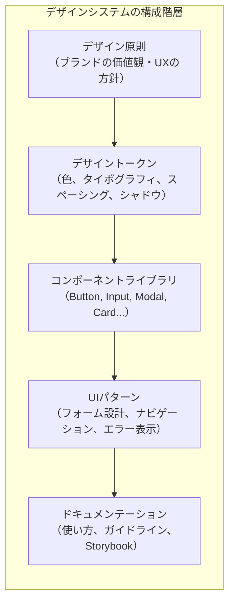

### 1.2 デザインシステムが解決する問題

デザインシステムが存在しない組織では、以下のような問題が繰り返し発生する。

**UIの一貫性の欠如**：チームやプロダクトごとにボタンの色、フォントサイズ、余白の取り方がばらばらになる。ユーザーは同じブランドのサービスであるにもかかわらず、画面ごとに異なる操作感を強いられる。

**車輪の再発明**：あるチームが作成したDatePickerコンポーネントが、別のチームでは存在を知らないまま独自に再実装される。結果として、同じ機能を持つが微妙に異なる実装が散在する。

**デザインとエンジニアリングの断絶**：デザイナーがFigmaで指定した余白8pxが、エンジニアの実装では10pxになっていても気づかれない。デザインファイルと実装の間の整合性を維持するプロセスがない。

**スケーリングの限界**：プロダクトの数やチームの規模が拡大したとき、一貫した品質を維持するコストが指数的に増大する。

### 1.3 デザインシステムの歴史的背景

デザインシステムの概念は、GoogleのMaterial Design（2014年）やSalesforceのLightning Design System（2015年）が先駆けとなり広まった。しかし、その根底にある考え方はそれ以前から存在していた。

2008年頃のWebフレームワークの隆盛とともにCSSフレームワーク（Bootstrap, Foundationなど）が登場し、UIの部品化という考え方が普及した。しかしCSSフレームワークは「見た目のテンプレート」にとどまり、デザインの意思決定プロセスやコンポーネントの振る舞いを体系的に管理する仕組みにはなりえなかった。

現代のデザインシステムは、**デザインの意思決定を体系化・自動化し、組織全体で共有するインフラ**という位置づけにある。Brad Frostが2013年に提唱したAtomic Designや、Nathan CurtisのModular Web Designが理論的な基盤を形成し、Storybookの登場（2016年）がコンポーネント開発のワークフローを変革した。

### 1.4 デザインシステムとスタイルガイドの違い

デザインシステムは、しばしばスタイルガイドやコンポーネントライブラリと混同される。これらの関係を明確に整理しておく。

| 概念 | スコープ | 例 |
|---|---|---|
| スタイルガイド | 色・フォント・ロゴの使用規則 | ブランドガイドライン |
| コンポーネントライブラリ | 再利用可能なUIコンポーネントの実装 | MUI, Ant Design |
| パターンライブラリ | UIパターンの使い方ガイド | フォームのバリデーション表示 |
| **デザインシステム** | **上記すべて＋原則＋プロセス＋ツール** | Material Design, Polaris |

スタイルガイドは「何を使うか」を定義するが、デザインシステムは「なぜそうするのか」「いつ使うのか」「どう拡張するのか」までを包含する。

---

## 2. デザイントークン

### 2.1 デザイントークンとは

**デザイントークン**（Design Tokens）とは、デザインの基本的な意思決定（色、フォント、余白、影、角丸など）を、プラットフォームに依存しない形式で表現した変数の集合である。Salesforceが2014年に提唱し、現在ではW3C Design Tokens Community Groupが標準化を進めている。

デザイントークンの本質は、デザインの「値」を「意味」から分離することにある。たとえば `#0066CC` という色そのものではなく、「プライマリーアクションの色」という意味を持つトークンとして定義する。

```json
{
  "color": {
    "primary": {
      "$value": "#0066CC",
      "$type": "color",
      "$description": "Primary action color used for main CTAs"
    },
    "primary-hover": {
      "$value": "#004C99",
      "$type": "color",
      "$description": "Hover state for primary actions"
    },
    "text": {
      "default": {
        "$value": "#1A1A1A",
        "$type": "color",
        "$description": "Default text color"
      },
      "muted": {
        "$value": "#6B7280",
        "$type": "color",
        "$description": "Secondary/muted text color"
      }
    }
  },
  "spacing": {
    "xs": { "$value": "4px", "$type": "dimension" },
    "sm": { "$value": "8px", "$type": "dimension" },
    "md": { "$value": "16px", "$type": "dimension" },
    "lg": { "$value": "24px", "$type": "dimension" },
    "xl": { "$value": "32px", "$type": "dimension" }
  }
}
```

### 2.2 トークンの階層構造

デザイントークンは通常、3つの階層に分けて管理される。この階層構造によって、一箇所の変更がシステム全体に適切に伝播する仕組みを実現する。

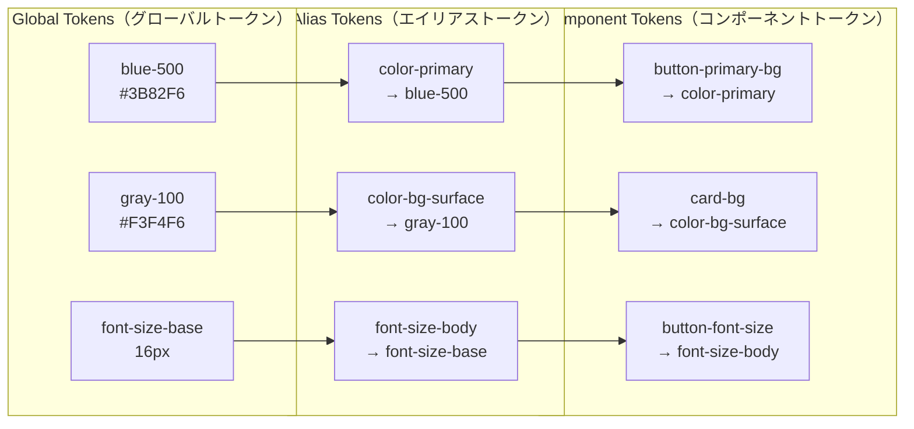

**Global Tokens（プリミティブトークン）**：色のパレット（`blue-500`）、フォントサイズのスケール（`font-size-16`）など、意味を持たない生の値。デザイン上の文脈がなく、直接使用することは原則として避ける。

**Alias Tokens（セマンティックトークン）**：プリミティブトークンに意味を付与したもの。`color-primary`、`color-text-default`、`spacing-layout-gap` のように用途・文脈を名前で表現する。テーマの切り替えはこの層で行われる。

**Component Tokens（コンポーネントトークン）**：特定のコンポーネントに紐づくトークン。`button-primary-bg`、`input-border-radius` のようにコンポーネント名をプレフィックスとして持ち、エイリアストークンを参照する。

この3層構造の利点は、プライマリーカラーを変更したい場合、エイリアストークン `color-primary` の参照先をグローバルトークン `blue-500` から `green-600` に変えるだけで、ボタン、リンク、アイコンなどすべてのコンポーネントに変更が反映されることである。

### 2.3 トークンの変換パイプライン

デザイントークンは、プラットフォームごとに適切な形式に変換する必要がある。この変換処理を担うのが Style Dictionary や Tokens Studio のようなツールである。

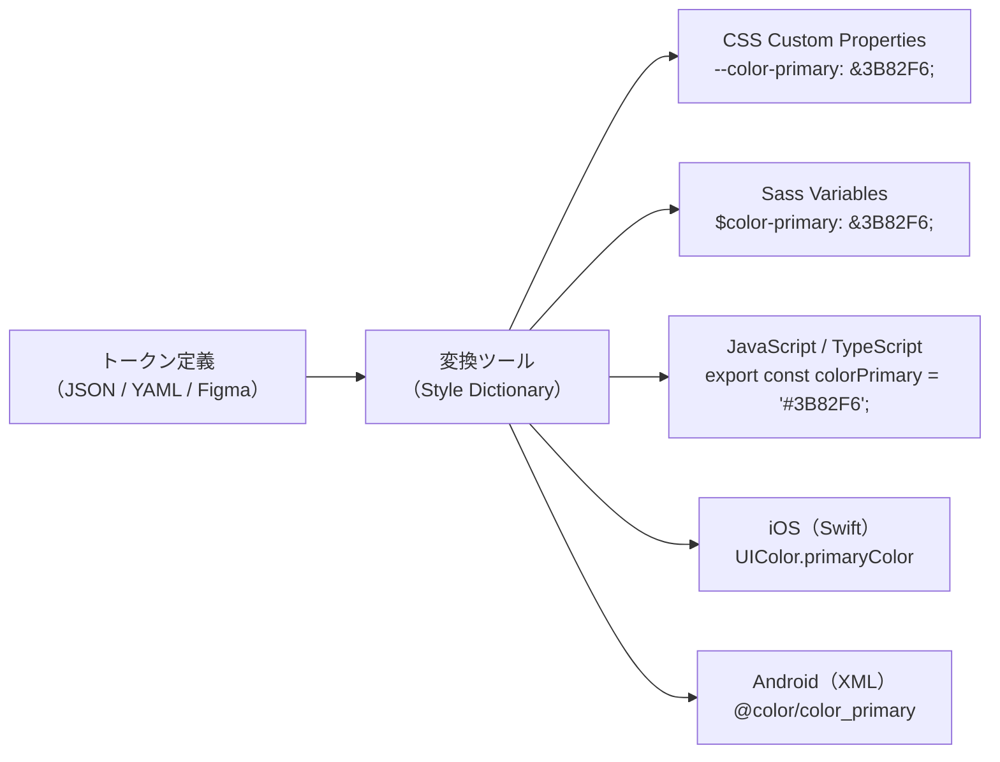

Style Dictionary を使ったトークン変換の設定例を示す。

```javascript
// style-dictionary.config.js
import StyleDictionary from "style-dictionary";

const sd = new StyleDictionary({
  source: ["tokens/**/*.json"],
  platforms: {
    css: {
      transformGroup: "css",
      buildPath: "dist/css/",
      files: [
        {
          destination: "variables.css",
          format: "css/variables",
          // Filter to only include tokens for web
          filter: (token) => token.attributes.category !== "asset",
        },
      ],
    },
    js: {
      transformGroup: "js",
      buildPath: "dist/js/",
      files: [
        {
          destination: "tokens.js",
          format: "javascript/es6",
        },
      ],
    },
    ios: {
      transformGroup: "ios-swift",
      buildPath: "dist/ios/",
      files: [
        {
          destination: "DesignTokens.swift",
          format: "ios-swift/class.swift",
          className: "DesignTokens",
        },
      ],
    },
  },
});

await sd.buildAllPlatforms();
```

このパイプラインによって生成される出力は次のようになる。

::: code-group

```css [CSS Custom Properties]
:root {
  --color-primary: #3b82f6;
  --color-primary-hover: #2563eb;
  --color-text-default: #1a1a1a;
  --spacing-xs: 4px;
  --spacing-sm: 8px;
  --spacing-md: 16px;
  --font-size-body: 16px;
  --border-radius-sm: 4px;
  --shadow-sm: 0 1px 2px 0 rgba(0, 0, 0, 0.05);
}
```

```typescript [TypeScript]
export const ColorPrimary = "#3b82f6";
export const ColorPrimaryHover = "#2563eb";
export const ColorTextDefault = "#1a1a1a";
export const SpacingXs = "4px";
export const SpacingSm = "8px";
export const SpacingMd = "16px";
export const FontSizeBody = "16px";
export const BorderRadiusSm = "4px";
```

:::

### 2.4 Figmaとの連携

現代のデザインシステム構築では、デザインツール（主にFigma）とコードのトークンを同期させることが重要な課題となる。Tokens Studio（旧Figma Tokens）を使うと、FigmaのVariablesとコード上のトークン定義を双方向で同期できる。

同期のワークフローは一般に次のようになる。

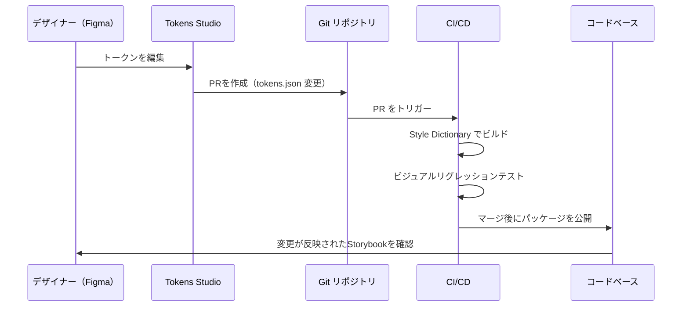

この仕組みによって、デザイナーがFigma上でトークンの値を変更すると、自動的にPRが作成され、レビュー・テスト・公開のパイプラインに乗る。コードとデザインの乖離を防ぐ重要な仕組みである。

---

## 3. コンポーネント設計原則

### 3.1 Atomic Design

Brad Frostが2013年に提唱した**Atomic Design**は、UIを化学の概念にならって5つの階層に分解する設計手法である。

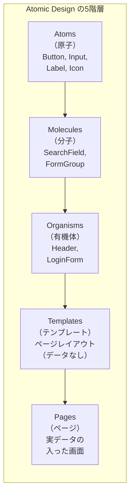

**Atoms（原子）**：UIの最小単位。これ以上分解すると機能を失う要素。ボタン、テキスト入力フィールド、ラベル、アイコンなど。HTML要素に近い粒度で、それ自体では十分な意味を持たないことが多い。

**Molecules（分子）**：複数のAtomsを組み合わせた、一つの機能を持つUIグループ。検索フィールド（ラベル＋テキスト入力＋ボタン）やフォームグループ（ラベル＋入力＋エラーメッセージ）が典型例。

**Organisms（有機体）**：Molecules やAtoms を組み合わせた、独立して意味を持つUI領域。ヘッダー、サイドバー、商品カードのリストなど。

**Templates（テンプレート）**：ページレベルのレイアウト構造。実際のコンテンツは入らず、コンポーネントの配置を定義する。

**Pages（ページ）**：Templatesに実際のコンテンツやデータを流し込んだもの。最終的なUIの姿であり、テストの対象でもある。

### 3.2 Atomic Designの実践的な課題

Atomic Designはコンポーネントの粒度を考える上での良いメンタルモデルだが、実務においてはいくつかの課題がある。

**分類の曖昧さ**：あるコンポーネントがMoleculeなのかOrganismなのか、チーム内で意見が分かれることが多い。たとえば、アバターとユーザー名を組み合わせたコンポーネントはMoleculeか？ ドロップダウンメニューを含むナビゲーションバーはOrganismか？ この曖昧さは命名規則の議論に時間を費やす原因となる。

**ディレクトリ構造の複雑さ**：`atoms/`, `molecules/`, `organisms/` のようなディレクトリ構造は、コンポーネント数が増えるとファイルの探索が困難になる。

そのため、多くの現実的なデザインシステムでは、Atomic Designの精神を取り入れつつ、もう少し簡略化した分類を採用する。

```
src/
├── primitives/        # Atoms: Button, Input, Text, Icon
├── components/        # Molecules + Organisms: SearchBar, UserCard, Header
├── layouts/           # Templates: PageLayout, SidebarLayout
└── features/          # Pages/Features: LoginPage, Dashboard
```

### 3.3 コンポーネントの設計指針

デザインシステムにおけるコンポーネントは、汎用的かつ堅牢であることが求められる。以下の設計指針が重要である。

#### 単一責任の原則

各コンポーネントは一つの明確な責務を持つべきである。`<Button>` は「クリック可能な操作要素」であり、レイアウトの制御やデータフェッチの責務を含むべきではない。

```tsx
// Good: single responsibility
function Button({ variant, size, children, onClick, disabled }: ButtonProps) {
  return (
    <button
      className={clsx(styles.button, styles[variant], styles[size])}
      onClick={onClick}
      disabled={disabled}
    >
      {children}
    </button>
  );
}

// Bad: too many responsibilities
function Button({ variant, children, onClick, fetchUrl, onSuccess }: Props) {
  // Button should not handle data fetching
  const handleClick = async () => {
    const res = await fetch(fetchUrl);
    onSuccess(await res.json());
  };
  return <button onClick={handleClick}>{children}</button>;
}
```

#### Compositionパターン

コンポーネントは、propsの列挙ではなくコンポジション（合成）によって拡張されるべきである。Reactの `children` や Slot パターンを活用する。

```tsx
// Composition-based API (preferred)
function Dialog({ children }: { children: React.ReactNode }) {
  return <div className={styles.dialog}>{children}</div>;
}

function DialogHeader({ children }: { children: React.ReactNode }) {
  return <div className={styles.header}>{children}</div>;
}

function DialogBody({ children }: { children: React.ReactNode }) {
  return <div className={styles.body}>{children}</div>;
}

function DialogFooter({ children }: { children: React.ReactNode }) {
  return <div className={styles.footer}>{children}</div>;
}

// Usage: flexible composition
<Dialog>
  <DialogHeader>Confirm Deletion</DialogHeader>
  <DialogBody>Are you sure you want to delete this item?</DialogBody>
  <DialogFooter>
    <Button variant="ghost">Cancel</Button>
    <Button variant="danger">Delete</Button>
  </DialogFooter>
</Dialog>
```

#### Controlled / Uncontrolled の二重対応

フォーム要素のようなステートフルなコンポーネントは、外部から制御される（Controlled）モードと、内部で状態を管理する（Uncontrolled）モードの両方をサポートする設計が望ましい。

```tsx
function Toggle({ value, defaultValue, onChange }: ToggleProps) {
  // Support both controlled and uncontrolled usage
  const [internalValue, setInternalValue] = useState(defaultValue ?? false);
  const isControlled = value !== undefined;
  const currentValue = isControlled ? value : internalValue;

  const handleChange = () => {
    const next = !currentValue;
    if (!isControlled) {
      setInternalValue(next);
    }
    onChange?.(next);
  };

  return (
    <button
      role="switch"
      aria-checked={currentValue}
      onClick={handleChange}
      className={clsx(styles.toggle, currentValue && styles.active)}
    >
      <span className={styles.thumb} />
    </button>
  );
}
```

#### Polymorphic Component（多態コンポーネント）

ボタンが `<button>` でもあり `<a>` でもある、といった場合に `as` propを使って基底要素を切り替えるパターンは、デザインシステムで広く採用されている。

```tsx
type ButtonProps<T extends React.ElementType = "button"> = {
  as?: T;
  variant: "primary" | "secondary" | "ghost";
  size?: "sm" | "md" | "lg";
  children: React.ReactNode;
} & Omit<React.ComponentPropsWithoutRef<T>, "as" | "variant" | "size">;

function Button<T extends React.ElementType = "button">({
  as,
  variant,
  size = "md",
  children,
  ...rest
}: ButtonProps<T>) {
  const Component = as ?? "button";
  return (
    <Component
      className={clsx(styles.button, styles[variant], styles[size])}
      {...rest}
    >
      {children}
    </Component>
  );
}

// Usage
<Button variant="primary" onClick={handleClick}>Submit</Button>
<Button as="a" variant="secondary" href="/about">About</Button>
```

### 3.4 コンポーネントのVariant設計

デザインシステムのコンポーネントは、`variant`、`size`、`color` などのプロパティによって外観を切り替える。この設計を体系的に行うために、Class Variance Authority（CVA）のようなユーティリティが利用される。

```typescript
import { cva, type VariantProps } from "class-variance-authority";

const buttonVariants = cva(
  // Base styles
  "inline-flex items-center justify-center rounded font-medium transition-colors focus-visible:outline-none focus-visible:ring-2",
  {
    variants: {
      variant: {
        primary: "bg-blue-600 text-white hover:bg-blue-700",
        secondary: "bg-gray-100 text-gray-900 hover:bg-gray-200",
        ghost: "text-gray-700 hover:bg-gray-100",
        danger: "bg-red-600 text-white hover:bg-red-700",
      },
      size: {
        sm: "h-8 px-3 text-sm",
        md: "h-10 px-4 text-base",
        lg: "h-12 px-6 text-lg",
      },
    },
    defaultVariants: {
      variant: "primary",
      size: "md",
    },
  }
);

type ButtonProps = React.ButtonHTMLAttributes<HTMLButtonElement> &
  VariantProps<typeof buttonVariants>;

function Button({ variant, size, className, ...props }: ButtonProps) {
  return (
    <button
      className={buttonVariants({ variant, size, className })}
      {...props}
    />
  );
}
```

---

## 4. Storybook

### 4.1 Storybookとは

**Storybook**は、UIコンポーネントを単体で開発・テスト・ドキュメント化するためのツールである。2016年にReact Storybook として登場し、現在ではReact、Vue、Angular、Web Components、Svelteなど主要なフレームワークをすべてサポートしている。

Storybookの核心は、コンポーネントを**アプリケーションのコンテキストから切り離して**表示するという発想にある。これにより、コンポーネントのすべての状態（通常状態、ホバー状態、ローディング状態、エラー状態、無効状態など）を一覧して確認・テストできる。

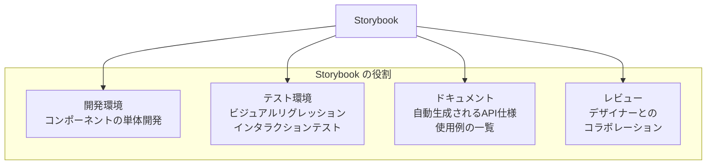

### 4.2 Storyの書き方

Storybookでは、コンポーネントの各状態を**Story**として定義する。Component Story Format（CSF）3.0では、次のような構文でStoryを記述する。

```tsx
// Button.stories.tsx
import type { Meta, StoryObj } from "@storybook/react";
import { Button } from "./Button";

const meta = {
  title: "Components/Button",
  component: Button,
  // Automatically generate arg controls from TypeScript types
  tags: ["autodocs"],
  argTypes: {
    variant: {
      control: { type: "select" },
      options: ["primary", "secondary", "ghost", "danger"],
      description: "Visual variant of the button",
    },
    size: {
      control: { type: "select" },
      options: ["sm", "md", "lg"],
    },
    disabled: {
      control: { type: "boolean" },
    },
  },
  args: {
    children: "Button",
  },
} satisfies Meta<typeof Button>;

export default meta;
type Story = StoryObj<typeof meta>;

// Each export becomes a Story
export const Primary: Story = {
  args: {
    variant: "primary",
    children: "Primary Button",
  },
};

export const Secondary: Story = {
  args: {
    variant: "secondary",
    children: "Secondary Button",
  },
};

export const AllSizes: Story = {
  render: () => (
    <div style={{ display: "flex", gap: "16px", alignItems: "center" }}>
      <Button variant="primary" size="sm">Small</Button>
      <Button variant="primary" size="md">Medium</Button>
      <Button variant="primary" size="lg">Large</Button>
    </div>
  ),
};

export const Loading: Story = {
  args: {
    variant: "primary",
    disabled: true,
    children: "Loading...",
  },
};
```

### 4.3 Storybook のアドオンエコシステム

Storybookの強力さは、豊富なアドオン（addon）エコシステムにある。主要なアドオンとその用途を整理する。

| アドオン | 用途 |
|---|---|
| `@storybook/addon-essentials` | Controls, Actions, Viewport, Backgrounds などの基本セット |
| `@storybook/addon-a11y` | axe-core によるアクセシビリティ自動チェック |
| `@storybook/addon-interactions` | play関数を使ったインタラクションテスト |
| `@storybook/addon-designs` | Figmaのデザインをストーリー横に表示 |
| `@storybook/test-runner` | Storybookのストーリーを自動テストとして実行 |
| `storybook-addon-pseudo-states` | `:hover`、`:focus`、`:active` などの擬似状態を強制表示 |

### 4.4 インタラクションテスト

Storybook 7以降では、`play` 関数を使ってコンポーネントのインタラクションテストをStory内に記述できる。Testing Library のAPIをそのまま使用できるため、既存のテスト知識が活きる。

```tsx
import { within, userEvent, expect } from "@storybook/test";

export const FormSubmission: Story = {
  args: {
    onSubmit: fn(),
  },
  play: async ({ canvasElement, args }) => {
    const canvas = within(canvasElement);

    // Fill in the form
    await userEvent.type(canvas.getByLabelText("Email"), "user@example.com");
    await userEvent.type(canvas.getByLabelText("Password"), "password123");

    // Submit the form
    await userEvent.click(canvas.getByRole("button", { name: "Sign In" }));

    // Assert the callback was called
    await expect(args.onSubmit).toHaveBeenCalledWith({
      email: "user@example.com",
      password: "password123",
    });
  },
};
```

### 4.5 ビジュアルリグレッションテスト

デザインシステムにおいて、コンポーネントの見た目の退行（ビジュアルリグレッション）を検知することは極めて重要である。Chromatic（Storybookの開発元であるChromatic社が提供するSaaS）は、Storybookの各ストーリーのスクリーンショットを前回のビルドと比較し、差分を検出する。

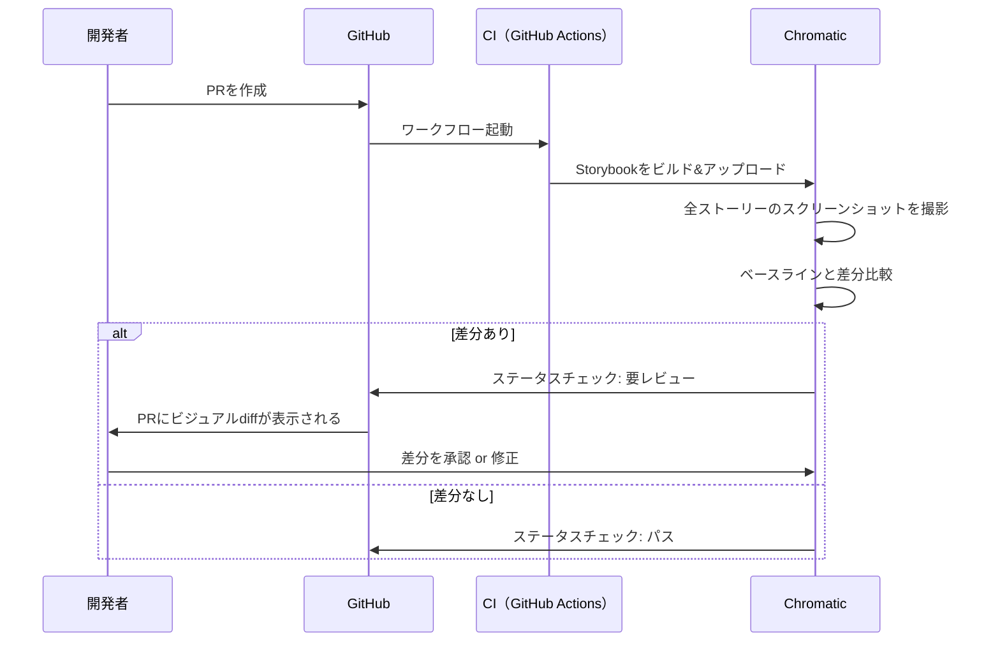

Chromatic以外にも、Percy（BrowserStack）、Applitools、reg-suit + Storycapなどのツールが同様の機能を提供する。特にOSSプロジェクトでは、reg-suit と Storycap を組み合わせた自前のビジュアルリグレッション環境を構築することも一般的である。

---

## 5. バージョニングと配布

### 5.1 パッケージとしての配布

デザインシステムのコンポーネントライブラリは、通常npmパッケージとして配布される。組織内部のプライベートレジストリ（npm private registry、GitHub Packages、Artifactoryなど）を利用するケースが大半だが、OSS として公開するプロジェクトもある。

パッケージの構成例を示す。

```
@myorg/design-system/
├── package.json
├── src/
│   ├── components/
│   │   ├── Button/
│   │   │   ├── Button.tsx
│   │   │   ├── Button.module.css
│   │   │   ├── Button.stories.tsx
│   │   │   ├── Button.test.tsx
│   │   │   └── index.ts
│   │   ├── Input/
│   │   └── Dialog/
│   ├── tokens/
│   │   ├── colors.json
│   │   ├── spacing.json
│   │   └── typography.json
│   └── index.ts           # Public API barrel file
├── dist/
│   ├── esm/               # ES Modules build
│   ├── cjs/               # CommonJS build
│   └── types/             # TypeScript declarations
└── .storybook/
```

`package.json` の設定で重要なのは、`exports` フィールドによるエントリポイントの明示と、Tree Shakingを有効にするための `sideEffects` 指定である。

```json
{
  "name": "@myorg/design-system",
  "version": "2.4.0",
  "exports": {
    ".": {
      "import": "./dist/esm/index.js",
      "require": "./dist/cjs/index.js",
      "types": "./dist/types/index.d.ts"
    },
    "./tokens": {
      "import": "./dist/esm/tokens/index.js",
      "require": "./dist/cjs/tokens/index.js"
    },
    "./css": "./dist/css/variables.css"
  },
  "sideEffects": ["**/*.css"],
  "peerDependencies": {
    "react": "^18.0.0 || ^19.0.0",
    "react-dom": "^18.0.0 || ^19.0.0"
  }
}
```

### 5.2 セマンティックバージョニング

デザインシステムのバージョニングは、Semantic Versioning（SemVer）に従う。しかし、デザインシステムにおける「破壊的変更」の定義は、一般的なライブラリよりも広い。

| 変更内容 | SemVer | 理由 |
|---|---|---|
| 新しいコンポーネントの追加 | Minor | 既存のAPIに影響しない |
| 既存コンポーネントへのオプショナルなprop追加 | Minor | 後方互換 |
| トークンの値の変更（色の微調整） | Patch or Minor | 見た目が変わるがAPIは不変 |
| prop名の変更・削除 | **Major** | 既存コードが壊れる |
| コンポーネントの削除 | **Major** | 依存先がビルドエラーになる |
| デフォルト値の変更 | **Major** | 暗黙の振る舞いが変わる |
| CSS クラス名の変更（外部からスタイルを上書きしている場合） | **Major** | 外部のスタイルが適用されなくなる |

### 5.3 Changesets によるリリース管理

モノレポにおけるデザインシステムのリリース管理には、**Changesets** が広く採用されている。Changesets は、各PRに「どのパッケージが」「どのSemVerバンプで」「どんな変更があったか」を記録する `.changeset` ファイルを追加するワークフローである。

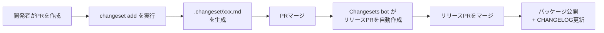

changeset ファイルの例を示す。

```markdown
---
"@myorg/design-system": minor
---

Added new `Badge` component with `variant` and `size` props.
```

リリースPRがマージされると、Changesets CLIがバージョンバンプ、CHANGELOG.mdの更新、npmパッケージの公開を自動的に行う。これにより、手動でバージョンを管理する煩雑さから解放される。

### 5.4 段階的な移行戦略

デザインシステムのメジャーバージョンアップは、利用側のプロダクトに大きな影響を与える。段階的な移行を支援するためのいくつかの戦略がある。

**Codemods**：jscodeshift のようなAST変換ツールを使って、APIの変更を自動的にコードに適用する。ReactのCoreチームも大規模なAPI変更ではcodemods を提供しており、デザインシステムでも同様のアプローチが有効である。

```javascript
// codemod: rename variant "default" to "secondary"
export default function transformer(file, api) {
  const j = api.jscodeshift;
  const root = j(file.source);

  root
    .find(j.JSXAttribute, {
      name: { name: "variant" },
      value: { value: "default" },
    })
    .forEach((path) => {
      path.node.value = j.stringLiteral("secondary");
    });

  return root.toSource();
}
```

**非推奨（Deprecation）フェーズ**：まずMinorバージョンで旧APIを `@deprecated` としてマークし、コンソール警告を出す。次のMajorバージョンで実際に削除する。利用者に猶予期間を与えることが重要である。

---

## 6. アクセシビリティ

### 6.1 デザインシステムとアクセシビリティの関係

デザインシステムは、組織全体のアクセシビリティ品質を底上げする最大のレバレッジポイントである。個々のプロダクトチームがWCAG（Web Content Accessibility Guidelines）を独自に学習し適用するよりも、デザインシステムのコンポーネントにアクセシビリティの知識を埋め込むことで、利用者は意識せずともアクセシブルなUIを構築できるようになる。

### 6.2 コンポーネントレベルのアクセシビリティ

デザインシステムのコンポーネントは、少なくとも以下のアクセシビリティ要件を満たす必要がある。

**キーボード操作**：すべてのインタラクティブ要素がキーボードで操作可能でなければならない。Tab による移動、Enter/Space によるアクティベーション、Escape によるキャンセル/閉じるなど、WAI-ARIA Authoring Practices に定義されたキーボードインタラクションパターンに従う。

**ARIAロールとプロパティ**：適切なセマンティクスが自動的に適用されるようにする。

```tsx
function AlertDialog({
  open,
  title,
  description,
  onConfirm,
  onCancel,
}: AlertDialogProps) {
  const titleId = useId();
  const descId = useId();

  if (!open) return null;

  return (
    <div
      role="alertdialog"
      aria-modal="true"
      aria-labelledby={titleId}
      aria-describedby={descId}
    >
      <h2 id={titleId}>{title}</h2>
      <p id={descId}>{description}</p>
      <div>
        <Button variant="ghost" onClick={onCancel}>
          Cancel
        </Button>
        <Button variant="danger" onClick={onConfirm} autoFocus>
          Confirm
        </Button>
      </div>
    </div>
  );
}
```

**フォーカス管理**：ダイアログが開いたときにフォーカスをダイアログ内に移動し、閉じたときにトリガー要素にフォーカスを戻す。フォーカストラップ（ダイアログ内でTabキーが循環する）も必須である。

**カラーコントラスト**：デザイントークンの時点でWCAG AA基準（通常テキストで4.5:1、大きなテキストで3:1）を満たすよう設計する。コントラストチェックをCIに組み込むことも効果的である。

### 6.3 アクセシビリティの自動テスト

Storybookの `@storybook/addon-a11y` はaxe-coreを内蔵しており、各ストーリーに対してアクセシビリティの自動チェックを行う。しかし自動テストで検出できるのは、アクセシビリティ問題全体の30-40%程度に過ぎない。

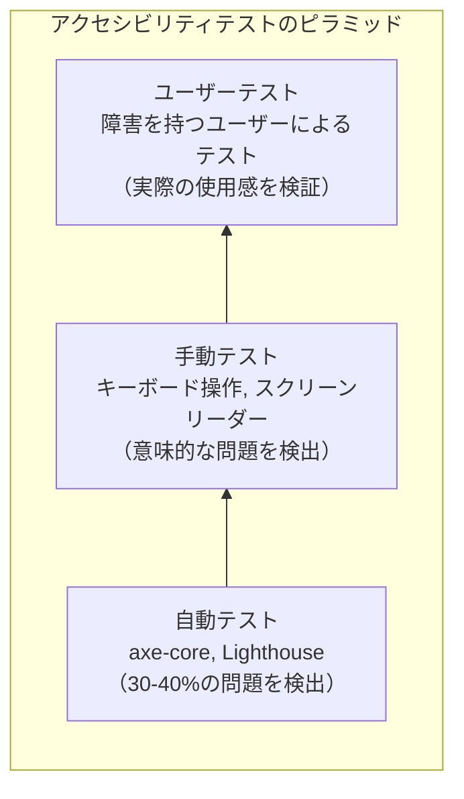

自動テストと手動テストを組み合わせた、実践的なアクセシビリティテスト戦略が重要である。

::: tip デザインシステムのアクセシビリティチェックリスト
- すべてのインタラクティブ要素がキーボードで操作できるか
- フォーカスインジケータが視認できるか
- カラーコントラストがWCAG AA以上を満たすか
- 画像・アイコンに代替テキストが提供されているか
- フォーム入力にラベルが関連付けられているか
- エラーメッセージがスクリーンリーダーで読み上げられるか
- モーションを無効にする `prefers-reduced-motion` に対応しているか
:::

### 6.4 Headless UIライブラリの活用

アクセシビリティの実装は複雑であり、特にフォーカス管理やキーボードインタラクションの正確な実装は困難を極める。この問題に対する現代的なアプローチとして、**Headless UI**ライブラリの活用がある。

Headless UIライブラリとは、アクセシビリティとインタラクションのロジックだけを提供し、見た目（スタイル）は利用者に委ねるコンポーネント群である。代表的なものに React Aria（Adobe）、Radix UI、Headless UI（Tailwind Labs）がある。

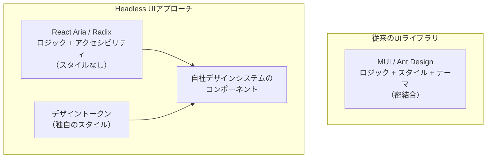

React Aria を使ったボタンの実装例を示す。

```tsx
import { useButton } from "react-aria";
import { useRef } from "react";

function Button(props: ButtonProps) {
  const ref = useRef<HTMLButtonElement>(null);
  // useButton handles: keyboard events, press events,
  // disabled state, ARIA attributes
  const { buttonProps } = useButton(props, ref);

  return (
    <button
      {...buttonProps}
      ref={ref}
      className={clsx(styles.button, styles[props.variant])}
    >
      {props.children}
    </button>
  );
}
```

Headless UIの利点は、アクセシビリティの専門知識をライブラリに委譲しつつ、見た目を完全にコントロールできる点にある。デザインシステムの構築において、アクセシビリティの実装負荷を大幅に削減する実践的な選択肢である。

---

## 7. テーマ対応

### 7.1 テーマの必要性

テーマ機能は、現代のデザインシステムにおいて事実上の必須要件となっている。最も一般的なのはライトモードとダークモードの切り替えだが、ブランドごとのテーマ（ホワイトラベル製品）、アクセシビリティ用のハイコントラストテーマ、季節やイベントに応じたテーマなど、用途は多岐にわたる。

### 7.2 CSS Custom Propertiesによるテーマ実装

テーマの実装で最も広く使われる手法は、CSS Custom Properties（CSSカスタムプロパティ、CSS変数）の値をテーマごとに切り替えるアプローチである。

```css
/* Default (light) theme */
:root {
  --color-bg-primary: #ffffff;
  --color-bg-secondary: #f3f4f6;
  --color-text-primary: #111827;
  --color-text-secondary: #6b7280;
  --color-border: #e5e7eb;
  --color-accent: #3b82f6;
  --shadow-sm: 0 1px 2px 0 rgba(0, 0, 0, 0.05);
  --shadow-md: 0 4px 6px -1px rgba(0, 0, 0, 0.1);
}

/* Dark theme */
[data-theme="dark"] {
  --color-bg-primary: #111827;
  --color-bg-secondary: #1f2937;
  --color-text-primary: #f9fafb;
  --color-text-secondary: #9ca3af;
  --color-border: #374151;
  --color-accent: #60a5fa;
  --shadow-sm: 0 1px 2px 0 rgba(0, 0, 0, 0.3);
  --shadow-md: 0 4px 6px -1px rgba(0, 0, 0, 0.4);
}

/* High contrast theme */
[data-theme="high-contrast"] {
  --color-bg-primary: #000000;
  --color-bg-secondary: #1a1a1a;
  --color-text-primary: #ffffff;
  --color-text-secondary: #e0e0e0;
  --color-border: #ffffff;
  --color-accent: #ffff00;
}
```

コンポーネント側はCSS Custom Propertiesを参照するため、テーマの追加・変更時にコンポーネントのコードを修正する必要がない。

```css
/* Button.module.css */
.button {
  background-color: var(--color-accent);
  color: var(--color-bg-primary);
  border-radius: var(--border-radius-md);
  padding: var(--spacing-sm) var(--spacing-md);
  border: none;
  cursor: pointer;
  transition: background-color 150ms ease;
}

.button:hover {
  filter: brightness(1.1);
}
```

### 7.3 テーマの切り替えとユーザー設定の保持

テーマの切り替えにおいて重要なのは、ユーザーの設定を永続化することと、OSレベルの設定（`prefers-color-scheme`）を尊重することである。

```tsx
import { createContext, useContext, useEffect, useState } from "react";

type Theme = "light" | "dark" | "system";

const ThemeContext = createContext<{
  theme: Theme;
  setTheme: (theme: Theme) => void;
}>({ theme: "system", setTheme: () => {} });

function ThemeProvider({ children }: { children: React.ReactNode }) {
  const [theme, setTheme] = useState<Theme>(() => {
    // Restore from localStorage
    if (typeof window !== "undefined") {
      return (localStorage.getItem("theme") as Theme) ?? "system";
    }
    return "system";
  });

  useEffect(() => {
    const root = document.documentElement;
    let resolved: "light" | "dark";

    if (theme === "system") {
      resolved = window.matchMedia("(prefers-color-scheme: dark)").matches
        ? "dark"
        : "light";
    } else {
      resolved = theme;
    }

    root.setAttribute("data-theme", resolved);
    localStorage.setItem("theme", theme);
  }, [theme]);

  // Listen for OS theme changes when in "system" mode
  useEffect(() => {
    if (theme !== "system") return;

    const mq = window.matchMedia("(prefers-color-scheme: dark)");
    const handler = (e: MediaQueryListEvent) => {
      document.documentElement.setAttribute(
        "data-theme",
        e.matches ? "dark" : "light"
      );
    };
    mq.addEventListener("change", handler);
    return () => mq.removeEventListener("change", handler);
  }, [theme]);

  return (
    <ThemeContext.Provider value={{ theme, setTheme }}>
      {children}
    </ThemeContext.Provider>
  );
}

function useTheme() {
  return useContext(ThemeContext);
}
```

### 7.4 テーマ切り替え時のちらつき（FOUC）防止

SSR（Server-Side Rendering）を使用するアプリケーションでは、テーマの切り替えにおいてFOUC（Flash of Unstyled Content）が問題となる。サーバーがデフォルトテーマでHTMLをレンダリングし、クライアント側でJavaScriptがテーマを適用するまでの間に、ちらつきが発生する。

この問題の解決策は、`<head>` 内に**ブロッキングスクリプト**を配置し、HTMLのパース時点でテーマを適用することである。

```html
<head>
  <script>
    // Blocking script: runs before any rendering
    (function() {
      var theme = localStorage.getItem('theme') || 'system';
      var resolved = theme;
      if (theme === 'system') {
        resolved = window.matchMedia('(prefers-color-scheme: dark)').matches
          ? 'dark' : 'light';
      }
      document.documentElement.setAttribute('data-theme', resolved);
    })();
  </script>
</head>
```

このスクリプトは同期的に実行されるためレンダリングをブロックするが、極めて軽量であるためパフォーマンスへの影響は無視できる。

### 7.5 デザイントークンとテーマの統合

テーマ対応をデザイントークンの仕組みと統合する場合、トークンの定義ファイル自体にテーマ別の値を持たせる設計が有効である。

```json
{
  "color": {
    "bg": {
      "primary": {
        "$value": "{color.white}",
        "$type": "color",
        "$extensions": {
          "com.tokens-studio": {
            "modify": {
              "dark": "{color.gray.900}"
            }
          }
        }
      }
    }
  }
}
```

Style Dictionary でテーマごとの出力ファイルを生成し、CSSのセレクタで切り替える。

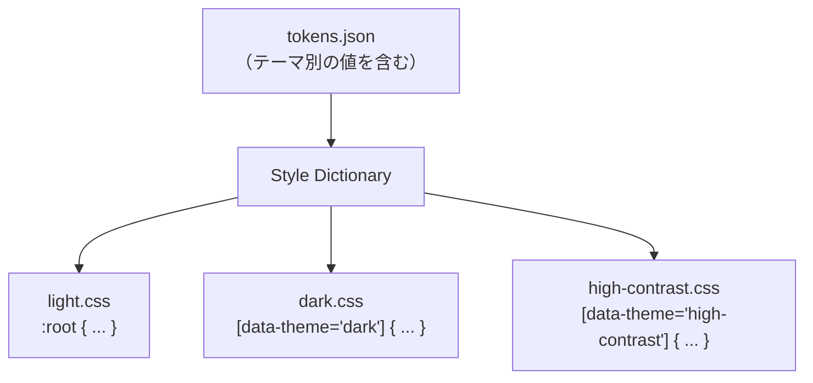

---

## 8. ドキュメンテーション

### 8.1 ドキュメンテーションの重要性

デザインシステムのドキュメンテーションは、システムの価値を引き出すための決定的な要素である。どれほど優れたコンポーネントを作っても、使い方が分からなければ利用されない。利用されなければ、車輪の再発明が再び始まる。

デザインシステムのドキュメンテーションには、技術仕様だけでなく、**なぜそのデザインが選ばれたのか**（設計意図）、**いつ使うべきか/使うべきでないか**（使用ガイドライン）、**どのように組み合わせるか**（パターン）を含む必要がある。

### 8.2 ドキュメンテーションの構成

効果的なデザインシステムのドキュメンテーションは、以下の構成要素を持つ。

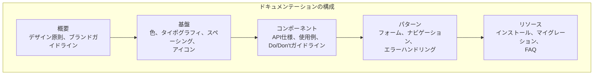

### 8.3 コンポーネントドキュメントの理想的な構造

各コンポーネントのドキュメントページには、以下の要素を含めるのが理想的である。

**1. 概要とライブプレビュー**：コンポーネントの目的と基本的な使い方を、実際に動作するプレビューとともに示す。

**2. Variant の一覧**：すべてのvariant、size、stateの組み合わせを視覚的に一覧できるようにする。

**3. Props（API）テーブル**：TypeScriptの型定義から自動生成されるAPIリファレンス。Storybook の `autodocs` タグを設定することで実現できる。

**4. Do / Don't ガイドライン**：正しい使い方と避けるべき使い方を具体例で示す。これはコンポーネントの誤用を防ぐ上で非常に重要である。

**5. アクセシビリティの注意事項**：キーボード操作、スクリーンリーダーでの読み上げ、必要なARIA属性などをコンポーネントごとに記述する。

**6. 関連コンポーネント**：代わりに使えるコンポーネントや、一緒に使うことが多いコンポーネントへのリンク。

### 8.4 ドキュメンテーションツール

デザインシステムのドキュメンテーションサイトを構築するための主要な選択肢を比較する。

| ツール | 特徴 | 採用例 |
|---|---|---|
| Storybook（Docs addon） | コンポーネントのStorybookを兼用。MDXでドキュメントを追加可能 | 多数のOSSプロジェクト |
| Docusaurus | Reactベースの静的サイトジェネレータ。MDXサポート | Fluent UI (Microsoft) |
| VitePress | Viteベースで高速。Vueコンポーネントの埋め込み可能 | Vuetify |
| Supernova | デザインシステム専用のドキュメンテーションプラットフォーム | エンタープライズ向け |
| zeroheight | Figma連携に強い。コードとデザインの統合ドキュメント | 非エンジニア向けに有効 |

Storybookの `autodocs` 機能を使えば、TypeScriptの型定義とJSDocコメントからAPIドキュメントを自動生成できるため、ドキュメントの鮮度を保ちやすい。一方で、デザイン原則やパターンガイドラインのような散文的なコンテンツには、別途ドキュメンテーションサイトを用意する方が適切な場合もある。

### 8.5 MDXによるインタラクティブドキュメント

MDX（Markdown + JSX）を使うと、Markdownドキュメント内にReactコンポーネントを直接埋め込むことができる。これにより、ドキュメント内で実際に動作するコンポーネントを表示し、propsを変更してリアルタイムに結果を確認するインタラクティブなドキュメントを構築できる。

```mdx
import { Button } from '@myorg/design-system';
import { Canvas, Story } from '@storybook/blocks';

# Button

Buttonコンポーネントは、ユーザーのアクションを促すために使用します。

## 基本的な使い方

<Canvas>
  <Story of={ButtonStories.Primary} />
</Canvas>

## バリエーション

| Variant | 用途 |
|---|---|
| `primary` | 主要なアクション（保存、送信） |
| `secondary` | 補助的なアクション（キャンセル、戻る） |
| `ghost` | 優先度の低いアクション |
| `danger` | 破壊的なアクション（削除） |

## やってはいけないこと

- ❌ 1つの画面に複数のPrimaryボタンを配置しない
- ❌ ボタンのラベルに「クリックしてください」のような冗長なテキストを使わない
- ❌ アイコンのみのボタンにaria-labelを設定し忘れない
```

---

## 9. 組織への浸透戦略

### 9.1 デザインシステムの「コールドスタート問題」

デザインシステムの最大の課題は技術的なものではなく、**組織的なもの**である。いかに優れたコンポーネントライブラリを構築しても、チームが使ってくれなければ価値を生まない。これは一種の「コールドスタート問題」であり、初期段階では特に困難を伴う。

利用されない原因として多いのは次のような点である。

- 既存のプロダクトに導入するコストが高い（移行の障壁）
- デザインシステムのコンポーネントが自チームの要件を満たさない（カバレッジの問題）
- デザインシステムチームの対応が遅い（サポートの問題）
- そもそもデザインシステムの存在や使い方を知らない（認知の問題）

### 9.2 組織モデル

デザインシステムの運営モデルは大きく3つに分類される。どのモデルを選ぶかは組織の規模・文化・リソースに依存する。

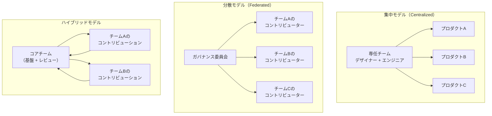

**集中モデル**：専任のデザインシステムチームがすべてのコンポーネントを設計・実装・保守する。品質と一貫性は高いが、チームがボトルネックになりやすい。大規模な組織で、デザインシステムへの十分な投資が可能な場合に適する。

**分散モデル**：各プロダクトチームがデザインシステムにコントリビューションする。ガバナンス委員会がガイドラインと品質基準を定める。チームの自律性は高いが、品質のばらつきが生じやすい。

**ハイブリッドモデル**：小さなコアチームが基盤（トークン、基本コンポーネント、ガイドライン）を管理し、各チームがコントリビューションする。コアチームはレビューと品質保証を担当する。現実的には最も多く採用されるモデルである。

### 9.3 導入のフェーズ

デザインシステムの導入は一気に行うのではなく、段階的に進めるのが現実的である。

**Phase 1: 監査と棚卸し**：既存のプロダクトで使われているUIパターンを調査する。Brad Frostの「Interface Inventory」の手法を用い、スクリーンショットを収集してボタン、フォーム、カード、モーダルなどのカテゴリに分類する。これにより、不整合の実態を可視化し、デザインシステムの必要性を組織に示すことができる。

**Phase 2: デザイントークンの統一**：最も影響範囲が広く、かつ導入コストが低いのがデザイントークンの統一である。色、フォント、スペーシングを共通のトークンとして定義し、既存のプロダクトに段階的に適用する。

**Phase 3: コアコンポーネントの整備**：使用頻度の高いコンポーネント（Button, Input, Select, Modal, Toast）から着手する。80/20の法則が適用でき、少数のコアコンポーネントでUIの大部分をカバーできる。

**Phase 4: パターンとガイドラインの整備**：コンポーネント単体だけでなく、フォームのバリデーション表示パターン、ナビゲーション構造、エラーページのテンプレートなど、より高いレベルのパターンを定義する。

**Phase 5: 継続的な運用と改善**：利用状況のメトリクスを収集し、フィードバックループを確立する。

### 9.4 コントリビューションモデルの設計

デザインシステムが長期的に持続するためには、プロダクトチームからのコントリビューションを受け入れる仕組みが不可欠である。

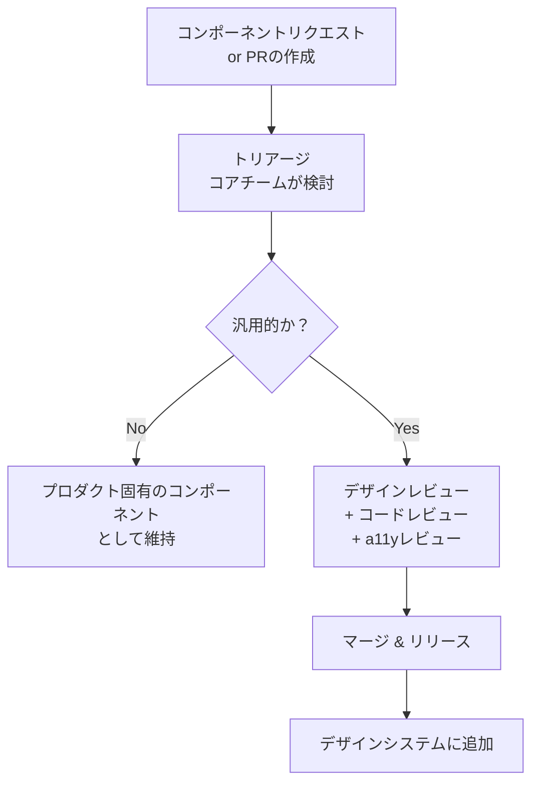

コントリビューションを受け入れる際の品質基準を明文化しておくことが重要である。

::: warning コントリビューションの品質基準（例）
- TypeScript の型定義が完備していること
- Storybook のストーリーがすべてのvariant・状態を網羅していること
- キーボード操作が可能であること
- axe-core のアクセシビリティチェックに合格すること
- ユニットテストのカバレッジが80%以上であること
- ダークモードでの表示を確認していること
- ドキュメント（Props一覧、使用例、Do/Don't）が含まれていること
:::

### 9.5 採用メトリクスの計測

デザインシステムの価値を定量的に示すことは、組織からの継続的な投資を獲得するために重要である。

**採用率（Adoption Rate）**：プロダクトのUIコンポーネントのうち、デザインシステムのコンポーネントで構成されている割合。ESLintのカスタムルールやimport解析ツールで自動計測できる。

**コンポーネントの利用頻度**：各コンポーネントがどのプロダクトでどれだけ使われているかを集計する。npmのダウンロード数やimport文の解析で把握する。

**UIの一貫性スコア**：デザイントークンに準拠していないハードコードされた色・フォントサイズ・余白の数を計測する。StylelintやESLintのカスタムルールで検出可能である。

**開発効率への影響**：デザインシステム導入前後でのUIコンポーネント開発にかかる時間を比較する。新しい画面を立ち上げるまでの時間、デザインレビューの往復回数などが指標になる。

### 9.6 コミュニケーションとエバンジェリズム

デザインシステムの浸透には、継続的なコミュニケーションが不可欠である。

**定期的なオフィスアワー**：デザインシステムチームが質問を受け付けるオフィスアワーを定期開催する。利用者の生の声を聞き、課題を把握する場でもある。

**リリースノートとショーケース**：新しいコンポーネントや改善をニュースレターやSlackチャンネルで共有する。単なるCHANGELOGではなく、「このコンポーネントを使うとこんな問題が解決できる」というストーリーを伝える。

**ペアリングセッション**：デザインシステムチームのメンバーが、プロダクトチームとペアプログラミングを行い、デザインシステムの効果的な使い方を直接伝える。導入初期に特に有効である。

**成功事例の共有**：デザインシステムを活用して開発効率が向上した事例、アクセシビリティの問題が解消された事例などを組織内で共有する。

---

## まとめ

デザインシステムは、デザイントークン、コンポーネントライブラリ、Storybook、ドキュメンテーションといった技術的な要素と、組織のプロセス・文化を含む包括的な仕組みである。

技術的な観点では、デザイントークンの3層構造による一貫した値管理、Headless UIライブラリを活用したアクセシブルなコンポーネント設計、CSS Custom Propertiesによるテーマ対応、Storybookを中心としたコンポーネント開発・テスト・ドキュメンテーションのワークフローが核となる。

しかし、デザインシステムの成否を分けるのは技術よりも組織への浸透戦略である。専任チームの編成、コントリビューションモデルの設計、採用メトリクスの計測、継続的なコミュニケーションといった組織的な取り組みが、デザインシステムを「使われるインフラ」として定着させる。

デザインシステムは完成することのないプロダクトである。プロダクトと組織の進化に合わせて継続的に改善し続けることが、その本質的な運営モデルである。
