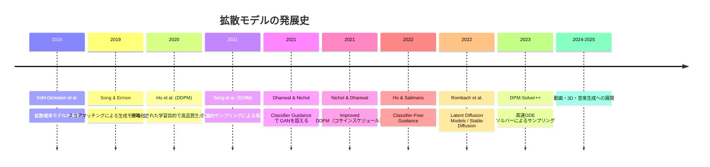
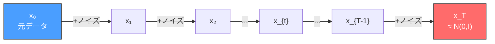
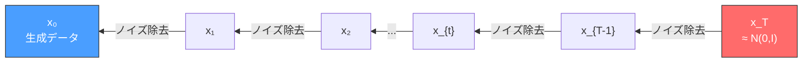
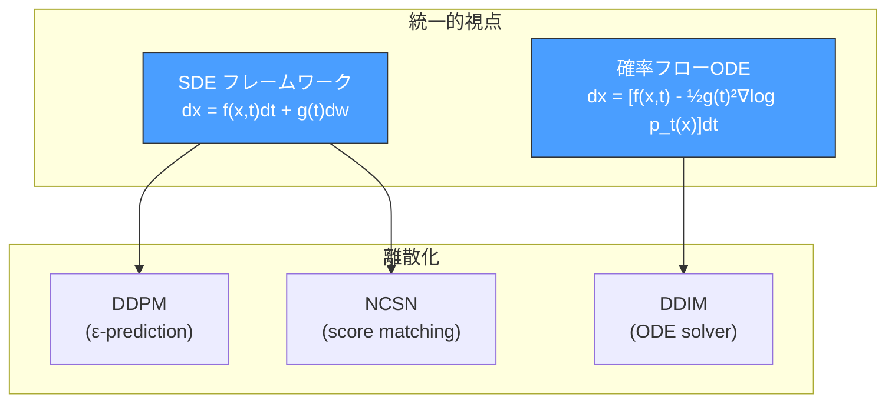
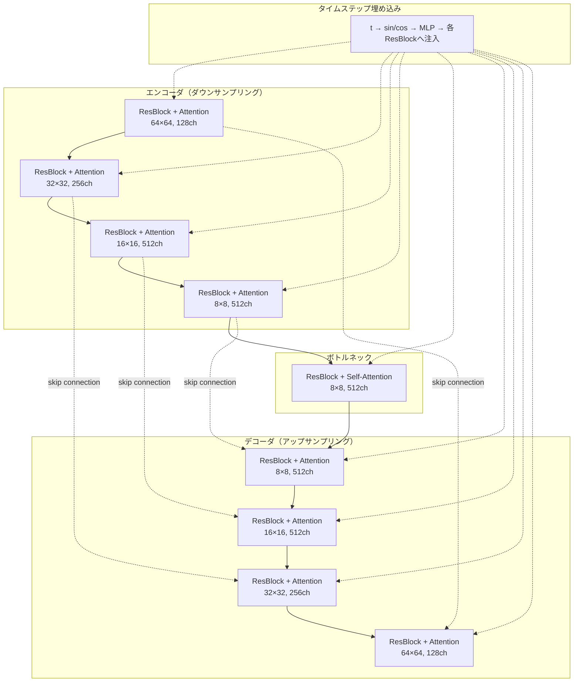
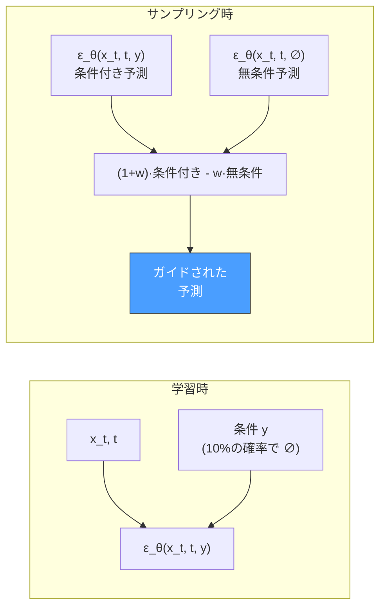
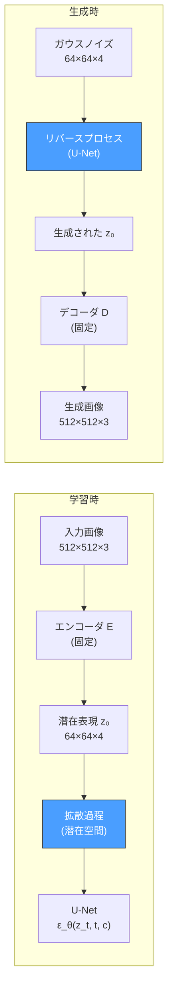
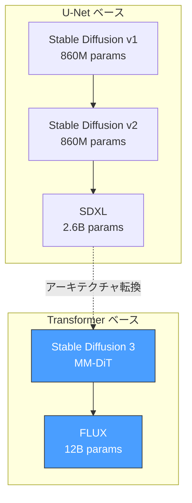

# 拡散モデル（Diffusion Models）— ノイズ除去による生成モデル

## 1. 背景と動機：生成モデルの新たなパラダイム

### 生成モデルの系譜と課題

深層生成モデルの歴史において、いくつかの重要なパラダイムが存在する。

**VAE（変分オートエンコーダ）** は、潜在変数モデルを変分推論の枠組みで学習する手法であり、学習は安定しているが、生成画像がぼやけやすいという欠点がある。これは、ピクセルレベルの再構成誤差を最小化する学習目的に起因しており、平均的な画像を生成する傾向がある。

**GAN（敵対的生成ネットワーク）** は、生成器と識別器を敵対的に学習させることで、シャープで高品質な画像を生成する。しかし、モード崩壊（mode collapse）や学習の不安定性が本質的な課題として残る。生成器と識別器のバランスが崩れると学習が破綻し、ハイパーパラメータの調整が困難である。

**自己回帰モデル**（PixelCNN, PixelRNNなど）は、正確な尤度計算が可能であるが、ピクセルを逐次的に生成するため生成速度が極めて遅い。

**正規化フロー**（Normalizing Flow）は、可逆な変換の合成によりデータ分布をモデル化する。正確な尤度計算と高速なサンプリングが可能であるが、可逆性の制約によりモデルの表現力が制限される。

```
生成モデルの主要パラダイム（2014-2020）:

VAE:       学習安定 ✓   画質 △   尤度計算 ✓   速度 ✓
GAN:       学習安定 ✗   画質 ◎   尤度計算 ✗   速度 ✓
自己回帰:  学習安定 ✓   画質 ○   尤度計算 ✓   速度 ✗
正規化フロー: 学習安定 ✓ 画質 ○  尤度計算 ✓   速度 ✓（制約大）
```

### 拡散モデルの着想

このような状況の中で登場したのが**拡散モデル**（Diffusion Model）である。拡散モデルの基本的なアイデアは驚くほどシンプルである。**データに少しずつノイズを加えていく過程（フォワードプロセス）を定義し、その逆過程（リバースプロセス）をニューラルネットワークで学習する**。つまり、ノイズからデータを復元する「ノイズ除去」（denoising）を繰り返すことで、完全なランダムノイズから高品質なデータを生成する。

この着想の起源は、2015年にSohl-Dicksteinらが提案した「Deep Unsupervised Learning using Nonequilibrium Thermodynamics」に遡る。名前が示す通り、非平衡熱力学における拡散過程からの着想である。物理学における拡散現象、すなわちインクが水中で徐々に拡がって均一になる過程を、データの分布に対して適用したものと考えることができる。データ分布が徐々に「拡散」してガウスノイズに変化する過程を定義し、その逆を学習するのである。

しかし、当初の拡散モデルは計算コストが高く、生成品質もGANには及ばなかった。転機となったのは2020年、Hoらが提案した **DDPM（Denoising Diffusion Probabilistic Models）** である。DDPMは、学習目的関数の簡略化と適切なノイズスケジュールの設計により、GANに匹敵する画像生成品質を達成した。この研究を皮切りに、拡散モデルは急速に発展し、画像生成の品質において事実上の標準となっていく。

### 拡散モデルの時系列



## 2. フォワードプロセス：データへのノイズ追加

### フォワードプロセスの定義

拡散モデルのフォワードプロセス（forward process）は、**データに段階的にガウスノイズを加えていく**マルコフ連鎖として定義される。元のデータ $\mathbf{x}_0$ から出発し、$T$ ステップにわたってノイズを加え、最終的に純粋なガウスノイズ $\mathbf{x}_T \sim \mathcal{N}(\mathbf{0}, \mathbf{I})$ に至る。

各ステップ $t$ における遷移確率は次のように定義される。

$$q(\mathbf{x}_t \mid \mathbf{x}_{t-1}) = \mathcal{N}(\mathbf{x}_t; \sqrt{1 - \beta_t} \, \mathbf{x}_{t-1}, \beta_t \mathbf{I})$$

ここで $\beta_t \in (0, 1)$ は、ステップ $t$ において加えるノイズの量を制御する**分散スケジュール**（variance schedule）である。$\beta_t$ が小さいほど、各ステップでのノイズ追加量は少ない。

直感的には、各ステップで元のデータを $\sqrt{1-\beta_t}$ 倍に縮小し、分散 $\beta_t$ のガウスノイズを加えている。これにより、データの信号が徐々に弱まり、ノイズが支配的になっていく。



### 任意のステップへの直接サンプリング

フォワードプロセスの重要な性質として、**任意のステップ $t$ における $\mathbf{x}_t$ を、$\mathbf{x}_0$ から直接計算できる**という点がある。これは逐次的にノイズを加える必要がないことを意味し、学習の効率化に不可欠である。

$\alpha_t = 1 - \beta_t$ および $\bar{\alpha}_t = \prod_{s=1}^{t} \alpha_s$ と定義すると、以下が成り立つ。

$$q(\mathbf{x}_t \mid \mathbf{x}_0) = \mathcal{N}(\mathbf{x}_t; \sqrt{\bar{\alpha}_t} \, \mathbf{x}_0, (1 - \bar{\alpha}_t) \mathbf{I})$$

すなわち、

$$\mathbf{x}_t = \sqrt{\bar{\alpha}_t} \, \mathbf{x}_0 + \sqrt{1 - \bar{\alpha}_t} \, \boldsymbol{\epsilon}, \quad \boldsymbol{\epsilon} \sim \mathcal{N}(\mathbf{0}, \mathbf{I})$$

::: details 導出の概要

ステップ1で $\mathbf{x}_1 = \sqrt{\alpha_1}\mathbf{x}_0 + \sqrt{1-\alpha_1}\boldsymbol{\epsilon}_1$ であり、ステップ2で $\mathbf{x}_2 = \sqrt{\alpha_2}\mathbf{x}_1 + \sqrt{1-\alpha_2}\boldsymbol{\epsilon}_2$ である。$\mathbf{x}_1$ を代入すると、

$$\mathbf{x}_2 = \sqrt{\alpha_2 \alpha_1}\mathbf{x}_0 + \sqrt{\alpha_2(1-\alpha_1)}\boldsymbol{\epsilon}_1 + \sqrt{1-\alpha_2}\boldsymbol{\epsilon}_2$$

2つの独立な正規分布の線形結合の分散は $\alpha_2(1-\alpha_1) + (1-\alpha_2) = 1 - \alpha_1\alpha_2$ であるため、

$$\mathbf{x}_2 = \sqrt{\alpha_1\alpha_2}\mathbf{x}_0 + \sqrt{1-\alpha_1\alpha_2}\boldsymbol{\epsilon}$$

この議論を帰納的に繰り返すことで、一般の $t$ について上記の式が得られる。

:::

この性質が意味することは、学習時にランダムなタイムステップ $t$ を選んで、$\mathbf{x}_0$ から一発で $\mathbf{x}_t$ を生成できるということである。$T=1000$ ステップの拡散過程を逐次的にシミュレーションする必要はない。

### ノイズスケジュール

$\beta_t$ の設計は、拡散モデルの性能に大きく影響する。

**線形スケジュール**（DDPMのオリジナル）：$\beta_1 = 10^{-4}$ から $\beta_T = 0.02$ まで線形に増加させる。DDPMで採用されたスケジュールであり、$T = 1000$ が典型的な設定である。

$$\beta_t = \beta_1 + \frac{t-1}{T-1}(\beta_T - \beta_1)$$

**コサインスケジュール**（Improved DDPM, Nichol & Dhariwal, 2021）：線形スケジュールの問題点は、$\bar{\alpha}_t$ が中間のステップで急激に減少し、最終ステップ付近ではほぼ0になってしまうことである。コサインスケジュールは、$\bar{\alpha}_t$ がより緩やかに変化するよう設計されている。

$$\bar{\alpha}_t = \frac{f(t)}{f(0)}, \quad f(t) = \cos\left(\frac{t/T + s}{1 + s} \cdot \frac{\pi}{2}\right)^2$$

ここで $s = 0.008$ は小さなオフセットであり、$t=0$ 付近で $\beta_t$ が過度に小さくなるのを防ぐ。

```
β_t の比較（概念図）:

β_t
 |                              ___--- 線形スケジュール
 |                         __---
 |                    __---     _____--- コサインスケジュール
 |               __---     ___--
 |          __---      __--
 |     __---       __--
 | __---       __--
 |---      __--
 |     __--
 +---------------------------→ t
 0                          T
```

コサインスケジュールにより、フォワードプロセスの初期段階でのノイズ追加がより緩やかになり、信号がゆっくりと減衰する。これは特に低解像度の画像で有効であることが示されている。

## 3. リバースプロセス：ノイズからデータへの復元

### リバースプロセスの定式化

リバースプロセス（reverse process）は、フォワードプロセスの逆をたどることで、ノイズ $\mathbf{x}_T \sim \mathcal{N}(\mathbf{0}, \mathbf{I})$ からデータ $\mathbf{x}_0$ を復元する。フォワードプロセスの各ステップが十分に小さければ、リバースプロセスもまたガウス分布で近似できることが知られている。

リバースプロセスは、パラメータ $\theta$ を持つニューラルネットワークにより以下のようにモデル化される。

$$p_\theta(\mathbf{x}_{t-1} \mid \mathbf{x}_t) = \mathcal{N}(\mathbf{x}_{t-1}; \boldsymbol{\mu}_\theta(\mathbf{x}_t, t), \sigma_t^2 \mathbf{I})$$

ここで $\boldsymbol{\mu}_\theta(\mathbf{x}_t, t)$ はニューラルネットワークが予測する平均であり、$\sigma_t^2$ は固定の分散（あるいは学習可能な分散）である。



### フォワードプロセスの事後分布

リバースプロセスの学習目標を理解するために、$\mathbf{x}_0$ が既知の場合のフォワードプロセスの**事後分布**（posterior）を考える。ベイズの定理により、

$$q(\mathbf{x}_{t-1} \mid \mathbf{x}_t, \mathbf{x}_0) = \mathcal{N}(\mathbf{x}_{t-1}; \tilde{\boldsymbol{\mu}}_t(\mathbf{x}_t, \mathbf{x}_0), \tilde{\beta}_t \mathbf{I})$$

ここで、

$$\tilde{\boldsymbol{\mu}}_t(\mathbf{x}_t, \mathbf{x}_0) = \frac{\sqrt{\bar{\alpha}_{t-1}}\beta_t}{1-\bar{\alpha}_t}\mathbf{x}_0 + \frac{\sqrt{\alpha_t}(1-\bar{\alpha}_{t-1})}{1-\bar{\alpha}_t}\mathbf{x}_t$$

$$\tilde{\beta}_t = \frac{1-\bar{\alpha}_{t-1}}{1-\bar{\alpha}_t}\beta_t$$

この事後分布は、$\mathbf{x}_0$ と $\mathbf{x}_t$ の両方に依存する。学習の目標は、ニューラルネットワークが予測する $\boldsymbol{\mu}_\theta(\mathbf{x}_t, t)$ を、この真の事後分布の平均 $\tilde{\boldsymbol{\mu}}_t$ に近づけることである。

### ノイズ予測への再パラメータ化

$\mathbf{x}_t = \sqrt{\bar{\alpha}_t}\mathbf{x}_0 + \sqrt{1-\bar{\alpha}_t}\boldsymbol{\epsilon}$ の関係を用いて、$\mathbf{x}_0$ を消去すると、

$$\mathbf{x}_0 = \frac{1}{\sqrt{\bar{\alpha}_t}}(\mathbf{x}_t - \sqrt{1-\bar{\alpha}_t}\boldsymbol{\epsilon})$$

これを $\tilde{\boldsymbol{\mu}}_t$ の式に代入すると、

$$\tilde{\boldsymbol{\mu}}_t = \frac{1}{\sqrt{\alpha_t}}\left(\mathbf{x}_t - \frac{\beta_t}{\sqrt{1-\bar{\alpha}_t}}\boldsymbol{\epsilon}\right)$$

したがって、ニューラルネットワークがノイズ $\boldsymbol{\epsilon}$ を予測するモデル $\boldsymbol{\epsilon}_\theta(\mathbf{x}_t, t)$ として設計すれば、

$$\boldsymbol{\mu}_\theta(\mathbf{x}_t, t) = \frac{1}{\sqrt{\alpha_t}}\left(\mathbf{x}_t - \frac{\beta_t}{\sqrt{1-\bar{\alpha}_t}}\boldsymbol{\epsilon}_\theta(\mathbf{x}_t, t)\right)$$

これがDDPMにおける**ノイズ予測**（$\epsilon$-prediction）の再パラメータ化である。ネットワークは「$\mathbf{x}_t$ に含まれるノイズ成分を予測する」というタスクを解く。

## 4. DDPMの数学的定式化

### 変分下界（ELBO）

拡散モデルの学習は、データの対数尤度の変分下界（Evidence Lower Bound, ELBO）を最大化することで行われる。データ $\mathbf{x}_0$ に対する対数尤度は、

$$\log p_\theta(\mathbf{x}_0) \geq \mathbb{E}_q\left[-\log \frac{q(\mathbf{x}_{1:T} \mid \mathbf{x}_0)}{p_\theta(\mathbf{x}_{0:T})}\right] = -L_{\text{VLB}}$$

この変分下界を分解すると、以下の形になる。

$$L_{\text{VLB}} = L_T + L_{T-1} + \cdots + L_1 + L_0$$

各項は次の通りである。

$$L_T = D_{\text{KL}}(q(\mathbf{x}_T \mid \mathbf{x}_0) \| p(\mathbf{x}_T))$$

$$L_{t-1} = D_{\text{KL}}(q(\mathbf{x}_{t-1} \mid \mathbf{x}_t, \mathbf{x}_0) \| p_\theta(\mathbf{x}_{t-1} \mid \mathbf{x}_t)), \quad t = 2, \ldots, T$$

$$L_0 = -\log p_\theta(\mathbf{x}_0 \mid \mathbf{x}_1)$$

$L_T$ はパラメータに依存しない定数（フォワードプロセスの終端とガウスノイズのKLダイバージェンス）であるため、学習には影響しない。$L_0$ は最終ステップのデコーディング損失である。核心は $L_{t-1}$ の各項であり、これはフォワードプロセスの事後分布 $q(\mathbf{x}_{t-1} \mid \mathbf{x}_t, \mathbf{x}_0)$ とリバースプロセスのモデル $p_\theta(\mathbf{x}_{t-1} \mid \mathbf{x}_t)$ のKLダイバージェンスである。

### 簡略化された損失関数

Hoらの重要な発見は、上記の厳密なVLBをそのまま最適化する代わりに、**単純化された損失関数**を用いた方が実践的に優れた結果を生むということであった。

ノイズ予測の再パラメータ化を用いると、$L_{t-1}$ は以下に比例する。

$$L_{t-1} \propto \left\| \boldsymbol{\epsilon} - \boldsymbol{\epsilon}_\theta(\mathbf{x}_t, t) \right\|^2$$

DDPMの簡略化された損失関数（simple loss）は、KLダイバージェンスの重み付けを無視して、

$$L_{\text{simple}} = \mathbb{E}_{t, \mathbf{x}_0, \boldsymbol{\epsilon}} \left[ \left\| \boldsymbol{\epsilon} - \boldsymbol{\epsilon}_\theta(\sqrt{\bar{\alpha}_t}\mathbf{x}_0 + \sqrt{1-\bar{\alpha}_t}\boldsymbol{\epsilon}, t) \right\|^2 \right]$$

と定義される。ここで $t \sim \text{Uniform}(1, T)$、$\boldsymbol{\epsilon} \sim \mathcal{N}(\mathbf{0}, \mathbf{I})$ である。

> [!TIP]
> この損失関数が意味することは明快である。ランダムなタイムステップ $t$ を選び、データ $\mathbf{x}_0$ にノイズ $\boldsymbol{\epsilon}$ を加えて $\mathbf{x}_t$ を作り、ネットワークに $\mathbf{x}_t$ から $\boldsymbol{\epsilon}$ を予測させる。予測したノイズと実際のノイズの二乗誤差を最小化する、というデノイジングタスクそのものである。

### DDPMの学習アルゴリズム

学習アルゴリズムを擬似コードで示す。

```python
# DDPM Training Algorithm
def train_step(model, x_0):
    # 1. Sample random timestep
    t = uniform_sample(1, T)

    # 2. Sample noise
    epsilon = torch.randn_like(x_0)

    # 3. Create noisy sample
    alpha_bar_t = alpha_bar_schedule[t]
    x_t = sqrt(alpha_bar_t) * x_0 + sqrt(1 - alpha_bar_t) * epsilon

    # 4. Predict noise
    epsilon_pred = model(x_t, t)

    # 5. Compute loss
    loss = mse_loss(epsilon_pred, epsilon)

    return loss
```

### DDPMのサンプリングアルゴリズム

生成時は、$\mathbf{x}_T \sim \mathcal{N}(\mathbf{0}, \mathbf{I})$ からスタートし、リバースプロセスを $T$ ステップ実行する。

$$\mathbf{x}_{t-1} = \frac{1}{\sqrt{\alpha_t}}\left(\mathbf{x}_t - \frac{\beta_t}{\sqrt{1-\bar{\alpha}_t}}\boldsymbol{\epsilon}_\theta(\mathbf{x}_t, t)\right) + \sigma_t \mathbf{z}$$

ここで $\mathbf{z} \sim \mathcal{N}(\mathbf{0}, \mathbf{I})$（$t > 1$ のとき）、$\sigma_t = \sqrt{\beta_t}$ または $\sigma_t = \sqrt{\tilde{\beta}_t}$ である。

```python
# DDPM Sampling Algorithm
def sample(model, shape):
    # Start from pure noise
    x = torch.randn(shape)

    for t in reversed(range(1, T + 1)):
        z = torch.randn_like(x) if t > 1 else torch.zeros_like(x)

        epsilon_pred = model(x, t)

        # Reverse step
        x = (1 / sqrt(alpha[t])) * (
            x - (beta[t] / sqrt(1 - alpha_bar[t])) * epsilon_pred
        ) + sigma[t] * z

    return x
```

## 5. スコアマッチングとの関係

### スコア関数とは

拡散モデルの理論的理解を深めるうえで、**スコア関数**（score function）との関係は極めて重要である。データ分布 $p(\mathbf{x})$ のスコア関数は、対数尤度の勾配として定義される。

$$\mathbf{s}(\mathbf{x}) = \nabla_{\mathbf{x}} \log p(\mathbf{x})$$

スコア関数は、「データの確率密度が増加する方向」を指し示すベクトル場である。もしスコア関数が既知であれば、ランジュバン動力学（Langevin dynamics）によるサンプリングが可能になる。

$$\mathbf{x}_{i+1} = \mathbf{x}_i + \frac{\delta}{2}\nabla_{\mathbf{x}}\log p(\mathbf{x}_i) + \sqrt{\delta}\,\mathbf{z}_i, \quad \mathbf{z}_i \sim \mathcal{N}(\mathbf{0}, \mathbf{I})$$

ステップサイズ $\delta \to 0$、反復回数 $\to \infty$ の極限で、$\mathbf{x}_i$ は $p(\mathbf{x})$ からのサンプルに収束する。

### ノイズ条件付きスコアマッチング（NCSN）

Song & Ermon（2019）は、**NCSN（Noise Conditional Score Network）** を提案した。データにさまざまなレベルのノイズを加えた分布 $p_{\sigma}(\mathbf{x}) = \int p(\mathbf{y})\mathcal{N}(\mathbf{x}; \mathbf{y}, \sigma^2\mathbf{I})d\mathbf{y}$ に対して、スコア関数 $\nabla_\mathbf{x}\log p_\sigma(\mathbf{x})$ をニューラルネットワーク $\mathbf{s}_\theta(\mathbf{x}, \sigma)$ で近似する。

学習はデノイジングスコアマッチングの目的関数に基づく。

$$\mathcal{L} = \mathbb{E}_{\sigma}\mathbb{E}_{p(\mathbf{x})}\mathbb{E}_{\tilde{\mathbf{x}} \sim \mathcal{N}(\mathbf{x}, \sigma^2\mathbf{I})}\left[\left\|\mathbf{s}_\theta(\tilde{\mathbf{x}}, \sigma) - \nabla_{\tilde{\mathbf{x}}}\log p(\tilde{\mathbf{x}} \mid \mathbf{x})\right\|^2\right]$$

$p(\tilde{\mathbf{x}} \mid \mathbf{x}) = \mathcal{N}(\tilde{\mathbf{x}}; \mathbf{x}, \sigma^2\mathbf{I})$ であるため、$\nabla_{\tilde{\mathbf{x}}}\log p(\tilde{\mathbf{x}} \mid \mathbf{x}) = -(\tilde{\mathbf{x}} - \mathbf{x})/\sigma^2$ となり、スコア関数の学習は実質的に**ノイズの方向を予測する**タスクに帰着する。

### DDPMとスコアマッチングの統一

DDPMのノイズ予測 $\boldsymbol{\epsilon}_\theta$ とスコア関数 $\mathbf{s}_\theta$ は、以下の関係で結ばれている。

$$\mathbf{s}_\theta(\mathbf{x}_t, t) = \nabla_{\mathbf{x}_t}\log p_t(\mathbf{x}_t) \approx -\frac{\boldsymbol{\epsilon}_\theta(\mathbf{x}_t, t)}{\sqrt{1-\bar{\alpha}_t}}$$

すなわち、DDPMでノイズを予測することと、スコア関数を推定することは本質的に等価である。

Song et al.（2021）は、この統一的視点を **SDE（確率微分方程式）** の枠組みで定式化した。フォワードプロセスを連続時間のSDEとして記述し、

$$d\mathbf{x} = \mathbf{f}(\mathbf{x}, t)dt + g(t)d\mathbf{w}$$

そのリバースSDEは、

$$d\mathbf{x} = [\mathbf{f}(\mathbf{x}, t) - g(t)^2 \nabla_\mathbf{x} \log p_t(\mathbf{x})]dt + g(t)d\bar{\mathbf{w}}$$

ここで $\bar{\mathbf{w}}$ は逆時間のウィーナー過程である。この枠組みにより、DDPMやNCSNは同一のフレームワークの離散化として捉えられ、さまざまなサンプリング手法を統一的に理解できるようになった。



## 6. U-Netアーキテクチャ

### なぜU-Netか

拡散モデルにおけるノイズ予測ネットワーク $\boldsymbol{\epsilon}_\theta(\mathbf{x}_t, t)$ には、**U-Net**アーキテクチャが広く採用されている。U-Netは元来、生物医学画像のセグメンテーション用に設計されたアーキテクチャであるが、以下の特性が拡散モデルに適している。

1. **入力と出力が同じ解像度**：ノイズ画像を入力とし、同じサイズのノイズマップ（または復元画像）を出力する
2. **マルチスケール特徴の統合**：エンコーダとデコーダの間のスキップ接続により、局所的な詳細と大域的な構造の両方を捉えられる
3. **柔軟な容量制御**：チャネル数やブロック数の調整により、モデルの容量を制御できる

### アーキテクチャの詳細

DDPMで使用されるU-Netは、以下の要素で構成される。



**ResBlock（残差ブロック）**：各レベルにおいて、残差接続を持つ畳み込みブロックが基本的な計算単位である。Group Normalization とSiLU（Swish）活性化関数が用いられる。

**タイムステップ埋め込み**：タイムステップ $t$ の情報は、Transformerの位置エンコーディングと同様の正弦波埋め込み（sinusoidal embedding）でベクトル化される。

$$\text{PE}(t, 2i) = \sin(t / 10000^{2i/d}), \quad \text{PE}(t, 2i+1) = \cos(t / 10000^{2i/d})$$

この埋め込みベクトルはMLPで変換され、各ResBlockに加算（AdaGN: Adaptive Group Normalization）または結合される。

**Self-Attention**：特定の解像度レベル（典型的には16×16や8×8）において、Self-Attentionレイヤーが挿入される。これにより、画像の遠く離れた位置間の依存関係を捉えることができる。全解像度でAttentionを適用すると計算コストが爆発するため、低解像度の特徴マップに限定するのが一般的である。

### 予測対象のバリエーション

ネットワークの予測対象にはいくつかのバリエーションが存在する。

| 予測対象 | 定義 | 特徴 |
|----------|------|------|
| $\boldsymbol{\epsilon}$-prediction | $\boldsymbol{\epsilon}_\theta(\mathbf{x}_t, t) \approx \boldsymbol{\epsilon}$ | DDPMのオリジナル。高ノイズ領域で安定 |
| $\mathbf{x}_0$-prediction | $\mathbf{x}_{0,\theta}(\mathbf{x}_t, t) \approx \mathbf{x}_0$ | 低ノイズ領域で安定 |
| $\mathbf{v}$-prediction | $\mathbf{v}_\theta = \sqrt{\bar{\alpha}_t}\boldsymbol{\epsilon} - \sqrt{1-\bar{\alpha}_t}\mathbf{x}_0$ | $\epsilon$ と $\mathbf{x}_0$ の線形結合。全領域で安定 |

$\mathbf{v}$-prediction（velocity prediction）は、Salimans & Ho（2022）が提案した予測ターゲットであり、Progressive Distillation やStable Diffusion v2で採用されている。

## 7. サンプリング高速化

### DDPMの速度問題

DDPMの最大の実用上の課題は、**サンプリング速度**である。$T = 1000$ ステップの逐次的なノイズ除去が必要であり、1枚の画像生成に数十秒から数分を要する。GANが1回のフォワードパスで画像を生成できることと比較すると、この差は非常に大きい。

### DDIM（Denoising Diffusion Implicit Models）

Song et al.（2021）が提案した **DDIM** は、この問題に対する最初の重要な解法である。DDIMの核心的なアイデアは、**フォワードプロセスを非マルコフ過程に一般化**し、**決定論的なサンプリング**を可能にすることである。

DDIMのサンプリング式は以下の通りである。

$$\mathbf{x}_{t-1} = \sqrt{\bar{\alpha}_{t-1}}\underbrace{\left(\frac{\mathbf{x}_t - \sqrt{1-\bar{\alpha}_t}\boldsymbol{\epsilon}_\theta(\mathbf{x}_t, t)}{\sqrt{\bar{\alpha}_t}}\right)}_{\text{predicted } \mathbf{x}_0} + \underbrace{\sqrt{1-\bar{\alpha}_{t-1} - \sigma_t^2}\cdot\boldsymbol{\epsilon}_\theta(\mathbf{x}_t, t)}_{\text{direction pointing to } \mathbf{x}_t} + \underbrace{\sigma_t \mathbf{z}_t}_{\text{random noise}}$$

$\sigma_t = 0$ とすれば完全に決定論的なサンプリングとなり、$\sigma_t = \sqrt{\tilde{\beta}_t}$ とすればDDPMと一致する。

DDIMの重要な特性は、**サブシーケンスサンプリング**が可能なことである。$T = 1000$ ステップの全体を使わず、$\tau = [1, 51, 101, \ldots, 951]$ のような部分集合のみを使ってサンプリングできる。これにより、**50ステップ程度でDDPMの1000ステップと同等の品質**を達成する。

```
DDPM:  x_1000 → x_999 → x_998 → ... → x_1 → x_0  (1000 steps)
DDIM:  x_1000 → x_950 → x_900 → ... → x_50 → x_0  (  20 steps)
```

### DPM-Solver

Lu et al.（2022）は、拡散SDEの確率フローODE（probability flow ODE）に高次の数値解法を適用する **DPM-Solver** を提案した。

確率フローODEは以下の形で書ける。

$$\frac{d\mathbf{x}}{dt} = \mathbf{f}(\mathbf{x}, t) - \frac{1}{2}g(t)^2\nabla_\mathbf{x}\log p_t(\mathbf{x})$$

DDIMは本質的にこのODEのオイラー法（1次）による離散化であるが、DPM-Solverは半線形ODE構造を利用して、2次や3次の精度を持つ高速ソルバーを構成する。**DPM-Solver++**（Lu et al., 2023）は、$\mathbf{x}_0$-predictionを用いた改良版であり、10〜20ステップで高品質なサンプリングを実現する。

| 手法 | ステップ数 | FID（CIFAR-10） | 特徴 |
|------|-----------|-----------------|------|
| DDPM | 1000 | 3.17 | 元祖。高品質だが遅い |
| DDIM | 50 | 4.67 | 決定論的。大幅な高速化 |
| DDIM | 10 | 13.36 | 少ステップでは品質低下 |
| DPM-Solver-2 | 20 | 3.24 | 2次精度。高品質を維持 |
| DPM-Solver++ | 10 | 2.87 | 少ステップでも高品質 |

### 蒸留によるさらなる高速化

Consistency Models（Song et al., 2023）やProgressive Distillation（Salimans & Ho, 2022）は、多ステップの拡散モデルを1〜4ステップの生成モデルに蒸留するアプローチである。教師モデル（多ステップ）の振る舞いを生徒モデル（少ステップ）に学習させることで、ステップ数を劇的に削減する。

## 8. 条件付き生成

### 無条件生成から条件付き生成へ

これまで述べてきた拡散モデルは、学習データの分布 $p(\mathbf{x})$ からの無条件サンプリングを行うものであった。しかし、実用的には**条件付き生成**、すなわち「猫の画像を生成してほしい」「テキストに対応する画像を生成してほしい」といった制御が必要不可欠である。条件 $y$（クラスラベル、テキストなど）が与えられたとき、条件付き分布 $p(\mathbf{x} \mid y)$ からサンプリングしたい。

### Classifier Guidance

Dhariwal & Nichol（2021）が提案した **Classifier Guidance** は、事前学習された分類器を用いて条件付きサンプリングを行う手法である。

ベイズの定理により、条件付きスコア関数は以下のように分解できる。

$$\nabla_\mathbf{x} \log p(\mathbf{x} \mid y) = \nabla_\mathbf{x} \log p(\mathbf{x}) + \nabla_\mathbf{x} \log p(y \mid \mathbf{x})$$

第1項は無条件の拡散モデルが提供するスコア関数であり、第2項はノイズ入り画像 $\mathbf{x}_t$ に対する分類器の勾配である。実際には、ガイダンスの強さを制御するスケール $w$ を導入する。

$$\hat{\boldsymbol{\epsilon}}(\mathbf{x}_t, t, y) = \boldsymbol{\epsilon}_\theta(\mathbf{x}_t, t) - w \sqrt{1 - \bar{\alpha}_t} \, \nabla_{\mathbf{x}_t} \log p_\phi(y \mid \mathbf{x}_t)$$

$w$ を大きくするほど、条件 $y$ に強く従うサンプルが生成されるが、多様性は低下する。Dhariwal & Nichol はこの手法により、拡散モデルが初めてGANを**FIDスコアで上回る**ことを示した。

しかし、Classifier Guidanceには欠点がある。ノイズ入り画像に対して機能する**別途の分類器**を学習する必要があり、これは追加のコストと制約を意味する。

### Classifier-Free Guidance

Ho & Salimans（2022）が提案した **Classifier-Free Guidance** は、分類器を不要にした手法であり、現在の拡散モデルにおける事実上の標準である。

アイデアは、**1つのネットワークで条件付きモデルと無条件モデルの両方を学習**することである。学習時に一定の確率（例えば10%）で条件 $y$ をヌル条件 $\varnothing$ に置き換えることで、同じネットワークが条件付き予測 $\boldsymbol{\epsilon}_\theta(\mathbf{x}_t, t, y)$ と無条件予測 $\boldsymbol{\epsilon}_\theta(\mathbf{x}_t, t, \varnothing)$ の両方を出力できるようになる。

サンプリング時には、以下のガイダンス式を用いる。

$$\hat{\boldsymbol{\epsilon}}(\mathbf{x}_t, t, y) = (1 + w) \boldsymbol{\epsilon}_\theta(\mathbf{x}_t, t, y) - w \, \boldsymbol{\epsilon}_\theta(\mathbf{x}_t, t, \varnothing)$$

これは、無条件の予測から条件付きの予測に向かう方向を、ガイダンススケール $w$ で増幅するものである。$w = 0$ のとき標準的な条件付き生成、$w > 0$ のとき条件への適合度が強化される。



> [!WARNING]
> ガイダンススケール $w$ は品質と多様性のトレードオフを制御する。$w$ が大きすぎると、生成されるサンプルが過度に飽和し、アーティファクトが発生する。Stable Diffusionでは $w = 7.5$ がデフォルトとして広く用いられている。

## 9. Latent Diffusion Models と Stable Diffusion

### ピクセル空間の限界

ここまで述べた拡散モデルは、**ピクセル空間**で直接動作する。つまり、$256 \times 256 \times 3$ や $512 \times 512 \times 3$ の画像テンソルに対して拡散過程を定義する。しかし、高解像度画像では計算コストが膨大になり、U-NetのSelf-Attentionの計算量が $O(n^2)$（$n$ はピクセル数に比例）であることから、実用的な解像度に限界がある。

### Latent Diffusion Models（LDM）

Rombach et al.（2022）が提案した **Latent Diffusion Models（LDM）** は、この問題に対する優れた解法を提供する。核心的なアイデアは、**事前学習されたオートエンコーダの潜在空間で拡散過程を行う**というものである。



**Step 1: オートエンコーダの学習**

まず、VQ-VAEまたはKL-regularized autoencoderを学習する。エンコーダ $\mathcal{E}$ は画像を低次元の潜在表現に圧縮し、デコーダ $\mathcal{D}$ は潜在表現から画像を復元する。

$$\mathbf{z} = \mathcal{E}(\mathbf{x}), \quad \hat{\mathbf{x}} = \mathcal{D}(\mathbf{z})$$

典型的には、$512 \times 512 \times 3$ の画像を $64 \times 64 \times 4$ の潜在表現に圧縮する（空間方向で8倍のダウンサンプリング）。

**Step 2: 潜在空間での拡散モデルの学習**

オートエンコーダを固定した状態で、潜在空間 $\mathbf{z}$ 上で拡散モデルを学習する。U-Netは潜在表現のサイズに合わせた入出力を持つ。

$$L_{\text{LDM}} = \mathbb{E}_{t, \mathbf{z}_0, \boldsymbol{\epsilon}}\left[\left\|\boldsymbol{\epsilon} - \boldsymbol{\epsilon}_\theta(\mathbf{z}_t, t, c)\right\|^2\right]$$

ここで $c$ は条件情報（テキスト埋め込みなど）であり、U-Netにクロスアテンションを通じて注入される。

### 条件付けメカニズム：Cross-Attention

LDMにおける条件付けは、U-Netのアテンションレイヤーに **Cross-Attention** を導入することで実現される。

テキスト条件の場合、テキストはまずCLIPやT5などのテキストエンコーダによりトークン埋め込みの系列 $\mathbf{c} = [\mathbf{c}_1, \mathbf{c}_2, \ldots, \mathbf{c}_L]$ に変換される。U-Netの各アテンションブロックにおいて、

$$\text{Attention}(Q, K, V) = \text{softmax}\left(\frac{QK^\top}{\sqrt{d}}\right)V$$

Self-Attentionでは $Q, K, V$ すべてが画像特徴から生成されるのに対し、Cross-Attentionでは $Q$ が画像特徴から、$K, V$ がテキスト埋め込みから生成される。

$$Q = W_Q \cdot \varphi(\mathbf{z}_t), \quad K = W_K \cdot \mathbf{c}, \quad V = W_V \cdot \mathbf{c}$$

これにより、テキストの各トークンが画像の各空間位置と対応付けられ、テキストの意味内容が画像生成に反映される。

### Stable Diffusion

**Stable Diffusion**は、Stability AI がLDMの枠組みに基づいて公開した大規模Text-to-Imageモデルである。その構成要素は以下の通りである。

| コンポーネント | 役割 | 詳細 |
|-------------|------|------|
| テキストエンコーダ | テキストを埋め込みに変換 | CLIP ViT-L/14（SD v1.x）、OpenCLIP ViT-H/14（SD v2.x） |
| VAE | ピクセル空間と潜在空間の変換 | KL-regularized autoencoder, f=8 |
| U-Net | 潜在空間でのノイズ除去 | ~860M parameters, Cross-Attention |
| スケジューラ | サンプリングアルゴリズム | DDIM, DPM-Solver++, Euler など |

Stable Diffusionが画像生成の民主化に果たした役割は大きい。モデルの重みがオープンソースとして公開されたことで、研究者や開発者が自由にファインチューニングやカスタマイズを行えるようになった。ControlNet、LoRA、DreamBoothなどの拡張技術が急速に発展した背景には、この開放性がある。

### SDXLとその後の発展

**SDXL**（Stable Diffusion XL, Podell et al., 2023）は、Stable Diffusionの大幅な改良版であり、以下の変更を含む。

- U-Netの大型化（2.6B parameters）
- 2つのテキストエンコーダの併用（OpenCLIP ViT-bigG + CLIP ViT-L）
- 2段階生成（ベースモデル + リファイナーモデル）
- マイクロ条件付け（画像解像度、切り抜き情報の条件付け）

さらに、**Stable Diffusion 3**（Esser et al., 2024）ではU-Netに代わり**DiT（Diffusion Transformer）** アーキテクチャが採用された。DiTは、Vision Transformerの構造を拡散モデルに適用したものであり、スケーリング則に優れた特性を持つ。



## 10. 応用分野

### 画像生成

拡散モデルの最も代表的な応用は**テキストからの画像生成**（Text-to-Image）である。DALL-E 2（OpenAI）、Imagen（Google）、Midjourney、Stable Diffusionなどが代表的なシステムである。

これらのシステムは、自然言語の記述から高品質かつ多様な画像を生成する能力を持ち、アート、デザイン、広告、ゲーム開発など幅広い分野で活用されている。

### 画像編集

拡散モデルの特性を活かした**画像編集**も重要な応用である。

**Inpainting（マスク領域の補完）**：画像の一部をマスクし、その領域を文脈に沿って補完する。拡散過程をマスク領域のみに適用することで実現される。

**SDEdit**（Meng et al., 2022）：ユーザーが描いたラフスケッチに対してフォワードプロセスで適度なノイズを加え、リバースプロセスで自然な画像に変換する。ノイズを加える量により、元のスケッチの忠実度と生成品質のトレードオフを制御できる。

**Instruct-Pix2Pix**（Brooks et al., 2023）：「空を夕焼けにして」「建物をゴシック様式にして」といったテキスト指示に基づいて画像を編集する。GPT-4で生成した編集ペアデータとStable Diffusionを組み合わせて学習する。

### 動画生成

拡散モデルの動画生成への拡張も急速に進展している。

**Video Diffusion Models**は、3D U-Net（2D空間＋1D時間）やSpatiotemporal Transformerを用いて、時間軸方向の一貫性を持つ動画を生成する。

**Sora**（OpenAI, 2024）は、Diffusion Transformerアーキテクチャをベースとした動画生成モデルであり、最大1分程度の高品質な動画を生成できることを示した。空間と時間の両方にわたるパッチ分割と、スケーラブルなTransformerアーキテクチャが鍵となっている。

**Stable Video Diffusion**（Stability AI）、**Gen-2**（Runway）なども、テキストや画像からの動画生成を実現している。

### 3D生成

拡散モデルによる**3D形状や3Dシーンの生成**も活発な研究分野である。

**DreamFusion**（Poole et al., 2023）は、事前学習された2D拡散モデルを利用して3Dオブジェクトを生成する手法である。**Score Distillation Sampling（SDS）** と呼ばれる手法により、3D表現（NeRFなど）を、あらゆる視点からレンダリングしたときに拡散モデルが「自然な画像」と判断するよう最適化する。

**Zero-1-to-3**は、単一画像からの3D再構成に拡散モデルを応用する。指定されたカメラ視点における新しいビューを拡散モデルで生成し、それらを統合して3Dモデルを構築する。

### 音声・音楽生成

**AudioLDM**、**MusicGen**（Meta）、**Stable Audio**（Stability AI）などのシステムは、テキスト記述からの音声・音楽生成に拡散モデルを適用している。

音声生成の場合、生の波形やメルスペクトログラムの潜在表現に対して拡散過程を定義する。音楽生成では、楽曲の構造（テンポ、調性、ジャンル）をテキスト条件として制御可能である。

### その他の応用

拡散モデルの適用範囲は画像・動画に留まらない。

- **分子設計・創薬**：分子構造の生成に拡散モデルを適用し、特定の性質を持つ分子の探索を行う
- **タンパク質構造設計**：RFDiffusion（Watson et al., 2023）はタンパク質のバックボーン構造の生成に拡散モデルを用いる
- **ロボティクス**：Diffusion Policy は、ロボットの行動系列の生成に拡散モデルを適用し、複雑な操作タスクでの性能向上を示している
- **テキスト生成**：離散データへの拡散モデルの適用も研究されている（D3PM, Diffusion-LM）

## 11. GANとの比較

### 定量的比較

拡散モデルとGANの比較は、生成モデル研究における重要なテーマである。

| 指標 | 拡散モデル | GAN |
|------|-----------|-----|
| **FID**（生成品質） | 優れている（ガイダンス使用時） | 良好（しかし拡散モデルに追い越された） |
| **多様性** | 高い（モード崩壊なし） | モード崩壊のリスクあり |
| **サンプリング速度** | 遅い（10〜50ステップ） | 速い（1回のフォワードパス） |
| **学習安定性** | 安定（単純なMSE損失） | 不安定（敵対的学習） |
| **尤度評価** | 可能（VLBの近似） | 不可能 |
| **逆変換** | 可能（DDIMによる） | 困難（別途エンコーダが必要） |

### 設計哲学の違い

**GAN**は、2つのネットワークの競争を通じて暗黙的にデータ分布を学習する。学習が成功すれば1回のフォワードパスで高品質なサンプルを生成できる反面、学習の力学が複雑で不安定である。

**拡散モデル**は、段階的なノイズ除去という明確に定義されたタスクを学習する。各ステップでのノイズ予測は単純な回帰問題であり、学習は安定している。しかし、サンプリングには多数のステップを要する。

この違いは、**暗黙的な分布学習 vs. 明示的な確率過程の逆転**という、生成モデルの根本的な設計選択に根差している。

### 収束した技術

興味深いことに、両パラダイムの技術的な収束も進んでいる。GANの学習安定化のための正則化技術（スペクトル正規化、R1正則化）と拡散モデルの高速化技術（蒸留、一貫性モデル）は、ともに「高品質・高速・安定」という理想に向かって進化している。

StyleGAN-XL（Sauer et al., 2022）やGigaGAN（Kang et al., 2023）のような大規模GANも依然として競争力を持つが、Text-to-Image生成の分野では拡散モデルが支配的になっている。これは、拡散モデルがテキスト条件付けとの親和性が高く（Cross-AttentionやClassifier-Free Guidanceによる自然な統合）、大規模データでのスケーリングに適しているためである。

## 12. 技術的課題と今後の展望

### 現在の課題

拡散モデルにはいくつかの未解決の課題が存在する。

**サンプリング速度**：前述の高速化手法にもかかわらず、GANの1ステップ生成と比較すると依然として遅い。Consistency Models や Latent Consistency Models（LCM）により4ステップ程度での生成が実現されつつあるが、品質とのトレードオフは残る。

**メモリと計算コスト**：高解像度や長尺動画の生成では、U-NetやTransformerのメモリ使用量が膨大になる。効率的なアテンション機構（Flash Attention, Linear Attentionなど）やモデルの量子化が重要な研究テーマとなっている。

**制御性**：テキストだけでは空間的な配置や細部の指定が困難である。ControlNet（Zhang et al., 2023）はエッジマップ、深度マップ、ポーズ情報などの追加条件を導入して制御性を向上させたが、より直感的な制御インターフェースの探求は続いている。

**評価指標**：FIDやCLIPスコアなど既存の評価指標は、人間の知覚品質を完全には捉えていない。生成モデルの総合的な評価方法は依然として未解決の問題である。

### アーキテクチャの進化

U-NetからTransformerへのアーキテクチャの移行は、拡散モデルの大きなトレンドである。**DiT（Diffusion Transformer）**（Peebles & Xie, 2023）は、パッチ化された画像入力をTransformerで処理する構造を提案し、スケーリング則（パラメータ数と計算量に対する生成品質の向上）がU-Netよりも良好であることを示した。

Stable Diffusion 3のMM-DiT、FLUXモデル、SoraのDiTベースアーキテクチャなど、最新の大規模モデルはいずれもTransformerベースである。Transformerの利点は、既に大規模言語モデルで実証されているスケーリング特性とハードウェア（GPU/TPU）への最適化が拡散モデルにも適用できることにある。

### フロー・マッチングとの融合

**Flow Matching**（Lipman et al., 2023）は、拡散モデルと正規化フローの中間に位置する新しい生成モデルの枠組みである。データ分布とノイズ分布を結ぶ確率パスを最適化する手法であり、DDPMの特殊なケースとして位置づけられる一方で、より自由度の高い設計が可能である。Stable Diffusion 3やFLUXモデルでは、このFlow Matchingの枠組みが採用されている。

### マルチモーダルへの展開

テキスト、画像、動画、音声、3Dを統一的に扱うマルチモーダル生成モデルへの展開が進んでいる。拡散モデルの枠組みは、異なるモダリティの潜在表現に対して共通の拡散過程を定義できるため、マルチモーダル統合に適している。

## まとめ

拡散モデルは、「データに段階的にノイズを加え、その逆過程を学習する」というシンプルなアイデアに基づく生成モデルである。DDPMによる学習目的関数の簡略化、スコアマッチングとの理論的統一、DDIMやDPM-Solverによるサンプリング高速化、Classifier-Free Guidanceによる条件付き生成、そしてLatent Diffusion Modelsによる効率的な高解像度生成といった技術的な発展を経て、拡散モデルは2020年代の生成AI革命の中核技術となった。

GANが抱えていた学習不安定性やモード崩壊の問題を本質的に回避しつつ、それと同等以上の生成品質を達成したことは、生成モデル研究における大きな転換点であった。画像生成に留まらず、動画、3D、音声、科学分野への応用が急速に拡大しており、拡散モデルの理論的・実用的な重要性はますます高まっている。
