# 分散ファイルシステム（HDFS, Ceph, GlusterFS）

## 1. 歴史的背景：ローカルからグローバルへ

### 1.1 ネットワークファイルシステムの黎明

コンピュータが単体で動作していた時代、ファイルシステムはローカルディスクに閉じた概念だった。しかし、組織内で複数のマシンを運用するようになると、「別のマシン上のファイルに透過的にアクセスしたい」という要求が自然に生まれた。

1984年、Sun Microsystemsが**NFS（Network File System）**を発表した。NFSはRPC（Remote Procedure Call）を基盤として、リモートのファイルシステムをあたかもローカルのディレクトリツリーにマウントしたかのようにアクセスできる仕組みを提供した。NFSの設計思想は「シンプルさ」と「ステートレス性」にあり、サーバーはクライアントの状態を保持しない。これにより、サーバーがクラッシュしても再起動すればクライアントは自動的に復旧できるという堅牢性を実現した。

```
+----------+        NFS RPC         +----------+
| Client A | ------------------->  | NFS      |
+----------+                       | Server   |
+----------+        NFS RPC         | (単一)    |
| Client B | ------------------->  +----------+
+----------+                            |
                                   +----+----+
                                   | Local   |
                                   | Disk    |
                                   +---------+
```

しかし、NFSには根本的な制約があった。**サーバーが単一障害点（Single Point of Failure）**であり、スケーラビリティにも限界がある。ストレージ容量はそのサーバーに接続されたディスクの容量に制約され、I/Oスループットもそのサーバーのネットワーク帯域幅に制限される。数十台のクライアントからの同時アクセスであれば問題ないが、数千台のクライアントからの大規模ワークロードには対応できない。

### 1.2 AFS と分散ファイルシステムへの第一歩

1983年にカーネギーメロン大学で開発が始まった**AFS（Andrew File System）**は、NFSの限界を克服する試みだった。AFSはクライアント側に積極的なキャッシュを行い、ファイル全体をローカルディスクにキャッシュすることで、サーバーへのアクセス頻度を大幅に削減した。また、**コールバック（callback）**機構により、サーバー側でファイルが変更された際にクライアントのキャッシュを無効化する仕組みを持っていた。

AFSの設計はスケーラビリティの面でNFSを大きく上回ったが、データの分散配置という観点では依然として限定的だった。ファイルは特定のサーバーに格納され、複数サーバーにまたがってストライピングやレプリケーションを行う仕組みは組み込まれていなかった。

### 1.3 GFS — Google が示した新しいパラダイム

分散ファイルシステムの設計に革命をもたらしたのは、2003年にGoogleが発表した**GFS（Google File System）**の論文である。GFSは、それまでの分散ファイルシステムとは根本的に異なる前提条件から出発した。

GFSの設計前提は以下のとおりである。

1. **障害は例外ではなく常態である**：数千台のコモディティサーバーで構成されるクラスタでは、ハードウェア障害は日常的に発生する
2. **ファイルは巨大である**：数GB～数TBのファイルが一般的であり、小さなファイルの効率は重視しない
3. **ワークロードは追記が中心である**：ファイルへのランダム書き込みはまれで、追記（append）と順次読み出し（sequential read）が支配的
4. **高スループットが低レイテンシより重要である**：バッチ処理のスループットを最優先する

これらの前提に基づき、GFSは**中央集権的なメタデータ管理**と**分散されたデータストレージ**を組み合わせたアーキテクチャを採用した。この設計思想は後のHDFSに直接的な影響を与え、現代の分散ファイルシステムの設計原則の多くを確立した。

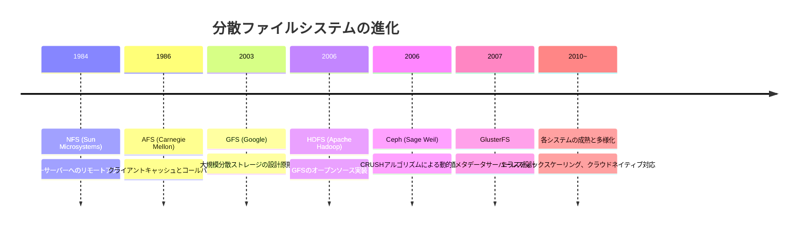

### 1.4 分散ファイルシステムが解決する問題

現代の分散ファイルシステムは、以下の問題を同時に解決しようとしている。

- **スケーラビリティ**：ペタバイト級のデータを、ノードの追加だけで拡張できること
- **耐障害性**：個々のディスクやノードが故障してもデータを失わないこと
- **高スループット**：大量のデータを並列に読み書きできること
- **透過性**：アプリケーションから見て、分散ストレージの複雑さが隠蔽されていること

ただし、すべてのシステムがこれらの要件を同じ優先度で扱うわけではない。HDFSはバッチ処理のスループットに最適化されており、Cephは汎用性を重視し、GlusterFSは運用のシンプルさに焦点を当てている。このトレードオフの違いこそが、各システムの存在意義を定めている。

## 2. アーキテクチャの基本概念

分散ファイルシステムの設計において、共通して直面する設計課題がいくつかある。個別のシステムを詳しく見る前に、これらの共通課題を整理しておこう。

### 2.1 メタデータ管理

ファイルシステムにおいて、**メタデータ**とはファイルの名前、サイズ、パーミッション、タイムスタンプ、そしてファイルのデータブロックがどの物理位置に格納されているかといった管理情報のことである。分散ファイルシステムでは、メタデータ管理の設計がシステム全体の性能とスケーラビリティに決定的な影響を与える。

メタデータの管理方式は大きく分けて以下の3つのアプローチがある。

**中央集権型**：単一のメタデータサーバーがすべてのメタデータを管理する。実装がシンプルで一貫性を保ちやすいが、スケーラビリティと可用性に制約がある。GFS、HDFSがこの方式を採用している。

**分散型**：メタデータを複数のサーバーに分散して管理する。スケーラビリティに優れるが、一貫性の維持が複雑になる。Cephの MDS（Metadata Server）クラスタがこの方式に近い。

**メタデータサーバーレス**：専用のメタデータサーバーを持たず、データの配置をアルゴリズム的に計算する。メタデータサーバーがボトルネックにならないが、柔軟性に制約がある。GlusterFSがこの方式を採用している。

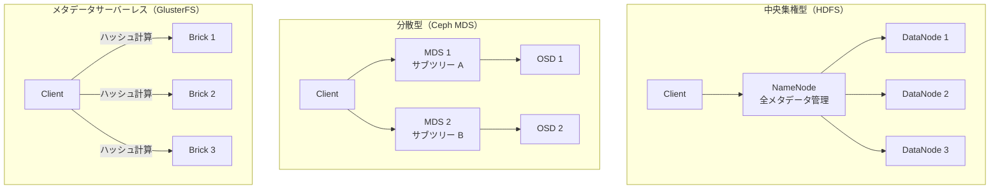

### 2.2 データ配置戦略

データを複数のノードにどのように配置するかは、性能、耐障害性、負荷分散のすべてに影響する。主要な配置戦略は以下のとおりである。

**ブロック分割**：大きなファイルを固定サイズのブロック（チャンク）に分割し、各ブロックを異なるノードに配置する。HDFSでは128MBが標準的なブロックサイズである。この方式は大容量ファイルの並列読み書きに有利だが、小さなファイルの場合はメタデータのオーバーヘッドが相対的に大きくなる。

**オブジェクト配置**：データをオブジェクトとして抽象化し、アルゴリズムに基づいてオブジェクトの配置先を決定する。Cephの**CRUSHアルゴリズム**がこの代表例であり、クラスタのトポロジーを考慮した擬似ランダムな配置を実現する。

**ハッシュベース配置**：ファイル名やパスのハッシュ値に基づいて配置先ノードを決定する。GlusterFSの**Elastic Hash Algorithm（EHA）**がこの方式を採用しており、メタデータサーバーなしにデータの配置先を計算できる。

### 2.3 レプリケーションと一貫性

データの耐障害性を確保するための基本的な手法がレプリケーション（複製）である。分散ファイルシステムでは、データブロックを複数のノードにコピーして保持する。

レプリケーションの主要な方式は以下の2つである。

**同期レプリケーション**：書き込みが全レプリカに伝播したことを確認してからクライアントに成功を返す。強い一貫性を保証できるが、レイテンシが増大する。

**非同期レプリケーション**：プライマリレプリカへの書き込みが完了した時点でクライアントに成功を返し、他のレプリカへの伝播はバックグラウンドで行う。レイテンシは小さいが、障害時にデータ損失のリスクがある。

多くの分散ファイルシステムでは、この中間的なアプローチとして**パイプライン方式**を採用している。HDFSでは、データブロックの書き込みはDataNodeのチェーン（パイプライン）を通じて伝播し、チェーンの末端までの書き込みが完了した時点で成功を返す。

近年では、レプリケーションの代替として**イレージャーコーディング（Erasure Coding）**が注目されている。イレージャーコーディングは、データブロックを $k$ 個のデータフラグメントと $m$ 個のパリティフラグメントに分割し、任意の $m$ 個のフラグメントが失われてもデータを復元できる。3レプリカ方式では約3倍のストレージ容量が必要なのに対し、例えばRS(6,3)のイレージャーコーディングでは1.5倍で済む。ただし、データの復元にはデコード処理が必要であり、CPUコストとレイテンシの増大というトレードオフがある。

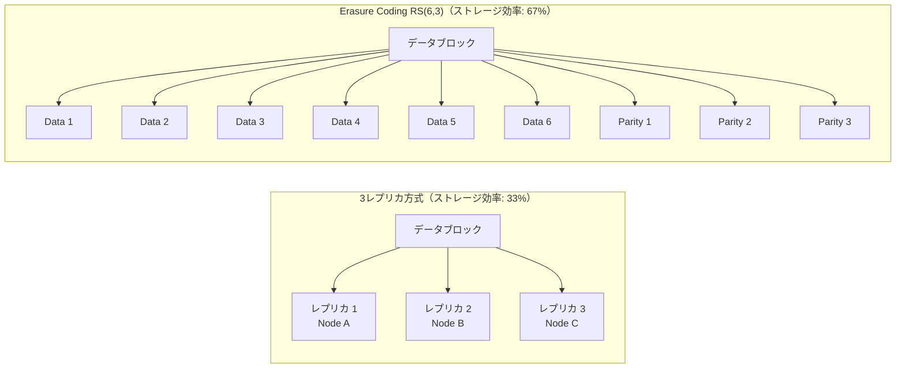

### 2.4 故障検出と回復

分散ファイルシステムでは、ノードの故障検出と自動回復が不可欠である。一般的な故障検出の仕組みとして、以下の手法が用いられる。

- **ハートビート**：各ノードが定期的に管理ノードに生存報告を送信する。一定期間ハートビートが途絶えたノードは「障害」と判断される。HDFS、Cephがこの方式を採用している。
- **Gossipプロトコル**：ノード同士がランダムに状態情報を交換し、障害を伝播的に検出する。単一障害点がないのが利点である。
- **Quorum ベース**：読み書きに必要なノード数（Quorum）を定義し、Quorumが満たされない場合に障害を検出する。

## 3. HDFS — Hadoop 分散ファイルシステム

### 3.1 誕生の背景

HDFS（Hadoop Distributed File System）は、GoogleのGFS論文（2003年）を基にしたオープンソース実装である。Doug CuttingとMike Cafarellaが2005年にApache Nutch（Webクローラー）プロジェクトの一部として開発を始め、2006年にApache Hadoopプロジェクトとして独立した。

HDFSの設計は、GFSの設計前提をほぼそのまま踏襲している。すなわち、大容量ファイルの逐次アクセスに最適化し、コモディティハードウェア上での動作を前提とし、障害を常態として扱う。この設計思想は、MapReduceやApache Sparkといった大規模バッチ処理フレームワークとの組み合わせにおいて、極めて効果的に機能する。

### 3.2 アーキテクチャ

HDFSのアーキテクチャは、**NameNode**と**DataNode**の2種類のプロセスで構成される、マスター/スレーブ型の設計である。

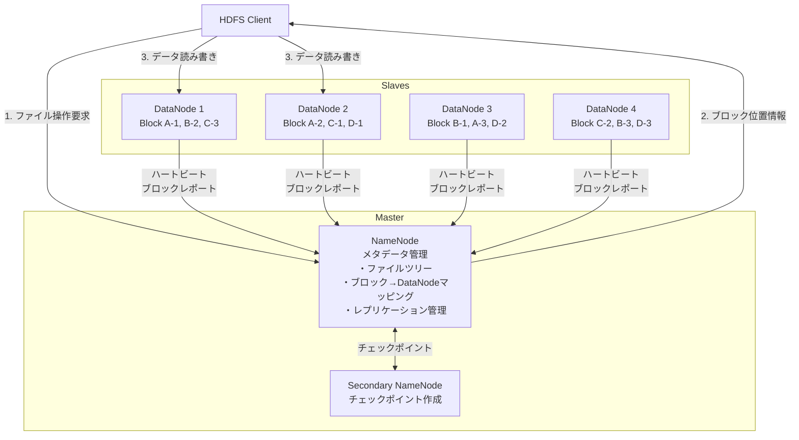

**NameNode**はクラスタ全体のメタデータを管理する単一のマスターノードである。具体的には以下の情報を保持する。

- **ファイルシステムの名前空間**：ファイルやディレクトリのツリー構造、パーミッション、タイムスタンプ
- **ブロックマッピング**：各ファイルがどのブロックで構成されているか、各ブロックがどのDataNodeに格納されているか
- **レプリケーション状態**：各ブロックのレプリカ数が設定値を満たしているかどうか

NameNodeはこれらのメタデータを**全メモリ上に保持する**。これにより、メタデータ操作のレイテンシは極めて低く抑えられるが、クラスタが管理できるファイル数はNameNodeのメモリ容量に制約される。一般に、1ファイルあたり約150バイトのメタデータを消費するため、64GBのメモリでは約4億ファイル程度が限界となる。

**DataNode**はデータブロックの実際の読み書きを担当するワーカーノードである。DataNodeはローカルファイルシステム上にブロックデータを格納し、定期的にNameNodeに対して以下の報告を行う。

- **ハートビート**（3秒間隔）：DataNodeの生存確認
- **ブロックレポート**（6時間間隔）：そのDataNodeが保持しているすべてのブロックのリスト

### 3.3 データの読み書きプロセス

#### 読み取り（Read）

HDFSからファイルを読み取る際のプロセスは以下のとおりである。

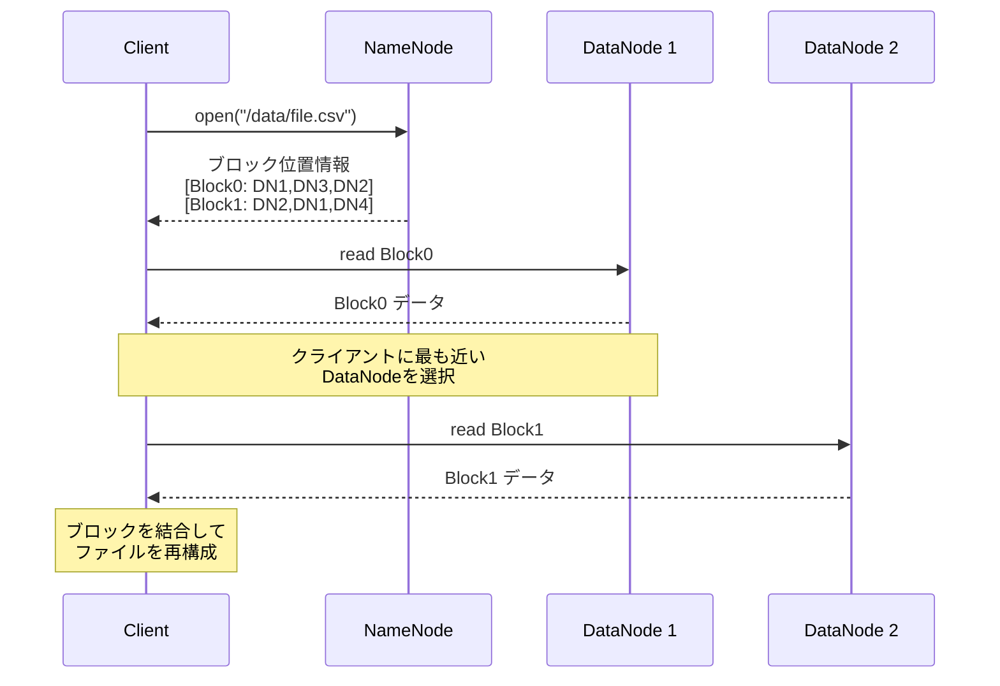

重要なのは、**データ転送はNameNodeを経由しない**という点である。クライアントはNameNodeからブロックの位置情報のみを取得し、実際のデータはDataNodeから直接読み取る。これにより、NameNodeがI/Oのボトルネックになることを回避している。

また、クライアントは複数のレプリカのうち、ネットワーク的に最も近いDataNodeを選択してデータを読み取る。HDFSは**ラックアウェアネス（rack awareness）**を持っており、同一ラック内のDataNodeが最優先される。

#### 書き込み（Write）

データの書き込みは、パイプライン方式で行われる。

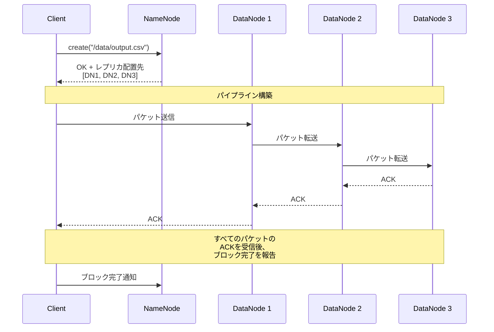

書き込みのパイプラインには、**ラック配置ポリシー**が適用される。デフォルトのレプリカ配置ポリシー（レプリカファクタ = 3）は以下のとおりである。

1. **第1レプリカ**：書き込みを行っているクライアントと同一ノード（クライアントがクラスタ外の場合はランダムなノード）
2. **第2レプリカ**：第1レプリカとは**異なるラック**のノード
3. **第3レプリカ**：第2レプリカと**同じラック**の別ノード

このポリシーにより、ラック全体が障害になった場合でもデータを保全しつつ、書き込み時のラック間通信を最小限に抑えるという巧妙なバランスを実現している。

### 3.4 NameNode の可用性

HDFSの最大の設計上の懸念は、NameNodeが単一障害点になることである。これに対して、HDFS 2.0以降ではいくつかの対策が実装されている。

**NameNode HA（High Availability）**：Active-Standby構成の2台のNameNodeを稼働させ、共有ストレージ（NFS or QJM: Quorum Journal Manager）を通じてメタデータの編集ログ（EditLog）を同期する。Activeノードが障害を起こした場合、StandbyノードがActiveに昇格する。

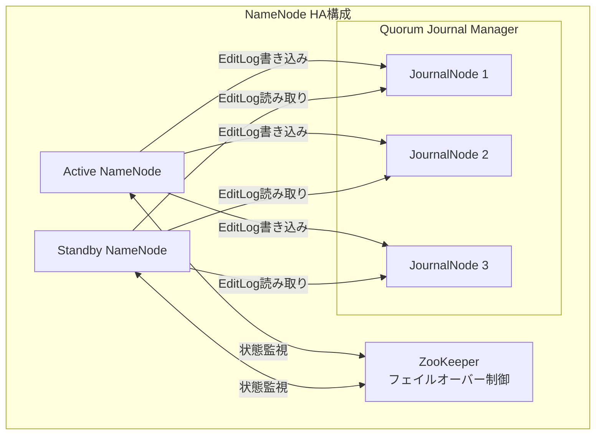

**HDFS Federation**：複数のNameNodeを稼働させ、名前空間を分割して管理する仕組みである。例えば、`/user` 以下はNameNode Aが、`/data` 以下はNameNode Bが管理するといった分割が可能である。これにより、メタデータのスケーラビリティ問題を緩和する。

### 3.5 HDFS の限界と適用領域

HDFSは大規模バッチ処理において極めて強力だが、以下の制約がある。

- **低レイテンシアクセスに不向き**：NameNodeへのメタデータ問い合わせが必要であり、小さなファイルの個別アクセスではオーバーヘッドが大きい
- **小さなファイルの大量保存に不向き**：各ファイルがNameNodeのメモリを消費するため、数百万個の小さなファイルはNameNodeのメモリを圧迫する（Small Files Problem）
- **ランダム書き込み非対応**：HDFSは追記（append）のみをサポートし、既存データのインプレース更新はできない
- **POSIXセマンティクスの不完全なサポート**：POSIXのファイルシステムAPIの一部（例：ランダム書き込み、ハードリンク）をサポートしていない

これらの特性から、HDFSは以下のワークロードに最適である。

- MapReduceやSparkによるバッチ分析
- データレイク（Data Lake）の基盤
- ログの集約・保存
- 大容量ファイルのシーケンシャル処理

## 4. Ceph — 統合された分散ストレージプラットフォーム

### 4.1 設計思想と誕生

Cephは、2006年にSage Weilがカリフォルニア大学サンタクルーズ校（UCSC）での博士論文研究として開発を始めた分散ストレージシステムである。Cephの設計目標は、HDFSのようなバッチ処理特化型ではなく、**ブロックストレージ、オブジェクトストレージ、ファイルシステムの3つのインターフェースを統一的に提供する汎用分散ストレージ**を実現することだった。

Cephの最大の技術的特徴は、**CRUSH（Controlled Replication Under Scalable Hashing）**アルゴリズムによるデータ配置である。CRUSHにより、中央集権的なメタデータサーバーなしに、データの配置先を確定的に計算できる。これにより、HDFSにおけるNameNodeのようなボトルネックを回避しつつ、クラスタのトポロジーや障害ドメインを考慮した高度な配置ポリシーを実現している。

### 4.2 RADOS — Ceph の基盤レイヤー

Cephの全てのストレージ機能は、**RADOS（Reliable Autonomic Distributed Object Store）**という基盤レイヤーの上に構築されている。RADOSは分散オブジェクトストアであり、Cephのブロックストレージ（RBD）、オブジェクトストレージ（RGW）、ファイルシステム（CephFS）のいずれも、RADOSにオブジェクトを読み書きする形で実装されている。

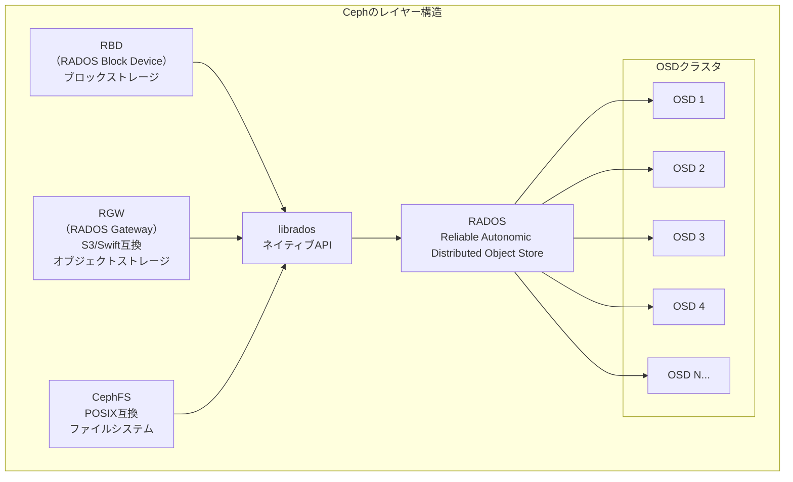

RADOSの構成要素は以下のとおりである。

**OSD（Object Storage Daemon）**：各物理ディスク（またはSSD）に対して1つのOSDプロセスが稼働する。OSDはオブジェクトの読み書き、レプリケーション、リバランシング、障害検出を担当する。数千台のOSDで構成されるクラスタも珍しくない。

**Monitor（MON）**：クラスタの状態マップ（Cluster Map）を管理する。Monitor は通常3台または5台の奇数台で構成され、Paxosベースのコンセンサスにより一貫性を保つ。Cluster Mapには以下の情報が含まれる。

- **Monitor Map**：Monitorノードの一覧
- **OSD Map**：OSDの状態（up/down, in/out）
- **PG Map**：Placement Groupの状態
- **CRUSH Map**：クラスタのトポロジーと配置ルール

**MDS（Metadata Server）**：CephFSを使用する場合にのみ必要であり、POSIXファイルシステムのメタデータ（ディレクトリツリー、inodeなど）を管理する。RADOSやRBDのみの場合は不要である。

### 4.3 CRUSH アルゴリズム

CRUSHアルゴリズムは、Cephの核心技術である。CRUSHの目的は、オブジェクトの識別子とクラスタの構成情報のみから、そのオブジェクトが格納されるべきOSDを確定的に計算することである。

#### Placement Group（PG）

CRUSHが直接オブジェクトをOSDにマッピングするわけではない。まず、オブジェクトは**Placement Group（PG）**にマッピングされ、次にPGがOSDにマッピングされる。この2段階のマッピングにより、オブジェクト数が膨大でもOSD間の再配置管理を効率的に行える。

```
オブジェクト → PG → OSD

hash(object_id) mod num_PGs = PG_id
CRUSH(PG_id, CRUSH_map) = [OSD_primary, OSD_replica1, OSD_replica2]
```

PGの数は通常、OSD数の約100倍に設定される。例えば、100台のOSDがあるクラスタでは、10,000程度のPGが適切である。

#### CRUSH Map

CRUSH Mapは、クラスタの物理的なトポロジーをツリー構造で表現する。典型的なCRUSH Mapは以下のような階層を持つ。

```
root (default)
├── datacenter dc1
│   ├── rack rack1
│   │   ├── host host01
│   │   │   ├── osd.0
│   │   │   └── osd.1
│   │   └── host host02
│   │       ├── osd.2
│   │       └── osd.3
│   └── rack rack2
│       ├── host host03
│       │   ├── osd.4
│       │   └── osd.5
│       └── host host04
│           ├── osd.6
│           └── osd.7
└── datacenter dc2
    └── rack rack3
        ├── host host05
        │   ├── osd.8
        │   └── osd.9
        └── host host06
            ├── osd.10
            └── osd.11
```

CRUSHルールによって、「レプリカを異なるラックに配置する」や「レプリカを異なるデータセンターに配置する」といった障害ドメインを考慮した配置ポリシーを宣言的に定義できる。

```
# CRUSH rule example
rule replicated_rule {
    id 0
    type replicated
    step take default
    step chooseleaf firstn 0 type rack  # choose leaves from different racks
    step emit
}
```

#### CRUSHの利点

CRUSHアルゴリズムの決定論的な性質により、以下の利点が得られる。

1. **メタデータサーバー不要**：クライアントはCRUSH Mapのコピーを保持し、ローカルでデータの配置先を計算できる。メタデータサーバーへの問い合わせが不要であるため、ボトルネックが生じない。
2. **最小限のデータ移動**：OSDの追加・削除時に移動するデータは、理想的には $\frac{1}{N}$（Nは変更後のOSD数）に近い。
3. **障害ドメインの考慮**：CRUSH Mapの階層構造を活用して、ラックやデータセンターの障害に耐えるレプリカ配置を自動的に実現する。

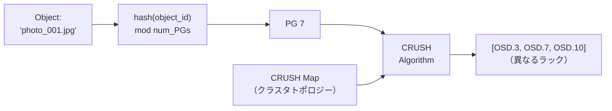

### 4.4 データの読み書き

Cephにおけるデータの読み書きは、以下のように行われる。

**書き込み**：
1. クライアントがオブジェクトのPGを計算する
2. CRUSHアルゴリズムにより、そのPGを担当するOSDセット（Primary + Replica）を計算する
3. クライアントはPrimary OSDにオブジェクトを送信する
4. Primary OSDはReplicaOSDにオブジェクトを転送する
5. すべてのReplicaからACKを受信した後、Primary OSDがクライアントにACKを返す

**読み取り**：
1. クライアントがPGとPrimary OSDを計算する
2. Primary OSDからオブジェクトを読み取る

この方式では、書き込みは全レプリカへの伝播を待つ強一貫性モデルを採用している。ただし、性能を優先する場合は、最小限のACK数で応答するよう設定することも可能である。

### 4.5 イレージャーコーディング

Cephはレプリケーションに加えて、**イレージャーコーディング**もサポートしている。イレージャーコーディングプールでは、データオブジェクトが $k$ 個のデータチャンクと $m$ 個のコーディングチャンクに分割される。

例えば、EC(4,2) の設定では以下のようになる。

```
Original Object (4MB)
     |
     v
+----+----+----+----+----+----+
| D1 | D2 | D3 | D4 | C1 | C2 |
| 1MB| 1MB| 1MB| 1MB| 1MB| 1MB|
+----+----+----+----+----+----+
  |    |    |    |    |    |
OSD1 OSD2 OSD3 OSD4 OSD5 OSD6

Storage overhead: 6/4 = 1.5x (vs 3x for 3-way replication)
Tolerable failures: 2 OSD
```

イレージャーコーディングはストレージ効率が高い反面、以下のトレードオフがある。

- **読み取りレイテンシの増大**：$k$ 個のOSDからデータを読み取る必要がある
- **書き込みのCPUコスト**：エンコード/デコード処理にCPUを消費する
- **部分書き込みの非効率性**：小さな更新でも全チャンクの再計算が必要

このため、イレージャーコーディングはアクセス頻度の低いコールドデータに適用されることが多い。

### 4.6 CephFS — POSIX互換分散ファイルシステム

CephFSはRADOSの上に構築されたPOSIX互換の分散ファイルシステムである。CephFSの特徴は、メタデータの動的サブツリー分割（Dynamic Subtree Partitioning）にある。

MDS（Metadata Server）クラスタは、ファイルシステムの名前空間をサブツリー単位で分割し、各MDSに割り当てる。アクセスパターンの変化に応じて、負荷の高いサブツリーを自動的に分割・移動する。

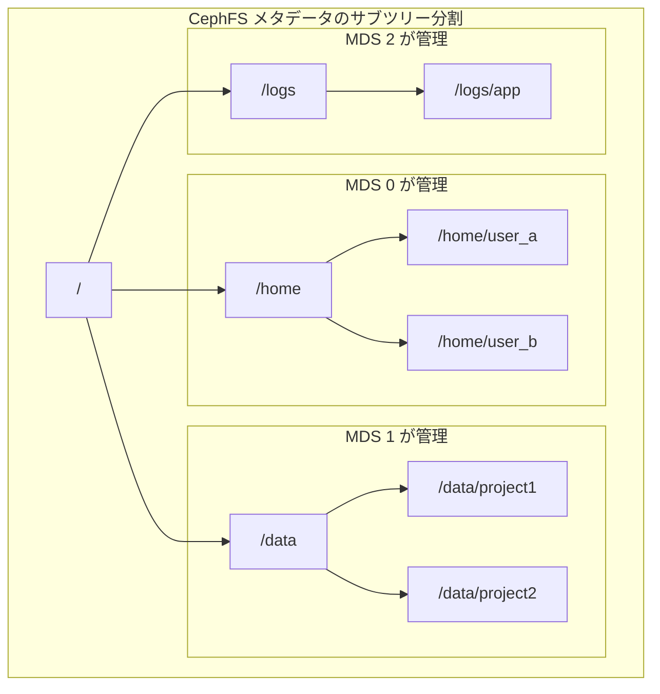

CephFSは、POSIX互換性を高い水準で維持しているため、既存のアプリケーションを修正なしに移行できるケースが多い。ただし、分散環境でのPOSIXセマンティクス完全準拠にはコストが伴い、特にロック関連の操作はレイテンシが増大する傾向にある。

### 4.7 Ceph の適用領域

Cephの汎用性の高さから、以下のような多様なユースケースに適用されている。

- **OpenStackのバックエンドストレージ**：Cinder（ブロックストレージ）、Glance（イメージストレージ）、Nova（仮想ディスク）
- **Kubernetesの永続ボリューム**：RBDまたはCephFSによるPersistentVolume
- **S3互換オブジェクトストレージ**：RGWによるオンプレミスS3
- **HPC（High Performance Computing）**：CephFSによる共有ファイルシステム
- **バックアップ・アーカイブ**：イレージャーコーディングによるストレージ効率の良いコールドストレージ

## 5. GlusterFS — メタデータサーバーレスの分散ファイルシステム

### 5.1 設計思想

GlusterFSは、2005年にGluster社（後にRed Hatが買収）によって開発が始まった分散ファイルシステムである。GlusterFSの最大の設計上の特徴は、**専用のメタデータサーバーを持たない**ことである。

HDFSのNameNodeやCephのMonitor/MDSのような中央集権的なコンポーネントを排除し、ファイルの配置を**Elastic Hash Algorithm（EHA）**と呼ばれるアルゴリズムで計算する。これにより、メタデータサーバーが単一障害点やパフォーマンスボトルネックになるリスクを根本的に排除している。

GlusterFSのもう一つの設計原則は「**積み重ね可能なトランスレータ（Stackable Translators）**」アーキテクチャである。レプリケーション、ストライピング、暗号化、キャッシュといった機能を独立したトランスレータとして実装し、それらをスタックのように積み重ねて組み合わせる。これにより、高い柔軟性とモジュール性を実現している。

### 5.2 基本アーキテクチャ

GlusterFSのアーキテクチャは以下の要素で構成される。

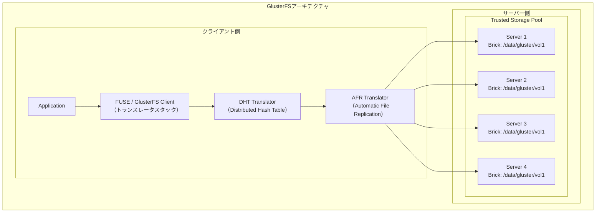

**Brick**：GlusterFSの基本的なストレージ単位であり、サーバー上のディレクトリ（通常はXFSまたはext4ファイルシステム上）を指す。各サーバーは1つ以上のBrickを提供できる。

**Volume**：Brickの論理的な集合であり、クライアントがマウントする単位である。Volumeの種類によって、データの分散方式が決まる。

**Trusted Storage Pool**：GlusterFSクラスタを構成するサーバーの集合。

### 5.3 ボリュームタイプ

GlusterFSは複数のボリュームタイプを提供しており、用途に応じて選択する。

**Distributed Volume（分散ボリューム）**：ファイルをDHTに基づいて各Brickに分散配置する。容量は全Brickの合計だが、レプリケーションがないため、いずれかのBrickが故障するとそのBrickのデータを失う。

```
Volume: dist-vol (Distributed)
├── Brick 1: file_A, file_D, file_G
├── Brick 2: file_B, file_E, file_H
└── Brick 3: file_C, file_F, file_I
```

**Replicated Volume（レプリカボリューム）**：全ファイルをすべてのBrickに複製する。高い耐障害性を持つが、容量は単一Brickの容量に制限される。

```
Volume: repl-vol (Replicated, replica 3)
├── Brick 1: file_A, file_B, file_C (complete copy)
├── Brick 2: file_A, file_B, file_C (complete copy)
└── Brick 3: file_A, file_B, file_C (complete copy)
```

**Distributed-Replicated Volume（分散レプリカボリューム）**：最も一般的に使用されるタイプ。ファイルをDHTで分散しつつ、各データを複数のBrickにレプリケーションする。

```
Volume: dist-repl-vol (Distributed-Replicated, replica 2)
├── Subvolume 1 (Replica Set):
│   ├── Brick 1 (Server 1): file_A, file_C
│   └── Brick 2 (Server 2): file_A, file_C
└── Subvolume 2 (Replica Set):
    ├── Brick 3 (Server 3): file_B, file_D
    └── Brick 4 (Server 4): file_B, file_D
```

**Dispersed Volume（分散符号化ボリューム）**：イレージャーコーディングを使用するボリュームタイプ。ストレージ効率を重視する場合に使用される。

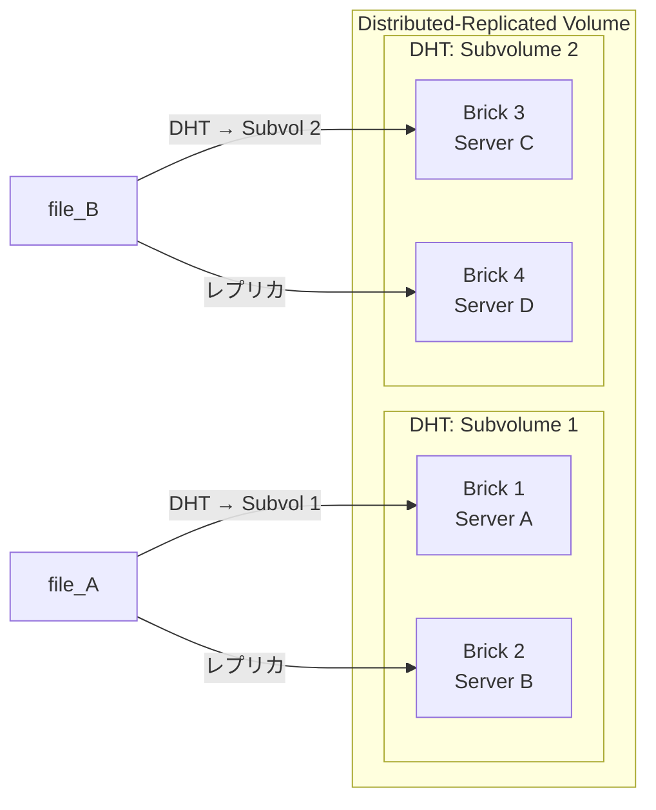

### 5.4 Elastic Hash Algorithm（EHA）

GlusterFSのデータ配置は、Elastic Hash Algorithm（EHA）に基づいている。EHAの基本的な仕組みは以下のとおりである。

1. 各Brickに、32ビットハッシュ空間の連続した範囲が割り当てられる
2. ファイル名（またはGFID）のハッシュ値を計算する
3. ハッシュ値が属する範囲を持つBrickにファイルが配置される

```
32-bit Hash Space [0 ... 0xFFFFFFFF]

|--- Brick 1 ---|--- Brick 2 ---|--- Brick 3 ---|--- Brick 4 ---|
[0x00000000      0x3FFFFFFF     0x7FFFFFFF      0xBFFFFFFF      0xFFFFFFFF]

file_a.txt: hash = 0x1A2B3C4D → Brick 1
file_b.txt: hash = 0x5E6F7A8B → Brick 2
file_c.txt: hash = 0xAB12CD34 → Brick 3
file_d.txt: hash = 0xEF567890 → Brick 4
```

Brickが追加された場合、ハッシュ空間が再分割される。このとき、理想的には全データの $\frac{1}{N+1}$ のみが移動すればよい（Nは既存Brick数）。ただし、実際にはリバランス処理が必要であり、バックグラウンドでファイルの再配置が行われる。

EHAの重要な特性は、**ディレクトリごとにハッシュの割り当てが独立している**ことである。これにより、あるディレクトリ内のファイルが特定のBrickに偏ることなく、均等に分散される。

### 5.5 メタデータサーバーレスのトレードオフ

メタデータサーバーを持たない設計には、明確な利点とトレードオフがある。

**利点：**
- メタデータサーバーが単一障害点にならない
- メタデータサーバーのメモリ容量に制約されない
- メタデータサーバーのスケーリングを考慮する必要がない

**トレードオフ：**
- **`ls` やディレクトリの列挙が遅い**：ディレクトリの全内容を取得するには、すべてのBrickに問い合わせる必要がある。メタデータサーバーがあれば1回の問い合わせで済むところを、Brick数分の問い合わせが必要になる。
- **ファイルのリネームにコストがかかる**：ファイル名が変わるとハッシュ値が変わるため、物理的な配置先が変わる可能性がある。この場合、実際のデータ移動が発生する。
- **ハッシュの衝突と偏り**：ハッシュベースの分散では完全な均等分散は保証されず、特定のBrickに負荷が集中する可能性がある。

### 5.6 GlusterFS の運用と特徴

GlusterFSの運用上の大きな利点は、**セットアップと管理のシンプルさ**である。基本的な操作は`gluster`コマンドラインツールで完結する。

```bash
# Create a trusted storage pool
gluster peer probe server2
gluster peer probe server3

# Create a distributed-replicated volume
gluster volume create myvolume replica 2 \
    server1:/data/brick1 \
    server2:/data/brick1 \
    server3:/data/brick1 \
    server4:/data/brick1

# Start the volume
gluster volume start myvolume

# Mount on client
mount -t glusterfs server1:/myvolume /mnt/gluster
```

GlusterFSは**POSIX互換性**を高い水準で維持しており、FUSEベースのクライアントまたはNFS/SMBゲートウェイを通じてアクセスできる。既存のアプリケーションをほぼ無修正で利用できる点は、運用上の大きな利点である。

### 5.7 GlusterFS の適用領域

GlusterFSは以下のユースケースに適している。

- **NASの代替**：中小規模の共有ファイルストレージ
- **メディアストレージ**：画像、動画、音声ファイルの保存
- **コンテナの永続ボリューム**：Kubernetes/DockerのPersistentVolume
- **地理的分散レプリケーション（Geo-Replication）**：異なるデータセンター間でのデータ複製
- **アーカイブストレージ**：Dispersed Volumeによるストレージ効率の良いアーカイブ

## 6. 3システムの比較と選定基準

### 6.1 アーキテクチャの比較

| 特性 | HDFS | Ceph | GlusterFS |
|------|------|------|-----------|
| メタデータ管理 | 中央集権（NameNode） | 分散（Monitor + MDS） | メタデータサーバーレス（DHT） |
| データ配置 | NameNodeが決定 | CRUSHアルゴリズム | Elastic Hash Algorithm |
| レプリケーション | パイプライン方式（デフォルト3） | Primary-Replica（設定可能） | AFR Translator（設定可能） |
| イレージャーコーディング | HDFS 3.0+ でサポート | ネイティブサポート | Dispersed Volume |
| POSIX互換性 | 不完全 | CephFS: 高い | 高い |
| ストレージインターフェース | ファイルのみ | ブロック + オブジェクト + ファイル | ファイル中心 |
| スケール目安 | 数千ノード | 数千OSD | 数百ノード |
| 最小構成 | NameNode + DataNode 3台 | MON 3台 + OSD 3台 | サーバー 2台 |

### 6.2 性能特性の比較

各システムの性能特性は、ワークロードの種類によって大きく異なる。

**大容量ファイルのシーケンシャル読み書き**

HDFSが最も優れている。128MBのブロックサイズと、データをNameNodeを経由せずにDataNodeから直接読み取る設計により、高いスループットを実現する。MapReduceやSparkのような並列処理フレームワークとの親和性も高い。

**ランダムI/O（小さなブロック単位の読み書き）**

CephのRBD（ブロックデバイス）が最も適している。4KBや8KBといった小さなブロック単位のI/Oに最適化されており、仮想マシンやデータベースのバックエンドとして使用できる。HDFSはこのワークロードには根本的に不向きである。

**メタデータ集約的操作（大量の小さなファイル、ディレクトリの列挙）**

CephFSのMDSが、メタデータのキャッシュとサブツリー分割により、最も効率的に処理できる。GlusterFSは全Brickへの問い合わせが必要であるため、ディレクトリの列挙が遅くなりがちである。HDFSは小さなファイルの大量保存自体がアンチパターンとなる。

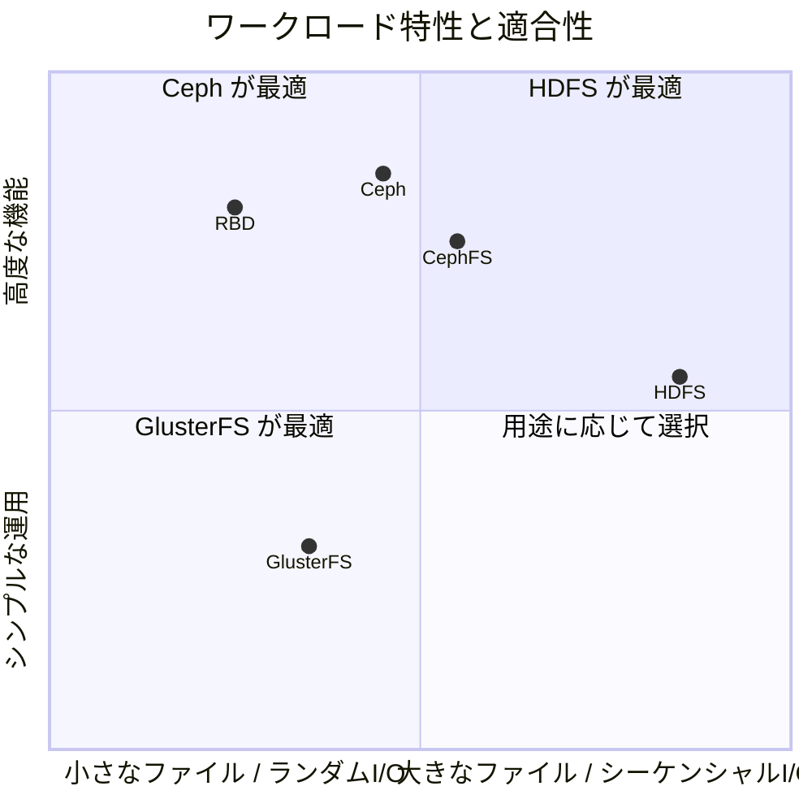

### 6.3 運用面の比較

**デプロイの容易さ**

GlusterFSが最もシンプルである。専用のメタデータサーバーが不要であり、数コマンドでクラスタを構築できる。Cephは多くのコンポーネント（Monitor、OSD、オプションでMDS、RGW）のデプロイと設定が必要であり、初期構築の複雑さが高い。HDFSはHadoopエコシステム全体のセットアップが必要であり、JVMの設定やHadoopの各種設定ファイルの管理が求められる。

**スケーリング**

Cephが最も柔軟である。OSDの追加は`ceph osd add`コマンドで行え、CRUSHアルゴリズムにより自動的にデータのリバランスが行われる。GlusterFSもBrickの追加とリバランスが比較的容易である。HDFSのDataNode追加は簡単だが、NameNodeのスケーリング（HDFS Federation）はより複雑な設計判断を伴う。

**監視と障害対応**

CephはCeph Dashboardによる包括的な監視UIを提供しており、クラスタの健全性、I/Oパフォーマンス、容量の使用状況をリアルタイムで確認できる。また、自己修復機能が強力であり、OSDの障害時に自動的にデータのリバランスが行われる。

HDFSはWebUIとJMXメトリクスを提供しており、Ambari（旧Hortonworks）やCloudera Managerといった管理ツールと組み合わせることで運用を効率化できる。

GlusterFSは`gluster volume status`や`gluster volume heal`コマンドによるCLIベースの監視が中心であり、大規模クラスタの運用ではサードパーティの監視ツールとの連携が推奨される。

### 6.4 選定のガイドライン

以下のような判断基準で、分散ファイルシステムを選定する。

**HDFSを選ぶべきケース：**
- Hadoop / Spark エコシステムを使用している
- 大規模なバッチ分析が主要ワークロードである
- ファイルサイズが大きく（数MB以上）、追記中心のアクセスパターンである
- POSIXセマンティクスが不要である

**Cephを選ぶべきケース：**
- ブロックストレージ、オブジェクトストレージ、ファイルストレージのいずれか（または複数）が必要である
- OpenStackやKubernetesのバックエンドストレージとして使用する
- ストレージの統合管理を行いたい
- 高い耐障害性とスケーラビリティの両方が求められる
- 運用チームに分散ストレージの専門知識がある

**GlusterFSを選ぶべきケース：**
- シンプルなNAS代替として使用する
- POSIX互換の共有ファイルシステムが必要である
- デプロイと運用をシンプルに保ちたい
- 中小規模のクラスタ（数ノード～数十ノード）で運用する
- 地理的に分散したデータレプリケーションが必要である

## 7. 実装上の共通課題

### 7.1 ネットワーク分断への対応

分散ファイルシステムにおいて、ネットワーク分断（network partition）は避けて通れない課題である。CAP定理により、ネットワーク分断時には一貫性（Consistency）と可用性（Availability）のトレードオフが不可避となる。

HDFSはCPを選択する設計である。NameNodeとの通信が途絶えたDataNodeは「dead」とマークされ、そのDataNode上のレプリカは別のノードに再複製される。書き込みはNameNodeが利用可能な場合のみ受け付けられる。

Cephも基本的にはCPを指向するが、設定により柔軟に調整できる。例えば、`min_size`パラメータにより、書き込みが成功するために必要な最小レプリカ数を制御できる。

GlusterFSはスプリットブレインシナリオに対して、**AFR（Automatic File Replication）トランスレータ**による自動修復を試みるが、両方のパーティションでファイルが変更された場合は手動介入が必要になることがある。

### 7.2 一貫性の保証

分散ファイルシステムにおける一貫性の保証は、各システムで異なるアプローチを取っている。

HDFSは**単一ライター（single-writer）モデル**を採用している。ファイルは一度に1つのクライアントのみが書き込み可能であり、書き込み中のファイルは他のクライアントから読めない（または部分的な内容が見える）。このシンプルなモデルにより、複雑な一貫性プロトコルを回避している。

Cephは**強い一貫性（strong consistency）**を保証する。Primary OSDがすべてのReplicaへの書き込みを確認してからクライアントにACKを返すため、一度ACKされたデータは必ず全レプリカに反映されている。

GlusterFSは**結果整合性（eventual consistency）**に近いモデルを採用している。書き込みはBrickに直接行われ、レプリケーションはAFRトランスレータにより処理される。障害からの回復時にはセルフヒーリング（self-healing）プロセスが不整合を検出・修復する。

### 7.3 データの整合性検証

長期間にわたってデータを保存する分散ファイルシステムでは、**ビットロット（bit rot）**と呼ばれる、物理的な劣化によるサイレントなデータ破損を検出する仕組みが重要である。

HDFSは各ブロックに対してチェックサムを計算・保存し、読み取り時にチェックサムを検証する。不整合が検出された場合は、他のレプリカから正しいデータを読み取る。

Cephはデフォルトで**スクラビング（scrubbing）**を定期的に実行し、OSD上のオブジェクトの整合性を検証する。浅いスクラブ（サイズとメタデータの確認）と深いスクラブ（全データのチェックサム検証）の2段階がある。

GlusterFSも**BitRot Detection**機能を備えており、バックグラウンドでBrick上のファイルのチェックサムを検証し、破損を検出する。

## 8. 今後の展望

### 8.1 クラウドネイティブへの適応

分散ファイルシステムは、クラウドネイティブ環境への適応が急速に進んでいる。

CephはKubernetesとの統合が特に進んでおり、**Rook**オペレータを通じてKubernetes上でのCephクラスタのデプロイと管理を自動化できる。CSI（Container Storage Interface）ドライバにより、PersistentVolumeとしてRBDやCephFSを簡単に利用できる。

HDFSはOzone（Apache Ozone）という新しいプロジェクトに進化している。OzoneはHDFSの設計上の制約（NameNodeのスケーラビリティ問題、小さなファイルの非効率性）を解消しつつ、S3互換APIを提供するオブジェクトストレージである。

GlusterFSは2023年にRed Hatが新規開発の終了を表明し、メンテナンスモードに移行している。GlusterFSの後継として、Red Hatは**OpenShift Data Foundation（ODF）**でCephベースのストレージを推奨している。

### 8.2 ストレージとコンピュートの分離

従来のHadoopエコシステムでは、HDFSのDataNodeとMapReduceのワーカーを同一ノードに配置する**データローカリティ**の原則が重視されていた。しかし、ネットワーク帯域幅の増大とクラウド環境の普及により、**ストレージとコンピュートの分離（disaggregation）**が主流になりつつある。

この傾向の中で、S3互換のオブジェクトストレージ（Amazon S3、MinIO等）がデータレイクの標準的な基盤となり、SparkやPrestoといった計算エンジンがS3からデータを読み取る構成が一般的になっている。Apache IcebergやDelta Lakeといったテーブルフォーマットは、オブジェクトストレージ上でACIDトランザクションを提供し、従来HDFSが担っていた役割の一部を代替している。

### 8.3 NVMe-oF とストレージネットワーキングの進化

NVMe-oF（NVMe over Fabrics）は、NVMeプロトコルをネットワーク越しに拡張する技術であり、分散ファイルシステムのI/Oパスに大きな影響を与える可能性がある。従来のTCP/IPスタックを経由するI/Oと比較して、NVMe-oFはマイクロ秒単位のレイテンシでリモートストレージにアクセスできる。

CephはNVMe-oFの活用に積極的であり、BlueStore（CephのOSDバックエンド）はNVMeデバイスに最適化されている。将来的には、OSD間の通信にNVMe-oFを使用することで、レプリケーションのレイテンシを大幅に削減できる可能性がある。

### 8.4 CXL とメモリセントリックストレージ

CXL（Compute Express Link）は、CPUとメモリ/アクセラレータ間の高速インターコネクト技術であり、不揮発性メモリやリモートメモリをCPUのメモリ空間に統合できる。CXLの普及は、分散ファイルシステムのメタデータ管理やキャッシュ戦略に革新をもたらす可能性がある。

例えば、NameNodeのメタデータをCXL接続の大容量メモリに格納することで、HDFSのスケーラビリティ制約を大幅に緩和できる。また、CephのBlueStoreのメタデータ（RocksDB）をCXLメモリに配置することで、OSDのメタデータ操作を高速化できる。

### 8.5 まとめ

分散ファイルシステムは、コンピューティングの歴史において、単一マシンのストレージ限界を超えるための不可欠な技術として進化を続けてきた。HDFSは大規模バッチ処理のワークロードに特化した設計で、Hadoopエコシステムの基盤として確固たる地位を築いた。Cephは汎用性の高い統合ストレージプラットフォームとして、ブロック・オブジェクト・ファイルの3つのインターフェースを一つの基盤で提供する。GlusterFSはメタデータサーバーレスの革新的な設計により、運用のシンプルさを追求した。

これらのシステムに「万能の最適解」は存在しない。ワークロードの特性、運用チームのスキルセット、組織のインフラ戦略に応じて、適切なシステムを選択する――あるいは複数のシステムを組み合わせる――ことが、分散ストレージの設計において最も重要な判断である。

クラウドネイティブの潮流の中で、分散ファイルシステムの役割は変化しつつある。しかし、大規模データの信頼性のある保存と効率的なアクセスという根本的な課題は不変であり、HDFS、Ceph、GlusterFSが確立した設計原則は、次世代のストレージシステムの基盤として生き続けるだろう。
