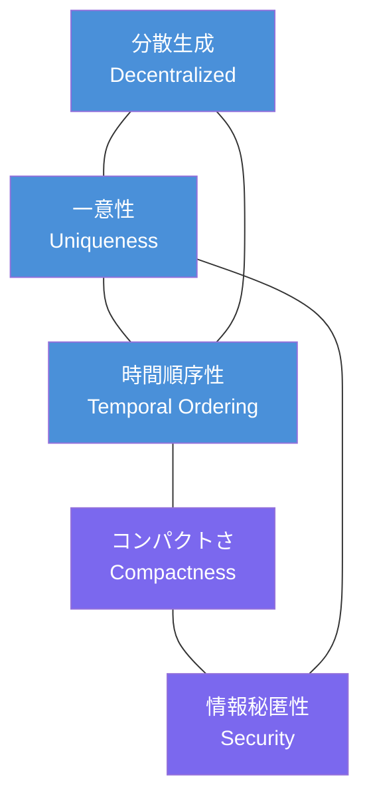
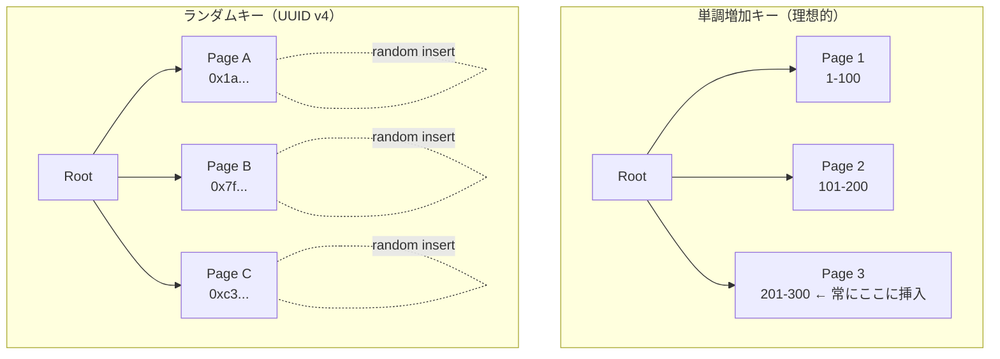
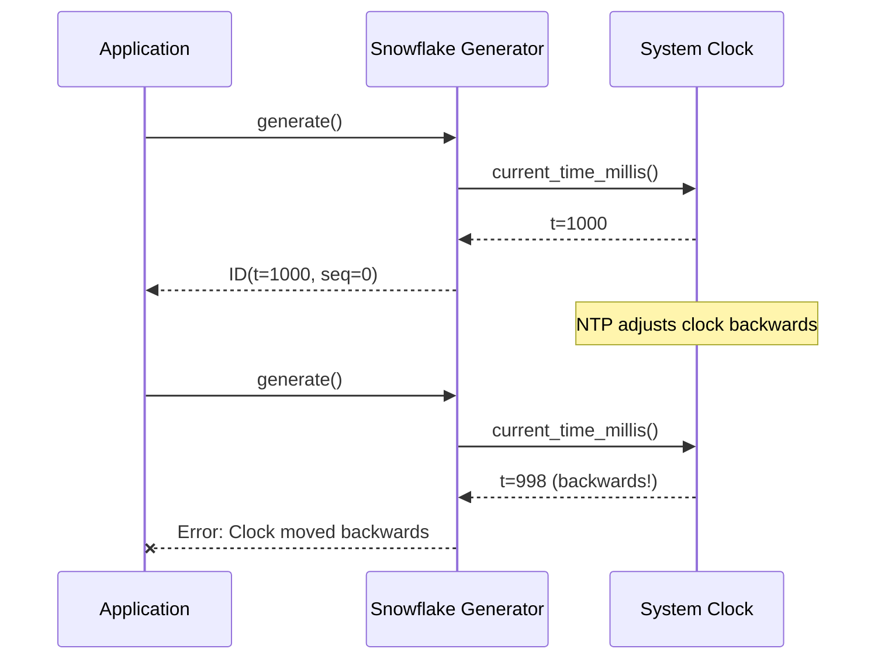
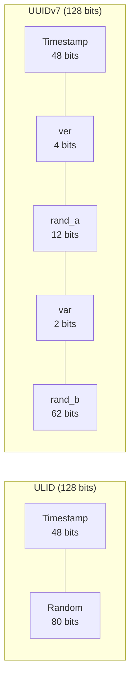
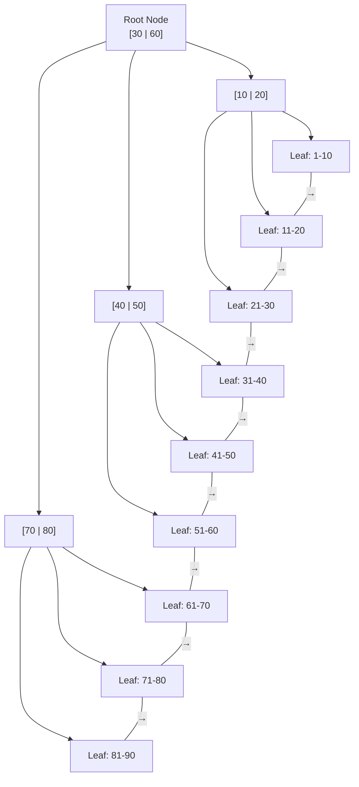
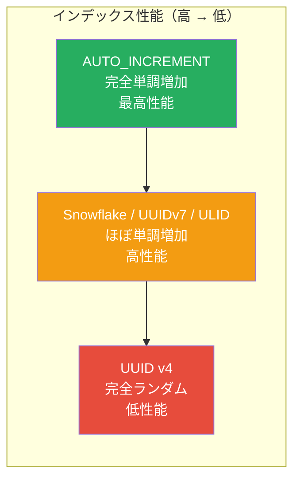
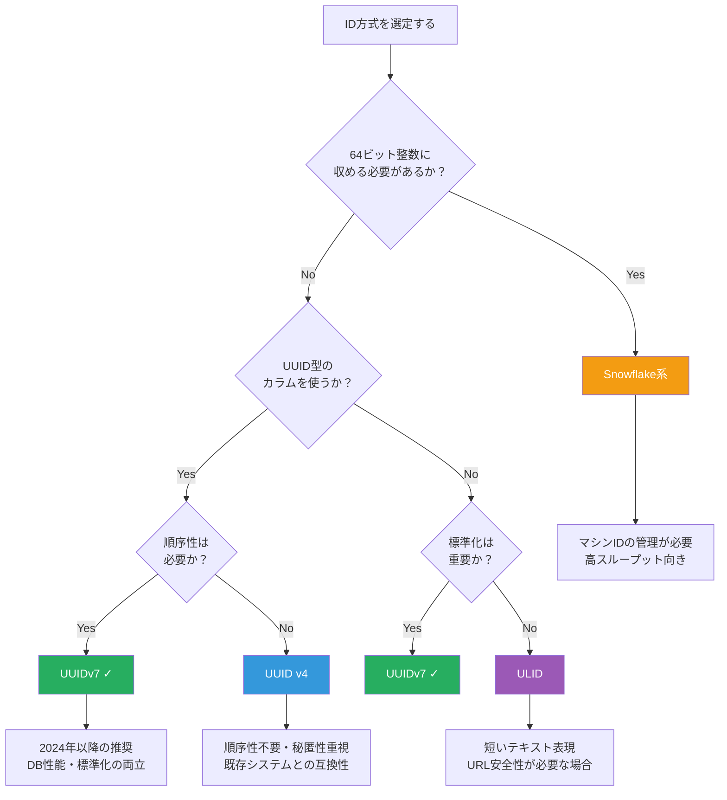

# 分散ID生成（Snowflake, ULID, UUIDv7）

## 1. はじめに：なぜID生成が問題になるのか

あらゆるソフトウェアシステムにおいて、エンティティを一意に識別する**ID（識別子）** は根幹的な要素である。ユーザーアカウント、注文、メッセージ、ログエントリ――これらすべてにIDが付与され、それを手がかりにデータの参照・結合・追跡が行われる。

単一のデータベースサーバーであれば、`AUTO_INCREMENT`（MySQL）や`SERIAL`（PostgreSQL）のような連番を用いる方法で十分に機能する。しかし、システムが成長し、複数のサーバー、複数のデータセンター、複数のマイクロサービスにまたがるようになると、連番の採番は本質的に困難になる。

```
単一サーバー:
  Server → [1, 2, 3, 4, 5, ...]   // trivial

分散システム:
  Server A → [?, ?, ?, ...]
  Server B → [?, ?, ?, ...]        // coordination needed
  Server C → [?, ?, ?, ...]
```

連番を複数のノードで矛盾なく生成するには、何らかの**調停（coordination）** が必要になる。中央の採番サーバーを設ける方法は最も単純だが、そのサーバーが**単一障害点（SPOF）** となり、かつ**スループットのボトルネック**にもなる。たとえば、Twitterでは毎秒数万ツイートが投稿されるが、これらすべてのID採番を1台のサーバーが担うのは現実的ではない。

本記事では、分散環境において一意なIDを高速かつ協調なしに生成するための設計原則と、代表的な方式であるUUID v4、Twitter Snowflake、ULID、UUIDv7を深く掘り下げる。さらに、ID設計がデータベースのインデックス性能に与える影響についても詳しく論じる。

## 2. 分散ID設計の要件

分散IDを設計する際には、以下の要件を考慮する必要がある。すべての要件を同時に完全に満たすことは難しく、トレードオフが存在する。

### 2.1 一意性（Uniqueness）

最も基本的かつ絶対に妥協できない要件である。異なるノード、異なる時刻に生成されたIDが衝突してはならない。衝突が起きれば、データの上書き、誤った関連付け、整合性の破壊につながる。

一意性の保証には大きく2つのアプローチがある。

1. **決定的一意性**: 構造的に衝突が起こり得ない設計。たとえばノードIDとタイムスタンプの組み合わせで衝突を排除する
2. **確率的一意性**: 十分に大きなランダム空間から生成し、衝突確率を無視できるほど低くする。UUIDv4が代表例である

### 2.2 時間順序性（Temporal Ordering）

生成されたIDが時間的な順序を反映することは、多くのユースケースで強く望まれる性質である。

- **データベースインデックス**: 時間順にソートされたIDは、B-Treeインデックスのページ分割を最小化し、書き込み性能を大幅に向上させる
- **ログ分析**: IDの並び順がイベントの発生順を反映するため、ソートなしにおおよその時系列を把握できる
- **分散デバッグ**: 複数のサービスにまたがるリクエストのIDが時間順であれば、トレーシングや因果関係の推定が容易になる

::: tip 因果順序と時間順序
ここでいう「時間順序」は壁時計時刻（wall clock time）に基づく大まかな順序であり、分散システムにおける厳密な因果順序（Lamport時計やベクタ時計で保証されるもの）とは異なる。分散IDの時間順序性は「ミリ秒〜秒単位でおおよそソート可能」という実用的な意味で十分である。
:::

### 2.3 分散生成（Decentralized Generation）

各ノードが独立にIDを生成できることは、分散システムにおいて極めて重要である。

- **中央サーバー不要**: 調停なしに各ノードが即座にIDを生成できる
- **可用性**: ネットワーク分断時にもID生成が継続できる
- **スケーラビリティ**: ノード追加に伴いID生成のスループットが線形にスケールする

### 2.4 コンパクトさ（Compactness）

IDのバイト長は、ストレージ使用量、インデックスサイズ、ネットワーク転送量、URLの長さなどに直結する。短いに越したことはないが、一意性やその他の要件とトレードオフの関係にある。

### 2.5 その他の要件

- **情報漏洩の防止**: IDから内部情報（生成時刻、ノード構成、総数など）を推測できないことが望まれる場合がある
- **人間可読性**: デバッグやログ調査で目視確認しやすい表現形式
- **URL安全性**: URLのパス・クエリパラメータに含めた際に特殊文字のエスケープが不要であること

以下の図は、これらの要件間のトレードオフを示す。



## 3. UUID v4 — ランダムの素朴な力

### 3.1 UUIDの概要

UUID（Universally Unique Identifier）は、128ビットの識別子を標準化したものであり、RFC 4122（2005年）で規定された。その後、2024年にRFC 9562として改訂され、新しいバージョン（v6、v7、v8）が追加された。

UUIDの表記形式は `8-4-4-4-12` の16進数文字列である。

```
550e8400-e29b-41d4-a716-446655440000
│        │    │    │    │
│        │    │    │    └── 12 hex digits (48 bits)
│        │    │    └── 4 hex digits (16 bits, variant + data)
│        │    └── 4 hex digits (16 bits, version + data)
│        └── 4 hex digits (16 bits)
└── 8 hex digits (32 bits)
```

128ビット中、バージョンフィールド（4ビット）とバリアントフィールド（2ビット）が固定的に使用されるため、実際のペイロードは122ビットである。

### 3.2 UUID v4の構造

UUID v4は122ビットのランダムビットで構成される。暗号学的に安全な乱数生成器（CSPRNG）を使用し、各ノードが完全に独立してIDを生成できる。

```
 0                   1                   2                   3
 0 1 2 3 4 5 6 7 8 9 0 1 2 3 4 5 6 7 8 9 0 1 2 3 4 5 6 7 8 9 0 1
+-+-+-+-+-+-+-+-+-+-+-+-+-+-+-+-+-+-+-+-+-+-+-+-+-+-+-+-+-+-+-+-+
|                          random_a                             |
+-+-+-+-+-+-+-+-+-+-+-+-+-+-+-+-+-+-+-+-+-+-+-+-+-+-+-+-+-+-+-+-+
|          random_a             |  ver  |       random_b        |
+-+-+-+-+-+-+-+-+-+-+-+-+-+-+-+-+-+-+-+-+-+-+-+-+-+-+-+-+-+-+-+-+
|var|                       random_c                            |
+-+-+-+-+-+-+-+-+-+-+-+-+-+-+-+-+-+-+-+-+-+-+-+-+-+-+-+-+-+-+-+-+
|                          random_c                             |
+-+-+-+-+-+-+-+-+-+-+-+-+-+-+-+-+-+-+-+-+-+-+-+-+-+-+-+-+-+-+-+-+

ver = 0100 (version 4)
var = 10   (RFC 4122 variant)
```

### 3.3 UUID v4の衝突確率

122ビットのランダム空間は $2^{122} \approx 5.3 \times 10^{36}$ 通りの値を取り得る。**誕生日のパラドックス**に基づく衝突確率は、$n$ 個のUUIDを生成した場合に近似的に以下のようになる。

$$
P(\text{collision}) \approx 1 - e^{-\frac{n^2}{2 \times 2^{122}}}
$$

具体的な数値を示すと：

| 生成数 | 衝突確率 |
|---|---|
| $10^9$（10億） | $\approx 9.4 \times 10^{-20}$ |
| $10^{12}$（1兆） | $\approx 9.4 \times 10^{-14}$ |
| $10^{15}$ | $\approx 9.4 \times 10^{-8}$ |
| $10^{18}$ | $\approx 0.0094\%$ |

実用上、UUIDv4の衝突を心配する必要はほぼない。毎秒10億個を生成し続けても、衝突が起きるまでに数千万年を要する計算になる。

### 3.4 UUID v4の問題点

一意性と分散生成という観点では優れたUUID v4であるが、**時間順序性がない**ことに起因する深刻な問題を抱えている。

#### B-Treeインデックスへの悪影響

RDBMSの主キーインデックスとしてUUID v4を使用すると、B-Treeの性能が大幅に劣化する。

B-Treeは、キーがおおよそ単調増加する場合に最も効率的に動作する。新しいキーが常にツリーの右端に挿入されるため、リーフページの分割が最小限に抑えられ、**シーケンシャルな書き込みパターン**が実現される。

一方、UUID v4は完全にランダムであるため、新しいキーがツリー全体にばらまかれる。これは以下の問題を引き起こす。



1. **ページ分割の多発**: ランダムな位置への挿入は、既に満杯のリーフページを頻繁に分割する。ページ分割は新しいページの確保、キーの移動、親ノードの更新を伴う高コストな操作である
2. **キャッシュ効率の低下**: ランダムなアクセスパターンにより、バッファプールのヒット率が低下する。連番キーでは「ホットページ」が右端の少数のページに限定されるが、UUIDv4ではアクセスがツリー全体に分散する
3. **ページの充填率低下**: 頻繁なページ分割の結果、各ページの平均充填率が約50%前後にまで低下し得る。連番キーでは90%以上の充填率が期待できる
4. **ストレージの肥大化**: 充填率の低下により、同じレコード数でもインデックスのディスク使用量が1.5〜2倍に膨れ上がる

::: warning 実測での性能差
Percona社のベンチマークによると、InnoDBにおいてUUIDv4を主キーとした場合、連番キーと比較してINSERT性能が3〜10倍劣化するケースが報告されている。テーブルサイズがバッファプールサイズを超えると、その差はさらに拡大する。
:::

#### その他の問題

- **文字列表現が長い**: ハイフン込みで36文字を要する。URLやログに含める際にかさばる
- **時刻情報がない**: IDを見ただけでは生成時刻が判別できない。デバッグやログ調査で不便である
- **ソートが無意味**: 辞書順でソートしても時系列にならないため、「最新のN件」のような取得が効率的に行えない

## 4. Twitter Snowflake — 時刻ベースの分散ID

### 4.1 誕生の背景

2010年、TwitterはMySQL上のAUTO_INCREMENTによるID生成がスケーラビリティの限界に達したことを受けて、**Snowflake**と呼ばれる分散ID生成システムを開発した。当時のTwitterは毎秒数千〜数万ツイートを処理しており、中央集権的なID採番はボトルネックとSPOFの双方の問題を抱えていた。

Snowflakeの設計目標は明確であった。

1. 各ノードが独立にIDを生成できる（協調不要）
2. IDが時間順にソート可能である
3. 64ビット整数に収まる（MySQL BIGINTとして格納可能）
4. 毎秒数万〜数十万のIDを生成できる

### 4.2 ビット構成

Snowflake IDは64ビットの符号付き整数（最上位ビットは常に0）であり、以下の3つのフィールドで構成される。

```
 63  62                                22  21        12  11          0
+---+------------------------------------+------------+-------------+
| 0 |       timestamp (41 bits)          | machine_id | sequence    |
|   |                                    | (10 bits)  | (12 bits)   |
+---+------------------------------------+------------+-------------+
 sign       milliseconds since            datacenter   per-ms
 bit        custom epoch                  + worker     counter
```

| フィールド | ビット数 | 説明 |
|---|---|---|
| 符号ビット | 1 | 常に0。符号付き64ビット整数として正の値を保証する |
| タイムスタンプ | 41 | カスタムエポック（Twitterでは2010-11-04T01:42:54.657Z）からのミリ秒経過数 |
| マシンID | 10 | データセンターID（5ビット）＋ワーカーID（5ビット）で構成 |
| シーケンス番号 | 12 | 同一ミリ秒内のカウンタ |

#### タイムスタンプ（41ビット）

41ビットで表現可能なミリ秒数は $2^{41} = 2{,}199{,}023{,}255{,}552$ ミリ秒、すなわち約**69.7年**である。カスタムエポックを2010年に設定した場合、2079年頃までIDの生成が可能となる。

UNIXエポック（1970年）ではなくカスタムエポックを用いる理由は、ビット空間を無駄にしないためである。UNIXエポックを使うと、2010年時点ですでに40年分のビットが消費済みとなり、残りの寿命が約30年に短縮されてしまう。

#### マシンID（10ビット）

10ビットで最大 $2^{10} = 1{,}024$ 台のワーカーを識別できる。Twitterの実装では、データセンターID（5ビット）とワーカーID（5ビット）に分割されており、最大32データセンター x 32ワーカーの構成に対応する。

マシンIDの割り当ては**起動時に一度だけ**行えばよい。ZooKeeperのようなコーディネーションサービスで管理する方法や、設定ファイルで静的に指定する方法が一般的である。重要なのは、ID生成の**実行時**には協調が不要であるという点である。

#### シーケンス番号（12ビット）

12ビットで $2^{12} = 4{,}096$ 通りの値を取れる。すなわち、1ミリ秒あたり最大4,096個のIDを生成できる。これは1秒あたりに換算すると約**400万ID/秒**に相当する。

同一ミリ秒内でシーケンス番号がオーバーフローした場合、次のミリ秒まで待機する実装が一般的である。

### 4.3 生成アルゴリズム

Snowflake IDの生成は、以下の擬似コードで表現できる。

```python
class SnowflakeGenerator:
    def __init__(self, machine_id: int, epoch: int):
        self.machine_id = machine_id  # 10-bit machine identifier
        self.epoch = epoch            # custom epoch in milliseconds
        self.sequence = 0             # 12-bit sequence counter
        self.last_timestamp = -1      # last generation timestamp

    def generate(self) -> int:
        timestamp = current_time_millis() - self.epoch

        if timestamp == self.last_timestamp:
            # Same millisecond: increment sequence
            self.sequence = (self.sequence + 1) & 0xFFF  # 12-bit mask
            if self.sequence == 0:
                # Sequence overflow: wait for next millisecond
                timestamp = self._wait_next_millis(self.last_timestamp)
        else:
            # New millisecond: reset sequence
            self.sequence = 0

        if timestamp < self.last_timestamp:
            raise ClockMovedBackwardsError(
                f"Clock moved backwards by {self.last_timestamp - timestamp}ms"
            )

        self.last_timestamp = timestamp

        return (
            (timestamp << 22) |         # 41-bit timestamp
            (self.machine_id << 12) |   # 10-bit machine ID
            self.sequence               # 12-bit sequence
        )

    def _wait_next_millis(self, last_ts: int) -> int:
        ts = current_time_millis() - self.epoch
        while ts <= last_ts:
            ts = current_time_millis() - self.epoch
        return ts
```

::: details 具体的な生成例
タイムスタンプが `1234567890`（カスタムエポックからのミリ秒数）、マシンIDが `42`、シーケンス番号が `7` の場合：

```
timestamp  = 1234567890 = 0b 1001001100101 1000001 1001010010
machine_id = 42         = 0b 0000101010
sequence   = 7          = 0b 000000000111

ID = (1234567890 << 22) | (42 << 12) | 7
   = 5179139172253696 | 172032 | 7
   = 5179139172425735
```

この64ビット整数をデータベースのBIGINT型カラムに直接格納でき、B-Treeインデックス上で自然な時間順序を維持する。
:::

### 4.4 時刻同期の問題

Snowflakeの最大の弱点は、**システムクロックへの依存**である。タイムスタンプが単調増加であることを前提とした設計のため、**時計の巻き戻し（clock backward jump）** が発生すると、IDの一意性が脅かされる。

時計の巻き戻りが発生する主な原因は以下の通りである。

- **NTP同期**: NTP（Network Time Protocol）がシステム時刻を修正する際、時刻が後退することがある。`ntpd`はデフォルトで大幅な時刻修正をステップ方式（即座に変更）で行う
- **うるう秒**: うるう秒の挿入時に時刻が巻き戻される実装がある。2012年のうるう秒では多くのLinuxサーバーで問題が発生した
- **VM移行**: 仮想マシンのライブマイグレーション時に、移行元と移行先のホスト間で時刻のずれが生じることがある

Snowflakeの元の実装では、時刻の巻き戻りを検出した場合に**例外を投げてID生成を拒否する**という保守的な戦略をとっている。これはIDの衝突を防ぐ最も確実な方法だが、一時的にIDが生成できなくなるという可用性の低下を伴う。



この問題への対策として、以下のアプローチが採用されている。

- **chronyd / ntpd の slew モード**: 時刻のステップ修正ではなく、時刻の進行速度を微調整（slew）することで、時計の巻き戻りを防ぐ。Googleの TrueTime は専用のGPSレシーバーと原子時計を使って高精度な時刻同期を実現している
- **巻き戻り許容**: 小さな巻き戻り（数ミリ秒程度）であれば、`last_timestamp` を維持したまま（つまり「未来の時刻」のまま）シーケンス番号を進め、実際の時刻が追いつくのを待つ

### 4.5 Snowflakeの影響と派生

Snowflakeの設計は極めて大きな影響を与え、多くの企業や組織が同様の方式を採用・派生させた。

| 実装 | 組織 | 特徴 |
|---|---|---|
| Snowflake | 64ビット、10ビットマシンID |
| Sonyflake | Sony | 39ビット時刻（10ms単位）、16ビットマシンID、8ビットシーケンス |
| Baidu uid-generator | Baidu | カスタムビット配分、RingBufferによる事前生成 |
| Leaf | Meituan | Snowflake＋号段モード（区間予約方式）のハイブリッド |

## 5. ULID — ソート可能なランダムID

### 5.1 動機と設計

ULID（Universally Unique Lexicographically Sortable Identifier）は、2016年にAlistair Kingによって提案された仕様である。UUID v4の一意性とSnowflakeの時間順序性を兼ね備えることを目標としている。

ULIDの設計思想は以下の点に集約される。

1. UUID v4と同じ128ビットのサイズ（UUIDとの互換性）
2. 辞書順ソートが時間順ソートと一致する
3. マシンIDの事前割り当てが不要（Snowflakeの運用上の課題を解消）
4. URL安全なBase32（Crockford's Base32）エンコーディングで26文字に収まる

### 5.2 バイナリ構造

ULIDは128ビットで構成され、タイムスタンプ部とランダム部の2フィールドからなる。

```
 0                                         48                    128
+-------------------------------------------+----------------------+
|          timestamp (48 bits)              |    randomness        |
|       milliseconds since Unix epoch       |    (80 bits)         |
+-------------------------------------------+----------------------+
```

| フィールド | ビット数 | 説明 |
|---|---|---|
| タイムスタンプ | 48 | UNIXエポックからのミリ秒数。$2^{48}$ ミリ秒 ≈ 約8,919年分 |
| ランダム部 | 80 | 暗号学的に安全な乱数 |

48ビットのタイムスタンプはUNIXエポックから約8,919年分の時間を表現できるため、Snowflakeの69.7年という制限と比較して遥かに余裕がある。

### 5.3 テキスト表現

ULIDのテキスト表現はCrockford's Base32を用いた26文字の文字列である。

```
 01ARZ3NDEKTSV4RRFFQ69G5FAV
 └──────────┘└────────────┘
  timestamp     randomness
  (10 chars)    (16 chars)
```

Crockford's Base32は `0123456789ABCDEFGHJKMNPQRSTVWXYZ` の32文字を使用する。I、L、O、U は視覚的な混同を避けるために除外されている。

この表現の重要な性質は、**辞書順（lexicographic order）がバイナリの数値順と一致する**ことである。Base32文字のアルファベット順が数値の大小関係を保存するように設計されているため、文字列としてソートしてもバイナリとしてソートしても同じ結果になる。

```
01ARZ3NDEKTSV4RRFFQ69G5FAV  (2016-07-30T23:54:10.259Z)
01ARZ3NDEKTSV4RRFFQ69G5FAW  (2016-07-30T23:54:10.259Z, different random)
01B3HQNBGE2D6BTKPKK2MC4CYG  (2016-08-12T..., later)
```

### 5.4 単調性の保証

ULID仕様は、同一ミリ秒内で複数のIDを生成する場合の**単調性（monotonicity）** の保証について、オプショナルな推奨事項を定めている。

同一ミリ秒内でIDが生成される場合、ランダム部を毎回新たに生成すると、同じミリ秒内のID間で順序が保証されない。これを避けるため、以下の方式が推奨されている。

```python
class MonotonicULIDGenerator:
    def __init__(self):
        self.last_timestamp = 0
        self.last_random = 0

    def generate(self) -> bytes:
        timestamp = current_time_millis()

        if timestamp == self.last_timestamp:
            # Same millisecond: increment random part
            self.last_random += 1
            if self.last_random > (1 << 80) - 1:
                raise OverflowError("ULID random overflow in same millisecond")
        else:
            # New millisecond: generate fresh random
            self.last_random = secure_random(80)  # 80-bit random value
            self.last_timestamp = timestamp

        ulid = (timestamp << 80) | self.last_random
        return ulid.to_bytes(16, byteorder='big')
```

この方式では、同一ミリ秒内のIDはランダム部のインクリメントにより厳密に単調増加する。ただし、ランダム部の初期値は各ミリ秒の最初のIDで新たに生成されるため、**異なるノード間での同一ミリ秒の順序は保証されない**。

### 5.5 ULIDの利点と課題

**利点**:
- マシンIDの管理が不要（Snowflakeと異なり、ノードの事前登録が不要）
- 128ビットでUUIDと同じサイズ（バイナリ形式でUUIDカラムに格納可能）
- テキスト表現がUUIDの36文字より短い26文字
- 時間順ソートが可能

**課題**:
- RFCやISO規格ではなくコミュニティ仕様であり、標準化の裏付けが弱い
- 80ビットのランダム部は、UUIDv4の122ビットと比較して衝突空間が狭い（同一ミリ秒内で）
- 多くのデータベースやフレームワークがネイティブでサポートしていない

## 6. UUIDv7 — 標準化された時間順序UUID

### 6.1 背景：RFC 9562

UUIDの新しいバージョンを定義するRFC 9562は、2024年5月にIETFによって公開された。このRFCはRFC 4122を廃止し、既存のバージョン（v1〜v5）の定義を引き継ぎつつ、新たにv6、v7、v8の3つのバージョンを追加した。

この標準化の最大の動機は、**データベースの主キーとして使用した際の性能問題**を解決することであった。UUID v4のランダム性がB-Treeインデックスに与える悪影響は広く認知されていたが、それに対する解決策（Snowflake、ULID、独自拡張など）が乱立し、相互運用性が欠如していた。

RFC 9562で追加された3つのバージョンの位置づけは以下の通りである。

| バージョン | 概要 |
|---|---|
| UUIDv6 | UUIDv1（タイムスタンプ＋MACアドレス）のビット順を並べ替えてソート可能にしたもの。v1からの移行用 |
| **UUIDv7** | **ミリ秒精度のUNIXタイムスタンプ＋ランダムビット。新規設計における推奨バージョン** |
| UUIDv8 | カスタムフォーマット。組織独自のID体系をUUIDの枠組みに収容するためのもの |

RFC 9562は明確に「**新規アプリケーションではUUIDv7の使用を推奨する**」と述べている。

### 6.2 UUIDv7のビット構造

UUIDv7は128ビットで、以下のように構成される。

```
 0                   1                   2                   3
 0 1 2 3 4 5 6 7 8 9 0 1 2 3 4 5 6 7 8 9 0 1 2 3 4 5 6 7 8 9 0 1
+-+-+-+-+-+-+-+-+-+-+-+-+-+-+-+-+-+-+-+-+-+-+-+-+-+-+-+-+-+-+-+-+
|                       unix_ts_ms (32 bits)                    |
+-+-+-+-+-+-+-+-+-+-+-+-+-+-+-+-+-+-+-+-+-+-+-+-+-+-+-+-+-+-+-+-+
|    unix_ts_ms (16 bits)       |  ver  |      rand_a (12 bits) |
+-+-+-+-+-+-+-+-+-+-+-+-+-+-+-+-+-+-+-+-+-+-+-+-+-+-+-+-+-+-+-+-+
|var|                      rand_b (62 bits)                     |
+-+-+-+-+-+-+-+-+-+-+-+-+-+-+-+-+-+-+-+-+-+-+-+-+-+-+-+-+-+-+-+-+
|                         rand_b (continued)                    |
+-+-+-+-+-+-+-+-+-+-+-+-+-+-+-+-+-+-+-+-+-+-+-+-+-+-+-+-+-+-+-+-+

ver = 0111 (version 7)
var = 10   (RFC 9562 variant)
```

| フィールド | ビット数 | 説明 |
|---|---|---|
| `unix_ts_ms` | 48 | UNIXエポックからのミリ秒数 |
| `ver` | 4 | バージョン識別子（`0111` = 7） |
| `rand_a` | 12 | ランダムまたはサブミリ秒精度/カウンタに使用可能 |
| `var` | 2 | バリアント識別子（`10`） |
| `rand_b` | 62 | ランダムビット |

実効ランダムビット数は `rand_a`（12ビット）＋ `rand_b`（62ビット）= **74ビット**である。UUID v4の122ビットと比較すると約半分だが、同一ミリ秒内に限定された衝突空間であるため、実用上は十分である。

### 6.3 ULIDとの比較

UUIDv7とULIDは非常に似た設計思想を持つが、重要な違いがある。



| 観点 | ULID | UUIDv7 |
|---|---|---|
| 標準化 | コミュニティ仕様 | IETF RFC 9562 |
| ランダムビット | 80ビット | 74ビット |
| テキスト表現 | 26文字（Crockford Base32） | 36文字（標準UUID形式） |
| UUID互換性 | バイナリ的には互換（ただしバージョンビット非準拠） | 完全互換 |
| データベース対応 | 限定的 | UUID型を持つDBで即利用可能 |
| 単調性 | オプショナル（仕様で推奨） | RFC内で方法論を提示 |

最も重要な違いは**標準化のステータス**である。UUIDv7はIETFのRFCとして正式に標準化されており、データベースベンダー、プログラミング言語ランタイム、フレームワークがネイティブサポートを追加する動機が明確に存在する。PostgreSQL 17ではUUIDv7の生成関数 `uuidv7()` が組み込みで提供されるようになった。

### 6.4 サブミリ秒精度とカウンタの活用

RFC 9562は、`rand_a` フィールド（12ビット）の使い方について柔軟性を持たせている。完全にランダムとして使う以外に、以下の方式が推奨されている。

**方式1: サブミリ秒精度**

`rand_a` を12ビットのサブミリ秒タイムスタンプとして使用する。ミリ秒を4,096分割した精度（約244マイクロ秒）を実現できる。

```
unix_ts_ms (48 bits) + sub_ms (12 bits) = 60ビットの時間精度
→ 約244μs精度のタイムスタンプ
```

**方式2: カウンタ**

`rand_a` を12ビットのカウンタとして使用する。同一ミリ秒内で最大4,096個の単調増加IDを保証する。Snowflakeの12ビットシーケンスと同等の方式である。

```python
class UUIDv7Generator:
    def __init__(self):
        self.last_timestamp = 0
        self.counter = 0

    def generate(self) -> str:
        timestamp = current_time_millis()

        if timestamp == self.last_timestamp:
            self.counter += 1
            if self.counter > 0xFFF:  # 12-bit overflow
                # Wait for next millisecond
                while current_time_millis() == self.last_timestamp:
                    pass
                timestamp = current_time_millis()
                self.counter = secure_random_bits(12)
        else:
            self.counter = secure_random_bits(12)

        self.last_timestamp = timestamp

        # Construct 128-bit UUID
        uuid_bytes = bytearray(16)

        # Bytes 0-5: 48-bit timestamp (big-endian)
        ts_bytes = timestamp.to_bytes(6, byteorder='big')
        uuid_bytes[0:6] = ts_bytes

        # Bytes 6-7: version (4 bits) + rand_a/counter (12 bits)
        uuid_bytes[6] = 0x70 | ((self.counter >> 8) & 0x0F)  # ver=7
        uuid_bytes[7] = self.counter & 0xFF

        # Bytes 8-15: variant (2 bits) + rand_b (62 bits)
        rand_b = secure_random_bytes(8)
        uuid_bytes[8:16] = rand_b
        uuid_bytes[8] = (uuid_bytes[8] & 0x3F) | 0x80  # var=10

        return format_uuid(uuid_bytes)
```

**方式3: rand_a と rand_b を結合した大きなカウンタ**

さらに高い単調性が必要な場合、`rand_a`（12ビット）と `rand_b` の上位部分を合わせて、より大きなカウンタ空間を確保する方法もRFCで言及されている。

### 6.5 時刻の巻き戻りへの対処

UUIDv7でも時計の巻き戻りは問題になり得るが、Snowflakeほど深刻ではない。その理由は、UUIDv7には74ビットのランダム部があるため、仮にタイムスタンプが同じ値になったとしても、**ランダム部の衝突確率が極めて低い**からである。

RFC 9562は時刻巻き戻りへの対処として以下の選択肢を挙げている。

1. **前回のタイムスタンプを維持する**: Snowflakeと同様に、巻き戻り分だけ「未来の時刻」のままIDを生成し続ける
2. **ランダムに任せる**: 74ビットのランダム部により衝突確率が十分低いため、タイムスタンプの巻き戻りを許容する
3. **エラーとして拒否する**: 大幅な巻き戻りの場合はID生成を停止する

## 7. データベースインデックスへの影響

### 7.1 B-Treeとキーの順序性

分散IDの設計がデータベース性能に与える影響を深く理解するためには、B-Treeインデックスの動作を正確に把握する必要がある。

B-Treeは**バランス木（balanced tree）** であり、すべてのリーフノードが同じ深さに位置する。リレーショナルデータベースで広く使われるB+Tree変種では、すべてのデータがリーフノードに格納され、リーフノード同士が双方向リンクリストで接続されている。



**単調増加キーの場合**（AUTO_INCREMENT、Snowflake、ULID、UUIDv7）:

新しいキーは常にツリーの**右端**（最大値側）に挿入される。これにより：

1. **ページ分割が最小化**: 右端のリーフページのみが分割対象となる。しかもこの分割は「ファストパス」として最適化されているDBが多い（PostgreSQLのfastpathやMySQLの楽観的挿入）
2. **シーケンシャルI/O**: 書き込みが右端に集中するため、ディスクI/Oが局所化される。ログ構造化ストレージ（LSM-Tree）においても追記パターンと相性が良い
3. **高いキャッシュ効率**: アクティブなページ（右端の少数のリーフページ）がバッファプールに常駐し、キャッシュヒット率が高くなる
4. **高い充填率**: ページ分割が最小限であるため、各ページの充填率が90%以上に保たれる

**ランダムキーの場合**（UUID v4）:

前述の通り、ランダムキーはツリー全体にばらまかれ、あらゆる位置でページ分割が発生する。これにより書き込み性能、読み取り性能、ストレージ効率のすべてが劣化する。

### 7.2 クラスタードインデックスへの影響

MySQLのInnoDB（およびSQL ServerやOracleのIOT）では、主キーインデックスが**クラスタードインデックス**（clustered index）として機能する。これは、テーブルの行データそのものが主キーの順序に従って物理的に配置されることを意味する。

```
クラスタードインデックス:
┌─────────────────────────────┐
│ Primary Key Index (B+Tree)  │
│  └── Leaf pages contain     │
│      actual row data        │   ← data and index are the same structure
└─────────────────────────────┘

ヒープテーブル + セカンダリインデックス:
┌──────────────┐  ┌──────────────┐
│ Index (B+Tree)│  │ Heap (unsorted│
│  └── Leaf has │→ │  row data)    │
│    row pointers│  │              │
└──────────────┘  └──────────────┘
```

クラスタードインデックスにおいて主キーがランダムな場合、**行データの物理配置そのものがランダムになる**。これは以下の追加的な問題を引き起こす。

- **セカンダリインデックスの肥大化**: InnoDBのセカンダリインデックスは、リーフにプライマリキーの値を保持する。16バイトのUUIDは4〜8バイトの整数キーと比較して、セカンダリインデックスのサイズを2〜4倍に膨らませる
- **行データの断片化**: ランダムな主キーにより行データの物理配置が断片化し、レンジスキャンの性能が劣化する

### 7.3 各ID方式のインデックス性能比較

以下に、主要なID方式がB-Treeインデックスに与える影響を比較する。



| 方式 | サイズ | 挿入パターン | ページ分割 | キャッシュ効率 | 充填率 |
|---|---|---|---|---|---|
| AUTO_INCREMENT | 4-8 B | 右端追記 | 最小 | 最高 | ~95% |
| Snowflake | 8 B | ほぼ右端追記 | 少 | 高 | ~90% |
| UUIDv7 | 16 B | ほぼ右端追記 | 少 | 高 | ~85-90% |
| ULID | 16 B | ほぼ右端追記 | 少 | 高 | ~85-90% |
| UUID v4 | 16 B | ランダム | 多 | 低 | ~50-70% |

::: warning Snowflake vs UUIDv7 のサイズの違い
Snowflake IDは64ビット（8バイト）であり、UUIDv7の128ビット（16バイト）の半分である。インデックスサイズは直接的にバッファプール効率とディスクI/Oに影響するため、大規模テーブルではこの差が無視できない。10億行のテーブルでは、主キーインデックスだけで約8GBの差が生じる計算になる。
:::

### 7.4 PostgreSQLとMySQLにおける実践的考慮

**PostgreSQL**:

PostgreSQLはヒープテーブル方式を採用しており、主キーインデックスとテーブルデータは物理的に分離されている。そのため、ランダムな主キーによるインデックスの断片化が行データの物理配置には直接影響しない。ただし、インデックス自体のページ分割とキャッシュ効率の問題は存在する。

PostgreSQL 17以降では `uuidv7()` 関数が組み込みで提供されており、UUIDv7の採用が容易になっている。

```sql
-- PostgreSQL 17+
CREATE TABLE events (
    id UUID PRIMARY KEY DEFAULT uuidv7(),
    event_type TEXT NOT NULL,
    payload JSONB,
    created_at TIMESTAMPTZ DEFAULT now()
);

-- Extract timestamp from UUIDv7
SELECT id,
       to_timestamp(
         ('x' || lpad(replace(id::text, '-', ''), 16, '0'))::bit(48)::bigint / 1000.0
       ) AS generated_at
FROM events;
```

**MySQL / InnoDB**:

InnoDBはクラスタードインデックスを採用しているため、主キーの順序性が性能に与える影響はPostgreSQLよりも顕著である。MySQL 8.0ではUUID関連の組み込み関数（`UUID_TO_BIN()`, `BIN_TO_UUID()`）が提供されており、バイナリ格納が容易になった。

```sql
-- MySQL 8.0+: binary storage for UUIDs
CREATE TABLE events (
    id BINARY(16) PRIMARY KEY,
    event_type VARCHAR(50) NOT NULL,
    payload JSON,
    created_at DATETIME(3) DEFAULT CURRENT_TIMESTAMP(3)
);

-- UUID_TO_BIN with swap_flag=1 reorders time-based UUIDs
-- For UUIDv7 this is not needed since timestamp is already at the front
INSERT INTO events (id, event_type, payload)
VALUES (UUID_TO_BIN(uuid_v7_generate()), 'click', '{"page": "/home"}');
```

::: tip バイナリ格納 vs 文字列格納
UUIDを`CHAR(36)`として格納する方法は最も簡単だが、`BINARY(16)`と比較してストレージが2.25倍、インデックスサイズも同様に膨張する。16バイトのバイナリ格納が推奨される。PostgreSQLのUUID型は内部的に16バイトのバイナリとして格納されるため、この問題は発生しない。
:::

## 8. 各方式の詳細比較と選定基準

### 8.1 総合比較表

| 特性 | UUID v4 | Snowflake | ULID | UUIDv7 |
|---|---|---|---|---|
| **ビット長** | 128 | 64 | 128 | 128 |
| **テキスト長** | 36文字 | 最大20桁 | 26文字 | 36文字 |
| **時間順序性** | なし | あり | あり | あり |
| **ランダムビット** | 122 | 0 | 80 | 74 |
| **単調増加** | なし | あり（ノード内） | オプション | オプション |
| **標準化** | RFC 9562 | 事実上の標準 | コミュニティ仕様 | RFC 9562 |
| **マシンID管理** | 不要 | 必要 | 不要 | 不要 |
| **DB主キー性能** | 低い | 高い | 高い | 高い |
| **衝突耐性** | 極めて高い | 構造的に回避 | 高い | 高い |
| **時刻抽出** | 不可 | 可能 | 可能 | 可能 |
| **寿命** | 無制限 | ~69年 | ~8,919年 | ~8,919年 |
| **UUID互換** | 完全互換 | 非互換 | バイナリのみ | 完全互換 |

### 8.2 選定フローチャート



### 8.3 ユースケース別の推奨

#### マイクロサービスのリクエストID / トレースID

**推奨: UUIDv7**

理由：各サービスが独立にIDを生成する必要があり、マシンIDの管理は運用負荷が高い。UUIDv7であればノード管理不要で、かつ時間順序性によりリクエストのタイムラインを把握しやすい。UUID型を持つデータベースやログ基盤との連携も容易。

#### 大規模SNSの投稿ID（Twitter / X 規模）

**推奨: Snowflake**

理由：64ビット整数であるため、ストレージ効率とインデックス性能が最も高い。毎秒数十万IDの生成が単一ノードで可能。ただしマシンIDの管理という運用コストを許容できることが前提となる。

#### 公開API用のリソースID

**推奨: ULID または UUIDv7**

理由：短いテキスト表現が必要ならULID（26文字）、標準的なUUID形式が適切ならUUIDv7。いずれも時間順序性があるため、API利用者がIDのおおよその生成時刻を推測できる点には留意が必要。秘匿性が重要であればUUID v4を選ぶ。

#### イベントソーシングのイベントID

**推奨: UUIDv7（カウンタ方式）**

理由：イベントの順序性が本質的に重要であり、UUIDv7の `rand_a` をカウンタとして使用することで、同一ミリ秒内でも厳密な順序を保証できる。128ビットのUUID形式は多くのイベントストアと互換性がある。

#### 既存システムのUUID v4からの移行

**推奨: UUIDv7**

理由：UUID v4と同じ128ビット・同じテキスト形式であるため、カラム型やインデックスの変更が不要。既存のUUID v4のデータと新しいUUIDv7のデータが同じカラムに共存でき、UUIDv7のIDは自然にUUID v4よりも後にソートされる（タイムスタンプ部が現在時刻を反映するため、ランダムなv4のIDよりも概ね大きな値になる）。

## 9. 実装上の注意点

### 9.1 マシンIDの管理（Snowflake系）

Snowflake系のID生成では、マシンIDの一意性がIDの一意性に直結する。マシンIDの割り当て方式には以下がある。

1. **静的設定**: 設定ファイルや環境変数で指定。最も単純だが、コンテナのオートスケーリングと相性が悪い
2. **ZooKeeper / etcd**: 分散コーディネーションサービスでリース方式により動的に割り当てる。起動時のみ通信が必要
3. **データベースのシーケンス**: 起動時にDBのシーケンスから値を取得する。DBが可用であることが前提
4. **MACアドレスやIPアドレスのハッシュ**: 衝突リスクがゼロではないが、運用上は十分に低い場合がある

Kubernetesのような動的なコンテナ環境では、StatefulSetのPodインデックス（0, 1, 2, ...）をマシンIDとして利用する方法が一般的である。

### 9.2 クロック精度と単調性

ID生成の精度は、システムクロックの精度に依存する。特にコンテナ化された環境では、ホストOSのクロックが仮想化レイヤーを通して提供されるため、精度が劣化する場合がある。

Linuxでは `CLOCK_MONOTONIC` を使用することで、NTP調整の影響を受けない単調増加タイムスタンプを取得できる。ただし、これはローカルな経過時間であり、異なるホスト間では整合性がない。分散IDの「おおよその時間順序」にはwall clock time（`CLOCK_REALTIME`）が必要であるが、NTPの影響を受けるというジレンマがある。

実用的な妥協策は以下の通りである。

1. `CLOCK_REALTIME` でミリ秒精度のタイムスタンプを取得する
2. 前回のタイムスタンプと比較し、巻き戻りを検出する
3. 小さな巻き戻り（数十ミリ秒以内）であれば前回のタイムスタンプを維持する
4. 大きな巻き戻り（秒単位）であれば警告を出し、回復するまでID生成を一時停止する

### 9.3 テスト時の考慮事項

分散ID生成のテストでは、以下の点に特に注意が必要である。

- **決定性テスト**: 乱数シードを固定できるインターフェースを提供し、テストの再現性を確保する
- **時刻のモック**: システム時刻を自由に操作できるようにし、時刻巻き戻りのシナリオをテストする
- **衝突検出**: 大量のIDを生成して衝突がないことを統計的に検証する
- **ソート順の検証**: 生成順とソート順が一致することを確認する

```python
class TestableIDGenerator:
    def __init__(self, clock=None, random_source=None):
        # Allow dependency injection for testing
        self.clock = clock or SystemClock()
        self.random = random_source or SecureRandom()

    def generate(self) -> bytes:
        timestamp = self.clock.now_millis()
        random_bits = self.random.next_bytes(10)
        # ... construct ID ...
```

## 10. 歴史的文脈と今後の展望

### 10.1 ID生成の歴史

分散ID生成の歴史は、インターネットの拡大とともに進化してきた。

- **1980年代**: Apollo NCS（Network Computing System）がUUIDの原型を開発。DCE（Distributed Computing Environment）のRPCプロトコルでUUIDが使用される
- **1990年代**: MicrosoftがGUIDとして採用。COM/DCOMオブジェクトの識別に使用される
- **2005年**: RFC 4122が公開され、UUIDv1〜v5が標準化される
- **2010年**: Twitter Snowflakeが公開される。時間順序性を持つ分散IDの設計が広く知られるようになる
- **2016年**: ULIDが提案される。UUIDの互換性とSnowflakeの順序性を融合する試み
- **2024年**: RFC 9562が公開され、UUIDv7が正式に標準化される。10年以上にわたる実践的知見が標準に結実する

### 10.2 今後の動向

**データベースのネイティブサポート**: PostgreSQL 17でのUUIDv7組み込みを皮切りに、主要なDBMSがUUIDv7をネイティブサポートする流れが加速すると予想される。MySQL、Oracle、SQL Serverでも同様の対応が期待される。

**プログラミング言語の標準ライブラリ対応**: Java、Go、Python、Rustなどの標準ライブラリがUUIDv7生成を直接サポートすることで、サードパーティライブラリへの依存が不要になる。Java 21ではすでに関連する議論が進行している。

**ハイブリッド方式の洗練**: SnowflakeのマシンID管理の安定性と、UUIDv7のマシンID不要という利便性を組み合わせたハイブリッド方式（UUIDv8として定義可能）が、大規模システムで採用される可能性がある。

## 11. まとめ

分散ID生成は、一見すると単純な問題に見えて、一意性、順序性、分散生成、コンパクトさ、データベース性能、運用容易性といった多くの要件のトレードオフの中に位置する設計課題である。

UUID v4は分散生成と一意性において優れているが、時間順序性の欠如がデータベースのB-Treeインデックス性能を深刻に劣化させる。Twitter Snowflakeは64ビットに時間情報とマシンIDを巧みに詰め込み、高性能なID生成を実現したが、マシンIDの事前管理と時刻同期への依存という運用上の課題を残した。ULIDはUUIDのサイズ互換性とSnowflakeの順序性を組み合わせたが、標準化の裏付けを欠いていた。

UUIDv7は、これら先行方式の知見を統合し、IETFのRFCとして標準化されたものである。48ビットのUNIXタイムスタンプによる時間順序性、74ビットのランダム部による衝突耐性、UUID形式との完全な互換性、そしてマシンIDの管理が不要であるという運用上の利点を兼ね備えている。2024年以降に設計する新規システムにおいては、UUIDv7が最も汎用的な選択肢であると言える。

ただし、64ビット整数に収める必要がある場合（既存スキーマとの互換性、ストレージの極限的な最適化）にはSnowflake系が依然として有力であり、短いURL表現が必要な場合にはULIDが適している。重要なのは、これらの方式が解決しようとしている問題の本質――**時間順序性とデータベースインデックスの相性**――を理解した上で、自システムの要件に最も適した方式を選択することである。
