# 分散ロック（Redlock, etcd, ZooKeeper）

## 1. はじめに：なぜ分散ロックが必要なのか

単一プロセス内でのロックは、プログラミングにおける最も基本的な同期プリミティブのひとつである。`mutex.Lock()` を呼び出せば、そのプロセス内の他のスレッドは同じリソースに同時アクセスできなくなる。しかし、現代の分散システムでは、複数のプロセスが異なるマシン上で動作し、共有リソースへのアクセスを調整する必要がある。ここで登場するのが**分散ロック（Distributed Lock）**である。

分散ロックが必要となる典型的なシナリオは以下の通りである。

- **排他的なリソースアクセス**: 複数のワーカーが同じファイルやデータベースレコードを更新する際に、競合を防ぐ
- **リーダー選出**: マイクロサービスの複数インスタンスのうち、1つだけが定期バッチ処理を実行する
- **重複実行の防止**: 分散タスクキューにおいて、同じジョブが複数のワーカーで同時に処理されることを防ぐ
- **レート制限の実装**: 分散環境においてグローバルなレートリミットを正確に適用する

しかし、分散環境でのロックは、単一プロセス内のロックとは根本的に性質が異なる。ネットワーク遅延、パケット喪失、クロックスキュー、プロセスの一時停止（GC pause）、部分的な障害——これらすべてが、分散ロックの正確性を脅かす要因となる。

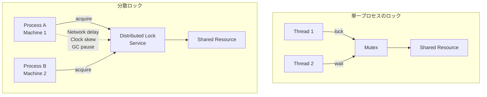

本記事では、分散ロックの基本的な課題を整理したうえで、3つの代表的な実装方式——**Redis（Redlock）**、**etcd**、**ZooKeeper**——を詳しく解説する。さらに、Martin Kleppmannによる Redlock への批判と Antirez（Salvatore Sanfilippo）の反論という、分散システムコミュニティにおける重要な論争を取り上げ、フェンシングトークンの概念を通じて分散ロックの本質的な課題を掘り下げる。

## 2. 分散ロックの基本要件と課題

### 2.1 分散ロックに求められる性質

分散ロックが正しく機能するためには、以下の性質を満たす必要がある。

| 性質 | 説明 |
|------|------|
| **相互排他性（Mutual Exclusion）** | ある時点で、ロックを保持できるクライアントは最大1つである |
| **デッドロック回避（Deadlock Freedom）** | ロックを保持していたクライアントがクラッシュしても、最終的にロックは解放される |
| **耐障害性（Fault Tolerance）** | ロックサービスの一部のノードが障害を起こしても、ロックの取得・解放が可能である |

これらの性質のうち、最も重要かつ実現が困難なのが相互排他性である。分散環境においてこの性質を厳密に保証するためには、時間、ネットワーク、障害に関する慎重な考慮が必要となる。

### 2.2 分散環境特有の課題

#### プロセスの一時停止

分散ロックにおいて最も厄介な問題のひとつが、ロック保持者のプロセスが一時停止する可能性である。典型的な例はガベージコレクション（GC）のStop-the-Worldパーズである。

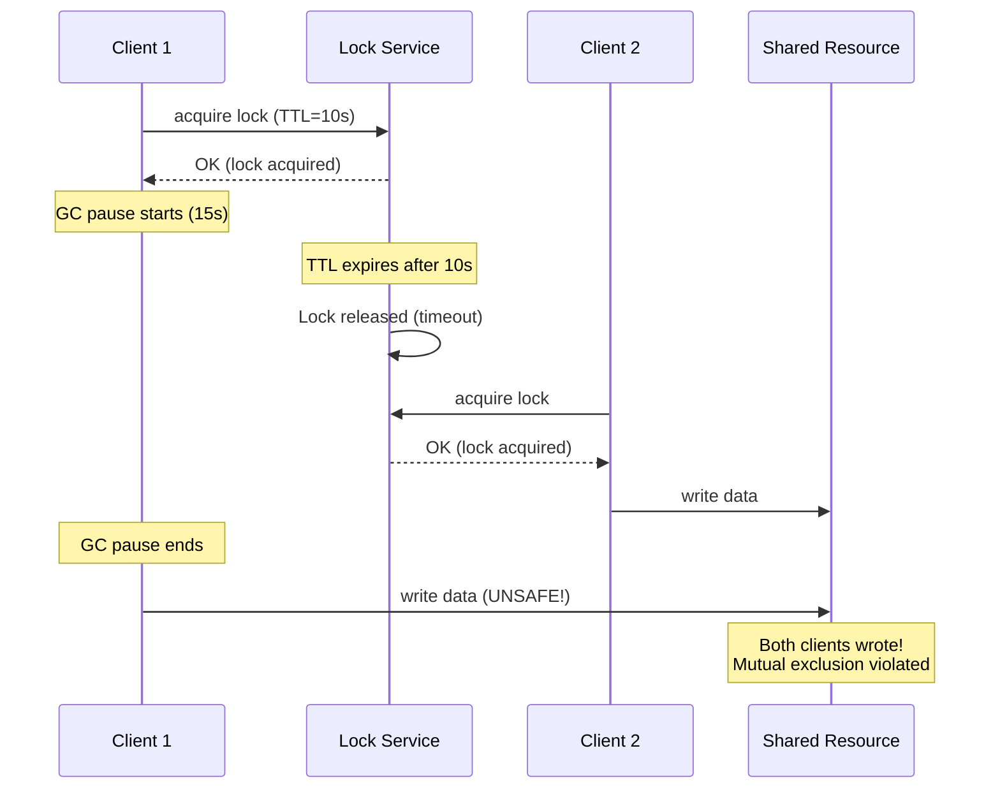

この問題の本質は、**クライアントがロックの有効期限切れを自ら検知できない**点にある。GC pauseの間、クライアントはロックが失効したことに気づけず、パーズ後にロック保護下の操作を続行してしまう。

#### ネットワーク遅延

ロックの取得確認（ACK）がネットワーク遅延によって大幅に遅延した場合、クライアントがACKを受信した時点で、すでにロックの有効期限の大部分が経過している可能性がある。

#### クロックスキュー

TTL（Time To Live）ベースのロックでは、ロックサービスのクロックが正確であることが前提となる。しかし、物理クロックはNTPの調整やハードウェアの差異によってスキュー（ずれ）が生じ得る。クロックが突然進む（clock jump）と、ロックの有効期限が予期より早く到達してしまう。

### 2.3 安全性と効率性のトレードオフ

Martin Kleppmannは、分散ロックの用途を2つのカテゴリに分類している。

1. **効率性のためのロック（Efficiency Lock）**: 同じ作業を複数のプロセスが重複して実行するのを避ける。ロックが稀に失敗しても、同じ作業が2回実行されるだけで、致命的な問題にはならない
2. **正確性のためのロック（Correctness Lock）**: ロックの失敗がデータの破損や不整合を引き起こす。このケースでは、ロックの相互排他性が厳密に保証されなければならない

この区別は、分散ロックの実装を選択する際の重要な判断基準となる。効率性のためのロックであれば、単一のRedisノードで十分なケースが多い。一方、正確性のためのロックには、より強い保証を提供する仕組みが必要となる。

## 3. Redisによる単一ノードロック

### 3.1 SET NX EX による基本実装

Redisを用いた最もシンプルな分散ロックの実装は、`SET` コマンドの `NX`（Not eXists）オプションと `EX`（Expire）オプションを組み合わせる方法である。

```redis
SET resource_name my_random_value NX EX 30
```

このコマンドは以下のことをアトミックに実行する。

1. キー `resource_name` が存在しない場合（`NX`）にのみ値を設定する
2. キーの有効期限を30秒に設定する（`EX 30`）
3. キーが既に存在する場合は何もせず、`nil` を返す

`my_random_value` には、クライアントごとに一意なランダム値（例えばUUID）を設定する。この値は、ロック解放時に**自分が取得したロックだけを解放する**ために使用する。

### 3.2 安全なロック解放

ロックの解放は、単純な `DEL` コマンドでは行ってはならない。以下のシナリオを考えてみよう。

1. Client Aがロックを取得（TTL=30秒）
2. Client Aの処理が30秒以上かかり、ロックがTTLで自動的に失効する
3. Client Bが新たにロックを取得する
4. Client Aが処理を完了し、`DEL` でロックを解放する
5. **Client Bのロックが解放されてしまう**

この問題を防ぐために、ロックの解放は以下のLuaスクリプトでアトミックに行う。

```lua
-- Release lock only if the value matches (i.e., the lock is ours)
if redis.call("GET", KEYS[1]) == ARGV[1] then
    return redis.call("DEL", KEYS[1])
else
    return 0
end
```

`ARGV[1]` にはロック取得時に設定したランダム値を渡す。これにより、自分が保持しているロックであることを確認してから解放する。

### 3.3 単一ノードロックの限界

この方式はシンプルで実用的だが、根本的な制約がある。**Redisノードが単一障害点（Single Point of Failure）となる**ことだ。

Redisのレプリケーションは非同期で行われるため、マスターノードにロックを書き込んだ直後にマスターが障害を起こし、レプリカにフェイルオーバーした場合、ロック情報は失われる。結果として、2つのクライアントが同時にロックを保持してしまう可能性がある。

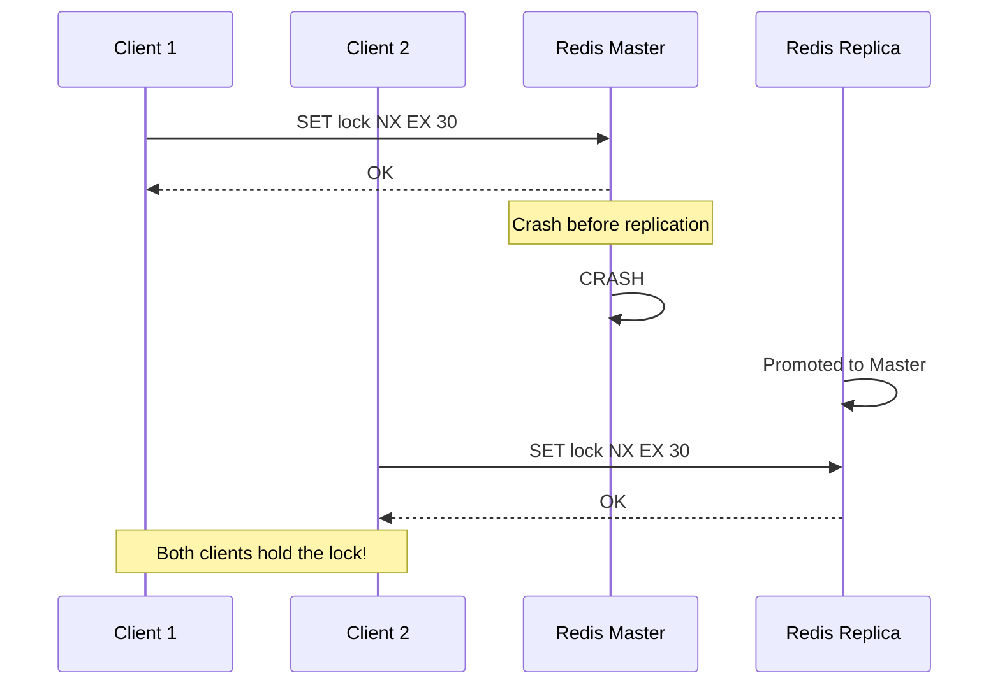

::: warning
Redisの非同期レプリケーションは、ロックの安全性を保証しない。マスター障害時のフェイルオーバーにより、ロックが失われる可能性がある。効率性のためのロックであれば許容できるが、正確性のためのロックとしては不十分である。
:::

## 4. Redlockアルゴリズム

### 4.1 Redlockの着想

単一ノードロックの限界を克服するために、Redisの作者であるSalvatore Sanfilippo（Antirez）は**Redlock**アルゴリズムを提案した。Redlockの基本的なアイデアは、**N台の独立した（レプリケーションなしの）Redisインスタンスに対してロックを取得し、過半数以上のインスタンスでロックが取得できた場合にのみロックの取得に成功したとみなす**というものである。

推奨されるインスタンス数は N=5 である。これにより、最大2台のインスタンスが障害を起こしても、ロックの安全性が維持される。

### 4.2 アルゴリズムの詳細

Redlockのロック取得手順は以下の通りである。

**ステップ 1**: 現在時刻をミリ秒精度で取得する（$T_1$）。

**ステップ 2**: N台すべてのRedisインスタンスに対して、同じキー名と同じランダム値を使用してロックの取得を試みる。各インスタンスへのリクエストには、ロックの有効期限よりも大幅に短いタイムアウト（例えば有効期限が10秒なら、タイムアウトは5〜50ms程度）を設定する。これにより、ダウンしているインスタンスに長時間ブロックされることを防ぐ。

**ステップ 3**: 現在時刻を取得する（$T_2$）。ロック取得にかかった時間 $\Delta T = T_2 - T_1$ を計算する。

**ステップ 4**: 以下の2つの条件が**両方とも**満たされた場合にのみ、ロック取得成功とみなす。

1. **過半数のインスタンス**（N/2 + 1以上）でロックが取得できた
2. ロック取得にかかった時間 $\Delta T$ が、ロックの有効期限より小さい

**ステップ 5**: ロック取得に成功した場合、有効なロック時間は「元の有効期限 - $\Delta T$」となる。

**ステップ 6**: ロック取得に失敗した場合（過半数に到達しなかった場合、または経過時間が有効期限を超えた場合）、**すべてのインスタンス**に対してロックの解放を試みる。

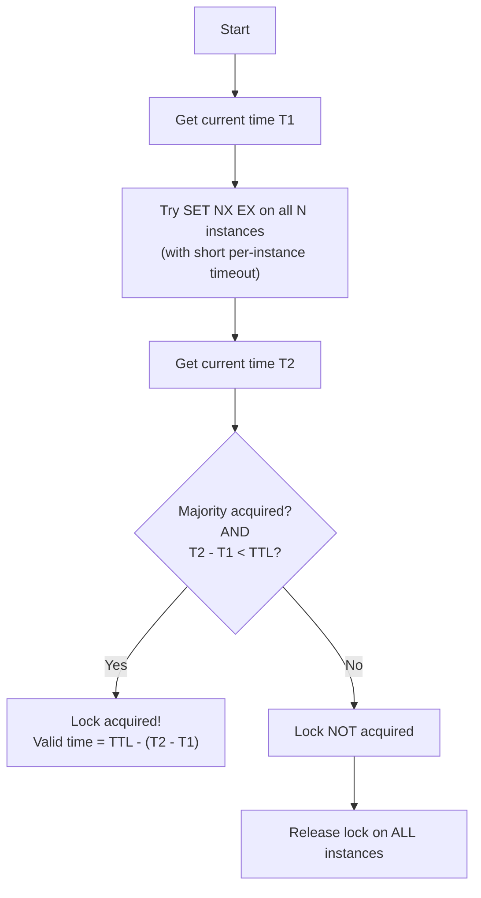

### 4.3 ロックの解放

ロックの解放は、成功・失敗にかかわらず、**すべてのインスタンス**に対して行う。これは、あるインスタンスでロックが取得されたにもかかわらずクライアントがその応答を受信できなかった（ネットワーク障害など）ケースを考慮している。その場合、当該インスタンスにはロックが残っているため、明示的に解放する必要がある。

### 4.4 リトライ戦略

ロック取得に失敗した場合のリトライには注意が必要である。複数のクライアントが同時にロックの取得を試みると、いずれのクライアントも過半数を取得できない**スプリットブレイン**的な状況が発生しうる。これを緩和するために、リトライ前にランダムな遅延を入れることが推奨される。

### 4.5 Redlockの前提条件

Redlockが正しく動作するためには、以下の前提条件が必要である。

1. **各Redisインスタンスは独立している**: レプリケーション関係を持たず、それぞれが独立してロックを管理する
2. **クロックのドリフトが限定的である**: 各インスタンスのクロックは大きくずれていないことが前提。ただし、完全な同期は要求しない
3. **クライアントはロックの有効時間内に処理を完了する**: ロックの有効時間を超えて処理が続く場合、安全性は保証されない

## 5. Martin Kleppmannの批判とAntirezの反論

### 5.1 Kleppmannの批判：「How to do distributed locking」

2016年、ケンブリッジ大学のMartin Kleppmann（「Designing Data-Intensive Applications」の著者）は、ブログ記事「How to do distributed locking」においてRedlockの安全性に対する根本的な批判を展開した。この論争は、分散システムコミュニティにおいて広く議論され、分散ロックの本質を理解する上で極めて重要な知見を提供している。

#### 批判1: プロセスの一時停止による安全性の破綻

Kleppmannが指摘した最も深刻な問題は、GCパーズなどのプロセス一時停止によるロック安全性の破綻である。

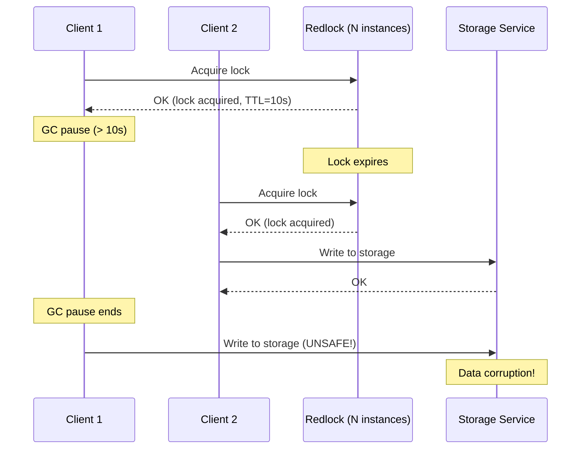

この攻撃シナリオは、Redlockに限らず**あらゆるTTLベースのロック機構**に共通する問題である。Kleppmannの主張の核心は、「Redlockは単一Redisノードのロックよりも安全であるかのように宣伝されているが、本質的な安全性の問題はTTLベースのアプローチそのものに内在しており、Redlockはそれを解決していない」という点にある。

#### 批判2: クロック依存の問題

Redlockは物理クロックに依存している。NTPによるクロック調整やクロックジャンプが発生した場合、ロックの有効期限の計算が不正確になる。

Kleppmannは以下の具体的なシナリオを示した。

1. Client 1が5台中3台のインスタンス（A, B, C）でロックを取得する
2. インスタンスCのクロックが前方にジャンプし、ロックが期限切れになる
3. Client 2がインスタンスC, D, Eでロックを取得する（過半数の3台を確保）
4. Client 1とClient 2が同時にロックを保持する

#### 批判3: フェンシングトークンの欠如

Kleppmannは、安全な分散ロックにはフェンシングトークン（後述）が不可欠であると主張し、Redlockにはこのメカニズムが組み込まれていないことを指摘した。

> "I think the Redlock algorithm is a poor choice because it is 'neither fish nor fowl': it is unnecessarily heavyweight and expensive for efficiency-optimization locks, but it is not sufficiently safe for cases in which correctness depends on the lock."
>
> — Martin Kleppmann, "How to do distributed locking" (2016)

### 5.2 Antirezの反論：「Is Redlock safe?」

Kleppmannの批判に対して、RedisとRedlockの作者であるAntirezは「Is Redlock safe?」というブログ記事で反論を行った。

#### 反論1: GCパーズの問題はRedlock固有ではない

Antirezは、GCパーズの問題がRedlock固有の問題ではなく、分散ロックの一般的な問題であることを認めた上で、以下の点を強調した。

- Redlockは、ロック取得後に「残り有効時間」を計算してクライアントに返す。クライアントはこの時間内に処理を完了する責任がある
- 極端に長いGCパーズ（ロックの有効期限を超えるもの）は、あらゆるロックメカニズムにとって問題であり、Redlockだけが批判されるべきではない

#### 反論2: クロック問題への対処

Antirezは、Redlockが要求するクロックの精度について以下のように説明した。

- Redlockが依存するのは**壁時計の正確さ**ではなく、**時間の経過を測る能力**である。すなわち、gettimeofday()のような壁時計ではなく、monotonic clockのような経過時間計測を使用すれば、NTPによるクロックジャンプの影響を受けない
- 実際のRedlock実装では、ロック取得前後の時刻差を計算するため、絶対的な時刻の正確さよりも時間間隔の測定精度が重要である

#### 反論3: フェンシングトークンについて

Antirezは、フェンシングトークンがすべてのケースで利用可能なわけではないことを指摘した。フェンシングトークンを使用するには、リソース側がトークンを検証する機能を持つ必要があるが、多くの実システムではそのような機能を追加することが困難である。

### 5.3 論争の教訓

この論争から得られる最も重要な教訓は以下の通りである。

::: tip 論争から得られる教訓
1. **TTLベースのロックには本質的な限界がある**: どれほど洗練されたアルゴリズムであっても、TTLに依存する限り、プロセスの一時停止による安全性の破綻を完全に防ぐことはできない
2. **安全性の要件を明確にすべきである**: 「効率性のためのロック」か「正確性のためのロック」かによって、適切な実装は異なる
3. **フェンシングトークンの概念は重要である**: ロックの安全性をエンドツーエンドで保証するためには、リソース側での検証メカニズムが不可欠である
:::

## 6. etcdによる分散ロック

### 6.1 etcdの概要

**etcd**は、CoreOS（現在はCNCFプロジェクト）によって開発された分散キーバリューストアである。Raftコンセンサスアルゴリズムに基づく強い一貫性を提供し、Kubernetesのバックエンドストアとしても広く使われている。

Redisとは異なり、etcdは以下の特徴を持つ。

| 特徴 | 説明 |
|------|------|
| **強い一貫性** | Raftコンセンサスに基づくLinearizable Read/Write |
| **リース（Lease）** | TTLとハートビートを組み合わせたロック管理 |
| **ウォッチ（Watch）** | キーの変更をリアルタイムに通知 |
| **トランザクション** | 条件付きの複合操作をアトミックに実行 |

### 6.2 リースに基づくロック機構

etcdの分散ロックは、**リース（Lease）**という概念を中核に据えている。リースは、TTLを持つ一種のセッションであり、クライアントが定期的にKeepAlive（ハートビート）を送信することで有効期限を延長できる。

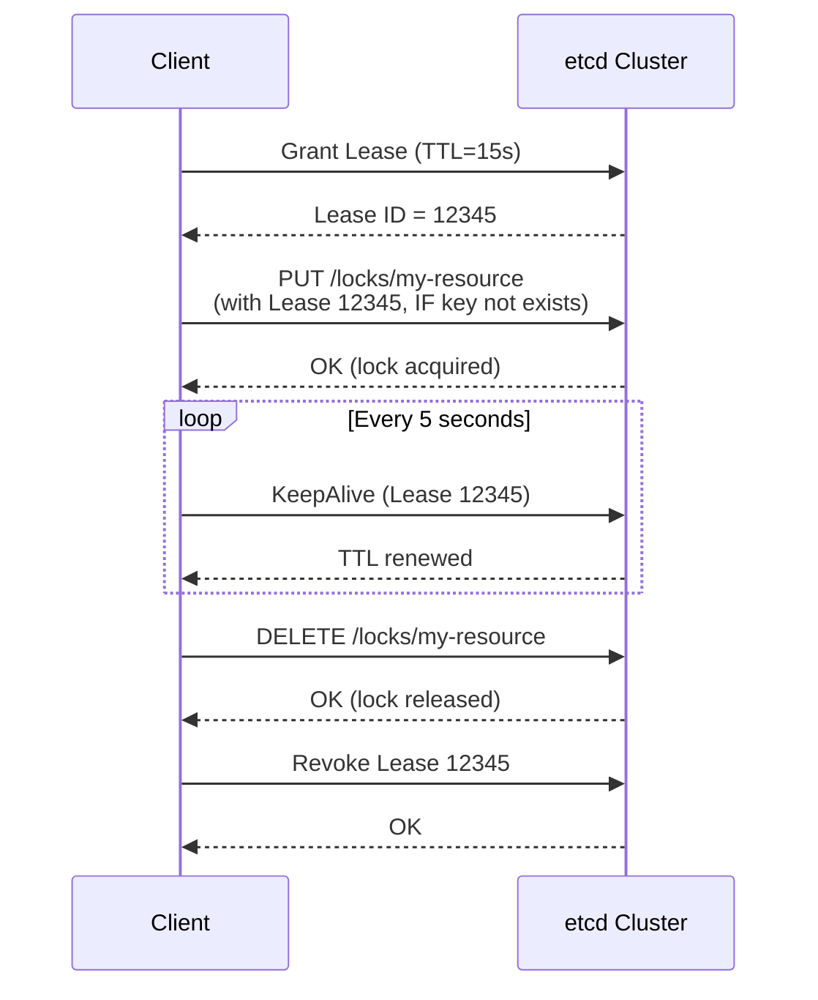

リースの仕組みにより、単純なTTLベースのロックに比べて以下のメリットがある。

- **クライアントの存在確認**: KeepAliveが途絶えた場合にのみロックが失効する。ネットワーク遅延ではなく、クライアントの障害に限定して失効を判断できる
- **明示的な延長**: クライアントは処理が長引いた場合にリースを延長できるため、処理時間がTTLに制約されない

### 6.3 etcdのロック取得の実装

etcdでの分散ロック取得は、トランザクション機能を使用して以下のようにアトミックに行われる。

```go
// Create a lease
lease, err := client.Grant(ctx, 15) // 15-second TTL
if err != nil {
    return err
}

// Try to acquire the lock atomically using a transaction
// The lock is acquired only if the key does not already exist (CreateRevision == 0)
txnResp, err := client.Txn(ctx).
    If(clientv3.Compare(clientv3.CreateRevision("/locks/my-resource"), "=", 0)).
    Then(clientv3.OpPut("/locks/my-resource", "holder-id", clientv3.WithLease(lease.ID))).
    Else(clientv3.OpGet("/locks/my-resource")).
    Commit()

if txnResp.Succeeded {
    // Lock acquired successfully
    // Start KeepAlive to maintain the lease
    keepAliveCh, err := client.KeepAlive(ctx, lease.ID)
    // ...
} else {
    // Lock already held by another client
    // Optionally watch for lock release
}
```

etcdのトランザクションは、`If-Then-Else` の構造を持つ。`If` 条件（キーのCreateRevisionが0、すなわちキーが存在しない）が満たされた場合にのみ `Then` が実行され、そうでなければ `Else` が実行される。この操作はRaftログに記録され、クラスタ全体でアトミックに適用される。

### 6.4 Watchによるロック待機

etcdでは、ロックが取得できなかった場合に、ロックキーの変更を**Watch**で監視し、ロックが解放されたタイミングで再度取得を試みることができる。

```go
// Watch for lock release
watchCh := client.Watch(ctx, "/locks/my-resource")
for watchResp := range watchCh {
    for _, event := range watchResp.Events {
        if event.Type == clientv3.EventTypeDelete {
            // Lock released, try to acquire again
            // ...
        }
    }
}
```

この方式は、ポーリングに比べて効率的であり、ロック解放の検知遅延も最小化される。

### 6.5 etcd/clientv3/concurrency パッケージ

実際の開発では、etcdが提供する `concurrency` パッケージを使用することが推奨される。このパッケージには、上述のリース、トランザクション、Watchを組み合わせた `Mutex` の実装が含まれている。

```go
// Create a session (internally creates a lease with KeepAlive)
session, err := concurrency.NewSession(client, concurrency.WithTTL(15))
if err != nil {
    return err
}
defer session.Close()

// Create a mutex
mutex := concurrency.NewMutex(session, "/locks/my-resource")

// Acquire the lock (blocks until acquired)
if err := mutex.Lock(ctx); err != nil {
    return err
}
defer mutex.Unlock(ctx)

// Critical section
// ...
```

`concurrency.Mutex` の内部では、ロックキーにプレフィックスとリビジョン番号を利用した**公平なキューイング**が実装されている。複数のクライアントが同時にロックを要求した場合、リビジョン番号が最も小さい（最も早くリクエストした）クライアントがロックを取得する。これにより、starvation（飢餓状態）を防いでいる。

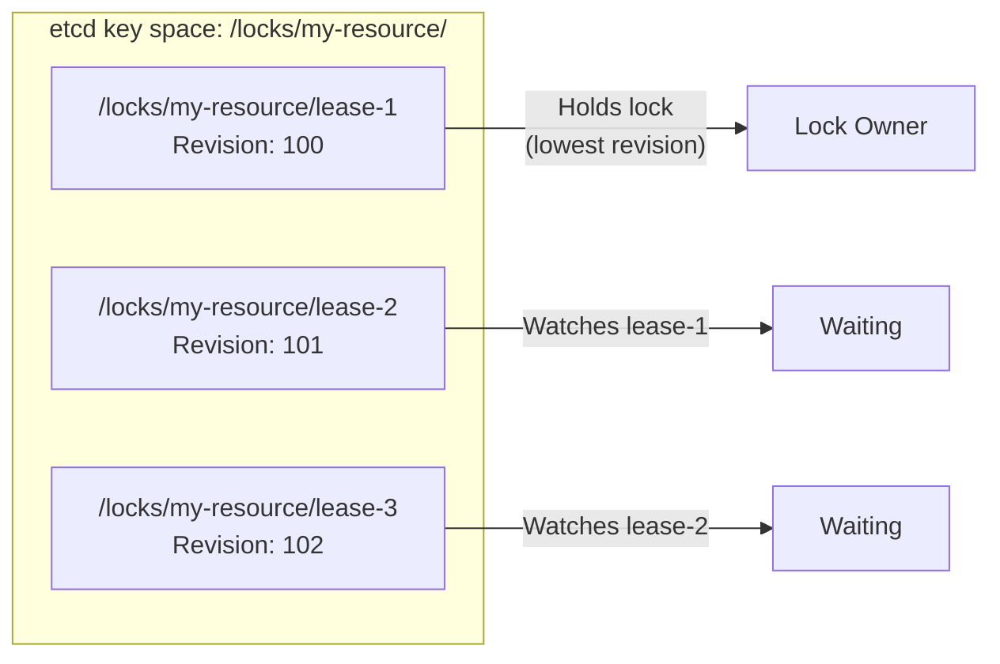

### 6.6 etcdロックの安全性

etcdの分散ロックは、Raftコンセンサスによる強い一貫性が基盤となっている。ロックの取得操作はRaftログにコミットされるため、過半数のノードが合意した時点でロックが確定する。リーダーノードが障害を起こしても、Raftのリーダー選出により新しいリーダーが選ばれ、コミット済みのロック情報は保持される。

ただし、etcdのリースにもTTLが存在するため、Kleppmannが指摘したGCパーズ問題は依然として存在する。KeepAliveのハートビートがGCパーズによって送信されなかった場合、リースが失効し、別のクライアントがロックを取得する可能性がある。

::: tip
etcdのリースは、RedisのTTLベースのロックに比べて、KeepAliveによる明示的な延長が可能であるという点で改善されている。しかし、GCパーズがKeepAlive送信よりも長く続いた場合の問題は残る。正確性が要求されるケースでは、フェンシングトークンとの組み合わせが推奨される。
:::

## 7. ZooKeeperによる分散ロック

### 7.1 ZooKeeperの概要

**Apache ZooKeeper**は、分散アプリケーションのための協調サービスである。2008年にYahoo!で開発され、HadoopやKafkaなど多くの分散システムのインフラとして利用されてきた。ZooKeeperはZAB（ZooKeeper Atomic Broadcast）プロトコルに基づく強い一貫性を提供する。

ZooKeeperのデータモデルは、ファイルシステムに似た**階層的な名前空間（znode tree）**である。各znode（ZooKeeperノード）はデータとメタデータを持ち、以下の特殊な種類がある。

| znodeの種類 | 説明 |
|------------|------|
| **Persistent** | 明示的に削除されるまで存在し続ける |
| **Ephemeral** | 作成したクライアントのセッションが終了すると自動的に削除される |
| **Sequential** | ノード名の末尾に単調増加する番号が自動付与される |
| **Ephemeral + Sequential** | 上記2つの組み合わせ。分散ロックの実装に不可欠 |

### 7.2 エフェメラルノードによるシンプルなロック

最もシンプルな方式は、エフェメラルノードの排他的な作成を利用するものである。

```java
// Try to create an ephemeral node
try {
    zk.create("/locks/my-resource", data, ZooDefs.Ids.OPEN_ACL_UNSAFE,
              CreateMode.EPHEMERAL);
    // Lock acquired
} catch (KeeperException.NodeExistsException e) {
    // Lock already held by another client
    // Set a watch on the lock node
    zk.exists("/locks/my-resource", watchEvent -> {
        if (watchEvent.getType() == EventType.NodeDeleted) {
            // Lock released, retry acquisition
        }
    });
}
```

この方式はシンプルだが、**サンダリングハード（Thundering Herd）問題**がある。ロックが解放されると、待機しているすべてのクライアントに通知が送られ、全員が一斉にロック取得を試みる。大量のクライアントが待機している場合、これはZooKeeperに対する大きな負荷となる。

### 7.3 Sequential + Ephemeralノードによる公平なロック

ZooKeeperの推奨するロック実装は、**Ephemeral Sequential ノード**を使用する方式である。この方式はサンダリングハード問題を回避し、FIFO順序でロックを付与する。

**ロック取得の手順**:

1. ロックパス配下にEphemeral Sequentialノードを作成する（例: `/locks/my-resource/lock-0000000001`）
2. ロックパス配下のすべての子ノードを取得する
3. 自分が作成したノードが最小の番号を持つ場合、ロック取得に成功
4. そうでない場合、**自分の直前の番号を持つノードにのみ**Watchを設定して待機する

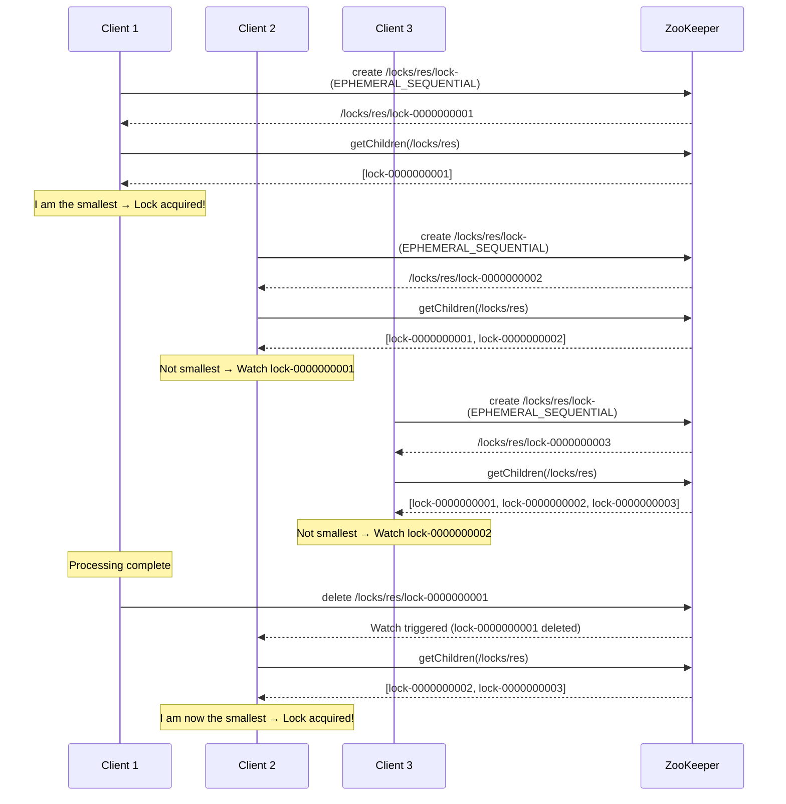

この方式のポイントは、各クライアントが**自分の直前のノードにのみ**Watchを設定することである。これにより、ロック解放時にはただ1つのクライアントにのみ通知が送られ、サンダリングハード問題が完全に回避される。

### 7.4 実装例（Apache Curator）

ZooKeeperの分散ロックを実際に使用する場合、低レベルのAPIを直接扱うよりも、**Apache Curator**ライブラリを使用することが強く推奨される。Curatorは、ZooKeeperのベストプラクティスに基づいた高レベルのレシピを提供しており、セッション切断時のリトライやエッジケースの処理が適切に行われている。

```java
// Create a Curator client
CuratorFramework client = CuratorFrameworkFactory.newClient(
    "zk1:2181,zk2:2181,zk3:2181",
    new ExponentialBackoffRetry(1000, 3)
);
client.start();

// Create a distributed lock
InterProcessMutex lock = new InterProcessMutex(client, "/locks/my-resource");

try {
    // Acquire the lock (with timeout)
    if (lock.acquire(30, TimeUnit.SECONDS)) {
        try {
            // Critical section
            // ...
        } finally {
            // Release the lock
            lock.release();
        }
    } else {
        // Failed to acquire within timeout
    }
} catch (Exception e) {
    // Handle exception
}
```

### 7.5 ZooKeeperのセッションとロックの安全性

ZooKeeperのロック安全性は、**セッション**の概念と密接に結びついている。

ZooKeeperクライアントはサーバーとの間にTCPベースのセッションを維持する。セッションにはタイムアウトが設定されており、ハートビートによって維持される。セッションがタイムアウトすると、そのセッションに紐づくすべてのエフェメラルノードが削除される。

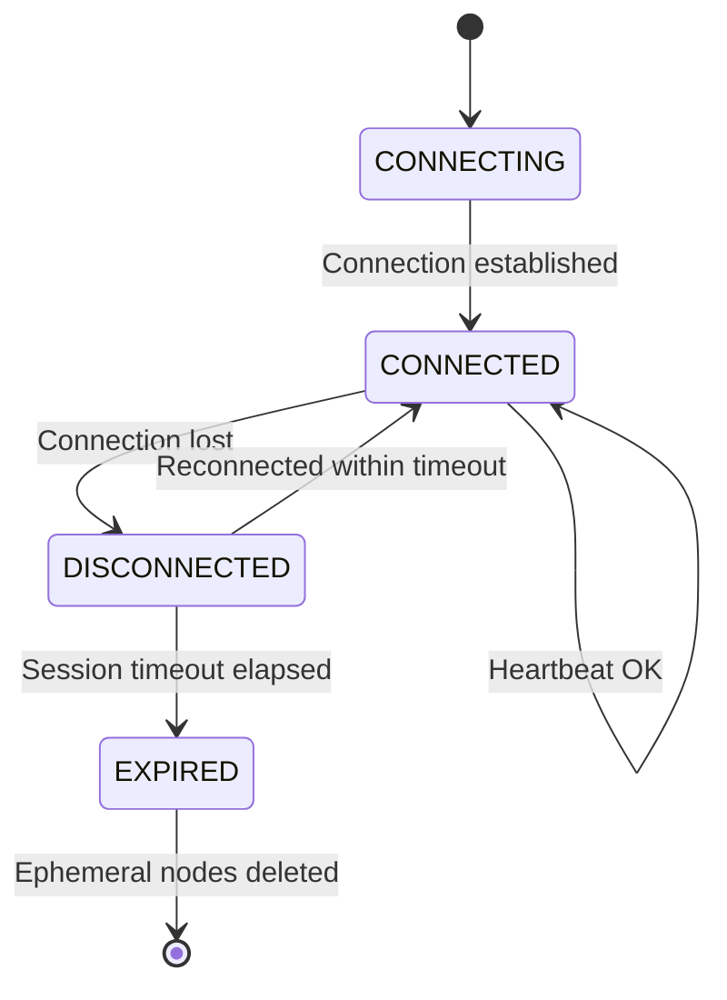

ZooKeeperのセッションモデルは、etcdのリースと類似しているが、重要な違いがある。ZooKeeperのセッションは**サーバー側で管理される**。クライアントが一時的にネットワーク障害で切断された場合でも、セッションタイムアウト内に再接続できれば、セッション（およびエフェメラルノード）は維持される。

しかし、etcdのリースと同様に、**セッションタイムアウトを超えるGCパーズが発生した場合**の問題は依然として存在する。クライアントがGCパーズ中にセッションが失効し、エフェメラルノードが削除され、別のクライアントがロックを取得した後に、元のクライアントが復帰してまだロックを保持していると誤認するシナリオは起こりうる。

::: danger
ZooKeeperのエフェメラルノードベースのロックであっても、セッションタイムアウトを超えるプロセス停止に対しては安全ではない。クライアントは、操作の前にセッションの有効性を確認するか、フェンシングトークンを使用する必要がある。
:::

### 7.6 読み取りロックと書き込みロック

ZooKeeperのSequentialノードベースのロックは、**Read-Writeロック**に自然に拡張できる。

- **書き込みロック（排他ロック）**: 自分より番号が小さいすべてのノードが削除されるまで待つ（前述の方式と同じ）
- **読み取りロック（共有ロック）**: 自分より番号が小さい**書き込みロック**のノードが削除されるまで待つ。読み取りノードは複数が同時にロックを保持できる

```
/locks/my-resource/
    read-0000000001   ← Client A (read lock, acquired)
    read-0000000002   ← Client B (read lock, acquired)
    write-0000000003  ← Client C (write lock, waiting for 001 and 002)
    read-0000000004   ← Client D (read lock, waiting for 003)
```

このパターンにより、読み取りが多いワークロードでは並行性が大幅に向上する。

## 8. フェンシングトークン

### 8.1 フェンシングトークンの概念

フェンシングトークン（Fencing Token）は、分散ロックのGCパーズ問題に対する根本的な解決策として、Martin Kleppmannが提唱した概念である。

アイデアはシンプルである。ロックサービスは、ロック取得のたびに**単調増加する一意の番号（フェンシングトークン）**を発行する。クライアントは、ロック保護下のリソースにアクセスする際に、このトークンをリクエストに含める。リソース側は、受け取ったトークンが前回処理したトークンよりも古い場合、そのリクエストを拒否する。

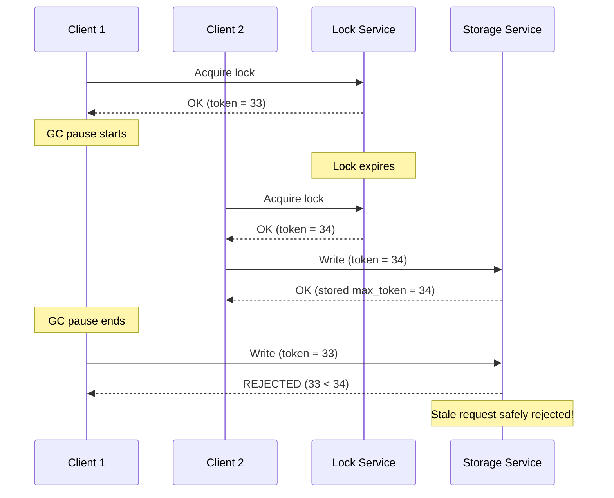

### 8.2 フェンシングトークンの実装

フェンシングトークンの実装は、ロックサービスとリソースの双方に要求がある。

**ロックサービス側**: ロック取得のたびに単調増加する番号を発行する。etcdの場合、キーのリビジョン番号がこの役割を自然に果たす。ZooKeeperの場合、Sequential ノードの番号がフェンシングトークンとして使用できる。

**リソース側**: 以下のような検証ロジックが必要である。

```python
class FencedStorage:
    def __init__(self):
        self.max_token = 0
        self.data = {}

    def write(self, key, value, fencing_token):
        # Reject requests with stale tokens
        if fencing_token < self.max_token:
            raise StaleTokenError(
                f"Token {fencing_token} is stale (max seen: {self.max_token})"
            )
        self.max_token = fencing_token
        self.data[key] = value
```

### 8.3 フェンシングトークンの限界

フェンシングトークンは強力な安全性メカニズムであるが、すべてのシステムに適用できるわけではない。

- **リソース側の対応が必要**: データベースやストレージサービスがフェンシングトークンの検証機能を持つ必要がある。既存のシステムにこの機能を追加するのは、しばしば困難である
- **複数リソースへのアクセス**: 1つのロック保護下で複数のリソースにアクセスする場合、すべてのリソースがトークン検証をサポートする必要がある
- **パフォーマンスオーバーヘッド**: トークンの管理と検証に追加のストレージとCPUコストが発生する

::: details フェンシングトークンの代替：CAS操作
フェンシングトークンの概念をより一般化したものとして、**CAS（Compare-And-Swap）操作**がある。リソースの現在のバージョンを読み取り、書き込み時にバージョンが変更されていないことを検証する楽観的並行制御である。etcdのトランザクション（ModRevisionの比較）や、DynamoDBの条件付き書き込みがこのパターンに該当する。
:::

## 9. 各方式の比較

### 9.1 アーキテクチャの比較

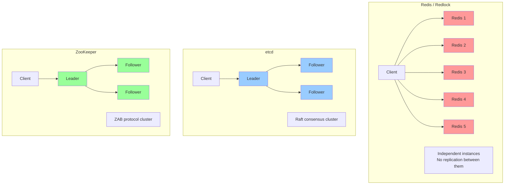

### 9.2 特性比較表

| 特性 | Redis (単一) | Redlock | etcd | ZooKeeper |
|------|------------|---------|------|-----------|
| **一貫性モデル** | 結果整合性 | N/A (独立ノード) | Linearizable | Linearizable |
| **コンセンサス** | なし | クライアント側の過半数 | Raft | ZAB |
| **ロック失効** | TTL | TTL | リース + KeepAlive | セッション + Heartbeat |
| **公平性（FIFO）** | なし | なし | あり（Revision順） | あり（Sequential順） |
| **Read-Writeロック** | 手動実装 | 手動実装 | 手動実装 | ネイティブサポート |
| **フェンシングトークン** | 手動実装 | 手動実装 | Revision利用可 | Sequential番号利用可 |
| **Watch/通知** | Pub/Sub（限定的） | なし | Watch（キー単位） | Watch（znode単位） |
| **パフォーマンス** | 非常に高い | 高い | 中程度 | 中程度 |
| **運用の容易さ** | 非常に容易 | やや複雑 | 容易 | やや複雑 |

### 9.3 用途別の推奨

#### 効率性のためのロック（重複排除、べき等性の補助）

ロックの失敗が致命的ではなく、稀にロックが破られても最悪のケースが「同じ処理が2回実行される」程度である場合。

::: tip 推奨: Redis単一ノード
単一のRedisインスタンスによる `SET NX EX` で十分である。セットアップが最も簡単で、パフォーマンスも最も高い。Redisが既にインフラに存在する場合は、追加の依存関係なく利用できる。
:::

#### 正確性のためのロック（データ整合性が重要）

ロックの失敗がデータ破損や金銭的な損失に直結する場合。

::: tip 推奨: etcd または ZooKeeper + フェンシングトークン
コンセンサスベースの強い一貫性を持つロックサービスを使用し、さらにフェンシングトークンによるリソース側の検証を組み合わせる。既にKubernetesを使用している場合はetcdが自然な選択肢となる。Hadoop/Kafkaエコシステムとの親和性が重要であればZooKeeperが適切である。
:::

#### Kubernetesネイティブな環境

::: tip 推奨: etcd
Kubernetesクラスタには既にetcdが稼働しているため、追加のインフラなく分散ロックを実現できる。ただし、Kubernetesのシステムetcdをアプリケーションのロックに直接使用することは推奨されない。アプリケーション用に別のetcdクラスタを構築するか、Kubernetes Lease APIを活用する方法が望ましい。
:::

### 9.4 パフォーマンス特性

各方式のパフォーマンスは、ロックの取得・解放のレイテンシとスループットの両面で大きく異なる。

**Redis単一ノード**: ロック取得は1回のネットワークラウンドトリップで完了し、レイテンシはサブミリ秒から数ミリ秒程度。インメモリ処理のため、スループットは数万〜数十万ops/secに達する。

**Redlock**: N台のインスタンスへの並行リクエストが必要であり、すべてのレスポンスを待つ必要がある。レイテンシは最も遅いインスタンスに支配される。5台構成の場合、単一ノードの3〜5倍程度のレイテンシとなることが一般的である。

**etcd**: ロック取得にはRaftログへのコミットが必要であり、リーダーから過半数のフォロワーへの複製が完了するまで待つ必要がある。レイテンシは数ミリ秒〜数十ミリ秒程度。リースのKeepAliveがバックグラウンドで走る分、ネットワーク帯域の消費もやや多い。

**ZooKeeper**: etcdと同様にZABプロトコルによる合意が必要。セッション管理のオーバーヘッドもあり、レイテンシはetcdと同程度かやや高い。大量のznodeを作成するワークロードではGCの影響も考慮が必要である（ZooKeeperはJavaで実装されている）。

## 10. 実践的な設計指針

### 10.1 ロックの粒度

分散ロックの粒度は、システム全体のスループットに直接影響する。粗粒度のロック（例: テーブル全体のロック）は実装がシンプルだが、並行性を大きく制限する。細粒度のロック（例: レコード単位のロック）は並行性を高めるが、ロック管理のオーバーヘッドが増大する。

実践的には、**ビジネスロジックの最小の独立単位**に合わせてロックの粒度を決定する。例えば、ユーザーのアカウント残高を更新する場合、ロックキーにはユーザーIDを含める（`/locks/accounts/{user_id}`）。

### 10.2 ロックのタイムアウト設計

ロックのTTL/セッションタイムアウトの設計は、以下のトレードオフを伴う。

- **短すぎるTTL**: 正常な処理中にロックが失効し、安全性が破綻するリスクが高まる
- **長すぎるTTL**: クライアント障害時にロックが長時間保持され、他のクライアントがブロックされる

一般的なガイドラインとして、TTLは想定される処理時間の**3〜5倍**に設定する。さらに、etcdやZooKeeperのようにリースやセッションの延長が可能なシステムでは、定期的な延長を行うことで、処理時間のばらつきに対処する。

### 10.3 デバッグとオブザーバビリティ

分散ロックのデバッグは困難であるため、以下のメトリクスを収集することが推奨される。

- **ロック取得レイテンシ**: ロック取得にかかった時間の分布
- **ロック保持時間**: ロックが保持されていた時間の分布
- **ロック取得失敗率**: 取得に失敗した頻度とその原因
- **TTL超過の頻度**: ロックがTTLで自動失効した回数

これらのメトリクスを監視することで、ロックの粒度やTTLの設定が適切かどうかを継続的に評価できる。

### 10.4 ロックを使わない設計の検討

最後に、最も重要な設計指針を述べる。**可能な限り、分散ロックを使わない設計を検討すべき**である。

分散ロックは本質的に複雑であり、正確性の検証が困難である。以下の代替手段が使えないか、まず検討することが望ましい。

- **冪等性の設計**: 同じ操作を複数回実行しても結果が変わらないようにすることで、排他制御の必要性を排除する
- **楽観的並行制御**: CAS操作やバージョン番号による楽観的なアプローチは、競合が少ないワークロードではロックよりも効率的である
- **単一ライターの設計**: 特定のリソースへの書き込みを1つのプロセスに限定することで、ロックを不要にする（例: パーティショニングによるアフィニティ）
- **CRDTs**: 結果整合性が許容される場合、Conflict-free Replicated Data Typesを使用することで、調整なしに複数のノードが並行して書き込める

## 11. まとめ

分散ロックは、分散システムにおけるリソース調整の基本的なプリミティブである。しかし、その正しい実装と運用は、単一プロセスのロックに比べてはるかに複雑であり、ネットワーク障害、プロセスの一時停止、クロックスキューといった分散環境特有の課題に常に直面する。

本記事で解説した3つの方式は、それぞれ異なるトレードオフを持つ。

- **Redis / Redlock**: パフォーマンスに優れるが、安全性の保証が最も弱い。効率性のためのロックに適する
- **etcd**: Raftコンセンサスに基づく強い一貫性とリースによるロック管理を提供する。Kubernetesエコシステムとの親和性が高い
- **ZooKeeper**: エフェメラルノードとSequentialノードによる洗練されたロック機構を持つ。Hadoop/Kafkaエコシステムとの歴史的な親和性がある

Martin KleppmannとAntirezの論争が明らかにしたように、TTLベースのロックには本質的な限界がある。正確性が要求されるケースでは、フェンシングトークンによるリソース側の検証が不可欠である。

最終的に、分散ロックの設計において最も重要なのは、**自分のシステムがロックに何を求めているのかを明確にすること**である。効率性のためのロックか、正確性のためのロックか——この区別を曖昧にしたまま実装を進めると、過剰な複雑さを導入するか、あるいは安全性の問題を見落とすことになる。
