# 分散システムにおける時刻と順序（NTP, TrueTime, HLC）

## 1. 時刻の根本的問題

分散システムを設計するうえで避けて通れない問題のひとつが「時刻」である。単一のコンピュータ上では、プログラムはシステムクロックから現在時刻を取得し、イベントの順序を記録できる。しかし複数のノードが協調するシステムでは、この素朴な前提が崩れる。

### 1.1 クロックの物理的な限界

現代のコンピュータのシステムクロックは、水晶発振子（クオーツ発振子）の振動を数える回路で実現されている。水晶発振子は温度・電圧・経年劣化によってわずかに周波数が変動し、その結果として時計は少しずつ実際の時刻からずれていく。このずれを**クロックドリフト（Clock Drift）**と呼ぶ。

一般的なサーバー用水晶発振子のドリフトは $10^{-6}$ から $10^{-5}$ 秒/秒程度、つまり1日あたり86ミリ秒から860ミリ秒のずれが生じうる。1週間放置すれば、数秒単位のずれは珍しくない。

$$\text{drift rate} \approx 10^{-6} \text{ s/s} \implies 1 \text{ day} \times 86400 \text{ s} \times 10^{-6} = 86.4 \text{ ms/day}$$

二つのノード間で時計の読み値がどれだけ異なるかを**クロックスキュー（Clock Skew）**と呼ぶ。インターネット越しのNTP同期では数十ミリ秒のスキューが残り、同一データセンター内でも数百マイクロ秒のスキューは普通に発生する。

### 1.2 時刻の非単調性問題

さらに深刻なのが、時計が**巻き戻る**可能性である。NTPによる時刻同期は、ローカルクロックが進んでいることを検知すると時計を修正し、場合によっては時刻を過去に巻き戻す。うるう秒の挿入も同様の問題を引き起こす。

時刻の巻き戻りは以下のような深刻な障害を引き起こしうる。

- データベースが「タイムスタンプが大きいほど新しい」と仮定している場合、古い値で新しい値を上書きしてしまう
- ログ解析ツールが「時刻は単調増加する」と仮定している場合、整合性が失われる
- リース（lease）やタイムアウトの計算が狂い、二重処理や処理漏れが発生する

この問題への対処として、Linuxカーネルは `CLOCK_MONOTONIC` という「巻き戻らないが実時間と無関係なクロック」を提供している。ただし、このクロックはノード間で比較できないため、分散システムの時刻同期には使えない。

### 1.3 因果律との衝突

分散システムで最も本質的な問題は、「どのイベントが先に起きたか」が決定できない場合があることだ。

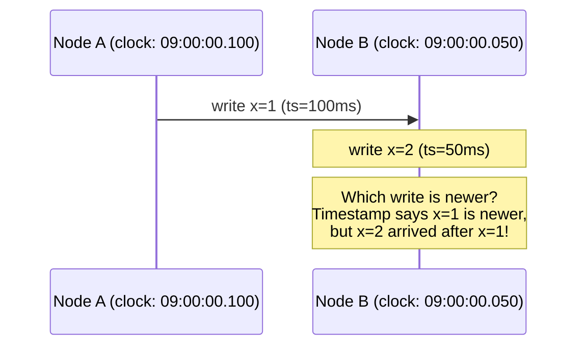

この例では、ノードBのクロックがノードAより50ms遅れている。ノードAが `x=1` を書き込み（タイムスタンプ100ms）、その後ノードBが `x=2` を書き込む（タイムスタンプ50ms）。タイムスタンプだけを見れば `x=1` の方が新しく見えるが、実際にはノードAの書き込みがノードBの書き込みに**因果的に先行**している。物理時計の順序が因果的な順序と逆転してしまっている。

この問題に対して、コンピュータサイエンスは大きく二つのアプローチを発展させた。一つは物理時計の精度を徹底的に高める方向（NTP、PTP、TrueTime）であり、もう一つは物理時計への依存を最小化して論理的な順序だけを追跡する方向（Lamport Clock、Vector Clock、HLC）である。

> [!NOTE]
> 本記事では物理クロック同期技術と、それらを組み合わせたHybrid Logical Clock、Google TrueTimeを中心に解説する。Lamport ClockとVector Clockの詳細については「論理時計 — Lamport ClockとVector Clockによる因果順序の追跡」を参照されたい。

## 2. NTP — ネットワーク時刻プロトコル

### 2.1 NTPの概要と歴史

**NTP（Network Time Protocol）**は、インターネット上のノード間で時刻を同期するための標準プロトコルである。1985年にDavid L. Millsによって設計され、現在のNTPv4（RFC 5905）は50年近くにわたる継続的な改良の産物である。

NTPの設計目標は、低コストの一般的なハードウェアとインターネット接続を使って、数十ミリ秒程度の精度で時刻同期を実現することであった。現代の実装では、理想的な条件下でLAN内であれば1ミリ秒以下、インターネット越しでも10〜100ミリ秒程度の精度を達成する。

### 2.2 層状のアーキテクチャ（Stratum）

NTPは**階層（Stratum）**と呼ばれる木構造を形成する。

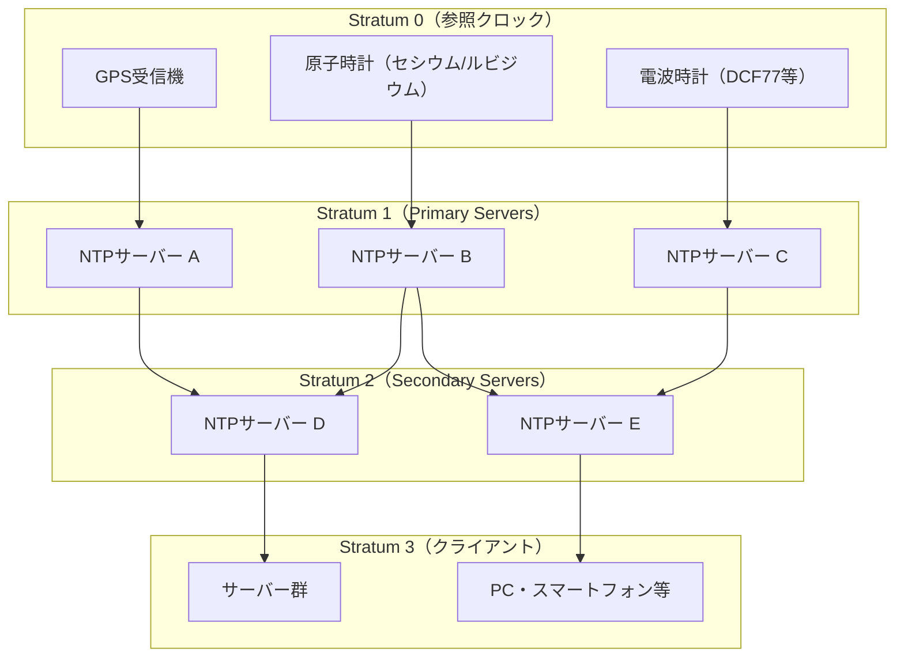

- **Stratum 0**：GPS衛星、セシウム原子時計、ルビジウム発振器などの高精度な時刻源。ネットワークには直接接続されない。
- **Stratum 1**：Stratum 0に直接接続されたNTPサーバー。公開NTPサービス（pool.ntp.org、time.google.com等）はここに属する。
- **Stratum 2〜15**：上位Stratumのサーバーから同期する。Stratumが上がるほど精度が下がる。
- **Stratum 16**：同期不能な状態を示す特殊値。

Stratumはサーバーの品質を示す指標ではなく、参照クロックからのホップ数を示すに過ぎない点に注意が必要だ。Stratum 2のサーバーが、負荷の高いStratum 1サーバーより高精度な場合も多い。

### 2.3 NTPの時刻同期アルゴリズム

NTPクライアントは複数のサーバーに対して定期的にクエリを送り、応答から時刻オフセットを計算する。1回のクエリは以下のように動作する。

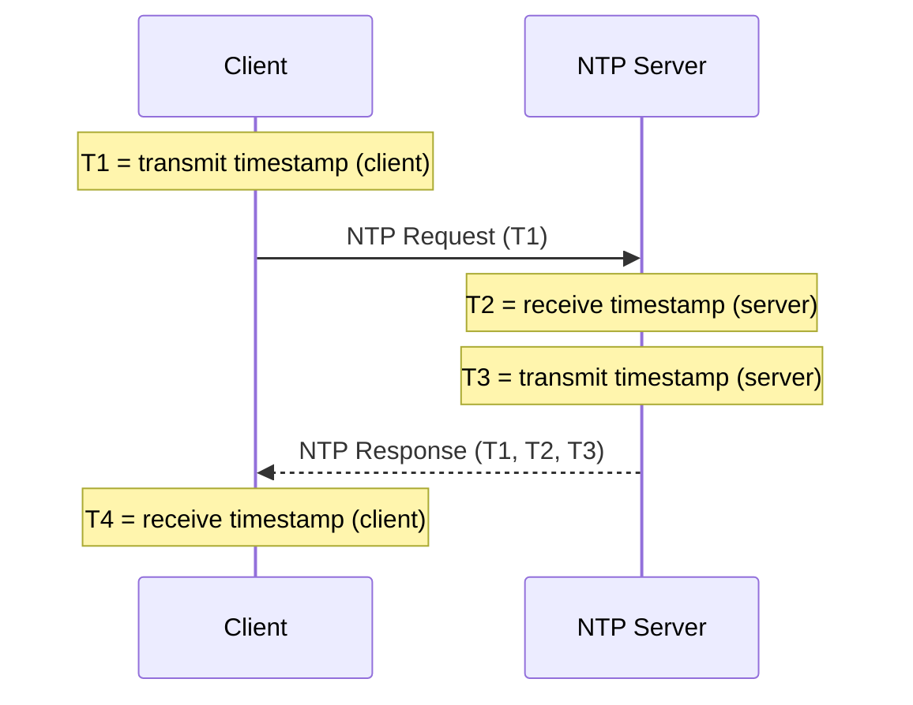

4つのタイムスタンプ $T_1, T_2, T_3, T_4$ を用いて、以下の2つの値を計算する。

**往復遅延（Round-Trip Delay）**：
$$\delta = (T_4 - T_1) - (T_3 - T_2)$$

これは「メッセージがネットワークを往復するのにかかった時間」から「サーバーが処理に費やした時間」を引いたものである。

**クロックオフセット（Clock Offset）**：
$$\theta = \frac{(T_2 - T_1) + (T_3 - T_4)}{2}$$

このオフセット計算は「ネットワーク遅延が上りと下りで等しい（対称である）」という仮定に基づいている。この仮定が成立しない場合（インターネット上での非対称ルーティング等）、オフセット計算に誤差が生じる。

> [!WARNING]
> NTPの精度の根本的な限界は「ネットワーク遅延が対称である」という仮定にある。実際のインターネットでは、往路と復路で異なるルートを通ることがあり、非対称な遅延が系統的な誤差を生む。

### 2.4 クロックフィルタリングと選択

NTPクライアントは複数のサーバーに対してクエリを行い、以下のアルゴリズムで信頼できる時刻源を選択する。

**クロックフィルタ（Clock Filter）**：
各サーバーに対して直近8回のサンプルを保持し、往復遅延が最小のサンプルを「最良の推定」として採用する。往復遅延が最小のサンプルは、ネットワーク遅延の非対称性が最小だった可能性が高いためである。

**インターセクションアルゴリズム（Marzullo's Algorithm）**：
複数のサーバーの推定値から、誤ったサーバーを排除し、正しいサーバーの集合を特定する。具体的には、各サーバーが「真の時刻がこの範囲内にある」という区間を提供し、最大多数のサーバーが合意する最小区間を求める。

**クロックディシプリン（Clock Discipline）**：
最終的に選ばれたオフセットを用いて、ローカルクロックを**ステップ（急激な修正）**または**スルー（緩やかな調整）**によって修正する。

NTPは通常、128ms以上のオフセットに対してはステップ修正を行い、それ以下ではスルーを用いる。スルーは時計の単調性を維持するための重要な仕組みで、クロックの進み/遅れを $10^{-5}$ 〜 $10^{-3}$ 秒/秒の範囲でわずかに加速または減速することで実現する。

```python
class NTPClockDiscipline:
    MAX_STEP_THRESHOLD = 0.128  # 128ms: step vs. slew boundary
    MAX_SLEW_RATE = 500e-6      # 500 ppm: maximum adjustment rate

    def apply_offset(self, offset: float):
        """Apply time correction using step or slew."""
        if abs(offset) > self.MAX_STEP_THRESHOLD:
            # Step correction: immediately apply offset
            # (may cause clock to jump backward!)
            self.clock.step(offset)
        else:
            # Slew correction: gradually adjust clock rate
            # Ensures monotonicity but takes time to converge
            adjustment_rate = min(
                abs(offset) / self.time_constant,
                self.MAX_SLEW_RATE
            )
            self.clock.set_slew_rate(
                adjustment_rate if offset > 0 else -adjustment_rate
            )
```

### 2.5 NTPの精度と限界

一般的な環境でのNTPの精度は以下の通りである。

| 環境 | 典型的なオフセット精度 |
|------|----------------------|
| 同一LAN内 | 0.1〜1 ms |
| 同一データセンター（専用回線） | 0.1〜0.5 ms |
| インターネット経由（良好） | 1〜10 ms |
| インターネット経由（普通） | 10〜100 ms |
| モバイル/衛星回線 | 100 ms〜数秒 |

この精度の限界は、分散データベースのトランザクション順序付けには不十分な場合がある。例えば、2つのノードが10msのスキューを持つ場合、10ms以内に発生した2つのトランザクションのどちらが先かをタイムスタンプだけでは判定できない。

### 2.6 chronyとntpd

現代のLinuxシステムで広く使われるNTPデーモンには **chrony** と **ntpd** がある。

**chrony** は以下の点で ntpd より優れている。
- 断続的なネットワーク接続（ノートPC、仮想マシン等）での性能が高い
- クロックドリフトの推定精度が高い
- 初回同期の収束が速い
- `chronyd` はRHEL/CentOS 8以降でデフォルトのNTPデーモン

```bash
# Check chrony synchronization status
chronyc tracking

# Output example:
# Reference ID    : 216.239.35.0 (time.google.com)
# Stratum         : 2
# Ref time (UTC)  : Mon Mar 02 00:00:00 2026
# System time     : 0.000123456 seconds fast of NTP time
# Last offset     : +0.000123456 seconds
# RMS offset      : 0.000098765 seconds
# Frequency       : 1.234 ppm fast
# Residual freq   : +0.001 ppm
# Skew            : 0.045 ppm
# Root delay      : 0.001234 seconds
# Root dispersion : 0.000567 seconds
```

## 3. PTP — 精密時刻プロトコル

### 3.1 NTPの限界を超える

NTPがソフトウェアのみで実現されるのに対し、**PTP（Precision Time Protocol、IEEE 1588）**はハードウェアのサポートを活用して、NTPを大幅に超える精度を達成する。

PTPのキーとなる技術は**ハードウェアタイムスタンプ**である。NTPではソフトウェアがタイムスタンプを記録するため、OSのスケジューリング遅延やシステムコールのオーバーヘッドが精度を制限する。PTP対応のNIC（Network Interface Card）は、パケットが物理的に送受信された瞬間にハードウェアレベルでタイムスタンプを記録し、数十ナノ秒〜数マイクロ秒の精度を実現する。

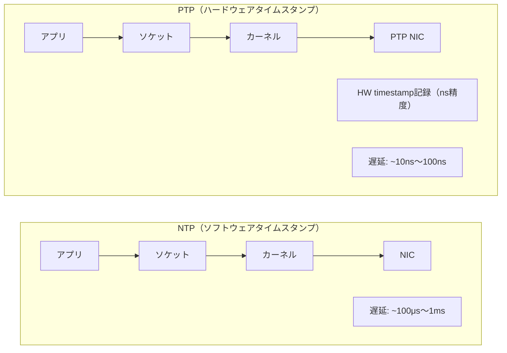

### 3.2 PTPのアーキテクチャ

PTPは**グランドマスタークロック（Grandmaster Clock）**を頂点とする階層構造を持つ。

**Grandmaster Clock**：最も精度の高い時刻源（GPS受信機や原子時計に接続されたサーバー）。ネットワーク全体の時刻基準となる。

**Transparent Clock（TC）**：ネットワークスイッチに実装され、パケットがスイッチを通過する際の遅延を計測してメッセージに記録する。これにより、ネットワーク機器での遅延が精度に影響しなくなる。

**Boundary Clock（BC）**：大規模なネットワークを分割し、Grandmasterからのドメインとローカルドメインの橋渡しをする。

PTPが達成できる精度は環境に依存するが、PTP対応スイッチを使用した同一データセンター内では **100ns〜1μs** の精度が実現可能である。Transparent ClockはPTPに対応したスイッチが必要だが、対応機器は近年急速に普及している。

### 3.3 PTPの応用

PTPは以下の分野で広く使われている。

- **通信インフラ**：5G基地局の同期（3GPP標準はPTPを要求）
- **高頻度取引（HFT）**：ナノ秒精度の取引タイムスタンプ
- **電力系統**：IEC 61850規格による変電所の同期
- **製造業**：産業用イーサネット（EtherNet/IP、PROFINET）での機器同期
- **データセンター**：AWSやGoogleの内部ネットワーク

Linuxでは `linuxptp` パッケージが標準的なPTPデーモン実装として使われる。

## 4. Lamport論理時計とVector Clockの概要

### 4.1 物理時計の限界への論理的応答

1978年、Leslie LamportはNTPのような物理時計の精度向上とは全く異なるアプローチを提案した。「時計の精度を上げるのではなく、因果関係そのものを追跡する」という考え方である。Lamportは分散システム内のイベント間の**happens-before関係** $\rightarrow$ を定義し、これを論理カウンタで追跡する**Lamport Clock**を発明した。

Lamport Clockの本質は、イベント $a$ が $b$ に因果的に先行するなら $C(a) < C(b)$ が保証されることにある。しかし逆（$C(a) < C(b) \implies a \rightarrow b$）は成り立たないため、並行イベントを区別できないという限界がある。

$$a \rightarrow b \implies C(a) < C(b) \quad \text{（成立）}$$
$$C(a) < C(b) \implies a \rightarrow b \quad \text{（不成立）}$$

1988年にColin FidgeとFriedemann Matternが独立に提案した**Vector Clock**は、各プロセスが全プロセスのカウンタのベクトルを保持することで、この限界を克服する。Vector Clockは因果的順序の**必要十分条件**を提供する。

$$a \rightarrow b \iff V(a) < V(b)$$

ただしVector Clockはプロセス数 $n$ に比例した $O(n)$ の空間・通信オーバーヘッドを持つため、大規模システムでの適用には工夫が必要である。

> [!NOTE]
> Lamport ClockとVector Clockのアルゴリズム詳細、証明、実装例については「論理時計 — Lamport ClockとVector Clockによる因果順序の追跡」で徹底的に解説している。本節はHLCの背景として最低限の概要を示すに留める。

## 5. Hybrid Logical Clock（HLC）

### 5.1 二つのアプローチの融合

物理時計（NTP）と論理時計（Lamport Clock）は、それぞれに強みと弱みがある。

| | 物理時計（NTP） | Lamport Clock | 理想 |
|---|---|---|---|
| 因果的順序の保証 | なし | あり | あり |
| 実時間との対応 | あり | なし | あり |
| タイムスタンプのサイズ | 64bit | 64bit | 64bit |
| クロックスキューへの耐性 | なし | あり | あり |
| 実時間ベースのクエリ | 可能 | 不可能 | 可能 |

**Hybrid Logical Clock（HLC）** は2014年にSandeep Kulkarni、Murat Demirbas、Bharadwaj Madeppa、Bharadwaj Avva、Lisa Lionettiによって提案された手法で、物理時計の「実時間との対応」と論理時計の「因果的順序の保証」を単一の64ビットタイムスタンプで両立させることを目指す。

論文タイトル「Logical Physical Clocks and Consistent Snapshots in Globally Distributed Databases」（Principles of Distributed Systems, 2014）が示す通り、グローバルに分散したデータベースでの整合的なスナップショットを動機としている。

### 5.2 HLCの設計思想

HLCのキーとなる洞察は以下の通りである。

**物理時計の役割の再定義**：物理時計の値を「確実な時刻」としてではなく、「ヒント」として扱う。物理時計は因果的順序の補助として使うが、因果的保証は論理カウンタが担う。

**物理時計の近似値の維持**：タイムスタンプの論理コンポーネント $l$ は、物理時計の値 $pt$ に可能な限り追随する。具体的には、$l \geq pt$ を常に維持しつつ、$l - pt$ が小さく抑えられるよう設計する。

**論理コンポーネントの使い捨て**：同一の物理時刻内に複数のイベントが発生したときにのみ、論理カウンタ $c$ を使ってタイブレイクを行う。物理時刻が進めば $c$ はリセットされる。

### 5.3 HLCのアルゴリズム詳細

各プロセスは2つの値を保持する。

- $l$：物理時計の最大値の近似（the largest physical time seen）
- $c$：同じ $l$ 値内での論理カウンタ（tiebreaker within the same $l$）

物理時計の現在値を $pt$ とする。

> **ローカルイベントまたはメッセージ送信時（Send）**：
> $$l_{\text{old}} \leftarrow l$$
> $$l \leftarrow \max(l_{\text{old}}, pt)$$
> $$c \leftarrow \begin{cases} c + 1 & \text{if } l = l_{\text{old}} \\ 0 & \text{if } l > l_{\text{old}} \end{cases}$$
> タイムスタンプとして $(l, c)$ を付与する。

> **メッセージ受信時（Receive）**（受信メッセージのタイムスタンプを $(l_m, c_m)$ とする）：
> $$l_{\text{old}} \leftarrow l$$
> $$l \leftarrow \max(l_{\text{old}}, l_m, pt)$$
> $$c \leftarrow \begin{cases}
>     \max(c, c_m) + 1 & \text{if } l = l_{\text{old}} = l_m \\
>     c + 1 & \text{if } l = l_{\text{old}} \neq l_m \\
>     c_m + 1 & \text{if } l = l_m \neq l_{\text{old}} \\
>     0 & \text{if } l = pt > l_{\text{old}} \text{ かつ } l > l_m
> \end{cases}$$

この更新ルールは一見複雑に見えるが、本質的には「現在知っている最大の物理時刻に追随しつつ、同一物理時刻内では論理カウンタで因果順序を維持する」という単純なアイデアである。

### 5.4 HLCの擬似コード実装

```python
import time
from dataclasses import dataclass

@dataclass
class HLCTimestamp:
    l: int  # physical component (milliseconds since epoch)
    c: int  # logical counter (tiebreaker)

    def __lt__(self, other: 'HLCTimestamp') -> bool:
        # Lexicographic comparison: (l, c)
        return (self.l, self.c) < (other.l, other.c)

    def __le__(self, other: 'HLCTimestamp') -> bool:
        return (self.l, self.c) <= (other.l, other.c)

    def pack_64bit(self) -> int:
        """Pack into 64-bit integer: 48 bits for l, 16 bits for c."""
        # Assumes l fits in 48 bits (~year 8921 in ms) and c < 65536
        return (self.l << 16) | (self.c & 0xFFFF)

    @classmethod
    def unpack_64bit(cls, packed: int) -> 'HLCTimestamp':
        return cls(l=packed >> 16, c=packed & 0xFFFF)


class HybridLogicalClock:
    def __init__(self):
        self.l: int = 0
        self.c: int = 0

    def _pt_ms(self) -> int:
        """Return current physical time in milliseconds."""
        return int(time.time() * 1000)

    def send(self) -> HLCTimestamp:
        """Generate timestamp for a local event or outgoing message."""
        pt = self._pt_ms()
        l_old = self.l
        self.l = max(l_old, pt)
        if self.l == l_old:
            self.c = self.c + 1
        else:
            self.c = 0
        return HLCTimestamp(self.l, self.c)

    # Alias for clarity
    local_event = send

    def receive(self, msg_ts: HLCTimestamp) -> HLCTimestamp:
        """Update clock upon receiving a message with given timestamp."""
        pt = self._pt_ms()
        l_old = self.l
        l_m, c_m = msg_ts.l, msg_ts.c

        self.l = max(l_old, l_m, pt)

        if self.l == l_old == l_m:
            # Both local and message timestamps match: take max counter + 1
            self.c = max(self.c, c_m) + 1
        elif self.l == l_old:
            # Local timestamp dominates: increment local counter
            self.c = self.c + 1
        elif self.l == l_m:
            # Message timestamp dominates: take message counter + 1
            self.c = c_m + 1
        else:
            # Physical clock dominates: reset counter
            self.c = 0

        return HLCTimestamp(self.l, self.c)

    def now(self) -> HLCTimestamp:
        """Get current HLC timestamp without causal event."""
        return HLCTimestamp(max(self.l, self._pt_ms()), self.c)
```

### 5.5 HLCの重要な性質

**性質1：因果的順序の保証**

$$a \rightarrow b \implies HLC(a) < HLC(b) \quad \text{（辞書式順序）}$$

これはLamport Clockと同じ保証である（逆は必ずしも成り立たない）。

**性質2：物理時計との近接性**

任意のイベント $e$ のタイムスタンプ $(l_e, c_e)$ について：

$$l_e \geq pt_e \quad \text{（物理時計以上）}$$
$$l_e - pt_e \leq \epsilon \quad \text{（物理時計との乖離は有界）}$$

ここで $\epsilon$ はシステム内の最大クロックスキューの2倍程度に制限される。物理時計が進めば $l$ もそれを追う設計になっているためである。

**性質3：64ビットへの収納**

実際のシステムでは、64ビット整数の上位48ビットに物理時計のミリ秒値、下位16ビットに論理カウンタ $c$ を格納する。16ビットの $c$（最大65535）は、同一ミリ秒内に65536回以上の連続したイベントが発生しない限り溢れない。これは実用上ほとんど問題にならない。

```
63                   16 15             0
+----------------------+---------------+
| Physical time (ms)   | Counter (c)   |
| 48 bits              | 16 bits       |
+----------------------+---------------+
```

::: tip HLCとLamport Clockの比較
HLCはLamport Clockの拡張と見なせる。Lamport Clockが純粋な論理カウンタであるのに対し、HLCは物理時計の値をカウンタの下限として使う。物理時計が常に前進する通常の状況では、HLCのタイムスタンプは実時間に近い意味のある値を持つ。クロックスキューや一時的な時刻の逆転が発生した場合は、論理カウンタが因果的順序を保護する。
:::

### 5.6 CockroachDBでのHLC実装

**CockroachDB**はGoogle Spannerに触発された分散SQLデータベースであり、HLCをトランザクション管理の中心に据えている。

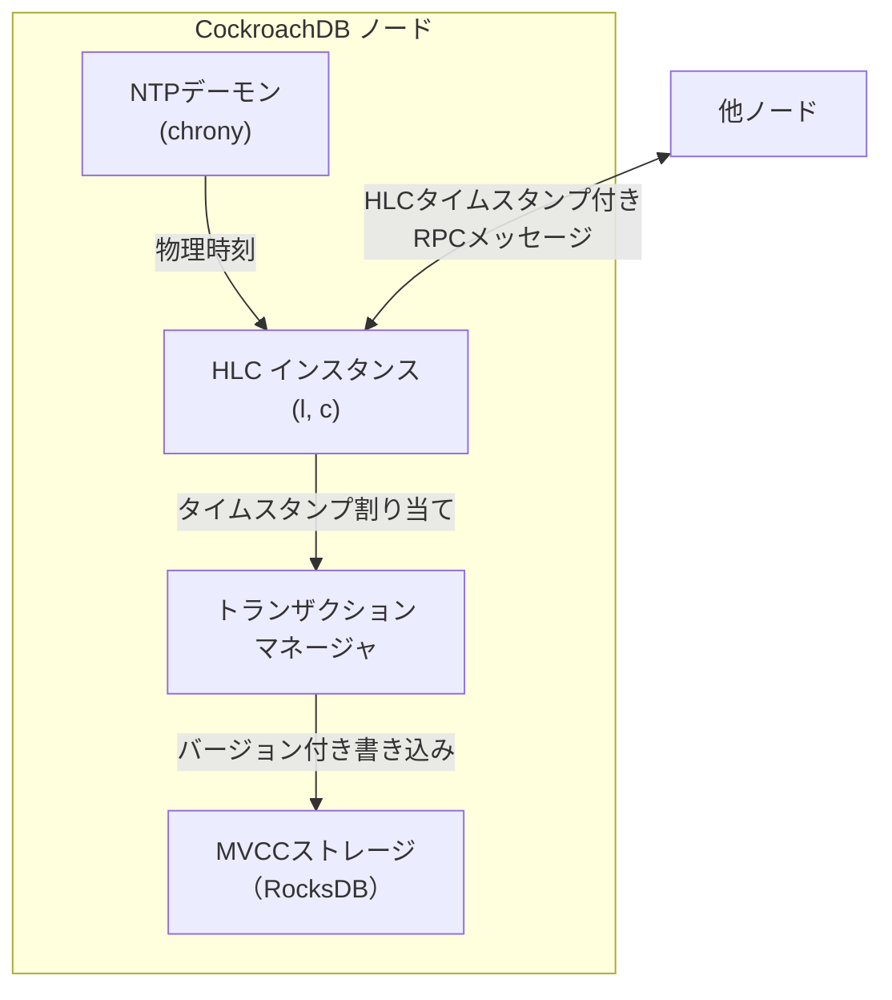

CockroachDBにおけるHLCの具体的な役割：

**1. トランザクションタイムスタンプの割り当て**

各トランザクションが開始されると、開始ノードのHLCからタイムスタンプが割り当てられる。このタイムスタンプは、MVCCの書き込みバージョンとして使用される。HLCにより、因果的に先行するトランザクションは必ず小さいタイムスタンプを持つことが保証される。

**2. 不確実性ウィンドウ（Uncertainty Window）**

CockroachDBはNTPによるクロックスキューを前提とし、読み取り操作に「不確実性ウィンドウ」の概念を導入している。

読み取りタイムスタンプが $t_r$ のトランザクションは、タイムスタンプが $[t_r, t_r + \text{max\_clock\_offset}]$ の範囲にある書き込みを「不確実」として扱う。不確実な書き込みを発見した場合、トランザクションのタイムスタンプを不確実な書き込みより大きな値に押し上げてリトライする。

```
max_clock_offset = 500ms (デフォルト)

Read at ts=100:
  - ts <= 100: definitely happened before → read it
  - 100 < ts <= 600: uncertain → may have happened before or after
    → restart transaction with ts > uncertain_write_ts
  - ts > 600: definitely happened after → ignore
```

この仕組みにより、CockroachDBはクロックスキューが `max_clock_offset` 以内であれば、Serializableな分離レベルを保証する。

**3. クロックスキューの監視**

CockroachDBは全ノード間のクロックスキューを常時監視し、`max_clock_offset`（デフォルト500ms）を超えるスキューが検出された場合、そのノードをクラスタから切り離す（フェイルセーフ）。

```sql
-- CockroachDB: view node clock information
SELECT node_id, address, clock_offset_nanos
FROM crdb_internal.gossip_nodes
ORDER BY clock_offset_nanos DESC;
```

## 6. Google TrueTime

### 6.1 TrueTimeの革命的なアプローチ

2012年のGoogle Spanner論文（"Spanner: Google's Globally-Distributed Database"）で公開されたTrueTimeは、分散システムの時刻問題に対する最もラディカルな解決策を提示した。

NTPやHLCが「時刻の不確実性を隠蔽する」のに対し、TrueTimeは「**時刻の不確実性を明示的にAPIで公開する**」という逆転の発想をとる。

TrueTime APIは3つのメソッドのみからなる。

| メソッド | 戻り値 | 説明 |
|---------|--------|------|
| `TT.now()` | `TTinterval: [earliest, latest]` | 現在時刻の区間推定 |
| `TT.after(t)` | `bool` | 真の現在時刻が $t$ より後か？ |
| `TT.before(t)` | `bool` | 真の現在時刻が $t$ より前か？ |

`TT.now()` は「現在の絶対時刻は必ず $[earliest, latest]$ の範囲内にある」という区間を返す。この区間を**不確実性区間（Uncertainty Interval）**と呼ぶ。

$$TT.now() = [\tau - \epsilon, \tau + \epsilon]$$

ここで $\tau$ は真の絶対時刻、$\epsilon$ は不確実性の半幅（現在は通常1〜7ミリ秒）。

### 6.2 TrueTimeのハードウェアインフラ

TrueTimeの精度を支えるのは、Googleが独自に構築した時刻同期インフラである。

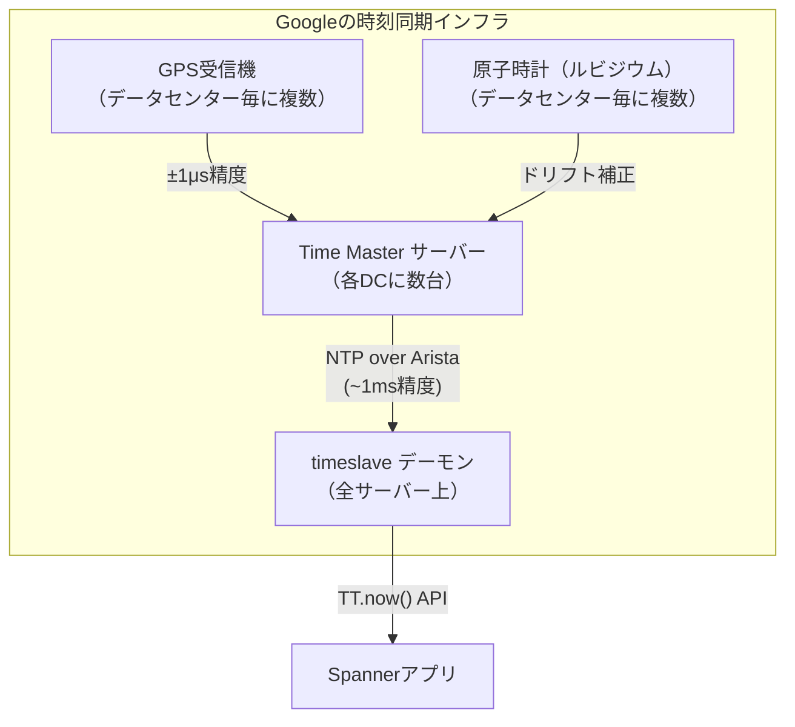

**GPS受信機の役割**：GPS信号は原子時計（セシウム）に同期しており、±1マイクロ秒以内の精度で協定世界時（UTC）を提供する。各Googleデータセンターには複数のGPS受信機が設置されており、単一障害点を排除している。

**原子時計の役割**：GPS信号が一時的に失われた場合（遮蔽、妨害等）でも、ルビジウム発振器がドリフトを最小限に抑えながら時刻を保持する。ルビジウム発振器のドリフトは $10^{-11}$ 秒/秒程度で、GPSなしで数分間は高精度を維持できる。

**Time Masterの役割**：GPS受信機と原子時計の両方を参照し、不確実性区間 $\epsilon$ を計算して提供する。複数のTime Masterを比較し、外れ値を検出・除外する。

**timeslaveデーモン**：全サーバーで動作し、Time Masterから時刻と不確実性を受け取り、`TT.now()` APIを提供する。Time Masterへのポーリングは30秒ごとで、ポーリング間の不確実性はローカルクロックのドリフト推定から計算する。

> [!NOTE]
> 2012年の論文発表時点でのTrueTimeの典型的な不確実性は1〜7ミリ秒だった。その後のインフラ改善により、現在はさらに小さい不確実性を達成していると報告されている。

### 6.3 TrueTimeによる外部一貫性の保証

TrueTimeの真価は、**外部一貫性（External Consistency）**の保証にある。これはSerializabilityより強い保証で、以下のように定義される。

> **外部一貫性**：
> トランザクション $T_1$ がコミットを完了した後にトランザクション $T_2$ が開始した場合（現実世界の時間において）、$T_2$ のコミットタイムスタンプは $T_1$ のコミットタイムスタンプより大きい。

これは「データベースの外側から見た時間の流れと、データベース内部のトランザクション順序が一致する」という保証であり、分散システムで実現することは本質的に困難だ。なぜなら、「現実世界で $T_1$ のコミット後に $T_2$ が開始した」という事実は、ノードが異なれば直接観測できないためである。

TrueTimeはこの問題を**コミット待機（Commit Wait）**プロトコルで解決する。

### 6.4 コミット待機プロトコル

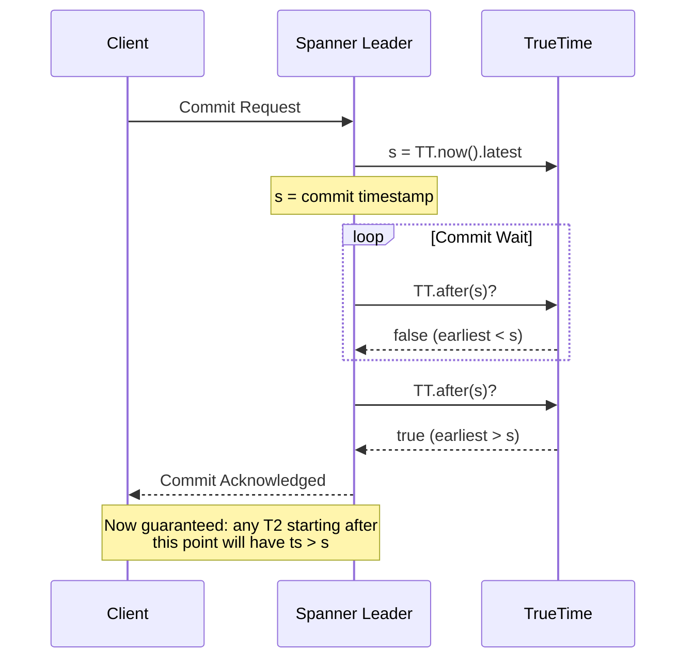

プロトコルの詳細：

**1. タイムスタンプの割り当て**：
コミット準備ができた時点で `TT.now().latest` を取得し、これをコミットタイムスタンプ $s$ とする。

$$s = TT.now().latest$$

**2. コミット待機**：
`TT.after(s)` が `true` になる（`TT.now().earliest > s`）まで待機する。

$$\text{wait until } TT.after(s), \text{ i.e., } TT.now().earliest > s$$

**3. コミット完了**：
待機が終わった後にコミットを完了する。

この待機が保証するのは以下のことである。コミット完了時点では `TT.now().earliest > s` であるから、現実の真の時刻 $\tau$ について：

$$\tau > TT.now().earliest > s$$

つまり、コミットが完了した現実の時刻は、コミットタイムスタンプ $s$ より後である。

なぜこれが外部一貫性を保証するかを示す。

$T_1$ がコミット完了した現実の時刻を $t_1^*$、$T_2$ が開始した現実の時刻を $t_2^*$ とし、$t_1^* < t_2^*$ とする（$T_1$ のコミット後に $T_2$ が開始）。

- $T_1$ のコミット完了時：$t_1^* > s_1$（コミット待機の保証）
- $T_2$ の開始時：$t_2^* > t_1^* > s_1$
- $T_2$ のタイムスタンプ：$s_2 \geq TT.now().earliest = t_2^* - \epsilon \geq s_1 + (t_2^* - t_1^*) - \epsilon$

$T_2$ が $T_1$ の完了後に開始するという事実と、コミット待機プロトコルにより、$s_2 > s_1$ が保証される。$\square$

### 6.5 コミット待機の遅延コスト

コミット待機は外部一貫性のために遅延を導入する。待機時間は不確実性区間 $2\epsilon$ に相当し、TrueTimeの典型値1〜7msに対応する。

$$\text{commit wait} \approx 2\epsilon \approx 1\text{〜}14\text{ ms}$$

これはLatency-sensitiveなワークロードには無視できないコストだが、グローバルに分散したトランザクション処理においては許容できると設計者は判断した。

興味深いのは、このコミット待機の遅延こそがTrueTimeの「正直な不確実性の開示」のコストであることだ。不確実性を隠蔽する従来のアプローチでは、このコストを明示的に払わない代わりに、一貫性の保証が弱くなる。

::: details TrueTimeとSerializabilityの関係

外部一貫性はSerializabilityより強い概念である。

- **Serializability**：トランザクションが何らかの逐次実行順序と等価であること（その順序は現実時間と一致しなくてよい）
- **External Consistency（Linearizability at transaction level）**：逐次実行順序が現実の時間順序と一致すること

Spannerの外部一貫性は、分散データベースにおける**Strict Serializability**（あるいはOne-copy Serializabilityとも呼ばれる）の実現を意味する。これは理論的に可能な最も強い整合性保証のひとつである。

:::

### 6.6 Spannerでの活用

TrueTimeはSpannerのさまざまな機能を支える基盤となっている。

**読み取り専用トランザクション（Read-Only Transactions）**：
Spannerの読み取り専用トランザクションはロックを取得せず、タイムスタンプ $t$ 時点でのスナップショットを読み取る。TrueTimeにより、「$t$ の直前にコミットしたすべての書き込みが可視である」ことが保証される。

$$\text{snapshot read at } t \text{: reads all commits with } s \leq t$$

**スキーマ変更のトランザクション**：
Spannerのスキーマ変更（DDL）は、TrueTimeを使って未来のタイムスタンプに予約される。例えば「5分後からこのスキーマ変更を有効にする」という操作を原子的に行える。

**データベース監査（Point-in-time reads）**：
任意の過去の時刻を指定してデータを読み取ることができる。TrueTimeによりタイムスタンプが実時間に対応しているため、「2026年1月1日0時0分時点のデータ」という直感的な操作が可能になる。

```sql
-- Spanner: read data as of a specific timestamp
SELECT * FROM orders
AS OF SYSTEM TIME '2026-01-01 00:00:00 UTC';
```

## 7. Amazon Time Sync Service

### 7.1 クラウド環境での時刻同期

クラウドプロバイダにとって、仮想マシンの正確な時刻同期は重大な課題である。仮想化環境では、ゲストOSのクロックがホストのスケジューリングによって影響を受け、精度が著しく低下することがある。

**Amazon Time Sync Service**は、AWSが2017年に公開した高精度時刻同期サービスである。すべてのEC2インスタンスに対して、169.254.169.123というリンクローカルアドレス経由でアクセスできる。

### 7.2 アーキテクチャとインフラ

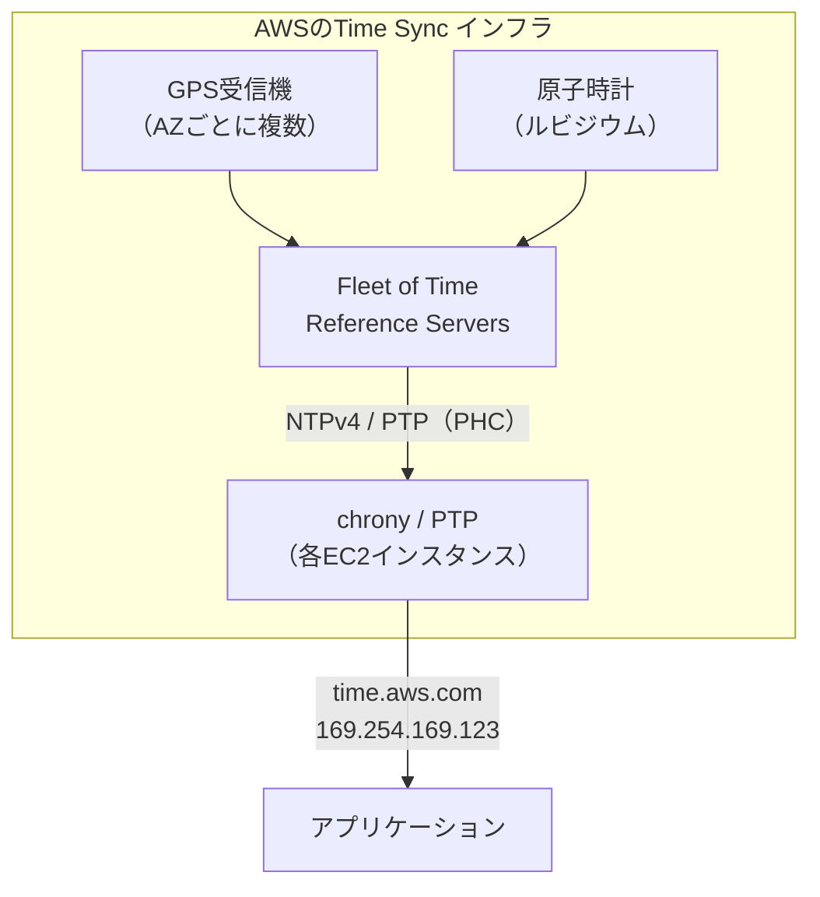

AWSのTime Sync Serviceは、各Availability Zone（AZ）に原子時計とGPS受信機を配備している。EC2インスタンスからはNTPv4プロトコルでアクセスでき、同一ハイパーバイザ上のインスタンスではPHC（Physical Hardware Clock）経由でさらに高精度な同期も可能である。

2021年にはPTPをサポートするEC2インスタンスタイプが追加され、マイクロ秒レベルの精度を達成できるようになった。

### 7.3 Chronyd設定例

```bash
# /etc/chrony.conf for AWS EC2
# Use AWS Time Sync Service as primary source
server 169.254.169.123 prefer iburst minpoll 4 maxpoll 4

# AWS-provided NTP sources as fallback
server 0.amazon.pool.ntp.org iburst
server 1.amazon.pool.ntp.org iburst

# Allow for clock adjustments
makestep 1.0 3
rtcsync

# Reduce allowed clock offset for tighter monitoring
maxdistance 1.0
```

### 7.4 クラウドにおけるPTPサポート

AWS Nitro SystemベースのEC2インスタンス（m6i、c6i、r6i等）では、PTP経由でハイパーバイザのクロックと直接同期できる。

```bash
# Check if PTP hardware clock is available
ls /dev/ptp*
# Output: /dev/ptp0

# Check PTP clock offset
phc_ctl /dev/ptp0 get

# Configure chronyd to use PTP hardware clock
cat >> /etc/chrony.conf << 'EOF'
# Use PTP hardware clock for sub-microsecond accuracy
refclock PHC /dev/ptp0 poll 2 dpoll -2 offset 0 trust prefer
EOF
```

## 8. 時刻に基づくスナップショット分離

### 8.1 MVCC（多版型同時実行制御）と時刻

現代の分散データベースの多くは、**MVCC（Multi-Version Concurrency Control）**を採用している。MVCCでは、データの各バージョンにタイムスタンプを付与し、読み取りトランザクションがスナップショットを取得することでロックなしの読み取りを実現する。

分散システムでのMVCCにおいて、時刻同期は以下の観点で重要になる。

- **読み取りタイムスタンプの選択**：スナップショットの一点として「どの時刻を選ぶか」
- **書き込みタイムスタンプの割り当て**：データのバージョンに付与するタイムスタンプ
- **スナップショットの整合性**：選んだ時刻時点でのデータが全ノード間で一貫しているか

### 8.2 分散スナップショット読み取りの課題

分散データベースでスナップショット読み取りを実装する際の核心的な問題は、「時刻 $t$ 時点でのスナップショット」が全ノードで整合しているかである。

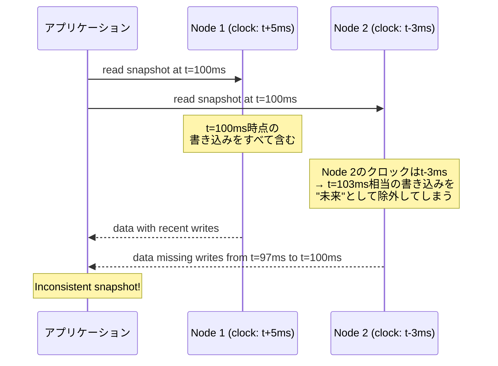

この問題への対処アプローチは複数ある。

### 8.3 アプローチ1：安全なスナップショットタイムスタンプ（Spanner方式）

Spannerでは、スナップショット読み取りタイムスタンプとして、すべてのノードが「その時刻以前の書き込みはすべてコミット済みである」と確信できる時刻を使う。

具体的には、各ノードが定期的に「私はこの時刻以前のすべての書き込みをコミット済みにした」という**セーフタイム（safe time）**を報告する。スナップショット読み取りは、すべてのシャード（データパーティション）のセーフタイムのうち最小値より前の時刻に対してのみ実行できる。

$$t_{\text{snapshot}} < \min(\text{safe\_time across all shards})$$

TrueTimeとセーフタイムを組み合わせることで、外部一貫性を維持したままのスナップショット読み取りが可能になる。

### 8.4 アプローチ2：不確実性ウィンドウの待機（CockroachDB方式）

CockroachDBは、スナップショット読み取りの際に不確実な書き込みを発見した場合、タイムスタンプを押し上げてリトライする方式をとる。

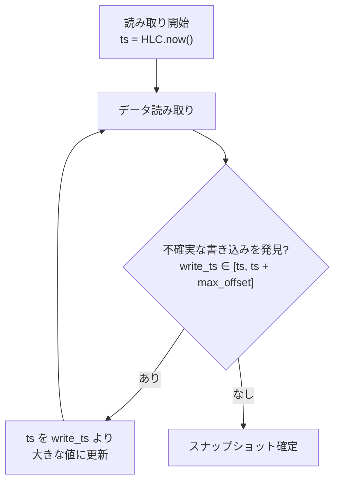

このアプローチはリトライのコストがあるが、特殊なハードウェアを必要とせず、既存のNTPインフラ上で動作する利点がある。

### 8.5 アプローチ3：Causally Consistent Snapshots

Vector Clockを使うシステムでは、「タイムスタンプ $t$ 以前」という絶対時刻ではなく、「バージョン $V$ 以前の因果的に先行するすべての書き込みを含む」という因果的スナップショットを実現できる。

このアプローチは物理時計に依存しないが、Vector Clockのサイズスケーリング問題を持つ。大規模システムでの適用には工夫が必要である。

### 8.6 時刻精度とコミットレイテンシのトレードオフ

時刻同期の精度とトランザクションのコミットレイテンシの間には根本的なトレードオフがある。

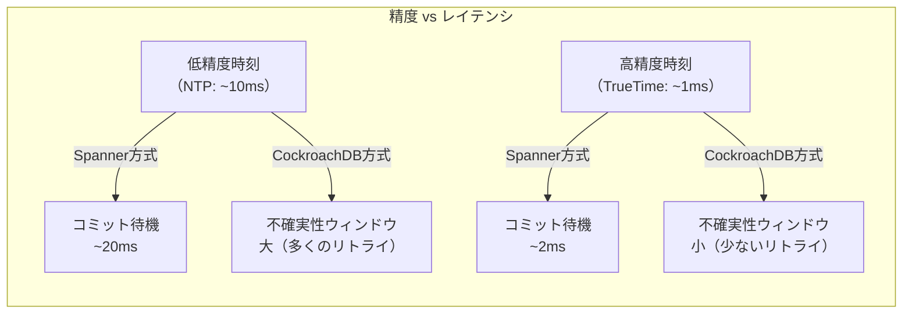

Googleが原子時計とGPSに多大な投資をした理由の一つは、この不確実性を小さくすることでコミットレイテンシを削減し、リトライを減らすためでもある。

## 9. 時刻同期技術の比較と選択

### 9.1 技術マップ

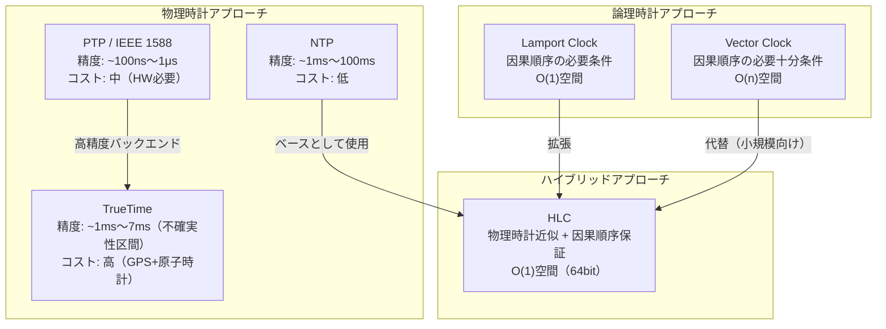

### 9.2 システム別の採用実績

| システム | 採用技術 | 保証する整合性 | 備考 |
|---------|---------|--------------|------|
| Google Spanner | TrueTime | External Consistency | GPS+原子時計インフラ |
| CockroachDB | HLC | Serializable | NTP依存、max_offset設定 |
| YugabyteDB | HLC | Serializable | CockroachDB同様のアプローチ |
| Amazon DynamoDB | タイムスタンプ（LWW） | Eventual Consistency | 基本的にLast-Writer-Wins |
| Cassandra | ハイブリッドタイムスタンプ | Eventual Consistency | lwt（Lightweight Transactions）はPaxos |
| TiDB（TiKV） | TSO（Timestamp Oracle） | Snapshot Isolation | 中央集権的タイムスタンプサーバー |
| FoundationDB | バージョン管理（論理） | Serializable | 中央集権的バージョンカウンタ |

### 9.3 技術選択のガイドライン

実際のシステム設計において、どの時刻同期技術を選ぶべきかは以下の観点で判断する。

**必要な整合性レベル**：
- External Consistency（現実時間との一致）が必要 → TrueTime（またはそれ相当のインフラ）
- Serializable（論理的な直列化可能性）で十分 → HLC + 不確実性ウィンドウ
- Causal Consistency（因果的一貫性）で十分 → Vector Clock / HLC
- Eventual Consistency（結果整合性）で十分 → NTP + LWW

**ハードウェア制約**：
- 独自のデータセンターインフラがある → PTP / TrueTime相当を検討
- クラウド環境（AWS/GCP/Azure） → 提供されるTime Sync Serviceを活用
- 汎用環境 → NTP + HLC

**スケール**：
- プロセス数が少ない（〜100ノード） → Vector Clockも選択肢
- 大規模（1000+ノード） → HLC or 中央集権的タイムスタンプサーバー

**レイテンシ要件**：
- サブミリ秒のコミットレイテンシが必要 → 高精度時刻 + HLC
- ミリ秒〜数十ミリ秒が許容できる → TrueTimeのコミット待機も選択肢

## 10. 実装上の落とし穴と対策

### 10.1 時刻の単調性をどう保証するか

多くのプログラミング言語・フレームワークが提供する `current time` 系の関数は、NTP同期による時刻の巻き戻りに無防備である。

```python
import time

# Dangerous: can return values that go backward due to NTP sync
def get_current_time_unsafe():
    return time.time()  # May return smaller value than previous call

# Safer: use monotonic clock for duration measurement
def measure_duration(func):
    start = time.monotonic()  # Never goes backward
    result = func()
    elapsed = time.monotonic() - start  # Always positive
    return result, elapsed

# For distributed timestamps: use HLC
hlc = HybridLogicalClock()
ts1 = hlc.send()  # Always monotonically increasing within a node
ts2 = hlc.send()  # ts2 > ts1 guaranteed
```

Javaでは `System.currentTimeMillis()` は壁時計時間（巻き戻りあり）、`System.nanoTime()` は単調時計（巻き戻りなし）である。分散システムのタイムスタンプに `nanoTime()` を使うのは誤りで、ノード間で比較できない。

### 10.2 うるう秒の処理

うるう秒（leap second）は協定世界時（UTC）と地球の自転時間のずれを補正するために定期的に挿入される。うるう秒の挿入時、多くのOSでは同じ秒が2回カウントされるか、または1秒のジャンプが発生する。これは分散システムに深刻な障害を引き起こしてきた。

2012年6月のうるう秒挿入時に、Reddit、Mozilla、Linkedinなどが障害を経験した。多くのシステムがLinuxカーネルのうるう秒処理バグによりCPU使用率100%になった。

**対策1：うるう秒のスミアリング（Leap Second Smearing）**：
Googleは「うるう秒スミアリング」を提案・実施している。うるう秒を挿入する代わりに、前後数時間にわたって1秒分のずれを少しずつ吸収する方法である。AWSやGCPも同様の手法を採用している。

$$\text{Smearing: 1 second spread over} \pm 12 \text{ hours} \approx 11.57 \mu\text{s/s}$$

**対策2：TAI（International Atomic Time）の使用**：
うるう秒を含まない原子時刻スケールTAI（Temps Atomique International）を内部時計として使用し、ユーザー向けにのみUTCに変換する方法。LinuxのPTP実装はTAIをサポートしている。

### 10.3 タイムゾーンと夏時間

分散システムでは、タイムスタンプを常にUTC（協定世界時）で保持・比較すべきである。タイムゾーンや夏時間（DST: Daylight Saving Time）の扱いをアプリケーション層で行うことで、以下の問題を回避できる。

- 夏時間の切り替え時に同じローカル時刻が2回現れる（例：2:00 AM → 1:00 AM）
- 異なるタイムゾーンのノード間での比較が誤る
- タイムゾーンデータベースの更新遅れによる変換エラー

### 10.4 分散システムにおける時刻のアンチパターン

```python
# ANTI-PATTERN 1: Using wall clock for distributed ordering
import datetime

def bad_write(key, value):
    # Wall clock timestamp for ordering: DANGEROUS
    timestamp = datetime.datetime.now().timestamp()
    store.write(key, value, timestamp=timestamp)
    # Problem: concurrent writes on different nodes may have
    # inverted timestamps due to clock skew

# BETTER: Use HLC for distributed ordering
def good_write(key, value, hlc: HybridLogicalClock):
    ts = hlc.send()  # Causally-ordered, close to physical time
    store.write(key, value, timestamp=ts.pack_64bit())

# ANTI-PATTERN 2: Assuming system time is monotone
last_ts = 0

def bad_generate_id():
    ts = int(time.time() * 1000)
    if ts <= last_ts:
        # NTP may have moved clock backward, causing collision!
        ts = last_ts  # This silently generates duplicate IDs!
    return ts

# BETTER: Always handle backward time explicitly
def good_generate_id(hlc: HybridLogicalClock):
    # HLC guarantees monotonicity within a node
    return hlc.send().pack_64bit()

# ANTI-PATTERN 3: Comparing HLC timestamps across different epoch configs
# HLC timestamps are only comparable within the same system.
# Comparing with external systems requires careful coordination.
```

## 11. まとめ：分散システムにおける時刻の全体像

分散システムにおける時刻の問題は、コンピュータサイエンスにおいて最も深い問題のひとつである。物理的な制約（光速、量子効果による発振子のゆらぎ）から、ネットワークの非決定性、ソフトウェアの複雑性まで、多層的な問題が絡み合っている。

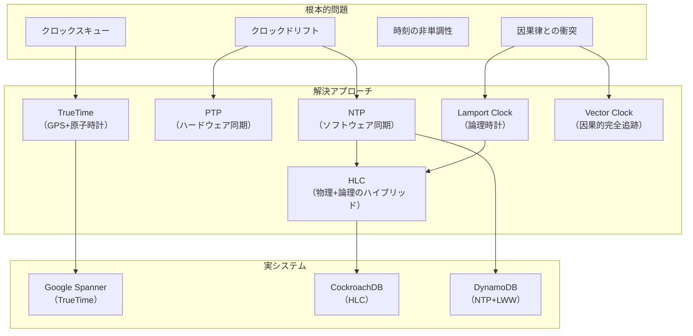

### 11.1 各アプローチの本質的な洞察

**NTP**：「物理時計をできるだけ正確に合わせれば、分散システムは単一システムに近い振る舞いをする」。シンプルだが、精度に本質的な限界があり、一貫性の保証は弱い。

**Lamport Clock**：「物理時間の絶対的な共有は不可能だが、イベント間の因果関係は追跡できる。因果関係だけを正確に記録すれば分散システムの正確性は保てる」。論理的に美しいが、実時間との対応がなく、並行イベントを区別できない。

**Vector Clock**：「各ノードが全ノードの因果的履歴を保持することで、並行イベントまで正確に検出できる」。理論的には完全だが、スケールしない。

**HLC**：「物理時計は不完全だが有用な情報を含む。論理カウンタを安全網として使いながら、物理時計の実時間情報をできるだけ保持する」。実用性と理論的保証のバランスが優れており、多くの現代的分散データベースが採用している。

**TrueTime**：「不確実性を隠蔽するのではなく、正直に公開する。そしてその不確実性が解消されるまで待てば、外部一貫性を保証できる」。最も強い保証だが、特殊なハードウェアインフラと遅延コストを要する。

### 11.2 今後の展望

**クラウドネイティブなTrueTime**：AWSやGoogleが独自の高精度時刻サービスをクラウドユーザーに提供することで、TrueTimeに近い保証をコモディティ化しようとしている。AWSのEC2 Time Sync ServiceのPTPサポート、GCPのChronosサービスはその流れである。

**Chip-Scale Atomic Clock（CSAC）**：米国DARPA等が開発を進めるCSACは、消費電力120mWで腕時計サイズの原子時計を実現する。これが普及すれば、データセンターに限らず多くのノードが高精度な時刻源を内蔵できるようになる。

**量子時計と相対論的補正**：GPS衛星の原子時計は、一般相対性理論・特殊相対性理論による時間の遅れ・進みを補正して地上の時刻に一致させている（GPSが約38マイクロ秒/日の補正を行っている）。将来の分散システムが宇宙規模になれば（月面基地など）、相対論的補正は設計上の現実的な問題になるだろう。

**形式的検証**：TLA+やIsa/HOLなどの形式検証ツールを使い、時刻同期プロトコルの正確性を証明する試みが進んでいる。CockroachDBチームはTLA+によるHLC実装の正確性を検証している。

分散システムにおける時刻の問題は、「解決された問題」ではなく、技術とアプリケーションの進化とともに新しい側面が常に現れる、生きた問題領域である。NTPからTrueTime、HLCへの技術的発展は、「時刻とは何か」という根本的な問いに対するコンピュータサイエンスの応答の歴史でもある。
