# 分散トレーシング（OpenTelemetry）

## 1. 分散トレーシングの必要性

### 1.1 マイクロサービス時代のデバッグという悪夢

モノリシックなアプリケーションでは、1つのリクエストがたどる経路は比較的明確だった。スタックトレースを見れば、関数呼び出しの連鎖をたどって問題箇所を特定できた。ログファイルも1か所に集約されており、タイムスタンプで追跡すれば原因究明は難しくなかった。

しかし、マイクロサービスアーキテクチャの台頭によって状況は一変した。ユーザーが1回ボタンを押しただけで、そのリクエストは API Gateway、認証サービス、商品カタログサービス、在庫サービス、決済サービス、通知サービスなど、数十のサービスを横断する可能性がある。あるリクエストが遅いとき、どのサービスがボトルネックなのか？あるエラーが発生したとき、根本原因はどこにあるのか？

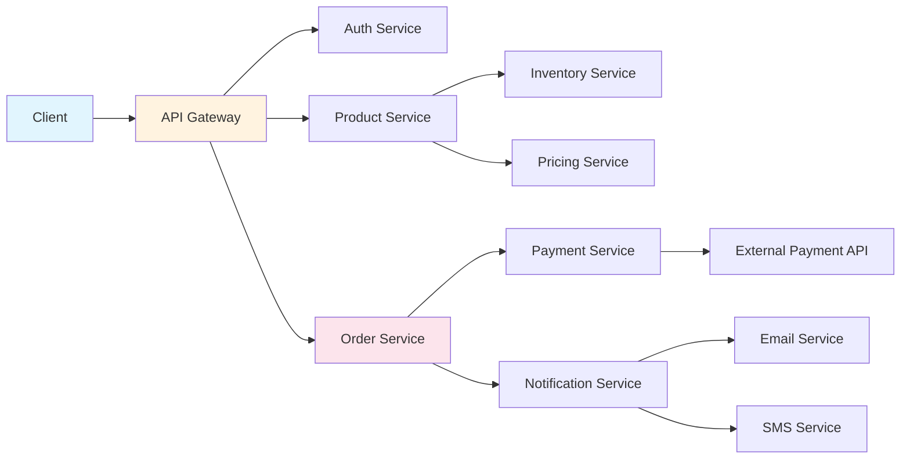

上の図のように、1つのリクエストが複数のサービスを経由する状況では、従来のデバッグ手法には深刻な限界がある。

**ログの限界**: 各サービスは独自のログを出力する。しかし、サービスAのログとサービスBのログを「同じリクエストに由来するもの」として紐付ける仕組みがなければ、ログの海から関連するエントリを見つけ出すことは事実上不可能だ。タイムスタンプによる推測は、サービス間の時刻同期のずれや非同期処理の存在によって、極めて不正確になる。

**メトリクスの限界**: 平均レスポンスタイムやエラーレートといった集約メトリクスは、システム全体の健全性を把握するには有効だが、個々のリクエストの経路を追跡するには不向きだ。「P99レイテンシが上昇している」ことは分かっても、「具体的にどのリクエストが、どの経路で遅延しているのか」は分からない。

### 1.2 分散トレーシングが解決する問題

分散トレーシングは、これらの課題に対して**リクエスト単位の因果関係の可視化**という解決策を提供する。具体的には、以下の問いに答えることができる。

1. **リクエストの経路**: あるリクエストはどのサービスを、どの順序で通過したか？
2. **レイテンシの内訳**: 全体のレスポンスタイムのうち、各サービスでの処理にどれだけの時間がかかったか？
3. **障害の伝播**: あるサービスでのエラーは、どのように上流のサービスに影響を与えたか？
4. **並行処理の把握**: どの処理が並列に実行され、どの処理が直列に実行されたか？
5. **依存関係の発見**: サービス間の実際の依存関係はどうなっているか？

分散トレーシングは、単なるデバッグツールにとどまらない。本番環境における**性能最適化**、**キャパシティプランニング**、**サービス依存関係の可視化**、そして**SLO（Service Level Objective）の監視**にも不可欠な技術となっている。

### 1.3 オブザーバビリティの三本柱

現代のオブザーバビリティ（可観測性）は、**ログ**、**メトリクス**、**トレース**の三本柱で構成される。

| シグナル | 特徴 | 得意な問い |
|----------|------|-----------|
| ログ | 個々のイベントの詳細な記録 | 「何が起きたか？」 |
| メトリクス | 時系列の数値データ | 「どれくらいの頻度・量で起きているか？」 |
| トレース | リクエスト単位の因果関係 | 「なぜ起きたか？どこで起きたか？」 |

これらは相互に補完的であり、トレースがなければ「なぜ遅いのか」を特定できず、メトリクスがなければ「どれくらいの影響があるのか」を定量化できず、ログがなければ「具体的に何が起きたのか」の詳細を知ることができない。分散トレーシングは、この三本柱の中でも特にマイクロサービス環境で重要性を増している技術である。

## 2. Trace, Span, Context Propagation — 基本概念

### 2.1 Trace（トレース）

トレースは、システムを通過する1つのリクエストの**全体的な旅路**を表現するデータ構造である。エンドユーザーがリクエストを発行してからレスポンスが返るまでの間に、そのリクエストが経由したすべてのサービスでの処理が、1つのトレースとしてまとめられる。

トレースは一意の識別子（**Trace ID**）によって識別される。OpenTelemetry では、Trace ID は 128 ビット（16 バイト）のランダムな値であり、32文字の16進数文字列として表現される。例えば `4bf92f3577b34da6a3ce929d0e0e4736` のような値だ。

### 2.2 Span（スパン）

スパンは、トレースを構成する**個々の作業単位**である。1つのサービスでの1つの操作（HTTPリクエストの受信、データベースクエリの実行、外部APIの呼び出しなど）が1つのスパンに対応する。

スパンは以下の情報を持つ。

| フィールド | 説明 | 例 |
|-----------|------|-----|
| Trace ID | 所属するトレースの識別子 | `4bf92f3577b34da6...` |
| Span ID | スパン自身の識別子（64ビット） | `00f067aa0ba902b7` |
| Parent Span ID | 親スパンの識別子 | `a3ce929d0e0e4736` |
| Operation Name | 操作の名前 | `GET /api/products` |
| Start Timestamp | 開始時刻 | `2026-03-05T10:00:00.000Z` |
| Duration | 所要時間 | `150ms` |
| Status | 成功/失敗 | `OK`, `ERROR` |
| Attributes | キーバリューのメタデータ | `http.method=GET` |
| Events | スパン内で起きたイベント | 例外の発生、ログ |
| Links | 他のスパンへの参照 | バッチ処理の入力元 |

スパンの親子関係によって、トレース全体は**木構造（ツリー構造）**を形成する。ルートスパン（親を持たないスパン）がトレースの起点であり、子スパンが処理の分岐を表す。

```mermaid
gantt
    title トレースのタイムライン表示
    dateFormat X
    axisFormat %L ms

    section API Gateway
    GET /api/orders           :a, 0, 300

    section Auth Service
    Verify Token              :b, 10, 50

    section Order Service
    Process Order             :c, 60, 230

    section Inventory Service
    Check Stock               :d, 80, 100

    section Payment Service
    Process Payment           :e, 190, 120
```

上のガントチャートは、1つのトレースの時間的な展開を示している。API Gateway がリクエストを受けてから300msでレスポンスを返すまでに、Auth Service でのトークン検証（40ms）、Order Service での注文処理（170ms）、その中で Inventory Service への在庫確認（20ms）と Payment Service での決済処理（120ms）がそれぞれ実行されている。

### 2.3 スパンの木構造

スパンの親子関係を木構造として見ると、リクエストの因果関係がより明確になる。

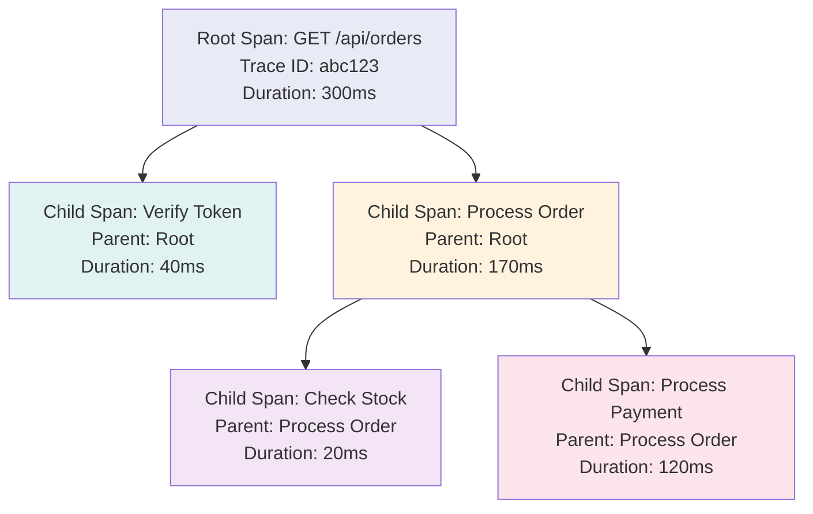

### 2.4 Context Propagation（コンテキスト伝播）

分散トレーシングの最も重要な技術的課題が**コンテキスト伝播**である。1つのトレースが複数のサービスにまたがるためには、Trace ID や Parent Span ID といった情報が、サービス間の通信を通じて伝達されなければならない。

コンテキスト伝播の仕組みは、通信プロトコルに依存する。

**HTTP の場合**: HTTPヘッダーを利用してコンテキストを伝播する。W3C Trace Context 仕様では、以下の2つのヘッダーが定義されている。

```
traceparent: 00-4bf92f3577b34da6a3ce929d0e0e4736-00f067aa0ba902b7-01
             │  │                                │                │
             │  │                                │                └── trace-flags (sampled)
             │  │                                └── parent-id (span-id)
             │  └── trace-id
             └── version

tracestate: vendor1=opaque_value,vendor2=opaque_value
```

`traceparent` ヘッダーは、バージョン、Trace ID、Parent Span ID（現在のスパンID）、トレースフラグ（サンプリング済みかどうか）の4つのフィールドから構成される。`tracestate` ヘッダーは、ベンダー固有の追加情報を伝搬するために使われる。

**gRPC の場合**: gRPC のメタデータ（HTTP/2 のヘッダーフレーム）を利用する。OpenTelemetry の gRPC インスツルメンテーションは、自動的にこのメタデータの注入と抽出を行う。

**メッセージキューの場合**: Kafka や RabbitMQ などのメッセージングシステムでは、メッセージのヘッダーやプロパティにコンテキストを埋め込む。この場合、メッセージの生産者と消費者の間に時間的なギャップがあるため、スパン間の関係は「親子」ではなく **Link（リンク）** として表現されることがある。

### 2.5 Baggage（バゲージ）

コンテキスト伝播の一部として、**Baggage** と呼ばれる仕組みがある。Baggage は、ユーザー定義のキーバリューペアをリクエストの経路に沿って伝播させるメカニズムだ。例えば、ユーザーID、テナントID、機能フラグなどの情報を、すべてのサービスで利用可能にできる。

```
baggage: userId=12345,tenantId=acme-corp,featureFlag=new-checkout
```

ただし、Baggage はネットワーク上のすべてのリクエストに付加されるため、サイズには注意が必要だ。大量のデータを Baggage に入れると、ネットワークオーバーヘッドが無視できなくなる。

## 3. Dapper の影響 — 分散トレーシングの学術的起源

### 3.1 Google Dapper（2010年）

分散トレーシングの歴史を語る上で避けて通れないのが、2010年に Google が発表した論文 **「Dapper, a Large-Scale Distributed Systems Tracing Infrastructure」** だ。この論文は、分散トレーシングの基本概念と設計原則を確立し、その後のすべてのトレーシングシステムに影響を与えた。

Google が Dapper を開発した動機は明確だった。Google の内部システムは、ウェブ検索1回の処理だけでも数千のマシンにまたがる処理を伴う。ユーザーの検索クエリは、ウェブサーバー、インデックスサーバー、広告サーバー、スペルチェッカー、画像検索など、多数のサービスを同時に呼び出す。このような環境で問題を診断するためには、リクエスト単位の追跡が不可欠だった。

### 3.2 Dapper の設計原則

Dapper が掲げた設計原則は、現在でも分散トレーシングの設計における金科玉条となっている。

**1. 低オーバーヘッド（Low Overhead）**: トレーシングのコストがアプリケーションの性能に与える影響は最小限でなければならない。Dapper は、トレーシングによるレイテンシの増加を許容範囲内（数マイクロ秒）に抑えることを目標とした。

**2. アプリケーション透過性（Application-Level Transparency）**: 開発者がトレーシングのためにアプリケーションコードを大幅に変更しなくてもよいこと。Dapper は、Google の共通 RPC フレームワークや共通スレッドライブラリにインスツルメンテーションを組み込むことで、アプリケーションコードを変更することなくトレーシングを実現した。

**3. スケーラビリティ（Scalability）**: Google 規模のインフラストラクチャに対応できること。Dapper は1日あたり数兆スパンを処理する規模で運用された。

### 3.3 サンプリングの発明

Dapper の最も重要な貢献の一つが、**サンプリング**の概念を体系的に導入したことだ。すべてのリクエストを記録するのではなく、一定の割合のリクエストのみをトレースすることで、ストレージとネットワークのオーバーヘッドを大幅に削減する。

Dapper の初期実装では、1/1024 の割合でサンプリングを行っていた。つまり、約1000リクエストに1つだけがトレースされる。Google の規模では、これでも十分な量のトレースデータが得られ、かつ性能への影響を最小限に抑えることができた。

### 3.4 Dapper 以降の系譜

Dapper の論文は、オープンソースの分散トレーシングシステムの開発に直接的な影響を与えた。

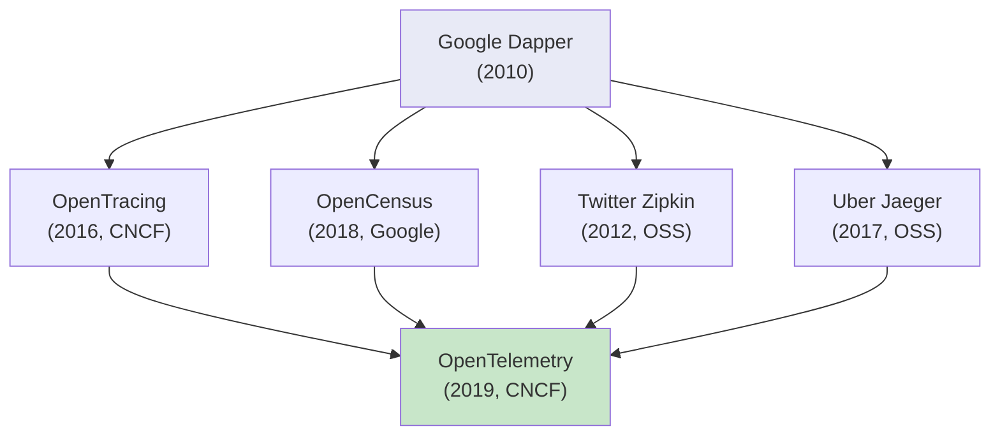

- **Zipkin（2012年）**: Twitter が開発し、オープンソース化した最初の主要な分散トレーシングシステム。Dapper の設計を忠実に実装している。
- **Jaeger（2017年）**: Uber が開発した分散トレーシングシステム。Zipkin と互換性を持ちつつ、より高度な機能（アダプティブサンプリングなど）を提供する。
- **OpenTracing（2016年）**: CNCF プロジェクトとして、トレーシングのベンダー中立な API 標準を定義した。
- **OpenCensus（2018年）**: Google が開発した、トレーシングとメトリクスの統合ライブラリ。
- **OpenTelemetry（2019年）**: OpenTracing と OpenCensus を統合した、オブザーバビリティの統一標準。現在のデファクトスタンダード。

## 4. OpenTelemetry のアーキテクチャ

### 4.1 OpenTelemetry とは何か

OpenTelemetry（OTel）は、**テレメトリデータ（トレース、メトリクス、ログ）の生成・収集・エクスポートのための統一標準**を提供するオープンソースプロジェクトである。CNCF（Cloud Native Computing Foundation）の Incubating プロジェクトとして、Kubernetes に次ぐ活発な開発が行われている。

OpenTelemetry が解決する根本的な問題は、**ベンダーロックイン**である。従来、Datadog、New Relic、Dynatrace などの各オブザーバビリティベンダーは独自のエージェントやSDKを提供していた。あるベンダーのSDKでインスツルメントされたコードは、そのベンダーのバックエンドにしかデータを送れず、ベンダーの切り替えにはコードの書き直しが必要だった。

OpenTelemetry は、この問題をインスツルメンテーション層とバックエンド層の**分離**によって解決する。アプリケーションは OpenTelemetry の API/SDK を使ってテレメトリデータを生成し、そのデータをどのバックエンドに送るかは設定で変更できる。

### 4.2 全体アーキテクチャ

OpenTelemetry のアーキテクチャは、大きく4つの層で構成される。

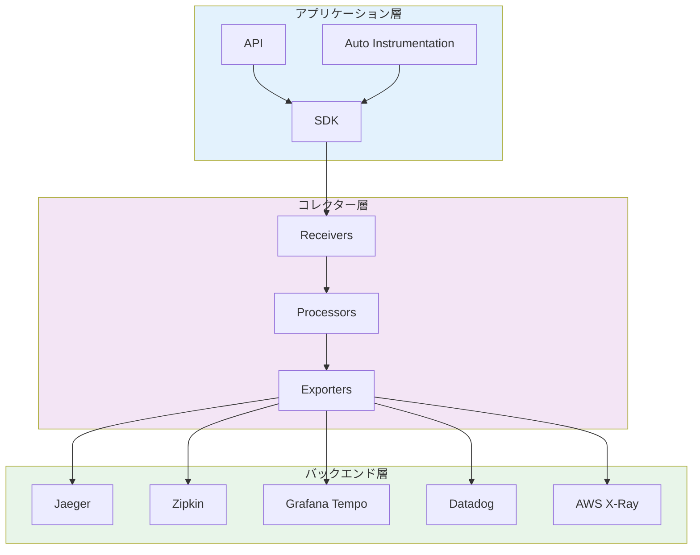

**API 層**: ベンダー中立なインターフェースを定義する。トレーサーの取得、スパンの作成、コンテキストの操作などの操作が含まれる。API だけに依存するライブラリは、SDK が組み込まれていない環境でも安全に動作する（ノーオペレーション実装にフォールバックする）。

**SDK 層**: API の具体的な実装を提供する。サンプリング、スパンの処理、エクスポートの実行などの実際の処理を行う。

**自動インスツルメンテーション層**: 一般的なライブラリやフレームワーク（HTTP クライアント、データベースドライバ、メッセージングクライアントなど）に対するインスツルメンテーションを、コード変更なしで提供する。

**コレクター層**: テレメトリデータの受信、処理、エクスポートを行うスタンドアロンのコンポーネント。

### 4.3 OTLP（OpenTelemetry Protocol）

OpenTelemetry は、テレメトリデータの転送のために **OTLP（OpenTelemetry Protocol）** という独自のプロトコルを定義している。OTLP は gRPC と HTTP/protobuf の両方をサポートし、トレース、メトリクス、ログのすべてのシグナルを統一的に転送できる。

OTLP の設計上の特徴は以下の通りである。

- **効率的なシリアライゼーション**: Protocol Buffers を使用し、データのサイズを最小化する。
- **バッチ送信**: 複数のスパンやメトリクスをまとめて送信することで、ネットワークオーバーヘッドを削減する。
- **バックプレッシャー**: コレクターが処理しきれない場合、クライアントに対して適切にバックプレッシャーを伝える。
- **再試行**: 一時的な障害時に自動的にリトライを行う。

## 5. SDK とコレクター

### 5.1 SDK のアーキテクチャ

OpenTelemetry SDK のトレーシング部分は、以下のコンポーネントで構成される。

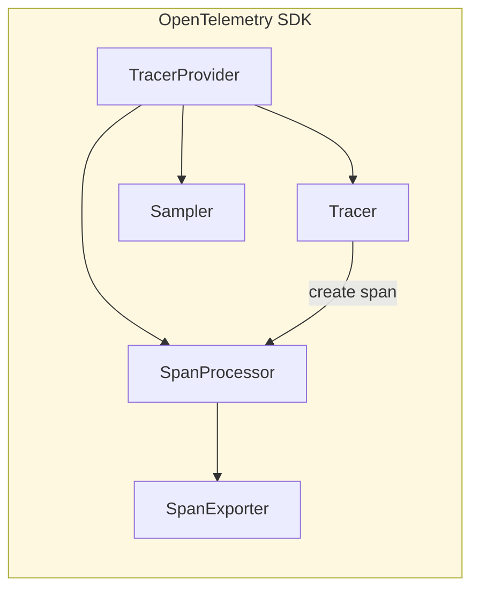

**TracerProvider**: SDK のエントリポイント。Tracer の生成、SpanProcessor と Sampler の設定を担う。通常、アプリケーション起動時に一度だけ構成される。

**Tracer**: スパンの作成を担うオブジェクト。インスツルメンテーションライブラリごとに1つの Tracer が作成される。Tracer は名前とバージョンを持ち、これによってスパンの出処を識別できる。

**SpanProcessor**: 作成されたスパンを処理する。2つの主要な実装がある。
- **SimpleSpanProcessor**: スパンが完了するたびに即座にエクスポーターに渡す。開発環境向け。
- **BatchSpanProcessor**: スパンをバッファに蓄積し、一定量または一定時間ごとにまとめてエクスポーターに渡す。本番環境向け。

**SpanExporter**: 処理されたスパンを外部のバックエンドに送信する。OTLP、Jaeger、Zipkin など、様々なフォーマットに対応するエクスポーターが用意されている。

**Sampler**: どのスパンを記録するかを決定する。詳細は第7章で解説する。

### 5.2 SDK の使用例

以下は、Go 言語での OpenTelemetry SDK の基本的なセットアップとスパン作成の例である。

```go
package main

import (
    "context"
    "time"

    "go.opentelemetry.io/otel"
    "go.opentelemetry.io/otel/exporters/otlp/otlptrace/otlptracegrpc"
    "go.opentelemetry.io/otel/sdk/resource"
    sdktrace "go.opentelemetry.io/otel/sdk/trace"
    semconv "go.opentelemetry.io/otel/semconv/v1.24.0"
    "go.opentelemetry.io/otel/trace"
)

func initTracer() (*sdktrace.TracerProvider, error) {
    // Create OTLP gRPC exporter
    exporter, err := otlptracegrpc.New(
        context.Background(),
        otlptracegrpc.WithEndpoint("localhost:4317"),
        otlptracegrpc.WithInsecure(),
    )
    if err != nil {
        return nil, err
    }

    // Define resource attributes
    res, err := resource.New(
        context.Background(),
        resource.WithAttributes(
            semconv.ServiceNameKey.String("order-service"),
            semconv.ServiceVersionKey.String("1.0.0"),
        ),
    )
    if err != nil {
        return nil, err
    }

    // Create TracerProvider with batch processor
    tp := sdktrace.NewTracerProvider(
        sdktrace.WithBatcher(exporter,
            sdktrace.WithBatchTimeout(5*time.Second),
            sdktrace.WithMaxExportBatchSize(512),
        ),
        sdktrace.WithResource(res),
        sdktrace.WithSampler(sdktrace.TraceIDRatioBased(0.1)), // 10% sampling
    )

    // Register as global TracerProvider
    otel.SetTracerProvider(tp)
    return tp, nil
}

func processOrder(ctx context.Context, orderID string) error {
    tracer := otel.Tracer("order-service")

    // Create a span for the order processing
    ctx, span := tracer.Start(ctx, "processOrder",
        trace.WithAttributes(
            attribute.String("order.id", orderID),
        ),
    )
    defer span.End()

    // Child span for inventory check
    ctx, inventorySpan := tracer.Start(ctx, "checkInventory")
    err := checkInventory(ctx, orderID)
    if err != nil {
        inventorySpan.RecordError(err)
        inventorySpan.SetStatus(codes.Error, err.Error())
    }
    inventorySpan.End()

    // Child span for payment processing
    ctx, paymentSpan := tracer.Start(ctx, "processPayment")
    err = processPayment(ctx, orderID)
    if err != nil {
        paymentSpan.RecordError(err)
        paymentSpan.SetStatus(codes.Error, err.Error())
    }
    paymentSpan.End()

    return nil
}
```

### 5.3 自動インスツルメンテーション

OpenTelemetry の大きな強みは、**自動インスツルメンテーション**のエコシステムである。手動でスパンを作成しなくても、一般的なライブラリやフレームワークに対して自動的にスパンが生成される。

Java では、**Java Agent** を使って、アプリケーションのバイトコードを実行時に書き換えることで、コード変更なしでインスツルメンテーションを実現する。

```bash
# Start application with OpenTelemetry Java Agent
java -javaagent:opentelemetry-javaagent.jar \
     -Dotel.service.name=order-service \
     -Dotel.exporter.otlp.endpoint=http://localhost:4317 \
     -jar myapp.jar
```

Python では、`opentelemetry-instrument` コマンドを使う。

```bash
# Install auto-instrumentation packages
pip install opentelemetry-distro opentelemetry-exporter-otlp
opentelemetry-bootstrap -a install

# Run application with auto-instrumentation
opentelemetry-instrument \
    --service_name order-service \
    --exporter_otlp_endpoint http://localhost:4317 \
    python app.py
```

自動インスツルメンテーションがカバーする主なライブラリには以下がある。

- **HTTP**: Flask, Django, Express, Spring Boot, net/http
- **データベース**: JDBC, psycopg2, pymongo, go-sql-driver
- **RPC**: gRPC, Apache Thrift
- **メッセージング**: Kafka, RabbitMQ, AWS SQS
- **キャッシュ**: Redis, Memcached

### 5.4 OpenTelemetry Collector

OpenTelemetry Collector は、テレメトリデータの受信、処理、エクスポートを行う**中間コンポーネント**である。アプリケーションから直接バックエンドにデータを送ることも可能だが、Collector を間に挟むことで多くのメリットが得られる。

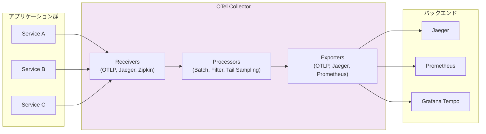

**Collector を使う利点**:

1. **バックエンドの抽象化**: アプリケーションは Collector にデータを送るだけでよく、バックエンドの変更は Collector の設定変更だけで対応できる。
2. **データの加工**: 機密データのマスキング、不要なスパンのフィルタリング、属性の追加・変更などの処理を集中的に行える。
3. **テイルサンプリング**: トレース全体を見てからサンプリングの判断を行う高度なサンプリング戦略を実現できる（SDKでは不可能）。
4. **バッファリングとリトライ**: バックエンドが一時的に利用不可の場合にデータを保持し、復旧後に再送する。
5. **マルチバックエンド**: 同じデータを複数のバックエンドに同時に送信できる。

Collector の設定は YAML ファイルで記述する。

```yaml
# otel-collector-config.yaml
receivers:
  otlp:
    protocols:
      grpc:
        endpoint: 0.0.0.0:4317
      http:
        endpoint: 0.0.0.0:4318

processors:
  batch:
    timeout: 5s
    send_batch_size: 1024
  memory_limiter:
    check_interval: 1s
    limit_mib: 512
    spike_limit_mib: 128
  attributes:
    actions:
      - key: environment
        value: production
        action: upsert

exporters:
  otlp/tempo:
    endpoint: tempo:4317
    tls:
      insecure: true
  prometheus:
    endpoint: 0.0.0.0:8889

service:
  pipelines:
    traces:
      receivers: [otlp]
      processors: [memory_limiter, batch, attributes]
      exporters: [otlp/tempo]
    metrics:
      receivers: [otlp]
      processors: [memory_limiter, batch]
      exporters: [prometheus]
```

### 5.5 Collector のデプロイパターン

Collector のデプロイには主に2つのパターンがある。

**Agent パターン**: 各ホストまたは各 Pod のサイドカーとして Collector を配置する。アプリケーションからのネットワークホップが最小限（localhost）であり、レイテンシへの影響が小さい。Kubernetes では DaemonSet または Sidecar として実行される。

**Gateway パターン**: 集中型の Collector クラスターをデプロイし、すべてのアプリケーションからそこにデータを送る。テイルサンプリングのように、複数のサービスからのスパンを集約して判断する必要がある処理に適している。

**推奨パターン**: Agent と Gateway を組み合わせるハイブリッドパターンが推奨される。Agent が各ホストでデータを受信し、基本的な処理（バッチング、メモリ制限）を行った後、Gateway に転送する。Gateway でテイルサンプリングや高度な加工を行い、最終的にバックエンドにエクスポートする。

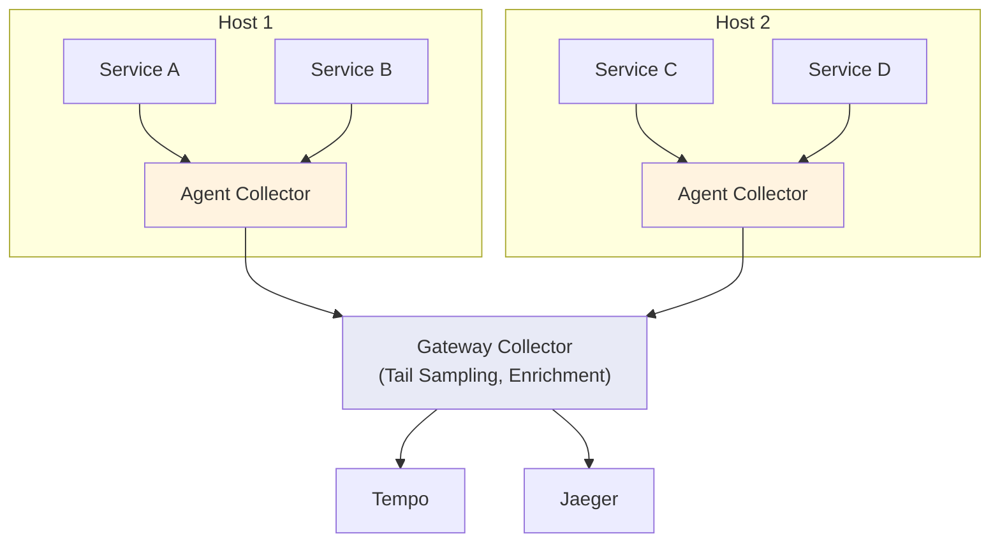

## 6. Jaeger, Zipkin, Tempo — トレーシングバックエンド

### 6.1 Zipkin

**Zipkin** は、2012年に Twitter がオープンソースとして公開した、最初の主要な分散トレーシングシステムである。Google の Dapper 論文に直接触発されて開発された。

**アーキテクチャ**: Zipkin は、コレクター、ストレージ、クエリサービス、Web UI の4つのコンポーネントで構成される。ストレージバックエンドとして、MySQL、PostgreSQL、Cassandra、Elasticsearch をサポートする。

**特徴**:
- シンプルで成熟したアーキテクチャ
- Java で実装されており、幅広い言語向けのクライアントライブラリが存在
- 依存関係グラフの可視化機能
- 活発なコミュニティと長い歴史による安定性

**Zipkin のデータモデル**: Zipkin のスパンフォーマットは、Dapper のモデルを忠実に反映している。各スパンは Trace ID、Span ID、Parent Span ID、アノテーション（タイムスタンプ付きイベント）、タグ（キーバリューペア）を持つ。

### 6.2 Jaeger

**Jaeger** は、2017年に Uber Technologies がオープンソースとして公開した分散トレーシングプラットフォームである。CNCF の Graduated プロジェクトであり、プロダクション環境での大規模運用を前提に設計されている。

**アーキテクチャ**: Jaeger は以下のコンポーネントから構成される。

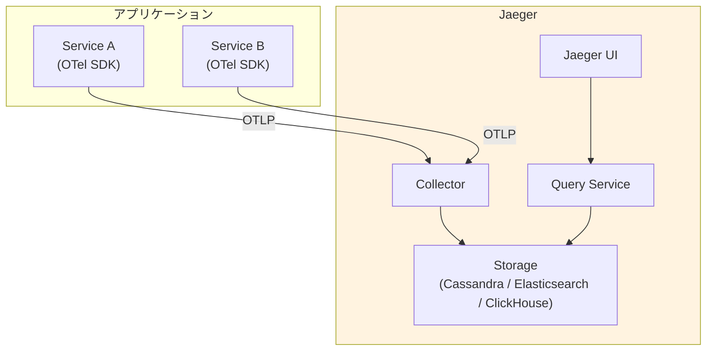

**Jaeger の特徴的な機能**:

- **アダプティブサンプリング**: トラフィック量に応じてサンプリングレートを動的に調整する。低トラフィックのエンドポイントでは高い割合でサンプリングし、高トラフィックのエンドポイントでは低い割合にすることで、全体として均等なカバレッジを実現する。
- **サービスパフォーマンスモニタリング（SPM）**: トレースデータからメトリクス（RED メトリクス: Rate, Errors, Duration）を自動生成する。
- **比較機能**: 2つのトレースを並べて比較し、差異を視覚的に確認できる。
- **ストレージの柔軟性**: Cassandra、Elasticsearch、ClickHouse、さらに gRPC ベースのリモートストレージプラグインをサポートする。

Jaeger v2 からは、内部アーキテクチャが OpenTelemetry Collector ベースに刷新された。これにより、Jaeger は OpenTelemetry のエコシステムとさらに深く統合されている。

### 6.3 Grafana Tempo

**Grafana Tempo** は、Grafana Labs が2020年に発表した、大規模トレースストレージに特化したバックエンドである。Tempo の設計思想は、他のトレーシングバックエンドとは大きく異なる。

**設計思想**: Tempo は**インデックスを持たない**。従来のトレーシングバックエンドは、サービス名やオペレーション名などでインデックスを構築し、トレースの検索を可能にしていた。しかし、インデックスの構築と維持はストレージとコンピュートのコストを大幅に増加させる。Tempo は、トレースデータをオブジェクトストレージ（S3、GCS、Azure Blob Storage）に直接書き込み、Trace ID による直接参照のみをサポートする。

**メトリクスからトレースへの連携**: インデックスなしでどうやってトレースを見つけるのか？Tempo は、**メトリクスやログからトレースへのリンク**（Exemplar）によってこの問題を解決する。Prometheus のメトリクスに Trace ID を Exemplar として付与し、異常なメトリクスからワンクリックで該当するトレースに遷移できる。

**TraceQL**: Tempo は独自のクエリ言語 **TraceQL** を提供している。これにより、スパンの属性に基づいた柔軟なトレース検索が可能になった。

```
// Find traces where HTTP status code is 500 and duration > 1s
{ span.http.status_code = 500 && duration > 1s }

// Find traces with errors in the payment service
{ resource.service.name = "payment-service" && status = error }

// Find traces spanning multiple services
{ resource.service.name = "api-gateway" } >> { resource.service.name = "order-service" }
```

### 6.4 バックエンドの比較

| 特性 | Zipkin | Jaeger | Grafana Tempo |
|------|--------|--------|---------------|
| 開発元 | Twitter (2012) | Uber (2017) | Grafana Labs (2020) |
| CNCF ステータス | — | Graduated | — |
| ストレージ | Cassandra, ES, MySQL | Cassandra, ES, ClickHouse | S3, GCS, Azure Blob |
| インデックス | あり | あり | なし（Trace ID のみ） |
| スケーラビリティ | 中 | 高 | 非常に高 |
| コスト効率 | 中 | 中 | 高（オブジェクトストレージ） |
| 検索機能 | サービス名、タグ | サービス名、タグ、SPM | TraceQL、Exemplar 連携 |
| Grafana 統合 | プラグイン | プラグイン | ネイティブ |

## 7. サンプリング戦略

### 7.1 なぜサンプリングが必要か

サンプリングは分散トレーシングにおいて**不可避の設計判断**である。大規模なシステムでは、すべてのリクエストをトレースすることは現実的ではない。

ある EC サイトが1日に1000万リクエストを処理し、1リクエストあたり平均10スパンが生成されるとすると、1日に1億スパンが生成される。各スパンが1KBのデータだとすると、1日で約100GBのトレースデータが発生する。これをすべて保存・処理すると、ストレージコストとネットワーク帯域が膨大になる。

サンプリングの目的は、**統計的に有意な情報を保持しつつ、コストを許容範囲に抑える**ことである。

### 7.2 ヘッドベースサンプリング

**ヘッドベースサンプリング**は、トレースの**最初のスパン（ヘッド）が作成された時点**でサンプリングの判断を行う方式である。一度判断が下されると、そのトレースに属するすべてのスパンが同じ判断に従う。

主な実装方式は以下の通りである。

**確率的サンプリング（Probabilistic Sampling）**: 一定の割合でトレースを採取する。例えば、サンプリングレート0.1なら10リクエストに1つをトレースする。最もシンプルで実装コストが低い。

```go
// 10% of traces will be sampled
sampler := sdktrace.TraceIDRatioBased(0.1)
```

**レートリミティングサンプリング（Rate Limiting Sampling）**: 1秒あたりのトレース数に上限を設ける。トラフィック量に関わらず一定のスループットを保証する。

**親ベースサンプリング（Parent-Based Sampling）**: 親スパンのサンプリング判断を引き継ぐ。これにより、トレース全体で一貫したサンプリング判断が保たれる。ルートスパンの場合は別のサンプラー（確率的サンプリングなど）にフォールバックする。

```go
// Use parent's decision if available; otherwise use 10% ratio
sampler := sdktrace.ParentBased(sdktrace.TraceIDRatioBased(0.1))
```

**ヘッドベースサンプリングの限界**: トレースの最初の時点では、そのトレースが「面白い」ものになるかどうかを判断する情報がない。高レイテンシのリクエストやエラーを含むリクエストは、正常なリクエストよりもはるかに診断価値が高いが、ヘッドベースサンプリングではこれらを優先的に採取することができない。

### 7.3 テイルベースサンプリング

**テイルベースサンプリング**は、トレースの**すべてのスパンが収集された後**にサンプリングの判断を行う方式である。トレース全体の情報（レイテンシ、エラーの有無、通過したサービスなど）に基づいて判断できるため、より賢明なサンプリングが可能になる。

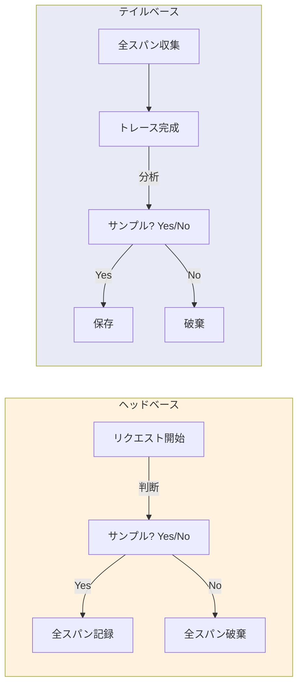

**テイルベースサンプリングのポリシー例**:

- **レイテンシベース**: レスポンスタイムが閾値を超えたトレースを優先採取
- **エラーベース**: エラーを含むトレースを100%採取
- **属性ベース**: 特定のユーザーや特定の機能に関するトレースを優先
- **複合ポリシー**: 上記を組み合わせ、いずれかの条件を満たすトレースを採取

OpenTelemetry Collector でのテイルサンプリング設定例:

```yaml
processors:
  tail_sampling:
    decision_wait: 10s  # Wait 10s for all spans to arrive
    num_traces: 100000  # Max traces in memory
    policies:
      # Always sample traces with errors
      - name: errors-policy
        type: status_code
        status_code:
          status_codes: [ERROR]
      # Sample slow traces (> 2s)
      - name: latency-policy
        type: latency
        latency:
          threshold_ms: 2000
      # Sample 5% of remaining traces
      - name: probabilistic-policy
        type: probabilistic
        probabilistic:
          sampling_percentage: 5
```

**テイルベースサンプリングの課題**:

1. **メモリ消費**: すべてのスパンを一時的にメモリに保持する必要がある。トレースの完了を待つ間、大量のデータがメモリを占有する。
2. **判断の遅延**: トレースのすべてのスパンが到着するまで待つ必要がある。非同期処理を含むトレースでは、この待ち時間が長くなる。
3. **集中処理の必要性**: テイルサンプリングは、1つのトレースのすべてのスパンが同じ Collector インスタンスに集まる必要がある。Trace ID によるルーティング（コンシステントハッシュなど）が必要になる。

### 7.4 実践的なサンプリング戦略

現実的なプロダクション環境では、以下のような段階的なアプローチが推奨される。

1. **SDK 側（ヘッドベース）**: 明らかに不要なトレース（ヘルスチェック、readiness probe など）を早期に除外する。これにより、ネットワーク帯域とCollectorの負荷を削減する。
2. **Collector 側（テイルベース）**: エラーや高レイテンシのトレースを確実に保持しつつ、正常なトレースは低い割合でサンプリングする。
3. **バックエンド側**: 保存期間やストレージクラスの設定で長期的なコストを管理する。

## 8. トレーシングとメトリクス・ログの統合

### 8.1 オブザーバビリティの統合がなぜ重要か

トレース、メトリクス、ログの三本柱は、それぞれ単独でも価値があるが、**相互に連携させる**ことで真の力を発揮する。典型的な障害対応のワークフローを考えてみよう。

1. **アラート発火**: メトリクスの異常を検知してアラートが発火する（例: P99レイテンシが5秒を超えた）
2. **影響範囲の特定**: メトリクスのダッシュボードで、どのエンドポイントが影響を受けているかを特定する
3. **根本原因の追跡**: 該当するトレースを調べ、どのサービスのどの処理がボトルネックかを特定する
4. **詳細の確認**: 問題のスパンに関連するログを確認し、具体的なエラーメッセージやスタックトレースを取得する

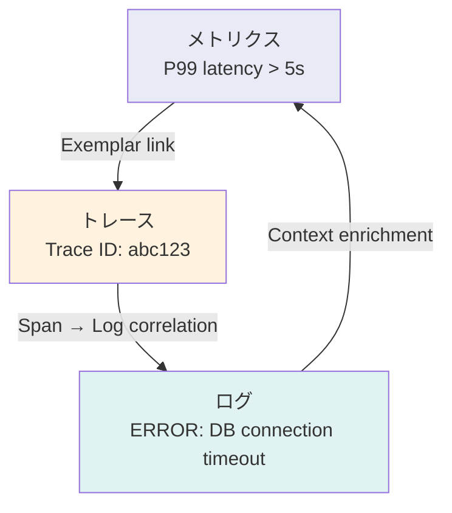

### 8.2 Exemplar — メトリクスからトレースへの架け橋

**Exemplar** は、メトリクスのデータポイントに Trace ID を付与する仕組みである。Prometheus はこの仕組みをネイティブにサポートしている。

例えば、HTTP リクエストのレイテンシヒストグラムに Exemplar を付与すると、「P99レイテンシが高い」というメトリクスの異常から、実際にそのレイテンシを記録したトレースへワンクリックで遷移できる。

OpenTelemetry SDK は、メトリクスの記録時に自動的に現在のスパンコンテキストから Trace ID を Exemplar として付与する。

```go
// Metrics with exemplar (automatic in OTel SDK)
histogram.Record(ctx, latencyMs)
// The SDK automatically attaches the current trace ID as an exemplar
```

Grafana では、Prometheus のメトリクスダッシュボードから Exemplar をクリックするだけで、Tempo や Jaeger に保存されたトレースの詳細画面に遷移できる。

### 8.3 ログとトレースの相関

ログとトレースを相関させるための基本的なアプローチは、**ログに Trace ID と Span ID を埋め込む**ことである。

```python
import logging
from opentelemetry import trace

class TraceContextFilter(logging.Filter):
    """Inject trace context into log records."""
    def filter(self, record):
        span = trace.get_current_span()
        ctx = span.get_span_context()
        if ctx.is_valid:
            record.trace_id = format(ctx.trace_id, '032x')
            record.span_id = format(ctx.span_id, '016x')
        else:
            record.trace_id = '0' * 32
            record.span_id = '0' * 16
        return True

# Configure logger
handler = logging.StreamHandler()
handler.setFormatter(logging.Formatter(
    '%(asctime)s %(levelname)s [trace_id=%(trace_id)s span_id=%(span_id)s] %(message)s'
))
handler.addFilter(TraceContextFilter())
logger = logging.getLogger(__name__)
logger.addHandler(handler)
```

このようにすることで、ログの出力にトレース情報が含まれ、特定のトレースに関連するすべてのログを Trace ID で検索できるようになる。Loki や Elasticsearch などのログバックエンドでは、Trace ID を使ったフィルタリングや、トレーシングバックエンドへのリンク生成をサポートしている。

### 8.4 OpenTelemetry によるシグナルの統合

OpenTelemetry は、トレース、メトリクス、ログの三つのシグナルを**1つの SDK** で統一的に扱える。これにより、シグナル間の相関が自然に実現される。

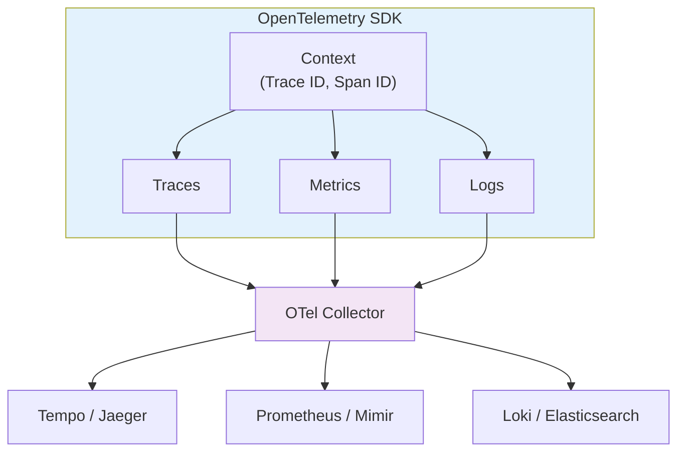

OpenTelemetry のログ SDK は、ログレコードに自動的にトレースコンテキスト（Trace ID、Span ID）を付与する。これにより、ログライブラリの設定を変更するだけで、すべてのログがトレースと紐付く。

**Resource（リソース）** の概念も統合において重要だ。Resource は、テレメトリデータを生成するエンティティ（サービス名、バージョン、ホスト名、Kubernetes Pod 名など）を表す属性のセットである。トレース、メトリクス、ログが同じ Resource 属性を共有することで、異なるシグナル間での突き合わせが容易になる。

### 8.5 Grafana スタックでの統合例

Grafana エコシステムは、オブザーバビリティの三本柱の統合を最も完成度高く実現している例の一つである。

- **Grafana Mimir**: Prometheus 互換のメトリクスストレージ
- **Grafana Tempo**: トレーシングバックエンド
- **Grafana Loki**: ログ集約システム
- **Grafana**: 統合ダッシュボードと相関ナビゲーション

Grafana のダッシュボード上で、メトリクスのグラフ → Exemplar → トレース → ログという一連の流れをシームレスに辿ることができる。これは、障害対応の MTTR（Mean Time To Resolution）を大幅に短縮する。

## 9. 導入のベストプラクティス

### 9.1 段階的な導入アプローチ

分散トレーシングの導入は、ビッグバンアプローチではなく、段階的に行うべきである。

**Phase 1: パイロット導入**

最初のステップは、1つか2つの重要なサービスにOpenTelemetryの自動インスツルメンテーションを導入し、基本的なトレースを取得することだ。この段階ではバックエンドとして Jaeger の all-in-one モードを使い、最小限の運用負荷で価値を確認する。

```yaml
# docker-compose.yml for pilot
services:
  jaeger:
    image: jaegertracing/all-in-one:latest
    ports:
      - "16686:16686"  # Jaeger UI
      - "4317:4317"    # OTLP gRPC
      - "4318:4318"    # OTLP HTTP
    environment:
      - COLLECTOR_OTLP_ENABLED=true
```

**Phase 2: 主要サービスへの拡大**

自動インスツルメンテーションで基本的なトレースが取れるようになったら、クリティカルパスに手動スパンを追加して、より詳細な情報を取得する。同時に、OpenTelemetry Collector を導入し、テレメトリデータの中央集約を開始する。

**Phase 3: 全体最適化**

テイルサンプリングの導入、メトリクスとログとの統合、アラートルールの設定など、オブザーバビリティ基盤としての成熟を図る。

### 9.2 インスツルメンテーションの指針

**自動インスツルメンテーションを最大限活用する**: HTTP、gRPC、データベース、メッセージングなどの一般的なライブラリは、自動インスツルメンテーションで十分な情報が得られる。まずは自動で取得できるスパンを活用し、不足している情報のみを手動スパンで補う。

**スパンの粒度に注意する**: すべての関数にスパンを作成するのは過剰であり、性能への悪影響とノイズの増加を招く。スパンを作成すべきは以下のような場合だ。

- ネットワーク越しの通信（HTTP、gRPC、データベース、メッセージキュー）
- ビジネスロジックの重要なステップ
- 非同期処理の境界
- 性能上の関心がある処理

**意味のある属性を付与する**: スパンにはビジネスコンテキストを表す属性を付与する。ユーザーID、注文ID、テナントIDなどの属性は、問題調査時に極めて有用である。ただし、個人情報やセキュリティ上の機密情報は含めないよう注意する。

**セマンティック規約に従う**: OpenTelemetry は **Semantic Conventions** という属性の命名規約を定義している。例えば、HTTP の属性には `http.request.method`、`http.response.status_code`、`url.full` などの標準的な名前が定義されている。これに従うことで、異なるサービスやライブラリ間でのデータの一貫性が保たれ、バックエンドでのクエリや可視化が容易になる。

### 9.3 本番環境での運用上の注意点

**性能への影響を監視する**: トレーシングのオーバーヘッドは通常、レイテンシの1-3%程度であるが、インスツルメンテーションの量やサンプリングレートによっては無視できないレベルになりうる。導入前後で性能のベースラインを比較し、影響を定量的に把握する。

**Collector の可用性を確保する**: OpenTelemetry Collector が単一障害点にならないよう、冗長構成をとる。Collector の障害がアプリケーションの動作に影響を与えないよう、SDK側では非同期送信とタイムアウトを適切に設定する。

```go
// Configure exporter with timeout and retry
exporter, err := otlptracegrpc.New(
    ctx,
    otlptracegrpc.WithEndpoint("collector:4317"),
    otlptracegrpc.WithTimeout(5*time.Second),
    otlptracegrpc.WithRetry(otlptracegrpc.RetryConfig{
        Enabled:         true,
        InitialInterval: 1 * time.Second,
        MaxInterval:     5 * time.Second,
        MaxElapsedTime:  30 * time.Second,
    }),
)
```

**ストレージコストを管理する**: トレースデータは増加し続ける。保持期間のポリシーを明確に定め、古いデータは自動的に削除する。Grafana Tempo のようにオブジェクトストレージを使うバックエンドを選択することで、ストレージコストを大幅に削減できる。

**機密データのマスキング**: トレースの属性やログには、意図せず機密情報が含まれることがある。Collector の processors で、パスワード、トークン、個人識別情報（PII）などを検出・マスキングするルールを設定する。

```yaml
processors:
  attributes:
    actions:
      # Remove sensitive headers
      - key: http.request.header.authorization
        action: delete
      # Hash user identifiers
      - key: enduser.id
        action: hash
```

### 9.4 組織的な導入のポイント

**オーナーシップの明確化**: トレーシング基盤（Collector、バックエンド、ダッシュボード）のオーナーチームを明確にする。プラットフォームチームやSREチームが基盤を管理し、各サービスチームが自サービスのインスツルメンテーションを担当するという分担が一般的だ。

**ドキュメントとサンプルコードの整備**: 開発者が自サービスにトレーシングを導入する際のハードルを下げるために、社内向けのガイドラインやボイラープレートコードを整備する。OpenTelemetry の設定パターン、推奨する属性、命名規約などを文書化する。

**段階的な改善文化**: 最初から完璧なオブザーバビリティを目指すのではなく、障害対応のたびに「このとき、どんなスパンや属性があれば問題をより早く特定できたか」を振り返り、インスツルメンテーションを改善していく文化を醸成する。

### 9.5 よくある落とし穴

**1. 過度なインスツルメンテーション**: すべての関数呼び出しにスパンを作成すると、トレースが数百のスパンで埋め尽くされ、かえって読みにくくなる。また、スパンの作成自体にもコスト（メモリ確保、タイムスタンプ取得）がかかる。

**2. コンテキスト伝播の断絶**: 新しいスレッドやゴルーチンを生成する際、コンテキストの受け渡しを忘れると、トレースが途切れる。非同期処理では特に注意が必要だ。

```go
// WRONG: context is lost in new goroutine
go func() {
    processAsync() // No context propagation
}()

// CORRECT: pass context explicitly
go func(ctx context.Context) {
    processAsync(ctx) // Context is propagated
}(ctx)
```

**3. サンプリングの不整合**: サービスAでサンプリングされたトレースが、サービスBで破棄されると、部分的なトレースが生成される。Parent-Based Sampler を使い、親のサンプリング判断を子に伝播させることで、この問題を回避できる。

**4. 時刻同期の問題**: 分散環境では、サービス間の時計のずれがスパンのタイムスタンプの整合性に影響する。NTP（Network Time Protocol）による時刻同期を確実に行い、ずれを最小限に抑える。

## 10. 将来の展望

### 10.1 Continuous Profiling との統合

OpenTelemetry は、トレース、メトリクス、ログに加えて、**Continuous Profiling** を第4のシグナルとして取り込む方向で進んでいる。プロファイリングデータとトレースを紐付けることで、「このスパンが遅い理由は、この関数でCPUを消費しているからだ」という、より深い洞察が可能になる。

### 10.2 eBPF によるゼロコードインスツルメンテーション

**eBPF（Extended Berkeley Packet Filter）** を利用して、カーネルレベルでトレーシングデータを収集するアプローチが注目されている。アプリケーションコードに一切の変更を加えることなく、またSDKの導入すら不要で、ネットワーク通信のトレーシングを実現できる。Grafana Beyla や Pixie などのプロジェクトがこのアプローチを推進している。

ただし、eBPF ベースのインスツルメンテーションは、カーネルレベルの情報しか取得できないため、ビジネスロジックに関する属性（注文IDやユーザーIDなど）を付与することはできない。SDKベースのインスツルメンテーションとの組み合わせが現実的なアプローチとなるだろう。

### 10.3 AI/ML による異常検知

大量のトレースデータを人間が手動で分析するのは限界がある。機械学習を活用して、トレースパターンの異常を自動検出する技術が発展しつつある。正常時のトレースパターンを学習し、それから逸脱したトレースを自動的にハイライトすることで、障害の早期発見と根本原因の特定を支援する。

### 10.4 標準化の進展

W3C Trace Context 仕様は既に広く採用されているが、Baggage 仕様やその他の関連仕様の標準化も進んでいる。また、OpenTelemetry 自体のセマンティック規約も急速に成熟しており、異なるベンダーや言語間でのデータの相互運用性が向上し続けている。

## まとめ

分散トレーシングは、マイクロサービスアーキテクチャの普及に伴い、システムの可観測性を確保するための必須技術となった。Google Dapper が示した基本概念 — Trace、Span、コンテキスト伝播、サンプリング — は、10年以上を経た今でも分散トレーシングの基盤として生き続けている。

OpenTelemetry は、ベンダー中立なオブザーバビリティ標準として急速に普及し、トレース、メトリクス、ログを統一的に扱うためのデファクトスタンダードとなった。API/SDK の分離設計、自動インスツルメンテーションのエコシステム、そして柔軟な Collector アーキテクチャにより、低い導入コストと高い拡張性を両立している。

重要なのは、分散トレーシングは単なるツールの導入ではなく、**オブザーバビリティ文化**の構築であるということだ。チームが日常的にトレースを参照し、障害対応のたびにインスツルメンテーションを改善していく文化があってこそ、分散トレーシングの真の価値が発揮される。技術的な正確さと運用上の実用性のバランスを取りながら、段階的に成熟度を高めていくことが、成功への鍵である。
