# 分散学習（データ並列, モデル並列, パイプライン並列）

## なぜ分散学習が必要なのか

深層学習モデルの規模は指数関数的に拡大し続けている。2018年のBERT（3.4億パラメータ）から、GPT-3（1750億パラメータ）、PaLM（5400億パラメータ）、さらにはそれを超える規模のモデルが次々と登場している。こうした大規模モデルの学習には、単一のGPUでは到底収まりきらないメモリと計算量が要求される。

たとえば、1750億パラメータのモデルをfp32で格納するだけでも約700GBのメモリが必要であり、これは最先端のGPU（NVIDIA H100の80GB HBM3）1台のメモリを大幅に超過する。さらに、学習時にはパラメータに加えて勾配（gradient）やオプティマイザの状態（Adamであればパラメータ数の2倍の追加メモリ）も保持する必要があるため、実際に必要なメモリはパラメータサイズの数倍に膨れ上がる。

$$
\text{Total Memory} \approx |\theta| \times (\underbrace{b_{\text{param}}}_{\text{parameter}} + \underbrace{b_{\text{grad}}}_{\text{gradient}} + \underbrace{b_{\text{opt}}}_{\text{optimizer state}})
$$

ここで $|\theta|$ はパラメータ数、$b_{\text{param}}, b_{\text{grad}}, b_{\text{opt}}$ はそれぞれの要素あたりのバイト数である。Adamオプティマイザをfp32で使う場合、$b_{\text{param}} = 4, b_{\text{grad}} = 4, b_{\text{opt}} = 8$（1次・2次モーメントの各4バイト）となるため、パラメータ1つにつき16バイト、1750億パラメータなら約2.8TBのメモリが必要になる。

このような状況において、複数のアクセラレータ（GPU/TPU）を協調させてモデルを学習する**分散学習**（Distributed Training）は、もはやオプションではなく必須の技術となっている。

本記事では、分散学習の3つの主要な並列化戦略——**データ並列**（Data Parallelism）、**モデル並列**（Model Parallelism）、**パイプライン並列**（Pipeline Parallelism）——の原理、実装、そしてトレードオフを深く掘り下げる。さらに、これらを組み合わせた3D並列やZeRO最適化についても解説する。

## 分散学習の全体像

分散学習の並列化戦略は、「何を分割するか」という観点で分類できる。

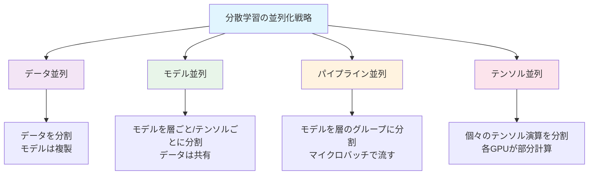

| 戦略 | 分割対象 | スケーラビリティ | 通信パターン | 主なユースケース |
|------|----------|-----------------|-------------|-----------------|
| データ並列 | 入力データ（ミニバッチ） | 高い | AllReduce（勾配同期） | モデルが1GPUに収まる場合 |
| モデル並列（テンソル並列） | 個々の演算/テンソル | 中程度 | AllReduce, AllGather | 巨大な層（例: 大規模な全結合層） |
| パイプライン並列 | モデルの層グループ | 中程度 | Point-to-Point（前方/後方の活性化） | 深いモデルの層方向分割 |

## データ並列（Data Parallelism）

### 基本原理

データ並列は最も直感的で広く使われている並列化手法である。考え方はシンプルで、**モデル全体を各GPU（ワーカー）に複製し、入力データのミニバッチを分割して各ワーカーに配分する**というものだ。

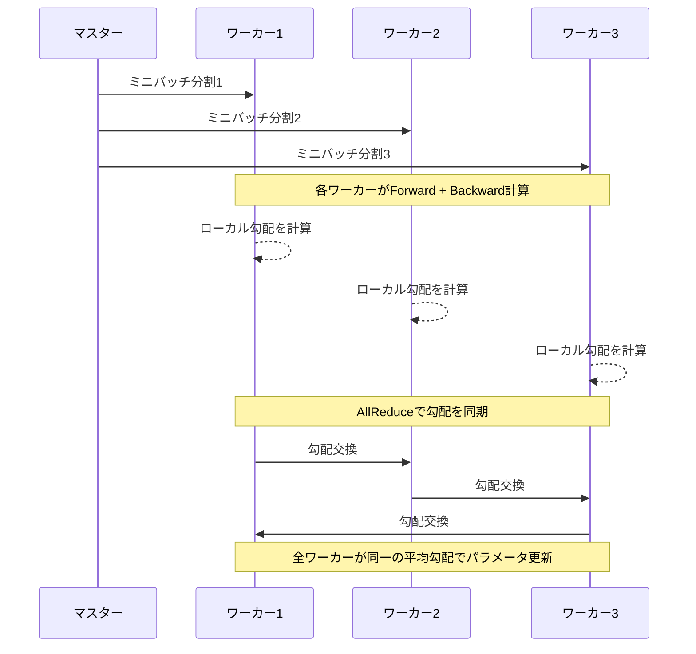

各ワーカーの処理フローは以下のとおりである。

1. **Forward pass**: 自分に割り当てられたミニバッチ分割 $\mathcal{B}_i$ に対してモデルの順伝播を実行し、損失 $\mathcal{L}_i$ を計算する
2. **Backward pass**: 損失に対する勾配 $\nabla_\theta \mathcal{L}_i$ を計算する
3. **勾配同期**: 全ワーカーの勾配を集約（AllReduce）し、平均勾配を取得する
4. **パラメータ更新**: 平均勾配を用いてパラメータを更新する

$N$ 個のワーカーが参加するデータ並列では、実効バッチサイズは各ワーカーのローカルバッチサイズ $B_{\text{local}}$ の $N$ 倍になる。

$$
B_{\text{effective}} = N \times B_{\text{local}}
$$

### 同期型 vs 非同期型

データ並列の勾配同期には**同期型**（Synchronous）と**非同期型**（Asynchronous）の2つのアプローチがある。

#### 同期型SGD（Synchronous SGD）

全ワーカーが勾配計算を完了するまで待ち合わせ、集約された平均勾配でパラメータを更新する方式である。

$$
\theta_{t+1} = \theta_t - \eta \cdot \frac{1}{N} \sum_{i=1}^{N} \nabla_\theta \mathcal{L}(\theta_t; \mathcal{B}_i)
$$

::: tip 同期型SGDのメリット
- 数学的に単一GPU上で大きなバッチサイズを使った場合と**等価**であり、収束性の理論的保証が明確
- 実装が比較的単純
:::

::: warning 同期型SGDの課題 — ストラグラー問題
最も遅いワーカーが全体のボトルネックになる。ワーカー間の計算速度に差がある場合（ハードウェアの不均一性やネットワークの遅延）、高速なワーカーが遅いワーカーを待つ時間が無駄になる。
:::

#### 非同期型SGD（Asynchronous SGD）

各ワーカーが独立にパラメータサーバーから最新のパラメータを取得し、ローカルに計算した勾配でパラメータを更新する方式である。他のワーカーの完了を待つ必要がない。

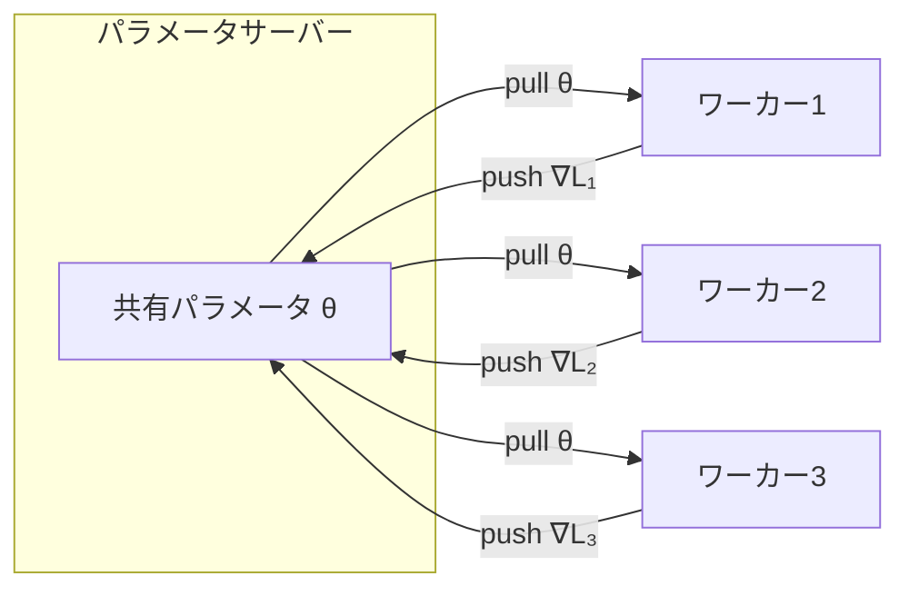

非同期型では、ワーカーが勾配を計算している間にパラメータが他のワーカーによって更新されるため、**古い勾配**（stale gradient）の問題が発生する。ワーカー $i$ がステップ $t$ のパラメータ $\theta_t$ に基づいて勾配を計算したとき、その勾配がパラメータサーバーに到着する時点ではパラメータがすでに $\theta_{t+\tau}$ に進んでいる可能性がある（$\tau$ はstaleness）。

$$
\theta_{t+1} = \theta_t - \eta \cdot \nabla_\theta \mathcal{L}(\theta_{t-\tau}; \mathcal{B}_i)
$$

::: danger 非同期型SGDの問題
Stalenessが大きくなると収束が不安定になり、最悪の場合は発散する。この問題を緩和するために、勾配のstaleness $\tau$ に応じて学習率を減衰させる手法（例: $\eta' = \eta / (1 + \tau)$）や、一定以上のstalenessを持つ勾配を破棄する手法が提案されている。
:::

現在の大規模学習では、通信ライブラリの最適化（NCCL等）とネットワーク帯域の向上により、**同期型SGDが主流**となっている。非同期型が有効なのは、ワーカー数が非常に多く通信コストが支配的な場合や、ハードウェアの不均一性が大きい場合に限られる。

### AllReduceの実装

同期型データ並列の性能は、勾配同期の効率に大きく依存する。AllReduceは「全ノードが持つデータの総和（または平均）を計算し、結果を全ノードに配布する」集団通信操作である。

#### Ring AllReduce

Ring AllReduceは、$N$ 個のノードをリング状に接続し、各ノードが隣接ノードとのみ通信する方式である。勾配ベクトルを $N$ 個のチャンクに分割し、2つのフェーズで処理を行う。

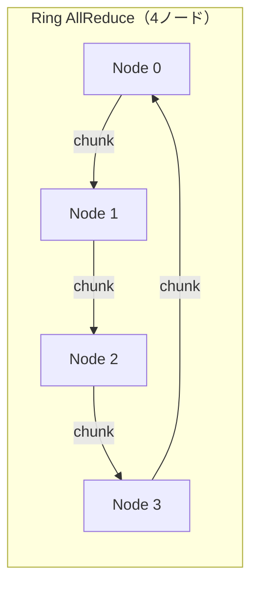

**Scatter-Reduce フェーズ**: $N-1$ ステップで、各ノードが自分の担当チャンクの部分和を蓄積する。各ステップでは、各ノードが1つのチャンクを次のノードに送信し、前のノードから受信したチャンクを自分の対応するチャンクに加算する。

**AllGather フェーズ**: さらに $N-1$ ステップで、完成した部分和を全ノードに配布する。

Ring AllReduceの通信量は以下のとおりである。

$$
\text{通信量} = 2 \times \frac{N-1}{N} \times M
$$

ここで $M$ は勾配ベクトル全体のサイズ、$N$ はノード数である。重要なのは、この通信量が**ノード数 $N$ にほぼ依存しない**（$N$ が大きい場合 $\frac{N-1}{N} \approx 1$）ことである。これにより、Ring AllReduceは多数のノードでもスケーラブルに動作する。

::: details Ring AllReduceの通信量の導出
各ステップで各ノードが送受信するデータは $M/N$ バイトである。Scatter-Reduceで $N-1$ ステップ、AllGatherで $N-1$ ステップ、合計 $2(N-1)$ ステップを要する。各ステップの通信量は $M/N$ なので、総通信量は $2(N-1) \times M/N = 2 \times \frac{N-1}{N} \times M$ となる。
:::

#### Tree AllReduce と Recursive Halving-Doubling

ノード数が少ない場合やレイテンシが支配的な場合は、Tree AllReduceやRecursive Halving-Doubling アルゴリズムが効率的なことがある。Tree AllReduceはツリー構造で集約と配布を行い、レイテンシが $O(\log N)$ に低減されるが、帯域効率はRing AllReduceに劣る。

実際には、NVIDIAのNCCL（NVIDIA Collective Communications Library）がハードウェアトポロジに応じて最適なアルゴリズムを自動選択する。NVLink/NVSwitchで接続されたGPU間とInfiniBandで接続されたノード間では、異なるアルゴリズムが使用される。

### 勾配の圧縮と通信最適化

通信帯域がボトルネックになる場合、以下の最適化手法が用いられる。

**勾配圧縮**（Gradient Compression）: 勾配ベクトルの上位$k$%の要素のみを送信するTop-k Sparsificationや、勾配を1ビットに量子化する1-bit SGD、確率的量子化を行うQSGDなどがある。

**通信と計算のオーバーラップ**: バックワードパスで層ごとに勾配が確定した時点で、その層の勾配のAllReduceを開始する。後方の層の勾配同期と前方の層のバックワード計算を並行して実行することで、通信レイテンシを隠蔽する。

```mermaid
gantt
    title 計算と通信のオーバーラップ
    dateFormat X
    axisFormat %s

    section GPU計算
    Backward Layer 4   :a1, 0, 2
    Backward Layer 3   :a2, 2, 4
    Backward Layer 2   :a3, 4, 6
    Backward Layer 1   :a4, 6, 8

    section 通信
    AllReduce Layer 4  :b1, 2, 4
    AllReduce Layer 3  :b2, 4, 6
    AllReduce Layer 2  :b3, 6, 8
    AllReduce Layer 1  :b4, 8, 10
```

### PyTorchにおけるデータ並列の実装

PyTorchでは、`DistributedDataParallel`（DDP）が標準的なデータ並列の実装を提供している。

::: code-group

```python [基本的なDDPの使い方]
import torch
import torch.distributed as dist
import torch.nn as nn
from torch.nn.parallel import DistributedDataParallel as DDP

def setup(rank, world_size):
    # Initialize the process group
    dist.init_process_group("nccl", rank=rank, world_size=world_size)
    torch.cuda.set_device(rank)

def train(rank, world_size):
    setup(rank, world_size)

    model = MyModel().to(rank)
    # Wrap model with DDP
    ddp_model = DDP(model, device_ids=[rank])

    optimizer = torch.optim.Adam(ddp_model.parameters(), lr=1e-3)

    # DistributedSampler ensures each worker gets a unique subset
    sampler = torch.utils.data.distributed.DistributedSampler(
        dataset, num_replicas=world_size, rank=rank
    )
    dataloader = torch.utils.data.DataLoader(
        dataset, batch_size=32, sampler=sampler
    )

    for epoch in range(num_epochs):
        sampler.set_epoch(epoch)  # Shuffle differently each epoch
        for batch in dataloader:
            optimizer.zero_grad()
            loss = ddp_model(batch)
            loss.backward()  # AllReduce happens here automatically
            optimizer.step()
```

```python [torchrunによる起動]
# Single node, 4 GPUs
# torchrun --nproc_per_node=4 train.py

# Multi-node (2 nodes, 4 GPUs each)
# Node 0: torchrun --nproc_per_node=4 --nnodes=2 --node_rank=0 --master_addr=<IP> train.py
# Node 1: torchrun --nproc_per_node=4 --nnodes=2 --node_rank=1 --master_addr=<IP> train.py
```

:::

DDPの内部では、バックワードパスにフックを登録し、勾配が計算され次第NCCLのAllReduceを呼び出す。これにより、計算と通信のオーバーラップが自動的に実現される。

### 大バッチ学習の課題

データ並列でワーカー数を増やすと実効バッチサイズが増加するが、バッチサイズの増大は学習の挙動に大きな影響を与える。

**汎化性能の低下**: 大きなバッチサイズは勾配の分散を低減し、シャープなミニマムに収束しやすくなる。シャープなミニマムは汎化性能が低いことが知られている。

**学習率のスケーリング**: バッチサイズを $k$ 倍にした場合、学習率も $k$ 倍にスケールする**線形スケーリング則**（Linear Scaling Rule）がGoyal et al. (2017)により提案された。ただし、学習初期にいきなり大きな学習率を使うと発散するため、**ウォームアップ**（warmup）が必要である。

$$
\eta_{\text{scaled}} = \eta_{\text{base}} \times \frac{B_{\text{effective}}}{B_{\text{base}}}
$$

**LARS / LAMB**: 大バッチ学習を安定させるために、層ごとに適応的な学習率を設定するLARS（Layer-wise Adaptive Rate Scaling）やLAMB（Layer-wise Adaptive Moments optimizer for Batch training）が提案されている。これらは各層のパラメータのノルムと勾配のノルムの比に基づいて学習率をスケールする。

## モデル並列（Model Parallelism）

### 基本原理

モデルが1つのGPUのメモリに収まらない場合、**モデル自体を複数のGPUに分割する**必要がある。これがモデル並列である。モデル並列は大きく分けて2つのアプローチがある。

1. **層方向の分割**（Inter-layer / Pipeline Parallelism）: モデルの連続する層のグループを異なるGPUに配置する（次章で詳述）
2. **テンソル並列**（Intra-layer / Tensor Parallelism）: 個々の層の中のテンソル演算を複数GPUに分割する

本節ではテンソル並列に焦点を当てる。

### テンソル並列（Tensor Parallelism）

テンソル並列は、Transformerの各層内の行列演算を複数のGPUに分割する手法である。Megatron-LMで提案されたアプローチが代表的であり、Transformerのself-attentionブロックとMLPブロックそれぞれについて効率的な分割戦略が存在する。

#### MLPブロックの分割

Transformerの標準的なMLPブロックは、2つの全結合層とGELU活性化関数で構成される。

$$
\text{MLP}(X) = \text{GeLU}(XA) \cdot B
$$

ここで $X \in \mathbb{R}^{b \times h}$（$b$はバッチサイズ、$h$は隠れ層の次元）、$A \in \mathbb{R}^{h \times 4h}$、$B \in \mathbb{R}^{4h \times h}$ である。

**列方向分割**（Column Parallel）: 最初の重み行列 $A$ を列方向に2つに分割する。

$$
A = [A_1 \mid A_2], \quad A_1, A_2 \in \mathbb{R}^{h \times 2h}
$$

各GPUは入力 $X$ の完全なコピーを持ち、$XA_1$ と $XA_2$ をそれぞれ独立に計算する。GeLUはelement-wiseな関数であるため、分割されたまま適用できる。

$$
Y_1 = \text{GeLU}(XA_1), \quad Y_2 = \text{GeLU}(XA_2)
$$

**行方向分割**（Row Parallel）: 2番目の重み行列 $B$ を行方向に分割する。

$$
B = \begin{bmatrix} B_1 \\ B_2 \end{bmatrix}, \quad B_1, B_2 \in \mathbb{R}^{2h \times h}
$$

各GPUは $Y_i B_i$ を計算し、最後にAllReduceで結果を合算する。

$$
\text{Output} = Y_1 B_1 + Y_2 B_2
$$

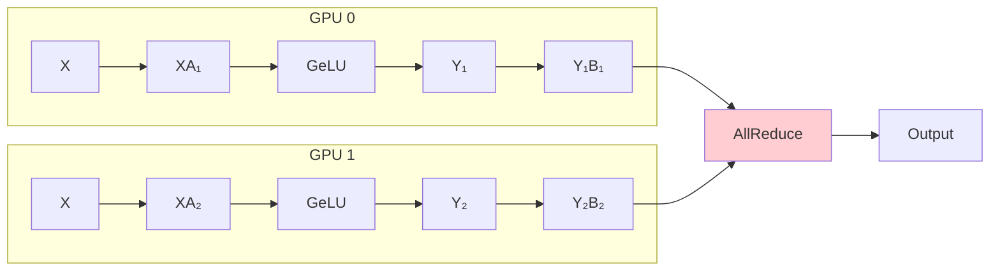

このように、MLPブロック全体で**ForwardにAllReduce 1回、BackwardにAllReduce 1回**の通信で済む。

#### Self-Attentionブロックの分割

Multi-Head Attention（MHA）は本来、複数のアテンションヘッドが独立に計算される構造を持っているため、テンソル並列との相性が良い。各GPUに異なるアテンションヘッドを割り当てることで、ほぼ通信なしで並列計算が可能である。

$H$ 個のアテンションヘッドを $N$ 個のGPUに分配する場合、GPU $i$ はヘッド $\{i \times H/N, \ldots, (i+1) \times H/N - 1\}$ を担当する。各GPUが部分的なアテンション出力を計算した後、出力射影の行方向分割とAllReduceで結果を統合する。

#### テンソル並列の制約

テンソル並列は各GPUが演算の一部を担当するため、**各演算のたびに通信が発生する**。このため、GPU間の通信帯域が極めて高い必要がある。実用上、テンソル並列はNVLink/NVSwitchで高速接続された**同一ノード内のGPU間**に限定して適用されることが多い。

> [!WARNING]
> テンソル並列をノード間（InfiniBand接続）に拡張すると、通信レイテンシが桁違いに大きくなり、演算のGPU利用率が大幅に低下する。NVLink（900GB/s, H100）とInfiniBand（400Gb/s = 50GB/s, HDR）では帯域に約18倍の差がある。

## パイプライン並列（Pipeline Parallelism）

### 基本原理

パイプライン並列は、モデルの連続する層のグループを異なるGPUに配置し、ミニバッチを**マイクロバッチ**に分割してパイプライン的に流す手法である。

$L$ 層のモデルを $P$ 個のGPU（ステージ）に分割する場合、各ステージは $L/P$ 層を担当する。

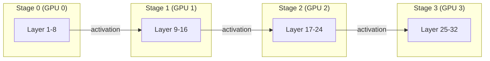

### ナイーブなパイプライン並列とバブル問題

最も単純なアプローチでは、1つのミニバッチがステージ0からステージ$P-1$まで順伝播し、その後ステージ$P-1$からステージ0まで逆伝播する。この方式では、各GPUが実際に計算しているのはごく一部の時間だけであり、残りは他のステージの完了を待つ**アイドル時間**（バブル）となる。

```mermaid
gantt
    title ナイーブなパイプライン並列（バブルが大きい）
    dateFormat X
    axisFormat %s

    section GPU 0
    Forward   :a1, 0, 2
    Idle      :crit, a2, 2, 8
    Backward  :a3, 8, 10

    section GPU 1
    Idle      :crit, b1, 0, 2
    Forward   :b2, 2, 4
    Idle      :crit, b3, 4, 8
    Backward  :b4, 8, 10

    section GPU 2
    Idle      :crit, c1, 0, 4
    Forward   :c2, 4, 6
    Idle      :crit, c3, 6, 8
    Backward  :c4, 8, 10

    section GPU 3
    Idle      :crit, d1, 0, 6
    Forward   :d2, 6, 8
    Backward  :d3, 8, 10
```

バブル率（パイプライン内でGPUがアイドル状態の時間の割合）は、$P$ ステージ、$m$ マイクロバッチの場合、以下のように近似される。

$$
\text{Bubble Ratio} \approx \frac{P - 1}{m + P - 1}
$$

$m = 1$（マイクロバッチ分割なし）の場合、バブル率は $\frac{P-1}{P}$ となり、4ステージでは75%ものGPU時間が無駄になる。

### GPipe

GPipe（Huang et al., 2019）は、ミニバッチを $m$ 個のマイクロバッチに分割し、パイプライン的に処理することでバブルを削減する手法である。

```mermaid
gantt
    title GPipe（4ステージ, 4マイクロバッチ）
    dateFormat X
    axisFormat %s

    section GPU 0
    F1        :a1, 0, 1
    F2        :a2, 1, 2
    F3        :a3, 2, 3
    F4        :a4, 3, 4
    Bubble    :crit, a5, 4, 7
    B4        :a6, 7, 8
    B3        :a7, 8, 9
    B2        :a8, 9, 10
    B1        :a9, 10, 11

    section GPU 1
    Bubble    :crit, b0, 0, 1
    F1        :b1, 1, 2
    F2        :b2, 2, 3
    F3        :b3, 3, 4
    F4        :b4, 4, 5
    Bubble    :crit, b5, 5, 7
    B4        :b6, 7, 8
    B3        :b7, 8, 9
    B2        :b8, 9, 10
    B1        :b9, 10, 11

    section GPU 2
    Bubble    :crit, c0, 0, 2
    F1        :c1, 2, 3
    F2        :c2, 3, 4
    F3        :c3, 4, 5
    F4        :c4, 5, 6
    Bubble    :crit, c5, 6, 7
    B4        :c6, 7, 8
    B3        :c7, 8, 9
    B2        :c8, 9, 10

    section GPU 3
    Bubble    :crit, d0, 0, 3
    F1        :d1, 3, 4
    F2        :d2, 4, 5
    F3        :d3, 5, 6
    F4        :d4, 6, 7
    B4        :d5, 7, 8
    B3        :d6, 8, 9
    B2        :d7, 9, 10
    B1        :d8, 10, 11
```

GPipeでは、全マイクロバッチのForwardが完了してからBackwardを開始する。$m$ を増やすことでバブル率を $\frac{P-1}{m+P-1}$ に低減できる。例えば $P=4, m=16$ とすると、バブル率は約16%になる。

::: warning GPipeのメモリ課題
GPipeでは全マイクロバッチのForwardが完了するまで中間活性化（activation）をメモリに保持する必要がある。$m$ 個のマイクロバッチの活性化を保持するため、メモリ使用量が $m$ 倍に増加する。この問題を緩和するために、**勾配チェックポイント**（Gradient Checkpointing / Activation Recomputation）が併用される。
:::

### PipeDream と 1F1B スケジュール

PipeDream（Narayanan et al., 2019）とその改良版は、Forward と Backward を**インターリーブ**する**1F1B**（One Forward One Backward）スケジュールを提案した。

1F1Bスケジュールでは、パイプラインが定常状態に入った後、各GPUが1つのマイクロバッチのForwardと1つのBackwardを交互に実行する。これにより、各GPUが同時に保持する必要のある活性化の数が一定に保たれ、メモリ効率が大幅に向上する。

```mermaid
gantt
    title 1F1Bスケジュール（4ステージ, 8マイクロバッチ）
    dateFormat X
    axisFormat %s

    section GPU 0
    F1  :a1, 0, 1
    F2  :a2, 1, 2
    F3  :a3, 2, 3
    F4  :a4, 3, 4
    B1  :a5, 4, 5
    F5  :a6, 5, 6
    B2  :a7, 6, 7
    F6  :a8, 7, 8
    B3  :a9, 8, 9
    F7  :a10, 9, 10
    B4  :a11, 10, 11
    F8  :a12, 11, 12
    B5  :a13, 12, 13
    B6  :a14, 13, 14
    B7  :a15, 14, 15
    B8  :a16, 15, 16

    section GPU 3
    Bubble   :crit, d0, 0, 3
    F1  :d1, 3, 4
    B1  :d2, 4, 5
    F2  :d3, 5, 6
    B2  :d4, 6, 7
    F3  :d5, 7, 8
    B3  :d6, 8, 9
    F4  :d7, 9, 10
    B4  :d8, 10, 11
    F5  :d9, 11, 12
    B5  :d10, 12, 13
    F6  :d11, 13, 14
    B6  :d12, 14, 15
    F7  :d13, 15, 16
```

1F1Bスケジュールの主な利点は以下である。

1. **メモリ効率**: 定常状態では各GPUが保持する活性化の数が最大 $P$ 個に制限される（GPipeでは $m$ 個）
2. **バブル率**: GPipeと同等のバブル率 $\frac{P-1}{m+P-1}$ を維持しつつ、メモリ使用量を削減

### インターリーブドパイプライン

Megatron-LMで提案されたインターリーブドパイプラインは、各GPUに**連続しない複数のステージ**を割り当てることで、さらにバブルを削減する。

たとえば、8ステージ・4GPUの場合、GPU 0はステージ0とステージ4を担当する。各マイクロバッチはGPU間を複数回往復するため通信量は増えるが、パイプラインの深さが実質的に増してバブルが削減される。

$$
\text{Bubble Ratio (Interleaved)} \approx \frac{P - 1}{v \cdot m + P - 1}
$$

ここで $v$ は各GPUが担当するステージ数（仮想パイプライン段数）である。

## ZeRO（Zero Redundancy Optimizer）

### データ並列のメモリ冗長性

標準的なデータ並列では、各GPUがモデルの完全なコピー（パラメータ、勾配、オプティマイザ状態）を保持する。これは大きなメモリの冗長性を意味する。$N$ 個のGPUで学習する場合、全体として $N$ 倍のメモリが使われているが、実際に必要なのは1コピー分だけである。

ZeRO（Zero Redundancy Optimizer）は、DeepSpeedで提案されたこのメモリ冗長性を排除する最適化手法であり、3つのステージに分かれる。

### ZeROの3つのステージ

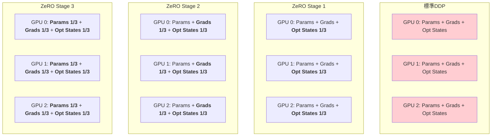

**ZeRO Stage 1 — オプティマイザ状態の分割**

$N$ 個のGPUのそれぞれがオプティマイザ状態の $1/N$ のみを保持する。Adamの場合、1次・2次モーメントのメモリがそれぞれ $1/N$ になる。パラメータ更新時には、各GPUは自分が担当するパラメータ区間のみを更新し、AllGatherで更新後のパラメータを全GPUに配布する。

メモリ削減効果（fp16学習 + fp32 Adamの場合）:
- 標準DDP: $16|\theta|$ バイト/GPU（fp16パラメータ2 + fp16勾配2 + fp32パラメータコピー4 + fp32モーメント8）
- ZeRO Stage 1: $4|\theta| + 12|\theta|/N$ バイト/GPU

**ZeRO Stage 2 — 勾配の分割**

Stage 1に加えて、勾配も分割する。各GPUはBackward中に自分が担当するパラメータに対応する勾配のみを蓄積し、不要な勾配は即座に解放する。ReduceScatterにより、各GPUに必要な勾配の部分和のみが集約される。

メモリ削減効果:
- ZeRO Stage 2: $2|\theta| + 14|\theta|/N$ バイト/GPU

**ZeRO Stage 3 — パラメータの分割**

Stage 2に加えて、パラメータ自体も分割する。各GPUはモデルパラメータの $1/N$ のみを保持する。Forward/Backwardの各層の計算時に、必要なパラメータをAllGatherで一時的に収集し、計算後すぐに解放する。

メモリ削減効果:
- ZeRO Stage 3: $16|\theta|/N$ バイト/GPU

::: tip ZeRO Stage 3の威力
$N = 64$ GPU でAdamを使う場合、各GPUのメモリ使用量が標準DDPの $1/64$ になる。これにより、単体GPUのメモリに収まらない巨大モデルでも、データ並列のシンプルさを保ちながら学習が可能になる。
:::

### ZeRO Stage 3の通信コスト

ZeRO Stage 3では、Forward時とBackward時にそれぞれ1回のAllGatherが必要になるため、標準DDPと比較して通信量が1.5倍に増加する。

| 方式 | Forward通信 | Backward通信 | 合計 |
|------|-----------|-------------|------|
| 標準DDP | 0 | AllReduce: $2M$ | $2M$ |
| ZeRO Stage 1 | 0 | AllReduce: $2M$ + AllGather: $M$ | $3M$ |
| ZeRO Stage 3 | AllGather: $M$ | AllGather: $M$ + ReduceScatter: $M$ | $3M$ |

（$M$ はパラメータ全体のサイズ）

実際には通信と計算のオーバーラップによりこのオーバーヘッドはある程度隠蔽される。

### PyTorch FSDPとの関係

PyTorchの**FSDP**（Fully Sharded Data Parallel）は、ZeRO Stage 3と同等の機能をPyTorchネイティブで提供する実装である。

```python
from torch.distributed.fsdp import FullyShardedDataParallel as FSDP

model = FSDP(
    MyModel(),
    # Shard parameters, gradients, and optimizer states
    sharding_strategy=ShardingStrategy.FULL_SHARD,  # ZeRO Stage 3 equivalent
    # Use mixed precision for memory efficiency
    mixed_precision=MixedPrecision(
        param_dtype=torch.float16,
        reduce_dtype=torch.float16,
        buffer_dtype=torch.float16,
    ),
)
```

## 3D並列とハイブリッド並列

### 3D並列の概念

大規模モデルの学習では、データ並列・テンソル並列・パイプライン並列を**組み合わせる**ことが一般的である。これを**3D並列**（3D Parallelism）と呼ぶ。

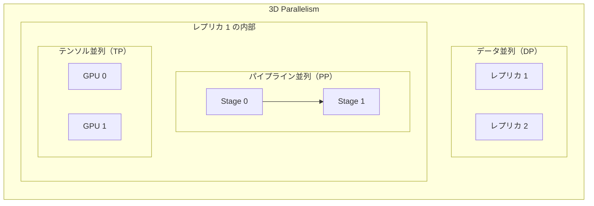

たとえば、64個のGPU（8ノード x 8GPU/ノード）で学習する場合の典型的な構成は以下のようになる。

| 並列化 | 次元 | 理由 |
|--------|------|------|
| テンソル並列（TP=8） | ノード内8GPU | NVLinkの高帯域を活用 |
| パイプライン並列（PP=4） | 4ノード間 | ノード間通信はP2P（活性化転送）のみ |
| データ並列（DP=2） | 残りの2グループ | AllReduceで勾配同期 |

$$
\text{Total GPUs} = \text{TP} \times \text{PP} \times \text{DP} = 8 \times 4 \times 2 = 64
$$

### 並列化戦略の選択指針

各並列化手法にはそれぞれ異なるトレードオフがあり、適切な組み合わせは以下の要因に依存する。

**モデルサイズ**: モデルが1GPUに収まる場合はデータ並列のみで十分。1GPUに収まらないが1ノードに収まる場合はテンソル並列+データ並列。1ノードにも収まらない場合は3D並列が必要。

**通信帯域**: テンソル並列はNVLink級の帯域が必要（同一ノード内に限定）。パイプライン並列はP2P通信のみなのでノード間でも適用可能。データ並列のAllReduceは帯域効率が良いがデータサイズに比例。

**メモリ効率**: パイプライン並列は活性化の保持が必要。ZeRO Stage 3はメモリ効率が最も高い。テンソル並列はモデルパラメータのメモリを削減するが活性化は複製される。

> [!NOTE]
> 実際の大規模学習（例: GPT-3規模）では、Megatron-DeepSpeedのような統合フレームワークがこれらの並列化を自動的に構成する。ユーザーはTP, PP, DPの各次元のサイズを指定するだけでよい。

## 混合精度学習（Mixed Precision Training）

### 分散学習との関係

分散学習では通信量がボトルネックになるため、計算精度を下げてデータサイズを削減する**混合精度学習**が広く併用される。

fp32（32ビット浮動小数点）の代わりにfp16（16ビット浮動小数点）やbf16（Brain Float 16）を使うことで、以下の利点が得られる。

1. **メモリ使用量の半減**: パラメータと活性化のメモリが半分に
2. **通信量の半減**: 勾配同期のデータ転送量が半分に
3. **計算速度の向上**: Tensor Coreによるfp16/bf16演算はfp32の2~4倍高速

### fp16 vs bf16

| 特性 | fp16 | bf16 |
|------|------|------|
| 指数部 | 5ビット | 8ビット |
| 仮数部 | 10ビット | 7ビット |
| 表現範囲 | $\pm 6.5 \times 10^4$ | $\pm 3.4 \times 10^{38}$（fp32と同じ） |
| 精度 | 高い | 低い |
| オーバーフロー | 起きやすい | 起きにくい |

::: tip bf16が大規模学習で好まれる理由
bf16はfp32と同じ指数部ビット数を持つため、表現範囲が広くオーバーフローのリスクが低い。大規模モデルの学習では勾配の値の範囲が広くなりがちなため、bf16のほうが安定して学習できることが多い。Loss Scalingの必要性もfp16に比べて低く、実装がシンプルになる。
:::

### Loss Scaling

fp16を使う場合、小さな勾配値がアンダーフロー（ゼロに丸められる）する問題がある。これを防ぐために**Loss Scaling**が用いられる。

$$
\text{scaled\_loss} = \text{loss} \times S
$$

スケール係数 $S$ で損失を拡大してからBackwardを行い、得られた勾配を $1/S$ で除算してから更新に使う。**Dynamic Loss Scaling**は、オーバーフローが起きないギリギリまで $S$ を動的に増加させ、オーバーフローが検出されたら $S$ を減少させる手法である。

## 活性化メモリの最適化

### 勾配チェックポイント（Activation Checkpointing）

パイプライン並列やデータ並列で大きなバッチサイズを使う場合、**活性化メモリ**（Forward計算の中間結果を保持するメモリ）が支配的なメモリボトルネックとなることがある。

勾配チェックポイント（Gradient Checkpointing / Activation Recomputation）は、Forward時に一部の活性化のみを保存し、Backward時に必要に応じて再計算する手法である。

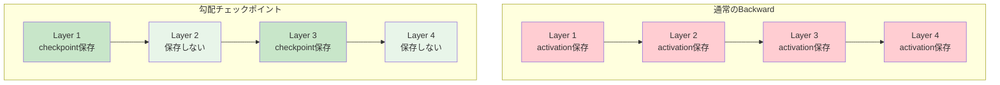

$L$ 層のモデルで$\sqrt{L}$ 層ごとにチェックポイントを保存すると、活性化メモリは $O(L)$ から $O(\sqrt{L})$ に削減される。代償として、Backward時の再計算により計算時間が約30~40%増加する。

```python
import torch.utils.checkpoint as checkpoint

class TransformerBlock(nn.Module):
    def forward(self, x):
        # Checkpoint this block to save activation memory
        return checkpoint.checkpoint(self._forward_impl, x, use_reentrant=False)

    def _forward_impl(self, x):
        # Actual forward computation
        x = x + self.attn(self.norm1(x))
        x = x + self.mlp(self.norm2(x))
        return x
```

### Selective Activation Recomputation

すべての活性化を一律にチェックポイントするのではなく、メモリ消費が大きい演算（例: アテンションのソフトマックス出力）のみを再計算対象にする**選択的活性化再計算**も有効である。アテンションスコアの行列は系列長の2乗に比例するメモリを消費するため、これを再計算することで大幅なメモリ節約が可能になる。

## 通信ハードウェアとトポロジ

### GPUインターコネクト

分散学習の性能は、GPU間の通信帯域とレイテンシに大きく依存する。主要なインターコネクト技術とその帯域は以下のとおりである。

| 技術 | 帯域（双方向） | 用途 |
|------|--------------|------|
| PCIe Gen5 | 128 GB/s | GPU-CPU間 |
| NVLink 4.0（H100） | 900 GB/s | ノード内GPU間 |
| NVSwitch（DGX H100） | 全GPU間900 GB/s | ノード内全GPU間全対全 |
| InfiniBand HDR | 50 GB/s (400 Gbps) | ノード間 |
| InfiniBand NDR | 100 GB/s (800 Gbps) | ノード間 |
| RoCE v2 | ~50 GB/s | ノード間（Ethernet上のRDMA） |

NVSwitchが搭載されたDGXシステムでは、8つのGPUが全対全で900 GB/sの帯域で接続される。これにより、ノード内ではテンソル並列が効率的に機能する。一方、ノード間はInfiniBandでの接続となり帯域が1桁以上小さくなるため、ノード間にはパイプライン並列やデータ並列を配置する設計が合理的である。

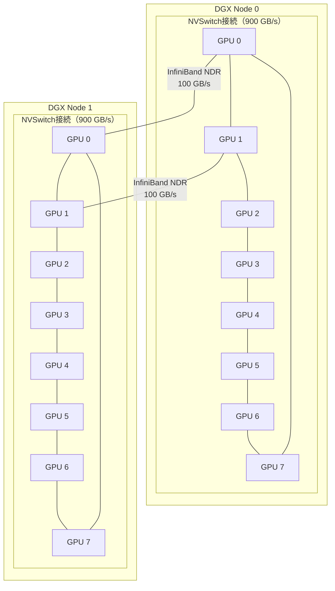

### ネットワークトポロジの設計

大規模クラスタでは、ノード間のネットワークトポロジも学習の性能に影響する。一般的にFat-Treeやドラゴンフライなどのトポロジが使用され、AllReduceやAllGatherなどの集団通信パターンに最適化される。

NVIDIAのDGX SuperPODやGoogleのTPU Podでは、学習用のネットワークトポロジが高度に最適化されており、数千GPUでの学習でも通信がボトルネックになりにくい設計になっている。

## 実践的なフレームワーク

### 主要フレームワークの比較

| フレームワーク | 提供元 | 特徴 |
|---------------|--------|------|
| Megatron-LM | NVIDIA | テンソル並列 + パイプライン並列の最適化実装 |
| DeepSpeed | Microsoft | ZeRO、3D並列、推論最適化 |
| FSDP | PyTorch | ZeRO Stage 3相当のネイティブ実装 |
| Colossal-AI | HPC-AI Tech | 自動並列化、ヘテロジニアス学習 |
| JAX/pjit | Google | XLA上の宣言的並列化 |
| Megatron-DeepSpeed | NVIDIA + MS | Megatron-LMとDeepSpeedの統合 |

### DeepSpeedによる3D並列の設定例

::: code-group

```json [DeepSpeed Config]
{
  "train_batch_size": 2048,
  "train_micro_batch_size_per_gpu": 2,
  "gradient_accumulation_steps": 16,

  "zero_optimization": {
    "stage": 1,
    "overlap_comm": true,
    "contiguous_gradients": true
  },

  "fp16": {
    "enabled": true,
    "loss_scale": 0,
    "loss_scale_window": 500,
    "hysteresis": 2,
    "min_loss_scale": 1
  },

  "pipeline": {
    "pipe_partitioned": true,
    "grad_partitioned": true,
    "stages": 4
  },

  "flops_profiler": {
    "enabled": true,
    "profile_step": 1,
    "module_depth": -1,
    "top_modules": 3
  }
}
```

```python [学習スクリプト]
import deepspeed

def train():
    model = GPTModel(config)

    # DeepSpeed handles DP, PP, and TP configuration
    model_engine, optimizer, _, _ = deepspeed.initialize(
        model=model,
        model_parameters=model.parameters(),
        config="ds_config.json",
    )

    for step, batch in enumerate(dataloader):
        loss = model_engine(batch)
        model_engine.backward(loss)
        model_engine.step()
```

:::

### JAX/pjitによる宣言的な並列化

JAXのpjit（partitioned JIT）は、テンソルの分割方法を宣言的に指定する独自のアプローチを取る。

```python
import jax
from jax.sharding import PartitionSpec as P, NamedSharding, Mesh

# Define logical mesh
devices = jax.devices()
mesh = Mesh(devices.reshape(2, 4), ("dp", "tp"))

# Specify how parameters are sharded
# Weight matrix is sharded along tp axis
param_sharding = NamedSharding(mesh, P(None, "tp"))
# Input data is sharded along dp axis
data_sharding = NamedSharding(mesh, P("dp", None))

@jax.jit
def train_step(params, batch):
    def loss_fn(p):
        logits = model.apply(p, batch["input"])
        return cross_entropy(logits, batch["target"])

    grads = jax.grad(loss_fn)(params)
    # JAX automatically inserts the necessary communication
    # (AllReduce for dp, AllGather/ReduceScatter for tp)
    params = jax.tree.map(lambda p, g: p - lr * g, params, grads)
    return params
```

JAXの利点は、XLAコンパイラが並列化に必要な通信オペレーション（AllReduce、AllGather等）を自動的に挿入する点にある。ユーザーはテンソルの分割方法を宣言するだけでよく、通信の詳細を手動で管理する必要がない。

## スケーリング則と学習効率

### 学習のスケーリング効率

分散学習の効率は、GPU数を増やしたときにどれだけスループット（処理サンプル数/秒）がリニアにスケールするかで測られる。

$$
\text{Scaling Efficiency} = \frac{T_N}{N \times T_1}
$$

ここで $T_1$ は1GPU時のスループット、$T_N$ は $N$ GPU時のスループットである。理想的には1.0（100%）だが、通信オーバーヘッドにより実際には1未満になる。

典型的なスケーリング効率は以下の要因に依存する。

- **計算対通信比**: 各GPUの計算量に対する通信量の比。バッチサイズが大きく、モデルサイズが大きいほど、計算が支配的になり効率が向上する
- **ネットワーク帯域**: GPU間の通信帯域が大きいほど通信のオーバーヘッドが小さくなる
- **通信と計算のオーバーラップ**: 効果的にオーバーラップできれば通信コストが隠蔽される
- **パイプラインのバブル**: パイプライン並列ではバブルが直接的なオーバーヘッド

### Chinchillaスケーリング則との関係

Hoffmann et al. (2022)が示した**Chinchillaスケーリング則**によれば、与えられた計算予算 $C$（FLOPs）に対して最適なモデルサイズ $N$ と学習データ量 $D$ は以下の関係を満たす。

$$
N_{\text{opt}} \propto C^{0.5}, \quad D_{\text{opt}} \propto C^{0.5}
$$

つまり、計算予算を10倍にする場合、モデルサイズと学習データ量をそれぞれ約3.2倍にするのが最適である。この知見は分散学習の設計に直接影響する。計算予算の増大に伴いモデルサイズも増大するため、データ並列だけでなくモデル並列やパイプライン並列の必要性が高まる。

## 耐障害性

### チェックポイントと再開

大規模分散学習は数日から数週間にわたって実行されるため、ハードウェア障害への耐性が不可欠である。典型的なアプローチは**定期的なチェックポイント**の保存と障害時の再開である。

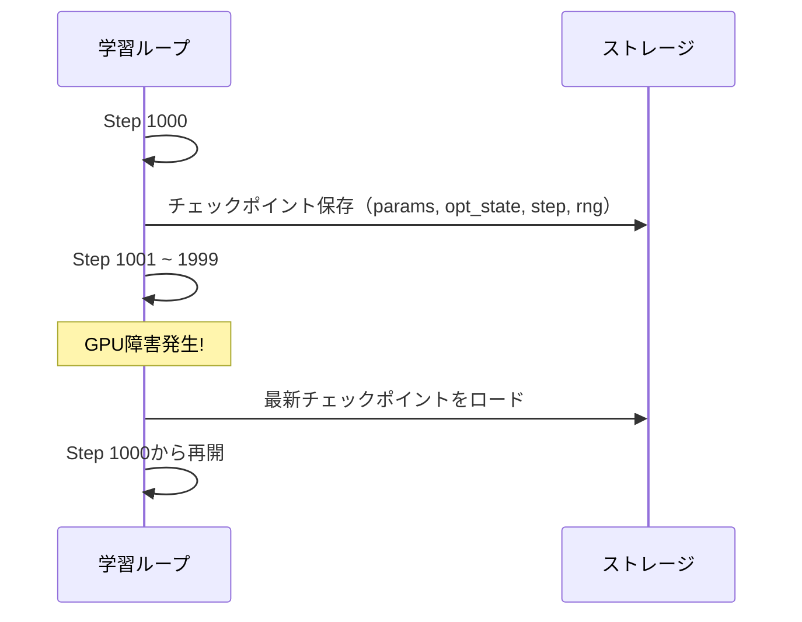

チェックポイントには以下の情報が含まれる。

- モデルパラメータ
- オプティマイザ状態（Adamのモーメント等）
- 学習ステップ数
- 乱数生成器の状態
- データローダーの状態（どのデータを処理済みか）

::: warning チェックポイントのコスト
大規模モデルのチェックポイントは数百GBに達することがある。チェックポイントの保存自体が学習を停止させるため、効率的な非同期チェックポイント（計算と並行してバックグラウンドでストレージに書き出す）が重要である。
:::

### 弾力的学習（Elastic Training）

ノード障害時にGPU数を動的に変更して学習を継続する**弾力的学習**も研究されている。PyTorch Elasticやtorchrunがこの機能を提供している。ただし、GPU数の変更はバッチサイズや並列化構成の変更を伴うため、学習の安定性に影響を与えうる。

## 今後の展望

### Expert Parallelism（MoE）

Mixture of Experts（MoE）モデルでは、各入力トークンが一部のエキスパート（FFN層）にのみルーティングされる。このルーティングに基づいてエキスパートを異なるGPUに配置する**Expert Parallelism**は、既存の3D並列に4次元目を追加する手法として注目されている。

### Sequence Parallelism

系列長が非常に長い場合（例: 128K~1Mトークン）、アテンション計算のメモリが系列長の2乗に比例するため、系列方向に分割する**Sequence Parallelism**も重要性を増している。Ring Attention（Li et al., 2023）は、各GPUが系列の一部分を担当し、Key-Valueをリング状に回すことで任意の長さの系列を処理できる手法である。

### コンパイラによる自動並列化

手動で並列化戦略を設計するのではなく、コンパイラが自動的に最適な並列化戦略を決定するアプローチも進展している。GoogleのGSPMD（General and Scalable Parallelization for ML Computation Graphs）やAlpa（Zheng et al., 2022）は、デバイスメッシュ上でのテンソル分割を自動最適化する。将来的には、ユーザーがモデルの定義と利用可能なハードウェアの情報を提供するだけで、フレームワークが最適な並列化構成を自動的に決定する世界が期待される。

### ヘテロジニアスな学習

GPUだけでなく、CPUメモリやNVMe SSDをパラメータの一時退避先として活用する**オフロード**（ZeRO-Offload、ZeRO-Infinity）も、メモリ制約を緩和する手法として実用化されている。GPUのHBMメモリ、CPUのDRAM、NVMe SSDの3階層を活用することで、単一ノードでも数兆パラメータのモデルの学習が（低速ながら）可能になる。

## まとめ

分散学習は、大規模モデルの学習を可能にするための必須技術である。本記事で解説した主要な並列化戦略を振り返る。

| 戦略 | 分割対象 | メリット | デメリット |
|------|----------|---------|-----------|
| **データ並列** | ミニバッチ | 実装が簡単、スケーラビリティが高い | モデルが1GPUに収まる必要（ZeROで緩和） |
| **テンソル並列** | 個々のテンソル | 層内の演算を効率的に分割 | 高帯域の接続が必要（ノード内限定） |
| **パイプライン並列** | 層のグループ | ノード間でも適用可能 | パイプラインバブルによる効率低下 |
| **ZeRO** | パラメータ/勾配/状態 | メモリ冗長性を排除 | 通信量が増加 |

実際の大規模学習では、これらを適切に組み合わせた**3D並列**+**ZeRO**+**混合精度**+**勾配チェックポイント**の構成が標準的である。最適な構成はモデルのアーキテクチャ、利用可能なハードウェア、ネットワークトポロジに依存し、理論的な分析と実験的なチューニングの双方が必要になる。

深層学習モデルの規模が今後も拡大し続ける限り、分散学習技術の重要性は増すばかりである。コンパイラによる自動並列化、新しいハードウェアインターコネクト、MoEなどのスパースモデルの普及が、次世代の分散学習のランドスケープを形作るだろう。
