# 分散トランザクション — 2PC, 3PC, Sagaパターン

## 1. 背景と動機 — 単一ノードACIDの限界

### 1.1 なぜ分散トランザクションが必要か

単一ノードのデータベースでは、ACID特性はローカルなメカニズムで実現できる。Write-Ahead Logging（WAL）によるAtomicity、ロックやMVCCによるIsolation、fsyncによるDurability——これらはすべて、ひとつのプロセスがひとつのストレージを制御している前提で設計されている。

しかし、現実のシステムはしばしばこの前提を超える。

- **マイクロサービスアーキテクチャ**: 注文サービス、在庫サービス、決済サービスが独立したデータベースを持つ
- **シャーディング**: データが複数のノードに水平分割されており、単一トランザクションが複数シャードにまたがる
- **地理的分散**: ユーザーに近いリージョンにデータを配置するために、データが物理的に離れた場所に分散する

これらの状況では、「複数の独立したノードにまたがる操作を、ひとつの論理的なトランザクションとして扱いたい」という要求が生まれる。これが**分散トランザクション（Distributed Transaction）** の問題領域である。

### 1.2 分散トランザクションの根本的な困難

分散環境でトランザクションを実現する際の困難は、**部分障害（Partial Failure）** に集約される。単一ノードのトランザクションでは、システムは「動いている」か「停止している」かのどちらかである。しかし分散環境では、あるノードは正常に動作しているのに、別のノードが障害を起こしている——という状態が日常的に発生する。

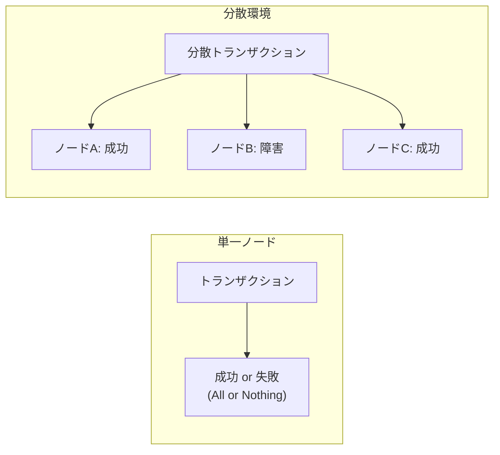

ノードAとCでは操作が完了しているのに、ノードBでは失敗している。このとき、全体をコミットすべきか、ロールバックすべきか。そしてその判断を、ノード間でどのように合意するか。これが分散トランザクションの核心的な問題である。

### 1.3 分散トランザクションの分類

分散トランザクションのアプローチは、大きく以下の2つに分類できる。

| アプローチ | 特徴 | 代表例 |
|-----------|------|--------|
| **アトミックコミットプロトコル** | 全参加ノードが一致してコミットまたはアボートすることを保証する | 2PC, 3PC, Percolator |
| **補償ベースアプローチ** | 各ローカルトランザクションを独立にコミットし、障害時は補償操作で論理的に取り消す | Saga |

前者はACIDのAtomicityをグローバルに保証しようとするアプローチであり、後者はAtomicityを緩和する代わりに可用性とパフォーマンスを重視するアプローチである。本記事では、両方のアプローチを詳しく見ていく。

## 2. 2PC（Two-Phase Commit）の仕組み

### 2.1 概要

**2PC（Two-Phase Commit Protocol）** は、分散トランザクションにおけるアトミックコミットの最も基本的なプロトコルである。Jim Grayが1978年の著書「Notes on Data Base Operating Systems」で体系化した。

2PCの基本的な考え方は単純である。「全参加者がコミットできる状態にあるか確認してから、実際にコミットする」——つまり、**投票フェーズ（Prepare Phase）** と**決定フェーズ（Commit Phase）** の2段階でコミットを行う。

プロトコルには2種類の役割が存在する。

- **コーディネータ（Coordinator / Transaction Manager）**: トランザクション全体の調整を行う中央ノード
- **参加者（Participant / Resource Manager）**: 実際にデータを保持し、ローカルトランザクションを実行するノード

### 2.2 プロトコルの流れ

#### Phase 1: Prepare（投票フェーズ）

コーディネータが全参加者に対して `Prepare` メッセージを送信する。各参加者は、トランザクションをコミットする準備ができているかどうかを判断し、`Vote-Commit` または `Vote-Abort` で応答する。

ここで「準備ができている」とは、参加者がトランザクションの変更を**永続的なログに書き出し済み**であり、以後はコーディネータの指示に従ってコミットもアボートもできる状態にあることを意味する。一度 `Vote-Commit` を返した参加者は、以降は**一方的にアボートすることができない**。これが2PCの核心的な約束（Promise）である。

#### Phase 2: Commit / Abort（決定フェーズ）

コーディネータは全参加者の投票結果を集計し、最終的な判断を下す。

- **全参加者が `Vote-Commit`**: コーディネータは `Global-Commit` を決定し、全参加者に `Commit` メッセージを送信する
- **いずれかの参加者が `Vote-Abort`、またはタイムアウト**: コーディネータは `Global-Abort` を決定し、全参加者に `Abort` メッセージを送信する

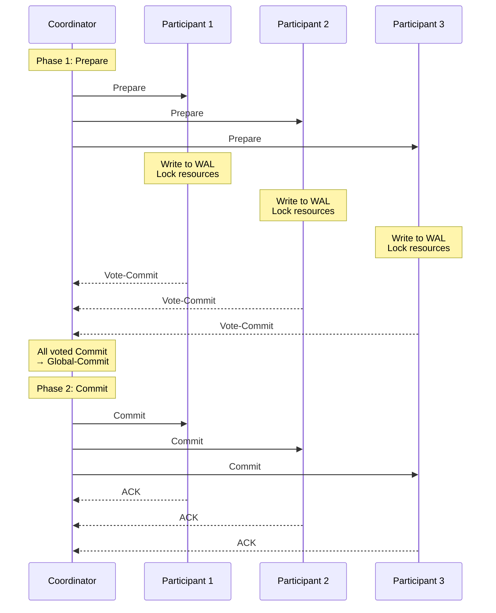

#### アボートの場合

いずれかの参加者が `Vote-Abort` を返した場合、コーディネータは全参加者にアボートを指示する。

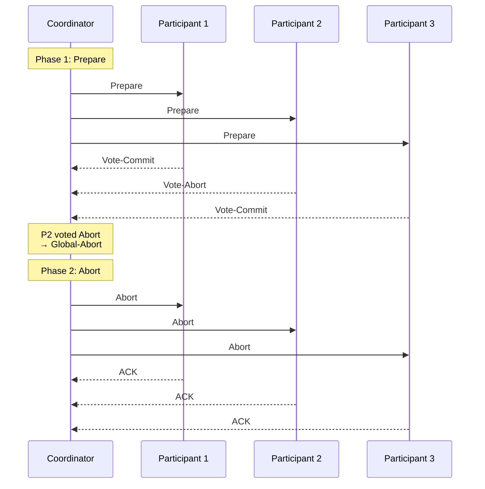

### 2.3 参加者の状態遷移

参加者のステートマシンを明示すると、2PCの動作がより明確になる。

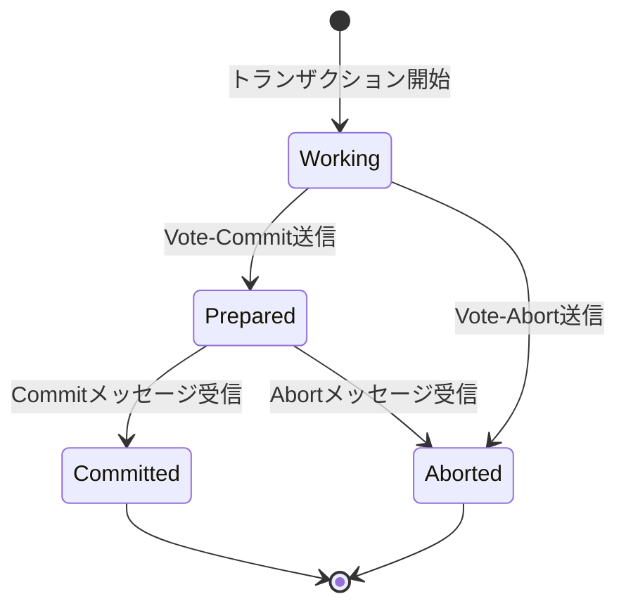

重要なのは **Prepared** 状態である。この状態にある参加者は、コーディネータからの指示を待つしかない。自分だけでコミットすることもアボートすることもできない。**この「待ち状態」こそが2PCの根本的な弱点**であり、後述するブロッキング問題の原因となる。

### 2.4 永続化の重要性

2PCが正しく機能するためには、コーディネータと参加者の双方が、プロトコルの各段階で適切にログを永続化する必要がある。

| タイミング | 永続化する内容 | 理由 |
|-----------|--------------|------|
| 参加者: `Vote-Commit` 送信前 | Prepareログ（Undo/Redoログ含む） | クラッシュ後にコミット/アボートどちらでも対応できるようにする |
| コーディネータ: Phase 2開始前 | コミット/アボートの決定 | クラッシュ後に同じ決定を再送できるようにする |
| 参加者: コミット/アボート実行後 | 完了ログ | クラッシュ後に二重実行を防ぐ |

特にコーディネータの決定ログの永続化は**コミットポイント（Commit Point）** と呼ばれ、分散トランザクション全体の運命を決する瞬間である。このログが書かれた瞬間に、トランザクションの結果は確定する。

## 3. 2PCの問題点

2PCは分散トランザクションの基本的な解法として広く使われているが、いくつかの深刻な問題を抱えている。

### 3.1 ブロッキング問題

2PCの最も致命的な問題は、**コーディネータが障害を起こした場合に参加者がブロックされる**ことである。

具体的なシナリオを考えよう。参加者P1がPhase 1で `Vote-Commit` を送信し、Prepared状態に入った直後に、コーディネータがクラッシュしたとする。P1は以下のジレンマに陥る。

- **コミットできない**: 他の参加者がアボートした可能性がある
- **アボートできない**: 他の参加者がすでにコミットした可能性がある
- **待つしかない**: コーディネータが復旧して決定を伝えてくれるのを待つ

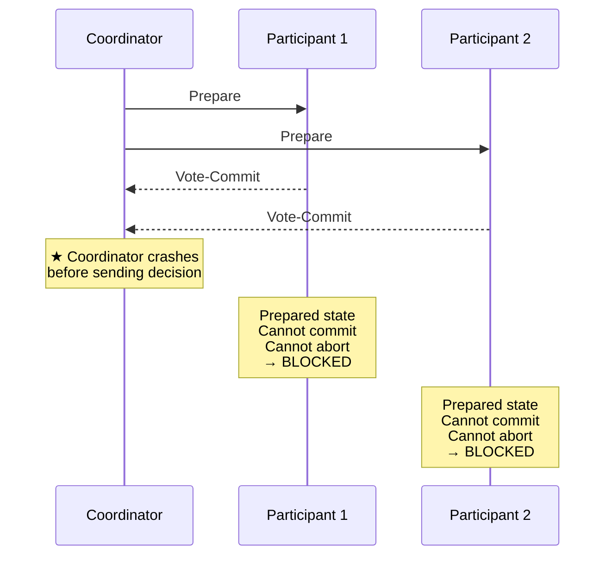

この間、参加者はトランザクションに関連するリソース（ロック、バッファなど）を保持し続けなければならない。コーディネータの復旧が遅れれば、そのリソースは長時間にわたってロックされ、他のトランザクションの実行を妨げる。

### 3.2 コーディネータの単一障害点

コーディネータは分散トランザクション全体の「決定権」を一手に握っている。コーディネータが利用できない場合、参加者は独立に正しい決定を下すことができない。これは**単一障害点（Single Point of Failure: SPOF）** である。

コーディネータの可用性を高めるためには、コーディネータ自体をレプリケーションするアプローチがある。たとえば、コーディネータの決定ログをRaftやPaxosで複製すれば、コーディネータの障害耐性を向上できる。しかし、これはシステムの複雑性を大幅に増加させる。

### 3.3 レイテンシ

2PCは最低でも**2ラウンドトリップ**を必要とする（Prepare + Commit）。地理的に分散したシステムでは、各ラウンドトリップに数十〜数百ミリ秒かかるため、トランザクションのレイテンシが大きくなる。

さらに、Prepareフェーズからコミットが完了するまでの間、関連するリソースはロックされ続けるため、スループットにも悪影響を与える。この**ロック保持時間の長さ**は、2PCを採用する際の実用上の大きな制約である。

### 3.4 ネットワーク分断時の挙動

ネットワーク分断が発生した場合、コーディネータと参加者の間で通信が不可能になることがある。この状況では、Prepared状態の参加者は無期限にブロックされる可能性がある。

まとめると、2PCは**安全性（Safety）は保証するが、活性（Liveness）は保証しない**プロトコルである。すなわち、「誤った決定を下すことはないが、決定に至らない可能性がある」。

## 4. 3PC（Three-Phase Commit）

### 4.1 2PCの問題への対処

2PCのブロッキング問題を解決するために、Dale Skeen（1981年）が提案したのが**3PC（Three-Phase Commit Protocol）** である。3PCの基本的な着想は、2PCのPhase 2を2つに分割し、**Pre-Commit**という中間フェーズを導入することで、参加者が独立にタイムアウトによる判断を行えるようにすることである。

### 4.2 プロトコルの流れ

3PCは以下の3つのフェーズで構成される。

1. **Phase 1: Voting（投票）** — 2PCと同様、コーディネータが参加者に `CanCommit?` を送信し、参加者が `Yes` または `No` で応答する
2. **Phase 2: Pre-Commit** — 全参加者が `Yes` の場合、コーディネータが `Pre-Commit` メッセージを送信する。参加者はこれを受信し、ACKを返す
3. **Phase 3: Do-Commit** — コーディネータが最終的な `Do-Commit` メッセージを送信し、参加者が実際にコミットを実行する

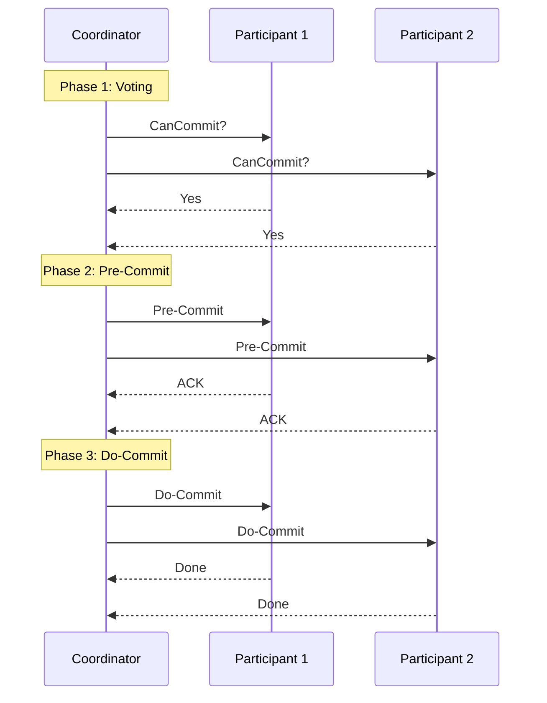

### 4.3 タイムアウトによる非ブロッキング

3PCがブロッキングを回避できる理由は、**Pre-Commit** フェーズの存在にある。

2PCでは、Prepared状態の参加者は「他の参加者がどう投票したか」を知らない。したがって、一方的にコミットもアボートもできない。

3PCでは、Pre-Commitメッセージを受け取った参加者は、「全参加者がYesと投票した」ことを知っている。したがって、コーディネータがDo-Commitの前にクラッシュしても、参加者同士で通信してコミットを進めることができる。

逆に、Pre-Commitメッセージを受け取っていない参加者は、タイムアウトによって安全にアボートできる。なぜなら、Pre-Commitが全参加者に到達していない段階では、まだ誰もコミットしていないことが保証されるからである。

| 状態 | タイムアウト時の判断 |
|------|-------------------|
| Phase 1でYes送信後、Pre-Commitを受信していない | → アボート |
| Pre-Commit受信後、Do-Commitを受信していない | → コミット可能（他の参加者と協調） |

### 4.4 3PCの限界

3PCは理論的にはブロッキングを回避するが、**実用上はほとんど採用されていない**。その理由は以下の通りである。

1. **ネットワーク分断に弱い**: 3PCの非ブロッキング特性は、**同期ネットワーク**（メッセージ遅延に上限がある）を前提としている。非同期ネットワーク（現実のネットワーク）では、ネットワーク分断が発生すると参加者が異なる判断を下し、**一貫性が破壊される可能性**がある

2. **具体的な問題シナリオ**: ネットワーク分断により、Pre-Commitを受信したグループと受信していないグループに分かれた場合、前者はコミットを進め、後者はアボートを実行するという矛盾が発生しうる

3. **レイテンシの増加**: 2PCの2ラウンドトリップに対し、3PCは3ラウンドトリップが必要であり、レイテンシがさらに悪化する

4. **複雑性の増加**: プロトコルの状態数が増え、実装とテストの難易度が上がる

このため、実世界のシステムでは3PCよりも、**2PCをベースにコーディネータの可用性を高める**（Paxosベースのコーディネータなど）アプローチが主流となっている。

## 5. Sagaパターン

### 5.1 Sagaの起源

2PCも3PCも、分散環境で「グローバルなAtomicity」を達成しようとするアプローチである。しかし、これらのプロトコルには本質的なコスト——ロック保持時間の長さ、コーディネータへの依存、レイテンシ——が伴う。

**Saga** は、1987年にHector Garcia-MolinaとKenneth Salemが論文「Sagas」で提案した、根本的に異なるアプローチである。Sagaの発想は大胆である。**「グローバルなAtomicityを諦め、各ローカルトランザクションを独立にコミットし、障害時は補償トランザクションで論理的に取り消す」**。

### 5.2 Sagaの基本概念

Sagaは、長時間トランザクション（Long-Lived Transaction: LLT）を、短いローカルトランザクションの列として分解する。

$$
\text{Saga} = T_1, T_2, T_3, \ldots, T_n
$$

各 $T_i$ は独立したローカルトランザクションであり、対応する**補償トランザクション（Compensating Transaction）** $C_i$ を持つ。

$$
\text{Compensations} = C_1, C_2, C_3, \ldots, C_{n-1}
$$

（$C_n$ は不要。$T_n$ が最後のトランザクションであり、$T_n$ が失敗したらそれ以前のトランザクションを補償すればよい。）

Sagaの実行は以下の2つのパターンのいずれかで終了する。

- **成功**: $T_1, T_2, \ldots, T_n$ がすべて成功
- **補償付き失敗**: $T_1, T_2, \ldots, T_j$ が成功し、$T_{j+1}$ が失敗した場合、$C_j, C_{j-1}, \ldots, C_1$ を逆順に実行

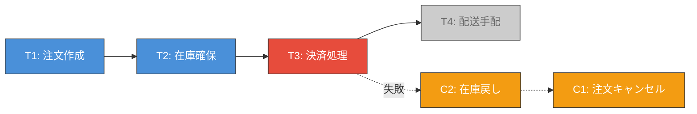

### 5.3 ECサイトの注文処理例

具体例として、ECサイトの注文処理をSagaで実装する場合を考えよう。

| ステップ | ローカルトランザクション | 補償トランザクション |
|---------|----------------------|-------------------|
| 1 | **注文作成**: 注文レコードを「作成中」で挿入 | **注文キャンセル**: 注文レコードを「キャンセル」に更新 |
| 2 | **在庫確保**: 商品の在庫を減らし、確保レコードを作成 | **在庫解放**: 在庫を元に戻し、確保レコードを削除 |
| 3 | **決済処理**: クレジットカードに課金 | **返金処理**: クレジットカードに返金 |
| 4 | **配送手配**: 配送業者にリクエスト送信 | **配送キャンセル**: 配送業者にキャンセルリクエスト |
| 5 | **注文確定**: 注文レコードを「確定」に更新 | —（最終ステップ） |

### 5.4 Choreography vs Orchestration

Sagaの実装方式には、大きく2つのアプローチがある。

#### Choreography（振付）方式

各サービスがイベントを発行し、次のサービスがそのイベントを購読して処理を進める。中央の制御者は存在しない。

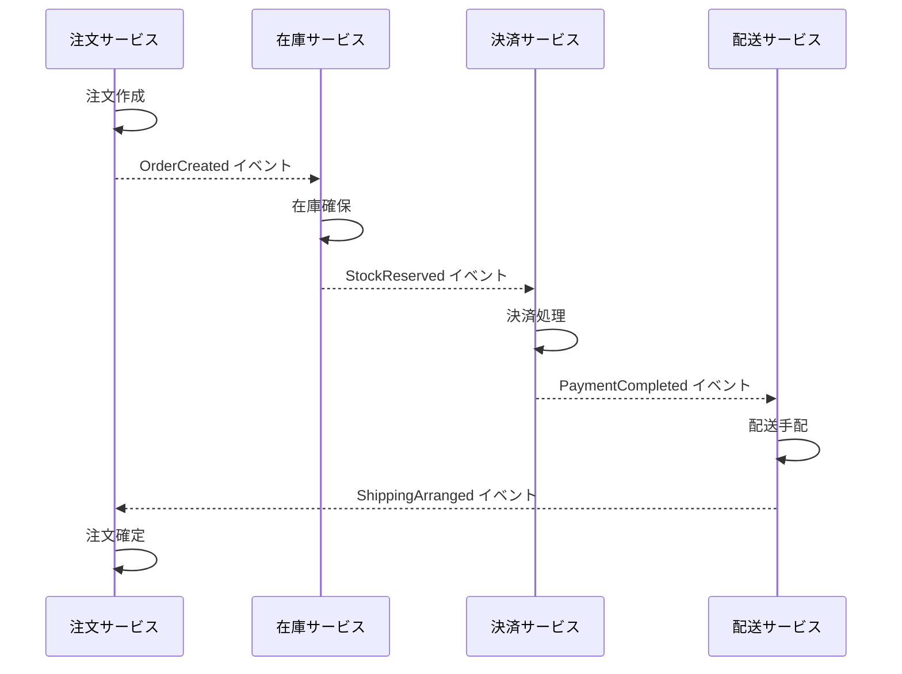

**Choreography方式の利点**:

- サービス間の疎結合が保たれる
- 単一障害点がない
- 新しいサービスの追加が比較的容易

**Choreography方式の欠点**:

- Sagaの全体像が把握しにくい（ロジックがサービス間に分散）
- サービス間の暗黙的な依存関係が生まれる
- デバッグやテストが困難
- 循環的な依存が発生するリスク

#### Orchestration（指揮）方式

Saga Orchestrator（オーケストレータ）と呼ばれる中央コンポーネントが、各サービスへのコマンド送信と応答の処理を管理する。

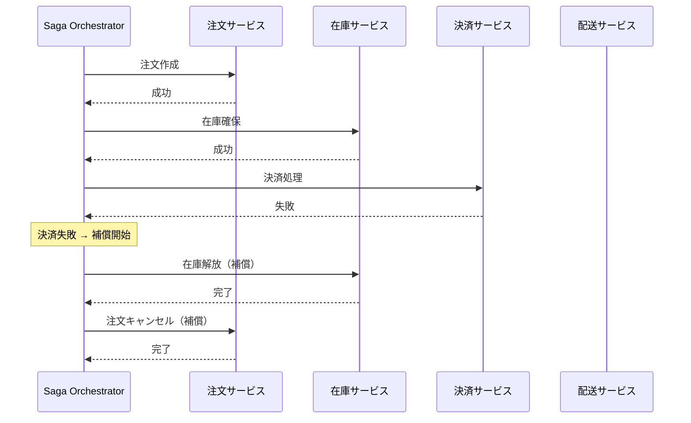

**Orchestration方式の利点**:

- Sagaの全体フローが一箇所に集約され、把握しやすい
- 複雑な条件分岐やリトライロジックの実装が容易
- テストしやすい（オーケストレータ単体でテスト可能）

**Orchestration方式の欠点**:

- オーケストレータが集中的なロジックを持つことで、ビジネスロジックがサービスから流出するリスク
- オーケストレータの可用性が重要になる（ただし、オーケストレータ自体はステートレスに設計できる）

### 5.5 実世界での選択指針

実務的な選択としては、以下が一般的な指針である。

- **2〜3サービスの単純なフロー** → Choreography
- **4サービス以上、複雑な分岐・リトライが必要** → Orchestration
- **フローの可視化・監視が重要** → Orchestration

多くの実プロジェクトでは、Orchestration方式が採用されることが多い。理由は明快で、Sagaのフロー全体を「ひとつのステートマシン」として表現・管理できることのメリットが、疎結合のメリットを上回ることが多いからである。

## 6. 補償トランザクション

### 6.1 補償トランザクションの設計原則

Sagaパターンにおいて、補償トランザクションの設計は最も困難かつ重要な部分である。補償トランザクションは「元に戻す」操作であるが、**単純なUndoではない**。

単一データベースのロールバック（Undo）は、コミット前の状態に物理的に巻き戻す操作であり、他のトランザクションからは元の操作が「なかったこと」になる。しかし、Sagaの補償トランザクションは、すでにコミットされたトランザクションに対する**意味的な逆操作**である。

```
# Undo（物理的巻き戻し）
INSERT INTO orders (id, status) VALUES (1, 'created');
-- Undo: DELETE FROM orders WHERE id = 1;  ← レコードの存在自体を消す

# 補償トランザクション（意味的逆操作）
INSERT INTO orders (id, status) VALUES (1, 'created');
-- Compensate: UPDATE orders SET status = 'cancelled' WHERE id = 1;  ← 履歴は残る
```

### 6.2 補償トランザクションの設計ガイドライン

| 原則 | 説明 |
|------|------|
| **冪等性（Idempotency）** | 同じ補償トランザクションを複数回実行しても結果が変わらないようにする。ネットワークのリトライにより重複実行される可能性がある |
| **可換性（Commutativity）への配慮** | 補償トランザクションの実行順序が前後しても正しく動作するよう設計する（理想的には） |
| **交換不可能な操作への対策** | メール送信、外部APIへの通知など、物理的に取り消せない操作は「お詫びメール送信」のような意味的な補償が必要 |
| **リトライ可能性** | 補償トランザクション自体が失敗した場合にリトライできるよう、べき等に設計する |

### 6.3 補償が困難なケース

実務では、補償が本質的に困難なケースが少なからず存在する。

1. **外部システムへの通知**: メール、SMS、Webhook通知などを送った後に「取り消す」ことは物理的にできない。送信済みの通知に対しては、訂正通知を別途送るしかない

2. **金融取引の確定**: クレジットカードへの課金後の返金は可能だが、即座ではなく処理に時間がかかる。また、返金手数料が発生する場合もある

3. **物理的なアクション**: 商品がすでに出荷された後のキャンセルは、返品フローが必要になる

4. **タイムウィンドウの問題**: 補償トランザクションが実行されるまでの間に、不整合な状態が他のトランザクションから見える。たとえば、在庫が一時的に二重に引き当てられる可能性がある

これらの問題に対しては、ビジネスレベルでの対応（例外処理フロー、手動介入の仕組み）を含めた包括的な設計が求められる。

### 6.4 Sagaの分離性の問題

Sagaは2PCと異なり、**グローバルなIsolationを提供しない**。各ローカルトランザクションは独立にコミットされるため、中間状態が他のトランザクションから見える。

この問題に対する一般的な対策は以下の通りである。

| 対策 | 説明 |
|------|------|
| **Semantic Lock** | ビジネスレベルのフラグ（例: 注文ステータスを「処理中」にする）で、他のSagaからの干渉を防ぐ |
| **Commutative Updates** | 操作を交換可能に設計する（例: 残高を「セット」ではなく「増減」で操作する） |
| **Pessimistic View** | Sagaの実行順序を工夫し、ビジネス上のリスクが高い操作を先に実行する |
| **Reread Value** | 補償やリトライの前に最新値を読み直し、楽観的並行制御を適用する |
| **Version File** | 操作の順序を記録し、順序どおりに適用する |

## 7. Percolatorモデル — Googleの分散トランザクション

### 7.1 背景

2PC、3PC、Sagaとは異なるアプローチとして、Googleが2010年の論文「Large-scale Incremental Processing Using Distributed Transactions and Notifications」で発表した**Percolator**がある。Percolatorは、Bigtableの上に分散トランザクションを実装するためのライブラリであり、Google Spannerのトランザクションモデルの基礎ともなった。

Percolatorの核心的なアイデアは、**分散ロックをデータと一緒にストレージに格納する**ことで、コーディネータの単一障害点問題を緩和するアプローチである。

### 7.2 基本メカニズム

Percolatorは、MVCCとSnapshotIsolationをベースとした楽観的並行制御を用いる。各トランザクションには開始タイムスタンプ（start_ts）とコミットタイムスタンプ（commit_ts）が割り当てられる。タイムスタンプは**Timestamp Oracle（TSO）** と呼ばれる中央サービスから取得する。

データの格納には、Bigtableの列ファミリを活用して以下の3つのカラムを使用する。

| カラム | 役割 |
|--------|------|
| **data** | 実際の値を、タイムスタンプ付きで格納 |
| **lock** | トランザクションによるロック情報を格納 |
| **write** | コミット済みの値がどのタイムスタンプに存在するかを記録 |

### 7.3 コミットプロトコル

Percolatorのコミットは2フェーズで行われるが、2PCとは異なる特徴を持つ。

**Phase 1: Prewrite**

トランザクションが書き込む各行に対して、以下を実行する。

1. 競合するロックや、自分のstart_ts以降のwriteレコードがないか確認
2. 競合がなければ、data列に値を書き込み、lock列にロックを書き込む
3. 最初に書き込む行を**Primary**として選び、他の行のロックはPrimaryへのポインタを持つ

**Phase 2: Commit**

1. Primaryの行のlock列を削除し、write列にコミットレコードを書き込む（これがコミットポイント）
2. 残りの行について同様にlock列を削除し、write列を書き込む

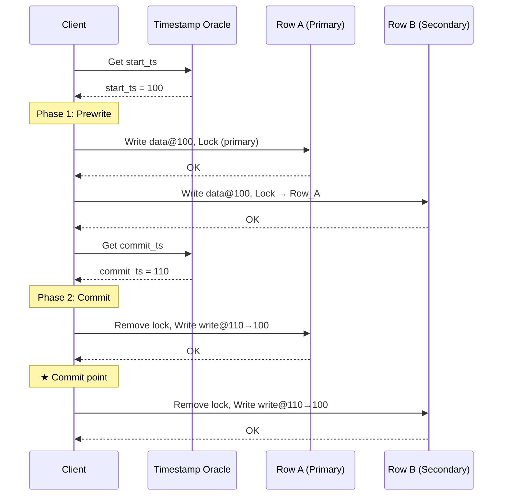

### 7.4 障害耐性

Percolatorの重要な特性は、**コーディネータ（クライアント）がクラッシュしてもシステムが回復可能**であることだ。

- **Prewrite中のクラッシュ**: ロックが残るが、コミットされていないため、他のトランザクションがロックを検出した際に、Primary行を確認してロールバックできる
- **Commit中（Primary書き込み後）のクラッシュ**: Primaryのwrite列にコミットレコードが存在するため、他のトランザクションがSecondary行のロックを検出した際に、Primaryを確認してコミットを代行（Roll Forward）できる
- **Commit中（Primary書き込み前）のクラッシュ**: Primaryにロックのみが残っている状態であり、他のトランザクションがロールバックできる

この「ロック情報をデータと一緒にストレージに格納する」設計により、コーディネータの障害時にも他のトランザクションが**遅延クリーンアップ（Lazy Cleanup）** によってロックを解決できる。これは2PCのブロッキング問題に対する実用的な解決策である。

### 7.5 Spannerとの関係

Google Spannerは、Percolatorのトランザクションモデルを拡張し、**TrueTime**（原子時計とGPSに基づくグローバル時刻サービス）を組み合わせることで、**外部整合性（External Consistency）** を実現した。TrueTimeにより、トランザクションのタイムスタンプの順序がリアルタイムの順序と一致することが保証される。

Spannerでは、Percolatorの2フェーズコミットにPaxosベースのレプリケーションを組み合わせ、各シャード（Spannerでは「Split」）のリーダーがPaxosグループのリーダーとして機能する。これにより、ノード障害時にもPaxosによるリーダー選出でトランザクションの継続が可能となる。

## 8. 実世界での実装

### 8.1 XA（eXtended Architecture）

**XA** は、The Open Groupが1991年に策定した、分散トランザクションの標準インターフェースである。XAは2PCを標準化し、Transaction Manager（TM）とResource Manager（RM）の間のインターフェースを定義する。

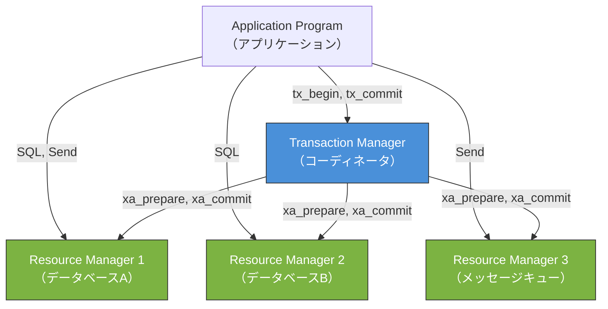

XAの主要なインターフェースは以下の通りである。

| 関数 | 役割 |
|------|------|
| `xa_open` / `xa_close` | RMとの接続の開始・終了 |
| `xa_start` / `xa_end` | トランザクションブランチの開始・終了 |
| `xa_prepare` | Phase 1: Prepare |
| `xa_commit` | Phase 2: Commit |
| `xa_rollback` | Phase 2: Rollback |
| `xa_recover` | 障害復旧時に未決トランザクションの一覧を取得 |

XAは多くのRDBMS（MySQL, PostgreSQL, Oracle）とメッセージブローカー（ActiveMQ, IBM MQ）がサポートしており、Java環境ではJTA（Java Transaction API）を通じて利用される。

**XAの実用上の課題**:

- **ロック保持時間が長い**: 2PCのPrepareからCommitまでの間、関連する行がロックされる
- **コーディネータ障害時のブロッキング**: 2PCの本質的な問題を継承する
- **パフォーマンスの制約**: ネットワーク遅延と同期的な永続化がスループットを制限する
- **運用の複雑性**: `xa_recover` による未決トランザクションの手動解決が必要になることがある

### 8.2 Google Spanner

Google Spannerは、グローバルに分散したNewSQLデータベースであり、Percolatorモデルの2PC + Paxos + TrueTimeの組み合わせにより、以下を同時に達成する。

- **外部整合性**: トランザクションの順序が実時間の順序と一致
- **強い一貫性**: Serializableな分離レベルをグローバルに提供
- **高可用性**: Paxosによるレプリケーションで、ノード障害に耐える

Spannerのアーキテクチャは以下の階層構造を持つ。

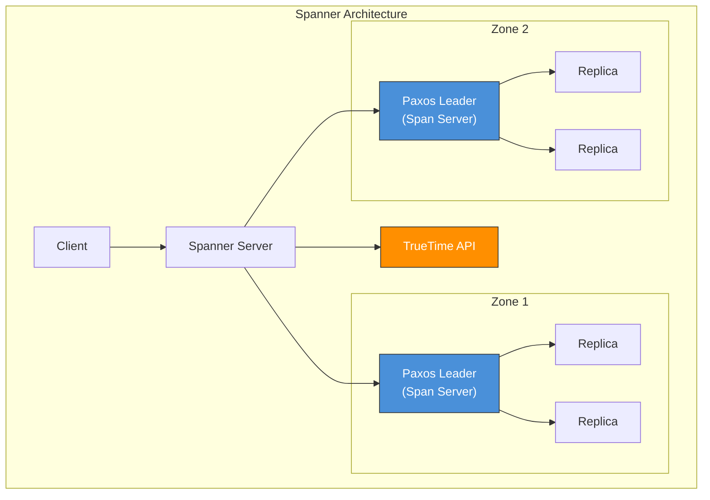

**TrueTimeの仕組み**: TrueTimeは `TT.now()` を呼び出すと、現在時刻の**区間** `[earliest, latest]` を返す。Spannerは、コミット時にこの不確実性区間分だけ待機（Commit Wait）することで、トランザクションの順序が実時間の順序と一致することを保証する。

### 8.3 CockroachDB

CockroachDBは、Google Spannerに触発されたオープンソースの分散SQLデータベースである。Spannerと同様にSerializableな分散トランザクションを提供するが、TrueTime（原子時計）を持たない環境でも動作するよう設計されている。

CockroachDBのトランザクションモデルは、Percolatorに近い。各トランザクションにはタイムスタンプが割り当てられ、Write IntentとしてMVCCストレージに書き込まれる。コミット時には、Transaction Recordと呼ばれるメタデータを更新することでアトミックにコミットを確定させる。

TrueTimeの代わりに、CockroachDBは**HLC（Hybrid Logical Clock）** を使用する。HLCは物理時計と論理時計を組み合わせたもので、ノード間の時刻のずれを検出し、必要に応じてトランザクションをリトライすることで一貫性を保つ。

ただし、TrueTimeがないため、Spannerほど強い保証（Strict Serializable / External Consistency）は提供できず、CockroachDBは**Serializable Snapshot Isolation**を採用している。最近のバージョンでは、不確実性区間の管理が改善され、実用上はSpannerに近い挙動を実現している。

### 8.4 TiDB

TiDBは、PingCAPが開発するMySQL互換の分散SQLデータベースであり、Percolatorモデルを採用している。アーキテクチャは以下の主要コンポーネントで構成される。

| コンポーネント | 役割 |
|--------------|------|
| **TiDB Server** | SQL解析、クエリ最適化、トランザクション制御を行うステートレスなSQLレイヤー |
| **TiKV** | Raftベースの分散KVストア。実データを格納する |
| **PD (Placement Driver)** | Timestamp Oracleとクラスタメタデータの管理 |

TiDBのトランザクションはPercolatorとほぼ同じプロトコルで実行される。PDがTimestamp Oracleの役割を果たし、TiKVの各Raftグループ上でPrewriteとCommitの操作を実行する。

## 9. 各アプローチの比較

ここまで見てきた各アプローチの特性を整理する。

| 特性 | 2PC | 3PC | Saga | Percolator |
|------|-----|-----|------|------------|
| **Atomicity** | グローバル | グローバル | ローカル + 補償 | グローバル |
| **Isolation** | あり（ロックベース） | あり（ロックベース） | なし（中間状態が見える） | あり（Snapshot Isolation） |
| **ブロッキング** | あり | なし（同期ネットワーク前提） | なし | 実質なし（Lazy Cleanup） |
| **レイテンシ** | 2 RTT | 3 RTT | 各ステップ1 RTT | 2 RTT |
| **コーディネータ依存** | 強い | 弱い | なし（Choreography）/ あり（Orchestration） | 弱い |
| **実装複雑度** | 中 | 高 | 中〜高（補償設計） | 高 |
| **ネットワーク分断耐性** | 弱い | 弱い | 強い | 中 |
| **実用例** | XA, 多数のDB | ほぼなし | マイクロサービス | Spanner, TiDB, CockroachDB |

## 10. 設計上の教訓

### 10.1 分散トランザクションを避けられないか？

分散トランザクションの設計における最初の教訓は、**「分散トランザクションが本当に必要かを再考せよ」**ということである。

Pat Hellandが2007年のCIDR論文「Life Beyond Distributed Transactions: An Apostate's Opinion」で述べたように、大規模なスケーラブルシステムでは分散トランザクションの使用を最小限にすることが望ましい。

具体的には、以下のアプローチで分散トランザクションの必要性を減らせることが多い。

- **データのローカリティ**: 関連するデータを同じパーティション/シャードに配置する
- **サービス境界の再設計**: 強い整合性が必要なデータは同一サービス内に収める
- **結果整合性の受容**: ビジネス要件を精査し、即座の整合性が本当に必要かを確認する

### 10.2 正しいアプローチの選択

分散トランザクションが避けられない場合、以下のフローチャートが選択の指針となる。

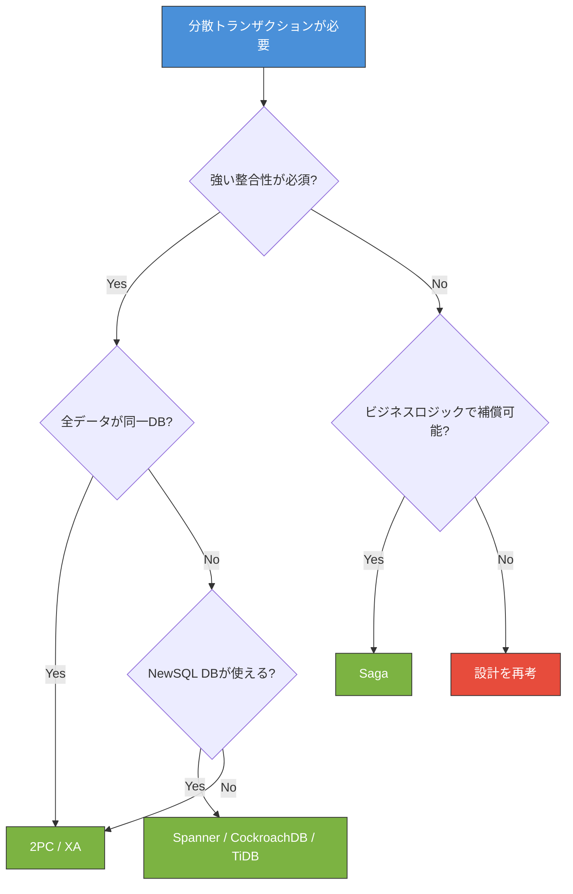

### 10.3 実装上の鉄則

分散トランザクションを実装する際に、守るべき実践的な鉄則を以下にまとめる。

**冪等性の確保**: 分散環境ではネットワークの再送やリトライにより、同じ操作が複数回実行される可能性がある。すべての操作（特に補償トランザクション）は冪等に設計しなければならない。

```go
// Bad: non-idempotent
func deductBalance(accountID string, amount int) error {
    // If retried, balance will be deducted twice
    return db.Exec("UPDATE accounts SET balance = balance - ? WHERE id = ?", amount, accountID)
}

// Good: idempotent with deduplication key
func deductBalance(accountID string, amount int, txID string) error {
    // Use transaction ID for idempotency check
    _, err := db.Exec(`
        INSERT INTO balance_operations (tx_id, account_id, amount)
        VALUES (?, ?, ?)
        ON CONFLICT (tx_id) DO NOTHING
    `, txID, accountID, amount)
    if err != nil {
        return err
    }
    return db.Exec("UPDATE accounts SET balance = balance - ? WHERE id = ?", amount, accountID)
}
```

**タイムアウトの設計**: すべての分散操作にはタイムアウトを設定する。タイムアウト後の挙動（リトライ、アボート、エスカレーション）を明確に定義しておく。

**可観測性の確保**: 分散トランザクションの状態は複数のノードにまたがるため、トレーシング（Distributed Tracing）を必ず組み込む。トランザクションIDをすべてのメッセージとログに含め、エンドツーエンドでのデバッグを可能にする。

**手動介入の仕組み**: どれだけ自動化しても、分散システムでは予期しない障害パターンが発生する。未決トランザクション（In-Doubt Transaction）を検出し、管理者が手動で解決できるダッシュボードやツールを必ず用意する。

### 10.4 歴史が教えること

分散トランザクションの歴史は、**完璧な解はない**ことを繰り返し示してきた。

- 2PCは安全だがブロッキングする
- 3PCはブロッキングを回避するが、ネットワーク分断に弱い
- Sagaは可用性が高いが、Isolationを犠牲にする
- Percolatorは実用的だが、Timestamp Oracleという中央コンポーネントに依存する
- Spannerは強力だが、TrueTimeというハードウェアインフラが必要である

この事実は、分散トランザクションの設計がFLP不可能性定理やCAP定理の制約の中で行われていることを反映している。重要なのは、**自分のシステムが本当に必要とする保証のレベルを正確に理解し、それに見合ったトレードオフを選択する**ことである。

> "Distributed transactions are the antithesis of availability."
>
> — Pat Helland, "Life Beyond Distributed Transactions" (2007)

すべてのデータに対してSerializableな一貫性が必要なわけではない。注文の確定と在庫の更新は強い整合性が必要かもしれないが、推薦エンジンの更新やログの集計は結果整合性で十分かもしれない。この粒度での要件分析こそが、分散トランザクションの設計における最も重要な作業である。
