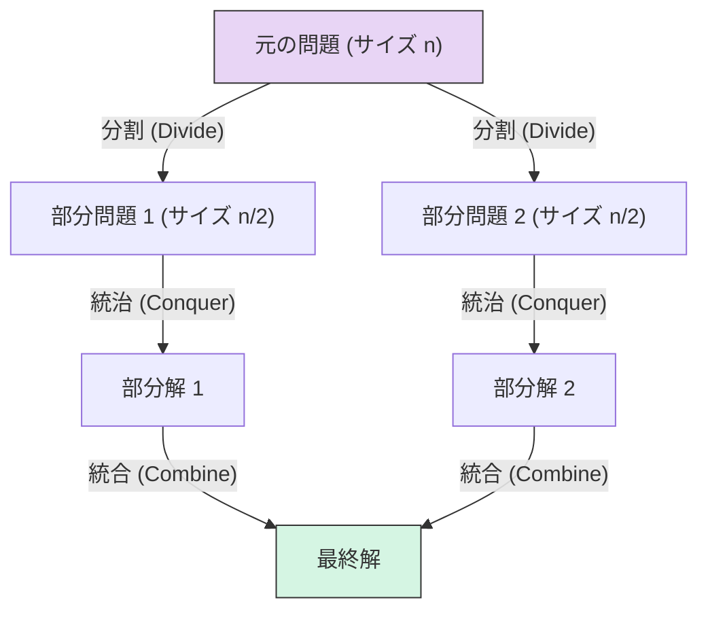
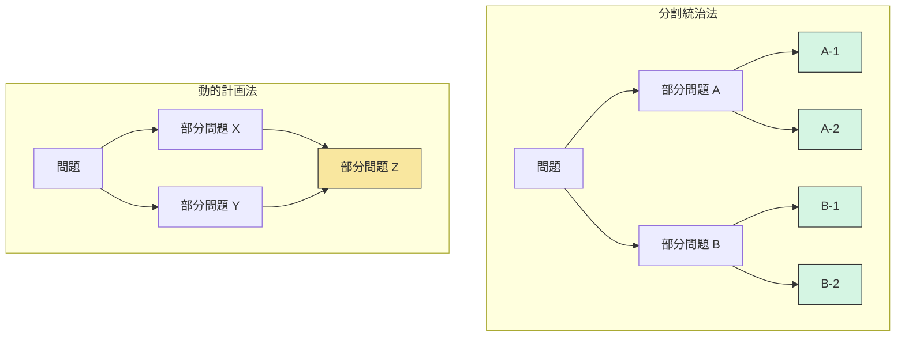
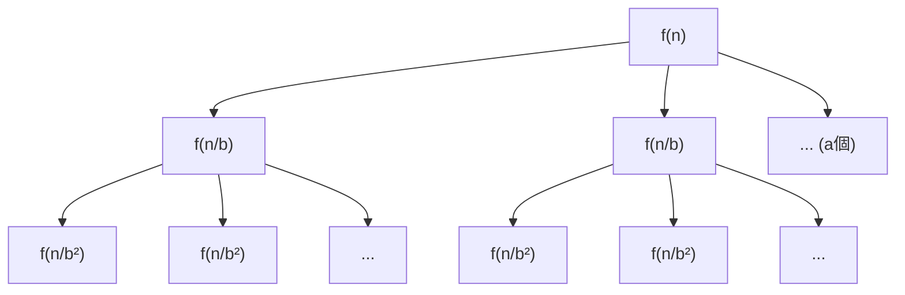
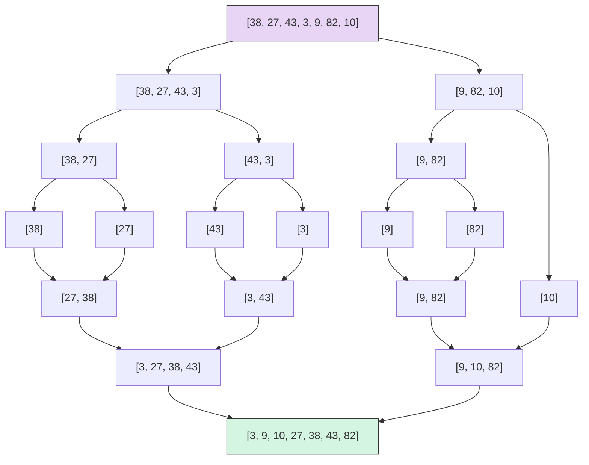
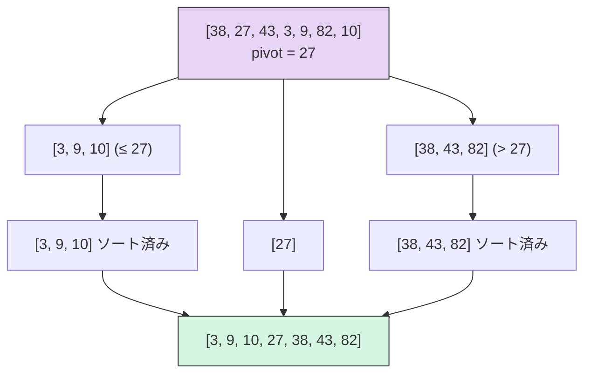

# 分割統治法

## 1. 背景と動機：分割統治法の基本原理

### 1.1 問題を分割するという発想

大きな問題を一度に解こうとすると、その複雑さに圧倒される。しかし、問題を小さな部分に分割し、それぞれを独立に解き、結果を統合すれば、全体を効率的に処理できることがある。この発想は日常生活にも見られる。例えば、1000枚のカードをアルファベット順に並べる作業を想像してほしい。1000枚を一度に整列させるのは困難だが、500枚ずつの2つの山に分け、それぞれを整列させてから、2つの整列済みの山を統合する方がはるかに見通しがよい。さらに、500枚の整列も同じ手法で250枚ずつに分割できる。

この「分割して、解いて、統合する」という戦略こそが**分割統治法**（Divide and Conquer）である。分割統治法は、計算機科学において最も基本的かつ強力なアルゴリズム設計パラダイムの一つであり、ソート、探索、数値計算、幾何計算、信号処理など、驚くほど広範な問題に適用される。

### 1.2 分割統治法の3つのステップ

分割統治法は、以下の3つのステップで構成される。

1. **分割（Divide）**: 元の問題を、同じ構造を持つ（しかしサイズの小さい）複数の部分問題に分割する。
2. **統治（Conquer）**: 各部分問題を再帰的に解く。部分問題のサイズが十分小さくなったら（ベースケース）、直接解く。
3. **統合（Combine）**: 部分問題の解を組み合わせて、元の問題の解を構成する。



この3ステップの構造を一般的な擬似コードで表すと、次のようになる。

```
function DivideAndConquer(problem):
    // Base case
    if problem is small enough:
        return solve directly

    // Divide
    subproblems = split(problem)

    // Conquer
    subsolutions = []
    for each subproblem in subproblems:
        subsolutions.append(DivideAndConquer(subproblem))

    // Combine
    return combine(subsolutions)
```

### 1.3 分割統治法と動的計画法の違い

分割統治法と動的計画法（DP）は、いずれも問題を部分問題に分割して解くという共通点を持つが、本質的な違いがある。

- **部分問題の重複**: 分割統治法では、分割された部分問題は互いに**重複しない**（disjoint）。一方、動的計画法が威力を発揮するのは、部分問題が**重複する**場合である。
- **メモ化の必要性**: 部分問題が重複しないため、分割統治法では通常メモ化は不要である。動的計画法では、同じ部分問題の再計算を避けるためにメモ化（あるいはテーブルへの記録）が不可欠である。



上図の右側が示すように、動的計画法では部分問題 Z が X と Y の両方から参照される（重複部分問題）。分割統治法では、各部分問題の処理範囲は完全に分離している。

### 1.4 歴史的背景

分割統治法の概念は、数学とアルゴリズムの歴史において非常に古い。**カール・フリードリヒ・ガウス**は1805年頃に高速フーリエ変換（FFT）の原型となる手法を使って天文学的計算を行ったとされており、これは分割統治法の初期の応用例と見なされている。**ジョン・フォン・ノイマン**は1945年にマージソートを考案し、分割統治法を計算機アルゴリズムの文脈で初めて体系的に適用した人物の一人となった。

その後、1960年代の**Anatolii Karatsuba**による高速乗算アルゴリズム、1969年の**Volker Strassen**による行列乗算アルゴリズム、1965年の**Cooley-Tukey**による FFT アルゴリズムなど、分割統治法は計算機科学の主要なブレークスルーを次々と生み出してきた。

## 2. 漸化式と計算量解析

分割統治法アルゴリズムの計算量を解析するには、再帰の構造を**漸化式**（recurrence relation）として定式化し、その解を求める。

### 2.1 一般的な漸化式

サイズ $n$ の問題を $a$ 個のサイズ $n/b$ の部分問題に分割し、分割と統合にかかるコストが $f(n)$ であるとき、計算量 $T(n)$ は次の漸化式で表される。

$$
T(n) = aT\left(\frac{n}{b}\right) + f(n)
$$

ここで、
- $a \geq 1$: 部分問題の個数
- $b > 1$: 部分問題のサイズの縮小率
- $f(n)$: 分割と統合にかかるコスト

### 2.2 再帰木による直観的理解

漸化式の解を直観的に理解するために、**再帰木**（recursion tree）を用いる方法がある。再帰木は、再帰呼び出しの各レベルにおけるコストを視覚的に表現したものである。



再帰木の各レベルについて考えると、次のようになる。

| レベル | 部分問題の数 | 各部分問題のサイズ | レベルの総コスト |
|:---:|:---:|:---:|:---:|
| 0 | $1$ | $n$ | $f(n)$ |
| 1 | $a$ | $n/b$ | $a \cdot f(n/b)$ |
| 2 | $a^2$ | $n/b^2$ | $a^2 \cdot f(n/b^2)$ |
| $\vdots$ | $\vdots$ | $\vdots$ | $\vdots$ |
| $k$ | $a^k$ | $n/b^k$ | $a^k \cdot f(n/b^k)$ |

木の深さは $\log_b n$ であり、最下層（葉ノード）の数は $a^{\log_b n} = n^{\log_b a}$ である。したがって、総コストは以下のように書ける。

$$
T(n) = \sum_{k=0}^{\log_b n} a^k \cdot f\left(\frac{n}{b^k}\right)
$$

### 2.3 マスター定理（Master Theorem）

**マスター定理**は、$T(n) = aT(n/b) + f(n)$ の形の漸化式に対して、$f(n)$ と $n^{\log_b a}$ の大小関係に基づいて解を直接与える強力な道具である。

::: tip マスター定理
$T(n) = aT(n/b) + f(n)$ において、$a \geq 1$, $b > 1$ とし、$c_{\mathrm{crit}} = \log_b a$ とおく。

**ケース 1**: $f(n) = O(n^{c_{\mathrm{crit}} - \varepsilon})$ （ある $\varepsilon > 0$ に対して）のとき、再帰の仕事量が支配的であり、

$$T(n) = \Theta(n^{c_{\mathrm{crit}}})$$

**ケース 2**: $f(n) = \Theta(n^{c_{\mathrm{crit}}} \log^k n)$ （$k \geq 0$）のとき、各レベルの仕事量がほぼ均等であり、

$$T(n) = \Theta(n^{c_{\mathrm{crit}}} \log^{k+1} n)$$

**ケース 3**: $f(n) = \Omega(n^{c_{\mathrm{crit}} + \varepsilon})$ （ある $\varepsilon > 0$ に対して）かつ正則条件 $af(n/b) \leq cf(n)$ （ある $c < 1$, 十分大きい $n$ に対して）を満たすとき、統合の仕事量が支配的であり、

$$T(n) = \Theta(f(n))$$
:::

直観的には、マスター定理は「再帰の末端（葉ノード）での仕事」と「各レベルでの分割・統合の仕事」のどちらが支配的かを判定している。

- **ケース 1**: 葉ノードの仕事が支配的 → $n^{\log_b a}$ 個の葉ノードが計算量を決める
- **ケース 2**: 各レベルの仕事がほぼ等しい → $\log n$ レベル分の仕事の合計
- **ケース 3**: ルート付近の仕事が支配的 → $f(n)$ が計算量を決める

### 2.4 マスター定理の適用例

代表的な分割統治アルゴリズムにマスター定理を適用してみよう。

| アルゴリズム | 漸化式 | $a$ | $b$ | $\log_b a$ | $f(n)$ | ケース | 結果 |
|:---|:---|:---:|:---:|:---:|:---|:---:|:---|
| 二分探索 | $T(n) = T(n/2) + O(1)$ | 1 | 2 | 0 | $O(1)$ | 2 ($k=0$) | $\Theta(\log n)$ |
| マージソート | $T(n) = 2T(n/2) + O(n)$ | 2 | 2 | 1 | $O(n)$ | 2 ($k=0$) | $\Theta(n \log n)$ |
| Karatsuba乗算 | $T(n) = 3T(n/2) + O(n)$ | 3 | 2 | $\approx 1.585$ | $O(n)$ | 1 | $\Theta(n^{1.585})$ |
| Strassen行列乗算 | $T(n) = 7T(n/2) + O(n^2)$ | 7 | 2 | $\approx 2.807$ | $O(n^2)$ | 1 | $\Theta(n^{2.807})$ |

### 2.5 Akra-Bazzi法

マスター定理は $T(n) = aT(n/b) + f(n)$ の形の漸化式にしか適用できない。部分問題のサイズが均等でない場合（例えば $T(n) = T(n/3) + T(2n/3) + O(n)$）には、**Akra-Bazzi法**を用いる。

Akra-Bazzi法は、次の形の漸化式を扱う。

$$
T(n) = \sum_{i=1}^{k} a_i T(b_i n) + f(n)
$$

ここで $a_i > 0$, $0 < b_i < 1$ である。このとき、$\sum_{i=1}^{k} a_i b_i^p = 1$ を満たす $p$ を求めれば、

$$
T(n) = \Theta\left(n^p\left(1 + \int_1^n \frac{f(u)}{u^{p+1}} du\right)\right)
$$

となる。

例えば、$T(n) = T(n/3) + T(2n/3) + O(n)$ の場合、$p$ は $(1/3)^p + (2/3)^p = 1$ を満たす値であり、$p = 1$ が解である。したがって、

$$
T(n) = \Theta\left(n\left(1 + \int_1^n \frac{u}{u^2} du\right)\right) = \Theta(n(1 + \ln n)) = \Theta(n \log n)
$$

となる。これはマージソートと同じオーダーであり、不均等分割であっても統合コストが線形であれば $O(n \log n)$ に収まることを示している。

## 3. 代表的アルゴリズム：マージソートとクイックソート

### 3.1 マージソート

**マージソート**（Merge Sort）は、分割統治法の最も教科書的な応用例であり、John von Neumann が1945年に考案した。

#### アルゴリズムの概要

1. **分割**: 配列を中央で二等分する。
2. **統治**: 各半分を再帰的にソートする。
3. **統合**: 2つのソート済み配列をマージする。



#### 実装

```python
def merge_sort(arr):
    # Base case
    if len(arr) <= 1:
        return arr

    # Divide
    mid = len(arr) // 2
    left = merge_sort(arr[:mid])
    right = merge_sort(arr[mid:])

    # Combine (merge)
    return merge(left, right)


def merge(left, right):
    result = []
    i, j = 0, 0

    # Merge two sorted arrays
    while i < len(left) and j < len(right):
        if left[i] <= right[j]:
            result.append(left[i])
            i += 1
        else:
            result.append(right[j])
            j += 1

    # Append remaining elements
    result.extend(left[i:])
    result.extend(right[j:])
    return result
```

#### 計算量解析

マージソートの漸化式は以下の通りである。

$$
T(n) = 2T\left(\frac{n}{2}\right) + \Theta(n)
$$

- $a = 2$, $b = 2$ なので $\log_b a = 1$
- $f(n) = \Theta(n) = \Theta(n^1)$
- マスター定理のケース 2（$k = 0$）により $T(n) = \Theta(n \log n)$

マージソートの重要な特徴は以下の通りである。

| 特性 | 値 |
|:---|:---|
| 最良計算量 | $O(n \log n)$ |
| 平均計算量 | $O(n \log n)$ |
| 最悪計算量 | $O(n \log n)$ |
| 空間計算量 | $O(n)$ |
| 安定性 | 安定ソート |

入力データの分布に関わらず $O(n \log n)$ が保証されるという点は、マージソートの大きな強みである。一方、$O(n)$ の追加メモリを必要とする点がデメリットである。

### 3.2 クイックソート

**クイックソート**（Quick Sort）は、1960年に **Tony Hoare** によって考案された。クイックソートもまた分割統治法に基づくが、マージソートとは「仕事をする場所」が異なる。マージソートでは**統合**フェーズに仕事が集中するのに対し、クイックソートでは**分割**フェーズに仕事が集中する。

#### アルゴリズムの概要

1. **分割**: ピボット（pivot）を選び、配列を「ピボット以下」と「ピボット以上」の2つに分ける（パーティション）。
2. **統治**: 各部分配列を再帰的にソートする。
3. **統合**: 何もしなくてよい（パーティションの時点で正しい位置関係が保証されている）。



#### 実装

```python
def quicksort(arr, lo, hi):
    if lo < hi:
        # Divide: partition around pivot
        pivot_index = partition(arr, lo, hi)

        # Conquer: recursively sort subarrays
        quicksort(arr, lo, pivot_index - 1)
        quicksort(arr, pivot_index + 1, hi)


def partition(arr, lo, hi):
    # Use last element as pivot (Lomuto scheme)
    pivot = arr[hi]
    i = lo - 1

    for j in range(lo, hi):
        if arr[j] <= pivot:
            i += 1
            arr[i], arr[j] = arr[j], arr[i]

    arr[i + 1], arr[hi] = arr[hi], arr[i + 1]
    return i + 1
```

#### 計算量解析

クイックソートの計算量は、ピボットの選び方に大きく依存する。

**最良・平均の場合**: ピボットが中央値付近に選ばれると、配列はほぼ均等に分割される。

$$
T(n) = 2T\left(\frac{n}{2}\right) + \Theta(n) = \Theta(n \log n)
$$

**最悪の場合**: ピボットが常に最大値または最小値に選ばれると、配列は $n-1$ と $0$ に分割される。

$$
T(n) = T(n-1) + \Theta(n) = \Theta(n^2)
$$

| 特性 | 値 |
|:---|:---|
| 最良計算量 | $O(n \log n)$ |
| 平均計算量 | $O(n \log n)$ |
| 最悪計算量 | $O(n^2)$ |
| 空間計算量 | $O(\log n)$（再帰スタック） |
| 安定性 | 不安定ソート |

::: warning 最悪ケースの回避
クイックソートの $O(n^2)$ の最悪ケースは、**ランダムピボット選択**によって確率的に回避できる。ピボットをランダムに選ぶと、$n-1 : 0$ のような極端な分割が繰り返し発生する確率は指数的に小さくなり、期待計算量は $O(n \log n)$ となる。また、**3つのメディアン法**（配列の先頭、中央、末尾の3要素の中央値をピボットとする方法）も実用上有効である。
:::

### 3.3 マージソートとクイックソートの比較

実用的な観点から、両者の特徴を比較する。

- **キャッシュ効率**: クイックソートはインプレースで動作するため、メモリアクセスの局所性が高く、CPUキャッシュの恩恵を受けやすい。マージソートは追加メモリへの書き込みが発生し、キャッシュミスが増える傾向がある。
- **安定性**: マージソートは安定ソートだが、クイックソートは不安定である。安定性が要求される場合はマージソートが適している。
- **最悪計算量の保証**: マージソートは常に $O(n \log n)$ が保証されるが、クイックソートは最悪 $O(n^2)$ になりうる。

実際の標準ライブラリでは、これらの手法を組み合わせたハイブリッドソートが採用されることが多い。例えば、Python の `sorted()` が使用する **Timsort** はマージソートと挿入ソートのハイブリッドであり、Java の `Arrays.sort()` はプリミティブ型にはデュアルピボットクイックソート、オブジェクト型には Timsort を使用する。

## 4. 行列乗算：Strassenのアルゴリズム

### 4.1 素朴な行列乗算

$n \times n$ の行列 $A$ と $B$ の積 $C = AB$ を計算する素朴なアルゴリズムは、$C$ の各要素 $c_{ij}$ を次のように計算する。

$$
c_{ij} = \sum_{k=1}^{n} a_{ik} \cdot b_{kj}
$$

この計算には $n^3$ 回の乗算と $n^3 - n^2$ 回の加算が必要であり、計算量は $\Theta(n^3)$ である。

### 4.2 素朴な分割統治

$n \times n$ の行列をそれぞれ $n/2 \times n/2$ の4つのブロックに分割してみよう。

$$
A = \begin{pmatrix} A_{11} & A_{12} \\ A_{21} & A_{22} \end{pmatrix}, \quad
B = \begin{pmatrix} B_{11} & B_{12} \\ B_{21} & B_{22} \end{pmatrix}, \quad
C = \begin{pmatrix} C_{11} & C_{12} \\ C_{21} & C_{22} \end{pmatrix}
$$

このとき、

$$
\begin{aligned}
C_{11} &= A_{11}B_{11} + A_{12}B_{21} \\
C_{12} &= A_{11}B_{12} + A_{12}B_{22} \\
C_{21} &= A_{21}B_{11} + A_{22}B_{21} \\
C_{22} &= A_{21}B_{12} + A_{22}B_{22}
\end{aligned}
$$

この分割によって、$n/2 \times n/2$ の行列乗算が **8回**、$n/2 \times n/2$ の行列加算が **4回** 必要になる。漸化式は、

$$
T(n) = 8T\left(\frac{n}{2}\right) + \Theta(n^2)
$$

マスター定理を適用すると、$\log_2 8 = 3$ であり、$f(n) = \Theta(n^2) = O(n^{3-\varepsilon})$（ケース 1）なので、$T(n) = \Theta(n^3)$ となる。つまり、素朴な分割統治では計算量は改善されない。

### 4.3 Strassenの着想

1969年、**Volker Strassen** は画期的な発見をした。巧妙な線形結合を用いることで、$n/2 \times n/2$ の行列乗算の回数を **8回から7回に減らせる**のである。たった1回の乗算の削減が、漸近的な計算量を劇的に改善する。

Strassen は以下の7つの中間行列を定義した。

$$
\begin{aligned}
M_1 &= (A_{11} + A_{22})(B_{11} + B_{22}) \\
M_2 &= (A_{21} + A_{22})B_{11} \\
M_3 &= A_{11}(B_{12} - B_{22}) \\
M_4 &= A_{22}(B_{21} - B_{11}) \\
M_5 &= (A_{11} + A_{12})B_{22} \\
M_6 &= (A_{21} - A_{11})(B_{11} + B_{12}) \\
M_7 &= (A_{12} - A_{22})(B_{21} + B_{22})
\end{aligned}
$$

これらを用いて、$C$ の各ブロックは以下のように表される。

$$
\begin{aligned}
C_{11} &= M_1 + M_4 - M_5 + M_7 \\
C_{12} &= M_3 + M_5 \\
C_{21} &= M_2 + M_4 \\
C_{22} &= M_1 - M_2 + M_3 + M_6
\end{aligned}
$$

::: details Strassenの公式の正しさの検証（C_{11}の場合）
$C_{11} = A_{11}B_{11} + A_{12}B_{21}$ を確認する。

$$
\begin{aligned}
M_1 + M_4 - M_5 + M_7
&= (A_{11} + A_{22})(B_{11} + B_{22}) + A_{22}(B_{21} - B_{11}) \\
&\quad - (A_{11} + A_{12})B_{22} + (A_{12} - A_{22})(B_{21} + B_{22}) \\
&= A_{11}B_{11} + A_{11}B_{22} + A_{22}B_{11} + A_{22}B_{22} \\
&\quad + A_{22}B_{21} - A_{22}B_{11} \\
&\quad - A_{11}B_{22} - A_{12}B_{22} \\
&\quad + A_{12}B_{21} + A_{12}B_{22} - A_{22}B_{21} - A_{22}B_{22} \\
&= A_{11}B_{11} + A_{12}B_{21}
\end{aligned}
$$

確かに $C_{11}$ と一致する。
:::
