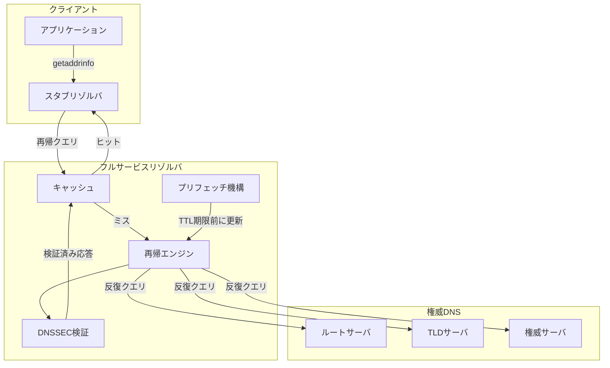
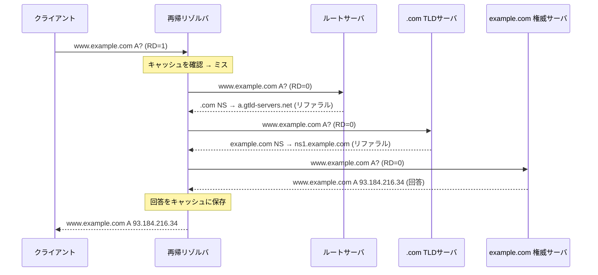
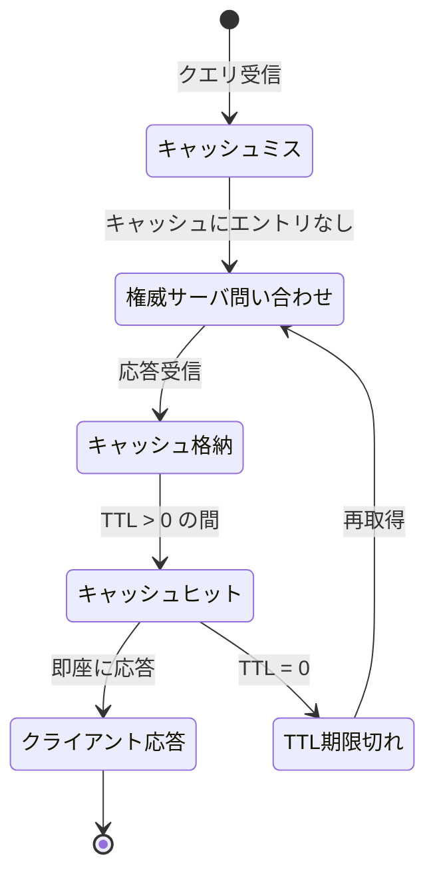
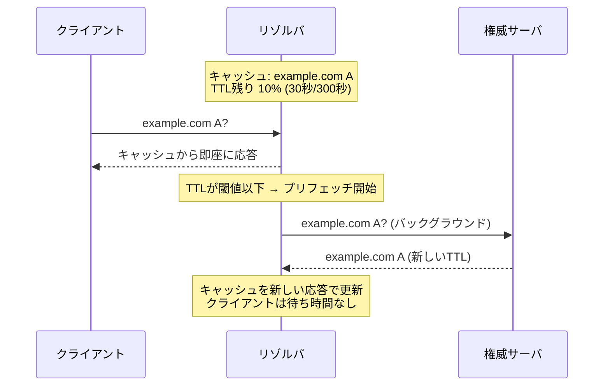
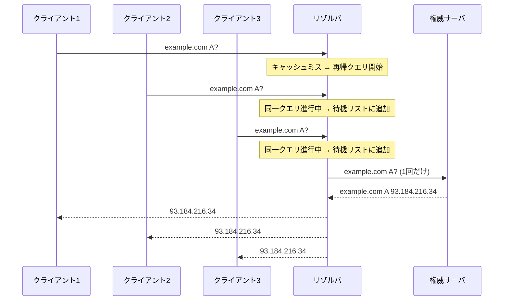
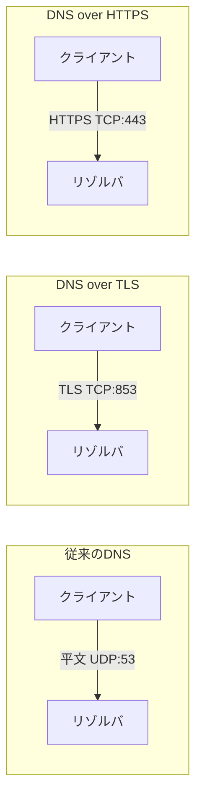
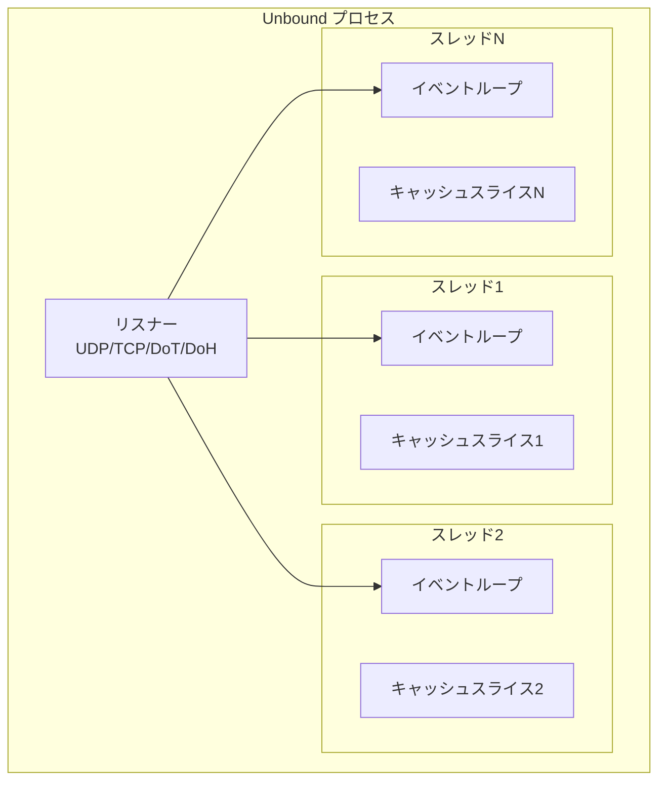
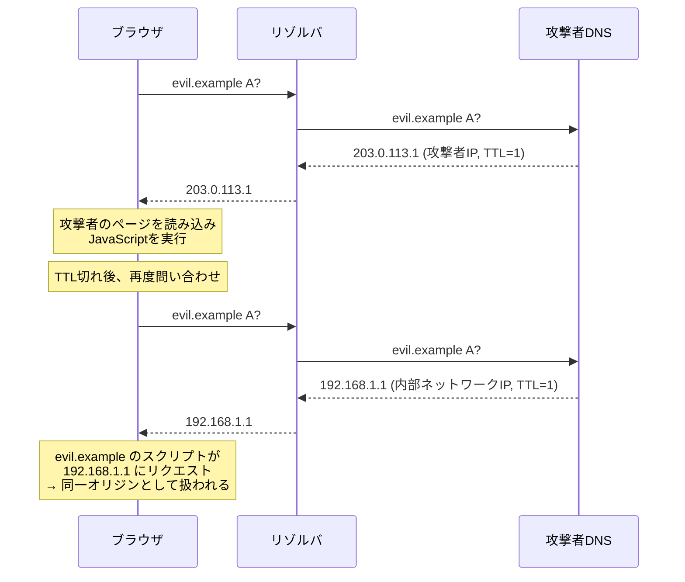
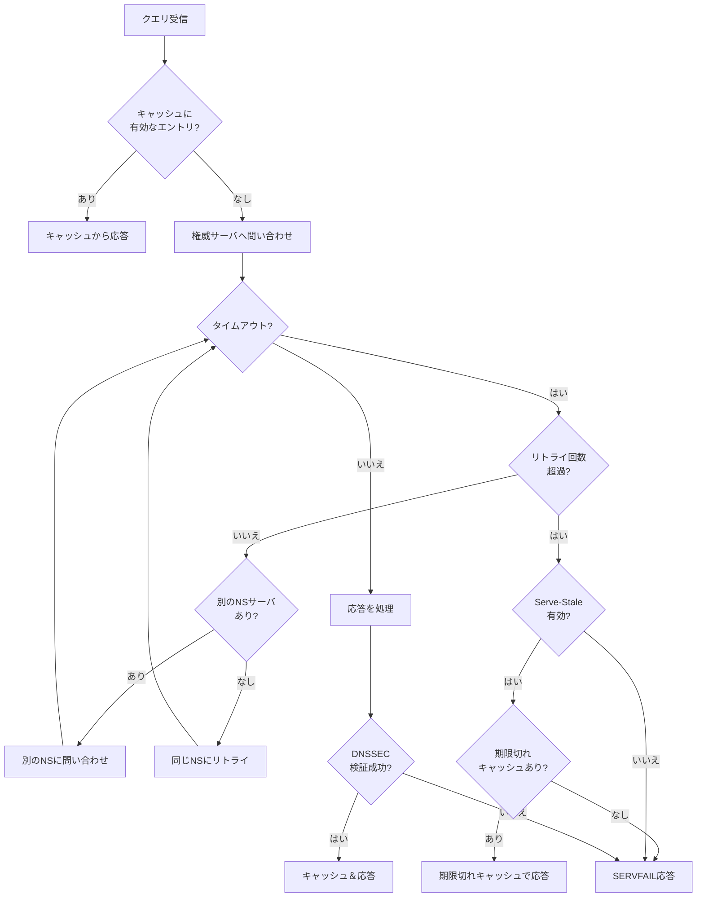
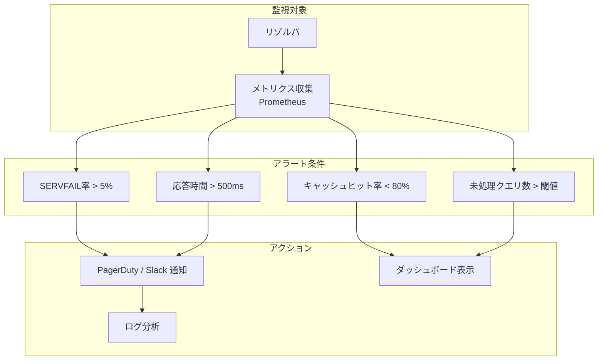

# DNSリゾルバの内部設計

## 1. DNSリゾルバの役割

### 名前解決の入り口

インターネットを利用するあらゆるアプリケーションは、人間が読みやすいドメイン名（例: `www.example.com`）をIPアドレスに変換する必要がある。この変換を担う中核的なコンポーネントが**DNSリゾルバ（DNS Resolver）**である。

ブラウザでURLを入力すると、OS のスタブリゾルバが設定されたDNSリゾルバに問い合わせを送信する。リゾルバはDNSの階層構造を辿り、最終的な回答を得てクライアントに返す。この一連の処理は数ミリ秒から数百ミリ秒の間に完了するが、その内部ではルートサーバ、TLDサーバ、権威サーバへの複数回の問い合わせ、キャッシュの参照、セキュリティ検証など、多層的な処理が行われている。

### リゾルバの種類

DNSリゾルバは大きく3つの種類に分類される。

| 種類 | 説明 | 例 |
|------|------|-----|
| **スタブリゾルバ** | OS に組み込まれた最小限のリゾルバ。フルサービスリゾルバに問い合わせを転送する | glibc の `getaddrinfo()`、systemd-resolved |
| **フルサービスリゾルバ（再帰リゾルバ）** | クライアントに代わってDNS階層を辿り、完全な回答を構築する | Unbound、BIND (named)、CoreDNS |
| **フォワーダ** | 受け取ったクエリを上位のフルサービスリゾルバに転送する | dnsmasq、ルーター内蔵DNS |

本記事では主にフルサービスリゾルバ（再帰リゾルバ）の内部設計に焦点を当てる。

### リゾルバが解決する問題

DNSリゾルバは単なる「名前引き」以上の責務を担っている。

- **パフォーマンス最適化**: キャッシュとプリフェッチにより、ネットワークの往復回数を最小化する
- **信頼性の確保**: 権威サーバの障害時にキャッシュからの応答や代替サーバへのフォールバックを行う
- **セキュリティの強化**: DNSSECの検証、DNSリバインディング攻撃の防止、キャッシュポイズニング対策を実施する
- **プライバシーの保護**: DNS over HTTPS（DoH）やDNS over TLS（DoT）による通信の暗号化を提供する



## 2. 再帰クエリと反復クエリ

### 二つのクエリモデル

DNS には2つの根本的に異なるクエリモデルがある。

**再帰クエリ（Recursive Query）**は、クライアントがリゾルバに「最終的な回答を返してほしい」と要求するモデルである。リゾルバはこの要求に応じて、必要なすべての問い合わせを自分で行い、完全な回答をクライアントに返す義務を負う。DNSヘッダの RD（Recursion Desired）フラグが1に設定される。

**反復クエリ（Iterative Query）**は、リゾルバが権威サーバに対して行うクエリであり、「知っている範囲で回答してほしい」という控えめな要求である。権威サーバは自分が知らないドメインについて、より適切なサーバへのリファラル（参照先情報）を返す。

### 再帰解決の流れ

`www.example.com` の A レコードを解決する典型的な流れを見てみよう。



この一連の処理において、リゾルバはルートサーバから順に階層を下っていく。各段階で受け取ったNSレコードとグルーレコード（追加セクションに含まれるAレコード）を利用して次の問い合わせ先を決定する。

### グルーレコードの重要性

権威サーバのホスト名が、そのサーバ自身が権威を持つドメイン内にある場合（例: `ns1.example.com` が `example.com` の権威サーバ）、循環依存が発生する。`ns1.example.com` のIPアドレスを知るには `example.com` の権威サーバに聞く必要があるが、その権威サーバが `ns1.example.com` なのである。

この循環依存を断ち切るのが**グルーレコード（Glue Record）**である。親ゾーン（この場合は `.com`）のTLDサーバが、NSレコードとともにそのNSのIPアドレスをAdditionalセクションに含めて返す。

```
;; AUTHORITY SECTION:
example.com.    172800  IN  NS  ns1.example.com.
example.com.    172800  IN  NS  ns2.example.com.

;; ADDITIONAL SECTION:
ns1.example.com.  172800  IN  A  198.51.100.1
ns2.example.com.  172800  IN  A  198.51.100.2
```

### QNAME Minimization

従来の再帰リゾルバは、ルートサーバに対しても完全なドメイン名（例: `www.example.com`）を送信していた。これはプライバシーの観点から問題がある。ルートサーバは `.com` のリファラルを返すだけなのに、ユーザーがアクセスしようとしている完全なドメイン名を知ることになるからである。

**QNAME Minimization**（RFC 9156）は、各段階で必要最小限の情報のみを送信する技術である。

| 問い合わせ先 | 従来 | QNAME Minimization |
|-------------|------|-------------------|
| ルートサーバ | `www.example.com` | `com` |
| .com TLDサーバ | `www.example.com` | `example.com` |
| 権威サーバ | `www.example.com` | `www.example.com` |

Unbound は 1.7.2 以降でデフォルトで QNAME Minimization を有効にしている。

## 3. キャッシュ戦略

### TTLベースのキャッシュ

DNSリゾルバの最も重要な機能の一つがキャッシュである。すべてのDNSレコードには**TTL（Time To Live）**が設定されており、リゾルバはこの値に基づいてキャッシュの有効期間を管理する。

TTLの値は権威サーバが設定し、リゾルバが応答を受信した時点からカウントダウンが始まる。TTLが0になると、そのレコードはキャッシュから削除される（または次回のクエリ時にスキップされる）。



### TTLの設計意図と現実

権威サーバの管理者はTTLを通じてキャッシュの振る舞いを制御する。

| TTL値 | 用途 | トレードオフ |
|-------|------|-------------|
| 30〜60秒 | フェイルオーバー、CDN | 権威サーバへの負荷が高い |
| 300秒（5分） | 一般的なWebサービス | バランスが良い |
| 3600秒（1時間） | 安定したサービス | 変更の反映が遅い |
| 86400秒（1日） | ほぼ変更しないレコード | DNS切り替え時に影響大 |

しかし現実には、リゾルバがTTLを厳密に守るとは限らない。一部のISPのリゾルバはTTLを強制的に引き上げ（クランプ）て権威サーバへの問い合わせ回数を減らすことがある。逆に、短すぎるTTLをリゾルバが最低値に切り上げるケースもある。Unboundでは `cache-min-ttl` と `cache-max-ttl` でこの範囲を制御できる。

### ネガティブキャッシュ

ドメインが存在しないこと（NXDOMAIN）や、特定のレコードタイプが存在しないこと（NODATA）も重要なキャッシュ対象である。これを**ネガティブキャッシュ**と呼ぶ（RFC 2308）。

ネガティブキャッシュがないと、存在しないドメインへの繰り返しの問い合わせが毎回権威サーバまで到達し、不必要な負荷が発生する。タイプミスによるドメイン名の問い合わせ、スパムフィルタによる大量の逆引き、マルウェアによるDGAドメインの問い合わせなど、ネガティブキャッシュが威力を発揮する場面は多い。

ネガティブキャッシュのTTLは、SOAレコードの `MINIMUM` フィールドで指定される。

```
example.com.  86400  IN  SOA  ns1.example.com. admin.example.com. (
    2024010101  ; Serial
    3600        ; Refresh
    900         ; Retry
    604800      ; Expire
    300         ; Minimum (negative cache TTL)
)
```

上記の例では、NXDOMAINやNODATA応答は300秒（5分間）キャッシュされる。

### キャッシュのデータ構造

高性能なリゾルバでは、キャッシュのデータ構造の選択が性能に大きく影響する。

**ハッシュテーブル方式**は、ドメイン名とレコードタイプの組み合わせをキーとするハッシュテーブルを使用する。Unbound はスレッドごとに独立したハッシュテーブルを持ち、ロック競合を回避している。各スレッドに割り当てられたキャッシュスライスは互いに独立しており、書き込み時のロックが限定的で済む。

**ツリー方式**は、ドメイン名の階層構造に沿ったツリー構造でキャッシュを管理する。この方式は、ワイルドカードや DNAME レコードの処理に有利だが、ハッシュテーブルに比べて参照速度で劣る場合がある。

**LRU（Least Recently Used）淘汰**: キャッシュサイズに上限がある場合、TTL が残っていても最も長くアクセスされていないエントリから淘汰される。Unbound では `msg-cache-size` と `rrset-cache-size` でそれぞれメッセージキャッシュとRRセットキャッシュのサイズを指定できる。

## 4. プリフェッチと最適化

### プリフェッチの動機

キャッシュのTTLが切れると、次の問い合わせ時に再帰解決が必要になり、レイテンシが増大する。頻繁にアクセスされるドメインほど、このTTL切れによるレイテンシスパイクが目立つ。

**プリフェッチ（Prefetch）**は、TTL切れが近いキャッシュエントリに対するクエリを契機に、バックグラウンドで事前に再帰解決を行う最適化技術である。

### プリフェッチの仕組み



プリフェッチの基本的な動作は以下の通りである。

1. キャッシュエントリのTTL残存率が閾値（例: 10%）を下回った状態でクライアントからのクエリを受信する
2. クライアントにはキャッシュの現在値を即座に返す（レイテンシなし）
3. バックグラウンドスレッドで権威サーバへの再帰クエリを発行する
4. 新しい応答でキャッシュを更新する

Unbound では `prefetch: yes` で有効化し、TTL残存率が10%を下回ったときにプリフェッチが発動する。

### プリフェッチの注意点

プリフェッチは万能ではない。以下の点に注意が必要である。

- **低頻度ドメイン**: ほとんどアクセスされないドメインのプリフェッチは無駄なトラフィックを生む。プリフェッチはクエリを「きっかけ」とするため、TTL期間中に一度もクエリがなければ発動しない。この設計により、不要なプリフェッチは自然に抑制される
- **権威サーバへの負荷**: 大量のドメインのプリフェッチが同時に発生すると、権威サーバへの負荷が増大する
- **短TTLドメイン**: TTLが極端に短い（例: 5秒）ドメインでは、プリフェッチの効果が薄い

### Serve-Stale（期限切れキャッシュの提供）

RFC 8767 で標準化された**Serve-Stale**は、プリフェッチの考え方をさらに拡張した技術である。権威サーバが到達不能な場合、TTL切れのキャッシュエントリ（stale data）をクライアントに返す。

「古い回答でも回答なしよりはまし」という実用的な考え方に基づいている。

```
# Unbound configuration example
serve-expired: yes
serve-expired-ttl: 86400          # Serve stale data for up to 1 day
serve-expired-reply-ttl: 30       # TTL set in stale responses
serve-expired-client-timeout: 1800 # Timeout before serving stale
```

Serve-Stale では以下の動作が行われる。

1. キャッシュのTTLが切れたクエリを受信
2. 権威サーバへの再帰クエリを試みる
3. タイムアウトまたはエラーが発生した場合、期限切れのキャッシュデータを返す
4. 応答のTTLには `serve-expired-reply-ttl` の値が設定される

### クエリの集約（Query Deduplication）

同一のドメインに対する複数のクエリが短時間に到着した場合、リゾルバは1回の再帰クエリに集約する。この最適化を**クエリの集約（Query Deduplication / Query Coalescing）**と呼ぶ。



この最適化により、人気ドメインのTTL切れ直後に大量のクエリが殺到しても、権威サーバへの問い合わせは1回で済む。

## 5. DNS over HTTPS / TLS

### 従来のDNSのプライバシー問題

伝統的なDNS通信はUDPポート53番で平文のまま行われる。この設計は1980年代当時の「ネットワークは信頼できる」という前提に基づいていたが、現代のインターネットではいくつかの深刻なプライバシー問題を引き起こしている。

- **盗聴**: ネットワーク経路上の誰でもDNSクエリの内容を読み取れる。ユーザーがどのWebサイトにアクセスしようとしているかが筒抜けになる
- **改ざん**: 経路上の攻撃者がDNS応答を書き換え、偽のIPアドレスに誘導できる（DNSスプーフィング）
- **検閲**: ISPや政府機関がDNSクエリを監視し、特定ドメインへのアクセスをブロックできる
- **プロファイリング**: DNSクエリのログからユーザーの行動パターンを分析できる

### DNS over TLS（DoT）

**DNS over TLS（DoT）**（RFC 7858）は、DNSクエリをTLSで暗号化する最初の標準化された方式である。専用ポート853番を使用する。



DoT の利点は、TLS のみに依存するシンプルな設計である。既存のDNSメッセージフォーマットをそのまま使用し、トランスポート層のみを変更する。

一方で、専用ポート853番を使用することがDoTの弱点でもある。ネットワーク管理者やファイアウォールがポート853番を容易にブロックできるため、検閲回避の手段としては限界がある。

### DNS over HTTPS（DoH）

**DNS over HTTPS（DoH）**（RFC 8484）は、HTTPSの標準ポート443番を使用してDNSクエリを暗号化する方式である。DNSメッセージは HTTP POST または HTTP GET のペイロードとして送信される。

DoH のメッセージフォーマットは、Content-Type に `application/dns-message` を使用する場合、従来のDNSワイヤフォーマットをBase64urlエンコードして送信する。

```
GET /dns-query?dns=AAABAAABAAAAAAAAA3d3dwdleGFtcGxlA2NvbQAAAQAB HTTP/1.1
Host: dns.example.com
Accept: application/dns-message
```

```
POST /dns-query HTTP/1.1
Host: dns.example.com
Content-Type: application/dns-message
Content-Length: 33

<binary DNS message>
```

DoH の最大の利点は、通常のHTTPS通信と見分けがつかない点にある。ポート443番は一般的なWebトラフィックと同じであり、DPI（Deep Packet Inspection）でもDoHトラフィックの識別は困難である。

### DoH と DoT の比較

| 特性 | DoT | DoH |
|------|-----|-----|
| RFC | RFC 7858 | RFC 8484 |
| ポート | 853 (専用) | 443 (HTTPS共用) |
| プロトコル | TLS over TCP | HTTP/2 over TLS |
| ブロック容易性 | 容易（ポート853遮断） | 困難（HTTPS全体を遮断する必要） |
| ネットワーク可視性 | DNS通信と識別可能 | 通常のHTTPSと区別困難 |
| HTTP/2多重化 | なし | あり |
| 既存インフラとの親和性 | DNS専用 | CDN・ロードバランサー活用可能 |
| 標準的なプロバイダ | Cloudflare, Google | Cloudflare, Google, NextDNS |

### DNS over QUIC（DoQ）

**DNS over QUIC（DoQ）**（RFC 9250）は、QUICプロトコル上でDNSクエリを送信する新しい方式である。専用ポート853番を使用する（DoT と同じポート番号だがプロトコルが異なる）。

DoQ は QUIC の特性を活かし、以下の利点を持つ。

- **0-RTT接続確立**: 以前に接続したサーバへの再接続時、ハンドシェイクなしでクエリを送信できる
- **ストリーム多重化**: 1つの接続上で複数のクエリを独立して処理でき、Head-of-Line Blocking を回避できる
- **接続マイグレーション**: ネットワーク切り替え（Wi-Fi→セルラー）時に接続を維持できる

### リゾルバ側の暗号化DNS対応

フルサービスリゾルバがDoHやDoTを提供する場合、2つの通信区間を区別する必要がある。


クライアントとリゾルバ間は暗号化されるが、リゾルバから権威サーバへの通信は依然として平文であることが多い。この「ラストマイル」の暗号化を解決する取り組みとして、権威サーバ側でのDoTサポートの拡大や、Oblivious DoH（ODoH、RFC 9230）によるプロキシを介した匿名化がある。

## 6. リゾルバの実装

### Unbound

**Unbound**は NLnet Labs が開発するオープンソースの再帰DNSリゾルバであり、セキュリティとパフォーマンスに重点を置いた設計がなされている。

#### アーキテクチャ

Unbound はマルチスレッドアーキテクチャを採用している。各スレッドは独立したイベントループを持ち、非同期I/Oで大量のクエリを並行処理する。



主要な設計上の特徴は以下の通りである。

- **スレッドごとのキャッシュ**: ロック競合を最小化。スレッド数に応じてキャッシュをシャーディングする
- **イベント駆動I/O**: `libevent` または内蔵の `mini-event` を使用した非同期処理
- **モジュラーアーキテクチャ**: DNSSEC検証、ローカルデータ、Python/Lua拡張などがモジュールとして実装されている

#### 主要な設定パラメータ

```yaml
server:
    # Thread and performance settings
    num-threads: 4                    # Number of worker threads
    msg-cache-slabs: 4                # Must be power of 2, >= num-threads
    rrset-cache-slabs: 4
    infra-cache-slabs: 4
    key-cache-slabs: 4

    # Cache size settings
    msg-cache-size: 128m              # Message cache size
    rrset-cache-size: 256m            # RRset cache (recommended 2x msg-cache)
    key-cache-size: 32m               # DNSSEC key cache

    # TTL settings
    cache-min-ttl: 0                  # Minimum TTL (seconds)
    cache-max-ttl: 86400              # Maximum TTL (seconds)

    # Optimization
    prefetch: yes                     # Enable prefetch
    prefetch-key: yes                 # Prefetch DNSSEC keys
    serve-expired: yes                # Serve stale data on failure
    serve-expired-ttl: 86400

    # Security
    qname-minimisation: yes           # QNAME Minimization
    aggressive-nsec: yes              # Aggressive NSEC caching
    hide-identity: yes
    hide-version: yes

    # DoT/DoH
    tls-port: 853
    https-port: 443
    tls-service-pem: "/etc/unbound/server.pem"
    tls-service-key: "/etc/unbound/server.key"
```

### CoreDNS

**CoreDNS** は Go 言語で実装されたDNSサーバであり、プラグインアーキテクチャを特徴とする。Kubernetes のデフォルトDNSサーバとして広く採用されている。

#### プラグインチェーン

CoreDNS の最大の特徴は、すべての機能がプラグインとして実装されている点である。DNSクエリはプラグインチェーンを順に通過し、各プラグインが処理を行う。


#### Corefile の例

```
. {
    # Caching plugin
    cache {
        success 9984 30     # Cache successful responses, max 9984 entries, 30s min TTL
        denial 9984 5       # Cache NXDOMAIN/NODATA responses
        prefetch 10 60s 10% # Prefetch: min 10 queries, 60s window, 10% TTL threshold
        serve_stale 3600s   # Serve stale data for 1 hour
    }

    # Forward to upstream resolvers
    forward . tls://1.1.1.1 tls://1.0.0.1 {
        tls_servername cloudflare-dns.com
        health_check 5s
    }

    # Logging
    log

    # Prometheus metrics
    prometheus :9153

    # Error handling
    errors
}
```

### BIND（named）

**BIND（Berkeley Internet Name Domain）**は1980年代から存在する最も歴史のあるDNSサーバ実装である。再帰リゾルバと権威サーバの両方の機能を持つ。

BIND 9 はマルチスレッドアーキテクチャに移行し、大規模環境でのパフォーマンスが向上した。ただし、Unbound と比較すると、権威サーバ機能と再帰リゾルバ機能が同居しているため、攻撃面が大きくなる可能性がある。セキュリティを重視する現代の運用では、権威サーバと再帰リゾルバを別のソフトウェアで分離する構成（例: 権威サーバに NSD、リゾルバに Unbound）が推奨されることが多い。

### 実装の比較

| 特性 | Unbound | CoreDNS | BIND 9 |
|------|---------|---------|--------|
| 言語 | C | Go | C |
| 主な用途 | 再帰リゾルバ | フォワーダ / Kubernetes DNS | 権威 + 再帰 |
| アーキテクチャ | マルチスレッド | Goroutine | マルチスレッド |
| プラグイン機構 | モジュール | プラグインチェーン | DLZ, RPZ |
| DNSSEC検証 | 内蔵 | プラグイン | 内蔵 |
| Kubernetes統合 | 弱い | ネイティブ | 弱い |
| メモリ効率 | 高い | 中程度 | 中程度 |

## 7. セキュリティ考慮事項

### キャッシュポイズニング

**キャッシュポイズニング**は、リゾルバのキャッシュに偽のDNSレコードを注入する攻撃である。攻撃者は、リゾルバが権威サーバからの応答を待っている間に偽の応答を送り込む。

2008年に Dan Kaminsky が発表した手法は、この攻撃を劇的に容易にするものだった。攻撃者はランダムなサブドメイン（例: `random123.example.com`）を問い合わせ、権威サーバの応答より先に、Additionalセクションに偽の情報を含んだ応答を送信する。

#### 対策

**ソースポートランダム化**: 従来のリゾルバは固定のソースポートを使用していたため、攻撃者はトランザクションID（16ビット、65,536通り）のみを推測すれば良かった。ソースポートのランダム化により、推測すべき空間が大幅に拡大する。

**0x20エンコーディング**: クエリのドメイン名の大文字・小文字をランダムに混ぜる手法（例: `wWw.ExAmPlE.cOm`）。権威サーバは通常、クエリ名をそのまま応答にコピーするため、大文字・小文字のパターンが一致するかで応答の正当性を追加検証できる。DNSプロトコルではドメイン名は大文字・小文字を区別しない（RFC 4343）ため、この手法は互換性を維持しながらエントロピーを追加する。

**DNSSEC**: 最も根本的な解決策。権威サーバがDNSレコードにデジタル署名を付与し、リゾルバが署名を検証する。キャッシュポイズニングが仮に成功しても、署名の検証に失敗するため偽の応答が受け入れられない。

### DNSリバインディング

**DNSリバインディング攻撃**は、攻撃者が管理するドメインのDNSレコードを短いTTLで切り替え、ブラウザの同一オリジンポリシーを回避する攻撃である。



#### 対策

リゾルバ側で、プライベートIPアドレスを含むDNS応答をフィルタリングする。Unbound では `private-address` ディレクティブで設定できる。

```
server:
    # Block private IP addresses in DNS responses (rebinding protection)
    private-address: 10.0.0.0/8
    private-address: 172.16.0.0/12
    private-address: 192.168.0.0/16
    private-address: 169.254.0.0/16
    private-address: fd00::/8
    private-address: fe80::/10
```

### DNS増幅攻撃

DNS増幅攻撃は、送信元IPアドレスを偽装したDNSクエリをオープンリゾルバに送信し、標的に大量の応答トラフィックを送り付けるDDoS攻撃の一種である。

小さなクエリ（約60バイト）に対して大きな応答（数千バイト）が返るため、トラフィック量が増幅される。ANY クエリや TXT レコードの問い合わせが特に増幅率が高い。

#### 対策

- **オープンリゾルバにしない**: 再帰リゾルバは許可されたクライアントからのクエリのみ受け付けるようにする
- **レートリミット**: 同一送信元からのクエリ数を制限する（RRL: Response Rate Limiting）
- **応答サイズの制限**: 大きすぎる応答を切り捨てる
- **BCP38/BCP84**: ネットワーク境界でソースアドレスの偽装を防止する

```
server:
    # Access control - only allow queries from trusted networks
    access-control: 10.0.0.0/8 allow
    access-control: 172.16.0.0/12 allow
    access-control: 192.168.0.0/16 allow
    access-control: 127.0.0.0/8 allow
    access-control: 0.0.0.0/0 refuse

    # Rate limiting
    ip-ratelimit: 1000           # Max queries per second per IP
    ratelimit: 1000              # Max queries per second per domain
```

### Aggressive NSEC キャッシュ

**Aggressive NSEC（RFC 8198）**は、DNSSEC の NSEC/NSEC3 レコードを利用して、存在しないドメイン名への問い合わせをキャッシュ内で処理する技術である。

NSECレコードは「このドメイン名とこのドメイン名の間には他のドメイン名が存在しない」ことを証明する。リゾルバは手元のNSECレコードの範囲情報から、新たに問い合わせされたドメイン名が存在しないことをローカルで判定できる。

これにより、ランダムサブドメイン攻撃（存在しないドメイン名を大量に問い合わせてリゾルバと権威サーバに負荷をかける攻撃）に対する耐性が大幅に向上する。

## 8. パフォーマンスチューニング

### スレッド数とキャッシュの最適化

リゾルバのパフォーマンスチューニングでは、ハードウェアリソースとワークロードの特性に基づいて設定を調整する。

**スレッド数**: 一般的にCPUコア数と同じ値を設定する。ハイパースレッディングを使用する場合は物理コア数に合わせることが多い。

```
server:
    num-threads: 4

    # Slab counts must be power of 2 and >= num-threads
    msg-cache-slabs: 4
    rrset-cache-slabs: 4
    infra-cache-slabs: 4
    key-cache-slabs: 4
```

**キャッシュサイズ**: `rrset-cache-size` は `msg-cache-size` の2倍に設定することが推奨される。キャッシュヒット率はリゾルバのパフォーマンスに直結するため、利用可能なメモリの範囲で十分なサイズを確保する。

```
server:
    msg-cache-size: 256m
    rrset-cache-size: 512m
```

### ソケットとバッファの最適化

```
server:
    # Use SO_REUSEPORT for better multi-thread performance (Linux 3.9+)
    so-reuseport: yes

    # Increase buffer sizes
    so-rcvbuf: 4m
    so-sndbuf: 4m

    # Number of outgoing TCP/UDP connections per thread
    outgoing-range: 8192
    num-queries-per-thread: 4096

    # EDNS buffer size
    edns-buffer-size: 1232
```

`so-reuseport` は Linux 3.9 以降で利用可能なカーネル機能で、複数のスレッドが同一ポートで独立にリクエストを受信できる。これによりリスナーのボトルネックが解消され、マルチスレッド性能が向上する。

`edns-buffer-size` は 1232 バイトが推奨値である。これは IPv6 の最小MTU（1280バイト）から IPv6 ヘッダ（40バイト）と UDP ヘッダ（8バイト）を差し引いた値であり、フラグメンテーションを回避できる。

### EDNS Client Subnet

**EDNS Client Subnet（ECS）**（RFC 7871）は、クライアントのサブネット情報をリゾルバ経由で権威サーバに伝える拡張である。CDN プロバイダがクライアントに最も近いエッジサーバのIPアドレスを返すために使用される。

ただし、ECSはプライバシーの懸念がある。クライアントのネットワーク位置情報が権威サーバに送信されるためである。Unbound ではデフォルトで ECS を送信せず、必要に応じて `send-client-subnet` ディレクティブで特定のドメインに対してのみ有効にできる。

### パフォーマンス監視

リゾルバのパフォーマンスを監視するために、以下のメトリクスを収集することが重要である。

| メトリクス | 説明 | 注目点 |
|-----------|------|--------|
| **キャッシュヒット率** | クエリ全体に占めるキャッシュヒットの割合 | 90%以上が望ましい |
| **平均応答時間** | クエリ受信から応答送信までの時間 | キャッシュヒット時は1ms以下 |
| **再帰クエリ時間** | 権威サーバへの問い合わせにかかる時間 | ネットワーク遅延に依存 |
| **クエリレート** | 秒あたりのクエリ数（QPS） | キャパシティプランニング |
| **SERVFAIL率** | SERVFAIL応答の割合 | 急増は問題のサイン |
| **キャッシュサイズ** | 現在のキャッシュ使用量 | 上限に達していないか |

Unbound では `unbound-control stats_noreset` コマンドで詳細な統計情報を取得できる。CoreDNS は Prometheus プラグインで直接メトリクスをエクスポートする。

```bash
# Unbound statistics
$ unbound-control stats_noreset

# Key metrics to monitor
# total.num.queries      - Total queries received
# total.num.cachehits    - Cache hit count
# total.num.cachemiss    - Cache miss count
# total.requestlist.avg  - Average outstanding queries
# total.recursion.time.avg - Average recursion time
```

## 9. 障害時の挙動と対策

### 権威サーバの障害

権威サーバが応答しない場合、リゾルバは以下の手順で対応する。



リゾルバは複数のNSサーバの中から、過去の応答時間に基づいてRTT（Round-Trip Time）が最も短いサーバを優先的に選択する。Unbound は各権威サーバのRTTを追跡し、指数加重移動平均でスムージングしている。あるサーバが応答しなくなった場合、自動的にRTTの評価が悪化し、代替サーバが優先されるようになる。

### リゾルバ自身の障害

リゾルバ自身の障害に備えるためには、以下の構成を取ることが一般的である。

**複数リゾルバの冗長構成**: クライアントに複数のリゾルバのIPアドレスを設定する（`/etc/resolv.conf` の複数 `nameserver` エントリ）。一方のリゾルバが応答しない場合、クライアントのスタブリゾルバが自動的に次のリゾルバにフォールバックする。

```
# /etc/resolv.conf
nameserver 10.0.1.1
nameserver 10.0.2.1
options timeout:2 attempts:3 rotate
```

`rotate` オプションは、クエリごとにリゾルバを切り替えて負荷分散を行う。`timeout` と `attempts` で、応答待ち時間とリトライ回数を制御する。

**Anycast による冗長化**: 大規模なリゾルバサービス（Cloudflare 1.1.1.1、Google 8.8.8.8 など）は、同一IPアドレスを複数の拠点でAnyCastアドバタイズしている。BGP ルーティングにより、クライアントのクエリは最も近い拠点に自動的にルーティングされる。ある拠点が障害を起こしても、BGP の経路収束により他の拠点が引き継ぐ。

### SERVFAIL の嵐への対処

権威サーバの広範な障害や DNSSEC 検証エラーが発生すると、大量の SERVFAIL 応答が返される。この状況では、クライアントアプリケーションがリトライを繰り返し、リゾルバへの負荷がさらに増大する悪循環に陥ることがある。

これを防ぐための対策は以下の通りである。

- **SERVFAIL のキャッシュ**: SERVFAIL 応答自体を短時間（例: 5秒）キャッシュし、同一ドメインへの連続問い合わせを抑制する
- **Serve-Stale の活用**: 前述の通り、期限切れのキャッシュデータで応答することで SERVFAIL を回避する
- **クエリのレートリミット**: 特定のドメインに対するクエリレートを制限する

### 障害の可視化と検知

リゾルバの障害を迅速に検知するためには、以下の監視を設定する。



特に注目すべきアラート条件として以下が挙げられる。

- **SERVFAIL率の急増**: 通常は1%未満であるべき。5%を超えた場合は調査が必要
- **再帰クエリ時間の増大**: ネットワーク障害や権威サーバの応答遅延を示唆する
- **未処理クエリ数の増大**: リゾルバの処理能力が飽和しつつあることを示す
- **キャッシュヒット率の急落**: 大量の新規ドメイン問い合わせ（ランダムサブドメイン攻撃の可能性）を示唆する

## まとめ

DNSリゾルバは、インターネットの基盤を支える重要なインフラコンポーネントである。その内部設計は、単純な名前解決にとどまらず、パフォーマンス最適化、セキュリティ強化、プライバシー保護など多面的な要求に応えるものとなっている。

本記事で取り上げた主要なポイントを整理する。

| 領域 | 重要な技術 | 意義 |
|------|-----------|------|
| **クエリ処理** | 再帰/反復クエリ、QNAME Minimization | 効率的かつプライバシーに配慮した名前解決 |
| **キャッシュ** | TTL管理、ネガティブキャッシュ、LRU淘汰 | レイテンシ削減と権威サーバ負荷の軽減 |
| **最適化** | プリフェッチ、Serve-Stale、クエリ集約 | 一貫した低レイテンシの実現 |
| **暗号化** | DoH、DoT、DoQ | 通信のプライバシーと完全性の確保 |
| **セキュリティ** | DNSSEC、ポートランダム化、0x20 | キャッシュポイズニング等の攻撃防止 |
| **運用** | 冗長構成、Anycast、監視 | 高可用性と障害への耐性 |

現代のリゾルバ実装は、これらの技術を統合的に実現しつつ、高いスループットと低レイテンシを両立させている。Unbound に代表される専用リゾルバは、マルチスレッド・イベント駆動・キャッシュシャーディングといったアーキテクチャ上の工夫により、数万QPSの処理能力を実現している。

DNS の世界は今なお進化を続けている。Oblivious DoH（ODoH）による匿名DNS問い合わせ、Encrypted Client Hello（ECH）との連携によるSNI暗号化、DNS over QUIC による低遅延化など、プライバシーとパフォーマンスを両立する新しい技術が次々と登場している。リゾルバの設計と運用においては、これらの動向を継続的にフォローし、適切に取り入れていくことが求められる。
