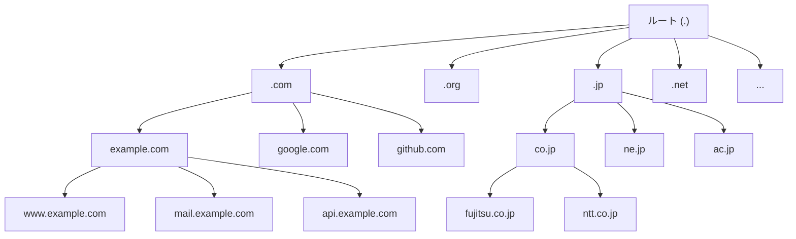
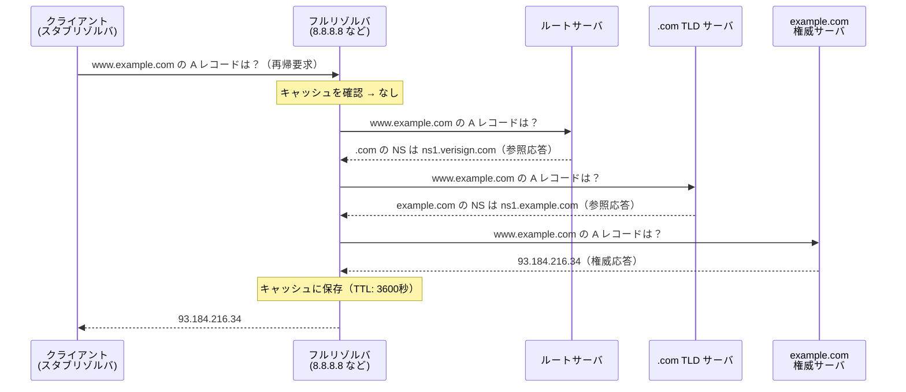
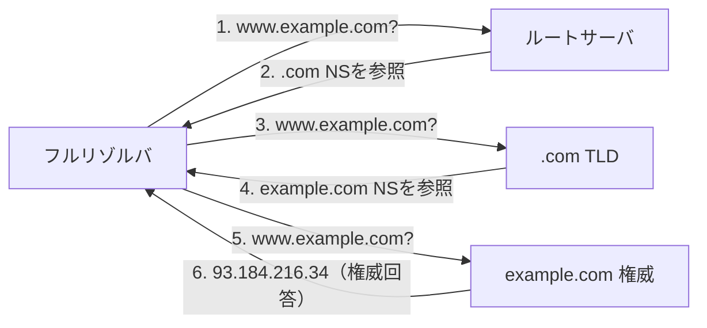
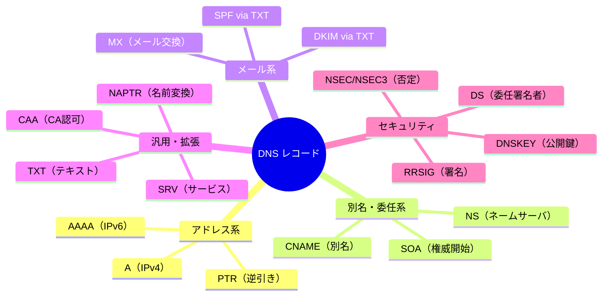
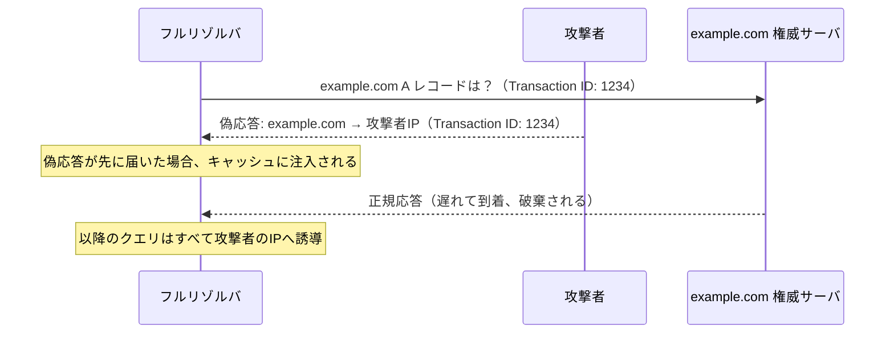
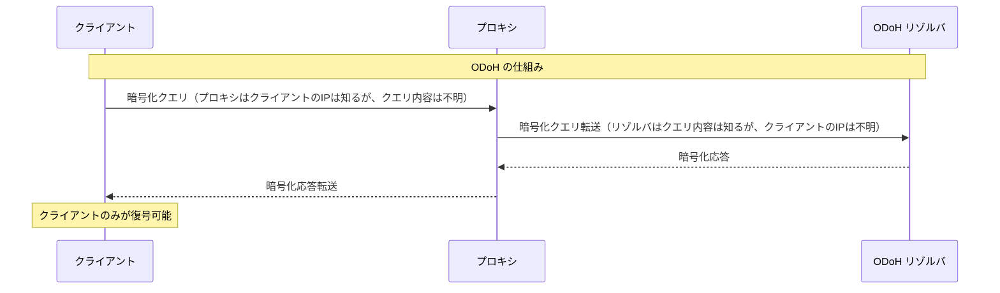

# DNS — 名前解決の仕組み

## 1. 歴史的背景：hostsファイルからDNSへ

### インターネット黎明期の名前解決

インターネットの前身であるARPANET（Advanced Research Projects Agency Network）が稼働していた1970年代初頭、接続されているホストの数はわずか数十台に過ぎなかった。この規模では、ホスト名とIPアドレスの対応表を単一のテキストファイルで管理することが現実的な解決策だった。

そのファイルが `HOSTS.TXT` である。スタンフォード研究所（SRI）のネットワーク情報センター（NIC）が管理するこのファイルには、ARPANETに接続されたすべてのホストのエントリが記載されていた。各ホストはこのファイルのコピーをダウンロードし、ローカルに保持することでホスト名の解決を行っていた。

現代のUnix/Linux系OSにも `/etc/hosts` というファイルが存在する。これはARPANET時代の `HOSTS.TXT` の直系の子孫であり、DNSより優先される最終的な名前解決手段として今日でも使われている。

```
# /etc/hosts (modern example)
127.0.0.1   localhost
::1         localhost
192.168.1.1 router.local
```

### HOSTS.TXT の限界

1980年代に入り、ARPANETへの接続ホスト数が急増すると、一元管理の `HOSTS.TXT` モデルはいくつかの深刻な問題を抱えるようになった。

**スケーラビリティの問題**

ホスト数が数百台を超えると、`HOSTS.TXT` のファイルサイズは肥大化し始めた。各ホストが定期的にこのファイルをダウンロードしなければならないため、SRIのサーバへのトラフィックが集中し、更新の遅延が生じた。ネットワーク参加者が数千台規模になると、この中央集権型モデルは明らかに限界に達した。

**一意性の欠如**

すべてのホスト名はグローバルに一意でなければならない制約があったため、名前の衝突が頻発した。組織が自組織のネットワーク内で使用したいホスト名を自由に選べず、NICによる調整が必要だった。

**更新の遅延**

`HOSTS.TXT` は通常、週に数回しか更新されなかった。新しいホストが追加されても、他のホストがその情報を得るまでに数日かかることがあった。リアルタイム性が求められる運用環境には不向きだった。

**管理コスト**

単一の組織（SRI-NIC）がすべてのエントリを管理するため、変更申請から反映までの手続きが煩雑になった。

### DNSの誕生

これらの問題を解決するため、Paul Mockapetrisは1983年に**DNS（Domain Name System）**を設計した。その成果は **RFC 882** および **RFC 883** として発表され、後に改訂されて現在の基本仕様である **RFC 1034** および **RFC 1035**（1987年）となった。

DNSの設計哲学は以下の3点に集約される。

1. **分散性（Decentralization）**: 単一の権威ある管理者ではなく、階層的な管理権限の委譲によってスケールする
2. **委任（Delegation）**: 各組織が自組織のドメイン名空間を管理する権限を持つ
3. **キャッシュ（Caching）**: 応答をキャッシュすることで、繰り返しの問い合わせを削減する

この設計により、DNSは数十億台のデバイスが接続する現代のインターネットを支える基盤として機能し続けている。

---

## 2. DNSの階層構造

### ドメイン名の構造

DNSは**ツリー構造（木構造）**の名前空間を採用している。ドメイン名は、このツリーの葉から根に向かって読むと構造が理解しやすい。

たとえば `www.example.com.`（末尾のドットは「ルート」を示す）は次のように分解できる。

```
.               ← ルート（root）
└── com.        ← トップレベルドメイン（TLD）
    └── example.com.    ← 権威ドメイン（Second Level Domain）
        └── www.example.com.  ← サブドメイン（ホスト）
```

各「.」（ドット）で区切られた部分を**ラベル（label）**と呼ぶ。ラベルは最大63文字、ドメイン名全体は最大253文字という制約がある。

### 名前空間の階層



### ルートサーバ

ツリーの頂点に位置するのが**ルートサーバ（Root Name Server）**である。ルートサーバは、世界中に分散した13のIPアドレス（A〜Mのラベルを持つ）によって運営されている。

| ラベル | 運営組織 | 本部所在地 |
|--------|----------|------------|
| A | Verisign | アメリカ |
| B | ISI (USC) | アメリカ |
| C | Cogent Communications | アメリカ |
| D | University of Maryland | アメリカ |
| E | NASA | アメリカ |
| F | Internet Systems Consortium | アメリカ |
| G | US DoD | アメリカ |
| H | US Army Research Lab | アメリカ |
| I | Netnod | スウェーデン |
| J | Verisign | アメリカ |
| K | RIPE NCC | オランダ |
| L | ICANN | アメリカ |
| M | WIDE Project | 日本 |

「13のIPアドレス」という制約は、DNS UDPパケットが512バイトに収まる必要があった時代の設計によるものだ。しかし現実には、各ルートサーバはエニーキャスト（Anycast）ルーティングを使って世界中に何百ものサーバインスタンスを展開している。2024年時点で、ルートサーバのインスタンス数は合計1,000以上に達している。

### TLD（トップレベルドメイン）

ルートの直下に位置するのが**TLD（Top Level Domain）**である。TLDにはいくつかの種類がある。

**gTLD（Generic TLD）**
汎用的な用途のTLD。
- `.com`（commercial）、`.org`（organization）、`.net`（network）：初期から存在する歴史的gTLD
- `.info`、`.biz`、`.mobi`：2000年代に追加
- `.app`、`.dev`、`.io`：近年一般化したgTLD
- ICANNの新gTLDプログラム（2012年〜）により `.tokyo`、`.amazon` 等、1,000以上のgTLDが追加された

**ccTLD（Country Code TLD）**
国・地域別のTLD。ISOの2文字の国コードに基づく。
- `.jp`（日本）、`.uk`（英国）、`.de`（ドイツ）、`.cn`（中国）

**特殊TLD**
- `.arpa`：逆引きDNSなどのインフラ用途
- `.local`：mDNS（Multicast DNS）でのローカルネットワーク用途

### 権威DNSサーバ（Authoritative Name Server）

各ドメインの実際のレコード（IPアドレスなど）を保有するサーバが**権威DNSサーバ**（Authoritative Name Server）である。権威サーバは「このドメインについて最終的な答えを持つ」サーバとして機能し、そのレコードは管理者によって直接設定される。

たとえば `example.com` の権威サーバは、`www.example.com → 93.184.216.34` というマッピングを保持する。権威サーバは自身が管理するゾーンについてのみ応答し、他のゾーンについてはキャッシュを持たない。

**プライマリ（Primary）サーバ**とは、ゾーンデータのオリジナルを保持するサーバである。管理者はプライマリサーバに対して設定変更を行う。**セカンダリ（Secondary）サーバ**は、プライマリサーバからゾーン転送（Zone Transfer）によってデータをコピーし、冗長性を確保する。

---

## 3. 名前解決の仕組み

### 主要コンポーネント

DNS名前解決には、以下の主要コンポーネントが関与する。

**スタブリゾルバ（Stub Resolver）**
クライアント（PCやスマートフォン）の側にある最小限のリゾルバ。アプリケーションからの問い合わせをフルリゾルバに転送するだけで、自ら再帰的な解決は行わない。

**フルリゾルバ / 再帰リゾルバ（Full Resolver / Recursive Resolver）**
実際の名前解決を担当するサーバ。クライアントの代わりに階層的なDNSツリーを順次問い合わせ、最終的な回答を返す。ISPや企業のDNSサーバ、またはGoogle Public DNS（8.8.8.8）、Cloudflare（1.1.1.1）などのパブリックDNSがこれにあたる。

### 再帰的クエリ（Recursive Query）

クライアントとフルリゾルバの間で行われる問い合わせ方式。クライアントは「`www.example.com` のIPアドレスを教えてほしい」とフルリゾルバに依頼する。フルリゾルバはクライアントに代わって、最終的な答えを取得するまで問い合わせを続ける義務を負う。



### 反復的クエリ（Iterative Query）

フルリゾルバがルートサーバ・TLDサーバ・権威サーバとの間で行う問い合わせ方式。各サーバは「最終的な答えは知らないが、次に問い合わせるべきサーバを知っている」として**参照応答（Referral Response）**を返す。フルリゾルバはこの参照情報を使って、次のサーバに自分で問い合わせを続ける。



### キャッシュと TTL

DNSのパフォーマンスと可用性を支える重要な仕組みが**キャッシュ**である。フルリゾルバは権威サーバから受け取った応答を、レコードに指定された**TTL（Time To Live）**の秒数だけキャッシュする。

TTLの設定は、変更の反映速度と負荷分散のトレードオフを制御する。

| TTL値 | 特性 | 用途の例 |
|-------|------|----------|
| 60秒 | 変更がすぐ反映される。クエリ数が多い | 負荷分散、フェイルオーバー |
| 300秒 | 短め。適度に新鮮 | 動的サービス |
| 3600秒（1時間） | 一般的な設定 | 通常のWebサービス |
| 86400秒（1日） | キャッシュヒット率が高い | 安定したサービス |

> [!NOTE]
> TTLが高すぎると、IPアドレス変更（例：データセンター移転、クラウド切り替え）が世界中のリゾルバに伝播するまでに長時間かかる。一般的な移行シナリオでは、作業前にTTLを短く設定し（例：300秒）、切り替え後にTTLを元に戻すことが推奨される。

### ネガティブキャッシュ（Negative Caching）

存在しないドメイン（NXDOMAIN）の応答もキャッシュされる。これを**ネガティブキャッシュ**と呼ぶ（RFC 2308）。ネガティブキャッシュのTTLはSOAレコードの `MINIMUM` フィールドで制御される。

### ゾーンの概念

ゾーン（Zone）とは、権威DNSサーバが管理する名前空間の一部分である。`example.com` のゾーンには、`example.com`、`www.example.com`、`mail.example.com` などのレコードが含まれる。

一方、`sub.example.com` を別の組織に委任した場合、`sub.example.com` は独立したゾーンとなり、`example.com` のゾーンからは除外される。この「委任（Delegation）」がDNSの分散管理を実現する仕組みである。

---

## 4. DNS レコードタイプ

DNSのデータは**リソースレコード（Resource Record, RR）**という単位で管理される。各レコードには以下の共通フィールドがある。

```
<NAME> <TTL> <CLASS> <TYPE> <RDATA>
www.example.com. 3600 IN A 93.184.216.34
```

- **NAME**: レコードが適用されるドメイン名
- **TTL**: キャッシュ有効期間（秒）
- **CLASS**: 通常 `IN`（Internet）
- **TYPE**: レコードの種類
- **RDATA**: レコードの実際のデータ

### A レコード（Address Record）

ドメイン名をIPv4アドレスにマッピングする最も基本的なレコード。

```
www.example.com.    3600    IN    A    93.184.216.34
```

複数のAレコードを設定することで、**DNSラウンドロビン**によるシンプルな負荷分散が実現できる。

```
www.example.com.    60    IN    A    203.0.113.1
www.example.com.    60    IN    A    203.0.113.2
www.example.com.    60    IN    A    203.0.113.3
```

### AAAA レコード（IPv6 Address Record）

ドメイン名をIPv6アドレスにマッピングする。「AAAA」という名前は、IPv6アドレス（128ビット）がIPv4（32ビット）の4倍であることに由来する。

```
www.example.com.    3600    IN    AAAA    2606:2800:220:1:248:1893:25c8:1946
```

### CNAME レコード（Canonical Name Record）

ドメイン名を別のドメイン名（正規名）の別名として定義する。

```
; blog.example.com は www.example.com の別名
blog.example.com.    3600    IN    CNAME    www.example.com.
```

CNAMEの重要な制約として、**ゾーンのApex（ルートドメイン）にはCNAMEを設定できない**というRFCの規定がある（`example.com.` 自体にCNAMEは設定不可）。これは、ゾーンApexにはSOAとNSレコードが必須であり、CNAMEは他のレコードと共存できないためだ。この制約を回避するために、CloudflareのCNAMEフラット化（CNAME Flattening）やAliasレコードなどの独自拡張が一般的に使われる。

### MX レコード（Mail Exchange Record）

そのドメイン宛のメールを処理するサーバを指定する。プリオリティ（優先度）の数値が小さいほど優先される。

```
example.com.    3600    IN    MX    10    mail1.example.com.
example.com.    3600    IN    MX    20    mail2.example.com.
```

MXレコードのRDATAはIPアドレスではなく、ホスト名を指す点に注意が必要だ。そのホスト名のAレコードまたはAAAAレコードを別途引くことでIPアドレスを得る（追加セクション、Additional Section）。

### TXT レコード（Text Record）

任意のテキストデータを格納できる汎用レコード。元々は人間が読むためのコメント用途だったが、現在は多様な目的で使われる。

```
; SPF: メール送信元の正当性を示す（スパム対策）
example.com.    3600    IN    TXT    "v=spf1 include:_spf.google.com ~all"

; DKIM: メール署名公開鍵（メール改ざん検知）
selector._domainkey.example.com.    3600    IN    TXT    "v=DKIM1; k=rsa; p=MIGfMA0GCS..."

; DMARC: メール認証ポリシー
_dmarc.example.com.    3600    IN    TXT    "v=DMARC1; p=quarantine; rua=mailto:dmarc@example.com"

; Google Site Verification（サイト所有権証明）
example.com.    3600    IN    TXT    "google-site-verification=..."
```

### NS レコード（Name Server Record）

ゾーンの権威DNSサーバを指定する。このレコードがDNSの委任の仕組みを実現する。

```
example.com.    172800    IN    NS    ns1.example.com.
example.com.    172800    IN    NS    ns2.example.com.
```

NSレコードのTTLが他のレコードより長いことが多いのは、委任情報の変更は稀でかつ安定性が求められるためだ。

### SOA レコード（Start of Authority Record）

ゾーンの管理情報を格納する特別なレコード。ゾーンファイルの先頭に必ず1つ存在する。

```
example.com.    3600    IN    SOA    ns1.example.com.    hostmaster.example.com. (
                2024010101  ; Serial（シリアル番号：ゾーン更新ごとに増加）
                3600        ; Refresh（セカンダリが更新を確認する間隔）
                900         ; Retry（更新失敗時の再試行間隔）
                604800      ; Expire（更新できない場合にゾーンデータを破棄するまでの時間）
                300         ; Minimum TTL（ネガティブキャッシュのTTL）
            )
```

### PTR レコード（Pointer Record）

IPアドレスからドメイン名を逆引きするレコード。`in-addr.arpa.` ドメイン（IPv4）または `ip6.arpa.` ドメイン（IPv6）に設定される。

```
; 203.0.113.1 → www.example.com の逆引き
1.113.0.203.in-addr.arpa.    3600    IN    PTR    www.example.com.
```

逆引きDNSは、メールサーバの信頼性検証（スパム対策）やネットワーク診断（`dig -x`、`nslookup`）で使われる。

### SRV レコード（Service Record）

特定のサービスを提供するサーバのホスト名とポート番号を指定するレコード。

```
; SIP over TLS のサービスサーバを指定
_sips._tcp.example.com.    3600    IN    SRV    10    60    5061    sipserver.example.com.
;                                              優先度 重み ポート   ホスト名
```

SRVレコードを利用するプロトコルの例: SIP（VoIP）、XMPP（インスタントメッセージ）、Microsoft Lync/Teams、Kubernetes の etcd クラスタ発見。

### CAA レコード（Certification Authority Authorization）

そのドメインの証明書を発行できる認証局（CA）を制限するレコード（RFC 6844）。

```
example.com.    3600    IN    CAA    0    issue    "letsencrypt.org"
example.com.    3600    IN    CAA    0    issuewild    ";"
```

CAは証明書発行前にCAAレコードを確認し、自組織が許可されていない場合は証明書を発行しない。これにより、意図しないCAからの証明書発行を防止できる。

### レコードタイプの一覧



---

## 5. DNSの実装と運用

### 主要なDNSサーバソフトウェア

#### BIND（Berkeley Internet Name Domain）

BINDは最も歴史ある権威DNSサーバ実装であり、インターネット普及の礎となったソフトウェアだ。1980年代にカリフォルニア大学バークレー校で開発され、現在はISC（Internet Systems Consortium）がメンテナンスしている。

```
# BIND 9 の基本的な named.conf
options {
    directory "/var/named";
    listen-on port 53 { any; };
    allow-query { any; };
    recursion no;  // Authoritative-only server: disable recursion
};

zone "example.com" IN {
    type master;
    file "example.com.zone";
};
```

```
# example.com ゾーンファイル (example.com.zone)
$TTL 3600
@    IN    SOA    ns1.example.com.    hostmaster.example.com. (
                  2024010101  ; Serial
                  3600        ; Refresh
                  900         ; Retry
                  604800      ; Expire
                  300 )       ; Minimum TTL

; Name servers
@    IN    NS    ns1.example.com.
@    IN    NS    ns2.example.com.

; A records
ns1    IN    A    203.0.113.1
ns2    IN    A    203.0.113.2
www    IN    A    93.184.216.34
mail   IN    A    203.0.113.10

; MX record
@    IN    MX    10    mail.example.com.
```

BINDは柔軟性が高い反面、設定の複雑さやセキュリティ脆弱性の歴史から、高セキュリティ要件の環境では代替ソフトウェアへの移行が進んでいる。

#### Unbound

Unboundは**再帰リゾルバ（フルリゾルバ）**に特化したソフトウェアで、セキュリティと性能を重視して設計されている。BINDと異なり権威DNSサーバとしての機能は持たないが、キャッシュリゾルバとしては業界標準の地位を確立している。

```
# unbound.conf の基本設定
server:
    verbosity: 1
    interface: 0.0.0.0
    port: 53

    # Enable DNSSEC validation
    auto-trust-anchor-file: "/etc/unbound/root.key"

    # Allow queries from local network
    access-control: 127.0.0.0/8 allow
    access-control: 192.168.0.0/16 allow

    # Cache settings
    cache-min-ttl: 60
    cache-max-ttl: 86400

    # DNS-over-TLS upstream
    forward-zone:
        name: "."
        forward-tls-upstream: yes
        forward-addr: 1.1.1.1@853#cloudflare-dns.com
        forward-addr: 8.8.8.8@853#dns.google
```

Unboundは多くのLinuxディストリビューションのデフォルトローカルリゾルバとして採用されており、FreeBSDやOpenBSDでも標準的な存在となっている。

#### PowerDNS

PowerDNSは権威サーバとリゾルバの両方を別々のデーモンとして提供するDNSソフトウェアスイートで、バックエンドとしてRDB（MySQL、PostgreSQL）やLDAP、APIを活用できる柔軟なアーキテクチャが特徴だ。

```
# PowerDNS Authoritative Server (pdns.conf)
launch=gmysql               # Use MySQL backend
gmysql-host=localhost
gmysql-dbname=pdns
gmysql-user=pdns
gmysql-password=secret

# Enable API
api=yes
api-key=secret-api-key
webserver=yes
webserver-address=127.0.0.1
webserver-port=8081
```

PowerDNSのAPIを使えば、プログラムからDNSレコードを動的に変更できるため、CI/CDパイプラインやクラウドインフラの自動化と相性がよい。

#### CoreDNS

CoreDNSはGo言語で実装されたモダンなDNSサーバで、Kubernetesクラスタの内部DNSとして採用されている（Kubernetes 1.13以降のデフォルト）。プラグインアーキテクチャにより機能を柔軟に組み合わせられる。

```
# Corefile (CoreDNS設定ファイル)
.:53 {
    # Forward to upstream DNS
    forward . 8.8.8.8 8.8.4.4

    # Enable caching
    cache 30

    # Enable DNSSEC validation
    dnssec

    # Health check endpoint
    health

    # Metrics export
    prometheus :9153

    log
    errors
}

# Kubernetes cluster DNS
cluster.local:53 {
    kubernetes cluster.local in-addr.arpa ip6.arpa {
        pods insecure
        fallthrough in-addr.arpa ip6.arpa
    }
    cache 30
    forward . /etc/resolv.conf
}
```

### クラウドDNSサービス

クラウド時代においては、多くの組織がマネージドDNSサービスを採用している。

| サービス | 特徴 |
|---------|------|
| **AWS Route 53** | エイリアスレコード、ヘルスチェック、レイテンシルーティング、地理ルーティング |
| **Google Cloud DNS** | 低レイテンシ、DNSSEC対応、Anycast |
| **Cloudflare DNS** | 高性能、DDoS保護、DNSSEC、Analytics |
| **Azure DNS** | AzureリソースとのPrivateゾーン統合 |

クラウドDNSの最大のメリットは、グローバルなAnycastインフラを自組織で運用することなく利用できる点だ。Route 53を例にすると、ヘルスチェックと組み合わせることでDNSレベルのフェイルオーバーが実現できる。

```
# Route 53 のポリシールーティング例（概念図）
api.example.com ─┬── Primary: us-east-1 (203.0.113.1) [HealthCheck: /health]
                 └── Failover: us-west-2 (203.0.113.2) [HealthCheck: /health]
```

### DNS運用上の重要ポイント

**ゾーン転送のセキュリティ**

セカンダリサーバへのゾーン転送（AXFR/IXFR）は、ゾーン全体の情報を公開することになる。`allow-transfer` 設定で転送先を制限することが必須だ。

**権威サーバの冗長性**

RFC 1034では、ゾーンは少なくとも2台の権威サーバで運用することが推奨されている。ICANNのガイドラインでは、複数の異なるネットワーク（AS）に分散させることを求めている。

**モニタリング**

```bash
# DNS の疎通確認と詳細情報取得
dig @8.8.8.8 www.example.com A +stats

# 逆引きの確認
dig -x 93.184.216.34

# ゾーン転送の試み（セキュリティテスト）
dig @ns1.example.com example.com AXFR

# DNSSEC検証の確認
dig www.example.com A +dnssec +short
```

---

## 6. セキュリティと信頼性

### DNSキャッシュポイズニング

**DNSキャッシュポイズニング（DNS Cache Poisoning）**は、フルリゾルバのキャッシュに偽の応答を注入する攻撃だ。これにより、ユーザーが正しいドメイン名を入力しても偽のIPアドレスに誘導される。

#### ダン・カミンスキーの発見（2008年）

2008年、セキュリティ研究者ダン・カミンスキー（Dan Kaminsky）は、DNSの設計における根本的な脆弱性を発見した。DNSのUDPベースのトランザクションでは、攻撃者が正規の応答より先に偽の応答を送り込むことができた。

当時のDNS実装では、クエリのポート番号が固定または予測可能であり、トランザクションIDも16ビット（65,536通り）に過ぎなかった。攻撃者が大量の偽応答を送り込むことで、キャッシュへの注入に成功する確率が非常に高かった。



#### 対策：ソースポートのランダム化

カミンスキーの発見を受けて、緊急パッチとして**送信元ポートのランダム化（Source Port Randomization）**が実装された。これにより攻撃者が推測すべきエントロピーが16ビット（65K通り）から約32ビット（約4G通り）に増加し、実用的な攻撃が困難になった。

しかしこれは根本的な解決策ではなく、DNSの認証を追加する**DNSSEC**が長期的な対策として位置づけられた。

### DNSSEC（DNS Security Extensions）

DNSSECは、DNS応答にデジタル署名を付加することで応答の真正性と完全性を検証可能にする拡張仕様である。DNSSECの詳細な仕組みについては本リポジトリの **[DNSSEC記事](/dnssec)** で詳しく解説しているが、概要を以下に示す。

**DNSSECの基本概念**

- 各ゾーンは公開鍵/秘密鍵のペアを持つ（DNSKEY レコード）
- 権威サーバはレコードに電子署名を付与する（RRSIG レコード）
- 上位ゾーンが下位ゾーンの鍵のハッシュを保持する（DS レコード）
- ルートゾーンの鍵は各リゾルバに事前設定されるトラストアンカー

**DNSSECの課題**

- ゾーン管理の複雑化（鍵のローテーション、署名の更新）
- レスポンスサイズの大幅増加（UDPの512バイト制限を超えることが多く、TCPフォールバックが発生）
- 普及の遅れ（2024年時点でも世界のドメインの約30%程度しかDNSSECに対応していない）

### DNS over TLS（DoT）

従来のDNSクエリはUDPで平文送信されるため、ISPや経路上の攻撃者によるクエリの盗聴・改ざんが可能だった。**DoT（DNS over TLS）**はDNSクエリをTLS（Transport Layer Security）で暗号化する（RFC 7858、2016年）。

```
ポート番号: 853 (IANA assigned)
プロトコル: TCP + TLS 1.3

通信フロー:
クライアント ──TLS handshake──> DoTサーバ
クライアント ──暗号化DNSクエリ──> DoTサーバ
クライアント <──暗号化DNS応答── DoTサーバ
```

DoTは接続の確立にTCPハンドシェイクとTLSハンドシェイクが必要なため、初回接続のレイテンシが増加する。ただし、接続の再利用（TLS Session Resumption）により継続的な問い合わせでは影響が小さくなる。

### DNS over HTTPS（DoH）

**DoH（DNS over HTTPS）**はDNSクエリをHTTPS上で送受信する（RFC 8484、2018年）。

```
エンドポイント例:
GET https://dns.google/resolve?name=example.com&type=A
GET https://cloudflare-dns.com/dns-query?name=example.com&type=A

または POST リクエストで application/dns-message を使用
```

DoHの最大の特徴は、DNSクエリが通常のHTTPSトラフィックと区別できない点だ。これによりDNSフィルタリング（コンテンツフィルタリング）を迂回できる一方、企業や組織のネットワーク管理者にとっては管理の困難さにもなる。

**DoHとDoTの比較**

| 観点 | DoH | DoT |
|------|-----|-----|
| プロトコル | HTTPS（port 443） | TLS（port 853） |
| 識別容易性 | 困難（HTTPS混在） | 容易（port 853） |
| 実装の複雑さ | 高（HTTPスタック） | 低（TLSのみ） |
| ブロックのしやすさ | 困難 | 容易（port 853をblock） |
| ブラウザサポート | Firefox、Chrome等が対応 | OS/アプリレベル |

### 企業・組織ネットワークにおけるDNS管理

組織内のネットワークではDNSを通じたセキュリティポリシー適用（マルウェアドメインのブロック、コンテンツフィルタ）が一般的だ。DoHはこれらの制御を困難にするという議論がある。

IETFはこの問題に対し、DoH/DoTの使用を企業ネットワーク内のリゾルバに向ける仕組み（Discovery of Designated Resolvers、DDR）などを検討している。

---

## 7. 最新動向と将来

### DNS over QUIC（DoQ）

**DoQ（DNS over QUIC）**はDNSクエリをQUICプロトコル上で送受信する（RFC 9250、2022年）。QUICはUDPベースのトランスポートプロトコルで、TLS 1.3を組み込んでおり、TCPのハンドシェイクコストなしに安全な接続を確立できる。

```
QUIC の特徴（DoQへの応用）:
- ヘッドオブラインブロッキングなし（複数のDNSクエリを並列処理）
- 0-RTT接続再開（繰り返しの問い合わせで接続コスト削減）
- 接続移行（IPアドレス変更時も接続を維持、モバイル環境で有利）
- ポート番号: 853 (DoTと同じ)
```

DoQは現時点ではまだ普及段階にあるが、AdGuard、NextDNSなど一部のパブリックDNSサービスが対応している。

### Encrypted Client Hello（ECH）とDNS

ECH（Encrypted Client Hello）はTLSのClientHelloメッセージを暗号化し、接続先のサーバ名（SNI）を盗聴から保護する技術だ。ECHを実現するために、ECHの公開鍵はDNSのHTTPSレコードを通じて配布される。

```
; HTTPS レコードの例（RFC 9460）
example.com.    3600    IN    HTTPS    1    .    (
    alpn="h3,h2"
    ech=<base64_encoded_ech_config>
    ipv4hint=93.184.216.34
    ipv6hint=2606:2800:220:1:248:1893:25c8:1946
)
```

ECHとDoHを組み合わせることで、「どのサービスにアクセスしているか」という情報が通信経路上から完全に隠蔽される。これはプライバシー保護の観点では大きな前進だが、ネットワーク監視・フィルタリングに依存した企業セキュリティにとっては新たな課題をもたらす。

### Oblivious DNS over HTTPS（ODoH）

**ODoH（Oblivious DNS over HTTPS）**はCloudflareとAppleが共同提案したプライバシー強化DNSプロトコルだ（RFC 9230）。

通常のDoHでは、DoHリゾルバが「誰が何を問い合わせたか」を把握できる。ODoHでは、プロキシサーバとリゾルバを分離することで、どちらの側も完全な情報を持てないようにする。



### ECS（EDNS Client Subnet）

**ECS（EDNS Client Subnet、RFC 7871）**は、フルリゾルバが権威サーバに対してクライアントのサブネット情報を伝えることで、地理的に最適なIPアドレスを返すためのオプションだ。CDN（コンテンツデリバリネットワーク）サービスで広く使われる。

```
# ECS を含む DNS クエリの構造
Query: www.example.com A
EDNS0 Option:
  Code: ECS (8)
  Client Subnet: 203.0.113.0/24  // クライアントのサブネット（プレフィックス部分のみ）
  Scope Prefix: 0

# CDN の権威サーバはこの情報を元に最近のエッジサーバのIPを返す
Response: 203.0.113.100  // クライアントに最も近いCDNサーバのIP
```

ECSはCDNのパフォーマンス向上に有効だが、クライアントのサブネット情報が権威サーバに送信されるため、プライバシーとのトレードオフが存在する。

### RPZ（Response Policy Zone）

**RPZ（Response Policy Zone）**は、特定のドメインへのDNS応答をポリシーに基づいてオーバーライドする仕組みだ（BINDが実装し、後に他のサーバにも実装）。マルウェアや詐欺サイトへのアクセスをDNSレベルでブロックするために使われる。

```
; RPZ ゾーンの例
$TTL 300
@    IN    SOA    localhost.    root.localhost.    (1 1h 15m 30d 2h)
@    IN    NS    localhost.

; ブロック対象ドメインを NXDOMAIN で返す
malware.example.    IN    CNAME    .    ; NXDOMAIN を返す
phishing.example.   IN    CNAME    .
```

### DANE（DNS-based Authentication of Named Entities）

**DANE（RFC 6698）**は、DNSSECで保護されたDNSを使ってTLS証明書を配布・検証する仕組みだ。従来のPKI（公開鍵基盤）に依存せず、DNS管理者が直接証明書を管理できる。

```
; TLSA レコード（SMTP over TLS の証明書を指定）
_25._tcp.mail.example.com.    IN    TLSA    3 1 1 <certificate_hash>
; 使用法3: DANE-EE（エンドエンティティ証明書を直接指定）
; セレクタ1: SubjectPublicKeyInfo
; マッチングタイプ1: SHA-256ハッシュ
```

DANEはメールのセキュリティ（SMTP MTA-STS）分野で一定の採用が進んでいるが、ブラウザによるHTTPSでの採用は限定的だ。

### PrivateDNS と Android

Androidは8.0（Oreo）からシステムレベルで**Private DNS**（実質DoT/DoH）をサポートしている。ユーザーは設定からDoTサーバを指定することで、すべてのアプリのDNSクエリを暗号化できる。

```
Android Private DNS の設定例:
- 自動（ISPのDNSを使用）
- オフ
- ホスト名を指定: dns.google / one.one.one.one / dns.adguard.com
```

### DNS の将来

DNSは40年以上にわたってインターネットの根幹を支えてきた。今後の発展として以下が期待される。

1. **プライバシー強化の標準化**: ODoH、ECHの普及によりDNSによる監視リスクが低下する
2. **DoQ（DNS over QUIC）の普及**: モバイル環境での高速・安全なDNSクエリが標準化される
3. **DNSSEC普及率の向上**: .gov（米国政府）など一部のccTLDでは高い普及率を達成しているが、全体的な普及加速が期待される
4. **代替名前解決との競合**: IPFS（分散ファイルシステム）のENS（Ethereum Name Service）のようなブロックチェーンベースの分散型名前解決との共存・競合が生じる可能性がある
5. **HTTP/3（QUIC）との統合**: DoQとHTTP/3が同じQUICスタックを共有することで、実装のシンプル化が期待される

---

## まとめ

DNSはシンプルなhostsファイルから始まり、現在では毎秒数兆のクエリを処理するインターネットの根幹インフラへと成長した。その設計思想——階層的な委任、分散管理、キャッシュによる効率化——は40年を経た今も色あせていない。

一方で、設計当初はセキュリティが考慮されていなかったため、DNSキャッシュポイズニング、盗聴、改ざんといったセキュリティ課題が長年にわたって対処され続けている。DNSSEC、DoT、DoH、DoQといった技術はこれらの課題に段階的に対応するものだ。

DNSを深く理解することは、ネットワークエンジニアやシステム管理者だけでなく、Webサービスを構築するすべての開発者にとって重要な基礎知識だ。ドメイン移転時のTTL管理、CDNとECSの関係、メール認証のためのSPF/DKIM/DMARCの設定——これらはすべてDNSの仕組みの上に成り立っている。インターネットを深く理解する上で、DNSは避けては通れない中心的なテーマである。

---

## 参考文献

- RFC 1034: Domain Names — Concepts and Facilities (Mockapetris, 1987)
- RFC 1035: Domain Names — Implementation and Specification (Mockapetris, 1987)
- RFC 2308: Negative Caching of DNS Queries (Andrews, 1998)
- RFC 4033/4034/4035: DNS Security Introduction, Resource Records, Protocol Modifications (2005)
- RFC 7858: Specification for DNS over Transport Layer Security (Hu et al., 2016)
- RFC 8484: DNS Queries over HTTPS (Hoffman & McManus, 2018)
- RFC 9250: DNS over Dedicated QUIC Connections (Huitema et al., 2022)
- RFC 9230: Oblivious DNS over HTTPS (Kinnear et al., 2022)
- RFC 9460: Service Binding and Parameter Specification via the DNS (Schwartz et al., 2023)
- [IANA Root Servers](https://www.iana.org/domains/root/servers)
- [BIND 9 Administrator Reference Manual](https://bind9.readthedocs.io/)
- [Unbound Documentation](https://unbound.docs.nlnetlabs.nl/)
