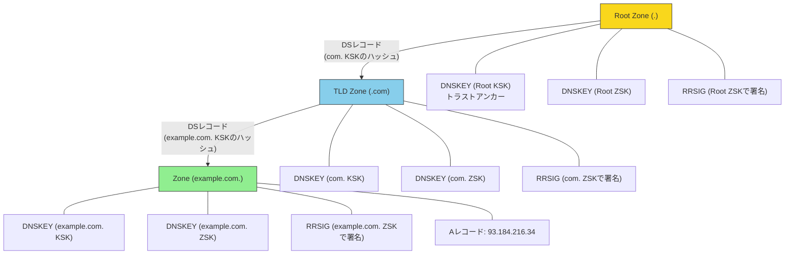

# DNSSEC — DNSの信頼性を支える署名と検証の仕組み

## 1. はじめに：DNSの信頼問題

**DNS（Domain Name System）**は、インターネットの根幹をなす仕組みである。ドメイン名（例：`example.com`）をIPアドレス（例：`93.184.216.34`）に変換する、いわば「インターネットの電話帳」として機能している。

しかし、DNSは1983年に設計された当時、セキュリティはほとんど考慮されていなかった。DNSの応答は**認証も暗号化もされておらず**、攻撃者が応答を偽造することが原理的に可能である。この問題は、インターネットの利用が拡大するにつれて深刻な脅威となった。

**DNSSEC（DNS Security Extensions）**は、この問題に対処するためにDNS応答にデジタル署名を付加し、応答の**真正性**と**完全性**を検証可能にする拡張仕様である。

## 2. DNSの基本的な名前解決の流れ

DNSSECの仕組みを理解するために、まずDNSの通常の名前解決の流れを確認する。

```
ユーザー         スタブリゾルバ        フルリゾルバ        ルートDNS       .com TLD DNS     example.com DNS
  |                  |                   |                  |                |                |
  |-- example.com? ->|                   |                  |                |                |
  |                  |-- example.com? -->|                  |                |                |
  |                  |                   |-- .com は? ----->|                |                |
  |                  |                   |<-- .com NS ------+                |                |
  |                  |                   |-- example.com? ------------------>|                |
  |                  |                   |<-- example.com NS ---------------+                |
  |                  |                   |-- example.com A? -------------------------------->|
  |                  |                   |<-- 93.184.216.34 --------------------------------+
  |                  |<-- 93.184.216.34 -|                  |                |                |
  |<- 93.184.216.34 -|                   |                  |                |                |
```

この流れにおいて、フルリゾルバ（再帰リゾルバ、キャッシュDNSサーバーとも呼ばれる）は、ルートDNSサーバーから順に階層を辿り、最終的に権威DNSサーバーから回答を得る。フルリゾルバは取得した結果をキャッシュし、同じ問い合わせの高速化を図る。

ここでの根本的な問題は、**DNSの応答が平文のUDPパケットで送信されるため、改ざん・偽造が容易**であることだ。

## 3. DNSの脆弱性

### 3.1 DNSキャッシュポイズニング

**DNSキャッシュポイズニング**は、フルリゾルバのキャッシュに偽のDNSレコードを注入する攻撃である。攻撃が成功すると、そのリゾルバを利用するすべてのユーザーが偽のIPアドレスに誘導される。

基本的な攻撃の流れ：

1. 攻撃者はフルリゾルバに対して特定のドメインの問い合わせを発生させる
2. フルリゾルバが権威DNSサーバーに問い合わせを行う
3. 正規の応答が返ってくる前に、攻撃者が偽の応答をフルリゾルバに送信する
4. 偽の応答がキャッシュに格納され、以降のユーザーが偽のIPアドレスに誘導される

攻撃が成功するためには、偽の応答が正規の応答より先に到着し、かつ以下のパラメータが一致している必要がある：

- 問い合わせのトランザクションID（16ビット）
- 送信元ポート番号
- 問い合わせドメイン名

### 3.2 Kaminsky攻撃（2008年）

2008年にDan Kaminskyが発見した攻撃手法は、DNSキャッシュポイズニングの実用性を飛躍的に高めるものであった。

従来のキャッシュポイズニングには大きな制約があった。一度キャッシュされたレコードは、TTL（Time to Live）が切れるまで再度問い合わせが行われないため、攻撃の試行回数が極めて限定されていた。

Kaminsky攻撃はこの制約を巧妙に回避する：

```
攻撃者                      フルリゾルバ               権威DNS (example.com)
  |                             |                          |
  |-- aaa.example.com? -------->|                          |
  |                             |-- aaa.example.com? ----->|
  |-- 偽応答（NS: evil.com）-->|                          |
  |   (トランザクションID推測) |                          |
  |                             |                          |
  |  失敗した場合...            |                          |
  |                             |                          |
  |-- bbb.example.com? -------->|                          |
  |                             |-- bbb.example.com? ----->|
  |-- 偽応答（NS: evil.com）-->|                          |
  |   (トランザクションID推測) |                          |
  |                             |                          |
  |  ... 成功するまで繰り返す  |                          |
```

攻撃のポイント：

1. **存在しないサブドメイン**（`aaa.example.com`、`bbb.example.com`...）を問い合わせる。これらはキャッシュに存在しないため、毎回権威DNSサーバーへの問い合わせが発生する
2. 偽の応答の**Authority Section**に `example.com` のNSレコードとして攻撃者のサーバーを指定する
3. 成功すれば、`example.com` ドメイン全体の名前解決が攻撃者のサーバーに委譲される
4. 失敗しても、別のサブドメインで即座に再試行できる（TTLの制約を受けない）

トランザクションIDが16ビット（0〜65535）であるため、数秒間に数千パケットを送信すれば、高い確率で攻撃が成功する。

### 3.3 Kaminsky攻撃への緊急対応

Kaminsky攻撃の発表を受けて、以下の緊急対策が講じられた：

- **ソースポートランダム化**：問い合わせのソースポートをランダム化することで、攻撃者が推測すべきパラメータを増やす（16ビット + 16ビット = 32ビットのエントロピー）
- **0x20エンコーディング**：問い合わせドメイン名の大文字・小文字をランダムに混ぜ、応答に同じパターンが含まれていることを確認する（例：`eXaMpLe.CoM`）

しかし、これらは本質的な解決ではない。十分な帯域を持つ攻撃者には依然として有効な攻撃であり、**DNSの応答自体を認証する仕組み**が必要とされた。これがDNSSECの存在意義である。

## 4. DNSSECの概要

### 4.1 DNSSECとは

DNSSEC（DNS Security Extensions）は、DNS応答にデジタル署名を付加し、応答の**真正性（authenticity）**と**完全性（integrity）**を検証可能にするDNSの拡張仕様である。

DNSSECは以下のRFCで定義されている：

- **RFC 4033**：DNSSECの概要と要件
- **RFC 4034**：DNSSECのリソースレコード
- **RFC 4035**：DNSSECのプロトコル変更

重要な点として、DNSSECは**暗号化を提供しない**。DNS応答の内容は依然として平文で送信される。DNSSECが保証するのは、「この応答は正しい権威DNSサーバーから発行され、途中で改ざんされていない」ということだけである。

### 4.2 DNSSECが提供するもの

| 特性 | 説明 |
|---|---|
| **データ発信源認証** | 応答が正しい権威DNSサーバーから発信されたことを検証 |
| **データ完全性** | 応答が途中で改ざんされていないことを検証 |
| **認証された不在証明** | あるレコードが存在しないことを署名付きで証明 |

### 4.3 DNSSECが提供しないもの

| 特性 | 説明 |
|---|---|
| **機密性** | DNS問い合わせ・応答の暗号化は行わない |
| **DDoS防御** | DDoS攻撃からの保護は提供しない |
| **可用性** | DNSサービスの可用性は保証しない |

## 5. DNSSECのリソースレコード

DNSSECは4つの新しいリソースレコードタイプを導入する。

### 5.1 RRSIG（Resource Record Signature）

**RRSIG**レコードは、DNSのリソースレコードセット（RRset）に対するデジタル署名を格納する。同一名・同一タイプのリソースレコードの集合がRRsetであり、RRset単位で署名される。

```
example.com.  86400  IN  RRSIG  A 13 2 86400 (
                20260401000000  ; Signature Expiration (署名の有効期限)
                20260301000000  ; Signature Inception (署名の開始日時)
                12345           ; Key Tag (署名に使った鍵の識別子)
                example.com.    ; Signer's Name (署名者の名前)
                Base64EncodedSignature... )
```

RRSIGレコードの主要フィールド：

- **Type Covered**：署名対象のレコードタイプ（A、AAAA、MXなど）
- **Algorithm**：署名アルゴリズム（13 = ECDSA P-256 with SHA-256）
- **Labels**：署名対象の名前のラベル数
- **Original TTL**：元のTTL
- **Signature Expiration / Inception**：署名の有効期間
- **Key Tag**：対応するDNSKEYの識別子
- **Signer's Name**：署名したゾーンの名前
- **Signature**：デジタル署名本体

### 5.2 DNSKEY（DNS Public Key）

**DNSKEY**レコードは、ゾーンの公開鍵を格納する。RRSIGの署名を検証するために使用される。

```
example.com.  86400  IN  DNSKEY  257 3 13 (
                Base64EncodedPublicKey... )
```

DNSKEYレコードのフラグ：

- **256**：Zone Signing Key（ZSK）
- **257**：Key Signing Key（KSK）— Secure Entry Point (SEP) フラグが立っている

### 5.3 DS（Delegation Signer）

**DS**レコードは、子ゾーンのDNSKEY（KSK）のハッシュであり、親ゾーンに配置される。親ゾーンと子ゾーンの間の信頼の連鎖を確立する。

```
example.com.  86400  IN  DS  12345 13 2 (
                E1B2C3D4... )
```

DSレコードのフィールド：

- **Key Tag**：対応するDNSKEYの識別子
- **Algorithm**：DNSKEYのアルゴリズム
- **Digest Type**：ハッシュアルゴリズム（2 = SHA-256）
- **Digest**：DNSKEYのハッシュ値

### 5.4 NSEC / NSEC3（Next Secure）

**NSEC**および**NSEC3**レコードは、特定のDNS名やレコードタイプが**存在しない**ことを証明するために使用される。詳細は第8節で解説する。

## 6. 信頼の連鎖（Chain of Trust）

### 6.1 信頼の連鎖の仕組み

DNSSECの中核的な概念は**信頼の連鎖（Chain of Trust）**である。これはDNSの階層構造に沿って、ルートゾーンからターゲットドメインまで、署名と鍵の検証を連鎖的に行う仕組みである。



### 6.2 検証の流れ

`example.com` のAレコードをDNSSECで検証する流れを詳細に見る。

**ステップ1：ルートゾーンのトラストアンカー**

フルリゾルバは、ルートゾーンのKSK（Key Signing Key）の公開鍵を**トラストアンカー**として事前に保持している。これがすべての検証の起点となる。

```
. (ルートゾーン)
  ├── DNSKEY (KSK): ルートの鍵署名鍵 ← トラストアンカー（事前に信頼）
  ├── DNSKEY (ZSK): ルートのゾーン署名鍵
  ├── RRSIG: DNSKEYセットに対する署名（KSKで署名）
  └── DS (com.): .com ゾーンのKSKハッシュ + RRSIG（ZSKで署名）
```

**ステップ2：.comゾーンの検証**

1. ルートゾーンから `.com` のDSレコードを取得する
2. DSレコードのRRSIGをルートのZSKで検証する
3. `.com` ゾーンのDNSKEYを取得する
4. DSレコードのハッシュと `.com` のKSKが一致することを確認する
5. `.com` のDNSKEYセットのRRSIGを `.com` のKSKで検証する

**ステップ3：example.comゾーンの検証**

1. `.com` ゾーンから `example.com` のDSレコードを取得する
2. DSレコードのRRSIGを `.com` のZSKで検証する
3. `example.com` ゾーンのDNSKEYを取得する
4. DSレコードのハッシュと `example.com` のKSKが一致することを確認する
5. `example.com` のDNSKEYセットのRRSIGを `example.com` のKSKで検証する

**ステップ4：Aレコードの検証**

1. `example.com` のAレコードとそのRRSIGを取得する
2. RRSIGを `example.com` のZSKで検証する
3. 署名が有効であれば、Aレコードの値が改ざんされていないことが保証される

### 6.3 トラストアンカー

DNSSECの信頼の出発点は**ルートゾーンのKSK**である。このKSKの公開鍵は、フルリゾルバに事前にインストールされる**トラストアンカー**として機能する。

現在のルートゾーンKSKは2017年に生成されたRSA 2048ビット鍵である（Key Tag: 20326）。この鍵は**RFC 7958**に基づいてIANA（Internet Assigned Numbers Authority）が管理しており、ICANNが主催する厳格なセレモニーに基づいて運用されている。

トラストアンカーの自動更新は**RFC 5011**で規定されている。リゾルバは一定期間ごとにルートゾーンのDNSKEYセットを確認し、新しいトラストアンカーが公開された場合には一定の保留期間を経て自動的に更新する。

## 7. KSK（鍵署名鍵）とZSK（ゾーン署名鍵）

### 7.1 鍵の役割分担

DNSSECでは各ゾーンに2種類の鍵ペアが存在する。

| 鍵 | 正式名称 | 役割 | 特徴 |
|---|---|---|---|
| **KSK** | Key Signing Key | DNSKEYセット（自身を含む）に署名 | 長期運用、強い鍵長、DSレコードで親ゾーンと連携 |
| **ZSK** | Zone Signing Key | ゾーン内のすべてのRRsetに署名 | 短期運用、軽量な鍵長、頻繁にローテーション |

なぜ2種類に分けるのか？理由は**運用上の利便性**にある：

1. **KSKの変更には親ゾーンとの連携が必要**：KSKを変更するたびに、親ゾーンのDSレコードを更新してもらう必要がある。これは手動プロセスを伴うことが多く、頻繁には行えない
2. **ZSKの変更はゾーン内で完結**：ZSKの変更は親ゾーンに影響しないため、頻繁にローテーションできる
3. **署名頻度の違い**：ZSKはゾーン内の全レコードに署名するため、署名操作が頻繁に発生する。短い鍵を使うことで計算コストを抑えられる

```
KSK（長期・強固）               ZSK（短期・軽量）
       │                              │
       ↓                              ↓
  DNSKEYセットに署名            ゾーン内の全RRsetに署名
       │                              │
       ↓                              ↓
  親ゾーンのDSと対応            ゾーン内で完結
```

### 7.2 鍵のアルゴリズム

現在DNSSECで使用される主なアルゴリズム：

| アルゴリズム番号 | 名称 | 状態 |
|---|---|---|
| 8 | RSA/SHA-256 | 広く使用されている |
| 13 | ECDSA Curve P-256 with SHA-256 | 推奨。署名・鍵が小さい |
| 15 | Ed25519 | 推奨。高速で署名が小さい |

RSA/SHA-1（アルゴリズム5）はSHA-1の脆弱性のため非推奨となっている。ECDSA（アルゴリズム13）やEd25519（アルゴリズム15）は、署名と鍵のサイズが小さく、DNS応答のサイズ増大を抑えられるため推奨されている。

### 7.3 鍵のローテーション（Key Rollover）

暗号鍵は定期的に交換（ローテーション）する必要がある。鍵が長期間使用されると、漏洩のリスクが増大し、暗号解読の機会を与えることになるためである。

#### ZSKのローテーション

ZSKのローテーションは比較的単純であり、以下の2つの方式が一般的に用いられる。

**Pre-Publication方式**：

1. 新しいZSK公開鍵を事前にDNSKEYセットに追加・公開する
2. 旧ZSKのDNSKEYのキャッシュが世界中で期限切れになるのを待つ
3. 新しいZSKでゾーンの再署名を行う
4. 旧ZSKの署名のキャッシュが期限切れになるのを待つ
5. 旧ZSK公開鍵をDNSKEYセットから削除する

**Double-Signature方式**：

1. 新しいZSKを生成し、DNSKEYセットに追加する
2. ゾーン内の全RRsetを新旧両方のZSKで署名する
3. 旧データのキャッシュが期限切れになるのを待つ
4. 旧ZSKとその署名を削除する

#### KSKのローテーション

KSKのローテーションは親ゾーンとの連携が必要なため、より複雑である。

**Double-DS方式**：

1. 新しいKSKを生成し、DNSKEYセットに追加する
2. 新旧両方のKSKに対応するDSレコードを親ゾーンに登録する
3. 旧DSのキャッシュが期限切れになるのを待つ
4. 旧KSKをDNSKEYセットから削除し、旧DSを親ゾーンから削除する

**Double-KSK方式**：

1. 新しいKSKを生成し、DNSKEYセットに追加する（新旧両方のKSKで署名）
2. 親ゾーンのDSレコードを新しいKSKのハッシュに更新する
3. 旧DSのキャッシュが期限切れになるのを待つ
4. 旧KSKをDNSKEYセットから削除する

#### ルートゾーンのKSKローテーション

2018年10月に行われたルートゾーンのKSKローテーションは、インターネットの歴史において極めて重要なイベントであった。旧鍵（Key Tag: 19036）から新鍵（Key Tag: 20326）への移行は、RFC 5011の自動更新メカニズムを利用して実施された。

当初2017年10月に予定されていたが、多くのリゾルバが新しいトラストアンカーを認識していないことが判明し、1年延期された。この経験は、大規模なインターネットインフラストラクチャの変更がいかに困難であるかを示している。

## 8. 認証された不在証明（Authenticated Denial of Existence）

### 8.1 問題の背景

DNSSECでは、レコードが「存在する」場合は署名で証明できる。しかし、レコードが「存在しない」ことをどう証明するか？

例えば、`nonexistent.example.com` が存在しないという応答（NXDOMAIN）に対して、攻撃者がこの応答を偽造する可能性がある。DNSSECはこの「不在」も認証しなければならない。

しかし、存在しないすべてのドメイン名に対して事前に署名を生成することは不可能である（ドメイン名の組み合わせは事実上無限）。

### 8.2 NSEC（Next Secure）

**NSEC**レコードは、ゾーン内のドメイン名を辞書順にソートし、「隣接する2つの名前の間には他の名前が存在しない」ことを証明する方式である。

例えば、ゾーン内に以下の名前が存在するとする：

```
alpha.example.com.
beta.example.com.
delta.example.com.
```

この場合、以下のNSECレコードが生成される：

```
alpha.example.com.  NSEC  beta.example.com.   A RRSIG NSEC
beta.example.com.   NSEC  delta.example.com.  A MX RRSIG NSEC
delta.example.com.  NSEC  alpha.example.com.  A AAAA RRSIG NSEC
```

`charlie.example.com` の問い合わせに対しては、`beta.example.com → delta.example.com` のNSECレコードが返される。`charlie` は辞書順で `beta` と `delta` の間にあるため、このNSECレコードにより `charlie.example.com` が存在しないことが証明される。

各NSECレコードにはRRSIGが付与されるため、この不在証明も検証可能である。

#### NSECの問題：ゾーン列挙（Zone Enumeration）

NSECには重大な問題がある。NSECレコードを順にたどることで、ゾーン内のすべてのドメイン名を列挙できてしまう。

```
1. alpha.example.com のNSECを取得 → 次は beta.example.com
2. beta.example.com のNSECを取得 → 次は delta.example.com
3. delta.example.com のNSECを取得 → 次は alpha.example.com（ループ終了）
```

これにより、ゾーン内のすべてのドメイン名が攻撃者に暴露される。多くの組織はこれをセキュリティ上の懸念と見なした（内部システムの名前、開発環境のサブドメインなどが露出する）。

### 8.3 NSEC3（Next Secure version 3）

**NSEC3**（RFC 5155）は、NSECのゾーン列挙問題を解決するために設計された。ドメイン名そのものではなく、ドメイン名の**ハッシュ値**を使用する。

```
NSEC3のレコード例：

H(alpha.example.com) = A1B2C3...
H(beta.example.com)  = D4E5F6...
H(delta.example.com) = G7H8I9...

ハッシュ値をソート：
A1B2C3... → D4E5F6... → G7H8I9... → A1B2C3...

NSEC3レコード：
A1B2C3...  NSEC3  D4E5F6...
D4E5F6...  NSEC3  G7H8I9...
G7H8I9...  NSEC3  A1B2C3...
```

`nonexistent.example.com` の問い合わせに対しては、`H(nonexistent.example.com)` を計算し、そのハッシュ値が含まれるNSEC3の範囲を返す。

NSEC3はドメイン名を直接公開しないため、ゾーン列挙を**困難に**する。ただし、辞書攻撃により一般的なドメイン名のハッシュを事前計算することは可能であるため、完全な防御ではない。

NSEC3のパラメータには**イテレーション回数**と**ソルト**があり、辞書攻撃のコストを増大させることができる。しかし、イテレーション回数が多いとDNSサーバーの計算負荷も増大するため、RFC 9276ではイテレーション回数を0、ソルトを空にすることが推奨されている。

### 8.4 NSEC3のオプトアウト

NSEC3には**オプトアウト**機能がある。これは、DNSSECに対応していない委任（unsigned delegation）をNSEC3チェーンから除外できる仕組みである。

大規模なTLDゾーン（.comなど）では、多くのドメインがDNSSECに対応していない。オプトアウトにより、これらの未署名の委任に対するNSEC3レコードの生成が不要となり、ゾーンファイルのサイズとゾーン署名のコストを大幅に削減できる。

## 9. DNSSECの検証の実際

### 9.1 バリデーティングリゾルバ

DNSSECの検証を行うフルリゾルバを**バリデーティングリゾルバ**と呼ぶ。代表的な実装として以下がある：

- **BIND**：ISCが開発する歴史あるDNSサーバー
- **Unbound**：NLnet Labsが開発する検証に特化したリゾルバ
- **Knot Resolver**：CZ.NICが開発する最新のリゾルバ

### 9.2 検証結果のフラグ

バリデーティングリゾルバはDNS応答に以下のフラグを設定する：

- **AD（Authentic Data）フラグ**：応答がDNSSEC検証に成功したことを示す
- **CD（Checking Disabled）フラグ**：クライアントがDNSSEC検証を無効にすることを要求

スタブリゾルバ（エンドユーザーのOS上のリゾルバ）がDNSSEC検証を自ら行わない場合、フルリゾルバとの間の通信路を信頼する必要がある点に注意が必要である。

### 9.3 署名の有効期間と時刻同期

RRSIGには署名の有効期間（inception / expiration）が含まれている。このため、DNSSECの検証にはリゾルバの時刻が正確である必要がある。時刻がずれていると、有効な署名が無効と判定されたり、期限切れの署名が有効と判定される危険性がある。

これは「DNSSECにはNTPが必要だが、NTPのサーバー名解決にDNSが必要」という循環依存の問題を生む。実際には、NTPサーバーのIPアドレスを直接設定することで回避される。

## 10. デプロイメントの課題

### 10.1 応答サイズの増大

DNSSECの署名と鍵のデータにより、DNS応答のサイズが大幅に増大する。通常のDNS応答は数百バイト程度であるが、DNSSEC対応の応答は数キロバイトに達することがある。

UDPの制約（従来の上限は512バイト）を超えるため、以下の対策が必要となる：

- **EDNS0（Extension Mechanisms for DNS）**：UDPのペイロードサイズを最大4096バイトまで拡張する
- **TCPフォールバック**：EDNS0でも収まらない場合はTCPで再送する

応答サイズの増大は**DNSアンプリフィケーション攻撃**のリスクも高める。攻撃者が偽の送信元アドレスで小さな問い合わせを送ると、DNSSEC対応の大きな応答が被害者に送信される。

### 10.2 運用の複雑さ

DNSSECの運用は複雑であり、以下のタスクが継続的に必要となる：

- 鍵のローテーション管理
- 署名の定期的な再生成（署名には有効期限がある）
- 親ゾーンとのDS レコードの同期
- 鍵の安全な保管

署名の有効期限が切れた場合や、鍵のローテーションに失敗した場合、ドメインが名前解決不能になるという深刻な障害を引き起こす。これは**DNSSEC運用のパラドックス**とも呼ばれる——セキュリティを向上させるための仕組みが、運用ミスにより可用性を低下させる。

### 10.3 CDS/CDNSKEYレコードによる自動化

DNSSECの運用を簡素化するため、**CDS（Child DS）**および**CDNSKEY（Child DNSKEY）**レコード（RFC 7344、RFC 8078）が導入された。これらにより、子ゾーンが親ゾーンに対してDSレコードの追加・更新・削除を自動的にリクエストできる。

```
子ゾーン                          親ゾーン
    |                                |
    |-- CDSレコードを公開 ---------->|
    |                                |-- CDSを検証
    |                                |-- DSレコードを自動更新
    |                                |
```

### 10.4 マルチサイナー（Multi-Signer）

複数のDNSプロバイダーでDNSSECを運用する場合、鍵の管理が複雑になる。**RFC 8901（Multi-Signer DNSSEC Models）**はこの問題に対する2つのモデルを定義している：

- **モデル1**：各プロバイダーが独自のZSKを持ち、すべてのDNSKEYをゾーンで公開する
- **モデル2**：プロバイダー間で鍵を共有する

## 11. DNS over HTTPS（DoH）/ DNS over TLS（DoT）との比較

### 11.1 解決する問題の違い

DNSSEC、DoH、DoTは、DNSの異なるセキュリティ上の問題を解決するものであり、**競合ではなく補完関係**にある。

```
                        DNSSEC              DoH / DoT
 ─────────────────────────────────────────────────────────
 保護対象              データの真正性       通信路の機密性
 保護範囲              エンドツーエンド      ラストマイル
                       (権威DNS→リゾルバ→   (クライアント→
                        クライアント)        リゾルバ)
 暗号化                なし                 あり
 認証                  あり（署名）         あり（TLS証明書）
 不在証明              あり                 なし
 改ざん検出            全経路               ラストマイルのみ
 プライバシー保護      なし                 あり
 ─────────────────────────────────────────────────────────
```

### 11.2 DNS over TLS（DoT）

**DoT**（RFC 7858）は、DNSの問い合わせと応答をTLSで暗号化するプロトコルである。

- **ポート853**を使用する
- クライアント（スタブリゾルバ）とフルリゾルバの間の通信を暗号化する
- ISPやネットワーク管理者によるDNSの盗聴・改ざんを防ぐ

DoTの制約：

- 専用ポート（853）を使用するため、ネットワーク管理者によるブロックが容易
- フルリゾルバから権威DNSサーバーへの通信は保護されない

### 11.3 DNS over HTTPS（DoH）

**DoH**（RFC 8484）は、DNSの問い合わせと応答をHTTPSで送信するプロトコルである。

- **ポート443**（通常のHTTPS）を使用する
- DNSトラフィックが通常のHTTPSトラフィックと区別できないため、ブロックが困難
- Webブラウザに直接組み込まれている（Firefox、Chrome）

DoHに対する批判：

- **ネットワーク管理の困難化**：企業やISPがDNSベースのフィルタリング・監視を行えなくなる
- **中央集権化のリスク**：少数のDoHプロバイダー（Cloudflare、Google）にDNSクエリが集中する
- **診断の困難さ**：従来のネットワーク診断ツールでDNS問い合わせを確認できない

### 11.4 理想的な組み合わせ

最も包括的なDNSセキュリティは、DNSSECとDoH/DoTを組み合わせることで実現される：

```
権威DNS  ──── DNSSEC署名 ────→  フルリゾルバ  ──── DoH/DoT ────→  クライアント
  │                                │                                  │
  │ DNSSECが保証：                │ DNSSEC検証：                     │ DoH/DoTが保証：
  │ - データの真正性              │ - 署名を検証                     │ - 通信路の暗号化
  │ - データの完全性              │ - ADフラグを設定                 │ - 盗聴・改ざん防止
  │                                │                                  │ - プライバシー保護
```

- **DNSSEC**：DNS応答が正しい権威サーバーから発信され、改ざんされていないことを保証
- **DoH/DoT**：クライアントとリゾルバ間の通信を暗号化し、プライバシーを保護

## 12. 現実世界での普及状況

### 12.1 署名されたゾーンの割合

DNSSECの普及は地域やTLDによって大きな差がある。

ルートゾーンは2010年にDNSSECが導入された。主要なTLDの対応状況：

- **対応済みのTLD**：.com、.net、.org、.jp、.de、.nl、.se、.br など多数
- **.comゾーン内のドメイン**：DNSSEC署名率は依然として低く、全体の数パーセント程度にとどまる

### 12.2 バリデーション実施率

APNICの統計によると、DNSSECバリデーションを実施するリゾルバの割合は年々増加している。世界全体でおよそ30〜40%程度のDNSクエリがDNSSEC検証を受けているとされるが、地域差が大きい。

- **高い普及率**：スウェーデン、チェコ、米国政府機関
- **低い普及率**：多くの発展途上国、多くの企業内ネットワーク

### 12.3 普及を阻む要因

DNSSECの普及が遅い主な理由：

1. **運用の複雑さ**：前述の通り、鍵管理、署名の更新、DSレコードの同期など、継続的な運用負荷が大きい
2. **障害リスク**：設定ミスや署名の期限切れがドメイン全体の名前解決不能につながる
3. **インセンティブの不足**：DoH/DoTの普及により「ラストマイル」のセキュリティが確保され、DNSSECの必要性が薄れたと認識されるケースがある
4. **CDNとの相性**：Cloudflareなどの大手CDNは独自のDNSSEC対応を提供しているが、複雑な構成では問題が生じることがある
5. **レジストラのサポート不足**：一部のレジストラがDSレコードの管理インターフェースを提供していない

### 12.4 成功事例

一方で、いくつかの分野ではDNSSECが効果的に活用されている：

- **金融機関**：規制要件としてDNSSECを導入するケースが増加
- **政府機関**：米国政府はOMB Memorandum M-08-23でDNSSECの導入を義務化した（.govドメイン）
- **DANE（DNS-Based Authentication of Named Entities）**：DNSSECを活用してTLS証明書をDNSで配布する仕組み（RFC 6698）。PKIのCA信頼モデルへの依存を減らす
- **メールセキュリティ**：DANE-TAやMTA-STSと組み合わせて、メールサーバー間の通信を保護する

## 13. DANE（DNS-Based Authentication of Named Entities）

DNSSECの重要な応用として**DANE**がある。DANEは**TLSAレコード**を使用して、ドメインのTLS証明書情報をDNSで公開する。

```
_443._tcp.example.com.  IN  TLSA  3 1 1 (
    ABC123DEF456... )
```

TLSAレコードのフィールド：

- **Certificate Usage**：3 = Domain-issued certificate（ドメイン独自の証明書）
- **Selector**：1 = 公開鍵のみ
- **Matching Type**：1 = SHA-256ハッシュ

DANEにより、ドメイン所有者はCA（認証局）を介さずに自分のTLS証明書を宣言できる。これはPKIの信頼モデルにおけるCA依存を減らし、認証局の不正行為リスクを低減する。

ただし、DANEはDNSSECが前提であるため、DNSSEC自体の普及率が低い現状ではDANEの普及も限定的である。メールサーバー間のTLS（SMTP DANE）は比較的採用が進んでいる。

## 14. 今後の展望

### 14.1 運用の自動化

DNSSECの最大の障壁である運用の複雑さを解消するための取り組みが進んでいる：

- **CDS/CDNSKEYの普及**：親ゾーンとのDS同期の自動化
- **マネージドDNSSEC**：クラウドDNSサービス（Cloudflare、AWS Route 53、Google Cloud DNS）がDNSSEC運用を完全に代行
- **自動鍵ローテーション**：BIND 9.16以降のインラインサイニングとDNSSECポリシーにより、鍵管理が大幅に自動化

### 14.2 ポスト量子DNSSECの課題

現在DNSSECで使用されているRSAやECDSAの署名アルゴリズムは、量子コンピューターの発展により将来的に安全でなくなる可能性がある。ポスト量子署名アルゴリズムへの移行が検討されているが、最大の課題は**署名サイズの増大**である。

例えば、ML-DSA-65（旧Dilithium3）の署名は約3,309バイトであり、ECDSA P-256の64バイトと比較して50倍以上大きい。DNS応答サイズの大幅な増大は、UDPでの送受信の制約やアンプリフィケーション攻撃のリスクをさらに深刻化させる。

### 14.3 DNSSECの位置づけ

DNSSECは、インターネットの信頼基盤を強化するための重要な技術であり続けている。DoH/DoTの普及により「暗号化」の側面はカバーされつつあるが、DNS応答の**真正性の検証**と**不在証明**はDNSSECでしか実現できない。

## 15. まとめ

DNSSECは、DNSの根本的な脆弱性——応答の偽造が可能であるという問題——に対する本質的な解決策である。

核心的なポイントを整理する：

- **DNSは設計上、応答の認証機構を持たない**。Kaminsky攻撃はこの脆弱性の深刻さを世界に示した
- **DNSSECはデジタル署名によりDNS応答の真正性と完全性を保証する**。ただし暗号化は提供しない
- **信頼の連鎖**がルートゾーンのトラストアンカーからターゲットドメインまでを結ぶ。KSKとZSKの分離により運用効率を確保している
- **NSEC/NSEC3**により、レコードが存在しないことも認証可能である
- **DoH/DoTとは補完関係**にある。DNSSECがデータの真正性を、DoH/DoTが通信路のプライバシーを保護する
- **運用の複雑さ**がDNSSECの最大の課題であり、自動化ツールとマネージドサービスの発展がその解消に貢献している

DNSの安全性は、インターネット全体の安全性の基盤である。DNSSECはその基盤を支える重要な要素であり、DoH/DoTやDANEといった関連技術と組み合わせることで、より包括的なDNSセキュリティが実現される。
